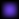

# System: Elace  
<details><summary>System data</summary>  

#### System Infocard data  
```  
Temperature zone data by main star:
* Mineral melting line: < 0.145 AU
* Hot zone   :   0.145 ... 0.374 AU
* Warm zone  :   0.374 ... 1.302 AU
* Temp. zone :   1.302 ... 1.841 AU
* Cold zone  :   1.841 ... 5.284 AU
* Frost line : > 5.284 AU
```  
```  
Дані температурного зонування відносно основної зірки:
* Межа плавлення мінералів: < 0.145 а.о.
* Гаряча зона  :   0.145 ... 0.374 а.о.
* Тепла зона   :   0.374 ... 1.302 а.о.
* Помірна зона :   1.302 ... 1.841 а.о.
* Холодна зона :   1.841 ... 2.813 а.о.
* Межа кригоутворення : > 5.284 а.о.
```  
#### GODOT data  
```  
* System ID: 0
* Star cluster: unspecified
* System zone codename: STAR_0_SYSTEM_ZONE
* System codename: STAR_0_SYSTEM
* System translation name codename: NAME_STAR_0_SYSTEM
* System translation description codename: DESC_STAR_0_SYSTEM
* System name: Elace
* System description: see above. Optionally add lore.
* System zone size: 1.83e+13
* System autopilot range: 1.83e+13
```

 </details>  

---  
<details><summary>Primary star : Elace A, type: F3</summary>  

#### Star pseudo-color  
  
#### Star Infocard data  
```  
Absolute units:
* Size: 1.82e+09 m
* Mass: 2.52e+30 kg
* Temperature: 6904 K
* Luminosity: 1.33e+27 W

Sun-relative units:
* Size: 1.306 D
* Mass: 1.266 M
* Temperature: 1.2 T
* Luminosity: 3.49 L

Spectral data:
* Type: F3
* Peak wavelength: 420.0 nm
* Peak wavelength type: visible

```  
```  
Абсолютні величини:
* Розмір: 1.82e+09 м
* Маса: 2.52e+30 кг
* Температура: 6904 К
* Світність: 1.33e+27 Вт

Величини відносно Сонця:
* Розмір: 1.306 D
* Маса: 1.266 M
* Температура: 1.2 T
* Світність: 3.49 L

Спектральні дані:
* Тип: F3
* Пікова довжина хвилі: 420.0 нм
* Тип пікового випромінювання: visible

```  
#### GODOT data  
```  
* Star zone codename: STAR_0_ZONE
* Star codename: STAR_0
* Star translation name codename: NAME_STAR_0
* Star translation description codename: DESC_STAR_0
* Star name: Elace A
* Star description: see above.
* Star zone size: 9.10e+10
* Star death zone size: 1.19e+10
* Star size: 1.82e+09
* Star flare distance: 9.10e+10
* Star autopilot range: 2.39e+10

* Omni range: 1.83e+13
* Omni attenuation: 10.0
* Omni energy: 2.0
* Surface color (Peak w.l. color code):
 - rgb: (180, 255, 0)
 - hex: #b4ff00
```  

 </details>  

---  
<details><summary>Planet Elace a (icy terrestrial planet)</summary>  

#### Planet albedo  
WIP  
#### Planet Infocard data  
```  
Planet type: icy terrestrial planet

Absolute units:
* Size: 7.66e+06 m
* Mass: 9.67e+23 kg
* Temperature: 214.44 K
* Orbit semi-major axis: 9.41e+11 m

Earth-relative units:
* Size: 0.601 D
* Mass: 0.1619 M
* Temperature: -58.71 C
* Orbit semi-major axis: 6.292 AU

```  
```  
Тип планети: льодяна землеподібна планета

Абсолютні величини:
* Розмір: 7.66e+06 м
* Маса: 9.67e+23 кг
* Температура: 214.44 К
* Велика піввісь орбіти: 9.41e+11 м

Величини відносно Землі:
* Розмір: 0.601 D
* Маса: 0.1619 M
* Температура: -58.71 C
* Велика піввісь орбіти: 6.292 а.о.

```  
#### GODOT data  
```  
* Planet zone codename: STAR_0_PLANET_0_ZONE
* Planet codename: STAR_0_PLANET_0
* Planet translation name codename: NAME_STAR_0_PLANET_0
* Planet translation description codename: DESC_STAR_0_PLANET_0
* Planet name: Elace a
* Planet description: see above.
* Planet zone size: 1.53e+08
* Planet death zone size: 8.04e+06
* Planet size: 7.66e+06
* Planet autopilot range: 1.61e+07
* Planet semi-major axis: 9.41e+11

* Surface color (albedo):
 - rgb: WIP
 - hex: #WIP
```  

 </details>  

---  
<details><summary>Planet Elace b (icy large giant planet)</summary>  

#### Planet albedo  
WIP  
#### Planet Infocard data  
```  
Planet type: icy large giant planet

Absolute units:
* Size: 1.47e+08 m
* Mass: 3.95e+27 kg
* Temperature: 185.94 K
* Orbit semi-major axis: 1.25e+12 m

Earth-relative units:
* Size: 11.508 D
* Mass: 661.50114 M
* Temperature: -87.21 C
* Orbit semi-major axis: 8.368 AU

```  
```  
Тип планети: льодяна планета великий гігант

Абсолютні величини:
* Розмір: 1.47e+08 м
* Маса: 3.95e+27 кг
* Температура: 185.94 К
* Велика піввісь орбіти: 1.25e+12 м

Величини відносно Землі:
* Розмір: 11.508 D
* Маса: 661.50114 M
* Температура: -87.21 C
* Велика піввісь орбіти: 8.368 а.о.

```  
#### GODOT data  
```  
* Planet zone codename: STAR_0_PLANET_1_ZONE
* Planet codename: STAR_0_PLANET_1
* Planet translation name codename: NAME_STAR_0_PLANET_1
* Planet translation description codename: DESC_STAR_0_PLANET_1
* Planet name: Elace b
* Planet description: see above.
* Planet zone size: 2.94e+09
* Planet death zone size: 1.54e+08
* Planet size: 1.47e+08
* Planet autopilot range: 3.08e+08
* Planet semi-major axis: 1.25e+12

* Surface color (albedo):
 - rgb: WIP
 - hex: #WIP
```  

 </details>  

---  
<details><summary>Planet Elace c (icy dwarf planet)</summary>  

#### Planet albedo  
WIP  
#### Planet Infocard data  
```  
Planet type: icy dwarf planet

Absolute units:
* Size: 9.87e+05 m
* Mass: 6.41e+20 kg
* Temperature: 161.23 K
* Orbit semi-major axis: 1.66e+12 m

Earth-relative units:
* Size: 0.077 D
* Mass: 0.00011 M
* Temperature: -111.92 C
* Orbit semi-major axis: 11.13 AU

```  
```  
Тип планети: льодяна карликова планета

Абсолютні величини:
* Розмір: 9.87e+05 м
* Маса: 6.41e+20 кг
* Температура: 161.23 К
* Велика піввісь орбіти: 1.66e+12 м

Величини відносно Землі:
* Розмір: 0.077 D
* Маса: 0.00011 M
* Температура: -111.92 C
* Велика піввісь орбіти: 11.13 а.о.

```  
#### GODOT data  
```  
* Planet zone codename: STAR_0_PLANET_2_ZONE
* Planet codename: STAR_0_PLANET_2
* Planet translation name codename: NAME_STAR_0_PLANET_2
* Planet translation description codename: DESC_STAR_0_PLANET_2
* Planet name: Elace c
* Planet description: see above.
* Planet zone size: 1.97e+07
* Planet death zone size: 1.04e+06
* Planet size: 9.87e+05
* Planet autopilot range: 2.07e+06
* Planet semi-major axis: 1.66e+12

* Surface color (albedo):
 - rgb: WIP
 - hex: #WIP
```  

 </details>  

---  
    

---  
# System: Cob  
<details><summary>System data</summary>  

#### System Infocard data  
```  
Temperature zone data by main star:
* Mineral melting line: < 0.019 AU
* Hot zone   :   0.019 ... 0.049 AU
* Warm zone  :   0.049 ... 0.17 AU
* Temp. zone :   0.17 ... 0.241 AU
* Cold zone  :   0.241 ... 0.691 AU
* Frost line : > 0.691 AU
```  
```  
Дані температурного зонування відносно основної зірки:
* Межа плавлення мінералів: < 0.019 а.о.
* Гаряча зона  :   0.019 ... 0.049 а.о.
* Тепла зона   :   0.049 ... 0.17 а.о.
* Помірна зона :   0.17 ... 0.241 а.о.
* Холодна зона :   0.241 ... 0.368 а.о.
* Межа кригоутворення : > 0.691 а.о.
```  
#### GODOT data  
```  
* System ID: 1
* Star cluster: unspecified
* System zone codename: STAR_1_SYSTEM_ZONE
* System codename: STAR_1_SYSTEM
* System translation name codename: NAME_STAR_1_SYSTEM
* System translation description codename: DESC_STAR_1_SYSTEM
* System name: Cob
* System description: see above. Optionally add lore.
* System zone size: 1.00e+13
* System autopilot range: 1.00e+13
```

 </details>  

---  
<details><summary>Primary star : Cob A, type: M1</summary>  

#### Star pseudo-color  
  
#### Star Infocard data  
```  
Absolute units:
* Size: 9.17e+08 m
* Mass: 7.89e+29 kg
* Temperature: 3512 K
* Luminosity: 2.28e+25 W

Sun-relative units:
* Size: 0.66 D
* Mass: 0.397 M
* Temperature: 0.61 T
* Luminosity: 0.06 L

Spectral data:
* Type: M1
* Peak wavelength: 825.0 nm
* Peak wavelength type: near IR

```  
```  
Абсолютні величини:
* Розмір: 9.17e+08 м
* Маса: 7.89e+29 кг
* Температура: 3512 К
* Світність: 2.28e+25 Вт

Величини відносно Сонця:
* Розмір: 0.66 D
* Маса: 0.397 M
* Температура: 0.61 T
* Світність: 0.06 L

Спектральні дані:
* Тип: M1
* Пікова довжина хвилі: 825.0 нм
* Тип пікового випромінювання: near IR

```  
#### GODOT data  
```  
* Star zone codename: STAR_1_ZONE
* Star codename: STAR_1
* Star translation name codename: NAME_STAR_1
* Star translation description codename: DESC_STAR_1
* Star name: Cob A
* Star description: see above.
* Star zone size: 4.58e+10
* Star death zone size: 1.56e+09
* Star size: 9.17e+08
* Star flare distance: 4.58e+10
* Star autopilot range: 3.12e+09

* Omni range: 2.39e+12
* Omni attenuation: 10.0
* Omni energy: 2.0
* Surface color (Peak w.l. color code):
 - rgb: (255, 37, 0)
 - hex: #ff2500
```  

 </details>  

---  
<details><summary>Planet Cob a (cold dwarf planet)</summary>  

#### Planet albedo  
WIP  
#### Planet Infocard data  
```  
Planet type: cold dwarf planet

Absolute units:
* Size: 1.17e+06 m
* Mass: 1.17e+21 kg
* Temperature: 289.83 K
* Orbit semi-major axis: 6.74e+10 m

Earth-relative units:
* Size: 0.092 D
* Mass: 0.0002 M
* Temperature: 16.68 C
* Orbit semi-major axis: 0.45 AU

```  
```  
Тип планети: холодна карликова планета

Абсолютні величини:
* Розмір: 1.17e+06 м
* Маса: 1.17e+21 кг
* Температура: 289.83 К
* Велика піввісь орбіти: 6.74e+10 м

Величини відносно Землі:
* Розмір: 0.092 D
* Маса: 0.0002 M
* Температура: 16.68 C
* Велика піввісь орбіти: 0.45 а.о.

```  
#### GODOT data  
```  
* Planet zone codename: STAR_1_PLANET_0_ZONE
* Planet codename: STAR_1_PLANET_0
* Planet translation name codename: NAME_STAR_1_PLANET_0
* Planet translation description codename: DESC_STAR_1_PLANET_0
* Planet name: Cob a
* Planet description: see above.
* Planet zone size: 2.34e+07
* Planet death zone size: 1.23e+06
* Planet size: 1.17e+06
* Planet autopilot range: 2.46e+06
* Planet semi-major axis: 6.74e+10

* Surface color (albedo):
 - rgb: WIP
 - hex: #WIP
```  

 </details>  

---  
<details><summary>Planet Cob b (cold small dwarf planet)</summary>  

#### Planet albedo  
WIP  
#### Planet Infocard data  
```  
Planet type: cold small dwarf planet

Absolute units:
* Size: 5.26e+05 m
* Mass: 6.75e+19 kg
* Temperature: 251.31 K
* Orbit semi-major axis: 8.96e+10 m

Earth-relative units:
* Size: 0.041 D
* Mass: 1e-05 M
* Temperature: -21.84 C
* Orbit semi-major axis: 0.599 AU

```  
```  
Тип планети: холодна мала карликова планета

Абсолютні величини:
* Розмір: 5.26e+05 м
* Маса: 6.75e+19 кг
* Температура: 251.31 К
* Велика піввісь орбіти: 8.96e+10 м

Величини відносно Землі:
* Розмір: 0.041 D
* Маса: 1e-05 M
* Температура: -21.84 C
* Велика піввісь орбіти: 0.599 а.о.

```  
#### GODOT data  
```  
* Planet zone codename: STAR_1_PLANET_1_ZONE
* Planet codename: STAR_1_PLANET_1
* Planet translation name codename: NAME_STAR_1_PLANET_1
* Planet translation description codename: DESC_STAR_1_PLANET_1
* Planet name: Cob b
* Planet description: see above.
* Planet zone size: 1.05e+07
* Planet death zone size: 5.52e+05
* Planet size: 5.26e+05
* Planet autopilot range: 1.10e+06
* Planet semi-major axis: 8.96e+10

* Surface color (albedo):
 - rgb: WIP
 - hex: #WIP
```  

 </details>  

---  
<details><summary>Planet Cob c (icy small terrestrial planet)</summary>  

#### Planet albedo  
WIP  
#### Planet Infocard data  
```  
Planet type: icy small terrestrial planet

Absolute units:
* Size: 2.79e+06 m
* Mass: 2.63e+22 kg
* Temperature: 217.92 K
* Orbit semi-major axis: 1.19e+11 m

Earth-relative units:
* Size: 0.219 D
* Mass: 0.00441 M
* Temperature: -55.23 C
* Orbit semi-major axis: 0.797 AU

```  
```  
Тип планети: льодяна мала землеподібна планета

Абсолютні величини:
* Розмір: 2.79e+06 м
* Маса: 2.63e+22 кг
* Температура: 217.92 К
* Велика піввісь орбіти: 1.19e+11 м

Величини відносно Землі:
* Розмір: 0.219 D
* Маса: 0.00441 M
* Температура: -55.23 C
* Велика піввісь орбіти: 0.797 а.о.

```  
#### GODOT data  
```  
* Planet zone codename: STAR_1_PLANET_2_ZONE
* Planet codename: STAR_1_PLANET_2
* Planet translation name codename: NAME_STAR_1_PLANET_2
* Planet translation description codename: DESC_STAR_1_PLANET_2
* Planet name: Cob c
* Planet description: see above.
* Planet zone size: 5.59e+07
* Planet death zone size: 2.93e+06
* Planet size: 2.79e+06
* Planet autopilot range: 5.87e+06
* Planet semi-major axis: 1.19e+11

* Surface color (albedo):
 - rgb: WIP
 - hex: #WIP
```  

 </details>  

---  
<details><summary>Planet Cob d (icy dwarf planet)</summary>  

#### Planet albedo  
WIP  
#### Planet Infocard data  
```  
Planet type: icy dwarf planet

Absolute units:
* Size: 9.09e+05 m
* Mass: 4.78e+20 kg
* Temperature: 188.96 K
* Orbit semi-major axis: 1.58e+11 m

Earth-relative units:
* Size: 0.071 D
* Mass: 8e-05 M
* Temperature: -84.19 C
* Orbit semi-major axis: 1.059 AU

```  
```  
Тип планети: льодяна карликова планета

Абсолютні величини:
* Розмір: 9.09e+05 м
* Маса: 4.78e+20 кг
* Температура: 188.96 К
* Велика піввісь орбіти: 1.58e+11 м

Величини відносно Землі:
* Розмір: 0.071 D
* Маса: 8e-05 M
* Температура: -84.19 C
* Велика піввісь орбіти: 1.059 а.о.

```  
#### GODOT data  
```  
* Planet zone codename: STAR_1_PLANET_3_ZONE
* Planet codename: STAR_1_PLANET_3
* Planet translation name codename: NAME_STAR_1_PLANET_3
* Planet translation description codename: DESC_STAR_1_PLANET_3
* Planet name: Cob d
* Planet description: see above.
* Planet zone size: 1.82e+07
* Planet death zone size: 9.54e+05
* Planet size: 9.09e+05
* Planet autopilot range: 1.91e+06
* Planet semi-major axis: 1.58e+11

* Surface color (albedo):
 - rgb: WIP
 - hex: #WIP
```  

 </details>  

---  
    

---  
# System: Iganpad  
<details><summary>System data</summary>  

#### System Infocard data  
```  
Temperature zone data by main star:
* Mineral melting line: < 0.08 AU
* Hot zone   :   0.08 ... 0.207 AU
* Warm zone  :   0.207 ... 0.721 AU
* Temp. zone :   0.721 ... 1.019 AU
* Cold zone  :   1.019 ... 2.924 AU
* Frost line : > 2.924 AU
```  
```  
Дані температурного зонування відносно основної зірки:
* Межа плавлення мінералів: < 0.08 а.о.
* Гаряча зона  :   0.08 ... 0.207 а.о.
* Тепла зона   :   0.207 ... 0.721 а.о.
* Помірна зона :   0.721 ... 1.019 а.о.
* Холодна зона :   1.019 ... 1.557 а.о.
* Межа кригоутворення : > 2.924 а.о.
```  
#### GODOT data  
```  
* System ID: 2
* Star cluster: unspecified
* System zone codename: STAR_2_SYSTEM_ZONE
* System codename: STAR_2_SYSTEM
* System translation name codename: NAME_STAR_2_SYSTEM
* System translation description codename: DESC_STAR_2_SYSTEM
* System name: Iganpad
* System description: see above. Optionally add lore.
* System zone size: 1.01e+13
* System autopilot range: 1.01e+13
```

 </details>  

---  
<details><summary>Primary star : Iganpad A, type: G5</summary>  

#### Star pseudo-color  
  
#### Star Infocard data  
```  
Absolute units:
* Size: 1.54e+09 m
* Mass: 1.78e+30 kg
* Temperature: 5574 K
* Luminosity: 4.09e+26 W

Sun-relative units:
* Size: 1.109 D
* Mass: 0.896 M
* Temperature: 0.97 T
* Luminosity: 1.07 L

Spectral data:
* Type: G5
* Peak wavelength: 520.0 nm
* Peak wavelength type: visible

```  
```  
Абсолютні величини:
* Розмір: 1.54e+09 м
* Маса: 1.78e+30 кг
* Температура: 5574 К
* Світність: 4.09e+26 Вт

Величини відносно Сонця:
* Розмір: 1.109 D
* Маса: 0.896 M
* Температура: 0.97 T
* Світність: 1.07 L

Спектральні дані:
* Тип: G5
* Пікова довжина хвилі: 520.0 нм
* Тип пікового випромінювання: visible

```  
#### GODOT data  
```  
* Star zone codename: STAR_2_ZONE
* Star codename: STAR_2
* Star translation name codename: NAME_STAR_2
* Star translation description codename: DESC_STAR_2
* Star name: Iganpad A
* Star description: see above.
* Star zone size: 7.70e+10
* Star death zone size: 6.61e+09
* Star size: 1.54e+09
* Star flare distance: 7.70e+10
* Star autopilot range: 1.32e+10

* Omni range: 1.01e+13
* Omni attenuation: 10.0
* Omni energy: 2.0
* Surface color (Peak w.l. color code):
 - rgb: (240, 255, 0)
 - hex: #f0ff00
```  

 </details>  

---  
<details><summary>Planet Iganpad a (very hot small dwarf planet)</summary>  

#### Planet albedo  
WIP  
#### Planet Infocard data  
```  
Planet type: very hot small dwarf planet

Absolute units:
* Size: 3.45e+05 m
* Mass: 1.50e+19 kg
* Temperature: 1302.96 K
* Orbit semi-major axis: 1.41e+10 m

Earth-relative units:
* Size: 0.027 D
* Mass: 0.0 M
* Temperature: 1029.81 C
* Orbit semi-major axis: 0.094 AU

```  
```  
Тип планети: дуже гаряча мала карликова планета

Абсолютні величини:
* Розмір: 3.45e+05 м
* Маса: 1.50e+19 кг
* Температура: 1302.96 К
* Велика піввісь орбіти: 1.41e+10 м

Величини відносно Землі:
* Розмір: 0.027 D
* Маса: 0.0 M
* Температура: 1029.81 C
* Велика піввісь орбіти: 0.094 а.о.

```  
#### GODOT data  
```  
* Planet zone codename: STAR_2_PLANET_0_ZONE
* Planet codename: STAR_2_PLANET_0
* Planet translation name codename: NAME_STAR_2_PLANET_0
* Planet translation description codename: DESC_STAR_2_PLANET_0
* Planet name: Iganpad a
* Planet description: see above.
* Planet zone size: 6.90e+06
* Planet death zone size: 3.62e+05
* Planet size: 3.45e+05
* Planet autopilot range: 7.24e+05
* Planet semi-major axis: 1.41e+10

* Surface color (albedo):
 - rgb: WIP
 - hex: #WIP
```  

 </details>  

---  
<details><summary>Planet Iganpad b (very hot large dwarf planet)</summary>  

#### Planet albedo  
WIP  
#### Planet Infocard data  
```  
Planet type: very hot large dwarf planet

Absolute units:
* Size: 2.14e+06 m
* Mass: 1.01e+22 kg
* Temperature: 921.33 K
* Orbit semi-major axis: 2.82e+10 m

Earth-relative units:
* Size: 0.168 D
* Mass: 0.00169 M
* Temperature: 648.18 C
* Orbit semi-major axis: 0.189 AU

```  
```  
Тип планети: дуже гаряча велика карликова планета

Абсолютні величини:
* Розмір: 2.14e+06 м
* Маса: 1.01e+22 кг
* Температура: 921.33 К
* Велика піввісь орбіти: 2.82e+10 м

Величини відносно Землі:
* Розмір: 0.168 D
* Маса: 0.00169 M
* Температура: 648.18 C
* Велика піввісь орбіти: 0.189 а.о.

```  
#### GODOT data  
```  
* Planet zone codename: STAR_2_PLANET_1_ZONE
* Planet codename: STAR_2_PLANET_1
* Planet translation name codename: NAME_STAR_2_PLANET_1
* Planet translation description codename: DESC_STAR_2_PLANET_1
* Planet name: Iganpad b
* Planet description: see above.
* Planet zone size: 4.27e+07
* Planet death zone size: 2.24e+06
* Planet size: 2.14e+06
* Planet autopilot range: 4.49e+06
* Planet semi-major axis: 2.82e+10

* Surface color (albedo):
 - rgb: WIP
 - hex: #WIP
```  

 </details>  

---  
<details><summary>Planet Iganpad c (hot large dwarf planet)</summary>  

#### Planet albedo  
WIP  
#### Planet Infocard data  
```  
Planet type: hot large dwarf planet

Absolute units:
* Size: 2.01e+06 m
* Mass: 8.17e+21 kg
* Temperature: 651.48 K
* Orbit semi-major axis: 5.64e+10 m

Earth-relative units:
* Size: 0.158 D
* Mass: 0.00137 M
* Temperature: 378.33 C
* Orbit semi-major axis: 0.377 AU

```  
```  
Тип планети: гаряча велика карликова планета

Абсолютні величини:
* Розмір: 2.01e+06 м
* Маса: 8.17e+21 кг
* Температура: 651.48 К
* Велика піввісь орбіти: 5.64e+10 м

Величини відносно Землі:
* Розмір: 0.158 D
* Маса: 0.00137 M
* Температура: 378.33 C
* Велика піввісь орбіти: 0.377 а.о.

```  
#### GODOT data  
```  
* Planet zone codename: STAR_2_PLANET_2_ZONE
* Planet codename: STAR_2_PLANET_2
* Planet translation name codename: NAME_STAR_2_PLANET_2
* Planet translation description codename: DESC_STAR_2_PLANET_2
* Planet name: Iganpad c
* Planet description: see above.
* Planet zone size: 4.03e+07
* Planet death zone size: 2.11e+06
* Planet size: 2.01e+06
* Planet autopilot range: 4.23e+06
* Planet semi-major axis: 5.64e+10

* Surface color (albedo):
 - rgb: WIP
 - hex: #WIP
```  

 </details>  

---  
<details><summary>Planet Iganpad d (warm large giant planet)</summary>  

#### Planet albedo  
WIP  
#### Planet Infocard data  
```  
Planet type: warm large giant planet

Absolute units:
* Size: 1.59e+08 m
* Mass: 3.97e+27 kg
* Temperature: 460.66 K
* Orbit semi-major axis: 1.13e+11 m

Earth-relative units:
* Size: 12.483 D
* Mass: 664.76883 M
* Temperature: 187.51 C
* Orbit semi-major axis: 0.754 AU

```  
```  
Тип планети: тепла планета великий гігант

Абсолютні величини:
* Розмір: 1.59e+08 м
* Маса: 3.97e+27 кг
* Температура: 460.66 К
* Велика піввісь орбіти: 1.13e+11 м

Величини відносно Землі:
* Розмір: 12.483 D
* Маса: 664.76883 M
* Температура: 187.51 C
* Велика піввісь орбіти: 0.754 а.о.

```  
#### GODOT data  
```  
* Planet zone codename: STAR_2_PLANET_3_ZONE
* Planet codename: STAR_2_PLANET_3
* Planet translation name codename: NAME_STAR_2_PLANET_3
* Planet translation description codename: DESC_STAR_2_PLANET_3
* Planet name: Iganpad d
* Planet description: see above.
* Planet zone size: 3.18e+09
* Planet death zone size: 1.67e+08
* Planet size: 1.59e+08
* Planet autopilot range: 3.34e+08
* Planet semi-major axis: 1.13e+11

* Surface color (albedo):
 - rgb: WIP
 - hex: #WIP
```  

 </details>  

---  
<details><summary>Planet Iganpad e (temperate )</summary>  

#### Planet albedo  
WIP  
#### Planet Infocard data  
```  
Planet type: temperate 

Absolute units:
* Size: 0.00e+00 m
* Mass: 0.00e+00 kg
* Temperature: 325.74 K
* Orbit semi-major axis: 2.26e+11 m

Earth-relative units:
* Size: 0.0 D
* Mass: 0.0 M
* Temperature: 52.59 C
* Orbit semi-major axis: 1.509 AU

```  
```  
Тип планети: помірна 

Абсолютні величини:
* Розмір: 0.00e+00 м
* Маса: 0.00e+00 кг
* Температура: 325.74 К
* Велика піввісь орбіти: 2.26e+11 м

Величини відносно Землі:
* Розмір: 0.0 D
* Маса: 0.0 M
* Температура: 52.59 C
* Велика піввісь орбіти: 1.509 а.о.

```  
#### GODOT data  
```  
* Planet zone codename: STAR_2_PLANET_4_ZONE
* Planet codename: STAR_2_PLANET_4
* Planet translation name codename: NAME_STAR_2_PLANET_4
* Planet translation description codename: DESC_STAR_2_PLANET_4
* Planet name: Iganpad e
* Planet description: see above.
* Planet zone size: 2.44e+08
* Planet death zone size: 1.28e+07
* Planet size: 0.00e+00
* Planet autopilot range: 2.56e+07
* Planet semi-major axis: 2.26e+11

* Surface color (albedo):
 - rgb: WIP
 - hex: #WIP
```  

 </details>  

---  
<details><summary>Planet Iganpad f (icy small giant planet)</summary>  

#### Planet albedo  
WIP  
#### Planet Infocard data  
```  
Planet type: icy small giant planet

Absolute units:
* Size: 1.75e+08 m
* Mass: 5.06e+26 kg
* Temperature: 230.33 K
* Orbit semi-major axis: 4.51e+11 m

Earth-relative units:
* Size: 13.733 D
* Mass: 84.80543 M
* Temperature: -42.82 C
* Orbit semi-major axis: 3.018 AU

```  
```  
Тип планети: льодяна планета малий гігант

Абсолютні величини:
* Розмір: 1.75e+08 м
* Маса: 5.06e+26 кг
* Температура: 230.33 К
* Велика піввісь орбіти: 4.51e+11 м

Величини відносно Землі:
* Розмір: 13.733 D
* Маса: 84.80543 M
* Температура: -42.82 C
* Велика піввісь орбіти: 3.018 а.о.

```  
#### GODOT data  
```  
* Planet zone codename: STAR_2_PLANET_5_ZONE
* Planet codename: STAR_2_PLANET_5
* Planet translation name codename: NAME_STAR_2_PLANET_5
* Planet translation description codename: DESC_STAR_2_PLANET_5
* Planet name: Iganpad f
* Planet description: see above.
* Planet zone size: 3.50e+09
* Planet death zone size: 1.84e+08
* Planet size: 1.75e+08
* Planet autopilot range: 3.68e+08
* Planet semi-major axis: 4.51e+11

* Surface color (albedo):
 - rgb: WIP
 - hex: #WIP
```  

 </details>  

---  
    

---  
# System: Niofi  
<details><summary>System data</summary>  

#### System Infocard data  
```  
Temperature zone data by main star:
* Mineral melting line: < 0.144 AU
* Hot zone   :   0.144 ... 0.371 AU
* Warm zone  :   0.371 ... 1.294 AU
* Temp. zone :   1.294 ... 1.83 AU
* Cold zone  :   1.83 ... 5.251 AU
* Frost line : > 5.251 AU
```  
```  
Дані температурного зонування відносно основної зірки:
* Межа плавлення мінералів: < 0.144 а.о.
* Гаряча зона  :   0.144 ... 0.371 а.о.
* Тепла зона   :   0.371 ... 1.294 а.о.
* Помірна зона :   1.294 ... 1.83 а.о.
* Холодна зона :   1.83 ... 2.795 а.о.
* Межа кригоутворення : > 5.251 а.о.
```  
#### GODOT data  
```  
* System ID: 3
* Star cluster: unspecified
* System zone codename: STAR_3_SYSTEM_ZONE
* System codename: STAR_3_SYSTEM
* System translation name codename: NAME_STAR_3_SYSTEM
* System translation description codename: DESC_STAR_3_SYSTEM
* System name: Niofi
* System description: see above. Optionally add lore.
* System zone size: 1.81e+13
* System autopilot range: 1.81e+13
```

 </details>  

---  
<details><summary>Primary star : Niofi A, type: F2</summary>  

#### Star pseudo-color  
  
#### Star Infocard data  
```  
Absolute units:
* Size: 1.66e+09 m
* Mass: 2.61e+30 kg
* Temperature: 7192 K
* Luminosity: 1.32e+27 W

Sun-relative units:
* Size: 1.196 D
* Mass: 1.314 M
* Temperature: 1.25 T
* Luminosity: 3.44 L

Spectral data:
* Type: F2
* Peak wavelength: 403.0 nm
* Peak wavelength type: visible

```  
```  
Абсолютні величини:
* Розмір: 1.66e+09 м
* Маса: 2.61e+30 кг
* Температура: 7192 К
* Світність: 1.32e+27 Вт

Величини відносно Сонця:
* Розмір: 1.196 D
* Маса: 1.314 M
* Температура: 1.25 T
* Світність: 3.44 L

Спектральні дані:
* Тип: F2
* Пікова довжина хвилі: 403.0 нм
* Тип пікового випромінювання: visible

```  
#### GODOT data  
```  
* Star zone codename: STAR_3_ZONE
* Star codename: STAR_3
* Star translation name codename: NAME_STAR_3
* Star translation description codename: DESC_STAR_3
* Star name: Niofi A
* Star description: see above.
* Star zone size: 8.30e+10
* Star death zone size: 1.19e+10
* Star size: 1.66e+09
* Star flare distance: 8.30e+10
* Star autopilot range: 2.37e+10

* Omni range: 1.81e+13
* Omni attenuation: 10.0
* Omni energy: 2.0
* Surface color (Peak w.l. color code):
 - rgb: (170, 255, 0)
 - hex: #aaff00
```  

 </details>  

---  
<details><summary>Secondary star : Niofi B, type: M0</summary>  

#### Star pseudo-color  
  
#### Star Infocard data  
```  
Absolute units:
* Size: 8.00e+08 m
* Mass: 8.57e+29 kg
* Temperature: 3632 K
* Luminosity: 1.98e+25 W

Sun-relative units:
* Size: 0.575 D
* Mass: 0.43 M
* Temperature: 0.63 T
* Luminosity: 0.052 L

Spectral data:
* Type: M0
* Peak wavelength: 798.0 nm
* Peak wavelength type: near IR

```  
```  
Абсолютні величини:
* Розмір: 8.00e+08 м
* Маса: 8.57e+29 кг
* Температура: 3632 К
* Світність: 1.98e+25 Вт

Величини відносно Сонця:
* Розмір: 0.575 D
* Маса: 0.43 M
* Температура: 0.63 T
* Світність: 0.052 L

Спектральні дані:
* Тип: M0
* Пікова довжина хвилі: 798.0 нм
* Тип пікового випромінювання: near IR

```  
#### GODOT data  
```  
* Star zone codename: STAR_3_1_ZONE
* Star codename: STAR_3_1
* Star translation name codename: NAME_STAR_3_1
* Star translation description codename: DESC_STAR_3_1
* Star name: Niofi B
* Star description: see above.
* Star zone size: 4.00e+10
* Star death zone size: 1.46e+09
* Star size: 8.00e+08
* Star flare distance: 4.00e+10
* Star autopilot range: 2.91e+09

* Omni range: 2.23e+12
* Omni attenuation: 10.0
* Omni energy: 2.0
* Surface color (Peak w.l. color code):
 - rgb: (255, 55, 0)
 - hex: #ff3700
```  

 </details>  

---  
<details><summary>Secondary star : Niofi C, type: M3</summary>  

#### Star pseudo-color  
  
#### Star Infocard data  
```  
Absolute units:
* Size: 5.55e+08 m
* Mass: 6.19e+29 kg
* Temperature: 3258 K
* Luminosity: 6.19e+24 W

Sun-relative units:
* Size: 0.4 D
* Mass: 0.311 M
* Temperature: 0.56 T
* Luminosity: 0.016 L

Spectral data:
* Type: M3
* Peak wavelength: 889.0 nm
* Peak wavelength type: near IR

```  
```  
Абсолютні величини:
* Розмір: 5.55e+08 м
* Маса: 6.19e+29 кг
* Температура: 3258 К
* Світність: 6.19e+24 Вт

Величини відносно Сонця:
* Розмір: 0.4 D
* Маса: 0.311 M
* Температура: 0.56 T
* Світність: 0.016 L

Спектральні дані:
* Тип: M3
* Пікова довжина хвилі: 889.0 нм
* Тип пікового випромінювання: near IR

```  
#### GODOT data  
```  
* Star zone codename: STAR_3_2_ZONE
* Star codename: STAR_3_2
* Star translation name codename: NAME_STAR_3_2
* Star translation description codename: DESC_STAR_3_2
* Star name: Niofi C
* Star description: see above.
* Star zone size: 2.78e+10
* Star death zone size: 8.32e+08
* Star size: 5.55e+08
* Star flare distance: 2.78e+10
* Star autopilot range: 1.66e+09

* Omni range: 1.24e+12
* Omni attenuation: 10.0
* Omni energy: 2.0
* Surface color (Peak w.l. color code):
 - rgb: (249, 0, 0)
 - hex: #f90000
```  

 </details>  

---  
<details><summary>Planet Niofi a (hot large giant planet)</summary>  

#### Planet albedo  
WIP  
#### Planet Infocard data  
```  
Planet type: hot large giant planet

Absolute units:
* Size: 1.24e+08 m
* Mass: 1.61e+28 kg
* Temperature: 681.25 K
* Orbit semi-major axis: 9.27e+10 m

Earth-relative units:
* Size: 9.728 D
* Mass: 2695.97724 M
* Temperature: 408.1 C
* Orbit semi-major axis: 0.619 AU

```  
```  
Тип планети: гаряча планета великий гігант

Абсолютні величини:
* Розмір: 1.24e+08 м
* Маса: 1.61e+28 кг
* Температура: 681.25 К
* Велика піввісь орбіти: 9.27e+10 м

Величини відносно Землі:
* Розмір: 9.728 D
* Маса: 2695.97724 M
* Температура: 408.1 C
* Велика піввісь орбіти: 0.619 а.о.

```  
#### GODOT data  
```  
* Planet zone codename: STAR_3_PLANET_0_ZONE
* Planet codename: STAR_3_PLANET_0
* Planet translation name codename: NAME_STAR_3_PLANET_0
* Planet translation description codename: DESC_STAR_3_PLANET_0
* Planet name: Niofi a
* Planet description: see above.
* Planet zone size: 2.48e+09
* Planet death zone size: 1.30e+08
* Planet size: 1.24e+08
* Planet autopilot range: 2.61e+08
* Planet semi-major axis: 9.27e+10

* Surface color (albedo):
 - rgb: WIP
 - hex: #WIP
```  

 </details>  

---  
<details><summary>Planet Niofi b (hot )</summary>  

#### Planet albedo  
WIP  
#### Planet Infocard data  
```  
Planet type: hot 

Absolute units:
* Size: 0.00e+00 m
* Mass: 0.00e+00 kg
* Temperature: 481.72 K
* Orbit semi-major axis: 1.85e+11 m

Earth-relative units:
* Size: 0.0 D
* Mass: 0.0 M
* Temperature: 208.57 C
* Orbit semi-major axis: 1.239 AU

```  
```  
Тип планети: гаряча 

Абсолютні величини:
* Розмір: 0.00e+00 м
* Маса: 0.00e+00 кг
* Температура: 481.72 К
* Велика піввісь орбіти: 1.85e+11 м

Величини відносно Землі:
* Розмір: 0.0 D
* Маса: 0.0 M
* Температура: 208.57 C
* Велика піввісь орбіти: 1.239 а.о.

```  
#### GODOT data  
```  
* Planet zone codename: STAR_3_PLANET_1_ZONE
* Planet codename: STAR_3_PLANET_1
* Planet translation name codename: NAME_STAR_3_PLANET_1
* Planet translation description codename: DESC_STAR_3_PLANET_1
* Planet name: Niofi b
* Planet description: see above.
* Planet zone size: 2.05e+08
* Planet death zone size: 1.08e+07
* Planet size: 0.00e+00
* Planet autopilot range: 2.15e+07
* Planet semi-major axis: 1.85e+11

* Surface color (albedo):
 - rgb: WIP
 - hex: #WIP
```  

 </details>  

---  
<details><summary>Planet Niofi c (temperate )</summary>  

#### Planet albedo  
WIP  
#### Planet Infocard data  
```  
Planet type: temperate 

Absolute units:
* Size: 0.00e+00 m
* Mass: 0.00e+00 kg
* Temperature: 340.63 K
* Orbit semi-major axis: 3.71e+11 m

Earth-relative units:
* Size: 0.0 D
* Mass: 0.0 M
* Temperature: 67.48 C
* Orbit semi-major axis: 2.478 AU

```  
```  
Тип планети: помірна 

Абсолютні величини:
* Розмір: 0.00e+00 м
* Маса: 0.00e+00 кг
* Температура: 340.63 К
* Велика піввісь орбіти: 3.71e+11 м

Величини відносно Землі:
* Розмір: 0.0 D
* Маса: 0.0 M
* Температура: 67.48 C
* Велика піввісь орбіти: 2.478 а.о.

```  
#### GODOT data  
```  
* Planet zone codename: STAR_3_PLANET_2_ZONE
* Planet codename: STAR_3_PLANET_2
* Planet translation name codename: NAME_STAR_3_PLANET_2
* Planet translation description codename: DESC_STAR_3_PLANET_2
* Planet name: Niofi c
* Planet description: see above.
* Planet zone size: 3.99e+07
* Planet death zone size: 2.09e+06
* Planet size: 0.00e+00
* Planet autopilot range: 4.19e+06
* Planet semi-major axis: 3.71e+11

* Surface color (albedo):
 - rgb: WIP
 - hex: #WIP
```  

 </details>  

---  
<details><summary>Planet Niofi d (cold )</summary>  

#### Planet albedo  
WIP  
#### Planet Infocard data  
```  
Planet type: cold 

Absolute units:
* Size: 0.00e+00 m
* Mass: 0.00e+00 kg
* Temperature: 240.86 K
* Orbit semi-major axis: 7.41e+11 m

Earth-relative units:
* Size: 0.0 D
* Mass: 0.0 M
* Temperature: -32.29 C
* Orbit semi-major axis: 4.956 AU

```  
```  
Тип планети: холодна 

Абсолютні величини:
* Розмір: 0.00e+00 м
* Маса: 0.00e+00 кг
* Температура: 240.86 К
* Велика піввісь орбіти: 7.41e+11 м

Величини відносно Землі:
* Розмір: 0.0 D
* Маса: 0.0 M
* Температура: -32.29 C
* Велика піввісь орбіти: 4.956 а.о.

```  
#### GODOT data  
```  
* Planet zone codename: STAR_3_PLANET_3_ZONE
* Planet codename: STAR_3_PLANET_3
* Planet translation name codename: NAME_STAR_3_PLANET_3
* Planet translation description codename: DESC_STAR_3_PLANET_3
* Planet name: Niofi d
* Planet description: see above.
* Planet zone size: 1.16e+08
* Planet death zone size: 6.08e+06
* Planet size: 0.00e+00
* Planet autopilot range: 1.22e+07
* Planet semi-major axis: 7.41e+11

* Surface color (albedo):
 - rgb: WIP
 - hex: #WIP
```  

 </details>  

---  
<details><summary>Planet Niofi e (icy large giant planet)</summary>  

#### Planet albedo  
WIP  
#### Planet Infocard data  
```  
Planet type: icy large giant planet

Absolute units:
* Size: 1.70e+08 m
* Mass: 5.87e+27 kg
* Temperature: 170.31 K
* Orbit semi-major axis: 1.48e+12 m

Earth-relative units:
* Size: 13.365 D
* Mass: 983.64948 M
* Temperature: -102.84 C
* Orbit semi-major axis: 9.911 AU

```  
```  
Тип планети: льодяна планета великий гігант

Абсолютні величини:
* Розмір: 1.70e+08 м
* Маса: 5.87e+27 кг
* Температура: 170.31 К
* Велика піввісь орбіти: 1.48e+12 м

Величини відносно Землі:
* Розмір: 13.365 D
* Маса: 983.64948 M
* Температура: -102.84 C
* Велика піввісь орбіти: 9.911 а.о.

```  
#### GODOT data  
```  
* Planet zone codename: STAR_3_PLANET_4_ZONE
* Planet codename: STAR_3_PLANET_4
* Planet translation name codename: NAME_STAR_3_PLANET_4
* Planet translation description codename: DESC_STAR_3_PLANET_4
* Planet name: Niofi e
* Planet description: see above.
* Planet zone size: 3.41e+09
* Planet death zone size: 1.79e+08
* Planet size: 1.70e+08
* Planet autopilot range: 3.58e+08
* Planet semi-major axis: 1.48e+12

* Surface color (albedo):
 - rgb: WIP
 - hex: #WIP
```  

 </details>  

---  
<details><summary>Planet Niofi f (icy small dwarf planet)</summary>  

#### Planet albedo  
WIP  
#### Planet Infocard data  
```  
Planet type: icy small dwarf planet

Absolute units:
* Size: 5.03e+05 m
* Mass: 5.76e+19 kg
* Temperature: 120.43 K
* Orbit semi-major axis: 2.97e+12 m

Earth-relative units:
* Size: 0.039 D
* Mass: 1e-05 M
* Temperature: -152.72 C
* Orbit semi-major axis: 19.823 AU

```  
```  
Тип планети: льодяна мала карликова планета

Абсолютні величини:
* Розмір: 5.03e+05 м
* Маса: 5.76e+19 кг
* Температура: 120.43 К
* Велика піввісь орбіти: 2.97e+12 м

Величини відносно Землі:
* Розмір: 0.039 D
* Маса: 1e-05 M
* Температура: -152.72 C
* Велика піввісь орбіти: 19.823 а.о.

```  
#### GODOT data  
```  
* Planet zone codename: STAR_3_PLANET_5_ZONE
* Planet codename: STAR_3_PLANET_5
* Planet translation name codename: NAME_STAR_3_PLANET_5
* Planet translation description codename: DESC_STAR_3_PLANET_5
* Planet name: Niofi f
* Planet description: see above.
* Planet zone size: 1.01e+07
* Planet death zone size: 5.28e+05
* Planet size: 5.03e+05
* Planet autopilot range: 1.06e+06
* Planet semi-major axis: 2.97e+12

* Surface color (albedo):
 - rgb: WIP
 - hex: #WIP
```  

 </details>  

---  
<details><summary>Planet Niofi g (icy large dwarf planet)</summary>  

#### Planet albedo  
WIP  
#### Planet Infocard data  
```  
Planet type: icy large dwarf planet

Absolute units:
* Size: 1.81e+06 m
* Mass: 5.61e+21 kg
* Temperature: 85.16 K
* Orbit semi-major axis: 5.93e+12 m

Earth-relative units:
* Size: 0.142 D
* Mass: 0.00094 M
* Temperature: -187.99 C
* Orbit semi-major axis: 39.645 AU

```  
```  
Тип планети: льодяна велика карликова планета

Абсолютні величини:
* Розмір: 1.81e+06 м
* Маса: 5.61e+21 кг
* Температура: 85.16 К
* Велика піввісь орбіти: 5.93e+12 м

Величини відносно Землі:
* Розмір: 0.142 D
* Маса: 0.00094 M
* Температура: -187.99 C
* Велика піввісь орбіти: 39.645 а.о.

```  
#### GODOT data  
```  
* Planet zone codename: STAR_3_PLANET_6_ZONE
* Planet codename: STAR_3_PLANET_6
* Planet translation name codename: NAME_STAR_3_PLANET_6
* Planet translation description codename: DESC_STAR_3_PLANET_6
* Planet name: Niofi g
* Planet description: see above.
* Planet zone size: 3.62e+07
* Planet death zone size: 1.90e+06
* Planet size: 1.81e+06
* Planet autopilot range: 3.80e+06
* Planet semi-major axis: 5.93e+12

* Surface color (albedo):
 - rgb: WIP
 - hex: #WIP
```  

 </details>  

---  
<details><summary>Planet Niofi h (icy large terrestrial planet)</summary>  

#### Planet albedo  
WIP  
#### Planet Infocard data  
```  
Planet type: icy large terrestrial planet

Absolute units:
* Size: 1.31e+07 m
* Mass: 6.57e+24 kg
* Temperature: 60.21 K
* Orbit semi-major axis: 1.19e+13 m

Earth-relative units:
* Size: 1.027 D
* Mass: 1.09931 M
* Temperature: -212.94 C
* Orbit semi-major axis: 79.29 AU

```  
```  
Тип планети: льодяна велика землеподібна планета

Абсолютні величини:
* Розмір: 1.31e+07 м
* Маса: 6.57e+24 кг
* Температура: 60.21 К
* Велика піввісь орбіти: 1.19e+13 м

Величини відносно Землі:
* Розмір: 1.027 D
* Маса: 1.09931 M
* Температура: -212.94 C
* Велика піввісь орбіти: 79.29 а.о.

```  
#### GODOT data  
```  
* Planet zone codename: STAR_3_PLANET_7_ZONE
* Planet codename: STAR_3_PLANET_7
* Planet translation name codename: NAME_STAR_3_PLANET_7
* Planet translation description codename: DESC_STAR_3_PLANET_7
* Planet name: Niofi h
* Planet description: see above.
* Planet zone size: 2.62e+08
* Planet death zone size: 1.38e+07
* Planet size: 1.31e+07
* Planet autopilot range: 2.75e+07
* Planet semi-major axis: 1.19e+13

* Surface color (albedo):
 - rgb: WIP
 - hex: #WIP
```  

 </details>  

---  
<details><summary>Planet Niofi i (icy dwarf planet)</summary>  

#### Planet albedo  
WIP  
#### Planet Infocard data  
```  
Planet type: icy dwarf planet

Absolute units:
* Size: 9.68e+05 m
* Mass: 5.98e+20 kg
* Temperature: 42.58 K
* Orbit semi-major axis: 2.37e+13 m

Earth-relative units:
* Size: 0.076 D
* Mass: 0.0001 M
* Temperature: -230.57 C
* Orbit semi-major axis: 158.58 AU

```  
```  
Тип планети: льодяна карликова планета

Абсолютні величини:
* Розмір: 9.68e+05 м
* Маса: 5.98e+20 кг
* Температура: 42.58 К
* Велика піввісь орбіти: 2.37e+13 м

Величини відносно Землі:
* Розмір: 0.076 D
* Маса: 0.0001 M
* Температура: -230.57 C
* Велика піввісь орбіти: 158.58 а.о.

```  
#### GODOT data  
```  
* Planet zone codename: STAR_3_PLANET_8_ZONE
* Planet codename: STAR_3_PLANET_8
* Planet translation name codename: NAME_STAR_3_PLANET_8
* Planet translation description codename: DESC_STAR_3_PLANET_8
* Planet name: Niofi i
* Planet description: see above.
* Planet zone size: 1.94e+07
* Planet death zone size: 1.02e+06
* Planet size: 9.68e+05
* Planet autopilot range: 2.03e+06
* Planet semi-major axis: 2.37e+13

* Surface color (albedo):
 - rgb: WIP
 - hex: #WIP
```  

 </details>  

---  
<details><summary>Planet Niofi j (icy small dwarf planet)</summary>  

#### Planet albedo  
WIP  
#### Planet Infocard data  
```  
Planet type: icy small dwarf planet

Absolute units:
* Size: 6.02e+05 m
* Mass: 1.10e+20 kg
* Temperature: 30.11 K
* Orbit semi-major axis: 4.74e+13 m

Earth-relative units:
* Size: 0.047 D
* Mass: 2e-05 M
* Temperature: -243.04 C
* Orbit semi-major axis: 317.16 AU

```  
```  
Тип планети: льодяна мала карликова планета

Абсолютні величини:
* Розмір: 6.02e+05 м
* Маса: 1.10e+20 кг
* Температура: 30.11 К
* Велика піввісь орбіти: 4.74e+13 м

Величини відносно Землі:
* Розмір: 0.047 D
* Маса: 2e-05 M
* Температура: -243.04 C
* Велика піввісь орбіти: 317.16 а.о.

```  
#### GODOT data  
```  
* Planet zone codename: STAR_3_PLANET_9_ZONE
* Planet codename: STAR_3_PLANET_9
* Planet translation name codename: NAME_STAR_3_PLANET_9
* Planet translation description codename: DESC_STAR_3_PLANET_9
* Planet name: Niofi j
* Planet description: see above.
* Planet zone size: 4.93e+09
* Planet death zone size: 2.59e+08
* Planet size: 6.02e+05
* Planet autopilot range: 5.18e+08
* Planet semi-major axis: 4.74e+13

* Surface color (albedo):
 - rgb: WIP
 - hex: #WIP
```  

 </details>  

---  
<details><summary>Planet Niofi k (icy large terrestrial planet)</summary>  

#### Planet albedo  
WIP  
#### Planet Infocard data  
```  
Planet type: icy large terrestrial planet

Absolute units:
* Size: 8.96e+06 m
* Mass: 1.69e+24 kg
* Temperature: 21.29 K
* Orbit semi-major axis: 9.49e+13 m

Earth-relative units:
* Size: 0.703 D
* Mass: 0.2834 M
* Temperature: -251.86 C
* Orbit semi-major axis: 634.32 AU

```  
```  
Тип планети: льодяна велика землеподібна планета

Абсолютні величини:
* Розмір: 8.96e+06 м
* Маса: 1.69e+24 кг
* Температура: 21.29 К
* Велика піввісь орбіти: 9.49e+13 м

Величини відносно Землі:
* Розмір: 0.703 D
* Маса: 0.2834 M
* Температура: -251.86 C
* Велика піввісь орбіти: 634.32 а.о.

```  
#### GODOT data  
```  
* Planet zone codename: STAR_3_PLANET_10_ZONE
* Planet codename: STAR_3_PLANET_10
* Planet translation name codename: NAME_STAR_3_PLANET_10
* Planet translation description codename: DESC_STAR_3_PLANET_10
* Planet name: Niofi k
* Planet description: see above.
* Planet zone size: 1.79e+08
* Planet death zone size: 9.41e+06
* Planet size: 8.96e+06
* Planet autopilot range: 1.88e+07
* Planet semi-major axis: 9.49e+13

* Surface color (albedo):
 - rgb: WIP
 - hex: #WIP
```  

 </details>  

---  
<details><summary>Planet Niofi l (icy large terrestrial planet)</summary>  

#### Planet albedo  
WIP  
#### Planet Infocard data  
```  
Planet type: icy large terrestrial planet

Absolute units:
* Size: 1.50e+07 m
* Mass: 1.06e+25 kg
* Temperature: 15.05 K
* Orbit semi-major axis: 1.90e+14 m

Earth-relative units:
* Size: 1.175 D
* Mass: 1.77911 M
* Temperature: -258.1 C
* Orbit semi-major axis: 1268.641 AU

```  
```  
Тип планети: льодяна велика землеподібна планета

Абсолютні величини:
* Розмір: 1.50e+07 м
* Маса: 1.06e+25 кг
* Температура: 15.05 К
* Велика піввісь орбіти: 1.90e+14 м

Величини відносно Землі:
* Розмір: 1.175 D
* Маса: 1.77911 M
* Температура: -258.1 C
* Велика піввісь орбіти: 1268.641 а.о.

```  
#### GODOT data  
```  
* Planet zone codename: STAR_3_PLANET_11_ZONE
* Planet codename: STAR_3_PLANET_11
* Planet translation name codename: NAME_STAR_3_PLANET_11
* Planet translation description codename: DESC_STAR_3_PLANET_11
* Planet name: Niofi l
* Planet description: see above.
* Planet zone size: 3.00e+08
* Planet death zone size: 1.57e+07
* Planet size: 1.50e+07
* Planet autopilot range: 3.15e+07
* Planet semi-major axis: 1.90e+14

* Surface color (albedo):
 - rgb: WIP
 - hex: #WIP
```  

 </details>  

---  
<details><summary>Planet Niofi m (icy small dwarf planet)</summary>  

#### Planet albedo  
WIP  
#### Planet Infocard data  
```  
Planet type: icy small dwarf planet

Absolute units:
* Size: 4.59e+05 m
* Mass: 4.15e+19 kg
* Temperature: 10.64 K
* Orbit semi-major axis: 3.80e+14 m

Earth-relative units:
* Size: 0.036 D
* Mass: 1e-05 M
* Temperature: -262.51 C
* Orbit semi-major axis: 2537.281 AU

```  
```  
Тип планети: льодяна мала карликова планета

Абсолютні величини:
* Розмір: 4.59e+05 м
* Маса: 4.15e+19 кг
* Температура: 10.64 К
* Велика піввісь орбіти: 3.80e+14 м

Величини відносно Землі:
* Розмір: 0.036 D
* Маса: 1e-05 M
* Температура: -262.51 C
* Велика піввісь орбіти: 2537.281 а.о.

```  
#### GODOT data  
```  
* Planet zone codename: STAR_3_PLANET_12_ZONE
* Planet codename: STAR_3_PLANET_12
* Planet translation name codename: NAME_STAR_3_PLANET_12
* Planet translation description codename: DESC_STAR_3_PLANET_12
* Planet name: Niofi m
* Planet description: see above.
* Planet zone size: 3.55e+09
* Planet death zone size: 1.86e+08
* Planet size: 4.59e+05
* Planet autopilot range: 3.73e+08
* Planet semi-major axis: 3.80e+14

* Surface color (albedo):
 - rgb: WIP
 - hex: #WIP
```  

 </details>  

---  
<details><summary>Planet Niofi n (icy small terrestrial planet)</summary>  

#### Planet albedo  
WIP  
#### Planet Infocard data  
```  
Planet type: icy small terrestrial planet

Absolute units:
* Size: 3.96e+06 m
* Mass: 9.12e+22 kg
* Temperature: 7.53 K
* Orbit semi-major axis: 7.59e+14 m

Earth-relative units:
* Size: 0.31 D
* Mass: 0.01527 M
* Temperature: -265.62 C
* Orbit semi-major axis: 5074.562 AU

```  
```  
Тип планети: льодяна мала землеподібна планета

Абсолютні величини:
* Розмір: 3.96e+06 м
* Маса: 9.12e+22 кг
* Температура: 7.53 К
* Велика піввісь орбіти: 7.59e+14 м

Величини відносно Землі:
* Розмір: 0.31 D
* Маса: 0.01527 M
* Температура: -265.62 C
* Велика піввісь орбіти: 5074.562 а.о.

```  
#### GODOT data  
```  
* Planet zone codename: STAR_3_PLANET_13_ZONE
* Planet codename: STAR_3_PLANET_13
* Planet translation name codename: NAME_STAR_3_PLANET_13
* Planet translation description codename: DESC_STAR_3_PLANET_13
* Planet name: Niofi n
* Planet description: see above.
* Planet zone size: 7.91e+07
* Planet death zone size: 4.15e+06
* Planet size: 3.96e+06
* Planet autopilot range: 8.31e+06
* Planet semi-major axis: 7.59e+14

* Surface color (albedo):
 - rgb: WIP
 - hex: #WIP
```  

 </details>  

---  
      

---  
# System: Iulore  
<details><summary>System data</summary>  

#### System Infocard data  
```  
Temperature zone data by main star:
* Mineral melting line: < 0.119 AU
* Hot zone   :   0.119 ... 0.307 AU
* Warm zone  :   0.307 ... 1.071 AU
* Temp. zone :   1.071 ... 1.514 AU
* Cold zone  :   1.514 ... 4.345 AU
* Frost line : > 4.345 AU
```  
```  
Дані температурного зонування відносно основної зірки:
* Межа плавлення мінералів: < 0.119 а.о.
* Гаряча зона  :   0.119 ... 0.307 а.о.
* Тепла зона   :   0.307 ... 1.071 а.о.
* Помірна зона :   1.071 ... 1.514 а.о.
* Холодна зона :   1.514 ... 2.313 а.о.
* Межа кригоутворення : > 4.345 а.о.
```  
#### GODOT data  
```  
* System ID: 4
* Star cluster: unspecified
* System zone codename: STAR_4_SYSTEM_ZONE
* System codename: STAR_4_SYSTEM
* System translation name codename: NAME_STAR_4_SYSTEM
* System translation description codename: DESC_STAR_4_SYSTEM
* System name: Iulore
* System description: see above. Optionally add lore.
* System zone size: 1.50e+13
* System autopilot range: 1.50e+13
```

 </details>  

---  
<details><summary>Primary star : Iulore A, type: F8</summary>  

#### Star pseudo-color  
  
#### Star Infocard data  
```  
Absolute units:
* Size: 1.83e+09 m
* Mass: 2.16e+30 kg
* Temperature: 6243 K
* Luminosity: 9.02e+26 W

Sun-relative units:
* Size: 1.314 D
* Mass: 1.087 M
* Temperature: 1.08 T
* Luminosity: 2.36 L

Spectral data:
* Type: F8
* Peak wavelength: 464.0 nm
* Peak wavelength type: visible

```  
```  
Абсолютні величини:
* Розмір: 1.83e+09 м
* Маса: 2.16e+30 кг
* Температура: 6243 К
* Світність: 9.02e+26 Вт

Величини відносно Сонця:
* Розмір: 1.314 D
* Маса: 1.087 M
* Температура: 1.08 T
* Світність: 2.36 L

Спектральні дані:
* Тип: F8
* Пікова довжина хвилі: 464.0 нм
* Тип пікового випромінювання: visible

```  
#### GODOT data  
```  
* Star zone codename: STAR_4_ZONE
* Star codename: STAR_4
* Star translation name codename: NAME_STAR_4
* Star translation description codename: DESC_STAR_4
* Star name: Iulore A
* Star description: see above.
* Star zone size: 9.15e+10
* Star death zone size: 9.83e+09
* Star size: 1.83e+09
* Star flare distance: 9.15e+10
* Star autopilot range: 1.97e+10

* Omni range: 1.50e+13
* Omni attenuation: 10.0
* Omni energy: 2.0
* Surface color (Peak w.l. color code):
 - rgb: (205, 255, 0)
 - hex: #cdff00
```  

 </details>  

---  
<details><summary>Planet Iulore a (temperate small terrestrial planet)</summary>  

#### Planet albedo  
WIP  
#### Planet Infocard data  
```  
Planet type: temperate small terrestrial planet

Absolute units:
* Size: 3.05e+06 m
* Mass: 3.62e+22 kg
* Temperature: 327.04 K
* Orbit semi-major axis: 3.33e+11 m

Earth-relative units:
* Size: 0.239 D
* Mass: 0.00607 M
* Temperature: 53.89 C
* Orbit semi-major axis: 2.225 AU

```  
```  
Тип планети: помірна мала землеподібна планета

Абсолютні величини:
* Розмір: 3.05e+06 м
* Маса: 3.62e+22 кг
* Температура: 327.04 К
* Велика піввісь орбіти: 3.33e+11 м

Величини відносно Землі:
* Розмір: 0.239 D
* Маса: 0.00607 M
* Температура: 53.89 C
* Велика піввісь орбіти: 2.225 а.о.

```  
#### GODOT data  
```  
* Planet zone codename: STAR_4_PLANET_0_ZONE
* Planet codename: STAR_4_PLANET_0
* Planet translation name codename: NAME_STAR_4_PLANET_0
* Planet translation description codename: DESC_STAR_4_PLANET_0
* Planet name: Iulore a
* Planet description: see above.
* Planet zone size: 6.11e+07
* Planet death zone size: 3.21e+06
* Planet size: 3.05e+06
* Planet autopilot range: 6.41e+06
* Planet semi-major axis: 3.33e+11

* Surface color (albedo):
 - rgb: WIP
 - hex: #WIP
```  

 </details>  

---  
    

---  
# System: Otogaryd  
<details><summary>System data</summary>  

#### System Infocard data  
```  
Temperature zone data by main star:
* Mineral melting line: < 0.07 AU
* Hot zone   :   0.07 ... 0.181 AU
* Warm zone  :   0.181 ... 0.631 AU
* Temp. zone :   0.631 ... 0.892 AU
* Cold zone  :   0.892 ... 2.56 AU
* Frost line : > 2.56 AU
```  
```  
Дані температурного зонування відносно основної зірки:
* Межа плавлення мінералів: < 0.07 а.о.
* Гаряча зона  :   0.07 ... 0.181 а.о.
* Тепла зона   :   0.181 ... 0.631 а.о.
* Помірна зона :   0.631 ... 0.892 а.о.
* Холодна зона :   0.892 ... 1.362 а.о.
* Межа кригоутворення : > 2.56 а.о.
```  
#### GODOT data  
```  
* System ID: 5
* Star cluster: unspecified
* System zone codename: STAR_5_SYSTEM_ZONE
* System codename: STAR_5_SYSTEM
* System translation name codename: NAME_STAR_5_SYSTEM
* System translation description codename: DESC_STAR_5_SYSTEM
* System name: Otogaryd
* System description: see above. Optionally add lore.
* System zone size: 1.00e+13
* System autopilot range: 1.00e+13
```

 </details>  

---  
<details><summary>Primary star : Otogaryd A, type: G5</summary>  

#### Star pseudo-color  
  
#### Star Infocard data  
```  
Absolute units:
* Size: 1.35e+09 m
* Mass: 1.83e+30 kg
* Temperature: 5565 K
* Luminosity: 3.13e+26 W

Sun-relative units:
* Size: 0.974 D
* Mass: 0.919 M
* Temperature: 0.96 T
* Luminosity: 0.818 L

Spectral data:
* Type: G5
* Peak wavelength: 521.0 nm
* Peak wavelength type: visible

```  
```  
Абсолютні величини:
* Розмір: 1.35e+09 м
* Маса: 1.83e+30 кг
* Температура: 5565 К
* Світність: 3.13e+26 Вт

Величини відносно Сонця:
* Розмір: 0.974 D
* Маса: 0.919 M
* Температура: 0.96 T
* Світність: 0.818 L

Спектральні дані:
* Тип: G5
* Пікова довжина хвилі: 521.0 нм
* Тип пікового випромінювання: visible

```  
#### GODOT data  
```  
* Star zone codename: STAR_5_ZONE
* Star codename: STAR_5
* Star translation name codename: NAME_STAR_5
* Star translation description codename: DESC_STAR_5
* Star name: Otogaryd A
* Star description: see above.
* Star zone size: 6.75e+10
* Star death zone size: 5.79e+09
* Star size: 1.35e+09
* Star flare distance: 6.75e+10
* Star autopilot range: 1.16e+10

* Omni range: 8.85e+12
* Omni attenuation: 10.0
* Omni energy: 2.0
* Surface color (Peak w.l. color code):
 - rgb: (240, 255, 0)
 - hex: #f0ff00
```  

 </details>  

---  
<details><summary>Planet Otogaryd a (warm large dwarf planet)</summary>  

#### Planet albedo  
WIP  
#### Planet Infocard data  
```  
Planet type: warm large dwarf planet

Absolute units:
* Size: 1.67e+06 m
* Mass: 4.20e+21 kg
* Temperature: 418.69 K
* Orbit semi-major axis: 1.20e+11 m

Earth-relative units:
* Size: 0.131 D
* Mass: 0.0007 M
* Temperature: 145.54 C
* Orbit semi-major axis: 0.799 AU

```  
```  
Тип планети: тепла велика карликова планета

Абсолютні величини:
* Розмір: 1.67e+06 м
* Маса: 4.20e+21 кг
* Температура: 418.69 К
* Велика піввісь орбіти: 1.20e+11 м

Величини відносно Землі:
* Розмір: 0.131 D
* Маса: 0.0007 M
* Температура: 145.54 C
* Велика піввісь орбіти: 0.799 а.о.

```  
#### GODOT data  
```  
* Planet zone codename: STAR_5_PLANET_0_ZONE
* Planet codename: STAR_5_PLANET_0
* Planet translation name codename: NAME_STAR_5_PLANET_0
* Planet translation description codename: DESC_STAR_5_PLANET_0
* Planet name: Otogaryd a
* Planet description: see above.
* Planet zone size: 3.34e+07
* Planet death zone size: 1.75e+06
* Planet size: 1.67e+06
* Planet autopilot range: 3.51e+06
* Planet semi-major axis: 1.20e+11

* Surface color (albedo):
 - rgb: WIP
 - hex: #WIP
```  

 </details>  

---  
<details><summary>Planet Otogaryd b (temperate dwarf planet)</summary>  

#### Planet albedo  
WIP  
#### Planet Infocard data  
```  
Planet type: temperate dwarf planet

Absolute units:
* Size: 7.26e+05 m
* Mass: 2.14e+20 kg
* Temperature: 363.05 K
* Orbit semi-major axis: 1.59e+11 m

Earth-relative units:
* Size: 0.057 D
* Mass: 4e-05 M
* Temperature: 89.9 C
* Orbit semi-major axis: 1.063 AU

```  
```  
Тип планети: помірна карликова планета

Абсолютні величини:
* Розмір: 7.26e+05 м
* Маса: 2.14e+20 кг
* Температура: 363.05 К
* Велика піввісь орбіти: 1.59e+11 м

Величини відносно Землі:
* Розмір: 0.057 D
* Маса: 4e-05 M
* Температура: 89.9 C
* Велика піввісь орбіти: 1.063 а.о.

```  
#### GODOT data  
```  
* Planet zone codename: STAR_5_PLANET_1_ZONE
* Planet codename: STAR_5_PLANET_1
* Planet translation name codename: NAME_STAR_5_PLANET_1
* Planet translation description codename: DESC_STAR_5_PLANET_1
* Planet name: Otogaryd b
* Planet description: see above.
* Planet zone size: 1.45e+07
* Planet death zone size: 7.63e+05
* Planet size: 7.26e+05
* Planet autopilot range: 1.53e+06
* Planet semi-major axis: 1.59e+11

* Surface color (albedo):
 - rgb: WIP
 - hex: #WIP
```  

 </details>  

---  
<details><summary>Planet Otogaryd c (cold terrestrial planet)</summary>  

#### Planet albedo  
WIP  
#### Planet Infocard data  
```  
Planet type: cold terrestrial planet

Absolute units:
* Size: 4.59e+06 m
* Mass: 1.55e+23 kg
* Temperature: 314.81 K
* Orbit semi-major axis: 2.12e+11 m

Earth-relative units:
* Size: 0.36 D
* Mass: 0.02597 M
* Temperature: 41.66 C
* Orbit semi-major axis: 1.414 AU

```  
```  
Тип планети: холодна землеподібна планета

Абсолютні величини:
* Розмір: 4.59e+06 м
* Маса: 1.55e+23 кг
* Температура: 314.81 К
* Велика піввісь орбіти: 2.12e+11 м

Величини відносно Землі:
* Розмір: 0.36 D
* Маса: 0.02597 M
* Температура: 41.66 C
* Велика піввісь орбіти: 1.414 а.о.

```  
#### GODOT data  
```  
* Planet zone codename: STAR_5_PLANET_2_ZONE
* Planet codename: STAR_5_PLANET_2
* Planet translation name codename: NAME_STAR_5_PLANET_2
* Planet translation description codename: DESC_STAR_5_PLANET_2
* Planet name: Otogaryd c
* Planet description: see above.
* Planet zone size: 9.18e+07
* Planet death zone size: 4.82e+06
* Planet size: 4.59e+06
* Planet autopilot range: 9.64e+06
* Planet semi-major axis: 2.12e+11

* Surface color (albedo):
 - rgb: WIP
 - hex: #WIP
```  

 </details>  

---  
<details><summary>Planet Otogaryd d (cold small terrestrial planet)</summary>  

#### Planet albedo  
WIP  
#### Planet Infocard data  
```  
Planet type: cold small terrestrial planet

Absolute units:
* Size: 4.19e+06 m
* Mass: 1.12e+23 kg
* Temperature: 272.97 K
* Orbit semi-major axis: 2.81e+11 m

Earth-relative units:
* Size: 0.328 D
* Mass: 0.01876 M
* Temperature: -0.18 C
* Orbit semi-major axis: 1.881 AU

```  
```  
Тип планети: холодна мала землеподібна планета

Абсолютні величини:
* Розмір: 4.19e+06 м
* Маса: 1.12e+23 кг
* Температура: 272.97 К
* Велика піввісь орбіти: 2.81e+11 м

Величини відносно Землі:
* Розмір: 0.328 D
* Маса: 0.01876 M
* Температура: -0.18 C
* Велика піввісь орбіти: 1.881 а.о.

```  
#### GODOT data  
```  
* Planet zone codename: STAR_5_PLANET_3_ZONE
* Planet codename: STAR_5_PLANET_3
* Planet translation name codename: NAME_STAR_5_PLANET_3
* Planet translation description codename: DESC_STAR_5_PLANET_3
* Planet name: Otogaryd d
* Planet description: see above.
* Planet zone size: 8.38e+07
* Planet death zone size: 4.40e+06
* Planet size: 4.19e+06
* Planet autopilot range: 8.80e+06
* Planet semi-major axis: 2.81e+11

* Surface color (albedo):
 - rgb: WIP
 - hex: #WIP
```  

 </details>  

---  
<details><summary>Planet Otogaryd e (cold terrestrial planet)</summary>  

#### Planet albedo  
WIP  
#### Planet Infocard data  
```  
Planet type: cold terrestrial planet

Absolute units:
* Size: 6.41e+06 m
* Mass: 5.11e+23 kg
* Temperature: 236.7 K
* Orbit semi-major axis: 3.74e+11 m

Earth-relative units:
* Size: 0.502 D
* Mass: 0.08558 M
* Temperature: -36.45 C
* Orbit semi-major axis: 2.501 AU

```  
```  
Тип планети: холодна землеподібна планета

Абсолютні величини:
* Розмір: 6.41e+06 м
* Маса: 5.11e+23 кг
* Температура: 236.7 К
* Велика піввісь орбіти: 3.74e+11 м

Величини відносно Землі:
* Розмір: 0.502 D
* Маса: 0.08558 M
* Температура: -36.45 C
* Велика піввісь орбіти: 2.501 а.о.

```  
#### GODOT data  
```  
* Planet zone codename: STAR_5_PLANET_4_ZONE
* Planet codename: STAR_5_PLANET_4
* Planet translation name codename: NAME_STAR_5_PLANET_4
* Planet translation description codename: DESC_STAR_5_PLANET_4
* Planet name: Otogaryd e
* Planet description: see above.
* Planet zone size: 1.28e+08
* Planet death zone size: 6.73e+06
* Planet size: 6.41e+06
* Planet autopilot range: 1.35e+07
* Planet semi-major axis: 3.74e+11

* Surface color (albedo):
 - rgb: WIP
 - hex: #WIP
```  

 </details>  

---  
<details><summary>Planet Otogaryd f (icy small giant planet)</summary>  

#### Planet albedo  
WIP  
#### Planet Infocard data  
```  
Planet type: icy small giant planet

Absolute units:
* Size: 1.57e+08 m
* Mass: 4.20e+26 kg
* Temperature: 205.24 K
* Orbit semi-major axis: 4.98e+11 m

Earth-relative units:
* Size: 12.299 D
* Mass: 70.34077 M
* Temperature: -67.91 C
* Orbit semi-major axis: 3.327 AU

```  
```  
Тип планети: льодяна планета малий гігант

Абсолютні величини:
* Розмір: 1.57e+08 м
* Маса: 4.20e+26 кг
* Температура: 205.24 К
* Велика піввісь орбіти: 4.98e+11 м

Величини відносно Землі:
* Розмір: 12.299 D
* Маса: 70.34077 M
* Температура: -67.91 C
* Велика піввісь орбіти: 3.327 а.о.

```  
#### GODOT data  
```  
* Planet zone codename: STAR_5_PLANET_5_ZONE
* Planet codename: STAR_5_PLANET_5
* Planet translation name codename: NAME_STAR_5_PLANET_5
* Planet translation description codename: DESC_STAR_5_PLANET_5
* Planet name: Otogaryd f
* Planet description: see above.
* Planet zone size: 3.14e+09
* Planet death zone size: 1.65e+08
* Planet size: 1.57e+08
* Planet autopilot range: 3.29e+08
* Planet semi-major axis: 4.98e+11

* Surface color (albedo):
 - rgb: WIP
 - hex: #WIP
```  

 </details>  

---  
    

---  
# System: Bouv  
<details><summary>System data</summary>  

#### System Infocard data  
```  
Temperature zone data by main star:
* Mineral melting line: < 0.24 AU
* Hot zone   :   0.24 ... 0.618 AU
* Warm zone  :   0.618 ... 2.152 AU
* Temp. zone :   2.152 ... 3.043 AU
* Cold zone  :   3.043 ... 8.734 AU
* Frost line : > 8.734 AU
```  
```  
Дані температурного зонування відносно основної зірки:
* Межа плавлення мінералів: < 0.24 а.о.
* Гаряча зона  :   0.24 ... 0.618 а.о.
* Тепла зона   :   0.618 ... 2.152 а.о.
* Помірна зона :   2.152 ... 3.043 а.о.
* Холодна зона :   3.043 ... 4.649 а.о.
* Межа кригоутворення : > 8.734 а.о.
```  
#### GODOT data  
```  
* System ID: 6
* Star cluster: unspecified
* System zone codename: STAR_6_SYSTEM_ZONE
* System codename: STAR_6_SYSTEM
* System translation name codename: NAME_STAR_6_SYSTEM
* System translation description codename: DESC_STAR_6_SYSTEM
* System name: Bouv
* System description: see above. Optionally add lore.
* System zone size: 3.02e+13
* System autopilot range: 3.02e+13
```

 </details>  

---  
<details><summary>Primary star : Bouv A, type: A6</summary>  

#### Star pseudo-color  
  
#### Star Infocard data  
```  
Absolute units:
* Size: 1.99e+09 m
* Mass: 3.27e+30 kg
* Temperature: 8471 K
* Luminosity: 3.65e+27 W

Sun-relative units:
* Size: 1.434 D
* Mass: 1.646 M
* Temperature: 1.47 T
* Luminosity: 9.52 L

Spectral data:
* Type: A6
* Peak wavelength: 342.0 nm
* Peak wavelength type: near UV

```  
```  
Абсолютні величини:
* Розмір: 1.99e+09 м
* Маса: 3.27e+30 кг
* Температура: 8471 К
* Світність: 3.65e+27 Вт

Величини відносно Сонця:
* Розмір: 1.434 D
* Маса: 1.646 M
* Температура: 1.47 T
* Світність: 9.52 L

Спектральні дані:
* Тип: A6
* Пікова довжина хвилі: 342.0 нм
* Тип пікового випромінювання: near UV

```  
#### GODOT data  
```  
* Star zone codename: STAR_6_ZONE
* Star codename: STAR_6
* Star translation name codename: NAME_STAR_6
* Star translation description codename: DESC_STAR_6
* Star name: Bouv A
* Star description: see above.
* Star zone size: 9.95e+10
* Star death zone size: 1.97e+10
* Star size: 1.99e+09
* Star flare distance: 9.95e+10
* Star autopilot range: 3.95e+10

* Omni range: 3.02e+13
* Omni attenuation: 10.0
* Omni energy: 2.0
* Surface color (Peak w.l. color code):
 - rgb: (95, 255, 92)
 - hex: #5fff5c
```  

 </details>  

---  
<details><summary>Planet Bouv a (very hot giant planet)</summary>  

#### Planet albedo  
WIP  
#### Planet Infocard data  
```  
Planet type: very hot giant planet

Absolute units:
* Size: 2.41e+08 m
* Mass: 8.40e+26 kg
* Temperature: 898.89 K
* Orbit semi-major axis: 8.85e+10 m

Earth-relative units:
* Size: 18.882 D
* Mass: 140.67736 M
* Temperature: 625.74 C
* Orbit semi-major axis: 0.592 AU

```  
```  
Тип планети: дуже гаряча планета гігант

Абсолютні величини:
* Розмір: 2.41e+08 м
* Маса: 8.40e+26 кг
* Температура: 898.89 К
* Велика піввісь орбіти: 8.85e+10 м

Величини відносно Землі:
* Розмір: 18.882 D
* Маса: 140.67736 M
* Температура: 625.74 C
* Велика піввісь орбіти: 0.592 а.о.

```  
#### GODOT data  
```  
* Planet zone codename: STAR_6_PLANET_0_ZONE
* Planet codename: STAR_6_PLANET_0
* Planet translation name codename: NAME_STAR_6_PLANET_0
* Planet translation description codename: DESC_STAR_6_PLANET_0
* Planet name: Bouv a
* Planet description: see above.
* Planet zone size: 4.82e+09
* Planet death zone size: 2.53e+08
* Planet size: 2.41e+08
* Planet autopilot range: 5.06e+08
* Planet semi-major axis: 8.85e+10

* Surface color (albedo):
 - rgb: WIP
 - hex: #WIP
```  

 </details>  

---  
<details><summary>Planet Bouv b (hot large giant planet)</summary>  

#### Planet albedo  
WIP  
#### Planet Infocard data  
```  
Planet type: hot large giant planet

Absolute units:
* Size: 1.16e+08 m
* Mass: 1.64e+28 kg
* Temperature: 733.94 K
* Orbit semi-major axis: 1.33e+11 m

Earth-relative units:
* Size: 9.112 D
* Mass: 2744.48693 M
* Temperature: 460.79 C
* Orbit semi-major axis: 0.888 AU

```  
```  
Тип планети: гаряча планета великий гігант

Абсолютні величини:
* Розмір: 1.16e+08 м
* Маса: 1.64e+28 кг
* Температура: 733.94 К
* Велика піввісь орбіти: 1.33e+11 м

Величини відносно Землі:
* Розмір: 9.112 D
* Маса: 2744.48693 M
* Температура: 460.79 C
* Велика піввісь орбіти: 0.888 а.о.

```  
#### GODOT data  
```  
* Planet zone codename: STAR_6_PLANET_1_ZONE
* Planet codename: STAR_6_PLANET_1
* Planet translation name codename: NAME_STAR_6_PLANET_1
* Planet translation description codename: DESC_STAR_6_PLANET_1
* Planet name: Bouv b
* Planet description: see above.
* Planet zone size: 2.32e+09
* Planet death zone size: 1.22e+08
* Planet size: 1.16e+08
* Planet autopilot range: 2.44e+08
* Planet semi-major axis: 1.33e+11

* Surface color (albedo):
 - rgb: WIP
 - hex: #WIP
```  

 </details>  

---  
<details><summary>Planet Bouv c (hot giant planet)</summary>  

#### Planet albedo  
WIP  
#### Planet Infocard data  
```  
Planet type: hot giant planet

Absolute units:
* Size: 1.31e+08 m
* Mass: 1.34e+27 kg
* Temperature: 599.26 K
* Orbit semi-major axis: 1.99e+11 m

Earth-relative units:
* Size: 10.27 D
* Mass: 225.21145 M
* Temperature: 326.11 C
* Orbit semi-major axis: 1.332 AU

```  
```  
Тип планети: гаряча планета гігант

Абсолютні величини:
* Розмір: 1.31e+08 м
* Маса: 1.34e+27 кг
* Температура: 599.26 К
* Велика піввісь орбіти: 1.99e+11 м

Величини відносно Землі:
* Розмір: 10.27 D
* Маса: 225.21145 M
* Температура: 326.11 C
* Велика піввісь орбіти: 1.332 а.о.

```  
#### GODOT data  
```  
* Planet zone codename: STAR_6_PLANET_2_ZONE
* Planet codename: STAR_6_PLANET_2
* Planet translation name codename: NAME_STAR_6_PLANET_2
* Planet translation description codename: DESC_STAR_6_PLANET_2
* Planet name: Bouv c
* Planet description: see above.
* Planet zone size: 2.62e+09
* Planet death zone size: 1.38e+08
* Planet size: 1.31e+08
* Planet autopilot range: 2.75e+08
* Planet semi-major axis: 1.99e+11

* Surface color (albedo):
 - rgb: WIP
 - hex: #WIP
```  

 </details>  

---  
<details><summary>Planet Bouv d (hot )</summary>  

#### Planet albedo  
WIP  
#### Planet Infocard data  
```  
Planet type: hot 

Absolute units:
* Size: 0.00e+00 m
* Mass: 0.00e+00 kg
* Temperature: 489.29 K
* Orbit semi-major axis: 2.99e+11 m

Earth-relative units:
* Size: 0.0 D
* Mass: 0.0 M
* Temperature: 216.14 C
* Orbit semi-major axis: 1.998 AU

```  
```  
Тип планети: гаряча 

Абсолютні величини:
* Розмір: 0.00e+00 м
* Маса: 0.00e+00 кг
* Температура: 489.29 К
* Велика піввісь орбіти: 2.99e+11 м

Величини відносно Землі:
* Розмір: 0.0 D
* Маса: 0.0 M
* Температура: 216.14 C
* Велика піввісь орбіти: 1.998 а.о.

```  
#### GODOT data  
```  
* Planet zone codename: STAR_6_PLANET_3_ZONE
* Planet codename: STAR_6_PLANET_3
* Planet translation name codename: NAME_STAR_6_PLANET_3
* Planet translation description codename: DESC_STAR_6_PLANET_3
* Planet name: Bouv d
* Planet description: see above.
* Planet zone size: 1.00e+07
* Planet death zone size: 5.26e+05
* Planet size: 0.00e+00
* Planet autopilot range: 1.05e+06
* Planet semi-major axis: 2.99e+11

* Surface color (albedo):
 - rgb: WIP
 - hex: #WIP
```  

 </details>  

---  
<details><summary>Planet Bouv e (warm )</summary>  

#### Planet albedo  
WIP  
#### Planet Infocard data  
```  
Planet type: warm 

Absolute units:
* Size: 0.00e+00 m
* Mass: 0.00e+00 kg
* Temperature: 399.51 K
* Orbit semi-major axis: 4.48e+11 m

Earth-relative units:
* Size: 0.0 D
* Mass: 0.0 M
* Temperature: 126.36 C
* Orbit semi-major axis: 2.996 AU

```  
```  
Тип планети: тепла 

Абсолютні величини:
* Розмір: 0.00e+00 м
* Маса: 0.00e+00 кг
* Температура: 399.51 К
* Велика піввісь орбіти: 4.48e+11 м

Величини відносно Землі:
* Розмір: 0.0 D
* Маса: 0.0 M
* Температура: 126.36 C
* Велика піввісь орбіти: 2.996 а.о.

```  
#### GODOT data  
```  
* Planet zone codename: STAR_6_PLANET_4_ZONE
* Planet codename: STAR_6_PLANET_4
* Planet translation name codename: NAME_STAR_6_PLANET_4
* Planet translation description codename: DESC_STAR_6_PLANET_4
* Planet name: Bouv e
* Planet description: see above.
* Planet zone size: 1.58e+08
* Planet death zone size: 8.29e+06
* Planet size: 0.00e+00
* Planet autopilot range: 1.66e+07
* Planet semi-major axis: 4.48e+11

* Surface color (albedo):
 - rgb: WIP
 - hex: #WIP
```  

 </details>  

---  
<details><summary>Planet Bouv f (temperate )</summary>  

#### Planet albedo  
WIP  
#### Planet Infocard data  
```  
Planet type: temperate 

Absolute units:
* Size: 0.00e+00 m
* Mass: 0.00e+00 kg
* Temperature: 326.19 K
* Orbit semi-major axis: 6.72e+11 m

Earth-relative units:
* Size: 0.0 D
* Mass: 0.0 M
* Temperature: 53.04 C
* Orbit semi-major axis: 4.494 AU

```  
```  
Тип планети: помірна 

Абсолютні величини:
* Розмір: 0.00e+00 м
* Маса: 0.00e+00 кг
* Температура: 326.19 К
* Велика піввісь орбіти: 6.72e+11 м

Величини відносно Землі:
* Розмір: 0.0 D
* Маса: 0.0 M
* Температура: 53.04 C
* Велика піввісь орбіти: 4.494 а.о.

```  
#### GODOT data  
```  
* Planet zone codename: STAR_6_PLANET_5_ZONE
* Planet codename: STAR_6_PLANET_5
* Planet translation name codename: NAME_STAR_6_PLANET_5
* Planet translation description codename: DESC_STAR_6_PLANET_5
* Planet name: Bouv f
* Planet description: see above.
* Planet zone size: 8.42e+07
* Planet death zone size: 4.42e+06
* Planet size: 0.00e+00
* Planet autopilot range: 8.84e+06
* Planet semi-major axis: 6.72e+11

* Surface color (albedo):
 - rgb: WIP
 - hex: #WIP
```  

 </details>  

---  
<details><summary>Planet Bouv g (cold giant planet)</summary>  

#### Planet albedo  
WIP  
#### Planet Infocard data  
```  
Planet type: cold giant planet

Absolute units:
* Size: 2.51e+08 m
* Mass: 1.54e+27 kg
* Temperature: 266.34 K
* Orbit semi-major axis: 1.01e+12 m

Earth-relative units:
* Size: 19.668 D
* Mass: 258.48906 M
* Temperature: -6.81 C
* Orbit semi-major axis: 6.742 AU

```  
```  
Тип планети: холодна планета гігант

Абсолютні величини:
* Розмір: 2.51e+08 м
* Маса: 1.54e+27 кг
* Температура: 266.34 К
* Велика піввісь орбіти: 1.01e+12 м

Величини відносно Землі:
* Розмір: 19.668 D
* Маса: 258.48906 M
* Температура: -6.81 C
* Велика піввісь орбіти: 6.742 а.о.

```  
#### GODOT data  
```  
* Planet zone codename: STAR_6_PLANET_6_ZONE
* Planet codename: STAR_6_PLANET_6
* Planet translation name codename: NAME_STAR_6_PLANET_6
* Planet translation description codename: DESC_STAR_6_PLANET_6
* Planet name: Bouv g
* Planet description: see above.
* Planet zone size: 5.02e+09
* Planet death zone size: 2.63e+08
* Planet size: 2.51e+08
* Planet autopilot range: 5.27e+08
* Planet semi-major axis: 1.01e+12

* Surface color (albedo):
 - rgb: WIP
 - hex: #WIP
```  

 </details>  

---  
<details><summary>Planet Bouv h (icy large giant planet)</summary>  

#### Planet albedo  
WIP  
#### Planet Infocard data  
```  
Planet type: icy large giant planet

Absolute units:
* Size: 2.03e+08 m
* Mass: 4.16e+27 kg
* Temperature: 217.46 K
* Orbit semi-major axis: 1.51e+12 m

Earth-relative units:
* Size: 15.938 D
* Mass: 697.27762 M
* Temperature: -55.69 C
* Orbit semi-major axis: 10.112 AU

```  
```  
Тип планети: льодяна планета великий гігант

Абсолютні величини:
* Розмір: 2.03e+08 м
* Маса: 4.16e+27 кг
* Температура: 217.46 К
* Велика піввісь орбіти: 1.51e+12 м

Величини відносно Землі:
* Розмір: 15.938 D
* Маса: 697.27762 M
* Температура: -55.69 C
* Велика піввісь орбіти: 10.112 а.о.

```  
#### GODOT data  
```  
* Planet zone codename: STAR_6_PLANET_7_ZONE
* Planet codename: STAR_6_PLANET_7
* Planet translation name codename: NAME_STAR_6_PLANET_7
* Planet translation description codename: DESC_STAR_6_PLANET_7
* Planet name: Bouv h
* Planet description: see above.
* Planet zone size: 4.07e+09
* Planet death zone size: 2.13e+08
* Planet size: 2.03e+08
* Planet autopilot range: 4.27e+08
* Planet semi-major axis: 1.51e+12

* Surface color (albedo):
 - rgb: WIP
 - hex: #WIP
```  

 </details>  

---  
<details><summary>Planet Bouv i (icy large dwarf planet)</summary>  

#### Planet albedo  
WIP  
#### Planet Infocard data  
```  
Planet type: icy large dwarf planet

Absolute units:
* Size: 1.42e+06 m
* Mass: 2.36e+21 kg
* Temperature: 177.56 K
* Orbit semi-major axis: 2.27e+12 m

Earth-relative units:
* Size: 0.111 D
* Mass: 0.00039 M
* Temperature: -95.59 C
* Orbit semi-major axis: 15.169 AU

```  
```  
Тип планети: льодяна велика карликова планета

Абсолютні величини:
* Розмір: 1.42e+06 м
* Маса: 2.36e+21 кг
* Температура: 177.56 К
* Велика піввісь орбіти: 2.27e+12 м

Величини відносно Землі:
* Розмір: 0.111 D
* Маса: 0.00039 M
* Температура: -95.59 C
* Велика піввісь орбіти: 15.169 а.о.

```  
#### GODOT data  
```  
* Planet zone codename: STAR_6_PLANET_8_ZONE
* Planet codename: STAR_6_PLANET_8
* Planet translation name codename: NAME_STAR_6_PLANET_8
* Planet translation description codename: DESC_STAR_6_PLANET_8
* Planet name: Bouv i
* Planet description: see above.
* Planet zone size: 2.84e+07
* Planet death zone size: 1.49e+06
* Planet size: 1.42e+06
* Planet autopilot range: 2.98e+06
* Planet semi-major axis: 2.27e+12

* Surface color (albedo):
 - rgb: WIP
 - hex: #WIP
```  

 </details>  

---  
<details><summary>Planet Bouv j (icy large dwarf planet)</summary>  

#### Planet albedo  
WIP  
#### Planet Infocard data  
```  
Planet type: icy large dwarf planet

Absolute units:
* Size: 2.21e+06 m
* Mass: 1.15e+22 kg
* Temperature: 144.98 K
* Orbit semi-major axis: 3.40e+12 m

Earth-relative units:
* Size: 0.174 D
* Mass: 0.00192 M
* Temperature: -128.17 C
* Orbit semi-major axis: 22.753 AU

```  
```  
Тип планети: льодяна велика карликова планета

Абсолютні величини:
* Розмір: 2.21e+06 м
* Маса: 1.15e+22 кг
* Температура: 144.98 К
* Велика піввісь орбіти: 3.40e+12 м

Величини відносно Землі:
* Розмір: 0.174 D
* Маса: 0.00192 M
* Температура: -128.17 C
* Велика піввісь орбіти: 22.753 а.о.

```  
#### GODOT data  
```  
* Planet zone codename: STAR_6_PLANET_9_ZONE
* Planet codename: STAR_6_PLANET_9
* Planet translation name codename: NAME_STAR_6_PLANET_9
* Planet translation description codename: DESC_STAR_6_PLANET_9
* Planet name: Bouv j
* Planet description: see above.
* Planet zone size: 4.43e+07
* Planet death zone size: 2.33e+06
* Planet size: 2.21e+06
* Planet autopilot range: 4.65e+06
* Planet semi-major axis: 3.40e+12

* Surface color (albedo):
 - rgb: WIP
 - hex: #WIP
```  

 </details>  

---  
    

---  
# System: Lywin  
<details><summary>System data</summary>  

#### System Infocard data  
```  
Temperature zone data by main star:
* Mineral melting line: < 0.011 AU
* Hot zone   :   0.011 ... 0.028 AU
* Warm zone  :   0.028 ... 0.098 AU
* Temp. zone :   0.098 ... 0.139 AU
* Cold zone  :   0.139 ... 0.398 AU
* Frost line : > 0.398 AU
```  
```  
Дані температурного зонування відносно основної зірки:
* Межа плавлення мінералів: < 0.011 а.о.
* Гаряча зона  :   0.011 ... 0.028 а.о.
* Тепла зона   :   0.028 ... 0.098 а.о.
* Помірна зона :   0.098 ... 0.139 а.о.
* Холодна зона :   0.139 ... 0.212 а.о.
* Межа кригоутворення : > 0.398 а.о.
```  
#### GODOT data  
```  
* System ID: 7
* Star cluster: unspecified
* System zone codename: STAR_7_SYSTEM_ZONE
* System codename: STAR_7_SYSTEM
* System translation name codename: NAME_STAR_7_SYSTEM
* System translation description codename: DESC_STAR_7_SYSTEM
* System name: Lywin
* System description: see above. Optionally add lore.
* System zone size: 1.00e+13
* System autopilot range: 1.00e+13
```

 </details>  

---  
<details><summary>Primary star : Lywin A, type: M5</summary>  

#### Star pseudo-color  
  
#### Star Infocard data  
```  
Absolute units:
* Size: 7.50e+08 m
* Mass: 4.54e+29 kg
* Temperature: 2948 K
* Luminosity: 7.56e+24 W

Sun-relative units:
* Size: 0.539 D
* Mass: 0.228 M
* Temperature: 0.51 T
* Luminosity: 0.02 L

Spectral data:
* Type: M5
* Peak wavelength: 983.0 nm
* Peak wavelength type: near IR

```  
```  
Абсолютні величини:
* Розмір: 7.50e+08 м
* Маса: 4.54e+29 кг
* Температура: 2948 К
* Світність: 7.56e+24 Вт

Величини відносно Сонця:
* Розмір: 0.539 D
* Маса: 0.228 M
* Температура: 0.51 T
* Світність: 0.02 L

Спектральні дані:
* Тип: M5
* Пікова довжина хвилі: 983.0 нм
* Тип пікового випромінювання: near IR

```  
#### GODOT data  
```  
* Star zone codename: STAR_7_ZONE
* Star codename: STAR_7
* Star translation name codename: NAME_STAR_7
* Star translation description codename: DESC_STAR_7
* Star name: Lywin A
* Star description: see above.
* Star zone size: 3.75e+10
* Star death zone size: 1.12e+09
* Star size: 7.50e+08
* Star flare distance: 3.75e+10
* Star autopilot range: 2.25e+09

* Omni range: 1.37e+12
* Omni attenuation: 10.0
* Omni energy: 2.0
* Surface color (Peak w.l. color code):
 - rgb: (219, 0, 0)
 - hex: #db0000
```  

 </details>  

---  
<details><summary>Secondary star : Lywin B, type: M5</summary>  

#### Star pseudo-color  
  
#### Star Infocard data  
```  
Absolute units:
* Size: 3.82e+08 m
* Mass: 5.23e+29 kg
* Temperature: 2950 K
* Luminosity: 1.97e+24 W

Sun-relative units:
* Size: 0.275 D
* Mass: 0.263 M
* Temperature: 0.51 T
* Luminosity: 0.005 L

Spectral data:
* Type: M5
* Peak wavelength: 982.0 nm
* Peak wavelength type: near IR

```  
```  
Абсолютні величини:
* Розмір: 3.82e+08 м
* Маса: 5.23e+29 кг
* Температура: 2950 К
* Світність: 1.97e+24 Вт

Величини відносно Сонця:
* Розмір: 0.275 D
* Маса: 0.263 M
* Температура: 0.51 T
* Світність: 0.005 L

Спектральні дані:
* Тип: M5
* Пікова довжина хвилі: 982.0 нм
* Тип пікового випромінювання: near IR

```  
#### GODOT data  
```  
* Star zone codename: STAR_7_1_ZONE
* Star codename: STAR_7_1
* Star translation name codename: NAME_STAR_7_1
* Star translation description codename: DESC_STAR_7_1
* Star name: Lywin B
* Star description: see above.
* Star zone size: 1.91e+10
* Star death zone size: 5.73e+08
* Star size: 3.82e+08
* Star flare distance: 1.91e+10
* Star autopilot range: 1.15e+09

* Omni range: 7.02e+11
* Omni attenuation: 10.0
* Omni energy: 2.0
* Surface color (Peak w.l. color code):
 - rgb: (219, 0, 0)
 - hex: #db0000
```  

 </details>  

---  
<details><summary>Secondary star : Lywin C, type: M6</summary>  

#### Star pseudo-color  
  
#### Star Infocard data  
```  
Absolute units:
* Size: 8.73e+08 m
* Mass: 3.84e+29 kg
* Temperature: 2812 K
* Luminosity: 8.49e+24 W

Sun-relative units:
* Size: 0.628 D
* Mass: 0.193 M
* Temperature: 0.49 T
* Luminosity: 0.022 L

Spectral data:
* Type: M6
* Peak wavelength: 1031.0 nm
* Peak wavelength type: near IR

```  
```  
Абсолютні величини:
* Розмір: 8.73e+08 м
* Маса: 3.84e+29 кг
* Температура: 2812 К
* Світність: 8.49e+24 Вт

Величини відносно Сонця:
* Розмір: 0.628 D
* Маса: 0.193 M
* Температура: 0.49 T
* Світність: 0.022 L

Спектральні дані:
* Тип: M6
* Пікова довжина хвилі: 1031.0 нм
* Тип пікового випромінювання: near IR

```  
#### GODOT data  
```  
* Star zone codename: STAR_7_2_ZONE
* Star codename: STAR_7_2
* Star translation name codename: NAME_STAR_7_2
* Star translation description codename: DESC_STAR_7_2
* Star name: Lywin C
* Star description: see above.
* Star zone size: 4.36e+10
* Star death zone size: 1.31e+09
* Star size: 8.73e+08
* Star flare distance: 4.36e+10
* Star autopilot range: 2.62e+09

* Omni range: 1.46e+12
* Omni attenuation: 10.0
* Omni energy: 2.0
* Surface color (Peak w.l. color code):
 - rgb: (203, 0, 0)
 - hex: #cb0000
```  

 </details>  

---  
<details><summary>Secondary star : Lywin D, type: M7</summary>  

#### Star pseudo-color  
  
#### Star Infocard data  
```  
Absolute units:
* Size: 6.07e+08 m
* Mass: 3.25e+29 kg
* Temperature: 2773 K
* Luminosity: 3.89e+24 W

Sun-relative units:
* Size: 0.437 D
* Mass: 0.163 M
* Temperature: 0.48 T
* Luminosity: 0.01 L

Spectral data:
* Type: M7
* Peak wavelength: 1045.0 nm
* Peak wavelength type: near IR

```  
```  
Абсолютні величини:
* Розмір: 6.07e+08 м
* Маса: 3.25e+29 кг
* Температура: 2773 К
* Світність: 3.89e+24 Вт

Величини відносно Сонця:
* Розмір: 0.437 D
* Маса: 0.163 M
* Температура: 0.48 T
* Світність: 0.01 L

Спектральні дані:
* Тип: M7
* Пікова довжина хвилі: 1045.0 нм
* Тип пікового випромінювання: near IR

```  
#### GODOT data  
```  
* Star zone codename: STAR_7_3_ZONE
* Star codename: STAR_7_3
* Star translation name codename: NAME_STAR_7_3
* Star translation description codename: DESC_STAR_7_3
* Star name: Lywin D
* Star description: see above.
* Star zone size: 3.04e+10
* Star death zone size: 9.10e+08
* Star size: 6.07e+08
* Star flare distance: 3.04e+10
* Star autopilot range: 1.82e+09

* Omni range: 9.86e+11
* Omni attenuation: 10.0
* Omni energy: 2.0
* Surface color (Peak w.l. color code):
 - rgb: (201, 0, 0)
 - hex: #c90000
```  

 </details>  

---  
<details><summary>Secondary star : Lywin E, type: M9</summary>  

#### Star pseudo-color  
  
#### Star Infocard data  
```  
Absolute units:
* Size: 2.96e+08 m
* Mass: 1.79e+29 kg
* Temperature: 2454 K
* Luminosity: 5.68e+23 W

Sun-relative units:
* Size: 0.213 D
* Mass: 0.09 M
* Temperature: 0.43 T
* Luminosity: 0.001 L

Spectral data:
* Type: M9
* Peak wavelength: 1181.0 nm
* Peak wavelength type: near IR

```  
```  
Абсолютні величини:
* Розмір: 2.96e+08 м
* Маса: 1.79e+29 кг
* Температура: 2454 К
* Світність: 5.68e+23 Вт

Величини відносно Сонця:
* Розмір: 0.213 D
* Маса: 0.09 M
* Температура: 0.43 T
* Світність: 0.001 L

Спектральні дані:
* Тип: M9
* Пікова довжина хвилі: 1181.0 нм
* Тип пікового випромінювання: near IR

```  
#### GODOT data  
```  
* Star zone codename: STAR_7_4_ZONE
* Star codename: STAR_7_4
* Star translation name codename: NAME_STAR_7_4
* Star translation description codename: DESC_STAR_7_4
* Star name: Lywin E
* Star description: see above.
* Star zone size: 1.48e+10
* Star death zone size: 4.44e+08
* Star size: 2.96e+08
* Star flare distance: 1.48e+10
* Star autopilot range: 8.88e+08

* Omni range: 3.77e+11
* Omni attenuation: 10.0
* Omni energy: 2.0
* Surface color (Peak w.l. color code):
 - rgb: (157, 0, 0)
 - hex: #9d0000
```  

 </details>  

---  
<details><summary>Planet Lywin a (cold dwarf planet)</summary>  

#### Planet albedo  
WIP  
#### Planet Infocard data  
```  
Planet type: cold dwarf planet

Absolute units:
* Size: 8.65e+05 m
* Mass: 4.00e+20 kg
* Temperature: 250.66 K
* Orbit semi-major axis: 5.19e+10 m

Earth-relative units:
* Size: 0.068 D
* Mass: 7e-05 M
* Temperature: -22.49 C
* Orbit semi-major axis: 0.347 AU

```  
```  
Тип планети: холодна карликова планета

Абсолютні величини:
* Розмір: 8.65e+05 м
* Маса: 4.00e+20 кг
* Температура: 250.66 К
* Велика піввісь орбіти: 5.19e+10 м

Величини відносно Землі:
* Розмір: 0.068 D
* Маса: 7e-05 M
* Температура: -22.49 C
* Велика піввісь орбіти: 0.347 а.о.

```  
#### GODOT data  
```  
* Planet zone codename: STAR_7_PLANET_0_ZONE
* Planet codename: STAR_7_PLANET_0
* Planet translation name codename: NAME_STAR_7_PLANET_0
* Planet translation description codename: DESC_STAR_7_PLANET_0
* Planet name: Lywin a
* Planet description: see above.
* Planet zone size: 1.73e+07
* Planet death zone size: 9.08e+05
* Planet size: 8.65e+05
* Planet autopilot range: 1.82e+06
* Planet semi-major axis: 5.19e+10

* Surface color (albedo):
 - rgb: WIP
 - hex: #WIP
```  

 </details>  

---  
<details><summary>Planet Lywin b (icy small giant planet)</summary>  

#### Planet albedo  
WIP  
#### Planet Infocard data  
```  
Planet type: icy small giant planet

Absolute units:
* Size: 2.21e+08 m
* Mass: 7.50e+26 kg
* Temperature: 204.66 K
* Orbit semi-major axis: 7.78e+10 m

Earth-relative units:
* Size: 17.308 D
* Mass: 125.51949 M
* Temperature: -68.49 C
* Orbit semi-major axis: 0.52 AU

```  
```  
Тип планети: льодяна планета малий гігант

Абсолютні величини:
* Розмір: 2.21e+08 м
* Маса: 7.50e+26 кг
* Температура: 204.66 К
* Велика піввісь орбіти: 7.78e+10 м

Величини відносно Землі:
* Розмір: 17.308 D
* Маса: 125.51949 M
* Температура: -68.49 C
* Велика піввісь орбіти: 0.52 а.о.

```  
#### GODOT data  
```  
* Planet zone codename: STAR_7_PLANET_1_ZONE
* Planet codename: STAR_7_PLANET_1
* Planet translation name codename: NAME_STAR_7_PLANET_1
* Planet translation description codename: DESC_STAR_7_PLANET_1
* Planet name: Lywin b
* Planet description: see above.
* Planet zone size: 4.42e+09
* Planet death zone size: 2.32e+08
* Planet size: 2.21e+08
* Planet autopilot range: 4.64e+08
* Planet semi-major axis: 7.78e+10

* Surface color (albedo):
 - rgb: WIP
 - hex: #WIP
```  

 </details>  

---  
<details><summary>Planet Lywin c (icy dwarf planet)</summary>  

#### Planet albedo  
WIP  
#### Planet Infocard data  
```  
Planet type: icy dwarf planet

Absolute units:
* Size: 6.51e+05 m
* Mass: 1.45e+20 kg
* Temperature: 167.11 K
* Orbit semi-major axis: 1.17e+11 m

Earth-relative units:
* Size: 0.051 D
* Mass: 2e-05 M
* Temperature: -106.04 C
* Orbit semi-major axis: 0.78 AU

```  
```  
Тип планети: льодяна карликова планета

Абсолютні величини:
* Розмір: 6.51e+05 м
* Маса: 1.45e+20 кг
* Температура: 167.11 К
* Велика піввісь орбіти: 1.17e+11 м

Величини відносно Землі:
* Розмір: 0.051 D
* Маса: 2e-05 M
* Температура: -106.04 C
* Велика піввісь орбіти: 0.78 а.о.

```  
#### GODOT data  
```  
* Planet zone codename: STAR_7_PLANET_2_ZONE
* Planet codename: STAR_7_PLANET_2
* Planet translation name codename: NAME_STAR_7_PLANET_2
* Planet translation description codename: DESC_STAR_7_PLANET_2
* Planet name: Lywin c
* Planet description: see above.
* Planet zone size: 1.30e+07
* Planet death zone size: 6.83e+05
* Planet size: 6.51e+05
* Planet autopilot range: 1.37e+06
* Planet semi-major axis: 1.17e+11

* Surface color (albedo):
 - rgb: WIP
 - hex: #WIP
```  

 </details>  

---  
        

---  
# System: Vidr  
<details><summary>System data</summary>  

#### System Infocard data  
```  
Temperature zone data by main star:
* Mineral melting line: < 0.03 AU
* Hot zone   :   0.03 ... 0.077 AU
* Warm zone  :   0.077 ... 0.269 AU
* Temp. zone :   0.269 ... 0.38 AU
* Cold zone  :   0.38 ... 1.091 AU
* Frost line : > 1.091 AU
```  
```  
Дані температурного зонування відносно основної зірки:
* Межа плавлення мінералів: < 0.03 а.о.
* Гаряча зона  :   0.03 ... 0.077 а.о.
* Тепла зона   :   0.077 ... 0.269 а.о.
* Помірна зона :   0.269 ... 0.38 а.о.
* Холодна зона :   0.38 ... 0.58 а.о.
* Межа кригоутворення : > 1.091 а.о.
```  
#### GODOT data  
```  
* System ID: 8
* Star cluster: unspecified
* System zone codename: STAR_8_SYSTEM_ZONE
* System codename: STAR_8_SYSTEM
* System translation name codename: NAME_STAR_8_SYSTEM
* System translation description codename: DESC_STAR_8_SYSTEM
* System name: Vidr
* System description: see above. Optionally add lore.
* System zone size: 1.00e+13
* System autopilot range: 1.00e+13
```

 </details>  

---  
<details><summary>Primary star : Vidr A, type: K7</summary>  

#### Star pseudo-color  
  
#### Star Infocard data  
```  
Absolute units:
* Size: 1.05e+09 m
* Mass: 1.08e+30 kg
* Temperature: 4126 K
* Luminosity: 5.68e+25 W

Sun-relative units:
* Size: 0.755 D
* Mass: 0.541 M
* Temperature: 0.71 T
* Luminosity: 0.149 L

Spectral data:
* Type: K7
* Peak wavelength: 702.0 nm
* Peak wavelength type: near IR

```  
```  
Абсолютні величини:
* Розмір: 1.05e+09 м
* Маса: 1.08e+30 кг
* Температура: 4126 К
* Світність: 5.68e+25 Вт

Величини відносно Сонця:
* Розмір: 0.755 D
* Маса: 0.541 M
* Температура: 0.71 T
* Світність: 0.149 L

Спектральні дані:
* Тип: K7
* Пікова довжина хвилі: 702.0 нм
* Тип пікового випромінювання: near IR

```  
#### GODOT data  
```  
* Star zone codename: STAR_8_ZONE
* Star codename: STAR_8
* Star translation name codename: NAME_STAR_8
* Star translation description codename: DESC_STAR_8
* Star name: Vidr A
* Star description: see above.
* Star zone size: 5.25e+10
* Star death zone size: 2.47e+09
* Star size: 1.05e+09
* Star flare distance: 5.25e+10
* Star autopilot range: 4.93e+09

* Omni range: 3.77e+12
* Omni attenuation: 10.0
* Omni energy: 2.0
* Surface color (Peak w.l. color code):
 - rgb: (255, 130, 0)
 - hex: #ff8200
```  

 </details>  

---  
<details><summary>Secondary star : Vidr B, type: M1</summary>  

#### Star pseudo-color  
  
#### Star Infocard data  
```  
Absolute units:
* Size: 8.76e+08 m
* Mass: 7.72e+29 kg
* Temperature: 3469 K
* Luminosity: 1.98e+25 W

Sun-relative units:
* Size: 0.631 D
* Mass: 0.388 M
* Temperature: 0.6 T
* Luminosity: 0.052 L

Spectral data:
* Type: M1
* Peak wavelength: 835.0 nm
* Peak wavelength type: near IR

```  
```  
Абсолютні величини:
* Розмір: 8.76e+08 м
* Маса: 7.72e+29 кг
* Температура: 3469 К
* Світність: 1.98e+25 Вт

Величини відносно Сонця:
* Розмір: 0.631 D
* Маса: 0.388 M
* Температура: 0.6 T
* Світність: 0.052 L

Спектральні дані:
* Тип: M1
* Пікова довжина хвилі: 835.0 нм
* Тип пікового випромінювання: near IR

```  
#### GODOT data  
```  
* Star zone codename: STAR_8_1_ZONE
* Star codename: STAR_8_1
* Star translation name codename: NAME_STAR_8_1
* Star translation description codename: DESC_STAR_8_1
* Star name: Vidr B
* Star description: see above.
* Star zone size: 4.38e+10
* Star death zone size: 1.46e+09
* Star size: 8.76e+08
* Star flare distance: 4.38e+10
* Star autopilot range: 2.91e+09

* Omni range: 2.23e+12
* Omni attenuation: 10.0
* Omni energy: 2.0
* Surface color (Peak w.l. color code):
 - rgb: (255, 31, 0)
 - hex: #ff1f00
```  

 </details>  

---  
<details><summary>Planet Vidr a (hot large dwarf planet)</summary>  

#### Planet albedo  
WIP  
#### Planet Infocard data  
```  
Planet type: hot large dwarf planet

Absolute units:
* Size: 1.25e+06 m
* Mass: 1.50e+21 kg
* Temperature: 485.17 K
* Orbit semi-major axis: 3.79e+10 m

Earth-relative units:
* Size: 0.098 D
* Mass: 0.00025 M
* Temperature: 212.02 C
* Orbit semi-major axis: 0.254 AU

```  
```  
Тип планети: гаряча велика карликова планета

Абсолютні величини:
* Розмір: 1.25e+06 м
* Маса: 1.50e+21 кг
* Температура: 485.17 К
* Велика піввісь орбіти: 3.79e+10 м

Величини відносно Землі:
* Розмір: 0.098 D
* Маса: 0.00025 M
* Температура: 212.02 C
* Велика піввісь орбіти: 0.254 а.о.

```  
#### GODOT data  
```  
* Planet zone codename: STAR_8_PLANET_0_ZONE
* Planet codename: STAR_8_PLANET_0
* Planet translation name codename: NAME_STAR_8_PLANET_0
* Planet translation description codename: DESC_STAR_8_PLANET_0
* Planet name: Vidr a
* Planet description: see above.
* Planet zone size: 2.50e+07
* Planet death zone size: 1.31e+06
* Planet size: 1.25e+06
* Planet autopilot range: 2.63e+06
* Planet semi-major axis: 3.79e+10

* Surface color (albedo):
 - rgb: WIP
 - hex: #WIP
```  

 </details>  

---  
<details><summary>Planet Vidr b (warm large dwarf planet)</summary>  

#### Planet albedo  
WIP  
#### Planet Infocard data  
```  
Planet type: warm large dwarf planet

Absolute units:
* Size: 2.15e+06 m
* Mass: 1.03e+22 kg
* Temperature: 420.69 K
* Orbit semi-major axis: 5.05e+10 m

Earth-relative units:
* Size: 0.168 D
* Mass: 0.00172 M
* Temperature: 147.54 C
* Orbit semi-major axis: 0.337 AU

```  
```  
Тип планети: тепла велика карликова планета

Абсолютні величини:
* Розмір: 2.15e+06 м
* Маса: 1.03e+22 кг
* Температура: 420.69 К
* Велика піввісь орбіти: 5.05e+10 м

Величини відносно Землі:
* Розмір: 0.168 D
* Маса: 0.00172 M
* Температура: 147.54 C
* Велика піввісь орбіти: 0.337 а.о.

```  
#### GODOT data  
```  
* Planet zone codename: STAR_8_PLANET_1_ZONE
* Planet codename: STAR_8_PLANET_1
* Planet translation name codename: NAME_STAR_8_PLANET_1
* Planet translation description codename: DESC_STAR_8_PLANET_1
* Planet name: Vidr b
* Planet description: see above.
* Planet zone size: 4.29e+07
* Planet death zone size: 2.25e+06
* Planet size: 2.15e+06
* Planet autopilot range: 4.51e+06
* Planet semi-major axis: 5.05e+10

* Surface color (albedo):
 - rgb: WIP
 - hex: #WIP
```  

 </details>  

---  
<details><summary>Planet Vidr c (temperate small giant planet)</summary>  

#### Planet albedo  
WIP  
#### Planet Infocard data  
```  
Planet type: temperate small giant planet

Absolute units:
* Size: 1.62e+08 m
* Mass: 4.45e+26 kg
* Temperature: 364.79 K
* Orbit semi-major axis: 6.71e+10 m

Earth-relative units:
* Size: 12.716 D
* Mass: 74.43978 M
* Temperature: 91.64 C
* Orbit semi-major axis: 0.449 AU

```  
```  
Тип планети: помірна планета малий гігант

Абсолютні величини:
* Розмір: 1.62e+08 м
* Маса: 4.45e+26 кг
* Температура: 364.79 К
* Велика піввісь орбіти: 6.71e+10 м

Величини відносно Землі:
* Розмір: 12.716 D
* Маса: 74.43978 M
* Температура: 91.64 C
* Велика піввісь орбіти: 0.449 а.о.

```  
#### GODOT data  
```  
* Planet zone codename: STAR_8_PLANET_2_ZONE
* Planet codename: STAR_8_PLANET_2
* Planet translation name codename: NAME_STAR_8_PLANET_2
* Planet translation description codename: DESC_STAR_8_PLANET_2
* Planet name: Vidr c
* Planet description: see above.
* Planet zone size: 3.24e+09
* Planet death zone size: 1.70e+08
* Planet size: 1.62e+08
* Planet autopilot range: 3.41e+08
* Planet semi-major axis: 6.71e+10

* Surface color (albedo):
 - rgb: WIP
 - hex: #WIP
```  

 </details>  

---  
<details><summary>Planet Vidr d (cold )</summary>  

#### Planet albedo  
WIP  
#### Planet Infocard data  
```  
Planet type: cold 

Absolute units:
* Size: 0.00e+00 m
* Mass: 0.00e+00 kg
* Temperature: 316.31 K
* Orbit semi-major axis: 8.93e+10 m

Earth-relative units:
* Size: 0.0 D
* Mass: 0.0 M
* Temperature: 43.16 C
* Orbit semi-major axis: 0.597 AU

```  
```  
Тип планети: холодна 

Абсолютні величини:
* Розмір: 0.00e+00 м
* Маса: 0.00e+00 кг
* Температура: 316.31 К
* Велика піввісь орбіти: 8.93e+10 м

Величини відносно Землі:
* Розмір: 0.0 D
* Маса: 0.0 M
* Температура: 43.16 C
* Велика піввісь орбіти: 0.597 а.о.

```  
#### GODOT data  
```  
* Planet zone codename: STAR_8_PLANET_3_ZONE
* Planet codename: STAR_8_PLANET_3
* Planet translation name codename: NAME_STAR_8_PLANET_3
* Planet translation description codename: DESC_STAR_8_PLANET_3
* Planet name: Vidr d
* Planet description: see above.
* Planet zone size: 1.23e+07
* Planet death zone size: 6.46e+05
* Planet size: 0.00e+00
* Planet autopilot range: 1.29e+06
* Planet semi-major axis: 8.93e+10

* Surface color (albedo):
 - rgb: WIP
 - hex: #WIP
```  

 </details>  

---  
<details><summary>Planet Vidr e (cold giant planet)</summary>  

#### Planet albedo  
WIP  
#### Planet Infocard data  
```  
Planet type: cold giant planet

Absolute units:
* Size: 1.87e+08 m
* Mass: 1.51e+27 kg
* Temperature: 274.28 K
* Orbit semi-major axis: 1.19e+11 m

Earth-relative units:
* Size: 14.636 D
* Mass: 253.19748 M
* Temperature: 1.13 C
* Orbit semi-major axis: 0.794 AU

```  
```  
Тип планети: холодна планета гігант

Абсолютні величини:
* Розмір: 1.87e+08 м
* Маса: 1.51e+27 кг
* Температура: 274.28 К
* Велика піввісь орбіти: 1.19e+11 м

Величини відносно Землі:
* Розмір: 14.636 D
* Маса: 253.19748 M
* Температура: 1.13 C
* Велика піввісь орбіти: 0.794 а.о.

```  
#### GODOT data  
```  
* Planet zone codename: STAR_8_PLANET_4_ZONE
* Planet codename: STAR_8_PLANET_4
* Planet translation name codename: NAME_STAR_8_PLANET_4
* Planet translation description codename: DESC_STAR_8_PLANET_4
* Planet name: Vidr e
* Planet description: see above.
* Planet zone size: 3.73e+09
* Planet death zone size: 1.96e+08
* Planet size: 1.87e+08
* Planet autopilot range: 3.92e+08
* Planet semi-major axis: 1.19e+11

* Surface color (albedo):
 - rgb: WIP
 - hex: #WIP
```  

 </details>  

---  
<details><summary>Planet Vidr f (cold small giant planet)</summary>  

#### Planet albedo  
WIP  
#### Planet Infocard data  
```  
Planet type: cold small giant planet

Absolute units:
* Size: 1.76e+08 m
* Mass: 5.10e+26 kg
* Temperature: 237.83 K
* Orbit semi-major axis: 1.58e+11 m

Earth-relative units:
* Size: 13.786 D
* Mass: 85.35931 M
* Temperature: -35.32 C
* Orbit semi-major axis: 1.056 AU

```  
```  
Тип планети: холодна планета малий гігант

Абсолютні величини:
* Розмір: 1.76e+08 м
* Маса: 5.10e+26 кг
* Температура: 237.83 К
* Велика піввісь орбіти: 1.58e+11 м

Величини відносно Землі:
* Розмір: 13.786 D
* Маса: 85.35931 M
* Температура: -35.32 C
* Велика піввісь орбіти: 1.056 а.о.

```  
#### GODOT data  
```  
* Planet zone codename: STAR_8_PLANET_5_ZONE
* Planet codename: STAR_8_PLANET_5
* Planet translation name codename: NAME_STAR_8_PLANET_5
* Planet translation description codename: DESC_STAR_8_PLANET_5
* Planet name: Vidr f
* Planet description: see above.
* Planet zone size: 3.52e+09
* Planet death zone size: 1.85e+08
* Planet size: 1.76e+08
* Planet autopilot range: 3.69e+08
* Planet semi-major axis: 1.58e+11

* Surface color (albedo):
 - rgb: WIP
 - hex: #WIP
```  

 </details>  

---  
     

---  
# System: Inlamo  
<details><summary>System data</summary>  

#### System Infocard data  
```  
Temperature zone data by main star:
* Mineral melting line: < 0.004 AU
* Hot zone   :   0.004 ... 0.011 AU
* Warm zone  :   0.011 ... 0.04 AU
* Temp. zone :   0.04 ... 0.056 AU
* Cold zone  :   0.056 ... 0.161 AU
* Frost line : > 0.161 AU
```  
```  
Дані температурного зонування відносно основної зірки:
* Межа плавлення мінералів: < 0.004 а.о.
* Гаряча зона  :   0.004 ... 0.011 а.о.
* Тепла зона   :   0.011 ... 0.04 а.о.
* Помірна зона :   0.04 ... 0.056 а.о.
* Холодна зона :   0.056 ... 0.086 а.о.
* Межа кригоутворення : > 0.161 а.о.
```  
#### GODOT data  
```  
* System ID: 9
* Star cluster: unspecified
* System zone codename: STAR_9_SYSTEM_ZONE
* System codename: STAR_9_SYSTEM
* System translation name codename: NAME_STAR_9_SYSTEM
* System translation description codename: DESC_STAR_9_SYSTEM
* System name: Inlamo
* System description: see above. Optionally add lore.
* System zone size: 1.00e+13
* System autopilot range: 1.00e+13
```

 </details>  

---  
<details><summary>Primary star : Inlamo A, type: M5</summary>  

#### Star pseudo-color  
  
#### Star Infocard data  
```  
Absolute units:
* Size: 3.07e+08 m
* Mass: 4.60e+29 kg
* Temperature: 2935 K
* Luminosity: 1.24e+24 W

Sun-relative units:
* Size: 0.221 D
* Mass: 0.231 M
* Temperature: 0.51 T
* Luminosity: 0.003 L

Spectral data:
* Type: M5
* Peak wavelength: 987.0 nm
* Peak wavelength type: near IR

```  
```  
Абсолютні величини:
* Розмір: 3.07e+08 м
* Маса: 4.60e+29 кг
* Температура: 2935 К
* Світність: 1.24e+24 Вт

Величини відносно Сонця:
* Розмір: 0.221 D
* Маса: 0.231 M
* Температура: 0.51 T
* Світність: 0.003 L

Спектральні дані:
* Тип: M5
* Пікова довжина хвилі: 987.0 нм
* Тип пікового випромінювання: near IR

```  
#### GODOT data  
```  
* Star zone codename: STAR_9_ZONE
* Star codename: STAR_9
* Star translation name codename: NAME_STAR_9
* Star translation description codename: DESC_STAR_9
* Star name: Inlamo A
* Star description: see above.
* Star zone size: 1.54e+10
* Star death zone size: 4.60e+08
* Star size: 3.07e+08
* Star flare distance: 1.54e+10
* Star autopilot range: 9.21e+08

* Omni range: 5.58e+11
* Omni attenuation: 10.0
* Omni energy: 2.0
* Surface color (Peak w.l. color code):
 - rgb: (219, 0, 0)
 - hex: #db0000
```  

 </details>  

---  
<details><summary>Planet Inlamo a (cold large dwarf planet)</summary>  

#### Planet albedo  
WIP  
#### Planet Infocard data  
```  
Planet type: cold large dwarf planet

Absolute units:
* Size: 2.20e+06 m
* Mass: 1.12e+22 kg
* Temperature: 275.79 K
* Orbit semi-major axis: 1.74e+10 m

Earth-relative units:
* Size: 0.172 D
* Mass: 0.00188 M
* Temperature: 2.64 C
* Orbit semi-major axis: 0.116 AU

```  
```  
Тип планети: холодна велика карликова планета

Абсолютні величини:
* Розмір: 2.20e+06 м
* Маса: 1.12e+22 кг
* Температура: 275.79 К
* Велика піввісь орбіти: 1.74e+10 м

Величини відносно Землі:
* Розмір: 0.172 D
* Маса: 0.00188 M
* Температура: 2.64 C
* Велика піввісь орбіти: 0.116 а.о.

```  
#### GODOT data  
```  
* Planet zone codename: STAR_9_PLANET_0_ZONE
* Planet codename: STAR_9_PLANET_0
* Planet translation name codename: NAME_STAR_9_PLANET_0
* Planet translation description codename: DESC_STAR_9_PLANET_0
* Planet name: Inlamo a
* Planet description: see above.
* Planet zone size: 4.40e+07
* Planet death zone size: 2.31e+06
* Planet size: 2.20e+06
* Planet autopilot range: 4.62e+06
* Planet semi-major axis: 1.74e+10

* Surface color (albedo):
 - rgb: WIP
 - hex: #WIP
```  

 </details>  

---  
<details><summary>Planet Inlamo b (icy giant planet)</summary>  

#### Planet albedo  
WIP  
#### Planet Infocard data  
```  
Planet type: icy giant planet

Absolute units:
* Size: 1.20e+08 m
* Mass: 1.35e+27 kg
* Temperature: 225.18 K
* Orbit semi-major axis: 2.61e+10 m

Earth-relative units:
* Size: 9.401 D
* Mass: 226.80675 M
* Temperature: -47.97 C
* Orbit semi-major axis: 0.174 AU

```  
```  
Тип планети: льодяна планета гігант

Абсолютні величини:
* Розмір: 1.20e+08 м
* Маса: 1.35e+27 кг
* Температура: 225.18 К
* Велика піввісь орбіти: 2.61e+10 м

Величини відносно Землі:
* Розмір: 9.401 D
* Маса: 226.80675 M
* Температура: -47.97 C
* Велика піввісь орбіти: 0.174 а.о.

```  
#### GODOT data  
```  
* Planet zone codename: STAR_9_PLANET_1_ZONE
* Planet codename: STAR_9_PLANET_1
* Planet translation name codename: NAME_STAR_9_PLANET_1
* Planet translation description codename: DESC_STAR_9_PLANET_1
* Planet name: Inlamo b
* Planet description: see above.
* Planet zone size: 2.40e+09
* Planet death zone size: 1.26e+08
* Planet size: 1.20e+08
* Planet autopilot range: 2.52e+08
* Planet semi-major axis: 2.61e+10

* Surface color (albedo):
 - rgb: WIP
 - hex: #WIP
```  

 </details>  

---  
<details><summary>Planet Inlamo c (icy small giant planet)</summary>  

#### Planet albedo  
WIP  
#### Planet Infocard data  
```  
Planet type: icy small giant planet

Absolute units:
* Size: 4.52e+07 m
* Mass: 5.09e+25 kg
* Temperature: 183.86 K
* Orbit semi-major axis: 3.91e+10 m

Earth-relative units:
* Size: 3.541 D
* Mass: 8.52539 M
* Temperature: -89.29 C
* Orbit semi-major axis: 0.261 AU

```  
```  
Тип планети: льодяна планета малий гігант

Абсолютні величини:
* Розмір: 4.52e+07 м
* Маса: 5.09e+25 кг
* Температура: 183.86 К
* Велика піввісь орбіти: 3.91e+10 м

Величини відносно Землі:
* Розмір: 3.541 D
* Маса: 8.52539 M
* Температура: -89.29 C
* Велика піввісь орбіти: 0.261 а.о.

```  
#### GODOT data  
```  
* Planet zone codename: STAR_9_PLANET_2_ZONE
* Planet codename: STAR_9_PLANET_2
* Planet translation name codename: NAME_STAR_9_PLANET_2
* Planet translation description codename: DESC_STAR_9_PLANET_2
* Planet name: Inlamo c
* Planet description: see above.
* Planet zone size: 9.03e+08
* Planet death zone size: 4.74e+07
* Planet size: 4.52e+07
* Planet autopilot range: 9.49e+07
* Planet semi-major axis: 3.91e+10

* Surface color (albedo):
 - rgb: WIP
 - hex: #WIP
```  

 </details>  

---  
    

---  
# System: Atigdoh  
<details><summary>System data</summary>  

#### System Infocard data  
```  
Temperature zone data by main star:
* Mineral melting line: < 0.139 AU
* Hot zone   :   0.139 ... 0.358 AU
* Warm zone  :   0.358 ... 1.249 AU
* Temp. zone :   1.249 ... 1.767 AU
* Cold zone  :   1.767 ... 5.069 AU
* Frost line : > 5.069 AU
```  
```  
Дані температурного зонування відносно основної зірки:
* Межа плавлення мінералів: < 0.139 а.о.
* Гаряча зона  :   0.139 ... 0.358 а.о.
* Тепла зона   :   0.358 ... 1.249 а.о.
* Помірна зона :   1.249 ... 1.767 а.о.
* Холодна зона :   1.767 ... 2.698 а.о.
* Межа кригоутворення : > 5.069 а.о.
```  
#### GODOT data  
```  
* System ID: 10
* Star cluster: unspecified
* System zone codename: STAR_10_SYSTEM_ZONE
* System codename: STAR_10_SYSTEM
* System translation name codename: NAME_STAR_10_SYSTEM
* System translation description codename: DESC_STAR_10_SYSTEM
* System name: Atigdoh
* System description: see above. Optionally add lore.
* System zone size: 1.75e+13
* System autopilot range: 1.75e+13
```

 </details>  

---  
<details><summary>Primary star : Atigdoh A, type: F3</summary>  

#### Star pseudo-color  
  
#### Star Infocard data  
```  
Absolute units:
* Size: 1.71e+09 m
* Mass: 2.52e+30 kg
* Temperature: 6966 K
* Luminosity: 1.23e+27 W

Sun-relative units:
* Size: 1.231 D
* Mass: 1.269 M
* Temperature: 1.21 T
* Luminosity: 3.21 L

Spectral data:
* Type: F3
* Peak wavelength: 416.0 nm
* Peak wavelength type: visible

```  
```  
Абсолютні величини:
* Розмір: 1.71e+09 м
* Маса: 2.52e+30 кг
* Температура: 6966 К
* Світність: 1.23e+27 Вт

Величини відносно Сонця:
* Розмір: 1.231 D
* Маса: 1.269 M
* Температура: 1.21 T
* Світність: 3.21 L

Спектральні дані:
* Тип: F3
* Пікова довжина хвилі: 416.0 нм
* Тип пікового випромінювання: visible

```  
#### GODOT data  
```  
* Star zone codename: STAR_10_ZONE
* Star codename: STAR_10
* Star translation name codename: NAME_STAR_10
* Star translation description codename: DESC_STAR_10
* Star name: Atigdoh A
* Star description: see above.
* Star zone size: 8.55e+10
* Star death zone size: 1.15e+10
* Star size: 1.71e+09
* Star flare distance: 8.55e+10
* Star autopilot range: 2.29e+10

* Omni range: 1.75e+13
* Omni attenuation: 10.0
* Omni energy: 2.0
* Surface color (Peak w.l. color code):
 - rgb: (175, 255, 0)
 - hex: #afff00
```  

 </details>  

---  
<details><summary>Planet Atigdoh a (warm small terrestrial planet)</summary>  

#### Planet albedo  
WIP  
#### Planet Infocard data  
```  
Planet type: warm small terrestrial planet

Absolute units:
* Size: 4.24e+06 m
* Mass: 1.17e+23 kg
* Temperature: 408.48 K
* Orbit semi-major axis: 2.49e+11 m

Earth-relative units:
* Size: 0.332 D
* Mass: 0.01951 M
* Temperature: 135.33 C
* Orbit semi-major axis: 1.664 AU

```  
```  
Тип планети: тепла мала землеподібна планета

Абсолютні величини:
* Розмір: 4.24e+06 м
* Маса: 1.17e+23 кг
* Температура: 408.48 К
* Велика піввісь орбіти: 2.49e+11 м

Величини відносно Землі:
* Розмір: 0.332 D
* Маса: 0.01951 M
* Температура: 135.33 C
* Велика піввісь орбіти: 1.664 а.о.

```  
#### GODOT data  
```  
* Planet zone codename: STAR_10_PLANET_0_ZONE
* Planet codename: STAR_10_PLANET_0
* Planet translation name codename: NAME_STAR_10_PLANET_0
* Planet translation description codename: DESC_STAR_10_PLANET_0
* Planet name: Atigdoh a
* Planet description: see above.
* Planet zone size: 8.47e+07
* Planet death zone size: 4.45e+06
* Planet size: 4.24e+06
* Planet autopilot range: 8.90e+06
* Planet semi-major axis: 2.49e+11

* Surface color (albedo):
 - rgb: WIP
 - hex: #WIP
```  

 </details>  

---  
<details><summary>Planet Atigdoh b (cold giant planet)</summary>  

#### Planet albedo  
WIP  
#### Planet Infocard data  
```  
Planet type: cold giant planet

Absolute units:
* Size: 1.72e+08 m
* Mass: 1.00e+27 kg
* Temperature: 288.84 K
* Orbit semi-major axis: 4.98e+11 m

Earth-relative units:
* Size: 13.509 D
* Mass: 167.90121 M
* Temperature: 15.69 C
* Orbit semi-major axis: 3.327 AU

```  
```  
Тип планети: холодна планета гігант

Абсолютні величини:
* Розмір: 1.72e+08 м
* Маса: 1.00e+27 кг
* Температура: 288.84 К
* Велика піввісь орбіти: 4.98e+11 м

Величини відносно Землі:
* Розмір: 13.509 D
* Маса: 167.90121 M
* Температура: 15.69 C
* Велика піввісь орбіти: 3.327 а.о.

```  
#### GODOT data  
```  
* Planet zone codename: STAR_10_PLANET_1_ZONE
* Planet codename: STAR_10_PLANET_1
* Planet translation name codename: NAME_STAR_10_PLANET_1
* Planet translation description codename: DESC_STAR_10_PLANET_1
* Planet name: Atigdoh b
* Planet description: see above.
* Planet zone size: 3.45e+09
* Planet death zone size: 1.81e+08
* Planet size: 1.72e+08
* Planet autopilot range: 3.62e+08
* Planet semi-major axis: 4.98e+11

* Surface color (albedo):
 - rgb: WIP
 - hex: #WIP
```  

 </details>  

---  
<details><summary>Planet Atigdoh c (icy small dwarf planet)</summary>  

#### Planet albedo  
WIP  
#### Planet Infocard data  
```  
Planet type: icy small dwarf planet

Absolute units:
* Size: 4.85e+05 m
* Mass: 5.07e+19 kg
* Temperature: 204.24 K
* Orbit semi-major axis: 9.95e+11 m

Earth-relative units:
* Size: 0.038 D
* Mass: 1e-05 M
* Temperature: -68.91 C
* Orbit semi-major axis: 6.654 AU

```  
```  
Тип планети: льодяна мала карликова планета

Абсолютні величини:
* Розмір: 4.85e+05 м
* Маса: 5.07e+19 кг
* Температура: 204.24 К
* Велика піввісь орбіти: 9.95e+11 м

Величини відносно Землі:
* Розмір: 0.038 D
* Маса: 1e-05 M
* Температура: -68.91 C
* Велика піввісь орбіти: 6.654 а.о.

```  
#### GODOT data  
```  
* Planet zone codename: STAR_10_PLANET_2_ZONE
* Planet codename: STAR_10_PLANET_2
* Planet translation name codename: NAME_STAR_10_PLANET_2
* Planet translation description codename: DESC_STAR_10_PLANET_2
* Planet name: Atigdoh c
* Planet description: see above.
* Planet zone size: 9.70e+06
* Planet death zone size: 5.09e+05
* Planet size: 4.85e+05
* Planet autopilot range: 1.02e+06
* Planet semi-major axis: 9.95e+11

* Surface color (albedo):
 - rgb: WIP
 - hex: #WIP
```  

 </details>  

---  
    

---  
# System: Anaso  
<details><summary>System data</summary>  

#### System Infocard data  
```  
Temperature zone data by main star:
* Mineral melting line: < 0.013 AU
* Hot zone   :   0.013 ... 0.033 AU
* Warm zone  :   0.033 ... 0.115 AU
* Temp. zone :   0.115 ... 0.162 AU
* Cold zone  :   0.162 ... 0.465 AU
* Frost line : > 0.465 AU
```  
```  
Дані температурного зонування відносно основної зірки:
* Межа плавлення мінералів: < 0.013 а.о.
* Гаряча зона  :   0.013 ... 0.033 а.о.
* Тепла зона   :   0.033 ... 0.115 а.о.
* Помірна зона :   0.115 ... 0.162 а.о.
* Холодна зона :   0.162 ... 0.248 а.о.
* Межа кригоутворення : > 0.465 а.о.
```  
#### GODOT data  
```  
* System ID: 11
* Star cluster: unspecified
* System zone codename: STAR_11_SYSTEM_ZONE
* System codename: STAR_11_SYSTEM
* System translation name codename: NAME_STAR_11_SYSTEM
* System translation description codename: DESC_STAR_11_SYSTEM
* System name: Anaso
* System description: see above. Optionally add lore.
* System zone size: 1.00e+13
* System autopilot range: 1.00e+13
```

 </details>  

---  
<details><summary>Primary star : Anaso A, type: M6</summary>  

#### Star pseudo-color  
  
#### Star Infocard data  
```  
Absolute units:
* Size: 9.19e+08 m
* Mass: 4.33e+29 kg
* Temperature: 2879 K
* Luminosity: 1.03e+25 W

Sun-relative units:
* Size: 0.661 D
* Mass: 0.218 M
* Temperature: 0.5 T
* Luminosity: 0.027 L

Spectral data:
* Type: M6
* Peak wavelength: 1007.0 nm
* Peak wavelength type: near IR

```  
```  
Абсолютні величини:
* Розмір: 9.19e+08 м
* Маса: 4.33e+29 кг
* Температура: 2879 К
* Світність: 1.03e+25 Вт

Величини відносно Сонця:
* Розмір: 0.661 D
* Маса: 0.218 M
* Температура: 0.5 T
* Світність: 0.027 L

Спектральні дані:
* Тип: M6
* Пікова довжина хвилі: 1007.0 нм
* Тип пікового випромінювання: near IR

```  
#### GODOT data  
```  
* Star zone codename: STAR_11_ZONE
* Star codename: STAR_11
* Star translation name codename: NAME_STAR_11
* Star translation description codename: DESC_STAR_11
* Star name: Anaso A
* Star description: see above.
* Star zone size: 4.60e+10
* Star death zone size: 1.38e+09
* Star size: 9.19e+08
* Star flare distance: 4.60e+10
* Star autopilot range: 2.76e+09

* Omni range: 1.61e+12
* Omni attenuation: 10.0
* Omni energy: 2.0
* Surface color (Peak w.l. color code):
 - rgb: (211, 0, 0)
 - hex: #d30000
```  

 </details>  

---  
<details><summary>Planet Anaso a (cold large terrestrial planet)</summary>  

#### Planet albedo  
WIP  
#### Planet Infocard data  
```  
Planet type: cold large terrestrial planet

Absolute units:
* Size: 1.33e+07 m
* Mass: 6.89e+24 kg
* Temperature: 312.8 K
* Orbit semi-major axis: 3.89e+10 m

Earth-relative units:
* Size: 1.041 D
* Mass: 1.1531 M
* Temperature: 39.65 C
* Orbit semi-major axis: 0.26 AU

```  
```  
Тип планети: холодна велика землеподібна планета

Абсолютні величини:
* Розмір: 1.33e+07 м
* Маса: 6.89e+24 кг
* Температура: 312.8 К
* Велика піввісь орбіти: 3.89e+10 м

Величини відносно Землі:
* Розмір: 1.041 D
* Маса: 1.1531 M
* Температура: 39.65 C
* Велика піввісь орбіти: 0.26 а.о.

```  
#### GODOT data  
```  
* Planet zone codename: STAR_11_PLANET_0_ZONE
* Planet codename: STAR_11_PLANET_0
* Planet translation name codename: NAME_STAR_11_PLANET_0
* Planet translation description codename: DESC_STAR_11_PLANET_0
* Planet name: Anaso a
* Planet description: see above.
* Planet zone size: 2.66e+08
* Planet death zone size: 1.39e+07
* Planet size: 1.33e+07
* Planet autopilot range: 2.79e+07
* Planet semi-major axis: 3.89e+10

* Surface color (albedo):
 - rgb: WIP
 - hex: #WIP
```  

 </details>  

---  
<details><summary>Planet Anaso b (cold small dwarf planet)</summary>  

#### Planet albedo  
WIP  
#### Planet Infocard data  
```  
Planet type: cold small dwarf planet

Absolute units:
* Size: 4.73e+05 m
* Mass: 4.65e+19 kg
* Temperature: 271.23 K
* Orbit semi-major axis: 5.18e+10 m

Earth-relative units:
* Size: 0.037 D
* Mass: 1e-05 M
* Temperature: -1.92 C
* Orbit semi-major axis: 0.346 AU

```  
```  
Тип планети: холодна мала карликова планета

Абсолютні величини:
* Розмір: 4.73e+05 м
* Маса: 4.65e+19 кг
* Температура: 271.23 К
* Велика піввісь орбіти: 5.18e+10 м

Величини відносно Землі:
* Розмір: 0.037 D
* Маса: 1e-05 M
* Температура: -1.92 C
* Велика піввісь орбіти: 0.346 а.о.

```  
#### GODOT data  
```  
* Planet zone codename: STAR_11_PLANET_1_ZONE
* Planet codename: STAR_11_PLANET_1
* Planet translation name codename: NAME_STAR_11_PLANET_1
* Planet translation description codename: DESC_STAR_11_PLANET_1
* Planet name: Anaso b
* Planet description: see above.
* Planet zone size: 9.47e+06
* Planet death zone size: 4.97e+05
* Planet size: 4.73e+05
* Planet autopilot range: 9.94e+05
* Planet semi-major axis: 5.18e+10

* Surface color (albedo):
 - rgb: WIP
 - hex: #WIP
```  

 </details>  

---  
<details><summary>Planet Anaso c (cold small giant planet)</summary>  

#### Planet albedo  
WIP  
#### Planet Infocard data  
```  
Planet type: cold small giant planet

Absolute units:
* Size: 1.93e+08 m
* Mass: 5.95e+26 kg
* Temperature: 235.18 K
* Orbit semi-major axis: 6.89e+10 m

Earth-relative units:
* Size: 15.099 D
* Mass: 99.59522 M
* Temperature: -37.97 C
* Orbit semi-major axis: 0.46 AU

```  
```  
Тип планети: холодна планета малий гігант

Абсолютні величини:
* Розмір: 1.93e+08 м
* Маса: 5.95e+26 кг
* Температура: 235.18 К
* Велика піввісь орбіти: 6.89e+10 м

Величини відносно Землі:
* Розмір: 15.099 D
* Маса: 99.59522 M
* Температура: -37.97 C
* Велика піввісь орбіти: 0.46 а.о.

```  
#### GODOT data  
```  
* Planet zone codename: STAR_11_PLANET_2_ZONE
* Planet codename: STAR_11_PLANET_2
* Planet translation name codename: NAME_STAR_11_PLANET_2
* Planet translation description codename: DESC_STAR_11_PLANET_2
* Planet name: Anaso c
* Planet description: see above.
* Planet zone size: 3.85e+09
* Planet death zone size: 2.02e+08
* Planet size: 1.93e+08
* Planet autopilot range: 4.04e+08
* Planet semi-major axis: 6.89e+10

* Surface color (albedo):
 - rgb: WIP
 - hex: #WIP
```  

 </details>  

---  
<details><summary>Planet Anaso d (icy small dwarf planet)</summary>  

#### Planet albedo  
WIP  
#### Planet Infocard data  
```  
Planet type: icy small dwarf planet

Absolute units:
* Size: 4.60e+05 m
* Mass: 4.19e+19 kg
* Temperature: 203.93 K
* Orbit semi-major axis: 9.16e+10 m

Earth-relative units:
* Size: 0.036 D
* Mass: 1e-05 M
* Temperature: -69.22 C
* Orbit semi-major axis: 0.612 AU

```  
```  
Тип планети: льодяна мала карликова планета

Абсолютні величини:
* Розмір: 4.60e+05 м
* Маса: 4.19e+19 кг
* Температура: 203.93 К
* Велика піввісь орбіти: 9.16e+10 м

Величини відносно Землі:
* Розмір: 0.036 D
* Маса: 1e-05 M
* Температура: -69.22 C
* Велика піввісь орбіти: 0.612 а.о.

```  
#### GODOT data  
```  
* Planet zone codename: STAR_11_PLANET_3_ZONE
* Planet codename: STAR_11_PLANET_3
* Planet translation name codename: NAME_STAR_11_PLANET_3
* Planet translation description codename: DESC_STAR_11_PLANET_3
* Planet name: Anaso d
* Planet description: see above.
* Planet zone size: 9.20e+06
* Planet death zone size: 4.83e+05
* Planet size: 4.60e+05
* Planet autopilot range: 9.66e+05
* Planet semi-major axis: 9.16e+10

* Surface color (albedo):
 - rgb: WIP
 - hex: #WIP
```  

 </details>  

---  
    

---  
# System: Uvaha  
<details><summary>System data</summary>  

#### System Infocard data  
```  
Temperature zone data by main star:
* Mineral melting line: < 0.033 AU
* Hot zone   :   0.033 ... 0.086 AU
* Warm zone  :   0.086 ... 0.298 AU
* Temp. zone :   0.298 ... 0.422 AU
* Cold zone  :   0.422 ... 1.211 AU
* Frost line : > 1.211 AU
```  
```  
Дані температурного зонування відносно основної зірки:
* Межа плавлення мінералів: < 0.033 а.о.
* Гаряча зона  :   0.033 ... 0.086 а.о.
* Тепла зона   :   0.086 ... 0.298 а.о.
* Помірна зона :   0.298 ... 0.422 а.о.
* Холодна зона :   0.422 ... 0.644 а.о.
* Межа кригоутворення : > 1.211 а.о.
```  
#### GODOT data  
```  
* System ID: 12
* Star cluster: unspecified
* System zone codename: STAR_12_SYSTEM_ZONE
* System codename: STAR_12_SYSTEM
* System translation name codename: NAME_STAR_12_SYSTEM
* System translation description codename: DESC_STAR_12_SYSTEM
* System name: Uvaha
* System description: see above. Optionally add lore.
* System zone size: 1.00e+13
* System autopilot range: 1.00e+13
```

 </details>  

---  
<details><summary>Primary star : Uvaha A, type: K4</summary>  

#### Star pseudo-color  
  
#### Star Infocard data  
```  
Absolute units:
* Size: 9.98e+08 m
* Mass: 1.31e+30 kg
* Temperature: 4458 K
* Luminosity: 7.00e+25 W

Sun-relative units:
* Size: 0.718 D
* Mass: 0.656 M
* Temperature: 0.77 T
* Luminosity: 0.183 L

Spectral data:
* Type: K4
* Peak wavelength: 650.0 nm
* Peak wavelength type: visible

```  
```  
Абсолютні величини:
* Розмір: 9.98e+08 м
* Маса: 1.31e+30 кг
* Температура: 4458 К
* Світність: 7.00e+25 Вт

Величини відносно Сонця:
* Розмір: 0.718 D
* Маса: 0.656 M
* Температура: 0.77 T
* Світність: 0.183 L

Спектральні дані:
* Тип: K4
* Пікова довжина хвилі: 650.0 нм
* Тип пікового випромінювання: visible

```  
#### GODOT data  
```  
* Star zone codename: STAR_12_ZONE
* Star codename: STAR_12
* Star translation name codename: NAME_STAR_12
* Star translation description codename: DESC_STAR_12
* Star name: Uvaha A
* Star description: see above.
* Star zone size: 4.99e+10
* Star death zone size: 2.74e+09
* Star size: 9.98e+08
* Star flare distance: 4.99e+10
* Star autopilot range: 5.47e+09

* Omni range: 4.18e+12
* Omni attenuation: 10.0
* Omni energy: 2.0
* Surface color (Peak w.l. color code):
 - rgb: (255, 174, 0)
 - hex: #ffae00
```  

 </details>  

---  
<details><summary>Planet Uvaha a (warm giant planet)</summary>  

#### Planet albedo  
WIP  
#### Planet Infocard data  
```  
Planet type: warm giant planet

Absolute units:
* Size: 2.18e+08 m
* Mass: 1.11e+27 kg
* Temperature: 433.63 K
* Orbit semi-major axis: 5.27e+10 m

Earth-relative units:
* Size: 17.055 D
* Mass: 185.56459 M
* Temperature: 160.48 C
* Orbit semi-major axis: 0.353 AU

```  
```  
Тип планети: тепла планета гігант

Абсолютні величини:
* Розмір: 2.18e+08 м
* Маса: 1.11e+27 кг
* Температура: 433.63 К
* Велика піввісь орбіти: 5.27e+10 м

Величини відносно Землі:
* Розмір: 17.055 D
* Маса: 185.56459 M
* Температура: 160.48 C
* Велика піввісь орбіти: 0.353 а.о.

```  
#### GODOT data  
```  
* Planet zone codename: STAR_12_PLANET_0_ZONE
* Planet codename: STAR_12_PLANET_0
* Planet translation name codename: NAME_STAR_12_PLANET_0
* Planet translation description codename: DESC_STAR_12_PLANET_0
* Planet name: Uvaha a
* Planet description: see above.
* Planet zone size: 4.35e+09
* Planet death zone size: 2.28e+08
* Planet size: 2.18e+08
* Planet autopilot range: 4.57e+08
* Planet semi-major axis: 5.27e+10

* Surface color (albedo):
 - rgb: WIP
 - hex: #WIP
```  

 </details>  

---  
    

---  
# System: Arasec  
<details><summary>System data</summary>  

#### System Infocard data  
```  
Temperature zone data by main star:
* Mineral melting line: < 0.05 AU
* Hot zone   :   0.05 ... 0.127 AU
* Warm zone  :   0.127 ... 0.444 AU
* Temp. zone :   0.444 ... 0.628 AU
* Cold zone  :   0.628 ... 1.801 AU
* Frost line : > 1.801 AU
```  
```  
Дані температурного зонування відносно основної зірки:
* Межа плавлення мінералів: < 0.05 а.о.
* Гаряча зона  :   0.05 ... 0.127 а.о.
* Тепла зона   :   0.127 ... 0.444 а.о.
* Помірна зона :   0.444 ... 0.628 а.о.
* Холодна зона :   0.628 ... 0.959 а.о.
* Межа кригоутворення : > 1.801 а.о.
```  
#### GODOT data  
```  
* System ID: 13
* Star cluster: unspecified
* System zone codename: STAR_13_SYSTEM_ZONE
* System codename: STAR_13_SYSTEM
* System translation name codename: NAME_STAR_13_SYSTEM
* System translation description codename: DESC_STAR_13_SYSTEM
* System name: Arasec
* System description: see above. Optionally add lore.
* System zone size: 1.00e+13
* System autopilot range: 1.00e+13
```

 </details>  

---  
<details><summary>Primary star : Arasec A, type: K0</summary>  

#### Star pseudo-color  
  
#### Star Infocard data  
```  
Absolute units:
* Size: 1.13e+09 m
* Mass: 1.53e+30 kg
* Temperature: 5103 K
* Luminosity: 1.55e+26 W

Sun-relative units:
* Size: 0.815 D
* Mass: 0.771 M
* Temperature: 0.88 T
* Luminosity: 0.405 L

Spectral data:
* Type: K0
* Peak wavelength: 568.0 nm
* Peak wavelength type: visible

```  
```  
Абсолютні величини:
* Розмір: 1.13e+09 м
* Маса: 1.53e+30 кг
* Температура: 5103 К
* Світність: 1.55e+26 Вт

Величини відносно Сонця:
* Розмір: 0.815 D
* Маса: 0.771 M
* Температура: 0.88 T
* Світність: 0.405 L

Спектральні дані:
* Тип: K0
* Пікова довжина хвилі: 568.0 нм
* Тип пікового випромінювання: visible

```  
#### GODOT data  
```  
* Star zone codename: STAR_13_ZONE
* Star codename: STAR_13
* Star translation name codename: NAME_STAR_13
* Star translation description codename: DESC_STAR_13
* Star name: Arasec A
* Star description: see above.
* Star zone size: 5.65e+10
* Star death zone size: 4.07e+09
* Star size: 1.13e+09
* Star flare distance: 5.65e+10
* Star autopilot range: 8.15e+09

* Omni range: 6.23e+12
* Omni attenuation: 10.0
* Omni energy: 2.0
* Surface color (Peak w.l. color code):
 - rgb: (255, 236, 0)
 - hex: #ffec00
```  

 </details>  

---  
<details><summary>Planet Arasec a (hot large dwarf planet)</summary>  

#### Planet albedo  
WIP  
#### Planet Infocard data  
```  
Planet type: hot large dwarf planet

Absolute units:
* Size: 2.15e+06 m
* Mass: 1.03e+22 kg
* Temperature: 473.38 K
* Orbit semi-major axis: 6.58e+10 m

Earth-relative units:
* Size: 0.168 D
* Mass: 0.00172 M
* Temperature: 200.23 C
* Orbit semi-major axis: 0.44 AU

```  
```  
Тип планети: гаряча велика карликова планета

Абсолютні величини:
* Розмір: 2.15e+06 м
* Маса: 1.03e+22 кг
* Температура: 473.38 К
* Велика піввісь орбіти: 6.58e+10 м

Величини відносно Землі:
* Розмір: 0.168 D
* Маса: 0.00172 M
* Температура: 200.23 C
* Велика піввісь орбіти: 0.44 а.о.

```  
#### GODOT data  
```  
* Planet zone codename: STAR_13_PLANET_0_ZONE
* Planet codename: STAR_13_PLANET_0
* Planet translation name codename: NAME_STAR_13_PLANET_0
* Planet translation description codename: DESC_STAR_13_PLANET_0
* Planet name: Arasec a
* Planet description: see above.
* Planet zone size: 4.29e+07
* Planet death zone size: 2.25e+06
* Planet size: 2.15e+06
* Planet autopilot range: 4.51e+06
* Planet semi-major axis: 6.58e+10

* Surface color (albedo):
 - rgb: WIP
 - hex: #WIP
```  

 </details>  

---  
<details><summary>Planet Arasec b (temperate large giant planet)</summary>  

#### Planet albedo  
WIP  
#### Planet Infocard data  
```  
Planet type: temperate large giant planet

Absolute units:
* Size: 1.92e+08 m
* Mass: 1.03e+28 kg
* Temperature: 386.51 K
* Orbit semi-major axis: 9.88e+10 m

Earth-relative units:
* Size: 15.043 D
* Mass: 1728.50883 M
* Temperature: 113.36 C
* Orbit semi-major axis: 0.66 AU

```  
```  
Тип планети: помірна планета великий гігант

Абсолютні величини:
* Розмір: 1.92e+08 м
* Маса: 1.03e+28 кг
* Температура: 386.51 К
* Велика піввісь орбіти: 9.88e+10 м

Величини відносно Землі:
* Розмір: 15.043 D
* Маса: 1728.50883 M
* Температура: 113.36 C
* Велика піввісь орбіти: 0.66 а.о.

```  
#### GODOT data  
```  
* Planet zone codename: STAR_13_PLANET_1_ZONE
* Planet codename: STAR_13_PLANET_1
* Planet translation name codename: NAME_STAR_13_PLANET_1
* Planet translation description codename: DESC_STAR_13_PLANET_1
* Planet name: Arasec b
* Planet description: see above.
* Planet zone size: 3.84e+09
* Planet death zone size: 2.01e+08
* Planet size: 1.92e+08
* Planet autopilot range: 4.03e+08
* Planet semi-major axis: 9.88e+10

* Surface color (albedo):
 - rgb: WIP
 - hex: #WIP
```  

 </details>  

---  
<details><summary>Planet Arasec c (cold small terrestrial planet)</summary>  

#### Planet albedo  
WIP  
#### Planet Infocard data  
```  
Planet type: cold small terrestrial planet

Absolute units:
* Size: 2.97e+06 m
* Mass: 3.26e+22 kg
* Temperature: 315.58 K
* Orbit semi-major axis: 1.48e+11 m

Earth-relative units:
* Size: 0.232 D
* Mass: 0.00546 M
* Temperature: 42.43 C
* Orbit semi-major axis: 0.99 AU

```  
```  
Тип планети: холодна мала землеподібна планета

Абсолютні величини:
* Розмір: 2.97e+06 м
* Маса: 3.26e+22 кг
* Температура: 315.58 К
* Велика піввісь орбіти: 1.48e+11 м

Величини відносно Землі:
* Розмір: 0.232 D
* Маса: 0.00546 M
* Температура: 42.43 C
* Велика піввісь орбіти: 0.99 а.о.

```  
#### GODOT data  
```  
* Planet zone codename: STAR_13_PLANET_2_ZONE
* Planet codename: STAR_13_PLANET_2
* Planet translation name codename: NAME_STAR_13_PLANET_2
* Planet translation description codename: DESC_STAR_13_PLANET_2
* Planet name: Arasec c
* Planet description: see above.
* Planet zone size: 5.93e+07
* Planet death zone size: 3.11e+06
* Planet size: 2.97e+06
* Planet autopilot range: 6.23e+06
* Planet semi-major axis: 1.48e+11

* Surface color (albedo):
 - rgb: WIP
 - hex: #WIP
```  

 </details>  

---  
<details><summary>Planet Arasec d (cold small terrestrial planet)</summary>  

#### Planet albedo  
WIP  
#### Planet Infocard data  
```  
Planet type: cold small terrestrial planet

Absolute units:
* Size: 2.62e+06 m
* Mass: 2.09e+22 kg
* Temperature: 257.67 K
* Orbit semi-major axis: 2.22e+11 m

Earth-relative units:
* Size: 0.205 D
* Mass: 0.0035 M
* Temperature: -15.48 C
* Orbit semi-major axis: 1.485 AU

```  
```  
Тип планети: холодна мала землеподібна планета

Абсолютні величини:
* Розмір: 2.62e+06 м
* Маса: 2.09e+22 кг
* Температура: 257.67 К
* Велика піввісь орбіти: 2.22e+11 м

Величини відносно Землі:
* Розмір: 0.205 D
* Маса: 0.0035 M
* Температура: -15.48 C
* Велика піввісь орбіти: 1.485 а.о.

```  
#### GODOT data  
```  
* Planet zone codename: STAR_13_PLANET_3_ZONE
* Planet codename: STAR_13_PLANET_3
* Planet translation name codename: NAME_STAR_13_PLANET_3
* Planet translation description codename: DESC_STAR_13_PLANET_3
* Planet name: Arasec d
* Planet description: see above.
* Planet zone size: 5.24e+07
* Planet death zone size: 2.75e+06
* Planet size: 2.62e+06
* Planet autopilot range: 5.50e+06
* Planet semi-major axis: 2.22e+11

* Surface color (albedo):
 - rgb: WIP
 - hex: #WIP
```  

 </details>  

---  
<details><summary>Planet Arasec e (icy large terrestrial planet)</summary>  

#### Planet albedo  
WIP  
#### Planet Infocard data  
```  
Planet type: icy large terrestrial planet

Absolute units:
* Size: 1.53e+07 m
* Mass: 1.14e+25 kg
* Temperature: 210.39 K
* Orbit semi-major axis: 3.33e+11 m

Earth-relative units:
* Size: 1.199 D
* Mass: 1.91486 M
* Temperature: -62.76 C
* Orbit semi-major axis: 2.228 AU

```  
```  
Тип планети: льодяна велика землеподібна планета

Абсолютні величини:
* Розмір: 1.53e+07 м
* Маса: 1.14e+25 кг
* Температура: 210.39 К
* Велика піввісь орбіти: 3.33e+11 м

Величини відносно Землі:
* Розмір: 1.199 D
* Маса: 1.91486 M
* Температура: -62.76 C
* Велика піввісь орбіти: 2.228 а.о.

```  
#### GODOT data  
```  
* Planet zone codename: STAR_13_PLANET_4_ZONE
* Planet codename: STAR_13_PLANET_4
* Planet translation name codename: NAME_STAR_13_PLANET_4
* Planet translation description codename: DESC_STAR_13_PLANET_4
* Planet name: Arasec e
* Planet description: see above.
* Planet zone size: 3.06e+08
* Planet death zone size: 1.61e+07
* Planet size: 1.53e+07
* Planet autopilot range: 3.21e+07
* Planet semi-major axis: 3.33e+11

* Surface color (albedo):
 - rgb: WIP
 - hex: #WIP
```  

 </details>  

---  
    

---  
# System: Gorah  
<details><summary>System data</summary>  

#### System Infocard data  
```  
Temperature zone data by main star:
* Mineral melting line: < 0.004 AU
* Hot zone   :   0.004 ... 0.011 AU
* Warm zone  :   0.011 ... 0.038 AU
* Temp. zone :   0.038 ... 0.054 AU
* Cold zone  :   0.054 ... 0.155 AU
* Frost line : > 0.155 AU
```  
```  
Дані температурного зонування відносно основної зірки:
* Межа плавлення мінералів: < 0.004 а.о.
* Гаряча зона  :   0.004 ... 0.011 а.о.
* Тепла зона   :   0.011 ... 0.038 а.о.
* Помірна зона :   0.038 ... 0.054 а.о.
* Холодна зона :   0.054 ... 0.083 а.о.
* Межа кригоутворення : > 0.155 а.о.
```  
#### GODOT data  
```  
* System ID: 14
* Star cluster: unspecified
* System zone codename: STAR_14_SYSTEM_ZONE
* System codename: STAR_14_SYSTEM
* System translation name codename: NAME_STAR_14_SYSTEM
* System translation description codename: DESC_STAR_14_SYSTEM
* System name: Gorah
* System description: see above. Optionally add lore.
* System zone size: 1.00e+13
* System autopilot range: 1.00e+13
```

 </details>  

---  
<details><summary>Primary star : Gorah A, type: M1</summary>  

#### Star pseudo-color  
  
#### Star Infocard data  
```  
Absolute units:
* Size: 2.03e+08 m
* Mass: 7.60e+29 kg
* Temperature: 3544 K
* Luminosity: 1.15e+24 W

Sun-relative units:
* Size: 0.146 D
* Mass: 0.382 M
* Temperature: 0.61 T
* Luminosity: 0.003 L

Spectral data:
* Type: M1
* Peak wavelength: 818.0 nm
* Peak wavelength type: near IR

```  
```  
Абсолютні величини:
* Розмір: 2.03e+08 м
* Маса: 7.60e+29 кг
* Температура: 3544 К
* Світність: 1.15e+24 Вт

Величини відносно Сонця:
* Розмір: 0.146 D
* Маса: 0.382 M
* Температура: 0.61 T
* Світність: 0.003 L

Спектральні дані:
* Тип: M1
* Пікова довжина хвилі: 818.0 нм
* Тип пікового випромінювання: near IR

```  
#### GODOT data  
```  
* Star zone codename: STAR_14_ZONE
* Star codename: STAR_14
* Star translation name codename: NAME_STAR_14
* Star translation description codename: DESC_STAR_14
* Star name: Gorah A
* Star description: see above.
* Star zone size: 1.02e+10
* Star death zone size: 3.51e+08
* Star size: 2.03e+08
* Star flare distance: 1.02e+10
* Star autopilot range: 7.03e+08

* Omni range: 5.37e+11
* Omni attenuation: 10.0
* Omni energy: 2.0
* Surface color (Peak w.l. color code):
 - rgb: (255, 43, 0)
 - hex: #ff2b00
```  

 </details>  

---  
<details><summary>Planet Gorah a (cold giant planet)</summary>  

#### Planet albedo  
WIP  
#### Planet Infocard data  
```  
Planet type: cold giant planet

Absolute units:
* Size: 2.12e+08 m
* Mass: 1.16e+27 kg
* Temperature: 273.45 K
* Orbit semi-major axis: 1.70e+10 m

Earth-relative units:
* Size: 16.589 D
* Mass: 194.02365 M
* Temperature: 0.3 C
* Orbit semi-major axis: 0.114 AU

```  
```  
Тип планети: холодна планета гігант

Абсолютні величини:
* Розмір: 2.12e+08 м
* Маса: 1.16e+27 кг
* Температура: 273.45 К
* Велика піввісь орбіти: 1.70e+10 м

Величини відносно Землі:
* Розмір: 16.589 D
* Маса: 194.02365 M
* Температура: 0.3 C
* Велика піввісь орбіти: 0.114 а.о.

```  
#### GODOT data  
```  
* Planet zone codename: STAR_14_PLANET_0_ZONE
* Planet codename: STAR_14_PLANET_0
* Planet translation name codename: NAME_STAR_14_PLANET_0
* Planet translation description codename: DESC_STAR_14_PLANET_0
* Planet name: Gorah a
* Planet description: see above.
* Planet zone size: 4.23e+09
* Planet death zone size: 2.22e+08
* Planet size: 2.12e+08
* Planet autopilot range: 4.44e+08
* Planet semi-major axis: 1.70e+10

* Surface color (albedo):
 - rgb: WIP
 - hex: #WIP
```  

 </details>  

---  
<details><summary>Planet Gorah b (icy large dwarf planet)</summary>  

#### Planet albedo  
WIP  
#### Planet Infocard data  
```  
Planet type: icy large dwarf planet

Absolute units:
* Size: 2.24e+06 m
* Mass: 1.19e+22 kg
* Temperature: 223.27 K
* Orbit semi-major axis: 2.55e+10 m

Earth-relative units:
* Size: 0.175 D
* Mass: 0.002 M
* Temperature: -49.88 C
* Orbit semi-major axis: 0.171 AU

```  
```  
Тип планети: льодяна велика карликова планета

Абсолютні величини:
* Розмір: 2.24e+06 м
* Маса: 1.19e+22 кг
* Температура: 223.27 К
* Велика піввісь орбіти: 2.55e+10 м

Величини відносно Землі:
* Розмір: 0.175 D
* Маса: 0.002 M
* Температура: -49.88 C
* Велика піввісь орбіти: 0.171 а.о.

```  
#### GODOT data  
```  
* Planet zone codename: STAR_14_PLANET_1_ZONE
* Planet codename: STAR_14_PLANET_1
* Planet translation name codename: NAME_STAR_14_PLANET_1
* Planet translation description codename: DESC_STAR_14_PLANET_1
* Planet name: Gorah b
* Planet description: see above.
* Planet zone size: 4.47e+07
* Planet death zone size: 2.35e+06
* Planet size: 2.24e+06
* Planet autopilot range: 4.70e+06
* Planet semi-major axis: 2.55e+10

* Surface color (albedo):
 - rgb: WIP
 - hex: #WIP
```  

 </details>  

---  
<details><summary>Planet Gorah c (icy terrestrial planet)</summary>  

#### Planet albedo  
WIP  
#### Planet Infocard data  
```  
Planet type: icy terrestrial planet

Absolute units:
* Size: 7.82e+06 m
* Mass: 1.04e+24 kg
* Temperature: 182.3 K
* Orbit semi-major axis: 3.83e+10 m

Earth-relative units:
* Size: 0.613 D
* Mass: 0.17406 M
* Temperature: -90.85 C
* Orbit semi-major axis: 0.256 AU

```  
```  
Тип планети: льодяна землеподібна планета

Абсолютні величини:
* Розмір: 7.82e+06 м
* Маса: 1.04e+24 кг
* Температура: 182.3 К
* Велика піввісь орбіти: 3.83e+10 м

Величини відносно Землі:
* Розмір: 0.613 D
* Маса: 0.17406 M
* Температура: -90.85 C
* Велика піввісь орбіти: 0.256 а.о.

```  
#### GODOT data  
```  
* Planet zone codename: STAR_14_PLANET_2_ZONE
* Planet codename: STAR_14_PLANET_2
* Planet translation name codename: NAME_STAR_14_PLANET_2
* Planet translation description codename: DESC_STAR_14_PLANET_2
* Planet name: Gorah c
* Planet description: see above.
* Planet zone size: 1.56e+08
* Planet death zone size: 8.21e+06
* Planet size: 7.82e+06
* Planet autopilot range: 1.64e+07
* Planet semi-major axis: 3.83e+10

* Surface color (albedo):
 - rgb: WIP
 - hex: #WIP
```  

 </details>  

---  
    

---  
# System: Hesect  
<details><summary>System data</summary>  

#### System Infocard data  
```  
Temperature zone data by main star:
* Mineral melting line: < 0.002 AU
* Hot zone   :   0.002 ... 0.006 AU
* Warm zone  :   0.006 ... 0.02 AU
* Temp. zone :   0.02 ... 0.029 AU
* Cold zone  :   0.029 ... 0.083 AU
* Frost line : > 0.083 AU
```  
```  
Дані температурного зонування відносно основної зірки:
* Межа плавлення мінералів: < 0.002 а.о.
* Гаряча зона  :   0.002 ... 0.006 а.о.
* Тепла зона   :   0.006 ... 0.02 а.о.
* Помірна зона :   0.02 ... 0.029 а.о.
* Холодна зона :   0.029 ... 0.044 а.о.
* Межа кригоутворення : > 0.083 а.о.
```  
#### GODOT data  
```  
* System ID: 15
* Star cluster: unspecified
* System zone codename: STAR_15_SYSTEM_ZONE
* System codename: STAR_15_SYSTEM
* System translation name codename: NAME_STAR_15_SYSTEM
* System translation description codename: DESC_STAR_15_SYSTEM
* System name: Hesect
* System description: see above. Optionally add lore.
* System zone size: 1.00e+13
* System autopilot range: 1.00e+13
```

 </details>  

---  
<details><summary>Primary star : Hesect A, type: M6</summary>  

#### Star pseudo-color  
  
#### Star Infocard data  
```  
Absolute units:
* Size: 1.71e+08 m
* Mass: 4.34e+29 kg
* Temperature: 2813 K
* Luminosity: 3.26e+23 W

Sun-relative units:
* Size: 0.123 D
* Mass: 0.218 M
* Temperature: 0.49 T
* Luminosity: 0.001 L

Spectral data:
* Type: M6
* Peak wavelength: 1030.0 nm
* Peak wavelength type: near IR

```  
```  
Абсолютні величини:
* Розмір: 1.71e+08 м
* Маса: 4.34e+29 кг
* Температура: 2813 К
* Світність: 3.26e+23 Вт

Величини відносно Сонця:
* Розмір: 0.123 D
* Маса: 0.218 M
* Температура: 0.49 T
* Світність: 0.001 L

Спектральні дані:
* Тип: M6
* Пікова довжина хвилі: 1030.0 нм
* Тип пікового випромінювання: near IR

```  
#### GODOT data  
```  
* Star zone codename: STAR_15_ZONE
* Star codename: STAR_15
* Star translation name codename: NAME_STAR_15
* Star translation description codename: DESC_STAR_15
* Star name: Hesect A
* Star description: see above.
* Star zone size: 8.55e+09
* Star death zone size: 2.56e+08
* Star size: 1.71e+08
* Star flare distance: 8.55e+09
* Star autopilot range: 5.13e+08

* Omni range: 2.85e+11
* Omni attenuation: 10.0
* Omni energy: 2.0
* Surface color (Peak w.l. color code):
 - rgb: (203, 0, 0)
 - hex: #cb0000
```  

 </details>  

---  
<details><summary>Planet Hesect a (icy small terrestrial planet)</summary>  

#### Planet albedo  
WIP  
#### Planet Infocard data  
```  
Planet type: icy small terrestrial planet

Absolute units:
* Size: 3.06e+06 m
* Mass: 3.66e+22 kg
* Temperature: 190.25 K
* Orbit semi-major axis: 1.87e+10 m

Earth-relative units:
* Size: 0.24 D
* Mass: 0.00612 M
* Temperature: -82.9 C
* Orbit semi-major axis: 0.125 AU

```  
```  
Тип планети: льодяна мала землеподібна планета

Абсолютні величини:
* Розмір: 3.06e+06 м
* Маса: 3.66e+22 кг
* Температура: 190.25 К
* Велика піввісь орбіти: 1.87e+10 м

Величини відносно Землі:
* Розмір: 0.24 D
* Маса: 0.00612 M
* Температура: -82.9 C
* Велика піввісь орбіти: 0.125 а.о.

```  
#### GODOT data  
```  
* Planet zone codename: STAR_15_PLANET_0_ZONE
* Planet codename: STAR_15_PLANET_0
* Planet translation name codename: NAME_STAR_15_PLANET_0
* Planet translation description codename: DESC_STAR_15_PLANET_0
* Planet name: Hesect a
* Planet description: see above.
* Planet zone size: 6.12e+07
* Planet death zone size: 3.22e+06
* Planet size: 3.06e+06
* Planet autopilot range: 6.43e+06
* Planet semi-major axis: 1.87e+10

* Surface color (albedo):
 - rgb: WIP
 - hex: #WIP
```  

 </details>  

---  
<details><summary>Planet Hesect b (icy dwarf planet)</summary>  

#### Planet albedo  
WIP  
#### Planet Infocard data  
```  
Planet type: icy dwarf planet

Absolute units:
* Size: 1.15e+06 m
* Mass: 1.09e+21 kg
* Temperature: 155.34 K
* Orbit semi-major axis: 2.80e+10 m

Earth-relative units:
* Size: 0.09 D
* Mass: 0.00018 M
* Temperature: -117.81 C
* Orbit semi-major axis: 0.187 AU

```  
```  
Тип планети: льодяна карликова планета

Абсолютні величини:
* Розмір: 1.15e+06 м
* Маса: 1.09e+21 кг
* Температура: 155.34 К
* Велика піввісь орбіти: 2.80e+10 м

Величини відносно Землі:
* Розмір: 0.09 D
* Маса: 0.00018 M
* Температура: -117.81 C
* Велика піввісь орбіти: 0.187 а.о.

```  
#### GODOT data  
```  
* Planet zone codename: STAR_15_PLANET_1_ZONE
* Planet codename: STAR_15_PLANET_1
* Planet translation name codename: NAME_STAR_15_PLANET_1
* Planet translation description codename: DESC_STAR_15_PLANET_1
* Planet name: Hesect b
* Planet description: see above.
* Planet zone size: 2.29e+07
* Planet death zone size: 1.20e+06
* Planet size: 1.15e+06
* Planet autopilot range: 2.40e+06
* Planet semi-major axis: 2.80e+10

* Surface color (albedo):
 - rgb: WIP
 - hex: #WIP
```  

 </details>  

---  
    

---  
# System: Necd  
<details><summary>System data</summary>  

#### System Infocard data  
```  
Temperature zone data by main star:
* Mineral melting line: < 0.006 AU
* Hot zone   :   0.006 ... 0.016 AU
* Warm zone  :   0.016 ... 0.056 AU
* Temp. zone :   0.056 ... 0.079 AU
* Cold zone  :   0.079 ... 0.227 AU
* Frost line : > 0.227 AU
```  
```  
Дані температурного зонування відносно основної зірки:
* Межа плавлення мінералів: < 0.006 а.о.
* Гаряча зона  :   0.006 ... 0.016 а.о.
* Тепла зона   :   0.016 ... 0.056 а.о.
* Помірна зона :   0.056 ... 0.079 а.о.
* Холодна зона :   0.079 ... 0.121 а.о.
* Межа кригоутворення : > 0.227 а.о.
```  
#### GODOT data  
```  
* System ID: 16
* Star cluster: unspecified
* System zone codename: STAR_16_SYSTEM_ZONE
* System codename: STAR_16_SYSTEM
* System translation name codename: NAME_STAR_16_SYSTEM
* System translation description codename: DESC_STAR_16_SYSTEM
* System name: Necd
* System description: see above. Optionally add lore.
* System zone size: 1.00e+13
* System autopilot range: 1.00e+13
```

 </details>  

---  
<details><summary>Primary star : Necd A, type: M7</summary>  

#### Star pseudo-color  
  
#### Star Infocard data  
```  
Absolute units:
* Size: 4.87e+08 m
* Mass: 3.41e+29 kg
* Temperature: 2764 K
* Luminosity: 2.47e+24 W

Sun-relative units:
* Size: 0.351 D
* Mass: 0.171 M
* Temperature: 0.48 T
* Luminosity: 0.006 L

Spectral data:
* Type: M7
* Peak wavelength: 1048.0 nm
* Peak wavelength type: near IR

```  
```  
Абсолютні величини:
* Розмір: 4.87e+08 м
* Маса: 3.41e+29 кг
* Температура: 2764 К
* Світність: 2.47e+24 Вт

Величини відносно Сонця:
* Розмір: 0.351 D
* Маса: 0.171 M
* Температура: 0.48 T
* Світність: 0.006 L

Спектральні дані:
* Тип: M7
* Пікова довжина хвилі: 1048.0 нм
* Тип пікового випромінювання: near IR

```  
#### GODOT data  
```  
* Star zone codename: STAR_16_ZONE
* Star codename: STAR_16
* Star translation name codename: NAME_STAR_16
* Star translation description codename: DESC_STAR_16
* Star name: Necd A
* Star description: see above.
* Star zone size: 2.44e+10
* Star death zone size: 7.30e+08
* Star size: 4.87e+08
* Star flare distance: 2.44e+10
* Star autopilot range: 1.46e+09

* Omni range: 7.86e+11
* Omni attenuation: 10.0
* Omni energy: 2.0
* Surface color (Peak w.l. color code):
 - rgb: (198, 0, 0)
 - hex: #c60000
```  

 </details>  

---  
<details><summary>Secondary star : Necd B, type: M8</summary>  

#### Star pseudo-color  
  
#### Star Infocard data  
```  
Absolute units:
* Size: 5.06e+08 m
* Mass: 2.82e+29 kg
* Temperature: 2606 K
* Luminosity: 2.10e+24 W

Sun-relative units:
* Size: 0.364 D
* Mass: 0.142 M
* Temperature: 0.45 T
* Luminosity: 0.005 L

Spectral data:
* Type: M8
* Peak wavelength: 1112.0 nm
* Peak wavelength type: near IR

```  
```  
Абсолютні величини:
* Розмір: 5.06e+08 м
* Маса: 2.82e+29 кг
* Температура: 2606 К
* Світність: 2.10e+24 Вт

Величини відносно Сонця:
* Розмір: 0.364 D
* Маса: 0.142 M
* Температура: 0.45 T
* Світність: 0.005 L

Спектральні дані:
* Тип: M8
* Пікова довжина хвилі: 1112.0 нм
* Тип пікового випромінювання: near IR

```  
#### GODOT data  
```  
* Star zone codename: STAR_16_1_ZONE
* Star codename: STAR_16_1
* Star translation name codename: NAME_STAR_16_1
* Star translation description codename: DESC_STAR_16_1
* Star name: Necd B
* Star description: see above.
* Star zone size: 2.53e+10
* Star death zone size: 7.59e+08
* Star size: 5.06e+08
* Star flare distance: 2.53e+10
* Star autopilot range: 1.52e+09

* Omni range: 7.25e+11
* Omni attenuation: 10.0
* Omni energy: 2.0
* Surface color (Peak w.l. color code):
 - rgb: (178, 0, 0)
 - hex: #b20000
```  

 </details>  

---  
<details><summary>Secondary star : Necd C, type: M9</summary>  

#### Star pseudo-color  
  
#### Star Infocard data  
```  
Absolute units:
* Size: 7.07e+08 m
* Mass: 2.20e+29 kg
* Temperature: 2520 K
* Luminosity: 3.59e+24 W

Sun-relative units:
* Size: 0.509 D
* Mass: 0.111 M
* Temperature: 0.44 T
* Luminosity: 0.009 L

Spectral data:
* Type: M9
* Peak wavelength: 1150.0 nm
* Peak wavelength type: near IR

```  
```  
Абсолютні величини:
* Розмір: 7.07e+08 м
* Маса: 2.20e+29 кг
* Температура: 2520 К
* Світність: 3.59e+24 Вт

Величини відносно Сонця:
* Розмір: 0.509 D
* Маса: 0.111 M
* Температура: 0.44 T
* Світність: 0.009 L

Спектральні дані:
* Тип: M9
* Пікова довжина хвилі: 1150.0 нм
* Тип пікового випромінювання: near IR

```  
#### GODOT data  
```  
* Star zone codename: STAR_16_2_ZONE
* Star codename: STAR_16_2
* Star translation name codename: NAME_STAR_16_2
* Star translation description codename: DESC_STAR_16_2
* Star name: Necd C
* Star description: see above.
* Star zone size: 3.54e+10
* Star death zone size: 1.06e+09
* Star size: 7.07e+08
* Star flare distance: 3.54e+10
* Star autopilot range: 2.12e+09

* Omni range: 9.48e+11
* Omni attenuation: 10.0
* Omni energy: 2.0
* Surface color (Peak w.l. color code):
 - rgb: (167, 0, 0)
 - hex: #a70000
```  

 </details>  

---  
<details><summary>Secondary star : Necd D, type: M9</summary>  

#### Star pseudo-color  
  
#### Star Infocard data  
```  
Absolute units:
* Size: 9.45e+08 m
* Mass: 2.22e+29 kg
* Temperature: 2497 K
* Luminosity: 6.18e+24 W

Sun-relative units:
* Size: 0.68 D
* Mass: 0.112 M
* Temperature: 0.43 T
* Luminosity: 0.016 L

Spectral data:
* Type: M9
* Peak wavelength: 1161.0 nm
* Peak wavelength type: near IR

```  
```  
Абсолютні величини:
* Розмір: 9.45e+08 м
* Маса: 2.22e+29 кг
* Температура: 2497 К
* Світність: 6.18e+24 Вт

Величини відносно Сонця:
* Розмір: 0.68 D
* Маса: 0.112 M
* Температура: 0.43 T
* Світність: 0.016 L

Спектральні дані:
* Тип: M9
* Пікова довжина хвилі: 1161.0 нм
* Тип пікового випромінювання: near IR

```  
#### GODOT data  
```  
* Star zone codename: STAR_16_3_ZONE
* Star codename: STAR_16_3
* Star translation name codename: NAME_STAR_16_3
* Star translation description codename: DESC_STAR_16_3
* Star name: Necd D
* Star description: see above.
* Star zone size: 4.72e+10
* Star death zone size: 1.42e+09
* Star size: 9.45e+08
* Star flare distance: 4.72e+10
* Star autopilot range: 2.84e+09

* Omni range: 1.24e+12
* Omni attenuation: 10.0
* Omni energy: 2.0
* Surface color (Peak w.l. color code):
 - rgb: (162, 0, 0)
 - hex: #a20000
```  

 </details>  

---  
<details><summary>Secondary star : Necd E, type: M9</summary>  

#### Star pseudo-color  
  
#### Star Infocard data  
```  
Absolute units:
* Size: 7.82e+08 m
* Mass: 2.31e+29 kg
* Temperature: 2459 K
* Luminosity: 3.99e+24 W

Sun-relative units:
* Size: 0.563 D
* Mass: 0.116 M
* Temperature: 0.43 T
* Luminosity: 0.01 L

Spectral data:
* Type: M9
* Peak wavelength: 1178.0 nm
* Peak wavelength type: near IR

```  
```  
Абсолютні величини:
* Розмір: 7.82e+08 м
* Маса: 2.31e+29 кг
* Температура: 2459 К
* Світність: 3.99e+24 Вт

Величини відносно Сонця:
* Розмір: 0.563 D
* Маса: 0.116 M
* Температура: 0.43 T
* Світність: 0.01 L

Спектральні дані:
* Тип: M9
* Пікова довжина хвилі: 1178.0 нм
* Тип пікового випромінювання: near IR

```  
#### GODOT data  
```  
* Star zone codename: STAR_16_4_ZONE
* Star codename: STAR_16_4
* Star translation name codename: NAME_STAR_16_4
* Star translation description codename: DESC_STAR_16_4
* Star name: Necd E
* Star description: see above.
* Star zone size: 3.91e+10
* Star death zone size: 1.17e+09
* Star size: 7.82e+08
* Star flare distance: 3.91e+10
* Star autopilot range: 2.35e+09

* Omni range: 9.98e+11
* Omni attenuation: 10.0
* Omni energy: 2.0
* Surface color (Peak w.l. color code):
 - rgb: (157, 0, 0)
 - hex: #9d0000
```  

 </details>  

---  
<details><summary>Planet Necd a (icy )</summary>  

#### Planet albedo  
WIP  
#### Planet Infocard data  
```  
Planet type: icy 

Absolute units:
* Size: 0.00e+00 m
* Mass: 0.00e+00 kg
* Temperature: 130.04 K
* Orbit semi-major axis: 1.10e+11 m

Earth-relative units:
* Size: 0.0 D
* Mass: 0.0 M
* Temperature: -143.11 C
* Orbit semi-major axis: 0.736 AU

```  
```  
Тип планети: льодяна 

Абсолютні величини:
* Розмір: 0.00e+00 м
* Маса: 0.00e+00 кг
* Температура: 130.04 К
* Велика піввісь орбіти: 1.10e+11 м

Величини відносно Землі:
* Розмір: 0.0 D
* Маса: 0.0 M
* Температура: -143.11 C
* Велика піввісь орбіти: 0.736 а.о.

```  
#### GODOT data  
```  
* Planet zone codename: STAR_16_PLANET_0_ZONE
* Planet codename: STAR_16_PLANET_0
* Planet translation name codename: NAME_STAR_16_PLANET_0
* Planet translation description codename: DESC_STAR_16_PLANET_0
* Planet name: Necd a
* Planet description: see above.
* Planet zone size: 3.00e+08
* Planet death zone size: 1.58e+07
* Planet size: 0.00e+00
* Planet autopilot range: 3.15e+07
* Planet semi-major axis: 1.10e+11

* Surface color (albedo):
 - rgb: WIP
 - hex: #WIP
```  

 </details>  

---  
<details><summary>Planet Necd b (icy large giant planet)</summary>  

#### Planet albedo  
WIP  
#### Planet Infocard data  
```  
Planet type: icy large giant planet

Absolute units:
* Size: 2.09e+08 m
* Mass: 1.43e+28 kg
* Temperature: 112.76 K
* Orbit semi-major axis: 1.46e+11 m

Earth-relative units:
* Size: 16.407 D
* Mass: 2393.42168 M
* Temperature: -160.39 C
* Orbit semi-major axis: 0.979 AU

```  
```  
Тип планети: льодяна планета великий гігант

Абсолютні величини:
* Розмір: 2.09e+08 м
* Маса: 1.43e+28 кг
* Температура: 112.76 К
* Велика піввісь орбіти: 1.46e+11 м

Величини відносно Землі:
* Розмір: 16.407 D
* Маса: 2393.42168 M
* Температура: -160.39 C
* Велика піввісь орбіти: 0.979 а.о.

```  
#### GODOT data  
```  
* Planet zone codename: STAR_16_PLANET_1_ZONE
* Planet codename: STAR_16_PLANET_1
* Planet translation name codename: NAME_STAR_16_PLANET_1
* Planet translation description codename: DESC_STAR_16_PLANET_1
* Planet name: Necd b
* Planet description: see above.
* Planet zone size: 4.19e+09
* Planet death zone size: 2.20e+08
* Planet size: 2.09e+08
* Planet autopilot range: 4.40e+08
* Planet semi-major axis: 1.46e+11

* Surface color (albedo):
 - rgb: WIP
 - hex: #WIP
```  

 </details>  

---  
        

---  
# System: Cor  
<details><summary>System data</summary>  

#### System Infocard data  
```  
Temperature zone data by main star:
* Mineral melting line: < 0.007 AU
* Hot zone   :   0.007 ... 0.019 AU
* Warm zone  :   0.019 ... 0.066 AU
* Temp. zone :   0.066 ... 0.094 AU
* Cold zone  :   0.094 ... 0.269 AU
* Frost line : > 0.269 AU
```  
```  
Дані температурного зонування відносно основної зірки:
* Межа плавлення мінералів: < 0.007 а.о.
* Гаряча зона  :   0.007 ... 0.019 а.о.
* Тепла зона   :   0.019 ... 0.066 а.о.
* Помірна зона :   0.066 ... 0.094 а.о.
* Холодна зона :   0.094 ... 0.143 а.о.
* Межа кригоутворення : > 0.269 а.о.
```  
#### GODOT data  
```  
* System ID: 17
* Star cluster: unspecified
* System zone codename: STAR_17_SYSTEM_ZONE
* System codename: STAR_17_SYSTEM
* System translation name codename: NAME_STAR_17_SYSTEM
* System translation description codename: DESC_STAR_17_SYSTEM
* System name: Cor
* System description: see above. Optionally add lore.
* System zone size: 1.00e+13
* System autopilot range: 1.00e+13
```

 </details>  

---  
<details><summary>Primary star : Cor A, type: M8</summary>  

#### Star pseudo-color  
  
#### Star Infocard data  
```  
Absolute units:
* Size: 6.63e+08 m
* Mass: 2.48e+29 kg
* Temperature: 2579 K
* Luminosity: 3.47e+24 W

Sun-relative units:
* Size: 0.477 D
* Mass: 0.125 M
* Temperature: 0.45 T
* Luminosity: 0.009 L

Spectral data:
* Type: M8
* Peak wavelength: 1124.0 nm
* Peak wavelength type: near IR

```  
```  
Абсолютні величини:
* Розмір: 6.63e+08 м
* Маса: 2.48e+29 кг
* Температура: 2579 К
* Світність: 3.47e+24 Вт

Величини відносно Сонця:
* Розмір: 0.477 D
* Маса: 0.125 M
* Температура: 0.45 T
* Світність: 0.009 L

Спектральні дані:
* Тип: M8
* Пікова довжина хвилі: 1124.0 нм
* Тип пікового випромінювання: near IR

```  
#### GODOT data  
```  
* Star zone codename: STAR_17_ZONE
* Star codename: STAR_17
* Star translation name codename: NAME_STAR_17
* Star translation description codename: DESC_STAR_17
* Star name: Cor A
* Star description: see above.
* Star zone size: 3.32e+10
* Star death zone size: 9.94e+08
* Star size: 6.63e+08
* Star flare distance: 3.32e+10
* Star autopilot range: 1.99e+09

* Omni range: 9.31e+11
* Omni attenuation: 10.0
* Omni energy: 2.0
* Surface color (Peak w.l. color code):
 - rgb: (175, 0, 0)
 - hex: #af0000
```  

 </details>  

---  
<details><summary>Planet Cor a (cold dwarf planet)</summary>  

#### Planet albedo  
WIP  
#### Planet Infocard data  
```  
Planet type: cold dwarf planet

Absolute units:
* Size: 7.42e+05 m
* Mass: 2.32e+20 kg
* Temperature: 277.38 K
* Orbit semi-major axis: 2.87e+10 m

Earth-relative units:
* Size: 0.058 D
* Mass: 4e-05 M
* Temperature: 4.23 C
* Orbit semi-major axis: 0.192 AU

```  
```  
Тип планети: холодна карликова планета

Абсолютні величини:
* Розмір: 7.42e+05 м
* Маса: 2.32e+20 кг
* Температура: 277.38 К
* Велика піввісь орбіти: 2.87e+10 м

Величини відносно Землі:
* Розмір: 0.058 D
* Маса: 4e-05 M
* Температура: 4.23 C
* Велика піввісь орбіти: 0.192 а.о.

```  
#### GODOT data  
```  
* Planet zone codename: STAR_17_PLANET_0_ZONE
* Planet codename: STAR_17_PLANET_0
* Planet translation name codename: NAME_STAR_17_PLANET_0
* Planet translation description codename: DESC_STAR_17_PLANET_0
* Planet name: Cor a
* Planet description: see above.
* Planet zone size: 1.48e+07
* Planet death zone size: 7.79e+05
* Planet size: 7.42e+05
* Planet autopilot range: 1.56e+06
* Planet semi-major axis: 2.87e+10

* Surface color (albedo):
 - rgb: WIP
 - hex: #WIP
```  

 </details>  

---  
    

---  
# System: Docor  
<details><summary>System data</summary>  

#### System Infocard data  
```  
Temperature zone data by main star:
* Mineral melting line: < 0.021 AU
* Hot zone   :   0.021 ... 0.055 AU
* Warm zone  :   0.055 ... 0.192 AU
* Temp. zone :   0.192 ... 0.271 AU
* Cold zone  :   0.271 ... 0.778 AU
* Frost line : > 0.778 AU
```  
```  
Дані температурного зонування відносно основної зірки:
* Межа плавлення мінералів: < 0.021 а.о.
* Гаряча зона  :   0.021 ... 0.055 а.о.
* Тепла зона   :   0.055 ... 0.192 а.о.
* Помірна зона :   0.192 ... 0.271 а.о.
* Холодна зона :   0.271 ... 0.414 а.о.
* Межа кригоутворення : > 0.778 а.о.
```  
#### GODOT data  
```  
* System ID: 18
* Star cluster: unspecified
* System zone codename: STAR_18_SYSTEM_ZONE
* System codename: STAR_18_SYSTEM
* System translation name codename: NAME_STAR_18_SYSTEM
* System translation description codename: DESC_STAR_18_SYSTEM
* System name: Docor
* System description: see above. Optionally add lore.
* System zone size: 1.00e+13
* System autopilot range: 1.00e+13
```

 </details>  

---  
<details><summary>Primary star : Docor A, type: M0</summary>  

#### Star pseudo-color  
  
#### Star Infocard data  
```  
Absolute units:
* Size: 9.53e+08 m
* Mass: 8.68e+29 kg
* Temperature: 3657 K
* Luminosity: 2.90e+25 W

Sun-relative units:
* Size: 0.686 D
* Mass: 0.436 M
* Temperature: 0.63 T
* Luminosity: 0.076 L

Spectral data:
* Type: M0
* Peak wavelength: 792.0 nm
* Peak wavelength type: near IR

```  
```  
Абсолютні величини:
* Розмір: 9.53e+08 м
* Маса: 8.68e+29 кг
* Температура: 3657 К
* Світність: 2.90e+25 Вт

Величини відносно Сонця:
* Розмір: 0.686 D
* Маса: 0.436 M
* Температура: 0.63 T
* Світність: 0.076 L

Спектральні дані:
* Тип: M0
* Пікова довжина хвилі: 792.0 нм
* Тип пікового випромінювання: near IR

```  
#### GODOT data  
```  
* Star zone codename: STAR_18_ZONE
* Star codename: STAR_18
* Star translation name codename: NAME_STAR_18
* Star translation description codename: DESC_STAR_18
* Star name: Docor A
* Star description: see above.
* Star zone size: 4.76e+10
* Star death zone size: 1.76e+09
* Star size: 9.53e+08
* Star flare distance: 4.76e+10
* Star autopilot range: 3.52e+09

* Omni range: 2.69e+12
* Omni attenuation: 10.0
* Omni energy: 2.0
* Surface color (Peak w.l. color code):
 - rgb: (255, 62, 0)
 - hex: #ff3e00
```  

 </details>  

---  
<details><summary>Planet Docor a (cold large terrestrial planet)</summary>  

#### Planet albedo  
WIP  
#### Planet Infocard data  
```  
Planet type: cold large terrestrial planet

Absolute units:
* Size: 1.40e+07 m
* Mass: 8.32e+24 kg
* Temperature: 275.77 K
* Orbit semi-major axis: 8.38e+10 m

Earth-relative units:
* Size: 1.097 D
* Mass: 1.39324 M
* Temperature: 2.62 C
* Orbit semi-major axis: 0.56 AU

```  
```  
Тип планети: холодна велика землеподібна планета

Абсолютні величини:
* Розмір: 1.40e+07 м
* Маса: 8.32e+24 кг
* Температура: 275.77 К
* Велика піввісь орбіти: 8.38e+10 м

Величини відносно Землі:
* Розмір: 1.097 D
* Маса: 1.39324 M
* Температура: 2.62 C
* Велика піввісь орбіти: 0.56 а.о.

```  
#### GODOT data  
```  
* Planet zone codename: STAR_18_PLANET_0_ZONE
* Planet codename: STAR_18_PLANET_0
* Planet translation name codename: NAME_STAR_18_PLANET_0
* Planet translation description codename: DESC_STAR_18_PLANET_0
* Planet name: Docor a
* Planet description: see above.
* Planet zone size: 2.80e+08
* Planet death zone size: 1.47e+07
* Planet size: 1.40e+07
* Planet autopilot range: 2.94e+07
* Planet semi-major axis: 8.38e+10

* Surface color (albedo):
 - rgb: WIP
 - hex: #WIP
```  

 </details>  

---  
<details><summary>Planet Docor b (cold giant planet)</summary>  

#### Planet albedo  
WIP  
#### Planet Infocard data  
```  
Planet type: cold giant planet

Absolute units:
* Size: 2.03e+08 m
* Mass: 8.57e+26 kg
* Temperature: 239.12 K
* Orbit semi-major axis: 1.12e+11 m

Earth-relative units:
* Size: 15.935 D
* Mass: 143.488 M
* Temperature: -34.03 C
* Orbit semi-major axis: 0.745 AU

```  
```  
Тип планети: холодна планета гігант

Абсолютні величини:
* Розмір: 2.03e+08 м
* Маса: 8.57e+26 кг
* Температура: 239.12 К
* Велика піввісь орбіти: 1.12e+11 м

Величини відносно Землі:
* Розмір: 15.935 D
* Маса: 143.488 M
* Температура: -34.03 C
* Велика піввісь орбіти: 0.745 а.о.

```  
#### GODOT data  
```  
* Planet zone codename: STAR_18_PLANET_1_ZONE
* Planet codename: STAR_18_PLANET_1
* Planet translation name codename: NAME_STAR_18_PLANET_1
* Planet translation description codename: DESC_STAR_18_PLANET_1
* Planet name: Docor b
* Planet description: see above.
* Planet zone size: 4.07e+09
* Planet death zone size: 2.13e+08
* Planet size: 2.03e+08
* Planet autopilot range: 4.27e+08
* Planet semi-major axis: 1.12e+11

* Surface color (albedo):
 - rgb: WIP
 - hex: #WIP
```  

 </details>  

---  
<details><summary>Planet Docor c (icy small giant planet)</summary>  

#### Planet albedo  
WIP  
#### Planet Infocard data  
```  
Planet type: icy small giant planet

Absolute units:
* Size: 1.90e+08 m
* Mass: 5.80e+26 kg
* Temperature: 207.35 K
* Orbit semi-major axis: 1.48e+11 m

Earth-relative units:
* Size: 14.881 D
* Mass: 97.16742 M
* Temperature: -65.8 C
* Orbit semi-major axis: 0.991 AU

```  
```  
Тип планети: льодяна планета малий гігант

Абсолютні величини:
* Розмір: 1.90e+08 м
* Маса: 5.80e+26 кг
* Температура: 207.35 К
* Велика піввісь орбіти: 1.48e+11 м

Величини відносно Землі:
* Розмір: 14.881 D
* Маса: 97.16742 M
* Температура: -65.8 C
* Велика піввісь орбіти: 0.991 а.о.

```  
#### GODOT data  
```  
* Planet zone codename: STAR_18_PLANET_2_ZONE
* Planet codename: STAR_18_PLANET_2
* Planet translation name codename: NAME_STAR_18_PLANET_2
* Planet translation description codename: DESC_STAR_18_PLANET_2
* Planet name: Docor c
* Planet description: see above.
* Planet zone size: 3.80e+09
* Planet death zone size: 1.99e+08
* Planet size: 1.90e+08
* Planet autopilot range: 3.99e+08
* Planet semi-major axis: 1.48e+11

* Surface color (albedo):
 - rgb: WIP
 - hex: #WIP
```  

 </details>  

---  
<details><summary>Planet Docor d (icy large terrestrial planet)</summary>  

#### Planet albedo  
WIP  
#### Planet Infocard data  
```  
Planet type: icy large terrestrial planet

Absolute units:
* Size: 1.18e+07 m
* Mass: 4.58e+24 kg
* Temperature: 179.79 K
* Orbit semi-major axis: 1.97e+11 m

Earth-relative units:
* Size: 0.929 D
* Mass: 0.76739 M
* Temperature: -93.36 C
* Orbit semi-major axis: 1.319 AU

```  
```  
Тип планети: льодяна велика землеподібна планета

Абсолютні величини:
* Розмір: 1.18e+07 м
* Маса: 4.58e+24 кг
* Температура: 179.79 К
* Велика піввісь орбіти: 1.97e+11 м

Величини відносно Землі:
* Розмір: 0.929 D
* Маса: 0.76739 M
* Температура: -93.36 C
* Велика піввісь орбіти: 1.319 а.о.

```  
#### GODOT data  
```  
* Planet zone codename: STAR_18_PLANET_3_ZONE
* Planet codename: STAR_18_PLANET_3
* Planet translation name codename: NAME_STAR_18_PLANET_3
* Planet translation description codename: DESC_STAR_18_PLANET_3
* Planet name: Docor d
* Planet description: see above.
* Planet zone size: 2.37e+08
* Planet death zone size: 1.24e+07
* Planet size: 1.18e+07
* Planet autopilot range: 2.49e+07
* Planet semi-major axis: 1.97e+11

* Surface color (albedo):
 - rgb: WIP
 - hex: #WIP
```  

 </details>  

---  
    

---  
# System: Ylinfow  
<details><summary>System data</summary>  

#### System Infocard data  
```  
Temperature zone data by main star:
* Mineral melting line: < 0.171 AU
* Hot zone   :   0.171 ... 0.44 AU
* Warm zone  :   0.44 ... 1.535 AU
* Temp. zone :   1.535 ... 2.17 AU
* Cold zone  :   2.17 ... 6.228 AU
* Frost line : > 6.228 AU
```  
```  
Дані температурного зонування відносно основної зірки:
* Межа плавлення мінералів: < 0.171 а.о.
* Гаряча зона  :   0.171 ... 0.44 а.о.
* Тепла зона   :   0.44 ... 1.535 а.о.
* Помірна зона :   1.535 ... 2.17 а.о.
* Холодна зона :   2.17 ... 3.315 а.о.
* Межа кригоутворення : > 6.228 а.о.
```  
#### GODOT data  
```  
* System ID: 19
* Star cluster: unspecified
* System zone codename: STAR_19_SYSTEM_ZONE
* System codename: STAR_19_SYSTEM
* System translation name codename: NAME_STAR_19_SYSTEM
* System translation description codename: DESC_STAR_19_SYSTEM
* System name: Ylinfow
* System description: see above. Optionally add lore.
* System zone size: 2.15e+13
* System autopilot range: 2.15e+13
```

 </details>  

---  
<details><summary>Primary star : Ylinfow A, type: F1</summary>  

#### Star pseudo-color  
  
#### Star Infocard data  
```  
Absolute units:
* Size: 1.94e+09 m
* Mass: 2.66e+30 kg
* Temperature: 7247 K
* Luminosity: 1.85e+27 W

Sun-relative units:
* Size: 1.397 D
* Mass: 1.336 M
* Temperature: 1.26 T
* Luminosity: 4.84 L

Spectral data:
* Type: F1
* Peak wavelength: 400.0 nm
* Peak wavelength type: near UV

```  
```  
Абсолютні величини:
* Розмір: 1.94e+09 м
* Маса: 2.66e+30 кг
* Температура: 7247 К
* Світність: 1.85e+27 Вт

Величини відносно Сонця:
* Розмір: 1.397 D
* Маса: 1.336 M
* Температура: 1.26 T
* Світність: 4.84 L

Спектральні дані:
* Тип: F1
* Пікова довжина хвилі: 400.0 нм
* Тип пікового випромінювання: near UV

```  
#### GODOT data  
```  
* Star zone codename: STAR_19_ZONE
* Star codename: STAR_19
* Star translation name codename: NAME_STAR_19
* Star translation description codename: DESC_STAR_19
* Star name: Ylinfow A
* Star description: see above.
* Star zone size: 9.70e+10
* Star death zone size: 1.41e+10
* Star size: 1.94e+09
* Star flare distance: 9.70e+10
* Star autopilot range: 2.82e+10

* Omni range: 2.15e+13
* Omni attenuation: 10.0
* Omni energy: 2.0
* Surface color (Peak w.l. color code):
 - rgb: (165, 255, 0)
 - hex: #a5ff00
```  

 </details>  

---  
<details><summary>Planet Ylinfow a (warm large terrestrial planet)</summary>  

#### Planet albedo  
WIP  
#### Planet Infocard data  
```  
Planet type: warm large terrestrial planet

Absolute units:
* Size: 1.52e+07 m
* Mass: 1.13e+25 kg
* Temperature: 458.0 K
* Orbit semi-major axis: 2.43e+11 m

Earth-relative units:
* Size: 1.195 D
* Mass: 1.88686 M
* Temperature: 184.85 C
* Orbit semi-major axis: 1.626 AU

```  
```  
Тип планети: тепла велика землеподібна планета

Абсолютні величини:
* Розмір: 1.52e+07 м
* Маса: 1.13e+25 кг
* Температура: 458.0 К
* Велика піввісь орбіти: 2.43e+11 м

Величини відносно Землі:
* Розмір: 1.195 D
* Маса: 1.88686 M
* Температура: 184.85 C
* Велика піввісь орбіти: 1.626 а.о.

```  
#### GODOT data  
```  
* Planet zone codename: STAR_19_PLANET_0_ZONE
* Planet codename: STAR_19_PLANET_0
* Planet translation name codename: NAME_STAR_19_PLANET_0
* Planet translation description codename: DESC_STAR_19_PLANET_0
* Planet name: Ylinfow a
* Planet description: see above.
* Planet zone size: 3.05e+08
* Planet death zone size: 1.60e+07
* Planet size: 1.52e+07
* Planet autopilot range: 3.20e+07
* Planet semi-major axis: 2.43e+11

* Surface color (albedo):
 - rgb: WIP
 - hex: #WIP
```  

 </details>  

---  
<details><summary>Planet Ylinfow b (temperate small terrestrial planet)</summary>  

#### Planet albedo  
WIP  
#### Planet Infocard data  
```  
Planet type: temperate small terrestrial planet

Absolute units:
* Size: 3.97e+06 m
* Mass: 9.27e+22 kg
* Temperature: 323.86 K
* Orbit semi-major axis: 4.86e+11 m

Earth-relative units:
* Size: 0.311 D
* Mass: 0.01552 M
* Temperature: 50.71 C
* Orbit semi-major axis: 3.251 AU

```  
```  
Тип планети: помірна мала землеподібна планета

Абсолютні величини:
* Розмір: 3.97e+06 м
* Маса: 9.27e+22 кг
* Температура: 323.86 К
* Велика піввісь орбіти: 4.86e+11 м

Величини відносно Землі:
* Розмір: 0.311 D
* Маса: 0.01552 M
* Температура: 50.71 C
* Велика піввісь орбіти: 3.251 а.о.

```  
#### GODOT data  
```  
* Planet zone codename: STAR_19_PLANET_1_ZONE
* Planet codename: STAR_19_PLANET_1
* Planet translation name codename: NAME_STAR_19_PLANET_1
* Planet translation description codename: DESC_STAR_19_PLANET_1
* Planet name: Ylinfow b
* Planet description: see above.
* Planet zone size: 7.95e+07
* Planet death zone size: 4.17e+06
* Planet size: 3.97e+06
* Planet autopilot range: 8.34e+06
* Planet semi-major axis: 4.86e+11

* Surface color (albedo):
 - rgb: WIP
 - hex: #WIP
```  

 </details>  

---  
<details><summary>Planet Ylinfow c (icy large giant planet)</summary>  

#### Planet albedo  
WIP  
#### Planet Infocard data  
```  
Planet type: icy large giant planet

Absolute units:
* Size: 1.81e+08 m
* Mass: 1.47e+28 kg
* Temperature: 229.0 K
* Orbit semi-major axis: 9.73e+11 m

Earth-relative units:
* Size: 14.211 D
* Mass: 2468.8155 M
* Temperature: -44.15 C
* Orbit semi-major axis: 6.503 AU

```  
```  
Тип планети: льодяна планета великий гігант

Абсолютні величини:
* Розмір: 1.81e+08 м
* Маса: 1.47e+28 кг
* Температура: 229.0 К
* Велика піввісь орбіти: 9.73e+11 м

Величини відносно Землі:
* Розмір: 14.211 D
* Маса: 2468.8155 M
* Температура: -44.15 C
* Велика піввісь орбіти: 6.503 а.о.

```  
#### GODOT data  
```  
* Planet zone codename: STAR_19_PLANET_2_ZONE
* Planet codename: STAR_19_PLANET_2
* Planet translation name codename: NAME_STAR_19_PLANET_2
* Planet translation description codename: DESC_STAR_19_PLANET_2
* Planet name: Ylinfow c
* Planet description: see above.
* Planet zone size: 3.63e+09
* Planet death zone size: 1.90e+08
* Planet size: 1.81e+08
* Planet autopilot range: 3.81e+08
* Planet semi-major axis: 9.73e+11

* Surface color (albedo):
 - rgb: WIP
 - hex: #WIP
```  

 </details>  

---  
<details><summary>Planet Ylinfow d (icy terrestrial planet)</summary>  

#### Planet albedo  
WIP  
#### Planet Infocard data  
```  
Planet type: icy terrestrial planet

Absolute units:
* Size: 8.12e+06 m
* Mass: 1.19e+24 kg
* Temperature: 161.93 K
* Orbit semi-major axis: 1.95e+12 m

Earth-relative units:
* Size: 0.637 D
* Mass: 0.19922 M
* Temperature: -111.22 C
* Orbit semi-major axis: 13.005 AU

```  
```  
Тип планети: льодяна землеподібна планета

Абсолютні величини:
* Розмір: 8.12e+06 м
* Маса: 1.19e+24 кг
* Температура: 161.93 К
* Велика піввісь орбіти: 1.95e+12 м

Величини відносно Землі:
* Розмір: 0.637 D
* Маса: 0.19922 M
* Температура: -111.22 C
* Велика піввісь орбіти: 13.005 а.о.

```  
#### GODOT data  
```  
* Planet zone codename: STAR_19_PLANET_3_ZONE
* Planet codename: STAR_19_PLANET_3
* Planet translation name codename: NAME_STAR_19_PLANET_3
* Planet translation description codename: DESC_STAR_19_PLANET_3
* Planet name: Ylinfow d
* Planet description: see above.
* Planet zone size: 1.62e+08
* Planet death zone size: 8.53e+06
* Planet size: 8.12e+06
* Planet autopilot range: 1.71e+07
* Planet semi-major axis: 1.95e+12

* Surface color (albedo):
 - rgb: WIP
 - hex: #WIP
```  

 </details>  

---  
<details><summary>Planet Ylinfow e (icy large dwarf planet)</summary>  

#### Planet albedo  
WIP  
#### Planet Infocard data  
```  
Planet type: icy large dwarf planet

Absolute units:
* Size: 1.72e+06 m
* Mass: 4.64e+21 kg
* Temperature: 114.5 K
* Orbit semi-major axis: 3.89e+12 m

Earth-relative units:
* Size: 0.135 D
* Mass: 0.00078 M
* Temperature: -158.65 C
* Orbit semi-major axis: 26.01 AU

```  
```  
Тип планети: льодяна велика карликова планета

Абсолютні величини:
* Розмір: 1.72e+06 м
* Маса: 4.64e+21 кг
* Температура: 114.5 К
* Велика піввісь орбіти: 3.89e+12 м

Величини відносно Землі:
* Розмір: 0.135 D
* Маса: 0.00078 M
* Температура: -158.65 C
* Велика піввісь орбіти: 26.01 а.о.

```  
#### GODOT data  
```  
* Planet zone codename: STAR_19_PLANET_4_ZONE
* Planet codename: STAR_19_PLANET_4
* Planet translation name codename: NAME_STAR_19_PLANET_4
* Planet translation description codename: DESC_STAR_19_PLANET_4
* Planet name: Ylinfow e
* Planet description: see above.
* Planet zone size: 3.44e+07
* Planet death zone size: 1.80e+06
* Planet size: 1.72e+06
* Planet autopilot range: 3.61e+06
* Planet semi-major axis: 3.89e+12

* Surface color (albedo):
 - rgb: WIP
 - hex: #WIP
```  

 </details>  

---  
<details><summary>Planet Ylinfow f (icy large dwarf planet)</summary>  

#### Planet albedo  
WIP  
#### Planet Infocard data  
```  
Planet type: icy large dwarf planet

Absolute units:
* Size: 1.53e+06 m
* Mass: 3.09e+21 kg
* Temperature: 80.96 K
* Orbit semi-major axis: 7.78e+12 m

Earth-relative units:
* Size: 0.12 D
* Mass: 0.00052 M
* Temperature: -192.19 C
* Orbit semi-major axis: 52.02 AU

```  
```  
Тип планети: льодяна велика карликова планета

Абсолютні величини:
* Розмір: 1.53e+06 м
* Маса: 3.09e+21 кг
* Температура: 80.96 К
* Велика піввісь орбіти: 7.78e+12 м

Величини відносно Землі:
* Розмір: 0.12 D
* Маса: 0.00052 M
* Температура: -192.19 C
* Велика піввісь орбіти: 52.02 а.о.

```  
#### GODOT data  
```  
* Planet zone codename: STAR_19_PLANET_5_ZONE
* Planet codename: STAR_19_PLANET_5
* Planet translation name codename: NAME_STAR_19_PLANET_5
* Planet translation description codename: DESC_STAR_19_PLANET_5
* Planet name: Ylinfow f
* Planet description: see above.
* Planet zone size: 3.07e+07
* Planet death zone size: 1.61e+06
* Planet size: 1.53e+06
* Planet autopilot range: 3.22e+06
* Planet semi-major axis: 7.78e+12

* Surface color (albedo):
 - rgb: WIP
 - hex: #WIP
```  

 </details>  

---  
<details><summary>Planet Ylinfow g (icy small dwarf planet)</summary>  

#### Planet albedo  
WIP  
#### Planet Infocard data  
```  
Planet type: icy small dwarf planet

Absolute units:
* Size: 5.96e+05 m
* Mass: 1.06e+20 kg
* Temperature: 57.25 K
* Orbit semi-major axis: 1.56e+13 m

Earth-relative units:
* Size: 0.047 D
* Mass: 2e-05 M
* Temperature: -215.9 C
* Orbit semi-major axis: 104.04 AU

```  
```  
Тип планети: льодяна мала карликова планета

Абсолютні величини:
* Розмір: 5.96e+05 м
* Маса: 1.06e+20 кг
* Температура: 57.25 К
* Велика піввісь орбіти: 1.56e+13 м

Величини відносно Землі:
* Розмір: 0.047 D
* Маса: 2e-05 M
* Температура: -215.9 C
* Велика піввісь орбіти: 104.04 а.о.

```  
#### GODOT data  
```  
* Planet zone codename: STAR_19_PLANET_6_ZONE
* Planet codename: STAR_19_PLANET_6
* Planet translation name codename: NAME_STAR_19_PLANET_6
* Planet translation description codename: DESC_STAR_19_PLANET_6
* Planet name: Ylinfow g
* Planet description: see above.
* Planet zone size: 3.54e+09
* Planet death zone size: 1.86e+08
* Planet size: 5.96e+05
* Planet autopilot range: 3.72e+08
* Planet semi-major axis: 1.56e+13

* Surface color (albedo):
 - rgb: WIP
 - hex: #WIP
```  

 </details>  

---  
<details><summary>Planet Ylinfow h (icy large dwarf planet)</summary>  

#### Planet albedo  
WIP  
#### Planet Infocard data  
```  
Planet type: icy large dwarf planet

Absolute units:
* Size: 2.06e+06 m
* Mass: 8.95e+21 kg
* Temperature: 40.48 K
* Orbit semi-major axis: 3.11e+13 m

Earth-relative units:
* Size: 0.162 D
* Mass: 0.0015 M
* Temperature: -232.67 C
* Orbit semi-major axis: 208.081 AU

```  
```  
Тип планети: льодяна велика карликова планета

Абсолютні величини:
* Розмір: 2.06e+06 м
* Маса: 8.95e+21 кг
* Температура: 40.48 К
* Велика піввісь орбіти: 3.11e+13 м

Величини відносно Землі:
* Розмір: 0.162 D
* Маса: 0.0015 M
* Температура: -232.67 C
* Велика піввісь орбіти: 208.081 а.о.

```  
#### GODOT data  
```  
* Planet zone codename: STAR_19_PLANET_7_ZONE
* Planet codename: STAR_19_PLANET_7
* Planet translation name codename: NAME_STAR_19_PLANET_7
* Planet translation description codename: DESC_STAR_19_PLANET_7
* Planet name: Ylinfow h
* Planet description: see above.
* Planet zone size: 4.13e+07
* Planet death zone size: 2.17e+06
* Planet size: 2.06e+06
* Planet autopilot range: 4.34e+06
* Planet semi-major axis: 3.11e+13

* Surface color (albedo):
 - rgb: WIP
 - hex: #WIP
```  

 </details>  

---  
<details><summary>Planet Ylinfow i (icy large dwarf planet)</summary>  

#### Planet albedo  
WIP  
#### Planet Infocard data  
```  
Planet type: icy large dwarf planet

Absolute units:
* Size: 1.67e+06 m
* Mass: 4.17e+21 kg
* Temperature: 28.63 K
* Orbit semi-major axis: 6.23e+13 m

Earth-relative units:
* Size: 0.131 D
* Mass: 0.0007 M
* Temperature: -244.52 C
* Orbit semi-major axis: 416.162 AU

```  
```  
Тип планети: льодяна велика карликова планета

Абсолютні величини:
* Розмір: 1.67e+06 м
* Маса: 4.17e+21 кг
* Температура: 28.63 К
* Велика піввісь орбіти: 6.23e+13 м

Величини відносно Землі:
* Розмір: 0.131 D
* Маса: 0.0007 M
* Температура: -244.52 C
* Велика піввісь орбіти: 416.162 а.о.

```  
#### GODOT data  
```  
* Planet zone codename: STAR_19_PLANET_8_ZONE
* Planet codename: STAR_19_PLANET_8
* Planet translation name codename: NAME_STAR_19_PLANET_8
* Planet translation description codename: DESC_STAR_19_PLANET_8
* Planet name: Ylinfow i
* Planet description: see above.
* Planet zone size: 3.33e+07
* Planet death zone size: 1.75e+06
* Planet size: 1.67e+06
* Planet autopilot range: 3.50e+06
* Planet semi-major axis: 6.23e+13

* Surface color (albedo):
 - rgb: WIP
 - hex: #WIP
```  

 </details>  

---  
<details><summary>Planet Ylinfow j (icy small terrestrial planet)</summary>  

#### Planet albedo  
WIP  
#### Planet Infocard data  
```  
Planet type: icy small terrestrial planet

Absolute units:
* Size: 3.11e+06 m
* Mass: 3.86e+22 kg
* Temperature: 20.24 K
* Orbit semi-major axis: 1.25e+14 m

Earth-relative units:
* Size: 0.244 D
* Mass: 0.00646 M
* Temperature: -252.91 C
* Orbit semi-major axis: 832.323 AU

```  
```  
Тип планети: льодяна мала землеподібна планета

Абсолютні величини:
* Розмір: 3.11e+06 м
* Маса: 3.86e+22 кг
* Температура: 20.24 К
* Велика піввісь орбіти: 1.25e+14 м

Величини відносно Землі:
* Розмір: 0.244 D
* Маса: 0.00646 M
* Температура: -252.91 C
* Велика піввісь орбіти: 832.323 а.о.

```  
#### GODOT data  
```  
* Planet zone codename: STAR_19_PLANET_9_ZONE
* Planet codename: STAR_19_PLANET_9
* Planet translation name codename: NAME_STAR_19_PLANET_9
* Planet translation description codename: DESC_STAR_19_PLANET_9
* Planet name: Ylinfow j
* Planet description: see above.
* Planet zone size: 6.22e+07
* Planet death zone size: 3.26e+06
* Planet size: 3.11e+06
* Planet autopilot range: 6.53e+06
* Planet semi-major axis: 1.25e+14

* Surface color (albedo):
 - rgb: WIP
 - hex: #WIP
```  

 </details>  

---  
<details><summary>Planet Ylinfow k (icy large dwarf planet)</summary>  

#### Planet albedo  
WIP  
#### Planet Infocard data  
```  
Planet type: icy large dwarf planet

Absolute units:
* Size: 2.18e+06 m
* Mass: 1.08e+22 kg
* Temperature: 14.31 K
* Orbit semi-major axis: 2.49e+14 m

Earth-relative units:
* Size: 0.171 D
* Mass: 0.00181 M
* Temperature: -258.84 C
* Orbit semi-major axis: 1664.646 AU

```  
```  
Тип планети: льодяна велика карликова планета

Абсолютні величини:
* Розмір: 2.18e+06 м
* Маса: 1.08e+22 кг
* Температура: 14.31 К
* Велика піввісь орбіти: 2.49e+14 м

Величини відносно Землі:
* Розмір: 0.171 D
* Маса: 0.00181 M
* Температура: -258.84 C
* Велика піввісь орбіти: 1664.646 а.о.

```  
#### GODOT data  
```  
* Planet zone codename: STAR_19_PLANET_10_ZONE
* Planet codename: STAR_19_PLANET_10
* Planet translation name codename: NAME_STAR_19_PLANET_10
* Planet translation description codename: DESC_STAR_19_PLANET_10
* Planet name: Ylinfow k
* Planet description: see above.
* Planet zone size: 2.99e+09
* Planet death zone size: 1.57e+08
* Planet size: 2.18e+06
* Planet autopilot range: 3.14e+08
* Planet semi-major axis: 2.49e+14

* Surface color (albedo):
 - rgb: WIP
 - hex: #WIP
```  

 </details>  

---  
<details><summary>Planet Ylinfow l (icy large dwarf planet)</summary>  

#### Planet albedo  
WIP  
#### Planet Infocard data  
```  
Planet type: icy large dwarf planet

Absolute units:
* Size: 1.65e+06 m
* Mass: 4.00e+21 kg
* Temperature: 10.12 K
* Orbit semi-major axis: 4.98e+14 m

Earth-relative units:
* Size: 0.129 D
* Mass: 0.00067 M
* Temperature: -263.03 C
* Orbit semi-major axis: 3329.293 AU

```  
```  
Тип планети: льодяна велика карликова планета

Абсолютні величини:
* Розмір: 1.65e+06 м
* Маса: 4.00e+21 кг
* Температура: 10.12 К
* Велика піввісь орбіти: 4.98e+14 м

Величини відносно Землі:
* Розмір: 0.129 D
* Маса: 0.00067 M
* Температура: -263.03 C
* Велика піввісь орбіти: 3329.293 а.о.

```  
#### GODOT data  
```  
* Planet zone codename: STAR_19_PLANET_11_ZONE
* Planet codename: STAR_19_PLANET_11
* Planet translation name codename: NAME_STAR_19_PLANET_11
* Planet translation description codename: DESC_STAR_19_PLANET_11
* Planet name: Ylinfow l
* Planet description: see above.
* Planet zone size: 3.57e+09
* Planet death zone size: 1.87e+08
* Planet size: 1.65e+06
* Planet autopilot range: 3.75e+08
* Planet semi-major axis: 4.98e+14

* Surface color (albedo):
 - rgb: WIP
 - hex: #WIP
```  

 </details>  

---  
<details><summary>Planet Ylinfow m (icy large dwarf planet)</summary>  

#### Planet albedo  
WIP  
#### Planet Infocard data  
```  
Planet type: icy large dwarf planet

Absolute units:
* Size: 1.89e+06 m
* Mass: 6.58e+21 kg
* Temperature: 7.16 K
* Orbit semi-major axis: 9.96e+14 m

Earth-relative units:
* Size: 0.149 D
* Mass: 0.0011 M
* Temperature: -265.99 C
* Orbit semi-major axis: 6658.586 AU

```  
```  
Тип планети: льодяна велика карликова планета

Абсолютні величини:
* Розмір: 1.89e+06 м
* Маса: 6.58e+21 кг
* Температура: 7.16 К
* Велика піввісь орбіти: 9.96e+14 м

Величини відносно Землі:
* Розмір: 0.149 D
* Маса: 0.0011 M
* Температура: -265.99 C
* Велика піввісь орбіти: 6658.586 а.о.

```  
#### GODOT data  
```  
* Planet zone codename: STAR_19_PLANET_12_ZONE
* Planet codename: STAR_19_PLANET_12
* Planet translation name codename: NAME_STAR_19_PLANET_12
* Planet translation description codename: DESC_STAR_19_PLANET_12
* Planet name: Ylinfow m
* Planet description: see above.
* Planet zone size: 3.79e+07
* Planet death zone size: 1.99e+06
* Planet size: 1.89e+06
* Planet autopilot range: 3.98e+06
* Planet semi-major axis: 9.96e+14

* Surface color (albedo):
 - rgb: WIP
 - hex: #WIP
```  

 </details>  

---  
<details><summary>Planet Ylinfow n (icy large dwarf planet)</summary>  

#### Planet albedo  
WIP  
#### Planet Infocard data  
```  
Planet type: icy large dwarf planet

Absolute units:
* Size: 1.91e+06 m
* Mass: 6.76e+21 kg
* Temperature: 5.06 K
* Orbit semi-major axis: 1.99e+15 m

Earth-relative units:
* Size: 0.15 D
* Mass: 0.00113 M
* Temperature: -268.09 C
* Orbit semi-major axis: 13317.171 AU

```  
```  
Тип планети: льодяна велика карликова планета

Абсолютні величини:
* Розмір: 1.91e+06 м
* Маса: 6.76e+21 кг
* Температура: 5.06 К
* Велика піввісь орбіти: 1.99e+15 м

Величини відносно Землі:
* Розмір: 0.15 D
* Маса: 0.00113 M
* Температура: -268.09 C
* Велика піввісь орбіти: 13317.171 а.о.

```  
#### GODOT data  
```  
* Planet zone codename: STAR_19_PLANET_13_ZONE
* Planet codename: STAR_19_PLANET_13
* Planet translation name codename: NAME_STAR_19_PLANET_13
* Planet translation description codename: DESC_STAR_19_PLANET_13
* Planet name: Ylinfow n
* Planet description: see above.
* Planet zone size: 3.82e+07
* Planet death zone size: 2.00e+06
* Planet size: 1.91e+06
* Planet autopilot range: 4.01e+06
* Planet semi-major axis: 1.99e+15

* Surface color (albedo):
 - rgb: WIP
 - hex: #WIP
```  

 </details>  

---  
    

---  
# System: Socami  
<details><summary>System data</summary>  

#### System Infocard data  
```  
Temperature zone data by main star:
* Mineral melting line: < 0.002 AU
* Hot zone   :   0.002 ... 0.005 AU
* Warm zone  :   0.005 ... 0.019 AU
* Temp. zone :   0.019 ... 0.027 AU
* Cold zone  :   0.027 ... 0.077 AU
* Frost line : > 0.077 AU
```  
```  
Дані температурного зонування відносно основної зірки:
* Межа плавлення мінералів: < 0.002 а.о.
* Гаряча зона  :   0.002 ... 0.005 а.о.
* Тепла зона   :   0.005 ... 0.019 а.о.
* Помірна зона :   0.019 ... 0.027 а.о.
* Холодна зона :   0.027 ... 0.041 а.о.
* Межа кригоутворення : > 0.077 а.о.
```  
#### GODOT data  
```  
* System ID: 20
* Star cluster: unspecified
* System zone codename: STAR_20_SYSTEM_ZONE
* System codename: STAR_20_SYSTEM
* System translation name codename: NAME_STAR_20_SYSTEM
* System translation description codename: DESC_STAR_20_SYSTEM
* System name: Socami
* System description: see above. Optionally add lore.
* System zone size: 1.00e+13
* System autopilot range: 1.00e+13
```

 </details>  

---  
<details><summary>Primary star : Socami A, type: M9</summary>  

#### Star pseudo-color  
  
#### Star Infocard data  
```  
Absolute units:
* Size: 2.20e+08 m
* Mass: 2.31e+29 kg
* Temperature: 2404 K
* Luminosity: 2.87e+23 W

Sun-relative units:
* Size: 0.158 D
* Mass: 0.116 M
* Temperature: 0.42 T
* Luminosity: 0.001 L

Spectral data:
* Type: M9
* Peak wavelength: 1205.0 nm
* Peak wavelength type: near IR

```  
```  
Абсолютні величини:
* Розмір: 2.20e+08 м
* Маса: 2.31e+29 кг
* Температура: 2404 К
* Світність: 2.87e+23 Вт

Величини відносно Сонця:
* Розмір: 0.158 D
* Маса: 0.116 M
* Температура: 0.42 T
* Світність: 0.001 L

Спектральні дані:
* Тип: M9
* Пікова довжина хвилі: 1205.0 нм
* Тип пікового випромінювання: near IR

```  
#### GODOT data  
```  
* Star zone codename: STAR_20_ZONE
* Star codename: STAR_20
* Star translation name codename: NAME_STAR_20
* Star translation description codename: DESC_STAR_20
* Star name: Socami A
* Star description: see above.
* Star zone size: 1.10e+10
* Star death zone size: 3.30e+08
* Star size: 2.20e+08
* Star flare distance: 1.10e+10
* Star autopilot range: 6.60e+08

* Omni range: 2.68e+11
* Omni attenuation: 10.0
* Omni energy: 2.0
* Surface color (Peak w.l. color code):
 - rgb: (150, 0, 0)
 - hex: #960000
```  

 </details>  

---  
<details><summary>Planet Socami a (icy large giant planet)</summary>  

#### Planet albedo  
WIP  
#### Planet Infocard data  
```  
Planet type: icy large giant planet

Absolute units:
* Size: 1.17e+08 m
* Mass: 8.86e+27 kg
* Temperature: 182.37 K
* Orbit semi-major axis: 1.91e+10 m

Earth-relative units:
* Size: 9.171 D
* Mass: 1484.33394 M
* Temperature: -90.78 C
* Orbit semi-major axis: 0.128 AU

```  
```  
Тип планети: льодяна планета великий гігант

Абсолютні величини:
* Розмір: 1.17e+08 м
* Маса: 8.86e+27 кг
* Температура: 182.37 К
* Велика піввісь орбіти: 1.91e+10 м

Величини відносно Землі:
* Розмір: 9.171 D
* Маса: 1484.33394 M
* Температура: -90.78 C
* Велика піввісь орбіти: 0.128 а.о.

```  
#### GODOT data  
```  
* Planet zone codename: STAR_20_PLANET_0_ZONE
* Planet codename: STAR_20_PLANET_0
* Planet translation name codename: NAME_STAR_20_PLANET_0
* Planet translation description codename: DESC_STAR_20_PLANET_0
* Planet name: Socami a
* Planet description: see above.
* Planet zone size: 2.34e+09
* Planet death zone size: 1.23e+08
* Planet size: 1.17e+08
* Planet autopilot range: 2.46e+08
* Planet semi-major axis: 1.91e+10

* Surface color (albedo):
 - rgb: WIP
 - hex: #WIP
```  

 </details>  

---  
<details><summary>Planet Socami b (icy small terrestrial planet)</summary>  

#### Planet albedo  
WIP  
#### Planet Infocard data  
```  
Planet type: icy small terrestrial planet

Absolute units:
* Size: 2.46e+06 m
* Mass: 1.68e+22 kg
* Temperature: 148.9 K
* Orbit semi-major axis: 2.86e+10 m

Earth-relative units:
* Size: 0.193 D
* Mass: 0.00281 M
* Temperature: -124.25 C
* Orbit semi-major axis: 0.191 AU

```  
```  
Тип планети: льодяна мала землеподібна планета

Абсолютні величини:
* Розмір: 2.46e+06 м
* Маса: 1.68e+22 кг
* Температура: 148.9 К
* Велика піввісь орбіти: 2.86e+10 м

Величини відносно Землі:
* Розмір: 0.193 D
* Маса: 0.00281 M
* Температура: -124.25 C
* Велика піввісь орбіти: 0.191 а.о.

```  
#### GODOT data  
```  
* Planet zone codename: STAR_20_PLANET_1_ZONE
* Planet codename: STAR_20_PLANET_1
* Planet translation name codename: NAME_STAR_20_PLANET_1
* Planet translation description codename: DESC_STAR_20_PLANET_1
* Planet name: Socami b
* Planet description: see above.
* Planet zone size: 4.92e+07
* Planet death zone size: 2.58e+06
* Planet size: 2.46e+06
* Planet autopilot range: 5.17e+06
* Planet semi-major axis: 2.86e+10

* Surface color (albedo):
 - rgb: WIP
 - hex: #WIP
```  

 </details>  

---  
    

---  
# System: Fiekv  
<details><summary>System data</summary>  

#### System Infocard data  
```  
Temperature zone data by main star:
* Mineral melting line: < 0.033 AU
* Hot zone   :   0.033 ... 0.084 AU
* Warm zone  :   0.084 ... 0.293 AU
* Temp. zone :   0.293 ... 0.414 AU
* Cold zone  :   0.414 ... 1.189 AU
* Frost line : > 1.189 AU
```  
```  
Дані температурного зонування відносно основної зірки:
* Межа плавлення мінералів: < 0.033 а.о.
* Гаряча зона  :   0.033 ... 0.084 а.о.
* Тепла зона   :   0.084 ... 0.293 а.о.
* Помірна зона :   0.293 ... 0.414 а.о.
* Холодна зона :   0.414 ... 0.633 а.о.
* Межа кригоутворення : > 1.189 а.о.
```  
#### GODOT data  
```  
* System ID: 21
* Star cluster: unspecified
* System zone codename: STAR_21_SYSTEM_ZONE
* System codename: STAR_21_SYSTEM
* System translation name codename: NAME_STAR_21_SYSTEM
* System translation description codename: DESC_STAR_21_SYSTEM
* System name: Fiekv
* System description: see above. Optionally add lore.
* System zone size: 1.00e+13
* System autopilot range: 1.00e+13
```

 </details>  

---  
<details><summary>Primary star : Fiekv A, type: K7</summary>  

#### Star pseudo-color  
  
#### Star Infocard data  
```  
Absolute units:
* Size: 1.20e+09 m
* Mass: 1.06e+30 kg
* Temperature: 4032 K
* Luminosity: 6.75e+25 W

Sun-relative units:
* Size: 0.861 D
* Mass: 0.535 M
* Temperature: 0.7 T
* Luminosity: 0.176 L

Spectral data:
* Type: K7
* Peak wavelength: 719.0 nm
* Peak wavelength type: near IR

```  
```  
Абсолютні величини:
* Розмір: 1.20e+09 м
* Маса: 1.06e+30 кг
* Температура: 4032 К
* Світність: 6.75e+25 Вт

Величини відносно Сонця:
* Розмір: 0.861 D
* Маса: 0.535 M
* Температура: 0.7 T
* Світність: 0.176 L

Спектральні дані:
* Тип: K7
* Пікова довжина хвилі: 719.0 нм
* Тип пікового випромінювання: near IR

```  
#### GODOT data  
```  
* Star zone codename: STAR_21_ZONE
* Star codename: STAR_21
* Star translation name codename: NAME_STAR_21
* Star translation description codename: DESC_STAR_21
* Star name: Fiekv A
* Star description: see above.
* Star zone size: 6.00e+10
* Star death zone size: 2.69e+09
* Star size: 1.20e+09
* Star flare distance: 6.00e+10
* Star autopilot range: 5.38e+09

* Omni range: 4.11e+12
* Omni attenuation: 10.0
* Omni energy: 2.0
* Surface color (Peak w.l. color code):
 - rgb: (255, 118, 0)
 - hex: #ff7600
```  

 </details>  

---  
<details><summary>Planet Fiekv a (icy small giant planet)</summary>  

#### Planet albedo  
WIP  
#### Planet Infocard data  
```  
Planet type: icy small giant planet

Absolute units:
* Size: 1.43e+08 m
* Mass: 3.57e+26 kg
* Temperature: 199.26 K
* Orbit semi-major axis: 2.45e+11 m

Earth-relative units:
* Size: 11.173 D
* Mass: 59.78182 M
* Temperature: -73.89 C
* Orbit semi-major axis: 1.639 AU

```  
```  
Тип планети: льодяна планета малий гігант

Абсолютні величини:
* Розмір: 1.43e+08 м
* Маса: 3.57e+26 кг
* Температура: 199.26 К
* Велика піввісь орбіти: 2.45e+11 м

Величини відносно Землі:
* Розмір: 11.173 D
* Маса: 59.78182 M
* Температура: -73.89 C
* Велика піввісь орбіти: 1.639 а.о.

```  
#### GODOT data  
```  
* Planet zone codename: STAR_21_PLANET_0_ZONE
* Planet codename: STAR_21_PLANET_0
* Planet translation name codename: NAME_STAR_21_PLANET_0
* Planet translation description codename: DESC_STAR_21_PLANET_0
* Planet name: Fiekv a
* Planet description: see above.
* Planet zone size: 2.85e+09
* Planet death zone size: 1.50e+08
* Planet size: 1.43e+08
* Planet autopilot range: 2.99e+08
* Planet semi-major axis: 2.45e+11

* Surface color (albedo):
 - rgb: WIP
 - hex: #WIP
```  

 </details>  

---  
<details><summary>Planet Fiekv b (icy small giant planet)</summary>  

#### Planet albedo  
WIP  
#### Planet Infocard data  
```  
Planet type: icy small giant planet

Absolute units:
* Size: 1.28e+08 m
* Mass: 2.99e+26 kg
* Temperature: 172.78 K
* Orbit semi-major axis: 3.26e+11 m

Earth-relative units:
* Size: 10.071 D
* Mass: 50.13044 M
* Temperature: -100.37 C
* Orbit semi-major axis: 2.18 AU

```  
```  
Тип планети: льодяна планета малий гігант

Абсолютні величини:
* Розмір: 1.28e+08 м
* Маса: 2.99e+26 кг
* Температура: 172.78 К
* Велика піввісь орбіти: 3.26e+11 м

Величини відносно Землі:
* Розмір: 10.071 D
* Маса: 50.13044 M
* Температура: -100.37 C
* Велика піввісь орбіти: 2.18 а.о.

```  
#### GODOT data  
```  
* Planet zone codename: STAR_21_PLANET_1_ZONE
* Planet codename: STAR_21_PLANET_1
* Planet translation name codename: NAME_STAR_21_PLANET_1
* Planet translation description codename: DESC_STAR_21_PLANET_1
* Planet name: Fiekv b
* Planet description: see above.
* Planet zone size: 2.57e+09
* Planet death zone size: 1.35e+08
* Planet size: 1.28e+08
* Planet autopilot range: 2.70e+08
* Planet semi-major axis: 3.26e+11

* Surface color (albedo):
 - rgb: WIP
 - hex: #WIP
```  

 </details>  

---  
<details><summary>Planet Fiekv c (icy small giant planet)</summary>  

#### Planet albedo  
WIP  
#### Planet Infocard data  
```  
Planet type: icy small giant planet

Absolute units:
* Size: 1.42e+08 m
* Mass: 3.56e+26 kg
* Temperature: 149.82 K
* Orbit semi-major axis: 4.34e+11 m

Earth-relative units:
* Size: 11.156 D
* Mass: 59.62304 M
* Temperature: -123.33 C
* Orbit semi-major axis: 2.899 AU

```  
```  
Тип планети: льодяна планета малий гігант

Абсолютні величини:
* Розмір: 1.42e+08 м
* Маса: 3.56e+26 кг
* Температура: 149.82 К
* Велика піввісь орбіти: 4.34e+11 м

Величини відносно Землі:
* Розмір: 11.156 D
* Маса: 59.62304 M
* Температура: -123.33 C
* Велика піввісь орбіти: 2.899 а.о.

```  
#### GODOT data  
```  
* Planet zone codename: STAR_21_PLANET_2_ZONE
* Planet codename: STAR_21_PLANET_2
* Planet translation name codename: NAME_STAR_21_PLANET_2
* Planet translation description codename: DESC_STAR_21_PLANET_2
* Planet name: Fiekv c
* Planet description: see above.
* Planet zone size: 2.85e+09
* Planet death zone size: 1.49e+08
* Planet size: 1.42e+08
* Planet autopilot range: 2.99e+08
* Planet semi-major axis: 4.34e+11

* Surface color (albedo):
 - rgb: WIP
 - hex: #WIP
```  

 </details>  

---  
    

---  
# System: Soecai  
<details><summary>System data</summary>  

#### System Infocard data  
```  
Temperature zone data by main star:
* Mineral melting line: < 0.004 AU
* Hot zone   :   0.004 ... 0.011 AU
* Warm zone  :   0.011 ... 0.039 AU
* Temp. zone :   0.039 ... 0.056 AU
* Cold zone  :   0.056 ... 0.16 AU
* Frost line : > 0.16 AU
```  
```  
Дані температурного зонування відносно основної зірки:
* Межа плавлення мінералів: < 0.004 а.о.
* Гаряча зона  :   0.004 ... 0.011 а.о.
* Тепла зона   :   0.011 ... 0.039 а.о.
* Помірна зона :   0.039 ... 0.056 а.о.
* Холодна зона :   0.056 ... 0.085 а.о.
* Межа кригоутворення : > 0.16 а.о.
```  
#### GODOT data  
```  
* System ID: 22
* Star cluster: unspecified
* System zone codename: STAR_22_SYSTEM_ZONE
* System codename: STAR_22_SYSTEM
* System translation name codename: NAME_STAR_22_SYSTEM
* System translation description codename: DESC_STAR_22_SYSTEM
* System name: Soecai
* System description: see above. Optionally add lore.
* System zone size: 1.00e+13
* System autopilot range: 1.00e+13
```

 </details>  

---  
<details><summary>Primary star : Soecai A, type: M6</summary>  

#### Star pseudo-color  
  
#### Star Infocard data  
```  
Absolute units:
* Size: 3.30e+08 m
* Mass: 4.47e+29 kg
* Temperature: 2814 K
* Luminosity: 1.22e+24 W

Sun-relative units:
* Size: 0.238 D
* Mass: 0.225 M
* Temperature: 0.49 T
* Luminosity: 0.003 L

Spectral data:
* Type: M6
* Peak wavelength: 1030.0 nm
* Peak wavelength type: near IR

```  
```  
Абсолютні величини:
* Розмір: 3.30e+08 м
* Маса: 4.47e+29 кг
* Температура: 2814 К
* Світність: 1.22e+24 Вт

Величини відносно Сонця:
* Розмір: 0.238 D
* Маса: 0.225 M
* Температура: 0.49 T
* Світність: 0.003 L

Спектральні дані:
* Тип: M6
* Пікова довжина хвилі: 1030.0 нм
* Тип пікового випромінювання: near IR

```  
#### GODOT data  
```  
* Star zone codename: STAR_22_ZONE
* Star codename: STAR_22
* Star translation name codename: NAME_STAR_22
* Star translation description codename: DESC_STAR_22
* Star name: Soecai A
* Star description: see above.
* Star zone size: 1.65e+10
* Star death zone size: 4.95e+08
* Star size: 3.30e+08
* Star flare distance: 1.65e+10
* Star autopilot range: 9.90e+08

* Omni range: 5.52e+11
* Omni attenuation: 10.0
* Omni energy: 2.0
* Surface color (Peak w.l. color code):
 - rgb: (206, 0, 0)
 - hex: #ce0000
```  

 </details>  

---  
<details><summary>Planet Soecai a (temperate giant planet)</summary>  

#### Planet albedo  
WIP  
#### Planet Infocard data  
```  
Planet type: temperate giant planet

Absolute units:
* Size: 2.27e+08 m
* Mass: 1.11e+27 kg
* Temperature: 334.34 K
* Orbit semi-major axis: 1.17e+10 m

Earth-relative units:
* Size: 17.781 D
* Mass: 185.70968 M
* Temperature: 61.19 C
* Orbit semi-major axis: 0.078 AU

```  
```  
Тип планети: помірна планета гігант

Абсолютні величини:
* Розмір: 2.27e+08 м
* Маса: 1.11e+27 кг
* Температура: 334.34 К
* Велика піввісь орбіти: 1.17e+10 м

Величини відносно Землі:
* Розмір: 17.781 D
* Маса: 185.70968 M
* Температура: 61.19 C
* Велика піввісь орбіти: 0.078 а.о.

```  
#### GODOT data  
```  
* Planet zone codename: STAR_22_PLANET_0_ZONE
* Planet codename: STAR_22_PLANET_0
* Planet translation name codename: NAME_STAR_22_PLANET_0
* Planet translation description codename: DESC_STAR_22_PLANET_0
* Planet name: Soecai a
* Planet description: see above.
* Planet zone size: 4.54e+09
* Planet death zone size: 2.38e+08
* Planet size: 2.27e+08
* Planet autopilot range: 4.76e+08
* Planet semi-major axis: 1.17e+10

* Surface color (albedo):
 - rgb: WIP
 - hex: #WIP
```  

 </details>  

---  
    

---  
# System: Buleel  
<details><summary>System data</summary>  

#### System Infocard data  
```  
Temperature zone data by main star:
* Mineral melting line: < 0.041 AU
* Hot zone   :   0.041 ... 0.106 AU
* Warm zone  :   0.106 ... 0.369 AU
* Temp. zone :   0.369 ... 0.522 AU
* Cold zone  :   0.522 ... 1.498 AU
* Frost line : > 1.498 AU
```  
```  
Дані температурного зонування відносно основної зірки:
* Межа плавлення мінералів: < 0.041 а.о.
* Гаряча зона  :   0.041 ... 0.106 а.о.
* Тепла зона   :   0.106 ... 0.369 а.о.
* Помірна зона :   0.369 ... 0.522 а.о.
* Холодна зона :   0.522 ... 0.798 а.о.
* Межа кригоутворення : > 1.498 а.о.
```  
#### GODOT data  
```  
* System ID: 23
* Star cluster: unspecified
* System zone codename: STAR_23_SYSTEM_ZONE
* System codename: STAR_23_SYSTEM
* System translation name codename: NAME_STAR_23_SYSTEM
* System translation description codename: DESC_STAR_23_SYSTEM
* System name: Buleel
* System description: see above. Optionally add lore.
* System zone size: 1.00e+13
* System autopilot range: 1.00e+13
```

 </details>  

---  
<details><summary>Primary star : Buleel A, type: K5</summary>  

#### Star pseudo-color  
  
#### Star Infocard data  
```  
Absolute units:
* Size: 1.30e+09 m
* Mass: 1.22e+30 kg
* Temperature: 4347 K
* Luminosity: 1.07e+26 W

Sun-relative units:
* Size: 0.934 D
* Mass: 0.612 M
* Temperature: 0.75 T
* Luminosity: 0.28 L

Spectral data:
* Type: K5
* Peak wavelength: 667.0 nm
* Peak wavelength type: visible

```  
```  
Абсолютні величини:
* Розмір: 1.30e+09 м
* Маса: 1.22e+30 кг
* Температура: 4347 К
* Світність: 1.07e+26 Вт

Величини відносно Сонця:
* Розмір: 0.934 D
* Маса: 0.612 M
* Температура: 0.75 T
* Світність: 0.28 L

Спектральні дані:
* Тип: K5
* Пікова довжина хвилі: 667.0 нм
* Тип пікового випромінювання: visible

```  
#### GODOT data  
```  
* Star zone codename: STAR_23_ZONE
* Star codename: STAR_23
* Star translation name codename: NAME_STAR_23
* Star translation description codename: DESC_STAR_23
* Star name: Buleel A
* Star description: see above.
* Star zone size: 6.50e+10
* Star death zone size: 3.39e+09
* Star size: 1.30e+09
* Star flare distance: 6.50e+10
* Star autopilot range: 6.78e+09

* Omni range: 5.18e+12
* Omni attenuation: 10.0
* Omni energy: 2.0
* Surface color (Peak w.l. color code):
 - rgb: (255, 161, 0)
 - hex: #ffa100
```  

 </details>  

---  
<details><summary>Planet Buleel a (temperate small dwarf planet)</summary>  

#### Planet albedo  
WIP  
#### Planet Infocard data  
```  
Planet type: temperate small dwarf planet

Absolute units:
* Size: 3.72e+05 m
* Mass: 1.96e+19 kg
* Temperature: 321.46 K
* Orbit semi-major axis: 1.19e+11 m

Earth-relative units:
* Size: 0.029 D
* Mass: 0.0 M
* Temperature: 48.31 C
* Orbit semi-major axis: 0.794 AU

```  
```  
Тип планети: помірна мала карликова планета

Абсолютні величини:
* Розмір: 3.72e+05 м
* Маса: 1.96e+19 кг
* Температура: 321.46 К
* Велика піввісь орбіти: 1.19e+11 м

Величини відносно Землі:
* Розмір: 0.029 D
* Маса: 0.0 M
* Температура: 48.31 C
* Велика піввісь орбіти: 0.794 а.о.

```  
#### GODOT data  
```  
* Planet zone codename: STAR_23_PLANET_0_ZONE
* Planet codename: STAR_23_PLANET_0
* Planet translation name codename: NAME_STAR_23_PLANET_0
* Planet translation description codename: DESC_STAR_23_PLANET_0
* Planet name: Buleel a
* Planet description: see above.
* Planet zone size: 7.44e+06
* Planet death zone size: 3.91e+05
* Planet size: 3.72e+05
* Planet autopilot range: 7.81e+05
* Planet semi-major axis: 1.19e+11

* Surface color (albedo):
 - rgb: WIP
 - hex: #WIP
```  

 </details>  

---  
    

---  
# System: Ifci  
<details><summary>System data</summary>  

#### System Infocard data  
```  
Temperature zone data by main star:
* Mineral melting line: < 0.013 AU
* Hot zone   :   0.013 ... 0.033 AU
* Warm zone  :   0.033 ... 0.115 AU
* Temp. zone :   0.115 ... 0.163 AU
* Cold zone  :   0.163 ... 0.468 AU
* Frost line : > 0.468 AU
```  
```  
Дані температурного зонування відносно основної зірки:
* Межа плавлення мінералів: < 0.013 а.о.
* Гаряча зона  :   0.013 ... 0.033 а.о.
* Тепла зона   :   0.033 ... 0.115 а.о.
* Помірна зона :   0.115 ... 0.163 а.о.
* Холодна зона :   0.163 ... 0.249 а.о.
* Межа кригоутворення : > 0.468 а.о.
```  
#### GODOT data  
```  
* System ID: 24
* Star cluster: unspecified
* System zone codename: STAR_24_SYSTEM_ZONE
* System codename: STAR_24_SYSTEM
* System translation name codename: NAME_STAR_24_SYSTEM
* System translation description codename: DESC_STAR_24_SYSTEM
* System name: Ifci
* System description: see above. Optionally add lore.
* System zone size: 1.00e+13
* System autopilot range: 1.00e+13
```

 </details>  

---  
<details><summary>Primary star : Ifci A, type: M6</summary>  

#### Star pseudo-color  
  
#### Star Infocard data  
```  
Absolute units:
* Size: 9.21e+08 m
* Mass: 4.05e+29 kg
* Temperature: 2886 K
* Luminosity: 1.05e+25 W

Sun-relative units:
* Size: 0.662 D
* Mass: 0.203 M
* Temperature: 0.5 T
* Luminosity: 0.027 L

Spectral data:
* Type: M6
* Peak wavelength: 1004.0 nm
* Peak wavelength type: near IR

```  
```  
Абсолютні величини:
* Розмір: 9.21e+08 м
* Маса: 4.05e+29 кг
* Температура: 2886 К
* Світність: 1.05e+25 Вт

Величини відносно Сонця:
* Розмір: 0.662 D
* Маса: 0.203 M
* Температура: 0.5 T
* Світність: 0.027 L

Спектральні дані:
* Тип: M6
* Пікова довжина хвилі: 1004.0 нм
* Тип пікового випромінювання: near IR

```  
#### GODOT data  
```  
* Star zone codename: STAR_24_ZONE
* Star codename: STAR_24
* Star translation name codename: NAME_STAR_24
* Star translation description codename: DESC_STAR_24
* Star name: Ifci A
* Star description: see above.
* Star zone size: 4.60e+10
* Star death zone size: 1.38e+09
* Star size: 9.21e+08
* Star flare distance: 4.60e+10
* Star autopilot range: 2.76e+09

* Omni range: 1.62e+12
* Omni attenuation: 10.0
* Omni energy: 2.0
* Surface color (Peak w.l. color code):
 - rgb: (214, 0, 0)
 - hex: #d60000
```  

 </details>  

---  
<details><summary>Secondary star : Ifci B, type: M9</summary>  

#### Star pseudo-color  
  
#### Star Infocard data  
```  
Absolute units:
* Size: 4.38e+08 m
* Mass: 2.04e+29 kg
* Temperature: 2517 K
* Luminosity: 1.37e+24 W

Sun-relative units:
* Size: 0.315 D
* Mass: 0.103 M
* Temperature: 0.44 T
* Luminosity: 0.004 L

Spectral data:
* Type: M9
* Peak wavelength: 1151.0 nm
* Peak wavelength type: near IR

```  
```  
Абсолютні величини:
* Розмір: 4.38e+08 м
* Маса: 2.04e+29 кг
* Температура: 2517 К
* Світність: 1.37e+24 Вт

Величини відносно Сонця:
* Розмір: 0.315 D
* Маса: 0.103 M
* Температура: 0.44 T
* Світність: 0.004 L

Спектральні дані:
* Тип: M9
* Пікова довжина хвилі: 1151.0 нм
* Тип пікового випромінювання: near IR

```  
#### GODOT data  
```  
* Star zone codename: STAR_24_1_ZONE
* Star codename: STAR_24_1
* Star translation name codename: NAME_STAR_24_1
* Star translation description codename: DESC_STAR_24_1
* Star name: Ifci B
* Star description: see above.
* Star zone size: 2.19e+10
* Star death zone size: 6.57e+08
* Star size: 4.38e+08
* Star flare distance: 2.19e+10
* Star autopilot range: 1.31e+09

* Omni range: 5.85e+11
* Omni attenuation: 10.0
* Omni energy: 2.0
* Surface color (Peak w.l. color code):
 - rgb: (165, 0, 0)
 - hex: #a50000
```  

 </details>  

---  
<details><summary>Planet Ifci a (icy giant planet)</summary>  

#### Planet albedo  
WIP  
#### Planet Infocard data  
```  
Planet type: icy giant planet

Absolute units:
* Size: 1.81e+08 m
* Mass: 1.46e+27 kg
* Temperature: 230.59 K
* Orbit semi-major axis: 7.21e+10 m

Earth-relative units:
* Size: 14.181 D
* Mass: 244.65036 M
* Temperature: -42.56 C
* Orbit semi-major axis: 0.482 AU

```  
```  
Тип планети: льодяна планета гігант

Абсолютні величини:
* Розмір: 1.81e+08 м
* Маса: 1.46e+27 кг
* Температура: 230.59 К
* Велика піввісь орбіти: 7.21e+10 м

Величини відносно Землі:
* Розмір: 14.181 D
* Маса: 244.65036 M
* Температура: -42.56 C
* Велика піввісь орбіти: 0.482 а.о.

```  
#### GODOT data  
```  
* Planet zone codename: STAR_24_PLANET_0_ZONE
* Planet codename: STAR_24_PLANET_0
* Planet translation name codename: NAME_STAR_24_PLANET_0
* Planet translation description codename: DESC_STAR_24_PLANET_0
* Planet name: Ifci a
* Planet description: see above.
* Planet zone size: 3.62e+09
* Planet death zone size: 1.90e+08
* Planet size: 1.81e+08
* Planet autopilot range: 3.80e+08
* Planet semi-major axis: 7.21e+10

* Surface color (albedo):
 - rgb: WIP
 - hex: #WIP
```  

 </details>  

---  
<details><summary>Planet Ifci b (icy )</summary>  

#### Planet albedo  
WIP  
#### Planet Infocard data  
```  
Planet type: icy 

Absolute units:
* Size: 0.00e+00 m
* Mass: 0.00e+00 kg
* Temperature: 199.95 K
* Orbit semi-major axis: 9.59e+10 m

Earth-relative units:
* Size: 0.0 D
* Mass: 0.0 M
* Temperature: -73.2 C
* Orbit semi-major axis: 0.641 AU

```  
```  
Тип планети: льодяна 

Абсолютні величини:
* Розмір: 0.00e+00 м
* Маса: 0.00e+00 кг
* Температура: 199.95 К
* Велика піввісь орбіти: 9.59e+10 м

Величини відносно Землі:
* Розмір: 0.0 D
* Маса: 0.0 M
* Температура: -73.2 C
* Велика піввісь орбіти: 0.641 а.о.

```  
#### GODOT data  
```  
* Planet zone codename: STAR_24_PLANET_1_ZONE
* Planet codename: STAR_24_PLANET_1
* Planet translation name codename: NAME_STAR_24_PLANET_1
* Planet translation description codename: DESC_STAR_24_PLANET_1
* Planet name: Ifci b
* Planet description: see above.
* Planet zone size: 3.87e+09
* Planet death zone size: 2.03e+08
* Planet size: 0.00e+00
* Planet autopilot range: 4.06e+08
* Planet semi-major axis: 9.59e+10

* Surface color (albedo):
 - rgb: WIP
 - hex: #WIP
```  

 </details>  

---  
<details><summary>Planet Ifci c (icy small dwarf planet)</summary>  

#### Planet albedo  
WIP  
#### Planet Infocard data  
```  
Planet type: icy small dwarf planet

Absolute units:
* Size: 4.45e+05 m
* Mass: 3.72e+19 kg
* Temperature: 173.38 K
* Orbit semi-major axis: 1.28e+11 m

Earth-relative units:
* Size: 0.035 D
* Mass: 1e-05 M
* Temperature: -99.77 C
* Orbit semi-major axis: 0.853 AU

```  
```  
Тип планети: льодяна мала карликова планета

Абсолютні величини:
* Розмір: 4.45e+05 м
* Маса: 3.72e+19 кг
* Температура: 173.38 К
* Велика піввісь орбіти: 1.28e+11 м

Величини відносно Землі:
* Розмір: 0.035 D
* Маса: 1e-05 M
* Температура: -99.77 C
* Велика піввісь орбіти: 0.853 а.о.

```  
#### GODOT data  
```  
* Planet zone codename: STAR_24_PLANET_2_ZONE
* Planet codename: STAR_24_PLANET_2
* Planet translation name codename: NAME_STAR_24_PLANET_2
* Planet translation description codename: DESC_STAR_24_PLANET_2
* Planet name: Ifci c
* Planet description: see above.
* Planet zone size: 8.90e+06
* Planet death zone size: 4.67e+05
* Planet size: 4.45e+05
* Planet autopilot range: 9.34e+05
* Planet semi-major axis: 1.28e+11

* Surface color (albedo):
 - rgb: WIP
 - hex: #WIP
```  

 </details>  

---  
     

---  
# System: Echaa  
<details><summary>System data</summary>  

#### System Infocard data  
```  
Temperature zone data by main star:
* Mineral melting line: < 0.027 AU
* Hot zone   :   0.027 ... 0.071 AU
* Warm zone  :   0.071 ... 0.246 AU
* Temp. zone :   0.246 ... 0.348 AU
* Cold zone  :   0.348 ... 0.997 AU
* Frost line : > 0.997 AU
```  
```  
Дані температурного зонування відносно основної зірки:
* Межа плавлення мінералів: < 0.027 а.о.
* Гаряча зона  :   0.027 ... 0.071 а.о.
* Тепла зона   :   0.071 ... 0.246 а.о.
* Помірна зона :   0.246 ... 0.348 а.о.
* Холодна зона :   0.348 ... 0.531 а.о.
* Межа кригоутворення : > 0.997 а.о.
```  
#### GODOT data  
```  
* System ID: 25
* Star cluster: unspecified
* System zone codename: STAR_25_SYSTEM_ZONE
* System codename: STAR_25_SYSTEM
* System translation name codename: NAME_STAR_25_SYSTEM
* System translation description codename: DESC_STAR_25_SYSTEM
* System name: Echaa
* System description: see above. Optionally add lore.
* System zone size: 1.00e+13
* System autopilot range: 1.00e+13
```

 </details>  

---  
<details><summary>Primary star : Echaa A, type: K7</summary>  

#### Star pseudo-color  
  
#### Star Infocard data  
```  
Absolute units:
* Size: 9.98e+08 m
* Mass: 1.07e+30 kg
* Temperature: 4045 K
* Luminosity: 4.75e+25 W

Sun-relative units:
* Size: 0.718 D
* Mass: 0.539 M
* Temperature: 0.7 T
* Luminosity: 0.124 L

Spectral data:
* Type: K7
* Peak wavelength: 716.0 nm
* Peak wavelength type: near IR

```  
```  
Абсолютні величини:
* Розмір: 9.98e+08 м
* Маса: 1.07e+30 кг
* Температура: 4045 К
* Світність: 4.75e+25 Вт

Величини відносно Сонця:
* Розмір: 0.718 D
* Маса: 0.539 M
* Температура: 0.7 T
* Світність: 0.124 L

Спектральні дані:
* Тип: K7
* Пікова довжина хвилі: 716.0 нм
* Тип пікового випромінювання: near IR

```  
#### GODOT data  
```  
* Star zone codename: STAR_25_ZONE
* Star codename: STAR_25
* Star translation name codename: NAME_STAR_25
* Star translation description codename: DESC_STAR_25
* Star name: Echaa A
* Star description: see above.
* Star zone size: 4.99e+10
* Star death zone size: 2.26e+09
* Star size: 9.98e+08
* Star flare distance: 4.99e+10
* Star autopilot range: 4.51e+09

* Omni range: 3.45e+12
* Omni attenuation: 10.0
* Omni energy: 2.0
* Surface color (Peak w.l. color code):
 - rgb: (255, 118, 0)
 - hex: #ff7600
```  

 </details>  

---  
<details><summary>Planet Echaa a (cold large dwarf planet)</summary>  

#### Planet albedo  
WIP  
#### Planet Infocard data  
```  
Planet type: cold large dwarf planet

Absolute units:
* Size: 1.94e+06 m
* Mass: 7.16e+21 kg
* Temperature: 287.99 K
* Orbit semi-major axis: 9.85e+10 m

Earth-relative units:
* Size: 0.152 D
* Mass: 0.0012 M
* Temperature: 14.84 C
* Orbit semi-major axis: 0.659 AU

```  
```  
Тип планети: холодна велика карликова планета

Абсолютні величини:
* Розмір: 1.94e+06 м
* Маса: 7.16e+21 кг
* Температура: 287.99 К
* Велика піввісь орбіти: 9.85e+10 м

Величини відносно Землі:
* Розмір: 0.152 D
* Маса: 0.0012 M
* Температура: 14.84 C
* Велика піввісь орбіти: 0.659 а.о.

```  
#### GODOT data  
```  
* Planet zone codename: STAR_25_PLANET_0_ZONE
* Planet codename: STAR_25_PLANET_0
* Planet translation name codename: NAME_STAR_25_PLANET_0
* Planet translation description codename: DESC_STAR_25_PLANET_0
* Planet name: Echaa a
* Planet description: see above.
* Planet zone size: 3.88e+07
* Planet death zone size: 2.04e+06
* Planet size: 1.94e+06
* Planet autopilot range: 4.07e+06
* Planet semi-major axis: 9.85e+10

* Surface color (albedo):
 - rgb: WIP
 - hex: #WIP
```  

 </details>  

---  
<details><summary>Planet Echaa b (cold terrestrial planet)</summary>  

#### Planet albedo  
WIP  
#### Planet Infocard data  
```  
Planet type: cold terrestrial planet

Absolute units:
* Size: 7.75e+06 m
* Mass: 1.01e+24 kg
* Temperature: 235.14 K
* Orbit semi-major axis: 1.48e+11 m

Earth-relative units:
* Size: 0.607 D
* Mass: 0.16836 M
* Temperature: -38.01 C
* Orbit semi-major axis: 0.988 AU

```  
```  
Тип планети: холодна землеподібна планета

Абсолютні величини:
* Розмір: 7.75e+06 м
* Маса: 1.01e+24 кг
* Температура: 235.14 К
* Велика піввісь орбіти: 1.48e+11 м

Величини відносно Землі:
* Розмір: 0.607 D
* Маса: 0.16836 M
* Температура: -38.01 C
* Велика піввісь орбіти: 0.988 а.о.

```  
#### GODOT data  
```  
* Planet zone codename: STAR_25_PLANET_1_ZONE
* Planet codename: STAR_25_PLANET_1
* Planet translation name codename: NAME_STAR_25_PLANET_1
* Planet translation description codename: DESC_STAR_25_PLANET_1
* Planet name: Echaa b
* Planet description: see above.
* Planet zone size: 1.55e+08
* Planet death zone size: 8.13e+06
* Planet size: 7.75e+06
* Planet autopilot range: 1.63e+07
* Planet semi-major axis: 1.48e+11

* Surface color (albedo):
 - rgb: WIP
 - hex: #WIP
```  

 </details>  

---  
<details><summary>Planet Echaa c (icy large terrestrial planet)</summary>  

#### Planet albedo  
WIP  
#### Planet Infocard data  
```  
Planet type: icy large terrestrial planet

Absolute units:
* Size: 9.58e+06 m
* Mass: 2.15e+24 kg
* Temperature: 191.99 K
* Orbit semi-major axis: 2.22e+11 m

Earth-relative units:
* Size: 0.751 D
* Mass: 0.35986 M
* Temperature: -81.16 C
* Orbit semi-major axis: 1.482 AU

```  
```  
Тип планети: льодяна велика землеподібна планета

Абсолютні величини:
* Розмір: 9.58e+06 м
* Маса: 2.15e+24 кг
* Температура: 191.99 К
* Велика піввісь орбіти: 2.22e+11 м

Величини відносно Землі:
* Розмір: 0.751 D
* Маса: 0.35986 M
* Температура: -81.16 C
* Велика піввісь орбіти: 1.482 а.о.

```  
#### GODOT data  
```  
* Planet zone codename: STAR_25_PLANET_2_ZONE
* Planet codename: STAR_25_PLANET_2
* Planet translation name codename: NAME_STAR_25_PLANET_2
* Planet translation description codename: DESC_STAR_25_PLANET_2
* Planet name: Echaa c
* Planet description: see above.
* Planet zone size: 1.92e+08
* Planet death zone size: 1.01e+07
* Planet size: 9.58e+06
* Planet autopilot range: 2.01e+07
* Planet semi-major axis: 2.22e+11

* Surface color (albedo):
 - rgb: WIP
 - hex: #WIP
```  

 </details>  

---  
    

---  
# System: Seatc  
<details><summary>System data</summary>  

#### System Infocard data  
```  
Temperature zone data by main star:
* Mineral melting line: < 0.046 AU
* Hot zone   :   0.046 ... 0.119 AU
* Warm zone  :   0.119 ... 0.416 AU
* Temp. zone :   0.416 ... 0.589 AU
* Cold zone  :   0.589 ... 1.69 AU
* Frost line : > 1.69 AU
```  
```  
Дані температурного зонування відносно основної зірки:
* Межа плавлення мінералів: < 0.046 а.о.
* Гаряча зона  :   0.046 ... 0.119 а.о.
* Тепла зона   :   0.119 ... 0.416 а.о.
* Помірна зона :   0.416 ... 0.589 а.о.
* Холодна зона :   0.589 ... 0.899 а.о.
* Межа кригоутворення : > 1.69 а.о.
```  
#### GODOT data  
```  
* System ID: 26
* Star cluster: unspecified
* System zone codename: STAR_26_SYSTEM_ZONE
* System codename: STAR_26_SYSTEM
* System translation name codename: NAME_STAR_26_SYSTEM
* System translation description codename: DESC_STAR_26_SYSTEM
* System name: Seatc
* System description: see above. Optionally add lore.
* System zone size: 1.00e+13
* System autopilot range: 1.00e+13
```

 </details>  

---  
<details><summary>Primary star : Seatc A, type: K2</summary>  

#### Star pseudo-color  
  
#### Star Infocard data  
```  
Absolute units:
* Size: 1.19e+09 m
* Mass: 1.44e+30 kg
* Temperature: 4819 K
* Luminosity: 1.36e+26 W

Sun-relative units:
* Size: 0.857 D
* Mass: 0.724 M
* Temperature: 0.83 T
* Luminosity: 0.356 L

Spectral data:
* Type: K2
* Peak wavelength: 601.0 nm
* Peak wavelength type: visible

```  
```  
Абсолютні величини:
* Розмір: 1.19e+09 м
* Маса: 1.44e+30 кг
* Температура: 4819 К
* Світність: 1.36e+26 Вт

Величини відносно Сонця:
* Розмір: 0.857 D
* Маса: 0.724 M
* Температура: 0.83 T
* Світність: 0.356 L

Спектральні дані:
* Тип: K2
* Пікова довжина хвилі: 601.0 нм
* Тип пікового випромінювання: visible

```  
#### GODOT data  
```  
* Star zone codename: STAR_26_ZONE
* Star codename: STAR_26
* Star translation name codename: NAME_STAR_26
* Star translation description codename: DESC_STAR_26
* Star name: Seatc A
* Star description: see above.
* Star zone size: 5.95e+10
* Star death zone size: 3.82e+09
* Star size: 1.19e+09
* Star flare distance: 5.95e+10
* Star autopilot range: 7.64e+09

* Omni range: 5.84e+12
* Omni attenuation: 10.0
* Omni energy: 2.0
* Surface color (Peak w.l. color code):
 - rgb: (255, 211, 0)
 - hex: #ffd300
```  

 </details>  

---  
<details><summary>Planet Seatc a (cold terrestrial planet)</summary>  

#### Planet albedo  
WIP  
#### Planet Infocard data  
```  
Planet type: cold terrestrial planet

Absolute units:
* Size: 7.35e+06 m
* Mass: 8.34e+23 kg
* Temperature: 274.44 K
* Orbit semi-major axis: 1.84e+11 m

Earth-relative units:
* Size: 0.576 D
* Mass: 0.13959 M
* Temperature: 1.29 C
* Orbit semi-major axis: 1.228 AU

```  
```  
Тип планети: холодна землеподібна планета

Абсолютні величини:
* Розмір: 7.35e+06 м
* Маса: 8.34e+23 кг
* Температура: 274.44 К
* Велика піввісь орбіти: 1.84e+11 м

Величини відносно Землі:
* Розмір: 0.576 D
* Маса: 0.13959 M
* Температура: 1.29 C
* Велика піввісь орбіти: 1.228 а.о.

```  
#### GODOT data  
```  
* Planet zone codename: STAR_26_PLANET_0_ZONE
* Planet codename: STAR_26_PLANET_0
* Planet translation name codename: NAME_STAR_26_PLANET_0
* Planet translation description codename: DESC_STAR_26_PLANET_0
* Planet name: Seatc a
* Planet description: see above.
* Planet zone size: 1.47e+08
* Planet death zone size: 7.72e+06
* Planet size: 7.35e+06
* Planet autopilot range: 1.54e+07
* Planet semi-major axis: 1.84e+11

* Surface color (albedo):
 - rgb: WIP
 - hex: #WIP
```  

 </details>  

---  
    

---  
# System: Ebreeta  
<details><summary>System data</summary>  

#### System Infocard data  
```  
Temperature zone data by main star:
* Mineral melting line: < 0.04 AU
* Hot zone   :   0.04 ... 0.102 AU
* Warm zone  :   0.102 ... 0.356 AU
* Temp. zone :   0.356 ... 0.503 AU
* Cold zone  :   0.503 ... 1.443 AU
* Frost line : > 1.443 AU
```  
```  
Дані температурного зонування відносно основної зірки:
* Межа плавлення мінералів: < 0.04 а.о.
* Гаряча зона  :   0.04 ... 0.102 а.о.
* Тепла зона   :   0.102 ... 0.356 а.о.
* Помірна зона :   0.356 ... 0.503 а.о.
* Холодна зона :   0.503 ... 0.768 а.о.
* Межа кригоутворення : > 1.443 а.о.
```  
#### GODOT data  
```  
* System ID: 27
* Star cluster: unspecified
* System zone codename: STAR_27_SYSTEM_ZONE
* System codename: STAR_27_SYSTEM
* System translation name codename: NAME_STAR_27_SYSTEM
* System translation description codename: DESC_STAR_27_SYSTEM
* System name: Ebreeta
* System description: see above. Optionally add lore.
* System zone size: 1.00e+13
* System autopilot range: 1.00e+13
```

 </details>  

---  
<details><summary>Primary star : Ebreeta A, type: K3</summary>  

#### Star pseudo-color  
  
#### Star Infocard data  
```  
Absolute units:
* Size: 1.10e+09 m
* Mass: 1.38e+30 kg
* Temperature: 4634 K
* Luminosity: 9.95e+25 W

Sun-relative units:
* Size: 0.792 D
* Mass: 0.692 M
* Temperature: 0.8 T
* Luminosity: 0.26 L

Spectral data:
* Type: K3
* Peak wavelength: 625.0 nm
* Peak wavelength type: visible

```  
```  
Абсолютні величини:
* Розмір: 1.10e+09 м
* Маса: 1.38e+30 кг
* Температура: 4634 К
* Світність: 9.95e+25 Вт

Величини відносно Сонця:
* Розмір: 0.792 D
* Маса: 0.692 M
* Температура: 0.8 T
* Світність: 0.26 L

Спектральні дані:
* Тип: K3
* Пікова довжина хвилі: 625.0 нм
* Тип пікового випромінювання: visible

```  
#### GODOT data  
```  
* Star zone codename: STAR_27_ZONE
* Star codename: STAR_27
* Star translation name codename: NAME_STAR_27
* Star translation description codename: DESC_STAR_27
* Star name: Ebreeta A
* Star description: see above.
* Star zone size: 5.50e+10
* Star death zone size: 3.26e+09
* Star size: 1.10e+09
* Star flare distance: 5.50e+10
* Star autopilot range: 6.53e+09

* Omni range: 4.99e+12
* Omni attenuation: 10.0
* Omni energy: 2.0
* Surface color (Peak w.l. color code):
 - rgb: (255, 192, 0)
 - hex: #ffc000
```  

 </details>  

---  
<details><summary>Secondary star : Ebreeta B, type: M2</summary>  

#### Star pseudo-color  
  
#### Star Infocard data  
```  
Absolute units:
* Size: 1.93e+08 m
* Mass: 6.91e+29 kg
* Temperature: 3413 K
* Luminosity: 9.00e+23 W

Sun-relative units:
* Size: 0.139 D
* Mass: 0.347 M
* Temperature: 0.59 T
* Luminosity: 0.002 L

Spectral data:
* Type: M2
* Peak wavelength: 849.0 nm
* Peak wavelength type: near IR

```  
```  
Абсолютні величини:
* Розмір: 1.93e+08 м
* Маса: 6.91e+29 кг
* Температура: 3413 К
* Світність: 9.00e+23 Вт

Величини відносно Сонця:
* Розмір: 0.139 D
* Маса: 0.347 M
* Температура: 0.59 T
* Світність: 0.002 L

Спектральні дані:
* Тип: M2
* Пікова довжина хвилі: 849.0 нм
* Тип пікового випромінювання: near IR

```  
#### GODOT data  
```  
* Star zone codename: STAR_27_1_ZONE
* Star codename: STAR_27_1
* Star translation name codename: NAME_STAR_27_1
* Star translation description codename: DESC_STAR_27_1
* Star name: Ebreeta B
* Star description: see above.
* Star zone size: 9.65e+09
* Star death zone size: 3.10e+08
* Star size: 1.93e+08
* Star flare distance: 9.65e+09
* Star autopilot range: 6.21e+08

* Omni range: 4.74e+11
* Omni attenuation: 10.0
* Omni energy: 2.0
* Surface color (Peak w.l. color code):
 - rgb: (255, 18, 0)
 - hex: #ff1200
```  

 </details>  

---  
<details><summary>Planet Ebreeta a (very hot dwarf planet)</summary>  

#### Planet albedo  
WIP  
#### Planet Infocard data  
```  
Planet type: very hot dwarf planet

Absolute units:
* Size: 8.51e+05 m
* Mass: 3.77e+20 kg
* Temperature: 1343.42 K
* Orbit semi-major axis: 6.55e+09 m

Earth-relative units:
* Size: 0.067 D
* Mass: 6e-05 M
* Temperature: 1070.27 C
* Orbit semi-major axis: 0.044 AU

```  
```  
Тип планети: дуже гаряча карликова планета

Абсолютні величини:
* Розмір: 8.51e+05 м
* Маса: 3.77e+20 кг
* Температура: 1343.42 К
* Велика піввісь орбіти: 6.55e+09 м

Величини відносно Землі:
* Розмір: 0.067 D
* Маса: 6e-05 M
* Температура: 1070.27 C
* Велика піввісь орбіти: 0.044 а.о.

```  
#### GODOT data  
```  
* Planet zone codename: STAR_27_PLANET_0_ZONE
* Planet codename: STAR_27_PLANET_0
* Planet translation name codename: NAME_STAR_27_PLANET_0
* Planet translation description codename: DESC_STAR_27_PLANET_0
* Planet name: Ebreeta a
* Planet description: see above.
* Planet zone size: 1.70e+07
* Planet death zone size: 8.93e+05
* Planet size: 8.51e+05
* Planet autopilot range: 1.79e+06
* Planet semi-major axis: 6.55e+09

* Surface color (albedo):
 - rgb: WIP
 - hex: #WIP
```  

 </details>  

---  
<details><summary>Planet Ebreeta b (very hot giant planet)</summary>  

#### Planet albedo  
WIP  
#### Planet Infocard data  
```  
Planet type: very hot giant planet

Absolute units:
* Size: 2.30e+08 m
* Mass: 8.77e+26 kg
* Temperature: 949.94 K
* Orbit semi-major axis: 1.31e+10 m

Earth-relative units:
* Size: 18.049 D
* Mass: 146.87223 M
* Temperature: 676.79 C
* Orbit semi-major axis: 0.088 AU

```  
```  
Тип планети: дуже гаряча планета гігант

Абсолютні величини:
* Розмір: 2.30e+08 м
* Маса: 8.77e+26 кг
* Температура: 949.94 К
* Велика піввісь орбіти: 1.31e+10 м

Величини відносно Землі:
* Розмір: 18.049 D
* Маса: 146.87223 M
* Температура: 676.79 C
* Велика піввісь орбіти: 0.088 а.о.

```  
#### GODOT data  
```  
* Planet zone codename: STAR_27_PLANET_1_ZONE
* Planet codename: STAR_27_PLANET_1
* Planet translation name codename: NAME_STAR_27_PLANET_1
* Planet translation description codename: DESC_STAR_27_PLANET_1
* Planet name: Ebreeta b
* Planet description: see above.
* Planet zone size: 4.60e+09
* Planet death zone size: 2.42e+08
* Planet size: 2.30e+08
* Planet autopilot range: 4.84e+08
* Planet semi-major axis: 1.31e+10

* Surface color (albedo):
 - rgb: WIP
 - hex: #WIP
```  

 </details>  

---  
<details><summary>Planet Ebreeta c (hot )</summary>  

#### Planet albedo  
WIP  
#### Planet Infocard data  
```  
Planet type: hot 

Absolute units:
* Size: 0.00e+00 m
* Mass: 0.00e+00 kg
* Temperature: 671.71 K
* Orbit semi-major axis: 2.62e+10 m

Earth-relative units:
* Size: 0.0 D
* Mass: 0.0 M
* Temperature: 398.56 C
* Orbit semi-major axis: 0.175 AU

```  
```  
Тип планети: гаряча 

Абсолютні величини:
* Розмір: 0.00e+00 м
* Маса: 0.00e+00 кг
* Температура: 671.71 К
* Велика піввісь орбіти: 2.62e+10 м

Величини відносно Землі:
* Розмір: 0.0 D
* Маса: 0.0 M
* Температура: 398.56 C
* Велика піввісь орбіти: 0.175 а.о.

```  
#### GODOT data  
```  
* Planet zone codename: STAR_27_PLANET_2_ZONE
* Planet codename: STAR_27_PLANET_2
* Planet translation name codename: NAME_STAR_27_PLANET_2
* Planet translation description codename: DESC_STAR_27_PLANET_2
* Planet name: Ebreeta c
* Planet description: see above.
* Planet zone size: 1.28e+08
* Planet death zone size: 6.70e+06
* Planet size: 0.00e+00
* Planet autopilot range: 1.34e+07
* Planet semi-major axis: 2.62e+10

* Surface color (albedo):
 - rgb: WIP
 - hex: #WIP
```  

 </details>  

---  
<details><summary>Planet Ebreeta d (hot giant planet)</summary>  

#### Planet albedo  
WIP  
#### Planet Infocard data  
```  
Planet type: hot giant planet

Absolute units:
* Size: 2.07e+08 m
* Mass: 1.58e+27 kg
* Temperature: 474.97 K
* Orbit semi-major axis: 5.24e+10 m

Earth-relative units:
* Size: 16.254 D
* Mass: 264.4671 M
* Temperature: 201.82 C
* Orbit semi-major axis: 0.35 AU

```  
```  
Тип планети: гаряча планета гігант

Абсолютні величини:
* Розмір: 2.07e+08 м
* Маса: 1.58e+27 кг
* Температура: 474.97 К
* Велика піввісь орбіти: 5.24e+10 м

Величини відносно Землі:
* Розмір: 16.254 D
* Маса: 264.4671 M
* Температура: 201.82 C
* Велика піввісь орбіти: 0.35 а.о.

```  
#### GODOT data  
```  
* Planet zone codename: STAR_27_PLANET_3_ZONE
* Planet codename: STAR_27_PLANET_3
* Planet translation name codename: NAME_STAR_27_PLANET_3
* Planet translation description codename: DESC_STAR_27_PLANET_3
* Planet name: Ebreeta d
* Planet description: see above.
* Planet zone size: 4.15e+09
* Planet death zone size: 2.18e+08
* Planet size: 2.07e+08
* Planet autopilot range: 4.35e+08
* Planet semi-major axis: 5.24e+10

* Surface color (albedo):
 - rgb: WIP
 - hex: #WIP
```  

 </details>  

---  
<details><summary>Planet Ebreeta e (temperate )</summary>  

#### Planet albedo  
WIP  
#### Planet Infocard data  
```  
Planet type: temperate 

Absolute units:
* Size: 0.00e+00 m
* Mass: 0.00e+00 kg
* Temperature: 335.85 K
* Orbit semi-major axis: 1.05e+11 m

Earth-relative units:
* Size: 0.0 D
* Mass: 0.0 M
* Temperature: 62.7 C
* Orbit semi-major axis: 0.7 AU

```  
```  
Тип планети: помірна 

Абсолютні величини:
* Розмір: 0.00e+00 м
* Маса: 0.00e+00 кг
* Температура: 335.85 К
* Велика піввісь орбіти: 1.05e+11 м

Величини відносно Землі:
* Розмір: 0.0 D
* Маса: 0.0 M
* Температура: 62.7 C
* Велика піввісь орбіти: 0.7 а.о.

```  
#### GODOT data  
```  
* Planet zone codename: STAR_27_PLANET_4_ZONE
* Planet codename: STAR_27_PLANET_4
* Planet translation name codename: NAME_STAR_27_PLANET_4
* Planet translation description codename: DESC_STAR_27_PLANET_4
* Planet name: Ebreeta e
* Planet description: see above.
* Planet zone size: 9.83e+06
* Planet death zone size: 5.16e+05
* Planet size: 0.00e+00
* Planet autopilot range: 1.03e+06
* Planet semi-major axis: 1.05e+11

* Surface color (albedo):
 - rgb: WIP
 - hex: #WIP
```  

 </details>  

---  
<details><summary>Planet Ebreeta f (cold small giant planet)</summary>  

#### Planet albedo  
WIP  
#### Planet Infocard data  
```  
Planet type: cold small giant planet

Absolute units:
* Size: 1.96e+08 m
* Mass: 6.15e+26 kg
* Temperature: 237.49 K
* Orbit semi-major axis: 2.10e+11 m

Earth-relative units:
* Size: 15.401 D
* Mass: 102.98747 M
* Temperature: -35.66 C
* Orbit semi-major axis: 1.401 AU

```  
```  
Тип планети: холодна планета малий гігант

Абсолютні величини:
* Розмір: 1.96e+08 м
* Маса: 6.15e+26 кг
* Температура: 237.49 К
* Велика піввісь орбіти: 2.10e+11 м

Величини відносно Землі:
* Розмір: 15.401 D
* Маса: 102.98747 M
* Температура: -35.66 C
* Велика піввісь орбіти: 1.401 а.о.

```  
#### GODOT data  
```  
* Planet zone codename: STAR_27_PLANET_5_ZONE
* Planet codename: STAR_27_PLANET_5
* Planet translation name codename: NAME_STAR_27_PLANET_5
* Planet translation description codename: DESC_STAR_27_PLANET_5
* Planet name: Ebreeta f
* Planet description: see above.
* Planet zone size: 3.93e+09
* Planet death zone size: 2.06e+08
* Planet size: 1.96e+08
* Planet autopilot range: 4.13e+08
* Planet semi-major axis: 2.10e+11

* Surface color (albedo):
 - rgb: WIP
 - hex: #WIP
```  

 </details>  

---  
     

---  
# System: Amumuto  
<details><summary>System data</summary>  

#### System Infocard data  
```  
Temperature zone data by main star:
* Mineral melting line: < 0.008 AU
* Hot zone   :   0.008 ... 0.02 AU
* Warm zone  :   0.02 ... 0.069 AU
* Temp. zone :   0.069 ... 0.097 AU
* Cold zone  :   0.097 ... 0.279 AU
* Frost line : > 0.279 AU
```  
```  
Дані температурного зонування відносно основної зірки:
* Межа плавлення мінералів: < 0.008 а.о.
* Гаряча зона  :   0.008 ... 0.02 а.о.
* Тепла зона   :   0.02 ... 0.069 а.о.
* Помірна зона :   0.069 ... 0.097 а.о.
* Холодна зона :   0.097 ... 0.149 а.о.
* Межа кригоутворення : > 0.279 а.о.
```  
#### GODOT data  
```  
* System ID: 28
* Star cluster: unspecified
* System zone codename: STAR_28_SYSTEM_ZONE
* System codename: STAR_28_SYSTEM
* System translation name codename: NAME_STAR_28_SYSTEM
* System translation description codename: DESC_STAR_28_SYSTEM
* System name: Amumuto
* System description: see above. Optionally add lore.
* System zone size: 1.00e+13
* System autopilot range: 1.00e+13
```

 </details>  

---  
<details><summary>Primary star : Amumuto A, type: M9</summary>  

#### Star pseudo-color  
  
#### Star Infocard data  
```  
Absolute units:
* Size: 7.22e+08 m
* Mass: 2.23e+29 kg
* Temperature: 2516 K
* Luminosity: 3.72e+24 W

Sun-relative units:
* Size: 0.52 D
* Mass: 0.112 M
* Temperature: 0.44 T
* Luminosity: 0.01 L

Spectral data:
* Type: M9
* Peak wavelength: 1152.0 nm
* Peak wavelength type: near IR

```  
```  
Абсолютні величини:
* Розмір: 7.22e+08 м
* Маса: 2.23e+29 кг
* Температура: 2516 К
* Світність: 3.72e+24 Вт

Величини відносно Сонця:
* Розмір: 0.52 D
* Маса: 0.112 M
* Температура: 0.44 T
* Світність: 0.01 L

Спектральні дані:
* Тип: M9
* Пікова довжина хвилі: 1152.0 нм
* Тип пікового випромінювання: near IR

```  
#### GODOT data  
```  
* Star zone codename: STAR_28_ZONE
* Star codename: STAR_28
* Star translation name codename: NAME_STAR_28
* Star translation description codename: DESC_STAR_28
* Star name: Amumuto A
* Star description: see above.
* Star zone size: 3.61e+10
* Star death zone size: 1.08e+09
* Star size: 7.22e+08
* Star flare distance: 3.61e+10
* Star autopilot range: 2.17e+09

* Omni range: 9.65e+11
* Omni attenuation: 10.0
* Omni energy: 2.0
* Surface color (Peak w.l. color code):
 - rgb: (165, 0, 0)
 - hex: #a50000
```  

 </details>  

---  
<details><summary>Secondary star : Amumuto B, type: M9</summary>  

#### Star pseudo-color  
  
#### Star Infocard data  
```  
Absolute units:
* Size: 8.88e+08 m
* Mass: 2.09e+29 kg
* Temperature: 2424 K
* Luminosity: 4.85e+24 W

Sun-relative units:
* Size: 0.639 D
* Mass: 0.105 M
* Temperature: 0.42 T
* Luminosity: 0.013 L

Spectral data:
* Type: M9
* Peak wavelength: 1195.0 nm
* Peak wavelength type: near IR

```  
```  
Абсолютні величини:
* Розмір: 8.88e+08 м
* Маса: 2.09e+29 кг
* Температура: 2424 К
* Світність: 4.85e+24 Вт

Величини відносно Сонця:
* Розмір: 0.639 D
* Маса: 0.105 M
* Температура: 0.42 T
* Світність: 0.013 L

Спектральні дані:
* Тип: M9
* Пікова довжина хвилі: 1195.0 нм
* Тип пікового випромінювання: near IR

```  
#### GODOT data  
```  
* Star zone codename: STAR_28_1_ZONE
* Star codename: STAR_28_1
* Star translation name codename: NAME_STAR_28_1
* Star translation description codename: DESC_STAR_28_1
* Star name: Amumuto B
* Star description: see above.
* Star zone size: 4.44e+10
* Star death zone size: 1.33e+09
* Star size: 8.88e+08
* Star flare distance: 4.44e+10
* Star autopilot range: 2.66e+09

* Omni range: 1.10e+12
* Omni attenuation: 10.0
* Omni energy: 2.0
* Surface color (Peak w.l. color code):
 - rgb: (152, 0, 0)
 - hex: #980000
```  

 </details>  

---  
<details><summary>Secondary star : Amumuto C, type: M9</summary>  

#### Star pseudo-color  
  
#### Star Infocard data  
```  
Absolute units:
* Size: 5.14e+08 m
* Mass: 2.04e+29 kg
* Temperature: 2417 K
* Luminosity: 1.61e+24 W

Sun-relative units:
* Size: 0.37 D
* Mass: 0.103 M
* Temperature: 0.42 T
* Luminosity: 0.004 L

Spectral data:
* Type: M9
* Peak wavelength: 1199.0 nm
* Peak wavelength type: near IR

```  
```  
Абсолютні величини:
* Розмір: 5.14e+08 м
* Маса: 2.04e+29 кг
* Температура: 2417 К
* Світність: 1.61e+24 Вт

Величини відносно Сонця:
* Розмір: 0.37 D
* Маса: 0.103 M
* Температура: 0.42 T
* Світність: 0.004 L

Спектральні дані:
* Тип: M9
* Пікова довжина хвилі: 1199.0 нм
* Тип пікового випромінювання: near IR

```  
#### GODOT data  
```  
* Star zone codename: STAR_28_2_ZONE
* Star codename: STAR_28_2
* Star translation name codename: NAME_STAR_28_2
* Star translation description codename: DESC_STAR_28_2
* Star name: Amumuto C
* Star description: see above.
* Star zone size: 2.57e+10
* Star death zone size: 7.71e+08
* Star size: 5.14e+08
* Star flare distance: 2.57e+10
* Star autopilot range: 1.54e+09

* Omni range: 6.34e+11
* Omni attenuation: 10.0
* Omni energy: 2.0
* Surface color (Peak w.l. color code):
 - rgb: (152, 0, 0)
 - hex: #980000
```  

 </details>  

---  
<details><summary>Planet Amumuto a (temperate large terrestrial planet)</summary>  

#### Planet albedo  
WIP  
#### Planet Infocard data  
```  
Planet type: temperate large terrestrial planet

Absolute units:
* Size: 1.24e+07 m
* Mass: 5.40e+24 kg
* Temperature: 393.58 K
* Orbit semi-major axis: 1.48e+10 m

Earth-relative units:
* Size: 0.972 D
* Mass: 0.90451 M
* Temperature: 120.43 C
* Orbit semi-major axis: 0.099 AU

```  
```  
Тип планети: помірна велика землеподібна планета

Абсолютні величини:
* Розмір: 1.24e+07 м
* Маса: 5.40e+24 кг
* Температура: 393.58 К
* Велика піввісь орбіти: 1.48e+10 м

Величини відносно Землі:
* Розмір: 0.972 D
* Маса: 0.90451 M
* Температура: 120.43 C
* Велика піввісь орбіти: 0.099 а.о.

```  
#### GODOT data  
```  
* Planet zone codename: STAR_28_PLANET_0_ZONE
* Planet codename: STAR_28_PLANET_0
* Planet translation name codename: NAME_STAR_28_PLANET_0
* Planet translation description codename: DESC_STAR_28_PLANET_0
* Planet name: Amumuto a
* Planet description: see above.
* Planet zone size: 2.48e+08
* Planet death zone size: 1.30e+07
* Planet size: 1.24e+07
* Planet autopilot range: 2.60e+07
* Planet semi-major axis: 1.48e+10

* Surface color (albedo):
 - rgb: WIP
 - hex: #WIP
```  

 </details>  

---  
<details><summary>Planet Amumuto b (temperate )</summary>  

#### Planet albedo  
WIP  
#### Planet Infocard data  
```  
Planet type: temperate 

Absolute units:
* Size: 0.00e+00 m
* Mass: 0.00e+00 kg
* Temperature: 321.36 K
* Orbit semi-major axis: 2.21e+10 m

Earth-relative units:
* Size: 0.0 D
* Mass: 0.0 M
* Temperature: 48.21 C
* Orbit semi-major axis: 0.148 AU

```  
```  
Тип планети: помірна 

Абсолютні величини:
* Розмір: 0.00e+00 м
* Маса: 0.00e+00 кг
* Температура: 321.36 К
* Велика піввісь орбіти: 2.21e+10 м

Величини відносно Землі:
* Розмір: 0.0 D
* Маса: 0.0 M
* Температура: 48.21 C
* Велика піввісь орбіти: 0.148 а.о.

```  
#### GODOT data  
```  
* Planet zone codename: STAR_28_PLANET_1_ZONE
* Planet codename: STAR_28_PLANET_1
* Planet translation name codename: NAME_STAR_28_PLANET_1
* Planet translation description codename: DESC_STAR_28_PLANET_1
* Planet name: Amumuto b
* Planet description: see above.
* Planet zone size: 2.62e+09
* Planet death zone size: 1.38e+08
* Planet size: 0.00e+00
* Planet autopilot range: 2.75e+08
* Planet semi-major axis: 2.21e+10

* Surface color (albedo):
 - rgb: WIP
 - hex: #WIP
```  

 </details>  

---  
<details><summary>Planet Amumuto c (cold )</summary>  

#### Planet albedo  
WIP  
#### Planet Infocard data  
```  
Planet type: cold 

Absolute units:
* Size: 0.00e+00 m
* Mass: 0.00e+00 kg
* Temperature: 262.39 K
* Orbit semi-major axis: 3.32e+10 m

Earth-relative units:
* Size: 0.0 D
* Mass: 0.0 M
* Temperature: -10.76 C
* Orbit semi-major axis: 0.222 AU

```  
```  
Тип планети: холодна 

Абсолютні величини:
* Розмір: 0.00e+00 м
* Маса: 0.00e+00 кг
* Температура: 262.39 К
* Велика піввісь орбіти: 3.32e+10 м

Величини відносно Землі:
* Розмір: 0.0 D
* Маса: 0.0 M
* Температура: -10.76 C
* Велика піввісь орбіти: 0.222 а.о.

```  
#### GODOT data  
```  
* Planet zone codename: STAR_28_PLANET_2_ZONE
* Planet codename: STAR_28_PLANET_2
* Planet translation name codename: NAME_STAR_28_PLANET_2
* Planet translation description codename: DESC_STAR_28_PLANET_2
* Planet name: Amumuto c
* Planet description: see above.
* Planet zone size: 2.96e+09
* Planet death zone size: 1.56e+08
* Planet size: 0.00e+00
* Planet autopilot range: 3.11e+08
* Planet semi-major axis: 3.32e+10

* Surface color (albedo):
 - rgb: WIP
 - hex: #WIP
```  

 </details>  

---  
<details><summary>Planet Amumuto d (icy large giant planet)</summary>  

#### Planet albedo  
WIP  
#### Planet Infocard data  
```  
Planet type: icy large giant planet

Absolute units:
* Size: 2.40e+08 m
* Mass: 1.51e+28 kg
* Temperature: 214.24 K
* Orbit semi-major axis: 4.98e+10 m

Earth-relative units:
* Size: 18.777 D
* Mass: 2532.17127 M
* Temperature: -58.91 C
* Orbit semi-major axis: 0.333 AU

```  
```  
Тип планети: льодяна планета великий гігант

Абсолютні величини:
* Розмір: 2.40e+08 м
* Маса: 1.51e+28 кг
* Температура: 214.24 К
* Велика піввісь орбіти: 4.98e+10 м

Величини відносно Землі:
* Розмір: 18.777 D
* Маса: 2532.17127 M
* Температура: -58.91 C
* Велика піввісь орбіти: 0.333 а.о.

```  
#### GODOT data  
```  
* Planet zone codename: STAR_28_PLANET_3_ZONE
* Planet codename: STAR_28_PLANET_3
* Planet translation name codename: NAME_STAR_28_PLANET_3
* Planet translation description codename: DESC_STAR_28_PLANET_3
* Planet name: Amumuto d
* Planet description: see above.
* Planet zone size: 4.79e+09
* Planet death zone size: 2.52e+08
* Planet size: 2.40e+08
* Planet autopilot range: 5.03e+08
* Planet semi-major axis: 4.98e+10

* Surface color (albedo):
 - rgb: WIP
 - hex: #WIP
```  

 </details>  

---  
      

---  
# System: Urorumi  
<details><summary>System data</summary>  

#### System Infocard data  
```  
Temperature zone data by main star:
* Mineral melting line: < 0.088 AU
* Hot zone   :   0.088 ... 0.227 AU
* Warm zone  :   0.227 ... 0.791 AU
* Temp. zone :   0.791 ... 1.119 AU
* Cold zone  :   1.119 ... 3.212 AU
* Frost line : > 3.212 AU
```  
```  
Дані температурного зонування відносно основної зірки:
* Межа плавлення мінералів: < 0.088 а.о.
* Гаряча зона  :   0.088 ... 0.227 а.о.
* Тепла зона   :   0.227 ... 0.791 а.о.
* Помірна зона :   0.791 ... 1.119 а.о.
* Холодна зона :   1.119 ... 1.71 а.о.
* Межа кригоутворення : > 3.212 а.о.
```  
#### GODOT data  
```  
* System ID: 29
* Star cluster: unspecified
* System zone codename: STAR_29_SYSTEM_ZONE
* System codename: STAR_29_SYSTEM
* System translation name codename: NAME_STAR_29_SYSTEM
* System translation description codename: DESC_STAR_29_SYSTEM
* System name: Urorumi
* System description: see above. Optionally add lore.
* System zone size: 1.11e+13
* System autopilot range: 1.11e+13
```

 </details>  

---  
<details><summary>Primary star : Urorumi A, type: G0</summary>  

#### Star pseudo-color  
  
#### Star Infocard data  
```  
Absolute units:
* Size: 1.47e+09 m
* Mass: 2.04e+30 kg
* Temperature: 5990 K
* Luminosity: 4.93e+26 W

Sun-relative units:
* Size: 1.055 D
* Mass: 1.026 M
* Temperature: 1.04 T
* Luminosity: 1.29 L

Spectral data:
* Type: G0
* Peak wavelength: 484.0 nm
* Peak wavelength type: visible

```  
```  
Абсолютні величини:
* Розмір: 1.47e+09 м
* Маса: 2.04e+30 кг
* Температура: 5990 К
* Світність: 4.93e+26 Вт

Величини відносно Сонця:
* Розмір: 1.055 D
* Маса: 1.026 M
* Температура: 1.04 T
* Світність: 1.29 L

Спектральні дані:
* Тип: G0
* Пікова довжина хвилі: 484.0 нм
* Тип пікового випромінювання: visible

```  
#### GODOT data  
```  
* Star zone codename: STAR_29_ZONE
* Star codename: STAR_29
* Star translation name codename: NAME_STAR_29
* Star translation description codename: DESC_STAR_29
* Star name: Urorumi A
* Star description: see above.
* Star zone size: 7.35e+10
* Star death zone size: 7.26e+09
* Star size: 1.47e+09
* Star flare distance: 7.35e+10
* Star autopilot range: 1.45e+10

* Omni range: 1.11e+13
* Omni attenuation: 10.0
* Omni energy: 2.0
* Surface color (Peak w.l. color code):
 - rgb: (220, 255, 0)
 - hex: #dcff00
```  

 </details>  

---  
<details><summary>Secondary star : Urorumi B, type: K8</summary>  

#### Star pseudo-color  
  
#### Star Infocard data  
```  
Absolute units:
* Size: 1.29e+09 m
* Mass: 1.02e+30 kg
* Temperature: 3881 K
* Luminosity: 6.77e+25 W

Sun-relative units:
* Size: 0.931 D
* Mass: 0.513 M
* Temperature: 0.67 T
* Luminosity: 0.177 L

Spectral data:
* Type: K8
* Peak wavelength: 747.0 nm
* Peak wavelength type: near IR

```  
```  
Абсолютні величини:
* Розмір: 1.29e+09 м
* Маса: 1.02e+30 кг
* Температура: 3881 К
* Світність: 6.77e+25 Вт

Величини відносно Сонця:
* Розмір: 0.931 D
* Маса: 0.513 M
* Температура: 0.67 T
* Світність: 0.177 L

Спектральні дані:
* Тип: K8
* Пікова довжина хвилі: 747.0 нм
* Тип пікового випромінювання: near IR

```  
#### GODOT data  
```  
* Star zone codename: STAR_29_1_ZONE
* Star codename: STAR_29_1
* Star translation name codename: NAME_STAR_29_1
* Star translation description codename: DESC_STAR_29_1
* Star name: Urorumi B
* Star description: see above.
* Star zone size: 6.45e+10
* Star death zone size: 2.69e+09
* Star size: 1.29e+09
* Star flare distance: 6.45e+10
* Star autopilot range: 5.38e+09

* Omni range: 4.11e+12
* Omni attenuation: 10.0
* Omni energy: 2.0
* Surface color (Peak w.l. color code):
 - rgb: (255, 99, 0)
 - hex: #ff6300
```  

 </details>  

---  
<details><summary>Secondary star : Urorumi C, type: M8</summary>  

#### Star pseudo-color  
  
#### Star Infocard data  
```  
Absolute units:
* Size: 7.65e+08 m
* Mass: 2.41e+29 kg
* Temperature: 2591 K
* Luminosity: 4.70e+24 W

Sun-relative units:
* Size: 0.551 D
* Mass: 0.121 M
* Temperature: 0.45 T
* Luminosity: 0.012 L

Spectral data:
* Type: M8
* Peak wavelength: 1118.0 nm
* Peak wavelength type: near IR

```  
```  
Абсолютні величини:
* Розмір: 7.65e+08 м
* Маса: 2.41e+29 кг
* Температура: 2591 К
* Світність: 4.70e+24 Вт

Величини відносно Сонця:
* Розмір: 0.551 D
* Маса: 0.121 M
* Температура: 0.45 T
* Світність: 0.012 L

Спектральні дані:
* Тип: M8
* Пікова довжина хвилі: 1118.0 нм
* Тип пікового випромінювання: near IR

```  
#### GODOT data  
```  
* Star zone codename: STAR_29_2_ZONE
* Star codename: STAR_29_2
* Star translation name codename: NAME_STAR_29_2
* Star translation description codename: DESC_STAR_29_2
* Star name: Urorumi C
* Star description: see above.
* Star zone size: 3.82e+10
* Star death zone size: 1.15e+09
* Star size: 7.65e+08
* Star flare distance: 3.82e+10
* Star autopilot range: 2.30e+09

* Omni range: 1.08e+12
* Omni attenuation: 10.0
* Omni energy: 2.0
* Surface color (Peak w.l. color code):
 - rgb: (178, 0, 0)
 - hex: #b20000
```  

 </details>  

---  
<details><summary>Secondary star : Urorumi D, type: M9</summary>  

#### Star pseudo-color  
  
#### Star Infocard data  
```  
Absolute units:
* Size: 4.07e+08 m
* Mass: 1.86e+29 kg
* Temperature: 2473 K
* Luminosity: 1.10e+24 W

Sun-relative units:
* Size: 0.293 D
* Mass: 0.094 M
* Temperature: 0.43 T
* Luminosity: 0.003 L

Spectral data:
* Type: M9
* Peak wavelength: 1172.0 nm
* Peak wavelength type: near IR

```  
```  
Абсолютні величини:
* Розмір: 4.07e+08 м
* Маса: 1.86e+29 кг
* Температура: 2473 К
* Світність: 1.10e+24 Вт

Величини відносно Сонця:
* Розмір: 0.293 D
* Маса: 0.094 M
* Температура: 0.43 T
* Світність: 0.003 L

Спектральні дані:
* Тип: M9
* Пікова довжина хвилі: 1172.0 нм
* Тип пікового випромінювання: near IR

```  
#### GODOT data  
```  
* Star zone codename: STAR_29_3_ZONE
* Star codename: STAR_29_3
* Star translation name codename: NAME_STAR_29_3
* Star translation description codename: DESC_STAR_29_3
* Star name: Urorumi D
* Star description: see above.
* Star zone size: 2.04e+10
* Star death zone size: 6.10e+08
* Star size: 4.07e+08
* Star flare distance: 2.04e+10
* Star autopilot range: 1.22e+09

* Omni range: 5.25e+11
* Omni attenuation: 10.0
* Omni energy: 2.0
* Surface color (Peak w.l. color code):
 - rgb: (160, 0, 0)
 - hex: #a00000
```  

 </details>  

---  
<details><summary>Planet Urorumi a (hot dwarf planet)</summary>  

#### Planet albedo  
WIP  
#### Planet Infocard data  
```  
Planet type: hot dwarf planet

Absolute units:
* Size: 1.00e+06 m
* Mass: 6.83e+20 kg
* Temperature: 771.16 K
* Orbit semi-major axis: 4.42e+10 m

Earth-relative units:
* Size: 0.079 D
* Mass: 0.00011 M
* Temperature: 498.01 C
* Orbit semi-major axis: 0.296 AU

```  
```  
Тип планети: гаряча карликова планета

Абсолютні величини:
* Розмір: 1.00e+06 м
* Маса: 6.83e+20 кг
* Температура: 771.16 К
* Велика піввісь орбіти: 4.42e+10 м

Величини відносно Землі:
* Розмір: 0.079 D
* Маса: 0.00011 M
* Температура: 498.01 C
* Велика піввісь орбіти: 0.296 а.о.

```  
#### GODOT data  
```  
* Planet zone codename: STAR_29_PLANET_0_ZONE
* Planet codename: STAR_29_PLANET_0
* Planet translation name codename: NAME_STAR_29_PLANET_0
* Planet translation description codename: DESC_STAR_29_PLANET_0
* Planet name: Urorumi a
* Planet description: see above.
* Planet zone size: 2.01e+07
* Planet death zone size: 1.05e+06
* Planet size: 1.00e+06
* Planet autopilot range: 2.11e+06
* Planet semi-major axis: 4.42e+10

* Surface color (albedo):
 - rgb: WIP
 - hex: #WIP
```  

 </details>  

---  
<details><summary>Planet Urorumi b (hot small giant planet)</summary>  

#### Planet albedo  
WIP  
#### Planet Infocard data  
```  
Planet type: hot small giant planet

Absolute units:
* Size: 1.83e+08 m
* Mass: 5.44e+26 kg
* Temperature: 545.29 K
* Orbit semi-major axis: 8.85e+10 m

Earth-relative units:
* Size: 14.323 D
* Mass: 91.07304 M
* Temperature: 272.14 C
* Orbit semi-major axis: 0.591 AU

```  
```  
Тип планети: гаряча планета малий гігант

Абсолютні величини:
* Розмір: 1.83e+08 м
* Маса: 5.44e+26 кг
* Температура: 545.29 К
* Велика піввісь орбіти: 8.85e+10 м

Величини відносно Землі:
* Розмір: 14.323 D
* Маса: 91.07304 M
* Температура: 272.14 C
* Велика піввісь орбіти: 0.591 а.о.

```  
#### GODOT data  
```  
* Planet zone codename: STAR_29_PLANET_1_ZONE
* Planet codename: STAR_29_PLANET_1
* Planet translation name codename: NAME_STAR_29_PLANET_1
* Planet translation description codename: DESC_STAR_29_PLANET_1
* Planet name: Urorumi b
* Planet description: see above.
* Planet zone size: 3.65e+09
* Planet death zone size: 1.92e+08
* Planet size: 1.83e+08
* Planet autopilot range: 3.84e+08
* Planet semi-major axis: 8.85e+10

* Surface color (albedo):
 - rgb: WIP
 - hex: #WIP
```  

 </details>  

---  
<details><summary>Planet Urorumi c (temperate )</summary>  

#### Planet albedo  
WIP  
#### Planet Infocard data  
```  
Planet type: temperate 

Absolute units:
* Size: 0.00e+00 m
* Mass: 0.00e+00 kg
* Temperature: 385.58 K
* Orbit semi-major axis: 1.77e+11 m

Earth-relative units:
* Size: 0.0 D
* Mass: 0.0 M
* Temperature: 112.43 C
* Orbit semi-major axis: 1.183 AU

```  
```  
Тип планети: помірна 

Абсолютні величини:
* Розмір: 0.00e+00 м
* Маса: 0.00e+00 кг
* Температура: 385.58 К
* Велика піввісь орбіти: 1.77e+11 м

Величини відносно Землі:
* Розмір: 0.0 D
* Маса: 0.0 M
* Температура: 112.43 C
* Велика піввісь орбіти: 1.183 а.о.

```  
#### GODOT data  
```  
* Planet zone codename: STAR_29_PLANET_2_ZONE
* Planet codename: STAR_29_PLANET_2
* Planet translation name codename: NAME_STAR_29_PLANET_2
* Planet translation description codename: DESC_STAR_29_PLANET_2
* Planet name: Urorumi c
* Planet description: see above.
* Planet zone size: 1.31e+07
* Planet death zone size: 6.88e+05
* Planet size: 0.00e+00
* Planet autopilot range: 1.38e+06
* Planet semi-major axis: 1.77e+11

* Surface color (albedo):
 - rgb: WIP
 - hex: #WIP
```  

 </details>  

---  
<details><summary>Planet Urorumi d (cold )</summary>  

#### Planet albedo  
WIP  
#### Planet Infocard data  
```  
Planet type: cold 

Absolute units:
* Size: 0.00e+00 m
* Mass: 0.00e+00 kg
* Temperature: 272.65 K
* Orbit semi-major axis: 3.54e+11 m

Earth-relative units:
* Size: 0.0 D
* Mass: 0.0 M
* Temperature: -0.5 C
* Orbit semi-major axis: 2.366 AU

```  
```  
Тип планети: холодна 

Абсолютні величини:
* Розмір: 0.00e+00 м
* Маса: 0.00e+00 кг
* Температура: 272.65 К
* Велика піввісь орбіти: 3.54e+11 м

Величини відносно Землі:
* Розмір: 0.0 D
* Маса: 0.0 M
* Температура: -0.5 C
* Велика піввісь орбіти: 2.366 а.о.

```  
#### GODOT data  
```  
* Planet zone codename: STAR_29_PLANET_3_ZONE
* Planet codename: STAR_29_PLANET_3
* Planet translation name codename: NAME_STAR_29_PLANET_3
* Planet translation description codename: DESC_STAR_29_PLANET_3
* Planet name: Urorumi d
* Planet description: see above.
* Planet zone size: 7.27e+07
* Planet death zone size: 3.82e+06
* Planet size: 0.00e+00
* Planet autopilot range: 7.63e+06
* Planet semi-major axis: 3.54e+11

* Surface color (albedo):
 - rgb: WIP
 - hex: #WIP
```  

 </details>  

---  
<details><summary>Planet Urorumi e (icy giant planet)</summary>  

#### Planet albedo  
WIP  
#### Planet Infocard data  
```  
Planet type: icy giant planet

Absolute units:
* Size: 2.29e+08 m
* Mass: 7.93e+26 kg
* Temperature: 192.79 K
* Orbit semi-major axis: 7.08e+11 m

Earth-relative units:
* Size: 17.977 D
* Mass: 132.77855 M
* Temperature: -80.36 C
* Orbit semi-major axis: 4.732 AU

```  
```  
Тип планети: льодяна планета гігант

Абсолютні величини:
* Розмір: 2.29e+08 м
* Маса: 7.93e+26 кг
* Температура: 192.79 К
* Велика піввісь орбіти: 7.08e+11 м

Величини відносно Землі:
* Розмір: 17.977 D
* Маса: 132.77855 M
* Температура: -80.36 C
* Велика піввісь орбіти: 4.732 а.о.

```  
#### GODOT data  
```  
* Planet zone codename: STAR_29_PLANET_4_ZONE
* Planet codename: STAR_29_PLANET_4
* Planet translation name codename: NAME_STAR_29_PLANET_4
* Planet translation description codename: DESC_STAR_29_PLANET_4
* Planet name: Urorumi e
* Planet description: see above.
* Planet zone size: 4.59e+09
* Planet death zone size: 2.41e+08
* Planet size: 2.29e+08
* Planet autopilot range: 4.82e+08
* Planet semi-major axis: 7.08e+11

* Surface color (albedo):
 - rgb: WIP
 - hex: #WIP
```  

 </details>  

---  
<details><summary>Planet Urorumi f (icy large giant planet)</summary>  

#### Planet albedo  
WIP  
#### Planet Infocard data  
```  
Planet type: icy large giant planet

Absolute units:
* Size: 2.21e+08 m
* Mass: 2.84e+27 kg
* Temperature: 136.32 K
* Orbit semi-major axis: 1.42e+12 m

Earth-relative units:
* Size: 17.294 D
* Mass: 474.84768 M
* Temperature: -136.83 C
* Orbit semi-major axis: 9.463 AU

```  
```  
Тип планети: льодяна планета великий гігант

Абсолютні величини:
* Розмір: 2.21e+08 м
* Маса: 2.84e+27 кг
* Температура: 136.32 К
* Велика піввісь орбіти: 1.42e+12 м

Величини відносно Землі:
* Розмір: 17.294 D
* Маса: 474.84768 M
* Температура: -136.83 C
* Велика піввісь орбіти: 9.463 а.о.

```  
#### GODOT data  
```  
* Planet zone codename: STAR_29_PLANET_5_ZONE
* Planet codename: STAR_29_PLANET_5
* Planet translation name codename: NAME_STAR_29_PLANET_5
* Planet translation description codename: DESC_STAR_29_PLANET_5
* Planet name: Urorumi f
* Planet description: see above.
* Planet zone size: 4.41e+09
* Planet death zone size: 2.32e+08
* Planet size: 2.21e+08
* Planet autopilot range: 4.63e+08
* Planet semi-major axis: 1.42e+12

* Surface color (albedo):
 - rgb: WIP
 - hex: #WIP
```  

 </details>  

---  
<details><summary>Planet Urorumi g (icy large dwarf planet)</summary>  

#### Planet albedo  
WIP  
#### Planet Infocard data  
```  
Planet type: icy large dwarf planet

Absolute units:
* Size: 1.78e+06 m
* Mass: 5.27e+21 kg
* Temperature: 96.39 K
* Orbit semi-major axis: 2.83e+12 m

Earth-relative units:
* Size: 0.14 D
* Mass: 0.00088 M
* Temperature: -176.76 C
* Orbit semi-major axis: 18.927 AU

```  
```  
Тип планети: льодяна велика карликова планета

Абсолютні величини:
* Розмір: 1.78e+06 м
* Маса: 5.27e+21 кг
* Температура: 96.39 К
* Велика піввісь орбіти: 2.83e+12 м

Величини відносно Землі:
* Розмір: 0.14 D
* Маса: 0.00088 M
* Температура: -176.76 C
* Велика піввісь орбіти: 18.927 а.о.

```  
#### GODOT data  
```  
* Planet zone codename: STAR_29_PLANET_6_ZONE
* Planet codename: STAR_29_PLANET_6
* Planet translation name codename: NAME_STAR_29_PLANET_6
* Planet translation description codename: DESC_STAR_29_PLANET_6
* Planet name: Urorumi g
* Planet description: see above.
* Planet zone size: 3.56e+07
* Planet death zone size: 1.87e+06
* Planet size: 1.78e+06
* Planet autopilot range: 3.74e+06
* Planet semi-major axis: 2.83e+12

* Surface color (albedo):
 - rgb: WIP
 - hex: #WIP
```  

 </details>  

---  
<details><summary>Planet Urorumi h (icy small terrestrial planet)</summary>  

#### Planet albedo  
WIP  
#### Planet Infocard data  
```  
Planet type: icy small terrestrial planet

Absolute units:
* Size: 3.07e+06 m
* Mass: 3.69e+22 kg
* Temperature: 68.16 K
* Orbit semi-major axis: 5.66e+12 m

Earth-relative units:
* Size: 0.241 D
* Mass: 0.00618 M
* Temperature: -204.99 C
* Orbit semi-major axis: 37.854 AU

```  
```  
Тип планети: льодяна мала землеподібна планета

Абсолютні величини:
* Розмір: 3.07e+06 м
* Маса: 3.69e+22 кг
* Температура: 68.16 К
* Велика піввісь орбіти: 5.66e+12 м

Величини відносно Землі:
* Розмір: 0.241 D
* Маса: 0.00618 M
* Температура: -204.99 C
* Велика піввісь орбіти: 37.854 а.о.

```  
#### GODOT data  
```  
* Planet zone codename: STAR_29_PLANET_7_ZONE
* Planet codename: STAR_29_PLANET_7
* Planet translation name codename: NAME_STAR_29_PLANET_7
* Planet translation description codename: DESC_STAR_29_PLANET_7
* Planet name: Urorumi h
* Planet description: see above.
* Planet zone size: 6.14e+07
* Planet death zone size: 3.22e+06
* Planet size: 3.07e+06
* Planet autopilot range: 6.45e+06
* Planet semi-major axis: 5.66e+12

* Surface color (albedo):
 - rgb: WIP
 - hex: #WIP
```  

 </details>  

---  
<details><summary>Planet Urorumi i (icy small terrestrial planet)</summary>  

#### Planet albedo  
WIP  
#### Planet Infocard data  
```  
Planet type: icy small terrestrial planet

Absolute units:
* Size: 2.64e+06 m
* Mass: 2.14e+22 kg
* Temperature: 48.2 K
* Orbit semi-major axis: 1.13e+13 m

Earth-relative units:
* Size: 0.207 D
* Mass: 0.00358 M
* Temperature: -224.95 C
* Orbit semi-major axis: 75.708 AU

```  
```  
Тип планети: льодяна мала землеподібна планета

Абсолютні величини:
* Розмір: 2.64e+06 м
* Маса: 2.14e+22 кг
* Температура: 48.2 К
* Велика піввісь орбіти: 1.13e+13 м

Величини відносно Землі:
* Розмір: 0.207 D
* Маса: 0.00358 M
* Температура: -224.95 C
* Велика піввісь орбіти: 75.708 а.о.

```  
#### GODOT data  
```  
* Planet zone codename: STAR_29_PLANET_8_ZONE
* Planet codename: STAR_29_PLANET_8
* Planet translation name codename: NAME_STAR_29_PLANET_8
* Planet translation description codename: DESC_STAR_29_PLANET_8
* Planet name: Urorumi i
* Planet description: see above.
* Planet zone size: 5.27e+07
* Planet death zone size: 2.77e+06
* Planet size: 2.64e+06
* Planet autopilot range: 5.54e+06
* Planet semi-major axis: 1.13e+13

* Surface color (albedo):
 - rgb: WIP
 - hex: #WIP
```  

 </details>  

---  
       

---  
# System: Efofotis  
<details><summary>System data</summary>  

#### System Infocard data  
```  
Temperature zone data by main star:
* Mineral melting line: < 0.117 AU
* Hot zone   :   0.117 ... 0.302 AU
* Warm zone  :   0.302 ... 1.053 AU
* Temp. zone :   1.053 ... 1.489 AU
* Cold zone  :   1.489 ... 4.274 AU
* Frost line : > 4.274 AU
```  
```  
Дані температурного зонування відносно основної зірки:
* Межа плавлення мінералів: < 0.117 а.о.
* Гаряча зона  :   0.117 ... 0.302 а.о.
* Тепла зона   :   0.302 ... 1.053 а.о.
* Помірна зона :   1.053 ... 1.489 а.о.
* Холодна зона :   1.489 ... 2.275 а.о.
* Межа кригоутворення : > 4.274 а.о.
```  
#### GODOT data  
```  
* System ID: 30
* Star cluster: unspecified
* System zone codename: STAR_30_SYSTEM_ZONE
* System codename: STAR_30_SYSTEM
* System translation name codename: NAME_STAR_30_SYSTEM
* System translation description codename: DESC_STAR_30_SYSTEM
* System name: Efofotis
* System description: see above. Optionally add lore.
* System zone size: 1.48e+13
* System autopilot range: 1.48e+13
```

 </details>  

---  
<details><summary>Primary star : Efofotis A, type: F7</summary>  

#### Star pseudo-color  
  
#### Star Infocard data  
```  
Absolute units:
* Size: 1.76e+09 m
* Mass: 2.24e+30 kg
* Temperature: 6314 K
* Luminosity: 8.73e+26 W

Sun-relative units:
* Size: 1.263 D
* Mass: 1.126 M
* Temperature: 1.09 T
* Luminosity: 2.28 L

Spectral data:
* Type: F7
* Peak wavelength: 459.0 nm
* Peak wavelength type: visible

```  
```  
Абсолютні величини:
* Розмір: 1.76e+09 м
* Маса: 2.24e+30 кг
* Температура: 6314 К
* Світність: 8.73e+26 Вт

Величини відносно Сонця:
* Розмір: 1.263 D
* Маса: 1.126 M
* Температура: 1.09 T
* Світність: 2.28 L

Спектральні дані:
* Тип: F7
* Пікова довжина хвилі: 459.0 нм
* Тип пікового випромінювання: visible

```  
#### GODOT data  
```  
* Star zone codename: STAR_30_ZONE
* Star codename: STAR_30
* Star translation name codename: NAME_STAR_30
* Star translation description codename: DESC_STAR_30
* Star name: Efofotis A
* Star description: see above.
* Star zone size: 8.80e+10
* Star death zone size: 9.66e+09
* Star size: 1.76e+09
* Star flare distance: 8.80e+10
* Star autopilot range: 1.93e+10

* Omni range: 1.48e+13
* Omni attenuation: 10.0
* Omni energy: 2.0
* Surface color (Peak w.l. color code):
 - rgb: (205, 255, 0)
 - hex: #cdff00
```  

 </details>  

---  
<details><summary>Planet Efofotis a (hot large dwarf planet)</summary>  

#### Planet albedo  
WIP  
#### Planet Infocard data  
```  
Planet type: hot large dwarf planet

Absolute units:
* Size: 1.61e+06 m
* Mass: 3.64e+21 kg
* Temperature: 616.22 K
* Orbit semi-major axis: 9.22e+10 m

Earth-relative units:
* Size: 0.126 D
* Mass: 0.00061 M
* Temperature: 343.07 C
* Orbit semi-major axis: 0.616 AU

```  
```  
Тип планети: гаряча велика карликова планета

Абсолютні величини:
* Розмір: 1.61e+06 м
* Маса: 3.64e+21 кг
* Температура: 616.22 К
* Велика піввісь орбіти: 9.22e+10 м

Величини відносно Землі:
* Розмір: 0.126 D
* Маса: 0.00061 M
* Температура: 343.07 C
* Велика піввісь орбіти: 0.616 а.о.

```  
#### GODOT data  
```  
* Planet zone codename: STAR_30_PLANET_0_ZONE
* Planet codename: STAR_30_PLANET_0
* Planet translation name codename: NAME_STAR_30_PLANET_0
* Planet translation description codename: DESC_STAR_30_PLANET_0
* Planet name: Efofotis a
* Planet description: see above.
* Planet zone size: 3.21e+07
* Planet death zone size: 1.69e+06
* Planet size: 1.61e+06
* Planet autopilot range: 3.37e+06
* Planet semi-major axis: 9.22e+10

* Surface color (albedo):
 - rgb: WIP
 - hex: #WIP
```  

 </details>  

---  
<details><summary>Planet Efofotis b (hot terrestrial planet)</summary>  

#### Planet albedo  
WIP  
#### Planet Infocard data  
```  
Planet type: hot terrestrial planet

Absolute units:
* Size: 5.67e+06 m
* Mass: 3.30e+23 kg
* Temperature: 503.14 K
* Orbit semi-major axis: 1.38e+11 m

Earth-relative units:
* Size: 0.445 D
* Mass: 0.05534 M
* Temperature: 229.99 C
* Orbit semi-major axis: 0.924 AU

```  
```  
Тип планети: гаряча землеподібна планета

Абсолютні величини:
* Розмір: 5.67e+06 м
* Маса: 3.30e+23 кг
* Температура: 503.14 К
* Велика піввісь орбіти: 1.38e+11 м

Величини відносно Землі:
* Розмір: 0.445 D
* Маса: 0.05534 M
* Температура: 229.99 C
* Велика піввісь орбіти: 0.924 а.о.

```  
#### GODOT data  
```  
* Planet zone codename: STAR_30_PLANET_1_ZONE
* Planet codename: STAR_30_PLANET_1
* Planet translation name codename: NAME_STAR_30_PLANET_1
* Planet translation description codename: DESC_STAR_30_PLANET_1
* Planet name: Efofotis b
* Planet description: see above.
* Planet zone size: 1.13e+08
* Planet death zone size: 5.96e+06
* Planet size: 5.67e+06
* Planet autopilot range: 1.19e+07
* Planet semi-major axis: 1.38e+11

* Surface color (albedo):
 - rgb: WIP
 - hex: #WIP
```  

 </details>  

---  
<details><summary>Planet Efofotis c (warm small terrestrial planet)</summary>  

#### Planet albedo  
WIP  
#### Planet Infocard data  
```  
Planet type: warm small terrestrial planet

Absolute units:
* Size: 3.80e+06 m
* Mass: 7.94e+22 kg
* Temperature: 410.81 K
* Orbit semi-major axis: 2.07e+11 m

Earth-relative units:
* Size: 0.298 D
* Mass: 0.01329 M
* Temperature: 137.66 C
* Orbit semi-major axis: 1.386 AU

```  
```  
Тип планети: тепла мала землеподібна планета

Абсолютні величини:
* Розмір: 3.80e+06 м
* Маса: 7.94e+22 кг
* Температура: 410.81 К
* Велика піввісь орбіти: 2.07e+11 м

Величини відносно Землі:
* Розмір: 0.298 D
* Маса: 0.01329 M
* Температура: 137.66 C
* Велика піввісь орбіти: 1.386 а.о.

```  
#### GODOT data  
```  
* Planet zone codename: STAR_30_PLANET_2_ZONE
* Planet codename: STAR_30_PLANET_2
* Planet translation name codename: NAME_STAR_30_PLANET_2
* Planet translation description codename: DESC_STAR_30_PLANET_2
* Planet name: Efofotis c
* Planet description: see above.
* Planet zone size: 7.61e+07
* Planet death zone size: 3.99e+06
* Planet size: 3.80e+06
* Planet autopilot range: 7.99e+06
* Planet semi-major axis: 2.07e+11

* Surface color (albedo):
 - rgb: WIP
 - hex: #WIP
```  

 </details>  

---  
<details><summary>Planet Efofotis d (temperate small giant planet)</summary>  

#### Planet albedo  
WIP  
#### Planet Infocard data  
```  
Planet type: temperate small giant planet

Absolute units:
* Size: 8.26e+07 m
* Mass: 1.41e+26 kg
* Temperature: 335.43 K
* Orbit semi-major axis: 3.11e+11 m

Earth-relative units:
* Size: 6.472 D
* Mass: 23.69274 M
* Temperature: 62.28 C
* Orbit semi-major axis: 2.08 AU

```  
```  
Тип планети: помірна планета малий гігант

Абсолютні величини:
* Розмір: 8.26e+07 м
* Маса: 1.41e+26 кг
* Температура: 335.43 К
* Велика піввісь орбіти: 3.11e+11 м

Величини відносно Землі:
* Розмір: 6.472 D
* Маса: 23.69274 M
* Температура: 62.28 C
* Велика піввісь орбіти: 2.08 а.о.

```  
#### GODOT data  
```  
* Planet zone codename: STAR_30_PLANET_3_ZONE
* Planet codename: STAR_30_PLANET_3
* Planet translation name codename: NAME_STAR_30_PLANET_3
* Planet translation description codename: DESC_STAR_30_PLANET_3
* Planet name: Efofotis d
* Planet description: see above.
* Planet zone size: 1.65e+09
* Planet death zone size: 8.67e+07
* Planet size: 8.26e+07
* Planet autopilot range: 1.73e+08
* Planet semi-major axis: 3.11e+11

* Surface color (albedo):
 - rgb: WIP
 - hex: #WIP
```  

 </details>  

---  
<details><summary>Planet Efofotis e (cold )</summary>  

#### Planet albedo  
WIP  
#### Planet Infocard data  
```  
Planet type: cold 

Absolute units:
* Size: 0.00e+00 m
* Mass: 0.00e+00 kg
* Temperature: 273.88 K
* Orbit semi-major axis: 4.67e+11 m

Earth-relative units:
* Size: 0.0 D
* Mass: 0.0 M
* Temperature: 0.73 C
* Orbit semi-major axis: 3.12 AU

```  
```  
Тип планети: холодна 

Абсолютні величини:
* Розмір: 0.00e+00 м
* Маса: 0.00e+00 кг
* Температура: 273.88 К
* Велика піввісь орбіти: 4.67e+11 м

Величини відносно Землі:
* Розмір: 0.0 D
* Маса: 0.0 M
* Температура: 0.73 C
* Велика піввісь орбіти: 3.12 а.о.

```  
#### GODOT data  
```  
* Planet zone codename: STAR_30_PLANET_4_ZONE
* Planet codename: STAR_30_PLANET_4
* Planet translation name codename: NAME_STAR_30_PLANET_4
* Planet translation description codename: DESC_STAR_30_PLANET_4
* Planet name: Efofotis e
* Planet description: see above.
* Planet zone size: 2.61e+08
* Planet death zone size: 1.37e+07
* Planet size: 0.00e+00
* Planet autopilot range: 2.74e+07
* Planet semi-major axis: 4.67e+11

* Surface color (albedo):
 - rgb: WIP
 - hex: #WIP
```  

 </details>  

---  
<details><summary>Planet Efofotis f (icy dwarf planet)</summary>  

#### Planet albedo  
WIP  
#### Planet Infocard data  
```  
Planet type: icy dwarf planet

Absolute units:
* Size: 9.39e+05 m
* Mass: 5.36e+20 kg
* Temperature: 223.62 K
* Orbit semi-major axis: 7.00e+11 m

Earth-relative units:
* Size: 0.074 D
* Mass: 9e-05 M
* Temperature: -49.53 C
* Orbit semi-major axis: 4.679 AU

```  
```  
Тип планети: льодяна карликова планета

Абсолютні величини:
* Розмір: 9.39e+05 м
* Маса: 5.36e+20 кг
* Температура: 223.62 К
* Велика піввісь орбіти: 7.00e+11 м

Величини відносно Землі:
* Розмір: 0.074 D
* Маса: 9e-05 M
* Температура: -49.53 C
* Велика піввісь орбіти: 4.679 а.о.

```  
#### GODOT data  
```  
* Planet zone codename: STAR_30_PLANET_5_ZONE
* Planet codename: STAR_30_PLANET_5
* Planet translation name codename: NAME_STAR_30_PLANET_5
* Planet translation description codename: DESC_STAR_30_PLANET_5
* Planet name: Efofotis f
* Planet description: see above.
* Planet zone size: 1.88e+07
* Planet death zone size: 9.86e+05
* Planet size: 9.39e+05
* Planet autopilot range: 1.97e+06
* Planet semi-major axis: 7.00e+11

* Surface color (albedo):
 - rgb: WIP
 - hex: #WIP
```  

 </details>  

---  
<details><summary>Planet Efofotis g (icy giant planet)</summary>  

#### Planet albedo  
WIP  
#### Planet Infocard data  
```  
Planet type: icy giant planet

Absolute units:
* Size: 1.77e+08 m
* Mass: 8.95e+26 kg
* Temperature: 182.58 K
* Orbit semi-major axis: 1.05e+12 m

Earth-relative units:
* Size: 13.846 D
* Mass: 149.87827 M
* Temperature: -90.57 C
* Orbit semi-major axis: 7.019 AU

```  
```  
Тип планети: льодяна планета гігант

Абсолютні величини:
* Розмір: 1.77e+08 м
* Маса: 8.95e+26 кг
* Температура: 182.58 К
* Велика піввісь орбіти: 1.05e+12 м

Величини відносно Землі:
* Розмір: 13.846 D
* Маса: 149.87827 M
* Температура: -90.57 C
* Велика піввісь орбіти: 7.019 а.о.

```  
#### GODOT data  
```  
* Planet zone codename: STAR_30_PLANET_6_ZONE
* Planet codename: STAR_30_PLANET_6
* Planet translation name codename: NAME_STAR_30_PLANET_6
* Planet translation description codename: DESC_STAR_30_PLANET_6
* Planet name: Efofotis g
* Planet description: see above.
* Planet zone size: 3.53e+09
* Planet death zone size: 1.85e+08
* Planet size: 1.77e+08
* Planet autopilot range: 3.71e+08
* Planet semi-major axis: 1.05e+12

* Surface color (albedo):
 - rgb: WIP
 - hex: #WIP
```  

 </details>  

---  
<details><summary>Planet Efofotis h (icy terrestrial planet)</summary>  

#### Planet albedo  
WIP  
#### Planet Infocard data  
```  
Planet type: icy terrestrial planet

Absolute units:
* Size: 6.81e+06 m
* Mass: 6.34e+23 kg
* Temperature: 149.08 K
* Orbit semi-major axis: 1.58e+12 m

Earth-relative units:
* Size: 0.534 D
* Mass: 0.10623 M
* Temperature: -124.07 C
* Orbit semi-major axis: 10.529 AU

```  
```  
Тип планети: льодяна землеподібна планета

Абсолютні величини:
* Розмір: 6.81e+06 м
* Маса: 6.34e+23 кг
* Температура: 149.08 К
* Велика піввісь орбіти: 1.58e+12 м

Величини відносно Землі:
* Розмір: 0.534 D
* Маса: 0.10623 M
* Температура: -124.07 C
* Велика піввісь орбіти: 10.529 а.о.

```  
#### GODOT data  
```  
* Planet zone codename: STAR_30_PLANET_7_ZONE
* Planet codename: STAR_30_PLANET_7
* Planet translation name codename: NAME_STAR_30_PLANET_7
* Planet translation description codename: DESC_STAR_30_PLANET_7
* Planet name: Efofotis h
* Planet description: see above.
* Planet zone size: 1.36e+08
* Planet death zone size: 7.15e+06
* Planet size: 6.81e+06
* Planet autopilot range: 1.43e+07
* Planet semi-major axis: 1.58e+12

* Surface color (albedo):
 - rgb: WIP
 - hex: #WIP
```  

 </details>  

---  
<details><summary>Planet Efofotis i (icy dwarf planet)</summary>  

#### Planet albedo  
WIP  
#### Planet Infocard data  
```  
Planet type: icy dwarf planet

Absolute units:
* Size: 1.15e+06 m
* Mass: 1.10e+21 kg
* Temperature: 121.72 K
* Orbit semi-major axis: 2.36e+12 m

Earth-relative units:
* Size: 0.09 D
* Mass: 0.00018 M
* Temperature: -151.43 C
* Orbit semi-major axis: 15.793 AU

```  
```  
Тип планети: льодяна карликова планета

Абсолютні величини:
* Розмір: 1.15e+06 м
* Маса: 1.10e+21 кг
* Температура: 121.72 К
* Велика піввісь орбіти: 2.36e+12 м

Величини відносно Землі:
* Розмір: 0.09 D
* Маса: 0.00018 M
* Температура: -151.43 C
* Велика піввісь орбіти: 15.793 а.о.

```  
#### GODOT data  
```  
* Planet zone codename: STAR_30_PLANET_8_ZONE
* Planet codename: STAR_30_PLANET_8
* Planet translation name codename: NAME_STAR_30_PLANET_8
* Planet translation description codename: DESC_STAR_30_PLANET_8
* Planet name: Efofotis i
* Planet description: see above.
* Planet zone size: 2.30e+07
* Planet death zone size: 1.21e+06
* Planet size: 1.15e+06
* Planet autopilot range: 2.41e+06
* Planet semi-major axis: 2.36e+12

* Surface color (albedo):
 - rgb: WIP
 - hex: #WIP
```  

 </details>  

---  
<details><summary>Planet Efofotis j (icy large giant planet)</summary>  

#### Planet albedo  
WIP  
#### Planet Infocard data  
```  
Planet type: icy large giant planet

Absolute units:
* Size: 1.24e+08 m
* Mass: 7.53e+27 kg
* Temperature: 99.39 K
* Orbit semi-major axis: 3.54e+12 m

Earth-relative units:
* Size: 9.746 D
* Mass: 1260.8867 M
* Temperature: -173.76 C
* Orbit semi-major axis: 23.689 AU

```  
```  
Тип планети: льодяна планета великий гігант

Абсолютні величини:
* Розмір: 1.24e+08 м
* Маса: 7.53e+27 кг
* Температура: 99.39 К
* Велика піввісь орбіти: 3.54e+12 м

Величини відносно Землі:
* Розмір: 9.746 D
* Маса: 1260.8867 M
* Температура: -173.76 C
* Велика піввісь орбіти: 23.689 а.о.

```  
#### GODOT data  
```  
* Planet zone codename: STAR_30_PLANET_9_ZONE
* Planet codename: STAR_30_PLANET_9
* Planet translation name codename: NAME_STAR_30_PLANET_9
* Planet translation description codename: DESC_STAR_30_PLANET_9
* Planet name: Efofotis j
* Planet description: see above.
* Planet zone size: 2.49e+09
* Planet death zone size: 1.31e+08
* Planet size: 1.24e+08
* Planet autopilot range: 2.61e+08
* Planet semi-major axis: 3.54e+12

* Surface color (albedo):
 - rgb: WIP
 - hex: #WIP
```  

 </details>  

---  
<details><summary>Planet Efofotis k (icy large dwarf planet)</summary>  

#### Planet albedo  
WIP  
#### Planet Infocard data  
```  
Planet type: icy large dwarf planet

Absolute units:
* Size: 2.11e+06 m
* Mass: 9.71e+21 kg
* Temperature: 81.15 K
* Orbit semi-major axis: 5.32e+12 m

Earth-relative units:
* Size: 0.166 D
* Mass: 0.00163 M
* Temperature: -192.0 C
* Orbit semi-major axis: 35.534 AU

```  
```  
Тип планети: льодяна велика карликова планета

Абсолютні величини:
* Розмір: 2.11e+06 м
* Маса: 9.71e+21 кг
* Температура: 81.15 К
* Велика піввісь орбіти: 5.32e+12 м

Величини відносно Землі:
* Розмір: 0.166 D
* Маса: 0.00163 M
* Температура: -192.0 C
* Велика піввісь орбіти: 35.534 а.о.

```  
#### GODOT data  
```  
* Planet zone codename: STAR_30_PLANET_10_ZONE
* Planet codename: STAR_30_PLANET_10
* Planet translation name codename: NAME_STAR_30_PLANET_10
* Planet translation description codename: DESC_STAR_30_PLANET_10
* Planet name: Efofotis k
* Planet description: see above.
* Planet zone size: 4.23e+07
* Planet death zone size: 2.22e+06
* Planet size: 2.11e+06
* Planet autopilot range: 4.44e+06
* Planet semi-major axis: 5.32e+12

* Surface color (albedo):
 - rgb: WIP
 - hex: #WIP
```  

 </details>  

---  
<details><summary>Planet Efofotis l (icy dwarf planet)</summary>  

#### Planet albedo  
WIP  
#### Planet Infocard data  
```  
Planet type: icy dwarf planet

Absolute units:
* Size: 1.01e+06 m
* Mass: 6.89e+20 kg
* Temperature: 66.26 K
* Orbit semi-major axis: 7.97e+12 m

Earth-relative units:
* Size: 0.079 D
* Mass: 0.00012 M
* Temperature: -206.89 C
* Orbit semi-major axis: 53.301 AU

```  
```  
Тип планети: льодяна карликова планета

Абсолютні величини:
* Розмір: 1.01e+06 м
* Маса: 6.89e+20 кг
* Температура: 66.26 К
* Велика піввісь орбіти: 7.97e+12 м

Величини відносно Землі:
* Розмір: 0.079 D
* Маса: 0.00012 M
* Температура: -206.89 C
* Велика піввісь орбіти: 53.301 а.о.

```  
#### GODOT data  
```  
* Planet zone codename: STAR_30_PLANET_11_ZONE
* Planet codename: STAR_30_PLANET_11
* Planet translation name codename: NAME_STAR_30_PLANET_11
* Planet translation description codename: DESC_STAR_30_PLANET_11
* Planet name: Efofotis l
* Planet description: see above.
* Planet zone size: 2.36e+09
* Planet death zone size: 1.24e+08
* Planet size: 1.01e+06
* Planet autopilot range: 2.47e+08
* Planet semi-major axis: 7.97e+12

* Surface color (albedo):
 - rgb: WIP
 - hex: #WIP
```  

 </details>  

---  
<details><summary>Planet Efofotis m (icy dwarf planet)</summary>  

#### Planet albedo  
WIP  
#### Planet Infocard data  
```  
Planet type: icy dwarf planet

Absolute units:
* Size: 1.01e+06 m
* Mass: 6.95e+20 kg
* Temperature: 54.1 K
* Orbit semi-major axis: 1.20e+13 m

Earth-relative units:
* Size: 0.079 D
* Mass: 0.00012 M
* Temperature: -219.05 C
* Orbit semi-major axis: 79.951 AU

```  
```  
Тип планети: льодяна карликова планета

Абсолютні величини:
* Розмір: 1.01e+06 м
* Маса: 6.95e+20 кг
* Температура: 54.1 К
* Велика піввісь орбіти: 1.20e+13 м

Величини відносно Землі:
* Розмір: 0.079 D
* Маса: 0.00012 M
* Температура: -219.05 C
* Велика піввісь орбіти: 79.951 а.о.

```  
#### GODOT data  
```  
* Planet zone codename: STAR_30_PLANET_12_ZONE
* Planet codename: STAR_30_PLANET_12
* Planet translation name codename: NAME_STAR_30_PLANET_12
* Planet translation description codename: DESC_STAR_30_PLANET_12
* Planet name: Efofotis m
* Planet description: see above.
* Planet zone size: 3.69e+09
* Planet death zone size: 1.94e+08
* Planet size: 1.01e+06
* Planet autopilot range: 3.87e+08
* Planet semi-major axis: 1.20e+13

* Surface color (albedo):
 - rgb: WIP
 - hex: #WIP
```  

 </details>  

---  
    

---  
# System: Inrar  
<details><summary>System data</summary>  

#### System Infocard data  
```  
Temperature zone data by main star:
* Mineral melting line: < 0.013 AU
* Hot zone   :   0.013 ... 0.033 AU
* Warm zone  :   0.033 ... 0.113 AU
* Temp. zone :   0.113 ... 0.16 AU
* Cold zone  :   0.16 ... 0.46 AU
* Frost line : > 0.46 AU
```  
```  
Дані температурного зонування відносно основної зірки:
* Межа плавлення мінералів: < 0.013 а.о.
* Гаряча зона  :   0.013 ... 0.033 а.о.
* Тепла зона   :   0.033 ... 0.113 а.о.
* Помірна зона :   0.113 ... 0.16 а.о.
* Холодна зона :   0.16 ... 0.245 а.о.
* Межа кригоутворення : > 0.46 а.о.
```  
#### GODOT data  
```  
* System ID: 31
* Star cluster: unspecified
* System zone codename: STAR_31_SYSTEM_ZONE
* System codename: STAR_31_SYSTEM
* System translation name codename: NAME_STAR_31_SYSTEM
* System translation description codename: DESC_STAR_31_SYSTEM
* System name: Inrar
* System description: see above. Optionally add lore.
* System zone size: 1.00e+13
* System autopilot range: 1.00e+13
```

 </details>  

---  
<details><summary>Primary star : Inrar A, type: M5</summary>  

#### Star pseudo-color  
  
#### Star Infocard data  
```  
Absolute units:
* Size: 8.61e+08 m
* Mass: 4.62e+29 kg
* Temperature: 2959 K
* Luminosity: 1.01e+25 W

Sun-relative units:
* Size: 0.619 D
* Mass: 0.232 M
* Temperature: 0.51 T
* Luminosity: 0.026 L

Spectral data:
* Type: M5
* Peak wavelength: 979.0 nm
* Peak wavelength type: near IR

```  
```  
Абсолютні величини:
* Розмір: 8.61e+08 м
* Маса: 4.62e+29 кг
* Температура: 2959 К
* Світність: 1.01e+25 Вт

Величини відносно Сонця:
* Розмір: 0.619 D
* Маса: 0.232 M
* Температура: 0.51 T
* Світність: 0.026 L

Спектральні дані:
* Тип: M5
* Пікова довжина хвилі: 979.0 нм
* Тип пікового випромінювання: near IR

```  
#### GODOT data  
```  
* Star zone codename: STAR_31_ZONE
* Star codename: STAR_31
* Star translation name codename: NAME_STAR_31
* Star translation description codename: DESC_STAR_31
* Star name: Inrar A
* Star description: see above.
* Star zone size: 4.30e+10
* Star death zone size: 1.29e+09
* Star size: 8.61e+08
* Star flare distance: 4.30e+10
* Star autopilot range: 2.58e+09

* Omni range: 1.59e+12
* Omni attenuation: 10.0
* Omni energy: 2.0
* Surface color (Peak w.l. color code):
 - rgb: (221, 0, 0)
 - hex: #dd0000
```  

 </details>  

---  
<details><summary>Planet Inrar a (icy terrestrial planet)</summary>  

#### Planet albedo  
WIP  
#### Planet Infocard data  
```  
Planet type: icy terrestrial planet

Absolute units:
* Size: 8.09e+06 m
* Mass: 1.17e+24 kg
* Temperature: 231.67 K
* Orbit semi-major axis: 7.02e+10 m

Earth-relative units:
* Size: 0.634 D
* Mass: 0.19642 M
* Temperature: -41.48 C
* Orbit semi-major axis: 0.469 AU

```  
```  
Тип планети: льодяна землеподібна планета

Абсолютні величини:
* Розмір: 8.09e+06 м
* Маса: 1.17e+24 кг
* Температура: 231.67 К
* Велика піввісь орбіти: 7.02e+10 м

Величини відносно Землі:
* Розмір: 0.634 D
* Маса: 0.19642 M
* Температура: -41.48 C
* Велика піввісь орбіти: 0.469 а.о.

```  
#### GODOT data  
```  
* Planet zone codename: STAR_31_PLANET_0_ZONE
* Planet codename: STAR_31_PLANET_0
* Planet translation name codename: NAME_STAR_31_PLANET_0
* Planet translation description codename: DESC_STAR_31_PLANET_0
* Planet name: Inrar a
* Planet description: see above.
* Planet zone size: 1.62e+08
* Planet death zone size: 8.49e+06
* Planet size: 8.09e+06
* Planet autopilot range: 1.70e+07
* Planet semi-major axis: 7.02e+10

* Surface color (albedo):
 - rgb: WIP
 - hex: #WIP
```  

 </details>  

---  
    

---  
# System: Ekog  
<details><summary>System data</summary>  

#### System Infocard data  
```  
Temperature zone data by main star:
* Mineral melting line: < 0.006 AU
* Hot zone   :   0.006 ... 0.016 AU
* Warm zone  :   0.016 ... 0.056 AU
* Temp. zone :   0.056 ... 0.079 AU
* Cold zone  :   0.079 ... 0.227 AU
* Frost line : > 0.227 AU
```  
```  
Дані температурного зонування відносно основної зірки:
* Межа плавлення мінералів: < 0.006 а.о.
* Гаряча зона  :   0.006 ... 0.016 а.о.
* Тепла зона   :   0.016 ... 0.056 а.о.
* Помірна зона :   0.056 ... 0.079 а.о.
* Холодна зона :   0.079 ... 0.121 а.о.
* Межа кригоутворення : > 0.227 а.о.
```  
#### GODOT data  
```  
* System ID: 32
* Star cluster: unspecified
* System zone codename: STAR_32_SYSTEM_ZONE
* System codename: STAR_32_SYSTEM
* System translation name codename: NAME_STAR_32_SYSTEM
* System translation description codename: DESC_STAR_32_SYSTEM
* System name: Ekog
* System description: see above. Optionally add lore.
* System zone size: 1.00e+13
* System autopilot range: 1.00e+13
```

 </details>  

---  
<details><summary>Primary star : Ekog A, type: M2</summary>  

#### Star pseudo-color  
  
#### Star Infocard data  
```  
Absolute units:
* Size: 3.25e+08 m
* Mass: 7.03e+29 kg
* Temperature: 3381 K
* Luminosity: 2.46e+24 W

Sun-relative units:
* Size: 0.234 D
* Mass: 0.353 M
* Temperature: 0.59 T
* Luminosity: 0.006 L

Spectral data:
* Type: M2
* Peak wavelength: 857.0 nm
* Peak wavelength type: near IR

```  
```  
Абсолютні величини:
* Розмір: 3.25e+08 м
* Маса: 7.03e+29 кг
* Температура: 3381 К
* Світність: 2.46e+24 Вт

Величини відносно Сонця:
* Розмір: 0.234 D
* Маса: 0.353 M
* Температура: 0.59 T
* Світність: 0.006 L

Спектральні дані:
* Тип: M2
* Пікова довжина хвилі: 857.0 нм
* Тип пікового випромінювання: near IR

```  
#### GODOT data  
```  
* Star zone codename: STAR_32_ZONE
* Star codename: STAR_32
* Star translation name codename: NAME_STAR_32
* Star translation description codename: DESC_STAR_32
* Star name: Ekog A
* Star description: see above.
* Star zone size: 1.62e+10
* Star death zone size: 5.13e+08
* Star size: 3.25e+08
* Star flare distance: 1.62e+10
* Star autopilot range: 1.03e+09

* Omni range: 7.84e+11
* Omni attenuation: 10.0
* Omni energy: 2.0
* Surface color (Peak w.l. color code):
 - rgb: (255, 12, 0)
 - hex: #ff0c00
```  

 </details>  

---  
<details><summary>Planet Ekog a (warm terrestrial planet)</summary>  

#### Planet albedo  
WIP  
#### Planet Infocard data  
```  
Planet type: warm terrestrial planet

Absolute units:
* Size: 7.96e+06 m
* Mass: 1.11e+24 kg
* Temperature: 461.22 K
* Orbit semi-major axis: 8.74e+09 m

Earth-relative units:
* Size: 0.624 D
* Mass: 0.18541 M
* Temperature: 188.07 C
* Orbit semi-major axis: 0.058 AU

```  
```  
Тип планети: тепла землеподібна планета

Абсолютні величини:
* Розмір: 7.96e+06 м
* Маса: 1.11e+24 кг
* Температура: 461.22 К
* Велика піввісь орбіти: 8.74e+09 м

Величини відносно Землі:
* Розмір: 0.624 D
* Маса: 0.18541 M
* Температура: 188.07 C
* Велика піввісь орбіти: 0.058 а.о.

```  
#### GODOT data  
```  
* Planet zone codename: STAR_32_PLANET_0_ZONE
* Planet codename: STAR_32_PLANET_0
* Planet translation name codename: NAME_STAR_32_PLANET_0
* Planet translation description codename: DESC_STAR_32_PLANET_0
* Planet name: Ekog a
* Planet description: see above.
* Planet zone size: 1.59e+08
* Planet death zone size: 8.36e+06
* Planet size: 7.96e+06
* Planet autopilot range: 1.67e+07
* Planet semi-major axis: 8.74e+09

* Surface color (albedo):
 - rgb: WIP
 - hex: #WIP
```  

 </details>  

---  
<details><summary>Planet Ekog b (temperate large dwarf planet)</summary>  

#### Planet albedo  
WIP  
#### Planet Infocard data  
```  
Planet type: temperate large dwarf planet

Absolute units:
* Size: 2.16e+06 m
* Mass: 1.06e+22 kg
* Temperature: 326.13 K
* Orbit semi-major axis: 1.75e+10 m

Earth-relative units:
* Size: 0.17 D
* Mass: 0.00177 M
* Temperature: 52.98 C
* Orbit semi-major axis: 0.117 AU

```  
```  
Тип планети: помірна велика карликова планета

Абсолютні величини:
* Розмір: 2.16e+06 м
* Маса: 1.06e+22 кг
* Температура: 326.13 К
* Велика піввісь орбіти: 1.75e+10 м

Величини відносно Землі:
* Розмір: 0.17 D
* Маса: 0.00177 M
* Температура: 52.98 C
* Велика піввісь орбіти: 0.117 а.о.

```  
#### GODOT data  
```  
* Planet zone codename: STAR_32_PLANET_1_ZONE
* Planet codename: STAR_32_PLANET_1
* Planet translation name codename: NAME_STAR_32_PLANET_1
* Planet translation description codename: DESC_STAR_32_PLANET_1
* Planet name: Ekog b
* Planet description: see above.
* Planet zone size: 4.33e+07
* Planet death zone size: 2.27e+06
* Planet size: 2.16e+06
* Planet autopilot range: 4.54e+06
* Planet semi-major axis: 1.75e+10

* Surface color (albedo):
 - rgb: WIP
 - hex: #WIP
```  

 </details>  

---  
<details><summary>Planet Ekog c (icy large dwarf planet)</summary>  

#### Planet albedo  
WIP  
#### Planet Infocard data  
```  
Planet type: icy large dwarf planet

Absolute units:
* Size: 1.93e+06 m
* Mass: 6.98e+21 kg
* Temperature: 230.61 K
* Orbit semi-major axis: 3.49e+10 m

Earth-relative units:
* Size: 0.151 D
* Mass: 0.00117 M
* Temperature: -42.54 C
* Orbit semi-major axis: 0.234 AU

```  
```  
Тип планети: льодяна велика карликова планета

Абсолютні величини:
* Розмір: 1.93e+06 м
* Маса: 6.98e+21 кг
* Температура: 230.61 К
* Велика піввісь орбіти: 3.49e+10 м

Величини відносно Землі:
* Розмір: 0.151 D
* Маса: 0.00117 M
* Температура: -42.54 C
* Велика піввісь орбіти: 0.234 а.о.

```  
#### GODOT data  
```  
* Planet zone codename: STAR_32_PLANET_2_ZONE
* Planet codename: STAR_32_PLANET_2
* Planet translation name codename: NAME_STAR_32_PLANET_2
* Planet translation description codename: DESC_STAR_32_PLANET_2
* Planet name: Ekog c
* Planet description: see above.
* Planet zone size: 3.85e+07
* Planet death zone size: 2.02e+06
* Planet size: 1.93e+06
* Planet autopilot range: 4.05e+06
* Planet semi-major axis: 3.49e+10

* Surface color (albedo):
 - rgb: WIP
 - hex: #WIP
```  

 </details>  

---  
<details><summary>Planet Ekog d (icy small terrestrial planet)</summary>  

#### Planet albedo  
WIP  
#### Planet Infocard data  
```  
Planet type: icy small terrestrial planet

Absolute units:
* Size: 4.10e+06 m
* Mass: 1.04e+23 kg
* Temperature: 163.07 K
* Orbit semi-major axis: 6.99e+10 m

Earth-relative units:
* Size: 0.322 D
* Mass: 0.01742 M
* Temperature: -110.08 C
* Orbit semi-major axis: 0.467 AU

```  
```  
Тип планети: льодяна мала землеподібна планета

Абсолютні величини:
* Розмір: 4.10e+06 м
* Маса: 1.04e+23 кг
* Температура: 163.07 К
* Велика піввісь орбіти: 6.99e+10 м

Величини відносно Землі:
* Розмір: 0.322 D
* Маса: 0.01742 M
* Температура: -110.08 C
* Велика піввісь орбіти: 0.467 а.о.

```  
#### GODOT data  
```  
* Planet zone codename: STAR_32_PLANET_3_ZONE
* Planet codename: STAR_32_PLANET_3
* Planet translation name codename: NAME_STAR_32_PLANET_3
* Planet translation description codename: DESC_STAR_32_PLANET_3
* Planet name: Ekog d
* Planet description: see above.
* Planet zone size: 8.21e+07
* Planet death zone size: 4.31e+06
* Planet size: 4.10e+06
* Planet autopilot range: 8.62e+06
* Planet semi-major axis: 6.99e+10

* Surface color (albedo):
 - rgb: WIP
 - hex: #WIP
```  

 </details>  

---  
    

---  
# System: Ofpip  
<details><summary>System data</summary>  

#### System Infocard data  
```  
Temperature zone data by main star:
* Mineral melting line: < 0.137 AU
* Hot zone   :   0.137 ... 0.352 AU
* Warm zone  :   0.352 ... 1.227 AU
* Temp. zone :   1.227 ... 1.735 AU
* Cold zone  :   1.735 ... 4.978 AU
* Frost line : > 4.978 AU
```  
```  
Дані температурного зонування відносно основної зірки:
* Межа плавлення мінералів: < 0.137 а.о.
* Гаряча зона  :   0.137 ... 0.352 а.о.
* Тепла зона   :   0.352 ... 1.227 а.о.
* Помірна зона :   1.227 ... 1.735 а.о.
* Холодна зона :   1.735 ... 2.65 а.о.
* Межа кригоутворення : > 4.978 а.о.
```  
#### GODOT data  
```  
* System ID: 33
* Star cluster: unspecified
* System zone codename: STAR_33_SYSTEM_ZONE
* System codename: STAR_33_SYSTEM
* System translation name codename: NAME_STAR_33_SYSTEM
* System translation description codename: DESC_STAR_33_SYSTEM
* System name: Ofpip
* System description: see above. Optionally add lore.
* System zone size: 1.72e+13
* System autopilot range: 1.72e+13
```

 </details>  

---  
<details><summary>Primary star : Ofpip A, type: F3</summary>  

#### Star pseudo-color  
  
#### Star Infocard data  
```  
Absolute units:
* Size: 1.71e+09 m
* Mass: 2.51e+30 kg
* Temperature: 6902 K
* Luminosity: 1.18e+27 W

Sun-relative units:
* Size: 1.231 D
* Mass: 1.264 M
* Temperature: 1.2 T
* Luminosity: 3.09 L

Spectral data:
* Type: F3
* Peak wavelength: 420.0 nm
* Peak wavelength type: visible

```  
```  
Абсолютні величини:
* Розмір: 1.71e+09 м
* Маса: 2.51e+30 кг
* Температура: 6902 К
* Світність: 1.18e+27 Вт

Величини відносно Сонця:
* Розмір: 1.231 D
* Маса: 1.264 M
* Температура: 1.2 T
* Світність: 3.09 L

Спектральні дані:
* Тип: F3
* Пікова довжина хвилі: 420.0 нм
* Тип пікового випромінювання: visible

```  
#### GODOT data  
```  
* Star zone codename: STAR_33_ZONE
* Star codename: STAR_33
* Star translation name codename: NAME_STAR_33
* Star translation description codename: DESC_STAR_33
* Star name: Ofpip A
* Star description: see above.
* Star zone size: 8.55e+10
* Star death zone size: 1.13e+10
* Star size: 1.71e+09
* Star flare distance: 8.55e+10
* Star autopilot range: 2.25e+10

* Omni range: 1.72e+13
* Omni attenuation: 10.0
* Omni energy: 2.0
* Surface color (Peak w.l. color code):
 - rgb: (180, 255, 0)
 - hex: #b4ff00
```  

 </details>  

---  
<details><summary>Planet Ofpip a (hot dwarf planet)</summary>  

#### Planet albedo  
WIP  
#### Planet Infocard data  
```  
Planet type: hot dwarf planet

Absolute units:
* Size: 1.12e+06 m
* Mass: 9.93e+20 kg
* Temperature: 787.37 K
* Orbit semi-major axis: 6.58e+10 m

Earth-relative units:
* Size: 0.087 D
* Mass: 0.00017 M
* Temperature: 514.22 C
* Orbit semi-major axis: 0.44 AU

```  
```  
Тип планети: гаряча карликова планета

Абсолютні величини:
* Розмір: 1.12e+06 м
* Маса: 9.93e+20 кг
* Температура: 787.37 К
* Велика піввісь орбіти: 6.58e+10 м

Величини відносно Землі:
* Розмір: 0.087 D
* Маса: 0.00017 M
* Температура: 514.22 C
* Велика піввісь орбіти: 0.44 а.о.

```  
#### GODOT data  
```  
* Planet zone codename: STAR_33_PLANET_0_ZONE
* Planet codename: STAR_33_PLANET_0
* Planet translation name codename: NAME_STAR_33_PLANET_0
* Planet translation description codename: DESC_STAR_33_PLANET_0
* Planet name: Ofpip a
* Planet description: see above.
* Planet zone size: 2.23e+07
* Planet death zone size: 1.17e+06
* Planet size: 1.12e+06
* Planet autopilot range: 2.34e+06
* Planet semi-major axis: 6.58e+10

* Surface color (albedo):
 - rgb: WIP
 - hex: #WIP
```  

 </details>  

---  
<details><summary>Planet Ofpip b (hot giant planet)</summary>  

#### Planet albedo  
WIP  
#### Planet Infocard data  
```  
Planet type: hot giant planet

Absolute units:
* Size: 1.87e+08 m
* Mass: 1.62e+27 kg
* Temperature: 556.76 K
* Orbit semi-major axis: 1.32e+11 m

Earth-relative units:
* Size: 14.657 D
* Mass: 271.28693 M
* Temperature: 283.61 C
* Orbit semi-major axis: 0.879 AU

```  
```  
Тип планети: гаряча планета гігант

Абсолютні величини:
* Розмір: 1.87e+08 м
* Маса: 1.62e+27 кг
* Температура: 556.76 К
* Велика піввісь орбіти: 1.32e+11 м

Величини відносно Землі:
* Розмір: 14.657 D
* Маса: 271.28693 M
* Температура: 283.61 C
* Велика піввісь орбіти: 0.879 а.о.

```  
#### GODOT data  
```  
* Planet zone codename: STAR_33_PLANET_1_ZONE
* Planet codename: STAR_33_PLANET_1
* Planet translation name codename: NAME_STAR_33_PLANET_1
* Planet translation description codename: DESC_STAR_33_PLANET_1
* Planet name: Ofpip b
* Planet description: see above.
* Planet zone size: 3.74e+09
* Planet death zone size: 1.96e+08
* Planet size: 1.87e+08
* Planet autopilot range: 3.93e+08
* Planet semi-major axis: 1.32e+11

* Surface color (albedo):
 - rgb: WIP
 - hex: #WIP
```  

 </details>  

---  
<details><summary>Planet Ofpip c (temperate )</summary>  

#### Planet albedo  
WIP  
#### Planet Infocard data  
```  
Planet type: temperate 

Absolute units:
* Size: 0.00e+00 m
* Mass: 0.00e+00 kg
* Temperature: 393.69 K
* Orbit semi-major axis: 2.63e+11 m

Earth-relative units:
* Size: 0.0 D
* Mass: 0.0 M
* Temperature: 120.54 C
* Orbit semi-major axis: 1.759 AU

```  
```  
Тип планети: помірна 

Абсолютні величини:
* Розмір: 0.00e+00 м
* Маса: 0.00e+00 кг
* Температура: 393.69 К
* Велика піввісь орбіти: 2.63e+11 м

Величини відносно Землі:
* Розмір: 0.0 D
* Маса: 0.0 M
* Температура: 120.54 C
* Велика піввісь орбіти: 1.759 а.о.

```  
#### GODOT data  
```  
* Planet zone codename: STAR_33_PLANET_2_ZONE
* Planet codename: STAR_33_PLANET_2
* Planet translation name codename: NAME_STAR_33_PLANET_2
* Planet translation description codename: DESC_STAR_33_PLANET_2
* Planet name: Ofpip c
* Planet description: see above.
* Planet zone size: 9.00e+07
* Planet death zone size: 4.73e+06
* Planet size: 0.00e+00
* Planet autopilot range: 9.45e+06
* Planet semi-major axis: 2.63e+11

* Surface color (albedo):
 - rgb: WIP
 - hex: #WIP
```  

 </details>  

---  
<details><summary>Planet Ofpip d (cold )</summary>  

#### Planet albedo  
WIP  
#### Planet Infocard data  
```  
Planet type: cold 

Absolute units:
* Size: 0.00e+00 m
* Mass: 0.00e+00 kg
* Temperature: 278.38 K
* Orbit semi-major axis: 5.26e+11 m

Earth-relative units:
* Size: 0.0 D
* Mass: 0.0 M
* Temperature: 5.23 C
* Orbit semi-major axis: 3.517 AU

```  
```  
Тип планети: холодна 

Абсолютні величини:
* Розмір: 0.00e+00 м
* Маса: 0.00e+00 кг
* Температура: 278.38 К
* Велика піввісь орбіти: 5.26e+11 м

Величини відносно Землі:
* Розмір: 0.0 D
* Маса: 0.0 M
* Температура: 5.23 C
* Велика піввісь орбіти: 3.517 а.о.

```  
#### GODOT data  
```  
* Planet zone codename: STAR_33_PLANET_3_ZONE
* Planet codename: STAR_33_PLANET_3
* Planet translation name codename: NAME_STAR_33_PLANET_3
* Planet translation description codename: DESC_STAR_33_PLANET_3
* Planet name: Ofpip d
* Planet description: see above.
* Planet zone size: 4.38e+07
* Planet death zone size: 2.30e+06
* Planet size: 0.00e+00
* Planet autopilot range: 4.60e+06
* Planet semi-major axis: 5.26e+11

* Surface color (albedo):
 - rgb: WIP
 - hex: #WIP
```  

 </details>  

---  
<details><summary>Planet Ofpip e (icy small giant planet)</summary>  

#### Planet albedo  
WIP  
#### Planet Infocard data  
```  
Planet type: icy small giant planet

Absolute units:
* Size: 5.46e+07 m
* Mass: 7.02e+25 kg
* Temperature: 196.84 K
* Orbit semi-major axis: 1.05e+12 m

Earth-relative units:
* Size: 4.281 D
* Mass: 11.75827 M
* Temperature: -76.31 C
* Orbit semi-major axis: 7.035 AU

```  
```  
Тип планети: льодяна планета малий гігант

Абсолютні величини:
* Розмір: 5.46e+07 м
* Маса: 7.02e+25 кг
* Температура: 196.84 К
* Велика піввісь орбіти: 1.05e+12 м

Величини відносно Землі:
* Розмір: 4.281 D
* Маса: 11.75827 M
* Температура: -76.31 C
* Велика піввісь орбіти: 7.035 а.о.

```  
#### GODOT data  
```  
* Planet zone codename: STAR_33_PLANET_4_ZONE
* Planet codename: STAR_33_PLANET_4
* Planet translation name codename: NAME_STAR_33_PLANET_4
* Planet translation description codename: DESC_STAR_33_PLANET_4
* Planet name: Ofpip e
* Planet description: see above.
* Planet zone size: 1.09e+09
* Planet death zone size: 5.73e+07
* Planet size: 5.46e+07
* Planet autopilot range: 1.15e+08
* Planet semi-major axis: 1.05e+12

* Surface color (albedo):
 - rgb: WIP
 - hex: #WIP
```  

 </details>  

---  
<details><summary>Planet Ofpip f (icy )</summary>  

#### Planet albedo  
WIP  
#### Planet Infocard data  
```  
Planet type: icy 

Absolute units:
* Size: 0.00e+00 m
* Mass: 0.00e+00 kg
* Temperature: 139.19 K
* Orbit semi-major axis: 2.10e+12 m

Earth-relative units:
* Size: 0.0 D
* Mass: 0.0 M
* Temperature: -133.96 C
* Orbit semi-major axis: 14.069 AU

```  
```  
Тип планети: льодяна 

Абсолютні величини:
* Розмір: 0.00e+00 м
* Маса: 0.00e+00 кг
* Температура: 139.19 К
* Велика піввісь орбіти: 2.10e+12 м

Величини відносно Землі:
* Розмір: 0.0 D
* Маса: 0.0 M
* Температура: -133.96 C
* Велика піввісь орбіти: 14.069 а.о.

```  
#### GODOT data  
```  
* Planet zone codename: STAR_33_PLANET_5_ZONE
* Planet codename: STAR_33_PLANET_5
* Planet translation name codename: NAME_STAR_33_PLANET_5
* Planet translation description codename: DESC_STAR_33_PLANET_5
* Planet name: Ofpip f
* Planet description: see above.
* Planet zone size: 4.28e+07
* Planet death zone size: 2.25e+06
* Planet size: 0.00e+00
* Planet autopilot range: 4.50e+06
* Planet semi-major axis: 2.10e+12

* Surface color (albedo):
 - rgb: WIP
 - hex: #WIP
```  

 </details>  

---  
<details><summary>Planet Ofpip g (icy large giant planet)</summary>  

#### Planet albedo  
WIP  
#### Planet Infocard data  
```  
Planet type: icy large giant planet

Absolute units:
* Size: 2.52e+08 m
* Mass: 9.04e+27 kg
* Temperature: 98.42 K
* Orbit semi-major axis: 4.21e+12 m

Earth-relative units:
* Size: 19.743 D
* Mass: 1514.38543 M
* Temperature: -174.73 C
* Orbit semi-major axis: 28.139 AU

```  
```  
Тип планети: льодяна планета великий гігант

Абсолютні величини:
* Розмір: 2.52e+08 м
* Маса: 9.04e+27 кг
* Температура: 98.42 К
* Велика піввісь орбіти: 4.21e+12 м

Величини відносно Землі:
* Розмір: 19.743 D
* Маса: 1514.38543 M
* Температура: -174.73 C
* Велика піввісь орбіти: 28.139 а.о.

```  
#### GODOT data  
```  
* Planet zone codename: STAR_33_PLANET_6_ZONE
* Planet codename: STAR_33_PLANET_6
* Planet translation name codename: NAME_STAR_33_PLANET_6
* Planet translation description codename: DESC_STAR_33_PLANET_6
* Planet name: Ofpip g
* Planet description: see above.
* Planet zone size: 5.04e+09
* Planet death zone size: 2.64e+08
* Planet size: 2.52e+08
* Planet autopilot range: 5.29e+08
* Planet semi-major axis: 4.21e+12

* Surface color (albedo):
 - rgb: WIP
 - hex: #WIP
```  

 </details>  

---  
    

---  
# System: Agutelo  
<details><summary>System data</summary>  

#### System Infocard data  
```  
Temperature zone data by main star:
* Mineral melting line: < 0.98 AU
* Hot zone   :   0.98 ... 2.522 AU
* Warm zone  :   2.522 ... 8.787 AU
* Temp. zone :   8.787 ... 12.427 AU
* Cold zone  :   12.427 ... 35.661 AU
* Frost line : > 35.661 AU
```  
```  
Дані температурного зонування відносно основної зірки:
* Межа плавлення мінералів: < 0.98 а.о.
* Гаряча зона  :   0.98 ... 2.522 а.о.
* Тепла зона   :   2.522 ... 8.787 а.о.
* Помірна зона :   8.787 ... 12.427 а.о.
* Холодна зона :   12.427 ... 18.982 а.о.
* Межа кригоутворення : > 35.661 а.о.
```  
#### GODOT data  
```  
* System ID: 34
* Star cluster: unspecified
* System zone codename: STAR_34_SYSTEM_ZONE
* System codename: STAR_34_SYSTEM
* System translation name codename: NAME_STAR_34_SYSTEM
* System translation description codename: DESC_STAR_34_SYSTEM
* System name: Agutelo
* System description: see above. Optionally add lore.
* System zone size: 1.23e+14
* System autopilot range: 1.23e+14
```

 </details>  

---  
<details><summary>Primary star : Agutelo A, type: B9</summary>  

#### Star pseudo-color  
  
#### Star Infocard data  
```  
Absolute units:
* Size: 4.91e+09 m
* Mass: 4.20e+30 kg
* Temperature: 10912 K
* Luminosity: 6.08e+28 W

Sun-relative units:
* Size: 3.529 D
* Mass: 2.111 M
* Temperature: 1.89 T
* Luminosity: 159 L

Spectral data:
* Type: B9
* Peak wavelength: 266.0 nm
* Peak wavelength type: medium UV

```  
```  
Абсолютні величини:
* Розмір: 4.91e+09 м
* Маса: 4.20e+30 кг
* Температура: 10912 К
* Світність: 6.08e+28 Вт

Величини відносно Сонця:
* Розмір: 3.529 D
* Маса: 2.111 M
* Температура: 1.89 T
* Світність: 159 L

Спектральні дані:
* Тип: B9
* Пікова довжина хвилі: 266.0 нм
* Тип пікового випромінювання: medium UV

```  
#### GODOT data  
```  
* Star zone codename: STAR_34_ZONE
* Star codename: STAR_34
* Star translation name codename: NAME_STAR_34
* Star translation description codename: DESC_STAR_34
* Star name: Agutelo A
* Star description: see above.
* Star zone size: 2.46e+11
* Star death zone size: 8.06e+10
* Star size: 4.91e+09
* Star flare distance: 2.46e+11
* Star autopilot range: 1.61e+11

* Omni range: 1.23e+14
* Omni attenuation: 10.0
* Omni energy: 2.0
* Surface color (Peak w.l. color code):
 - rgb: (0, 245, 255)
 - hex: #00f5ff
```  

 </details>  

---  
<details><summary>Secondary star : Agutelo B, type: G3</summary>  

#### Star pseudo-color  
  
#### Star Infocard data  
```  
Absolute units:
* Size: 1.37e+09 m
* Mass: 1.92e+30 kg
* Temperature: 5737 K
* Luminosity: 3.62e+26 W

Sun-relative units:
* Size: 0.986 D
* Mass: 0.965 M
* Temperature: 0.99 T
* Luminosity: 0.947 L

Spectral data:
* Type: G3
* Peak wavelength: 505.0 nm
* Peak wavelength type: visible

```  
```  
Абсолютні величини:
* Розмір: 1.37e+09 м
* Маса: 1.92e+30 кг
* Температура: 5737 К
* Світність: 3.62e+26 Вт

Величини відносно Сонця:
* Розмір: 0.986 D
* Маса: 0.965 M
* Температура: 0.99 T
* Світність: 0.947 L

Спектральні дані:
* Тип: G3
* Пікова довжина хвилі: 505.0 нм
* Тип пікового випромінювання: visible

```  
#### GODOT data  
```  
* Star zone codename: STAR_34_1_ZONE
* Star codename: STAR_34_1
* Star translation name codename: NAME_STAR_34_1
* Star translation description codename: DESC_STAR_34_1
* Star name: Agutelo B
* Star description: see above.
* Star zone size: 6.85e+10
* Star death zone size: 6.23e+09
* Star size: 1.37e+09
* Star flare distance: 6.85e+10
* Star autopilot range: 1.25e+10

* Omni range: 9.52e+12
* Omni attenuation: 10.0
* Omni energy: 2.0
* Surface color (Peak w.l. color code):
 - rgb: (230, 255, 0)
 - hex: #e6ff00
```  

 </details>  

---  
<details><summary>Secondary star : Agutelo C, type: K1</summary>  

#### Star pseudo-color  
  
#### Star Infocard data  
```  
Absolute units:
* Size: 1.23e+09 m
* Mass: 1.52e+30 kg
* Temperature: 4971 K
* Luminosity: 1.64e+26 W

Sun-relative units:
* Size: 0.883 D
* Mass: 0.763 M
* Temperature: 0.86 T
* Luminosity: 0.428 L

Spectral data:
* Type: K1
* Peak wavelength: 583.0 nm
* Peak wavelength type: visible

```  
```  
Абсолютні величини:
* Розмір: 1.23e+09 м
* Маса: 1.52e+30 кг
* Температура: 4971 К
* Світність: 1.64e+26 Вт

Величини відносно Сонця:
* Розмір: 0.883 D
* Маса: 0.763 M
* Температура: 0.86 T
* Світність: 0.428 L

Спектральні дані:
* Тип: K1
* Пікова довжина хвилі: 583.0 нм
* Тип пікового випромінювання: visible

```  
#### GODOT data  
```  
* Star zone codename: STAR_34_2_ZONE
* Star codename: STAR_34_2
* Star translation name codename: NAME_STAR_34_2
* Star translation description codename: DESC_STAR_34_2
* Star name: Agutelo C
* Star description: see above.
* Star zone size: 6.15e+10
* Star death zone size: 4.19e+09
* Star size: 1.23e+09
* Star flare distance: 6.15e+10
* Star autopilot range: 8.38e+09

* Omni range: 6.40e+12
* Omni attenuation: 10.0
* Omni energy: 2.0
* Surface color (Peak w.l. color code):
 - rgb: (255, 223, 0)
 - hex: #ffdf00
```  

 </details>  

---  
<details><summary>Secondary star : Agutelo D, type: M9</summary>  

#### Star pseudo-color  
  
#### Star Infocard data  
```  
Absolute units:
* Size: 3.85e+08 m
* Mass: 2.24e+29 kg
* Temperature: 2476 K
* Luminosity: 9.92e+23 W

Sun-relative units:
* Size: 0.277 D
* Mass: 0.113 M
* Temperature: 0.43 T
* Luminosity: 0.003 L

Spectral data:
* Type: M9
* Peak wavelength: 1170.0 nm
* Peak wavelength type: near IR

```  
```  
Абсолютні величини:
* Розмір: 3.85e+08 м
* Маса: 2.24e+29 кг
* Температура: 2476 К
* Світність: 9.92e+23 Вт

Величини відносно Сонця:
* Розмір: 0.277 D
* Маса: 0.113 M
* Температура: 0.43 T
* Світність: 0.003 L

Спектральні дані:
* Тип: M9
* Пікова довжина хвилі: 1170.0 нм
* Тип пікового випромінювання: near IR

```  
#### GODOT data  
```  
* Star zone codename: STAR_34_3_ZONE
* Star codename: STAR_34_3
* Star translation name codename: NAME_STAR_34_3
* Star translation description codename: DESC_STAR_34_3
* Star name: Agutelo D
* Star description: see above.
* Star zone size: 1.92e+10
* Star death zone size: 5.78e+08
* Star size: 3.85e+08
* Star flare distance: 1.92e+10
* Star autopilot range: 1.16e+09

* Omni range: 4.98e+11
* Omni attenuation: 10.0
* Omni energy: 2.0
* Surface color (Peak w.l. color code):
 - rgb: (160, 0, 0)
 - hex: #a00000
```  

 </details>  

---  
<details><summary>Planet Agutelo a (hot giant planet)</summary>  

#### Planet albedo  
WIP  
#### Planet Infocard data  
```  
Planet type: hot giant planet

Absolute units:
* Size: 2.03e+08 m
* Mass: 1.56e+27 kg
* Temperature: 712.11 K
* Orbit semi-major axis: 5.76e+11 m

Earth-relative units:
* Size: 15.887 D
* Mass: 261.51616 M
* Temperature: 438.96 C
* Orbit semi-major axis: 3.85 AU

```  
```  
Тип планети: гаряча планета гігант

Абсолютні величини:
* Розмір: 2.03e+08 м
* Маса: 1.56e+27 кг
* Температура: 712.11 К
* Велика піввісь орбіти: 5.76e+11 м

Величини відносно Землі:
* Розмір: 15.887 D
* Маса: 261.51616 M
* Температура: 438.96 C
* Велика піввісь орбіти: 3.85 а.о.

```  
#### GODOT data  
```  
* Planet zone codename: STAR_34_PLANET_0_ZONE
* Planet codename: STAR_34_PLANET_0
* Planet translation name codename: NAME_STAR_34_PLANET_0
* Planet translation description codename: DESC_STAR_34_PLANET_0
* Planet name: Agutelo a
* Planet description: see above.
* Planet zone size: 4.05e+09
* Planet death zone size: 2.13e+08
* Planet size: 2.03e+08
* Planet autopilot range: 4.26e+08
* Planet semi-major axis: 5.76e+11

* Surface color (albedo):
 - rgb: WIP
 - hex: #WIP
```  

 </details>  

---  
<details><summary>Planet Agutelo b (hot )</summary>  

#### Planet albedo  
WIP  
#### Planet Infocard data  
```  
Planet type: hot 

Absolute units:
* Size: 0.00e+00 m
* Mass: 0.00e+00 kg
* Temperature: 503.54 K
* Orbit semi-major axis: 1.15e+12 m

Earth-relative units:
* Size: 0.0 D
* Mass: 0.0 M
* Temperature: 230.39 C
* Orbit semi-major axis: 7.701 AU

```  
```  
Тип планети: гаряча 

Абсолютні величини:
* Розмір: 0.00e+00 м
* Маса: 0.00e+00 кг
* Температура: 503.54 К
* Велика піввісь орбіти: 1.15e+12 м

Величини відносно Землі:
* Розмір: 0.0 D
* Маса: 0.0 M
* Температура: 230.39 C
* Велика піввісь орбіти: 7.701 а.о.

```  
#### GODOT data  
```  
* Planet zone codename: STAR_34_PLANET_1_ZONE
* Planet codename: STAR_34_PLANET_1
* Planet translation name codename: NAME_STAR_34_PLANET_1
* Planet translation description codename: DESC_STAR_34_PLANET_1
* Planet name: Agutelo b
* Planet description: see above.
* Planet zone size: 1.23e+07
* Planet death zone size: 6.47e+05
* Planet size: 0.00e+00
* Planet autopilot range: 1.29e+06
* Planet semi-major axis: 1.15e+12

* Surface color (albedo):
 - rgb: WIP
 - hex: #WIP
```  

 </details>  

---  
<details><summary>Planet Agutelo c (temperate )</summary>  

#### Planet albedo  
WIP  
#### Planet Infocard data  
```  
Planet type: temperate 

Absolute units:
* Size: 0.00e+00 m
* Mass: 0.00e+00 kg
* Temperature: 356.05 K
* Orbit semi-major axis: 2.30e+12 m

Earth-relative units:
* Size: 0.0 D
* Mass: 0.0 M
* Temperature: 82.9 C
* Orbit semi-major axis: 15.402 AU

```  
```  
Тип планети: помірна 

Абсолютні величини:
* Розмір: 0.00e+00 м
* Маса: 0.00e+00 кг
* Температура: 356.05 К
* Велика піввісь орбіти: 2.30e+12 м

Величини відносно Землі:
* Розмір: 0.0 D
* Маса: 0.0 M
* Температура: 82.9 C
* Велика піввісь орбіти: 15.402 а.о.

```  
#### GODOT data  
```  
* Planet zone codename: STAR_34_PLANET_2_ZONE
* Planet codename: STAR_34_PLANET_2
* Planet translation name codename: NAME_STAR_34_PLANET_2
* Planet translation description codename: DESC_STAR_34_PLANET_2
* Planet name: Agutelo c
* Planet description: see above.
* Planet zone size: 1.50e+07
* Planet death zone size: 7.88e+05
* Planet size: 0.00e+00
* Planet autopilot range: 1.58e+06
* Planet semi-major axis: 2.30e+12

* Surface color (albedo):
 - rgb: WIP
 - hex: #WIP
```  

 </details>  

---  
<details><summary>Planet Agutelo d (cold )</summary>  

#### Planet albedo  
WIP  
#### Planet Infocard data  
```  
Planet type: cold 

Absolute units:
* Size: 0.00e+00 m
* Mass: 0.00e+00 kg
* Temperature: 251.77 K
* Orbit semi-major axis: 4.61e+12 m

Earth-relative units:
* Size: 0.0 D
* Mass: 0.0 M
* Temperature: -21.38 C
* Orbit semi-major axis: 30.804 AU

```  
```  
Тип планети: холодна 

Абсолютні величини:
* Розмір: 0.00e+00 м
* Маса: 0.00e+00 кг
* Температура: 251.77 К
* Велика піввісь орбіти: 4.61e+12 м

Величини відносно Землі:
* Розмір: 0.0 D
* Маса: 0.0 M
* Температура: -21.38 C
* Велика піввісь орбіти: 30.804 а.о.

```  
#### GODOT data  
```  
* Planet zone codename: STAR_34_PLANET_3_ZONE
* Planet codename: STAR_34_PLANET_3
* Planet translation name codename: NAME_STAR_34_PLANET_3
* Planet translation description codename: DESC_STAR_34_PLANET_3
* Planet name: Agutelo d
* Planet description: see above.
* Planet zone size: 7.05e+07
* Planet death zone size: 3.70e+06
* Planet size: 0.00e+00
* Planet autopilot range: 7.40e+06
* Planet semi-major axis: 4.61e+12

* Surface color (albedo):
 - rgb: WIP
 - hex: #WIP
```  

 </details>  

---  
<details><summary>Planet Agutelo e (icy dwarf planet)</summary>  

#### Planet albedo  
WIP  
#### Planet Infocard data  
```  
Planet type: icy dwarf planet

Absolute units:
* Size: 7.88e+05 m
* Mass: 2.86e+20 kg
* Temperature: 178.03 K
* Orbit semi-major axis: 9.22e+12 m

Earth-relative units:
* Size: 0.062 D
* Mass: 5e-05 M
* Temperature: -95.12 C
* Orbit semi-major axis: 61.608 AU

```  
```  
Тип планети: льодяна карликова планета

Абсолютні величини:
* Розмір: 7.88e+05 м
* Маса: 2.86e+20 кг
* Температура: 178.03 К
* Велика піввісь орбіти: 9.22e+12 м

Величини відносно Землі:
* Розмір: 0.062 D
* Маса: 5e-05 M
* Температура: -95.12 C
* Велика піввісь орбіти: 61.608 а.о.

```  
#### GODOT data  
```  
* Planet zone codename: STAR_34_PLANET_4_ZONE
* Planet codename: STAR_34_PLANET_4
* Planet translation name codename: NAME_STAR_34_PLANET_4
* Planet translation description codename: DESC_STAR_34_PLANET_4
* Planet name: Agutelo e
* Planet description: see above.
* Planet zone size: 1.58e+07
* Planet death zone size: 8.27e+05
* Planet size: 7.88e+05
* Planet autopilot range: 1.65e+06
* Planet semi-major axis: 9.22e+12

* Surface color (albedo):
 - rgb: WIP
 - hex: #WIP
```  

 </details>  

---  
<details><summary>Planet Agutelo f (icy terrestrial planet)</summary>  

#### Planet albedo  
WIP  
#### Planet Infocard data  
```  
Planet type: icy terrestrial planet

Absolute units:
* Size: 7.81e+06 m
* Mass: 1.03e+24 kg
* Temperature: 125.88 K
* Orbit semi-major axis: 1.84e+13 m

Earth-relative units:
* Size: 0.612 D
* Mass: 0.17329 M
* Temperature: -147.27 C
* Orbit semi-major axis: 123.216 AU

```  
```  
Тип планети: льодяна землеподібна планета

Абсолютні величини:
* Розмір: 7.81e+06 м
* Маса: 1.03e+24 кг
* Температура: 125.88 К
* Велика піввісь орбіти: 1.84e+13 м

Величини відносно Землі:
* Розмір: 0.612 D
* Маса: 0.17329 M
* Температура: -147.27 C
* Велика піввісь орбіти: 123.216 а.о.

```  
#### GODOT data  
```  
* Planet zone codename: STAR_34_PLANET_5_ZONE
* Planet codename: STAR_34_PLANET_5
* Planet translation name codename: NAME_STAR_34_PLANET_5
* Planet translation description codename: DESC_STAR_34_PLANET_5
* Planet name: Agutelo f
* Planet description: see above.
* Planet zone size: 1.56e+08
* Planet death zone size: 8.20e+06
* Planet size: 7.81e+06
* Planet autopilot range: 1.64e+07
* Planet semi-major axis: 1.84e+13

* Surface color (albedo):
 - rgb: WIP
 - hex: #WIP
```  

 </details>  

---  
<details><summary>Planet Agutelo g (icy large giant planet)</summary>  

#### Planet albedo  
WIP  
#### Planet Infocard data  
```  
Planet type: icy large giant planet

Absolute units:
* Size: 2.25e+08 m
* Mass: 1.07e+28 kg
* Temperature: 89.01 K
* Orbit semi-major axis: 3.69e+13 m

Earth-relative units:
* Size: 17.659 D
* Mass: 1797.75002 M
* Temperature: -184.14 C
* Orbit semi-major axis: 246.432 AU

```  
```  
Тип планети: льодяна планета великий гігант

Абсолютні величини:
* Розмір: 2.25e+08 м
* Маса: 1.07e+28 кг
* Температура: 89.01 К
* Велика піввісь орбіти: 3.69e+13 м

Величини відносно Землі:
* Розмір: 17.659 D
* Маса: 1797.75002 M
* Температура: -184.14 C
* Велика піввісь орбіти: 246.432 а.о.

```  
#### GODOT data  
```  
* Planet zone codename: STAR_34_PLANET_6_ZONE
* Planet codename: STAR_34_PLANET_6
* Planet translation name codename: NAME_STAR_34_PLANET_6
* Planet translation description codename: DESC_STAR_34_PLANET_6
* Planet name: Agutelo g
* Planet description: see above.
* Planet zone size: 4.51e+09
* Planet death zone size: 2.37e+08
* Planet size: 2.25e+08
* Planet autopilot range: 4.73e+08
* Planet semi-major axis: 3.69e+13

* Surface color (albedo):
 - rgb: WIP
 - hex: #WIP
```  

 </details>  

---  
<details><summary>Planet Agutelo h (icy dwarf planet)</summary>  

#### Planet albedo  
WIP  
#### Planet Infocard data  
```  
Planet type: icy dwarf planet

Absolute units:
* Size: 8.94e+05 m
* Mass: 4.51e+20 kg
* Temperature: 62.94 K
* Orbit semi-major axis: 7.37e+13 m

Earth-relative units:
* Size: 0.07 D
* Mass: 8e-05 M
* Temperature: -210.21 C
* Orbit semi-major axis: 492.863 AU

```  
```  
Тип планети: льодяна карликова планета

Абсолютні величини:
* Розмір: 8.94e+05 м
* Маса: 4.51e+20 кг
* Температура: 62.94 К
* Велика піввісь орбіти: 7.37e+13 м

Величини відносно Землі:
* Розмір: 0.07 D
* Маса: 8e-05 M
* Температура: -210.21 C
* Велика піввісь орбіти: 492.863 а.о.

```  
#### GODOT data  
```  
* Planet zone codename: STAR_34_PLANET_7_ZONE
* Planet codename: STAR_34_PLANET_7
* Planet translation name codename: NAME_STAR_34_PLANET_7
* Planet translation description codename: DESC_STAR_34_PLANET_7
* Planet name: Agutelo h
* Planet description: see above.
* Planet zone size: 1.79e+07
* Planet death zone size: 9.39e+05
* Planet size: 8.94e+05
* Planet autopilot range: 1.88e+06
* Planet semi-major axis: 7.37e+13

* Surface color (albedo):
 - rgb: WIP
 - hex: #WIP
```  

 </details>  

---  
<details><summary>Planet Agutelo i (icy small dwarf planet)</summary>  

#### Planet albedo  
WIP  
#### Planet Infocard data  
```  
Planet type: icy small dwarf planet

Absolute units:
* Size: 6.15e+05 m
* Mass: 1.18e+20 kg
* Temperature: 44.51 K
* Orbit semi-major axis: 1.47e+14 m

Earth-relative units:
* Size: 0.048 D
* Mass: 2e-05 M
* Temperature: -228.64 C
* Orbit semi-major axis: 985.727 AU

```  
```  
Тип планети: льодяна мала карликова планета

Абсолютні величини:
* Розмір: 6.15e+05 м
* Маса: 1.18e+20 кг
* Температура: 44.51 К
* Велика піввісь орбіти: 1.47e+14 м

Величини відносно Землі:
* Розмір: 0.048 D
* Маса: 2e-05 M
* Температура: -228.64 C
* Велика піввісь орбіти: 985.727 а.о.

```  
#### GODOT data  
```  
* Planet zone codename: STAR_34_PLANET_8_ZONE
* Planet codename: STAR_34_PLANET_8
* Planet translation name codename: NAME_STAR_34_PLANET_8
* Planet translation description codename: DESC_STAR_34_PLANET_8
* Planet name: Agutelo i
* Planet description: see above.
* Planet zone size: 2.59e+09
* Planet death zone size: 1.36e+08
* Planet size: 6.15e+05
* Planet autopilot range: 2.72e+08
* Planet semi-major axis: 1.47e+14

* Surface color (albedo):
 - rgb: WIP
 - hex: #WIP
```  

 </details>  

---  
<details><summary>Planet Agutelo j (icy dwarf planet)</summary>  

#### Planet albedo  
WIP  
#### Planet Infocard data  
```  
Planet type: icy dwarf planet

Absolute units:
* Size: 9.32e+05 m
* Mass: 5.21e+20 kg
* Temperature: 31.47 K
* Orbit semi-major axis: 2.95e+14 m

Earth-relative units:
* Size: 0.073 D
* Mass: 9e-05 M
* Temperature: -241.68 C
* Orbit semi-major axis: 1971.453 AU

```  
```  
Тип планети: льодяна карликова планета

Абсолютні величини:
* Розмір: 9.32e+05 м
* Маса: 5.21e+20 кг
* Температура: 31.47 К
* Велика піввісь орбіти: 2.95e+14 м

Величини відносно Землі:
* Розмір: 0.073 D
* Маса: 9e-05 M
* Температура: -241.68 C
* Велика піввісь орбіти: 1971.453 а.о.

```  
#### GODOT data  
```  
* Planet zone codename: STAR_34_PLANET_9_ZONE
* Planet codename: STAR_34_PLANET_9
* Planet translation name codename: NAME_STAR_34_PLANET_9
* Planet translation description codename: DESC_STAR_34_PLANET_9
* Planet name: Agutelo j
* Planet description: see above.
* Planet zone size: 1.86e+07
* Planet death zone size: 9.78e+05
* Planet size: 9.32e+05
* Planet autopilot range: 1.96e+06
* Planet semi-major axis: 2.95e+14

* Surface color (albedo):
 - rgb: WIP
 - hex: #WIP
```  

 </details>  

---  
<details><summary>Planet Agutelo k (icy large dwarf planet)</summary>  

#### Planet albedo  
WIP  
#### Planet Infocard data  
```  
Planet type: icy large dwarf planet

Absolute units:
* Size: 1.36e+06 m
* Mass: 2.04e+21 kg
* Temperature: 22.25 K
* Orbit semi-major axis: 5.90e+14 m

Earth-relative units:
* Size: 0.107 D
* Mass: 0.00034 M
* Temperature: -250.9 C
* Orbit semi-major axis: 3942.907 AU

```  
```  
Тип планети: льодяна велика карликова планета

Абсолютні величини:
* Розмір: 1.36e+06 м
* Маса: 2.04e+21 кг
* Температура: 22.25 К
* Велика піввісь орбіти: 5.90e+14 м

Величини відносно Землі:
* Розмір: 0.107 D
* Маса: 0.00034 M
* Температура: -250.9 C
* Велика піввісь орбіти: 3942.907 а.о.

```  
#### GODOT data  
```  
* Planet zone codename: STAR_34_PLANET_10_ZONE
* Planet codename: STAR_34_PLANET_10
* Planet translation name codename: NAME_STAR_34_PLANET_10
* Planet translation description codename: DESC_STAR_34_PLANET_10
* Planet name: Agutelo k
* Planet description: see above.
* Planet zone size: 3.39e+09
* Planet death zone size: 1.78e+08
* Planet size: 1.36e+06
* Planet autopilot range: 3.56e+08
* Planet semi-major axis: 5.90e+14

* Surface color (albedo):
 - rgb: WIP
 - hex: #WIP
```  

 </details>  

---  
       

---  
# System: Irq  
<details><summary>System data</summary>  

#### System Infocard data  
```  
Temperature zone data by main star:
* Mineral melting line: < 0.114 AU
* Hot zone   :   0.114 ... 0.293 AU
* Warm zone  :   0.293 ... 1.02 AU
* Temp. zone :   1.02 ... 1.443 AU
* Cold zone  :   1.443 ... 4.141 AU
* Frost line : > 4.141 AU
```  
```  
Дані температурного зонування відносно основної зірки:
* Межа плавлення мінералів: < 0.114 а.о.
* Гаряча зона  :   0.114 ... 0.293 а.о.
* Тепла зона   :   0.293 ... 1.02 а.о.
* Помірна зона :   1.02 ... 1.443 а.о.
* Холодна зона :   1.443 ... 2.204 а.о.
* Межа кригоутворення : > 4.141 а.о.
```  
#### GODOT data  
```  
* System ID: 35
* Star cluster: unspecified
* System zone codename: STAR_35_SYSTEM_ZONE
* System codename: STAR_35_SYSTEM
* System translation name codename: NAME_STAR_35_SYSTEM
* System translation description codename: DESC_STAR_35_SYSTEM
* System name: Irq
* System description: see above. Optionally add lore.
* System zone size: 1.43e+13
* System autopilot range: 1.43e+13
```

 </details>  

---  
<details><summary>Primary star : Irq A, type: F9</summary>  

#### Star pseudo-color  
  
#### Star Infocard data  
```  
Absolute units:
* Size: 1.84e+09 m
* Mass: 2.08e+30 kg
* Temperature: 6079 K
* Luminosity: 8.19e+26 W

Sun-relative units:
* Size: 1.32 D
* Mass: 1.045 M
* Temperature: 1.05 T
* Luminosity: 2.14 L

Spectral data:
* Type: F9
* Peak wavelength: 477.0 nm
* Peak wavelength type: visible

```  
```  
Абсолютні величини:
* Розмір: 1.84e+09 м
* Маса: 2.08e+30 кг
* Температура: 6079 К
* Світність: 8.19e+26 Вт

Величини відносно Сонця:
* Розмір: 1.32 D
* Маса: 1.045 M
* Температура: 1.05 T
* Світність: 2.14 L

Спектральні дані:
* Тип: F9
* Пікова довжина хвилі: 477.0 нм
* Тип пікового випромінювання: visible

```  
#### GODOT data  
```  
* Star zone codename: STAR_35_ZONE
* Star codename: STAR_35
* Star translation name codename: NAME_STAR_35
* Star translation description codename: DESC_STAR_35
* Star name: Irq A
* Star description: see above.
* Star zone size: 9.20e+10
* Star death zone size: 9.36e+09
* Star size: 1.84e+09
* Star flare distance: 9.20e+10
* Star autopilot range: 1.87e+10

* Omni range: 1.43e+13
* Omni attenuation: 10.0
* Omni energy: 2.0
* Surface color (Peak w.l. color code):
 - rgb: (215, 255, 0)
 - hex: #d7ff00
```  

 </details>  

---  
<details><summary>Planet Irq a (hot large dwarf planet)</summary>  

#### Planet albedo  
WIP  
#### Planet Infocard data  
```  
Planet type: hot large dwarf planet

Absolute units:
* Size: 1.54e+06 m
* Mass: 3.12e+21 kg
* Temperature: 526.25 K
* Orbit semi-major axis: 1.22e+11 m

Earth-relative units:
* Size: 0.12 D
* Mass: 0.00052 M
* Temperature: 253.1 C
* Orbit semi-major axis: 0.819 AU

```  
```  
Тип планети: гаряча велика карликова планета

Абсолютні величини:
* Розмір: 1.54e+06 м
* Маса: 3.12e+21 кг
* Температура: 526.25 К
* Велика піввісь орбіти: 1.22e+11 м

Величини відносно Землі:
* Розмір: 0.12 D
* Маса: 0.00052 M
* Температура: 253.1 C
* Велика піввісь орбіти: 0.819 а.о.

```  
#### GODOT data  
```  
* Planet zone codename: STAR_35_PLANET_0_ZONE
* Planet codename: STAR_35_PLANET_0
* Planet translation name codename: NAME_STAR_35_PLANET_0
* Planet translation description codename: DESC_STAR_35_PLANET_0
* Planet name: Irq a
* Planet description: see above.
* Planet zone size: 3.07e+07
* Planet death zone size: 1.61e+06
* Planet size: 1.54e+06
* Planet autopilot range: 3.23e+06
* Planet semi-major axis: 1.22e+11

* Surface color (albedo):
 - rgb: WIP
 - hex: #WIP
```  

 </details>  

---  
<details><summary>Planet Irq b (temperate terrestrial planet)</summary>  

#### Planet albedo  
WIP  
#### Planet Infocard data  
```  
Planet type: temperate terrestrial planet

Absolute units:
* Size: 7.01e+06 m
* Mass: 7.05e+23 kg
* Temperature: 372.11 K
* Orbit semi-major axis: 2.45e+11 m

Earth-relative units:
* Size: 0.55 D
* Mass: 0.11811 M
* Temperature: 98.96 C
* Orbit semi-major axis: 1.637 AU

```  
```  
Тип планети: помірна землеподібна планета

Абсолютні величини:
* Розмір: 7.01e+06 м
* Маса: 7.05e+23 кг
* Температура: 372.11 К
* Велика піввісь орбіти: 2.45e+11 м

Величини відносно Землі:
* Розмір: 0.55 D
* Маса: 0.11811 M
* Температура: 98.96 C
* Велика піввісь орбіти: 1.637 а.о.

```  
#### GODOT data  
```  
* Planet zone codename: STAR_35_PLANET_1_ZONE
* Planet codename: STAR_35_PLANET_1
* Planet translation name codename: NAME_STAR_35_PLANET_1
* Planet translation description codename: DESC_STAR_35_PLANET_1
* Planet name: Irq b
* Planet description: see above.
* Planet zone size: 1.40e+08
* Planet death zone size: 7.36e+06
* Planet size: 7.01e+06
* Planet autopilot range: 1.47e+07
* Planet semi-major axis: 2.45e+11

* Surface color (albedo):
 - rgb: WIP
 - hex: #WIP
```  

 </details>  

---  
<details><summary>Planet Irq c (cold terrestrial planet)</summary>  

#### Planet albedo  
WIP  
#### Planet Infocard data  
```  
Planet type: cold terrestrial planet

Absolute units:
* Size: 5.52e+06 m
* Mass: 3.00e+23 kg
* Temperature: 263.12 K
* Orbit semi-major axis: 4.90e+11 m

Earth-relative units:
* Size: 0.433 D
* Mass: 0.05019 M
* Temperature: -10.03 C
* Orbit semi-major axis: 3.275 AU

```  
```  
Тип планети: холодна землеподібна планета

Абсолютні величини:
* Розмір: 5.52e+06 м
* Маса: 3.00e+23 кг
* Температура: 263.12 К
* Велика піввісь орбіти: 4.90e+11 м

Величини відносно Землі:
* Розмір: 0.433 D
* Маса: 0.05019 M
* Температура: -10.03 C
* Велика піввісь орбіти: 3.275 а.о.

```  
#### GODOT data  
```  
* Planet zone codename: STAR_35_PLANET_2_ZONE
* Planet codename: STAR_35_PLANET_2
* Planet translation name codename: NAME_STAR_35_PLANET_2
* Planet translation description codename: DESC_STAR_35_PLANET_2
* Planet name: Irq c
* Planet description: see above.
* Planet zone size: 1.10e+08
* Planet death zone size: 5.80e+06
* Planet size: 5.52e+06
* Planet autopilot range: 1.16e+07
* Planet semi-major axis: 4.90e+11

* Surface color (albedo):
 - rgb: WIP
 - hex: #WIP
```  

 </details>  

---  
<details><summary>Planet Irq d (icy small giant planet)</summary>  

#### Planet albedo  
WIP  
#### Planet Infocard data  
```  
Planet type: icy small giant planet

Absolute units:
* Size: 3.41e+07 m
* Mass: 3.16e+25 kg
* Temperature: 186.06 K
* Orbit semi-major axis: 9.80e+11 m

Earth-relative units:
* Size: 2.674 D
* Mass: 5.29799 M
* Temperature: -87.09 C
* Orbit semi-major axis: 6.549 AU

```  
```  
Тип планети: льодяна планета малий гігант

Абсолютні величини:
* Розмір: 3.41e+07 м
* Маса: 3.16e+25 кг
* Температура: 186.06 К
* Велика піввісь орбіти: 9.80e+11 м

Величини відносно Землі:
* Розмір: 2.674 D
* Маса: 5.29799 M
* Температура: -87.09 C
* Велика піввісь орбіти: 6.549 а.о.

```  
#### GODOT data  
```  
* Planet zone codename: STAR_35_PLANET_3_ZONE
* Planet codename: STAR_35_PLANET_3
* Planet translation name codename: NAME_STAR_35_PLANET_3
* Planet translation description codename: DESC_STAR_35_PLANET_3
* Planet name: Irq d
* Planet description: see above.
* Planet zone size: 6.82e+08
* Planet death zone size: 3.58e+07
* Planet size: 3.41e+07
* Planet autopilot range: 7.16e+07
* Planet semi-major axis: 9.80e+11

* Surface color (albedo):
 - rgb: WIP
 - hex: #WIP
```  

 </details>  

---  
<details><summary>Planet Irq e (icy terrestrial planet)</summary>  

#### Planet albedo  
WIP  
#### Planet Infocard data  
```  
Planet type: icy terrestrial planet

Absolute units:
* Size: 7.87e+06 m
* Mass: 1.07e+24 kg
* Temperature: 131.56 K
* Orbit semi-major axis: 1.96e+12 m

Earth-relative units:
* Size: 0.617 D
* Mass: 0.17848 M
* Temperature: -141.59 C
* Orbit semi-major axis: 13.098 AU

```  
```  
Тип планети: льодяна землеподібна планета

Абсолютні величини:
* Розмір: 7.87e+06 м
* Маса: 1.07e+24 кг
* Температура: 131.56 К
* Велика піввісь орбіти: 1.96e+12 м

Величини відносно Землі:
* Розмір: 0.617 D
* Маса: 0.17848 M
* Температура: -141.59 C
* Велика піввісь орбіти: 13.098 а.о.

```  
#### GODOT data  
```  
* Planet zone codename: STAR_35_PLANET_4_ZONE
* Planet codename: STAR_35_PLANET_4
* Planet translation name codename: NAME_STAR_35_PLANET_4
* Planet translation description codename: DESC_STAR_35_PLANET_4
* Planet name: Irq e
* Planet description: see above.
* Planet zone size: 1.57e+08
* Planet death zone size: 8.27e+06
* Planet size: 7.87e+06
* Planet autopilot range: 1.65e+07
* Planet semi-major axis: 1.96e+12

* Surface color (albedo):
 - rgb: WIP
 - hex: #WIP
```  

 </details>  

---  
<details><summary>Planet Irq f (icy small terrestrial planet)</summary>  

#### Planet albedo  
WIP  
#### Planet Infocard data  
```  
Planet type: icy small terrestrial planet

Absolute units:
* Size: 3.30e+06 m
* Mass: 4.79e+22 kg
* Temperature: 93.03 K
* Orbit semi-major axis: 3.92e+12 m

Earth-relative units:
* Size: 0.259 D
* Mass: 0.00803 M
* Temperature: -180.12 C
* Orbit semi-major axis: 26.197 AU

```  
```  
Тип планети: льодяна мала землеподібна планета

Абсолютні величини:
* Розмір: 3.30e+06 м
* Маса: 4.79e+22 кг
* Температура: 93.03 К
* Велика піввісь орбіти: 3.92e+12 м

Величини відносно Землі:
* Розмір: 0.259 D
* Маса: 0.00803 M
* Температура: -180.12 C
* Велика піввісь орбіти: 26.197 а.о.

```  
#### GODOT data  
```  
* Planet zone codename: STAR_35_PLANET_5_ZONE
* Planet codename: STAR_35_PLANET_5
* Planet translation name codename: NAME_STAR_35_PLANET_5
* Planet translation description codename: DESC_STAR_35_PLANET_5
* Planet name: Irq f
* Planet description: see above.
* Planet zone size: 6.61e+07
* Planet death zone size: 3.47e+06
* Planet size: 3.30e+06
* Planet autopilot range: 6.94e+06
* Planet semi-major axis: 3.92e+12

* Surface color (albedo):
 - rgb: WIP
 - hex: #WIP
```  

 </details>  

---  
<details><summary>Planet Irq g (icy large dwarf planet)</summary>  

#### Planet albedo  
WIP  
#### Planet Infocard data  
```  
Planet type: icy large dwarf planet

Absolute units:
* Size: 1.61e+06 m
* Mass: 3.69e+21 kg
* Temperature: 65.78 K
* Orbit semi-major axis: 7.84e+12 m

Earth-relative units:
* Size: 0.126 D
* Mass: 0.00062 M
* Temperature: -207.37 C
* Orbit semi-major axis: 52.393 AU

```  
```  
Тип планети: льодяна велика карликова планета

Абсолютні величини:
* Розмір: 1.61e+06 м
* Маса: 3.69e+21 кг
* Температура: 65.78 К
* Велика піввісь орбіти: 7.84e+12 м

Величини відносно Землі:
* Розмір: 0.126 D
* Маса: 0.00062 M
* Температура: -207.37 C
* Велика піввісь орбіти: 52.393 а.о.

```  
#### GODOT data  
```  
* Planet zone codename: STAR_35_PLANET_6_ZONE
* Planet codename: STAR_35_PLANET_6
* Planet translation name codename: NAME_STAR_35_PLANET_6
* Planet translation description codename: DESC_STAR_35_PLANET_6
* Planet name: Irq g
* Planet description: see above.
* Planet zone size: 3.72e+09
* Planet death zone size: 1.95e+08
* Planet size: 1.61e+06
* Planet autopilot range: 3.91e+08
* Planet semi-major axis: 7.84e+12

* Surface color (albedo):
 - rgb: WIP
 - hex: #WIP
```  

 </details>  

---  
<details><summary>Planet Irq h (icy small dwarf planet)</summary>  

#### Planet albedo  
WIP  
#### Planet Infocard data  
```  
Planet type: icy small dwarf planet

Absolute units:
* Size: 4.68e+05 m
* Mass: 4.46e+19 kg
* Temperature: 46.51 K
* Orbit semi-major axis: 1.57e+13 m

Earth-relative units:
* Size: 0.037 D
* Mass: 1e-05 M
* Temperature: -226.64 C
* Orbit semi-major axis: 104.787 AU

```  
```  
Тип планети: льодяна мала карликова планета

Абсолютні величини:
* Розмір: 4.68e+05 м
* Маса: 4.46e+19 кг
* Температура: 46.51 К
* Велика піввісь орбіти: 1.57e+13 м

Величини відносно Землі:
* Розмір: 0.037 D
* Маса: 1e-05 M
* Температура: -226.64 C
* Велика піввісь орбіти: 104.787 а.о.

```  
#### GODOT data  
```  
* Planet zone codename: STAR_35_PLANET_7_ZONE
* Planet codename: STAR_35_PLANET_7
* Planet translation name codename: NAME_STAR_35_PLANET_7
* Planet translation description codename: DESC_STAR_35_PLANET_7
* Planet name: Irq h
* Planet description: see above.
* Planet zone size: 9.36e+06
* Planet death zone size: 4.91e+05
* Planet size: 4.68e+05
* Planet autopilot range: 9.83e+05
* Planet semi-major axis: 1.57e+13

* Surface color (albedo):
 - rgb: WIP
 - hex: #WIP
```  

 </details>  

---  
<details><summary>Planet Irq i (icy dwarf planet)</summary>  

#### Planet albedo  
WIP  
#### Planet Infocard data  
```  
Planet type: icy dwarf planet

Absolute units:
* Size: 9.36e+05 m
* Mass: 5.30e+20 kg
* Temperature: 32.89 K
* Orbit semi-major axis: 3.14e+13 m

Earth-relative units:
* Size: 0.073 D
* Mass: 9e-05 M
* Temperature: -240.26 C
* Orbit semi-major axis: 209.574 AU

```  
```  
Тип планети: льодяна карликова планета

Абсолютні величини:
* Розмір: 9.36e+05 м
* Маса: 5.30e+20 кг
* Температура: 32.89 К
* Велика піввісь орбіти: 3.14e+13 м

Величини відносно Землі:
* Розмір: 0.073 D
* Маса: 9e-05 M
* Температура: -240.26 C
* Велика піввісь орбіти: 209.574 а.о.

```  
#### GODOT data  
```  
* Planet zone codename: STAR_35_PLANET_8_ZONE
* Planet codename: STAR_35_PLANET_8
* Planet translation name codename: NAME_STAR_35_PLANET_8
* Planet translation description codename: DESC_STAR_35_PLANET_8
* Planet name: Irq i
* Planet description: see above.
* Planet zone size: 1.87e+07
* Planet death zone size: 9.83e+05
* Planet size: 9.36e+05
* Planet autopilot range: 1.97e+06
* Planet semi-major axis: 3.14e+13

* Surface color (albedo):
 - rgb: WIP
 - hex: #WIP
```  

 </details>  

---  
    

---  
# System: Addup  
<details><summary>System data</summary>  

#### System Infocard data  
```  
Temperature zone data by main star:
* Mineral melting line: < 0.01 AU
* Hot zone   :   0.01 ... 0.024 AU
* Warm zone  :   0.024 ... 0.085 AU
* Temp. zone :   0.085 ... 0.121 AU
* Cold zone  :   0.121 ... 0.346 AU
* Frost line : > 0.346 AU
```  
```  
Дані температурного зонування відносно основної зірки:
* Межа плавлення мінералів: < 0.01 а.о.
* Гаряча зона  :   0.01 ... 0.024 а.о.
* Тепла зона   :   0.024 ... 0.085 а.о.
* Помірна зона :   0.085 ... 0.121 а.о.
* Холодна зона :   0.121 ... 0.184 а.о.
* Межа кригоутворення : > 0.346 а.о.
```  
#### GODOT data  
```  
* System ID: 36
* Star cluster: unspecified
* System zone codename: STAR_36_SYSTEM_ZONE
* System codename: STAR_36_SYSTEM
* System translation name codename: NAME_STAR_36_SYSTEM
* System translation description codename: DESC_STAR_36_SYSTEM
* System name: Addup
* System description: see above. Optionally add lore.
* System zone size: 1.00e+13
* System autopilot range: 1.00e+13
```

 </details>  

---  
<details><summary>Primary star : Addup A, type: M4</summary>  

#### Star pseudo-color  
  
#### Star Infocard data  
```  
Absolute units:
* Size: 5.70e+08 m
* Mass: 5.35e+29 kg
* Temperature: 3156 K
* Luminosity: 5.73e+24 W

Sun-relative units:
* Size: 0.41 D
* Mass: 0.269 M
* Temperature: 0.55 T
* Luminosity: 0.015 L

Spectral data:
* Type: M4
* Peak wavelength: 918.0 nm
* Peak wavelength type: near IR

```  
```  
Абсолютні величини:
* Розмір: 5.70e+08 м
* Маса: 5.35e+29 кг
* Температура: 3156 К
* Світність: 5.73e+24 Вт

Величини відносно Сонця:
* Розмір: 0.41 D
* Маса: 0.269 M
* Температура: 0.55 T
* Світність: 0.015 L

Спектральні дані:
* Тип: M4
* Пікова довжина хвилі: 918.0 нм
* Тип пікового випромінювання: near IR

```  
#### GODOT data  
```  
* Star zone codename: STAR_36_ZONE
* Star codename: STAR_36
* Star translation name codename: NAME_STAR_36
* Star translation description codename: DESC_STAR_36
* Star name: Addup A
* Star description: see above.
* Star zone size: 2.85e+10
* Star death zone size: 8.55e+08
* Star size: 5.70e+08
* Star flare distance: 2.85e+10
* Star autopilot range: 1.71e+09

* Omni range: 1.20e+12
* Omni attenuation: 10.0
* Omni energy: 2.0
* Surface color (Peak w.l. color code):
 - rgb: (239, 0, 0)
 - hex: #ef0000
```  

 </details>  

---  
<details><summary>Secondary star : Addup B, type: M4</summary>  

#### Star pseudo-color  
  
#### Star Infocard data  
```  
Absolute units:
* Size: 6.74e+08 m
* Mass: 5.71e+29 kg
* Temperature: 3093 K
* Luminosity: 7.42e+24 W

Sun-relative units:
* Size: 0.485 D
* Mass: 0.287 M
* Temperature: 0.54 T
* Luminosity: 0.019 L

Spectral data:
* Type: M4
* Peak wavelength: 937.0 nm
* Peak wavelength type: near IR

```  
```  
Абсолютні величини:
* Розмір: 6.74e+08 м
* Маса: 5.71e+29 кг
* Температура: 3093 К
* Світність: 7.42e+24 Вт

Величини відносно Сонця:
* Розмір: 0.485 D
* Маса: 0.287 M
* Температура: 0.54 T
* Світність: 0.019 L

Спектральні дані:
* Тип: M4
* Пікова довжина хвилі: 937.0 нм
* Тип пікового випромінювання: near IR

```  
#### GODOT data  
```  
* Star zone codename: STAR_36_1_ZONE
* Star codename: STAR_36_1
* Star translation name codename: NAME_STAR_36_1
* Star translation description codename: DESC_STAR_36_1
* Star name: Addup B
* Star description: see above.
* Star zone size: 3.37e+10
* Star death zone size: 1.01e+09
* Star size: 6.74e+08
* Star flare distance: 3.37e+10
* Star autopilot range: 2.02e+09

* Omni range: 1.36e+12
* Omni attenuation: 10.0
* Omni energy: 2.0
* Surface color (Peak w.l. color code):
 - rgb: (234, 0, 0)
 - hex: #ea0000
```  

 </details>  

---  
<details><summary>Secondary star : Addup C, type: M9</summary>  

#### Star pseudo-color  
  
#### Star Infocard data  
```  
Absolute units:
* Size: 6.13e+08 m
* Mass: 1.93e+29 kg
* Temperature: 2469 K
* Luminosity: 2.49e+24 W

Sun-relative units:
* Size: 0.441 D
* Mass: 0.097 M
* Temperature: 0.43 T
* Luminosity: 0.007 L

Spectral data:
* Type: M9
* Peak wavelength: 1174.0 nm
* Peak wavelength type: near IR

```  
```  
Абсолютні величини:
* Розмір: 6.13e+08 м
* Маса: 1.93e+29 кг
* Температура: 2469 К
* Світність: 2.49e+24 Вт

Величини відносно Сонця:
* Розмір: 0.441 D
* Маса: 0.097 M
* Температура: 0.43 T
* Світність: 0.007 L

Спектральні дані:
* Тип: M9
* Пікова довжина хвилі: 1174.0 нм
* Тип пікового випромінювання: near IR

```  
#### GODOT data  
```  
* Star zone codename: STAR_36_2_ZONE
* Star codename: STAR_36_2
* Star translation name codename: NAME_STAR_36_2
* Star translation description codename: DESC_STAR_36_2
* Star name: Addup C
* Star description: see above.
* Star zone size: 3.06e+10
* Star death zone size: 9.20e+08
* Star size: 6.13e+08
* Star flare distance: 3.06e+10
* Star autopilot range: 1.84e+09

* Omni range: 7.89e+11
* Omni attenuation: 10.0
* Omni energy: 2.0
* Surface color (Peak w.l. color code):
 - rgb: (160, 0, 0)
 - hex: #a00000
```  

 </details>  

---  
<details><summary>Planet Addup a (cold large terrestrial planet)</summary>  

#### Planet albedo  
WIP  
#### Planet Infocard data  
```  
Planet type: cold large terrestrial planet

Absolute units:
* Size: 1.47e+07 m
* Mass: 9.93e+24 kg
* Temperature: 274.12 K
* Orbit semi-major axis: 3.78e+10 m

Earth-relative units:
* Size: 1.153 D
* Mass: 1.66291 M
* Temperature: 0.97 C
* Orbit semi-major axis: 0.252 AU

```  
```  
Тип планети: холодна велика землеподібна планета

Абсолютні величини:
* Розмір: 1.47e+07 м
* Маса: 9.93e+24 кг
* Температура: 274.12 К
* Велика піввісь орбіти: 3.78e+10 м

Величини відносно Землі:
* Розмір: 1.153 D
* Маса: 1.66291 M
* Температура: 0.97 C
* Велика піввісь орбіти: 0.252 а.о.

```  
#### GODOT data  
```  
* Planet zone codename: STAR_36_PLANET_0_ZONE
* Planet codename: STAR_36_PLANET_0
* Planet translation name codename: NAME_STAR_36_PLANET_0
* Planet translation description codename: DESC_STAR_36_PLANET_0
* Planet name: Addup a
* Planet description: see above.
* Planet zone size: 2.94e+08
* Planet death zone size: 1.54e+07
* Planet size: 1.47e+07
* Planet autopilot range: 3.09e+07
* Planet semi-major axis: 3.78e+10

* Surface color (albedo):
 - rgb: WIP
 - hex: #WIP
```  

 </details>  

---  
<details><summary>Planet Addup b (icy terrestrial planet)</summary>  

#### Planet albedo  
WIP  
#### Planet Infocard data  
```  
Planet type: icy terrestrial planet

Absolute units:
* Size: 7.80e+06 m
* Mass: 1.03e+24 kg
* Temperature: 223.82 K
* Orbit semi-major axis: 5.66e+10 m

Earth-relative units:
* Size: 0.611 D
* Mass: 0.17238 M
* Temperature: -49.33 C
* Orbit semi-major axis: 0.379 AU

```  
```  
Тип планети: льодяна землеподібна планета

Абсолютні величини:
* Розмір: 7.80e+06 м
* Маса: 1.03e+24 кг
* Температура: 223.82 К
* Велика піввісь орбіти: 5.66e+10 м

Величини відносно Землі:
* Розмір: 0.611 D
* Маса: 0.17238 M
* Температура: -49.33 C
* Велика піввісь орбіти: 0.379 а.о.

```  
#### GODOT data  
```  
* Planet zone codename: STAR_36_PLANET_1_ZONE
* Planet codename: STAR_36_PLANET_1
* Planet translation name codename: NAME_STAR_36_PLANET_1
* Planet translation description codename: DESC_STAR_36_PLANET_1
* Planet name: Addup b
* Planet description: see above.
* Planet zone size: 1.56e+08
* Planet death zone size: 8.19e+06
* Planet size: 7.80e+06
* Planet autopilot range: 1.64e+07
* Planet semi-major axis: 5.66e+10

* Surface color (albedo):
 - rgb: WIP
 - hex: #WIP
```  

 </details>  

---  
<details><summary>Planet Addup c (icy terrestrial planet)</summary>  

#### Planet albedo  
WIP  
#### Planet Infocard data  
```  
Planet type: icy terrestrial planet

Absolute units:
* Size: 7.78e+06 m
* Mass: 1.02e+24 kg
* Temperature: 182.75 K
* Orbit semi-major axis: 8.50e+10 m

Earth-relative units:
* Size: 0.61 D
* Mass: 0.1714 M
* Temperature: -90.4 C
* Orbit semi-major axis: 0.568 AU

```  
```  
Тип планети: льодяна землеподібна планета

Абсолютні величини:
* Розмір: 7.78e+06 м
* Маса: 1.02e+24 кг
* Температура: 182.75 К
* Велика піввісь орбіти: 8.50e+10 м

Величини відносно Землі:
* Розмір: 0.61 D
* Маса: 0.1714 M
* Температура: -90.4 C
* Велика піввісь орбіти: 0.568 а.о.

```  
#### GODOT data  
```  
* Planet zone codename: STAR_36_PLANET_2_ZONE
* Planet codename: STAR_36_PLANET_2
* Planet translation name codename: NAME_STAR_36_PLANET_2
* Planet translation description codename: DESC_STAR_36_PLANET_2
* Planet name: Addup c
* Planet description: see above.
* Planet zone size: 1.56e+08
* Planet death zone size: 8.17e+06
* Planet size: 7.78e+06
* Planet autopilot range: 1.63e+07
* Planet semi-major axis: 8.50e+10

* Surface color (albedo):
 - rgb: WIP
 - hex: #WIP
```  

 </details>  

---  
      

---  
# System: Luxe  
<details><summary>System data</summary>  

#### System Infocard data  
```  
Temperature zone data by main star:
* Mineral melting line: < 0.149 AU
* Hot zone   :   0.149 ... 0.382 AU
* Warm zone  :   0.382 ... 1.332 AU
* Temp. zone :   1.332 ... 1.884 AU
* Cold zone  :   1.884 ... 5.406 AU
* Frost line : > 5.406 AU
```  
```  
Дані температурного зонування відносно основної зірки:
* Межа плавлення мінералів: < 0.149 а.о.
* Гаряча зона  :   0.149 ... 0.382 а.о.
* Тепла зона   :   0.382 ... 1.332 а.о.
* Помірна зона :   1.332 ... 1.884 а.о.
* Холодна зона :   1.884 ... 2.877 а.о.
* Межа кригоутворення : > 5.406 а.о.
```  
#### GODOT data  
```  
* System ID: 37
* Star cluster: unspecified
* System zone codename: STAR_37_SYSTEM_ZONE
* System codename: STAR_37_SYSTEM
* System translation name codename: NAME_STAR_37_SYSTEM
* System translation description codename: DESC_STAR_37_SYSTEM
* System name: Luxe
* System description: see above. Optionally add lore.
* System zone size: 1.87e+13
* System autopilot range: 1.87e+13
```

 </details>  

---  
<details><summary>Primary star : Luxe A, type: F0</summary>  

#### Star pseudo-color  
  
#### Star Infocard data  
```  
Absolute units:
* Size: 1.60e+09 m
* Mass: 2.74e+30 kg
* Temperature: 7428 K
* Luminosity: 1.40e+27 W

Sun-relative units:
* Size: 1.154 D
* Mass: 1.376 M
* Temperature: 1.29 T
* Luminosity: 3.65 L

Spectral data:
* Type: F0
* Peak wavelength: 390.0 nm
* Peak wavelength type: near UV

```  
```  
Абсолютні величини:
* Розмір: 1.60e+09 м
* Маса: 2.74e+30 кг
* Температура: 7428 К
* Світність: 1.40e+27 Вт

Величини відносно Сонця:
* Розмір: 1.154 D
* Маса: 1.376 M
* Температура: 1.29 T
* Світність: 3.65 L

Спектральні дані:
* Тип: F0
* Пікова довжина хвилі: 390.0 нм
* Тип пікового випромінювання: near UV

```  
#### GODOT data  
```  
* Star zone codename: STAR_37_ZONE
* Star codename: STAR_37
* Star translation name codename: NAME_STAR_37
* Star translation description codename: DESC_STAR_37
* Star name: Luxe A
* Star description: see above.
* Star zone size: 8.00e+10
* Star death zone size: 1.22e+10
* Star size: 1.60e+09
* Star flare distance: 8.00e+10
* Star autopilot range: 2.44e+10

* Omni range: 1.87e+13
* Omni attenuation: 10.0
* Omni energy: 2.0
* Surface color (Peak w.l. color code):
 - rgb: (160, 255, 0)
 - hex: #a0ff00
```  

 </details>  

---  
<details><summary>Secondary star : Luxe B, type: G8</summary>  

#### Star pseudo-color  
  
#### Star Infocard data  
```  
Absolute units:
* Size: 1.37e+09 m
* Mass: 1.67e+30 kg
* Temperature: 5347 K
* Luminosity: 2.72e+26 W

Sun-relative units:
* Size: 0.984 D
* Mass: 0.838 M
* Temperature: 0.93 T
* Luminosity: 0.711 L

Spectral data:
* Type: G8
* Peak wavelength: 542.0 nm
* Peak wavelength type: visible

```  
```  
Абсолютні величини:
* Розмір: 1.37e+09 м
* Маса: 1.67e+30 кг
* Температура: 5347 К
* Світність: 2.72e+26 Вт

Величини відносно Сонця:
* Розмір: 0.984 D
* Маса: 0.838 M
* Температура: 0.93 T
* Світність: 0.711 L

Спектральні дані:
* Тип: G8
* Пікова довжина хвилі: 542.0 нм
* Тип пікового випромінювання: visible

```  
#### GODOT data  
```  
* Star zone codename: STAR_37_1_ZONE
* Star codename: STAR_37_1
* Star translation name codename: NAME_STAR_37_1
* Star translation description codename: DESC_STAR_37_1
* Star name: Luxe B
* Star description: see above.
* Star zone size: 6.85e+10
* Star death zone size: 5.40e+09
* Star size: 1.37e+09
* Star flare distance: 6.85e+10
* Star autopilot range: 1.08e+10

* Omni range: 8.25e+12
* Omni attenuation: 10.0
* Omni energy: 2.0
* Surface color (Peak w.l. color code):
 - rgb: (255, 255, 0)
 - hex: #ffff00
```  

 </details>  

---  
<details><summary>Secondary star : Luxe C, type: G8</summary>  

#### Star pseudo-color  
  
#### Star Infocard data  
```  
Absolute units:
* Size: 1.37e+09 m
* Mass: 1.65e+30 kg
* Temperature: 5345 K
* Luminosity: 2.74e+26 W

Sun-relative units:
* Size: 0.987 D
* Mass: 0.828 M
* Temperature: 0.93 T
* Luminosity: 0.716 L

Spectral data:
* Type: G8
* Peak wavelength: 542.0 nm
* Peak wavelength type: visible

```  
```  
Абсолютні величини:
* Розмір: 1.37e+09 м
* Маса: 1.65e+30 кг
* Температура: 5345 К
* Світність: 2.74e+26 Вт

Величини відносно Сонця:
* Розмір: 0.987 D
* Маса: 0.828 M
* Температура: 0.93 T
* Світність: 0.716 L

Спектральні дані:
* Тип: G8
* Пікова довжина хвилі: 542.0 нм
* Тип пікового випромінювання: visible

```  
#### GODOT data  
```  
* Star zone codename: STAR_37_2_ZONE
* Star codename: STAR_37_2
* Star translation name codename: NAME_STAR_37_2
* Star translation description codename: DESC_STAR_37_2
* Star name: Luxe C
* Star description: see above.
* Star zone size: 6.85e+10
* Star death zone size: 5.41e+09
* Star size: 1.37e+09
* Star flare distance: 6.85e+10
* Star autopilot range: 1.08e+10

* Omni range: 8.27e+12
* Omni attenuation: 10.0
* Omni energy: 2.0
* Surface color (Peak w.l. color code):
 - rgb: (255, 255, 0)
 - hex: #ffff00
```  

 </details>  

---  
<details><summary>Planet Luxe a (hot dwarf planet)</summary>  

#### Planet albedo  
WIP  
#### Planet Infocard data  
```  
Planet type: hot dwarf planet

Absolute units:
* Size: 9.77e+05 m
* Mass: 6.18e+20 kg
* Temperature: 538.38 K
* Orbit semi-major axis: 1.53e+11 m

Earth-relative units:
* Size: 0.077 D
* Mass: 0.0001 M
* Temperature: 265.23 C
* Orbit semi-major axis: 1.021 AU

```  
```  
Тип планети: гаряча карликова планета

Абсолютні величини:
* Розмір: 9.77e+05 м
* Маса: 6.18e+20 кг
* Температура: 538.38 К
* Велика піввісь орбіти: 1.53e+11 м

Величини відносно Землі:
* Розмір: 0.077 D
* Маса: 0.0001 M
* Температура: 265.23 C
* Велика піввісь орбіти: 1.021 а.о.

```  
#### GODOT data  
```  
* Planet zone codename: STAR_37_PLANET_0_ZONE
* Planet codename: STAR_37_PLANET_0
* Planet translation name codename: NAME_STAR_37_PLANET_0
* Planet translation description codename: DESC_STAR_37_PLANET_0
* Planet name: Luxe a
* Planet description: see above.
* Planet zone size: 1.95e+07
* Planet death zone size: 1.03e+06
* Planet size: 9.77e+05
* Planet autopilot range: 2.05e+06
* Planet semi-major axis: 1.53e+11

* Surface color (albedo):
 - rgb: WIP
 - hex: #WIP
```  

 </details>  

---  
<details><summary>Planet Luxe b (temperate small giant planet)</summary>  

#### Planet albedo  
WIP  
#### Planet Infocard data  
```  
Planet type: temperate small giant planet

Absolute units:
* Size: 2.14e+08 m
* Mass: 7.10e+26 kg
* Temperature: 380.69 K
* Orbit semi-major axis: 3.06e+11 m

Earth-relative units:
* Size: 16.767 D
* Mass: 118.94957 M
* Temperature: 107.54 C
* Orbit semi-major axis: 2.042 AU

```  
```  
Тип планети: помірна планета малий гігант

Абсолютні величини:
* Розмір: 2.14e+08 м
* Маса: 7.10e+26 кг
* Температура: 380.69 К
* Велика піввісь орбіти: 3.06e+11 м

Величини відносно Землі:
* Розмір: 16.767 D
* Маса: 118.94957 M
* Температура: 107.54 C
* Велика піввісь орбіти: 2.042 а.о.

```  
#### GODOT data  
```  
* Planet zone codename: STAR_37_PLANET_1_ZONE
* Planet codename: STAR_37_PLANET_1
* Planet translation name codename: NAME_STAR_37_PLANET_1
* Planet translation description codename: DESC_STAR_37_PLANET_1
* Planet name: Luxe b
* Planet description: see above.
* Planet zone size: 4.28e+09
* Planet death zone size: 2.25e+08
* Planet size: 2.14e+08
* Planet autopilot range: 4.49e+08
* Planet semi-major axis: 3.06e+11

* Surface color (albedo):
 - rgb: WIP
 - hex: #WIP
```  

 </details>  

---  
<details><summary>Planet Luxe c (cold )</summary>  

#### Planet albedo  
WIP  
#### Planet Infocard data  
```  
Planet type: cold 

Absolute units:
* Size: 0.00e+00 m
* Mass: 0.00e+00 kg
* Temperature: 269.19 K
* Orbit semi-major axis: 6.11e+11 m

Earth-relative units:
* Size: 0.0 D
* Mass: 0.0 M
* Temperature: -3.96 C
* Orbit semi-major axis: 4.085 AU

```  
```  
Тип планети: холодна 

Абсолютні величини:
* Розмір: 0.00e+00 м
* Маса: 0.00e+00 кг
* Температура: 269.19 К
* Велика піввісь орбіти: 6.11e+11 м

Величини відносно Землі:
* Розмір: 0.0 D
* Маса: 0.0 M
* Температура: -3.96 C
* Велика піввісь орбіти: 4.085 а.о.

```  
#### GODOT data  
```  
* Planet zone codename: STAR_37_PLANET_2_ZONE
* Planet codename: STAR_37_PLANET_2
* Planet translation name codename: NAME_STAR_37_PLANET_2
* Planet translation description codename: DESC_STAR_37_PLANET_2
* Planet name: Luxe c
* Planet description: see above.
* Planet zone size: 1.46e+08
* Planet death zone size: 7.69e+06
* Planet size: 0.00e+00
* Planet autopilot range: 1.54e+07
* Planet semi-major axis: 6.11e+11

* Surface color (albedo):
 - rgb: WIP
 - hex: #WIP
```  

 </details>  

---  
<details><summary>Planet Luxe d (icy large terrestrial planet)</summary>  

#### Planet albedo  
WIP  
#### Planet Infocard data  
```  
Planet type: icy large terrestrial planet

Absolute units:
* Size: 1.51e+07 m
* Mass: 1.09e+25 kg
* Temperature: 190.35 K
* Orbit semi-major axis: 1.22e+12 m

Earth-relative units:
* Size: 1.182 D
* Mass: 1.81778 M
* Temperature: -82.8 C
* Orbit semi-major axis: 8.17 AU

```  
```  
Тип планети: льодяна велика землеподібна планета

Абсолютні величини:
* Розмір: 1.51e+07 м
* Маса: 1.09e+25 кг
* Температура: 190.35 К
* Велика піввісь орбіти: 1.22e+12 м

Величини відносно Землі:
* Розмір: 1.182 D
* Маса: 1.81778 M
* Температура: -82.8 C
* Велика піввісь орбіти: 8.17 а.о.

```  
#### GODOT data  
```  
* Planet zone codename: STAR_37_PLANET_3_ZONE
* Planet codename: STAR_37_PLANET_3
* Planet translation name codename: NAME_STAR_37_PLANET_3
* Planet translation description codename: DESC_STAR_37_PLANET_3
* Planet name: Luxe d
* Planet description: see above.
* Planet zone size: 3.02e+08
* Planet death zone size: 1.58e+07
* Planet size: 1.51e+07
* Planet autopilot range: 3.17e+07
* Planet semi-major axis: 1.22e+12

* Surface color (albedo):
 - rgb: WIP
 - hex: #WIP
```  

 </details>  

---  
<details><summary>Planet Luxe e (icy terrestrial planet)</summary>  

#### Planet albedo  
WIP  
#### Planet Infocard data  
```  
Planet type: icy terrestrial planet

Absolute units:
* Size: 7.45e+06 m
* Mass: 8.75e+23 kg
* Temperature: 134.6 K
* Orbit semi-major axis: 2.44e+12 m

Earth-relative units:
* Size: 0.584 D
* Mass: 0.14644 M
* Temperature: -138.55 C
* Orbit semi-major axis: 16.339 AU

```  
```  
Тип планети: льодяна землеподібна планета

Абсолютні величини:
* Розмір: 7.45e+06 м
* Маса: 8.75e+23 кг
* Температура: 134.6 К
* Велика піввісь орбіти: 2.44e+12 м

Величини відносно Землі:
* Розмір: 0.584 D
* Маса: 0.14644 M
* Температура: -138.55 C
* Велика піввісь орбіти: 16.339 а.о.

```  
#### GODOT data  
```  
* Planet zone codename: STAR_37_PLANET_4_ZONE
* Planet codename: STAR_37_PLANET_4
* Planet translation name codename: NAME_STAR_37_PLANET_4
* Planet translation description codename: DESC_STAR_37_PLANET_4
* Planet name: Luxe e
* Planet description: see above.
* Planet zone size: 1.49e+08
* Planet death zone size: 7.82e+06
* Planet size: 7.45e+06
* Planet autopilot range: 1.56e+07
* Planet semi-major axis: 2.44e+12

* Surface color (albedo):
 - rgb: WIP
 - hex: #WIP
```  

 </details>  

---  
<details><summary>Planet Luxe f (icy small terrestrial planet)</summary>  

#### Planet albedo  
WIP  
#### Planet Infocard data  
```  
Planet type: icy small terrestrial planet

Absolute units:
* Size: 3.57e+06 m
* Mass: 6.33e+22 kg
* Temperature: 95.17 K
* Orbit semi-major axis: 4.89e+12 m

Earth-relative units:
* Size: 0.28 D
* Mass: 0.0106 M
* Temperature: -177.98 C
* Orbit semi-major axis: 32.678 AU

```  
```  
Тип планети: льодяна мала землеподібна планета

Абсолютні величини:
* Розмір: 3.57e+06 м
* Маса: 6.33e+22 кг
* Температура: 95.17 К
* Велика піввісь орбіти: 4.89e+12 м

Величини відносно Землі:
* Розмір: 0.28 D
* Маса: 0.0106 M
* Температура: -177.98 C
* Велика піввісь орбіти: 32.678 а.о.

```  
#### GODOT data  
```  
* Planet zone codename: STAR_37_PLANET_5_ZONE
* Planet codename: STAR_37_PLANET_5
* Planet translation name codename: NAME_STAR_37_PLANET_5
* Planet translation description codename: DESC_STAR_37_PLANET_5
* Planet name: Luxe f
* Planet description: see above.
* Planet zone size: 7.14e+07
* Planet death zone size: 3.75e+06
* Planet size: 3.57e+06
* Planet autopilot range: 7.50e+06
* Planet semi-major axis: 4.89e+12

* Surface color (albedo):
 - rgb: WIP
 - hex: #WIP
```  

 </details>  

---  
<details><summary>Planet Luxe g (icy dwarf planet)</summary>  

#### Planet albedo  
WIP  
#### Planet Infocard data  
```  
Planet type: icy dwarf planet

Absolute units:
* Size: 1.10e+06 m
* Mass: 9.55e+20 kg
* Temperature: 67.3 K
* Orbit semi-major axis: 9.78e+12 m

Earth-relative units:
* Size: 0.087 D
* Mass: 0.00016 M
* Temperature: -205.85 C
* Orbit semi-major axis: 65.356 AU

```  
```  
Тип планети: льодяна карликова планета

Абсолютні величини:
* Розмір: 1.10e+06 м
* Маса: 9.55e+20 кг
* Температура: 67.3 К
* Велика піввісь орбіти: 9.78e+12 м

Величини відносно Землі:
* Розмір: 0.087 D
* Маса: 0.00016 M
* Температура: -205.85 C
* Велика піввісь орбіти: 65.356 а.о.

```  
#### GODOT data  
```  
* Planet zone codename: STAR_37_PLANET_6_ZONE
* Planet codename: STAR_37_PLANET_6
* Planet translation name codename: NAME_STAR_37_PLANET_6
* Planet translation description codename: DESC_STAR_37_PLANET_6
* Planet name: Luxe g
* Planet description: see above.
* Planet zone size: 2.21e+07
* Planet death zone size: 1.16e+06
* Planet size: 1.10e+06
* Planet autopilot range: 2.32e+06
* Planet semi-major axis: 9.78e+12

* Surface color (albedo):
 - rgb: WIP
 - hex: #WIP
```  

 </details>  

---  
<details><summary>Planet Luxe h (icy large dwarf planet)</summary>  

#### Planet albedo  
WIP  
#### Planet Infocard data  
```  
Planet type: icy large dwarf planet

Absolute units:
* Size: 1.50e+06 m
* Mass: 2.85e+21 kg
* Temperature: 47.59 K
* Orbit semi-major axis: 1.96e+13 m

Earth-relative units:
* Size: 0.117 D
* Mass: 0.00048 M
* Temperature: -225.56 C
* Orbit semi-major axis: 130.712 AU

```  
```  
Тип планети: льодяна велика карликова планета

Абсолютні величини:
* Розмір: 1.50e+06 м
* Маса: 2.85e+21 кг
* Температура: 47.59 К
* Велика піввісь орбіти: 1.96e+13 м

Величини відносно Землі:
* Розмір: 0.117 D
* Маса: 0.00048 M
* Температура: -225.56 C
* Велика піввісь орбіти: 130.712 а.о.

```  
#### GODOT data  
```  
* Planet zone codename: STAR_37_PLANET_7_ZONE
* Planet codename: STAR_37_PLANET_7
* Planet translation name codename: NAME_STAR_37_PLANET_7
* Planet translation description codename: DESC_STAR_37_PLANET_7
* Planet name: Luxe h
* Planet description: see above.
* Planet zone size: 3.00e+07
* Planet death zone size: 1.57e+06
* Planet size: 1.50e+06
* Planet autopilot range: 3.15e+06
* Planet semi-major axis: 1.96e+13

* Surface color (albedo):
 - rgb: WIP
 - hex: #WIP
```  

 </details>  

---  
<details><summary>Planet Luxe i (icy small dwarf planet)</summary>  

#### Planet albedo  
WIP  
#### Planet Infocard data  
```  
Planet type: icy small dwarf planet

Absolute units:
* Size: 6.15e+05 m
* Mass: 1.18e+20 kg
* Temperature: 33.65 K
* Orbit semi-major axis: 3.91e+13 m

Earth-relative units:
* Size: 0.048 D
* Mass: 2e-05 M
* Temperature: -239.5 C
* Orbit semi-major axis: 261.425 AU

```  
```  
Тип планети: льодяна мала карликова планета

Абсолютні величини:
* Розмір: 6.15e+05 м
* Маса: 1.18e+20 кг
* Температура: 33.65 К
* Велика піввісь орбіти: 3.91e+13 м

Величини відносно Землі:
* Розмір: 0.048 D
* Маса: 2e-05 M
* Температура: -239.5 C
* Велика піввісь орбіти: 261.425 а.о.

```  
#### GODOT data  
```  
* Planet zone codename: STAR_37_PLANET_8_ZONE
* Planet codename: STAR_37_PLANET_8
* Planet translation name codename: NAME_STAR_37_PLANET_8
* Planet translation description codename: DESC_STAR_37_PLANET_8
* Planet name: Luxe i
* Planet description: see above.
* Planet zone size: 1.23e+07
* Planet death zone size: 6.46e+05
* Planet size: 6.15e+05
* Planet autopilot range: 1.29e+06
* Planet semi-major axis: 3.91e+13

* Surface color (albedo):
 - rgb: WIP
 - hex: #WIP
```  

 </details>  

---  
      

---  
# System: Asisesi  
<details><summary>System data</summary>  

#### System Infocard data  
```  
Temperature zone data by main star:
* Mineral melting line: < 0.013 AU
* Hot zone   :   0.013 ... 0.034 AU
* Warm zone  :   0.034 ... 0.119 AU
* Temp. zone :   0.119 ... 0.169 AU
* Cold zone  :   0.169 ... 0.484 AU
* Frost line : > 0.484 AU
```  
```  
Дані температурного зонування відносно основної зірки:
* Межа плавлення мінералів: < 0.013 а.о.
* Гаряча зона  :   0.013 ... 0.034 а.о.
* Тепла зона   :   0.034 ... 0.119 а.о.
* Помірна зона :   0.119 ... 0.169 а.о.
* Холодна зона :   0.169 ... 0.257 а.о.
* Межа кригоутворення : > 0.484 а.о.
```  
#### GODOT data  
```  
* System ID: 38
* Star cluster: unspecified
* System zone codename: STAR_38_SYSTEM_ZONE
* System codename: STAR_38_SYSTEM
* System translation name codename: NAME_STAR_38_SYSTEM
* System translation description codename: DESC_STAR_38_SYSTEM
* System name: Asisesi
* System description: see above. Optionally add lore.
* System zone size: 1.00e+13
* System autopilot range: 1.00e+13
```

 </details>  

---  
<details><summary>Primary star : Asisesi A, type: M6</summary>  

#### Star pseudo-color  
  
#### Star Infocard data  
```  
Absolute units:
* Size: 9.53e+08 m
* Mass: 4.31e+29 kg
* Temperature: 2883 K
* Luminosity: 1.12e+25 W

Sun-relative units:
* Size: 0.686 D
* Mass: 0.217 M
* Temperature: 0.5 T
* Luminosity: 0.029 L

Spectral data:
* Type: M6
* Peak wavelength: 1005.0 nm
* Peak wavelength type: near IR

```  
```  
Абсолютні величини:
* Розмір: 9.53e+08 м
* Маса: 4.31e+29 кг
* Температура: 2883 К
* Світність: 1.12e+25 Вт

Величини відносно Сонця:
* Розмір: 0.686 D
* Маса: 0.217 M
* Температура: 0.5 T
* Світність: 0.029 L

Спектральні дані:
* Тип: M6
* Пікова довжина хвилі: 1005.0 нм
* Тип пікового випромінювання: near IR

```  
#### GODOT data  
```  
* Star zone codename: STAR_38_ZONE
* Star codename: STAR_38
* Star translation name codename: NAME_STAR_38
* Star translation description codename: DESC_STAR_38
* Star name: Asisesi A
* Star description: see above.
* Star zone size: 4.76e+10
* Star death zone size: 1.43e+09
* Star size: 9.53e+08
* Star flare distance: 4.76e+10
* Star autopilot range: 2.86e+09

* Omni range: 1.67e+12
* Omni attenuation: 10.0
* Omni energy: 2.0
* Surface color (Peak w.l. color code):
 - rgb: (214, 0, 0)
 - hex: #d60000
```  

 </details>  

---  
<details><summary>Planet Asisesi a (cold dwarf planet)</summary>  

#### Planet albedo  
WIP  
#### Planet Infocard data  
```  
Planet type: cold dwarf planet

Absolute units:
* Size: 1.17e+06 m
* Mass: 1.18e+21 kg
* Temperature: 283.86 K
* Orbit semi-major axis: 4.92e+10 m

Earth-relative units:
* Size: 0.092 D
* Mass: 0.0002 M
* Temperature: 10.71 C
* Orbit semi-major axis: 0.329 AU

```  
```  
Тип планети: холодна карликова планета

Абсолютні величини:
* Розмір: 1.17e+06 м
* Маса: 1.18e+21 кг
* Температура: 283.86 К
* Велика піввісь орбіти: 4.92e+10 м

Величини відносно Землі:
* Розмір: 0.092 D
* Маса: 0.0002 M
* Температура: 10.71 C
* Велика піввісь орбіти: 0.329 а.о.

```  
#### GODOT data  
```  
* Planet zone codename: STAR_38_PLANET_0_ZONE
* Planet codename: STAR_38_PLANET_0
* Planet translation name codename: NAME_STAR_38_PLANET_0
* Planet translation description codename: DESC_STAR_38_PLANET_0
* Planet name: Asisesi a
* Planet description: see above.
* Planet zone size: 2.34e+07
* Planet death zone size: 1.23e+06
* Planet size: 1.17e+06
* Planet autopilot range: 2.46e+06
* Planet semi-major axis: 4.92e+10

* Surface color (albedo):
 - rgb: WIP
 - hex: #WIP
```  

 </details>  

---  
<details><summary>Planet Asisesi b (icy small dwarf planet)</summary>  

#### Planet albedo  
WIP  
#### Planet Infocard data  
```  
Planet type: icy small dwarf planet

Absolute units:
* Size: 3.89e+05 m
* Mass: 2.30e+19 kg
* Temperature: 231.77 K
* Orbit semi-major axis: 7.38e+10 m

Earth-relative units:
* Size: 0.03 D
* Mass: 0.0 M
* Temperature: -41.38 C
* Orbit semi-major axis: 0.493 AU

```  
```  
Тип планети: льодяна мала карликова планета

Абсолютні величини:
* Розмір: 3.89e+05 м
* Маса: 2.30e+19 кг
* Температура: 231.77 К
* Велика піввісь орбіти: 7.38e+10 м

Величини відносно Землі:
* Розмір: 0.03 D
* Маса: 0.0 M
* Температура: -41.38 C
* Велика піввісь орбіти: 0.493 а.о.

```  
#### GODOT data  
```  
* Planet zone codename: STAR_38_PLANET_1_ZONE
* Planet codename: STAR_38_PLANET_1
* Planet translation name codename: NAME_STAR_38_PLANET_1
* Planet translation description codename: DESC_STAR_38_PLANET_1
* Planet name: Asisesi b
* Planet description: see above.
* Planet zone size: 7.78e+06
* Planet death zone size: 4.08e+05
* Planet size: 3.89e+05
* Planet autopilot range: 8.17e+05
* Planet semi-major axis: 7.38e+10

* Surface color (albedo):
 - rgb: WIP
 - hex: #WIP
```  

 </details>  

---  
<details><summary>Planet Asisesi c (icy small giant planet)</summary>  

#### Planet albedo  
WIP  
#### Planet Infocard data  
```  
Planet type: icy small giant planet

Absolute units:
* Size: 7.69e+07 m
* Mass: 1.26e+26 kg
* Temperature: 189.24 K
* Orbit semi-major axis: 1.11e+11 m

Earth-relative units:
* Size: 6.032 D
* Mass: 21.02711 M
* Temperature: -83.91 C
* Orbit semi-major axis: 0.74 AU

```  
```  
Тип планети: льодяна планета малий гігант

Абсолютні величини:
* Розмір: 7.69e+07 м
* Маса: 1.26e+26 кг
* Температура: 189.24 К
* Велика піввісь орбіти: 1.11e+11 м

Величини відносно Землі:
* Розмір: 6.032 D
* Маса: 21.02711 M
* Температура: -83.91 C
* Велика піввісь орбіти: 0.74 а.о.

```  
#### GODOT data  
```  
* Planet zone codename: STAR_38_PLANET_2_ZONE
* Planet codename: STAR_38_PLANET_2
* Planet translation name codename: NAME_STAR_38_PLANET_2
* Planet translation description codename: DESC_STAR_38_PLANET_2
* Planet name: Asisesi c
* Planet description: see above.
* Planet zone size: 1.54e+09
* Planet death zone size: 8.08e+07
* Planet size: 7.69e+07
* Planet autopilot range: 1.62e+08
* Planet semi-major axis: 1.11e+11

* Surface color (albedo):
 - rgb: WIP
 - hex: #WIP
```  

 </details>  

---  
    

---  
# System: Ananit  
<details><summary>System data</summary>  

#### System Infocard data  
```  
Temperature zone data by main star:
* Mineral melting line: < 0.282 AU
* Hot zone   :   0.282 ... 0.725 AU
* Warm zone  :   0.725 ... 2.525 AU
* Temp. zone :   2.525 ... 3.571 AU
* Cold zone  :   3.571 ... 10.247 AU
* Frost line : > 10.247 AU
```  
```  
Дані температурного зонування відносно основної зірки:
* Межа плавлення мінералів: < 0.282 а.о.
* Гаряча зона  :   0.282 ... 0.725 а.о.
* Тепла зона   :   0.725 ... 2.525 а.о.
* Помірна зона :   2.525 ... 3.571 а.о.
* Холодна зона :   3.571 ... 5.454 а.о.
* Межа кригоутворення : > 10.247 а.о.
```  
#### GODOT data  
```  
* System ID: 39
* Star cluster: unspecified
* System zone codename: STAR_39_SYSTEM_ZONE
* System codename: STAR_39_SYSTEM
* System translation name codename: NAME_STAR_39_SYSTEM
* System translation description codename: DESC_STAR_39_SYSTEM
* System name: Ananit
* System description: see above. Optionally add lore.
* System zone size: 3.54e+13
* System autopilot range: 3.54e+13
```

 </details>  

---  
<details><summary>Primary star : Ananit A, type: A6</summary>  

#### Star pseudo-color  
  
#### Star Infocard data  
```  
Absolute units:
* Size: 2.44e+09 m
* Mass: 3.23e+30 kg
* Temperature: 8293 K
* Luminosity: 5.02e+27 W

Sun-relative units:
* Size: 1.756 D
* Mass: 1.625 M
* Temperature: 1.44 T
* Luminosity: 13.1 L

Spectral data:
* Type: A6
* Peak wavelength: 349.0 nm
* Peak wavelength type: near UV

```  
```  
Абсолютні величини:
* Розмір: 2.44e+09 м
* Маса: 3.23e+30 кг
* Температура: 8293 К
* Світність: 5.02e+27 Вт

Величини відносно Сонця:
* Розмір: 1.756 D
* Маса: 1.625 M
* Температура: 1.44 T
* Світність: 13.1 L

Спектральні дані:
* Тип: A6
* Пікова довжина хвилі: 349.0 нм
* Тип пікового випромінювання: near UV

```  
#### GODOT data  
```  
* Star zone codename: STAR_39_ZONE
* Star codename: STAR_39
* Star translation name codename: NAME_STAR_39
* Star translation description codename: DESC_STAR_39
* Star name: Ananit A
* Star description: see above.
* Star zone size: 1.22e+11
* Star death zone size: 2.32e+10
* Star size: 2.44e+09
* Star flare distance: 1.22e+11
* Star autopilot range: 4.63e+10

* Omni range: 3.54e+13
* Omni attenuation: 10.0
* Omni energy: 2.0
* Surface color (Peak w.l. color code):
 - rgb: (109, 255, 69)
 - hex: #6dff45
```  

 </details>  

---  
<details><summary>Planet Ananit a (icy large giant planet)</summary>  

#### Planet albedo  
WIP  
#### Planet Infocard data  
```  
Planet type: icy large giant planet

Absolute units:
* Size: 1.45e+08 m
* Mass: 1.48e+28 kg
* Temperature: 225.16 K
* Orbit semi-major axis: 1.66e+12 m

Earth-relative units:
* Size: 11.401 D
* Mass: 2482.11775 M
* Temperature: -47.99 C
* Orbit semi-major axis: 11.067 AU

```  
```  
Тип планети: льодяна планета великий гігант

Абсолютні величини:
* Розмір: 1.45e+08 м
* Маса: 1.48e+28 кг
* Температура: 225.16 К
* Велика піввісь орбіти: 1.66e+12 м

Величини відносно Землі:
* Розмір: 11.401 D
* Маса: 2482.11775 M
* Температура: -47.99 C
* Велика піввісь орбіти: 11.067 а.о.

```  
#### GODOT data  
```  
* Planet zone codename: STAR_39_PLANET_0_ZONE
* Planet codename: STAR_39_PLANET_0
* Planet translation name codename: NAME_STAR_39_PLANET_0
* Planet translation description codename: DESC_STAR_39_PLANET_0
* Planet name: Ananit a
* Planet description: see above.
* Planet zone size: 2.91e+09
* Planet death zone size: 1.53e+08
* Planet size: 1.45e+08
* Planet autopilot range: 3.05e+08
* Planet semi-major axis: 1.66e+12

* Surface color (albedo):
 - rgb: WIP
 - hex: #WIP
```  

 </details>  

---  
<details><summary>Planet Ananit b (icy giant planet)</summary>  

#### Planet albedo  
WIP  
#### Planet Infocard data  
```  
Planet type: icy giant planet

Absolute units:
* Size: 1.72e+08 m
* Mass: 1.46e+27 kg
* Temperature: 159.21 K
* Orbit semi-major axis: 3.31e+12 m

Earth-relative units:
* Size: 13.488 D
* Mass: 245.2043 M
* Temperature: -113.94 C
* Orbit semi-major axis: 22.135 AU

```  
```  
Тип планети: льодяна планета гігант

Абсолютні величини:
* Розмір: 1.72e+08 м
* Маса: 1.46e+27 кг
* Температура: 159.21 К
* Велика піввісь орбіти: 3.31e+12 м

Величини відносно Землі:
* Розмір: 13.488 D
* Маса: 245.2043 M
* Температура: -113.94 C
* Велика піввісь орбіти: 22.135 а.о.

```  
#### GODOT data  
```  
* Planet zone codename: STAR_39_PLANET_1_ZONE
* Planet codename: STAR_39_PLANET_1
* Planet translation name codename: NAME_STAR_39_PLANET_1
* Planet translation description codename: DESC_STAR_39_PLANET_1
* Planet name: Ananit b
* Planet description: see above.
* Planet zone size: 3.44e+09
* Planet death zone size: 1.81e+08
* Planet size: 1.72e+08
* Planet autopilot range: 3.61e+08
* Planet semi-major axis: 3.31e+12

* Surface color (albedo):
 - rgb: WIP
 - hex: #WIP
```  

 </details>  

---  
    

---  
# System: Neul  
<details><summary>System data</summary>  

#### System Infocard data  
```  
Temperature zone data by main star:
* Mineral melting line: < 0.058 AU
* Hot zone   :   0.058 ... 0.149 AU
* Warm zone  :   0.149 ... 0.519 AU
* Temp. zone :   0.519 ... 0.734 AU
* Cold zone  :   0.734 ... 2.105 AU
* Frost line : > 2.105 AU
```  
```  
Дані температурного зонування відносно основної зірки:
* Межа плавлення мінералів: < 0.058 а.о.
* Гаряча зона  :   0.058 ... 0.149 а.о.
* Тепла зона   :   0.149 ... 0.519 а.о.
* Помірна зона :   0.519 ... 0.734 а.о.
* Холодна зона :   0.734 ... 1.12 а.о.
* Межа кригоутворення : > 2.105 а.о.
```  
#### GODOT data  
```  
* System ID: 40
* Star cluster: unspecified
* System zone codename: STAR_40_SYSTEM_ZONE
* System codename: STAR_40_SYSTEM
* System translation name codename: NAME_STAR_40_SYSTEM
* System translation description codename: DESC_STAR_40_SYSTEM
* System name: Neul
* System description: see above. Optionally add lore.
* System zone size: 1.00e+13
* System autopilot range: 1.00e+13
```

 </details>  

---  
<details><summary>Primary star : Neul A, type: K0</summary>  

#### Star pseudo-color  
  
#### Star Infocard data  
```  
Absolute units:
* Size: 1.29e+09 m
* Mass: 1.55e+30 kg
* Temperature: 5174 K
* Luminosity: 2.12e+26 W

Sun-relative units:
* Size: 0.926 D
* Mass: 0.781 M
* Temperature: 0.9 T
* Luminosity: 0.553 L

Spectral data:
* Type: K0
* Peak wavelength: 560.0 nm
* Peak wavelength type: visible

```  
```  
Абсолютні величини:
* Розмір: 1.29e+09 м
* Маса: 1.55e+30 кг
* Температура: 5174 К
* Світність: 2.12e+26 Вт

Величини відносно Сонця:
* Розмір: 0.926 D
* Маса: 0.781 M
* Температура: 0.9 T
* Світність: 0.553 L

Спектральні дані:
* Тип: K0
* Пікова довжина хвилі: 560.0 нм
* Тип пікового випромінювання: visible

```  
#### GODOT data  
```  
* Star zone codename: STAR_40_ZONE
* Star codename: STAR_40
* Star translation name codename: NAME_STAR_40
* Star translation description codename: DESC_STAR_40
* Star name: Neul A
* Star description: see above.
* Star zone size: 6.45e+10
* Star death zone size: 4.76e+09
* Star size: 1.29e+09
* Star flare distance: 6.45e+10
* Star autopilot range: 9.52e+09

* Omni range: 7.28e+12
* Omni attenuation: 10.0
* Omni energy: 2.0
* Surface color (Peak w.l. color code):
 - rgb: (255, 242, 0)
 - hex: #fff200
```  

 </details>  

---  
<details><summary>Planet Neul a (icy terrestrial planet)</summary>  

#### Planet albedo  
WIP  
#### Planet Infocard data  
```  
Planet type: icy terrestrial planet

Absolute units:
* Size: 6.36e+06 m
* Mass: 4.98e+23 kg
* Temperature: 173.62 K
* Orbit semi-major axis: 5.72e+11 m

Earth-relative units:
* Size: 0.499 D
* Mass: 0.08334 M
* Temperature: -99.53 C
* Orbit semi-major axis: 3.823 AU

```  
```  
Тип планети: льодяна землеподібна планета

Абсолютні величини:
* Розмір: 6.36e+06 м
* Маса: 4.98e+23 кг
* Температура: 173.62 К
* Велика піввісь орбіти: 5.72e+11 м

Величини відносно Землі:
* Розмір: 0.499 D
* Маса: 0.08334 M
* Температура: -99.53 C
* Велика піввісь орбіти: 3.823 а.о.

```  
#### GODOT data  
```  
* Planet zone codename: STAR_40_PLANET_0_ZONE
* Planet codename: STAR_40_PLANET_0
* Planet translation name codename: NAME_STAR_40_PLANET_0
* Planet translation description codename: DESC_STAR_40_PLANET_0
* Planet name: Neul a
* Planet description: see above.
* Planet zone size: 1.27e+08
* Planet death zone size: 6.68e+06
* Planet size: 6.36e+06
* Planet autopilot range: 1.34e+07
* Planet semi-major axis: 5.72e+11

* Surface color (albedo):
 - rgb: WIP
 - hex: #WIP
```  

 </details>  

---  
<details><summary>Planet Neul b (icy large dwarf planet)</summary>  

#### Planet albedo  
WIP  
#### Planet Infocard data  
```  
Planet type: icy large dwarf planet

Absolute units:
* Size: 2.19e+06 m
* Mass: 1.10e+22 kg
* Temperature: 141.76 K
* Orbit semi-major axis: 8.58e+11 m

Earth-relative units:
* Size: 0.171 D
* Mass: 0.00184 M
* Temperature: -131.39 C
* Orbit semi-major axis: 5.735 AU

```  
```  
Тип планети: льодяна велика карликова планета

Абсолютні величини:
* Розмір: 2.19e+06 м
* Маса: 1.10e+22 кг
* Температура: 141.76 К
* Велика піввісь орбіти: 8.58e+11 м

Величини відносно Землі:
* Розмір: 0.171 D
* Маса: 0.00184 M
* Температура: -131.39 C
* Велика піввісь орбіти: 5.735 а.о.

```  
#### GODOT data  
```  
* Planet zone codename: STAR_40_PLANET_1_ZONE
* Planet codename: STAR_40_PLANET_1
* Planet translation name codename: NAME_STAR_40_PLANET_1
* Planet translation description codename: DESC_STAR_40_PLANET_1
* Planet name: Neul b
* Planet description: see above.
* Planet zone size: 4.37e+07
* Planet death zone size: 2.30e+06
* Planet size: 2.19e+06
* Planet autopilot range: 4.59e+06
* Planet semi-major axis: 8.58e+11

* Surface color (albedo):
 - rgb: WIP
 - hex: #WIP
```  

 </details>  

---  
    

---  
# System: Cec  
<details><summary>System data</summary>  

#### System Infocard data  
```  
Temperature zone data by main star:
* Mineral melting line: < 0.14 AU
* Hot zone   :   0.14 ... 0.361 AU
* Warm zone  :   0.361 ... 1.259 AU
* Temp. zone :   1.259 ... 1.781 AU
* Cold zone  :   1.781 ... 5.11 AU
* Frost line : > 5.11 AU
```  
```  
Дані температурного зонування відносно основної зірки:
* Межа плавлення мінералів: < 0.14 а.о.
* Гаряча зона  :   0.14 ... 0.361 а.о.
* Тепла зона   :   0.361 ... 1.259 а.о.
* Помірна зона :   1.259 ... 1.781 а.о.
* Холодна зона :   1.781 ... 2.72 а.о.
* Межа кригоутворення : > 5.11 а.о.
```  
#### GODOT data  
```  
* System ID: 41
* Star cluster: unspecified
* System zone codename: STAR_41_SYSTEM_ZONE
* System codename: STAR_41_SYSTEM
* System translation name codename: NAME_STAR_41_SYSTEM
* System translation description codename: DESC_STAR_41_SYSTEM
* System name: Cec
* System description: see above. Optionally add lore.
* System zone size: 1.77e+13
* System autopilot range: 1.77e+13
```

 </details>  

---  
<details><summary>Primary star : Cec A, type: F2</summary>  

#### Star pseudo-color  
  
#### Star Infocard data  
```  
Absolute units:
* Size: 1.66e+09 m
* Mass: 2.58e+30 kg
* Temperature: 7095 K
* Luminosity: 1.25e+27 W

Sun-relative units:
* Size: 1.196 D
* Mass: 1.294 M
* Temperature: 1.23 T
* Luminosity: 3.26 L

Spectral data:
* Type: F2
* Peak wavelength: 408.0 nm
* Peak wavelength type: visible

```  
```  
Абсолютні величини:
* Розмір: 1.66e+09 м
* Маса: 2.58e+30 кг
* Температура: 7095 К
* Світність: 1.25e+27 Вт

Величини відносно Сонця:
* Розмір: 1.196 D
* Маса: 1.294 M
* Температура: 1.23 T
* Світність: 3.26 L

Спектральні дані:
* Тип: F2
* Пікова довжина хвилі: 408.0 нм
* Тип пікового випромінювання: visible

```  
#### GODOT data  
```  
* Star zone codename: STAR_41_ZONE
* Star codename: STAR_41
* Star translation name codename: NAME_STAR_41
* Star translation description codename: DESC_STAR_41
* Star name: Cec A
* Star description: see above.
* Star zone size: 8.30e+10
* Star death zone size: 1.16e+10
* Star size: 1.66e+09
* Star flare distance: 8.30e+10
* Star autopilot range: 2.31e+10

* Omni range: 1.77e+13
* Omni attenuation: 10.0
* Omni energy: 2.0
* Surface color (Peak w.l. color code):
 - rgb: (175, 255, 0)
 - hex: #afff00
```  

 </details>  

---  
<details><summary>Planet Cec a (hot large dwarf planet)</summary>  

#### Planet albedo  
WIP  
#### Planet Infocard data  
```  
Planet type: hot large dwarf planet

Absolute units:
* Size: 2.18e+06 m
* Mass: 1.08e+22 kg
* Temperature: 702.38 K
* Orbit semi-major axis: 8.48e+10 m

Earth-relative units:
* Size: 0.171 D
* Mass: 0.00181 M
* Temperature: 429.23 C
* Orbit semi-major axis: 0.567 AU

```  
```  
Тип планети: гаряча велика карликова планета

Абсолютні величини:
* Розмір: 2.18e+06 м
* Маса: 1.08e+22 кг
* Температура: 702.38 К
* Велика піввісь орбіти: 8.48e+10 м

Величини відносно Землі:
* Розмір: 0.171 D
* Маса: 0.00181 M
* Температура: 429.23 C
* Велика піввісь орбіти: 0.567 а.о.

```  
#### GODOT data  
```  
* Planet zone codename: STAR_41_PLANET_0_ZONE
* Planet codename: STAR_41_PLANET_0
* Planet translation name codename: NAME_STAR_41_PLANET_0
* Planet translation description codename: DESC_STAR_41_PLANET_0
* Planet name: Cec a
* Planet description: see above.
* Planet zone size: 4.36e+07
* Planet death zone size: 2.29e+06
* Planet size: 2.18e+06
* Planet autopilot range: 4.57e+06
* Planet semi-major axis: 8.48e+10

* Surface color (albedo):
 - rgb: WIP
 - hex: #WIP
```  

 </details>  

---  
<details><summary>Planet Cec b (hot dwarf planet)</summary>  

#### Planet albedo  
WIP  
#### Planet Infocard data  
```  
Planet type: hot dwarf planet

Absolute units:
* Size: 1.01e+06 m
* Mass: 6.91e+20 kg
* Temperature: 609.04 K
* Orbit semi-major axis: 1.13e+11 m

Earth-relative units:
* Size: 0.079 D
* Mass: 0.00012 M
* Temperature: 335.89 C
* Orbit semi-major axis: 0.754 AU

```  
```  
Тип планети: гаряча карликова планета

Абсолютні величини:
* Розмір: 1.01e+06 м
* Маса: 6.91e+20 кг
* Температура: 609.04 К
* Велика піввісь орбіти: 1.13e+11 м

Величини відносно Землі:
* Розмір: 0.079 D
* Маса: 0.00012 M
* Температура: 335.89 C
* Велика піввісь орбіти: 0.754 а.о.

```  
#### GODOT data  
```  
* Planet zone codename: STAR_41_PLANET_1_ZONE
* Planet codename: STAR_41_PLANET_1
* Planet translation name codename: NAME_STAR_41_PLANET_1
* Planet translation description codename: DESC_STAR_41_PLANET_1
* Planet name: Cec b
* Planet description: see above.
* Planet zone size: 2.02e+07
* Planet death zone size: 1.06e+06
* Planet size: 1.01e+06
* Planet autopilot range: 2.12e+06
* Planet semi-major axis: 1.13e+11

* Surface color (albedo):
 - rgb: WIP
 - hex: #WIP
```  

 </details>  

---  
<details><summary>Planet Cec c (hot large terrestrial planet)</summary>  

#### Planet albedo  
WIP  
#### Planet Infocard data  
```  
Planet type: hot large terrestrial planet

Absolute units:
* Size: 1.53e+07 m
* Mass: 1.13e+25 kg
* Temperature: 528.1 K
* Orbit semi-major axis: 1.50e+11 m

Earth-relative units:
* Size: 1.196 D
* Mass: 1.89716 M
* Temperature: 254.95 C
* Orbit semi-major axis: 1.003 AU

```  
```  
Тип планети: гаряча велика землеподібна планета

Абсолютні величини:
* Розмір: 1.53e+07 м
* Маса: 1.13e+25 кг
* Температура: 528.1 К
* Велика піввісь орбіти: 1.50e+11 м

Величини відносно Землі:
* Розмір: 1.196 D
* Маса: 1.89716 M
* Температура: 254.95 C
* Велика піввісь орбіти: 1.003 а.о.

```  
#### GODOT data  
```  
* Planet zone codename: STAR_41_PLANET_2_ZONE
* Planet codename: STAR_41_PLANET_2
* Planet translation name codename: NAME_STAR_41_PLANET_2
* Planet translation description codename: DESC_STAR_41_PLANET_2
* Planet name: Cec c
* Planet description: see above.
* Planet zone size: 3.05e+08
* Planet death zone size: 1.60e+07
* Planet size: 1.53e+07
* Planet autopilot range: 3.20e+07
* Planet semi-major axis: 1.50e+11

* Surface color (albedo):
 - rgb: WIP
 - hex: #WIP
```  

 </details>  

---  
<details><summary>Planet Cec d (warm small giant planet)</summary>  

#### Planet albedo  
WIP  
#### Planet Infocard data  
```  
Planet type: warm small giant planet

Absolute units:
* Size: 1.66e+08 m
* Mass: 4.62e+26 kg
* Temperature: 457.92 K
* Orbit semi-major axis: 2.00e+11 m

Earth-relative units:
* Size: 13.009 D
* Mass: 77.36901 M
* Temperature: 184.77 C
* Orbit semi-major axis: 1.334 AU

```  
```  
Тип планети: тепла планета малий гігант

Абсолютні величини:
* Розмір: 1.66e+08 м
* Маса: 4.62e+26 кг
* Температура: 457.92 К
* Велика піввісь орбіти: 2.00e+11 м

Величини відносно Землі:
* Розмір: 13.009 D
* Маса: 77.36901 M
* Температура: 184.77 C
* Велика піввісь орбіти: 1.334 а.о.

```  
#### GODOT data  
```  
* Planet zone codename: STAR_41_PLANET_3_ZONE
* Planet codename: STAR_41_PLANET_3
* Planet translation name codename: NAME_STAR_41_PLANET_3
* Planet translation description codename: DESC_STAR_41_PLANET_3
* Planet name: Cec d
* Planet description: see above.
* Planet zone size: 3.32e+09
* Planet death zone size: 1.74e+08
* Planet size: 1.66e+08
* Planet autopilot range: 3.48e+08
* Planet semi-major axis: 2.00e+11

* Surface color (albedo):
 - rgb: WIP
 - hex: #WIP
```  

 </details>  

---  
<details><summary>Planet Cec e (warm )</summary>  

#### Planet albedo  
WIP  
#### Planet Infocard data  
```  
Planet type: warm 

Absolute units:
* Size: 0.00e+00 m
* Mass: 0.00e+00 kg
* Temperature: 397.07 K
* Orbit semi-major axis: 2.65e+11 m

Earth-relative units:
* Size: 0.0 D
* Mass: 0.0 M
* Temperature: 123.92 C
* Orbit semi-major axis: 1.775 AU

```  
```  
Тип планети: тепла 

Абсолютні величини:
* Розмір: 0.00e+00 м
* Маса: 0.00e+00 кг
* Температура: 397.07 К
* Велика піввісь орбіти: 2.65e+11 м

Величини відносно Землі:
* Розмір: 0.0 D
* Маса: 0.0 M
* Температура: 123.92 C
* Велика піввісь орбіти: 1.775 а.о.

```  
#### GODOT data  
```  
* Planet zone codename: STAR_41_PLANET_4_ZONE
* Planet codename: STAR_41_PLANET_4
* Planet translation name codename: NAME_STAR_41_PLANET_4
* Planet translation description codename: DESC_STAR_41_PLANET_4
* Planet name: Cec e
* Planet description: see above.
* Planet zone size: 3.12e+07
* Planet death zone size: 1.64e+06
* Planet size: 0.00e+00
* Planet autopilot range: 3.28e+06
* Planet semi-major axis: 2.65e+11

* Surface color (albedo):
 - rgb: WIP
 - hex: #WIP
```  

 </details>  

---  
<details><summary>Planet Cec f (temperate )</summary>  

#### Planet albedo  
WIP  
#### Planet Infocard data  
```  
Planet type: temperate 

Absolute units:
* Size: 0.00e+00 m
* Mass: 0.00e+00 kg
* Temperature: 344.3 K
* Orbit semi-major axis: 3.53e+11 m

Earth-relative units:
* Size: 0.0 D
* Mass: 0.0 M
* Temperature: 71.15 C
* Orbit semi-major axis: 2.36 AU

```  
```  
Тип планети: помірна 

Абсолютні величини:
* Розмір: 0.00e+00 м
* Маса: 0.00e+00 кг
* Температура: 344.3 К
* Велика піввісь орбіти: 3.53e+11 м

Величини відносно Землі:
* Розмір: 0.0 D
* Маса: 0.0 M
* Температура: 71.15 C
* Велика піввісь орбіти: 2.36 а.о.

```  
#### GODOT data  
```  
* Planet zone codename: STAR_41_PLANET_5_ZONE
* Planet codename: STAR_41_PLANET_5
* Planet translation name codename: NAME_STAR_41_PLANET_5
* Planet translation description codename: DESC_STAR_41_PLANET_5
* Planet name: Cec f
* Planet description: see above.
* Planet zone size: 7.81e+07
* Planet death zone size: 4.10e+06
* Planet size: 0.00e+00
* Planet autopilot range: 8.20e+06
* Planet semi-major axis: 3.53e+11

* Surface color (albedo):
 - rgb: WIP
 - hex: #WIP
```  

 </details>  

---  
<details><summary>Planet Cec g (cold )</summary>  

#### Planet albedo  
WIP  
#### Planet Infocard data  
```  
Planet type: cold 

Absolute units:
* Size: 0.00e+00 m
* Mass: 0.00e+00 kg
* Temperature: 298.55 K
* Orbit semi-major axis: 4.70e+11 m

Earth-relative units:
* Size: 0.0 D
* Mass: 0.0 M
* Temperature: 25.4 C
* Orbit semi-major axis: 3.139 AU

```  
```  
Тип планети: холодна 

Абсолютні величини:
* Розмір: 0.00e+00 м
* Маса: 0.00e+00 кг
* Температура: 298.55 К
* Велика піввісь орбіти: 4.70e+11 м

Величини відносно Землі:
* Розмір: 0.0 D
* Маса: 0.0 M
* Температура: 25.4 C
* Велика піввісь орбіти: 3.139 а.о.

```  
#### GODOT data  
```  
* Planet zone codename: STAR_41_PLANET_6_ZONE
* Planet codename: STAR_41_PLANET_6
* Planet translation name codename: NAME_STAR_41_PLANET_6
* Planet translation description codename: DESC_STAR_41_PLANET_6
* Planet name: Cec g
* Planet description: see above.
* Planet zone size: 1.50e+08
* Planet death zone size: 7.89e+06
* Planet size: 0.00e+00
* Planet autopilot range: 1.58e+07
* Planet semi-major axis: 4.70e+11

* Surface color (albedo):
 - rgb: WIP
 - hex: #WIP
```  

 </details>  

---  
<details><summary>Planet Cec h (cold giant planet)</summary>  

#### Planet albedo  
WIP  
#### Planet Infocard data  
```  
Planet type: cold giant planet

Absolute units:
* Size: 2.16e+08 m
* Mass: 1.64e+27 kg
* Temperature: 258.87 K
* Orbit semi-major axis: 6.25e+11 m

Earth-relative units:
* Size: 16.941 D
* Mass: 273.83252 M
* Temperature: -14.28 C
* Orbit semi-major axis: 4.175 AU

```  
```  
Тип планети: холодна планета гігант

Абсолютні величини:
* Розмір: 2.16e+08 м
* Маса: 1.64e+27 кг
* Температура: 258.87 К
* Велика піввісь орбіти: 6.25e+11 м

Величини відносно Землі:
* Розмір: 16.941 D
* Маса: 273.83252 M
* Температура: -14.28 C
* Велика піввісь орбіти: 4.175 а.о.

```  
#### GODOT data  
```  
* Planet zone codename: STAR_41_PLANET_7_ZONE
* Planet codename: STAR_41_PLANET_7
* Planet translation name codename: NAME_STAR_41_PLANET_7
* Planet translation description codename: DESC_STAR_41_PLANET_7
* Planet name: Cec h
* Planet description: see above.
* Planet zone size: 4.32e+09
* Planet death zone size: 2.27e+08
* Planet size: 2.16e+08
* Planet autopilot range: 4.54e+08
* Planet semi-major axis: 6.25e+11

* Surface color (albedo):
 - rgb: WIP
 - hex: #WIP
```  

 </details>  

---  
<details><summary>Planet Cec i (icy )</summary>  

#### Planet albedo  
WIP  
#### Planet Infocard data  
```  
Planet type: icy 

Absolute units:
* Size: 0.00e+00 m
* Mass: 0.00e+00 kg
* Temperature: 224.47 K
* Orbit semi-major axis: 8.31e+11 m

Earth-relative units:
* Size: 0.0 D
* Mass: 0.0 M
* Temperature: -48.68 C
* Orbit semi-major axis: 5.553 AU

```  
```  
Тип планети: льодяна 

Абсолютні величини:
* Розмір: 0.00e+00 м
* Маса: 0.00e+00 кг
* Температура: 224.47 К
* Велика піввісь орбіти: 8.31e+11 м

Величини відносно Землі:
* Розмір: 0.0 D
* Маса: 0.0 M
* Температура: -48.68 C
* Велика піввісь орбіти: 5.553 а.о.

```  
#### GODOT data  
```  
* Planet zone codename: STAR_41_PLANET_8_ZONE
* Planet codename: STAR_41_PLANET_8
* Planet translation name codename: NAME_STAR_41_PLANET_8
* Planet translation description codename: DESC_STAR_41_PLANET_8
* Planet name: Cec i
* Planet description: see above.
* Planet zone size: 2.59e+08
* Planet death zone size: 1.36e+07
* Planet size: 0.00e+00
* Planet autopilot range: 2.71e+07
* Planet semi-major axis: 8.31e+11

* Surface color (albedo):
 - rgb: WIP
 - hex: #WIP
```  

 </details>  

---  
<details><summary>Planet Cec j (icy small giant planet)</summary>  

#### Planet albedo  
WIP  
#### Planet Infocard data  
```  
Planet type: icy small giant planet

Absolute units:
* Size: 2.25e+08 m
* Mass: 7.73e+26 kg
* Temperature: 194.64 K
* Orbit semi-major axis: 1.10e+12 m

Earth-relative units:
* Size: 17.623 D
* Mass: 129.41703 M
* Temperature: -78.51 C
* Orbit semi-major axis: 7.385 AU

```  
```  
Тип планети: льодяна планета малий гігант

Абсолютні величини:
* Розмір: 2.25e+08 м
* Маса: 7.73e+26 кг
* Температура: 194.64 К
* Велика піввісь орбіти: 1.10e+12 м

Величини відносно Землі:
* Розмір: 17.623 D
* Маса: 129.41703 M
* Температура: -78.51 C
* Велика піввісь орбіти: 7.385 а.о.

```  
#### GODOT data  
```  
* Planet zone codename: STAR_41_PLANET_9_ZONE
* Planet codename: STAR_41_PLANET_9
* Planet translation name codename: NAME_STAR_41_PLANET_9
* Planet translation description codename: DESC_STAR_41_PLANET_9
* Planet name: Cec j
* Planet description: see above.
* Planet zone size: 4.50e+09
* Planet death zone size: 2.36e+08
* Planet size: 2.25e+08
* Planet autopilot range: 4.72e+08
* Planet semi-major axis: 1.10e+12

* Surface color (albedo):
 - rgb: WIP
 - hex: #WIP
```  

 </details>  

---  
<details><summary>Planet Cec k (icy small dwarf planet)</summary>  

#### Planet albedo  
WIP  
#### Planet Infocard data  
```  
Planet type: icy small dwarf planet

Absolute units:
* Size: 6.06e+05 m
* Mass: 1.12e+20 kg
* Temperature: 168.78 K
* Orbit semi-major axis: 1.47e+12 m

Earth-relative units:
* Size: 0.048 D
* Mass: 2e-05 M
* Temperature: -104.37 C
* Orbit semi-major axis: 9.822 AU

```  
```  
Тип планети: льодяна мала карликова планета

Абсолютні величини:
* Розмір: 6.06e+05 м
* Маса: 1.12e+20 кг
* Температура: 168.78 К
* Велика піввісь орбіти: 1.47e+12 м

Величини відносно Землі:
* Розмір: 0.048 D
* Маса: 2e-05 M
* Температура: -104.37 C
* Велика піввісь орбіти: 9.822 а.о.

```  
#### GODOT data  
```  
* Planet zone codename: STAR_41_PLANET_10_ZONE
* Planet codename: STAR_41_PLANET_10
* Planet translation name codename: NAME_STAR_41_PLANET_10
* Planet translation description codename: DESC_STAR_41_PLANET_10
* Planet name: Cec k
* Planet description: see above.
* Planet zone size: 1.21e+07
* Planet death zone size: 6.37e+05
* Planet size: 6.06e+05
* Planet autopilot range: 1.27e+06
* Planet semi-major axis: 1.47e+12

* Surface color (albedo):
 - rgb: WIP
 - hex: #WIP
```  

 </details>  

---  
    

---  
# System: Balacem  
<details><summary>System data</summary>  

#### System Infocard data  
```  
Temperature zone data by main star:
* Mineral melting line: < 0.014 AU
* Hot zone   :   0.014 ... 0.036 AU
* Warm zone  :   0.036 ... 0.126 AU
* Temp. zone :   0.126 ... 0.178 AU
* Cold zone  :   0.178 ... 0.512 AU
* Frost line : > 0.512 AU
```  
```  
Дані температурного зонування відносно основної зірки:
* Межа плавлення мінералів: < 0.014 а.о.
* Гаряча зона  :   0.014 ... 0.036 а.о.
* Тепла зона   :   0.036 ... 0.126 а.о.
* Помірна зона :   0.126 ... 0.178 а.о.
* Холодна зона :   0.178 ... 0.272 а.о.
* Межа кригоутворення : > 0.512 а.о.
```  
#### GODOT data  
```  
* System ID: 42
* Star cluster: unspecified
* System zone codename: STAR_42_SYSTEM_ZONE
* System codename: STAR_42_SYSTEM
* System translation name codename: NAME_STAR_42_SYSTEM
* System translation description codename: DESC_STAR_42_SYSTEM
* System name: Balacem
* System description: see above. Optionally add lore.
* System zone size: 1.00e+13
* System autopilot range: 1.00e+13
```

 </details>  

---  
<details><summary>Primary star : Balacem A, type: M5</summary>  

#### Star pseudo-color  
  
#### Star Infocard data  
```  
Absolute units:
* Size: 9.34e+08 m
* Mass: 5.05e+29 kg
* Temperature: 2995 K
* Luminosity: 1.25e+25 W

Sun-relative units:
* Size: 0.672 D
* Mass: 0.254 M
* Temperature: 0.52 T
* Luminosity: 0.033 L

Spectral data:
* Type: M5
* Peak wavelength: 968.0 nm
* Peak wavelength type: near IR

```  
```  
Абсолютні величини:
* Розмір: 9.34e+08 м
* Маса: 5.05e+29 кг
* Температура: 2995 К
* Світність: 1.25e+25 Вт

Величини відносно Сонця:
* Розмір: 0.672 D
* Маса: 0.254 M
* Температура: 0.52 T
* Світність: 0.033 L

Спектральні дані:
* Тип: M5
* Пікова довжина хвилі: 968.0 нм
* Тип пікового випромінювання: near IR

```  
#### GODOT data  
```  
* Star zone codename: STAR_42_ZONE
* Star codename: STAR_42
* Star translation name codename: NAME_STAR_42
* Star translation description codename: DESC_STAR_42
* Star name: Balacem A
* Star description: see above.
* Star zone size: 4.67e+10
* Star death zone size: 1.40e+09
* Star size: 9.34e+08
* Star flare distance: 4.67e+10
* Star autopilot range: 2.80e+09

* Omni range: 1.77e+12
* Omni attenuation: 10.0
* Omni energy: 2.0
* Surface color (Peak w.l. color code):
 - rgb: (224, 0, 0)
 - hex: #e00000
```  

 </details>  

---  
<details><summary>Planet Balacem a (temperate large giant planet)</summary>  

#### Planet albedo  
WIP  
#### Planet Infocard data  
```  
Planet type: temperate large giant planet

Absolute units:
* Size: 2.25e+08 m
* Mass: 1.91e+27 kg
* Temperature: 359.4 K
* Orbit semi-major axis: 3.24e+10 m

Earth-relative units:
* Size: 17.648 D
* Mass: 320.56619 M
* Temperature: 86.25 C
* Orbit semi-major axis: 0.217 AU

```  
```  
Тип планети: помірна планета великий гігант

Абсолютні величини:
* Розмір: 2.25e+08 м
* Маса: 1.91e+27 кг
* Температура: 359.4 К
* Велика піввісь орбіти: 3.24e+10 м

Величини відносно Землі:
* Розмір: 17.648 D
* Маса: 320.56619 M
* Температура: 86.25 C
* Велика піввісь орбіти: 0.217 а.о.

```  
#### GODOT data  
```  
* Planet zone codename: STAR_42_PLANET_0_ZONE
* Planet codename: STAR_42_PLANET_0
* Planet translation name codename: NAME_STAR_42_PLANET_0
* Planet translation description codename: DESC_STAR_42_PLANET_0
* Planet name: Balacem a
* Planet description: see above.
* Planet zone size: 4.50e+09
* Planet death zone size: 2.36e+08
* Planet size: 2.25e+08
* Planet autopilot range: 4.73e+08
* Planet semi-major axis: 3.24e+10

* Surface color (albedo):
 - rgb: WIP
 - hex: #WIP
```  

 </details>  

---  
<details><summary>Planet Balacem b (cold )</summary>  

#### Planet albedo  
WIP  
#### Planet Infocard data  
```  
Planet type: cold 

Absolute units:
* Size: 0.00e+00 m
* Mass: 0.00e+00 kg
* Temperature: 293.45 K
* Orbit semi-major axis: 4.87e+10 m

Earth-relative units:
* Size: 0.0 D
* Mass: 0.0 M
* Temperature: 20.3 C
* Orbit semi-major axis: 0.325 AU

```  
```  
Тип планети: холодна 

Абсолютні величини:
* Розмір: 0.00e+00 м
* Маса: 0.00e+00 кг
* Температура: 293.45 К
* Велика піввісь орбіти: 4.87e+10 м

Величини відносно Землі:
* Розмір: 0.0 D
* Маса: 0.0 M
* Температура: 20.3 C
* Велика піввісь орбіти: 0.325 а.о.

```  
#### GODOT data  
```  
* Planet zone codename: STAR_42_PLANET_1_ZONE
* Planet codename: STAR_42_PLANET_1
* Planet translation name codename: NAME_STAR_42_PLANET_1
* Planet translation description codename: DESC_STAR_42_PLANET_1
* Planet name: Balacem b
* Planet description: see above.
* Planet zone size: 1.80e+07
* Planet death zone size: 9.43e+05
* Planet size: 0.00e+00
* Planet autopilot range: 1.89e+06
* Planet semi-major axis: 4.87e+10

* Surface color (albedo):
 - rgb: WIP
 - hex: #WIP
```  

 </details>  

---  
<details><summary>Planet Balacem c (cold )</summary>  

#### Planet albedo  
WIP  
#### Planet Infocard data  
```  
Planet type: cold 

Absolute units:
* Size: 0.00e+00 m
* Mass: 0.00e+00 kg
* Temperature: 239.6 K
* Orbit semi-major axis: 7.30e+10 m

Earth-relative units:
* Size: 0.0 D
* Mass: 0.0 M
* Temperature: -33.55 C
* Orbit semi-major axis: 0.488 AU

```  
```  
Тип планети: холодна 

Абсолютні величини:
* Розмір: 0.00e+00 м
* Маса: 0.00e+00 кг
* Температура: 239.6 К
* Велика піввісь орбіти: 7.30e+10 м

Величини відносно Землі:
* Розмір: 0.0 D
* Маса: 0.0 M
* Температура: -33.55 C
* Велика піввісь орбіти: 0.488 а.о.

```  
#### GODOT data  
```  
* Planet zone codename: STAR_42_PLANET_2_ZONE
* Planet codename: STAR_42_PLANET_2
* Planet translation name codename: NAME_STAR_42_PLANET_2
* Planet translation description codename: DESC_STAR_42_PLANET_2
* Planet name: Balacem c
* Planet description: see above.
* Planet zone size: 7.71e+07
* Planet death zone size: 4.05e+06
* Planet size: 0.00e+00
* Planet autopilot range: 8.10e+06
* Planet semi-major axis: 7.30e+10

* Surface color (albedo):
 - rgb: WIP
 - hex: #WIP
```  

 </details>  

---  
<details><summary>Planet Balacem d (icy small terrestrial planet)</summary>  

#### Planet albedo  
WIP  
#### Planet Infocard data  
```  
Planet type: icy small terrestrial planet

Absolute units:
* Size: 2.38e+06 m
* Mass: 1.49e+22 kg
* Temperature: 195.63 K
* Orbit semi-major axis: 1.09e+11 m

Earth-relative units:
* Size: 0.187 D
* Mass: 0.00249 M
* Temperature: -77.52 C
* Orbit semi-major axis: 0.732 AU

```  
```  
Тип планети: льодяна мала землеподібна планета

Абсолютні величини:
* Розмір: 2.38e+06 м
* Маса: 1.49e+22 кг
* Температура: 195.63 К
* Велика піввісь орбіти: 1.09e+11 м

Величини відносно Землі:
* Розмір: 0.187 D
* Маса: 0.00249 M
* Температура: -77.52 C
* Велика піввісь орбіти: 0.732 а.о.

```  
#### GODOT data  
```  
* Planet zone codename: STAR_42_PLANET_3_ZONE
* Planet codename: STAR_42_PLANET_3
* Planet translation name codename: NAME_STAR_42_PLANET_3
* Planet translation description codename: DESC_STAR_42_PLANET_3
* Planet name: Balacem d
* Planet description: see above.
* Planet zone size: 4.76e+07
* Planet death zone size: 2.50e+06
* Planet size: 2.38e+06
* Planet autopilot range: 5.00e+06
* Planet semi-major axis: 1.09e+11

* Surface color (albedo):
 - rgb: WIP
 - hex: #WIP
```  

 </details>  

---  
    

---  
# System: Niburub  
<details><summary>System data</summary>  

#### System Infocard data  
```  
Temperature zone data by main star:
* Mineral melting line: < 0.008 AU
* Hot zone   :   0.008 ... 0.019 AU
* Warm zone  :   0.019 ... 0.067 AU
* Temp. zone :   0.067 ... 0.095 AU
* Cold zone  :   0.095 ... 0.274 AU
* Frost line : > 0.274 AU
```  
```  
Дані температурного зонування відносно основної зірки:
* Межа плавлення мінералів: < 0.008 а.о.
* Гаряча зона  :   0.008 ... 0.019 а.о.
* Тепла зона   :   0.019 ... 0.067 а.о.
* Помірна зона :   0.067 ... 0.095 а.о.
* Холодна зона :   0.095 ... 0.146 а.о.
* Межа кригоутворення : > 0.274 а.о.
```  
#### GODOT data  
```  
* System ID: 43
* Star cluster: unspecified
* System zone codename: STAR_43_SYSTEM_ZONE
* System codename: STAR_43_SYSTEM
* System translation name codename: NAME_STAR_43_SYSTEM
* System translation description codename: DESC_STAR_43_SYSTEM
* System name: Niburub
* System description: see above. Optionally add lore.
* System zone size: 1.00e+13
* System autopilot range: 1.00e+13
```

 </details>  

---  
<details><summary>Primary star : Niburub A, type: M1</summary>  

#### Star pseudo-color  
  
#### Star Infocard data  
```  
Absolute units:
* Size: 3.76e+08 m
* Mass: 7.70e+29 kg
* Temperature: 3453 K
* Luminosity: 3.58e+24 W

Sun-relative units:
* Size: 0.271 D
* Mass: 0.387 M
* Temperature: 0.6 T
* Luminosity: 0.009 L

Spectral data:
* Type: M1
* Peak wavelength: 839.0 nm
* Peak wavelength type: near IR

```  
```  
Абсолютні величини:
* Розмір: 3.76e+08 м
* Маса: 7.70e+29 кг
* Температура: 3453 К
* Світність: 3.58e+24 Вт

Величини відносно Сонця:
* Розмір: 0.271 D
* Маса: 0.387 M
* Температура: 0.6 T
* Світність: 0.009 L

Спектральні дані:
* Тип: M1
* Пікова довжина хвилі: 839.0 нм
* Тип пікового випромінювання: near IR

```  
#### GODOT data  
```  
* Star zone codename: STAR_43_ZONE
* Star codename: STAR_43
* Star translation name codename: NAME_STAR_43
* Star translation description codename: DESC_STAR_43
* Star name: Niburub A
* Star description: see above.
* Star zone size: 1.88e+10
* Star death zone size: 6.19e+08
* Star size: 3.76e+08
* Star flare distance: 1.88e+10
* Star autopilot range: 1.24e+09

* Omni range: 9.46e+11
* Omni attenuation: 10.0
* Omni energy: 2.0
* Surface color (Peak w.l. color code):
 - rgb: (255, 24, 0)
 - hex: #ff1800
```  

 </details>  

---  
<details><summary>Planet Niburub a (temperate small terrestrial planet)</summary>  

#### Planet albedo  
WIP  
#### Planet Infocard data  
```  
Planet type: temperate small terrestrial planet

Absolute units:
* Size: 3.12e+06 m
* Mass: 3.92e+22 kg
* Temperature: 321.4 K
* Orbit semi-major axis: 2.17e+10 m

Earth-relative units:
* Size: 0.245 D
* Mass: 0.00656 M
* Temperature: 48.25 C
* Orbit semi-major axis: 0.145 AU

```  
```  
Тип планети: помірна мала землеподібна планета

Абсолютні величини:
* Розмір: 3.12e+06 м
* Маса: 3.92e+22 кг
* Температура: 321.4 К
* Велика піввісь орбіти: 2.17e+10 м

Величини відносно Землі:
* Розмір: 0.245 D
* Маса: 0.00656 M
* Температура: 48.25 C
* Велика піввісь орбіти: 0.145 а.о.

```  
#### GODOT data  
```  
* Planet zone codename: STAR_43_PLANET_0_ZONE
* Planet codename: STAR_43_PLANET_0
* Planet translation name codename: NAME_STAR_43_PLANET_0
* Planet translation description codename: DESC_STAR_43_PLANET_0
* Planet name: Niburub a
* Planet description: see above.
* Planet zone size: 6.24e+07
* Planet death zone size: 3.28e+06
* Planet size: 3.12e+06
* Planet autopilot range: 6.56e+06
* Planet semi-major axis: 2.17e+10

* Surface color (albedo):
 - rgb: WIP
 - hex: #WIP
```  

 </details>  

---  
    

---  
# System: Mecl  
<details><summary>System data</summary>  

#### System Infocard data  
```  
Temperature zone data by main star:
* Mineral melting line: < 0.237 AU
* Hot zone   :   0.237 ... 0.61 AU
* Warm zone  :   0.61 ... 2.124 AU
* Temp. zone :   2.124 ... 3.004 AU
* Cold zone  :   3.004 ... 8.62 AU
* Frost line : > 8.62 AU
```  
```  
Дані температурного зонування відносно основної зірки:
* Межа плавлення мінералів: < 0.237 а.о.
* Гаряча зона  :   0.237 ... 0.61 а.о.
* Тепла зона   :   0.61 ... 2.124 а.о.
* Помірна зона :   2.124 ... 3.004 а.о.
* Холодна зона :   3.004 ... 4.588 а.о.
* Межа кригоутворення : > 8.62 а.о.
```  
#### GODOT data  
```  
* System ID: 44
* Star cluster: unspecified
* System zone codename: STAR_44_SYSTEM_ZONE
* System codename: STAR_44_SYSTEM
* System translation name codename: NAME_STAR_44_SYSTEM
* System translation description codename: DESC_STAR_44_SYSTEM
* System name: Mecl
* System description: see above. Optionally add lore.
* System zone size: 2.98e+13
* System autopilot range: 2.98e+13
```

 </details>  

---  
<details><summary>Primary star : Mecl A, type: A7</summary>  

#### Star pseudo-color  
  
#### Star Infocard data  
```  
Absolute units:
* Size: 2.17e+09 m
* Mass: 3.12e+30 kg
* Temperature: 8060 K
* Luminosity: 3.55e+27 W

Sun-relative units:
* Size: 1.563 D
* Mass: 1.568 M
* Temperature: 1.4 T
* Luminosity: 9.28 L

Spectral data:
* Type: A7
* Peak wavelength: 360.0 nm
* Peak wavelength type: near UV

```  
```  
Абсолютні величини:
* Розмір: 2.17e+09 м
* Маса: 3.12e+30 кг
* Температура: 8060 К
* Світність: 3.55e+27 Вт

Величини відносно Сонця:
* Розмір: 1.563 D
* Маса: 1.568 M
* Температура: 1.4 T
* Світність: 9.28 L

Спектральні дані:
* Тип: A7
* Пікова довжина хвилі: 360.0 нм
* Тип пікового випромінювання: near UV

```  
#### GODOT data  
```  
* Star zone codename: STAR_44_ZONE
* Star codename: STAR_44
* Star translation name codename: NAME_STAR_44
* Star translation description codename: DESC_STAR_44
* Star name: Mecl A
* Star description: see above.
* Star zone size: 1.08e+11
* Star death zone size: 1.95e+10
* Star size: 2.17e+09
* Star flare distance: 1.08e+11
* Star autopilot range: 3.90e+10

* Omni range: 2.98e+13
* Omni attenuation: 10.0
* Omni energy: 2.0
* Surface color (Peak w.l. color code):
 - rgb: (122, 255, 46)
 - hex: #7aff2e
```  

 </details>  

---  
<details><summary>Planet Mecl a (hot small terrestrial planet)</summary>  

#### Planet albedo  
WIP  
#### Planet Infocard data  
```  
Planet type: hot small terrestrial planet

Absolute units:
* Size: 3.50e+06 m
* Mass: 5.92e+22 kg
* Temperature: 475.05 K
* Orbit semi-major axis: 3.13e+11 m

Earth-relative units:
* Size: 0.275 D
* Mass: 0.00991 M
* Temperature: 201.9 C
* Orbit semi-major axis: 2.091 AU

```  
```  
Тип планети: гаряча мала землеподібна планета

Абсолютні величини:
* Розмір: 3.50e+06 м
* Маса: 5.92e+22 кг
* Температура: 475.05 К
* Велика піввісь орбіти: 3.13e+11 м

Величини відносно Землі:
* Розмір: 0.275 D
* Маса: 0.00991 M
* Температура: 201.9 C
* Велика піввісь орбіти: 2.091 а.о.

```  
#### GODOT data  
```  
* Planet zone codename: STAR_44_PLANET_0_ZONE
* Planet codename: STAR_44_PLANET_0
* Planet translation name codename: NAME_STAR_44_PLANET_0
* Planet translation description codename: DESC_STAR_44_PLANET_0
* Planet name: Mecl a
* Planet description: see above.
* Planet zone size: 7.01e+07
* Planet death zone size: 3.68e+06
* Planet size: 3.50e+06
* Planet autopilot range: 7.36e+06
* Planet semi-major axis: 3.13e+11

* Surface color (albedo):
 - rgb: WIP
 - hex: #WIP
```  

 </details>  

---  
<details><summary>Planet Mecl b (temperate giant planet)</summary>  

#### Planet albedo  
WIP  
#### Planet Infocard data  
```  
Planet type: temperate giant planet

Absolute units:
* Size: 1.73e+08 m
* Mass: 1.19e+27 kg
* Temperature: 335.91 K
* Orbit semi-major axis: 6.26e+11 m

Earth-relative units:
* Size: 13.559 D
* Mass: 199.256 M
* Temperature: 62.76 C
* Orbit semi-major axis: 4.183 AU

```  
```  
Тип планети: помірна планета гігант

Абсолютні величини:
* Розмір: 1.73e+08 м
* Маса: 1.19e+27 кг
* Температура: 335.91 К
* Велика піввісь орбіти: 6.26e+11 м

Величини відносно Землі:
* Розмір: 13.559 D
* Маса: 199.256 M
* Температура: 62.76 C
* Велика піввісь орбіти: 4.183 а.о.

```  
#### GODOT data  
```  
* Planet zone codename: STAR_44_PLANET_1_ZONE
* Planet codename: STAR_44_PLANET_1
* Planet translation name codename: NAME_STAR_44_PLANET_1
* Planet translation description codename: DESC_STAR_44_PLANET_1
* Planet name: Mecl b
* Planet description: see above.
* Planet zone size: 3.46e+09
* Planet death zone size: 1.82e+08
* Planet size: 1.73e+08
* Planet autopilot range: 3.63e+08
* Planet semi-major axis: 6.26e+11

* Surface color (albedo):
 - rgb: WIP
 - hex: #WIP
```  

 </details>  

---  
<details><summary>Planet Mecl c (cold )</summary>  

#### Planet albedo  
WIP  
#### Planet Infocard data  
```  
Planet type: cold 

Absolute units:
* Size: 0.00e+00 m
* Mass: 0.00e+00 kg
* Temperature: 237.53 K
* Orbit semi-major axis: 1.25e+12 m

Earth-relative units:
* Size: 0.0 D
* Mass: 0.0 M
* Temperature: -35.62 C
* Orbit semi-major axis: 8.366 AU

```  
```  
Тип планети: холодна 

Абсолютні величини:
* Розмір: 0.00e+00 м
* Маса: 0.00e+00 кг
* Температура: 237.53 К
* Велика піввісь орбіти: 1.25e+12 м

Величини відносно Землі:
* Розмір: 0.0 D
* Маса: 0.0 M
* Температура: -35.62 C
* Велика піввісь орбіти: 8.366 а.о.

```  
#### GODOT data  
```  
* Planet zone codename: STAR_44_PLANET_2_ZONE
* Planet codename: STAR_44_PLANET_2
* Planet translation name codename: NAME_STAR_44_PLANET_2
* Planet translation description codename: DESC_STAR_44_PLANET_2
* Planet name: Mecl c
* Planet description: see above.
* Planet zone size: 1.00e+07
* Planet death zone size: 5.26e+05
* Planet size: 0.00e+00
* Planet autopilot range: 1.05e+06
* Planet semi-major axis: 1.25e+12

* Surface color (albedo):
 - rgb: WIP
 - hex: #WIP
```  

 </details>  

---  
<details><summary>Planet Mecl d (icy large giant planet)</summary>  

#### Planet albedo  
WIP  
#### Planet Infocard data  
```  
Planet type: icy large giant planet

Absolute units:
* Size: 1.23e+08 m
* Mass: 1.05e+28 kg
* Temperature: 167.96 K
* Orbit semi-major axis: 2.50e+12 m

Earth-relative units:
* Size: 9.618 D
* Mass: 1751.33256 M
* Temperature: -105.19 C
* Orbit semi-major axis: 16.731 AU

```  
```  
Тип планети: льодяна планета великий гігант

Абсолютні величини:
* Розмір: 1.23e+08 м
* Маса: 1.05e+28 кг
* Температура: 167.96 К
* Велика піввісь орбіти: 2.50e+12 м

Величини відносно Землі:
* Розмір: 9.618 D
* Маса: 1751.33256 M
* Температура: -105.19 C
* Велика піввісь орбіти: 16.731 а.о.

```  
#### GODOT data  
```  
* Planet zone codename: STAR_44_PLANET_3_ZONE
* Planet codename: STAR_44_PLANET_3
* Planet translation name codename: NAME_STAR_44_PLANET_3
* Planet translation description codename: DESC_STAR_44_PLANET_3
* Planet name: Mecl d
* Planet description: see above.
* Planet zone size: 2.45e+09
* Planet death zone size: 1.29e+08
* Planet size: 1.23e+08
* Planet autopilot range: 2.58e+08
* Planet semi-major axis: 2.50e+12

* Surface color (albedo):
 - rgb: WIP
 - hex: #WIP
```  

 </details>  

---  
<details><summary>Planet Mecl e (icy small dwarf planet)</summary>  

#### Planet albedo  
WIP  
#### Planet Infocard data  
```  
Planet type: icy small dwarf planet

Absolute units:
* Size: 4.28e+05 m
* Mass: 3.23e+19 kg
* Temperature: 118.76 K
* Orbit semi-major axis: 5.01e+12 m

Earth-relative units:
* Size: 0.034 D
* Mass: 1e-05 M
* Temperature: -154.39 C
* Orbit semi-major axis: 33.462 AU

```  
```  
Тип планети: льодяна мала карликова планета

Абсолютні величини:
* Розмір: 4.28e+05 м
* Маса: 3.23e+19 кг
* Температура: 118.76 К
* Велика піввісь орбіти: 5.01e+12 м

Величини відносно Землі:
* Розмір: 0.034 D
* Маса: 1e-05 M
* Температура: -154.39 C
* Велика піввісь орбіти: 33.462 а.о.

```  
#### GODOT data  
```  
* Planet zone codename: STAR_44_PLANET_4_ZONE
* Planet codename: STAR_44_PLANET_4
* Planet translation name codename: NAME_STAR_44_PLANET_4
* Planet translation description codename: DESC_STAR_44_PLANET_4
* Planet name: Mecl e
* Planet description: see above.
* Planet zone size: 8.55e+06
* Planet death zone size: 4.49e+05
* Planet size: 4.28e+05
* Planet autopilot range: 8.98e+05
* Planet semi-major axis: 5.01e+12

* Surface color (albedo):
 - rgb: WIP
 - hex: #WIP
```  

 </details>  

---  
<details><summary>Planet Mecl f (icy dwarf planet)</summary>  

#### Planet albedo  
WIP  
#### Planet Infocard data  
```  
Planet type: icy dwarf planet

Absolute units:
* Size: 7.26e+05 m
* Mass: 2.14e+20 kg
* Temperature: 83.98 K
* Orbit semi-major axis: 1.00e+13 m

Earth-relative units:
* Size: 0.057 D
* Mass: 4e-05 M
* Temperature: -189.17 C
* Orbit semi-major axis: 66.924 AU

```  
```  
Тип планети: льодяна карликова планета

Абсолютні величини:
* Розмір: 7.26e+05 м
* Маса: 2.14e+20 кг
* Температура: 83.98 К
* Велика піввісь орбіти: 1.00e+13 м

Величини відносно Землі:
* Розмір: 0.057 D
* Маса: 4e-05 M
* Температура: -189.17 C
* Велика піввісь орбіти: 66.924 а.о.

```  
#### GODOT data  
```  
* Planet zone codename: STAR_44_PLANET_5_ZONE
* Planet codename: STAR_44_PLANET_5
* Planet translation name codename: NAME_STAR_44_PLANET_5
* Planet translation description codename: DESC_STAR_44_PLANET_5
* Planet name: Mecl f
* Planet description: see above.
* Planet zone size: 1.45e+07
* Planet death zone size: 7.62e+05
* Planet size: 7.26e+05
* Planet autopilot range: 1.52e+06
* Planet semi-major axis: 1.00e+13

* Surface color (albedo):
 - rgb: WIP
 - hex: #WIP
```  

 </details>  

---  
<details><summary>Planet Mecl g (icy small terrestrial planet)</summary>  

#### Planet albedo  
WIP  
#### Planet Infocard data  
```  
Planet type: icy small terrestrial planet

Absolute units:
* Size: 4.04e+06 m
* Mass: 9.83e+22 kg
* Temperature: 59.38 K
* Orbit semi-major axis: 2.00e+13 m

Earth-relative units:
* Size: 0.317 D
* Mass: 0.01647 M
* Temperature: -213.77 C
* Orbit semi-major axis: 133.848 AU

```  
```  
Тип планети: льодяна мала землеподібна планета

Абсолютні величини:
* Розмір: 4.04e+06 м
* Маса: 9.83e+22 кг
* Температура: 59.38 К
* Велика піввісь орбіти: 2.00e+13 м

Величини відносно Землі:
* Розмір: 0.317 D
* Маса: 0.01647 M
* Температура: -213.77 C
* Велика піввісь орбіти: 133.848 а.о.

```  
#### GODOT data  
```  
* Planet zone codename: STAR_44_PLANET_6_ZONE
* Planet codename: STAR_44_PLANET_6
* Planet translation name codename: NAME_STAR_44_PLANET_6
* Planet translation description codename: DESC_STAR_44_PLANET_6
* Planet name: Mecl g
* Planet description: see above.
* Planet zone size: 8.08e+07
* Planet death zone size: 4.24e+06
* Planet size: 4.04e+06
* Planet autopilot range: 8.48e+06
* Planet semi-major axis: 2.00e+13

* Surface color (albedo):
 - rgb: WIP
 - hex: #WIP
```  

 </details>  

---  
<details><summary>Planet Mecl h (icy large dwarf planet)</summary>  

#### Planet albedo  
WIP  
#### Planet Infocard data  
```  
Planet type: icy large dwarf planet

Absolute units:
* Size: 1.85e+06 m
* Mass: 6.04e+21 kg
* Temperature: 41.99 K
* Orbit semi-major axis: 4.00e+13 m

Earth-relative units:
* Size: 0.145 D
* Mass: 0.00101 M
* Temperature: -231.16 C
* Orbit semi-major axis: 267.696 AU

```  
```  
Тип планети: льодяна велика карликова планета

Абсолютні величини:
* Розмір: 1.85e+06 м
* Маса: 6.04e+21 кг
* Температура: 41.99 К
* Велика піввісь орбіти: 4.00e+13 м

Величини відносно Землі:
* Розмір: 0.145 D
* Маса: 0.00101 M
* Температура: -231.16 C
* Велика піввісь орбіти: 267.696 а.о.

```  
#### GODOT data  
```  
* Planet zone codename: STAR_44_PLANET_7_ZONE
* Planet codename: STAR_44_PLANET_7
* Planet translation name codename: NAME_STAR_44_PLANET_7
* Planet translation description codename: DESC_STAR_44_PLANET_7
* Planet name: Mecl h
* Planet description: see above.
* Planet zone size: 3.21e+09
* Planet death zone size: 1.69e+08
* Planet size: 1.85e+06
* Planet autopilot range: 3.37e+08
* Planet semi-major axis: 4.00e+13

* Surface color (albedo):
 - rgb: WIP
 - hex: #WIP
```  

 </details>  

---  
<details><summary>Planet Mecl i (icy large dwarf planet)</summary>  

#### Planet albedo  
WIP  
#### Planet Infocard data  
```  
Planet type: icy large dwarf planet

Absolute units:
* Size: 2.00e+06 m
* Mass: 8.04e+21 kg
* Temperature: 29.69 K
* Orbit semi-major axis: 8.01e+13 m

Earth-relative units:
* Size: 0.157 D
* Mass: 0.00135 M
* Temperature: -243.46 C
* Orbit semi-major axis: 535.392 AU

```  
```  
Тип планети: льодяна велика карликова планета

Абсолютні величини:
* Розмір: 2.00e+06 м
* Маса: 8.04e+21 кг
* Температура: 29.69 К
* Велика піввісь орбіти: 8.01e+13 м

Величини відносно Землі:
* Розмір: 0.157 D
* Маса: 0.00135 M
* Температура: -243.46 C
* Велика піввісь орбіти: 535.392 а.о.

```  
#### GODOT data  
```  
* Planet zone codename: STAR_44_PLANET_8_ZONE
* Planet codename: STAR_44_PLANET_8
* Planet translation name codename: NAME_STAR_44_PLANET_8
* Planet translation description codename: DESC_STAR_44_PLANET_8
* Planet name: Mecl i
* Planet description: see above.
* Planet zone size: 4.32e+09
* Planet death zone size: 2.27e+08
* Planet size: 2.00e+06
* Planet autopilot range: 4.53e+08
* Planet semi-major axis: 8.01e+13

* Surface color (albedo):
 - rgb: WIP
 - hex: #WIP
```  

 </details>  

---  
<details><summary>Planet Mecl j (icy large dwarf planet)</summary>  

#### Planet albedo  
WIP  
#### Planet Infocard data  
```  
Planet type: icy large dwarf planet

Absolute units:
* Size: 1.60e+06 m
* Mass: 3.56e+21 kg
* Temperature: 20.99 K
* Orbit semi-major axis: 1.60e+14 m

Earth-relative units:
* Size: 0.125 D
* Mass: 0.0006 M
* Temperature: -252.16 C
* Orbit semi-major axis: 1070.785 AU

```  
```  
Тип планети: льодяна велика карликова планета

Абсолютні величини:
* Розмір: 1.60e+06 м
* Маса: 3.56e+21 кг
* Температура: 20.99 К
* Велика піввісь орбіти: 1.60e+14 м

Величини відносно Землі:
* Розмір: 0.125 D
* Маса: 0.0006 M
* Температура: -252.16 C
* Велика піввісь орбіти: 1070.785 а.о.

```  
#### GODOT data  
```  
* Planet zone codename: STAR_44_PLANET_9_ZONE
* Planet codename: STAR_44_PLANET_9
* Planet translation name codename: NAME_STAR_44_PLANET_9
* Planet translation description codename: DESC_STAR_44_PLANET_9
* Planet name: Mecl j
* Planet description: see above.
* Planet zone size: 4.55e+09
* Planet death zone size: 2.39e+08
* Planet size: 1.60e+06
* Planet autopilot range: 4.78e+08
* Planet semi-major axis: 1.60e+14

* Surface color (albedo):
 - rgb: WIP
 - hex: #WIP
```  

 </details>  

---  
<details><summary>Planet Mecl k (icy dwarf planet)</summary>  

#### Planet albedo  
WIP  
#### Planet Infocard data  
```  
Planet type: icy dwarf planet

Absolute units:
* Size: 9.16e+05 m
* Mass: 4.91e+20 kg
* Temperature: 14.85 K
* Orbit semi-major axis: 3.20e+14 m

Earth-relative units:
* Size: 0.072 D
* Mass: 8e-05 M
* Temperature: -258.3 C
* Orbit semi-major axis: 2141.569 AU

```  
```  
Тип планети: льодяна карликова планета

Абсолютні величини:
* Розмір: 9.16e+05 м
* Маса: 4.91e+20 кг
* Температура: 14.85 К
* Велика піввісь орбіти: 3.20e+14 м

Величини відносно Землі:
* Розмір: 0.072 D
* Маса: 8e-05 M
* Температура: -258.3 C
* Велика піввісь орбіти: 2141.569 а.о.

```  
#### GODOT data  
```  
* Planet zone codename: STAR_44_PLANET_10_ZONE
* Planet codename: STAR_44_PLANET_10
* Planet translation name codename: NAME_STAR_44_PLANET_10
* Planet translation description codename: DESC_STAR_44_PLANET_10
* Planet name: Mecl k
* Planet description: see above.
* Planet zone size: 1.83e+07
* Planet death zone size: 9.62e+05
* Planet size: 9.16e+05
* Planet autopilot range: 1.92e+06
* Planet semi-major axis: 3.20e+14

* Surface color (albedo):
 - rgb: WIP
 - hex: #WIP
```  

 </details>  

---  
<details><summary>Planet Mecl l (icy large terrestrial planet)</summary>  

#### Planet albedo  
WIP  
#### Planet Infocard data  
```  
Planet type: icy large terrestrial planet

Absolute units:
* Size: 1.27e+07 m
* Mass: 5.85e+24 kg
* Temperature: 10.5 K
* Orbit semi-major axis: 6.41e+14 m

Earth-relative units:
* Size: 0.994 D
* Mass: 0.97892 M
* Temperature: -262.65 C
* Orbit semi-major axis: 4283.138 AU

```  
```  
Тип планети: льодяна велика землеподібна планета

Абсолютні величини:
* Розмір: 1.27e+07 м
* Маса: 5.85e+24 кг
* Температура: 10.5 К
* Велика піввісь орбіти: 6.41e+14 м

Величини відносно Землі:
* Розмір: 0.994 D
* Маса: 0.97892 M
* Температура: -262.65 C
* Велика піввісь орбіти: 4283.138 а.о.

```  
#### GODOT data  
```  
* Planet zone codename: STAR_44_PLANET_11_ZONE
* Planet codename: STAR_44_PLANET_11
* Planet translation name codename: NAME_STAR_44_PLANET_11
* Planet translation description codename: DESC_STAR_44_PLANET_11
* Planet name: Mecl l
* Planet description: see above.
* Planet zone size: 2.54e+08
* Planet death zone size: 1.33e+07
* Planet size: 1.27e+07
* Planet autopilot range: 2.66e+07
* Planet semi-major axis: 6.41e+14

* Surface color (albedo):
 - rgb: WIP
 - hex: #WIP
```  

 </details>  

---  
<details><summary>Planet Mecl m (icy large dwarf planet)</summary>  

#### Planet albedo  
WIP  
#### Planet Infocard data  
```  
Planet type: icy large dwarf planet

Absolute units:
* Size: 1.89e+06 m
* Mass: 6.56e+21 kg
* Temperature: 7.42 K
* Orbit semi-major axis: 1.28e+15 m

Earth-relative units:
* Size: 0.148 D
* Mass: 0.0011 M
* Temperature: -265.73 C
* Orbit semi-major axis: 8566.277 AU

```  
```  
Тип планети: льодяна велика карликова планета

Абсолютні величини:
* Розмір: 1.89e+06 м
* Маса: 6.56e+21 кг
* Температура: 7.42 К
* Велика піввісь орбіти: 1.28e+15 м

Величини відносно Землі:
* Розмір: 0.148 D
* Маса: 0.0011 M
* Температура: -265.73 C
* Велика піввісь орбіти: 8566.277 а.о.

```  
#### GODOT data  
```  
* Planet zone codename: STAR_44_PLANET_12_ZONE
* Planet codename: STAR_44_PLANET_12
* Planet translation name codename: NAME_STAR_44_PLANET_12
* Planet translation description codename: DESC_STAR_44_PLANET_12
* Planet name: Mecl m
* Planet description: see above.
* Planet zone size: 4.06e+09
* Planet death zone size: 2.13e+08
* Planet size: 1.89e+06
* Planet autopilot range: 4.27e+08
* Planet semi-major axis: 1.28e+15

* Surface color (albedo):
 - rgb: WIP
 - hex: #WIP
```  

 </details>  

---  
    

---  
# System: Ocodic  
<details><summary>System data</summary>  

#### System Infocard data  
```  
Temperature zone data by main star:
* Mineral melting line: < 0.082 AU
* Hot zone   :   0.082 ... 0.211 AU
* Warm zone  :   0.211 ... 0.735 AU
* Temp. zone :   0.735 ... 1.04 AU
* Cold zone  :   1.04 ... 2.984 AU
* Frost line : > 2.984 AU
```  
```  
Дані температурного зонування відносно основної зірки:
* Межа плавлення мінералів: < 0.082 а.о.
* Гаряча зона  :   0.082 ... 0.211 а.о.
* Тепла зона   :   0.211 ... 0.735 а.о.
* Помірна зона :   0.735 ... 1.04 а.о.
* Холодна зона :   1.04 ... 1.588 а.о.
* Межа кригоутворення : > 2.984 а.о.
```  
#### GODOT data  
```  
* System ID: 45
* Star cluster: unspecified
* System zone codename: STAR_45_SYSTEM_ZONE
* System codename: STAR_45_SYSTEM
* System translation name codename: NAME_STAR_45_SYSTEM
* System translation description codename: DESC_STAR_45_SYSTEM
* System name: Ocodic
* System description: see above. Optionally add lore.
* System zone size: 1.03e+13
* System autopilot range: 1.03e+13
```

 </details>  

---  
<details><summary>Primary star : Ocodic A, type: G5</summary>  

#### Star pseudo-color  
  
#### Star Infocard data  
```  
Absolute units:
* Size: 1.60e+09 m
* Mass: 1.83e+30 kg
* Temperature: 5532 K
* Luminosity: 4.25e+26 W

Sun-relative units:
* Size: 1.149 D
* Mass: 0.918 M
* Temperature: 0.96 T
* Luminosity: 1.11 L

Spectral data:
* Type: G5
* Peak wavelength: 524.0 nm
* Peak wavelength type: visible

```  
```  
Абсолютні величини:
* Розмір: 1.60e+09 м
* Маса: 1.83e+30 кг
* Температура: 5532 К
* Світність: 4.25e+26 Вт

Величини відносно Сонця:
* Розмір: 1.149 D
* Маса: 0.918 M
* Температура: 0.96 T
* Світність: 1.11 L

Спектральні дані:
* Тип: G5
* Пікова довжина хвилі: 524.0 нм
* Тип пікового випромінювання: visible

```  
#### GODOT data  
```  
* Star zone codename: STAR_45_ZONE
* Star codename: STAR_45
* Star translation name codename: NAME_STAR_45
* Star translation description codename: DESC_STAR_45
* Star name: Ocodic A
* Star description: see above.
* Star zone size: 8.00e+10
* Star death zone size: 6.75e+09
* Star size: 1.60e+09
* Star flare distance: 8.00e+10
* Star autopilot range: 1.35e+10

* Omni range: 1.03e+13
* Omni attenuation: 10.0
* Omni energy: 2.0
* Surface color (Peak w.l. color code):
 - rgb: (245, 255, 0)
 - hex: #f5ff00
```  

 </details>  

---  
<details><summary>Planet Ocodic a (warm large dwarf planet)</summary>  

#### Planet albedo  
WIP  
#### Planet Infocard data  
```  
Planet type: warm large dwarf planet

Absolute units:
* Size: 1.47e+06 m
* Mass: 2.63e+21 kg
* Temperature: 454.52 K
* Orbit semi-major axis: 1.18e+11 m

Earth-relative units:
* Size: 0.115 D
* Mass: 0.00044 M
* Temperature: 181.37 C
* Orbit semi-major axis: 0.791 AU

```  
```  
Тип планети: тепла велика карликова планета

Абсолютні величини:
* Розмір: 1.47e+06 м
* Маса: 2.63e+21 кг
* Температура: 454.52 К
* Велика піввісь орбіти: 1.18e+11 м

Величини відносно Землі:
* Розмір: 0.115 D
* Маса: 0.00044 M
* Температура: 181.37 C
* Велика піввісь орбіти: 0.791 а.о.

```  
#### GODOT data  
```  
* Planet zone codename: STAR_45_PLANET_0_ZONE
* Planet codename: STAR_45_PLANET_0
* Planet translation name codename: NAME_STAR_45_PLANET_0
* Planet translation description codename: DESC_STAR_45_PLANET_0
* Planet name: Ocodic a
* Planet description: see above.
* Planet zone size: 2.93e+07
* Planet death zone size: 1.54e+06
* Planet size: 1.47e+06
* Planet autopilot range: 3.08e+06
* Planet semi-major axis: 1.18e+11

* Surface color (albedo):
 - rgb: WIP
 - hex: #WIP
```  

 </details>  

---  
<details><summary>Planet Ocodic b (temperate small dwarf planet)</summary>  

#### Planet albedo  
WIP  
#### Planet Infocard data  
```  
Planet type: temperate small dwarf planet

Absolute units:
* Size: 4.94e+05 m
* Mass: 5.40e+19 kg
* Temperature: 371.11 K
* Orbit semi-major axis: 1.77e+11 m

Earth-relative units:
* Size: 0.039 D
* Mass: 1e-05 M
* Temperature: 97.96 C
* Orbit semi-major axis: 1.186 AU

```  
```  
Тип планети: помірна мала карликова планета

Абсолютні величини:
* Розмір: 4.94e+05 м
* Маса: 5.40e+19 кг
* Температура: 371.11 К
* Велика піввісь орбіти: 1.77e+11 м

Величини відносно Землі:
* Розмір: 0.039 D
* Маса: 1e-05 M
* Температура: 97.96 C
* Велика піввісь орбіти: 1.186 а.о.

```  
#### GODOT data  
```  
* Planet zone codename: STAR_45_PLANET_1_ZONE
* Planet codename: STAR_45_PLANET_1
* Planet translation name codename: NAME_STAR_45_PLANET_1
* Planet translation description codename: DESC_STAR_45_PLANET_1
* Planet name: Ocodic b
* Planet description: see above.
* Planet zone size: 9.88e+06
* Planet death zone size: 5.18e+05
* Planet size: 4.94e+05
* Planet autopilot range: 1.04e+06
* Planet semi-major axis: 1.77e+11

* Surface color (albedo):
 - rgb: WIP
 - hex: #WIP
```  

 </details>  

---  
<details><summary>Planet Ocodic c (cold small giant planet)</summary>  

#### Planet albedo  
WIP  
#### Planet Infocard data  
```  
Planet type: cold small giant planet

Absolute units:
* Size: 2.05e+08 m
* Mass: 6.61e+26 kg
* Temperature: 303.01 K
* Orbit semi-major axis: 2.66e+11 m

Earth-relative units:
* Size: 16.075 D
* Mass: 110.75026 M
* Temperature: 29.86 C
* Orbit semi-major axis: 1.779 AU

```  
```  
Тип планети: холодна планета малий гігант

Абсолютні величини:
* Розмір: 2.05e+08 м
* Маса: 6.61e+26 кг
* Температура: 303.01 К
* Велика піввісь орбіти: 2.66e+11 м

Величини відносно Землі:
* Розмір: 16.075 D
* Маса: 110.75026 M
* Температура: 29.86 C
* Велика піввісь орбіти: 1.779 а.о.

```  
#### GODOT data  
```  
* Planet zone codename: STAR_45_PLANET_2_ZONE
* Planet codename: STAR_45_PLANET_2
* Planet translation name codename: NAME_STAR_45_PLANET_2
* Planet translation description codename: DESC_STAR_45_PLANET_2
* Planet name: Ocodic c
* Planet description: see above.
* Planet zone size: 4.10e+09
* Planet death zone size: 2.15e+08
* Planet size: 2.05e+08
* Planet autopilot range: 4.31e+08
* Planet semi-major axis: 2.66e+11

* Surface color (albedo):
 - rgb: WIP
 - hex: #WIP
```  

 </details>  

---  
<details><summary>Planet Ocodic d (cold small giant planet)</summary>  

#### Planet albedo  
WIP  
#### Planet Infocard data  
```  
Planet type: cold small giant planet

Absolute units:
* Size: 1.75e+08 m
* Mass: 5.03e+26 kg
* Temperature: 247.41 K
* Orbit semi-major axis: 3.99e+11 m

Earth-relative units:
* Size: 13.683 D
* Mass: 84.28449 M
* Temperature: -25.74 C
* Orbit semi-major axis: 2.669 AU

```  
```  
Тип планети: холодна планета малий гігант

Абсолютні величини:
* Розмір: 1.75e+08 м
* Маса: 5.03e+26 кг
* Температура: 247.41 К
* Велика піввісь орбіти: 3.99e+11 м

Величини відносно Землі:
* Розмір: 13.683 D
* Маса: 84.28449 M
* Температура: -25.74 C
* Велика піввісь орбіти: 2.669 а.о.

```  
#### GODOT data  
```  
* Planet zone codename: STAR_45_PLANET_3_ZONE
* Planet codename: STAR_45_PLANET_3
* Planet translation name codename: NAME_STAR_45_PLANET_3
* Planet translation description codename: DESC_STAR_45_PLANET_3
* Planet name: Ocodic d
* Planet description: see above.
* Planet zone size: 3.49e+09
* Planet death zone size: 1.83e+08
* Planet size: 1.75e+08
* Planet autopilot range: 3.67e+08
* Planet semi-major axis: 3.99e+11

* Surface color (albedo):
 - rgb: WIP
 - hex: #WIP
```  

 </details>  

---  
<details><summary>Planet Ocodic e (icy small giant planet)</summary>  

#### Planet albedo  
WIP  
#### Planet Infocard data  
```  
Planet type: icy small giant planet

Absolute units:
* Size: 1.72e+08 m
* Mass: 4.91e+26 kg
* Temperature: 202.01 K
* Orbit semi-major axis: 5.99e+11 m

Earth-relative units:
* Size: 13.487 D
* Mass: 82.24101 M
* Temperature: -71.14 C
* Orbit semi-major axis: 4.004 AU

```  
```  
Тип планети: льодяна планета малий гігант

Абсолютні величини:
* Розмір: 1.72e+08 м
* Маса: 4.91e+26 кг
* Температура: 202.01 К
* Велика піввісь орбіти: 5.99e+11 м

Величини відносно Землі:
* Розмір: 13.487 D
* Маса: 82.24101 M
* Температура: -71.14 C
* Велика піввісь орбіти: 4.004 а.о.

```  
#### GODOT data  
```  
* Planet zone codename: STAR_45_PLANET_4_ZONE
* Planet codename: STAR_45_PLANET_4
* Planet translation name codename: NAME_STAR_45_PLANET_4
* Planet translation description codename: DESC_STAR_45_PLANET_4
* Planet name: Ocodic e
* Planet description: see above.
* Planet zone size: 3.44e+09
* Planet death zone size: 1.81e+08
* Planet size: 1.72e+08
* Planet autopilot range: 3.61e+08
* Planet semi-major axis: 5.99e+11

* Surface color (albedo):
 - rgb: WIP
 - hex: #WIP
```  

 </details>  

---  
<details><summary>Planet Ocodic f (icy large dwarf planet)</summary>  

#### Planet albedo  
WIP  
#### Planet Infocard data  
```  
Planet type: icy large dwarf planet

Absolute units:
* Size: 2.13e+06 m
* Mass: 9.98e+21 kg
* Temperature: 164.94 K
* Orbit semi-major axis: 8.98e+11 m

Earth-relative units:
* Size: 0.167 D
* Mass: 0.00167 M
* Temperature: -108.21 C
* Orbit semi-major axis: 6.005 AU

```  
```  
Тип планети: льодяна велика карликова планета

Абсолютні величини:
* Розмір: 2.13e+06 м
* Маса: 9.98e+21 кг
* Температура: 164.94 К
* Велика піввісь орбіти: 8.98e+11 м

Величини відносно Землі:
* Розмір: 0.167 D
* Маса: 0.00167 M
* Температура: -108.21 C
* Велика піввісь орбіти: 6.005 а.о.

```  
#### GODOT data  
```  
* Planet zone codename: STAR_45_PLANET_5_ZONE
* Planet codename: STAR_45_PLANET_5
* Planet translation name codename: NAME_STAR_45_PLANET_5
* Planet translation description codename: DESC_STAR_45_PLANET_5
* Planet name: Ocodic f
* Planet description: see above.
* Planet zone size: 4.26e+07
* Planet death zone size: 2.24e+06
* Planet size: 2.13e+06
* Planet autopilot range: 4.47e+06
* Planet semi-major axis: 8.98e+11

* Surface color (albedo):
 - rgb: WIP
 - hex: #WIP
```  

 </details>  

---  
    

---  
# System: Ucuceh  
<details><summary>System data</summary>  

#### System Infocard data  
```  
Temperature zone data by main star:
* Mineral melting line: < 0.015 AU
* Hot zone   :   0.015 ... 0.038 AU
* Warm zone  :   0.038 ... 0.132 AU
* Temp. zone :   0.132 ... 0.186 AU
* Cold zone  :   0.186 ... 0.535 AU
* Frost line : > 0.535 AU
```  
```  
Дані температурного зонування відносно основної зірки:
* Межа плавлення мінералів: < 0.015 а.о.
* Гаряча зона  :   0.015 ... 0.038 а.о.
* Тепла зона   :   0.038 ... 0.132 а.о.
* Помірна зона :   0.132 ... 0.186 а.о.
* Холодна зона :   0.186 ... 0.285 а.о.
* Межа кригоутворення : > 0.535 а.о.
```  
#### GODOT data  
```  
* System ID: 46
* Star cluster: unspecified
* System zone codename: STAR_46_SYSTEM_ZONE
* System codename: STAR_46_SYSTEM
* System translation name codename: NAME_STAR_46_SYSTEM
* System translation description codename: DESC_STAR_46_SYSTEM
* System name: Ucuceh
* System description: see above. Optionally add lore.
* System zone size: 1.00e+13
* System autopilot range: 1.00e+13
```

 </details>  

---  
<details><summary>Primary star : Ucuceh A, type: M1</summary>  

#### Star pseudo-color  
  
#### Star Infocard data  
```  
Absolute units:
* Size: 7.36e+08 m
* Mass: 8.10e+29 kg
* Temperature: 3450 K
* Luminosity: 1.37e+25 W

Sun-relative units:
* Size: 0.529 D
* Mass: 0.407 M
* Temperature: 0.6 T
* Luminosity: 0.036 L

Spectral data:
* Type: M1
* Peak wavelength: 840.0 nm
* Peak wavelength type: near IR

```  
```  
Абсолютні величини:
* Розмір: 7.36e+08 м
* Маса: 8.10e+29 кг
* Температура: 3450 К
* Світність: 1.37e+25 Вт

Величини відносно Сонця:
* Розмір: 0.529 D
* Маса: 0.407 M
* Температура: 0.6 T
* Світність: 0.036 L

Спектральні дані:
* Тип: M1
* Пікова довжина хвилі: 840.0 нм
* Тип пікового випромінювання: near IR

```  
#### GODOT data  
```  
* Star zone codename: STAR_46_ZONE
* Star codename: STAR_46
* Star translation name codename: NAME_STAR_46
* Star translation description codename: DESC_STAR_46
* Star name: Ucuceh A
* Star description: see above.
* Star zone size: 3.68e+10
* Star death zone size: 1.21e+09
* Star size: 7.36e+08
* Star flare distance: 3.68e+10
* Star autopilot range: 2.42e+09

* Omni range: 1.85e+12
* Omni attenuation: 10.0
* Omni energy: 2.0
* Surface color (Peak w.l. color code):
 - rgb: (255, 24, 0)
 - hex: #ff1800
```  

 </details>  

---  
    

---  
# System: Seunm  
<details><summary>System data</summary>  

#### System Infocard data  
```  
Temperature zone data by main star:
* Mineral melting line: < 0.029 AU
* Hot zone   :   0.029 ... 0.075 AU
* Warm zone  :   0.075 ... 0.261 AU
* Temp. zone :   0.261 ... 0.369 AU
* Cold zone  :   0.369 ... 1.058 AU
* Frost line : > 1.058 AU
```  
```  
Дані температурного зонування відносно основної зірки:
* Межа плавлення мінералів: < 0.029 а.о.
* Гаряча зона  :   0.029 ... 0.075 а.о.
* Тепла зона   :   0.075 ... 0.261 а.о.
* Помірна зона :   0.261 ... 0.369 а.о.
* Холодна зона :   0.369 ... 0.563 а.о.
* Межа кригоутворення : > 1.058 а.о.
```  
#### GODOT data  
```  
* System ID: 47
* Star cluster: unspecified
* System zone codename: STAR_47_SYSTEM_ZONE
* System codename: STAR_47_SYSTEM
* System translation name codename: NAME_STAR_47_SYSTEM
* System translation description codename: DESC_STAR_47_SYSTEM
* System name: Seunm
* System description: see above. Optionally add lore.
* System zone size: 1.00e+13
* System autopilot range: 1.00e+13
```

 </details>  

---  
<details><summary>Primary star : Seunm A, type: K7</summary>  

#### Star pseudo-color  
  
#### Star Infocard data  
```  
Absolute units:
* Size: 1.08e+09 m
* Mass: 1.04e+30 kg
* Temperature: 4014 K
* Luminosity: 5.35e+25 W

Sun-relative units:
* Size: 0.774 D
* Mass: 0.522 M
* Temperature: 0.7 T
* Luminosity: 0.14 L

Spectral data:
* Type: K7
* Peak wavelength: 722.0 nm
* Peak wavelength type: near IR

```  
```  
Абсолютні величини:
* Розмір: 1.08e+09 м
* Маса: 1.04e+30 кг
* Температура: 4014 К
* Світність: 5.35e+25 Вт

Величини відносно Сонця:
* Розмір: 0.774 D
* Маса: 0.522 M
* Температура: 0.7 T
* Світність: 0.14 L

Спектральні дані:
* Тип: K7
* Пікова довжина хвилі: 722.0 нм
* Тип пікового випромінювання: near IR

```  
#### GODOT data  
```  
* Star zone codename: STAR_47_ZONE
* Star codename: STAR_47
* Star translation name codename: NAME_STAR_47
* Star translation description codename: DESC_STAR_47
* Star name: Seunm A
* Star description: see above.
* Star zone size: 5.40e+10
* Star death zone size: 2.39e+09
* Star size: 1.08e+09
* Star flare distance: 5.40e+10
* Star autopilot range: 4.79e+09

* Omni range: 3.66e+12
* Omni attenuation: 10.0
* Omni energy: 2.0
* Surface color (Peak w.l. color code):
 - rgb: (255, 118, 0)
 - hex: #ff7600
```  

 </details>  

---  
<details><summary>Planet Seunm a (hot giant planet)</summary>  

#### Planet albedo  
WIP  
#### Planet Infocard data  
```  
Planet type: hot giant planet

Absolute units:
* Size: 1.48e+08 m
* Mass: 1.23e+27 kg
* Temperature: 489.36 K
* Orbit semi-major axis: 3.62e+10 m

Earth-relative units:
* Size: 11.584 D
* Mass: 206.79564 M
* Temperature: 216.21 C
* Orbit semi-major axis: 0.242 AU

```  
```  
Тип планети: гаряча планета гігант

Абсолютні величини:
* Розмір: 1.48e+08 м
* Маса: 1.23e+27 кг
* Температура: 489.36 К
* Велика піввісь орбіти: 3.62e+10 м

Величини відносно Землі:
* Розмір: 11.584 D
* Маса: 206.79564 M
* Температура: 216.21 C
* Велика піввісь орбіти: 0.242 а.о.

```  
#### GODOT data  
```  
* Planet zone codename: STAR_47_PLANET_0_ZONE
* Planet codename: STAR_47_PLANET_0
* Planet translation name codename: NAME_STAR_47_PLANET_0
* Planet translation description codename: DESC_STAR_47_PLANET_0
* Planet name: Seunm a
* Planet description: see above.
* Planet zone size: 2.96e+09
* Planet death zone size: 1.55e+08
* Planet size: 1.48e+08
* Planet autopilot range: 3.10e+08
* Planet semi-major axis: 3.62e+10

* Surface color (albedo):
 - rgb: WIP
 - hex: #WIP
```  

 </details>  

---  
<details><summary>Planet Seunm b (warm )</summary>  

#### Planet albedo  
WIP  
#### Planet Infocard data  
```  
Planet type: warm 

Absolute units:
* Size: 0.00e+00 m
* Mass: 0.00e+00 kg
* Temperature: 399.56 K
* Orbit semi-major axis: 5.43e+10 m

Earth-relative units:
* Size: 0.0 D
* Mass: 0.0 M
* Temperature: 126.41 C
* Orbit semi-major axis: 0.363 AU

```  
```  
Тип планети: тепла 

Абсолютні величини:
* Розмір: 0.00e+00 м
* Маса: 0.00e+00 кг
* Температура: 399.56 К
* Велика піввісь орбіти: 5.43e+10 м

Величини відносно Землі:
* Розмір: 0.0 D
* Маса: 0.0 M
* Температура: 126.41 C
* Велика піввісь орбіти: 0.363 а.о.

```  
#### GODOT data  
```  
* Planet zone codename: STAR_47_PLANET_1_ZONE
* Planet codename: STAR_47_PLANET_1
* Planet translation name codename: NAME_STAR_47_PLANET_1
* Planet translation description codename: DESC_STAR_47_PLANET_1
* Planet name: Seunm b
* Planet description: see above.
* Planet zone size: 2.18e+07
* Planet death zone size: 1.15e+06
* Planet size: 0.00e+00
* Planet autopilot range: 2.29e+06
* Planet semi-major axis: 5.43e+10

* Surface color (albedo):
 - rgb: WIP
 - hex: #WIP
```  

 </details>  

---  
<details><summary>Planet Seunm c (temperate )</summary>  

#### Planet albedo  
WIP  
#### Planet Infocard data  
```  
Planet type: temperate 

Absolute units:
* Size: 0.00e+00 m
* Mass: 0.00e+00 kg
* Temperature: 326.24 K
* Orbit semi-major axis: 8.14e+10 m

Earth-relative units:
* Size: 0.0 D
* Mass: 0.0 M
* Temperature: 53.09 C
* Orbit semi-major axis: 0.544 AU

```  
```  
Тип планети: помірна 

Абсолютні величини:
* Розмір: 0.00e+00 м
* Маса: 0.00e+00 кг
* Температура: 326.24 К
* Велика піввісь орбіти: 8.14e+10 м

Величини відносно Землі:
* Розмір: 0.0 D
* Маса: 0.0 M
* Температура: 53.09 C
* Велика піввісь орбіти: 0.544 а.о.

```  
#### GODOT data  
```  
* Planet zone codename: STAR_47_PLANET_2_ZONE
* Planet codename: STAR_47_PLANET_2
* Planet translation name codename: NAME_STAR_47_PLANET_2
* Planet translation description codename: DESC_STAR_47_PLANET_2
* Planet name: Seunm c
* Planet description: see above.
* Planet zone size: 1.57e+08
* Planet death zone size: 8.23e+06
* Planet size: 0.00e+00
* Planet autopilot range: 1.65e+07
* Planet semi-major axis: 8.14e+10

* Surface color (albedo):
 - rgb: WIP
 - hex: #WIP
```  

 </details>  

---  
<details><summary>Planet Seunm d (cold small giant planet)</summary>  

#### Planet albedo  
WIP  
#### Planet Infocard data  
```  
Planet type: cold small giant planet

Absolute units:
* Size: 1.83e+08 m
* Mass: 5.45e+26 kg
* Temperature: 266.37 K
* Orbit semi-major axis: 1.22e+11 m

Earth-relative units:
* Size: 14.346 D
* Mass: 91.3149 M
* Temperature: -6.78 C
* Orbit semi-major axis: 0.817 AU

```  
```  
Тип планети: холодна планета малий гігант

Абсолютні величини:
* Розмір: 1.83e+08 м
* Маса: 5.45e+26 кг
* Температура: 266.37 К
* Велика піввісь орбіти: 1.22e+11 м

Величини відносно Землі:
* Розмір: 14.346 D
* Маса: 91.3149 M
* Температура: -6.78 C
* Велика піввісь орбіти: 0.817 а.о.

```  
#### GODOT data  
```  
* Planet zone codename: STAR_47_PLANET_3_ZONE
* Planet codename: STAR_47_PLANET_3
* Planet translation name codename: NAME_STAR_47_PLANET_3
* Planet translation description codename: DESC_STAR_47_PLANET_3
* Planet name: Seunm d
* Planet description: see above.
* Planet zone size: 3.66e+09
* Planet death zone size: 1.92e+08
* Planet size: 1.83e+08
* Planet autopilot range: 3.84e+08
* Planet semi-major axis: 1.22e+11

* Surface color (albedo):
 - rgb: WIP
 - hex: #WIP
```  

 </details>  

---  
<details><summary>Planet Seunm e (icy )</summary>  

#### Planet albedo  
WIP  
#### Planet Infocard data  
```  
Planet type: icy 

Absolute units:
* Size: 0.00e+00 m
* Mass: 0.00e+00 kg
* Temperature: 217.49 K
* Orbit semi-major axis: 1.83e+11 m

Earth-relative units:
* Size: 0.0 D
* Mass: 0.0 M
* Temperature: -55.66 C
* Orbit semi-major axis: 1.225 AU

```  
```  
Тип планети: льодяна 

Абсолютні величини:
* Розмір: 0.00e+00 м
* Маса: 0.00e+00 кг
* Температура: 217.49 К
* Велика піввісь орбіти: 1.83e+11 м

Величини відносно Землі:
* Розмір: 0.0 D
* Маса: 0.0 M
* Температура: -55.66 C
* Велика піввісь орбіти: 1.225 а.о.

```  
#### GODOT data  
```  
* Planet zone codename: STAR_47_PLANET_4_ZONE
* Planet codename: STAR_47_PLANET_4
* Planet translation name codename: NAME_STAR_47_PLANET_4
* Planet translation description codename: DESC_STAR_47_PLANET_4
* Planet name: Seunm e
* Planet description: see above.
* Planet zone size: 1.17e+08
* Planet death zone size: 6.14e+06
* Planet size: 0.00e+00
* Planet autopilot range: 1.23e+07
* Planet semi-major axis: 1.83e+11

* Surface color (albedo):
 - rgb: WIP
 - hex: #WIP
```  

 </details>  

---  
<details><summary>Planet Seunm f (icy large giant planet)</summary>  

#### Planet albedo  
WIP  
#### Planet Infocard data  
```  
Planet type: icy large giant planet

Absolute units:
* Size: 2.21e+08 m
* Mass: 6.11e+27 kg
* Temperature: 177.58 K
* Orbit semi-major axis: 2.75e+11 m

Earth-relative units:
* Size: 17.314 D
* Mass: 1023.07226 M
* Temperature: -95.57 C
* Orbit semi-major axis: 1.837 AU

```  
```  
Тип планети: льодяна планета великий гігант

Абсолютні величини:
* Розмір: 2.21e+08 м
* Маса: 6.11e+27 кг
* Температура: 177.58 К
* Велика піввісь орбіти: 2.75e+11 м

Величини відносно Землі:
* Розмір: 17.314 D
* Маса: 1023.07226 M
* Температура: -95.57 C
* Велика піввісь орбіти: 1.837 а.о.

```  
#### GODOT data  
```  
* Planet zone codename: STAR_47_PLANET_5_ZONE
* Planet codename: STAR_47_PLANET_5
* Planet translation name codename: NAME_STAR_47_PLANET_5
* Planet translation description codename: DESC_STAR_47_PLANET_5
* Planet name: Seunm f
* Planet description: see above.
* Planet zone size: 4.42e+09
* Planet death zone size: 2.32e+08
* Planet size: 2.21e+08
* Planet autopilot range: 4.64e+08
* Planet semi-major axis: 2.75e+11

* Surface color (albedo):
 - rgb: WIP
 - hex: #WIP
```  

 </details>  

---  
    

---  
# System: Oupoic  
<details><summary>System data</summary>  

#### System Infocard data  
```  
Temperature zone data by main star:
* Mineral melting line: < 0.106 AU
* Hot zone   :   0.106 ... 0.273 AU
* Warm zone  :   0.273 ... 0.951 AU
* Temp. zone :   0.951 ... 1.345 AU
* Cold zone  :   1.345 ... 3.861 AU
* Frost line : > 3.861 AU
```  
```  
Дані температурного зонування відносно основної зірки:
* Межа плавлення мінералів: < 0.106 а.о.
* Гаряча зона  :   0.106 ... 0.273 а.о.
* Тепла зона   :   0.273 ... 0.951 а.о.
* Помірна зона :   0.951 ... 1.345 а.о.
* Холодна зона :   1.345 ... 2.055 а.о.
* Межа кригоутворення : > 3.861 а.о.
```  
#### GODOT data  
```  
* System ID: 48
* Star cluster: unspecified
* System zone codename: STAR_48_SYSTEM_ZONE
* System codename: STAR_48_SYSTEM
* System translation name codename: NAME_STAR_48_SYSTEM
* System translation description codename: DESC_STAR_48_SYSTEM
* System name: Oupoic
* System description: see above. Optionally add lore.
* System zone size: 1.33e+13
* System autopilot range: 1.33e+13
```

 </details>  

---  
<details><summary>Primary star : Oupoic A, type: F8</summary>  

#### Star pseudo-color  
  
#### Star Infocard data  
```  
Absolute units:
* Size: 1.66e+09 m
* Mass: 2.14e+30 kg
* Temperature: 6165 K
* Luminosity: 7.12e+26 W

Sun-relative units:
* Size: 1.197 D
* Mass: 1.077 M
* Temperature: 1.07 T
* Luminosity: 1.86 L

Spectral data:
* Type: F8
* Peak wavelength: 470.0 nm
* Peak wavelength type: visible

```  
```  
Абсолютні величини:
* Розмір: 1.66e+09 м
* Маса: 2.14e+30 кг
* Температура: 6165 К
* Світність: 7.12e+26 Вт

Величини відносно Сонця:
* Розмір: 1.197 D
* Маса: 1.077 M
* Температура: 1.07 T
* Світність: 1.86 L

Спектральні дані:
* Тип: F8
* Пікова довжина хвилі: 470.0 нм
* Тип пікового випромінювання: visible

```  
#### GODOT data  
```  
* Star zone codename: STAR_48_ZONE
* Star codename: STAR_48
* Star translation name codename: NAME_STAR_48
* Star translation description codename: DESC_STAR_48
* Star name: Oupoic A
* Star description: see above.
* Star zone size: 8.30e+10
* Star death zone size: 8.73e+09
* Star size: 1.66e+09
* Star flare distance: 8.30e+10
* Star autopilot range: 1.75e+10

* Omni range: 1.33e+13
* Omni attenuation: 10.0
* Omni energy: 2.0
* Surface color (Peak w.l. color code):
 - rgb: (210, 255, 0)
 - hex: #d2ff00
```  

 </details>  

---  
<details><summary>Secondary star : Oupoic B, type: F9</summary>  

#### Star pseudo-color  
  
#### Star Infocard data  
```  
Absolute units:
* Size: 1.65e+09 m
* Mass: 2.10e+30 kg
* Temperature: 6135 K
* Luminosity: 6.87e+26 W

Sun-relative units:
* Size: 1.187 D
* Mass: 1.055 M
* Temperature: 1.06 T
* Luminosity: 1.8 L

Spectral data:
* Type: F9
* Peak wavelength: 472.0 nm
* Peak wavelength type: visible

```  
```  
Абсолютні величини:
* Розмір: 1.65e+09 м
* Маса: 2.10e+30 кг
* Температура: 6135 К
* Світність: 6.87e+26 Вт

Величини відносно Сонця:
* Розмір: 1.187 D
* Маса: 1.055 M
* Температура: 1.06 T
* Світність: 1.8 L

Спектральні дані:
* Тип: F9
* Пікова довжина хвилі: 472.0 нм
* Тип пікового випромінювання: visible

```  
#### GODOT data  
```  
* Star zone codename: STAR_48_1_ZONE
* Star codename: STAR_48_1
* Star translation name codename: NAME_STAR_48_1
* Star translation description codename: DESC_STAR_48_1
* Star name: Oupoic B
* Star description: see above.
* Star zone size: 8.25e+10
* Star death zone size: 8.57e+09
* Star size: 1.65e+09
* Star flare distance: 8.25e+10
* Star autopilot range: 1.71e+10

* Omni range: 1.31e+13
* Omni attenuation: 10.0
* Omni energy: 2.0
* Surface color (Peak w.l. color code):
 - rgb: (210, 255, 0)
 - hex: #d2ff00
```  

 </details>  

---  
<details><summary>Secondary star : Oupoic C, type: M6</summary>  

#### Star pseudo-color  
  
#### Star Infocard data  
```  
Absolute units:
* Size: 4.89e+08 m
* Mass: 4.44e+29 kg
* Temperature: 2860 K
* Luminosity: 2.85e+24 W

Sun-relative units:
* Size: 0.352 D
* Mass: 0.223 M
* Temperature: 0.5 T
* Luminosity: 0.007 L

Spectral data:
* Type: M6
* Peak wavelength: 1013.0 nm
* Peak wavelength type: near IR

```  
```  
Абсолютні величини:
* Розмір: 4.89e+08 м
* Маса: 4.44e+29 кг
* Температура: 2860 К
* Світність: 2.85e+24 Вт

Величини відносно Сонця:
* Розмір: 0.352 D
* Маса: 0.223 M
* Температура: 0.5 T
* Світність: 0.007 L

Спектральні дані:
* Тип: M6
* Пікова довжина хвилі: 1013.0 нм
* Тип пікового випромінювання: near IR

```  
#### GODOT data  
```  
* Star zone codename: STAR_48_2_ZONE
* Star codename: STAR_48_2
* Star translation name codename: NAME_STAR_48_2
* Star translation description codename: DESC_STAR_48_2
* Star name: Oupoic C
* Star description: see above.
* Star zone size: 2.44e+10
* Star death zone size: 7.34e+08
* Star size: 4.89e+08
* Star flare distance: 2.44e+10
* Star autopilot range: 1.47e+09

* Omni range: 8.44e+11
* Omni attenuation: 10.0
* Omni energy: 2.0
* Surface color (Peak w.l. color code):
 - rgb: (211, 0, 0)
 - hex: #d30000
```  

 </details>  

---  
<details><summary>Planet Oupoic a (hot large terrestrial planet)</summary>  

#### Planet albedo  
WIP  
#### Planet Infocard data  
```  
Planet type: hot large terrestrial planet

Absolute units:
* Size: 1.52e+07 m
* Mass: 1.11e+25 kg
* Temperature: 586.2 K
* Orbit semi-major axis: 9.20e+10 m

Earth-relative units:
* Size: 1.19 D
* Mass: 1.85877 M
* Temperature: 313.05 C
* Orbit semi-major axis: 0.615 AU

```  
```  
Тип планети: гаряча велика землеподібна планета

Абсолютні величини:
* Розмір: 1.52e+07 м
* Маса: 1.11e+25 кг
* Температура: 586.2 К
* Велика піввісь орбіти: 9.20e+10 м

Величини відносно Землі:
* Розмір: 1.19 D
* Маса: 1.85877 M
* Температура: 313.05 C
* Велика піввісь орбіти: 0.615 а.о.

```  
#### GODOT data  
```  
* Planet zone codename: STAR_48_PLANET_0_ZONE
* Planet codename: STAR_48_PLANET_0
* Planet translation name codename: NAME_STAR_48_PLANET_0
* Planet translation description codename: DESC_STAR_48_PLANET_0
* Planet name: Oupoic a
* Planet description: see above.
* Planet zone size: 3.03e+08
* Planet death zone size: 1.59e+07
* Planet size: 1.52e+07
* Planet autopilot range: 3.19e+07
* Planet semi-major axis: 9.20e+10

* Surface color (albedo):
 - rgb: WIP
 - hex: #WIP
```  

 </details>  

---  
<details><summary>Planet Oupoic b (warm terrestrial planet)</summary>  

#### Planet albedo  
WIP  
#### Planet Infocard data  
```  
Planet type: warm terrestrial planet

Absolute units:
* Size: 6.90e+06 m
* Mass: 6.65e+23 kg
* Temperature: 414.51 K
* Orbit semi-major axis: 1.84e+11 m

Earth-relative units:
* Size: 0.541 D
* Mass: 0.11134 M
* Temperature: 141.36 C
* Orbit semi-major axis: 1.23 AU

```  
```  
Тип планети: тепла землеподібна планета

Абсолютні величини:
* Розмір: 6.90e+06 м
* Маса: 6.65e+23 кг
* Температура: 414.51 К
* Велика піввісь орбіти: 1.84e+11 м

Величини відносно Землі:
* Розмір: 0.541 D
* Маса: 0.11134 M
* Температура: 141.36 C
* Велика піввісь орбіти: 1.23 а.о.

```  
#### GODOT data  
```  
* Planet zone codename: STAR_48_PLANET_1_ZONE
* Planet codename: STAR_48_PLANET_1
* Planet translation name codename: NAME_STAR_48_PLANET_1
* Planet translation description codename: DESC_STAR_48_PLANET_1
* Planet name: Oupoic b
* Planet description: see above.
* Planet zone size: 1.38e+08
* Planet death zone size: 7.24e+06
* Planet size: 6.90e+06
* Planet autopilot range: 1.45e+07
* Planet semi-major axis: 1.84e+11

* Surface color (albedo):
 - rgb: WIP
 - hex: #WIP
```  

 </details>  

---  
<details><summary>Planet Oupoic c (cold large dwarf planet)</summary>  

#### Planet albedo  
WIP  
#### Planet Infocard data  
```  
Planet type: cold large dwarf planet

Absolute units:
* Size: 1.91e+06 m
* Mass: 6.83e+21 kg
* Temperature: 293.1 K
* Orbit semi-major axis: 3.68e+11 m

Earth-relative units:
* Size: 0.15 D
* Mass: 0.00114 M
* Temperature: 19.95 C
* Orbit semi-major axis: 2.461 AU

```  
```  
Тип планети: холодна велика карликова планета

Абсолютні величини:
* Розмір: 1.91e+06 м
* Маса: 6.83e+21 кг
* Температура: 293.1 К
* Велика піввісь орбіти: 3.68e+11 м

Величини відносно Землі:
* Розмір: 0.15 D
* Маса: 0.00114 M
* Температура: 19.95 C
* Велика піввісь орбіти: 2.461 а.о.

```  
#### GODOT data  
```  
* Planet zone codename: STAR_48_PLANET_2_ZONE
* Planet codename: STAR_48_PLANET_2
* Planet translation name codename: NAME_STAR_48_PLANET_2
* Planet translation description codename: DESC_STAR_48_PLANET_2
* Planet name: Oupoic c
* Planet description: see above.
* Planet zone size: 3.83e+07
* Planet death zone size: 2.01e+06
* Planet size: 1.91e+06
* Planet autopilot range: 4.02e+06
* Planet semi-major axis: 3.68e+11

* Surface color (albedo):
 - rgb: WIP
 - hex: #WIP
```  

 </details>  

---  
<details><summary>Planet Oupoic d (icy large dwarf planet)</summary>  

#### Planet albedo  
WIP  
#### Planet Infocard data  
```  
Planet type: icy large dwarf planet

Absolute units:
* Size: 2.24e+06 m
* Mass: 1.19e+22 kg
* Temperature: 207.25 K
* Orbit semi-major axis: 7.36e+11 m

Earth-relative units:
* Size: 0.175 D
* Mass: 0.00199 M
* Temperature: -65.9 C
* Orbit semi-major axis: 4.922 AU

```  
```  
Тип планети: льодяна велика карликова планета

Абсолютні величини:
* Розмір: 2.24e+06 м
* Маса: 1.19e+22 кг
* Температура: 207.25 К
* Велика піввісь орбіти: 7.36e+11 м

Величини відносно Землі:
* Розмір: 0.175 D
* Маса: 0.00199 M
* Температура: -65.9 C
* Велика піввісь орбіти: 4.922 а.о.

```  
#### GODOT data  
```  
* Planet zone codename: STAR_48_PLANET_3_ZONE
* Planet codename: STAR_48_PLANET_3
* Planet translation name codename: NAME_STAR_48_PLANET_3
* Planet translation description codename: DESC_STAR_48_PLANET_3
* Planet name: Oupoic d
* Planet description: see above.
* Planet zone size: 4.47e+07
* Planet death zone size: 2.35e+06
* Planet size: 2.24e+06
* Planet autopilot range: 4.70e+06
* Planet semi-major axis: 7.36e+11

* Surface color (albedo):
 - rgb: WIP
 - hex: #WIP
```  

 </details>  

---  
<details><summary>Planet Oupoic e (icy giant planet)</summary>  

#### Planet albedo  
WIP  
#### Planet Infocard data  
```  
Planet type: icy giant planet

Absolute units:
* Size: 2.29e+08 m
* Mass: 1.37e+27 kg
* Temperature: 146.55 K
* Orbit semi-major axis: 1.47e+12 m

Earth-relative units:
* Size: 17.984 D
* Mass: 228.65079 M
* Temperature: -126.6 C
* Orbit semi-major axis: 9.843 AU

```  
```  
Тип планети: льодяна планета гігант

Абсолютні величини:
* Розмір: 2.29e+08 м
* Маса: 1.37e+27 кг
* Температура: 146.55 К
* Велика піввісь орбіти: 1.47e+12 м

Величини відносно Землі:
* Розмір: 17.984 D
* Маса: 228.65079 M
* Температура: -126.6 C
* Велика піввісь орбіти: 9.843 а.о.

```  
#### GODOT data  
```  
* Planet zone codename: STAR_48_PLANET_4_ZONE
* Planet codename: STAR_48_PLANET_4
* Planet translation name codename: NAME_STAR_48_PLANET_4
* Planet translation description codename: DESC_STAR_48_PLANET_4
* Planet name: Oupoic e
* Planet description: see above.
* Planet zone size: 4.59e+09
* Planet death zone size: 2.41e+08
* Planet size: 2.29e+08
* Planet autopilot range: 4.82e+08
* Planet semi-major axis: 1.47e+12

* Surface color (albedo):
 - rgb: WIP
 - hex: #WIP
```  

 </details>  

---  
<details><summary>Planet Oupoic f (icy large giant planet)</summary>  

#### Planet albedo  
WIP  
#### Planet Infocard data  
```  
Planet type: icy large giant planet

Absolute units:
* Size: 1.94e+08 m
* Mass: 1.09e+28 kg
* Temperature: 103.63 K
* Orbit semi-major axis: 2.95e+12 m

Earth-relative units:
* Size: 15.173 D
* Mass: 1829.31837 M
* Temperature: -169.52 C
* Orbit semi-major axis: 19.686 AU

```  
```  
Тип планети: льодяна планета великий гігант

Абсолютні величини:
* Розмір: 1.94e+08 м
* Маса: 1.09e+28 кг
* Температура: 103.63 К
* Велика піввісь орбіти: 2.95e+12 м

Величини відносно Землі:
* Розмір: 15.173 D
* Маса: 1829.31837 M
* Температура: -169.52 C
* Велика піввісь орбіти: 19.686 а.о.

```  
#### GODOT data  
```  
* Planet zone codename: STAR_48_PLANET_5_ZONE
* Planet codename: STAR_48_PLANET_5
* Planet translation name codename: NAME_STAR_48_PLANET_5
* Planet translation description codename: DESC_STAR_48_PLANET_5
* Planet name: Oupoic f
* Planet description: see above.
* Planet zone size: 3.87e+09
* Planet death zone size: 2.03e+08
* Planet size: 1.94e+08
* Planet autopilot range: 4.06e+08
* Planet semi-major axis: 2.95e+12

* Surface color (albedo):
 - rgb: WIP
 - hex: #WIP
```  

 </details>  

---  
<details><summary>Planet Oupoic g (icy small terrestrial planet)</summary>  

#### Planet albedo  
WIP  
#### Planet Infocard data  
```  
Planet type: icy small terrestrial planet

Absolute units:
* Size: 2.83e+06 m
* Mass: 2.76e+22 kg
* Temperature: 73.28 K
* Orbit semi-major axis: 5.89e+12 m

Earth-relative units:
* Size: 0.222 D
* Mass: 0.00463 M
* Temperature: -199.87 C
* Orbit semi-major axis: 39.373 AU

```  
```  
Тип планети: льодяна мала землеподібна планета

Абсолютні величини:
* Розмір: 2.83e+06 м
* Маса: 2.76e+22 кг
* Температура: 73.28 К
* Велика піввісь орбіти: 5.89e+12 м

Величини відносно Землі:
* Розмір: 0.222 D
* Маса: 0.00463 M
* Температура: -199.87 C
* Велика піввісь орбіти: 39.373 а.о.

```  
#### GODOT data  
```  
* Planet zone codename: STAR_48_PLANET_6_ZONE
* Planet codename: STAR_48_PLANET_6
* Planet translation name codename: NAME_STAR_48_PLANET_6
* Planet translation description codename: DESC_STAR_48_PLANET_6
* Planet name: Oupoic g
* Planet description: see above.
* Planet zone size: 5.66e+07
* Planet death zone size: 2.97e+06
* Planet size: 2.83e+06
* Planet autopilot range: 5.95e+06
* Planet semi-major axis: 5.89e+12

* Surface color (albedo):
 - rgb: WIP
 - hex: #WIP
```  

 </details>  

---  
<details><summary>Planet Oupoic h (icy terrestrial planet)</summary>  

#### Planet albedo  
WIP  
#### Planet Infocard data  
```  
Planet type: icy terrestrial planet

Absolute units:
* Size: 7.61e+06 m
* Mass: 9.45e+23 kg
* Temperature: 51.81 K
* Orbit semi-major axis: 1.18e+13 m

Earth-relative units:
* Size: 0.597 D
* Mass: 0.15825 M
* Temperature: -221.34 C
* Orbit semi-major axis: 78.745 AU

```  
```  
Тип планети: льодяна землеподібна планета

Абсолютні величини:
* Розмір: 7.61e+06 м
* Маса: 9.45e+23 кг
* Температура: 51.81 К
* Велика піввісь орбіти: 1.18e+13 м

Величини відносно Землі:
* Розмір: 0.597 D
* Маса: 0.15825 M
* Температура: -221.34 C
* Велика піввісь орбіти: 78.745 а.о.

```  
#### GODOT data  
```  
* Planet zone codename: STAR_48_PLANET_7_ZONE
* Planet codename: STAR_48_PLANET_7
* Planet translation name codename: NAME_STAR_48_PLANET_7
* Planet translation description codename: DESC_STAR_48_PLANET_7
* Planet name: Oupoic h
* Planet description: see above.
* Planet zone size: 1.52e+08
* Planet death zone size: 7.99e+06
* Planet size: 7.61e+06
* Planet autopilot range: 1.60e+07
* Planet semi-major axis: 1.18e+13

* Surface color (albedo):
 - rgb: WIP
 - hex: #WIP
```  

 </details>  

---  
<details><summary>Planet Oupoic i (icy dwarf planet)</summary>  

#### Planet albedo  
WIP  
#### Planet Infocard data  
```  
Planet type: icy dwarf planet

Absolute units:
* Size: 1.14e+06 m
* Mass: 1.07e+21 kg
* Temperature: 36.64 K
* Orbit semi-major axis: 2.36e+13 m

Earth-relative units:
* Size: 0.089 D
* Mass: 0.00018 M
* Temperature: -236.51 C
* Orbit semi-major axis: 157.49 AU

```  
```  
Тип планети: льодяна карликова планета

Абсолютні величини:
* Розмір: 1.14e+06 м
* Маса: 1.07e+21 кг
* Температура: 36.64 К
* Велика піввісь орбіти: 2.36e+13 м

Величини відносно Землі:
* Розмір: 0.089 D
* Маса: 0.00018 M
* Температура: -236.51 C
* Велика піввісь орбіти: 157.49 а.о.

```  
#### GODOT data  
```  
* Planet zone codename: STAR_48_PLANET_8_ZONE
* Planet codename: STAR_48_PLANET_8
* Planet translation name codename: NAME_STAR_48_PLANET_8
* Planet translation description codename: DESC_STAR_48_PLANET_8
* Planet name: Oupoic i
* Planet description: see above.
* Planet zone size: 2.28e+07
* Planet death zone size: 1.20e+06
* Planet size: 1.14e+06
* Planet autopilot range: 2.39e+06
* Planet semi-major axis: 2.36e+13

* Surface color (albedo):
 - rgb: WIP
 - hex: #WIP
```  

 </details>  

---  
<details><summary>Planet Oupoic j (icy small dwarf planet)</summary>  

#### Planet albedo  
WIP  
#### Planet Infocard data  
```  
Planet type: icy small dwarf planet

Absolute units:
* Size: 5.65e+05 m
* Mass: 8.75e+19 kg
* Temperature: 25.91 K
* Orbit semi-major axis: 4.71e+13 m

Earth-relative units:
* Size: 0.044 D
* Mass: 1e-05 M
* Temperature: -247.24 C
* Orbit semi-major axis: 314.981 AU

```  
```  
Тип планети: льодяна мала карликова планета

Абсолютні величини:
* Розмір: 5.65e+05 м
* Маса: 8.75e+19 кг
* Температура: 25.91 К
* Велика піввісь орбіти: 4.71e+13 м

Величини відносно Землі:
* Розмір: 0.044 D
* Маса: 1e-05 M
* Температура: -247.24 C
* Велика піввісь орбіти: 314.981 а.о.

```  
#### GODOT data  
```  
* Planet zone codename: STAR_48_PLANET_9_ZONE
* Planet codename: STAR_48_PLANET_9
* Planet translation name codename: NAME_STAR_48_PLANET_9
* Planet translation description codename: DESC_STAR_48_PLANET_9
* Planet name: Oupoic j
* Planet description: see above.
* Planet zone size: 3.87e+09
* Planet death zone size: 2.03e+08
* Planet size: 5.65e+05
* Planet autopilot range: 4.06e+08
* Planet semi-major axis: 4.71e+13

* Surface color (albedo):
 - rgb: WIP
 - hex: #WIP
```  

 </details>  

---  
<details><summary>Planet Oupoic k (icy large dwarf planet)</summary>  

#### Planet albedo  
WIP  
#### Planet Infocard data  
```  
Planet type: icy large dwarf planet

Absolute units:
* Size: 1.66e+06 m
* Mass: 4.09e+21 kg
* Temperature: 18.32 K
* Orbit semi-major axis: 9.42e+13 m

Earth-relative units:
* Size: 0.13 D
* Mass: 0.00069 M
* Temperature: -254.83 C
* Orbit semi-major axis: 629.962 AU

```  
```  
Тип планети: льодяна велика карликова планета

Абсолютні величини:
* Розмір: 1.66e+06 м
* Маса: 4.09e+21 кг
* Температура: 18.32 К
* Велика піввісь орбіти: 9.42e+13 м

Величини відносно Землі:
* Розмір: 0.13 D
* Маса: 0.00069 M
* Температура: -254.83 C
* Велика піввісь орбіти: 629.962 а.о.

```  
#### GODOT data  
```  
* Planet zone codename: STAR_48_PLANET_10_ZONE
* Planet codename: STAR_48_PLANET_10
* Planet translation name codename: NAME_STAR_48_PLANET_10
* Planet translation description codename: DESC_STAR_48_PLANET_10
* Planet name: Oupoic k
* Planet description: see above.
* Planet zone size: 3.32e+07
* Planet death zone size: 1.74e+06
* Planet size: 1.66e+06
* Planet autopilot range: 3.48e+06
* Planet semi-major axis: 9.42e+13

* Surface color (albedo):
 - rgb: WIP
 - hex: #WIP
```  

 </details>  

---  
<details><summary>Planet Oupoic l (icy large dwarf planet)</summary>  

#### Planet albedo  
WIP  
#### Planet Infocard data  
```  
Planet type: icy large dwarf planet

Absolute units:
* Size: 1.90e+06 m
* Mass: 6.66e+21 kg
* Temperature: 12.95 K
* Orbit semi-major axis: 1.88e+14 m

Earth-relative units:
* Size: 0.149 D
* Mass: 0.00111 M
* Temperature: -260.2 C
* Orbit semi-major axis: 1259.924 AU

```  
```  
Тип планети: льодяна велика карликова планета

Абсолютні величини:
* Розмір: 1.90e+06 м
* Маса: 6.66e+21 кг
* Температура: 12.95 К
* Велика піввісь орбіти: 1.88e+14 м

Величини відносно Землі:
* Розмір: 0.149 D
* Маса: 0.00111 M
* Температура: -260.2 C
* Велика піввісь орбіти: 1259.924 а.о.

```  
#### GODOT data  
```  
* Planet zone codename: STAR_48_PLANET_11_ZONE
* Planet codename: STAR_48_PLANET_11
* Planet translation name codename: NAME_STAR_48_PLANET_11
* Planet translation description codename: DESC_STAR_48_PLANET_11
* Planet name: Oupoic l
* Planet description: see above.
* Planet zone size: 3.80e+07
* Planet death zone size: 2.00e+06
* Planet size: 1.90e+06
* Planet autopilot range: 3.99e+06
* Planet semi-major axis: 1.88e+14

* Surface color (albedo):
 - rgb: WIP
 - hex: #WIP
```  

 </details>  

---  
<details><summary>Planet Oupoic m (icy dwarf planet)</summary>  

#### Planet albedo  
WIP  
#### Planet Infocard data  
```  
Planet type: icy dwarf planet

Absolute units:
* Size: 8.98e+05 m
* Mass: 4.57e+20 kg
* Temperature: 9.16 K
* Orbit semi-major axis: 3.77e+14 m

Earth-relative units:
* Size: 0.07 D
* Mass: 8e-05 M
* Temperature: -263.99 C
* Orbit semi-major axis: 2519.847 AU

```  
```  
Тип планети: льодяна карликова планета

Абсолютні величини:
* Розмір: 8.98e+05 м
* Маса: 4.57e+20 кг
* Температура: 9.16 К
* Велика піввісь орбіти: 3.77e+14 м

Величини відносно Землі:
* Розмір: 0.07 D
* Маса: 8e-05 M
* Температура: -263.99 C
* Велика піввісь орбіти: 2519.847 а.о.

```  
#### GODOT data  
```  
* Planet zone codename: STAR_48_PLANET_12_ZONE
* Planet codename: STAR_48_PLANET_12
* Planet translation name codename: NAME_STAR_48_PLANET_12
* Planet translation description codename: DESC_STAR_48_PLANET_12
* Planet name: Oupoic m
* Planet description: see above.
* Planet zone size: 3.25e+09
* Planet death zone size: 1.71e+08
* Planet size: 8.98e+05
* Planet autopilot range: 3.41e+08
* Planet semi-major axis: 3.77e+14

* Surface color (albedo):
 - rgb: WIP
 - hex: #WIP
```  

 </details>  

---  
<details><summary>Planet Oupoic n (icy large dwarf planet)</summary>  

#### Planet albedo  
WIP  
#### Planet Infocard data  
```  
Planet type: icy large dwarf planet

Absolute units:
* Size: 1.72e+06 m
* Mass: 4.67e+21 kg
* Temperature: 6.48 K
* Orbit semi-major axis: 7.54e+14 m

Earth-relative units:
* Size: 0.135 D
* Mass: 0.00078 M
* Temperature: -266.67 C
* Orbit semi-major axis: 5039.694 AU

```  
```  
Тип планети: льодяна велика карликова планета

Абсолютні величини:
* Розмір: 1.72e+06 м
* Маса: 4.67e+21 кг
* Температура: 6.48 К
* Велика піввісь орбіти: 7.54e+14 м

Величини відносно Землі:
* Розмір: 0.135 D
* Маса: 0.00078 M
* Температура: -266.67 C
* Велика піввісь орбіти: 5039.694 а.о.

```  
#### GODOT data  
```  
* Planet zone codename: STAR_48_PLANET_13_ZONE
* Planet codename: STAR_48_PLANET_13
* Planet translation name codename: NAME_STAR_48_PLANET_13
* Planet translation description codename: DESC_STAR_48_PLANET_13
* Planet name: Oupoic n
* Planet description: see above.
* Planet zone size: 3.44e+07
* Planet death zone size: 1.81e+06
* Planet size: 1.72e+06
* Planet autopilot range: 3.61e+06
* Planet semi-major axis: 7.54e+14

* Surface color (albedo):
 - rgb: WIP
 - hex: #WIP
```  

 </details>  

---  
      

---  
# System: Aatma  
<details><summary>System data</summary>  

#### System Infocard data  
```  
Temperature zone data by main star:
* Mineral melting line: < 0.005 AU
* Hot zone   :   0.005 ... 0.013 AU
* Warm zone  :   0.013 ... 0.046 AU
* Temp. zone :   0.046 ... 0.065 AU
* Cold zone  :   0.065 ... 0.185 AU
* Frost line : > 0.185 AU
```  
```  
Дані температурного зонування відносно основної зірки:
* Межа плавлення мінералів: < 0.005 а.о.
* Гаряча зона  :   0.005 ... 0.013 а.о.
* Тепла зона   :   0.013 ... 0.046 а.о.
* Помірна зона :   0.046 ... 0.065 а.о.
* Холодна зона :   0.065 ... 0.099 а.о.
* Межа кригоутворення : > 0.185 а.о.
```  
#### GODOT data  
```  
* System ID: 49
* Star cluster: unspecified
* System zone codename: STAR_49_SYSTEM_ZONE
* System codename: STAR_49_SYSTEM
* System translation name codename: NAME_STAR_49_SYSTEM
* System translation description codename: DESC_STAR_49_SYSTEM
* System name: Aatma
* System description: see above. Optionally add lore.
* System zone size: 1.00e+13
* System autopilot range: 1.00e+13
```

 </details>  

---  
<details><summary>Primary star : Aatma A, type: M2</summary>  

#### Star pseudo-color  
  
#### Star Infocard data  
```  
Absolute units:
* Size: 2.74e+08 m
* Mass: 6.91e+29 kg
* Temperature: 3330 K
* Luminosity: 1.64e+24 W

Sun-relative units:
* Size: 0.197 D
* Mass: 0.347 M
* Temperature: 0.58 T
* Luminosity: 0.004 L

Spectral data:
* Type: M2
* Peak wavelength: 870.0 nm
* Peak wavelength type: near IR

```  
```  
Абсолютні величини:
* Розмір: 2.74e+08 м
* Маса: 6.91e+29 кг
* Температура: 3330 К
* Світність: 1.64e+24 Вт

Величини відносно Сонця:
* Розмір: 0.197 D
* Маса: 0.347 M
* Температура: 0.58 T
* Світність: 0.004 L

Спектральні дані:
* Тип: M2
* Пікова довжина хвилі: 870.0 нм
* Тип пікового випромінювання: near IR

```  
#### GODOT data  
```  
* Star zone codename: STAR_49_ZONE
* Star codename: STAR_49
* Star translation name codename: NAME_STAR_49
* Star translation description codename: DESC_STAR_49
* Star name: Aatma A
* Star description: see above.
* Star zone size: 1.37e+10
* Star death zone size: 4.19e+08
* Star size: 2.74e+08
* Star flare distance: 1.37e+10
* Star autopilot range: 8.37e+08

* Omni range: 6.40e+11
* Omni attenuation: 10.0
* Omni energy: 2.0
* Surface color (Peak w.l. color code):
 - rgb: (255, 0, 0)
 - hex: #ff0000
```  

 </details>  

---  
<details><summary>Secondary star : Aatma B, type: M3</summary>  

#### Star pseudo-color  
  
#### Star Infocard data  
```  
Absolute units:
* Size: 6.85e+08 m
* Mass: 6.16e+29 kg
* Temperature: 3301 K
* Luminosity: 9.93e+24 W

Sun-relative units:
* Size: 0.493 D
* Mass: 0.309 M
* Temperature: 0.57 T
* Luminosity: 0.026 L

Spectral data:
* Type: M3
* Peak wavelength: 878.0 nm
* Peak wavelength type: near IR

```  
```  
Абсолютні величини:
* Розмір: 6.85e+08 м
* Маса: 6.16e+29 кг
* Температура: 3301 К
* Світність: 9.93e+24 Вт

Величини відносно Сонця:
* Розмір: 0.493 D
* Маса: 0.309 M
* Температура: 0.57 T
* Світність: 0.026 L

Спектральні дані:
* Тип: M3
* Пікова довжина хвилі: 878.0 нм
* Тип пікового випромінювання: near IR

```  
#### GODOT data  
```  
* Star zone codename: STAR_49_1_ZONE
* Star codename: STAR_49_1
* Star translation name codename: NAME_STAR_49_1
* Star translation description codename: DESC_STAR_49_1
* Star name: Aatma B
* Star description: see above.
* Star zone size: 3.42e+10
* Star death zone size: 1.03e+09
* Star size: 6.85e+08
* Star flare distance: 3.42e+10
* Star autopilot range: 2.06e+09

* Omni range: 1.58e+12
* Omni attenuation: 10.0
* Omni energy: 2.0
* Surface color (Peak w.l. color code):
 - rgb: (252, 0, 0)
 - hex: #fc0000
```  

 </details>  

---  
<details><summary>Secondary star : Aatma C, type: M5</summary>  

#### Star pseudo-color  
  
#### Star Infocard data  
```  
Absolute units:
* Size: 1.60e+08 m
* Mass: 4.64e+29 kg
* Temperature: 3034 K
* Luminosity: 3.88e+23 W

Sun-relative units:
* Size: 0.115 D
* Mass: 0.233 M
* Temperature: 0.53 T
* Luminosity: 0.001 L

Spectral data:
* Type: M5
* Peak wavelength: 955.0 nm
* Peak wavelength type: near IR

```  
```  
Абсолютні величини:
* Розмір: 1.60e+08 м
* Маса: 4.64e+29 кг
* Температура: 3034 К
* Світність: 3.88e+23 Вт

Величини відносно Сонця:
* Розмір: 0.115 D
* Маса: 0.233 M
* Температура: 0.53 T
* Світність: 0.001 L

Спектральні дані:
* Тип: M5
* Пікова довжина хвилі: 955.0 нм
* Тип пікового випромінювання: near IR

```  
#### GODOT data  
```  
* Star zone codename: STAR_49_2_ZONE
* Star codename: STAR_49_2
* Star translation name codename: NAME_STAR_49_2
* Star translation description codename: DESC_STAR_49_2
* Star name: Aatma C
* Star description: see above.
* Star zone size: 8.00e+09
* Star death zone size: 2.40e+08
* Star size: 1.60e+08
* Star flare distance: 8.00e+09
* Star autopilot range: 4.80e+08

* Omni range: 3.11e+11
* Omni attenuation: 10.0
* Omni energy: 2.0
* Surface color (Peak w.l. color code):
 - rgb: (229, 0, 0)
 - hex: #e50000
```  

 </details>  

---  
<details><summary>Secondary star : Aatma D, type: M6</summary>  

#### Star pseudo-color  
  
#### Star Infocard data  
```  
Absolute units:
* Size: 8.95e+08 m
* Mass: 4.08e+29 kg
* Temperature: 2849 K
* Luminosity: 9.40e+24 W

Sun-relative units:
* Size: 0.644 D
* Mass: 0.205 M
* Temperature: 0.49 T
* Luminosity: 0.025 L

Spectral data:
* Type: M6
* Peak wavelength: 1017.0 nm
* Peak wavelength type: near IR

```  
```  
Абсолютні величини:
* Розмір: 8.95e+08 м
* Маса: 4.08e+29 кг
* Температура: 2849 К
* Світність: 9.40e+24 Вт

Величини відносно Сонця:
* Розмір: 0.644 D
* Маса: 0.205 M
* Температура: 0.49 T
* Світність: 0.025 L

Спектральні дані:
* Тип: M6
* Пікова довжина хвилі: 1017.0 нм
* Тип пікового випромінювання: near IR

```  
#### GODOT data  
```  
* Star zone codename: STAR_49_3_ZONE
* Star codename: STAR_49_3
* Star translation name codename: NAME_STAR_49_3
* Star translation description codename: DESC_STAR_49_3
* Star name: Aatma D
* Star description: see above.
* Star zone size: 4.48e+10
* Star death zone size: 1.34e+09
* Star size: 8.95e+08
* Star flare distance: 4.48e+10
* Star autopilot range: 2.68e+09

* Omni range: 1.53e+12
* Omni attenuation: 10.0
* Omni energy: 2.0
* Surface color (Peak w.l. color code):
 - rgb: (208, 0, 0)
 - hex: #d00000
```  

 </details>  

---  
<details><summary>Secondary star : Aatma E, type: M9</summary>  

#### Star pseudo-color  
  
#### Star Infocard data  
```  
Absolute units:
* Size: 1.87e+08 m
* Mass: 2.17e+29 kg
* Temperature: 2516 K
* Luminosity: 2.50e+23 W

Sun-relative units:
* Size: 0.135 D
* Mass: 0.109 M
* Temperature: 0.44 T
* Luminosity: 0.001 L

Spectral data:
* Type: M9
* Peak wavelength: 1152.0 nm
* Peak wavelength type: near IR

```  
```  
Абсолютні величини:
* Розмір: 1.87e+08 м
* Маса: 2.17e+29 кг
* Температура: 2516 К
* Світність: 2.50e+23 Вт

Величини відносно Сонця:
* Розмір: 0.135 D
* Маса: 0.109 M
* Температура: 0.44 T
* Світність: 0.001 L

Спектральні дані:
* Тип: M9
* Пікова довжина хвилі: 1152.0 нм
* Тип пікового випромінювання: near IR

```  
#### GODOT data  
```  
* Star zone codename: STAR_49_4_ZONE
* Star codename: STAR_49_4
* Star translation name codename: NAME_STAR_49_4
* Star translation description codename: DESC_STAR_49_4
* Star name: Aatma E
* Star description: see above.
* Star zone size: 9.35e+09
* Star death zone size: 2.80e+08
* Star size: 1.87e+08
* Star flare distance: 9.35e+09
* Star autopilot range: 5.61e+08

* Omni range: 2.50e+11
* Omni attenuation: 10.0
* Omni energy: 2.0
* Surface color (Peak w.l. color code):
 - rgb: (165, 0, 0)
 - hex: #a50000
```  

 </details>  

---  
<details><summary>Planet Aatma a (cold giant planet)</summary>  

#### Planet albedo  
WIP  
#### Planet Infocard data  
```  
Planet type: cold giant planet

Absolute units:
* Size: 2.49e+08 m
* Mass: 1.73e+27 kg
* Temperature: 275.65 K
* Orbit semi-major axis: 2.00e+10 m

Earth-relative units:
* Size: 19.524 D
* Mass: 289.97136 M
* Temperature: 2.5 C
* Orbit semi-major axis: 0.133 AU

```  
```  
Тип планети: холодна планета гігант

Абсолютні величини:
* Розмір: 2.49e+08 м
* Маса: 1.73e+27 кг
* Температура: 275.65 К
* Велика піввісь орбіти: 2.00e+10 м

Величини відносно Землі:
* Розмір: 19.524 D
* Маса: 289.97136 M
* Температура: 2.5 C
* Велика піввісь орбіти: 0.133 а.о.

```  
#### GODOT data  
```  
* Planet zone codename: STAR_49_PLANET_0_ZONE
* Planet codename: STAR_49_PLANET_0
* Planet translation name codename: NAME_STAR_49_PLANET_0
* Planet translation description codename: DESC_STAR_49_PLANET_0
* Planet name: Aatma a
* Planet description: see above.
* Planet zone size: 4.98e+09
* Planet death zone size: 2.62e+08
* Planet size: 2.49e+08
* Planet autopilot range: 5.23e+08
* Planet semi-major axis: 2.00e+10

* Surface color (albedo):
 - rgb: WIP
 - hex: #WIP
```  

 </details>  

---  
<details><summary>Planet Aatma b (cold )</summary>  

#### Planet albedo  
WIP  
#### Planet Infocard data  
```  
Planet type: cold 

Absolute units:
* Size: 0.00e+00 m
* Mass: 0.00e+00 kg
* Temperature: 239.02 K
* Orbit semi-major axis: 2.66e+10 m

Earth-relative units:
* Size: 0.0 D
* Mass: 0.0 M
* Temperature: -34.13 C
* Orbit semi-major axis: 0.177 AU

```  
```  
Тип планети: холодна 

Абсолютні величини:
* Розмір: 0.00e+00 м
* Маса: 0.00e+00 кг
* Температура: 239.02 К
* Велика піввісь орбіти: 2.66e+10 м

Величини відносно Землі:
* Розмір: 0.0 D
* Маса: 0.0 M
* Температура: -34.13 C
* Велика піввісь орбіти: 0.177 а.о.

```  
#### GODOT data  
```  
* Planet zone codename: STAR_49_PLANET_1_ZONE
* Planet codename: STAR_49_PLANET_1
* Planet translation name codename: NAME_STAR_49_PLANET_1
* Planet translation description codename: DESC_STAR_49_PLANET_1
* Planet name: Aatma b
* Planet description: see above.
* Planet zone size: 4.30e+09
* Planet death zone size: 2.26e+08
* Planet size: 0.00e+00
* Planet autopilot range: 4.52e+08
* Planet semi-major axis: 2.66e+10

* Surface color (albedo):
 - rgb: WIP
 - hex: #WIP
```  

 </details>  

---  
<details><summary>Planet Aatma c (icy )</summary>  

#### Planet albedo  
WIP  
#### Planet Infocard data  
```  
Planet type: icy 

Absolute units:
* Size: 0.00e+00 m
* Mass: 0.00e+00 kg
* Temperature: 207.25 K
* Orbit semi-major axis: 3.53e+10 m

Earth-relative units:
* Size: 0.0 D
* Mass: 0.0 M
* Temperature: -65.9 C
* Orbit semi-major axis: 0.236 AU

```  
```  
Тип планети: льодяна 

Абсолютні величини:
* Розмір: 0.00e+00 м
* Маса: 0.00e+00 кг
* Температура: 207.25 К
* Велика піввісь орбіти: 3.53e+10 м

Величини відносно Землі:
* Розмір: 0.0 D
* Маса: 0.0 M
* Температура: -65.9 C
* Велика піввісь орбіти: 0.236 а.о.

```  
#### GODOT data  
```  
* Planet zone codename: STAR_49_PLANET_2_ZONE
* Planet codename: STAR_49_PLANET_2
* Planet translation name codename: NAME_STAR_49_PLANET_2
* Planet translation description codename: DESC_STAR_49_PLANET_2
* Planet name: Aatma c
* Planet description: see above.
* Planet zone size: 3.24e+09
* Planet death zone size: 1.70e+08
* Planet size: 0.00e+00
* Planet autopilot range: 3.41e+08
* Planet semi-major axis: 3.53e+10

* Surface color (albedo):
 - rgb: WIP
 - hex: #WIP
```  

 </details>  

---  
<details><summary>Planet Aatma d (icy giant planet)</summary>  

#### Planet albedo  
WIP  
#### Planet Infocard data  
```  
Planet type: icy giant planet

Absolute units:
* Size: 2.40e+08 m
* Mass: 1.66e+27 kg
* Temperature: 179.71 K
* Orbit semi-major axis: 4.70e+10 m

Earth-relative units:
* Size: 18.846 D
* Mass: 278.56489 M
* Temperature: -93.44 C
* Orbit semi-major axis: 0.314 AU

```  
```  
Тип планети: льодяна планета гігант

Абсолютні величини:
* Розмір: 2.40e+08 м
* Маса: 1.66e+27 кг
* Температура: 179.71 К
* Велика піввісь орбіти: 4.70e+10 м

Величини відносно Землі:
* Розмір: 18.846 D
* Маса: 278.56489 M
* Температура: -93.44 C
* Велика піввісь орбіти: 0.314 а.о.

```  
#### GODOT data  
```  
* Planet zone codename: STAR_49_PLANET_3_ZONE
* Planet codename: STAR_49_PLANET_3
* Planet translation name codename: NAME_STAR_49_PLANET_3
* Planet translation description codename: DESC_STAR_49_PLANET_3
* Planet name: Aatma d
* Planet description: see above.
* Planet zone size: 4.81e+09
* Planet death zone size: 2.52e+08
* Planet size: 2.40e+08
* Planet autopilot range: 5.05e+08
* Planet semi-major axis: 4.70e+10

* Surface color (albedo):
 - rgb: WIP
 - hex: #WIP
```  

 </details>  

---  
        

---  
# System: Pocar  
<details><summary>System data</summary>  

#### System Infocard data  
```  
Temperature zone data by main star:
* Mineral melting line: < 0.072 AU
* Hot zone   :   0.072 ... 0.186 AU
* Warm zone  :   0.186 ... 0.649 AU
* Temp. zone :   0.649 ... 0.917 AU
* Cold zone  :   0.917 ... 2.632 AU
* Frost line : > 2.632 AU
```  
```  
Дані температурного зонування відносно основної зірки:
* Межа плавлення мінералів: < 0.072 а.о.
* Гаряча зона  :   0.072 ... 0.186 а.о.
* Тепла зона   :   0.186 ... 0.649 а.о.
* Помірна зона :   0.649 ... 0.917 а.о.
* Холодна зона :   0.917 ... 1.401 а.о.
* Межа кригоутворення : > 2.632 а.о.
```  
#### GODOT data  
```  
* System ID: 50
* Star cluster: unspecified
* System zone codename: STAR_50_SYSTEM_ZONE
* System codename: STAR_50_SYSTEM
* System translation name codename: NAME_STAR_50_SYSTEM
* System translation description codename: DESC_STAR_50_SYSTEM
* System name: Pocar
* System description: see above. Optionally add lore.
* System zone size: 1.00e+13
* System autopilot range: 1.00e+13
```

 </details>  

---  
<details><summary>Primary star : Pocar A, type: G6</summary>  

#### Star pseudo-color  
  
#### Star Infocard data  
```  
Absolute units:
* Size: 1.45e+09 m
* Mass: 1.74e+30 kg
* Temperature: 5447 K
* Luminosity: 3.31e+26 W

Sun-relative units:
* Size: 1.045 D
* Mass: 0.873 M
* Temperature: 0.94 T
* Luminosity: 0.865 L

Spectral data:
* Type: G6
* Peak wavelength: 532.0 nm
* Peak wavelength type: visible

```  
```  
Абсолютні величини:
* Розмір: 1.45e+09 м
* Маса: 1.74e+30 кг
* Температура: 5447 К
* Світність: 3.31e+26 Вт

Величини відносно Сонця:
* Розмір: 1.045 D
* Маса: 0.873 M
* Температура: 0.94 T
* Світність: 0.865 L

Спектральні дані:
* Тип: G6
* Пікова довжина хвилі: 532.0 нм
* Тип пікового випромінювання: visible

```  
#### GODOT data  
```  
* Star zone codename: STAR_50_ZONE
* Star codename: STAR_50
* Star translation name codename: NAME_STAR_50
* Star translation description codename: DESC_STAR_50
* Star name: Pocar A
* Star description: see above.
* Star zone size: 7.25e+10
* Star death zone size: 5.95e+09
* Star size: 1.45e+09
* Star flare distance: 7.25e+10
* Star autopilot range: 1.19e+10

* Omni range: 9.10e+12
* Omni attenuation: 10.0
* Omni energy: 2.0
* Surface color (Peak w.l. color code):
 - rgb: (250, 255, 0)
 - hex: #faff00
```  

 </details>  

---  
<details><summary>Secondary star : Pocar B, type: M2</summary>  

#### Star pseudo-color  
  
#### Star Infocard data  
```  
Absolute units:
* Size: 1.61e+08 m
* Mass: 6.83e+29 kg
* Temperature: 3348 K
* Luminosity: 5.79e+23 W

Sun-relative units:
* Size: 0.116 D
* Mass: 0.343 M
* Temperature: 0.58 T
* Luminosity: 0.002 L

Spectral data:
* Type: M2
* Peak wavelength: 866.0 nm
* Peak wavelength type: near IR

```  
```  
Абсолютні величини:
* Розмір: 1.61e+08 м
* Маса: 6.83e+29 кг
* Температура: 3348 К
* Світність: 5.79e+23 Вт

Величини відносно Сонця:
* Розмір: 0.116 D
* Маса: 0.343 M
* Температура: 0.58 T
* Світність: 0.002 L

Спектральні дані:
* Тип: M2
* Пікова довжина хвилі: 866.0 нм
* Тип пікового випромінювання: near IR

```  
#### GODOT data  
```  
* Star zone codename: STAR_50_1_ZONE
* Star codename: STAR_50_1
* Star translation name codename: NAME_STAR_50_1
* Star translation description codename: DESC_STAR_50_1
* Star name: Pocar B
* Star description: see above.
* Star zone size: 8.05e+09
* Star death zone size: 2.49e+08
* Star size: 1.61e+08
* Star flare distance: 8.05e+09
* Star autopilot range: 4.98e+08

* Omni range: 3.81e+11
* Omni attenuation: 10.0
* Omni energy: 2.0
* Surface color (Peak w.l. color code):
 - rgb: (255, 6, 0)
 - hex: #ff0600
```  

 </details>  

---  
<details><summary>Planet Pocar a (temperate small terrestrial planet)</summary>  

#### Planet albedo  
WIP  
#### Planet Infocard data  
```  
Planet type: temperate small terrestrial planet

Absolute units:
* Size: 4.05e+06 m
* Mass: 9.91e+22 kg
* Temperature: 346.61 K
* Orbit semi-major axis: 1.79e+11 m

Earth-relative units:
* Size: 0.317 D
* Mass: 0.01659 M
* Temperature: 73.46 C
* Orbit semi-major axis: 1.2 AU

```  
```  
Тип планети: помірна мала землеподібна планета

Абсолютні величини:
* Розмір: 4.05e+06 м
* Маса: 9.91e+22 кг
* Температура: 346.61 К
* Велика піввісь орбіти: 1.79e+11 м

Величини відносно Землі:
* Розмір: 0.317 D
* Маса: 0.01659 M
* Температура: 73.46 C
* Велика піввісь орбіти: 1.2 а.о.

```  
#### GODOT data  
```  
* Planet zone codename: STAR_50_PLANET_0_ZONE
* Planet codename: STAR_50_PLANET_0
* Planet translation name codename: NAME_STAR_50_PLANET_0
* Planet translation description codename: DESC_STAR_50_PLANET_0
* Planet name: Pocar a
* Planet description: see above.
* Planet zone size: 8.10e+07
* Planet death zone size: 4.25e+06
* Planet size: 4.05e+06
* Planet autopilot range: 8.50e+06
* Planet semi-major axis: 1.79e+11

* Surface color (albedo):
 - rgb: WIP
 - hex: #WIP
```  

 </details>  

---  
<details><summary>Planet Pocar b (cold )</summary>  

#### Planet albedo  
WIP  
#### Planet Infocard data  
```  
Planet type: cold 

Absolute units:
* Size: 0.00e+00 m
* Mass: 0.00e+00 kg
* Temperature: 300.55 K
* Orbit semi-major axis: 2.39e+11 m

Earth-relative units:
* Size: 0.0 D
* Mass: 0.0 M
* Temperature: 27.4 C
* Orbit semi-major axis: 1.595 AU

```  
```  
Тип планети: холодна 

Абсолютні величини:
* Розмір: 0.00e+00 м
* Маса: 0.00e+00 кг
* Температура: 300.55 К
* Велика піввісь орбіти: 2.39e+11 м

Величини відносно Землі:
* Розмір: 0.0 D
* Маса: 0.0 M
* Температура: 27.4 C
* Велика піввісь орбіти: 1.595 а.о.

```  
#### GODOT data  
```  
* Planet zone codename: STAR_50_PLANET_1_ZONE
* Planet codename: STAR_50_PLANET_1
* Planet translation name codename: NAME_STAR_50_PLANET_1
* Planet translation description codename: DESC_STAR_50_PLANET_1
* Planet name: Pocar b
* Planet description: see above.
* Planet zone size: 1.03e+07
* Planet death zone size: 5.38e+05
* Planet size: 0.00e+00
* Planet autopilot range: 1.08e+06
* Planet semi-major axis: 2.39e+11

* Surface color (albedo):
 - rgb: WIP
 - hex: #WIP
```  

 </details>  

---  
<details><summary>Planet Pocar c (cold large giant planet)</summary>  

#### Planet albedo  
WIP  
#### Planet Infocard data  
```  
Planet type: cold large giant planet

Absolute units:
* Size: 1.38e+08 m
* Mass: 1.37e+28 kg
* Temperature: 260.61 K
* Orbit semi-major axis: 3.17e+11 m

Earth-relative units:
* Size: 10.818 D
* Mass: 2287.02005 M
* Temperature: -12.54 C
* Orbit semi-major axis: 2.122 AU

```  
```  
Тип планети: холодна планета великий гігант

Абсолютні величини:
* Розмір: 1.38e+08 м
* Маса: 1.37e+28 кг
* Температура: 260.61 К
* Велика піввісь орбіти: 3.17e+11 м

Величини відносно Землі:
* Розмір: 10.818 D
* Маса: 2287.02005 M
* Температура: -12.54 C
* Велика піввісь орбіти: 2.122 а.о.

```  
#### GODOT data  
```  
* Planet zone codename: STAR_50_PLANET_2_ZONE
* Planet codename: STAR_50_PLANET_2
* Planet translation name codename: NAME_STAR_50_PLANET_2
* Planet translation description codename: DESC_STAR_50_PLANET_2
* Planet name: Pocar c
* Planet description: see above.
* Planet zone size: 2.76e+09
* Planet death zone size: 1.45e+08
* Planet size: 1.38e+08
* Planet autopilot range: 2.90e+08
* Planet semi-major axis: 3.17e+11

* Surface color (albedo):
 - rgb: WIP
 - hex: #WIP
```  

 </details>  

---  
<details><summary>Planet Pocar d (icy large dwarf planet)</summary>  

#### Planet albedo  
WIP  
#### Planet Infocard data  
```  
Planet type: icy large dwarf planet

Absolute units:
* Size: 1.89e+06 m
* Mass: 6.49e+21 kg
* Temperature: 225.98 K
* Orbit semi-major axis: 4.22e+11 m

Earth-relative units:
* Size: 0.148 D
* Mass: 0.00109 M
* Temperature: -47.17 C
* Orbit semi-major axis: 2.822 AU

```  
```  
Тип планети: льодяна велика карликова планета

Абсолютні величини:
* Розмір: 1.89e+06 м
* Маса: 6.49e+21 кг
* Температура: 225.98 К
* Велика піввісь орбіти: 4.22e+11 м

Величини відносно Землі:
* Розмір: 0.148 D
* Маса: 0.00109 M
* Температура: -47.17 C
* Велика піввісь орбіти: 2.822 а.о.

```  
#### GODOT data  
```  
* Planet zone codename: STAR_50_PLANET_3_ZONE
* Planet codename: STAR_50_PLANET_3
* Planet translation name codename: NAME_STAR_50_PLANET_3
* Planet translation description codename: DESC_STAR_50_PLANET_3
* Planet name: Pocar d
* Planet description: see above.
* Planet zone size: 3.77e+07
* Planet death zone size: 1.98e+06
* Planet size: 1.89e+06
* Planet autopilot range: 3.96e+06
* Planet semi-major axis: 4.22e+11

* Surface color (albedo):
 - rgb: WIP
 - hex: #WIP
```  

 </details>  

---  
<details><summary>Planet Pocar e (icy dwarf planet)</summary>  

#### Planet albedo  
WIP  
#### Planet Infocard data  
```  
Planet type: icy dwarf planet

Absolute units:
* Size: 8.08e+05 m
* Mass: 3.14e+20 kg
* Temperature: 195.95 K
* Orbit semi-major axis: 5.62e+11 m

Earth-relative units:
* Size: 0.063 D
* Mass: 5e-05 M
* Temperature: -77.2 C
* Orbit semi-major axis: 3.753 AU

```  
```  
Тип планети: льодяна карликова планета

Абсолютні величини:
* Розмір: 8.08e+05 м
* Маса: 3.14e+20 кг
* Температура: 195.95 К
* Велика піввісь орбіти: 5.62e+11 м

Величини відносно Землі:
* Розмір: 0.063 D
* Маса: 5e-05 M
* Температура: -77.2 C
* Велика піввісь орбіти: 3.753 а.о.

```  
#### GODOT data  
```  
* Planet zone codename: STAR_50_PLANET_4_ZONE
* Planet codename: STAR_50_PLANET_4
* Planet translation name codename: NAME_STAR_50_PLANET_4
* Planet translation description codename: DESC_STAR_50_PLANET_4
* Planet name: Pocar e
* Planet description: see above.
* Planet zone size: 1.62e+07
* Planet death zone size: 8.48e+05
* Planet size: 8.08e+05
* Planet autopilot range: 1.70e+06
* Planet semi-major axis: 5.62e+11

* Surface color (albedo):
 - rgb: WIP
 - hex: #WIP
```  

 </details>  

---  
     

---  
# System: Alrir  
<details><summary>System data</summary>  

#### System Infocard data  
```  
Temperature zone data by main star:
* Mineral melting line: < 0.014 AU
* Hot zone   :   0.014 ... 0.037 AU
* Warm zone  :   0.037 ... 0.127 AU
* Temp. zone :   0.127 ... 0.18 AU
* Cold zone  :   0.18 ... 0.517 AU
* Frost line : > 0.517 AU
```  
```  
Дані температурного зонування відносно основної зірки:
* Межа плавлення мінералів: < 0.014 а.о.
* Гаряча зона  :   0.014 ... 0.037 а.о.
* Тепла зона   :   0.037 ... 0.127 а.о.
* Помірна зона :   0.127 ... 0.18 а.о.
* Холодна зона :   0.18 ... 0.275 а.о.
* Межа кригоутворення : > 0.517 а.о.
```  
#### GODOT data  
```  
* System ID: 51
* Star cluster: unspecified
* System zone codename: STAR_51_SYSTEM_ZONE
* System codename: STAR_51_SYSTEM
* System translation name codename: NAME_STAR_51_SYSTEM
* System translation description codename: DESC_STAR_51_SYSTEM
* System name: Alrir
* System description: see above. Optionally add lore.
* System zone size: 1.00e+13
* System autopilot range: 1.00e+13
```

 </details>  

---  
<details><summary>Primary star : Alrir A, type: M1</summary>  

#### Star pseudo-color  
  
#### Star Infocard data  
```  
Absolute units:
* Size: 6.80e+08 m
* Mass: 7.52e+29 kg
* Temperature: 3531 K
* Luminosity: 1.28e+25 W

Sun-relative units:
* Size: 0.489 D
* Mass: 0.378 M
* Temperature: 0.61 T
* Luminosity: 0.033 L

Spectral data:
* Type: M1
* Peak wavelength: 821.0 nm
* Peak wavelength type: near IR

```  
```  
Абсолютні величини:
* Розмір: 6.80e+08 м
* Маса: 7.52e+29 кг
* Температура: 3531 К
* Світність: 1.28e+25 Вт

Величини відносно Сонця:
* Розмір: 0.489 D
* Маса: 0.378 M
* Температура: 0.61 T
* Світність: 0.033 L

Спектральні дані:
* Тип: M1
* Пікова довжина хвилі: 821.0 нм
* Тип пікового випромінювання: near IR

```  
#### GODOT data  
```  
* Star zone codename: STAR_51_ZONE
* Star codename: STAR_51
* Star translation name codename: NAME_STAR_51
* Star translation description codename: DESC_STAR_51
* Star name: Alrir A
* Star description: see above.
* Star zone size: 3.40e+10
* Star death zone size: 1.17e+09
* Star size: 6.80e+08
* Star flare distance: 3.40e+10
* Star autopilot range: 2.34e+09

* Omni range: 1.79e+12
* Omni attenuation: 10.0
* Omni energy: 2.0
* Surface color (Peak w.l. color code):
 - rgb: (255, 37, 0)
 - hex: #ff2500
```  

 </details>  

---  
<details><summary>Secondary star : Alrir B, type: M4</summary>  

#### Star pseudo-color  
  
#### Star Infocard data  
```  
Absolute units:
* Size: 6.81e+08 m
* Mass: 5.74e+29 kg
* Temperature: 3069 K
* Luminosity: 7.33e+24 W

Sun-relative units:
* Size: 0.49 D
* Mass: 0.288 M
* Temperature: 0.53 T
* Luminosity: 0.019 L

Spectral data:
* Type: M4
* Peak wavelength: 944.0 nm
* Peak wavelength type: near IR

```  
```  
Абсолютні величини:
* Розмір: 6.81e+08 м
* Маса: 5.74e+29 кг
* Температура: 3069 К
* Світність: 7.33e+24 Вт

Величини відносно Сонця:
* Розмір: 0.49 D
* Маса: 0.288 M
* Температура: 0.53 T
* Світність: 0.019 L

Спектральні дані:
* Тип: M4
* Пікова довжина хвилі: 944.0 нм
* Тип пікового випромінювання: near IR

```  
#### GODOT data  
```  
* Star zone codename: STAR_51_1_ZONE
* Star codename: STAR_51_1
* Star translation name codename: NAME_STAR_51_1
* Star translation description codename: DESC_STAR_51_1
* Star name: Alrir B
* Star description: see above.
* Star zone size: 3.40e+10
* Star death zone size: 1.02e+09
* Star size: 6.81e+08
* Star flare distance: 3.40e+10
* Star autopilot range: 2.04e+09

* Omni range: 1.35e+12
* Omni attenuation: 10.0
* Omni energy: 2.0
* Surface color (Peak w.l. color code):
 - rgb: (231, 0, 0)
 - hex: #e70000
```  

 </details>  

---  
<details><summary>Secondary star : Alrir C, type: M7</summary>  

#### Star pseudo-color  
  
#### Star Infocard data  
```  
Absolute units:
* Size: 7.67e+08 m
* Mass: 3.76e+29 kg
* Temperature: 2741 K
* Luminosity: 5.91e+24 W

Sun-relative units:
* Size: 0.552 D
* Mass: 0.189 M
* Temperature: 0.47 T
* Luminosity: 0.015 L

Spectral data:
* Type: M7
* Peak wavelength: 1057.0 nm
* Peak wavelength type: near IR

```  
```  
Абсолютні величини:
* Розмір: 7.67e+08 м
* Маса: 3.76e+29 кг
* Температура: 2741 К
* Світність: 5.91e+24 Вт

Величини відносно Сонця:
* Розмір: 0.552 D
* Маса: 0.189 M
* Температура: 0.47 T
* Світність: 0.015 L

Спектральні дані:
* Тип: M7
* Пікова довжина хвилі: 1057.0 нм
* Тип пікового випромінювання: near IR

```  
#### GODOT data  
```  
* Star zone codename: STAR_51_2_ZONE
* Star codename: STAR_51_2
* Star translation name codename: NAME_STAR_51_2
* Star translation description codename: DESC_STAR_51_2
* Star name: Alrir C
* Star description: see above.
* Star zone size: 3.84e+10
* Star death zone size: 1.15e+09
* Star size: 7.67e+08
* Star flare distance: 3.84e+10
* Star autopilot range: 2.30e+09

* Omni range: 1.22e+12
* Omni attenuation: 10.0
* Omni energy: 2.0
* Surface color (Peak w.l. color code):
 - rgb: (196, 0, 0)
 - hex: #c40000
```  

 </details>  

---  
<details><summary>Secondary star : Alrir D, type: M9</summary>  

#### Star pseudo-color  
  
#### Star Infocard data  
```  
Absolute units:
* Size: 3.10e+08 m
* Mass: 1.77e+29 kg
* Temperature: 2524 K
* Luminosity: 6.95e+23 W

Sun-relative units:
* Size: 0.223 D
* Mass: 0.089 M
* Temperature: 0.44 T
* Luminosity: 0.002 L

Spectral data:
* Type: M9
* Peak wavelength: 1148.0 nm
* Peak wavelength type: near IR

```  
```  
Абсолютні величини:
* Розмір: 3.10e+08 м
* Маса: 1.77e+29 кг
* Температура: 2524 К
* Світність: 6.95e+23 Вт

Величини відносно Сонця:
* Розмір: 0.223 D
* Маса: 0.089 M
* Температура: 0.44 T
* Світність: 0.002 L

Спектральні дані:
* Тип: M9
* Пікова довжина хвилі: 1148.0 нм
* Тип пікового випромінювання: near IR

```  
#### GODOT data  
```  
* Star zone codename: STAR_51_3_ZONE
* Star codename: STAR_51_3
* Star translation name codename: NAME_STAR_51_3
* Star translation description codename: DESC_STAR_51_3
* Star name: Alrir D
* Star description: see above.
* Star zone size: 1.55e+10
* Star death zone size: 4.65e+08
* Star size: 3.10e+08
* Star flare distance: 1.55e+10
* Star autopilot range: 9.30e+08

* Omni range: 4.17e+11
* Omni attenuation: 10.0
* Omni energy: 2.0
* Surface color (Peak w.l. color code):
 - rgb: (167, 0, 0)
 - hex: #a70000
```  

 </details>  

---  
<details><summary>Planet Alrir a (temperate terrestrial planet)</summary>  

#### Planet albedo  
WIP  
#### Planet Infocard data  
```  
Planet type: temperate terrestrial planet

Absolute units:
* Size: 7.04e+06 m
* Mass: 7.16e+23 kg
* Temperature: 342.71 K
* Orbit semi-major axis: 3.61e+10 m

Earth-relative units:
* Size: 0.552 D
* Mass: 0.11983 M
* Temperature: 69.56 C
* Orbit semi-major axis: 0.241 AU

```  
```  
Тип планети: помірна землеподібна планета

Абсолютні величини:
* Розмір: 7.04e+06 м
* Маса: 7.16e+23 кг
* Температура: 342.71 К
* Велика піввісь орбіти: 3.61e+10 м

Величини відносно Землі:
* Розмір: 0.552 D
* Маса: 0.11983 M
* Температура: 69.56 C
* Велика піввісь орбіти: 0.241 а.о.

```  
#### GODOT data  
```  
* Planet zone codename: STAR_51_PLANET_0_ZONE
* Planet codename: STAR_51_PLANET_0
* Planet translation name codename: NAME_STAR_51_PLANET_0
* Planet translation description codename: DESC_STAR_51_PLANET_0
* Planet name: Alrir a
* Planet description: see above.
* Planet zone size: 1.41e+08
* Planet death zone size: 7.39e+06
* Planet size: 7.04e+06
* Planet autopilot range: 1.48e+07
* Planet semi-major axis: 3.61e+10

* Surface color (albedo):
 - rgb: WIP
 - hex: #WIP
```  

 </details>  

---  
       

---  
# System: Netem  
<details><summary>System data</summary>  

#### System Infocard data  
```  
Temperature zone data by main star:
* Mineral melting line: < 0.015 AU
* Hot zone   :   0.015 ... 0.038 AU
* Warm zone  :   0.038 ... 0.131 AU
* Temp. zone :   0.131 ... 0.186 AU
* Cold zone  :   0.186 ... 0.533 AU
* Frost line : > 0.533 AU
```  
```  
Дані температурного зонування відносно основної зірки:
* Межа плавлення мінералів: < 0.015 а.о.
* Гаряча зона  :   0.015 ... 0.038 а.о.
* Тепла зона   :   0.038 ... 0.131 а.о.
* Помірна зона :   0.131 ... 0.186 а.о.
* Холодна зона :   0.186 ... 0.284 а.о.
* Межа кригоутворення : > 0.533 а.о.
```  
#### GODOT data  
```  
* System ID: 52
* Star cluster: unspecified
* System zone codename: STAR_52_SYSTEM_ZONE
* System codename: STAR_52_SYSTEM
* System translation name codename: NAME_STAR_52_SYSTEM
* System translation description codename: DESC_STAR_52_SYSTEM
* System name: Netem
* System description: see above. Optionally add lore.
* System zone size: 1.00e+13
* System autopilot range: 1.00e+13
```

 </details>  

---  
<details><summary>Primary star : Netem A, type: M0</summary>  

#### Star pseudo-color  
  
#### Star Infocard data  
```  
Absolute units:
* Size: 6.66e+08 m
* Mass: 8.64e+29 kg
* Temperature: 3620 K
* Luminosity: 1.36e+25 W

Sun-relative units:
* Size: 0.479 D
* Mass: 0.434 M
* Temperature: 0.63 T
* Luminosity: 0.035 L

Spectral data:
* Type: M0
* Peak wavelength: 800.0 nm
* Peak wavelength type: near IR

```  
```  
Абсолютні величини:
* Розмір: 6.66e+08 м
* Маса: 8.64e+29 кг
* Температура: 3620 К
* Світність: 1.36e+25 Вт

Величини відносно Сонця:
* Розмір: 0.479 D
* Маса: 0.434 M
* Температура: 0.63 T
* Світність: 0.035 L

Спектральні дані:
* Тип: M0
* Пікова довжина хвилі: 800.0 нм
* Тип пікового випромінювання: near IR

```  
#### GODOT data  
```  
* Star zone codename: STAR_52_ZONE
* Star codename: STAR_52
* Star translation name codename: NAME_STAR_52
* Star translation description codename: DESC_STAR_52
* Star name: Netem A
* Star description: see above.
* Star zone size: 3.33e+10
* Star death zone size: 1.20e+09
* Star size: 6.66e+08
* Star flare distance: 3.33e+10
* Star autopilot range: 2.41e+09

* Omni range: 1.84e+12
* Omni attenuation: 10.0
* Omni energy: 2.0
* Surface color (Peak w.l. color code):
 - rgb: (255, 55, 0)
 - hex: #ff3700
```  

 </details>  

---  
    

---  
# System: Tol  
<details><summary>System data</summary>  

#### System Infocard data  
```  
Temperature zone data by main star:
* Mineral melting line: < 102.565 AU
* Hot zone   :   102.565 ... 263.847 AU
* Warm zone  :   263.847 ... 919.417 AU
* Temp. zone :   919.417 ... 1300.251 AU
* Cold zone  :   1300.251 ... 3731.358 AU
* Frost line : > 3731.358 AU
```  
```  
Дані температурного зонування відносно основної зірки:
* Межа плавлення мінералів: < 102.565 а.о.
* Гаряча зона  :   102.565 ... 263.847 а.о.
* Тепла зона   :   263.847 ... 919.417 а.о.
* Помірна зона :   919.417 ... 1300.251 а.о.
* Холодна зона :   1300.251 ... 1986.167 а.о.
* Межа кригоутворення : > 3731.358 а.о.
```  
#### GODOT data  
```  
* System ID: 53
* Star cluster: unspecified
* System zone codename: STAR_53_SYSTEM_ZONE
* System codename: STAR_53_SYSTEM
* System translation name codename: NAME_STAR_53_SYSTEM
* System translation description codename: DESC_STAR_53_SYSTEM
* System name: Tol
* System description: see above. Optionally add lore.
* System zone size: 1.29e+16
* System autopilot range: 1.29e+16
```

 </details>  

---  
<details><summary>Primary star : Tol A, type: O4</summary>  

#### Star pseudo-color  
  
#### Star Infocard data  
```  
Absolute units:
* Size: 1.32e+10 m
* Mass: 1.16e+32 kg
* Temperature: 67982 K
* Luminosity: 6.65e+32 W

Sun-relative units:
* Size: 9.513 D
* Mass: 58.055 M
* Temperature: 11.78 T
* Luminosity: 1738460 L

Spectral data:
* Type: O4
* Peak wavelength: 43.0 nm
* Peak wavelength type: extreme UV

```  
```  
Абсолютні величини:
* Розмір: 1.32e+10 м
* Маса: 1.16e+32 кг
* Температура: 67982 К
* Світність: 6.65e+32 Вт

Величини відносно Сонця:
* Розмір: 9.513 D
* Маса: 58.055 M
* Температура: 11.78 T
* Світність: 1738460 L

Спектральні дані:
* Тип: O4
* Пікова довжина хвилі: 43.0 нм
* Тип пікового випромінювання: extreme UV

```  
#### GODOT data  
```  
* Star zone codename: STAR_53_ZONE
* Star codename: STAR_53
* Star translation name codename: NAME_STAR_53
* Star translation description codename: DESC_STAR_53
* Star name: Tol A
* Star description: see above.
* Star zone size: 8.44e+13
* Star death zone size: 8.44e+12
* Star size: 1.32e+10
* Star flare distance: 8.44e+13
* Star autopilot range: 1.69e+13

* Omni range: 1.29e+16
* Omni attenuation: 10.0
* Omni energy: 2.0
* Surface color (Peak w.l. color code):
 - rgb: (163, 27, 210)
 - hex: #a31bd2
```  

 </details>  

---  
<details><summary>Planet Tol a (warm small dwarf planet)</summary>  

#### Planet albedo  
WIP  
#### Planet Infocard data  
```  
Planet type: warm small dwarf planet

Absolute units:
* Size: 6.02e+05 m
* Mass: 1.10e+20 kg
* Temperature: 454.61 K
* Orbit semi-major axis: 1.48e+14 m

Earth-relative units:
* Size: 0.047 D
* Mass: 2e-05 M
* Temperature: 181.46 C
* Orbit semi-major axis: 988.582 AU

```  
```  
Тип планети: тепла мала карликова планета

Абсолютні величини:
* Розмір: 6.02e+05 м
* Маса: 1.10e+20 кг
* Температура: 454.61 К
* Велика піввісь орбіти: 1.48e+14 м

Величини відносно Землі:
* Розмір: 0.047 D
* Маса: 2e-05 M
* Температура: 181.46 C
* Велика піввісь орбіти: 988.582 а.о.

```  
#### GODOT data  
```  
* Planet zone codename: STAR_53_PLANET_0_ZONE
* Planet codename: STAR_53_PLANET_0
* Planet translation name codename: NAME_STAR_53_PLANET_0
* Planet translation description codename: DESC_STAR_53_PLANET_0
* Planet name: Tol a
* Planet description: see above.
* Planet zone size: 1.20e+07
* Planet death zone size: 6.32e+05
* Planet size: 6.02e+05
* Planet autopilot range: 1.26e+06
* Planet semi-major axis: 1.48e+14

* Surface color (albedo):
 - rgb: WIP
 - hex: #WIP
```  

 </details>  

---  
<details><summary>Planet Tol b (temperate small dwarf planet)</summary>  

#### Planet albedo  
WIP  
#### Planet Infocard data  
```  
Planet type: temperate small dwarf planet

Absolute units:
* Size: 6.15e+05 m
* Mass: 1.19e+20 kg
* Temperature: 321.46 K
* Orbit semi-major axis: 2.96e+14 m

Earth-relative units:
* Size: 0.048 D
* Mass: 2e-05 M
* Temperature: 48.31 C
* Orbit semi-major axis: 1977.165 AU

```  
```  
Тип планети: помірна мала карликова планета

Абсолютні величини:
* Розмір: 6.15e+05 м
* Маса: 1.19e+20 кг
* Температура: 321.46 К
* Велика піввісь орбіти: 2.96e+14 м

Величини відносно Землі:
* Розмір: 0.048 D
* Маса: 2e-05 M
* Температура: 48.31 C
* Велика піввісь орбіти: 1977.165 а.о.

```  
#### GODOT data  
```  
* Planet zone codename: STAR_53_PLANET_1_ZONE
* Planet codename: STAR_53_PLANET_1
* Planet translation name codename: NAME_STAR_53_PLANET_1
* Planet translation description codename: DESC_STAR_53_PLANET_1
* Planet name: Tol b
* Planet description: see above.
* Planet zone size: 1.23e+07
* Planet death zone size: 6.46e+05
* Planet size: 6.15e+05
* Planet autopilot range: 1.29e+06
* Planet semi-major axis: 2.96e+14

* Surface color (albedo):
 - rgb: WIP
 - hex: #WIP
```  

 </details>  

---  
<details><summary>Planet Tol c (icy small dwarf planet)</summary>  

#### Planet albedo  
WIP  
#### Planet Infocard data  
```  
Planet type: icy small dwarf planet

Absolute units:
* Size: 5.73e+05 m
* Mass: 9.18e+19 kg
* Temperature: 227.3 K
* Orbit semi-major axis: 5.92e+14 m

Earth-relative units:
* Size: 0.045 D
* Mass: 2e-05 M
* Temperature: -45.85 C
* Orbit semi-major axis: 3954.33 AU

```  
```  
Тип планети: льодяна мала карликова планета

Абсолютні величини:
* Розмір: 5.73e+05 м
* Маса: 9.18e+19 кг
* Температура: 227.3 К
* Велика піввісь орбіти: 5.92e+14 м

Величини відносно Землі:
* Розмір: 0.045 D
* Маса: 2e-05 M
* Температура: -45.85 C
* Велика піввісь орбіти: 3954.33 а.о.

```  
#### GODOT data  
```  
* Planet zone codename: STAR_53_PLANET_2_ZONE
* Planet codename: STAR_53_PLANET_2
* Planet translation name codename: NAME_STAR_53_PLANET_2
* Planet translation description codename: DESC_STAR_53_PLANET_2
* Planet name: Tol c
* Planet description: see above.
* Planet zone size: 1.15e+07
* Planet death zone size: 6.01e+05
* Planet size: 5.73e+05
* Planet autopilot range: 1.20e+06
* Planet semi-major axis: 5.92e+14

* Surface color (albedo):
 - rgb: WIP
 - hex: #WIP
```  

 </details>  

---  
    

---  
# System: Neos  
<details><summary>System data</summary>  

#### System Infocard data  
```  
Temperature zone data by main star:
* Mineral melting line: < 0.033 AU
* Hot zone   :   0.033 ... 0.084 AU
* Warm zone  :   0.084 ... 0.293 AU
* Temp. zone :   0.293 ... 0.415 AU
* Cold zone  :   0.415 ... 1.191 AU
* Frost line : > 1.191 AU
```  
```  
Дані температурного зонування відносно основної зірки:
* Межа плавлення мінералів: < 0.033 а.о.
* Гаряча зона  :   0.033 ... 0.084 а.о.
* Тепла зона   :   0.084 ... 0.293 а.о.
* Помірна зона :   0.293 ... 0.415 а.о.
* Холодна зона :   0.415 ... 0.634 а.о.
* Межа кригоутворення : > 1.191 а.о.
```  
#### GODOT data  
```  
* System ID: 54
* Star cluster: unspecified
* System zone codename: STAR_54_SYSTEM_ZONE
* System codename: STAR_54_SYSTEM
* System translation name codename: NAME_STAR_54_SYSTEM
* System translation description codename: DESC_STAR_54_SYSTEM
* System name: Neos
* System description: see above. Optionally add lore.
* System zone size: 1.00e+13
* System autopilot range: 1.00e+13
```

 </details>  

---  
<details><summary>Primary star : Neos A, type: K6</summary>  

#### Star pseudo-color  
  
#### Star Infocard data  
```  
Absolute units:
* Size: 1.07e+09 m
* Mass: 1.17e+30 kg
* Temperature: 4263 K
* Luminosity: 6.77e+25 W

Sun-relative units:
* Size: 0.772 D
* Mass: 0.59 M
* Temperature: 0.74 T
* Luminosity: 0.177 L

Spectral data:
* Type: K6
* Peak wavelength: 680.0 nm
* Peak wavelength type: visible

```  
```  
Абсолютні величини:
* Розмір: 1.07e+09 м
* Маса: 1.17e+30 кг
* Температура: 4263 К
* Світність: 6.77e+25 Вт

Величини відносно Сонця:
* Розмір: 0.772 D
* Маса: 0.59 M
* Температура: 0.74 T
* Світність: 0.177 L

Спектральні дані:
* Тип: K6
* Пікова довжина хвилі: 680.0 нм
* Тип пікового випромінювання: visible

```  
#### GODOT data  
```  
* Star zone codename: STAR_54_ZONE
* Star codename: STAR_54
* Star translation name codename: NAME_STAR_54
* Star translation description codename: DESC_STAR_54
* Star name: Neos A
* Star description: see above.
* Star zone size: 5.35e+10
* Star death zone size: 2.69e+09
* Star size: 1.07e+09
* Star flare distance: 5.35e+10
* Star autopilot range: 5.38e+09

* Omni range: 4.12e+12
* Omni attenuation: 10.0
* Omni energy: 2.0
* Surface color (Peak w.l. color code):
 - rgb: (255, 149, 0)
 - hex: #ff9500
```  

 </details>  

---  
<details><summary>Secondary star : Neos B, type: M1</summary>  

#### Star pseudo-color  
  
#### Star Infocard data  
```  
Absolute units:
* Size: 9.24e+08 m
* Mass: 7.96e+29 kg
* Temperature: 3440 K
* Luminosity: 2.13e+25 W

Sun-relative units:
* Size: 0.665 D
* Mass: 0.4 M
* Temperature: 0.6 T
* Luminosity: 0.056 L

Spectral data:
* Type: M1
* Peak wavelength: 842.0 nm
* Peak wavelength type: near IR

```  
```  
Абсолютні величини:
* Розмір: 9.24e+08 м
* Маса: 7.96e+29 кг
* Температура: 3440 К
* Світність: 2.13e+25 Вт

Величини відносно Сонця:
* Розмір: 0.665 D
* Маса: 0.4 M
* Температура: 0.6 T
* Світність: 0.056 L

Спектральні дані:
* Тип: M1
* Пікова довжина хвилі: 842.0 нм
* Тип пікового випромінювання: near IR

```  
#### GODOT data  
```  
* Star zone codename: STAR_54_1_ZONE
* Star codename: STAR_54_1
* Star translation name codename: NAME_STAR_54_1
* Star translation description codename: DESC_STAR_54_1
* Star name: Neos B
* Star description: see above.
* Star zone size: 4.62e+10
* Star death zone size: 1.51e+09
* Star size: 9.24e+08
* Star flare distance: 4.62e+10
* Star autopilot range: 3.02e+09

* Omni range: 2.31e+12
* Omni attenuation: 10.0
* Omni energy: 2.0
* Surface color (Peak w.l. color code):
 - rgb: (255, 24, 0)
 - hex: #ff1800
```  

 </details>  

---  
<details><summary>Planet Neos a (warm dwarf planet)</summary>  

#### Planet albedo  
WIP  
#### Planet Infocard data  
```  
Planet type: warm dwarf planet

Absolute units:
* Size: 1.07e+06 m
* Mass: 8.42e+20 kg
* Temperature: 467.03 K
* Orbit semi-major axis: 4.47e+10 m

Earth-relative units:
* Size: 0.084 D
* Mass: 0.00014 M
* Temperature: 193.88 C
* Orbit semi-major axis: 0.299 AU

```  
```  
Тип планети: тепла карликова планета

Абсолютні величини:
* Розмір: 1.07e+06 м
* Маса: 8.42e+20 кг
* Температура: 467.03 К
* Велика піввісь орбіти: 4.47e+10 м

Величини відносно Землі:
* Розмір: 0.084 D
* Маса: 0.00014 M
* Температура: 193.88 C
* Велика піввісь орбіти: 0.299 а.о.

```  
#### GODOT data  
```  
* Planet zone codename: STAR_54_PLANET_0_ZONE
* Planet codename: STAR_54_PLANET_0
* Planet translation name codename: NAME_STAR_54_PLANET_0
* Planet translation description codename: DESC_STAR_54_PLANET_0
* Planet name: Neos a
* Planet description: see above.
* Planet zone size: 2.13e+07
* Planet death zone size: 1.12e+06
* Planet size: 1.07e+06
* Planet autopilot range: 2.24e+06
* Planet semi-major axis: 4.47e+10

* Surface color (albedo):
 - rgb: WIP
 - hex: #WIP
```  

 </details>  

---  
<details><summary>Planet Neos b (temperate giant planet)</summary>  

#### Planet albedo  
WIP  
#### Planet Infocard data  
```  
Planet type: temperate giant planet

Absolute units:
* Size: 2.30e+08 m
* Mass: 8.65e+26 kg
* Temperature: 381.33 K
* Orbit semi-major axis: 6.71e+10 m

Earth-relative units:
* Size: 18.054 D
* Mass: 144.83857 M
* Temperature: 108.18 C
* Orbit semi-major axis: 0.448 AU

```  
```  
Тип планети: помірна планета гігант

Абсолютні величини:
* Розмір: 2.30e+08 м
* Маса: 8.65e+26 кг
* Температура: 381.33 К
* Велика піввісь орбіти: 6.71e+10 м

Величини відносно Землі:
* Розмір: 18.054 D
* Маса: 144.83857 M
* Температура: 108.18 C
* Велика піввісь орбіти: 0.448 а.о.

```  
#### GODOT data  
```  
* Planet zone codename: STAR_54_PLANET_1_ZONE
* Planet codename: STAR_54_PLANET_1
* Planet translation name codename: NAME_STAR_54_PLANET_1
* Planet translation description codename: DESC_STAR_54_PLANET_1
* Planet name: Neos b
* Planet description: see above.
* Planet zone size: 4.61e+09
* Planet death zone size: 2.42e+08
* Planet size: 2.30e+08
* Planet autopilot range: 4.84e+08
* Planet semi-major axis: 6.71e+10

* Surface color (albedo):
 - rgb: WIP
 - hex: #WIP
```  

 </details>  

---  
<details><summary>Planet Neos c (cold small terrestrial planet)</summary>  

#### Planet albedo  
WIP  
#### Planet Infocard data  
```  
Planet type: cold small terrestrial planet

Absolute units:
* Size: 3.78e+06 m
* Mass: 7.73e+22 kg
* Temperature: 311.36 K
* Orbit semi-major axis: 1.01e+11 m

Earth-relative units:
* Size: 0.296 D
* Mass: 0.01295 M
* Temperature: 38.21 C
* Orbit semi-major axis: 0.673 AU

```  
```  
Тип планети: холодна мала землеподібна планета

Абсолютні величини:
* Розмір: 3.78e+06 м
* Маса: 7.73e+22 кг
* Температура: 311.36 К
* Велика піввісь орбіти: 1.01e+11 м

Величини відносно Землі:
* Розмір: 0.296 D
* Маса: 0.01295 M
* Температура: 38.21 C
* Велика піввісь орбіти: 0.673 а.о.

```  
#### GODOT data  
```  
* Planet zone codename: STAR_54_PLANET_2_ZONE
* Planet codename: STAR_54_PLANET_2
* Planet translation name codename: NAME_STAR_54_PLANET_2
* Planet translation description codename: DESC_STAR_54_PLANET_2
* Planet name: Neos c
* Planet description: see above.
* Planet zone size: 7.55e+07
* Planet death zone size: 3.97e+06
* Planet size: 3.78e+06
* Planet autopilot range: 7.93e+06
* Planet semi-major axis: 1.01e+11

* Surface color (albedo):
 - rgb: WIP
 - hex: #WIP
```  

 </details>  

---  
<details><summary>Planet Neos d (cold small terrestrial planet)</summary>  

#### Planet albedo  
WIP  
#### Planet Infocard data  
```  
Planet type: cold small terrestrial planet

Absolute units:
* Size: 2.94e+06 m
* Mass: 3.16e+22 kg
* Temperature: 254.22 K
* Orbit semi-major axis: 1.51e+11 m

Earth-relative units:
* Size: 0.231 D
* Mass: 0.0053 M
* Temperature: -18.93 C
* Orbit semi-major axis: 1.009 AU

```  
```  
Тип планети: холодна мала землеподібна планета

Абсолютні величини:
* Розмір: 2.94e+06 м
* Маса: 3.16e+22 кг
* Температура: 254.22 К
* Велика піввісь орбіти: 1.51e+11 м

Величини відносно Землі:
* Розмір: 0.231 D
* Маса: 0.0053 M
* Температура: -18.93 C
* Велика піввісь орбіти: 1.009 а.о.

```  
#### GODOT data  
```  
* Planet zone codename: STAR_54_PLANET_3_ZONE
* Planet codename: STAR_54_PLANET_3
* Planet translation name codename: NAME_STAR_54_PLANET_3
* Planet translation description codename: DESC_STAR_54_PLANET_3
* Planet name: Neos d
* Planet description: see above.
* Planet zone size: 5.88e+07
* Planet death zone size: 3.09e+06
* Planet size: 2.94e+06
* Planet autopilot range: 6.18e+06
* Planet semi-major axis: 1.51e+11

* Surface color (albedo):
 - rgb: WIP
 - hex: #WIP
```  

 </details>  

---  
<details><summary>Planet Neos e (icy large dwarf planet)</summary>  

#### Planet albedo  
WIP  
#### Planet Infocard data  
```  
Planet type: icy large dwarf planet

Absolute units:
* Size: 2.00e+06 m
* Mass: 8.05e+21 kg
* Temperature: 207.57 K
* Orbit semi-major axis: 2.26e+11 m

Earth-relative units:
* Size: 0.157 D
* Mass: 0.00135 M
* Temperature: -65.58 C
* Orbit semi-major axis: 1.513 AU

```  
```  
Тип планети: льодяна велика карликова планета

Абсолютні величини:
* Розмір: 2.00e+06 м
* Маса: 8.05e+21 кг
* Температура: 207.57 К
* Велика піввісь орбіти: 2.26e+11 м

Величини відносно Землі:
* Розмір: 0.157 D
* Маса: 0.00135 M
* Температура: -65.58 C
* Велика піввісь орбіти: 1.513 а.о.

```  
#### GODOT data  
```  
* Planet zone codename: STAR_54_PLANET_4_ZONE
* Planet codename: STAR_54_PLANET_4
* Planet translation name codename: NAME_STAR_54_PLANET_4
* Planet translation description codename: DESC_STAR_54_PLANET_4
* Planet name: Neos e
* Planet description: see above.
* Planet zone size: 4.01e+07
* Planet death zone size: 2.10e+06
* Planet size: 2.00e+06
* Planet autopilot range: 4.21e+06
* Planet semi-major axis: 2.26e+11

* Surface color (albedo):
 - rgb: WIP
 - hex: #WIP
```  

 </details>  

---  
     

---  
# System: Leg  
<details><summary>System data</summary>  

#### System Infocard data  
```  
Temperature zone data by main star:
* Mineral melting line: < 0.09 AU
* Hot zone   :   0.09 ... 0.232 AU
* Warm zone  :   0.232 ... 0.809 AU
* Temp. zone :   0.809 ... 1.144 AU
* Cold zone  :   1.144 ... 3.283 AU
* Frost line : > 3.283 AU
```  
```  
Дані температурного зонування відносно основної зірки:
* Межа плавлення мінералів: < 0.09 а.о.
* Гаряча зона  :   0.09 ... 0.232 а.о.
* Тепла зона   :   0.232 ... 0.809 а.о.
* Помірна зона :   0.809 ... 1.144 а.о.
* Холодна зона :   1.144 ... 1.747 а.о.
* Межа кригоутворення : > 3.283 а.о.
```  
#### GODOT data  
```  
* System ID: 55
* Star cluster: unspecified
* System zone codename: STAR_55_SYSTEM_ZONE
* System codename: STAR_55_SYSTEM
* System translation name codename: NAME_STAR_55_SYSTEM
* System translation description codename: DESC_STAR_55_SYSTEM
* System name: Leg
* System description: see above. Optionally add lore.
* System zone size: 1.13e+13
* System autopilot range: 1.13e+13
```

 </details>  

---  
<details><summary>Primary star : Leg A, type: G0</summary>  

#### Star pseudo-color  
  
#### Star Infocard data  
```  
Absolute units:
* Size: 1.53e+09 m
* Mass: 2.02e+30 kg
* Temperature: 5925 K
* Luminosity: 5.15e+26 W

Sun-relative units:
* Size: 1.102 D
* Mass: 1.017 M
* Temperature: 1.03 T
* Luminosity: 1.35 L

Spectral data:
* Type: G0
* Peak wavelength: 489.0 nm
* Peak wavelength type: visible

```  
```  
Абсолютні величини:
* Розмір: 1.53e+09 м
* Маса: 2.02e+30 кг
* Температура: 5925 К
* Світність: 5.15e+26 Вт

Величини відносно Сонця:
* Розмір: 1.102 D
* Маса: 1.017 M
* Температура: 1.03 T
* Світність: 1.35 L

Спектральні дані:
* Тип: G0
* Пікова довжина хвилі: 489.0 нм
* Тип пікового випромінювання: visible

```  
#### GODOT data  
```  
* Star zone codename: STAR_55_ZONE
* Star codename: STAR_55
* Star translation name codename: NAME_STAR_55
* Star translation description codename: DESC_STAR_55
* Star name: Leg A
* Star description: see above.
* Star zone size: 7.65e+10
* Star death zone size: 7.42e+09
* Star size: 1.53e+09
* Star flare distance: 7.65e+10
* Star autopilot range: 1.48e+10

* Omni range: 1.13e+13
* Omni attenuation: 10.0
* Omni energy: 2.0
* Surface color (Peak w.l. color code):
 - rgb: (225, 255, 0)
 - hex: #e1ff00
```  

 </details>  

---  
<details><summary>Planet Leg a (hot small giant planet)</summary>  

#### Planet albedo  
WIP  
#### Planet Infocard data  
```  
Planet type: hot small giant planet

Absolute units:
* Size: 2.18e+08 m
* Mass: 7.35e+26 kg
* Temperature: 608.58 K
* Orbit semi-major axis: 7.26e+10 m

Earth-relative units:
* Size: 17.11 D
* Mass: 123.09785 M
* Temperature: 335.43 C
* Orbit semi-major axis: 0.485 AU

```  
```  
Тип планети: гаряча планета малий гігант

Абсолютні величини:
* Розмір: 2.18e+08 м
* Маса: 7.35e+26 кг
* Температура: 608.58 К
* Велика піввісь орбіти: 7.26e+10 м

Величини відносно Землі:
* Розмір: 17.11 D
* Маса: 123.09785 M
* Температура: 335.43 C
* Велика піввісь орбіти: 0.485 а.о.

```  
#### GODOT data  
```  
* Planet zone codename: STAR_55_PLANET_0_ZONE
* Planet codename: STAR_55_PLANET_0
* Planet translation name codename: NAME_STAR_55_PLANET_0
* Planet translation description codename: DESC_STAR_55_PLANET_0
* Planet name: Leg a
* Planet description: see above.
* Planet zone size: 4.37e+09
* Planet death zone size: 2.29e+08
* Planet size: 2.18e+08
* Planet autopilot range: 4.58e+08
* Planet semi-major axis: 7.26e+10

* Surface color (albedo):
 - rgb: WIP
 - hex: #WIP
```  

 </details>  

---  
<details><summary>Planet Leg b (warm )</summary>  

#### Planet albedo  
WIP  
#### Planet Infocard data  
```  
Planet type: warm 

Absolute units:
* Size: 0.00e+00 m
* Mass: 0.00e+00 kg
* Temperature: 430.33 K
* Orbit semi-major axis: 1.45e+11 m

Earth-relative units:
* Size: 0.0 D
* Mass: 0.0 M
* Temperature: 157.18 C
* Orbit semi-major axis: 0.971 AU

```  
```  
Тип планети: тепла 

Абсолютні величини:
* Розмір: 0.00e+00 м
* Маса: 0.00e+00 кг
* Температура: 430.33 К
* Велика піввісь орбіти: 1.45e+11 м

Величини відносно Землі:
* Розмір: 0.0 D
* Маса: 0.0 M
* Температура: 157.18 C
* Велика піввісь орбіти: 0.971 а.о.

```  
#### GODOT data  
```  
* Planet zone codename: STAR_55_PLANET_1_ZONE
* Planet codename: STAR_55_PLANET_1
* Planet translation name codename: NAME_STAR_55_PLANET_1
* Planet translation description codename: DESC_STAR_55_PLANET_1
* Planet name: Leg b
* Planet description: see above.
* Planet zone size: 7.11e+06
* Planet death zone size: 3.73e+05
* Planet size: 0.00e+00
* Planet autopilot range: 7.46e+05
* Planet semi-major axis: 1.45e+11

* Surface color (albedo):
 - rgb: WIP
 - hex: #WIP
```  

 </details>  

---  
<details><summary>Planet Leg c (cold )</summary>  

#### Planet albedo  
WIP  
#### Planet Infocard data  
```  
Planet type: cold 

Absolute units:
* Size: 0.00e+00 m
* Mass: 0.00e+00 kg
* Temperature: 304.29 K
* Orbit semi-major axis: 2.90e+11 m

Earth-relative units:
* Size: 0.0 D
* Mass: 0.0 M
* Temperature: 31.14 C
* Orbit semi-major axis: 1.941 AU

```  
```  
Тип планети: холодна 

Абсолютні величини:
* Розмір: 0.00e+00 м
* Маса: 0.00e+00 кг
* Температура: 304.29 К
* Велика піввісь орбіти: 2.90e+11 м

Величини відносно Землі:
* Розмір: 0.0 D
* Маса: 0.0 M
* Температура: 31.14 C
* Велика піввісь орбіти: 1.941 а.о.

```  
#### GODOT data  
```  
* Planet zone codename: STAR_55_PLANET_2_ZONE
* Planet codename: STAR_55_PLANET_2
* Planet translation name codename: NAME_STAR_55_PLANET_2
* Planet translation description codename: DESC_STAR_55_PLANET_2
* Planet name: Leg c
* Planet description: see above.
* Planet zone size: 8.94e+06
* Planet death zone size: 4.69e+05
* Planet size: 0.00e+00
* Planet autopilot range: 9.38e+05
* Planet semi-major axis: 2.90e+11

* Surface color (albedo):
 - rgb: WIP
 - hex: #WIP
```  

 </details>  

---  
<details><summary>Planet Leg d (icy small dwarf planet)</summary>  

#### Planet albedo  
WIP  
#### Planet Infocard data  
```  
Planet type: icy small dwarf planet

Absolute units:
* Size: 5.86e+05 m
* Mass: 9.95e+19 kg
* Temperature: 215.17 K
* Orbit semi-major axis: 5.81e+11 m

Earth-relative units:
* Size: 0.046 D
* Mass: 2e-05 M
* Temperature: -57.98 C
* Orbit semi-major axis: 3.883 AU

```  
```  
Тип планети: льодяна мала карликова планета

Абсолютні величини:
* Розмір: 5.86e+05 м
* Маса: 9.95e+19 кг
* Температура: 215.17 К
* Велика піввісь орбіти: 5.81e+11 м

Величини відносно Землі:
* Розмір: 0.046 D
* Маса: 2e-05 M
* Температура: -57.98 C
* Велика піввісь орбіти: 3.883 а.о.

```  
#### GODOT data  
```  
* Planet zone codename: STAR_55_PLANET_3_ZONE
* Planet codename: STAR_55_PLANET_3
* Planet translation name codename: NAME_STAR_55_PLANET_3
* Planet translation description codename: DESC_STAR_55_PLANET_3
* Planet name: Leg d
* Planet description: see above.
* Planet zone size: 1.17e+07
* Planet death zone size: 6.15e+05
* Planet size: 5.86e+05
* Planet autopilot range: 1.23e+06
* Planet semi-major axis: 5.81e+11

* Surface color (albedo):
 - rgb: WIP
 - hex: #WIP
```  

 </details>  

---  
    

---  
# System: Fefalit  
<details><summary>System data</summary>  

#### System Infocard data  
```  
Temperature zone data by main star:
* Mineral melting line: < 0.005 AU
* Hot zone   :   0.005 ... 0.013 AU
* Warm zone  :   0.013 ... 0.046 AU
* Temp. zone :   0.046 ... 0.065 AU
* Cold zone  :   0.065 ... 0.185 AU
* Frost line : > 0.185 AU
```  
```  
Дані температурного зонування відносно основної зірки:
* Межа плавлення мінералів: < 0.005 а.о.
* Гаряча зона  :   0.005 ... 0.013 а.о.
* Тепла зона   :   0.013 ... 0.046 а.о.
* Помірна зона :   0.046 ... 0.065 а.о.
* Холодна зона :   0.065 ... 0.099 а.о.
* Межа кригоутворення : > 0.185 а.о.
```  
#### GODOT data  
```  
* System ID: 56
* Star cluster: unspecified
* System zone codename: STAR_56_SYSTEM_ZONE
* System codename: STAR_56_SYSTEM
* System translation name codename: NAME_STAR_56_SYSTEM
* System translation description codename: DESC_STAR_56_SYSTEM
* System name: Fefalit
* System description: see above. Optionally add lore.
* System zone size: 1.00e+13
* System autopilot range: 1.00e+13
```

 </details>  

---  
<details><summary>Primary star : Fefalit A, type: M5</summary>  

#### Star pseudo-color  
  
#### Star Infocard data  
```  
Absolute units:
* Size: 3.44e+08 m
* Mass: 5.05e+29 kg
* Temperature: 2972 K
* Luminosity: 1.64e+24 W

Sun-relative units:
* Size: 0.247 D
* Mass: 0.254 M
* Temperature: 0.51 T
* Luminosity: 0.004 L

Spectral data:
* Type: M5
* Peak wavelength: 975.0 nm
* Peak wavelength type: near IR

```  
```  
Абсолютні величини:
* Розмір: 3.44e+08 м
* Маса: 5.05e+29 кг
* Температура: 2972 К
* Світність: 1.64e+24 Вт

Величини відносно Сонця:
* Розмір: 0.247 D
* Маса: 0.254 M
* Температура: 0.51 T
* Світність: 0.004 L

Спектральні дані:
* Тип: M5
* Пікова довжина хвилі: 975.0 нм
* Тип пікового випромінювання: near IR

```  
#### GODOT data  
```  
* Star zone codename: STAR_56_ZONE
* Star codename: STAR_56
* Star translation name codename: NAME_STAR_56
* Star translation description codename: DESC_STAR_56
* Star name: Fefalit A
* Star description: see above.
* Star zone size: 1.72e+10
* Star death zone size: 5.16e+08
* Star size: 3.44e+08
* Star flare distance: 1.72e+10
* Star autopilot range: 1.03e+09

* Omni range: 6.40e+11
* Omni attenuation: 10.0
* Omni energy: 2.0
* Surface color (Peak w.l. color code):
 - rgb: (221, 0, 0)
 - hex: #dd0000
```  

 </details>  

---  
<details><summary>Planet Fefalit a (temperate giant planet)</summary>  

#### Planet albedo  
WIP  
#### Planet Infocard data  
```  
Planet type: temperate giant planet

Absolute units:
* Size: 1.50e+08 m
* Mass: 1.29e+27 kg
* Temperature: 387.25 K
* Orbit semi-major axis: 1.01e+10 m

Earth-relative units:
* Size: 11.78 D
* Mass: 216.05081 M
* Temperature: 114.1 C
* Orbit semi-major axis: 0.068 AU

```  
```  
Тип планети: помірна планета гігант

Абсолютні величини:
* Розмір: 1.50e+08 м
* Маса: 1.29e+27 кг
* Температура: 387.25 К
* Велика піввісь орбіти: 1.01e+10 м

Величини відносно Землі:
* Розмір: 11.78 D
* Маса: 216.05081 M
* Температура: 114.1 C
* Велика піввісь орбіти: 0.068 а.о.

```  
#### GODOT data  
```  
* Planet zone codename: STAR_56_PLANET_0_ZONE
* Planet codename: STAR_56_PLANET_0
* Planet translation name codename: NAME_STAR_56_PLANET_0
* Planet translation description codename: DESC_STAR_56_PLANET_0
* Planet name: Fefalit a
* Planet description: see above.
* Planet zone size: 3.01e+09
* Planet death zone size: 1.58e+08
* Planet size: 1.50e+08
* Planet autopilot range: 3.16e+08
* Planet semi-major axis: 1.01e+10

* Surface color (albedo):
 - rgb: WIP
 - hex: #WIP
```  

 </details>  

---  
<details><summary>Planet Fefalit b (cold giant planet)</summary>  

#### Planet albedo  
WIP  
#### Planet Infocard data  
```  
Planet type: cold giant planet

Absolute units:
* Size: 2.00e+08 m
* Mass: 1.49e+27 kg
* Temperature: 316.19 K
* Orbit semi-major axis: 1.52e+10 m

Earth-relative units:
* Size: 15.648 D
* Mass: 250.25843 M
* Temperature: 43.04 C
* Orbit semi-major axis: 0.101 AU

```  
```  
Тип планети: холодна планета гігант

Абсолютні величини:
* Розмір: 2.00e+08 м
* Маса: 1.49e+27 кг
* Температура: 316.19 К
* Велика піввісь орбіти: 1.52e+10 м

Величини відносно Землі:
* Розмір: 15.648 D
* Маса: 250.25843 M
* Температура: 43.04 C
* Велика піввісь орбіти: 0.101 а.о.

```  
#### GODOT data  
```  
* Planet zone codename: STAR_56_PLANET_1_ZONE
* Planet codename: STAR_56_PLANET_1
* Planet translation name codename: NAME_STAR_56_PLANET_1
* Planet translation description codename: DESC_STAR_56_PLANET_1
* Planet name: Fefalit b
* Planet description: see above.
* Planet zone size: 3.99e+09
* Planet death zone size: 2.10e+08
* Planet size: 2.00e+08
* Planet autopilot range: 4.19e+08
* Planet semi-major axis: 1.52e+10

* Surface color (albedo):
 - rgb: WIP
 - hex: #WIP
```  

 </details>  

---  
<details><summary>Planet Fefalit c (cold )</summary>  

#### Planet albedo  
WIP  
#### Planet Infocard data  
```  
Planet type: cold 

Absolute units:
* Size: 0.00e+00 m
* Mass: 0.00e+00 kg
* Temperature: 258.16 K
* Orbit semi-major axis: 2.28e+10 m

Earth-relative units:
* Size: 0.0 D
* Mass: 0.0 M
* Temperature: -14.99 C
* Orbit semi-major axis: 0.152 AU

```  
```  
Тип планети: холодна 

Абсолютні величини:
* Розмір: 0.00e+00 м
* Маса: 0.00e+00 кг
* Температура: 258.16 К
* Велика піввісь орбіти: 2.28e+10 м

Величини відносно Землі:
* Розмір: 0.0 D
* Маса: 0.0 M
* Температура: -14.99 C
* Велика піввісь орбіти: 0.152 а.о.

```  
#### GODOT data  
```  
* Planet zone codename: STAR_56_PLANET_2_ZONE
* Planet codename: STAR_56_PLANET_2
* Planet translation name codename: NAME_STAR_56_PLANET_2
* Planet translation description codename: DESC_STAR_56_PLANET_2
* Planet name: Fefalit c
* Planet description: see above.
* Planet zone size: 1.40e+08
* Planet death zone size: 7.34e+06
* Planet size: 0.00e+00
* Planet autopilot range: 1.47e+07
* Planet semi-major axis: 2.28e+10

* Surface color (albedo):
 - rgb: WIP
 - hex: #WIP
```  

 </details>  

---  
<details><summary>Planet Fefalit d (icy large dwarf planet)</summary>  

#### Planet albedo  
WIP  
#### Planet Infocard data  
```  
Planet type: icy large dwarf planet

Absolute units:
* Size: 1.61e+06 m
* Mass: 3.69e+21 kg
* Temperature: 210.79 K
* Orbit semi-major axis: 3.42e+10 m

Earth-relative units:
* Size: 0.126 D
* Mass: 0.00062 M
* Temperature: -62.36 C
* Orbit semi-major axis: 0.228 AU

```  
```  
Тип планети: льодяна велика карликова планета

Абсолютні величини:
* Розмір: 1.61e+06 м
* Маса: 3.69e+21 кг
* Температура: 210.79 К
* Велика піввісь орбіти: 3.42e+10 м

Величини відносно Землі:
* Розмір: 0.126 D
* Маса: 0.00062 M
* Температура: -62.36 C
* Велика піввісь орбіти: 0.228 а.о.

```  
#### GODOT data  
```  
* Planet zone codename: STAR_56_PLANET_3_ZONE
* Planet codename: STAR_56_PLANET_3
* Planet translation name codename: NAME_STAR_56_PLANET_3
* Planet translation description codename: DESC_STAR_56_PLANET_3
* Planet name: Fefalit d
* Planet description: see above.
* Planet zone size: 3.22e+07
* Planet death zone size: 1.69e+06
* Planet size: 1.61e+06
* Planet autopilot range: 3.38e+06
* Planet semi-major axis: 3.42e+10

* Surface color (albedo):
 - rgb: WIP
 - hex: #WIP
```  

 </details>  

---  
    

---  
# System: Igero  
<details><summary>System data</summary>  

#### System Infocard data  
```  
Temperature zone data by main star:
* Mineral melting line: < 0.011 AU
* Hot zone   :   0.011 ... 0.028 AU
* Warm zone  :   0.028 ... 0.098 AU
* Temp. zone :   0.098 ... 0.139 AU
* Cold zone  :   0.139 ... 0.398 AU
* Frost line : > 0.398 AU
```  
```  
Дані температурного зонування відносно основної зірки:
* Межа плавлення мінералів: < 0.011 а.о.
* Гаряча зона  :   0.011 ... 0.028 а.о.
* Тепла зона   :   0.028 ... 0.098 а.о.
* Помірна зона :   0.098 ... 0.139 а.о.
* Холодна зона :   0.139 ... 0.212 а.о.
* Межа кригоутворення : > 0.398 а.о.
```  
#### GODOT data  
```  
* System ID: 57
* Star cluster: unspecified
* System zone codename: STAR_57_SYSTEM_ZONE
* System codename: STAR_57_SYSTEM
* System translation name codename: NAME_STAR_57_SYSTEM
* System translation description codename: DESC_STAR_57_SYSTEM
* System name: Igero
* System description: see above. Optionally add lore.
* System zone size: 1.00e+13
* System autopilot range: 1.00e+13
```

 </details>  

---  
<details><summary>Primary star : Igero A, type: M5</summary>  

#### Star pseudo-color  
  
#### Star Infocard data  
```  
Absolute units:
* Size: 7.53e+08 m
* Mass: 4.67e+29 kg
* Temperature: 2942 K
* Luminosity: 7.57e+24 W

Sun-relative units:
* Size: 0.542 D
* Mass: 0.235 M
* Temperature: 0.51 T
* Luminosity: 0.02 L

Spectral data:
* Type: M5
* Peak wavelength: 985.0 nm
* Peak wavelength type: near IR

```  
```  
Абсолютні величини:
* Розмір: 7.53e+08 м
* Маса: 4.67e+29 кг
* Температура: 2942 К
* Світність: 7.57e+24 Вт

Величини відносно Сонця:
* Розмір: 0.542 D
* Маса: 0.235 M
* Температура: 0.51 T
* Світність: 0.02 L

Спектральні дані:
* Тип: M5
* Пікова довжина хвилі: 985.0 нм
* Тип пікового випромінювання: near IR

```  
#### GODOT data  
```  
* Star zone codename: STAR_57_ZONE
* Star codename: STAR_57
* Star translation name codename: NAME_STAR_57
* Star translation description codename: DESC_STAR_57
* Star name: Igero A
* Star description: see above.
* Star zone size: 3.76e+10
* Star death zone size: 1.13e+09
* Star size: 7.53e+08
* Star flare distance: 3.76e+10
* Star autopilot range: 2.26e+09

* Omni range: 1.38e+12
* Omni attenuation: 10.0
* Omni energy: 2.0
* Surface color (Peak w.l. color code):
 - rgb: (219, 0, 0)
 - hex: #db0000
```  

 </details>  

---  
<details><summary>Secondary star : Igero B, type: M6</summary>  

#### Star pseudo-color  
  
#### Star Infocard data  
```  
Absolute units:
* Size: 4.57e+08 m
* Mass: 4.07e+29 kg
* Temperature: 2816 K
* Luminosity: 2.34e+24 W

Sun-relative units:
* Size: 0.328 D
* Mass: 0.204 M
* Temperature: 0.49 T
* Luminosity: 0.006 L

Spectral data:
* Type: M6
* Peak wavelength: 1029.0 nm
* Peak wavelength type: near IR

```  
```  
Абсолютні величини:
* Розмір: 4.57e+08 м
* Маса: 4.07e+29 кг
* Температура: 2816 К
* Світність: 2.34e+24 Вт

Величини відносно Сонця:
* Розмір: 0.328 D
* Маса: 0.204 M
* Температура: 0.49 T
* Світність: 0.006 L

Спектральні дані:
* Тип: M6
* Пікова довжина хвилі: 1029.0 нм
* Тип пікового випромінювання: near IR

```  
#### GODOT data  
```  
* Star zone codename: STAR_57_1_ZONE
* Star codename: STAR_57_1
* Star translation name codename: NAME_STAR_57_1
* Star translation description codename: DESC_STAR_57_1
* Star name: Igero B
* Star description: see above.
* Star zone size: 2.28e+10
* Star death zone size: 6.86e+08
* Star size: 4.57e+08
* Star flare distance: 2.28e+10
* Star autopilot range: 1.37e+09

* Omni range: 7.64e+11
* Omni attenuation: 10.0
* Omni energy: 2.0
* Surface color (Peak w.l. color code):
 - rgb: (206, 0, 0)
 - hex: #ce0000
```  

 </details>  

---  
<details><summary>Planet Igero a (cold large giant planet)</summary>  

#### Planet albedo  
WIP  
#### Planet Infocard data  
```  
Planet type: cold large giant planet

Absolute units:
* Size: 2.39e+08 m
* Mass: 1.32e+28 kg
* Temperature: 277.39 K
* Orbit semi-major axis: 4.24e+10 m

Earth-relative units:
* Size: 18.729 D
* Mass: 2212.70103 M
* Temperature: 4.24 C
* Orbit semi-major axis: 0.283 AU

```  
```  
Тип планети: холодна планета великий гігант

Абсолютні величини:
* Розмір: 2.39e+08 м
* Маса: 1.32e+28 кг
* Температура: 277.39 К
* Велика піввісь орбіти: 4.24e+10 м

Величини відносно Землі:
* Розмір: 18.729 D
* Маса: 2212.70103 M
* Температура: 4.24 C
* Велика піввісь орбіти: 0.283 а.о.

```  
#### GODOT data  
```  
* Planet zone codename: STAR_57_PLANET_0_ZONE
* Planet codename: STAR_57_PLANET_0
* Planet translation name codename: NAME_STAR_57_PLANET_0
* Planet translation description codename: DESC_STAR_57_PLANET_0
* Planet name: Igero a
* Planet description: see above.
* Planet zone size: 4.78e+09
* Planet death zone size: 2.51e+08
* Planet size: 2.39e+08
* Planet autopilot range: 5.02e+08
* Planet semi-major axis: 4.24e+10

* Surface color (albedo):
 - rgb: WIP
 - hex: #WIP
```  

 </details>  

---  
<details><summary>Planet Igero b (cold )</summary>  

#### Planet albedo  
WIP  
#### Planet Infocard data  
```  
Planet type: cold 

Absolute units:
* Size: 0.00e+00 m
* Mass: 0.00e+00 kg
* Temperature: 240.53 K
* Orbit semi-major axis: 5.64e+10 m

Earth-relative units:
* Size: 0.0 D
* Mass: 0.0 M
* Temperature: -32.62 C
* Orbit semi-major axis: 0.377 AU

```  
```  
Тип планети: холодна 

Абсолютні величини:
* Розмір: 0.00e+00 м
* Маса: 0.00e+00 кг
* Температура: 240.53 К
* Велика піввісь орбіти: 5.64e+10 м

Величини відносно Землі:
* Розмір: 0.0 D
* Маса: 0.0 M
* Температура: -32.62 C
* Велика піввісь орбіти: 0.377 а.о.

```  
#### GODOT data  
```  
* Planet zone codename: STAR_57_PLANET_1_ZONE
* Planet codename: STAR_57_PLANET_1
* Planet translation name codename: NAME_STAR_57_PLANET_1
* Planet translation description codename: DESC_STAR_57_PLANET_1
* Planet name: Igero b
* Planet description: see above.
* Planet zone size: 4.16e+09
* Planet death zone size: 2.18e+08
* Planet size: 0.00e+00
* Planet autopilot range: 4.37e+08
* Planet semi-major axis: 5.64e+10

* Surface color (albedo):
 - rgb: WIP
 - hex: #WIP
```  

 </details>  

---  
<details><summary>Planet Igero c (icy large giant planet)</summary>  

#### Planet albedo  
WIP  
#### Planet Infocard data  
```  
Planet type: icy large giant planet

Absolute units:
* Size: 1.49e+08 m
* Mass: 1.40e+28 kg
* Temperature: 208.56 K
* Orbit semi-major axis: 7.49e+10 m

Earth-relative units:
* Size: 11.665 D
* Mass: 2340.95604 M
* Temperature: -64.59 C
* Orbit semi-major axis: 0.501 AU

```  
```  
Тип планети: льодяна планета великий гігант

Абсолютні величини:
* Розмір: 1.49e+08 м
* Маса: 1.40e+28 кг
* Температура: 208.56 К
* Велика піввісь орбіти: 7.49e+10 м

Величини відносно Землі:
* Розмір: 11.665 D
* Маса: 2340.95604 M
* Температура: -64.59 C
* Велика піввісь орбіти: 0.501 а.о.

```  
#### GODOT data  
```  
* Planet zone codename: STAR_57_PLANET_2_ZONE
* Planet codename: STAR_57_PLANET_2
* Planet translation name codename: NAME_STAR_57_PLANET_2
* Planet translation description codename: DESC_STAR_57_PLANET_2
* Planet name: Igero c
* Planet description: see above.
* Planet zone size: 2.98e+09
* Planet death zone size: 1.56e+08
* Planet size: 1.49e+08
* Planet autopilot range: 3.12e+08
* Planet semi-major axis: 7.49e+10

* Surface color (albedo):
 - rgb: WIP
 - hex: #WIP
```  

 </details>  

---  
<details><summary>Planet Igero d (icy )</summary>  

#### Planet albedo  
WIP  
#### Planet Infocard data  
```  
Planet type: icy 

Absolute units:
* Size: 0.00e+00 m
* Mass: 0.00e+00 kg
* Temperature: 180.85 K
* Orbit semi-major axis: 9.97e+10 m

Earth-relative units:
* Size: 0.0 D
* Mass: 0.0 M
* Temperature: -92.3 C
* Orbit semi-major axis: 0.666 AU

```  
```  
Тип планети: льодяна 

Абсолютні величини:
* Розмір: 0.00e+00 м
* Маса: 0.00e+00 кг
* Температура: 180.85 К
* Велика піввісь орбіти: 9.97e+10 м

Величини відносно Землі:
* Розмір: 0.0 D
* Маса: 0.0 M
* Температура: -92.3 C
* Велика піввісь орбіти: 0.666 а.о.

```  
#### GODOT data  
```  
* Planet zone codename: STAR_57_PLANET_3_ZONE
* Planet codename: STAR_57_PLANET_3
* Planet translation name codename: NAME_STAR_57_PLANET_3
* Planet translation description codename: DESC_STAR_57_PLANET_3
* Planet name: Igero d
* Planet description: see above.
* Planet zone size: 2.61e+08
* Planet death zone size: 1.37e+07
* Planet size: 0.00e+00
* Planet autopilot range: 2.74e+07
* Planet semi-major axis: 9.97e+10

* Surface color (albedo):
 - rgb: WIP
 - hex: #WIP
```  

 </details>  

---  
     

---  
# System: Noneledu  
<details><summary>System data</summary>  

#### System Infocard data  
```  
Temperature zone data by main star:
* Mineral melting line: < 0.069 AU
* Hot zone   :   0.069 ... 0.178 AU
* Warm zone  :   0.178 ... 0.619 AU
* Temp. zone :   0.619 ... 0.875 AU
* Cold zone  :   0.875 ... 2.511 AU
* Frost line : > 2.511 AU
```  
```  
Дані температурного зонування відносно основної зірки:
* Межа плавлення мінералів: < 0.069 а.о.
* Гаряча зона  :   0.069 ... 0.178 а.о.
* Тепла зона   :   0.178 ... 0.619 а.о.
* Помірна зона :   0.619 ... 0.875 а.о.
* Холодна зона :   0.875 ... 1.337 а.о.
* Межа кригоутворення : > 2.511 а.о.
```  
#### GODOT data  
```  
* System ID: 58
* Star cluster: unspecified
* System zone codename: STAR_58_SYSTEM_ZONE
* System codename: STAR_58_SYSTEM
* System translation name codename: NAME_STAR_58_SYSTEM
* System translation description codename: DESC_STAR_58_SYSTEM
* System name: Noneledu
* System description: see above. Optionally add lore.
* System zone size: 1.00e+13
* System autopilot range: 1.00e+13
```

 </details>  

---  
<details><summary>Primary star : Noneledu A, type: G9</summary>  

#### Star pseudo-color  
  
#### Star Infocard data  
```  
Absolute units:
* Size: 1.48e+09 m
* Mass: 1.59e+30 kg
* Temperature: 5269 K
* Luminosity: 3.01e+26 W

Sun-relative units:
* Size: 1.066 D
* Mass: 0.801 M
* Temperature: 0.91 T
* Luminosity: 0.788 L

Spectral data:
* Type: G9
* Peak wavelength: 550.0 nm
* Peak wavelength type: visible

```  
```  
Абсолютні величини:
* Розмір: 1.48e+09 м
* Маса: 1.59e+30 кг
* Температура: 5269 К
* Світність: 3.01e+26 Вт

Величини відносно Сонця:
* Розмір: 1.066 D
* Маса: 0.801 M
* Температура: 0.91 T
* Світність: 0.788 L

Спектральні дані:
* Тип: G9
* Пікова довжина хвилі: 550.0 нм
* Тип пікового випромінювання: visible

```  
#### GODOT data  
```  
* Star zone codename: STAR_58_ZONE
* Star codename: STAR_58
* Star translation name codename: NAME_STAR_58
* Star translation description codename: DESC_STAR_58
* Star name: Noneledu A
* Star description: see above.
* Star zone size: 7.40e+10
* Star death zone size: 5.68e+09
* Star size: 1.48e+09
* Star flare distance: 7.40e+10
* Star autopilot range: 1.14e+10

* Omni range: 8.68e+12
* Omni attenuation: 10.0
* Omni energy: 2.0
* Surface color (Peak w.l. color code):
 - rgb: (255, 248, 0)
 - hex: #fff800
```  

 </details>  

---  
    

---  
# System: Kosenyxe  
<details><summary>System data</summary>  

#### System Infocard data  
```  
Temperature zone data by main star:
* Mineral melting line: < 0.141 AU
* Hot zone   :   0.141 ... 0.362 AU
* Warm zone  :   0.362 ... 1.261 AU
* Temp. zone :   1.261 ... 1.783 AU
* Cold zone  :   1.783 ... 5.116 AU
* Frost line : > 5.116 AU
```  
```  
Дані температурного зонування відносно основної зірки:
* Межа плавлення мінералів: < 0.141 а.о.
* Гаряча зона  :   0.141 ... 0.362 а.о.
* Тепла зона   :   0.362 ... 1.261 а.о.
* Помірна зона :   1.261 ... 1.783 а.о.
* Холодна зона :   1.783 ... 2.723 а.о.
* Межа кригоутворення : > 5.116 а.о.
```  
#### GODOT data  
```  
* System ID: 59
* Star cluster: unspecified
* System zone codename: STAR_59_SYSTEM_ZONE
* System codename: STAR_59_SYSTEM
* System translation name codename: NAME_STAR_59_SYSTEM
* System translation description codename: DESC_STAR_59_SYSTEM
* System name: Kosenyxe
* System description: see above. Optionally add lore.
* System zone size: 1.77e+13
* System autopilot range: 1.77e+13
```

 </details>  

---  
<details><summary>Primary star : Kosenyxe A, type: F3</summary>  

#### Star pseudo-color  
  
#### Star Infocard data  
```  
Absolute units:
* Size: 1.70e+09 m
* Mass: 2.51e+30 kg
* Temperature: 7020 K
* Luminosity: 1.25e+27 W

Sun-relative units:
* Size: 1.223 D
* Mass: 1.264 M
* Temperature: 1.22 T
* Luminosity: 3.27 L

Spectral data:
* Type: F3
* Peak wavelength: 413.0 nm
* Peak wavelength type: visible

```  
```  
Абсолютні величини:
* Розмір: 1.70e+09 м
* Маса: 2.51e+30 кг
* Температура: 7020 К
* Світність: 1.25e+27 Вт

Величини відносно Сонця:
* Розмір: 1.223 D
* Маса: 1.264 M
* Температура: 1.22 T
* Світність: 3.27 L

Спектральні дані:
* Тип: F3
* Пікова довжина хвилі: 413.0 нм
* Тип пікового випромінювання: visible

```  
#### GODOT data  
```  
* Star zone codename: STAR_59_ZONE
* Star codename: STAR_59
* Star translation name codename: NAME_STAR_59
* Star translation description codename: DESC_STAR_59
* Star name: Kosenyxe A
* Star description: see above.
* Star zone size: 8.50e+10
* Star death zone size: 1.16e+10
* Star size: 1.70e+09
* Star flare distance: 8.50e+10
* Star autopilot range: 2.31e+10

* Omni range: 1.77e+13
* Omni attenuation: 10.0
* Omni energy: 2.0
* Surface color (Peak w.l. color code):
 - rgb: (175, 255, 0)
 - hex: #afff00
```  

 </details>  

---  
<details><summary>Secondary star : Kosenyxe B, type: F5</summary>  

#### Star pseudo-color  
  
#### Star Infocard data  
```  
Absolute units:
* Size: 1.60e+09 m
* Mass: 2.40e+30 kg
* Temperature: 6692 K
* Luminosity: 9.14e+26 W

Sun-relative units:
* Size: 1.151 D
* Mass: 1.207 M
* Temperature: 1.16 T
* Luminosity: 2.39 L

Spectral data:
* Type: F5
* Peak wavelength: 433.0 nm
* Peak wavelength type: visible

```  
```  
Абсолютні величини:
* Розмір: 1.60e+09 м
* Маса: 2.40e+30 кг
* Температура: 6692 К
* Світність: 9.14e+26 Вт

Величини відносно Сонця:
* Розмір: 1.151 D
* Маса: 1.207 M
* Температура: 1.16 T
* Світність: 2.39 L

Спектральні дані:
* Тип: F5
* Пікова довжина хвилі: 433.0 нм
* Тип пікового випромінювання: visible

```  
#### GODOT data  
```  
* Star zone codename: STAR_59_1_ZONE
* Star codename: STAR_59_1
* Star translation name codename: NAME_STAR_59_1
* Star translation description codename: DESC_STAR_59_1
* Star name: Kosenyxe B
* Star description: see above.
* Star zone size: 8.00e+10
* Star death zone size: 9.89e+09
* Star size: 1.60e+09
* Star flare distance: 8.00e+10
* Star autopilot range: 1.98e+10

* Omni range: 1.51e+13
* Omni attenuation: 10.0
* Omni energy: 2.0
* Surface color (Peak w.l. color code):
 - rgb: (190, 255, 0)
 - hex: #beff00
```  

 </details>  

---  
<details><summary>Planet Kosenyxe a (hot terrestrial planet)</summary>  

#### Planet albedo  
WIP  
#### Planet Infocard data  
```  
Planet type: hot terrestrial planet

Absolute units:
* Size: 6.44e+06 m
* Mass: 5.21e+23 kg
* Temperature: 600.2 K
* Orbit semi-major axis: 1.16e+11 m

Earth-relative units:
* Size: 0.505 D
* Mass: 0.08719 M
* Temperature: 327.05 C
* Orbit semi-major axis: 0.778 AU

```  
```  
Тип планети: гаряча землеподібна планета

Абсолютні величини:
* Розмір: 6.44e+06 м
* Маса: 5.21e+23 кг
* Температура: 600.2 К
* Велика піввісь орбіти: 1.16e+11 м

Величини відносно Землі:
* Розмір: 0.505 D
* Маса: 0.08719 M
* Температура: 327.05 C
* Велика піввісь орбіти: 0.778 а.о.

```  
#### GODOT data  
```  
* Planet zone codename: STAR_59_PLANET_0_ZONE
* Planet codename: STAR_59_PLANET_0
* Planet translation name codename: NAME_STAR_59_PLANET_0
* Planet translation description codename: DESC_STAR_59_PLANET_0
* Planet name: Kosenyxe a
* Planet description: see above.
* Planet zone size: 1.29e+08
* Planet death zone size: 6.76e+06
* Planet size: 6.44e+06
* Planet autopilot range: 1.35e+07
* Planet semi-major axis: 1.16e+11

* Surface color (albedo):
 - rgb: WIP
 - hex: #WIP
```  

 </details>  

---  
<details><summary>Planet Kosenyxe b (hot dwarf planet)</summary>  

#### Planet albedo  
WIP  
#### Planet Infocard data  
```  
Planet type: hot dwarf planet

Absolute units:
* Size: 7.52e+05 m
* Mass: 2.43e+20 kg
* Temperature: 520.44 K
* Orbit semi-major axis: 1.55e+11 m

Earth-relative units:
* Size: 0.059 D
* Mass: 4e-05 M
* Temperature: 247.29 C
* Orbit semi-major axis: 1.034 AU

```  
```  
Тип планети: гаряча карликова планета

Абсолютні величини:
* Розмір: 7.52e+05 м
* Маса: 2.43e+20 кг
* Температура: 520.44 К
* Велика піввісь орбіти: 1.55e+11 м

Величини відносно Землі:
* Розмір: 0.059 D
* Маса: 4e-05 M
* Температура: 247.29 C
* Велика піввісь орбіти: 1.034 а.о.

```  
#### GODOT data  
```  
* Planet zone codename: STAR_59_PLANET_1_ZONE
* Planet codename: STAR_59_PLANET_1
* Planet translation name codename: NAME_STAR_59_PLANET_1
* Planet translation description codename: DESC_STAR_59_PLANET_1
* Planet name: Kosenyxe b
* Planet description: see above.
* Planet zone size: 1.50e+07
* Planet death zone size: 7.90e+05
* Planet size: 7.52e+05
* Planet autopilot range: 1.58e+06
* Planet semi-major axis: 1.55e+11

* Surface color (albedo):
 - rgb: WIP
 - hex: #WIP
```  

 </details>  

---  
<details><summary>Planet Kosenyxe c (warm terrestrial planet)</summary>  

#### Planet albedo  
WIP  
#### Planet Infocard data  
```  
Planet type: warm terrestrial planet

Absolute units:
* Size: 7.72e+06 m
* Mass: 9.92e+23 kg
* Temperature: 451.28 K
* Orbit semi-major axis: 2.06e+11 m

Earth-relative units:
* Size: 0.605 D
* Mass: 0.16615 M
* Temperature: 178.13 C
* Orbit semi-major axis: 1.375 AU

```  
```  
Тип планети: тепла землеподібна планета

Абсолютні величини:
* Розмір: 7.72e+06 м
* Маса: 9.92e+23 кг
* Температура: 451.28 К
* Велика піввісь орбіти: 2.06e+11 м

Величини відносно Землі:
* Розмір: 0.605 D
* Маса: 0.16615 M
* Температура: 178.13 C
* Велика піввісь орбіти: 1.375 а.о.

```  
#### GODOT data  
```  
* Planet zone codename: STAR_59_PLANET_2_ZONE
* Planet codename: STAR_59_PLANET_2
* Planet translation name codename: NAME_STAR_59_PLANET_2
* Planet translation description codename: DESC_STAR_59_PLANET_2
* Planet name: Kosenyxe c
* Planet description: see above.
* Planet zone size: 1.54e+08
* Planet death zone size: 8.10e+06
* Planet size: 7.72e+06
* Planet autopilot range: 1.62e+07
* Planet semi-major axis: 2.06e+11

* Surface color (albedo):
 - rgb: WIP
 - hex: #WIP
```  

 </details>  

---  
<details><summary>Planet Kosenyxe d (temperate large dwarf planet)</summary>  

#### Planet albedo  
WIP  
#### Planet Infocard data  
```  
Planet type: temperate large dwarf planet

Absolute units:
* Size: 2.23e+06 m
* Mass: 1.18e+22 kg
* Temperature: 391.31 K
* Orbit semi-major axis: 2.74e+11 m

Earth-relative units:
* Size: 0.175 D
* Mass: 0.00198 M
* Temperature: 118.16 C
* Orbit semi-major axis: 1.829 AU

```  
```  
Тип планети: помірна велика карликова планета

Абсолютні величини:
* Розмір: 2.23e+06 м
* Маса: 1.18e+22 кг
* Температура: 391.31 К
* Велика піввісь орбіти: 2.74e+11 м

Величини відносно Землі:
* Розмір: 0.175 D
* Маса: 0.00198 M
* Температура: 118.16 C
* Велика піввісь орбіти: 1.829 а.о.

```  
#### GODOT data  
```  
* Planet zone codename: STAR_59_PLANET_3_ZONE
* Planet codename: STAR_59_PLANET_3
* Planet translation name codename: NAME_STAR_59_PLANET_3
* Planet translation description codename: DESC_STAR_59_PLANET_3
* Planet name: Kosenyxe d
* Planet description: see above.
* Planet zone size: 4.47e+07
* Planet death zone size: 2.35e+06
* Planet size: 2.23e+06
* Planet autopilot range: 4.69e+06
* Planet semi-major axis: 2.74e+11

* Surface color (albedo):
 - rgb: WIP
 - hex: #WIP
```  

 </details>  

---  
<details><summary>Planet Kosenyxe e (temperate large giant planet)</summary>  

#### Planet albedo  
WIP  
#### Planet Infocard data  
```  
Planet type: temperate large giant planet

Absolute units:
* Size: 1.24e+08 m
* Mass: 1.21e+28 kg
* Temperature: 339.31 K
* Orbit semi-major axis: 3.64e+11 m

Earth-relative units:
* Size: 9.731 D
* Mass: 2032.82821 M
* Temperature: 66.16 C
* Orbit semi-major axis: 2.433 AU

```  
```  
Тип планети: помірна планета великий гігант

Абсолютні величини:
* Розмір: 1.24e+08 м
* Маса: 1.21e+28 кг
* Температура: 339.31 К
* Велика піввісь орбіти: 3.64e+11 м

Величини відносно Землі:
* Розмір: 9.731 D
* Маса: 2032.82821 M
* Температура: 66.16 C
* Велика піввісь орбіти: 2.433 а.о.

```  
#### GODOT data  
```  
* Planet zone codename: STAR_59_PLANET_4_ZONE
* Planet codename: STAR_59_PLANET_4
* Planet translation name codename: NAME_STAR_59_PLANET_4
* Planet translation description codename: DESC_STAR_59_PLANET_4
* Planet name: Kosenyxe e
* Planet description: see above.
* Planet zone size: 2.48e+09
* Planet death zone size: 1.30e+08
* Planet size: 1.24e+08
* Planet autopilot range: 2.61e+08
* Planet semi-major axis: 3.64e+11

* Surface color (albedo):
 - rgb: WIP
 - hex: #WIP
```  

 </details>  

---  
<details><summary>Planet Kosenyxe f (cold )</summary>  

#### Planet albedo  
WIP  
#### Planet Infocard data  
```  
Planet type: cold 

Absolute units:
* Size: 0.00e+00 m
* Mass: 0.00e+00 kg
* Temperature: 294.22 K
* Orbit semi-major axis: 4.84e+11 m

Earth-relative units:
* Size: 0.0 D
* Mass: 0.0 M
* Temperature: 21.07 C
* Orbit semi-major axis: 3.236 AU

```  
```  
Тип планети: холодна 

Абсолютні величини:
* Розмір: 0.00e+00 м
* Маса: 0.00e+00 кг
* Температура: 294.22 К
* Велика піввісь орбіти: 4.84e+11 м

Величини відносно Землі:
* Розмір: 0.0 D
* Маса: 0.0 M
* Температура: 21.07 C
* Велика піввісь орбіти: 3.236 а.о.

```  
#### GODOT data  
```  
* Planet zone codename: STAR_59_PLANET_5_ZONE
* Planet codename: STAR_59_PLANET_5
* Planet translation name codename: NAME_STAR_59_PLANET_5
* Planet translation description codename: DESC_STAR_59_PLANET_5
* Planet name: Kosenyxe f
* Planet description: see above.
* Planet zone size: 4.51e+09
* Planet death zone size: 2.37e+08
* Planet size: 0.00e+00
* Planet autopilot range: 4.74e+08
* Planet semi-major axis: 4.84e+11

* Surface color (albedo):
 - rgb: WIP
 - hex: #WIP
```  

 </details>  

---  
<details><summary>Planet Kosenyxe g (cold giant planet)</summary>  

#### Planet albedo  
WIP  
#### Planet Infocard data  
```  
Planet type: cold giant planet

Absolute units:
* Size: 1.33e+08 m
* Mass: 1.46e+27 kg
* Temperature: 255.12 K
* Orbit semi-major axis: 6.44e+11 m

Earth-relative units:
* Size: 10.413 D
* Mass: 244.40749 M
* Temperature: -18.03 C
* Orbit semi-major axis: 4.304 AU

```  
```  
Тип планети: холодна планета гігант

Абсолютні величини:
* Розмір: 1.33e+08 м
* Маса: 1.46e+27 кг
* Температура: 255.12 К
* Велика піввісь орбіти: 6.44e+11 м

Величини відносно Землі:
* Розмір: 10.413 D
* Маса: 244.40749 M
* Температура: -18.03 C
* Велика піввісь орбіти: 4.304 а.о.

```  
#### GODOT data  
```  
* Planet zone codename: STAR_59_PLANET_6_ZONE
* Planet codename: STAR_59_PLANET_6
* Planet translation name codename: NAME_STAR_59_PLANET_6
* Planet translation description codename: DESC_STAR_59_PLANET_6
* Planet name: Kosenyxe g
* Planet description: see above.
* Planet zone size: 2.66e+09
* Planet death zone size: 1.39e+08
* Planet size: 1.33e+08
* Planet autopilot range: 2.79e+08
* Planet semi-major axis: 6.44e+11

* Surface color (albedo):
 - rgb: WIP
 - hex: #WIP
```  

 </details>  

---  
<details><summary>Planet Kosenyxe h (icy small giant planet)</summary>  

#### Planet albedo  
WIP  
#### Planet Infocard data  
```  
Planet type: icy small giant planet

Absolute units:
* Size: 1.96e+08 m
* Mass: 6.11e+26 kg
* Temperature: 221.21 K
* Orbit semi-major axis: 8.56e+11 m

Earth-relative units:
* Size: 15.346 D
* Mass: 102.3681 M
* Temperature: -51.94 C
* Orbit semi-major axis: 5.724 AU

```  
```  
Тип планети: льодяна планета малий гігант

Абсолютні величини:
* Розмір: 1.96e+08 м
* Маса: 6.11e+26 кг
* Температура: 221.21 К
* Велика піввісь орбіти: 8.56e+11 м

Величини відносно Землі:
* Розмір: 15.346 D
* Маса: 102.3681 M
* Температура: -51.94 C
* Велика піввісь орбіти: 5.724 а.о.

```  
#### GODOT data  
```  
* Planet zone codename: STAR_59_PLANET_7_ZONE
* Planet codename: STAR_59_PLANET_7
* Planet translation name codename: NAME_STAR_59_PLANET_7
* Planet translation description codename: DESC_STAR_59_PLANET_7
* Planet name: Kosenyxe h
* Planet description: see above.
* Planet zone size: 3.92e+09
* Planet death zone size: 2.06e+08
* Planet size: 1.96e+08
* Planet autopilot range: 4.11e+08
* Planet semi-major axis: 8.56e+11

* Surface color (albedo):
 - rgb: WIP
 - hex: #WIP
```  

 </details>  

---  
<details><summary>Planet Kosenyxe i (icy )</summary>  

#### Planet albedo  
WIP  
#### Planet Infocard data  
```  
Planet type: icy 

Absolute units:
* Size: 0.00e+00 m
* Mass: 0.00e+00 kg
* Temperature: 191.82 K
* Orbit semi-major axis: 1.14e+12 m

Earth-relative units:
* Size: 0.0 D
* Mass: 0.0 M
* Temperature: -81.33 C
* Orbit semi-major axis: 7.613 AU

```  
```  
Тип планети: льодяна 

Абсолютні величини:
* Розмір: 0.00e+00 м
* Маса: 0.00e+00 кг
* Температура: 191.82 К
* Велика піввісь орбіти: 1.14e+12 м

Величини відносно Землі:
* Розмір: 0.0 D
* Маса: 0.0 M
* Температура: -81.33 C
* Велика піввісь орбіти: 7.613 а.о.

```  
#### GODOT data  
```  
* Planet zone codename: STAR_59_PLANET_8_ZONE
* Planet codename: STAR_59_PLANET_8
* Planet translation name codename: NAME_STAR_59_PLANET_8
* Planet translation description codename: DESC_STAR_59_PLANET_8
* Planet name: Kosenyxe i
* Planet description: see above.
* Planet zone size: 4.19e+07
* Planet death zone size: 2.20e+06
* Planet size: 0.00e+00
* Planet autopilot range: 4.40e+06
* Planet semi-major axis: 1.14e+12

* Surface color (albedo):
 - rgb: WIP
 - hex: #WIP
```  

 </details>  

---  
<details><summary>Planet Kosenyxe j (icy small giant planet)</summary>  

#### Planet albedo  
WIP  
#### Planet Infocard data  
```  
Planet type: icy small giant planet

Absolute units:
* Size: 1.65e+08 m
* Mass: 4.56e+26 kg
* Temperature: 166.33 K
* Orbit semi-major axis: 1.51e+12 m

Earth-relative units:
* Size: 12.905 D
* Mass: 76.32501 M
* Temperature: -106.82 C
* Orbit semi-major axis: 10.125 AU

```  
```  
Тип планети: льодяна планета малий гігант

Абсолютні величини:
* Розмір: 1.65e+08 м
* Маса: 4.56e+26 кг
* Температура: 166.33 К
* Велика піввісь орбіти: 1.51e+12 м

Величини відносно Землі:
* Розмір: 12.905 D
* Маса: 76.32501 M
* Температура: -106.82 C
* Велика піввісь орбіти: 10.125 а.о.

```  
#### GODOT data  
```  
* Planet zone codename: STAR_59_PLANET_9_ZONE
* Planet codename: STAR_59_PLANET_9
* Planet translation name codename: NAME_STAR_59_PLANET_9
* Planet translation description codename: DESC_STAR_59_PLANET_9
* Planet name: Kosenyxe j
* Planet description: see above.
* Planet zone size: 3.29e+09
* Planet death zone size: 1.73e+08
* Planet size: 1.65e+08
* Planet autopilot range: 3.46e+08
* Planet semi-major axis: 1.51e+12

* Surface color (albedo):
 - rgb: WIP
 - hex: #WIP
```  

 </details>  

---  
<details><summary>Planet Kosenyxe k (icy terrestrial planet)</summary>  

#### Planet albedo  
WIP  
#### Planet Infocard data  
```  
Planet type: icy terrestrial planet

Absolute units:
* Size: 7.73e+06 m
* Mass: 9.97e+23 kg
* Temperature: 144.22 K
* Orbit semi-major axis: 2.01e+12 m

Earth-relative units:
* Size: 0.606 D
* Mass: 0.16702 M
* Temperature: -128.93 C
* Orbit semi-major axis: 13.466 AU

```  
```  
Тип планети: льодяна землеподібна планета

Абсолютні величини:
* Розмір: 7.73e+06 м
* Маса: 9.97e+23 кг
* Температура: 144.22 К
* Велика піввісь орбіти: 2.01e+12 м

Величини відносно Землі:
* Розмір: 0.606 D
* Маса: 0.16702 M
* Температура: -128.93 C
* Велика піввісь орбіти: 13.466 а.о.

```  
#### GODOT data  
```  
* Planet zone codename: STAR_59_PLANET_10_ZONE
* Planet codename: STAR_59_PLANET_10
* Planet translation name codename: NAME_STAR_59_PLANET_10
* Planet translation description codename: DESC_STAR_59_PLANET_10
* Planet name: Kosenyxe k
* Planet description: see above.
* Planet zone size: 1.55e+08
* Planet death zone size: 8.12e+06
* Planet size: 7.73e+06
* Planet autopilot range: 1.62e+07
* Planet semi-major axis: 2.01e+12

* Surface color (albedo):
 - rgb: WIP
 - hex: #WIP
```  

 </details>  

---  
     

---  
# System: Cysyt  
<details><summary>System data</summary>  

#### System Infocard data  
```  
Temperature zone data by main star:
* Mineral melting line: < 0.073 AU
* Hot zone   :   0.073 ... 0.188 AU
* Warm zone  :   0.188 ... 0.656 AU
* Temp. zone :   0.656 ... 0.928 AU
* Cold zone  :   0.928 ... 2.663 AU
* Frost line : > 2.663 AU
```  
```  
Дані температурного зонування відносно основної зірки:
* Межа плавлення мінералів: < 0.073 а.о.
* Гаряча зона  :   0.073 ... 0.188 а.о.
* Тепла зона   :   0.188 ... 0.656 а.о.
* Помірна зона :   0.656 ... 0.928 а.о.
* Холодна зона :   0.928 ... 1.417 а.о.
* Межа кригоутворення : > 2.663 а.о.
```  
#### GODOT data  
```  
* System ID: 60
* Star cluster: unspecified
* System zone codename: STAR_60_SYSTEM_ZONE
* System codename: STAR_60_SYSTEM
* System translation name codename: NAME_STAR_60_SYSTEM
* System translation description codename: DESC_STAR_60_SYSTEM
* System name: Cysyt
* System description: see above. Optionally add lore.
* System zone size: 1.00e+13
* System autopilot range: 1.00e+13
```

 </details>  

---  
<details><summary>Primary star : Cysyt A, type: G4</summary>  

#### Star pseudo-color  
  
#### Star Infocard data  
```  
Absolute units:
* Size: 1.38e+09 m
* Mass: 1.84e+30 kg
* Temperature: 5618 K
* Luminosity: 3.39e+26 W

Sun-relative units:
* Size: 0.994 D
* Mass: 0.925 M
* Temperature: 0.97 T
* Luminosity: 0.885 L

Spectral data:
* Type: G4
* Peak wavelength: 516.0 nm
* Peak wavelength type: visible

```  
```  
Абсолютні величини:
* Розмір: 1.38e+09 м
* Маса: 1.84e+30 кг
* Температура: 5618 К
* Світність: 3.39e+26 Вт

Величини відносно Сонця:
* Розмір: 0.994 D
* Маса: 0.925 M
* Температура: 0.97 T
* Світність: 0.885 L

Спектральні дані:
* Тип: G4
* Пікова довжина хвилі: 516.0 нм
* Тип пікового випромінювання: visible

```  
#### GODOT data  
```  
* Star zone codename: STAR_60_ZONE
* Star codename: STAR_60
* Star translation name codename: NAME_STAR_60
* Star translation description codename: DESC_STAR_60
* Star name: Cysyt A
* Star description: see above.
* Star zone size: 6.90e+10
* Star death zone size: 6.02e+09
* Star size: 1.38e+09
* Star flare distance: 6.90e+10
* Star autopilot range: 1.20e+10

* Omni range: 9.20e+12
* Omni attenuation: 10.0
* Omni energy: 2.0
* Surface color (Peak w.l. color code):
 - rgb: (240, 255, 0)
 - hex: #f0ff00
```  

 </details>  

---  
<details><summary>Planet Cysyt a (hot small terrestrial planet)</summary>  

#### Planet albedo  
WIP  
#### Planet Infocard data  
```  
Planet type: hot small terrestrial planet

Absolute units:
* Size: 3.16e+06 m
* Mass: 4.08e+22 kg
* Temperature: 582.69 K
* Orbit semi-major axis: 6.42e+10 m

Earth-relative units:
* Size: 0.248 D
* Mass: 0.00683 M
* Temperature: 309.54 C
* Orbit semi-major axis: 0.429 AU

```  
```  
Тип планети: гаряча мала землеподібна планета

Абсолютні величини:
* Розмір: 3.16e+06 м
* Маса: 4.08e+22 кг
* Температура: 582.69 К
* Велика піввісь орбіти: 6.42e+10 м

Величини відносно Землі:
* Розмір: 0.248 D
* Маса: 0.00683 M
* Температура: 309.54 C
* Велика піввісь орбіти: 0.429 а.о.

```  
#### GODOT data  
```  
* Planet zone codename: STAR_60_PLANET_0_ZONE
* Planet codename: STAR_60_PLANET_0
* Planet translation name codename: NAME_STAR_60_PLANET_0
* Planet translation description codename: DESC_STAR_60_PLANET_0
* Planet name: Cysyt a
* Planet description: see above.
* Planet zone size: 6.32e+07
* Planet death zone size: 3.32e+06
* Planet size: 3.16e+06
* Planet autopilot range: 6.63e+06
* Planet semi-major axis: 6.42e+10

* Surface color (albedo):
 - rgb: WIP
 - hex: #WIP
```  

 </details>  

---  
<details><summary>Planet Cysyt b (hot small dwarf planet)</summary>  

#### Planet albedo  
WIP  
#### Planet Infocard data  
```  
Planet type: hot small dwarf planet

Absolute units:
* Size: 4.38e+05 m
* Mass: 3.52e+19 kg
* Temperature: 475.77 K
* Orbit semi-major axis: 9.64e+10 m

Earth-relative units:
* Size: 0.034 D
* Mass: 1e-05 M
* Temperature: 202.62 C
* Orbit semi-major axis: 0.644 AU

```  
```  
Тип планети: гаряча мала карликова планета

Абсолютні величини:
* Розмір: 4.38e+05 м
* Маса: 3.52e+19 кг
* Температура: 475.77 К
* Велика піввісь орбіти: 9.64e+10 м

Величини відносно Землі:
* Розмір: 0.034 D
* Маса: 1e-05 M
* Температура: 202.62 C
* Велика піввісь орбіти: 0.644 а.о.

```  
#### GODOT data  
```  
* Planet zone codename: STAR_60_PLANET_1_ZONE
* Planet codename: STAR_60_PLANET_1
* Planet translation name codename: NAME_STAR_60_PLANET_1
* Planet translation description codename: DESC_STAR_60_PLANET_1
* Planet name: Cysyt b
* Planet description: see above.
* Planet zone size: 8.76e+06
* Planet death zone size: 4.60e+05
* Planet size: 4.38e+05
* Planet autopilot range: 9.19e+05
* Planet semi-major axis: 9.64e+10

* Surface color (albedo):
 - rgb: WIP
 - hex: #WIP
```  

 </details>  

---  
<details><summary>Planet Cysyt c (temperate small terrestrial planet)</summary>  

#### Planet albedo  
WIP  
#### Planet Infocard data  
```  
Planet type: temperate small terrestrial planet

Absolute units:
* Size: 3.26e+06 m
* Mass: 4.56e+22 kg
* Temperature: 388.46 K
* Orbit semi-major axis: 1.45e+11 m

Earth-relative units:
* Size: 0.255 D
* Mass: 0.00763 M
* Temperature: 115.31 C
* Orbit semi-major axis: 0.966 AU

```  
```  
Тип планети: помірна мала землеподібна планета

Абсолютні величини:
* Розмір: 3.26e+06 м
* Маса: 4.56e+22 кг
* Температура: 388.46 К
* Велика піввісь орбіти: 1.45e+11 м

Величини відносно Землі:
* Розмір: 0.255 D
* Маса: 0.00763 M
* Температура: 115.31 C
* Велика піввісь орбіти: 0.966 а.о.

```  
#### GODOT data  
```  
* Planet zone codename: STAR_60_PLANET_2_ZONE
* Planet codename: STAR_60_PLANET_2
* Planet translation name codename: NAME_STAR_60_PLANET_2
* Planet translation description codename: DESC_STAR_60_PLANET_2
* Planet name: Cysyt c
* Planet description: see above.
* Planet zone size: 6.51e+07
* Planet death zone size: 3.42e+06
* Planet size: 3.26e+06
* Planet autopilot range: 6.84e+06
* Planet semi-major axis: 1.45e+11

* Surface color (albedo):
 - rgb: WIP
 - hex: #WIP
```  

 </details>  

---  
<details><summary>Planet Cysyt d (cold terrestrial planet)</summary>  

#### Planet albedo  
WIP  
#### Planet Infocard data  
```  
Planet type: cold terrestrial planet

Absolute units:
* Size: 7.43e+06 m
* Mass: 8.67e+23 kg
* Temperature: 317.18 K
* Orbit semi-major axis: 2.17e+11 m

Earth-relative units:
* Size: 0.583 D
* Mass: 0.14514 M
* Temperature: 44.03 C
* Orbit semi-major axis: 1.449 AU

```  
```  
Тип планети: холодна землеподібна планета

Абсолютні величини:
* Розмір: 7.43e+06 м
* Маса: 8.67e+23 кг
* Температура: 317.18 К
* Велика піввісь орбіти: 2.17e+11 м

Величини відносно Землі:
* Розмір: 0.583 D
* Маса: 0.14514 M
* Температура: 44.03 C
* Велика піввісь орбіти: 1.449 а.о.

```  
#### GODOT data  
```  
* Planet zone codename: STAR_60_PLANET_3_ZONE
* Planet codename: STAR_60_PLANET_3
* Planet translation name codename: NAME_STAR_60_PLANET_3
* Planet translation description codename: DESC_STAR_60_PLANET_3
* Planet name: Cysyt d
* Planet description: see above.
* Planet zone size: 1.49e+08
* Planet death zone size: 7.80e+06
* Planet size: 7.43e+06
* Planet autopilot range: 1.56e+07
* Planet semi-major axis: 2.17e+11

* Surface color (albedo):
 - rgb: WIP
 - hex: #WIP
```  

 </details>  

---  
<details><summary>Planet Cysyt e (cold large terrestrial planet)</summary>  

#### Planet albedo  
WIP  
#### Planet Infocard data  
```  
Planet type: cold large terrestrial planet

Absolute units:
* Size: 1.41e+07 m
* Mass: 8.60e+24 kg
* Temperature: 258.97 K
* Orbit semi-major axis: 3.25e+11 m

Earth-relative units:
* Size: 1.107 D
* Mass: 1.43974 M
* Temperature: -14.18 C
* Orbit semi-major axis: 2.174 AU

```  
```  
Тип планети: холодна велика землеподібна планета

Абсолютні величини:
* Розмір: 1.41e+07 м
* Маса: 8.60e+24 кг
* Температура: 258.97 К
* Велика піввісь орбіти: 3.25e+11 м

Величини відносно Землі:
* Розмір: 1.107 D
* Маса: 1.43974 M
* Температура: -14.18 C
* Велика піввісь орбіти: 2.174 а.о.

```  
#### GODOT data  
```  
* Planet zone codename: STAR_60_PLANET_4_ZONE
* Planet codename: STAR_60_PLANET_4
* Planet translation name codename: NAME_STAR_60_PLANET_4
* Planet translation description codename: DESC_STAR_60_PLANET_4
* Planet name: Cysyt e
* Planet description: see above.
* Planet zone size: 2.83e+08
* Planet death zone size: 1.48e+07
* Planet size: 1.41e+07
* Planet autopilot range: 2.97e+07
* Planet semi-major axis: 3.25e+11

* Surface color (albedo):
 - rgb: WIP
 - hex: #WIP
```  

 </details>  

---  
<details><summary>Planet Cysyt f (icy large terrestrial planet)</summary>  

#### Planet albedo  
WIP  
#### Planet Infocard data  
```  
Planet type: icy large terrestrial planet

Absolute units:
* Size: 1.32e+07 m
* Mass: 6.73e+24 kg
* Temperature: 211.45 K
* Orbit semi-major axis: 4.88e+11 m

Earth-relative units:
* Size: 1.034 D
* Mass: 1.12674 M
* Temperature: -61.7 C
* Orbit semi-major axis: 3.261 AU

```  
```  
Тип планети: льодяна велика землеподібна планета

Абсолютні величини:
* Розмір: 1.32e+07 м
* Маса: 6.73e+24 кг
* Температура: 211.45 К
* Велика піввісь орбіти: 4.88e+11 м

Величини відносно Землі:
* Розмір: 1.034 D
* Маса: 1.12674 M
* Температура: -61.7 C
* Велика піввісь орбіти: 3.261 а.о.

```  
#### GODOT data  
```  
* Planet zone codename: STAR_60_PLANET_5_ZONE
* Planet codename: STAR_60_PLANET_5
* Planet translation name codename: NAME_STAR_60_PLANET_5
* Planet translation description codename: DESC_STAR_60_PLANET_5
* Planet name: Cysyt f
* Planet description: see above.
* Planet zone size: 2.64e+08
* Planet death zone size: 1.38e+07
* Planet size: 1.32e+07
* Planet autopilot range: 2.77e+07
* Planet semi-major axis: 4.88e+11

* Surface color (albedo):
 - rgb: WIP
 - hex: #WIP
```  

 </details>  

---  
<details><summary>Planet Cysyt g (icy large giant planet)</summary>  

#### Planet albedo  
WIP  
#### Planet Infocard data  
```  
Planet type: icy large giant planet

Absolute units:
* Size: 2.22e+08 m
* Mass: 1.65e+28 kg
* Temperature: 172.65 K
* Orbit semi-major axis: 7.32e+11 m

Earth-relative units:
* Size: 17.397 D
* Mass: 2755.2252 M
* Temperature: -100.5 C
* Orbit semi-major axis: 4.891 AU

```  
```  
Тип планети: льодяна планета великий гігант

Абсолютні величини:
* Розмір: 2.22e+08 м
* Маса: 1.65e+28 кг
* Температура: 172.65 К
* Велика піввісь орбіти: 7.32e+11 м

Величини відносно Землі:
* Розмір: 17.397 D
* Маса: 2755.2252 M
* Температура: -100.5 C
* Велика піввісь орбіти: 4.891 а.о.

```  
#### GODOT data  
```  
* Planet zone codename: STAR_60_PLANET_6_ZONE
* Planet codename: STAR_60_PLANET_6
* Planet translation name codename: NAME_STAR_60_PLANET_6
* Planet translation description codename: DESC_STAR_60_PLANET_6
* Planet name: Cysyt g
* Planet description: see above.
* Planet zone size: 4.44e+09
* Planet death zone size: 2.33e+08
* Planet size: 2.22e+08
* Planet autopilot range: 4.66e+08
* Planet semi-major axis: 7.32e+11

* Surface color (albedo):
 - rgb: WIP
 - hex: #WIP
```  

 </details>  

---  
<details><summary>Planet Cysyt h (icy )</summary>  

#### Planet albedo  
WIP  
#### Planet Infocard data  
```  
Planet type: icy 

Absolute units:
* Size: 0.00e+00 m
* Mass: 0.00e+00 kg
* Temperature: 140.97 K
* Orbit semi-major axis: 1.10e+12 m

Earth-relative units:
* Size: 0.0 D
* Mass: 0.0 M
* Temperature: -132.18 C
* Orbit semi-major axis: 7.337 AU

```  
```  
Тип планети: льодяна 

Абсолютні величини:
* Розмір: 0.00e+00 м
* Маса: 0.00e+00 кг
* Температура: 140.97 К
* Велика піввісь орбіти: 1.10e+12 м

Величини відносно Землі:
* Розмір: 0.0 D
* Маса: 0.0 M
* Температура: -132.18 C
* Велика піввісь орбіти: 7.337 а.о.

```  
#### GODOT data  
```  
* Planet zone codename: STAR_60_PLANET_7_ZONE
* Planet codename: STAR_60_PLANET_7
* Planet translation name codename: NAME_STAR_60_PLANET_7
* Planet translation description codename: DESC_STAR_60_PLANET_7
* Planet name: Cysyt h
* Planet description: see above.
* Planet zone size: 9.09e+06
* Planet death zone size: 4.77e+05
* Planet size: 0.00e+00
* Planet autopilot range: 9.54e+05
* Planet semi-major axis: 1.10e+12

* Surface color (albedo):
 - rgb: WIP
 - hex: #WIP
```  

 </details>  

---  
<details><summary>Planet Cysyt i (icy small giant planet)</summary>  

#### Planet albedo  
WIP  
#### Planet Infocard data  
```  
Planet type: icy small giant planet

Absolute units:
* Size: 6.80e+07 m
* Mass: 1.02e+26 kg
* Temperature: 115.1 K
* Orbit semi-major axis: 1.65e+12 m

Earth-relative units:
* Size: 5.33 D
* Mass: 17.05268 M
* Temperature: -158.05 C
* Orbit semi-major axis: 11.005 AU

```  
```  
Тип планети: льодяна планета малий гігант

Абсолютні величини:
* Розмір: 6.80e+07 м
* Маса: 1.02e+26 кг
* Температура: 115.1 К
* Велика піввісь орбіти: 1.65e+12 м

Величини відносно Землі:
* Розмір: 5.33 D
* Маса: 17.05268 M
* Температура: -158.05 C
* Велика піввісь орбіти: 11.005 а.о.

```  
#### GODOT data  
```  
* Planet zone codename: STAR_60_PLANET_8_ZONE
* Planet codename: STAR_60_PLANET_8
* Planet translation name codename: NAME_STAR_60_PLANET_8
* Planet translation description codename: DESC_STAR_60_PLANET_8
* Planet name: Cysyt i
* Planet description: see above.
* Planet zone size: 1.36e+09
* Planet death zone size: 7.14e+07
* Planet size: 6.80e+07
* Planet autopilot range: 1.43e+08
* Planet semi-major axis: 1.65e+12

* Surface color (albedo):
 - rgb: WIP
 - hex: #WIP
```  

 </details>  

---  
    

---  
# System: Gat  
<details><summary>System data</summary>  

#### System Infocard data  
```  
Temperature zone data by main star:
* Mineral melting line: < 0.04 AU
* Hot zone   :   0.04 ... 0.104 AU
* Warm zone  :   0.104 ... 0.361 AU
* Temp. zone :   0.361 ... 0.511 AU
* Cold zone  :   0.511 ... 1.465 AU
* Frost line : > 1.465 AU
```  
```  
Дані температурного зонування відносно основної зірки:
* Межа плавлення мінералів: < 0.04 а.о.
* Гаряча зона  :   0.04 ... 0.104 а.о.
* Тепла зона   :   0.104 ... 0.361 а.о.
* Помірна зона :   0.361 ... 0.511 а.о.
* Холодна зона :   0.511 ... 0.78 а.о.
* Межа кригоутворення : > 1.465 а.о.
```  
#### GODOT data  
```  
* System ID: 61
* Star cluster: unspecified
* System zone codename: STAR_61_SYSTEM_ZONE
* System codename: STAR_61_SYSTEM
* System translation name codename: NAME_STAR_61_SYSTEM
* System translation description codename: DESC_STAR_61_SYSTEM
* System name: Gat
* System description: see above. Optionally add lore.
* System zone size: 1.00e+13
* System autopilot range: 1.00e+13
```

 </details>  

---  
<details><summary>Primary star : Gat A, type: K5</summary>  

#### Star pseudo-color  
  
#### Star Infocard data  
```  
Absolute units:
* Size: 1.22e+09 m
* Mass: 1.18e+30 kg
* Temperature: 4441 K
* Luminosity: 1.03e+26 W

Sun-relative units:
* Size: 0.875 D
* Mass: 0.594 M
* Temperature: 0.77 T
* Luminosity: 0.268 L

Spectral data:
* Type: K5
* Peak wavelength: 653.0 nm
* Peak wavelength type: visible

```  
```  
Абсолютні величини:
* Розмір: 1.22e+09 м
* Маса: 1.18e+30 кг
* Температура: 4441 К
* Світність: 1.03e+26 Вт

Величини відносно Сонця:
* Розмір: 0.875 D
* Маса: 0.594 M
* Температура: 0.77 T
* Світність: 0.268 L

Спектральні дані:
* Тип: K5
* Пікова довжина хвилі: 653.0 нм
* Тип пікового випромінювання: visible

```  
#### GODOT data  
```  
* Star zone codename: STAR_61_ZONE
* Star codename: STAR_61
* Star translation name codename: NAME_STAR_61
* Star translation description codename: DESC_STAR_61
* Star name: Gat A
* Star description: see above.
* Star zone size: 6.10e+10
* Star death zone size: 3.31e+09
* Star size: 1.22e+09
* Star flare distance: 6.10e+10
* Star autopilot range: 6.63e+09

* Omni range: 5.06e+12
* Omni attenuation: 10.0
* Omni energy: 2.0
* Surface color (Peak w.l. color code):
 - rgb: (255, 167, 0)
 - hex: #ffa700
```  

 </details>  

---  
<details><summary>Secondary star : Gat B, type: M2</summary>  

#### Star pseudo-color  
  
#### Star Infocard data  
```  
Absolute units:
* Size: 5.36e+08 m
* Mass: 6.99e+29 kg
* Temperature: 3324 K
* Luminosity: 6.25e+24 W

Sun-relative units:
* Size: 0.386 D
* Mass: 0.351 M
* Temperature: 0.58 T
* Luminosity: 0.016 L

Spectral data:
* Type: M2
* Peak wavelength: 872.0 nm
* Peak wavelength type: near IR

```  
```  
Абсолютні величини:
* Розмір: 5.36e+08 м
* Маса: 6.99e+29 кг
* Температура: 3324 К
* Світність: 6.25e+24 Вт

Величини відносно Сонця:
* Розмір: 0.386 D
* Маса: 0.351 M
* Температура: 0.58 T
* Світність: 0.016 L

Спектральні дані:
* Тип: M2
* Пікова довжина хвилі: 872.0 нм
* Тип пікового випромінювання: near IR

```  
#### GODOT data  
```  
* Star zone codename: STAR_61_1_ZONE
* Star codename: STAR_61_1
* Star translation name codename: NAME_STAR_61_1
* Star translation description codename: DESC_STAR_61_1
* Star name: Gat B
* Star description: see above.
* Star zone size: 2.68e+10
* Star death zone size: 8.18e+08
* Star size: 5.36e+08
* Star flare distance: 2.68e+10
* Star autopilot range: 1.64e+09

* Omni range: 1.25e+12
* Omni attenuation: 10.0
* Omni energy: 2.0
* Surface color (Peak w.l. color code):
 - rgb: (255, 0, 0)
 - hex: #ff0000
```  

 </details>  

---  
<details><summary>Planet Gat a (warm dwarf planet)</summary>  

#### Planet albedo  
WIP  
#### Planet Infocard data  
```  
Planet type: warm dwarf planet

Absolute units:
* Size: 1.11e+06 m
* Mass: 9.84e+20 kg
* Temperature: 402.77 K
* Orbit semi-major axis: 7.40e+10 m

Earth-relative units:
* Size: 0.087 D
* Mass: 0.00016 M
* Temperature: 129.62 C
* Orbit semi-major axis: 0.495 AU

```  
```  
Тип планети: тепла карликова планета

Абсолютні величини:
* Розмір: 1.11e+06 м
* Маса: 9.84e+20 кг
* Температура: 402.77 К
* Велика піввісь орбіти: 7.40e+10 м

Величини відносно Землі:
* Розмір: 0.087 D
* Маса: 0.00016 M
* Температура: 129.62 C
* Велика піввісь орбіти: 0.495 а.о.

```  
#### GODOT data  
```  
* Planet zone codename: STAR_61_PLANET_0_ZONE
* Planet codename: STAR_61_PLANET_0
* Planet translation name codename: NAME_STAR_61_PLANET_0
* Planet translation description codename: DESC_STAR_61_PLANET_0
* Planet name: Gat a
* Planet description: see above.
* Planet zone size: 2.23e+07
* Planet death zone size: 1.17e+06
* Planet size: 1.11e+06
* Planet autopilot range: 2.34e+06
* Planet semi-major axis: 7.40e+10

* Surface color (albedo):
 - rgb: WIP
 - hex: #WIP
```  

 </details>  

---  
     

---  
# System: Ytalec  
<details><summary>System data</summary>  

#### System Infocard data  
```  
Temperature zone data by main star:
* Mineral melting line: < 0.035 AU
* Hot zone   :   0.035 ... 0.09 AU
* Warm zone  :   0.09 ... 0.314 AU
* Temp. zone :   0.314 ... 0.444 AU
* Cold zone  :   0.444 ... 1.274 AU
* Frost line : > 1.274 AU
```  
```  
Дані температурного зонування відносно основної зірки:
* Межа плавлення мінералів: < 0.035 а.о.
* Гаряча зона  :   0.035 ... 0.09 а.о.
* Тепла зона   :   0.09 ... 0.314 а.о.
* Помірна зона :   0.314 ... 0.444 а.о.
* Холодна зона :   0.444 ... 0.678 а.о.
* Межа кригоутворення : > 1.274 а.о.
```  
#### GODOT data  
```  
* System ID: 62
* Star cluster: unspecified
* System zone codename: STAR_62_SYSTEM_ZONE
* System codename: STAR_62_SYSTEM
* System translation name codename: NAME_STAR_62_SYSTEM
* System translation description codename: DESC_STAR_62_SYSTEM
* System name: Ytalec
* System description: see above. Optionally add lore.
* System zone size: 1.00e+13
* System autopilot range: 1.00e+13
```

 </details>  

---  
<details><summary>Primary star : Ytalec A, type: K8</summary>  

#### Star pseudo-color  
  
#### Star Infocard data  
```  
Absolute units:
* Size: 1.32e+09 m
* Mass: 9.78e+29 kg
* Temperature: 3974 K
* Luminosity: 7.76e+25 W

Sun-relative units:
* Size: 0.951 D
* Mass: 0.492 M
* Temperature: 0.69 T
* Luminosity: 0.203 L

Spectral data:
* Type: K8
* Peak wavelength: 729.0 nm
* Peak wavelength type: near IR

```  
```  
Абсолютні величини:
* Розмір: 1.32e+09 м
* Маса: 9.78e+29 кг
* Температура: 3974 К
* Світність: 7.76e+25 Вт

Величини відносно Сонця:
* Розмір: 0.951 D
* Маса: 0.492 M
* Температура: 0.69 T
* Світність: 0.203 L

Спектральні дані:
* Тип: K8
* Пікова довжина хвилі: 729.0 нм
* Тип пікового випромінювання: near IR

```  
#### GODOT data  
```  
* Star zone codename: STAR_62_ZONE
* Star codename: STAR_62
* Star translation name codename: NAME_STAR_62
* Star translation description codename: DESC_STAR_62
* Star name: Ytalec A
* Star description: see above.
* Star zone size: 6.60e+10
* Star death zone size: 2.88e+09
* Star size: 1.32e+09
* Star flare distance: 6.60e+10
* Star autopilot range: 5.76e+09

* Omni range: 4.40e+12
* Omni attenuation: 10.0
* Omni energy: 2.0
* Surface color (Peak w.l. color code):
 - rgb: (255, 111, 0)
 - hex: #ff6f00
```  

 </details>  

---  
<details><summary>Planet Ytalec a (hot large giant planet)</summary>  

#### Planet albedo  
WIP  
#### Planet Infocard data  
```  
Planet type: hot large giant planet

Absolute units:
* Size: 2.07e+08 m
* Mass: 1.96e+27 kg
* Temperature: 620.1 K
* Orbit semi-major axis: 2.71e+10 m

Earth-relative units:
* Size: 16.23 D
* Mass: 328.98009 M
* Temperature: 346.95 C
* Orbit semi-major axis: 0.181 AU

```  
```  
Тип планети: гаряча планета великий гігант

Абсолютні величини:
* Розмір: 2.07e+08 м
* Маса: 1.96e+27 кг
* Температура: 620.1 К
* Велика піввісь орбіти: 2.71e+10 м

Величини відносно Землі:
* Розмір: 16.23 D
* Маса: 328.98009 M
* Температура: 346.95 C
* Велика піввісь орбіти: 0.181 а.о.

```  
#### GODOT data  
```  
* Planet zone codename: STAR_62_PLANET_0_ZONE
* Planet codename: STAR_62_PLANET_0
* Planet translation name codename: NAME_STAR_62_PLANET_0
* Planet translation description codename: DESC_STAR_62_PLANET_0
* Planet name: Ytalec a
* Planet description: see above.
* Planet zone size: 4.14e+09
* Planet death zone size: 2.17e+08
* Planet size: 2.07e+08
* Planet autopilot range: 4.35e+08
* Planet semi-major axis: 2.71e+10

* Surface color (albedo):
 - rgb: WIP
 - hex: #WIP
```  

 </details>  

---  
<details><summary>Planet Ytalec b (warm )</summary>  

#### Planet albedo  
WIP  
#### Planet Infocard data  
```  
Planet type: warm 

Absolute units:
* Size: 0.00e+00 m
* Mass: 0.00e+00 kg
* Temperature: 438.48 K
* Orbit semi-major axis: 5.43e+10 m

Earth-relative units:
* Size: 0.0 D
* Mass: 0.0 M
* Temperature: 165.33 C
* Orbit semi-major axis: 0.363 AU

```  
```  
Тип планети: тепла 

Абсолютні величини:
* Розмір: 0.00e+00 м
* Маса: 0.00e+00 кг
* Температура: 438.48 К
* Велика піввісь орбіти: 5.43e+10 м

Величини відносно Землі:
* Розмір: 0.0 D
* Маса: 0.0 M
* Температура: 165.33 C
* Велика піввісь орбіти: 0.363 а.о.

```  
#### GODOT data  
```  
* Planet zone codename: STAR_62_PLANET_1_ZONE
* Planet codename: STAR_62_PLANET_1
* Planet translation name codename: NAME_STAR_62_PLANET_1
* Planet translation description codename: DESC_STAR_62_PLANET_1
* Planet name: Ytalec b
* Planet description: see above.
* Planet zone size: 4.22e+07
* Planet death zone size: 2.22e+06
* Planet size: 0.00e+00
* Planet autopilot range: 4.43e+06
* Planet semi-major axis: 5.43e+10

* Surface color (albedo):
 - rgb: WIP
 - hex: #WIP
```  

 </details>  

---  
<details><summary>Planet Ytalec c (cold )</summary>  

#### Planet albedo  
WIP  
#### Planet Infocard data  
```  
Planet type: cold 

Absolute units:
* Size: 0.00e+00 m
* Mass: 0.00e+00 kg
* Temperature: 310.05 K
* Orbit semi-major axis: 1.09e+11 m

Earth-relative units:
* Size: 0.0 D
* Mass: 0.0 M
* Temperature: 36.9 C
* Orbit semi-major axis: 0.726 AU

```  
```  
Тип планети: холодна 

Абсолютні величини:
* Розмір: 0.00e+00 м
* Маса: 0.00e+00 кг
* Температура: 310.05 К
* Велика піввісь орбіти: 1.09e+11 м

Величини відносно Землі:
* Розмір: 0.0 D
* Маса: 0.0 M
* Температура: 36.9 C
* Велика піввісь орбіти: 0.726 а.о.

```  
#### GODOT data  
```  
* Planet zone codename: STAR_62_PLANET_2_ZONE
* Planet codename: STAR_62_PLANET_2
* Planet translation name codename: NAME_STAR_62_PLANET_2
* Planet translation description codename: DESC_STAR_62_PLANET_2
* Planet name: Ytalec c
* Planet description: see above.
* Planet zone size: 4.02e+07
* Planet death zone size: 2.11e+06
* Planet size: 0.00e+00
* Planet autopilot range: 4.22e+06
* Planet semi-major axis: 1.09e+11

* Surface color (albedo):
 - rgb: WIP
 - hex: #WIP
```  

 </details>  

---  
<details><summary>Planet Ytalec d (icy small giant planet)</summary>  

#### Planet albedo  
WIP  
#### Planet Infocard data  
```  
Planet type: icy small giant planet

Absolute units:
* Size: 1.46e+08 m
* Mass: 3.72e+26 kg
* Temperature: 219.24 K
* Orbit semi-major axis: 2.17e+11 m

Earth-relative units:
* Size: 11.443 D
* Mass: 62.25387 M
* Temperature: -53.91 C
* Orbit semi-major axis: 1.452 AU

```  
```  
Тип планети: льодяна планета малий гігант

Абсолютні величини:
* Розмір: 1.46e+08 м
* Маса: 3.72e+26 кг
* Температура: 219.24 К
* Велика піввісь орбіти: 2.17e+11 м

Величини відносно Землі:
* Розмір: 11.443 D
* Маса: 62.25387 M
* Температура: -53.91 C
* Велика піввісь орбіти: 1.452 а.о.

```  
#### GODOT data  
```  
* Planet zone codename: STAR_62_PLANET_3_ZONE
* Planet codename: STAR_62_PLANET_3
* Planet translation name codename: NAME_STAR_62_PLANET_3
* Planet translation description codename: DESC_STAR_62_PLANET_3
* Planet name: Ytalec d
* Planet description: see above.
* Planet zone size: 2.92e+09
* Planet death zone size: 1.53e+08
* Planet size: 1.46e+08
* Planet autopilot range: 3.07e+08
* Planet semi-major axis: 2.17e+11

* Surface color (albedo):
 - rgb: WIP
 - hex: #WIP
```  

 </details>  

---  
    

---  
# System: Actauf  
<details><summary>System data</summary>  

#### System Infocard data  
```  
Temperature zone data by main star:
* Mineral melting line: < 0.007 AU
* Hot zone   :   0.007 ... 0.017 AU
* Warm zone  :   0.017 ... 0.059 AU
* Temp. zone :   0.059 ... 0.083 AU
* Cold zone  :   0.083 ... 0.239 AU
* Frost line : > 0.239 AU
```  
```  
Дані температурного зонування відносно основної зірки:
* Межа плавлення мінералів: < 0.007 а.о.
* Гаряча зона  :   0.007 ... 0.017 а.о.
* Тепла зона   :   0.017 ... 0.059 а.о.
* Помірна зона :   0.059 ... 0.083 а.о.
* Холодна зона :   0.083 ... 0.127 а.о.
* Межа кригоутворення : > 0.239 а.о.
```  
#### GODOT data  
```  
* System ID: 63
* Star cluster: unspecified
* System zone codename: STAR_63_SYSTEM_ZONE
* System codename: STAR_63_SYSTEM
* System translation name codename: NAME_STAR_63_SYSTEM
* System translation description codename: DESC_STAR_63_SYSTEM
* System name: Actauf
* System description: see above. Optionally add lore.
* System zone size: 1.00e+13
* System autopilot range: 1.00e+13
```

 </details>  

---  
<details><summary>Primary star : Actauf A, type: M3</summary>  

#### Star pseudo-color  
  
#### Star Infocard data  
```  
Absolute units:
* Size: 3.64e+08 m
* Mass: 6.39e+29 kg
* Temperature: 3280 K
* Luminosity: 2.73e+24 W

Sun-relative units:
* Size: 0.262 D
* Mass: 0.321 M
* Temperature: 0.57 T
* Luminosity: 0.007 L

Spectral data:
* Type: M3
* Peak wavelength: 883.0 nm
* Peak wavelength type: near IR

```  
```  
Абсолютні величини:
* Розмір: 3.64e+08 м
* Маса: 6.39e+29 кг
* Температура: 3280 К
* Світність: 2.73e+24 Вт

Величини відносно Сонця:
* Розмір: 0.262 D
* Маса: 0.321 M
* Температура: 0.57 T
* Світність: 0.007 L

Спектральні дані:
* Тип: M3
* Пікова довжина хвилі: 883.0 нм
* Тип пікового випромінювання: near IR

```  
#### GODOT data  
```  
* Star zone codename: STAR_63_ZONE
* Star codename: STAR_63
* Star translation name codename: NAME_STAR_63
* Star translation description codename: DESC_STAR_63
* Star name: Actauf A
* Star description: see above.
* Star zone size: 1.82e+10
* Star death zone size: 5.46e+08
* Star size: 3.64e+08
* Star flare distance: 1.82e+10
* Star autopilot range: 1.09e+09

* Omni range: 8.26e+11
* Omni attenuation: 10.0
* Omni energy: 2.0
* Surface color (Peak w.l. color code):
 - rgb: (252, 0, 0)
 - hex: #fc0000
```  

 </details>  

---  
<details><summary>Planet Actauf a (cold large giant planet)</summary>  

#### Planet albedo  
WIP  
#### Planet Infocard data  
```  
Planet type: cold large giant planet

Absolute units:
* Size: 1.21e+08 m
* Mass: 1.34e+28 kg
* Temperature: 302.21 K
* Orbit semi-major axis: 2.14e+10 m

Earth-relative units:
* Size: 9.505 D
* Mass: 2244.00887 M
* Temperature: 29.06 C
* Orbit semi-major axis: 0.143 AU

```  
```  
Тип планети: холодна планета великий гігант

Абсолютні величини:
* Розмір: 1.21e+08 м
* Маса: 1.34e+28 кг
* Температура: 302.21 К
* Велика піввісь орбіти: 2.14e+10 м

Величини відносно Землі:
* Розмір: 9.505 D
* Маса: 2244.00887 M
* Температура: 29.06 C
* Велика піввісь орбіти: 0.143 а.о.

```  
#### GODOT data  
```  
* Planet zone codename: STAR_63_PLANET_0_ZONE
* Planet codename: STAR_63_PLANET_0
* Planet translation name codename: NAME_STAR_63_PLANET_0
* Planet translation description codename: DESC_STAR_63_PLANET_0
* Planet name: Actauf a
* Planet description: see above.
* Planet zone size: 2.43e+09
* Planet death zone size: 1.27e+08
* Planet size: 1.21e+08
* Planet autopilot range: 2.55e+08
* Planet semi-major axis: 2.14e+10

* Surface color (albedo):
 - rgb: WIP
 - hex: #WIP
```  

 </details>  

---  
    

---  
# System: Bibso  
<details><summary>System data</summary>  

#### System Infocard data  
```  
Temperature zone data by main star:
* Mineral melting line: < 0.009 AU
* Hot zone   :   0.009 ... 0.024 AU
* Warm zone  :   0.024 ... 0.083 AU
* Temp. zone :   0.083 ... 0.117 AU
* Cold zone  :   0.117 ... 0.336 AU
* Frost line : > 0.336 AU
```  
```  
Дані температурного зонування відносно основної зірки:
* Межа плавлення мінералів: < 0.009 а.о.
* Гаряча зона  :   0.009 ... 0.024 а.о.
* Тепла зона   :   0.024 ... 0.083 а.о.
* Помірна зона :   0.083 ... 0.117 а.о.
* Холодна зона :   0.117 ... 0.179 а.о.
* Межа кригоутворення : > 0.336 а.о.
```  
#### GODOT data  
```  
* System ID: 64
* Star cluster: unspecified
* System zone codename: STAR_64_SYSTEM_ZONE
* System codename: STAR_64_SYSTEM
* System translation name codename: NAME_STAR_64_SYSTEM
* System translation description codename: DESC_STAR_64_SYSTEM
* System name: Bibso
* System description: see above. Optionally add lore.
* System zone size: 1.00e+13
* System autopilot range: 1.00e+13
```

 </details>  

---  
<details><summary>Primary star : Bibso A, type: M7</summary>  

#### Star pseudo-color  
  
#### Star Infocard data  
```  
Absolute units:
* Size: 7.09e+08 m
* Mass: 3.75e+29 kg
* Temperature: 2784 K
* Luminosity: 5.38e+24 W

Sun-relative units:
* Size: 0.51 D
* Mass: 0.188 M
* Temperature: 0.48 T
* Luminosity: 0.014 L

Spectral data:
* Type: M7
* Peak wavelength: 1041.0 nm
* Peak wavelength type: near IR

```  
```  
Абсолютні величини:
* Розмір: 7.09e+08 м
* Маса: 3.75e+29 кг
* Температура: 2784 К
* Світність: 5.38e+24 Вт

Величини відносно Сонця:
* Розмір: 0.51 D
* Маса: 0.188 M
* Температура: 0.48 T
* Світність: 0.014 L

Спектральні дані:
* Тип: M7
* Пікова довжина хвилі: 1041.0 нм
* Тип пікового випромінювання: near IR

```  
#### GODOT data  
```  
* Star zone codename: STAR_64_ZONE
* Star codename: STAR_64
* Star translation name codename: NAME_STAR_64
* Star translation description codename: DESC_STAR_64
* Star name: Bibso A
* Star description: see above.
* Star zone size: 3.54e+10
* Star death zone size: 1.06e+09
* Star size: 7.09e+08
* Star flare distance: 3.54e+10
* Star autopilot range: 2.13e+09

* Omni range: 1.16e+12
* Omni attenuation: 10.0
* Omni energy: 2.0
* Surface color (Peak w.l. color code):
 - rgb: (201, 0, 0)
 - hex: #c90000
```  

 </details>  

---  
<details><summary>Secondary star : Bibso B, type: M9</summary>  

#### Star pseudo-color  
  
#### Star Infocard data  
```  
Absolute units:
* Size: 8.14e+08 m
* Mass: 2.32e+29 kg
* Temperature: 2453 K
* Luminosity: 4.27e+24 W

Sun-relative units:
* Size: 0.586 D
* Mass: 0.117 M
* Temperature: 0.42 T
* Luminosity: 0.011 L

Spectral data:
* Type: M9
* Peak wavelength: 1181.0 nm
* Peak wavelength type: near IR

```  
```  
Абсолютні величини:
* Розмір: 8.14e+08 м
* Маса: 2.32e+29 кг
* Температура: 2453 К
* Світність: 4.27e+24 Вт

Величини відносно Сонця:
* Розмір: 0.586 D
* Маса: 0.117 M
* Температура: 0.42 T
* Світність: 0.011 L

Спектральні дані:
* Тип: M9
* Пікова довжина хвилі: 1181.0 нм
* Тип пікового випромінювання: near IR

```  
#### GODOT data  
```  
* Star zone codename: STAR_64_1_ZONE
* Star codename: STAR_64_1
* Star translation name codename: NAME_STAR_64_1
* Star translation description codename: DESC_STAR_64_1
* Star name: Bibso B
* Star description: see above.
* Star zone size: 4.07e+10
* Star death zone size: 1.22e+09
* Star size: 8.14e+08
* Star flare distance: 4.07e+10
* Star autopilot range: 2.44e+09

* Omni range: 1.03e+12
* Omni attenuation: 10.0
* Omni energy: 2.0
* Surface color (Peak w.l. color code):
 - rgb: (157, 0, 0)
 - hex: #9d0000
```  

 </details>  

---  
<details><summary>Planet Bibso a (cold terrestrial planet)</summary>  

#### Planet albedo  
WIP  
#### Planet Infocard data  
```  
Planet type: cold terrestrial planet

Absolute units:
* Size: 7.06e+06 m
* Mass: 7.24e+23 kg
* Temperature: 294.67 K
* Orbit semi-major axis: 3.17e+10 m

Earth-relative units:
* Size: 0.554 D
* Mass: 0.12117 M
* Temperature: 21.52 C
* Orbit semi-major axis: 0.212 AU

```  
```  
Тип планети: холодна землеподібна планета

Абсолютні величини:
* Розмір: 7.06e+06 м
* Маса: 7.24e+23 кг
* Температура: 294.67 К
* Велика піввісь орбіти: 3.17e+10 м

Величини відносно Землі:
* Розмір: 0.554 D
* Маса: 0.12117 M
* Температура: 21.52 C
* Велика піввісь орбіти: 0.212 а.о.

```  
#### GODOT data  
```  
* Planet zone codename: STAR_64_PLANET_0_ZONE
* Planet codename: STAR_64_PLANET_0
* Planet translation name codename: NAME_STAR_64_PLANET_0
* Planet translation description codename: DESC_STAR_64_PLANET_0
* Planet name: Bibso a
* Planet description: see above.
* Planet zone size: 1.41e+08
* Planet death zone size: 7.42e+06
* Planet size: 7.06e+06
* Planet autopilot range: 1.48e+07
* Planet semi-major axis: 3.17e+10

* Surface color (albedo):
 - rgb: WIP
 - hex: #WIP
```  

 </details>  

---  
<details><summary>Planet Bibso b (cold dwarf planet)</summary>  

#### Planet albedo  
WIP  
#### Planet Infocard data  
```  
Planet type: cold dwarf planet

Absolute units:
* Size: 7.25e+05 m
* Mass: 2.13e+20 kg
* Temperature: 240.59 K
* Orbit semi-major axis: 4.75e+10 m

Earth-relative units:
* Size: 0.057 D
* Mass: 4e-05 M
* Temperature: -32.56 C
* Orbit semi-major axis: 0.318 AU

```  
```  
Тип планети: холодна карликова планета

Абсолютні величини:
* Розмір: 7.25e+05 м
* Маса: 2.13e+20 кг
* Температура: 240.59 К
* Велика піввісь орбіти: 4.75e+10 м

Величини відносно Землі:
* Розмір: 0.057 D
* Маса: 4e-05 M
* Температура: -32.56 C
* Велика піввісь орбіти: 0.318 а.о.

```  
#### GODOT data  
```  
* Planet zone codename: STAR_64_PLANET_1_ZONE
* Planet codename: STAR_64_PLANET_1
* Planet translation name codename: NAME_STAR_64_PLANET_1
* Planet translation description codename: DESC_STAR_64_PLANET_1
* Planet name: Bibso b
* Planet description: see above.
* Planet zone size: 1.45e+07
* Planet death zone size: 7.61e+05
* Planet size: 7.25e+05
* Planet autopilot range: 1.52e+06
* Planet semi-major axis: 4.75e+10

* Surface color (albedo):
 - rgb: WIP
 - hex: #WIP
```  

 </details>  

---  
<details><summary>Planet Bibso c (icy large dwarf planet)</summary>  

#### Planet albedo  
WIP  
#### Planet Infocard data  
```  
Planet type: icy large dwarf planet

Absolute units:
* Size: 1.90e+06 m
* Mass: 6.67e+21 kg
* Temperature: 196.44 K
* Orbit semi-major axis: 7.12e+10 m

Earth-relative units:
* Size: 0.149 D
* Mass: 0.00112 M
* Temperature: -76.71 C
* Orbit semi-major axis: 0.476 AU

```  
```  
Тип планети: льодяна велика карликова планета

Абсолютні величини:
* Розмір: 1.90e+06 м
* Маса: 6.67e+21 кг
* Температура: 196.44 К
* Велика піввісь орбіти: 7.12e+10 м

Величини відносно Землі:
* Розмір: 0.149 D
* Маса: 0.00112 M
* Температура: -76.71 C
* Велика піввісь орбіти: 0.476 а.о.

```  
#### GODOT data  
```  
* Planet zone codename: STAR_64_PLANET_2_ZONE
* Planet codename: STAR_64_PLANET_2
* Planet translation name codename: NAME_STAR_64_PLANET_2
* Planet translation description codename: DESC_STAR_64_PLANET_2
* Planet name: Bibso c
* Planet description: see above.
* Planet zone size: 3.80e+07
* Planet death zone size: 2.00e+06
* Planet size: 1.90e+06
* Planet autopilot range: 3.99e+06
* Planet semi-major axis: 7.12e+10

* Surface color (albedo):
 - rgb: WIP
 - hex: #WIP
```  

 </details>  

---  
     

---  
# System: Sac  
<details><summary>System data</summary>  

#### System Infocard data  
```  
Temperature zone data by main star:
* Mineral melting line: < 0.031 AU
* Hot zone   :   0.031 ... 0.081 AU
* Warm zone  :   0.081 ... 0.282 AU
* Temp. zone :   0.282 ... 0.399 AU
* Cold zone  :   0.399 ... 1.146 AU
* Frost line : > 1.146 AU
```  
```  
Дані температурного зонування відносно основної зірки:
* Межа плавлення мінералів: < 0.031 а.о.
* Гаряча зона  :   0.031 ... 0.081 а.о.
* Тепла зона   :   0.081 ... 0.282 а.о.
* Помірна зона :   0.282 ... 0.399 а.о.
* Холодна зона :   0.399 ... 0.61 а.о.
* Межа кригоутворення : > 1.146 а.о.
```  
#### GODOT data  
```  
* System ID: 65
* Star cluster: unspecified
* System zone codename: STAR_65_SYSTEM_ZONE
* System codename: STAR_65_SYSTEM
* System translation name codename: NAME_STAR_65_SYSTEM
* System translation description codename: DESC_STAR_65_SYSTEM
* System name: Sac
* System description: see above. Optionally add lore.
* System zone size: 1.00e+13
* System autopilot range: 1.00e+13
```

 </details>  

---  
<details><summary>Primary star : Sac A, type: K7</summary>  

#### Star pseudo-color  
  
#### Star Infocard data  
```  
Absolute units:
* Size: 1.15e+09 m
* Mass: 1.04e+30 kg
* Temperature: 4042 K
* Luminosity: 6.27e+25 W

Sun-relative units:
* Size: 0.826 D
* Mass: 0.522 M
* Temperature: 0.7 T
* Luminosity: 0.164 L

Spectral data:
* Type: K7
* Peak wavelength: 717.0 nm
* Peak wavelength type: near IR

```  
```  
Абсолютні величини:
* Розмір: 1.15e+09 м
* Маса: 1.04e+30 кг
* Температура: 4042 К
* Світність: 6.27e+25 Вт

Величини відносно Сонця:
* Розмір: 0.826 D
* Маса: 0.522 M
* Температура: 0.7 T
* Світність: 0.164 L

Спектральні дані:
* Тип: K7
* Пікова довжина хвилі: 717.0 нм
* Тип пікового випромінювання: near IR

```  
#### GODOT data  
```  
* Star zone codename: STAR_65_ZONE
* Star codename: STAR_65
* Star translation name codename: NAME_STAR_65
* Star translation description codename: DESC_STAR_65
* Star name: Sac A
* Star description: see above.
* Star zone size: 5.75e+10
* Star death zone size: 2.59e+09
* Star size: 1.15e+09
* Star flare distance: 5.75e+10
* Star autopilot range: 5.18e+09

* Omni range: 3.96e+12
* Omni attenuation: 10.0
* Omni energy: 2.0
* Surface color (Peak w.l. color code):
 - rgb: (255, 118, 0)
 - hex: #ff7600
```  

 </details>  

---  
<details><summary>Planet Sac a (cold )</summary>  

#### Planet albedo  
WIP  
#### Planet Infocard data  
```  
Planet type: cold 

Absolute units:
* Size: 0.00e+00 m
* Mass: 0.00e+00 kg
* Temperature: 262.92 K
* Orbit semi-major axis: 1.36e+11 m

Earth-relative units:
* Size: 0.0 D
* Mass: 0.0 M
* Temperature: -10.23 C
* Orbit semi-major axis: 0.907 AU

```  
```  
Тип планети: холодна 

Абсолютні величини:
* Розмір: 0.00e+00 м
* Маса: 0.00e+00 кг
* Температура: 262.92 К
* Велика піввісь орбіти: 1.36e+11 м

Величини відносно Землі:
* Розмір: 0.0 D
* Маса: 0.0 M
* Температура: -10.23 C
* Велика піввісь орбіти: 0.907 а.о.

```  
#### GODOT data  
```  
* Planet zone codename: STAR_65_PLANET_0_ZONE
* Planet codename: STAR_65_PLANET_0
* Planet translation name codename: NAME_STAR_65_PLANET_0
* Planet translation description codename: DESC_STAR_65_PLANET_0
* Planet name: Sac a
* Planet description: see above.
* Planet zone size: 2.99e+09
* Planet death zone size: 1.57e+08
* Planet size: 0.00e+00
* Planet autopilot range: 3.14e+08
* Planet semi-major axis: 1.36e+11

* Surface color (albedo):
 - rgb: WIP
 - hex: #WIP
```  

 </details>  

---  
<details><summary>Planet Sac b (icy large giant planet)</summary>  

#### Planet albedo  
WIP  
#### Planet Infocard data  
```  
Planet type: icy large giant planet

Absolute units:
* Size: 2.42e+08 m
* Mass: 1.70e+28 kg
* Temperature: 214.67 K
* Orbit semi-major axis: 2.04e+11 m

Earth-relative units:
* Size: 18.979 D
* Mass: 2851.34301 M
* Temperature: -58.48 C
* Orbit semi-major axis: 1.361 AU

```  
```  
Тип планети: льодяна планета великий гігант

Абсолютні величини:
* Розмір: 2.42e+08 м
* Маса: 1.70e+28 кг
* Температура: 214.67 К
* Велика піввісь орбіти: 2.04e+11 м

Величини відносно Землі:
* Розмір: 18.979 D
* Маса: 2851.34301 M
* Температура: -58.48 C
* Велика піввісь орбіти: 1.361 а.о.

```  
#### GODOT data  
```  
* Planet zone codename: STAR_65_PLANET_1_ZONE
* Planet codename: STAR_65_PLANET_1
* Planet translation name codename: NAME_STAR_65_PLANET_1
* Planet translation description codename: DESC_STAR_65_PLANET_1
* Planet name: Sac b
* Planet description: see above.
* Planet zone size: 4.84e+09
* Planet death zone size: 2.54e+08
* Planet size: 2.42e+08
* Planet autopilot range: 5.08e+08
* Planet semi-major axis: 2.04e+11

* Surface color (albedo):
 - rgb: WIP
 - hex: #WIP
```  

 </details>  

---  
<details><summary>Planet Sac c (icy )</summary>  

#### Planet albedo  
WIP  
#### Planet Infocard data  
```  
Planet type: icy 

Absolute units:
* Size: 0.00e+00 m
* Mass: 0.00e+00 kg
* Temperature: 175.28 K
* Orbit semi-major axis: 3.05e+11 m

Earth-relative units:
* Size: 0.0 D
* Mass: 0.0 M
* Temperature: -97.87 C
* Orbit semi-major axis: 2.042 AU

```  
```  
Тип планети: льодяна 

Абсолютні величини:
* Розмір: 0.00e+00 м
* Маса: 0.00e+00 кг
* Температура: 175.28 К
* Велика піввісь орбіти: 3.05e+11 м

Величини відносно Землі:
* Розмір: 0.0 D
* Маса: 0.0 M
* Температура: -97.87 C
* Велика піввісь орбіти: 2.042 а.о.

```  
#### GODOT data  
```  
* Planet zone codename: STAR_65_PLANET_2_ZONE
* Planet codename: STAR_65_PLANET_2
* Planet translation name codename: NAME_STAR_65_PLANET_2
* Planet translation description codename: DESC_STAR_65_PLANET_2
* Planet name: Sac c
* Planet description: see above.
* Planet zone size: 3.67e+09
* Planet death zone size: 1.93e+08
* Planet size: 0.00e+00
* Planet autopilot range: 3.85e+08
* Planet semi-major axis: 3.05e+11

* Surface color (albedo):
 - rgb: WIP
 - hex: #WIP
```  

 </details>  

---  
    

---  
# System: Otoci  
<details><summary>System data</summary>  

#### System Infocard data  
```  
Temperature zone data by main star:
* Mineral melting line: < 0.034 AU
* Hot zone   :   0.034 ... 0.088 AU
* Warm zone  :   0.088 ... 0.307 AU
* Temp. zone :   0.307 ... 0.434 AU
* Cold zone  :   0.434 ... 1.246 AU
* Frost line : > 1.246 AU
```  
```  
Дані температурного зонування відносно основної зірки:
* Межа плавлення мінералів: < 0.034 а.о.
* Гаряча зона  :   0.034 ... 0.088 а.о.
* Тепла зона   :   0.088 ... 0.307 а.о.
* Помірна зона :   0.307 ... 0.434 а.о.
* Холодна зона :   0.434 ... 0.663 а.о.
* Межа кригоутворення : > 1.246 а.о.
```  
#### GODOT data  
```  
* System ID: 66
* Star cluster: unspecified
* System zone codename: STAR_66_SYSTEM_ZONE
* System codename: STAR_66_SYSTEM
* System translation name codename: NAME_STAR_66_SYSTEM
* System translation description codename: DESC_STAR_66_SYSTEM
* System name: Otoci
* System description: see above. Optionally add lore.
* System zone size: 1.00e+13
* System autopilot range: 1.00e+13
```

 </details>  

---  
<details><summary>Primary star : Otoci A, type: K4</summary>  

#### Star pseudo-color  
  
#### Star Infocard data  
```  
Absolute units:
* Size: 9.89e+08 m
* Mass: 1.27e+30 kg
* Temperature: 4544 K
* Luminosity: 7.42e+25 W

Sun-relative units:
* Size: 0.711 D
* Mass: 0.638 M
* Temperature: 0.79 T
* Luminosity: 0.194 L

Spectral data:
* Type: K4
* Peak wavelength: 638.0 nm
* Peak wavelength type: visible

```  
```  
Абсолютні величини:
* Розмір: 9.89e+08 м
* Маса: 1.27e+30 кг
* Температура: 4544 К
* Світність: 7.42e+25 Вт

Величини відносно Сонця:
* Розмір: 0.711 D
* Маса: 0.638 M
* Температура: 0.79 T
* Світність: 0.194 L

Спектральні дані:
* Тип: K4
* Пікова довжина хвилі: 638.0 нм
* Тип пікового випромінювання: visible

```  
#### GODOT data  
```  
* Star zone codename: STAR_66_ZONE
* Star codename: STAR_66
* Star translation name codename: NAME_STAR_66
* Star translation description codename: DESC_STAR_66
* Star name: Otoci A
* Star description: see above.
* Star zone size: 4.94e+10
* Star death zone size: 2.82e+09
* Star size: 9.89e+08
* Star flare distance: 4.94e+10
* Star autopilot range: 5.64e+09

* Omni range: 4.31e+12
* Omni attenuation: 10.0
* Omni energy: 2.0
* Surface color (Peak w.l. color code):
 - rgb: (255, 180, 0)
 - hex: #ffb400
```  

 </details>  

---  
<details><summary>Secondary star : Otoci B, type: K7</summary>  

#### Star pseudo-color  
  
#### Star Infocard data  
```  
Absolute units:
* Size: 1.12e+09 m
* Mass: 1.06e+30 kg
* Temperature: 4122 K
* Luminosity: 6.47e+25 W

Sun-relative units:
* Size: 0.807 D
* Mass: 0.535 M
* Temperature: 0.71 T
* Luminosity: 0.169 L

Spectral data:
* Type: K7
* Peak wavelength: 703.0 nm
* Peak wavelength type: near IR

```  
```  
Абсолютні величини:
* Розмір: 1.12e+09 м
* Маса: 1.06e+30 кг
* Температура: 4122 К
* Світність: 6.47e+25 Вт

Величини відносно Сонця:
* Розмір: 0.807 D
* Маса: 0.535 M
* Температура: 0.71 T
* Світність: 0.169 L

Спектральні дані:
* Тип: K7
* Пікова довжина хвилі: 703.0 нм
* Тип пікового випромінювання: near IR

```  
#### GODOT data  
```  
* Star zone codename: STAR_66_1_ZONE
* Star codename: STAR_66_1
* Star translation name codename: NAME_STAR_66_1
* Star translation description codename: DESC_STAR_66_1
* Star name: Otoci B
* Star description: see above.
* Star zone size: 5.60e+10
* Star death zone size: 2.63e+09
* Star size: 1.12e+09
* Star flare distance: 5.60e+10
* Star autopilot range: 5.26e+09

* Omni range: 4.02e+12
* Omni attenuation: 10.0
* Omni energy: 2.0
* Surface color (Peak w.l. color code):
 - rgb: (255, 130, 0)
 - hex: #ff8200
```  

 </details>  

---  
<details><summary>Secondary star : Otoci C, type: K9</summary>  

#### Star pseudo-color  
  
#### Star Infocard data  
```  
Absolute units:
* Size: 1.27e+09 m
* Mass: 8.96e+29 kg
* Temperature: 3835 K
* Luminosity: 6.20e+25 W

Sun-relative units:
* Size: 0.913 D
* Mass: 0.45 M
* Temperature: 0.66 T
* Luminosity: 0.162 L

Spectral data:
* Type: K9
* Peak wavelength: 756.0 nm
* Peak wavelength type: near IR

```  
```  
Абсолютні величини:
* Розмір: 1.27e+09 м
* Маса: 8.96e+29 кг
* Температура: 3835 К
* Світність: 6.20e+25 Вт

Величини відносно Сонця:
* Розмір: 0.913 D
* Маса: 0.45 M
* Температура: 0.66 T
* Світність: 0.162 L

Спектральні дані:
* Тип: K9
* Пікова довжина хвилі: 756.0 нм
* Тип пікового випромінювання: near IR

```  
#### GODOT data  
```  
* Star zone codename: STAR_66_2_ZONE
* Star codename: STAR_66_2
* Star translation name codename: NAME_STAR_66_2
* Star translation description codename: DESC_STAR_66_2
* Star name: Otoci C
* Star description: see above.
* Star zone size: 6.35e+10
* Star death zone size: 2.58e+09
* Star size: 1.27e+09
* Star flare distance: 6.35e+10
* Star autopilot range: 5.15e+09

* Omni range: 3.94e+12
* Omni attenuation: 10.0
* Omni energy: 2.0
* Surface color (Peak w.l. color code):
 - rgb: (255, 87, 0)
 - hex: #ff5700
```  

 </details>  

---  
<details><summary>Secondary star : Otoci D, type: M7</summary>  

#### Star pseudo-color  
  
#### Star Infocard data  
```  
Absolute units:
* Size: 4.20e+08 m
* Mass: 3.60e+29 kg
* Temperature: 2783 K
* Luminosity: 1.88e+24 W

Sun-relative units:
* Size: 0.302 D
* Mass: 0.181 M
* Temperature: 0.48 T
* Luminosity: 0.005 L

Spectral data:
* Type: M7
* Peak wavelength: 1041.0 nm
* Peak wavelength type: near IR

```  
```  
Абсолютні величини:
* Розмір: 4.20e+08 м
* Маса: 3.60e+29 кг
* Температура: 2783 К
* Світність: 1.88e+24 Вт

Величини відносно Сонця:
* Розмір: 0.302 D
* Маса: 0.181 M
* Температура: 0.48 T
* Світність: 0.005 L

Спектральні дані:
* Тип: M7
* Пікова довжина хвилі: 1041.0 нм
* Тип пікового випромінювання: near IR

```  
#### GODOT data  
```  
* Star zone codename: STAR_66_3_ZONE
* Star codename: STAR_66_3
* Star translation name codename: NAME_STAR_66_3
* Star translation description codename: DESC_STAR_66_3
* Star name: Otoci D
* Star description: see above.
* Star zone size: 2.10e+10
* Star death zone size: 6.30e+08
* Star size: 4.20e+08
* Star flare distance: 2.10e+10
* Star autopilot range: 1.26e+09

* Omni range: 6.86e+11
* Omni attenuation: 10.0
* Omni energy: 2.0
* Surface color (Peak w.l. color code):
 - rgb: (201, 0, 0)
 - hex: #c90000
```  

 </details>  

---  
<details><summary>Secondary star : Otoci E, type: M9</summary>  

#### Star pseudo-color  
  
#### Star Infocard data  
```  
Absolute units:
* Size: 8.02e+08 m
* Mass: 1.74e+29 kg
* Temperature: 2525 K
* Luminosity: 4.66e+24 W

Sun-relative units:
* Size: 0.577 D
* Mass: 0.088 M
* Temperature: 0.44 T
* Luminosity: 0.012 L

Spectral data:
* Type: M9
* Peak wavelength: 1148.0 nm
* Peak wavelength type: near IR

```  
```  
Абсолютні величини:
* Розмір: 8.02e+08 м
* Маса: 1.74e+29 кг
* Температура: 2525 К
* Світність: 4.66e+24 Вт

Величини відносно Сонця:
* Розмір: 0.577 D
* Маса: 0.088 M
* Температура: 0.44 T
* Світність: 0.012 L

Спектральні дані:
* Тип: M9
* Пікова довжина хвилі: 1148.0 нм
* Тип пікового випромінювання: near IR

```  
#### GODOT data  
```  
* Star zone codename: STAR_66_4_ZONE
* Star codename: STAR_66_4
* Star translation name codename: NAME_STAR_66_4
* Star translation description codename: DESC_STAR_66_4
* Star name: Otoci E
* Star description: see above.
* Star zone size: 4.01e+10
* Star death zone size: 1.20e+09
* Star size: 8.02e+08
* Star flare distance: 4.01e+10
* Star autopilot range: 2.41e+09

* Omni range: 1.08e+12
* Omni attenuation: 10.0
* Omni energy: 2.0
* Surface color (Peak w.l. color code):
 - rgb: (167, 0, 0)
 - hex: #a70000
```  

 </details>  

---  
<details><summary>Planet Otoci a (warm large giant planet)</summary>  

#### Planet albedo  
WIP  
#### Planet Infocard data  
```  
Planet type: warm large giant planet

Absolute units:
* Size: 1.76e+08 m
* Mass: 1.64e+28 kg
* Temperature: 468.43 K
* Orbit semi-major axis: 4.65e+10 m

Earth-relative units:
* Size: 13.784 D
* Mass: 2743.78347 M
* Temperature: 195.28 C
* Orbit semi-major axis: 0.311 AU

```  
```  
Тип планети: тепла планета великий гігант

Абсолютні величини:
* Розмір: 1.76e+08 м
* Маса: 1.64e+28 кг
* Температура: 468.43 К
* Велика піввісь орбіти: 4.65e+10 м

Величини відносно Землі:
* Розмір: 13.784 D
* Маса: 2743.78347 M
* Температура: 195.28 C
* Велика піввісь орбіти: 0.311 а.о.

```  
#### GODOT data  
```  
* Planet zone codename: STAR_66_PLANET_0_ZONE
* Planet codename: STAR_66_PLANET_0
* Planet translation name codename: NAME_STAR_66_PLANET_0
* Planet translation description codename: DESC_STAR_66_PLANET_0
* Planet name: Otoci a
* Planet description: see above.
* Planet zone size: 3.52e+09
* Planet death zone size: 1.85e+08
* Planet size: 1.76e+08
* Planet autopilot range: 3.69e+08
* Planet semi-major axis: 4.65e+10

* Surface color (albedo):
 - rgb: WIP
 - hex: #WIP
```  

 </details>  

---  
<details><summary>Planet Otoci b (temperate large giant planet)</summary>  

#### Planet albedo  
WIP  
#### Planet Infocard data  
```  
Planet type: temperate large giant planet

Absolute units:
* Size: 2.10e+08 m
* Mass: 1.78e+28 kg
* Temperature: 331.23 K
* Orbit semi-major axis: 9.31e+10 m

Earth-relative units:
* Size: 16.47 D
* Mass: 2981.47436 M
* Temperature: 58.08 C
* Orbit semi-major axis: 0.622 AU

```  
```  
Тип планети: помірна планета великий гігант

Абсолютні величини:
* Розмір: 2.10e+08 м
* Маса: 1.78e+28 кг
* Температура: 331.23 К
* Велика піввісь орбіти: 9.31e+10 м

Величини відносно Землі:
* Розмір: 16.47 D
* Маса: 2981.47436 M
* Температура: 58.08 C
* Велика піввісь орбіти: 0.622 а.о.

```  
#### GODOT data  
```  
* Planet zone codename: STAR_66_PLANET_1_ZONE
* Planet codename: STAR_66_PLANET_1
* Planet translation name codename: NAME_STAR_66_PLANET_1
* Planet translation description codename: DESC_STAR_66_PLANET_1
* Planet name: Otoci b
* Planet description: see above.
* Planet zone size: 4.20e+09
* Planet death zone size: 2.21e+08
* Planet size: 2.10e+08
* Planet autopilot range: 4.41e+08
* Planet semi-major axis: 9.31e+10

* Surface color (albedo):
 - rgb: WIP
 - hex: #WIP
```  

 </details>  

---  
<details><summary>Planet Otoci c (cold )</summary>  

#### Planet albedo  
WIP  
#### Planet Infocard data  
```  
Planet type: cold 

Absolute units:
* Size: 0.00e+00 m
* Mass: 0.00e+00 kg
* Temperature: 234.21 K
* Orbit semi-major axis: 1.86e+11 m

Earth-relative units:
* Size: 0.0 D
* Mass: 0.0 M
* Temperature: -38.94 C
* Orbit semi-major axis: 1.244 AU

```  
```  
Тип планети: холодна 

Абсолютні величини:
* Розмір: 0.00e+00 м
* Маса: 0.00e+00 кг
* Температура: 234.21 К
* Велика піввісь орбіти: 1.86e+11 м

Величини відносно Землі:
* Розмір: 0.0 D
* Маса: 0.0 M
* Температура: -38.94 C
* Велика піввісь орбіти: 1.244 а.о.

```  
#### GODOT data  
```  
* Planet zone codename: STAR_66_PLANET_2_ZONE
* Planet codename: STAR_66_PLANET_2
* Planet translation name codename: NAME_STAR_66_PLANET_2
* Planet translation description codename: DESC_STAR_66_PLANET_2
* Planet name: Otoci c
* Planet description: see above.
* Planet zone size: 3.78e+07
* Planet death zone size: 1.98e+06
* Planet size: 0.00e+00
* Planet autopilot range: 3.97e+06
* Planet semi-major axis: 1.86e+11

* Surface color (albedo):
 - rgb: WIP
 - hex: #WIP
```  

 </details>  

---  
<details><summary>Planet Otoci d (icy giant planet)</summary>  

#### Planet albedo  
WIP  
#### Planet Infocard data  
```  
Planet type: icy giant planet

Absolute units:
* Size: 1.29e+08 m
* Mass: 1.24e+27 kg
* Temperature: 165.61 K
* Orbit semi-major axis: 3.72e+11 m

Earth-relative units:
* Size: 10.074 D
* Mass: 207.54378 M
* Temperature: -107.54 C
* Orbit semi-major axis: 2.488 AU

```  
```  
Тип планети: льодяна планета гігант

Абсолютні величини:
* Розмір: 1.29e+08 м
* Маса: 1.24e+27 кг
* Температура: 165.61 К
* Велика піввісь орбіти: 3.72e+11 м

Величини відносно Землі:
* Розмір: 10.074 D
* Маса: 207.54378 M
* Температура: -107.54 C
* Велика піввісь орбіти: 2.488 а.о.

```  
#### GODOT data  
```  
* Planet zone codename: STAR_66_PLANET_3_ZONE
* Planet codename: STAR_66_PLANET_3
* Planet translation name codename: NAME_STAR_66_PLANET_3
* Planet translation description codename: DESC_STAR_66_PLANET_3
* Planet name: Otoci d
* Planet description: see above.
* Planet zone size: 2.57e+09
* Planet death zone size: 1.35e+08
* Planet size: 1.29e+08
* Planet autopilot range: 2.70e+08
* Planet semi-major axis: 3.72e+11

* Surface color (albedo):
 - rgb: WIP
 - hex: #WIP
```  

 </details>  

---  
<details><summary>Planet Otoci e (icy small giant planet)</summary>  

#### Planet albedo  
WIP  
#### Planet Infocard data  
```  
Planet type: icy small giant planet

Absolute units:
* Size: 1.67e+08 m
* Mass: 4.69e+26 kg
* Temperature: 117.11 K
* Orbit semi-major axis: 7.44e+11 m

Earth-relative units:
* Size: 13.125 D
* Mass: 78.53776 M
* Temperature: -156.04 C
* Orbit semi-major axis: 4.976 AU

```  
```  
Тип планети: льодяна планета малий гігант

Абсолютні величини:
* Розмір: 1.67e+08 м
* Маса: 4.69e+26 кг
* Температура: 117.11 К
* Велика піввісь орбіти: 7.44e+11 м

Величини відносно Землі:
* Розмір: 13.125 D
* Маса: 78.53776 M
* Температура: -156.04 C
* Велика піввісь орбіти: 4.976 а.о.

```  
#### GODOT data  
```  
* Planet zone codename: STAR_66_PLANET_4_ZONE
* Planet codename: STAR_66_PLANET_4
* Planet translation name codename: NAME_STAR_66_PLANET_4
* Planet translation description codename: DESC_STAR_66_PLANET_4
* Planet name: Otoci e
* Planet description: see above.
* Planet zone size: 3.35e+09
* Planet death zone size: 1.76e+08
* Planet size: 1.67e+08
* Planet autopilot range: 3.52e+08
* Planet semi-major axis: 7.44e+11

* Surface color (albedo):
 - rgb: WIP
 - hex: #WIP
```  

 </details>  

---  
<details><summary>Planet Otoci f (icy giant planet)</summary>  

#### Planet albedo  
WIP  
#### Planet Infocard data  
```  
Planet type: icy giant planet

Absolute units:
* Size: 1.96e+08 m
* Mass: 8.40e+26 kg
* Temperature: 82.81 K
* Orbit semi-major axis: 1.49e+12 m

Earth-relative units:
* Size: 15.391 D
* Mass: 140.68869 M
* Temperature: -190.34 C
* Orbit semi-major axis: 9.952 AU

```  
```  
Тип планети: льодяна планета гігант

Абсолютні величини:
* Розмір: 1.96e+08 м
* Маса: 8.40e+26 кг
* Температура: 82.81 К
* Велика піввісь орбіти: 1.49e+12 м

Величини відносно Землі:
* Розмір: 15.391 D
* Маса: 140.68869 M
* Температура: -190.34 C
* Велика піввісь орбіти: 9.952 а.о.

```  
#### GODOT data  
```  
* Planet zone codename: STAR_66_PLANET_5_ZONE
* Planet codename: STAR_66_PLANET_5
* Planet translation name codename: NAME_STAR_66_PLANET_5
* Planet translation description codename: DESC_STAR_66_PLANET_5
* Planet name: Otoci f
* Planet description: see above.
* Planet zone size: 3.93e+09
* Planet death zone size: 2.06e+08
* Planet size: 1.96e+08
* Planet autopilot range: 4.12e+08
* Planet semi-major axis: 1.49e+12

* Surface color (albedo):
 - rgb: WIP
 - hex: #WIP
```  

 </details>  

---  
        

---  
# System: Evaso  
<details><summary>System data</summary>  

#### System Infocard data  
```  
Temperature zone data by main star:
* Mineral melting line: < 0.036 AU
* Hot zone   :   0.036 ... 0.092 AU
* Warm zone  :   0.092 ... 0.32 AU
* Temp. zone :   0.32 ... 0.452 AU
* Cold zone  :   0.452 ... 1.297 AU
* Frost line : > 1.297 AU
```  
```  
Дані температурного зонування відносно основної зірки:
* Межа плавлення мінералів: < 0.036 а.о.
* Гаряча зона  :   0.036 ... 0.092 а.о.
* Тепла зона   :   0.092 ... 0.32 а.о.
* Помірна зона :   0.32 ... 0.452 а.о.
* Холодна зона :   0.452 ... 0.691 а.о.
* Межа кригоутворення : > 1.297 а.о.
```  
#### GODOT data  
```  
* System ID: 67
* Star cluster: unspecified
* System zone codename: STAR_67_SYSTEM_ZONE
* System codename: STAR_67_SYSTEM
* System translation name codename: NAME_STAR_67_SYSTEM
* System translation description codename: DESC_STAR_67_SYSTEM
* System name: Evaso
* System description: see above. Optionally add lore.
* System zone size: 1.00e+13
* System autopilot range: 1.00e+13
```

 </details>  

---  
<details><summary>Primary star : Evaso A, type: K5</summary>  

#### Star pseudo-color  
  
#### Star Infocard data  
```  
Absolute units:
* Size: 1.10e+09 m
* Mass: 1.24e+30 kg
* Temperature: 4388 K
* Luminosity: 8.04e+25 W

Sun-relative units:
* Size: 0.794 D
* Mass: 0.621 M
* Temperature: 0.76 T
* Luminosity: 0.21 L

Spectral data:
* Type: K5
* Peak wavelength: 660.0 nm
* Peak wavelength type: visible

```  
```  
Абсолютні величини:
* Розмір: 1.10e+09 м
* Маса: 1.24e+30 кг
* Температура: 4388 К
* Світність: 8.04e+25 Вт

Величини відносно Сонця:
* Розмір: 0.794 D
* Маса: 0.621 M
* Температура: 0.76 T
* Світність: 0.21 L

Спектральні дані:
* Тип: K5
* Пікова довжина хвилі: 660.0 нм
* Тип пікового випромінювання: visible

```  
#### GODOT data  
```  
* Star zone codename: STAR_67_ZONE
* Star codename: STAR_67
* Star translation name codename: NAME_STAR_67
* Star translation description codename: DESC_STAR_67
* Star name: Evaso A
* Star description: see above.
* Star zone size: 5.50e+10
* Star death zone size: 2.93e+09
* Star size: 1.10e+09
* Star flare distance: 5.50e+10
* Star autopilot range: 5.87e+09

* Omni range: 4.48e+12
* Omni attenuation: 10.0
* Omni energy: 2.0
* Surface color (Peak w.l. color code):
 - rgb: (255, 161, 0)
 - hex: #ffa100
```  

 </details>  

---  
<details><summary>Secondary star : Evaso B, type: K5</summary>  

#### Star pseudo-color  
  
#### Star Infocard data  
```  
Absolute units:
* Size: 1.07e+09 m
* Mass: 1.22e+30 kg
* Temperature: 4393 K
* Luminosity: 7.60e+25 W

Sun-relative units:
* Size: 0.77 D
* Mass: 0.613 M
* Temperature: 0.76 T
* Luminosity: 0.199 L

Spectral data:
* Type: K5
* Peak wavelength: 660.0 nm
* Peak wavelength type: visible

```  
```  
Абсолютні величини:
* Розмір: 1.07e+09 м
* Маса: 1.22e+30 кг
* Температура: 4393 К
* Світність: 7.60e+25 Вт

Величини відносно Сонця:
* Розмір: 0.77 D
* Маса: 0.613 M
* Температура: 0.76 T
* Світність: 0.199 L

Спектральні дані:
* Тип: K5
* Пікова довжина хвилі: 660.0 нм
* Тип пікового випромінювання: visible

```  
#### GODOT data  
```  
* Star zone codename: STAR_67_1_ZONE
* Star codename: STAR_67_1
* Star translation name codename: NAME_STAR_67_1
* Star translation description codename: DESC_STAR_67_1
* Star name: Evaso B
* Star description: see above.
* Star zone size: 5.35e+10
* Star death zone size: 2.85e+09
* Star size: 1.07e+09
* Star flare distance: 5.35e+10
* Star autopilot range: 5.70e+09

* Omni range: 4.36e+12
* Omni attenuation: 10.0
* Omni energy: 2.0
* Surface color (Peak w.l. color code):
 - rgb: (255, 161, 0)
 - hex: #ffa100
```  

 </details>  

---  
<details><summary>Secondary star : Evaso C, type: K9</summary>  

#### Star pseudo-color  
  
#### Star Infocard data  
```  
Absolute units:
* Size: 1.19e+09 m
* Mass: 9.37e+29 kg
* Temperature: 3827 K
* Luminosity: 5.42e+25 W

Sun-relative units:
* Size: 0.857 D
* Mass: 0.471 M
* Temperature: 0.66 T
* Luminosity: 0.142 L

Spectral data:
* Type: K9
* Peak wavelength: 757.0 nm
* Peak wavelength type: near IR

```  
```  
Абсолютні величини:
* Розмір: 1.19e+09 м
* Маса: 9.37e+29 кг
* Температура: 3827 К
* Світність: 5.42e+25 Вт

Величини відносно Сонця:
* Розмір: 0.857 D
* Маса: 0.471 M
* Температура: 0.66 T
* Світність: 0.142 L

Спектральні дані:
* Тип: K9
* Пікова довжина хвилі: 757.0 нм
* Тип пікового випромінювання: near IR

```  
#### GODOT data  
```  
* Star zone codename: STAR_67_2_ZONE
* Star codename: STAR_67_2
* Star translation name codename: NAME_STAR_67_2
* Star translation description codename: DESC_STAR_67_2
* Star name: Evaso C
* Star description: see above.
* Star zone size: 5.95e+10
* Star death zone size: 2.41e+09
* Star size: 1.19e+09
* Star flare distance: 5.95e+10
* Star autopilot range: 4.82e+09

* Omni range: 3.68e+12
* Omni attenuation: 10.0
* Omni energy: 2.0
* Surface color (Peak w.l. color code):
 - rgb: (255, 87, 0)
 - hex: #ff5700
```  

 </details>  

---  
<details><summary>Secondary star : Evaso D, type: M5</summary>  

#### Star pseudo-color  
  
#### Star Infocard data  
```  
Absolute units:
* Size: 8.17e+08 m
* Mass: 4.98e+29 kg
* Temperature: 3045 K
* Luminosity: 1.02e+25 W

Sun-relative units:
* Size: 0.588 D
* Mass: 0.25 M
* Temperature: 0.53 T
* Luminosity: 0.027 L

Spectral data:
* Type: M5
* Peak wavelength: 952.0 nm
* Peak wavelength type: near IR

```  
```  
Абсолютні величини:
* Розмір: 8.17e+08 м
* Маса: 4.98e+29 кг
* Температура: 3045 К
* Світність: 1.02e+25 Вт

Величини відносно Сонця:
* Розмір: 0.588 D
* Маса: 0.25 M
* Температура: 0.53 T
* Світність: 0.027 L

Спектральні дані:
* Тип: M5
* Пікова довжина хвилі: 952.0 нм
* Тип пікового випромінювання: near IR

```  
#### GODOT data  
```  
* Star zone codename: STAR_67_3_ZONE
* Star codename: STAR_67_3
* Star translation name codename: NAME_STAR_67_3
* Star translation description codename: DESC_STAR_67_3
* Star name: Evaso D
* Star description: see above.
* Star zone size: 4.08e+10
* Star death zone size: 1.23e+09
* Star size: 8.17e+08
* Star flare distance: 4.08e+10
* Star autopilot range: 2.45e+09

* Omni range: 1.60e+12
* Omni attenuation: 10.0
* Omni energy: 2.0
* Surface color (Peak w.l. color code):
 - rgb: (229, 0, 0)
 - hex: #e50000
```  

 </details>  

---  
<details><summary>Secondary star : Evaso E, type: M9</summary>  

#### Star pseudo-color  
  
#### Star Infocard data  
```  
Absolute units:
* Size: 4.41e+08 m
* Mass: 1.64e+29 kg
* Temperature: 2420 K
* Luminosity: 1.19e+24 W

Sun-relative units:
* Size: 0.317 D
* Mass: 0.082 M
* Temperature: 0.42 T
* Luminosity: 0.003 L

Spectral data:
* Type: M9
* Peak wavelength: 1197.0 nm
* Peak wavelength type: near IR

```  
```  
Абсолютні величини:
* Розмір: 4.41e+08 м
* Маса: 1.64e+29 кг
* Температура: 2420 К
* Світність: 1.19e+24 Вт

Величини відносно Сонця:
* Розмір: 0.317 D
* Маса: 0.082 M
* Температура: 0.42 T
* Світність: 0.003 L

Спектральні дані:
* Тип: M9
* Пікова довжина хвилі: 1197.0 нм
* Тип пікового випромінювання: near IR

```  
#### GODOT data  
```  
* Star zone codename: STAR_67_4_ZONE
* Star codename: STAR_67_4
* Star translation name codename: NAME_STAR_67_4
* Star translation description codename: DESC_STAR_67_4
* Star name: Evaso E
* Star description: see above.
* Star zone size: 2.20e+10
* Star death zone size: 6.62e+08
* Star size: 4.41e+08
* Star flare distance: 2.20e+10
* Star autopilot range: 1.32e+09

* Omni range: 5.45e+11
* Omni attenuation: 10.0
* Omni energy: 2.0
* Surface color (Peak w.l. color code):
 - rgb: (152, 0, 0)
 - hex: #980000
```  

 </details>  

---  
<details><summary>Planet Evaso a (cold large giant planet)</summary>  

#### Planet albedo  
WIP  
#### Planet Infocard data  
```  
Planet type: cold large giant planet

Absolute units:
* Size: 1.22e+08 m
* Mass: 7.05e+27 kg
* Temperature: 314.66 K
* Orbit semi-major axis: 1.07e+11 m

Earth-relative units:
* Size: 9.583 D
* Mass: 1179.90854 M
* Temperature: 41.51 C
* Orbit semi-major axis: 0.717 AU

```  
```  
Тип планети: холодна планета великий гігант

Абсолютні величини:
* Розмір: 1.22e+08 м
* Маса: 7.05e+27 кг
* Температура: 314.66 К
* Велика піввісь орбіти: 1.07e+11 м

Величини відносно Землі:
* Розмір: 9.583 D
* Маса: 1179.90854 M
* Температура: 41.51 C
* Велика піввісь орбіти: 0.717 а.о.

```  
#### GODOT data  
```  
* Planet zone codename: STAR_67_PLANET_0_ZONE
* Planet codename: STAR_67_PLANET_0
* Planet translation name codename: NAME_STAR_67_PLANET_0
* Planet translation description codename: DESC_STAR_67_PLANET_0
* Planet name: Evaso a
* Planet description: see above.
* Planet zone size: 2.44e+09
* Planet death zone size: 1.28e+08
* Planet size: 1.22e+08
* Planet autopilot range: 2.57e+08
* Planet semi-major axis: 1.07e+11

* Surface color (albedo):
 - rgb: WIP
 - hex: #WIP
```  

 </details>  

---  
<details><summary>Planet Evaso b (cold small giant planet)</summary>  

#### Planet albedo  
WIP  
#### Planet Infocard data  
```  
Planet type: cold small giant planet

Absolute units:
* Size: 1.14e+08 m
* Mass: 2.46e+26 kg
* Temperature: 256.92 K
* Orbit semi-major axis: 1.61e+11 m

Earth-relative units:
* Size: 8.966 D
* Mass: 41.17173 M
* Temperature: -16.23 C
* Orbit semi-major axis: 1.076 AU

```  
```  
Тип планети: холодна планета малий гігант

Абсолютні величини:
* Розмір: 1.14e+08 м
* Маса: 2.46e+26 кг
* Температура: 256.92 К
* Велика піввісь орбіти: 1.61e+11 м

Величини відносно Землі:
* Розмір: 8.966 D
* Маса: 41.17173 M
* Температура: -16.23 C
* Велика піввісь орбіти: 1.076 а.о.

```  
#### GODOT data  
```  
* Planet zone codename: STAR_67_PLANET_1_ZONE
* Planet codename: STAR_67_PLANET_1
* Planet translation name codename: NAME_STAR_67_PLANET_1
* Planet translation description codename: DESC_STAR_67_PLANET_1
* Planet name: Evaso b
* Planet description: see above.
* Planet zone size: 2.29e+09
* Planet death zone size: 1.20e+08
* Planet size: 1.14e+08
* Planet autopilot range: 2.40e+08
* Planet semi-major axis: 1.61e+11

* Surface color (albedo):
 - rgb: WIP
 - hex: #WIP
```  

 </details>  

---  
<details><summary>Planet Evaso c (icy giant planet)</summary>  

#### Planet albedo  
WIP  
#### Planet Infocard data  
```  
Planet type: icy giant planet

Absolute units:
* Size: 2.52e+08 m
* Mass: 1.39e+27 kg
* Temperature: 209.77 K
* Orbit semi-major axis: 2.41e+11 m

Earth-relative units:
* Size: 19.769 D
* Mass: 233.2938 M
* Temperature: -63.38 C
* Orbit semi-major axis: 1.614 AU

```  
```  
Тип планети: льодяна планета гігант

Абсолютні величини:
* Розмір: 2.52e+08 м
* Маса: 1.39e+27 кг
* Температура: 209.77 К
* Велика піввісь орбіти: 2.41e+11 м

Величини відносно Землі:
* Розмір: 19.769 D
* Маса: 233.2938 M
* Температура: -63.38 C
* Велика піввісь орбіти: 1.614 а.о.

```  
#### GODOT data  
```  
* Planet zone codename: STAR_67_PLANET_2_ZONE
* Planet codename: STAR_67_PLANET_2
* Planet translation name codename: NAME_STAR_67_PLANET_2
* Planet translation description codename: DESC_STAR_67_PLANET_2
* Planet name: Evaso c
* Planet description: see above.
* Planet zone size: 5.04e+09
* Planet death zone size: 2.65e+08
* Planet size: 2.52e+08
* Planet autopilot range: 5.30e+08
* Planet semi-major axis: 2.41e+11

* Surface color (albedo):
 - rgb: WIP
 - hex: #WIP
```  

 </details>  

---  
        

---  
# System: Magysoh  
<details><summary>System data</summary>  

#### System Infocard data  
```  
Temperature zone data by main star:
* Mineral melting line: < 0.007 AU
* Hot zone   :   0.007 ... 0.017 AU
* Warm zone  :   0.017 ... 0.059 AU
* Temp. zone :   0.059 ... 0.084 AU
* Cold zone  :   0.084 ... 0.24 AU
* Frost line : > 0.24 AU
```  
```  
Дані температурного зонування відносно основної зірки:
* Межа плавлення мінералів: < 0.007 а.о.
* Гаряча зона  :   0.007 ... 0.017 а.о.
* Тепла зона   :   0.017 ... 0.059 а.о.
* Помірна зона :   0.059 ... 0.084 а.о.
* Холодна зона :   0.084 ... 0.128 а.о.
* Межа кригоутворення : > 0.24 а.о.
```  
#### GODOT data  
```  
* System ID: 68
* Star cluster: unspecified
* System zone codename: STAR_68_SYSTEM_ZONE
* System codename: STAR_68_SYSTEM
* System translation name codename: NAME_STAR_68_SYSTEM
* System translation description codename: DESC_STAR_68_SYSTEM
* System name: Magysoh
* System description: see above. Optionally add lore.
* System zone size: 1.00e+13
* System autopilot range: 1.00e+13
```

 </details>  

---  
<details><summary>Primary star : Magysoh A, type: M7</summary>  

#### Star pseudo-color  
  
#### Star Infocard data  
```  
Absolute units:
* Size: 5.45e+08 m
* Mass: 3.30e+29 kg
* Temperature: 2686 K
* Luminosity: 2.76e+24 W

Sun-relative units:
* Size: 0.392 D
* Mass: 0.166 M
* Temperature: 0.47 T
* Luminosity: 0.007 L

Spectral data:
* Type: M7
* Peak wavelength: 1079.0 nm
* Peak wavelength type: near IR

```  
```  
Абсолютні величини:
* Розмір: 5.45e+08 м
* Маса: 3.30e+29 кг
* Температура: 2686 К
* Світність: 2.76e+24 Вт

Величини відносно Сонця:
* Розмір: 0.392 D
* Маса: 0.166 M
* Температура: 0.47 T
* Світність: 0.007 L

Спектральні дані:
* Тип: M7
* Пікова довжина хвилі: 1079.0 нм
* Тип пікового випромінювання: near IR

```  
#### GODOT data  
```  
* Star zone codename: STAR_68_ZONE
* Star codename: STAR_68
* Star translation name codename: NAME_STAR_68
* Star translation description codename: DESC_STAR_68
* Star name: Magysoh A
* Star description: see above.
* Star zone size: 2.72e+10
* Star death zone size: 8.18e+08
* Star size: 5.45e+08
* Star flare distance: 2.72e+10
* Star autopilot range: 1.64e+09

* Omni range: 8.30e+11
* Omni attenuation: 10.0
* Omni energy: 2.0
* Surface color (Peak w.l. color code):
 - rgb: (188, 0, 0)
 - hex: #bc0000
```  

 </details>  

---  
<details><summary>Planet Magysoh a (icy )</summary>  

#### Planet albedo  
WIP  
#### Planet Infocard data  
```  
Planet type: icy 

Absolute units:
* Size: 0.00e+00 m
* Mass: 0.00e+00 kg
* Temperature: 157.52 K
* Orbit semi-major axis: 7.93e+10 m

Earth-relative units:
* Size: 0.0 D
* Mass: 0.0 M
* Temperature: -115.63 C
* Orbit semi-major axis: 0.53 AU

```  
```  
Тип планети: льодяна 

Абсолютні величини:
* Розмір: 0.00e+00 м
* Маса: 0.00e+00 кг
* Температура: 157.52 К
* Велика піввісь орбіти: 7.93e+10 м

Величини відносно Землі:
* Розмір: 0.0 D
* Маса: 0.0 M
* Температура: -115.63 C
* Велика піввісь орбіти: 0.53 а.о.

```  
#### GODOT data  
```  
* Planet zone codename: STAR_68_PLANET_0_ZONE
* Planet codename: STAR_68_PLANET_0
* Planet translation name codename: NAME_STAR_68_PLANET_0
* Planet translation description codename: DESC_STAR_68_PLANET_0
* Planet name: Magysoh a
* Planet description: see above.
* Planet zone size: 2.29e+08
* Planet death zone size: 1.20e+07
* Planet size: 0.00e+00
* Planet autopilot range: 2.40e+07
* Planet semi-major axis: 7.93e+10

* Surface color (albedo):
 - rgb: WIP
 - hex: #WIP
```  

 </details>  

---  
<details><summary>Planet Magysoh b (icy giant planet)</summary>  

#### Planet albedo  
WIP  
#### Planet Infocard data  
```  
Planet type: icy giant planet

Absolute units:
* Size: 1.37e+08 m
* Mass: 1.68e+27 kg
* Temperature: 136.59 K
* Orbit semi-major axis: 1.05e+11 m

Earth-relative units:
* Size: 10.734 D
* Mass: 280.96899 M
* Temperature: -136.56 C
* Orbit semi-major axis: 0.705 AU

```  
```  
Тип планети: льодяна планета гігант

Абсолютні величини:
* Розмір: 1.37e+08 м
* Маса: 1.68e+27 кг
* Температура: 136.59 К
* Велика піввісь орбіти: 1.05e+11 м

Величини відносно Землі:
* Розмір: 10.734 D
* Маса: 280.96899 M
* Температура: -136.56 C
* Велика піввісь орбіти: 0.705 а.о.

```  
#### GODOT data  
```  
* Planet zone codename: STAR_68_PLANET_1_ZONE
* Planet codename: STAR_68_PLANET_1
* Planet translation name codename: NAME_STAR_68_PLANET_1
* Planet translation description codename: DESC_STAR_68_PLANET_1
* Planet name: Magysoh b
* Planet description: see above.
* Planet zone size: 2.74e+09
* Planet death zone size: 1.44e+08
* Planet size: 1.37e+08
* Planet autopilot range: 2.88e+08
* Planet semi-major axis: 1.05e+11

* Surface color (albedo):
 - rgb: WIP
 - hex: #WIP
```  

 </details>  

---  
    

---  
# System: Tou  
<details><summary>System data</summary>  

#### System Infocard data  
```  
Temperature zone data by main star:
* Mineral melting line: < 0.036 AU
* Hot zone   :   0.036 ... 0.093 AU
* Warm zone  :   0.093 ... 0.323 AU
* Temp. zone :   0.323 ... 0.456 AU
* Cold zone  :   0.456 ... 1.31 AU
* Frost line : > 1.31 AU
```  
```  
Дані температурного зонування відносно основної зірки:
* Межа плавлення мінералів: < 0.036 а.о.
* Гаряча зона  :   0.036 ... 0.093 а.о.
* Тепла зона   :   0.093 ... 0.323 а.о.
* Помірна зона :   0.323 ... 0.456 а.о.
* Холодна зона :   0.456 ... 0.697 а.о.
* Межа кригоутворення : > 1.31 а.о.
```  
#### GODOT data  
```  
* System ID: 69
* Star cluster: unspecified
* System zone codename: STAR_69_SYSTEM_ZONE
* System codename: STAR_69_SYSTEM
* System translation name codename: NAME_STAR_69_SYSTEM
* System translation description codename: DESC_STAR_69_SYSTEM
* System name: Tou
* System description: see above. Optionally add lore.
* System zone size: 1.00e+13
* System autopilot range: 1.00e+13
```

 </details>  

---  
<details><summary>Primary star : Tou A, type: K5</summary>  

#### Star pseudo-color  
  
#### Star Infocard data  
```  
Absolute units:
* Size: 1.12e+09 m
* Mass: 1.22e+30 kg
* Temperature: 4383 K
* Luminosity: 8.20e+25 W

Sun-relative units:
* Size: 0.803 D
* Mass: 0.611 M
* Temperature: 0.76 T
* Luminosity: 0.214 L

Spectral data:
* Type: K5
* Peak wavelength: 661.0 nm
* Peak wavelength type: visible

```  
```  
Абсолютні величини:
* Розмір: 1.12e+09 м
* Маса: 1.22e+30 кг
* Температура: 4383 К
* Світність: 8.20e+25 Вт

Величини відносно Сонця:
* Розмір: 0.803 D
* Маса: 0.611 M
* Температура: 0.76 T
* Світність: 0.214 L

Спектральні дані:
* Тип: K5
* Пікова довжина хвилі: 661.0 нм
* Тип пікового випромінювання: visible

```  
#### GODOT data  
```  
* Star zone codename: STAR_69_ZONE
* Star codename: STAR_69
* Star translation name codename: NAME_STAR_69
* Star translation description codename: DESC_STAR_69
* Star name: Tou A
* Star description: see above.
* Star zone size: 5.60e+10
* Star death zone size: 2.96e+09
* Star size: 1.12e+09
* Star flare distance: 5.60e+10
* Star autopilot range: 5.92e+09

* Omni range: 4.53e+12
* Omni attenuation: 10.0
* Omni energy: 2.0
* Surface color (Peak w.l. color code):
 - rgb: (255, 161, 0)
 - hex: #ffa100
```  

 </details>  

---  
<details><summary>Secondary star : Tou B, type: K7</summary>  

#### Star pseudo-color  
  
#### Star Infocard data  
```  
Absolute units:
* Size: 1.04e+09 m
* Mass: 1.04e+30 kg
* Temperature: 4017 K
* Luminosity: 4.99e+25 W

Sun-relative units:
* Size: 0.746 D
* Mass: 0.52 M
* Temperature: 0.7 T
* Luminosity: 0.13 L

Spectral data:
* Type: K7
* Peak wavelength: 721.0 nm
* Peak wavelength type: near IR

```  
```  
Абсолютні величини:
* Розмір: 1.04e+09 м
* Маса: 1.04e+30 кг
* Температура: 4017 К
* Світність: 4.99e+25 Вт

Величини відносно Сонця:
* Розмір: 0.746 D
* Маса: 0.52 M
* Температура: 0.7 T
* Світність: 0.13 L

Спектральні дані:
* Тип: K7
* Пікова довжина хвилі: 721.0 нм
* Тип пікового випромінювання: near IR

```  
#### GODOT data  
```  
* Star zone codename: STAR_69_1_ZONE
* Star codename: STAR_69_1
* Star translation name codename: NAME_STAR_69_1
* Star translation description codename: DESC_STAR_69_1
* Star name: Tou B
* Star description: see above.
* Star zone size: 5.20e+10
* Star death zone size: 2.31e+09
* Star size: 1.04e+09
* Star flare distance: 5.20e+10
* Star autopilot range: 4.62e+09

* Omni range: 3.53e+12
* Omni attenuation: 10.0
* Omni energy: 2.0
* Surface color (Peak w.l. color code):
 - rgb: (255, 118, 0)
 - hex: #ff7600
```  

 </details>  

---  
<details><summary>Planet Tou a (hot terrestrial planet)</summary>  

#### Planet albedo  
WIP  
#### Planet Infocard data  
```  
Planet type: hot terrestrial planet

Absolute units:
* Size: 6.63e+06 m
* Mass: 5.75e+23 kg
* Temperature: 662.51 K
* Orbit semi-major axis: 2.44e+10 m

Earth-relative units:
* Size: 0.519 D
* Mass: 0.09635 M
* Temperature: 389.36 C
* Orbit semi-major axis: 0.163 AU

```  
```  
Тип планети: гаряча землеподібна планета

Абсолютні величини:
* Розмір: 6.63e+06 м
* Маса: 5.75e+23 кг
* Температура: 662.51 К
* Велика піввісь орбіти: 2.44e+10 м

Величини відносно Землі:
* Розмір: 0.519 D
* Маса: 0.09635 M
* Температура: 389.36 C
* Велика піввісь орбіти: 0.163 а.о.

```  
#### GODOT data  
```  
* Planet zone codename: STAR_69_PLANET_0_ZONE
* Planet codename: STAR_69_PLANET_0
* Planet translation name codename: NAME_STAR_69_PLANET_0
* Planet translation description codename: DESC_STAR_69_PLANET_0
* Planet name: Tou a
* Planet description: see above.
* Planet zone size: 1.33e+08
* Planet death zone size: 6.96e+06
* Planet size: 6.63e+06
* Planet autopilot range: 1.39e+07
* Planet semi-major axis: 2.44e+10

* Surface color (albedo):
 - rgb: WIP
 - hex: #WIP
```  

 </details>  

---  
<details><summary>Planet Tou b (hot small giant planet)</summary>  

#### Planet albedo  
WIP  
#### Planet Infocard data  
```  
Planet type: hot small giant planet

Absolute units:
* Size: 5.89e+07 m
* Mass: 7.97e+25 kg
* Temperature: 540.94 K
* Orbit semi-major axis: 3.67e+10 m

Earth-relative units:
* Size: 4.613 D
* Mass: 13.34963 M
* Temperature: 267.79 C
* Orbit semi-major axis: 0.245 AU

```  
```  
Тип планети: гаряча планета малий гігант

Абсолютні величини:
* Розмір: 5.89e+07 м
* Маса: 7.97e+25 кг
* Температура: 540.94 К
* Велика піввісь орбіти: 3.67e+10 м

Величини відносно Землі:
* Розмір: 4.613 D
* Маса: 13.34963 M
* Температура: 267.79 C
* Велика піввісь орбіти: 0.245 а.о.

```  
#### GODOT data  
```  
* Planet zone codename: STAR_69_PLANET_1_ZONE
* Planet codename: STAR_69_PLANET_1
* Planet translation name codename: NAME_STAR_69_PLANET_1
* Planet translation description codename: DESC_STAR_69_PLANET_1
* Planet name: Tou b
* Planet description: see above.
* Planet zone size: 1.18e+09
* Planet death zone size: 6.18e+07
* Planet size: 5.89e+07
* Planet autopilot range: 1.24e+08
* Planet semi-major axis: 3.67e+10

* Surface color (albedo):
 - rgb: WIP
 - hex: #WIP
```  

 </details>  

---  
<details><summary>Planet Tou c (warm )</summary>  

#### Planet albedo  
WIP  
#### Planet Infocard data  
```  
Planet type: warm 

Absolute units:
* Size: 0.00e+00 m
* Mass: 0.00e+00 kg
* Temperature: 441.68 K
* Orbit semi-major axis: 5.50e+10 m

Earth-relative units:
* Size: 0.0 D
* Mass: 0.0 M
* Temperature: 168.53 C
* Orbit semi-major axis: 0.368 AU

```  
```  
Тип планети: тепла 

Абсолютні величини:
* Розмір: 0.00e+00 м
* Маса: 0.00e+00 кг
* Температура: 441.68 К
* Велика піввісь орбіти: 5.50e+10 м

Величини відносно Землі:
* Розмір: 0.0 D
* Маса: 0.0 M
* Температура: 168.53 C
* Велика піввісь орбіти: 0.368 а.о.

```  
#### GODOT data  
```  
* Planet zone codename: STAR_69_PLANET_2_ZONE
* Planet codename: STAR_69_PLANET_2
* Planet translation name codename: NAME_STAR_69_PLANET_2
* Planet translation description codename: DESC_STAR_69_PLANET_2
* Planet name: Tou c
* Planet description: see above.
* Planet zone size: 6.29e+07
* Planet death zone size: 3.30e+06
* Planet size: 0.00e+00
* Planet autopilot range: 6.61e+06
* Planet semi-major axis: 5.50e+10

* Surface color (albedo):
 - rgb: WIP
 - hex: #WIP
```  

 </details>  

---  
<details><summary>Planet Tou d (temperate )</summary>  

#### Planet albedo  
WIP  
#### Planet Infocard data  
```  
Planet type: temperate 

Absolute units:
* Size: 0.00e+00 m
* Mass: 0.00e+00 kg
* Temperature: 360.63 K
* Orbit semi-major axis: 8.25e+10 m

Earth-relative units:
* Size: 0.0 D
* Mass: 0.0 M
* Temperature: 87.48 C
* Orbit semi-major axis: 0.551 AU

```  
```  
Тип планети: помірна 

Абсолютні величини:
* Розмір: 0.00e+00 м
* Маса: 0.00e+00 кг
* Температура: 360.63 К
* Велика піввісь орбіти: 8.25e+10 м

Величини відносно Землі:
* Розмір: 0.0 D
* Маса: 0.0 M
* Температура: 87.48 C
* Велика піввісь орбіти: 0.551 а.о.

```  
#### GODOT data  
```  
* Planet zone codename: STAR_69_PLANET_3_ZONE
* Planet codename: STAR_69_PLANET_3
* Planet translation name codename: NAME_STAR_69_PLANET_3
* Planet translation description codename: DESC_STAR_69_PLANET_3
* Planet name: Tou d
* Planet description: see above.
* Planet zone size: 4.27e+07
* Planet death zone size: 2.24e+06
* Planet size: 0.00e+00
* Planet autopilot range: 4.48e+06
* Planet semi-major axis: 8.25e+10

* Surface color (albedo):
 - rgb: WIP
 - hex: #WIP
```  

 </details>  

---  
<details><summary>Planet Tou e (cold small giant planet)</summary>  

#### Planet albedo  
WIP  
#### Planet Infocard data  
```  
Planet type: cold small giant planet

Absolute units:
* Size: 1.29e+08 m
* Mass: 3.03e+26 kg
* Temperature: 294.45 K
* Orbit semi-major axis: 1.24e+11 m

Earth-relative units:
* Size: 10.141 D
* Mass: 50.72749 M
* Temperature: 21.3 C
* Orbit semi-major axis: 0.827 AU

```  
```  
Тип планети: холодна планета малий гігант

Абсолютні величини:
* Розмір: 1.29e+08 м
* Маса: 3.03e+26 кг
* Температура: 294.45 К
* Велика піввісь орбіти: 1.24e+11 м

Величини відносно Землі:
* Розмір: 10.141 D
* Маса: 50.72749 M
* Температура: 21.3 C
* Велика піввісь орбіти: 0.827 а.о.

```  
#### GODOT data  
```  
* Planet zone codename: STAR_69_PLANET_4_ZONE
* Planet codename: STAR_69_PLANET_4
* Planet translation name codename: NAME_STAR_69_PLANET_4
* Planet translation description codename: DESC_STAR_69_PLANET_4
* Planet name: Tou e
* Planet description: see above.
* Planet zone size: 2.59e+09
* Planet death zone size: 1.36e+08
* Planet size: 1.29e+08
* Planet autopilot range: 2.72e+08
* Planet semi-major axis: 1.24e+11

* Surface color (albedo):
 - rgb: WIP
 - hex: #WIP
```  

 </details>  

---  
<details><summary>Planet Tou f (cold small dwarf planet)</summary>  

#### Planet albedo  
WIP  
#### Planet Infocard data  
```  
Planet type: cold small dwarf planet

Absolute units:
* Size: 3.72e+05 m
* Mass: 1.97e+19 kg
* Temperature: 240.42 K
* Orbit semi-major axis: 1.86e+11 m

Earth-relative units:
* Size: 0.029 D
* Mass: 0.0 M
* Temperature: -32.73 C
* Orbit semi-major axis: 1.241 AU

```  
```  
Тип планети: холодна мала карликова планета

Абсолютні величини:
* Розмір: 3.72e+05 м
* Маса: 1.97e+19 кг
* Температура: 240.42 К
* Велика піввісь орбіти: 1.86e+11 м

Величини відносно Землі:
* Розмір: 0.029 D
* Маса: 0.0 M
* Температура: -32.73 C
* Велика піввісь орбіти: 1.241 а.о.

```  
#### GODOT data  
```  
* Planet zone codename: STAR_69_PLANET_5_ZONE
* Planet codename: STAR_69_PLANET_5
* Planet translation name codename: NAME_STAR_69_PLANET_5
* Planet translation description codename: DESC_STAR_69_PLANET_5
* Planet name: Tou f
* Planet description: see above.
* Planet zone size: 7.45e+06
* Planet death zone size: 3.91e+05
* Planet size: 3.72e+05
* Planet autopilot range: 7.82e+05
* Planet semi-major axis: 1.86e+11

* Surface color (albedo):
 - rgb: WIP
 - hex: #WIP
```  

 </details>  

---  
     

---  
# System: Usateho  
<details><summary>System data</summary>  

#### System Infocard data  
```  
Temperature zone data by main star:
* Mineral melting line: < 0.03 AU
* Hot zone   :   0.03 ... 0.076 AU
* Warm zone  :   0.076 ... 0.265 AU
* Temp. zone :   0.265 ... 0.375 AU
* Cold zone  :   0.375 ... 1.075 AU
* Frost line : > 1.075 AU
```  
```  
Дані температурного зонування відносно основної зірки:
* Межа плавлення мінералів: < 0.03 а.о.
* Гаряча зона  :   0.03 ... 0.076 а.о.
* Тепла зона   :   0.076 ... 0.265 а.о.
* Помірна зона :   0.265 ... 0.375 а.о.
* Холодна зона :   0.375 ... 0.572 а.о.
* Межа кригоутворення : > 1.075 а.о.
```  
#### GODOT data  
```  
* System ID: 70
* Star cluster: unspecified
* System zone codename: STAR_70_SYSTEM_ZONE
* System codename: STAR_70_SYSTEM
* System translation name codename: NAME_STAR_70_SYSTEM
* System translation description codename: DESC_STAR_70_SYSTEM
* System name: Usateho
* System description: see above. Optionally add lore.
* System zone size: 1.00e+13
* System autopilot range: 1.00e+13
```

 </details>  

---  
<details><summary>Primary star : Usateho A, type: K6</summary>  

#### Star pseudo-color  
  
#### Star Infocard data  
```  
Absolute units:
* Size: 1.02e+09 m
* Mass: 1.17e+30 kg
* Temperature: 4151 K
* Luminosity: 5.52e+25 W

Sun-relative units:
* Size: 0.735 D
* Mass: 0.588 M
* Temperature: 0.72 T
* Luminosity: 0.144 L

Spectral data:
* Type: K6
* Peak wavelength: 698.0 nm
* Peak wavelength type: visible

```  
```  
Абсолютні величини:
* Розмір: 1.02e+09 м
* Маса: 1.17e+30 кг
* Температура: 4151 К
* Світність: 5.52e+25 Вт

Величини відносно Сонця:
* Розмір: 0.735 D
* Маса: 0.588 M
* Температура: 0.72 T
* Світність: 0.144 L

Спектральні дані:
* Тип: K6
* Пікова довжина хвилі: 698.0 нм
* Тип пікового випромінювання: visible

```  
#### GODOT data  
```  
* Star zone codename: STAR_70_ZONE
* Star codename: STAR_70
* Star translation name codename: NAME_STAR_70
* Star translation description codename: DESC_STAR_70
* Star name: Usateho A
* Star description: see above.
* Star zone size: 5.10e+10
* Star death zone size: 2.43e+09
* Star size: 1.02e+09
* Star flare distance: 5.10e+10
* Star autopilot range: 4.86e+09

* Omni range: 3.71e+12
* Omni attenuation: 10.0
* Omni energy: 2.0
* Surface color (Peak w.l. color code):
 - rgb: (255, 136, 0)
 - hex: #ff8800
```  

 </details>  

---  
<details><summary>Planet Usateho a (icy large terrestrial planet)</summary>  

#### Planet albedo  
WIP  
#### Planet Infocard data  
```  
Planet type: icy large terrestrial planet

Absolute units:
* Size: 1.46e+07 m
* Mass: 9.77e+24 kg
* Temperature: 127.63 K
* Orbit semi-major axis: 5.40e+11 m

Earth-relative units:
* Size: 1.148 D
* Mass: 1.63616 M
* Temperature: -145.52 C
* Orbit semi-major axis: 3.613 AU

```  
```  
Тип планети: льодяна велика землеподібна планета

Абсолютні величини:
* Розмір: 1.46e+07 м
* Маса: 9.77e+24 кг
* Температура: 127.63 К
* Велика піввісь орбіти: 5.40e+11 м

Величини відносно Землі:
* Розмір: 1.148 D
* Маса: 1.63616 M
* Температура: -145.52 C
* Велика піввісь орбіти: 3.613 а.о.

```  
#### GODOT data  
```  
* Planet zone codename: STAR_70_PLANET_0_ZONE
* Planet codename: STAR_70_PLANET_0
* Planet translation name codename: NAME_STAR_70_PLANET_0
* Planet translation description codename: DESC_STAR_70_PLANET_0
* Planet name: Usateho a
* Planet description: see above.
* Planet zone size: 2.93e+08
* Planet death zone size: 1.54e+07
* Planet size: 1.46e+07
* Planet autopilot range: 3.07e+07
* Planet semi-major axis: 5.40e+11

* Surface color (albedo):
 - rgb: WIP
 - hex: #WIP
```  

 </details>  

---  
<details><summary>Planet Usateho b (icy small giant planet)</summary>  

#### Planet albedo  
WIP  
#### Planet Infocard data  
```  
Planet type: icy small giant planet

Absolute units:
* Size: 9.66e+07 m
* Mass: 1.85e+26 kg
* Temperature: 110.67 K
* Orbit semi-major axis: 7.19e+11 m

Earth-relative units:
* Size: 7.572 D
* Mass: 30.91478 M
* Temperature: -162.48 C
* Orbit semi-major axis: 4.805 AU

```  
```  
Тип планети: льодяна планета малий гігант

Абсолютні величини:
* Розмір: 9.66e+07 м
* Маса: 1.85e+26 кг
* Температура: 110.67 К
* Велика піввісь орбіти: 7.19e+11 м

Величини відносно Землі:
* Розмір: 7.572 D
* Маса: 30.91478 M
* Температура: -162.48 C
* Велика піввісь орбіти: 4.805 а.о.

```  
#### GODOT data  
```  
* Planet zone codename: STAR_70_PLANET_1_ZONE
* Planet codename: STAR_70_PLANET_1
* Planet translation name codename: NAME_STAR_70_PLANET_1
* Planet translation description codename: DESC_STAR_70_PLANET_1
* Planet name: Usateho b
* Planet description: see above.
* Planet zone size: 1.93e+09
* Planet death zone size: 1.01e+08
* Planet size: 9.66e+07
* Planet autopilot range: 2.03e+08
* Planet semi-major axis: 7.19e+11

* Surface color (albedo):
 - rgb: WIP
 - hex: #WIP
```  

 </details>  

---  
    

---  
# System: Arelcal  
<details><summary>System data</summary>  

#### System Infocard data  
```  
Temperature zone data by main star:
* Mineral melting line: < 0.002 AU
* Hot zone   :   0.002 ... 0.006 AU
* Warm zone  :   0.006 ... 0.02 AU
* Temp. zone :   0.02 ... 0.028 AU
* Cold zone  :   0.028 ... 0.081 AU
* Frost line : > 0.081 AU
```  
```  
Дані температурного зонування відносно основної зірки:
* Межа плавлення мінералів: < 0.002 а.о.
* Гаряча зона  :   0.002 ... 0.006 а.о.
* Тепла зона   :   0.006 ... 0.02 а.о.
* Помірна зона :   0.02 ... 0.028 а.о.
* Холодна зона :   0.028 ... 0.043 а.о.
* Межа кригоутворення : > 0.081 а.о.
```  
#### GODOT data  
```  
* System ID: 71
* Star cluster: unspecified
* System zone codename: STAR_71_SYSTEM_ZONE
* System codename: STAR_71_SYSTEM
* System translation name codename: NAME_STAR_71_SYSTEM
* System translation description codename: DESC_STAR_71_SYSTEM
* System name: Arelcal
* System description: see above. Optionally add lore.
* System zone size: 1.00e+13
* System autopilot range: 1.00e+13
```

 </details>  

---  
<details><summary>Primary star : Arelcal A, type: M5</summary>  

#### Star pseudo-color  
  
#### Star Infocard data  
```  
Absolute units:
* Size: 1.44e+08 m
* Mass: 4.78e+29 kg
* Temperature: 3028 K
* Luminosity: 3.12e+23 W

Sun-relative units:
* Size: 0.104 D
* Mass: 0.24 M
* Temperature: 0.52 T
* Luminosity: 0.001 L

Spectral data:
* Type: M5
* Peak wavelength: 957.0 nm
* Peak wavelength type: near IR

```  
```  
Абсолютні величини:
* Розмір: 1.44e+08 м
* Маса: 4.78e+29 кг
* Температура: 3028 К
* Світність: 3.12e+23 Вт

Величини відносно Сонця:
* Розмір: 0.104 D
* Маса: 0.24 M
* Температура: 0.52 T
* Світність: 0.001 L

Спектральні дані:
* Тип: M5
* Пікова довжина хвилі: 957.0 нм
* Тип пікового випромінювання: near IR

```  
#### GODOT data  
```  
* Star zone codename: STAR_71_ZONE
* Star codename: STAR_71
* Star translation name codename: NAME_STAR_71
* Star translation description codename: DESC_STAR_71
* Star name: Arelcal A
* Star description: see above.
* Star zone size: 7.20e+09
* Star death zone size: 2.16e+08
* Star size: 1.44e+08
* Star flare distance: 7.20e+09
* Star autopilot range: 4.32e+08

* Omni range: 2.79e+11
* Omni attenuation: 10.0
* Omni energy: 2.0
* Surface color (Peak w.l. color code):
 - rgb: (229, 0, 0)
 - hex: #e50000
```  

 </details>  

---  
    

---  
# System: Etorfe  
<details><summary>System data</summary>  

#### System Infocard data  
```  
Temperature zone data by main star:
* Mineral melting line: < 0.032 AU
* Hot zone   :   0.032 ... 0.081 AU
* Warm zone  :   0.081 ... 0.284 AU
* Temp. zone :   0.284 ... 0.401 AU
* Cold zone  :   0.401 ... 1.151 AU
* Frost line : > 1.151 AU
```  
```  
Дані температурного зонування відносно основної зірки:
* Межа плавлення мінералів: < 0.032 а.о.
* Гаряча зона  :   0.032 ... 0.081 а.о.
* Тепла зона   :   0.081 ... 0.284 а.о.
* Помірна зона :   0.284 ... 0.401 а.о.
* Холодна зона :   0.401 ... 0.612 а.о.
* Межа кригоутворення : > 1.151 а.о.
```  
#### GODOT data  
```  
* System ID: 72
* Star cluster: unspecified
* System zone codename: STAR_72_SYSTEM_ZONE
* System codename: STAR_72_SYSTEM
* System translation name codename: NAME_STAR_72_SYSTEM
* System translation description codename: DESC_STAR_72_SYSTEM
* System name: Etorfe
* System description: see above. Optionally add lore.
* System zone size: 1.00e+13
* System autopilot range: 1.00e+13
```

 </details>  

---  
<details><summary>Primary star : Etorfe A, type: K5</summary>  

#### Star pseudo-color  
  
#### Star Infocard data  
```  
Absolute units:
* Size: 9.90e+08 m
* Mass: 1.23e+30 kg
* Temperature: 4364 K
* Luminosity: 6.33e+25 W

Sun-relative units:
* Size: 0.712 D
* Mass: 0.617 M
* Temperature: 0.76 T
* Luminosity: 0.165 L

Spectral data:
* Type: K5
* Peak wavelength: 664.0 nm
* Peak wavelength type: visible

```  
```  
Абсолютні величини:
* Розмір: 9.90e+08 м
* Маса: 1.23e+30 кг
* Температура: 4364 К
* Світність: 6.33e+25 Вт

Величини відносно Сонця:
* Розмір: 0.712 D
* Маса: 0.617 M
* Температура: 0.76 T
* Світність: 0.165 L

Спектральні дані:
* Тип: K5
* Пікова довжина хвилі: 664.0 нм
* Тип пікового випромінювання: visible

```  
#### GODOT data  
```  
* Star zone codename: STAR_72_ZONE
* Star codename: STAR_72
* Star translation name codename: NAME_STAR_72
* Star translation description codename: DESC_STAR_72
* Star name: Etorfe A
* Star description: see above.
* Star zone size: 4.95e+10
* Star death zone size: 2.60e+09
* Star size: 9.90e+08
* Star flare distance: 4.95e+10
* Star autopilot range: 5.20e+09

* Omni range: 3.98e+12
* Omni attenuation: 10.0
* Omni energy: 2.0
* Surface color (Peak w.l. color code):
 - rgb: (255, 161, 0)
 - hex: #ffa100
```  

 </details>  

---  
<details><summary>Planet Etorfe a (warm large terrestrial planet)</summary>  

#### Planet albedo  
WIP  
#### Planet Infocard data  
```  
Planet type: warm large terrestrial planet

Absolute units:
* Size: 1.27e+07 m
* Mass: 5.85e+24 kg
* Temperature: 466.55 K
* Orbit semi-major axis: 4.33e+10 m

Earth-relative units:
* Size: 0.994 D
* Mass: 0.97903 M
* Temperature: 193.4 C
* Orbit semi-major axis: 0.289 AU

```  
```  
Тип планети: тепла велика землеподібна планета

Абсолютні величини:
* Розмір: 1.27e+07 м
* Маса: 5.85e+24 кг
* Температура: 466.55 К
* Велика піввісь орбіти: 4.33e+10 м

Величини відносно Землі:
* Розмір: 0.994 D
* Маса: 0.97903 M
* Температура: 193.4 C
* Велика піввісь орбіти: 0.289 а.о.

```  
#### GODOT data  
```  
* Planet zone codename: STAR_72_PLANET_0_ZONE
* Planet codename: STAR_72_PLANET_0
* Planet translation name codename: NAME_STAR_72_PLANET_0
* Planet translation description codename: DESC_STAR_72_PLANET_0
* Planet name: Etorfe a
* Planet description: see above.
* Planet zone size: 2.54e+08
* Planet death zone size: 1.33e+07
* Planet size: 1.27e+07
* Planet autopilot range: 2.66e+07
* Planet semi-major axis: 4.33e+10

* Surface color (albedo):
 - rgb: WIP
 - hex: #WIP
```  

 </details>  

---  
<details><summary>Planet Etorfe b (temperate giant planet)</summary>  

#### Planet albedo  
WIP  
#### Planet Infocard data  
```  
Planet type: temperate giant planet

Absolute units:
* Size: 1.39e+08 m
* Mass: 1.19e+27 kg
* Temperature: 329.9 K
* Orbit semi-major axis: 8.66e+10 m

Earth-relative units:
* Size: 10.926 D
* Mass: 198.71551 M
* Temperature: 56.75 C
* Orbit semi-major axis: 0.579 AU

```  
```  
Тип планети: помірна планета гігант

Абсолютні величини:
* Розмір: 1.39e+08 м
* Маса: 1.19e+27 кг
* Температура: 329.9 К
* Велика піввісь орбіти: 8.66e+10 м

Величини відносно Землі:
* Розмір: 10.926 D
* Маса: 198.71551 M
* Температура: 56.75 C
* Велика піввісь орбіти: 0.579 а.о.

```  
#### GODOT data  
```  
* Planet zone codename: STAR_72_PLANET_1_ZONE
* Planet codename: STAR_72_PLANET_1
* Planet translation name codename: NAME_STAR_72_PLANET_1
* Planet translation description codename: DESC_STAR_72_PLANET_1
* Planet name: Etorfe b
* Planet description: see above.
* Planet zone size: 2.79e+09
* Planet death zone size: 1.46e+08
* Planet size: 1.39e+08
* Planet autopilot range: 2.93e+08
* Planet semi-major axis: 8.66e+10

* Surface color (albedo):
 - rgb: WIP
 - hex: #WIP
```  

 </details>  

---  
<details><summary>Planet Etorfe c (icy terrestrial planet)</summary>  

#### Planet albedo  
WIP  
#### Planet Infocard data  
```  
Planet type: icy terrestrial planet

Absolute units:
* Size: 8.05e+06 m
* Mass: 1.15e+24 kg
* Temperature: 233.28 K
* Orbit semi-major axis: 1.73e+11 m

Earth-relative units:
* Size: 0.631 D
* Mass: 0.19298 M
* Temperature: -39.87 C
* Orbit semi-major axis: 1.158 AU

```  
```  
Тип планети: льодяна землеподібна планета

Абсолютні величини:
* Розмір: 8.05e+06 м
* Маса: 1.15e+24 кг
* Температура: 233.28 К
* Велика піввісь орбіти: 1.73e+11 м

Величини відносно Землі:
* Розмір: 0.631 D
* Маса: 0.19298 M
* Температура: -39.87 C
* Велика піввісь орбіти: 1.158 а.о.

```  
#### GODOT data  
```  
* Planet zone codename: STAR_72_PLANET_2_ZONE
* Planet codename: STAR_72_PLANET_2
* Planet translation name codename: NAME_STAR_72_PLANET_2
* Planet translation description codename: DESC_STAR_72_PLANET_2
* Planet name: Etorfe c
* Planet description: see above.
* Planet zone size: 1.61e+08
* Planet death zone size: 8.45e+06
* Planet size: 8.05e+06
* Planet autopilot range: 1.69e+07
* Planet semi-major axis: 1.73e+11

* Surface color (albedo):
 - rgb: WIP
 - hex: #WIP
```  

 </details>  

---  
<details><summary>Planet Etorfe d (icy large dwarf planet)</summary>  

#### Planet albedo  
WIP  
#### Planet Infocard data  
```  
Planet type: icy large dwarf planet

Absolute units:
* Size: 2.02e+06 m
* Mass: 8.32e+21 kg
* Temperature: 164.95 K
* Orbit semi-major axis: 3.46e+11 m

Earth-relative units:
* Size: 0.159 D
* Mass: 0.00139 M
* Temperature: -108.2 C
* Orbit semi-major axis: 2.315 AU

```  
```  
Тип планети: льодяна велика карликова планета

Абсолютні величини:
* Розмір: 2.02e+06 м
* Маса: 8.32e+21 кг
* Температура: 164.95 К
* Велика піввісь орбіти: 3.46e+11 м

Величини відносно Землі:
* Розмір: 0.159 D
* Маса: 0.00139 M
* Температура: -108.2 C
* Велика піввісь орбіти: 2.315 а.о.

```  
#### GODOT data  
```  
* Planet zone codename: STAR_72_PLANET_3_ZONE
* Planet codename: STAR_72_PLANET_3
* Planet translation name codename: NAME_STAR_72_PLANET_3
* Planet translation description codename: DESC_STAR_72_PLANET_3
* Planet name: Etorfe d
* Planet description: see above.
* Planet zone size: 4.05e+07
* Planet death zone size: 2.12e+06
* Planet size: 2.02e+06
* Planet autopilot range: 4.25e+06
* Planet semi-major axis: 3.46e+11

* Surface color (albedo):
 - rgb: WIP
 - hex: #WIP
```  

 </details>  

---  
<details><summary>Planet Etorfe e (icy terrestrial planet)</summary>  

#### Planet albedo  
WIP  
#### Planet Infocard data  
```  
Planet type: icy terrestrial planet

Absolute units:
* Size: 7.18e+06 m
* Mass: 7.68e+23 kg
* Temperature: 116.64 K
* Orbit semi-major axis: 6.93e+11 m

Earth-relative units:
* Size: 0.563 D
* Mass: 0.12854 M
* Temperature: -156.51 C
* Orbit semi-major axis: 4.631 AU

```  
```  
Тип планети: льодяна землеподібна планета

Абсолютні величини:
* Розмір: 7.18e+06 м
* Маса: 7.68e+23 кг
* Температура: 116.64 К
* Велика піввісь орбіти: 6.93e+11 м

Величини відносно Землі:
* Розмір: 0.563 D
* Маса: 0.12854 M
* Температура: -156.51 C
* Велика піввісь орбіти: 4.631 а.о.

```  
#### GODOT data  
```  
* Planet zone codename: STAR_72_PLANET_4_ZONE
* Planet codename: STAR_72_PLANET_4
* Planet translation name codename: NAME_STAR_72_PLANET_4
* Planet translation description codename: DESC_STAR_72_PLANET_4
* Planet name: Etorfe e
* Planet description: see above.
* Planet zone size: 1.44e+08
* Planet death zone size: 7.54e+06
* Planet size: 7.18e+06
* Planet autopilot range: 1.51e+07
* Planet semi-major axis: 6.93e+11

* Surface color (albedo):
 - rgb: WIP
 - hex: #WIP
```  

 </details>  

---  
<details><summary>Planet Etorfe f (icy small giant planet)</summary>  

#### Planet albedo  
WIP  
#### Planet Infocard data  
```  
Planet type: icy small giant planet

Absolute units:
* Size: 1.28e+08 m
* Mass: 2.96e+26 kg
* Temperature: 82.48 K
* Orbit semi-major axis: 1.39e+12 m

Earth-relative units:
* Size: 10.006 D
* Mass: 49.58797 M
* Temperature: -190.67 C
* Orbit semi-major axis: 9.262 AU

```  
```  
Тип планети: льодяна планета малий гігант

Абсолютні величини:
* Розмір: 1.28e+08 м
* Маса: 2.96e+26 кг
* Температура: 82.48 К
* Велика піввісь орбіти: 1.39e+12 м

Величини відносно Землі:
* Розмір: 10.006 D
* Маса: 49.58797 M
* Температура: -190.67 C
* Велика піввісь орбіти: 9.262 а.о.

```  
#### GODOT data  
```  
* Planet zone codename: STAR_72_PLANET_5_ZONE
* Planet codename: STAR_72_PLANET_5
* Planet translation name codename: NAME_STAR_72_PLANET_5
* Planet translation description codename: DESC_STAR_72_PLANET_5
* Planet name: Etorfe f
* Planet description: see above.
* Planet zone size: 2.55e+09
* Planet death zone size: 1.34e+08
* Planet size: 1.28e+08
* Planet autopilot range: 2.68e+08
* Planet semi-major axis: 1.39e+12

* Surface color (albedo):
 - rgb: WIP
 - hex: #WIP
```  

 </details>  

---  
    

---  
# System: Kewar  
<details><summary>System data</summary>  

#### System Infocard data  
```  
Temperature zone data by main star:
* Mineral melting line: < 0.006 AU
* Hot zone   :   0.006 ... 0.016 AU
* Warm zone  :   0.016 ... 0.056 AU
* Temp. zone :   0.056 ... 0.079 AU
* Cold zone  :   0.079 ... 0.228 AU
* Frost line : > 0.228 AU
```  
```  
Дані температурного зонування відносно основної зірки:
* Межа плавлення мінералів: < 0.006 а.о.
* Гаряча зона  :   0.006 ... 0.016 а.о.
* Тепла зона   :   0.016 ... 0.056 а.о.
* Помірна зона :   0.056 ... 0.079 а.о.
* Холодна зона :   0.079 ... 0.121 а.о.
* Межа кригоутворення : > 0.228 а.о.
```  
#### GODOT data  
```  
* System ID: 73
* Star cluster: unspecified
* System zone codename: STAR_73_SYSTEM_ZONE
* System codename: STAR_73_SYSTEM
* System translation name codename: NAME_STAR_73_SYSTEM
* System translation description codename: DESC_STAR_73_SYSTEM
* System name: Kewar
* System description: see above. Optionally add lore.
* System zone size: 1.00e+13
* System autopilot range: 1.00e+13
```

 </details>  

---  
<details><summary>Primary star : Kewar A, type: M4</summary>  

#### Star pseudo-color  
  
#### Star Infocard data  
```  
Absolute units:
* Size: 3.73e+08 m
* Mass: 5.90e+29 kg
* Temperature: 3161 K
* Luminosity: 2.48e+24 W

Sun-relative units:
* Size: 0.268 D
* Mass: 0.297 M
* Temperature: 0.55 T
* Luminosity: 0.006 L

Spectral data:
* Type: M4
* Peak wavelength: 917.0 nm
* Peak wavelength type: near IR

```  
```  
Абсолютні величини:
* Розмір: 3.73e+08 м
* Маса: 5.90e+29 кг
* Температура: 3161 К
* Світність: 2.48e+24 Вт

Величини відносно Сонця:
* Розмір: 0.268 D
* Маса: 0.297 M
* Температура: 0.55 T
* Світність: 0.006 L

Спектральні дані:
* Тип: M4
* Пікова довжина хвилі: 917.0 нм
* Тип пікового випромінювання: near IR

```  
#### GODOT data  
```  
* Star zone codename: STAR_73_ZONE
* Star codename: STAR_73
* Star translation name codename: NAME_STAR_73
* Star translation description codename: DESC_STAR_73
* Star name: Kewar A
* Star description: see above.
* Star zone size: 1.86e+10
* Star death zone size: 5.60e+08
* Star size: 3.73e+08
* Star flare distance: 1.86e+10
* Star autopilot range: 1.12e+09

* Omni range: 7.87e+11
* Omni attenuation: 10.0
* Omni energy: 2.0
* Surface color (Peak w.l. color code):
 - rgb: (242, 0, 0)
 - hex: #f20000
```  

 </details>  

---  
    

---  
# System: Oahpa  
<details><summary>System data</summary>  

#### System Infocard data  
```  
Temperature zone data by main star:
* Mineral melting line: < 0.128 AU
* Hot zone   :   0.128 ... 0.329 AU
* Warm zone  :   0.329 ... 1.147 AU
* Temp. zone :   1.147 ... 1.622 AU
* Cold zone  :   1.622 ... 4.654 AU
* Frost line : > 4.654 AU
```  
```  
Дані температурного зонування відносно основної зірки:
* Межа плавлення мінералів: < 0.128 а.о.
* Гаряча зона  :   0.128 ... 0.329 а.о.
* Тепла зона   :   0.329 ... 1.147 а.о.
* Помірна зона :   1.147 ... 1.622 а.о.
* Холодна зона :   1.622 ... 2.477 а.о.
* Межа кригоутворення : > 4.654 а.о.
```  
#### GODOT data  
```  
* System ID: 74
* Star cluster: unspecified
* System zone codename: STAR_74_SYSTEM_ZONE
* System codename: STAR_74_SYSTEM
* System translation name codename: NAME_STAR_74_SYSTEM
* System translation description codename: DESC_STAR_74_SYSTEM
* System name: Oahpa
* System description: see above. Optionally add lore.
* System zone size: 1.61e+13
* System autopilot range: 1.61e+13
```

 </details>  

---  
<details><summary>Primary star : Oahpa A, type: F5</summary>  

#### Star pseudo-color  
  
#### Star Infocard data  
```  
Absolute units:
* Size: 1.67e+09 m
* Mass: 2.43e+30 kg
* Temperature: 6748 K
* Luminosity: 1.04e+27 W

Sun-relative units:
* Size: 1.204 D
* Mass: 1.219 M
* Temperature: 1.17 T
* Luminosity: 2.7 L

Spectral data:
* Type: F5
* Peak wavelength: 429.0 nm
* Peak wavelength type: visible

```  
```  
Абсолютні величини:
* Розмір: 1.67e+09 м
* Маса: 2.43e+30 кг
* Температура: 6748 К
* Світність: 1.04e+27 Вт

Величини відносно Сонця:
* Розмір: 1.204 D
* Маса: 1.219 M
* Температура: 1.17 T
* Світність: 2.7 L

Спектральні дані:
* Тип: F5
* Пікова довжина хвилі: 429.0 нм
* Тип пікового випромінювання: visible

```  
#### GODOT data  
```  
* Star zone codename: STAR_74_ZONE
* Star codename: STAR_74
* Star translation name codename: NAME_STAR_74
* Star translation description codename: DESC_STAR_74
* Star name: Oahpa A
* Star description: see above.
* Star zone size: 8.35e+10
* Star death zone size: 1.05e+10
* Star size: 1.67e+09
* Star flare distance: 8.35e+10
* Star autopilot range: 2.10e+10

* Omni range: 1.61e+13
* Omni attenuation: 10.0
* Omni energy: 2.0
* Surface color (Peak w.l. color code):
 - rgb: (185, 255, 0)
 - hex: #b9ff00
```  

 </details>  

---  
<details><summary>Planet Oahpa a (icy large terrestrial planet)</summary>  

#### Planet albedo  
WIP  
#### Planet Infocard data  
```  
Planet type: icy large terrestrial planet

Absolute units:
* Size: 9.48e+06 m
* Mass: 2.07e+24 kg
* Temperature: 160.77 K
* Orbit semi-major axis: 1.48e+12 m

Earth-relative units:
* Size: 0.743 D
* Mass: 0.3463 M
* Temperature: -112.38 C
* Orbit semi-major axis: 9.86 AU

```  
```  
Тип планети: льодяна велика землеподібна планета

Абсолютні величини:
* Розмір: 9.48e+06 м
* Маса: 2.07e+24 кг
* Температура: 160.77 К
* Велика піввісь орбіти: 1.48e+12 м

Величини відносно Землі:
* Розмір: 0.743 D
* Маса: 0.3463 M
* Температура: -112.38 C
* Велика піввісь орбіти: 9.86 а.о.

```  
#### GODOT data  
```  
* Planet zone codename: STAR_74_PLANET_0_ZONE
* Planet codename: STAR_74_PLANET_0
* Planet translation name codename: NAME_STAR_74_PLANET_0
* Planet translation description codename: DESC_STAR_74_PLANET_0
* Planet name: Oahpa a
* Planet description: see above.
* Planet zone size: 1.90e+08
* Planet death zone size: 9.95e+06
* Planet size: 9.48e+06
* Planet autopilot range: 1.99e+07
* Planet semi-major axis: 1.48e+12

* Surface color (albedo):
 - rgb: WIP
 - hex: #WIP
```  

 </details>  

---  
<details><summary>Planet Oahpa b (icy large terrestrial planet)</summary>  

#### Planet albedo  
WIP  
#### Planet Infocard data  
```  
Planet type: icy large terrestrial planet

Absolute units:
* Size: 1.14e+07 m
* Mass: 4.03e+24 kg
* Temperature: 131.27 K
* Orbit semi-major axis: 2.21e+12 m

Earth-relative units:
* Size: 0.896 D
* Mass: 0.67512 M
* Temperature: -141.88 C
* Orbit semi-major axis: 14.79 AU

```  
```  
Тип планети: льодяна велика землеподібна планета

Абсолютні величини:
* Розмір: 1.14e+07 м
* Маса: 4.03e+24 кг
* Температура: 131.27 К
* Велика піввісь орбіти: 2.21e+12 м

Величини відносно Землі:
* Розмір: 0.896 D
* Маса: 0.67512 M
* Температура: -141.88 C
* Велика піввісь орбіти: 14.79 а.о.

```  
#### GODOT data  
```  
* Planet zone codename: STAR_74_PLANET_1_ZONE
* Planet codename: STAR_74_PLANET_1
* Planet translation name codename: NAME_STAR_74_PLANET_1
* Planet translation description codename: DESC_STAR_74_PLANET_1
* Planet name: Oahpa b
* Planet description: see above.
* Planet zone size: 2.29e+08
* Planet death zone size: 1.20e+07
* Planet size: 1.14e+07
* Planet autopilot range: 2.40e+07
* Planet semi-major axis: 2.21e+12

* Surface color (albedo):
 - rgb: WIP
 - hex: #WIP
```  

 </details>  

---  
    

---  
# System: Ocevemag  
<details><summary>System data</summary>  

#### System Infocard data  
```  
Temperature zone data by main star:
* Mineral melting line: < 0.085 AU
* Hot zone   :   0.085 ... 0.218 AU
* Warm zone  :   0.218 ... 0.761 AU
* Temp. zone :   0.761 ... 1.076 AU
* Cold zone  :   1.076 ... 3.088 AU
* Frost line : > 3.088 AU
```  
```  
Дані температурного зонування відносно основної зірки:
* Межа плавлення мінералів: < 0.085 а.о.
* Гаряча зона  :   0.085 ... 0.218 а.о.
* Тепла зона   :   0.218 ... 0.761 а.о.
* Помірна зона :   0.761 ... 1.076 а.о.
* Холодна зона :   1.076 ... 1.644 а.о.
* Межа кригоутворення : > 3.088 а.о.
```  
#### GODOT data  
```  
* System ID: 75
* Star cluster: unspecified
* System zone codename: STAR_75_SYSTEM_ZONE
* System codename: STAR_75_SYSTEM
* System translation name codename: NAME_STAR_75_SYSTEM
* System translation description codename: DESC_STAR_75_SYSTEM
* System name: Ocevemag
* System description: see above. Optionally add lore.
* System zone size: 1.07e+13
* System autopilot range: 1.07e+13
```

 </details>  

---  
<details><summary>Primary star : Ocevemag A, type: G3</summary>  

#### Star pseudo-color  
  
#### Star Infocard data  
```  
Absolute units:
* Size: 1.54e+09 m
* Mass: 1.92e+30 kg
* Temperature: 5735 K
* Luminosity: 4.56e+26 W

Sun-relative units:
* Size: 1.106 D
* Mass: 0.963 M
* Temperature: 0.99 T
* Luminosity: 1.19 L

Spectral data:
* Type: G3
* Peak wavelength: 505.0 nm
* Peak wavelength type: visible

```  
```  
Абсолютні величини:
* Розмір: 1.54e+09 м
* Маса: 1.92e+30 кг
* Температура: 5735 К
* Світність: 4.56e+26 Вт

Величини відносно Сонця:
* Розмір: 1.106 D
* Маса: 0.963 M
* Температура: 0.99 T
* Світність: 1.19 L

Спектральні дані:
* Тип: G3
* Пікова довжина хвилі: 505.0 нм
* Тип пікового випромінювання: visible

```  
#### GODOT data  
```  
* Star zone codename: STAR_75_ZONE
* Star codename: STAR_75
* Star translation name codename: NAME_STAR_75
* Star translation description codename: DESC_STAR_75
* Star name: Ocevemag A
* Star description: see above.
* Star zone size: 7.70e+10
* Star death zone size: 6.98e+09
* Star size: 1.54e+09
* Star flare distance: 7.70e+10
* Star autopilot range: 1.40e+10

* Omni range: 1.07e+13
* Omni attenuation: 10.0
* Omni energy: 2.0
* Surface color (Peak w.l. color code):
 - rgb: (235, 255, 0)
 - hex: #ebff00
```  

 </details>  

---  
<details><summary>Planet Ocevemag a (warm )</summary>  

#### Planet albedo  
WIP  
#### Planet Infocard data  
```  
Planet type: warm 

Absolute units:
* Size: 0.00e+00 m
* Mass: 0.00e+00 kg
* Temperature: 426.63 K
* Orbit semi-major axis: 1.39e+11 m

Earth-relative units:
* Size: 0.0 D
* Mass: 0.0 M
* Temperature: 153.48 C
* Orbit semi-major axis: 0.929 AU

```  
```  
Тип планети: тепла 

Абсолютні величини:
* Розмір: 0.00e+00 м
* Маса: 0.00e+00 кг
* Температура: 426.63 К
* Велика піввісь орбіти: 1.39e+11 м

Величини відносно Землі:
* Розмір: 0.0 D
* Маса: 0.0 M
* Температура: 153.48 C
* Велика піввісь орбіти: 0.929 а.о.

```  
#### GODOT data  
```  
* Planet zone codename: STAR_75_PLANET_0_ZONE
* Planet codename: STAR_75_PLANET_0
* Planet translation name codename: NAME_STAR_75_PLANET_0
* Planet translation description codename: DESC_STAR_75_PLANET_0
* Planet name: Ocevemag a
* Planet description: see above.
* Planet zone size: 2.50e+08
* Planet death zone size: 1.31e+07
* Planet size: 0.00e+00
* Planet autopilot range: 2.62e+07
* Planet semi-major axis: 1.39e+11

* Surface color (albedo):
 - rgb: WIP
 - hex: #WIP
```  

 </details>  

---  
<details><summary>Planet Ocevemag b (temperate large giant planet)</summary>  

#### Planet albedo  
WIP  
#### Planet Infocard data  
```  
Planet type: temperate large giant planet

Absolute units:
* Size: 2.08e+08 m
* Mass: 1.71e+28 kg
* Temperature: 369.94 K
* Orbit semi-major axis: 1.85e+11 m

Earth-relative units:
* Size: 16.344 D
* Mass: 2856.91796 M
* Temperature: 96.79 C
* Orbit semi-major axis: 1.235 AU

```  
```  
Тип планети: помірна планета великий гігант

Абсолютні величини:
* Розмір: 2.08e+08 м
* Маса: 1.71e+28 кг
* Температура: 369.94 К
* Велика піввісь орбіти: 1.85e+11 м

Величини відносно Землі:
* Розмір: 16.344 D
* Маса: 2856.91796 M
* Температура: 96.79 C
* Велика піввісь орбіти: 1.235 а.о.

```  
#### GODOT data  
```  
* Planet zone codename: STAR_75_PLANET_1_ZONE
* Planet codename: STAR_75_PLANET_1
* Planet translation name codename: NAME_STAR_75_PLANET_1
* Planet translation description codename: DESC_STAR_75_PLANET_1
* Planet name: Ocevemag b
* Planet description: see above.
* Planet zone size: 4.17e+09
* Planet death zone size: 2.19e+08
* Planet size: 2.08e+08
* Planet autopilot range: 4.38e+08
* Planet semi-major axis: 1.85e+11

* Surface color (albedo):
 - rgb: WIP
 - hex: #WIP
```  

 </details>  

---  
<details><summary>Planet Ocevemag c (temperate )</summary>  

#### Planet albedo  
WIP  
#### Planet Infocard data  
```  
Planet type: temperate 

Absolute units:
* Size: 0.00e+00 m
* Mass: 0.00e+00 kg
* Temperature: 320.78 K
* Orbit semi-major axis: 2.46e+11 m

Earth-relative units:
* Size: 0.0 D
* Mass: 0.0 M
* Temperature: 47.63 C
* Orbit semi-major axis: 1.643 AU

```  
```  
Тип планети: помірна 

Абсолютні величини:
* Розмір: 0.00e+00 м
* Маса: 0.00e+00 кг
* Температура: 320.78 К
* Велика піввісь орбіти: 2.46e+11 м

Величини відносно Землі:
* Розмір: 0.0 D
* Маса: 0.0 M
* Температура: 47.63 C
* Велика піввісь орбіти: 1.643 а.о.

```  
#### GODOT data  
```  
* Planet zone codename: STAR_75_PLANET_2_ZONE
* Planet codename: STAR_75_PLANET_2
* Planet translation name codename: NAME_STAR_75_PLANET_2
* Planet translation description codename: DESC_STAR_75_PLANET_2
* Planet name: Ocevemag c
* Planet description: see above.
* Planet zone size: 3.89e+07
* Planet death zone size: 2.04e+06
* Planet size: 0.00e+00
* Planet autopilot range: 4.09e+06
* Planet semi-major axis: 2.46e+11

* Surface color (albedo):
 - rgb: WIP
 - hex: #WIP
```  

 </details>  

---  
<details><summary>Planet Ocevemag d (cold )</summary>  

#### Planet albedo  
WIP  
#### Planet Infocard data  
```  
Planet type: cold 

Absolute units:
* Size: 0.00e+00 m
* Mass: 0.00e+00 kg
* Temperature: 278.15 K
* Orbit semi-major axis: 3.27e+11 m

Earth-relative units:
* Size: 0.0 D
* Mass: 0.0 M
* Temperature: 5.0 C
* Orbit semi-major axis: 2.185 AU

```  
```  
Тип планети: холодна 

Абсолютні величини:
* Розмір: 0.00e+00 м
* Маса: 0.00e+00 кг
* Температура: 278.15 К
* Велика піввісь орбіти: 3.27e+11 м

Величини відносно Землі:
* Розмір: 0.0 D
* Маса: 0.0 M
* Температура: 5.0 C
* Велика піввісь орбіти: 2.185 а.о.

```  
#### GODOT data  
```  
* Planet zone codename: STAR_75_PLANET_3_ZONE
* Planet codename: STAR_75_PLANET_3
* Planet translation name codename: NAME_STAR_75_PLANET_3
* Planet translation description codename: DESC_STAR_75_PLANET_3
* Planet name: Ocevemag d
* Planet description: see above.
* Planet zone size: 1.44e+08
* Planet death zone size: 7.55e+06
* Planet size: 0.00e+00
* Planet autopilot range: 1.51e+07
* Planet semi-major axis: 3.27e+11

* Surface color (albedo):
 - rgb: WIP
 - hex: #WIP
```  

 </details>  

---  
<details><summary>Planet Ocevemag e (cold )</summary>  

#### Planet albedo  
WIP  
#### Planet Infocard data  
```  
Planet type: cold 

Absolute units:
* Size: 0.00e+00 m
* Mass: 0.00e+00 kg
* Temperature: 241.19 K
* Orbit semi-major axis: 4.35e+11 m

Earth-relative units:
* Size: 0.0 D
* Mass: 0.0 M
* Temperature: -31.96 C
* Orbit semi-major axis: 2.906 AU

```  
```  
Тип планети: холодна 

Абсолютні величини:
* Розмір: 0.00e+00 м
* Маса: 0.00e+00 кг
* Температура: 241.19 К
* Велика піввісь орбіти: 4.35e+11 м

Величини відносно Землі:
* Розмір: 0.0 D
* Маса: 0.0 M
* Температура: -31.96 C
* Велика піввісь орбіти: 2.906 а.о.

```  
#### GODOT data  
```  
* Planet zone codename: STAR_75_PLANET_4_ZONE
* Planet codename: STAR_75_PLANET_4
* Planet translation name codename: NAME_STAR_75_PLANET_4
* Planet translation description codename: DESC_STAR_75_PLANET_4
* Planet name: Ocevemag e
* Planet description: see above.
* Planet zone size: 3.08e+08
* Planet death zone size: 1.62e+07
* Planet size: 0.00e+00
* Planet autopilot range: 3.24e+07
* Planet semi-major axis: 4.35e+11

* Surface color (albedo):
 - rgb: WIP
 - hex: #WIP
```  

 </details>  

---  
<details><summary>Planet Ocevemag f (icy terrestrial planet)</summary>  

#### Planet albedo  
WIP  
#### Planet Infocard data  
```  
Planet type: icy terrestrial planet

Absolute units:
* Size: 7.90e+06 m
* Mass: 1.08e+24 kg
* Temperature: 209.13 K
* Orbit semi-major axis: 5.78e+11 m

Earth-relative units:
* Size: 0.619 D
* Mass: 0.18082 M
* Temperature: -64.02 C
* Orbit semi-major axis: 3.866 AU

```  
```  
Тип планети: льодяна землеподібна планета

Абсолютні величини:
* Розмір: 7.90e+06 м
* Маса: 1.08e+24 кг
* Температура: 209.13 К
* Велика піввісь орбіти: 5.78e+11 м

Величини відносно Землі:
* Розмір: 0.619 D
* Маса: 0.18082 M
* Температура: -64.02 C
* Велика піввісь орбіти: 3.866 а.о.

```  
#### GODOT data  
```  
* Planet zone codename: STAR_75_PLANET_5_ZONE
* Planet codename: STAR_75_PLANET_5
* Planet translation name codename: NAME_STAR_75_PLANET_5
* Planet translation description codename: DESC_STAR_75_PLANET_5
* Planet name: Ocevemag f
* Planet description: see above.
* Planet zone size: 1.58e+08
* Planet death zone size: 8.30e+06
* Planet size: 7.90e+06
* Planet autopilot range: 1.66e+07
* Planet semi-major axis: 5.78e+11

* Surface color (albedo):
 - rgb: WIP
 - hex: #WIP
```  

 </details>  

---  
    

---  
# System: Wotor  
<details><summary>System data</summary>  

#### System Infocard data  
```  
Temperature zone data by main star:
* Mineral melting line: < 0.028 AU
* Hot zone   :   0.028 ... 0.073 AU
* Warm zone  :   0.073 ... 0.254 AU
* Temp. zone :   0.254 ... 0.36 AU
* Cold zone  :   0.36 ... 1.033 AU
* Frost line : > 1.033 AU
```  
```  
Дані температурного зонування відносно основної зірки:
* Межа плавлення мінералів: < 0.028 а.о.
* Гаряча зона  :   0.028 ... 0.073 а.о.
* Тепла зона   :   0.073 ... 0.254 а.о.
* Помірна зона :   0.254 ... 0.36 а.о.
* Холодна зона :   0.36 ... 0.55 а.о.
* Межа кригоутворення : > 1.033 а.о.
```  
#### GODOT data  
```  
* System ID: 76
* Star cluster: unspecified
* System zone codename: STAR_76_SYSTEM_ZONE
* System codename: STAR_76_SYSTEM
* System translation name codename: NAME_STAR_76_SYSTEM
* System translation description codename: DESC_STAR_76_SYSTEM
* System name: Wotor
* System description: see above. Optionally add lore.
* System zone size: 1.00e+13
* System autopilot range: 1.00e+13
```

 </details>  

---  
<details><summary>Primary star : Wotor A, type: K7</summary>  

#### Star pseudo-color  
  
#### Star Infocard data  
```  
Absolute units:
* Size: 1.01e+09 m
* Mass: 1.04e+30 kg
* Temperature: 4090 K
* Luminosity: 5.10e+25 W

Sun-relative units:
* Size: 0.728 D
* Mass: 0.524 M
* Temperature: 0.71 T
* Luminosity: 0.133 L

Spectral data:
* Type: K7
* Peak wavelength: 709.0 nm
* Peak wavelength type: near IR

```  
```  
Абсолютні величини:
* Розмір: 1.01e+09 м
* Маса: 1.04e+30 кг
* Температура: 4090 К
* Світність: 5.10e+25 Вт

Величини відносно Сонця:
* Розмір: 0.728 D
* Маса: 0.524 M
* Температура: 0.71 T
* Світність: 0.133 L

Спектральні дані:
* Тип: K7
* Пікова довжина хвилі: 709.0 нм
* Тип пікового випромінювання: near IR

```  
#### GODOT data  
```  
* Star zone codename: STAR_76_ZONE
* Star codename: STAR_76
* Star translation name codename: NAME_STAR_76
* Star translation description codename: DESC_STAR_76
* Star name: Wotor A
* Star description: see above.
* Star zone size: 5.05e+10
* Star death zone size: 2.34e+09
* Star size: 1.01e+09
* Star flare distance: 5.05e+10
* Star autopilot range: 4.67e+09

* Omni range: 3.57e+12
* Omni attenuation: 10.0
* Omni energy: 2.0
* Surface color (Peak w.l. color code):
 - rgb: (255, 124, 0)
 - hex: #ff7c00
```  

 </details>  

---  
<details><summary>Secondary star : Wotor B, type: M3</summary>  

#### Star pseudo-color  
  
#### Star Infocard data  
```  
Absolute units:
* Size: 4.91e+08 m
* Mass: 6.49e+29 kg
* Temperature: 3184 K
* Luminosity: 4.41e+24 W

Sun-relative units:
* Size: 0.353 D
* Mass: 0.326 M
* Temperature: 0.55 T
* Luminosity: 0.012 L

Spectral data:
* Type: M3
* Peak wavelength: 910.0 nm
* Peak wavelength type: near IR

```  
```  
Абсолютні величини:
* Розмір: 4.91e+08 м
* Маса: 6.49e+29 кг
* Температура: 3184 К
* Світність: 4.41e+24 Вт

Величини відносно Сонця:
* Розмір: 0.353 D
* Маса: 0.326 M
* Температура: 0.55 T
* Світність: 0.012 L

Спектральні дані:
* Тип: M3
* Пікова довжина хвилі: 910.0 нм
* Тип пікового випромінювання: near IR

```  
#### GODOT data  
```  
* Star zone codename: STAR_76_1_ZONE
* Star codename: STAR_76_1
* Star translation name codename: NAME_STAR_76_1
* Star translation description codename: DESC_STAR_76_1
* Star name: Wotor B
* Star description: see above.
* Star zone size: 2.46e+10
* Star death zone size: 7.36e+08
* Star size: 4.91e+08
* Star flare distance: 2.46e+10
* Star autopilot range: 1.47e+09

* Omni range: 1.05e+12
* Omni attenuation: 10.0
* Omni energy: 2.0
* Surface color (Peak w.l. color code):
 - rgb: (242, 0, 0)
 - hex: #f20000
```  

 </details>  

---  
<details><summary>Planet Wotor a (cold small dwarf planet)</summary>  

#### Planet albedo  
WIP  
#### Planet Infocard data  
```  
Planet type: cold small dwarf planet

Absolute units:
* Size: 5.36e+05 m
* Mass: 7.24e+19 kg
* Temperature: 247.15 K
* Orbit semi-major axis: 1.39e+11 m

Earth-relative units:
* Size: 0.042 D
* Mass: 1e-05 M
* Temperature: -26.0 C
* Orbit semi-major axis: 0.926 AU

```  
```  
Тип планети: холодна мала карликова планета

Абсолютні величини:
* Розмір: 5.36e+05 м
* Маса: 7.24e+19 кг
* Температура: 247.15 К
* Велика піввісь орбіти: 1.39e+11 м

Величини відносно Землі:
* Розмір: 0.042 D
* Маса: 1e-05 M
* Температура: -26.0 C
* Велика піввісь орбіти: 0.926 а.о.

```  
#### GODOT data  
```  
* Planet zone codename: STAR_76_PLANET_0_ZONE
* Planet codename: STAR_76_PLANET_0
* Planet translation name codename: NAME_STAR_76_PLANET_0
* Planet translation description codename: DESC_STAR_76_PLANET_0
* Planet name: Wotor a
* Planet description: see above.
* Planet zone size: 1.07e+07
* Planet death zone size: 5.63e+05
* Planet size: 5.36e+05
* Planet autopilot range: 1.13e+06
* Planet semi-major axis: 1.39e+11

* Surface color (albedo):
 - rgb: WIP
 - hex: #WIP
```  

 </details>  

---  
<details><summary>Planet Wotor b (icy large terrestrial planet)</summary>  

#### Planet albedo  
WIP  
#### Planet Infocard data  
```  
Planet type: icy large terrestrial planet

Absolute units:
* Size: 1.35e+07 m
* Mass: 7.31e+24 kg
* Temperature: 174.76 K
* Orbit semi-major axis: 2.77e+11 m

Earth-relative units:
* Size: 1.058 D
* Mass: 1.22364 M
* Temperature: -98.39 C
* Orbit semi-major axis: 1.852 AU

```  
```  
Тип планети: льодяна велика землеподібна планета

Абсолютні величини:
* Розмір: 1.35e+07 м
* Маса: 7.31e+24 кг
* Температура: 174.76 К
* Велика піввісь орбіти: 2.77e+11 м

Величини відносно Землі:
* Розмір: 1.058 D
* Маса: 1.22364 M
* Температура: -98.39 C
* Велика піввісь орбіти: 1.852 а.о.

```  
#### GODOT data  
```  
* Planet zone codename: STAR_76_PLANET_1_ZONE
* Planet codename: STAR_76_PLANET_1
* Planet translation name codename: NAME_STAR_76_PLANET_1
* Planet translation description codename: DESC_STAR_76_PLANET_1
* Planet name: Wotor b
* Planet description: see above.
* Planet zone size: 2.70e+08
* Planet death zone size: 1.42e+07
* Planet size: 1.35e+07
* Planet autopilot range: 2.83e+07
* Planet semi-major axis: 2.77e+11

* Surface color (albedo):
 - rgb: WIP
 - hex: #WIP
```  

 </details>  

---  
     

---  
# System: Tatoku  
<details><summary>System data</summary>  

#### System Infocard data  
```  
Temperature zone data by main star:
* Mineral melting line: < 0.037 AU
* Hot zone   :   0.037 ... 0.096 AU
* Warm zone  :   0.096 ... 0.334 AU
* Temp. zone :   0.334 ... 0.472 AU
* Cold zone  :   0.472 ... 1.356 AU
* Frost line : > 1.356 AU
```  
```  
Дані температурного зонування відносно основної зірки:
* Межа плавлення мінералів: < 0.037 а.о.
* Гаряча зона  :   0.037 ... 0.096 а.о.
* Тепла зона   :   0.096 ... 0.334 а.о.
* Помірна зона :   0.334 ... 0.472 а.о.
* Холодна зона :   0.472 ... 0.722 а.о.
* Межа кригоутворення : > 1.356 а.о.
```  
#### GODOT data  
```  
* System ID: 77
* Star cluster: unspecified
* System zone codename: STAR_77_SYSTEM_ZONE
* System codename: STAR_77_SYSTEM
* System translation name codename: NAME_STAR_77_SYSTEM
* System translation description codename: DESC_STAR_77_SYSTEM
* System name: Tatoku
* System description: see above. Optionally add lore.
* System zone size: 1.00e+13
* System autopilot range: 1.00e+13
```

 </details>  

---  
<details><summary>Primary star : Tatoku A, type: K5</summary>  

#### Star pseudo-color  
  
#### Star Infocard data  
```  
Absolute units:
* Size: 1.12e+09 m
* Mass: 1.18e+30 kg
* Temperature: 4443 K
* Luminosity: 8.78e+25 W

Sun-relative units:
* Size: 0.809 D
* Mass: 0.593 M
* Temperature: 0.77 T
* Luminosity: 0.23 L

Spectral data:
* Type: K5
* Peak wavelength: 652.0 nm
* Peak wavelength type: visible

```  
```  
Абсолютні величини:
* Розмір: 1.12e+09 м
* Маса: 1.18e+30 кг
* Температура: 4443 К
* Світність: 8.78e+25 Вт

Величини відносно Сонця:
* Розмір: 0.809 D
* Маса: 0.593 M
* Температура: 0.77 T
* Світність: 0.23 L

Спектральні дані:
* Тип: K5
* Пікова довжина хвилі: 652.0 нм
* Тип пікового випромінювання: visible

```  
#### GODOT data  
```  
* Star zone codename: STAR_77_ZONE
* Star codename: STAR_77
* Star translation name codename: NAME_STAR_77
* Star translation description codename: DESC_STAR_77
* Star name: Tatoku A
* Star description: see above.
* Star zone size: 5.60e+10
* Star death zone size: 3.07e+09
* Star size: 1.12e+09
* Star flare distance: 5.60e+10
* Star autopilot range: 6.13e+09

* Omni range: 4.69e+12
* Omni attenuation: 10.0
* Omni energy: 2.0
* Surface color (Peak w.l. color code):
 - rgb: (255, 167, 0)
 - hex: #ffa700
```  

 </details>  

---  
<details><summary>Planet Tatoku a (warm small giant planet)</summary>  

#### Planet albedo  
WIP  
#### Planet Infocard data  
```  
Planet type: warm small giant planet

Absolute units:
* Size: 1.58e+08 m
* Mass: 4.27e+26 kg
* Temperature: 458.52 K
* Orbit semi-major axis: 5.28e+10 m

Earth-relative units:
* Size: 12.418 D
* Mass: 71.50624 M
* Temperature: 185.37 C
* Orbit semi-major axis: 0.353 AU

```  
```  
Тип планети: тепла планета малий гігант

Абсолютні величини:
* Розмір: 1.58e+08 м
* Маса: 4.27e+26 кг
* Температура: 458.52 К
* Велика піввісь орбіти: 5.28e+10 м

Величини відносно Землі:
* Розмір: 12.418 D
* Маса: 71.50624 M
* Температура: 185.37 C
* Велика піввісь орбіти: 0.353 а.о.

```  
#### GODOT data  
```  
* Planet zone codename: STAR_77_PLANET_0_ZONE
* Planet codename: STAR_77_PLANET_0
* Planet translation name codename: NAME_STAR_77_PLANET_0
* Planet translation description codename: DESC_STAR_77_PLANET_0
* Planet name: Tatoku a
* Planet description: see above.
* Planet zone size: 3.17e+09
* Planet death zone size: 1.66e+08
* Planet size: 1.58e+08
* Planet autopilot range: 3.33e+08
* Planet semi-major axis: 5.28e+10

* Surface color (albedo):
 - rgb: WIP
 - hex: #WIP
```  

 </details>  

---  
<details><summary>Planet Tatoku b (temperate )</summary>  

#### Planet albedo  
WIP  
#### Planet Infocard data  
```  
Planet type: temperate 

Absolute units:
* Size: 0.00e+00 m
* Mass: 0.00e+00 kg
* Temperature: 374.38 K
* Orbit semi-major axis: 7.92e+10 m

Earth-relative units:
* Size: 0.0 D
* Mass: 0.0 M
* Temperature: 101.23 C
* Orbit semi-major axis: 0.53 AU

```  
```  
Тип планети: помірна 

Абсолютні величини:
* Розмір: 0.00e+00 м
* Маса: 0.00e+00 кг
* Температура: 374.38 К
* Велика піввісь орбіти: 7.92e+10 м

Величини відносно Землі:
* Розмір: 0.0 D
* Маса: 0.0 M
* Температура: 101.23 C
* Велика піввісь орбіти: 0.53 а.о.

```  
#### GODOT data  
```  
* Planet zone codename: STAR_77_PLANET_1_ZONE
* Planet codename: STAR_77_PLANET_1
* Planet translation name codename: NAME_STAR_77_PLANET_1
* Planet translation description codename: DESC_STAR_77_PLANET_1
* Planet name: Tatoku b
* Planet description: see above.
* Planet zone size: 1.61e+08
* Planet death zone size: 8.46e+06
* Planet size: 0.00e+00
* Planet autopilot range: 1.69e+07
* Planet semi-major axis: 7.92e+10

* Surface color (albedo):
 - rgb: WIP
 - hex: #WIP
```  

 </details>  

---  
<details><summary>Planet Tatoku c (cold small giant planet)</summary>  

#### Planet albedo  
WIP  
#### Planet Infocard data  
```  
Planet type: cold small giant planet

Absolute units:
* Size: 2.07e+08 m
* Mass: 6.74e+26 kg
* Temperature: 305.68 K
* Orbit semi-major axis: 1.19e+11 m

Earth-relative units:
* Size: 16.251 D
* Mass: 112.80375 M
* Temperature: 32.53 C
* Orbit semi-major axis: 0.794 AU

```  
```  
Тип планети: холодна планета малий гігант

Абсолютні величини:
* Розмір: 2.07e+08 м
* Маса: 6.74e+26 кг
* Температура: 305.68 К
* Велика піввісь орбіти: 1.19e+11 м

Величини відносно Землі:
* Розмір: 16.251 D
* Маса: 112.80375 M
* Температура: 32.53 C
* Велика піввісь орбіти: 0.794 а.о.

```  
#### GODOT data  
```  
* Planet zone codename: STAR_77_PLANET_2_ZONE
* Planet codename: STAR_77_PLANET_2
* Planet translation name codename: NAME_STAR_77_PLANET_2
* Planet translation description codename: DESC_STAR_77_PLANET_2
* Planet name: Tatoku c
* Planet description: see above.
* Planet zone size: 4.15e+09
* Planet death zone size: 2.18e+08
* Planet size: 2.07e+08
* Planet autopilot range: 4.35e+08
* Planet semi-major axis: 1.19e+11

* Surface color (albedo):
 - rgb: WIP
 - hex: #WIP
```  

 </details>  

---  
<details><summary>Planet Tatoku d (cold )</summary>  

#### Planet albedo  
WIP  
#### Planet Infocard data  
```  
Planet type: cold 

Absolute units:
* Size: 0.00e+00 m
* Mass: 0.00e+00 kg
* Temperature: 249.59 K
* Orbit semi-major axis: 1.78e+11 m

Earth-relative units:
* Size: 0.0 D
* Mass: 0.0 M
* Temperature: -23.56 C
* Orbit semi-major axis: 1.192 AU

```  
```  
Тип планети: холодна 

Абсолютні величини:
* Розмір: 0.00e+00 м
* Маса: 0.00e+00 кг
* Температура: 249.59 К
* Велика піввісь орбіти: 1.78e+11 м

Величини відносно Землі:
* Розмір: 0.0 D
* Маса: 0.0 M
* Температура: -23.56 C
* Велика піввісь орбіти: 1.192 а.о.

```  
#### GODOT data  
```  
* Planet zone codename: STAR_77_PLANET_3_ZONE
* Planet codename: STAR_77_PLANET_3
* Planet translation name codename: NAME_STAR_77_PLANET_3
* Planet translation description codename: DESC_STAR_77_PLANET_3
* Planet name: Tatoku d
* Planet description: see above.
* Planet zone size: 3.08e+08
* Planet death zone size: 1.61e+07
* Planet size: 0.00e+00
* Planet autopilot range: 3.23e+07
* Planet semi-major axis: 1.78e+11

* Surface color (albedo):
 - rgb: WIP
 - hex: #WIP
```  

 </details>  

---  
<details><summary>Planet Tatoku e (icy )</summary>  

#### Planet albedo  
WIP  
#### Planet Infocard data  
```  
Planet type: icy 

Absolute units:
* Size: 0.00e+00 m
* Mass: 0.00e+00 kg
* Temperature: 203.79 K
* Orbit semi-major axis: 2.67e+11 m

Earth-relative units:
* Size: 0.0 D
* Mass: 0.0 M
* Temperature: -69.36 C
* Orbit semi-major axis: 1.788 AU

```  
```  
Тип планети: льодяна 

Абсолютні величини:
* Розмір: 0.00e+00 м
* Маса: 0.00e+00 кг
* Температура: 203.79 К
* Велика піввісь орбіти: 2.67e+11 м

Величини відносно Землі:
* Розмір: 0.0 D
* Маса: 0.0 M
* Температура: -69.36 C
* Велика піввісь орбіти: 1.788 а.о.

```  
#### GODOT data  
```  
* Planet zone codename: STAR_77_PLANET_4_ZONE
* Planet codename: STAR_77_PLANET_4
* Planet translation name codename: NAME_STAR_77_PLANET_4
* Planet translation description codename: DESC_STAR_77_PLANET_4
* Planet name: Tatoku e
* Planet description: see above.
* Planet zone size: 1.64e+07
* Planet death zone size: 8.61e+05
* Planet size: 0.00e+00
* Planet autopilot range: 1.72e+06
* Planet semi-major axis: 2.67e+11

* Surface color (albedo):
 - rgb: WIP
 - hex: #WIP
```  

 </details>  

---  
<details><summary>Planet Tatoku f (icy large giant planet)</summary>  

#### Planet albedo  
WIP  
#### Planet Infocard data  
```  
Planet type: icy large giant planet

Absolute units:
* Size: 2.18e+08 m
* Mass: 1.72e+28 kg
* Temperature: 166.39 K
* Orbit semi-major axis: 4.01e+11 m

Earth-relative units:
* Size: 17.105 D
* Mass: 2882.36937 M
* Temperature: -106.76 C
* Orbit semi-major axis: 2.681 AU

```  
```  
Тип планети: льодяна планета великий гігант

Абсолютні величини:
* Розмір: 2.18e+08 м
* Маса: 1.72e+28 кг
* Температура: 166.39 К
* Велика піввісь орбіти: 4.01e+11 м

Величини відносно Землі:
* Розмір: 17.105 D
* Маса: 2882.36937 M
* Температура: -106.76 C
* Велика піввісь орбіти: 2.681 а.о.

```  
#### GODOT data  
```  
* Planet zone codename: STAR_77_PLANET_5_ZONE
* Planet codename: STAR_77_PLANET_5
* Planet translation name codename: NAME_STAR_77_PLANET_5
* Planet translation description codename: DESC_STAR_77_PLANET_5
* Planet name: Tatoku f
* Planet description: see above.
* Planet zone size: 4.36e+09
* Planet death zone size: 2.29e+08
* Planet size: 2.18e+08
* Planet autopilot range: 4.58e+08
* Planet semi-major axis: 4.01e+11

* Surface color (albedo):
 - rgb: WIP
 - hex: #WIP
```  

 </details>  

---  
    

---  
# System: Natun  
<details><summary>System data</summary>  

#### System Infocard data  
```  
Temperature zone data by main star:
* Mineral melting line: < 0.138 AU
* Hot zone   :   0.138 ... 0.355 AU
* Warm zone  :   0.355 ... 1.236 AU
* Temp. zone :   1.236 ... 1.747 AU
* Cold zone  :   1.747 ... 5.014 AU
* Frost line : > 5.014 AU
```  
```  
Дані температурного зонування відносно основної зірки:
* Межа плавлення мінералів: < 0.138 а.о.
* Гаряча зона  :   0.138 ... 0.355 а.о.
* Тепла зона   :   0.355 ... 1.236 а.о.
* Помірна зона :   1.236 ... 1.747 а.о.
* Холодна зона :   1.747 ... 2.669 а.о.
* Межа кригоутворення : > 5.014 а.о.
```  
#### GODOT data  
```  
* System ID: 78
* Star cluster: unspecified
* System zone codename: STAR_78_SYSTEM_ZONE
* System codename: STAR_78_SYSTEM
* System translation name codename: NAME_STAR_78_SYSTEM
* System translation description codename: DESC_STAR_78_SYSTEM
* System name: Natun
* System description: see above. Optionally add lore.
* System zone size: 1.73e+13
* System autopilot range: 1.73e+13
```

 </details>  

---  
<details><summary>Primary star : Natun A, type: F2</summary>  

#### Star pseudo-color  
  
#### Star Infocard data  
```  
Absolute units:
* Size: 1.61e+09 m
* Mass: 2.61e+30 kg
* Temperature: 7143 K
* Luminosity: 1.20e+27 W

Sun-relative units:
* Size: 1.158 D
* Mass: 1.309 M
* Temperature: 1.24 T
* Luminosity: 3.14 L

Spectral data:
* Type: F2
* Peak wavelength: 406.0 nm
* Peak wavelength type: visible

```  
```  
Абсолютні величини:
* Розмір: 1.61e+09 м
* Маса: 2.61e+30 кг
* Температура: 7143 К
* Світність: 1.20e+27 Вт

Величини відносно Сонця:
* Розмір: 1.158 D
* Маса: 1.309 M
* Температура: 1.24 T
* Світність: 3.14 L

Спектральні дані:
* Тип: F2
* Пікова довжина хвилі: 406.0 нм
* Тип пікового випромінювання: visible

```  
#### GODOT data  
```  
* Star zone codename: STAR_78_ZONE
* Star codename: STAR_78
* Star translation name codename: NAME_STAR_78
* Star translation description codename: DESC_STAR_78
* Star name: Natun A
* Star description: see above.
* Star zone size: 8.05e+10
* Star death zone size: 1.13e+10
* Star size: 1.61e+09
* Star flare distance: 8.05e+10
* Star autopilot range: 2.27e+10

* Omni range: 1.73e+13
* Omni attenuation: 10.0
* Omni energy: 2.0
* Surface color (Peak w.l. color code):
 - rgb: (170, 255, 0)
 - hex: #aaff00
```  

 </details>  

---  
<details><summary>Planet Natun a (temperate small dwarf planet)</summary>  

#### Planet albedo  
WIP  
#### Planet Infocard data  
```  
Planet type: temperate small dwarf planet

Absolute units:
* Size: 4.74e+05 m
* Mass: 4.67e+19 kg
* Temperature: 350.21 K
* Orbit semi-major axis: 3.35e+11 m

Earth-relative units:
* Size: 0.037 D
* Mass: 1e-05 M
* Temperature: 77.06 C
* Orbit semi-major axis: 2.239 AU

```  
```  
Тип планети: помірна мала карликова планета

Абсолютні величини:
* Розмір: 4.74e+05 м
* Маса: 4.67e+19 кг
* Температура: 350.21 К
* Велика піввісь орбіти: 3.35e+11 м

Величини відносно Землі:
* Розмір: 0.037 D
* Маса: 1e-05 M
* Температура: 77.06 C
* Велика піввісь орбіти: 2.239 а.о.

```  
#### GODOT data  
```  
* Planet zone codename: STAR_78_PLANET_0_ZONE
* Planet codename: STAR_78_PLANET_0
* Planet translation name codename: NAME_STAR_78_PLANET_0
* Planet translation description codename: DESC_STAR_78_PLANET_0
* Planet name: Natun a
* Planet description: see above.
* Planet zone size: 9.48e+06
* Planet death zone size: 4.98e+05
* Planet size: 4.74e+05
* Planet autopilot range: 9.96e+05
* Planet semi-major axis: 3.35e+11

* Surface color (albedo):
 - rgb: WIP
 - hex: #WIP
```  

 </details>  

---  
<details><summary>Planet Natun b (cold large dwarf planet)</summary>  

#### Planet albedo  
WIP  
#### Planet Infocard data  
```  
Planet type: cold large dwarf planet

Absolute units:
* Size: 2.21e+06 m
* Mass: 1.13e+22 kg
* Temperature: 303.67 K
* Orbit semi-major axis: 4.45e+11 m

Earth-relative units:
* Size: 0.173 D
* Mass: 0.0019 M
* Temperature: 30.52 C
* Orbit semi-major axis: 2.977 AU

```  
```  
Тип планети: холодна велика карликова планета

Абсолютні величини:
* Розмір: 2.21e+06 м
* Маса: 1.13e+22 кг
* Температура: 303.67 К
* Велика піввісь орбіти: 4.45e+11 м

Величини відносно Землі:
* Розмір: 0.173 D
* Маса: 0.0019 M
* Температура: 30.52 C
* Велика піввісь орбіти: 2.977 а.о.

```  
#### GODOT data  
```  
* Planet zone codename: STAR_78_PLANET_1_ZONE
* Planet codename: STAR_78_PLANET_1
* Planet translation name codename: NAME_STAR_78_PLANET_1
* Planet translation description codename: DESC_STAR_78_PLANET_1
* Planet name: Natun b
* Planet description: see above.
* Planet zone size: 4.41e+07
* Planet death zone size: 2.32e+06
* Planet size: 2.21e+06
* Planet autopilot range: 4.63e+06
* Planet semi-major axis: 4.45e+11

* Surface color (albedo):
 - rgb: WIP
 - hex: #WIP
```  

 </details>  

---  
<details><summary>Planet Natun c (cold small giant planet)</summary>  

#### Planet albedo  
WIP  
#### Planet Infocard data  
```  
Planet type: cold small giant planet

Absolute units:
* Size: 1.77e+08 m
* Mass: 5.16e+26 kg
* Temperature: 263.31 K
* Orbit semi-major axis: 5.92e+11 m

Earth-relative units:
* Size: 13.886 D
* Mass: 86.41603 M
* Temperature: -9.84 C
* Orbit semi-major axis: 3.96 AU

```  
```  
Тип планети: холодна планета малий гігант

Абсолютні величини:
* Розмір: 1.77e+08 м
* Маса: 5.16e+26 кг
* Температура: 263.31 К
* Велика піввісь орбіти: 5.92e+11 м

Величини відносно Землі:
* Розмір: 13.886 D
* Маса: 86.41603 M
* Температура: -9.84 C
* Велика піввісь орбіти: 3.96 а.о.

```  
#### GODOT data  
```  
* Planet zone codename: STAR_78_PLANET_2_ZONE
* Planet codename: STAR_78_PLANET_2
* Planet translation name codename: NAME_STAR_78_PLANET_2
* Planet translation description codename: DESC_STAR_78_PLANET_2
* Planet name: Natun c
* Planet description: see above.
* Planet zone size: 3.54e+09
* Planet death zone size: 1.86e+08
* Planet size: 1.77e+08
* Planet autopilot range: 3.72e+08
* Planet semi-major axis: 5.92e+11

* Surface color (albedo):
 - rgb: WIP
 - hex: #WIP
```  

 </details>  

---  
<details><summary>Planet Natun d (icy giant planet)</summary>  

#### Planet albedo  
WIP  
#### Planet Infocard data  
```  
Planet type: icy giant planet

Absolute units:
* Size: 1.62e+08 m
* Mass: 1.33e+27 kg
* Temperature: 228.32 K
* Orbit semi-major axis: 7.88e+11 m

Earth-relative units:
* Size: 12.695 D
* Mass: 223.25498 M
* Temperature: -44.83 C
* Orbit semi-major axis: 5.266 AU

```  
```  
Тип планети: льодяна планета гігант

Абсолютні величини:
* Розмір: 1.62e+08 м
* Маса: 1.33e+27 кг
* Температура: 228.32 К
* Велика піввісь орбіти: 7.88e+11 м

Величини відносно Землі:
* Розмір: 12.695 D
* Маса: 223.25498 M
* Температура: -44.83 C
* Велика піввісь орбіти: 5.266 а.о.

```  
#### GODOT data  
```  
* Planet zone codename: STAR_78_PLANET_3_ZONE
* Planet codename: STAR_78_PLANET_3
* Planet translation name codename: NAME_STAR_78_PLANET_3
* Planet translation description codename: DESC_STAR_78_PLANET_3
* Planet name: Natun d
* Planet description: see above.
* Planet zone size: 3.24e+09
* Planet death zone size: 1.70e+08
* Planet size: 1.62e+08
* Planet autopilot range: 3.40e+08
* Planet semi-major axis: 7.88e+11

* Surface color (albedo):
 - rgb: WIP
 - hex: #WIP
```  

 </details>  

---  
<details><summary>Planet Natun e (icy large terrestrial planet)</summary>  

#### Planet albedo  
WIP  
#### Planet Infocard data  
```  
Planet type: icy large terrestrial planet

Absolute units:
* Size: 1.39e+07 m
* Mass: 8.10e+24 kg
* Temperature: 197.98 K
* Orbit semi-major axis: 1.05e+12 m

Earth-relative units:
* Size: 1.089 D
* Mass: 1.35601 M
* Temperature: -75.17 C
* Orbit semi-major axis: 7.004 AU

```  
```  
Тип планети: льодяна велика землеподібна планета

Абсолютні величини:
* Розмір: 1.39e+07 м
* Маса: 8.10e+24 кг
* Температура: 197.98 К
* Велика піввісь орбіти: 1.05e+12 м

Величини відносно Землі:
* Розмір: 1.089 D
* Маса: 1.35601 M
* Температура: -75.17 C
* Велика піввісь орбіти: 7.004 а.о.

```  
#### GODOT data  
```  
* Planet zone codename: STAR_78_PLANET_4_ZONE
* Planet codename: STAR_78_PLANET_4
* Planet translation name codename: NAME_STAR_78_PLANET_4
* Planet translation description codename: DESC_STAR_78_PLANET_4
* Planet name: Natun e
* Planet description: see above.
* Planet zone size: 2.78e+08
* Planet death zone size: 1.46e+07
* Planet size: 1.39e+07
* Planet autopilot range: 2.92e+07
* Planet semi-major axis: 1.05e+12

* Surface color (albedo):
 - rgb: WIP
 - hex: #WIP
```  

 </details>  

---  
    

---  
# System: Beriniwu  
<details><summary>System data</summary>  

#### System Infocard data  
```  
Temperature zone data by main star:
* Mineral melting line: < 0.025 AU
* Hot zone   :   0.025 ... 0.066 AU
* Warm zone  :   0.066 ... 0.228 AU
* Temp. zone :   0.228 ... 0.323 AU
* Cold zone  :   0.323 ... 0.927 AU
* Frost line : > 0.927 AU
```  
```  
Дані температурного зонування відносно основної зірки:
* Межа плавлення мінералів: < 0.025 а.о.
* Гаряча зона  :   0.025 ... 0.066 а.о.
* Тепла зона   :   0.066 ... 0.228 а.о.
* Помірна зона :   0.228 ... 0.323 а.о.
* Холодна зона :   0.323 ... 0.493 а.о.
* Межа кригоутворення : > 0.927 а.о.
```  
#### GODOT data  
```  
* System ID: 79
* Star cluster: unspecified
* System zone codename: STAR_79_SYSTEM_ZONE
* System codename: STAR_79_SYSTEM
* System translation name codename: NAME_STAR_79_SYSTEM
* System translation description codename: DESC_STAR_79_SYSTEM
* System name: Beriniwu
* System description: see above. Optionally add lore.
* System zone size: 1.00e+13
* System autopilot range: 1.00e+13
```

 </details>  

---  
<details><summary>Primary star : Beriniwu A, type: K9</summary>  

#### Star pseudo-color  
  
#### Star Infocard data  
```  
Absolute units:
* Size: 1.05e+09 m
* Mass: 9.31e+29 kg
* Temperature: 3794 K
* Luminosity: 4.10e+25 W

Sun-relative units:
* Size: 0.759 D
* Mass: 0.468 M
* Temperature: 0.66 T
* Luminosity: 0.107 L

Spectral data:
* Type: K9
* Peak wavelength: 764.0 nm
* Peak wavelength type: near IR

```  
```  
Абсолютні величини:
* Розмір: 1.05e+09 м
* Маса: 9.31e+29 кг
* Температура: 3794 К
* Світність: 4.10e+25 Вт

Величини відносно Сонця:
* Розмір: 0.759 D
* Маса: 0.468 M
* Температура: 0.66 T
* Світність: 0.107 L

Спектральні дані:
* Тип: K9
* Пікова довжина хвилі: 764.0 нм
* Тип пікового випромінювання: near IR

```  
#### GODOT data  
```  
* Star zone codename: STAR_79_ZONE
* Star codename: STAR_79
* Star translation name codename: NAME_STAR_79
* Star translation description codename: DESC_STAR_79
* Star name: Beriniwu A
* Star description: see above.
* Star zone size: 5.25e+10
* Star death zone size: 2.10e+09
* Star size: 1.05e+09
* Star flare distance: 5.25e+10
* Star autopilot range: 4.19e+09

* Omni range: 3.20e+12
* Omni attenuation: 10.0
* Omni energy: 2.0
* Surface color (Peak w.l. color code):
 - rgb: (255, 80, 0)
 - hex: #ff5000
```  

 </details>  

---  
<details><summary>Secondary star : Beriniwu B, type: K9</summary>  

#### Star pseudo-color  
  
#### Star Infocard data  
```  
Absolute units:
* Size: 1.09e+09 m
* Mass: 9.17e+29 kg
* Temperature: 3818 K
* Luminosity: 4.53e+25 W

Sun-relative units:
* Size: 0.787 D
* Mass: 0.461 M
* Temperature: 0.66 T
* Luminosity: 0.118 L

Spectral data:
* Type: K9
* Peak wavelength: 759.0 nm
* Peak wavelength type: near IR

```  
```  
Абсолютні величини:
* Розмір: 1.09e+09 м
* Маса: 9.17e+29 кг
* Температура: 3818 К
* Світність: 4.53e+25 Вт

Величини відносно Сонця:
* Розмір: 0.787 D
* Маса: 0.461 M
* Температура: 0.66 T
* Світність: 0.118 L

Спектральні дані:
* Тип: K9
* Пікова довжина хвилі: 759.0 нм
* Тип пікового випромінювання: near IR

```  
#### GODOT data  
```  
* Star zone codename: STAR_79_1_ZONE
* Star codename: STAR_79_1
* Star translation name codename: NAME_STAR_79_1
* Star translation description codename: DESC_STAR_79_1
* Star name: Beriniwu B
* Star description: see above.
* Star zone size: 5.45e+10
* Star death zone size: 2.20e+09
* Star size: 1.09e+09
* Star flare distance: 5.45e+10
* Star autopilot range: 4.40e+09

* Omni range: 3.36e+12
* Omni attenuation: 10.0
* Omni energy: 2.0
* Surface color (Peak w.l. color code):
 - rgb: (255, 87, 0)
 - hex: #ff5700
```  

 </details>  

---  
<details><summary>Secondary star : Beriniwu C, type: M7</summary>  

#### Star pseudo-color  
  
#### Star Infocard data  
```  
Absolute units:
* Size: 4.90e+08 m
* Mass: 3.53e+29 kg
* Temperature: 2682 K
* Luminosity: 2.21e+24 W

Sun-relative units:
* Size: 0.352 D
* Mass: 0.177 M
* Temperature: 0.46 T
* Luminosity: 0.006 L

Spectral data:
* Type: M7
* Peak wavelength: 1080.0 nm
* Peak wavelength type: near IR

```  
```  
Абсолютні величини:
* Розмір: 4.90e+08 м
* Маса: 3.53e+29 кг
* Температура: 2682 К
* Світність: 2.21e+24 Вт

Величини відносно Сонця:
* Розмір: 0.352 D
* Маса: 0.177 M
* Температура: 0.46 T
* Світність: 0.006 L

Спектральні дані:
* Тип: M7
* Пікова довжина хвилі: 1080.0 нм
* Тип пікового випромінювання: near IR

```  
#### GODOT data  
```  
* Star zone codename: STAR_79_2_ZONE
* Star codename: STAR_79_2
* Star translation name codename: NAME_STAR_79_2
* Star translation description codename: DESC_STAR_79_2
* Star name: Beriniwu C
* Star description: see above.
* Star zone size: 2.45e+10
* Star death zone size: 7.35e+08
* Star size: 4.90e+08
* Star flare distance: 2.45e+10
* Star autopilot range: 1.47e+09

* Omni range: 7.43e+11
* Omni attenuation: 10.0
* Omni energy: 2.0
* Surface color (Peak w.l. color code):
 - rgb: (188, 0, 0)
 - hex: #bc0000
```  

 </details>  

---  
<details><summary>Planet Beriniwu a (icy giant planet)</summary>  

#### Planet albedo  
WIP  
#### Planet Infocard data  
```  
Planet type: icy giant planet

Absolute units:
* Size: 1.99e+08 m
* Mass: 1.25e+27 kg
* Temperature: 215.06 K
* Orbit semi-major axis: 1.64e+11 m

Earth-relative units:
* Size: 15.611 D
* Mass: 209.92854 M
* Temperature: -58.09 C
* Orbit semi-major axis: 1.097 AU

```  
```  
Тип планети: льодяна планета гігант

Абсолютні величини:
* Розмір: 1.99e+08 м
* Маса: 1.25e+27 кг
* Температура: 215.06 К
* Велика піввісь орбіти: 1.64e+11 м

Величини відносно Землі:
* Розмір: 15.611 D
* Маса: 209.92854 M
* Температура: -58.09 C
* Велика піввісь орбіти: 1.097 а.о.

```  
#### GODOT data  
```  
* Planet zone codename: STAR_79_PLANET_0_ZONE
* Planet codename: STAR_79_PLANET_0
* Planet translation name codename: NAME_STAR_79_PLANET_0
* Planet translation description codename: DESC_STAR_79_PLANET_0
* Planet name: Beriniwu a
* Planet description: see above.
* Planet zone size: 3.98e+09
* Planet death zone size: 2.09e+08
* Planet size: 1.99e+08
* Planet autopilot range: 4.18e+08
* Planet semi-major axis: 1.64e+11

* Surface color (albedo):
 - rgb: WIP
 - hex: #WIP
```  

 </details>  

---  
<details><summary>Planet Beriniwu b (icy small dwarf planet)</summary>  

#### Planet albedo  
WIP  
#### Planet Infocard data  
```  
Planet type: icy small dwarf planet

Absolute units:
* Size: 4.02e+05 m
* Mass: 2.58e+19 kg
* Temperature: 186.48 K
* Orbit semi-major axis: 2.18e+11 m

Earth-relative units:
* Size: 0.031 D
* Mass: 0.0 M
* Temperature: -86.67 C
* Orbit semi-major axis: 1.459 AU

```  
```  
Тип планети: льодяна мала карликова планета

Абсолютні величини:
* Розмір: 4.02e+05 м
* Маса: 2.58e+19 кг
* Температура: 186.48 К
* Велика піввісь орбіти: 2.18e+11 м

Величини відносно Землі:
* Розмір: 0.031 D
* Маса: 0.0 M
* Температура: -86.67 C
* Велика піввісь орбіти: 1.459 а.о.

```  
#### GODOT data  
```  
* Planet zone codename: STAR_79_PLANET_1_ZONE
* Planet codename: STAR_79_PLANET_1
* Planet translation name codename: NAME_STAR_79_PLANET_1
* Planet translation description codename: DESC_STAR_79_PLANET_1
* Planet name: Beriniwu b
* Planet description: see above.
* Planet zone size: 8.03e+06
* Planet death zone size: 4.22e+05
* Planet size: 4.02e+05
* Planet autopilot range: 8.44e+05
* Planet semi-major axis: 2.18e+11

* Surface color (albedo):
 - rgb: WIP
 - hex: #WIP
```  

 </details>  

---  
<details><summary>Planet Beriniwu c (icy large terrestrial planet)</summary>  

#### Planet albedo  
WIP  
#### Planet Infocard data  
```  
Planet type: icy large terrestrial planet

Absolute units:
* Size: 1.40e+07 m
* Mass: 8.42e+24 kg
* Temperature: 161.7 K
* Orbit semi-major axis: 2.90e+11 m

Earth-relative units:
* Size: 1.101 D
* Mass: 1.41024 M
* Temperature: -111.45 C
* Orbit semi-major axis: 1.941 AU

```  
```  
Тип планети: льодяна велика землеподібна планета

Абсолютні величини:
* Розмір: 1.40e+07 м
* Маса: 8.42e+24 кг
* Температура: 161.7 К
* Велика піввісь орбіти: 2.90e+11 м

Величини відносно Землі:
* Розмір: 1.101 D
* Маса: 1.41024 M
* Температура: -111.45 C
* Велика піввісь орбіти: 1.941 а.о.

```  
#### GODOT data  
```  
* Planet zone codename: STAR_79_PLANET_2_ZONE
* Planet codename: STAR_79_PLANET_2
* Planet translation name codename: NAME_STAR_79_PLANET_2
* Planet translation description codename: DESC_STAR_79_PLANET_2
* Planet name: Beriniwu c
* Planet description: see above.
* Planet zone size: 2.81e+08
* Planet death zone size: 1.47e+07
* Planet size: 1.40e+07
* Planet autopilot range: 2.95e+07
* Planet semi-major axis: 2.90e+11

* Surface color (albedo):
 - rgb: WIP
 - hex: #WIP
```  

 </details>  

---  
      

---  
# System: Teawc  
<details><summary>System data</summary>  

#### System Infocard data  
```  
Temperature zone data by main star:
* Mineral melting line: < 0.003 AU
* Hot zone   :   0.003 ... 0.008 AU
* Warm zone  :   0.008 ... 0.028 AU
* Temp. zone :   0.028 ... 0.039 AU
* Cold zone  :   0.039 ... 0.112 AU
* Frost line : > 0.112 AU
```  
```  
Дані температурного зонування відносно основної зірки:
* Межа плавлення мінералів: < 0.003 а.о.
* Гаряча зона  :   0.003 ... 0.008 а.о.
* Тепла зона   :   0.008 ... 0.028 а.о.
* Помірна зона :   0.028 ... 0.039 а.о.
* Холодна зона :   0.039 ... 0.06 а.о.
* Межа кригоутворення : > 0.112 а.о.
```  
#### GODOT data  
```  
* System ID: 80
* Star cluster: unspecified
* System zone codename: STAR_80_SYSTEM_ZONE
* System codename: STAR_80_SYSTEM
* System translation name codename: NAME_STAR_80_SYSTEM
* System translation description codename: DESC_STAR_80_SYSTEM
* System name: Teawc
* System description: see above. Optionally add lore.
* System zone size: 1.00e+13
* System autopilot range: 1.00e+13
```

 </details>  

---  
<details><summary>Primary star : Teawc A, type: M8</summary>  

#### Star pseudo-color  
  
#### Star Infocard data  
```  
Absolute units:
* Size: 2.76e+08 m
* Mass: 2.75e+29 kg
* Temperature: 2583 K
* Luminosity: 6.03e+23 W

Sun-relative units:
* Size: 0.198 D
* Mass: 0.138 M
* Temperature: 0.45 T
* Luminosity: 0.002 L

Spectral data:
* Type: M8
* Peak wavelength: 1122.0 nm
* Peak wavelength type: near IR

```  
```  
Абсолютні величини:
* Розмір: 2.76e+08 м
* Маса: 2.75e+29 кг
* Температура: 2583 К
* Світність: 6.03e+23 Вт

Величини відносно Сонця:
* Розмір: 0.198 D
* Маса: 0.138 M
* Температура: 0.45 T
* Світність: 0.002 L

Спектральні дані:
* Тип: M8
* Пікова довжина хвилі: 1122.0 нм
* Тип пікового випромінювання: near IR

```  
#### GODOT data  
```  
* Star zone codename: STAR_80_ZONE
* Star codename: STAR_80
* Star translation name codename: NAME_STAR_80
* Star translation description codename: DESC_STAR_80
* Star name: Teawc A
* Star description: see above.
* Star zone size: 1.38e+10
* Star death zone size: 4.14e+08
* Star size: 2.76e+08
* Star flare distance: 1.38e+10
* Star autopilot range: 8.28e+08

* Omni range: 3.88e+11
* Omni attenuation: 10.0
* Omni energy: 2.0
* Surface color (Peak w.l. color code):
 - rgb: (175, 0, 0)
 - hex: #af0000
```  

 </details>  

---  
<details><summary>Secondary star : Teawc B, type: M8</summary>  

#### Star pseudo-color  
  
#### Star Infocard data  
```  
Absolute units:
* Size: 8.18e+08 m
* Mass: 3.00e+29 kg
* Temperature: 2547 K
* Luminosity: 5.01e+24 W

Sun-relative units:
* Size: 0.588 D
* Mass: 0.151 M
* Temperature: 0.44 T
* Luminosity: 0.013 L

Spectral data:
* Type: M8
* Peak wavelength: 1138.0 nm
* Peak wavelength type: near IR

```  
```  
Абсолютні величини:
* Розмір: 8.18e+08 м
* Маса: 3.00e+29 кг
* Температура: 2547 К
* Світність: 5.01e+24 Вт

Величини відносно Сонця:
* Розмір: 0.588 D
* Маса: 0.151 M
* Температура: 0.44 T
* Світність: 0.013 L

Спектральні дані:
* Тип: M8
* Пікова довжина хвилі: 1138.0 нм
* Тип пікового випромінювання: near IR

```  
#### GODOT data  
```  
* Star zone codename: STAR_80_1_ZONE
* Star codename: STAR_80_1
* Star translation name codename: NAME_STAR_80_1
* Star translation description codename: DESC_STAR_80_1
* Star name: Teawc B
* Star description: see above.
* Star zone size: 4.09e+10
* Star death zone size: 1.23e+09
* Star size: 8.18e+08
* Star flare distance: 4.09e+10
* Star autopilot range: 2.45e+09

* Omni range: 1.12e+12
* Omni attenuation: 10.0
* Omni energy: 2.0
* Surface color (Peak w.l. color code):
 - rgb: (170, 0, 0)
 - hex: #aa0000
```  

 </details>  

---  
<details><summary>Secondary star : Teawc C, type: M8</summary>  

#### Star pseudo-color  
  
#### Star Infocard data  
```  
Absolute units:
* Size: 4.80e+08 m
* Mass: 2.85e+29 kg
* Temperature: 2538 K
* Luminosity: 1.71e+24 W

Sun-relative units:
* Size: 0.346 D
* Mass: 0.143 M
* Temperature: 0.44 T
* Luminosity: 0.004 L

Spectral data:
* Type: M8
* Peak wavelength: 1142.0 nm
* Peak wavelength type: near IR

```  
```  
Абсолютні величини:
* Розмір: 4.80e+08 м
* Маса: 2.85e+29 кг
* Температура: 2538 К
* Світність: 1.71e+24 Вт

Величини відносно Сонця:
* Розмір: 0.346 D
* Маса: 0.143 M
* Температура: 0.44 T
* Світність: 0.004 L

Спектральні дані:
* Тип: M8
* Пікова довжина хвилі: 1142.0 нм
* Тип пікового випромінювання: near IR

```  
#### GODOT data  
```  
* Star zone codename: STAR_80_2_ZONE
* Star codename: STAR_80_2
* Star translation name codename: NAME_STAR_80_2
* Star translation description codename: DESC_STAR_80_2
* Star name: Teawc C
* Star description: see above.
* Star zone size: 2.40e+10
* Star death zone size: 7.20e+08
* Star size: 4.80e+08
* Star flare distance: 2.40e+10
* Star autopilot range: 1.44e+09

* Omni range: 6.53e+11
* Omni attenuation: 10.0
* Omni energy: 2.0
* Surface color (Peak w.l. color code):
 - rgb: (170, 0, 0)
 - hex: #aa0000
```  

 </details>  

---  
<details><summary>Planet Teawc a (hot dwarf planet)</summary>  

#### Planet albedo  
WIP  
#### Planet Infocard data  
```  
Planet type: hot dwarf planet

Absolute units:
* Size: 9.47e+05 m
* Mass: 5.53e+20 kg
* Temperature: 476.73 K
* Orbit semi-major axis: 4.05e+09 m

Earth-relative units:
* Size: 0.074 D
* Mass: 9e-05 M
* Temperature: 203.58 C
* Orbit semi-major axis: 0.027 AU

```  
```  
Тип планети: гаряча карликова планета

Абсолютні величини:
* Розмір: 9.47e+05 м
* Маса: 5.53e+20 кг
* Температура: 476.73 К
* Велика піввісь орбіти: 4.05e+09 м

Величини відносно Землі:
* Розмір: 0.074 D
* Маса: 9e-05 M
* Температура: 203.58 C
* Велика піввісь орбіти: 0.027 а.о.

```  
#### GODOT data  
```  
* Planet zone codename: STAR_80_PLANET_0_ZONE
* Planet codename: STAR_80_PLANET_0
* Planet translation name codename: NAME_STAR_80_PLANET_0
* Planet translation description codename: DESC_STAR_80_PLANET_0
* Planet name: Teawc a
* Planet description: see above.
* Planet zone size: 1.89e+07
* Planet death zone size: 9.94e+05
* Planet size: 9.47e+05
* Planet autopilot range: 1.99e+06
* Planet semi-major axis: 4.05e+09

* Surface color (albedo):
 - rgb: WIP
 - hex: #WIP
```  

 </details>  

---  
<details><summary>Planet Teawc b (temperate dwarf planet)</summary>  

#### Planet albedo  
WIP  
#### Planet Infocard data  
```  
Planet type: temperate dwarf planet

Absolute units:
* Size: 1.14e+06 m
* Mass: 1.07e+21 kg
* Temperature: 337.1 K
* Orbit semi-major axis: 8.09e+09 m

Earth-relative units:
* Size: 0.089 D
* Mass: 0.00018 M
* Temperature: 63.95 C
* Orbit semi-major axis: 0.054 AU

```  
```  
Тип планети: помірна карликова планета

Абсолютні величини:
* Розмір: 1.14e+06 м
* Маса: 1.07e+21 кг
* Температура: 337.1 К
* Велика піввісь орбіти: 8.09e+09 м

Величини відносно Землі:
* Розмір: 0.089 D
* Маса: 0.00018 M
* Температура: 63.95 C
* Велика піввісь орбіти: 0.054 а.о.

```  
#### GODOT data  
```  
* Planet zone codename: STAR_80_PLANET_1_ZONE
* Planet codename: STAR_80_PLANET_1
* Planet translation name codename: NAME_STAR_80_PLANET_1
* Planet translation description codename: DESC_STAR_80_PLANET_1
* Planet name: Teawc b
* Planet description: see above.
* Planet zone size: 2.28e+07
* Planet death zone size: 1.19e+06
* Planet size: 1.14e+06
* Planet autopilot range: 2.39e+06
* Planet semi-major axis: 8.09e+09

* Surface color (albedo):
 - rgb: WIP
 - hex: #WIP
```  

 </details>  

---  
<details><summary>Planet Teawc c (cold large dwarf planet)</summary>  

#### Planet albedo  
WIP  
#### Planet Infocard data  
```  
Planet type: cold large dwarf planet

Absolute units:
* Size: 1.43e+06 m
* Mass: 2.40e+21 kg
* Temperature: 238.37 K
* Orbit semi-major axis: 1.62e+10 m

Earth-relative units:
* Size: 0.112 D
* Mass: 0.0004 M
* Temperature: -34.78 C
* Orbit semi-major axis: 0.108 AU

```  
```  
Тип планети: холодна велика карликова планета

Абсолютні величини:
* Розмір: 1.43e+06 м
* Маса: 2.40e+21 кг
* Температура: 238.37 К
* Велика піввісь орбіти: 1.62e+10 м

Величини відносно Землі:
* Розмір: 0.112 D
* Маса: 0.0004 M
* Температура: -34.78 C
* Велика піввісь орбіти: 0.108 а.о.

```  
#### GODOT data  
```  
* Planet zone codename: STAR_80_PLANET_2_ZONE
* Planet codename: STAR_80_PLANET_2
* Planet translation name codename: NAME_STAR_80_PLANET_2
* Planet translation description codename: DESC_STAR_80_PLANET_2
* Planet name: Teawc c
* Planet description: see above.
* Planet zone size: 2.86e+07
* Planet death zone size: 1.50e+06
* Planet size: 1.43e+06
* Planet autopilot range: 3.00e+06
* Planet semi-major axis: 1.62e+10

* Surface color (albedo):
 - rgb: WIP
 - hex: #WIP
```  

 </details>  

---  
      

---  
# System: Uketo  
<details><summary>System data</summary>  

#### System Infocard data  
```  
Temperature zone data by main star:
* Mineral melting line: < 0.033 AU
* Hot zone   :   0.033 ... 0.085 AU
* Warm zone  :   0.085 ... 0.296 AU
* Temp. zone :   0.296 ... 0.418 AU
* Cold zone  :   0.418 ... 1.2 AU
* Frost line : > 1.2 AU
```  
```  
Дані температурного зонування відносно основної зірки:
* Межа плавлення мінералів: < 0.033 а.о.
* Гаряча зона  :   0.033 ... 0.085 а.о.
* Тепла зона   :   0.085 ... 0.296 а.о.
* Помірна зона :   0.296 ... 0.418 а.о.
* Холодна зона :   0.418 ... 0.639 а.о.
* Межа кригоутворення : > 1.2 а.о.
```  
#### GODOT data  
```  
* System ID: 81
* Star cluster: unspecified
* System zone codename: STAR_81_SYSTEM_ZONE
* System codename: STAR_81_SYSTEM
* System translation name codename: NAME_STAR_81_SYSTEM
* System translation description codename: DESC_STAR_81_SYSTEM
* System name: Uketo
* System description: see above. Optionally add lore.
* System zone size: 1.00e+13
* System autopilot range: 1.00e+13
```

 </details>  

---  
<details><summary>Primary star : Uketo A, type: K7</summary>  

#### Star pseudo-color  
  
#### Star Infocard data  
```  
Absolute units:
* Size: 1.14e+09 m
* Mass: 1.06e+30 kg
* Temperature: 4147 K
* Luminosity: 6.88e+25 W

Sun-relative units:
* Size: 0.822 D
* Mass: 0.534 M
* Temperature: 0.72 T
* Luminosity: 0.18 L

Spectral data:
* Type: K7
* Peak wavelength: 699.0 nm
* Peak wavelength type: visible

```  
```  
Абсолютні величини:
* Розмір: 1.14e+09 м
* Маса: 1.06e+30 кг
* Температура: 4147 К
* Світність: 6.88e+25 Вт

Величини відносно Сонця:
* Розмір: 0.822 D
* Маса: 0.534 M
* Температура: 0.72 T
* Світність: 0.18 L

Спектральні дані:
* Тип: K7
* Пікова довжина хвилі: 699.0 нм
* Тип пікового випромінювання: visible

```  
#### GODOT data  
```  
* Star zone codename: STAR_81_ZONE
* Star codename: STAR_81
* Star translation name codename: NAME_STAR_81
* Star translation description codename: DESC_STAR_81
* Star name: Uketo A
* Star description: see above.
* Star zone size: 5.70e+10
* Star death zone size: 2.71e+09
* Star size: 1.14e+09
* Star flare distance: 5.70e+10
* Star autopilot range: 5.43e+09

* Omni range: 4.15e+12
* Omni attenuation: 10.0
* Omni energy: 2.0
* Surface color (Peak w.l. color code):
 - rgb: (255, 136, 0)
 - hex: #ff8800
```  

 </details>  

---  
<details><summary>Planet Uketo a (temperate small giant planet)</summary>  

#### Planet albedo  
WIP  
#### Planet Infocard data  
```  
Planet type: temperate small giant planet

Absolute units:
* Size: 6.93e+07 m
* Mass: 1.05e+26 kg
* Temperature: 376.04 K
* Orbit semi-major axis: 6.95e+10 m

Earth-relative units:
* Size: 5.436 D
* Mass: 17.62767 M
* Temperature: 102.89 C
* Orbit semi-major axis: 0.465 AU

```  
```  
Тип планети: помірна планета малий гігант

Абсолютні величини:
* Розмір: 6.93e+07 м
* Маса: 1.05e+26 кг
* Температура: 376.04 К
* Велика піввісь орбіти: 6.95e+10 м

Величини відносно Землі:
* Розмір: 5.436 D
* Маса: 17.62767 M
* Температура: 102.89 C
* Велика піввісь орбіти: 0.465 а.о.

```  
#### GODOT data  
```  
* Planet zone codename: STAR_81_PLANET_0_ZONE
* Planet codename: STAR_81_PLANET_0
* Planet translation name codename: NAME_STAR_81_PLANET_0
* Planet translation description codename: DESC_STAR_81_PLANET_0
* Planet name: Uketo a
* Planet description: see above.
* Planet zone size: 1.39e+09
* Planet death zone size: 7.28e+07
* Planet size: 6.93e+07
* Planet autopilot range: 1.46e+08
* Planet semi-major axis: 6.95e+10

* Surface color (albedo):
 - rgb: WIP
 - hex: #WIP
```  

 </details>  

---  
    

---  
# System: Ysavire  
<details><summary>System data</summary>  

#### System Infocard data  
```  
Temperature zone data by main star:
* Mineral melting line: < 0.004 AU
* Hot zone   :   0.004 ... 0.01 AU
* Warm zone  :   0.01 ... 0.036 AU
* Temp. zone :   0.036 ... 0.052 AU
* Cold zone  :   0.052 ... 0.148 AU
* Frost line : > 0.148 AU
```  
```  
Дані температурного зонування відносно основної зірки:
* Межа плавлення мінералів: < 0.004 а.о.
* Гаряча зона  :   0.004 ... 0.01 а.о.
* Тепла зона   :   0.01 ... 0.036 а.о.
* Помірна зона :   0.036 ... 0.052 а.о.
* Холодна зона :   0.052 ... 0.079 а.о.
* Межа кригоутворення : > 0.148 а.о.
```  
#### GODOT data  
```  
* System ID: 82
* Star cluster: unspecified
* System zone codename: STAR_82_SYSTEM_ZONE
* System codename: STAR_82_SYSTEM
* System translation name codename: NAME_STAR_82_SYSTEM
* System translation description codename: DESC_STAR_82_SYSTEM
* System name: Ysavire
* System description: see above. Optionally add lore.
* System zone size: 1.00e+13
* System autopilot range: 1.00e+13
```

 </details>  

---  
<details><summary>Primary star : Ysavire A, type: M4</summary>  

#### Star pseudo-color  
  
#### Star Infocard data  
```  
Absolute units:
* Size: 2.46e+08 m
* Mass: 5.42e+29 kg
* Temperature: 3135 K
* Luminosity: 1.04e+24 W

Sun-relative units:
* Size: 0.177 D
* Mass: 0.272 M
* Temperature: 0.54 T
* Luminosity: 0.003 L

Spectral data:
* Type: M4
* Peak wavelength: 924.0 nm
* Peak wavelength type: near IR

```  
```  
Абсолютні величини:
* Розмір: 2.46e+08 м
* Маса: 5.42e+29 кг
* Температура: 3135 К
* Світність: 1.04e+24 Вт

Величини відносно Сонця:
* Розмір: 0.177 D
* Маса: 0.272 M
* Температура: 0.54 T
* Світність: 0.003 L

Спектральні дані:
* Тип: M4
* Пікова довжина хвилі: 924.0 нм
* Тип пікового випромінювання: near IR

```  
#### GODOT data  
```  
* Star zone codename: STAR_82_ZONE
* Star codename: STAR_82
* Star translation name codename: NAME_STAR_82
* Star translation description codename: DESC_STAR_82
* Star name: Ysavire A
* Star description: see above.
* Star zone size: 1.23e+10
* Star death zone size: 3.69e+08
* Star size: 2.46e+08
* Star flare distance: 1.23e+10
* Star autopilot range: 7.38e+08

* Omni range: 5.11e+11
* Omni attenuation: 10.0
* Omni energy: 2.0
* Surface color (Peak w.l. color code):
 - rgb: (239, 0, 0)
 - hex: #ef0000
```  

 </details>  

---  
<details><summary>Planet Ysavire a (icy terrestrial planet)</summary>  

#### Planet albedo  
WIP  
#### Planet Infocard data  
```  
Planet type: icy terrestrial planet

Absolute units:
* Size: 7.49e+06 m
* Mass: 8.90e+23 kg
* Temperature: 229.95 K
* Orbit semi-major axis: 2.29e+10 m

Earth-relative units:
* Size: 0.587 D
* Mass: 0.14906 M
* Temperature: -43.2 C
* Orbit semi-major axis: 0.153 AU

```  
```  
Тип планети: льодяна землеподібна планета

Абсолютні величини:
* Розмір: 7.49e+06 м
* Маса: 8.90e+23 кг
* Температура: 229.95 К
* Велика піввісь орбіти: 2.29e+10 м

Величини відносно Землі:
* Розмір: 0.587 D
* Маса: 0.14906 M
* Температура: -43.2 C
* Велика піввісь орбіти: 0.153 а.о.

```  
#### GODOT data  
```  
* Planet zone codename: STAR_82_PLANET_0_ZONE
* Planet codename: STAR_82_PLANET_0
* Planet translation name codename: NAME_STAR_82_PLANET_0
* Planet translation description codename: DESC_STAR_82_PLANET_0
* Planet name: Ysavire a
* Planet description: see above.
* Planet zone size: 1.50e+08
* Planet death zone size: 7.86e+06
* Planet size: 7.49e+06
* Planet autopilot range: 1.57e+07
* Planet semi-major axis: 2.29e+10

* Surface color (albedo):
 - rgb: WIP
 - hex: #WIP
```  

 </details>  

---  
    

---  
# System: Memocer  
<details><summary>System data</summary>  

#### System Infocard data  
```  
Temperature zone data by main star:
* Mineral melting line: < 0.006 AU
* Hot zone   :   0.006 ... 0.016 AU
* Warm zone  :   0.016 ... 0.056 AU
* Temp. zone :   0.056 ... 0.079 AU
* Cold zone  :   0.079 ... 0.227 AU
* Frost line : > 0.227 AU
```  
```  
Дані температурного зонування відносно основної зірки:
* Межа плавлення мінералів: < 0.006 а.о.
* Гаряча зона  :   0.006 ... 0.016 а.о.
* Тепла зона   :   0.016 ... 0.056 а.о.
* Помірна зона :   0.056 ... 0.079 а.о.
* Холодна зона :   0.079 ... 0.121 а.о.
* Межа кригоутворення : > 0.227 а.о.
```  
#### GODOT data  
```  
* System ID: 83
* Star cluster: unspecified
* System zone codename: STAR_83_SYSTEM_ZONE
* System codename: STAR_83_SYSTEM
* System translation name codename: NAME_STAR_83_SYSTEM
* System translation description codename: DESC_STAR_83_SYSTEM
* System name: Memocer
* System description: see above. Optionally add lore.
* System zone size: 1.00e+13
* System autopilot range: 1.00e+13
```

 </details>  

---  
<details><summary>Primary star : Memocer A, type: M7</summary>  

#### Star pseudo-color  
  
#### Star Infocard data  
```  
Absolute units:
* Size: 5.25e+08 m
* Mass: 3.27e+29 kg
* Temperature: 2663 K
* Luminosity: 2.47e+24 W

Sun-relative units:
* Size: 0.378 D
* Mass: 0.164 M
* Temperature: 0.46 T
* Luminosity: 0.006 L

Spectral data:
* Type: M7
* Peak wavelength: 1088.0 nm
* Peak wavelength type: near IR

```  
```  
Абсолютні величини:
* Розмір: 5.25e+08 м
* Маса: 3.27e+29 кг
* Температура: 2663 К
* Світність: 2.47e+24 Вт

Величини відносно Сонця:
* Розмір: 0.378 D
* Маса: 0.164 M
* Температура: 0.46 T
* Світність: 0.006 L

Спектральні дані:
* Тип: M7
* Пікова довжина хвилі: 1088.0 нм
* Тип пікового випромінювання: near IR

```  
#### GODOT data  
```  
* Star zone codename: STAR_83_ZONE
* Star codename: STAR_83
* Star translation name codename: NAME_STAR_83
* Star translation description codename: DESC_STAR_83
* Star name: Memocer A
* Star description: see above.
* Star zone size: 2.62e+10
* Star death zone size: 7.88e+08
* Star size: 5.25e+08
* Star flare distance: 2.62e+10
* Star autopilot range: 1.58e+09

* Omni range: 7.86e+11
* Omni attenuation: 10.0
* Omni energy: 2.0
* Surface color (Peak w.l. color code):
 - rgb: (185, 0, 0)
 - hex: #b90000
```  

 </details>  

---  
<details><summary>Secondary star : Memocer B, type: M8</summary>  

#### Star pseudo-color  
  
#### Star Infocard data  
```  
Absolute units:
* Size: 6.35e+08 m
* Mass: 2.90e+29 kg
* Temperature: 2608 K
* Luminosity: 3.32e+24 W

Sun-relative units:
* Size: 0.457 D
* Mass: 0.146 M
* Temperature: 0.45 T
* Luminosity: 0.009 L

Spectral data:
* Type: M8
* Peak wavelength: 1111.0 nm
* Peak wavelength type: near IR

```  
```  
Абсолютні величини:
* Розмір: 6.35e+08 м
* Маса: 2.90e+29 кг
* Температура: 2608 К
* Світність: 3.32e+24 Вт

Величини відносно Сонця:
* Розмір: 0.457 D
* Маса: 0.146 M
* Температура: 0.45 T
* Світність: 0.009 L

Спектральні дані:
* Тип: M8
* Пікова довжина хвилі: 1111.0 нм
* Тип пікового випромінювання: near IR

```  
#### GODOT data  
```  
* Star zone codename: STAR_83_1_ZONE
* Star codename: STAR_83_1
* Star translation name codename: NAME_STAR_83_1
* Star translation description codename: DESC_STAR_83_1
* Star name: Memocer B
* Star description: see above.
* Star zone size: 3.18e+10
* Star death zone size: 9.52e+08
* Star size: 6.35e+08
* Star flare distance: 3.18e+10
* Star autopilot range: 1.90e+09

* Omni range: 9.11e+11
* Omni attenuation: 10.0
* Omni energy: 2.0
* Surface color (Peak w.l. color code):
 - rgb: (178, 0, 0)
 - hex: #b20000
```  

 </details>  

---  
<details><summary>Secondary star : Memocer C, type: M9</summary>  

#### Star pseudo-color  
  
#### Star Infocard data  
```  
Absolute units:
* Size: 7.81e+08 m
* Mass: 1.78e+29 kg
* Temperature: 2493 K
* Luminosity: 4.20e+24 W

Sun-relative units:
* Size: 0.562 D
* Mass: 0.089 M
* Temperature: 0.43 T
* Luminosity: 0.011 L

Spectral data:
* Type: M9
* Peak wavelength: 1162.0 nm
* Peak wavelength type: near IR

```  
```  
Абсолютні величини:
* Розмір: 7.81e+08 м
* Маса: 1.78e+29 кг
* Температура: 2493 К
* Світність: 4.20e+24 Вт

Величини відносно Сонця:
* Розмір: 0.562 D
* Маса: 0.089 M
* Температура: 0.43 T
* Світність: 0.011 L

Спектральні дані:
* Тип: M9
* Пікова довжина хвилі: 1162.0 нм
* Тип пікового випромінювання: near IR

```  
#### GODOT data  
```  
* Star zone codename: STAR_83_2_ZONE
* Star codename: STAR_83_2
* Star translation name codename: NAME_STAR_83_2
* Star translation description codename: DESC_STAR_83_2
* Star name: Memocer C
* Star description: see above.
* Star zone size: 3.90e+10
* Star death zone size: 1.17e+09
* Star size: 7.81e+08
* Star flare distance: 3.90e+10
* Star autopilot range: 2.34e+09

* Omni range: 1.02e+12
* Omni attenuation: 10.0
* Omni energy: 2.0
* Surface color (Peak w.l. color code):
 - rgb: (162, 0, 0)
 - hex: #a20000
```  

 </details>  

---  
<details><summary>Planet Memocer a (cold small giant planet)</summary>  

#### Planet albedo  
WIP  
#### Planet Infocard data  
```  
Planet type: cold small giant planet

Absolute units:
* Size: 6.54e+07 m
* Mass: 9.53e+25 kg
* Temperature: 250.23 K
* Orbit semi-major axis: 2.97e+10 m

Earth-relative units:
* Size: 5.127 D
* Mass: 15.96509 M
* Temperature: -22.92 C
* Orbit semi-major axis: 0.199 AU

```  
```  
Тип планети: холодна планета малий гігант

Абсолютні величини:
* Розмір: 6.54e+07 м
* Маса: 9.53e+25 кг
* Температура: 250.23 К
* Велика піввісь орбіти: 2.97e+10 м

Величини відносно Землі:
* Розмір: 5.127 D
* Маса: 15.96509 M
* Температура: -22.92 C
* Велика піввісь орбіти: 0.199 а.о.

```  
#### GODOT data  
```  
* Planet zone codename: STAR_83_PLANET_0_ZONE
* Planet codename: STAR_83_PLANET_0
* Planet translation name codename: NAME_STAR_83_PLANET_0
* Planet translation description codename: DESC_STAR_83_PLANET_0
* Planet name: Memocer a
* Planet description: see above.
* Planet zone size: 1.31e+09
* Planet death zone size: 6.87e+07
* Planet size: 6.54e+07
* Planet autopilot range: 1.37e+08
* Planet semi-major axis: 2.97e+10

* Surface color (albedo):
 - rgb: WIP
 - hex: #WIP
```  

 </details>  

---  
<details><summary>Planet Memocer b (icy terrestrial planet)</summary>  

#### Planet albedo  
WIP  
#### Planet Infocard data  
```  
Planet type: icy terrestrial planet

Absolute units:
* Size: 7.87e+06 m
* Mass: 1.07e+24 kg
* Temperature: 204.31 K
* Orbit semi-major axis: 4.46e+10 m

Earth-relative units:
* Size: 0.617 D
* Mass: 0.17851 M
* Temperature: -68.84 C
* Orbit semi-major axis: 0.298 AU

```  
```  
Тип планети: льодяна землеподібна планета

Абсолютні величини:
* Розмір: 7.87e+06 м
* Маса: 1.07e+24 кг
* Температура: 204.31 К
* Велика піввісь орбіти: 4.46e+10 м

Величини відносно Землі:
* Розмір: 0.617 D
* Маса: 0.17851 M
* Температура: -68.84 C
* Велика піввісь орбіти: 0.298 а.о.

```  
#### GODOT data  
```  
* Planet zone codename: STAR_83_PLANET_1_ZONE
* Planet codename: STAR_83_PLANET_1
* Planet translation name codename: NAME_STAR_83_PLANET_1
* Planet translation description codename: DESC_STAR_83_PLANET_1
* Planet name: Memocer b
* Planet description: see above.
* Planet zone size: 1.57e+08
* Planet death zone size: 8.27e+06
* Planet size: 7.87e+06
* Planet autopilot range: 1.65e+07
* Planet semi-major axis: 4.46e+10

* Surface color (albedo):
 - rgb: WIP
 - hex: #WIP
```  

 </details>  

---  
<details><summary>Planet Memocer c (icy small dwarf planet)</summary>  

#### Planet albedo  
WIP  
#### Planet Infocard data  
```  
Planet type: icy small dwarf planet

Absolute units:
* Size: 3.74e+05 m
* Mass: 2.00e+19 kg
* Temperature: 166.82 K
* Orbit semi-major axis: 6.69e+10 m

Earth-relative units:
* Size: 0.029 D
* Mass: 0.0 M
* Temperature: -106.33 C
* Orbit semi-major axis: 0.447 AU

```  
```  
Тип планети: льодяна мала карликова планета

Абсолютні величини:
* Розмір: 3.74e+05 м
* Маса: 2.00e+19 кг
* Температура: 166.82 К
* Велика піввісь орбіти: 6.69e+10 м

Величини відносно Землі:
* Розмір: 0.029 D
* Маса: 0.0 M
* Температура: -106.33 C
* Велика піввісь орбіти: 0.447 а.о.

```  
#### GODOT data  
```  
* Planet zone codename: STAR_83_PLANET_2_ZONE
* Planet codename: STAR_83_PLANET_2
* Planet translation name codename: NAME_STAR_83_PLANET_2
* Planet translation description codename: DESC_STAR_83_PLANET_2
* Planet name: Memocer c
* Planet description: see above.
* Planet zone size: 7.47e+06
* Planet death zone size: 3.92e+05
* Planet size: 3.74e+05
* Planet autopilot range: 7.85e+05
* Planet semi-major axis: 6.69e+10

* Surface color (albedo):
 - rgb: WIP
 - hex: #WIP
```  

 </details>  

---  
      

---  
# System: Isdut  
<details><summary>System data</summary>  

#### System Infocard data  
```  
Temperature zone data by main star:
* Mineral melting line: < 0.03 AU
* Hot zone   :   0.03 ... 0.078 AU
* Warm zone  :   0.078 ... 0.271 AU
* Temp. zone :   0.271 ... 0.383 AU
* Cold zone  :   0.383 ... 1.098 AU
* Frost line : > 1.098 AU
```  
```  
Дані температурного зонування відносно основної зірки:
* Межа плавлення мінералів: < 0.03 а.о.
* Гаряча зона  :   0.03 ... 0.078 а.о.
* Тепла зона   :   0.078 ... 0.271 а.о.
* Помірна зона :   0.271 ... 0.383 а.о.
* Холодна зона :   0.383 ... 0.585 а.о.
* Межа кригоутворення : > 1.098 а.о.
```  
#### GODOT data  
```  
* System ID: 84
* Star cluster: unspecified
* System zone codename: STAR_84_SYSTEM_ZONE
* System codename: STAR_84_SYSTEM
* System translation name codename: NAME_STAR_84_SYSTEM
* System translation description codename: DESC_STAR_84_SYSTEM
* System name: Isdut
* System description: see above. Optionally add lore.
* System zone size: 1.00e+13
* System autopilot range: 1.00e+13
```

 </details>  

---  
<details><summary>Primary star : Isdut A, type: K7</summary>  

#### Star pseudo-color  
  
#### Star Infocard data  
```  
Absolute units:
* Size: 1.07e+09 m
* Mass: 1.08e+30 kg
* Temperature: 4098 K
* Luminosity: 5.76e+25 W

Sun-relative units:
* Size: 0.77 D
* Mass: 0.545 M
* Temperature: 0.71 T
* Luminosity: 0.151 L

Spectral data:
* Type: K7
* Peak wavelength: 707.0 nm
* Peak wavelength type: near IR

```  
```  
Абсолютні величини:
* Розмір: 1.07e+09 м
* Маса: 1.08e+30 кг
* Температура: 4098 К
* Світність: 5.76e+25 Вт

Величини відносно Сонця:
* Розмір: 0.77 D
* Маса: 0.545 M
* Температура: 0.71 T
* Світність: 0.151 L

Спектральні дані:
* Тип: K7
* Пікова довжина хвилі: 707.0 нм
* Тип пікового випромінювання: near IR

```  
#### GODOT data  
```  
* Star zone codename: STAR_84_ZONE
* Star codename: STAR_84
* Star translation name codename: NAME_STAR_84
* Star translation description codename: DESC_STAR_84
* Star name: Isdut A
* Star description: see above.
* Star zone size: 5.35e+10
* Star death zone size: 2.48e+09
* Star size: 1.07e+09
* Star flare distance: 5.35e+10
* Star autopilot range: 4.97e+09

* Omni range: 3.80e+12
* Omni attenuation: 10.0
* Omni energy: 2.0
* Surface color (Peak w.l. color code):
 - rgb: (255, 124, 0)
 - hex: #ff7c00
```  

 </details>  

---  
<details><summary>Secondary star : Isdut B, type: K7</summary>  

#### Star pseudo-color  
  
#### Star Infocard data  
```  
Absolute units:
* Size: 1.06e+09 m
* Mass: 1.09e+30 kg
* Temperature: 4109 K
* Luminosity: 5.68e+25 W

Sun-relative units:
* Size: 0.761 D
* Mass: 0.55 M
* Temperature: 0.71 T
* Luminosity: 0.149 L

Spectral data:
* Type: K7
* Peak wavelength: 705.0 nm
* Peak wavelength type: near IR

```  
```  
Абсолютні величини:
* Розмір: 1.06e+09 м
* Маса: 1.09e+30 кг
* Температура: 4109 К
* Світність: 5.68e+25 Вт

Величини відносно Сонця:
* Розмір: 0.761 D
* Маса: 0.55 M
* Температура: 0.71 T
* Світність: 0.149 L

Спектральні дані:
* Тип: K7
* Пікова довжина хвилі: 705.0 нм
* Тип пікового випромінювання: near IR

```  
#### GODOT data  
```  
* Star zone codename: STAR_84_1_ZONE
* Star codename: STAR_84_1
* Star translation name codename: NAME_STAR_84_1
* Star translation description codename: DESC_STAR_84_1
* Star name: Isdut B
* Star description: see above.
* Star zone size: 5.30e+10
* Star death zone size: 2.47e+09
* Star size: 1.06e+09
* Star flare distance: 5.30e+10
* Star autopilot range: 4.93e+09

* Omni range: 3.77e+12
* Omni attenuation: 10.0
* Omni energy: 2.0
* Surface color (Peak w.l. color code):
 - rgb: (255, 130, 0)
 - hex: #ff8200
```  

 </details>  

---  
<details><summary>Secondary star : Isdut C, type: K8</summary>  

#### Star pseudo-color  
  
#### Star Infocard data  
```  
Absolute units:
* Size: 1.17e+09 m
* Mass: 9.99e+29 kg
* Temperature: 3852 K
* Luminosity: 5.35e+25 W

Sun-relative units:
* Size: 0.84 D
* Mass: 0.502 M
* Temperature: 0.67 T
* Luminosity: 0.14 L

Spectral data:
* Type: K8
* Peak wavelength: 752.0 nm
* Peak wavelength type: near IR

```  
```  
Абсолютні величини:
* Розмір: 1.17e+09 м
* Маса: 9.99e+29 кг
* Температура: 3852 К
* Світність: 5.35e+25 Вт

Величини відносно Сонця:
* Розмір: 0.84 D
* Маса: 0.502 M
* Температура: 0.67 T
* Світність: 0.14 L

Спектральні дані:
* Тип: K8
* Пікова довжина хвилі: 752.0 нм
* Тип пікового випромінювання: near IR

```  
#### GODOT data  
```  
* Star zone codename: STAR_84_2_ZONE
* Star codename: STAR_84_2
* Star translation name codename: NAME_STAR_84_2
* Star translation description codename: DESC_STAR_84_2
* Star name: Isdut C
* Star description: see above.
* Star zone size: 5.85e+10
* Star death zone size: 2.39e+09
* Star size: 1.17e+09
* Star flare distance: 5.85e+10
* Star autopilot range: 4.78e+09

* Omni range: 3.66e+12
* Omni attenuation: 10.0
* Omni energy: 2.0
* Surface color (Peak w.l. color code):
 - rgb: (255, 93, 0)
 - hex: #ff5d00
```  

 </details>  

---  
<details><summary>Planet Isdut a (warm small dwarf planet)</summary>  

#### Planet albedo  
WIP  
#### Planet Infocard data  
```  
Planet type: warm small dwarf planet

Absolute units:
* Size: 4.08e+05 m
* Mass: 2.73e+19 kg
* Temperature: 452.01 K
* Orbit semi-major axis: 4.40e+10 m

Earth-relative units:
* Size: 0.032 D
* Mass: 0.0 M
* Temperature: 178.86 C
* Orbit semi-major axis: 0.294 AU

```  
```  
Тип планети: тепла мала карликова планета

Абсолютні величини:
* Розмір: 4.08e+05 м
* Маса: 2.73e+19 кг
* Температура: 452.01 К
* Велика піввісь орбіти: 4.40e+10 м

Величини відносно Землі:
* Розмір: 0.032 D
* Маса: 0.0 M
* Температура: 178.86 C
* Велика піввісь орбіти: 0.294 а.о.

```  
#### GODOT data  
```  
* Planet zone codename: STAR_84_PLANET_0_ZONE
* Planet codename: STAR_84_PLANET_0
* Planet translation name codename: NAME_STAR_84_PLANET_0
* Planet translation description codename: DESC_STAR_84_PLANET_0
* Planet name: Isdut a
* Planet description: see above.
* Planet zone size: 8.16e+06
* Planet death zone size: 4.28e+05
* Planet size: 4.08e+05
* Planet autopilot range: 8.57e+05
* Planet semi-major axis: 4.40e+10

* Surface color (albedo):
 - rgb: WIP
 - hex: #WIP
```  

 </details>  

---  
<details><summary>Planet Isdut b (temperate dwarf planet)</summary>  

#### Planet albedo  
WIP  
#### Planet Infocard data  
```  
Planet type: temperate dwarf planet

Absolute units:
* Size: 1.09e+06 m
* Mass: 9.22e+20 kg
* Temperature: 391.94 K
* Orbit semi-major axis: 5.86e+10 m

Earth-relative units:
* Size: 0.086 D
* Mass: 0.00015 M
* Temperature: 118.79 C
* Orbit semi-major axis: 0.391 AU

```  
```  
Тип планети: помірна карликова планета

Абсолютні величини:
* Розмір: 1.09e+06 м
* Маса: 9.22e+20 кг
* Температура: 391.94 К
* Велика піввісь орбіти: 5.86e+10 м

Величини відносно Землі:
* Розмір: 0.086 D
* Маса: 0.00015 M
* Температура: 118.79 C
* Велика піввісь орбіти: 0.391 а.о.

```  
#### GODOT data  
```  
* Planet zone codename: STAR_84_PLANET_1_ZONE
* Planet codename: STAR_84_PLANET_1
* Planet translation name codename: NAME_STAR_84_PLANET_1
* Planet translation description codename: DESC_STAR_84_PLANET_1
* Planet name: Isdut b
* Planet description: see above.
* Planet zone size: 2.19e+07
* Planet death zone size: 1.15e+06
* Planet size: 1.09e+06
* Planet autopilot range: 2.30e+06
* Planet semi-major axis: 5.86e+10

* Surface color (albedo):
 - rgb: WIP
 - hex: #WIP
```  

 </details>  

---  
<details><summary>Planet Isdut c (temperate terrestrial planet)</summary>  

#### Planet albedo  
WIP  
#### Planet Infocard data  
```  
Planet type: temperate terrestrial planet

Absolute units:
* Size: 6.66e+06 m
* Mass: 5.85e+23 kg
* Temperature: 339.86 K
* Orbit semi-major axis: 7.79e+10 m

Earth-relative units:
* Size: 0.522 D
* Mass: 0.09799 M
* Temperature: 66.71 C
* Orbit semi-major axis: 0.521 AU

```  
```  
Тип планети: помірна землеподібна планета

Абсолютні величини:
* Розмір: 6.66e+06 м
* Маса: 5.85e+23 кг
* Температура: 339.86 К
* Велика піввісь орбіти: 7.79e+10 м

Величини відносно Землі:
* Розмір: 0.522 D
* Маса: 0.09799 M
* Температура: 66.71 C
* Велика піввісь орбіти: 0.521 а.о.

```  
#### GODOT data  
```  
* Planet zone codename: STAR_84_PLANET_2_ZONE
* Planet codename: STAR_84_PLANET_2
* Planet translation name codename: NAME_STAR_84_PLANET_2
* Planet translation description codename: DESC_STAR_84_PLANET_2
* Planet name: Isdut c
* Planet description: see above.
* Planet zone size: 1.33e+08
* Planet death zone size: 6.99e+06
* Planet size: 6.66e+06
* Planet autopilot range: 1.40e+07
* Planet semi-major axis: 7.79e+10

* Surface color (albedo):
 - rgb: WIP
 - hex: #WIP
```  

 </details>  

---  
<details><summary>Planet Isdut d (cold giant planet)</summary>  

#### Planet albedo  
WIP  
#### Planet Infocard data  
```  
Planet type: cold giant planet

Absolute units:
* Size: 2.21e+08 m
* Mass: 1.64e+27 kg
* Temperature: 294.69 K
* Orbit semi-major axis: 1.04e+11 m

Earth-relative units:
* Size: 17.352 D
* Mass: 274.28079 M
* Temperature: 21.54 C
* Orbit semi-major axis: 0.692 AU

```  
```  
Тип планети: холодна планета гігант

Абсолютні величини:
* Розмір: 2.21e+08 м
* Маса: 1.64e+27 кг
* Температура: 294.69 К
* Велика піввісь орбіти: 1.04e+11 м

Величини відносно Землі:
* Розмір: 17.352 D
* Маса: 274.28079 M
* Температура: 21.54 C
* Велика піввісь орбіти: 0.692 а.о.

```  
#### GODOT data  
```  
* Planet zone codename: STAR_84_PLANET_3_ZONE
* Planet codename: STAR_84_PLANET_3
* Planet translation name codename: NAME_STAR_84_PLANET_3
* Planet translation description codename: DESC_STAR_84_PLANET_3
* Planet name: Isdut d
* Planet description: see above.
* Planet zone size: 4.43e+09
* Planet death zone size: 2.32e+08
* Planet size: 2.21e+08
* Planet autopilot range: 4.65e+08
* Planet semi-major axis: 1.04e+11

* Surface color (albedo):
 - rgb: WIP
 - hex: #WIP
```  

 </details>  

---  
<details><summary>Planet Isdut e (cold small dwarf planet)</summary>  

#### Planet albedo  
WIP  
#### Planet Infocard data  
```  
Planet type: cold small dwarf planet

Absolute units:
* Size: 4.34e+05 m
* Mass: 3.40e+19 kg
* Temperature: 255.53 K
* Orbit semi-major axis: 1.38e+11 m

Earth-relative units:
* Size: 0.034 D
* Mass: 1e-05 M
* Temperature: -17.62 C
* Orbit semi-major axis: 0.921 AU

```  
```  
Тип планети: холодна мала карликова планета

Абсолютні величини:
* Розмір: 4.34e+05 м
* Маса: 3.40e+19 кг
* Температура: 255.53 К
* Велика піввісь орбіти: 1.38e+11 м

Величини відносно Землі:
* Розмір: 0.034 D
* Маса: 1e-05 M
* Температура: -17.62 C
* Велика піввісь орбіти: 0.921 а.о.

```  
#### GODOT data  
```  
* Planet zone codename: STAR_84_PLANET_4_ZONE
* Planet codename: STAR_84_PLANET_4
* Planet translation name codename: NAME_STAR_84_PLANET_4
* Planet translation description codename: DESC_STAR_84_PLANET_4
* Planet name: Isdut e
* Planet description: see above.
* Planet zone size: 8.67e+06
* Planet death zone size: 4.55e+05
* Planet size: 4.34e+05
* Planet autopilot range: 9.11e+05
* Planet semi-major axis: 1.38e+11

* Surface color (albedo):
 - rgb: WIP
 - hex: #WIP
```  

 </details>  

---  
<details><summary>Planet Isdut f (icy small terrestrial planet)</summary>  

#### Planet albedo  
WIP  
#### Planet Infocard data  
```  
Planet type: icy small terrestrial planet

Absolute units:
* Size: 3.44e+06 m
* Mass: 5.52e+22 kg
* Temperature: 221.57 K
* Orbit semi-major axis: 1.83e+11 m

Earth-relative units:
* Size: 0.269 D
* Mass: 0.00924 M
* Temperature: -51.58 C
* Orbit semi-major axis: 1.225 AU

```  
```  
Тип планети: льодяна мала землеподібна планета

Абсолютні величини:
* Розмір: 3.44e+06 м
* Маса: 5.52e+22 кг
* Температура: 221.57 К
* Велика піввісь орбіти: 1.83e+11 м

Величини відносно Землі:
* Розмір: 0.269 D
* Маса: 0.00924 M
* Температура: -51.58 C
* Велика піввісь орбіти: 1.225 а.о.

```  
#### GODOT data  
```  
* Planet zone codename: STAR_84_PLANET_5_ZONE
* Planet codename: STAR_84_PLANET_5
* Planet translation name codename: NAME_STAR_84_PLANET_5
* Planet translation description codename: DESC_STAR_84_PLANET_5
* Planet name: Isdut f
* Planet description: see above.
* Planet zone size: 6.87e+07
* Planet death zone size: 3.61e+06
* Planet size: 3.44e+06
* Planet autopilot range: 7.22e+06
* Planet semi-major axis: 1.83e+11

* Surface color (albedo):
 - rgb: WIP
 - hex: #WIP
```  

 </details>  

---  
      

---  
# System: Karanise  
<details><summary>System data</summary>  

#### System Infocard data  
```  
Temperature zone data by main star:
* Mineral melting line: < 0.003 AU
* Hot zone   :   0.003 ... 0.009 AU
* Warm zone  :   0.009 ... 0.031 AU
* Temp. zone :   0.031 ... 0.044 AU
* Cold zone  :   0.044 ... 0.127 AU
* Frost line : > 0.127 AU
```  
```  
Дані температурного зонування відносно основної зірки:
* Межа плавлення мінералів: < 0.003 а.о.
* Гаряча зона  :   0.003 ... 0.009 а.о.
* Тепла зона   :   0.009 ... 0.031 а.о.
* Помірна зона :   0.031 ... 0.044 а.о.
* Холодна зона :   0.044 ... 0.068 а.о.
* Межа кригоутворення : > 0.127 а.о.
```  
#### GODOT data  
```  
* System ID: 85
* Star cluster: unspecified
* System zone codename: STAR_85_SYSTEM_ZONE
* System codename: STAR_85_SYSTEM
* System translation name codename: NAME_STAR_85_SYSTEM
* System translation description codename: DESC_STAR_85_SYSTEM
* System name: Karanise
* System description: see above. Optionally add lore.
* System zone size: 1.00e+13
* System autopilot range: 1.00e+13
```

 </details>  

---  
<details><summary>Primary star : Karanise A, type: M9</summary>  

#### Star pseudo-color  
  
#### Star Infocard data  
```  
Absolute units:
* Size: 3.46e+08 m
* Mass: 2.16e+29 kg
* Temperature: 2453 K
* Luminosity: 7.72e+23 W

Sun-relative units:
* Size: 0.249 D
* Mass: 0.108 M
* Temperature: 0.42 T
* Luminosity: 0.002 L

Spectral data:
* Type: M9
* Peak wavelength: 1181.0 nm
* Peak wavelength type: near IR

```  
```  
Абсолютні величини:
* Розмір: 3.46e+08 м
* Маса: 2.16e+29 кг
* Температура: 2453 К
* Світність: 7.72e+23 Вт

Величини відносно Сонця:
* Розмір: 0.249 D
* Маса: 0.108 M
* Температура: 0.42 T
* Світність: 0.002 L

Спектральні дані:
* Тип: M9
* Пікова довжина хвилі: 1181.0 нм
* Тип пікового випромінювання: near IR

```  
#### GODOT data  
```  
* Star zone codename: STAR_85_ZONE
* Star codename: STAR_85
* Star translation name codename: NAME_STAR_85
* Star translation description codename: DESC_STAR_85
* Star name: Karanise A
* Star description: see above.
* Star zone size: 1.73e+10
* Star death zone size: 5.19e+08
* Star size: 3.46e+08
* Star flare distance: 1.73e+10
* Star autopilot range: 1.04e+09

* Omni range: 4.39e+11
* Omni attenuation: 10.0
* Omni energy: 2.0
* Surface color (Peak w.l. color code):
 - rgb: (157, 0, 0)
 - hex: #9d0000
```  

 </details>  

---  
<details><summary>Planet Karanise a (warm small terrestrial planet)</summary>  

#### Planet albedo  
WIP  
#### Planet Infocard data  
```  
Planet type: warm small terrestrial planet

Absolute units:
* Size: 2.92e+06 m
* Mass: 3.10e+22 kg
* Temperature: 415.51 K
* Orbit semi-major axis: 6.03e+09 m

Earth-relative units:
* Size: 0.229 D
* Mass: 0.00519 M
* Temperature: 142.36 C
* Orbit semi-major axis: 0.04 AU

```  
```  
Тип планети: тепла мала землеподібна планета

Абсолютні величини:
* Розмір: 2.92e+06 м
* Маса: 3.10e+22 кг
* Температура: 415.51 К
* Велика піввісь орбіти: 6.03e+09 м

Величини відносно Землі:
* Розмір: 0.229 D
* Маса: 0.00519 M
* Температура: 142.36 C
* Велика піввісь орбіти: 0.04 а.о.

```  
#### GODOT data  
```  
* Planet zone codename: STAR_85_PLANET_0_ZONE
* Planet codename: STAR_85_PLANET_0
* Planet translation name codename: NAME_STAR_85_PLANET_0
* Planet translation description codename: DESC_STAR_85_PLANET_0
* Planet name: Karanise a
* Planet description: see above.
* Planet zone size: 5.85e+07
* Planet death zone size: 3.07e+06
* Planet size: 2.92e+06
* Planet autopilot range: 6.14e+06
* Planet semi-major axis: 6.03e+09

* Surface color (albedo):
 - rgb: WIP
 - hex: #WIP
```  

 </details>  

---  
<details><summary>Planet Karanise b (cold large dwarf planet)</summary>  

#### Planet albedo  
WIP  
#### Planet Infocard data  
```  
Planet type: cold large dwarf planet

Absolute units:
* Size: 1.43e+06 m
* Mass: 2.39e+21 kg
* Temperature: 293.81 K
* Orbit semi-major axis: 1.21e+10 m

Earth-relative units:
* Size: 0.112 D
* Mass: 0.0004 M
* Temperature: 20.66 C
* Orbit semi-major axis: 0.081 AU

```  
```  
Тип планети: холодна велика карликова планета

Абсолютні величини:
* Розмір: 1.43e+06 м
* Маса: 2.39e+21 кг
* Температура: 293.81 К
* Велика піввісь орбіти: 1.21e+10 м

Величини відносно Землі:
* Розмір: 0.112 D
* Маса: 0.0004 M
* Температура: 20.66 C
* Велика піввісь орбіти: 0.081 а.о.

```  
#### GODOT data  
```  
* Planet zone codename: STAR_85_PLANET_1_ZONE
* Planet codename: STAR_85_PLANET_1
* Planet translation name codename: NAME_STAR_85_PLANET_1
* Planet translation description codename: DESC_STAR_85_PLANET_1
* Planet name: Karanise b
* Planet description: see above.
* Planet zone size: 2.85e+07
* Planet death zone size: 1.50e+06
* Planet size: 1.43e+06
* Planet autopilot range: 3.00e+06
* Planet semi-major axis: 1.21e+10

* Surface color (albedo):
 - rgb: WIP
 - hex: #WIP
```  

 </details>  

---  
<details><summary>Planet Karanise c (icy small terrestrial planet)</summary>  

#### Planet albedo  
WIP  
#### Planet Infocard data  
```  
Planet type: icy small terrestrial planet

Absolute units:
* Size: 2.68e+06 m
* Mass: 2.28e+22 kg
* Temperature: 207.76 K
* Orbit semi-major axis: 2.41e+10 m

Earth-relative units:
* Size: 0.21 D
* Mass: 0.00382 M
* Temperature: -65.39 C
* Orbit semi-major axis: 0.161 AU

```  
```  
Тип планети: льодяна мала землеподібна планета

Абсолютні величини:
* Розмір: 2.68e+06 м
* Маса: 2.28e+22 кг
* Температура: 207.76 К
* Велика піввісь орбіти: 2.41e+10 м

Величини відносно Землі:
* Розмір: 0.21 D
* Маса: 0.00382 M
* Температура: -65.39 C
* Велика піввісь орбіти: 0.161 а.о.

```  
#### GODOT data  
```  
* Planet zone codename: STAR_85_PLANET_2_ZONE
* Planet codename: STAR_85_PLANET_2
* Planet translation name codename: NAME_STAR_85_PLANET_2
* Planet translation description codename: DESC_STAR_85_PLANET_2
* Planet name: Karanise c
* Planet description: see above.
* Planet zone size: 5.37e+07
* Planet death zone size: 2.82e+06
* Planet size: 2.68e+06
* Planet autopilot range: 5.63e+06
* Planet semi-major axis: 2.41e+10

* Surface color (albedo):
 - rgb: WIP
 - hex: #WIP
```  

 </details>  

---  
    

---  
# System: Regila  
<details><summary>System data</summary>  

#### System Infocard data  
```  
Temperature zone data by main star:
* Mineral melting line: < 0.012 AU
* Hot zone   :   0.012 ... 0.03 AU
* Warm zone  :   0.03 ... 0.105 AU
* Temp. zone :   0.105 ... 0.149 AU
* Cold zone  :   0.149 ... 0.427 AU
* Frost line : > 0.427 AU
```  
```  
Дані температурного зонування відносно основної зірки:
* Межа плавлення мінералів: < 0.012 а.о.
* Гаряча зона  :   0.012 ... 0.03 а.о.
* Тепла зона   :   0.03 ... 0.105 а.о.
* Помірна зона :   0.105 ... 0.149 а.о.
* Холодна зона :   0.149 ... 0.227 а.о.
* Межа кригоутворення : > 0.427 а.о.
```  
#### GODOT data  
```  
* System ID: 86
* Star cluster: unspecified
* System zone codename: STAR_86_SYSTEM_ZONE
* System codename: STAR_86_SYSTEM
* System translation name codename: NAME_STAR_86_SYSTEM
* System translation description codename: DESC_STAR_86_SYSTEM
* System name: Regila
* System description: see above. Optionally add lore.
* System zone size: 1.00e+13
* System autopilot range: 1.00e+13
```

 </details>  

---  
<details><summary>Primary star : Regila A, type: M4</summary>  

#### Star pseudo-color  
  
#### Star Infocard data  
```  
Absolute units:
* Size: 7.46e+08 m
* Mass: 5.64e+29 kg
* Temperature: 3061 K
* Luminosity: 8.70e+24 W

Sun-relative units:
* Size: 0.536 D
* Mass: 0.283 M
* Temperature: 0.53 T
* Luminosity: 0.023 L

Spectral data:
* Type: M4
* Peak wavelength: 947.0 nm
* Peak wavelength type: near IR

```  
```  
Абсолютні величини:
* Розмір: 7.46e+08 м
* Маса: 5.64e+29 кг
* Температура: 3061 К
* Світність: 8.70e+24 Вт

Величини відносно Сонця:
* Розмір: 0.536 D
* Маса: 0.283 M
* Температура: 0.53 T
* Світність: 0.023 L

Спектральні дані:
* Тип: M4
* Пікова довжина хвилі: 947.0 нм
* Тип пікового випромінювання: near IR

```  
#### GODOT data  
```  
* Star zone codename: STAR_86_ZONE
* Star codename: STAR_86
* Star translation name codename: NAME_STAR_86
* Star translation description codename: DESC_STAR_86
* Star name: Regila A
* Star description: see above.
* Star zone size: 3.73e+10
* Star death zone size: 1.12e+09
* Star size: 7.46e+08
* Star flare distance: 3.73e+10
* Star autopilot range: 2.24e+09

* Omni range: 1.47e+12
* Omni attenuation: 10.0
* Omni energy: 2.0
* Surface color (Peak w.l. color code):
 - rgb: (231, 0, 0)
 - hex: #e70000
```  

 </details>  

---  
<details><summary>Secondary star : Regila B, type: M8</summary>  

#### Star pseudo-color  
  
#### Star Infocard data  
```  
Absolute units:
* Size: 5.38e+08 m
* Mass: 2.48e+29 kg
* Temperature: 2604 K
* Luminosity: 2.37e+24 W

Sun-relative units:
* Size: 0.387 D
* Mass: 0.125 M
* Temperature: 0.45 T
* Luminosity: 0.006 L

Spectral data:
* Type: M8
* Peak wavelength: 1113.0 nm
* Peak wavelength type: near IR

```  
```  
Абсолютні величини:
* Розмір: 5.38e+08 м
* Маса: 2.48e+29 кг
* Температура: 2604 К
* Світність: 2.37e+24 Вт

Величини відносно Сонця:
* Розмір: 0.387 D
* Маса: 0.125 M
* Температура: 0.45 T
* Світність: 0.006 L

Спектральні дані:
* Тип: M8
* Пікова довжина хвилі: 1113.0 нм
* Тип пікового випромінювання: near IR

```  
#### GODOT data  
```  
* Star zone codename: STAR_86_1_ZONE
* Star codename: STAR_86_1
* Star translation name codename: NAME_STAR_86_1
* Star translation description codename: DESC_STAR_86_1
* Star name: Regila B
* Star description: see above.
* Star zone size: 2.69e+10
* Star death zone size: 8.07e+08
* Star size: 5.38e+08
* Star flare distance: 2.69e+10
* Star autopilot range: 1.61e+09

* Omni range: 7.69e+11
* Omni attenuation: 10.0
* Omni energy: 2.0
* Surface color (Peak w.l. color code):
 - rgb: (178, 0, 0)
 - hex: #b20000
```  

 </details>  

---  
<details><summary>Planet Regila a (cold terrestrial planet)</summary>  

#### Planet albedo  
WIP  
#### Planet Infocard data  
```  
Planet type: cold terrestrial planet

Absolute units:
* Size: 7.55e+06 m
* Mass: 9.16e+23 kg
* Temperature: 252.64 K
* Orbit semi-major axis: 5.47e+10 m

Earth-relative units:
* Size: 0.592 D
* Mass: 0.15335 M
* Temperature: -20.51 C
* Orbit semi-major axis: 0.366 AU

```  
```  
Тип планети: холодна землеподібна планета

Абсолютні величини:
* Розмір: 7.55e+06 м
* Маса: 9.16e+23 кг
* Температура: 252.64 К
* Велика піввісь орбіти: 5.47e+10 м

Величини відносно Землі:
* Розмір: 0.592 D
* Маса: 0.15335 M
* Температура: -20.51 C
* Велика піввісь орбіти: 0.366 а.о.

```  
#### GODOT data  
```  
* Planet zone codename: STAR_86_PLANET_0_ZONE
* Planet codename: STAR_86_PLANET_0
* Planet translation name codename: NAME_STAR_86_PLANET_0
* Planet translation description codename: DESC_STAR_86_PLANET_0
* Planet name: Regila a
* Planet description: see above.
* Planet zone size: 1.51e+08
* Planet death zone size: 7.92e+06
* Planet size: 7.55e+06
* Planet autopilot range: 1.58e+07
* Planet semi-major axis: 5.47e+10

* Surface color (albedo):
 - rgb: WIP
 - hex: #WIP
```  

 </details>  

---  
     

---  
# System: Ecetymeh  
<details><summary>System data</summary>  

#### System Infocard data  
```  
Temperature zone data by main star:
* Mineral melting line: < 0.085 AU
* Hot zone   :   0.085 ... 0.22 AU
* Warm zone  :   0.22 ... 0.766 AU
* Temp. zone :   0.766 ... 1.083 AU
* Cold zone  :   1.083 ... 3.109 AU
* Frost line : > 3.109 AU
```  
```  
Дані температурного зонування відносно основної зірки:
* Межа плавлення мінералів: < 0.085 а.о.
* Гаряча зона  :   0.085 ... 0.22 а.о.
* Тепла зона   :   0.22 ... 0.766 а.о.
* Помірна зона :   0.766 ... 1.083 а.о.
* Холодна зона :   1.083 ... 1.655 а.о.
* Межа кригоутворення : > 3.109 а.о.
```  
#### GODOT data  
```  
* System ID: 87
* Star cluster: unspecified
* System zone codename: STAR_87_SYSTEM_ZONE
* System codename: STAR_87_SYSTEM
* System translation name codename: NAME_STAR_87_SYSTEM
* System translation description codename: DESC_STAR_87_SYSTEM
* System name: Ecetymeh
* System description: see above. Optionally add lore.
* System zone size: 1.07e+13
* System autopilot range: 1.07e+13
```

 </details>  

---  
<details><summary>Primary star : Ecetymeh A, type: G3</summary>  

#### Star pseudo-color  
  
#### Star Infocard data  
```  
Absolute units:
* Size: 1.57e+09 m
* Mass: 1.89e+30 kg
* Temperature: 5700 K
* Luminosity: 4.62e+26 W

Sun-relative units:
* Size: 1.127 D
* Mass: 0.951 M
* Temperature: 0.99 T
* Luminosity: 1.21 L

Spectral data:
* Type: G3
* Peak wavelength: 508.0 nm
* Peak wavelength type: visible

```  
```  
Абсолютні величини:
* Розмір: 1.57e+09 м
* Маса: 1.89e+30 кг
* Температура: 5700 К
* Світність: 4.62e+26 Вт

Величини відносно Сонця:
* Розмір: 1.127 D
* Маса: 0.951 M
* Температура: 0.99 T
* Світність: 1.21 L

Спектральні дані:
* Тип: G3
* Пікова довжина хвилі: 508.0 нм
* Тип пікового випромінювання: visible

```  
#### GODOT data  
```  
* Star zone codename: STAR_87_ZONE
* Star codename: STAR_87
* Star translation name codename: NAME_STAR_87
* Star translation description codename: DESC_STAR_87
* Star name: Ecetymeh A
* Star description: see above.
* Star zone size: 7.85e+10
* Star death zone size: 7.03e+09
* Star size: 1.57e+09
* Star flare distance: 7.85e+10
* Star autopilot range: 1.41e+10

* Omni range: 1.07e+13
* Omni attenuation: 10.0
* Omni energy: 2.0
* Surface color (Peak w.l. color code):
 - rgb: (235, 255, 0)
 - hex: #ebff00
```  

 </details>  

---  
<details><summary>Planet Ecetymeh a (cold terrestrial planet)</summary>  

#### Planet albedo  
WIP  
#### Planet Infocard data  
```  
Planet type: cold terrestrial planet

Absolute units:
* Size: 7.89e+06 m
* Mass: 1.07e+24 kg
* Temperature: 237.95 K
* Orbit semi-major axis: 4.50e+11 m

Earth-relative units:
* Size: 0.618 D
* Mass: 0.17974 M
* Temperature: -35.2 C
* Orbit semi-major axis: 3.006 AU

```  
```  
Тип планети: холодна землеподібна планета

Абсолютні величини:
* Розмір: 7.89e+06 м
* Маса: 1.07e+24 кг
* Температура: 237.95 К
* Велика піввісь орбіти: 4.50e+11 м

Величини відносно Землі:
* Розмір: 0.618 D
* Маса: 0.17974 M
* Температура: -35.2 C
* Велика піввісь орбіти: 3.006 а.о.

```  
#### GODOT data  
```  
* Planet zone codename: STAR_87_PLANET_0_ZONE
* Planet codename: STAR_87_PLANET_0
* Planet translation name codename: NAME_STAR_87_PLANET_0
* Planet translation description codename: DESC_STAR_87_PLANET_0
* Planet name: Ecetymeh a
* Planet description: see above.
* Planet zone size: 1.58e+08
* Planet death zone size: 8.28e+06
* Planet size: 7.89e+06
* Planet autopilot range: 1.66e+07
* Planet semi-major axis: 4.50e+11

* Surface color (albedo):
 - rgb: WIP
 - hex: #WIP
```  

 </details>  

---  
<details><summary>Planet Ecetymeh b (icy small dwarf planet)</summary>  

#### Planet albedo  
WIP  
#### Planet Infocard data  
```  
Planet type: icy small dwarf planet

Absolute units:
* Size: 4.07e+05 m
* Mass: 2.70e+19 kg
* Temperature: 168.25 K
* Orbit semi-major axis: 8.99e+11 m

Earth-relative units:
* Size: 0.032 D
* Mass: 0.0 M
* Temperature: -104.9 C
* Orbit semi-major axis: 6.013 AU

```  
```  
Тип планети: льодяна мала карликова планета

Абсолютні величини:
* Розмір: 4.07e+05 м
* Маса: 2.70e+19 кг
* Температура: 168.25 К
* Велика піввісь орбіти: 8.99e+11 м

Величини відносно Землі:
* Розмір: 0.032 D
* Маса: 0.0 M
* Температура: -104.9 C
* Велика піввісь орбіти: 6.013 а.о.

```  
#### GODOT data  
```  
* Planet zone codename: STAR_87_PLANET_1_ZONE
* Planet codename: STAR_87_PLANET_1
* Planet translation name codename: NAME_STAR_87_PLANET_1
* Planet translation description codename: DESC_STAR_87_PLANET_1
* Planet name: Ecetymeh b
* Planet description: see above.
* Planet zone size: 8.14e+06
* Planet death zone size: 4.27e+05
* Planet size: 4.07e+05
* Planet autopilot range: 8.54e+05
* Planet semi-major axis: 8.99e+11

* Surface color (albedo):
 - rgb: WIP
 - hex: #WIP
```  

 </details>  

---  
    

---  
# System: Eabjo  
<details><summary>System data</summary>  

#### System Infocard data  
```  
Temperature zone data by main star:
* Mineral melting line: < 0.123 AU
* Hot zone   :   0.123 ... 0.317 AU
* Warm zone  :   0.317 ... 1.106 AU
* Temp. zone :   1.106 ... 1.564 AU
* Cold zone  :   1.564 ... 4.488 AU
* Frost line : > 4.488 AU
```  
```  
Дані температурного зонування відносно основної зірки:
* Межа плавлення мінералів: < 0.123 а.о.
* Гаряча зона  :   0.123 ... 0.317 а.о.
* Тепла зона   :   0.317 ... 1.106 а.о.
* Помірна зона :   1.106 ... 1.564 а.о.
* Холодна зона :   1.564 ... 2.389 а.о.
* Межа кригоутворення : > 4.488 а.о.
```  
#### GODOT data  
```  
* System ID: 88
* Star cluster: unspecified
* System zone codename: STAR_88_SYSTEM_ZONE
* System codename: STAR_88_SYSTEM
* System translation name codename: NAME_STAR_88_SYSTEM
* System translation description codename: DESC_STAR_88_SYSTEM
* System name: Eabjo
* System description: see above. Optionally add lore.
* System zone size: 1.55e+13
* System autopilot range: 1.55e+13
```

 </details>  

---  
<details><summary>Primary star : Eabjo A, type: F6</summary>  

#### Star pseudo-color  
  
#### Star Infocard data  
```  
Absolute units:
* Size: 1.69e+09 m
* Mass: 2.29e+30 kg
* Temperature: 6588 K
* Luminosity: 9.62e+26 W

Sun-relative units:
* Size: 1.218 D
* Mass: 1.15 M
* Temperature: 1.14 T
* Luminosity: 2.51 L

Spectral data:
* Type: F6
* Peak wavelength: 440.0 nm
* Peak wavelength type: visible

```  
```  
Абсолютні величини:
* Розмір: 1.69e+09 м
* Маса: 2.29e+30 кг
* Температура: 6588 К
* Світність: 9.62e+26 Вт

Величини відносно Сонця:
* Розмір: 1.218 D
* Маса: 1.15 M
* Температура: 1.14 T
* Світність: 2.51 L

Спектральні дані:
* Тип: F6
* Пікова довжина хвилі: 440.0 нм
* Тип пікового випромінювання: visible

```  
#### GODOT data  
```  
* Star zone codename: STAR_88_ZONE
* Star codename: STAR_88
* Star translation name codename: NAME_STAR_88
* Star translation description codename: DESC_STAR_88
* Star name: Eabjo A
* Star description: see above.
* Star zone size: 8.45e+10
* Star death zone size: 1.01e+10
* Star size: 1.69e+09
* Star flare distance: 8.45e+10
* Star autopilot range: 2.03e+10

* Omni range: 1.55e+13
* Omni attenuation: 10.0
* Omni energy: 2.0
* Surface color (Peak w.l. color code):
 - rgb: (190, 255, 0)
 - hex: #beff00
```  

 </details>  

---  
<details><summary>Planet Eabjo a (warm large terrestrial planet)</summary>  

#### Planet albedo  
WIP  
#### Planet Infocard data  
```  
Planet type: warm large terrestrial planet

Absolute units:
* Size: 1.45e+07 m
* Mass: 9.49e+24 kg
* Temperature: 428.57 K
* Orbit semi-major axis: 2.00e+11 m

Earth-relative units:
* Size: 1.139 D
* Mass: 1.58969 M
* Temperature: 155.42 C
* Orbit semi-major axis: 1.338 AU

```  
```  
Тип планети: тепла велика землеподібна планета

Абсолютні величини:
* Розмір: 1.45e+07 м
* Маса: 9.49e+24 кг
* Температура: 428.57 К
* Велика піввісь орбіти: 2.00e+11 м

Величини відносно Землі:
* Розмір: 1.139 D
* Маса: 1.58969 M
* Температура: 155.42 C
* Велика піввісь орбіти: 1.338 а.о.

```  
#### GODOT data  
```  
* Planet zone codename: STAR_88_PLANET_0_ZONE
* Planet codename: STAR_88_PLANET_0
* Planet translation name codename: NAME_STAR_88_PLANET_0
* Planet translation description codename: DESC_STAR_88_PLANET_0
* Planet name: Eabjo a
* Planet description: see above.
* Planet zone size: 2.90e+08
* Planet death zone size: 1.53e+07
* Planet size: 1.45e+07
* Planet autopilot range: 3.05e+07
* Planet semi-major axis: 2.00e+11

* Surface color (albedo):
 - rgb: WIP
 - hex: #WIP
```  

 </details>  

---  
<details><summary>Planet Eabjo b (cold small terrestrial planet)</summary>  

#### Planet albedo  
WIP  
#### Planet Infocard data  
```  
Planet type: cold small terrestrial planet

Absolute units:
* Size: 3.61e+06 m
* Mass: 6.60e+22 kg
* Temperature: 303.05 K
* Orbit semi-major axis: 4.00e+11 m

Earth-relative units:
* Size: 0.283 D
* Mass: 0.01105 M
* Temperature: 29.9 C
* Orbit semi-major axis: 2.676 AU

```  
```  
Тип планети: холодна мала землеподібна планета

Абсолютні величини:
* Розмір: 3.61e+06 м
* Маса: 6.60e+22 кг
* Температура: 303.05 К
* Велика піввісь орбіти: 4.00e+11 м

Величини відносно Землі:
* Розмір: 0.283 D
* Маса: 0.01105 M
* Температура: 29.9 C
* Велика піввісь орбіти: 2.676 а.о.

```  
#### GODOT data  
```  
* Planet zone codename: STAR_88_PLANET_1_ZONE
* Planet codename: STAR_88_PLANET_1
* Planet translation name codename: NAME_STAR_88_PLANET_1
* Planet translation description codename: DESC_STAR_88_PLANET_1
* Planet name: Eabjo b
* Planet description: see above.
* Planet zone size: 7.23e+07
* Planet death zone size: 3.79e+06
* Planet size: 3.61e+06
* Planet autopilot range: 7.59e+06
* Planet semi-major axis: 4.00e+11

* Surface color (albedo):
 - rgb: WIP
 - hex: #WIP
```  

 </details>  

---  
<details><summary>Planet Eabjo c (icy small terrestrial planet)</summary>  

#### Planet albedo  
WIP  
#### Planet Infocard data  
```  
Planet type: icy small terrestrial planet

Absolute units:
* Size: 3.96e+06 m
* Mass: 9.19e+22 kg
* Temperature: 214.29 K
* Orbit semi-major axis: 8.01e+11 m

Earth-relative units:
* Size: 0.311 D
* Mass: 0.01539 M
* Temperature: -58.86 C
* Orbit semi-major axis: 5.351 AU

```  
```  
Тип планети: льодяна мала землеподібна планета

Абсолютні величини:
* Розмір: 3.96e+06 м
* Маса: 9.19e+22 кг
* Температура: 214.29 К
* Велика піввісь орбіти: 8.01e+11 м

Величини відносно Землі:
* Розмір: 0.311 D
* Маса: 0.01539 M
* Температура: -58.86 C
* Велика піввісь орбіти: 5.351 а.о.

```  
#### GODOT data  
```  
* Planet zone codename: STAR_88_PLANET_2_ZONE
* Planet codename: STAR_88_PLANET_2
* Planet translation name codename: NAME_STAR_88_PLANET_2
* Planet translation description codename: DESC_STAR_88_PLANET_2
* Planet name: Eabjo c
* Planet description: see above.
* Planet zone size: 7.93e+07
* Planet death zone size: 4.16e+06
* Planet size: 3.96e+06
* Planet autopilot range: 8.33e+06
* Planet semi-major axis: 8.01e+11

* Surface color (albedo):
 - rgb: WIP
 - hex: #WIP
```  

 </details>  

---  
    

---  
# System: Icepigod  
<details><summary>System data</summary>  

#### System Infocard data  
```  
Temperature zone data by main star:
* Mineral melting line: < 0.123 AU
* Hot zone   :   0.123 ... 0.317 AU
* Warm zone  :   0.317 ... 1.105 AU
* Temp. zone :   1.105 ... 1.563 AU
* Cold zone  :   1.563 ... 4.484 AU
* Frost line : > 4.484 AU
```  
```  
Дані температурного зонування відносно основної зірки:
* Межа плавлення мінералів: < 0.123 а.о.
* Гаряча зона  :   0.123 ... 0.317 а.о.
* Тепла зона   :   0.317 ... 1.105 а.о.
* Помірна зона :   1.105 ... 1.563 а.о.
* Холодна зона :   1.563 ... 2.387 а.о.
* Межа кригоутворення : > 4.484 а.о.
```  
#### GODOT data  
```  
* System ID: 89
* Star cluster: unspecified
* System zone codename: STAR_89_SYSTEM_ZONE
* System codename: STAR_89_SYSTEM
* System translation name codename: NAME_STAR_89_SYSTEM
* System translation description codename: DESC_STAR_89_SYSTEM
* System name: Icepigod
* System description: see above. Optionally add lore.
* System zone size: 1.55e+13
* System autopilot range: 1.55e+13
```

 </details>  

---  
<details><summary>Primary star : Icepigod A, type: F8</summary>  

#### Star pseudo-color  
  
#### Star Infocard data  
```  
Absolute units:
* Size: 1.87e+09 m
* Mass: 2.20e+30 kg
* Temperature: 6264 K
* Luminosity: 9.61e+26 W

Sun-relative units:
* Size: 1.347 D
* Mass: 1.103 M
* Temperature: 1.09 T
* Luminosity: 2.51 L

Spectral data:
* Type: F8
* Peak wavelength: 463.0 nm
* Peak wavelength type: visible

```  
```  
Абсолютні величини:
* Розмір: 1.87e+09 м
* Маса: 2.20e+30 кг
* Температура: 6264 К
* Світність: 9.61e+26 Вт

Величини відносно Сонця:
* Розмір: 1.347 D
* Маса: 1.103 M
* Температура: 1.09 T
* Світність: 2.51 L

Спектральні дані:
* Тип: F8
* Пікова довжина хвилі: 463.0 нм
* Тип пікового випромінювання: visible

```  
#### GODOT data  
```  
* Star zone codename: STAR_89_ZONE
* Star codename: STAR_89
* Star translation name codename: NAME_STAR_89
* Star translation description codename: DESC_STAR_89
* Star name: Icepigod A
* Star description: see above.
* Star zone size: 9.35e+10
* Star death zone size: 1.01e+10
* Star size: 1.87e+09
* Star flare distance: 9.35e+10
* Star autopilot range: 2.03e+10

* Omni range: 1.55e+13
* Omni attenuation: 10.0
* Omni energy: 2.0
* Surface color (Peak w.l. color code):
 - rgb: (205, 255, 0)
 - hex: #cdff00
```  

 </details>  

---  
<details><summary>Planet Icepigod a (warm large terrestrial planet)</summary>  

#### Planet albedo  
WIP  
#### Planet Infocard data  
```  
Planet type: warm large terrestrial planet

Absolute units:
* Size: 1.28e+07 m
* Mass: 6.03e+24 kg
* Temperature: 462.39 K
* Orbit semi-major axis: 1.72e+11 m

Earth-relative units:
* Size: 1.003 D
* Mass: 1.00915 M
* Temperature: 189.24 C
* Orbit semi-major axis: 1.148 AU

```  
```  
Тип планети: тепла велика землеподібна планета

Абсолютні величини:
* Розмір: 1.28e+07 м
* Маса: 6.03e+24 кг
* Температура: 462.39 К
* Велика піввісь орбіти: 1.72e+11 м

Величини відносно Землі:
* Розмір: 1.003 D
* Маса: 1.00915 M
* Температура: 189.24 C
* Велика піввісь орбіти: 1.148 а.о.

```  
#### GODOT data  
```  
* Planet zone codename: STAR_89_PLANET_0_ZONE
* Planet codename: STAR_89_PLANET_0
* Planet translation name codename: NAME_STAR_89_PLANET_0
* Planet translation description codename: DESC_STAR_89_PLANET_0
* Planet name: Icepigod a
* Planet description: see above.
* Planet zone size: 2.56e+08
* Planet death zone size: 1.34e+07
* Planet size: 1.28e+07
* Planet autopilot range: 2.69e+07
* Planet semi-major axis: 1.72e+11

* Surface color (albedo):
 - rgb: WIP
 - hex: #WIP
```  

 </details>  

---  
<details><summary>Planet Icepigod b (warm dwarf planet)</summary>  

#### Planet albedo  
WIP  
#### Planet Infocard data  
```  
Planet type: warm dwarf planet

Absolute units:
* Size: 7.40e+05 m
* Mass: 2.30e+20 kg
* Temperature: 400.95 K
* Orbit semi-major axis: 2.28e+11 m

Earth-relative units:
* Size: 0.058 D
* Mass: 4e-05 M
* Temperature: 127.8 C
* Orbit semi-major axis: 1.527 AU

```  
```  
Тип планети: тепла карликова планета

Абсолютні величини:
* Розмір: 7.40e+05 м
* Маса: 2.30e+20 кг
* Температура: 400.95 К
* Велика піввісь орбіти: 2.28e+11 м

Величини відносно Землі:
* Розмір: 0.058 D
* Маса: 4e-05 M
* Температура: 127.8 C
* Велика піввісь орбіти: 1.527 а.о.

```  
#### GODOT data  
```  
* Planet zone codename: STAR_89_PLANET_1_ZONE
* Planet codename: STAR_89_PLANET_1
* Planet translation name codename: NAME_STAR_89_PLANET_1
* Planet translation description codename: DESC_STAR_89_PLANET_1
* Planet name: Icepigod b
* Planet description: see above.
* Planet zone size: 1.48e+07
* Planet death zone size: 7.77e+05
* Planet size: 7.40e+05
* Planet autopilot range: 1.55e+06
* Planet semi-major axis: 2.28e+11

* Surface color (albedo):
 - rgb: WIP
 - hex: #WIP
```  

 </details>  

---  
<details><summary>Planet Icepigod c (temperate small dwarf planet)</summary>  

#### Planet albedo  
WIP  
#### Planet Infocard data  
```  
Planet type: temperate small dwarf planet

Absolute units:
* Size: 4.73e+05 m
* Mass: 4.63e+19 kg
* Temperature: 347.66 K
* Orbit semi-major axis: 3.04e+11 m

Earth-relative units:
* Size: 0.037 D
* Mass: 1e-05 M
* Temperature: 74.51 C
* Orbit semi-major axis: 2.031 AU

```  
```  
Тип планети: помірна мала карликова планета

Абсолютні величини:
* Розмір: 4.73e+05 м
* Маса: 4.63e+19 кг
* Температура: 347.66 К
* Велика піввісь орбіти: 3.04e+11 м

Величини відносно Землі:
* Розмір: 0.037 D
* Маса: 1e-05 M
* Температура: 74.51 C
* Велика піввісь орбіти: 2.031 а.о.

```  
#### GODOT data  
```  
* Planet zone codename: STAR_89_PLANET_2_ZONE
* Planet codename: STAR_89_PLANET_2
* Planet translation name codename: NAME_STAR_89_PLANET_2
* Planet translation description codename: DESC_STAR_89_PLANET_2
* Planet name: Icepigod c
* Planet description: see above.
* Planet zone size: 9.46e+06
* Planet death zone size: 4.96e+05
* Planet size: 4.73e+05
* Planet autopilot range: 9.93e+05
* Planet semi-major axis: 3.04e+11

* Surface color (albedo):
 - rgb: WIP
 - hex: #WIP
```  

 </details>  

---  
<details><summary>Planet Icepigod d (cold giant planet)</summary>  

#### Planet albedo  
WIP  
#### Planet Infocard data  
```  
Planet type: cold giant planet

Absolute units:
* Size: 2.06e+08 m
* Mass: 1.72e+27 kg
* Temperature: 301.46 K
* Orbit semi-major axis: 4.04e+11 m

Earth-relative units:
* Size: 16.187 D
* Mass: 288.48049 M
* Temperature: 28.31 C
* Orbit semi-major axis: 2.702 AU

```  
```  
Тип планети: холодна планета гігант

Абсолютні величини:
* Розмір: 2.06e+08 м
* Маса: 1.72e+27 кг
* Температура: 301.46 К
* Велика піввісь орбіти: 4.04e+11 м

Величини відносно Землі:
* Розмір: 16.187 D
* Маса: 288.48049 M
* Температура: 28.31 C
* Велика піввісь орбіти: 2.702 а.о.

```  
#### GODOT data  
```  
* Planet zone codename: STAR_89_PLANET_3_ZONE
* Planet codename: STAR_89_PLANET_3
* Planet translation name codename: NAME_STAR_89_PLANET_3
* Planet translation description codename: DESC_STAR_89_PLANET_3
* Planet name: Icepigod d
* Planet description: see above.
* Planet zone size: 4.13e+09
* Planet death zone size: 2.17e+08
* Planet size: 2.06e+08
* Planet autopilot range: 4.34e+08
* Planet semi-major axis: 4.04e+11

* Surface color (albedo):
 - rgb: WIP
 - hex: #WIP
```  

 </details>  

---  
<details><summary>Planet Icepigod e (cold )</summary>  

#### Planet albedo  
WIP  
#### Planet Infocard data  
```  
Planet type: cold 

Absolute units:
* Size: 0.00e+00 m
* Mass: 0.00e+00 kg
* Temperature: 261.4 K
* Orbit semi-major axis: 5.38e+11 m

Earth-relative units:
* Size: 0.0 D
* Mass: 0.0 M
* Temperature: -11.75 C
* Orbit semi-major axis: 3.593 AU

```  
```  
Тип планети: холодна 

Абсолютні величини:
* Розмір: 0.00e+00 м
* Маса: 0.00e+00 кг
* Температура: 261.4 К
* Велика піввісь орбіти: 5.38e+11 м

Величини відносно Землі:
* Розмір: 0.0 D
* Маса: 0.0 M
* Температура: -11.75 C
* Велика піввісь орбіти: 3.593 а.о.

```  
#### GODOT data  
```  
* Planet zone codename: STAR_89_PLANET_4_ZONE
* Planet codename: STAR_89_PLANET_4
* Planet translation name codename: NAME_STAR_89_PLANET_4
* Planet translation description codename: DESC_STAR_89_PLANET_4
* Planet name: Icepigod e
* Planet description: see above.
* Planet zone size: 2.97e+08
* Planet death zone size: 1.56e+07
* Planet size: 0.00e+00
* Planet autopilot range: 3.11e+07
* Planet semi-major axis: 5.38e+11

* Surface color (albedo):
 - rgb: WIP
 - hex: #WIP
```  

 </details>  

---  
<details><summary>Planet Icepigod f (icy large terrestrial planet)</summary>  

#### Planet albedo  
WIP  
#### Planet Infocard data  
```  
Planet type: icy large terrestrial planet

Absolute units:
* Size: 1.33e+07 m
* Mass: 6.88e+24 kg
* Temperature: 226.66 K
* Orbit semi-major axis: 7.15e+11 m

Earth-relative units:
* Size: 1.04 D
* Mass: 1.15223 M
* Temperature: -46.49 C
* Orbit semi-major axis: 4.779 AU

```  
```  
Тип планети: льодяна велика землеподібна планета

Абсолютні величини:
* Розмір: 1.33e+07 м
* Маса: 6.88e+24 кг
* Температура: 226.66 К
* Велика піввісь орбіти: 7.15e+11 м

Величини відносно Землі:
* Розмір: 1.04 D
* Маса: 1.15223 M
* Температура: -46.49 C
* Велика піввісь орбіти: 4.779 а.о.

```  
#### GODOT data  
```  
* Planet zone codename: STAR_89_PLANET_5_ZONE
* Planet codename: STAR_89_PLANET_5
* Planet translation name codename: NAME_STAR_89_PLANET_5
* Planet translation description codename: DESC_STAR_89_PLANET_5
* Planet name: Icepigod f
* Planet description: see above.
* Planet zone size: 2.65e+08
* Planet death zone size: 1.39e+07
* Planet size: 1.33e+07
* Planet autopilot range: 2.79e+07
* Planet semi-major axis: 7.15e+11

* Surface color (albedo):
 - rgb: WIP
 - hex: #WIP
```  

 </details>  

---  
<details><summary>Planet Icepigod g (icy terrestrial planet)</summary>  

#### Planet albedo  
WIP  
#### Planet Infocard data  
```  
Planet type: icy terrestrial planet

Absolute units:
* Size: 6.30e+06 m
* Mass: 4.81e+23 kg
* Temperature: 196.54 K
* Orbit semi-major axis: 9.51e+11 m

Earth-relative units:
* Size: 0.494 D
* Mass: 0.08047 M
* Temperature: -76.61 C
* Orbit semi-major axis: 6.356 AU

```  
```  
Тип планети: льодяна землеподібна планета

Абсолютні величини:
* Розмір: 6.30e+06 м
* Маса: 4.81e+23 кг
* Температура: 196.54 К
* Велика піввісь орбіти: 9.51e+11 м

Величини відносно Землі:
* Розмір: 0.494 D
* Маса: 0.08047 M
* Температура: -76.61 C
* Велика піввісь орбіти: 6.356 а.о.

```  
#### GODOT data  
```  
* Planet zone codename: STAR_89_PLANET_6_ZONE
* Planet codename: STAR_89_PLANET_6
* Planet translation name codename: NAME_STAR_89_PLANET_6
* Planet translation description codename: DESC_STAR_89_PLANET_6
* Planet name: Icepigod g
* Planet description: see above.
* Planet zone size: 1.26e+08
* Planet death zone size: 6.61e+06
* Planet size: 6.30e+06
* Planet autopilot range: 1.32e+07
* Planet semi-major axis: 9.51e+11

* Surface color (albedo):
 - rgb: WIP
 - hex: #WIP
```  

 </details>  

---  
<details><summary>Planet Icepigod h (icy small giant planet)</summary>  

#### Planet albedo  
WIP  
#### Planet Infocard data  
```  
Planet type: icy small giant planet

Absolute units:
* Size: 3.98e+07 m
* Mass: 4.11e+25 kg
* Temperature: 170.42 K
* Orbit semi-major axis: 1.26e+12 m

Earth-relative units:
* Size: 3.12 D
* Mass: 6.87823 M
* Temperature: -102.73 C
* Orbit semi-major axis: 8.453 AU

```  
```  
Тип планети: льодяна планета малий гігант

Абсолютні величини:
* Розмір: 3.98e+07 м
* Маса: 4.11e+25 кг
* Температура: 170.42 К
* Велика піввісь орбіти: 1.26e+12 м

Величини відносно Землі:
* Розмір: 3.12 D
* Маса: 6.87823 M
* Температура: -102.73 C
* Велика піввісь орбіти: 8.453 а.о.

```  
#### GODOT data  
```  
* Planet zone codename: STAR_89_PLANET_7_ZONE
* Planet codename: STAR_89_PLANET_7
* Planet translation name codename: NAME_STAR_89_PLANET_7
* Planet translation description codename: DESC_STAR_89_PLANET_7
* Planet name: Icepigod h
* Planet description: see above.
* Planet zone size: 7.96e+08
* Planet death zone size: 4.18e+07
* Planet size: 3.98e+07
* Planet autopilot range: 8.36e+07
* Planet semi-major axis: 1.26e+12

* Surface color (albedo):
 - rgb: WIP
 - hex: #WIP
```  

 </details>  

---  
<details><summary>Planet Icepigod i (icy small terrestrial planet)</summary>  

#### Planet albedo  
WIP  
#### Planet Infocard data  
```  
Planet type: icy small terrestrial planet

Absolute units:
* Size: 3.88e+06 m
* Mass: 8.54e+22 kg
* Temperature: 147.78 K
* Orbit semi-major axis: 1.68e+12 m

Earth-relative units:
* Size: 0.304 D
* Mass: 0.0143 M
* Temperature: -125.37 C
* Orbit semi-major axis: 11.243 AU

```  
```  
Тип планети: льодяна мала землеподібна планета

Абсолютні величини:
* Розмір: 3.88e+06 м
* Маса: 8.54e+22 кг
* Температура: 147.78 К
* Велика піввісь орбіти: 1.68e+12 м

Величини відносно Землі:
* Розмір: 0.304 D
* Маса: 0.0143 M
* Температура: -125.37 C
* Велика піввісь орбіти: 11.243 а.о.

```  
#### GODOT data  
```  
* Planet zone codename: STAR_89_PLANET_8_ZONE
* Planet codename: STAR_89_PLANET_8
* Planet translation name codename: NAME_STAR_89_PLANET_8
* Planet translation description codename: DESC_STAR_89_PLANET_8
* Planet name: Icepigod i
* Planet description: see above.
* Planet zone size: 7.77e+07
* Planet death zone size: 4.08e+06
* Planet size: 3.88e+06
* Planet autopilot range: 8.16e+06
* Planet semi-major axis: 1.68e+12

* Surface color (albedo):
 - rgb: WIP
 - hex: #WIP
```  

 </details>  

---  
<details><summary>Planet Icepigod j (icy large terrestrial planet)</summary>  

#### Planet albedo  
WIP  
#### Planet Infocard data  
```  
Planet type: icy large terrestrial planet

Absolute units:
* Size: 1.07e+07 m
* Mass: 3.21e+24 kg
* Temperature: 128.14 K
* Orbit semi-major axis: 2.24e+12 m

Earth-relative units:
* Size: 0.84 D
* Mass: 0.53733 M
* Temperature: -145.01 C
* Orbit semi-major axis: 14.953 AU

```  
```  
Тип планети: льодяна велика землеподібна планета

Абсолютні величини:
* Розмір: 1.07e+07 м
* Маса: 3.21e+24 кг
* Температура: 128.14 К
* Велика піввісь орбіти: 2.24e+12 м

Величини відносно Землі:
* Розмір: 0.84 D
* Маса: 0.53733 M
* Температура: -145.01 C
* Велика піввісь орбіти: 14.953 а.о.

```  
#### GODOT data  
```  
* Planet zone codename: STAR_89_PLANET_9_ZONE
* Planet codename: STAR_89_PLANET_9
* Planet translation name codename: NAME_STAR_89_PLANET_9
* Planet translation description codename: DESC_STAR_89_PLANET_9
* Planet name: Icepigod j
* Planet description: see above.
* Planet zone size: 2.14e+08
* Planet death zone size: 1.13e+07
* Planet size: 1.07e+07
* Planet autopilot range: 2.25e+07
* Planet semi-major axis: 2.24e+12

* Surface color (albedo):
 - rgb: WIP
 - hex: #WIP
```  

 </details>  

---  
<details><summary>Planet Icepigod k (icy dwarf planet)</summary>  

#### Planet albedo  
WIP  
#### Planet Infocard data  
```  
Planet type: icy dwarf planet

Absolute units:
* Size: 8.19e+05 m
* Mass: 3.29e+20 kg
* Temperature: 111.11 K
* Orbit semi-major axis: 2.98e+12 m

Earth-relative units:
* Size: 0.064 D
* Mass: 6e-05 M
* Temperature: -162.04 C
* Orbit semi-major axis: 19.888 AU

```  
```  
Тип планети: льодяна карликова планета

Абсолютні величини:
* Розмір: 8.19e+05 м
* Маса: 3.29e+20 кг
* Температура: 111.11 К
* Велика піввісь орбіти: 2.98e+12 м

Величини відносно Землі:
* Розмір: 0.064 D
* Маса: 6e-05 M
* Температура: -162.04 C
* Велика піввісь орбіти: 19.888 а.о.

```  
#### GODOT data  
```  
* Planet zone codename: STAR_89_PLANET_10_ZONE
* Planet codename: STAR_89_PLANET_10
* Planet translation name codename: NAME_STAR_89_PLANET_10
* Planet translation description codename: DESC_STAR_89_PLANET_10
* Planet name: Icepigod k
* Planet description: see above.
* Planet zone size: 1.64e+07
* Planet death zone size: 8.60e+05
* Planet size: 8.19e+05
* Planet autopilot range: 1.72e+06
* Planet semi-major axis: 2.98e+12

* Surface color (albedo):
 - rgb: WIP
 - hex: #WIP
```  

 </details>  

---  
<details><summary>Planet Icepigod l (icy small dwarf planet)</summary>  

#### Planet albedo  
WIP  
#### Planet Infocard data  
```  
Planet type: icy small dwarf planet

Absolute units:
* Size: 4.61e+05 m
* Mass: 4.22e+19 kg
* Temperature: 96.34 K
* Orbit semi-major axis: 3.96e+12 m

Earth-relative units:
* Size: 0.036 D
* Mass: 1e-05 M
* Temperature: -176.81 C
* Orbit semi-major axis: 26.451 AU

```  
```  
Тип планети: льодяна мала карликова планета

Абсолютні величини:
* Розмір: 4.61e+05 м
* Маса: 4.22e+19 кг
* Температура: 96.34 К
* Велика піввісь орбіти: 3.96e+12 м

Величини відносно Землі:
* Розмір: 0.036 D
* Маса: 1e-05 M
* Температура: -176.81 C
* Велика піввісь орбіти: 26.451 а.о.

```  
#### GODOT data  
```  
* Planet zone codename: STAR_89_PLANET_11_ZONE
* Planet codename: STAR_89_PLANET_11
* Planet translation name codename: NAME_STAR_89_PLANET_11
* Planet translation description codename: DESC_STAR_89_PLANET_11
* Planet name: Icepigod l
* Planet description: see above.
* Planet zone size: 9.21e+06
* Planet death zone size: 4.84e+05
* Planet size: 4.61e+05
* Planet autopilot range: 9.68e+05
* Planet semi-major axis: 3.96e+12

* Surface color (albedo):
 - rgb: WIP
 - hex: #WIP
```  

 </details>  

---  
<details><summary>Planet Icepigod m (icy small terrestrial planet)</summary>  

#### Planet albedo  
WIP  
#### Planet Infocard data  
```  
Planet type: icy small terrestrial planet

Absolute units:
* Size: 4.09e+06 m
* Mass: 1.03e+23 kg
* Temperature: 83.54 K
* Orbit semi-major axis: 5.26e+12 m

Earth-relative units:
* Size: 0.32 D
* Mass: 0.01717 M
* Temperature: -189.61 C
* Orbit semi-major axis: 35.179 AU

```  
```  
Тип планети: льодяна мала землеподібна планета

Абсолютні величини:
* Розмір: 4.09e+06 м
* Маса: 1.03e+23 кг
* Температура: 83.54 К
* Велика піввісь орбіти: 5.26e+12 м

Величини відносно Землі:
* Розмір: 0.32 D
* Маса: 0.01717 M
* Температура: -189.61 C
* Велика піввісь орбіти: 35.179 а.о.

```  
#### GODOT data  
```  
* Planet zone codename: STAR_89_PLANET_12_ZONE
* Planet codename: STAR_89_PLANET_12
* Planet translation name codename: NAME_STAR_89_PLANET_12
* Planet translation description codename: DESC_STAR_89_PLANET_12
* Planet name: Icepigod m
* Planet description: see above.
* Planet zone size: 8.17e+07
* Planet death zone size: 4.29e+06
* Planet size: 4.09e+06
* Planet autopilot range: 8.58e+06
* Planet semi-major axis: 5.26e+12

* Surface color (albedo):
 - rgb: WIP
 - hex: #WIP
```  

 </details>  

---  
<details><summary>Planet Icepigod n (icy terrestrial planet)</summary>  

#### Planet albedo  
WIP  
#### Planet Infocard data  
```  
Planet type: icy terrestrial planet

Absolute units:
* Size: 6.33e+06 m
* Mass: 4.90e+23 kg
* Temperature: 72.44 K
* Orbit semi-major axis: 7.00e+12 m

Earth-relative units:
* Size: 0.497 D
* Mass: 0.08209 M
* Temperature: -200.71 C
* Orbit semi-major axis: 46.789 AU

```  
```  
Тип планети: льодяна землеподібна планета

Абсолютні величини:
* Розмір: 6.33e+06 м
* Маса: 4.90e+23 кг
* Температура: 72.44 К
* Велика піввісь орбіти: 7.00e+12 м

Величини відносно Землі:
* Розмір: 0.497 D
* Маса: 0.08209 M
* Температура: -200.71 C
* Велика піввісь орбіти: 46.789 а.о.

```  
#### GODOT data  
```  
* Planet zone codename: STAR_89_PLANET_13_ZONE
* Planet codename: STAR_89_PLANET_13
* Planet translation name codename: NAME_STAR_89_PLANET_13
* Planet translation description codename: DESC_STAR_89_PLANET_13
* Planet name: Icepigod n
* Planet description: see above.
* Planet zone size: 1.27e+08
* Planet death zone size: 6.65e+06
* Planet size: 6.33e+06
* Planet autopilot range: 1.33e+07
* Planet semi-major axis: 7.00e+12

* Surface color (albedo):
 - rgb: WIP
 - hex: #WIP
```  

 </details>  

---  
    

---  
# System: Teler  
<details><summary>System data</summary>  

#### System Infocard data  
```  
Temperature zone data by main star:
* Mineral melting line: < 0.069 AU
* Hot zone   :   0.069 ... 0.176 AU
* Warm zone  :   0.176 ... 0.615 AU
* Temp. zone :   0.615 ... 0.87 AU
* Cold zone  :   0.87 ... 2.495 AU
* Frost line : > 2.495 AU
```  
```  
Дані температурного зонування відносно основної зірки:
* Межа плавлення мінералів: < 0.069 а.о.
* Гаряча зона  :   0.069 ... 0.176 а.о.
* Тепла зона   :   0.176 ... 0.615 а.о.
* Помірна зона :   0.615 ... 0.87 а.о.
* Холодна зона :   0.87 ... 1.328 а.о.
* Межа кригоутворення : > 2.495 а.о.
```  
#### GODOT data  
```  
* System ID: 90
* Star cluster: unspecified
* System zone codename: STAR_90_SYSTEM_ZONE
* System codename: STAR_90_SYSTEM
* System translation name codename: NAME_STAR_90_SYSTEM
* System translation description codename: DESC_STAR_90_SYSTEM
* System name: Teler
* System description: see above. Optionally add lore.
* System zone size: 1.00e+13
* System autopilot range: 1.00e+13
```

 </details>  

---  
<details><summary>Primary star : Teler A, type: G8</summary>  

#### Star pseudo-color  
  
#### Star Infocard data  
```  
Absolute units:
* Size: 1.42e+09 m
* Mass: 1.67e+30 kg
* Temperature: 5356 K
* Luminosity: 2.98e+26 W

Sun-relative units:
* Size: 1.025 D
* Mass: 0.84 M
* Temperature: 0.93 T
* Luminosity: 0.777 L

Spectral data:
* Type: G8
* Peak wavelength: 541.0 nm
* Peak wavelength type: visible

```  
```  
Абсолютні величини:
* Розмір: 1.42e+09 м
* Маса: 1.67e+30 кг
* Температура: 5356 К
* Світність: 2.98e+26 Вт

Величини відносно Сонця:
* Розмір: 1.025 D
* Маса: 0.84 M
* Температура: 0.93 T
* Світність: 0.777 L

Спектральні дані:
* Тип: G8
* Пікова довжина хвилі: 541.0 нм
* Тип пікового випромінювання: visible

```  
#### GODOT data  
```  
* Star zone codename: STAR_90_ZONE
* Star codename: STAR_90
* Star translation name codename: NAME_STAR_90
* Star translation description codename: DESC_STAR_90
* Star name: Teler A
* Star description: see above.
* Star zone size: 7.10e+10
* Star death zone size: 5.64e+09
* Star size: 1.42e+09
* Star flare distance: 7.10e+10
* Star autopilot range: 1.13e+10

* Omni range: 8.62e+12
* Omni attenuation: 10.0
* Omni energy: 2.0
* Surface color (Peak w.l. color code):
 - rgb: (255, 255, 0)
 - hex: #ffff00
```  

 </details>  

---  
    

---  
# System: Lacol  
<details><summary>System data</summary>  

#### System Infocard data  
```  
Temperature zone data by main star:
* Mineral melting line: < 0.007 AU
* Hot zone   :   0.007 ... 0.019 AU
* Warm zone  :   0.019 ... 0.066 AU
* Temp. zone :   0.066 ... 0.094 AU
* Cold zone  :   0.094 ... 0.269 AU
* Frost line : > 0.269 AU
```  
```  
Дані температурного зонування відносно основної зірки:
* Межа плавлення мінералів: < 0.007 а.о.
* Гаряча зона  :   0.007 ... 0.019 а.о.
* Тепла зона   :   0.019 ... 0.066 а.о.
* Помірна зона :   0.066 ... 0.094 а.о.
* Холодна зона :   0.094 ... 0.143 а.о.
* Межа кригоутворення : > 0.269 а.о.
```  
#### GODOT data  
```  
* System ID: 91
* Star cluster: unspecified
* System zone codename: STAR_91_SYSTEM_ZONE
* System codename: STAR_91_SYSTEM
* System translation name codename: NAME_STAR_91_SYSTEM
* System translation description codename: DESC_STAR_91_SYSTEM
* System name: Lacol
* System description: see above. Optionally add lore.
* System zone size: 1.00e+13
* System autopilot range: 1.00e+13
```

 </details>  

---  
<details><summary>Primary star : Lacol A, type: M3</summary>  

#### Star pseudo-color  
  
#### Star Infocard data  
```  
Absolute units:
* Size: 4.12e+08 m
* Mass: 6.57e+29 kg
* Temperature: 3266 K
* Luminosity: 3.45e+24 W

Sun-relative units:
* Size: 0.297 D
* Mass: 0.33 M
* Temperature: 0.57 T
* Luminosity: 0.009 L

Spectral data:
* Type: M3
* Peak wavelength: 887.0 nm
* Peak wavelength type: near IR

```  
```  
Абсолютні величини:
* Розмір: 4.12e+08 м
* Маса: 6.57e+29 кг
* Температура: 3266 К
* Світність: 3.45e+24 Вт

Величини відносно Сонця:
* Розмір: 0.297 D
* Маса: 0.33 M
* Температура: 0.57 T
* Світність: 0.009 L

Спектральні дані:
* Тип: M3
* Пікова довжина хвилі: 887.0 нм
* Тип пікового випромінювання: near IR

```  
#### GODOT data  
```  
* Star zone codename: STAR_91_ZONE
* Star codename: STAR_91
* Star translation name codename: NAME_STAR_91
* Star translation description codename: DESC_STAR_91
* Star name: Lacol A
* Star description: see above.
* Star zone size: 2.06e+10
* Star death zone size: 6.18e+08
* Star size: 4.12e+08
* Star flare distance: 2.06e+10
* Star autopilot range: 1.24e+09

* Omni range: 9.28e+11
* Omni attenuation: 10.0
* Omni energy: 2.0
* Surface color (Peak w.l. color code):
 - rgb: (249, 0, 0)
 - hex: #f90000
```  

 </details>  

---  
<details><summary>Planet Lacol a (cold small terrestrial planet)</summary>  

#### Planet albedo  
WIP  
#### Planet Infocard data  
```  
Planet type: cold small terrestrial planet

Absolute units:
* Size: 3.93e+06 m
* Mass: 8.90e+22 kg
* Temperature: 284.96 K
* Orbit semi-major axis: 2.71e+10 m

Earth-relative units:
* Size: 0.308 D
* Mass: 0.01491 M
* Temperature: 11.81 C
* Orbit semi-major axis: 0.181 AU

```  
```  
Тип планети: холодна мала землеподібна планета

Абсолютні величини:
* Розмір: 3.93e+06 м
* Маса: 8.90e+22 кг
* Температура: 284.96 К
* Велика піввісь орбіти: 2.71e+10 м

Величини відносно Землі:
* Розмір: 0.308 D
* Маса: 0.01491 M
* Температура: 11.81 C
* Велика піввісь орбіти: 0.181 а.о.

```  
#### GODOT data  
```  
* Planet zone codename: STAR_91_PLANET_0_ZONE
* Planet codename: STAR_91_PLANET_0
* Planet translation name codename: NAME_STAR_91_PLANET_0
* Planet translation description codename: DESC_STAR_91_PLANET_0
* Planet name: Lacol a
* Planet description: see above.
* Planet zone size: 7.86e+07
* Planet death zone size: 4.13e+06
* Planet size: 3.93e+06
* Planet autopilot range: 8.25e+06
* Planet semi-major axis: 2.71e+10

* Surface color (albedo):
 - rgb: WIP
 - hex: #WIP
```  

 </details>  

---  
<details><summary>Planet Lacol b (cold dwarf planet)</summary>  

#### Planet albedo  
WIP  
#### Planet Infocard data  
```  
Planet type: cold dwarf planet

Absolute units:
* Size: 6.34e+05 m
* Mass: 1.32e+20 kg
* Temperature: 247.1 K
* Orbit semi-major axis: 3.60e+10 m

Earth-relative units:
* Size: 0.05 D
* Mass: 2e-05 M
* Temperature: -26.05 C
* Orbit semi-major axis: 0.241 AU

```  
```  
Тип планети: холодна карликова планета

Абсолютні величини:
* Розмір: 6.34e+05 м
* Маса: 1.32e+20 кг
* Температура: 247.1 К
* Велика піввісь орбіти: 3.60e+10 м

Величини відносно Землі:
* Розмір: 0.05 D
* Маса: 2e-05 M
* Температура: -26.05 C
* Велика піввісь орбіти: 0.241 а.о.

```  
#### GODOT data  
```  
* Planet zone codename: STAR_91_PLANET_1_ZONE
* Planet codename: STAR_91_PLANET_1
* Planet translation name codename: NAME_STAR_91_PLANET_1
* Planet translation description codename: DESC_STAR_91_PLANET_1
* Planet name: Lacol b
* Planet description: see above.
* Planet zone size: 1.27e+07
* Planet death zone size: 6.66e+05
* Planet size: 6.34e+05
* Planet autopilot range: 1.33e+06
* Planet semi-major axis: 3.60e+10

* Surface color (albedo):
 - rgb: WIP
 - hex: #WIP
```  

 </details>  

---  
<details><summary>Planet Lacol c (icy )</summary>  

#### Planet albedo  
WIP  
#### Planet Infocard data  
```  
Planet type: icy 

Absolute units:
* Size: 0.00e+00 m
* Mass: 0.00e+00 kg
* Temperature: 214.26 K
* Orbit semi-major axis: 4.79e+10 m

Earth-relative units:
* Size: 0.0 D
* Mass: 0.0 M
* Temperature: -58.89 C
* Orbit semi-major axis: 0.32 AU

```  
```  
Тип планети: льодяна 

Абсолютні величини:
* Розмір: 0.00e+00 м
* Маса: 0.00e+00 кг
* Температура: 214.26 К
* Велика піввісь орбіти: 4.79e+10 м

Величини відносно Землі:
* Розмір: 0.0 D
* Маса: 0.0 M
* Температура: -58.89 C
* Велика піввісь орбіти: 0.32 а.о.

```  
#### GODOT data  
```  
* Planet zone codename: STAR_91_PLANET_2_ZONE
* Planet codename: STAR_91_PLANET_2
* Planet translation name codename: NAME_STAR_91_PLANET_2
* Planet translation description codename: DESC_STAR_91_PLANET_2
* Planet name: Lacol c
* Planet description: see above.
* Planet zone size: 2.47e+08
* Planet death zone size: 1.30e+07
* Planet size: 0.00e+00
* Planet autopilot range: 2.59e+07
* Planet semi-major axis: 4.79e+10

* Surface color (albedo):
 - rgb: WIP
 - hex: #WIP
```  

 </details>  

---  
<details><summary>Planet Lacol d (icy large giant planet)</summary>  

#### Planet albedo  
WIP  
#### Planet Infocard data  
```  
Planet type: icy large giant planet

Absolute units:
* Size: 2.44e+08 m
* Mass: 1.69e+28 kg
* Temperature: 185.79 K
* Orbit semi-major axis: 6.37e+10 m

Earth-relative units:
* Size: 19.146 D
* Mass: 2830.41071 M
* Temperature: -87.36 C
* Orbit semi-major axis: 0.426 AU

```  
```  
Тип планети: льодяна планета великий гігант

Абсолютні величини:
* Розмір: 2.44e+08 м
* Маса: 1.69e+28 кг
* Температура: 185.79 К
* Велика піввісь орбіти: 6.37e+10 м

Величини відносно Землі:
* Розмір: 19.146 D
* Маса: 2830.41071 M
* Температура: -87.36 C
* Велика піввісь орбіти: 0.426 а.о.

```  
#### GODOT data  
```  
* Planet zone codename: STAR_91_PLANET_3_ZONE
* Planet codename: STAR_91_PLANET_3
* Planet translation name codename: NAME_STAR_91_PLANET_3
* Planet translation description codename: DESC_STAR_91_PLANET_3
* Planet name: Lacol d
* Planet description: see above.
* Planet zone size: 4.88e+09
* Planet death zone size: 2.56e+08
* Planet size: 2.44e+08
* Planet autopilot range: 5.13e+08
* Planet semi-major axis: 6.37e+10

* Surface color (albedo):
 - rgb: WIP
 - hex: #WIP
```  

 </details>  

---  
    

---  
# System: Enus  
<details><summary>System data</summary>  

#### System Infocard data  
```  
Temperature zone data by main star:
* Mineral melting line: < 0.014 AU
* Hot zone   :   0.014 ... 0.036 AU
* Warm zone  :   0.036 ... 0.126 AU
* Temp. zone :   0.126 ... 0.178 AU
* Cold zone  :   0.178 ... 0.51 AU
* Frost line : > 0.51 AU
```  
```  
Дані температурного зонування відносно основної зірки:
* Межа плавлення мінералів: < 0.014 а.о.
* Гаряча зона  :   0.014 ... 0.036 а.о.
* Тепла зона   :   0.036 ... 0.126 а.о.
* Помірна зона :   0.126 ... 0.178 а.о.
* Холодна зона :   0.178 ... 0.272 а.о.
* Межа кригоутворення : > 0.51 а.о.
```  
#### GODOT data  
```  
* System ID: 92
* Star cluster: unspecified
* System zone codename: STAR_92_SYSTEM_ZONE
* System codename: STAR_92_SYSTEM
* System translation name codename: NAME_STAR_92_SYSTEM
* System translation description codename: DESC_STAR_92_SYSTEM
* System name: Enus
* System description: see above. Optionally add lore.
* System zone size: 1.00e+13
* System autopilot range: 1.00e+13
```

 </details>  

---  
<details><summary>Primary star : Enus A, type: M4</summary>  

#### Star pseudo-color  
  
#### Star Infocard data  
```  
Absolute units:
* Size: 8.45e+08 m
* Mass: 5.86e+29 kg
* Temperature: 3145 K
* Luminosity: 1.25e+25 W

Sun-relative units:
* Size: 0.608 D
* Mass: 0.294 M
* Temperature: 0.54 T
* Luminosity: 0.033 L

Spectral data:
* Type: M4
* Peak wavelength: 921.0 nm
* Peak wavelength type: near IR

```  
```  
Абсолютні величини:
* Розмір: 8.45e+08 м
* Маса: 5.86e+29 кг
* Температура: 3145 К
* Світність: 1.25e+25 Вт

Величини відносно Сонця:
* Розмір: 0.608 D
* Маса: 0.294 M
* Температура: 0.54 T
* Світність: 0.033 L

Спектральні дані:
* Тип: M4
* Пікова довжина хвилі: 921.0 нм
* Тип пікового випромінювання: near IR

```  
#### GODOT data  
```  
* Star zone codename: STAR_92_ZONE
* Star codename: STAR_92
* Star translation name codename: NAME_STAR_92
* Star translation description codename: DESC_STAR_92
* Star name: Enus A
* Star description: see above.
* Star zone size: 4.22e+10
* Star death zone size: 1.27e+09
* Star size: 8.45e+08
* Star flare distance: 4.22e+10
* Star autopilot range: 2.54e+09

* Omni range: 1.76e+12
* Omni attenuation: 10.0
* Omni energy: 2.0
* Surface color (Peak w.l. color code):
 - rgb: (239, 0, 0)
 - hex: #ef0000
```  

 </details>  

---  
<details><summary>Planet Enus a (temperate small dwarf planet)</summary>  

#### Planet albedo  
WIP  
#### Planet Infocard data  
```  
Planet type: temperate small dwarf planet

Absolute units:
* Size: 5.97e+05 m
* Mass: 1.07e+20 kg
* Temperature: 360.2 K
* Orbit semi-major axis: 3.22e+10 m

Earth-relative units:
* Size: 0.047 D
* Mass: 2e-05 M
* Temperature: 87.05 C
* Orbit semi-major axis: 0.215 AU

```  
```  
Тип планети: помірна мала карликова планета

Абсолютні величини:
* Розмір: 5.97e+05 м
* Маса: 1.07e+20 кг
* Температура: 360.2 К
* Велика піввісь орбіти: 3.22e+10 м

Величини відносно Землі:
* Розмір: 0.047 D
* Маса: 2e-05 M
* Температура: 87.05 C
* Велика піввісь орбіти: 0.215 а.о.

```  
#### GODOT data  
```  
* Planet zone codename: STAR_92_PLANET_0_ZONE
* Planet codename: STAR_92_PLANET_0
* Planet translation name codename: NAME_STAR_92_PLANET_0
* Planet translation description codename: DESC_STAR_92_PLANET_0
* Planet name: Enus a
* Planet description: see above.
* Planet zone size: 1.19e+07
* Planet death zone size: 6.27e+05
* Planet size: 5.97e+05
* Planet autopilot range: 1.25e+06
* Planet semi-major axis: 3.22e+10

* Surface color (albedo):
 - rgb: WIP
 - hex: #WIP
```  

 </details>  

---  
<details><summary>Planet Enus b (cold large terrestrial planet)</summary>  

#### Planet albedo  
WIP  
#### Planet Infocard data  
```  
Planet type: cold large terrestrial planet

Absolute units:
* Size: 1.11e+07 m
* Mass: 3.58e+24 kg
* Temperature: 294.1 K
* Orbit semi-major axis: 4.83e+10 m

Earth-relative units:
* Size: 0.866 D
* Mass: 0.59931 M
* Temperature: 20.95 C
* Orbit semi-major axis: 0.323 AU

```  
```  
Тип планети: холодна велика землеподібна планета

Абсолютні величини:
* Розмір: 1.11e+07 м
* Маса: 3.58e+24 кг
* Температура: 294.1 К
* Велика піввісь орбіти: 4.83e+10 м

Величини відносно Землі:
* Розмір: 0.866 D
* Маса: 0.59931 M
* Температура: 20.95 C
* Велика піввісь орбіти: 0.323 а.о.

```  
#### GODOT data  
```  
* Planet zone codename: STAR_92_PLANET_1_ZONE
* Planet codename: STAR_92_PLANET_1
* Planet translation name codename: NAME_STAR_92_PLANET_1
* Planet translation description codename: DESC_STAR_92_PLANET_1
* Planet name: Enus b
* Planet description: see above.
* Planet zone size: 2.21e+08
* Planet death zone size: 1.16e+07
* Planet size: 1.11e+07
* Planet autopilot range: 2.32e+07
* Planet semi-major axis: 4.83e+10

* Surface color (albedo):
 - rgb: WIP
 - hex: #WIP
```  

 </details>  

---  
<details><summary>Planet Enus c (cold small dwarf planet)</summary>  

#### Planet albedo  
WIP  
#### Planet Infocard data  
```  
Planet type: cold small dwarf planet

Absolute units:
* Size: 5.68e+05 m
* Mass: 8.91e+19 kg
* Temperature: 240.13 K
* Orbit semi-major axis: 7.25e+10 m

Earth-relative units:
* Size: 0.045 D
* Mass: 1e-05 M
* Temperature: -33.02 C
* Orbit semi-major axis: 0.485 AU

```  
```  
Тип планети: холодна мала карликова планета

Абсолютні величини:
* Розмір: 5.68e+05 м
* Маса: 8.91e+19 кг
* Температура: 240.13 К
* Велика піввісь орбіти: 7.25e+10 м

Величини відносно Землі:
* Розмір: 0.045 D
* Маса: 1e-05 M
* Температура: -33.02 C
* Велика піввісь орбіти: 0.485 а.о.

```  
#### GODOT data  
```  
* Planet zone codename: STAR_92_PLANET_2_ZONE
* Planet codename: STAR_92_PLANET_2
* Planet translation name codename: NAME_STAR_92_PLANET_2
* Planet translation description codename: DESC_STAR_92_PLANET_2
* Planet name: Enus c
* Planet description: see above.
* Planet zone size: 1.14e+07
* Planet death zone size: 5.96e+05
* Planet size: 5.68e+05
* Planet autopilot range: 1.19e+06
* Planet semi-major axis: 7.25e+10

* Surface color (albedo):
 - rgb: WIP
 - hex: #WIP
```  

 </details>  

---  
<details><summary>Planet Enus d (icy dwarf planet)</summary>  

#### Planet albedo  
WIP  
#### Planet Infocard data  
```  
Planet type: icy dwarf planet

Absolute units:
* Size: 9.48e+05 m
* Mass: 5.55e+20 kg
* Temperature: 196.07 K
* Orbit semi-major axis: 1.09e+11 m

Earth-relative units:
* Size: 0.074 D
* Mass: 9e-05 M
* Temperature: -77.08 C
* Orbit semi-major axis: 0.727 AU

```  
```  
Тип планети: льодяна карликова планета

Абсолютні величини:
* Розмір: 9.48e+05 м
* Маса: 5.55e+20 кг
* Температура: 196.07 К
* Велика піввісь орбіти: 1.09e+11 м

Величини відносно Землі:
* Розмір: 0.074 D
* Маса: 9e-05 M
* Температура: -77.08 C
* Велика піввісь орбіти: 0.727 а.о.

```  
#### GODOT data  
```  
* Planet zone codename: STAR_92_PLANET_3_ZONE
* Planet codename: STAR_92_PLANET_3
* Planet translation name codename: NAME_STAR_92_PLANET_3
* Planet translation description codename: DESC_STAR_92_PLANET_3
* Planet name: Enus d
* Planet description: see above.
* Planet zone size: 1.90e+07
* Planet death zone size: 9.95e+05
* Planet size: 9.48e+05
* Planet autopilot range: 1.99e+06
* Planet semi-major axis: 1.09e+11

* Surface color (albedo):
 - rgb: WIP
 - hex: #WIP
```  

 </details>  

---  
    

---  
# System: Lapyrono  
<details><summary>System data</summary>  

#### System Infocard data  
```  
Temperature zone data by main star:
* Mineral melting line: < 0.033 AU
* Hot zone   :   0.033 ... 0.086 AU
* Warm zone  :   0.086 ... 0.3 AU
* Temp. zone :   0.3 ... 0.424 AU
* Cold zone  :   0.424 ... 1.216 AU
* Frost line : > 1.216 AU
```  
```  
Дані температурного зонування відносно основної зірки:
* Межа плавлення мінералів: < 0.033 а.о.
* Гаряча зона  :   0.033 ... 0.086 а.о.
* Тепла зона   :   0.086 ... 0.3 а.о.
* Помірна зона :   0.3 ... 0.424 а.о.
* Холодна зона :   0.424 ... 0.648 а.о.
* Межа кригоутворення : > 1.216 а.о.
```  
#### GODOT data  
```  
* System ID: 93
* Star cluster: unspecified
* System zone codename: STAR_93_SYSTEM_ZONE
* System codename: STAR_93_SYSTEM
* System translation name codename: NAME_STAR_93_SYSTEM
* System translation description codename: DESC_STAR_93_SYSTEM
* System name: Lapyrono
* System description: see above. Optionally add lore.
* System zone size: 1.00e+13
* System autopilot range: 1.00e+13
```

 </details>  

---  
<details><summary>Primary star : Lapyrono A, type: K5</summary>  

#### Star pseudo-color  
  
#### Star Infocard data  
```  
Absolute units:
* Size: 1.03e+09 m
* Mass: 1.19e+30 kg
* Temperature: 4404 K
* Luminosity: 7.07e+25 W

Sun-relative units:
* Size: 0.739 D
* Mass: 0.598 M
* Temperature: 0.76 T
* Luminosity: 0.185 L

Spectral data:
* Type: K5
* Peak wavelength: 658.0 nm
* Peak wavelength type: visible

```  
```  
Абсолютні величини:
* Розмір: 1.03e+09 м
* Маса: 1.19e+30 кг
* Температура: 4404 К
* Світність: 7.07e+25 Вт

Величини відносно Сонця:
* Розмір: 0.739 D
* Маса: 0.598 M
* Температура: 0.76 T
* Світність: 0.185 L

Спектральні дані:
* Тип: K5
* Пікова довжина хвилі: 658.0 нм
* Тип пікового випромінювання: visible

```  
#### GODOT data  
```  
* Star zone codename: STAR_93_ZONE
* Star codename: STAR_93
* Star translation name codename: NAME_STAR_93
* Star translation description codename: DESC_STAR_93
* Star name: Lapyrono A
* Star description: see above.
* Star zone size: 5.15e+10
* Star death zone size: 2.75e+09
* Star size: 1.03e+09
* Star flare distance: 5.15e+10
* Star autopilot range: 5.50e+09

* Omni range: 4.20e+12
* Omni attenuation: 10.0
* Omni energy: 2.0
* Surface color (Peak w.l. color code):
 - rgb: (255, 167, 0)
 - hex: #ffa700
```  

 </details>  

---  
<details><summary>Secondary star : Lapyrono B, type: K8</summary>  

#### Star pseudo-color  
  
#### Star Infocard data  
```  
Absolute units:
* Size: 1.20e+09 m
* Mass: 9.94e+29 kg
* Temperature: 3933 K
* Luminosity: 6.12e+25 W

Sun-relative units:
* Size: 0.862 D
* Mass: 0.499 M
* Temperature: 0.68 T
* Luminosity: 0.16 L

Spectral data:
* Type: K8
* Peak wavelength: 737.0 nm
* Peak wavelength type: near IR

```  
```  
Абсолютні величини:
* Розмір: 1.20e+09 м
* Маса: 9.94e+29 кг
* Температура: 3933 К
* Світність: 6.12e+25 Вт

Величини відносно Сонця:
* Розмір: 0.862 D
* Маса: 0.499 M
* Температура: 0.68 T
* Світність: 0.16 L

Спектральні дані:
* Тип: K8
* Пікова довжина хвилі: 737.0 нм
* Тип пікового випромінювання: near IR

```  
#### GODOT data  
```  
* Star zone codename: STAR_93_1_ZONE
* Star codename: STAR_93_1
* Star translation name codename: NAME_STAR_93_1
* Star translation description codename: DESC_STAR_93_1
* Star name: Lapyrono B
* Star description: see above.
* Star zone size: 6.00e+10
* Star death zone size: 2.56e+09
* Star size: 1.20e+09
* Star flare distance: 6.00e+10
* Star autopilot range: 5.12e+09

* Omni range: 3.91e+12
* Omni attenuation: 10.0
* Omni energy: 2.0
* Surface color (Peak w.l. color code):
 - rgb: (255, 105, 0)
 - hex: #ff6900
```  

 </details>  

---  
<details><summary>Secondary star : Lapyrono C, type: M3</summary>  

#### Star pseudo-color  
  
#### Star Infocard data  
```  
Absolute units:
* Size: 3.40e+08 m
* Mass: 6.38e+29 kg
* Temperature: 3246 K
* Luminosity: 2.29e+24 W

Sun-relative units:
* Size: 0.245 D
* Mass: 0.321 M
* Temperature: 0.56 T
* Luminosity: 0.006 L

Spectral data:
* Type: M3
* Peak wavelength: 893.0 nm
* Peak wavelength type: near IR

```  
```  
Абсолютні величини:
* Розмір: 3.40e+08 м
* Маса: 6.38e+29 кг
* Температура: 3246 К
* Світність: 2.29e+24 Вт

Величини відносно Сонця:
* Розмір: 0.245 D
* Маса: 0.321 M
* Температура: 0.56 T
* Світність: 0.006 L

Спектральні дані:
* Тип: M3
* Пікова довжина хвилі: 893.0 нм
* Тип пікового випромінювання: near IR

```  
#### GODOT data  
```  
* Star zone codename: STAR_93_2_ZONE
* Star codename: STAR_93_2
* Star translation name codename: NAME_STAR_93_2
* Star translation description codename: DESC_STAR_93_2
* Star name: Lapyrono C
* Star description: see above.
* Star zone size: 1.70e+10
* Star death zone size: 5.10e+08
* Star size: 3.40e+08
* Star flare distance: 1.70e+10
* Star autopilot range: 1.02e+09

* Omni range: 7.56e+11
* Omni attenuation: 10.0
* Omni energy: 2.0
* Surface color (Peak w.l. color code):
 - rgb: (247, 0, 0)
 - hex: #f70000
```  

 </details>  

---  
      

---  
# System: Urerod  
<details><summary>System data</summary>  

#### System Infocard data  
```  
Temperature zone data by main star:
* Mineral melting line: < 0.007 AU
* Hot zone   :   0.007 ... 0.017 AU
* Warm zone  :   0.017 ... 0.059 AU
* Temp. zone :   0.059 ... 0.084 AU
* Cold zone  :   0.084 ... 0.241 AU
* Frost line : > 0.241 AU
```  
```  
Дані температурного зонування відносно основної зірки:
* Межа плавлення мінералів: < 0.007 а.о.
* Гаряча зона  :   0.007 ... 0.017 а.о.
* Тепла зона   :   0.017 ... 0.059 а.о.
* Помірна зона :   0.059 ... 0.084 а.о.
* Холодна зона :   0.084 ... 0.128 а.о.
* Межа кригоутворення : > 0.241 а.о.
```  
#### GODOT data  
```  
* System ID: 94
* Star cluster: unspecified
* System zone codename: STAR_94_SYSTEM_ZONE
* System codename: STAR_94_SYSTEM
* System translation name codename: NAME_STAR_94_SYSTEM
* System translation description codename: DESC_STAR_94_SYSTEM
* System name: Urerod
* System description: see above. Optionally add lore.
* System zone size: 1.00e+13
* System autopilot range: 1.00e+13
```

 </details>  

---  
<details><summary>Primary star : Urerod A, type: M8</summary>  

#### Star pseudo-color  
  
#### Star Infocard data  
```  
Absolute units:
* Size: 5.95e+08 m
* Mass: 2.76e+29 kg
* Temperature: 2577 K
* Luminosity: 2.78e+24 W

Sun-relative units:
* Size: 0.428 D
* Mass: 0.139 M
* Temperature: 0.45 T
* Luminosity: 0.007 L

Spectral data:
* Type: M8
* Peak wavelength: 1124.0 nm
* Peak wavelength type: near IR

```  
```  
Абсолютні величини:
* Розмір: 5.95e+08 м
* Маса: 2.76e+29 кг
* Температура: 2577 К
* Світність: 2.78e+24 Вт

Величини відносно Сонця:
* Розмір: 0.428 D
* Маса: 0.139 M
* Температура: 0.45 T
* Світність: 0.007 L

Спектральні дані:
* Тип: M8
* Пікова довжина хвилі: 1124.0 нм
* Тип пікового випромінювання: near IR

```  
#### GODOT data  
```  
* Star zone codename: STAR_94_ZONE
* Star codename: STAR_94
* Star translation name codename: NAME_STAR_94
* Star translation description codename: DESC_STAR_94
* Star name: Urerod A
* Star description: see above.
* Star zone size: 2.98e+10
* Star death zone size: 8.92e+08
* Star size: 5.95e+08
* Star flare distance: 2.98e+10
* Star autopilot range: 1.78e+09

* Omni range: 8.34e+11
* Omni attenuation: 10.0
* Omni energy: 2.0
* Surface color (Peak w.l. color code):
 - rgb: (175, 0, 0)
 - hex: #af0000
```  

 </details>  

---  
<details><summary>Planet Urerod a (icy large giant planet)</summary>  

#### Planet albedo  
WIP  
#### Planet Infocard data  
```  
Planet type: icy large giant planet

Absolute units:
* Size: 2.22e+08 m
* Mass: 1.76e+28 kg
* Temperature: 226.63 K
* Orbit semi-major axis: 3.85e+10 m

Earth-relative units:
* Size: 17.376 D
* Mass: 2948.38413 M
* Temperature: -46.52 C
* Orbit semi-major axis: 0.257 AU

```  
```  
Тип планети: льодяна планета великий гігант

Абсолютні величини:
* Розмір: 2.22e+08 м
* Маса: 1.76e+28 кг
* Температура: 226.63 К
* Велика піввісь орбіти: 3.85e+10 м

Величини відносно Землі:
* Розмір: 17.376 D
* Маса: 2948.38413 M
* Температура: -46.52 C
* Велика піввісь орбіти: 0.257 а.о.

```  
#### GODOT data  
```  
* Planet zone codename: STAR_94_PLANET_0_ZONE
* Planet codename: STAR_94_PLANET_0
* Planet translation name codename: NAME_STAR_94_PLANET_0
* Planet translation description codename: DESC_STAR_94_PLANET_0
* Planet name: Urerod a
* Planet description: see above.
* Planet zone size: 4.43e+09
* Planet death zone size: 2.33e+08
* Planet size: 2.22e+08
* Planet autopilot range: 4.65e+08
* Planet semi-major axis: 3.85e+10

* Surface color (albedo):
 - rgb: WIP
 - hex: #WIP
```  

 </details>  

---  
    

---  
# System: Ochai  
<details><summary>System data</summary>  

#### System Infocard data  
```  
Temperature zone data by main star:
* Mineral melting line: < 0.033 AU
* Hot zone   :   0.033 ... 0.086 AU
* Warm zone  :   0.086 ... 0.298 AU
* Temp. zone :   0.298 ... 0.422 AU
* Cold zone  :   0.422 ... 1.211 AU
* Frost line : > 1.211 AU
```  
```  
Дані температурного зонування відносно основної зірки:
* Межа плавлення мінералів: < 0.033 а.о.
* Гаряча зона  :   0.033 ... 0.086 а.о.
* Тепла зона   :   0.086 ... 0.298 а.о.
* Помірна зона :   0.298 ... 0.422 а.о.
* Холодна зона :   0.422 ... 0.645 а.о.
* Межа кригоутворення : > 1.211 а.о.
```  
#### GODOT data  
```  
* System ID: 95
* Star cluster: unspecified
* System zone codename: STAR_95_SYSTEM_ZONE
* System codename: STAR_95_SYSTEM
* System translation name codename: NAME_STAR_95_SYSTEM
* System translation description codename: DESC_STAR_95_SYSTEM
* System name: Ochai
* System description: see above. Optionally add lore.
* System zone size: 1.00e+13
* System autopilot range: 1.00e+13
```

 </details>  

---  
<details><summary>Primary star : Ochai A, type: K7</summary>  

#### Star pseudo-color  
  
#### Star Infocard data  
```  
Absolute units:
* Size: 1.18e+09 m
* Mass: 1.10e+30 kg
* Temperature: 4091 K
* Luminosity: 7.01e+25 W

Sun-relative units:
* Size: 0.852 D
* Mass: 0.551 M
* Temperature: 0.71 T
* Luminosity: 0.183 L

Spectral data:
* Type: K7
* Peak wavelength: 708.0 nm
* Peak wavelength type: near IR

```  
```  
Абсолютні величини:
* Розмір: 1.18e+09 м
* Маса: 1.10e+30 кг
* Температура: 4091 К
* Світність: 7.01e+25 Вт

Величини відносно Сонця:
* Розмір: 0.852 D
* Маса: 0.551 M
* Температура: 0.71 T
* Світність: 0.183 L

Спектральні дані:
* Тип: K7
* Пікова довжина хвилі: 708.0 нм
* Тип пікового випромінювання: near IR

```  
#### GODOT data  
```  
* Star zone codename: STAR_95_ZONE
* Star codename: STAR_95
* Star translation name codename: NAME_STAR_95
* Star translation description codename: DESC_STAR_95
* Star name: Ochai A
* Star description: see above.
* Star zone size: 5.90e+10
* Star death zone size: 2.74e+09
* Star size: 1.18e+09
* Star flare distance: 5.90e+10
* Star autopilot range: 5.48e+09

* Omni range: 4.18e+12
* Omni attenuation: 10.0
* Omni energy: 2.0
* Surface color (Peak w.l. color code):
 - rgb: (255, 124, 0)
 - hex: #ff7c00
```  

 </details>  

---  
<details><summary>Secondary star : Ochai B, type: K7</summary>  

#### Star pseudo-color  
  
#### Star Infocard data  
```  
Absolute units:
* Size: 9.98e+08 m
* Mass: 1.05e+30 kg
* Temperature: 4083 K
* Luminosity: 4.93e+25 W

Sun-relative units:
* Size: 0.718 D
* Mass: 0.53 M
* Temperature: 0.71 T
* Luminosity: 0.129 L

Spectral data:
* Type: K7
* Peak wavelength: 710.0 nm
* Peak wavelength type: near IR

```  
```  
Абсолютні величини:
* Розмір: 9.98e+08 м
* Маса: 1.05e+30 кг
* Температура: 4083 К
* Світність: 4.93e+25 Вт

Величини відносно Сонця:
* Розмір: 0.718 D
* Маса: 0.53 M
* Температура: 0.71 T
* Світність: 0.129 L

Спектральні дані:
* Тип: K7
* Пікова довжина хвилі: 710.0 нм
* Тип пікового випромінювання: near IR

```  
#### GODOT data  
```  
* Star zone codename: STAR_95_1_ZONE
* Star codename: STAR_95_1
* Star translation name codename: NAME_STAR_95_1
* Star translation description codename: DESC_STAR_95_1
* Star name: Ochai B
* Star description: see above.
* Star zone size: 4.99e+10
* Star death zone size: 2.30e+09
* Star size: 9.98e+08
* Star flare distance: 4.99e+10
* Star autopilot range: 4.59e+09

* Omni range: 3.51e+12
* Omni attenuation: 10.0
* Omni energy: 2.0
* Surface color (Peak w.l. color code):
 - rgb: (255, 124, 0)
 - hex: #ff7c00
```  

 </details>  

---  
<details><summary>Secondary star : Ochai C, type: M6</summary>  

#### Star pseudo-color  
  
#### Star Infocard data  
```  
Absolute units:
* Size: 6.93e+08 m
* Mass: 4.31e+29 kg
* Temperature: 2908 K
* Luminosity: 6.13e+24 W

Sun-relative units:
* Size: 0.499 D
* Mass: 0.217 M
* Temperature: 0.5 T
* Luminosity: 0.016 L

Spectral data:
* Type: M6
* Peak wavelength: 996.0 nm
* Peak wavelength type: near IR

```  
```  
Абсолютні величини:
* Розмір: 6.93e+08 м
* Маса: 4.31e+29 кг
* Температура: 2908 К
* Світність: 6.13e+24 Вт

Величини відносно Сонця:
* Розмір: 0.499 D
* Маса: 0.217 M
* Температура: 0.5 T
* Світність: 0.016 L

Спектральні дані:
* Тип: M6
* Пікова довжина хвилі: 996.0 нм
* Тип пікового випромінювання: near IR

```  
#### GODOT data  
```  
* Star zone codename: STAR_95_2_ZONE
* Star codename: STAR_95_2
* Star translation name codename: NAME_STAR_95_2
* Star translation description codename: DESC_STAR_95_2
* Star name: Ochai C
* Star description: see above.
* Star zone size: 3.46e+10
* Star death zone size: 1.04e+09
* Star size: 6.93e+08
* Star flare distance: 3.46e+10
* Star autopilot range: 2.08e+09

* Omni range: 1.24e+12
* Omni attenuation: 10.0
* Omni energy: 2.0
* Surface color (Peak w.l. color code):
 - rgb: (216, 0, 0)
 - hex: #d80000
```  

 </details>  

---  
<details><summary>Planet Ochai a (cold small giant planet)</summary>  

#### Planet albedo  
WIP  
#### Planet Infocard data  
```  
Planet type: cold small giant planet

Absolute units:
* Size: 2.01e+08 m
* Mass: 6.37e+26 kg
* Temperature: 260.64 K
* Orbit semi-major axis: 1.46e+11 m

Earth-relative units:
* Size: 15.729 D
* Mass: 106.73715 M
* Temperature: -12.51 C
* Orbit semi-major axis: 0.976 AU

```  
```  
Тип планети: холодна планета малий гігант

Абсолютні величини:
* Розмір: 2.01e+08 м
* Маса: 6.37e+26 кг
* Температура: 260.64 К
* Велика піввісь орбіти: 1.46e+11 м

Величини відносно Землі:
* Розмір: 15.729 D
* Маса: 106.73715 M
* Температура: -12.51 C
* Велика піввісь орбіти: 0.976 а.о.

```  
#### GODOT data  
```  
* Planet zone codename: STAR_95_PLANET_0_ZONE
* Planet codename: STAR_95_PLANET_0
* Planet translation name codename: NAME_STAR_95_PLANET_0
* Planet translation description codename: DESC_STAR_95_PLANET_0
* Planet name: Ochai a
* Planet description: see above.
* Planet zone size: 4.01e+09
* Planet death zone size: 2.11e+08
* Planet size: 2.01e+08
* Planet autopilot range: 4.21e+08
* Planet semi-major axis: 1.46e+11

* Surface color (albedo):
 - rgb: WIP
 - hex: #WIP
```  

 </details>  

---  
<details><summary>Planet Ochai b (icy large giant planet)</summary>  

#### Planet albedo  
WIP  
#### Planet Infocard data  
```  
Planet type: icy large giant planet

Absolute units:
* Size: 2.04e+08 m
* Mass: 1.10e+28 kg
* Temperature: 184.3 K
* Orbit semi-major axis: 2.92e+11 m

Earth-relative units:
* Size: 15.957 D
* Mass: 1834.9954 M
* Temperature: -88.85 C
* Orbit semi-major axis: 1.952 AU

```  
```  
Тип планети: льодяна планета великий гігант

Абсолютні величини:
* Розмір: 2.04e+08 м
* Маса: 1.10e+28 кг
* Температура: 184.3 К
* Велика піввісь орбіти: 2.92e+11 м

Величини відносно Землі:
* Розмір: 15.957 D
* Маса: 1834.9954 M
* Температура: -88.85 C
* Велика піввісь орбіти: 1.952 а.о.

```  
#### GODOT data  
```  
* Planet zone codename: STAR_95_PLANET_1_ZONE
* Planet codename: STAR_95_PLANET_1
* Planet translation name codename: NAME_STAR_95_PLANET_1
* Planet translation description codename: DESC_STAR_95_PLANET_1
* Planet name: Ochai b
* Planet description: see above.
* Planet zone size: 4.07e+09
* Planet death zone size: 2.14e+08
* Planet size: 2.04e+08
* Planet autopilot range: 4.27e+08
* Planet semi-major axis: 2.92e+11

* Surface color (albedo):
 - rgb: WIP
 - hex: #WIP
```  

 </details>  

---  
      

---  
# System: Erettut  
<details><summary>System data</summary>  

#### System Infocard data  
```  
Temperature zone data by main star:
* Mineral melting line: < 0.007 AU
* Hot zone   :   0.007 ... 0.019 AU
* Warm zone  :   0.019 ... 0.067 AU
* Temp. zone :   0.067 ... 0.095 AU
* Cold zone  :   0.095 ... 0.272 AU
* Frost line : > 0.272 AU
```  
```  
Дані температурного зонування відносно основної зірки:
* Межа плавлення мінералів: < 0.007 а.о.
* Гаряча зона  :   0.007 ... 0.019 а.о.
* Тепла зона   :   0.019 ... 0.067 а.о.
* Помірна зона :   0.067 ... 0.095 а.о.
* Холодна зона :   0.095 ... 0.145 а.о.
* Межа кригоутворення : > 0.272 а.о.
```  
#### GODOT data  
```  
* System ID: 96
* Star cluster: unspecified
* System zone codename: STAR_96_SYSTEM_ZONE
* System codename: STAR_96_SYSTEM
* System translation name codename: NAME_STAR_96_SYSTEM
* System translation description codename: DESC_STAR_96_SYSTEM
* System name: Erettut
* System description: see above. Optionally add lore.
* System zone size: 1.00e+13
* System autopilot range: 1.00e+13
```

 </details>  

---  
<details><summary>Primary star : Erettut A, type: M4</summary>  

#### Star pseudo-color  
  
#### Star Infocard data  
```  
Absolute units:
* Size: 4.53e+08 m
* Mass: 5.52e+29 kg
* Temperature: 3135 K
* Luminosity: 3.54e+24 W

Sun-relative units:
* Size: 0.326 D
* Mass: 0.277 M
* Temperature: 0.54 T
* Luminosity: 0.009 L

Spectral data:
* Type: M4
* Peak wavelength: 924.0 nm
* Peak wavelength type: near IR

```  
```  
Абсолютні величини:
* Розмір: 4.53e+08 м
* Маса: 5.52e+29 кг
* Температура: 3135 К
* Світність: 3.54e+24 Вт

Величини відносно Сонця:
* Розмір: 0.326 D
* Маса: 0.277 M
* Температура: 0.54 T
* Світність: 0.009 L

Спектральні дані:
* Тип: M4
* Пікова довжина хвилі: 924.0 нм
* Тип пікового випромінювання: near IR

```  
#### GODOT data  
```  
* Star zone codename: STAR_96_ZONE
* Star codename: STAR_96
* Star translation name codename: NAME_STAR_96
* Star translation description codename: DESC_STAR_96
* Star name: Erettut A
* Star description: see above.
* Star zone size: 2.26e+10
* Star death zone size: 6.80e+08
* Star size: 4.53e+08
* Star flare distance: 2.26e+10
* Star autopilot range: 1.36e+09

* Omni range: 9.40e+11
* Omni attenuation: 10.0
* Omni energy: 2.0
* Surface color (Peak w.l. color code):
 - rgb: (239, 0, 0)
 - hex: #ef0000
```  

 </details>  

---  
<details><summary>Secondary star : Erettut B, type: M7</summary>  

#### Star pseudo-color  
  
#### Star Infocard data  
```  
Absolute units:
* Size: 8.73e+08 m
* Mass: 3.74e+29 kg
* Temperature: 2784 K
* Luminosity: 8.16e+24 W

Sun-relative units:
* Size: 0.628 D
* Mass: 0.188 M
* Temperature: 0.48 T
* Luminosity: 0.021 L

Spectral data:
* Type: M7
* Peak wavelength: 1041.0 nm
* Peak wavelength type: near IR

```  
```  
Абсолютні величини:
* Розмір: 8.73e+08 м
* Маса: 3.74e+29 кг
* Температура: 2784 К
* Світність: 8.16e+24 Вт

Величини відносно Сонця:
* Розмір: 0.628 D
* Маса: 0.188 M
* Температура: 0.48 T
* Світність: 0.021 L

Спектральні дані:
* Тип: M7
* Пікова довжина хвилі: 1041.0 нм
* Тип пікового випромінювання: near IR

```  
#### GODOT data  
```  
* Star zone codename: STAR_96_1_ZONE
* Star codename: STAR_96_1
* Star translation name codename: NAME_STAR_96_1
* Star translation description codename: DESC_STAR_96_1
* Star name: Erettut B
* Star description: see above.
* Star zone size: 4.36e+10
* Star death zone size: 1.31e+09
* Star size: 8.73e+08
* Star flare distance: 4.36e+10
* Star autopilot range: 2.62e+09

* Omni range: 1.43e+12
* Omni attenuation: 10.0
* Omni energy: 2.0
* Surface color (Peak w.l. color code):
 - rgb: (201, 0, 0)
 - hex: #c90000
```  

 </details>  

---  
<details><summary>Secondary star : Erettut C, type: M9</summary>  

#### Star pseudo-color  
  
#### Star Infocard data  
```  
Absolute units:
* Size: 7.07e+08 m
* Mass: 1.68e+29 kg
* Temperature: 2424 K
* Luminosity: 3.07e+24 W

Sun-relative units:
* Size: 0.509 D
* Mass: 0.084 M
* Temperature: 0.42 T
* Luminosity: 0.008 L

Spectral data:
* Type: M9
* Peak wavelength: 1195.0 nm
* Peak wavelength type: near IR

```  
```  
Абсолютні величини:
* Розмір: 7.07e+08 м
* Маса: 1.68e+29 кг
* Температура: 2424 К
* Світність: 3.07e+24 Вт

Величини відносно Сонця:
* Розмір: 0.509 D
* Маса: 0.084 M
* Температура: 0.42 T
* Світність: 0.008 L

Спектральні дані:
* Тип: M9
* Пікова довжина хвилі: 1195.0 нм
* Тип пікового випромінювання: near IR

```  
#### GODOT data  
```  
* Star zone codename: STAR_96_2_ZONE
* Star codename: STAR_96_2
* Star translation name codename: NAME_STAR_96_2
* Star translation description codename: DESC_STAR_96_2
* Star name: Erettut C
* Star description: see above.
* Star zone size: 3.54e+10
* Star death zone size: 1.06e+09
* Star size: 7.07e+08
* Star flare distance: 3.54e+10
* Star autopilot range: 2.12e+09

* Omni range: 8.77e+11
* Omni attenuation: 10.0
* Omni energy: 2.0
* Surface color (Peak w.l. color code):
 - rgb: (152, 0, 0)
 - hex: #980000
```  

 </details>  

---  
<details><summary>Planet Erettut a (cold terrestrial planet)</summary>  

#### Planet albedo  
WIP  
#### Planet Infocard data  
```  
Planet type: cold terrestrial planet

Absolute units:
* Size: 6.84e+06 m
* Mass: 6.45e+23 kg
* Temperature: 310.61 K
* Orbit semi-major axis: 2.31e+10 m

Earth-relative units:
* Size: 0.536 D
* Mass: 0.10805 M
* Temperature: 37.46 C
* Orbit semi-major axis: 0.154 AU

```  
```  
Тип планети: холодна землеподібна планета

Абсолютні величини:
* Розмір: 6.84e+06 м
* Маса: 6.45e+23 кг
* Температура: 310.61 К
* Велика піввісь орбіти: 2.31e+10 м

Величини відносно Землі:
* Розмір: 0.536 D
* Маса: 0.10805 M
* Температура: 37.46 C
* Велика піввісь орбіти: 0.154 а.о.

```  
#### GODOT data  
```  
* Planet zone codename: STAR_96_PLANET_0_ZONE
* Planet codename: STAR_96_PLANET_0
* Planet translation name codename: NAME_STAR_96_PLANET_0
* Planet translation description codename: DESC_STAR_96_PLANET_0
* Planet name: Erettut a
* Planet description: see above.
* Planet zone size: 1.37e+08
* Planet death zone size: 7.18e+06
* Planet size: 6.84e+06
* Planet autopilot range: 1.44e+07
* Planet semi-major axis: 2.31e+10

* Surface color (albedo):
 - rgb: WIP
 - hex: #WIP
```  

 </details>  

---  
      

---  
# System: Hilsu  
<details><summary>System data</summary>  

#### System Infocard data  
```  
Temperature zone data by main star:
* Mineral melting line: < 0.005 AU
* Hot zone   :   0.005 ... 0.012 AU
* Warm zone  :   0.012 ... 0.043 AU
* Temp. zone :   0.043 ... 0.061 AU
* Cold zone  :   0.061 ... 0.175 AU
* Frost line : > 0.175 AU
```  
```  
Дані температурного зонування відносно основної зірки:
* Межа плавлення мінералів: < 0.005 а.о.
* Гаряча зона  :   0.005 ... 0.012 а.о.
* Тепла зона   :   0.012 ... 0.043 а.о.
* Помірна зона :   0.043 ... 0.061 а.о.
* Холодна зона :   0.061 ... 0.093 а.о.
* Межа кригоутворення : > 0.175 а.о.
```  
#### GODOT data  
```  
* System ID: 97
* Star cluster: unspecified
* System zone codename: STAR_97_SYSTEM_ZONE
* System codename: STAR_97_SYSTEM
* System translation name codename: NAME_STAR_97_SYSTEM
* System translation description codename: DESC_STAR_97_SYSTEM
* System name: Hilsu
* System description: see above. Optionally add lore.
* System zone size: 1.00e+13
* System autopilot range: 1.00e+13
```

 </details>  

---  
<details><summary>Primary star : Hilsu A, type: M1</summary>  

#### Star pseudo-color  
  
#### Star Infocard data  
```  
Absolute units:
* Size: 2.40e+08 m
* Mass: 7.71e+29 kg
* Temperature: 3452 K
* Luminosity: 1.46e+24 W

Sun-relative units:
* Size: 0.173 D
* Mass: 0.387 M
* Temperature: 0.6 T
* Luminosity: 0.004 L

Spectral data:
* Type: M1
* Peak wavelength: 839.0 nm
* Peak wavelength type: near IR

```  
```  
Абсолютні величини:
* Розмір: 2.40e+08 м
* Маса: 7.71e+29 кг
* Температура: 3452 К
* Світність: 1.46e+24 Вт

Величини відносно Сонця:
* Розмір: 0.173 D
* Маса: 0.387 M
* Температура: 0.6 T
* Світність: 0.004 L

Спектральні дані:
* Тип: M1
* Пікова довжина хвилі: 839.0 нм
* Тип пікового випромінювання: near IR

```  
#### GODOT data  
```  
* Star zone codename: STAR_97_ZONE
* Star codename: STAR_97
* Star translation name codename: NAME_STAR_97
* Star translation description codename: DESC_STAR_97
* Star name: Hilsu A
* Star description: see above.
* Star zone size: 1.20e+10
* Star death zone size: 3.95e+08
* Star size: 2.40e+08
* Star flare distance: 1.20e+10
* Star autopilot range: 7.91e+08

* Omni range: 6.04e+11
* Omni attenuation: 10.0
* Omni energy: 2.0
* Surface color (Peak w.l. color code):
 - rgb: (255, 24, 0)
 - hex: #ff1800
```  

 </details>  

---  
    

---  
# System: Oreciseh  
<details><summary>System data</summary>  

#### System Infocard data  
```  
Temperature zone data by main star:
* Mineral melting line: < 0.008 AU
* Hot zone   :   0.008 ... 0.021 AU
* Warm zone  :   0.021 ... 0.075 AU
* Temp. zone :   0.075 ... 0.106 AU
* Cold zone  :   0.106 ... 0.303 AU
* Frost line : > 0.303 AU
```  
```  
Дані температурного зонування відносно основної зірки:
* Межа плавлення мінералів: < 0.008 а.о.
* Гаряча зона  :   0.008 ... 0.021 а.о.
* Тепла зона   :   0.021 ... 0.075 а.о.
* Помірна зона :   0.075 ... 0.106 а.о.
* Холодна зона :   0.106 ... 0.162 а.о.
* Межа кригоутворення : > 0.303 а.о.
```  
#### GODOT data  
```  
* System ID: 98
* Star cluster: unspecified
* System zone codename: STAR_98_SYSTEM_ZONE
* System codename: STAR_98_SYSTEM
* System translation name codename: NAME_STAR_98_SYSTEM
* System translation description codename: DESC_STAR_98_SYSTEM
* System name: Oreciseh
* System description: see above. Optionally add lore.
* System zone size: 1.00e+13
* System autopilot range: 1.00e+13
```

 </details>  

---  
<details><summary>Primary star : Oreciseh A, type: M0</summary>  

#### Star pseudo-color  
  
#### Star Infocard data  
```  
Absolute units:
* Size: 3.77e+08 m
* Mass: 8.70e+29 kg
* Temperature: 3631 K
* Luminosity: 4.40e+24 W

Sun-relative units:
* Size: 0.271 D
* Mass: 0.437 M
* Temperature: 0.63 T
* Luminosity: 0.011 L

Spectral data:
* Type: M0
* Peak wavelength: 798.0 nm
* Peak wavelength type: near IR

```  
```  
Абсолютні величини:
* Розмір: 3.77e+08 м
* Маса: 8.70e+29 кг
* Температура: 3631 К
* Світність: 4.40e+24 Вт

Величини відносно Сонця:
* Розмір: 0.271 D
* Маса: 0.437 M
* Температура: 0.63 T
* Світність: 0.011 L

Спектральні дані:
* Тип: M0
* Пікова довжина хвилі: 798.0 нм
* Тип пікового випромінювання: near IR

```  
#### GODOT data  
```  
* Star zone codename: STAR_98_ZONE
* Star codename: STAR_98
* Star translation name codename: NAME_STAR_98
* Star translation description codename: DESC_STAR_98
* Star name: Oreciseh A
* Star description: see above.
* Star zone size: 1.88e+10
* Star death zone size: 6.86e+08
* Star size: 3.77e+08
* Star flare distance: 1.88e+10
* Star autopilot range: 1.37e+09

* Omni range: 1.05e+12
* Omni attenuation: 10.0
* Omni energy: 2.0
* Surface color (Peak w.l. color code):
 - rgb: (255, 55, 0)
 - hex: #ff3700
```  

 </details>  

---  
<details><summary>Planet Oreciseh a (cold small giant planet)</summary>  

#### Planet albedo  
WIP  
#### Planet Infocard data  
```  
Planet type: cold small giant planet

Absolute units:
* Size: 2.23e+08 m
* Mass: 7.64e+26 kg
* Temperature: 247.93 K
* Orbit semi-major axis: 4.04e+10 m

Earth-relative units:
* Size: 17.502 D
* Mass: 127.9195 M
* Temperature: -25.22 C
* Orbit semi-major axis: 0.27 AU

```  
```  
Тип планети: холодна планета малий гігант

Абсолютні величини:
* Розмір: 2.23e+08 м
* Маса: 7.64e+26 кг
* Температура: 247.93 К
* Велика піввісь орбіти: 4.04e+10 м

Величини відносно Землі:
* Розмір: 17.502 D
* Маса: 127.9195 M
* Температура: -25.22 C
* Велика піввісь орбіти: 0.27 а.о.

```  
#### GODOT data  
```  
* Planet zone codename: STAR_98_PLANET_0_ZONE
* Planet codename: STAR_98_PLANET_0
* Planet translation name codename: NAME_STAR_98_PLANET_0
* Planet translation description codename: DESC_STAR_98_PLANET_0
* Planet name: Oreciseh a
* Planet description: see above.
* Planet zone size: 4.47e+09
* Planet death zone size: 2.34e+08
* Planet size: 2.23e+08
* Planet autopilot range: 4.69e+08
* Planet semi-major axis: 4.04e+10

* Surface color (albedo):
 - rgb: WIP
 - hex: #WIP
```  

 </details>  

---  
<details><summary>Planet Oreciseh b (icy small dwarf planet)</summary>  

#### Planet albedo  
WIP  
#### Planet Infocard data  
```  
Planet type: icy small dwarf planet

Absolute units:
* Size: 5.20e+05 m
* Mass: 6.51e+19 kg
* Temperature: 202.44 K
* Orbit semi-major axis: 6.06e+10 m

Earth-relative units:
* Size: 0.041 D
* Mass: 1e-05 M
* Temperature: -70.71 C
* Orbit semi-major axis: 0.405 AU

```  
```  
Тип планети: льодяна мала карликова планета

Абсолютні величини:
* Розмір: 5.20e+05 м
* Маса: 6.51e+19 кг
* Температура: 202.44 К
* Велика піввісь орбіти: 6.06e+10 м

Величини відносно Землі:
* Розмір: 0.041 D
* Маса: 1e-05 M
* Температура: -70.71 C
* Велика піввісь орбіти: 0.405 а.о.

```  
#### GODOT data  
```  
* Planet zone codename: STAR_98_PLANET_1_ZONE
* Planet codename: STAR_98_PLANET_1
* Planet translation name codename: NAME_STAR_98_PLANET_1
* Planet translation description codename: DESC_STAR_98_PLANET_1
* Planet name: Oreciseh b
* Planet description: see above.
* Planet zone size: 1.04e+07
* Planet death zone size: 5.46e+05
* Planet size: 5.20e+05
* Planet autopilot range: 1.09e+06
* Planet semi-major axis: 6.06e+10

* Surface color (albedo):
 - rgb: WIP
 - hex: #WIP
```  

 </details>  

---  
<details><summary>Planet Oreciseh c (icy dwarf planet)</summary>  

#### Planet albedo  
WIP  
#### Planet Infocard data  
```  
Planet type: icy dwarf planet

Absolute units:
* Size: 6.80e+05 m
* Mass: 1.69e+20 kg
* Temperature: 165.29 K
* Orbit semi-major axis: 9.10e+10 m

Earth-relative units:
* Size: 0.053 D
* Mass: 3e-05 M
* Temperature: -107.86 C
* Orbit semi-major axis: 0.608 AU

```  
```  
Тип планети: льодяна карликова планета

Абсолютні величини:
* Розмір: 6.80e+05 м
* Маса: 1.69e+20 кг
* Температура: 165.29 К
* Велика піввісь орбіти: 9.10e+10 м

Величини відносно Землі:
* Розмір: 0.053 D
* Маса: 3e-05 M
* Температура: -107.86 C
* Велика піввісь орбіти: 0.608 а.о.

```  
#### GODOT data  
```  
* Planet zone codename: STAR_98_PLANET_2_ZONE
* Planet codename: STAR_98_PLANET_2
* Planet translation name codename: NAME_STAR_98_PLANET_2
* Planet translation description codename: DESC_STAR_98_PLANET_2
* Planet name: Oreciseh c
* Planet description: see above.
* Planet zone size: 1.36e+07
* Planet death zone size: 7.14e+05
* Planet size: 6.80e+05
* Planet autopilot range: 1.43e+06
* Planet semi-major axis: 9.10e+10

* Surface color (albedo):
 - rgb: WIP
 - hex: #WIP
```  

 </details>  

---  
    

---  
# System: Ieca  
<details><summary>System data</summary>  

#### System Infocard data  
```  
Temperature zone data by main star:
* Mineral melting line: < 0.039 AU
* Hot zone   :   0.039 ... 0.099 AU
* Warm zone  :   0.099 ... 0.346 AU
* Temp. zone :   0.346 ... 0.489 AU
* Cold zone  :   0.489 ... 1.405 AU
* Frost line : > 1.405 AU
```  
```  
Дані температурного зонування відносно основної зірки:
* Межа плавлення мінералів: < 0.039 а.о.
* Гаряча зона  :   0.039 ... 0.099 а.о.
* Тепла зона   :   0.099 ... 0.346 а.о.
* Помірна зона :   0.346 ... 0.489 а.о.
* Холодна зона :   0.489 ... 0.748 а.о.
* Межа кригоутворення : > 1.405 а.о.
```  
#### GODOT data  
```  
* System ID: 99
* Star cluster: unspecified
* System zone codename: STAR_99_SYSTEM_ZONE
* System codename: STAR_99_SYSTEM
* System translation name codename: NAME_STAR_99_SYSTEM
* System translation description codename: DESC_STAR_99_SYSTEM
* System name: Ieca
* System description: see above. Optionally add lore.
* System zone size: 1.00e+13
* System autopilot range: 1.00e+13
```

 </details>  

---  
<details><summary>Primary star : Ieca A, type: K2</summary>  

#### Star pseudo-color  
  
#### Star Infocard data  
```  
Absolute units:
* Size: 9.98e+08 m
* Mass: 1.44e+30 kg
* Temperature: 4802 K
* Luminosity: 9.43e+25 W

Sun-relative units:
* Size: 0.718 D
* Mass: 0.721 M
* Temperature: 0.83 T
* Luminosity: 0.246 L

Spectral data:
* Type: K2
* Peak wavelength: 603.0 nm
* Peak wavelength type: visible

```  
```  
Абсолютні величини:
* Розмір: 9.98e+08 м
* Маса: 1.44e+30 кг
* Температура: 4802 К
* Світність: 9.43e+25 Вт

Величини відносно Сонця:
* Розмір: 0.718 D
* Маса: 0.721 M
* Температура: 0.83 T
* Світність: 0.246 L

Спектральні дані:
* Тип: K2
* Пікова довжина хвилі: 603.0 нм
* Тип пікового випромінювання: visible

```  
#### GODOT data  
```  
* Star zone codename: STAR_99_ZONE
* Star codename: STAR_99
* Star translation name codename: NAME_STAR_99
* Star translation description codename: DESC_STAR_99
* Star name: Ieca A
* Star description: see above.
* Star zone size: 4.99e+10
* Star death zone size: 3.18e+09
* Star size: 9.98e+08
* Star flare distance: 4.99e+10
* Star autopilot range: 6.35e+09

* Omni range: 4.85e+12
* Omni attenuation: 10.0
* Omni energy: 2.0
* Surface color (Peak w.l. color code):
 - rgb: (255, 205, 0)
 - hex: #ffcd00
```  

 </details>  

---  
    

---  
# System: Gusbin  
<details><summary>System data</summary>  

#### System Infocard data  
```  
Temperature zone data by main star:
* Mineral melting line: < 0.017 AU
* Hot zone   :   0.017 ... 0.044 AU
* Warm zone  :   0.044 ... 0.152 AU
* Temp. zone :   0.152 ... 0.215 AU
* Cold zone  :   0.215 ... 0.616 AU
* Frost line : > 0.616 AU
```  
```  
Дані температурного зонування відносно основної зірки:
* Межа плавлення мінералів: < 0.017 а.о.
* Гаряча зона  :   0.017 ... 0.044 а.о.
* Тепла зона   :   0.044 ... 0.152 а.о.
* Помірна зона :   0.152 ... 0.215 а.о.
* Холодна зона :   0.215 ... 0.328 а.о.
* Межа кригоутворення : > 0.616 а.о.
```  
#### GODOT data  
```  
* System ID: 100
* Star cluster: unspecified
* System zone codename: STAR_100_SYSTEM_ZONE
* System codename: STAR_100_SYSTEM
* System translation name codename: NAME_STAR_100_SYSTEM
* System translation description codename: DESC_STAR_100_SYSTEM
* System name: Gusbin
* System description: see above. Optionally add lore.
* System zone size: 1.00e+13
* System autopilot range: 1.00e+13
```

 </details>  

---  
<details><summary>Primary star : Gusbin A, type: M0</summary>  

#### Star pseudo-color  
  
#### Star Infocard data  
```  
Absolute units:
* Size: 7.49e+08 m
* Mass: 8.55e+29 kg
* Temperature: 3670 K
* Luminosity: 1.81e+25 W

Sun-relative units:
* Size: 0.539 D
* Mass: 0.429 M
* Temperature: 0.64 T
* Luminosity: 0.047 L

Spectral data:
* Type: M0
* Peak wavelength: 790.0 nm
* Peak wavelength type: near IR

```  
```  
Абсолютні величини:
* Розмір: 7.49e+08 м
* Маса: 8.55e+29 кг
* Температура: 3670 К
* Світність: 1.81e+25 Вт

Величини відносно Сонця:
* Розмір: 0.539 D
* Маса: 0.429 M
* Температура: 0.64 T
* Світність: 0.047 L

Спектральні дані:
* Тип: M0
* Пікова довжина хвилі: 790.0 нм
* Тип пікового випромінювання: near IR

```  
#### GODOT data  
```  
* Star zone codename: STAR_100_ZONE
* Star codename: STAR_100
* Star translation name codename: NAME_STAR_100
* Star translation description codename: DESC_STAR_100
* Star name: Gusbin A
* Star description: see above.
* Star zone size: 3.74e+10
* Star death zone size: 1.39e+09
* Star size: 7.49e+08
* Star flare distance: 3.74e+10
* Star autopilot range: 2.78e+09

* Omni range: 2.13e+12
* Omni attenuation: 10.0
* Omni energy: 2.0
* Surface color (Peak w.l. color code):
 - rgb: (255, 62, 0)
 - hex: #ff3e00
```  

 </details>  

---  
<details><summary>Secondary star : Gusbin B, type: M7</summary>  

#### Star pseudo-color  
  
#### Star Infocard data  
```  
Absolute units:
* Size: 8.14e+08 m
* Mass: 3.11e+29 kg
* Temperature: 2684 K
* Luminosity: 6.12e+24 W

Sun-relative units:
* Size: 0.585 D
* Mass: 0.156 M
* Temperature: 0.47 T
* Luminosity: 0.016 L

Spectral data:
* Type: M7
* Peak wavelength: 1080.0 nm
* Peak wavelength type: near IR

```  
```  
Абсолютні величини:
* Розмір: 8.14e+08 м
* Маса: 3.11e+29 кг
* Температура: 2684 К
* Світність: 6.12e+24 Вт

Величини відносно Сонця:
* Розмір: 0.585 D
* Маса: 0.156 M
* Температура: 0.47 T
* Світність: 0.016 L

Спектральні дані:
* Тип: M7
* Пікова довжина хвилі: 1080.0 нм
* Тип пікового випромінювання: near IR

```  
#### GODOT data  
```  
* Star zone codename: STAR_100_1_ZONE
* Star codename: STAR_100_1
* Star translation name codename: NAME_STAR_100_1
* Star translation description codename: DESC_STAR_100_1
* Star name: Gusbin B
* Star description: see above.
* Star zone size: 4.07e+10
* Star death zone size: 1.22e+09
* Star size: 8.14e+08
* Star flare distance: 4.07e+10
* Star autopilot range: 2.44e+09

* Omni range: 1.24e+12
* Omni attenuation: 10.0
* Omni energy: 2.0
* Surface color (Peak w.l. color code):
 - rgb: (188, 0, 0)
 - hex: #bc0000
```  

 </details>  

---  
<details><summary>Planet Gusbin a (icy dwarf planet)</summary>  

#### Planet albedo  
WIP  
#### Planet Infocard data  
```  
Planet type: icy dwarf planet

Absolute units:
* Size: 8.24e+05 m
* Mass: 3.37e+20 kg
* Temperature: 135.47 K
* Orbit semi-major axis: 2.75e+11 m

Earth-relative units:
* Size: 0.065 D
* Mass: 6e-05 M
* Temperature: -137.68 C
* Orbit semi-major axis: 1.837 AU

```  
```  
Тип планети: льодяна карликова планета

Абсолютні величини:
* Розмір: 8.24e+05 м
* Маса: 3.37e+20 кг
* Температура: 135.47 К
* Велика піввісь орбіти: 2.75e+11 м

Величини відносно Землі:
* Розмір: 0.065 D
* Маса: 6e-05 M
* Температура: -137.68 C
* Велика піввісь орбіти: 1.837 а.о.

```  
#### GODOT data  
```  
* Planet zone codename: STAR_100_PLANET_0_ZONE
* Planet codename: STAR_100_PLANET_0
* Planet translation name codename: NAME_STAR_100_PLANET_0
* Planet translation description codename: DESC_STAR_100_PLANET_0
* Planet name: Gusbin a
* Planet description: see above.
* Planet zone size: 1.65e+07
* Planet death zone size: 8.65e+05
* Planet size: 8.24e+05
* Planet autopilot range: 1.73e+06
* Planet semi-major axis: 2.75e+11

* Surface color (albedo):
 - rgb: WIP
 - hex: #WIP
```  

 </details>  

---  
<details><summary>Planet Gusbin b (icy large dwarf planet)</summary>  

#### Planet albedo  
WIP  
#### Planet Infocard data  
```  
Planet type: icy large dwarf planet

Absolute units:
* Size: 1.45e+06 m
* Mass: 2.52e+21 kg
* Temperature: 117.47 K
* Orbit semi-major axis: 3.66e+11 m

Earth-relative units:
* Size: 0.114 D
* Mass: 0.00042 M
* Temperature: -155.68 C
* Orbit semi-major axis: 2.443 AU

```  
```  
Тип планети: льодяна велика карликова планета

Абсолютні величини:
* Розмір: 1.45e+06 м
* Маса: 2.52e+21 кг
* Температура: 117.47 К
* Велика піввісь орбіти: 3.66e+11 м

Величини відносно Землі:
* Розмір: 0.114 D
* Маса: 0.00042 M
* Температура: -155.68 C
* Велика піввісь орбіти: 2.443 а.о.

```  
#### GODOT data  
```  
* Planet zone codename: STAR_100_PLANET_1_ZONE
* Planet codename: STAR_100_PLANET_1
* Planet translation name codename: NAME_STAR_100_PLANET_1
* Planet translation description codename: DESC_STAR_100_PLANET_1
* Planet name: Gusbin b
* Planet description: see above.
* Planet zone size: 2.90e+07
* Planet death zone size: 1.52e+06
* Planet size: 1.45e+06
* Planet autopilot range: 3.04e+06
* Planet semi-major axis: 3.66e+11

* Surface color (albedo):
 - rgb: WIP
 - hex: #WIP
```  

 </details>  

---  
     

---  
# System: Eonk  
<details><summary>System data</summary>  

#### System Infocard data  
```  
Temperature zone data by main star:
* Mineral melting line: < 0.03 AU
* Hot zone   :   0.03 ... 0.077 AU
* Warm zone  :   0.077 ... 0.268 AU
* Temp. zone :   0.268 ... 0.379 AU
* Cold zone  :   0.379 ... 1.088 AU
* Frost line : > 1.088 AU
```  
```  
Дані температурного зонування відносно основної зірки:
* Межа плавлення мінералів: < 0.03 а.о.
* Гаряча зона  :   0.03 ... 0.077 а.о.
* Тепла зона   :   0.077 ... 0.268 а.о.
* Помірна зона :   0.268 ... 0.379 а.о.
* Холодна зона :   0.379 ... 0.579 а.о.
* Межа кригоутворення : > 1.088 а.о.
```  
#### GODOT data  
```  
* System ID: 101
* Star cluster: unspecified
* System zone codename: STAR_101_SYSTEM_ZONE
* System codename: STAR_101_SYSTEM
* System translation name codename: NAME_STAR_101_SYSTEM
* System translation description codename: DESC_STAR_101_SYSTEM
* System name: Eonk
* System description: see above. Optionally add lore.
* System zone size: 1.00e+13
* System autopilot range: 1.00e+13
```

 </details>  

---  
<details><summary>Primary star : Eonk A, type: K9</summary>  

#### Star pseudo-color  
  
#### Star Infocard data  
```  
Absolute units:
* Size: 1.27e+09 m
* Mass: 9.51e+29 kg
* Temperature: 3739 K
* Luminosity: 5.66e+25 W

Sun-relative units:
* Size: 0.917 D
* Mass: 0.478 M
* Temperature: 0.65 T
* Luminosity: 0.148 L

Spectral data:
* Type: K9
* Peak wavelength: 775.0 nm
* Peak wavelength type: near IR

```  
```  
Абсолютні величини:
* Розмір: 1.27e+09 м
* Маса: 9.51e+29 кг
* Температура: 3739 К
* Світність: 5.66e+25 Вт

Величини відносно Сонця:
* Розмір: 0.917 D
* Маса: 0.478 M
* Температура: 0.65 T
* Світність: 0.148 L

Спектральні дані:
* Тип: K9
* Пікова довжина хвилі: 775.0 нм
* Тип пікового випромінювання: near IR

```  
#### GODOT data  
```  
* Star zone codename: STAR_101_ZONE
* Star codename: STAR_101
* Star translation name codename: NAME_STAR_101
* Star translation description codename: DESC_STAR_101
* Star name: Eonk A
* Star description: see above.
* Star zone size: 6.35e+10
* Star death zone size: 2.46e+09
* Star size: 1.27e+09
* Star flare distance: 6.35e+10
* Star autopilot range: 4.92e+09

* Omni range: 3.76e+12
* Omni attenuation: 10.0
* Omni energy: 2.0
* Surface color (Peak w.l. color code):
 - rgb: (255, 74, 0)
 - hex: #ff4a00
```  

 </details>  

---  
<details><summary>Planet Eonk a (hot giant planet)</summary>  

#### Planet albedo  
WIP  
#### Planet Infocard data  
```  
Planet type: hot giant planet

Absolute units:
* Size: 1.79e+08 m
* Mass: 1.08e+27 kg
* Temperature: 793.89 K
* Orbit semi-major axis: 1.41e+10 m

Earth-relative units:
* Size: 14.048 D
* Mass: 181.46322 M
* Temperature: 520.74 C
* Orbit semi-major axis: 0.095 AU

```  
```  
Тип планети: гаряча планета гігант

Абсолютні величини:
* Розмір: 1.79e+08 м
* Маса: 1.08e+27 кг
* Температура: 793.89 К
* Велика піввісь орбіти: 1.41e+10 м

Величини відносно Землі:
* Розмір: 14.048 D
* Маса: 181.46322 M
* Температура: 520.74 C
* Велика піввісь орбіти: 0.095 а.о.

```  
#### GODOT data  
```  
* Planet zone codename: STAR_101_PLANET_0_ZONE
* Planet codename: STAR_101_PLANET_0
* Planet translation name codename: NAME_STAR_101_PLANET_0
* Planet translation description codename: DESC_STAR_101_PLANET_0
* Planet name: Eonk a
* Planet description: see above.
* Planet zone size: 3.58e+09
* Planet death zone size: 1.88e+08
* Planet size: 1.79e+08
* Planet autopilot range: 3.76e+08
* Planet semi-major axis: 1.41e+10

* Surface color (albedo):
 - rgb: WIP
 - hex: #WIP
```  

 </details>  

---  
<details><summary>Planet Eonk b (hot small giant planet)</summary>  

#### Planet albedo  
WIP  
#### Planet Infocard data  
```  
Planet type: hot small giant planet

Absolute units:
* Size: 9.33e+07 m
* Mass: 1.74e+26 kg
* Temperature: 561.36 K
* Orbit semi-major axis: 2.83e+10 m

Earth-relative units:
* Size: 7.316 D
* Mass: 29.1666 M
* Temperature: 288.21 C
* Orbit semi-major axis: 0.189 AU

```  
```  
Тип планети: гаряча планета малий гігант

Абсолютні величини:
* Розмір: 9.33e+07 м
* Маса: 1.74e+26 кг
* Температура: 561.36 К
* Велика піввісь орбіти: 2.83e+10 м

Величини відносно Землі:
* Розмір: 7.316 D
* Маса: 29.1666 M
* Температура: 288.21 C
* Велика піввісь орбіти: 0.189 а.о.

```  
#### GODOT data  
```  
* Planet zone codename: STAR_101_PLANET_1_ZONE
* Planet codename: STAR_101_PLANET_1
* Planet translation name codename: NAME_STAR_101_PLANET_1
* Planet translation description codename: DESC_STAR_101_PLANET_1
* Planet name: Eonk b
* Planet description: see above.
* Planet zone size: 1.87e+09
* Planet death zone size: 9.80e+07
* Planet size: 9.33e+07
* Planet autopilot range: 1.96e+08
* Planet semi-major axis: 2.83e+10

* Surface color (albedo):
 - rgb: WIP
 - hex: #WIP
```  

 </details>  

---  
<details><summary>Planet Eonk c (warm )</summary>  

#### Planet albedo  
WIP  
#### Planet Infocard data  
```  
Planet type: warm 

Absolute units:
* Size: 0.00e+00 m
* Mass: 0.00e+00 kg
* Temperature: 396.94 K
* Orbit semi-major axis: 5.66e+10 m

Earth-relative units:
* Size: 0.0 D
* Mass: 0.0 M
* Temperature: 123.79 C
* Orbit semi-major axis: 0.378 AU

```  
```  
Тип планети: тепла 

Абсолютні величини:
* Розмір: 0.00e+00 м
* Маса: 0.00e+00 кг
* Температура: 396.94 К
* Велика піввісь орбіти: 5.66e+10 м

Величини відносно Землі:
* Розмір: 0.0 D
* Маса: 0.0 M
* Температура: 123.79 C
* Велика піввісь орбіти: 0.378 а.о.

```  
#### GODOT data  
```  
* Planet zone codename: STAR_101_PLANET_2_ZONE
* Planet codename: STAR_101_PLANET_2
* Planet translation name codename: NAME_STAR_101_PLANET_2
* Planet translation description codename: DESC_STAR_101_PLANET_2
* Planet name: Eonk c
* Planet description: see above.
* Planet zone size: 7.38e+06
* Planet death zone size: 3.88e+05
* Planet size: 0.00e+00
* Planet autopilot range: 7.75e+05
* Planet semi-major axis: 5.66e+10

* Surface color (albedo):
 - rgb: WIP
 - hex: #WIP
```  

 </details>  

---  
<details><summary>Planet Eonk d (cold small giant planet)</summary>  

#### Planet albedo  
WIP  
#### Planet Infocard data  
```  
Planet type: cold small giant planet

Absolute units:
* Size: 8.73e+07 m
* Mass: 1.56e+26 kg
* Temperature: 280.68 K
* Orbit semi-major axis: 1.13e+11 m

Earth-relative units:
* Size: 6.844 D
* Mass: 26.05144 M
* Temperature: 7.53 C
* Orbit semi-major axis: 0.756 AU

```  
```  
Тип планети: холодна планета малий гігант

Абсолютні величини:
* Розмір: 8.73e+07 м
* Маса: 1.56e+26 кг
* Температура: 280.68 К
* Велика піввісь орбіти: 1.13e+11 м

Величини відносно Землі:
* Розмір: 6.844 D
* Маса: 26.05144 M
* Температура: 7.53 C
* Велика піввісь орбіти: 0.756 а.о.

```  
#### GODOT data  
```  
* Planet zone codename: STAR_101_PLANET_3_ZONE
* Planet codename: STAR_101_PLANET_3
* Planet translation name codename: NAME_STAR_101_PLANET_3
* Planet translation description codename: DESC_STAR_101_PLANET_3
* Planet name: Eonk d
* Planet description: see above.
* Planet zone size: 1.75e+09
* Planet death zone size: 9.17e+07
* Planet size: 8.73e+07
* Planet autopilot range: 1.83e+08
* Planet semi-major axis: 1.13e+11

* Surface color (albedo):
 - rgb: WIP
 - hex: #WIP
```  

 </details>  

---  
<details><summary>Planet Eonk e (icy large dwarf planet)</summary>  

#### Planet albedo  
WIP  
#### Planet Infocard data  
```  
Planet type: icy large dwarf planet

Absolute units:
* Size: 2.19e+06 m
* Mass: 1.10e+22 kg
* Temperature: 198.47 K
* Orbit semi-major axis: 2.26e+11 m

Earth-relative units:
* Size: 0.172 D
* Mass: 0.00185 M
* Temperature: -74.68 C
* Orbit semi-major axis: 1.512 AU

```  
```  
Тип планети: льодяна велика карликова планета

Абсолютні величини:
* Розмір: 2.19e+06 м
* Маса: 1.10e+22 кг
* Температура: 198.47 К
* Велика піввісь орбіти: 2.26e+11 м

Величини відносно Землі:
* Розмір: 0.172 D
* Маса: 0.00185 M
* Температура: -74.68 C
* Велика піввісь орбіти: 1.512 а.о.

```  
#### GODOT data  
```  
* Planet zone codename: STAR_101_PLANET_4_ZONE
* Planet codename: STAR_101_PLANET_4
* Planet translation name codename: NAME_STAR_101_PLANET_4
* Planet translation description codename: DESC_STAR_101_PLANET_4
* Planet name: Eonk e
* Planet description: see above.
* Planet zone size: 4.38e+07
* Planet death zone size: 2.30e+06
* Planet size: 2.19e+06
* Planet autopilot range: 4.60e+06
* Planet semi-major axis: 2.26e+11

* Surface color (albedo):
 - rgb: WIP
 - hex: #WIP
```  

 </details>  

---  
<details><summary>Planet Eonk f (icy dwarf planet)</summary>  

#### Planet albedo  
WIP  
#### Planet Infocard data  
```  
Planet type: icy dwarf planet

Absolute units:
* Size: 7.37e+05 m
* Mass: 2.25e+20 kg
* Temperature: 140.34 K
* Orbit semi-major axis: 4.53e+11 m

Earth-relative units:
* Size: 0.058 D
* Mass: 4e-05 M
* Temperature: -132.81 C
* Orbit semi-major axis: 3.025 AU

```  
```  
Тип планети: льодяна карликова планета

Абсолютні величини:
* Розмір: 7.37e+05 м
* Маса: 2.25e+20 кг
* Температура: 140.34 К
* Велика піввісь орбіти: 4.53e+11 м

Величини відносно Землі:
* Розмір: 0.058 D
* Маса: 4e-05 M
* Температура: -132.81 C
* Велика піввісь орбіти: 3.025 а.о.

```  
#### GODOT data  
```  
* Planet zone codename: STAR_101_PLANET_5_ZONE
* Planet codename: STAR_101_PLANET_5
* Planet translation name codename: NAME_STAR_101_PLANET_5
* Planet translation description codename: DESC_STAR_101_PLANET_5
* Planet name: Eonk f
* Planet description: see above.
* Planet zone size: 1.47e+07
* Planet death zone size: 7.74e+05
* Planet size: 7.37e+05
* Planet autopilot range: 1.55e+06
* Planet semi-major axis: 4.53e+11

* Surface color (albedo):
 - rgb: WIP
 - hex: #WIP
```  

 </details>  

---  
    

---  
# System: Opilor  
<details><summary>System data</summary>  

#### System Infocard data  
```  
Temperature zone data by main star:
* Mineral melting line: < 0.023 AU
* Hot zone   :   0.023 ... 0.059 AU
* Warm zone  :   0.059 ... 0.204 AU
* Temp. zone :   0.204 ... 0.289 AU
* Cold zone  :   0.289 ... 0.829 AU
* Frost line : > 0.829 AU
```  
```  
Дані температурного зонування відносно основної зірки:
* Межа плавлення мінералів: < 0.023 а.о.
* Гаряча зона  :   0.023 ... 0.059 а.о.
* Тепла зона   :   0.059 ... 0.204 а.о.
* Помірна зона :   0.204 ... 0.289 а.о.
* Холодна зона :   0.289 ... 0.441 а.о.
* Межа кригоутворення : > 0.829 а.о.
```  
#### GODOT data  
```  
* System ID: 102
* Star cluster: unspecified
* System zone codename: STAR_102_SYSTEM_ZONE
* System codename: STAR_102_SYSTEM
* System translation name codename: NAME_STAR_102_SYSTEM
* System translation description codename: DESC_STAR_102_SYSTEM
* System name: Opilor
* System description: see above. Optionally add lore.
* System zone size: 1.00e+13
* System autopilot range: 1.00e+13
```

 </details>  

---  
<details><summary>Primary star : Opilor A, type: K9</summary>  

#### Star pseudo-color  
  
#### Star Infocard data  
```  
Absolute units:
* Size: 9.87e+08 m
* Mass: 9.10e+29 kg
* Temperature: 3709 K
* Luminosity: 3.28e+25 W

Sun-relative units:
* Size: 0.71 D
* Mass: 0.457 M
* Temperature: 0.64 T
* Luminosity: 0.086 L

Spectral data:
* Type: K9
* Peak wavelength: 781.0 nm
* Peak wavelength type: near IR

```  
```  
Абсолютні величини:
* Розмір: 9.87e+08 м
* Маса: 9.10e+29 кг
* Температура: 3709 К
* Світність: 3.28e+25 Вт

Величини відносно Сонця:
* Розмір: 0.71 D
* Маса: 0.457 M
* Температура: 0.64 T
* Світність: 0.086 L

Спектральні дані:
* Тип: K9
* Пікова довжина хвилі: 781.0 нм
* Тип пікового випромінювання: near IR

```  
#### GODOT data  
```  
* Star zone codename: STAR_102_ZONE
* Star codename: STAR_102
* Star translation name codename: NAME_STAR_102
* Star translation description codename: DESC_STAR_102
* Star name: Opilor A
* Star description: see above.
* Star zone size: 4.94e+10
* Star death zone size: 1.87e+09
* Star size: 9.87e+08
* Star flare distance: 4.94e+10
* Star autopilot range: 3.75e+09

* Omni range: 2.86e+12
* Omni attenuation: 10.0
* Omni energy: 2.0
* Surface color (Peak w.l. color code):
 - rgb: (255, 68, 0)
 - hex: #ff4400
```  

 </details>  

---  
<details><summary>Secondary star : Opilor B, type: M9</summary>  

#### Star pseudo-color  
  
#### Star Infocard data  
```  
Absolute units:
* Size: 8.71e+08 m
* Mass: 1.62e+29 kg
* Temperature: 2460 K
* Luminosity: 4.95e+24 W

Sun-relative units:
* Size: 0.627 D
* Mass: 0.081 M
* Temperature: 0.43 T
* Luminosity: 0.013 L

Spectral data:
* Type: M9
* Peak wavelength: 1178.0 nm
* Peak wavelength type: near IR

```  
```  
Абсолютні величини:
* Розмір: 8.71e+08 м
* Маса: 1.62e+29 кг
* Температура: 2460 К
* Світність: 4.95e+24 Вт

Величини відносно Сонця:
* Розмір: 0.627 D
* Маса: 0.081 M
* Температура: 0.43 T
* Світність: 0.013 L

Спектральні дані:
* Тип: M9
* Пікова довжина хвилі: 1178.0 нм
* Тип пікового випромінювання: near IR

```  
#### GODOT data  
```  
* Star zone codename: STAR_102_1_ZONE
* Star codename: STAR_102_1
* Star translation name codename: NAME_STAR_102_1
* Star translation description codename: DESC_STAR_102_1
* Star name: Opilor B
* Star description: see above.
* Star zone size: 4.36e+10
* Star death zone size: 1.31e+09
* Star size: 8.71e+08
* Star flare distance: 4.36e+10
* Star autopilot range: 2.61e+09

* Omni range: 1.11e+12
* Omni attenuation: 10.0
* Omni energy: 2.0
* Surface color (Peak w.l. color code):
 - rgb: (157, 0, 0)
 - hex: #9d0000
```  

 </details>  

---  
<details><summary>Planet Opilor a (warm small terrestrial planet)</summary>  

#### Planet albedo  
WIP  
#### Planet Infocard data  
```  
Planet type: warm small terrestrial planet

Absolute units:
* Size: 3.80e+06 m
* Mass: 7.89e+22 kg
* Temperature: 467.06 K
* Orbit semi-major axis: 3.11e+10 m

Earth-relative units:
* Size: 0.298 D
* Mass: 0.01321 M
* Temperature: 193.91 C
* Orbit semi-major axis: 0.208 AU

```  
```  
Тип планети: тепла мала землеподібна планета

Абсолютні величини:
* Розмір: 3.80e+06 м
* Маса: 7.89e+22 кг
* Температура: 467.06 К
* Велика піввісь орбіти: 3.11e+10 м

Величини відносно Землі:
* Розмір: 0.298 D
* Маса: 0.01321 M
* Температура: 193.91 C
* Велика піввісь орбіти: 0.208 а.о.

```  
#### GODOT data  
```  
* Planet zone codename: STAR_102_PLANET_0_ZONE
* Planet codename: STAR_102_PLANET_0
* Planet translation name codename: NAME_STAR_102_PLANET_0
* Planet translation description codename: DESC_STAR_102_PLANET_0
* Planet name: Opilor a
* Planet description: see above.
* Planet zone size: 7.60e+07
* Planet death zone size: 3.99e+06
* Planet size: 3.80e+06
* Planet autopilot range: 7.98e+06
* Planet semi-major axis: 3.11e+10

* Surface color (albedo):
 - rgb: WIP
 - hex: #WIP
```  

 </details>  

---  
<details><summary>Planet Opilor b (warm )</summary>  

#### Planet albedo  
WIP  
#### Planet Infocard data  
```  
Planet type: warm 

Absolute units:
* Size: 0.00e+00 m
* Mass: 0.00e+00 kg
* Temperature: 404.99 K
* Orbit semi-major axis: 4.14e+10 m

Earth-relative units:
* Size: 0.0 D
* Mass: 0.0 M
* Temperature: 131.84 C
* Orbit semi-major axis: 0.277 AU

```  
```  
Тип планети: тепла 

Абсолютні величини:
* Розмір: 0.00e+00 м
* Маса: 0.00e+00 кг
* Температура: 404.99 К
* Велика піввісь орбіти: 4.14e+10 м

Величини відносно Землі:
* Розмір: 0.0 D
* Маса: 0.0 M
* Температура: 131.84 C
* Велика піввісь орбіти: 0.277 а.о.

```  
#### GODOT data  
```  
* Planet zone codename: STAR_102_PLANET_1_ZONE
* Planet codename: STAR_102_PLANET_1
* Planet translation name codename: NAME_STAR_102_PLANET_1
* Planet translation description codename: DESC_STAR_102_PLANET_1
* Planet name: Opilor b
* Planet description: see above.
* Planet zone size: 1.73e+08
* Planet death zone size: 9.11e+06
* Planet size: 0.00e+00
* Planet autopilot range: 1.82e+07
* Planet semi-major axis: 4.14e+10

* Surface color (albedo):
 - rgb: WIP
 - hex: #WIP
```  

 </details>  

---  
<details><summary>Planet Opilor c (temperate large giant planet)</summary>  

#### Planet albedo  
WIP  
#### Planet Infocard data  
```  
Planet type: temperate large giant planet

Absolute units:
* Size: 1.70e+08 m
* Mass: 8.94e+27 kg
* Temperature: 351.17 K
* Orbit semi-major axis: 5.51e+10 m

Earth-relative units:
* Size: 13.291 D
* Mass: 1496.46121 M
* Temperature: 78.02 C
* Orbit semi-major axis: 0.368 AU

```  
```  
Тип планети: помірна планета великий гігант

Абсолютні величини:
* Розмір: 1.70e+08 м
* Маса: 8.94e+27 кг
* Температура: 351.17 К
* Велика піввісь орбіти: 5.51e+10 м

Величини відносно Землі:
* Розмір: 13.291 D
* Маса: 1496.46121 M
* Температура: 78.02 C
* Велика піввісь орбіти: 0.368 а.о.

```  
#### GODOT data  
```  
* Planet zone codename: STAR_102_PLANET_2_ZONE
* Planet codename: STAR_102_PLANET_2
* Planet translation name codename: NAME_STAR_102_PLANET_2
* Planet translation description codename: DESC_STAR_102_PLANET_2
* Planet name: Opilor c
* Planet description: see above.
* Planet zone size: 3.39e+09
* Planet death zone size: 1.78e+08
* Planet size: 1.70e+08
* Planet autopilot range: 3.56e+08
* Planet semi-major axis: 5.51e+10

* Surface color (albedo):
 - rgb: WIP
 - hex: #WIP
```  

 </details>  

---  
<details><summary>Planet Opilor d (cold )</summary>  

#### Planet albedo  
WIP  
#### Planet Infocard data  
```  
Planet type: cold 

Absolute units:
* Size: 0.00e+00 m
* Mass: 0.00e+00 kg
* Temperature: 304.5 K
* Orbit semi-major axis: 7.32e+10 m

Earth-relative units:
* Size: 0.0 D
* Mass: 0.0 M
* Temperature: 31.35 C
* Orbit semi-major axis: 0.489 AU

```  
```  
Тип планети: холодна 

Абсолютні величини:
* Розмір: 0.00e+00 м
* Маса: 0.00e+00 кг
* Температура: 304.5 К
* Велика піввісь орбіти: 7.32e+10 м

Величини відносно Землі:
* Розмір: 0.0 D
* Маса: 0.0 M
* Температура: 31.35 C
* Велика піввісь орбіти: 0.489 а.о.

```  
#### GODOT data  
```  
* Planet zone codename: STAR_102_PLANET_3_ZONE
* Planet codename: STAR_102_PLANET_3
* Planet translation name codename: NAME_STAR_102_PLANET_3
* Planet translation description codename: DESC_STAR_102_PLANET_3
* Planet name: Opilor d
* Planet description: see above.
* Planet zone size: 1.59e+08
* Planet death zone size: 8.33e+06
* Planet size: 0.00e+00
* Planet autopilot range: 1.67e+07
* Planet semi-major axis: 7.32e+10

* Surface color (albedo):
 - rgb: WIP
 - hex: #WIP
```  

 </details>  

---  
<details><summary>Planet Opilor e (cold large giant planet)</summary>  

#### Planet albedo  
WIP  
#### Planet Infocard data  
```  
Planet type: cold large giant planet

Absolute units:
* Size: 1.31e+08 m
* Mass: 1.01e+28 kg
* Temperature: 264.04 K
* Orbit semi-major axis: 9.74e+10 m

Earth-relative units:
* Size: 10.29 D
* Mass: 1696.4251 M
* Temperature: -9.11 C
* Orbit semi-major axis: 0.651 AU

```  
```  
Тип планети: холодна планета великий гігант

Абсолютні величини:
* Розмір: 1.31e+08 м
* Маса: 1.01e+28 кг
* Температура: 264.04 К
* Велика піввісь орбіти: 9.74e+10 м

Величини відносно Землі:
* Розмір: 10.29 D
* Маса: 1696.4251 M
* Температура: -9.11 C
* Велика піввісь орбіти: 0.651 а.о.

```  
#### GODOT data  
```  
* Planet zone codename: STAR_102_PLANET_4_ZONE
* Planet codename: STAR_102_PLANET_4
* Planet translation name codename: NAME_STAR_102_PLANET_4
* Planet translation description codename: DESC_STAR_102_PLANET_4
* Planet name: Opilor e
* Planet description: see above.
* Planet zone size: 2.63e+09
* Planet death zone size: 1.38e+08
* Planet size: 1.31e+08
* Planet autopilot range: 2.76e+08
* Planet semi-major axis: 9.74e+10

* Surface color (albedo):
 - rgb: WIP
 - hex: #WIP
```  

 </details>  

---  
<details><summary>Planet Opilor f (icy dwarf planet)</summary>  

#### Planet albedo  
WIP  
#### Planet Infocard data  
```  
Planet type: icy dwarf planet

Absolute units:
* Size: 8.03e+05 m
* Mass: 3.07e+20 kg
* Temperature: 228.95 K
* Orbit semi-major axis: 1.30e+11 m

Earth-relative units:
* Size: 0.063 D
* Mass: 5e-05 M
* Temperature: -44.2 C
* Orbit semi-major axis: 0.866 AU

```  
```  
Тип планети: льодяна карликова планета

Абсолютні величини:
* Розмір: 8.03e+05 м
* Маса: 3.07e+20 кг
* Температура: 228.95 К
* Велика піввісь орбіти: 1.30e+11 м

Величини відносно Землі:
* Розмір: 0.063 D
* Маса: 5e-05 M
* Температура: -44.2 C
* Велика піввісь орбіти: 0.866 а.о.

```  
#### GODOT data  
```  
* Planet zone codename: STAR_102_PLANET_5_ZONE
* Planet codename: STAR_102_PLANET_5
* Planet translation name codename: NAME_STAR_102_PLANET_5
* Planet translation description codename: DESC_STAR_102_PLANET_5
* Planet name: Opilor f
* Planet description: see above.
* Planet zone size: 1.61e+07
* Planet death zone size: 8.43e+05
* Planet size: 8.03e+05
* Planet autopilot range: 1.69e+06
* Planet semi-major axis: 1.30e+11

* Surface color (albedo):
 - rgb: WIP
 - hex: #WIP
```  

 </details>  

---  
     

---  
# System: Surodat  
<details><summary>System data</summary>  

#### System Infocard data  
```  
Temperature zone data by main star:
* Mineral melting line: < 0.071 AU
* Hot zone   :   0.071 ... 0.184 AU
* Warm zone  :   0.184 ... 0.641 AU
* Temp. zone :   0.641 ... 0.906 AU
* Cold zone  :   0.906 ... 2.6 AU
* Frost line : > 2.6 AU
```  
```  
Дані температурного зонування відносно основної зірки:
* Межа плавлення мінералів: < 0.071 а.о.
* Гаряча зона  :   0.071 ... 0.184 а.о.
* Тепла зона   :   0.184 ... 0.641 а.о.
* Помірна зона :   0.641 ... 0.906 а.о.
* Холодна зона :   0.906 ... 1.384 а.о.
* Межа кригоутворення : > 2.6 а.о.
```  
#### GODOT data  
```  
* System ID: 103
* Star cluster: unspecified
* System zone codename: STAR_103_SYSTEM_ZONE
* System codename: STAR_103_SYSTEM
* System translation name codename: NAME_STAR_103_SYSTEM
* System translation description codename: DESC_STAR_103_SYSTEM
* System name: Surodat
* System description: see above. Optionally add lore.
* System zone size: 1.00e+13
* System autopilot range: 1.00e+13
```

 </details>  

---  
<details><summary>Primary star : Surodat A, type: G7</summary>  

#### Star pseudo-color  
  
#### Star Infocard data  
```  
Absolute units:
* Size: 1.48e+09 m
* Mass: 1.71e+30 kg
* Temperature: 5364 K
* Luminosity: 3.23e+26 W

Sun-relative units:
* Size: 1.065 D
* Mass: 0.862 M
* Temperature: 0.93 T
* Luminosity: 0.844 L

Spectral data:
* Type: G7
* Peak wavelength: 540.0 nm
* Peak wavelength type: visible

```  
```  
Абсолютні величини:
* Розмір: 1.48e+09 м
* Маса: 1.71e+30 кг
* Температура: 5364 К
* Світність: 3.23e+26 Вт

Величини відносно Сонця:
* Розмір: 1.065 D
* Маса: 0.862 M
* Температура: 0.93 T
* Світність: 0.844 L

Спектральні дані:
* Тип: G7
* Пікова довжина хвилі: 540.0 нм
* Тип пікового випромінювання: visible

```  
#### GODOT data  
```  
* Star zone codename: STAR_103_ZONE
* Star codename: STAR_103
* Star translation name codename: NAME_STAR_103
* Star translation description codename: DESC_STAR_103
* Star name: Surodat A
* Star description: see above.
* Star zone size: 7.40e+10
* Star death zone size: 5.88e+09
* Star size: 1.48e+09
* Star flare distance: 7.40e+10
* Star autopilot range: 1.18e+10

* Omni range: 8.99e+12
* Omni attenuation: 10.0
* Omni energy: 2.0
* Surface color (Peak w.l. color code):
 - rgb: (255, 255, 0)
 - hex: #ffff00
```  

 </details>  

---  
    

---  
# System: Depsal  
<details><summary>System data</summary>  

#### System Infocard data  
```  
Temperature zone data by main star:
* Mineral melting line: < 0.015 AU
* Hot zone   :   0.015 ... 0.039 AU
* Warm zone  :   0.039 ... 0.136 AU
* Temp. zone :   0.136 ... 0.193 AU
* Cold zone  :   0.193 ... 0.554 AU
* Frost line : > 0.554 AU
```  
```  
Дані температурного зонування відносно основної зірки:
* Межа плавлення мінералів: < 0.015 а.о.
* Гаряча зона  :   0.015 ... 0.039 а.о.
* Тепла зона   :   0.039 ... 0.136 а.о.
* Помірна зона :   0.136 ... 0.193 а.о.
* Холодна зона :   0.193 ... 0.295 а.о.
* Межа кригоутворення : > 0.554 а.о.
```  
#### GODOT data  
```  
* System ID: 104
* Star cluster: unspecified
* System zone codename: STAR_104_SYSTEM_ZONE
* System codename: STAR_104_SYSTEM
* System translation name codename: NAME_STAR_104_SYSTEM
* System translation description codename: DESC_STAR_104_SYSTEM
* System name: Depsal
* System description: see above. Optionally add lore.
* System zone size: 1.00e+13
* System autopilot range: 1.00e+13
```

 </details>  

---  
<details><summary>Primary star : Depsal A, type: M3</summary>  

#### Star pseudo-color  
  
#### Star Infocard data  
```  
Absolute units:
* Size: 8.73e+08 m
* Mass: 6.72e+29 kg
* Temperature: 3222 K
* Luminosity: 1.46e+25 W

Sun-relative units:
* Size: 0.628 D
* Mass: 0.338 M
* Temperature: 0.56 T
* Luminosity: 0.038 L

Spectral data:
* Type: M3
* Peak wavelength: 899.0 nm
* Peak wavelength type: near IR

```  
```  
Абсолютні величини:
* Розмір: 8.73e+08 м
* Маса: 6.72e+29 кг
* Температура: 3222 К
* Світність: 1.46e+25 Вт

Величини відносно Сонця:
* Розмір: 0.628 D
* Маса: 0.338 M
* Температура: 0.56 T
* Світність: 0.038 L

Спектральні дані:
* Тип: M3
* Пікова довжина хвилі: 899.0 нм
* Тип пікового випромінювання: near IR

```  
#### GODOT data  
```  
* Star zone codename: STAR_104_ZONE
* Star codename: STAR_104
* Star translation name codename: NAME_STAR_104
* Star translation description codename: DESC_STAR_104
* Star name: Depsal A
* Star description: see above.
* Star zone size: 4.36e+10
* Star death zone size: 1.31e+09
* Star size: 8.73e+08
* Star flare distance: 4.36e+10
* Star autopilot range: 2.62e+09

* Omni range: 1.91e+12
* Omni attenuation: 10.0
* Omni energy: 2.0
* Surface color (Peak w.l. color code):
 - rgb: (247, 0, 0)
 - hex: #f70000
```  

 </details>  

---  
<details><summary>Planet Depsal a (cold large giant planet)</summary>  

#### Planet albedo  
WIP  
#### Planet Infocard data  
```  
Planet type: cold large giant planet

Absolute units:
* Size: 2.44e+08 m
* Mass: 7.40e+27 kg
* Temperature: 263.72 K
* Orbit semi-major axis: 6.52e+10 m

Earth-relative units:
* Size: 19.112 D
* Mass: 1239.21138 M
* Temperature: -9.43 C
* Orbit semi-major axis: 0.436 AU

```  
```  
Тип планети: холодна планета великий гігант

Абсолютні величини:
* Розмір: 2.44e+08 м
* Маса: 7.40e+27 кг
* Температура: 263.72 К
* Велика піввісь орбіти: 6.52e+10 м

Величини відносно Землі:
* Розмір: 19.112 D
* Маса: 1239.21138 M
* Температура: -9.43 C
* Велика піввісь орбіти: 0.436 а.о.

```  
#### GODOT data  
```  
* Planet zone codename: STAR_104_PLANET_0_ZONE
* Planet codename: STAR_104_PLANET_0
* Planet translation name codename: NAME_STAR_104_PLANET_0
* Planet translation description codename: DESC_STAR_104_PLANET_0
* Planet name: Depsal a
* Planet description: see above.
* Planet zone size: 4.88e+09
* Planet death zone size: 2.56e+08
* Planet size: 2.44e+08
* Planet autopilot range: 5.12e+08
* Planet semi-major axis: 6.52e+10

* Surface color (albedo):
 - rgb: WIP
 - hex: #WIP
```  

 </details>  

---  
<details><summary>Planet Depsal b (icy terrestrial planet)</summary>  

#### Planet albedo  
WIP  
#### Planet Infocard data  
```  
Planet type: icy terrestrial planet

Absolute units:
* Size: 4.59e+06 m
* Mass: 1.55e+23 kg
* Temperature: 186.48 K
* Orbit semi-major axis: 1.30e+11 m

Earth-relative units:
* Size: 0.36 D
* Mass: 0.02603 M
* Temperature: -86.67 C
* Orbit semi-major axis: 0.872 AU

```  
```  
Тип планети: льодяна землеподібна планета

Абсолютні величини:
* Розмір: 4.59e+06 м
* Маса: 1.55e+23 кг
* Температура: 186.48 К
* Велика піввісь орбіти: 1.30e+11 м

Величини відносно Землі:
* Розмір: 0.36 D
* Маса: 0.02603 M
* Температура: -86.67 C
* Велика піввісь орбіти: 0.872 а.о.

```  
#### GODOT data  
```  
* Planet zone codename: STAR_104_PLANET_1_ZONE
* Planet codename: STAR_104_PLANET_1
* Planet translation name codename: NAME_STAR_104_PLANET_1
* Planet translation description codename: DESC_STAR_104_PLANET_1
* Planet name: Depsal b
* Planet description: see above.
* Planet zone size: 9.19e+07
* Planet death zone size: 4.82e+06
* Planet size: 4.59e+06
* Planet autopilot range: 9.64e+06
* Planet semi-major axis: 1.30e+11

* Surface color (albedo):
 - rgb: WIP
 - hex: #WIP
```  

 </details>  

---  
    

---  
# System: Edelem  
<details><summary>System data</summary>  

#### System Infocard data  
```  
Temperature zone data by main star:
* Mineral melting line: < 0.033 AU
* Hot zone   :   0.033 ... 0.084 AU
* Warm zone  :   0.084 ... 0.293 AU
* Temp. zone :   0.293 ... 0.414 AU
* Cold zone  :   0.414 ... 1.188 AU
* Frost line : > 1.188 AU
```  
```  
Дані температурного зонування відносно основної зірки:
* Межа плавлення мінералів: < 0.033 а.о.
* Гаряча зона  :   0.033 ... 0.084 а.о.
* Тепла зона   :   0.084 ... 0.293 а.о.
* Помірна зона :   0.293 ... 0.414 а.о.
* Холодна зона :   0.414 ... 0.632 а.о.
* Межа кригоутворення : > 1.188 а.о.
```  
#### GODOT data  
```  
* System ID: 105
* Star cluster: unspecified
* System zone codename: STAR_105_SYSTEM_ZONE
* System codename: STAR_105_SYSTEM
* System translation name codename: NAME_STAR_105_SYSTEM
* System translation description codename: DESC_STAR_105_SYSTEM
* System name: Edelem
* System description: see above. Optionally add lore.
* System zone size: 1.00e+13
* System autopilot range: 1.00e+13
```

 </details>  

---  
<details><summary>Primary star : Edelem A, type: K6</summary>  

#### Star pseudo-color  
  
#### Star Infocard data  
```  
Absolute units:
* Size: 1.10e+09 m
* Mass: 1.14e+30 kg
* Temperature: 4203 K
* Luminosity: 6.74e+25 W

Sun-relative units:
* Size: 0.792 D
* Mass: 0.574 M
* Temperature: 0.73 T
* Luminosity: 0.176 L

Spectral data:
* Type: K6
* Peak wavelength: 689.0 nm
* Peak wavelength type: visible

```  
```  
Абсолютні величини:
* Розмір: 1.10e+09 м
* Маса: 1.14e+30 кг
* Температура: 4203 К
* Світність: 6.74e+25 Вт

Величини відносно Сонця:
* Розмір: 0.792 D
* Маса: 0.574 M
* Температура: 0.73 T
* Світність: 0.176 L

Спектральні дані:
* Тип: K6
* Пікова довжина хвилі: 689.0 нм
* Тип пікового випромінювання: visible

```  
#### GODOT data  
```  
* Star zone codename: STAR_105_ZONE
* Star codename: STAR_105
* Star translation name codename: NAME_STAR_105
* Star translation description codename: DESC_STAR_105
* Star name: Edelem A
* Star description: see above.
* Star zone size: 5.50e+10
* Star death zone size: 2.69e+09
* Star size: 1.10e+09
* Star flare distance: 5.50e+10
* Star autopilot range: 5.37e+09

* Omni range: 4.10e+12
* Omni attenuation: 10.0
* Omni energy: 2.0
* Surface color (Peak w.l. color code):
 - rgb: (255, 143, 0)
 - hex: #ff8f00
```  

 </details>  

---  
<details><summary>Secondary star : Edelem B, type: K9</summary>  

#### Star pseudo-color  
  
#### Star Infocard data  
```  
Absolute units:
* Size: 1.26e+09 m
* Mass: 9.60e+29 kg
* Temperature: 3706 K
* Luminosity: 5.30e+25 W

Sun-relative units:
* Size: 0.903 D
* Mass: 0.482 M
* Temperature: 0.64 T
* Luminosity: 0.138 L

Spectral data:
* Type: K9
* Peak wavelength: 782.0 nm
* Peak wavelength type: near IR

```  
```  
Абсолютні величини:
* Розмір: 1.26e+09 м
* Маса: 9.60e+29 кг
* Температура: 3706 К
* Світність: 5.30e+25 Вт

Величини відносно Сонця:
* Розмір: 0.903 D
* Маса: 0.482 M
* Температура: 0.64 T
* Світність: 0.138 L

Спектральні дані:
* Тип: K9
* Пікова довжина хвилі: 782.0 нм
* Тип пікового випромінювання: near IR

```  
#### GODOT data  
```  
* Star zone codename: STAR_105_1_ZONE
* Star codename: STAR_105_1
* Star translation name codename: NAME_STAR_105_1
* Star translation description codename: DESC_STAR_105_1
* Star name: Edelem B
* Star description: see above.
* Star zone size: 6.30e+10
* Star death zone size: 2.38e+09
* Star size: 1.26e+09
* Star flare distance: 6.30e+10
* Star autopilot range: 4.76e+09

* Omni range: 3.64e+12
* Omni attenuation: 10.0
* Omni energy: 2.0
* Surface color (Peak w.l. color code):
 - rgb: (255, 68, 0)
 - hex: #ff4400
```  

 </details>  

---  
     

---  
# System: Ettomau  
<details><summary>System data</summary>  

#### System Infocard data  
```  
Temperature zone data by main star:
* Mineral melting line: < 0.008 AU
* Hot zone   :   0.008 ... 0.02 AU
* Warm zone  :   0.02 ... 0.071 AU
* Temp. zone :   0.071 ... 0.1 AU
* Cold zone  :   0.1 ... 0.287 AU
* Frost line : > 0.287 AU
```  
```  
Дані температурного зонування відносно основної зірки:
* Межа плавлення мінералів: < 0.008 а.о.
* Гаряча зона  :   0.008 ... 0.02 а.о.
* Тепла зона   :   0.02 ... 0.071 а.о.
* Помірна зона :   0.071 ... 0.1 а.о.
* Холодна зона :   0.1 ... 0.153 а.о.
* Межа кригоутворення : > 0.287 а.о.
```  
#### GODOT data  
```  
* System ID: 106
* Star cluster: unspecified
* System zone codename: STAR_106_SYSTEM_ZONE
* System codename: STAR_106_SYSTEM
* System translation name codename: NAME_STAR_106_SYSTEM
* System translation description codename: DESC_STAR_106_SYSTEM
* System name: Ettomau
* System description: see above. Optionally add lore.
* System zone size: 1.00e+13
* System autopilot range: 1.00e+13
```

 </details>  

---  
<details><summary>Primary star : Ettomau A, type: M2</summary>  

#### Star pseudo-color  
  
#### Star Infocard data  
```  
Absolute units:
* Size: 4.28e+08 m
* Mass: 7.10e+29 kg
* Temperature: 3312 K
* Luminosity: 3.93e+24 W

Sun-relative units:
* Size: 0.308 D
* Mass: 0.357 M
* Temperature: 0.57 T
* Luminosity: 0.01 L

Spectral data:
* Type: M2
* Peak wavelength: 875.0 nm
* Peak wavelength type: near IR

```  
```  
Абсолютні величини:
* Розмір: 4.28e+08 м
* Маса: 7.10e+29 кг
* Температура: 3312 К
* Світність: 3.93e+24 Вт

Величини відносно Сонця:
* Розмір: 0.308 D
* Маса: 0.357 M
* Температура: 0.57 T
* Світність: 0.01 L

Спектральні дані:
* Тип: M2
* Пікова довжина хвилі: 875.0 нм
* Тип пікового випромінювання: near IR

```  
#### GODOT data  
```  
* Star zone codename: STAR_106_ZONE
* Star codename: STAR_106
* Star translation name codename: NAME_STAR_106
* Star translation description codename: DESC_STAR_106
* Star name: Ettomau A
* Star description: see above.
* Star zone size: 2.14e+10
* Star death zone size: 6.49e+08
* Star size: 4.28e+08
* Star flare distance: 2.14e+10
* Star autopilot range: 1.30e+09

* Omni range: 9.92e+11
* Omni attenuation: 10.0
* Omni energy: 2.0
* Surface color (Peak w.l. color code):
 - rgb: (255, 0, 0)
 - hex: #ff0000
```  

 </details>  

---  
<details><summary>Secondary star : Ettomau B, type: M4</summary>  

#### Star pseudo-color  
  
#### Star Infocard data  
```  
Absolute units:
* Size: 4.18e+08 m
* Mass: 5.77e+29 kg
* Temperature: 3051 K
* Luminosity: 2.70e+24 W

Sun-relative units:
* Size: 0.301 D
* Mass: 0.29 M
* Temperature: 0.53 T
* Luminosity: 0.007 L

Spectral data:
* Type: M4
* Peak wavelength: 950.0 nm
* Peak wavelength type: near IR

```  
```  
Абсолютні величини:
* Розмір: 4.18e+08 м
* Маса: 5.77e+29 кг
* Температура: 3051 К
* Світність: 2.70e+24 Вт

Величини відносно Сонця:
* Розмір: 0.301 D
* Маса: 0.29 M
* Температура: 0.53 T
* Світність: 0.007 L

Спектральні дані:
* Тип: M4
* Пікова довжина хвилі: 950.0 нм
* Тип пікового випромінювання: near IR

```  
#### GODOT data  
```  
* Star zone codename: STAR_106_1_ZONE
* Star codename: STAR_106_1
* Star translation name codename: NAME_STAR_106_1
* Star translation description codename: DESC_STAR_106_1
* Star name: Ettomau B
* Star description: see above.
* Star zone size: 2.09e+10
* Star death zone size: 6.27e+08
* Star size: 4.18e+08
* Star flare distance: 2.09e+10
* Star autopilot range: 1.25e+09

* Omni range: 8.22e+11
* Omni attenuation: 10.0
* Omni energy: 2.0
* Surface color (Peak w.l. color code):
 - rgb: (229, 0, 0)
 - hex: #e50000
```  

 </details>  

---  
<details><summary>Planet Ettomau a (hot small giant planet)</summary>  

#### Planet albedo  
WIP  
#### Planet Infocard data  
```  
Planet type: hot small giant planet

Absolute units:
* Size: 1.77e+08 m
* Mass: 5.14e+26 kg
* Temperature: 588.33 K
* Orbit semi-major axis: 6.79e+09 m

Earth-relative units:
* Size: 13.846 D
* Mass: 85.9883 M
* Temperature: 315.18 C
* Orbit semi-major axis: 0.045 AU

```  
```  
Тип планети: гаряча планета малий гігант

Абсолютні величини:
* Розмір: 1.77e+08 м
* Маса: 5.14e+26 кг
* Температура: 588.33 К
* Велика піввісь орбіти: 6.79e+09 м

Величини відносно Землі:
* Розмір: 13.846 D
* Маса: 85.9883 M
* Температура: 315.18 C
* Велика піввісь орбіти: 0.045 а.о.

```  
#### GODOT data  
```  
* Planet zone codename: STAR_106_PLANET_0_ZONE
* Planet codename: STAR_106_PLANET_0
* Planet translation name codename: NAME_STAR_106_PLANET_0
* Planet translation description codename: DESC_STAR_106_PLANET_0
* Planet name: Ettomau a
* Planet description: see above.
* Planet zone size: 3.53e+09
* Planet death zone size: 1.85e+08
* Planet size: 1.77e+08
* Planet autopilot range: 3.71e+08
* Planet semi-major axis: 6.79e+09

* Surface color (albedo):
 - rgb: WIP
 - hex: #WIP
```  

 </details>  

---  
     

---  
# System: Noav  
<details><summary>System data</summary>  

#### System Infocard data  
```  
Temperature zone data by main star:
* Mineral melting line: < 0.016 AU
* Hot zone   :   0.016 ... 0.042 AU
* Warm zone  :   0.042 ... 0.146 AU
* Temp. zone :   0.146 ... 0.207 AU
* Cold zone  :   0.207 ... 0.593 AU
* Frost line : > 0.593 AU
```  
```  
Дані температурного зонування відносно основної зірки:
* Межа плавлення мінералів: < 0.016 а.о.
* Гаряча зона  :   0.016 ... 0.042 а.о.
* Тепла зона   :   0.042 ... 0.146 а.о.
* Помірна зона :   0.146 ... 0.207 а.о.
* Холодна зона :   0.207 ... 0.316 а.о.
* Межа кригоутворення : > 0.593 а.о.
```  
#### GODOT data  
```  
* System ID: 107
* Star cluster: unspecified
* System zone codename: STAR_107_SYSTEM_ZONE
* System codename: STAR_107_SYSTEM
* System translation name codename: NAME_STAR_107_SYSTEM
* System translation description codename: DESC_STAR_107_SYSTEM
* System name: Noav
* System description: see above. Optionally add lore.
* System zone size: 1.00e+13
* System autopilot range: 1.00e+13
```

 </details>  

---  
<details><summary>Primary star : Noav A, type: M1</summary>  

#### Star pseudo-color  
  
#### Star Infocard data  
```  
Absolute units:
* Size: 7.95e+08 m
* Mass: 7.63e+29 kg
* Temperature: 3494 K
* Luminosity: 1.68e+25 W

Sun-relative units:
* Size: 0.572 D
* Mass: 0.383 M
* Temperature: 0.61 T
* Luminosity: 0.044 L

Spectral data:
* Type: M1
* Peak wavelength: 829.0 nm
* Peak wavelength type: near IR

```  
```  
Абсолютні величини:
* Розмір: 7.95e+08 м
* Маса: 7.63e+29 кг
* Температура: 3494 К
* Світність: 1.68e+25 Вт

Величини відносно Сонця:
* Розмір: 0.572 D
* Маса: 0.383 M
* Температура: 0.61 T
* Світність: 0.044 L

Спектральні дані:
* Тип: M1
* Пікова довжина хвилі: 829.0 нм
* Тип пікового випромінювання: near IR

```  
#### GODOT data  
```  
* Star zone codename: STAR_107_ZONE
* Star codename: STAR_107
* Star translation name codename: NAME_STAR_107
* Star translation description codename: DESC_STAR_107
* Star name: Noav A
* Star description: see above.
* Star zone size: 3.98e+10
* Star death zone size: 1.34e+09
* Star size: 7.95e+08
* Star flare distance: 3.98e+10
* Star autopilot range: 2.68e+09

* Omni range: 2.05e+12
* Omni attenuation: 10.0
* Omni energy: 2.0
* Surface color (Peak w.l. color code):
 - rgb: (255, 31, 0)
 - hex: #ff1f00
```  

 </details>  

---  
<details><summary>Secondary star : Noav B, type: M2</summary>  

#### Star pseudo-color  
  
#### Star Infocard data  
```  
Absolute units:
* Size: 3.18e+08 m
* Mass: 7.20e+29 kg
* Temperature: 3417 K
* Luminosity: 2.45e+24 W

Sun-relative units:
* Size: 0.229 D
* Mass: 0.362 M
* Temperature: 0.59 T
* Luminosity: 0.006 L

Spectral data:
* Type: M2
* Peak wavelength: 848.0 nm
* Peak wavelength type: near IR

```  
```  
Абсолютні величини:
* Розмір: 3.18e+08 м
* Маса: 7.20e+29 кг
* Температура: 3417 К
* Світність: 2.45e+24 Вт

Величини відносно Сонця:
* Розмір: 0.229 D
* Маса: 0.362 M
* Температура: 0.59 T
* Світність: 0.006 L

Спектральні дані:
* Тип: M2
* Пікова довжина хвилі: 848.0 нм
* Тип пікового випромінювання: near IR

```  
#### GODOT data  
```  
* Star zone codename: STAR_107_1_ZONE
* Star codename: STAR_107_1
* Star translation name codename: NAME_STAR_107_1
* Star translation description codename: DESC_STAR_107_1
* Star name: Noav B
* Star description: see above.
* Star zone size: 1.59e+10
* Star death zone size: 5.12e+08
* Star size: 3.18e+08
* Star flare distance: 1.59e+10
* Star autopilot range: 1.02e+09

* Omni range: 7.83e+11
* Omni attenuation: 10.0
* Omni energy: 2.0
* Surface color (Peak w.l. color code):
 - rgb: (255, 18, 0)
 - hex: #ff1200
```  

 </details>  

---  
<details><summary>Secondary star : Noav C, type: M3</summary>  

#### Star pseudo-color  
  
#### Star Infocard data  
```  
Absolute units:
* Size: 8.94e+08 m
* Mass: 6.28e+29 kg
* Temperature: 3255 K
* Luminosity: 1.60e+25 W

Sun-relative units:
* Size: 0.643 D
* Mass: 0.316 M
* Temperature: 0.56 T
* Luminosity: 0.042 L

Spectral data:
* Type: M3
* Peak wavelength: 890.0 nm
* Peak wavelength type: near IR

```  
```  
Абсолютні величини:
* Розмір: 8.94e+08 м
* Маса: 6.28e+29 кг
* Температура: 3255 К
* Світність: 1.60e+25 Вт

Величини відносно Сонця:
* Розмір: 0.643 D
* Маса: 0.316 M
* Температура: 0.56 T
* Світність: 0.042 L

Спектральні дані:
* Тип: M3
* Пікова довжина хвилі: 890.0 нм
* Тип пікового випромінювання: near IR

```  
#### GODOT data  
```  
* Star zone codename: STAR_107_2_ZONE
* Star codename: STAR_107_2
* Star translation name codename: NAME_STAR_107_2
* Star translation description codename: DESC_STAR_107_2
* Star name: Noav C
* Star description: see above.
* Star zone size: 4.47e+10
* Star death zone size: 1.34e+09
* Star size: 8.94e+08
* Star flare distance: 4.47e+10
* Star autopilot range: 2.68e+09

* Omni range: 2.00e+12
* Omni attenuation: 10.0
* Omni energy: 2.0
* Surface color (Peak w.l. color code):
 - rgb: (249, 0, 0)
 - hex: #f90000
```  

 </details>  

---  
<details><summary>Secondary star : Noav D, type: M4</summary>  

#### Star pseudo-color  
  
#### Star Infocard data  
```  
Absolute units:
* Size: 2.84e+08 m
* Mass: 5.64e+29 kg
* Temperature: 3071 K
* Luminosity: 1.28e+24 W

Sun-relative units:
* Size: 0.205 D
* Mass: 0.283 M
* Temperature: 0.53 T
* Luminosity: 0.003 L

Spectral data:
* Type: M4
* Peak wavelength: 944.0 nm
* Peak wavelength type: near IR

```  
```  
Абсолютні величини:
* Розмір: 2.84e+08 м
* Маса: 5.64e+29 кг
* Температура: 3071 К
* Світність: 1.28e+24 Вт

Величини відносно Сонця:
* Розмір: 0.205 D
* Маса: 0.283 M
* Температура: 0.53 T
* Світність: 0.003 L

Спектральні дані:
* Тип: M4
* Пікова довжина хвилі: 944.0 нм
* Тип пікового випромінювання: near IR

```  
#### GODOT data  
```  
* Star zone codename: STAR_107_3_ZONE
* Star codename: STAR_107_3
* Star translation name codename: NAME_STAR_107_3
* Star translation description codename: DESC_STAR_107_3
* Star name: Noav D
* Star description: see above.
* Star zone size: 1.42e+10
* Star death zone size: 4.26e+08
* Star size: 2.84e+08
* Star flare distance: 1.42e+10
* Star autopilot range: 8.52e+08

* Omni range: 5.66e+11
* Omni attenuation: 10.0
* Omni energy: 2.0
* Surface color (Peak w.l. color code):
 - rgb: (231, 0, 0)
 - hex: #e70000
```  

 </details>  

---  
<details><summary>Secondary star : Noav E, type: M6</summary>  

#### Star pseudo-color  
  
#### Star Infocard data  
```  
Absolute units:
* Size: 4.74e+08 m
* Mass: 4.30e+29 kg
* Temperature: 2849 K
* Luminosity: 2.63e+24 W

Sun-relative units:
* Size: 0.341 D
* Mass: 0.216 M
* Temperature: 0.49 T
* Luminosity: 0.007 L

Spectral data:
* Type: M6
* Peak wavelength: 1017.0 nm
* Peak wavelength type: near IR

```  
```  
Абсолютні величини:
* Розмір: 4.74e+08 м
* Маса: 4.30e+29 кг
* Температура: 2849 К
* Світність: 2.63e+24 Вт

Величини відносно Сонця:
* Розмір: 0.341 D
* Маса: 0.216 M
* Температура: 0.49 T
* Світність: 0.007 L

Спектральні дані:
* Тип: M6
* Пікова довжина хвилі: 1017.0 нм
* Тип пікового випромінювання: near IR

```  
#### GODOT data  
```  
* Star zone codename: STAR_107_4_ZONE
* Star codename: STAR_107_4
* Star translation name codename: NAME_STAR_107_4
* Star translation description codename: DESC_STAR_107_4
* Star name: Noav E
* Star description: see above.
* Star zone size: 2.37e+10
* Star death zone size: 7.11e+08
* Star size: 4.74e+08
* Star flare distance: 2.37e+10
* Star autopilot range: 1.42e+09

* Omni range: 8.11e+11
* Omni attenuation: 10.0
* Omni energy: 2.0
* Surface color (Peak w.l. color code):
 - rgb: (208, 0, 0)
 - hex: #d00000
```  

 </details>  

---  
<details><summary>Planet Noav a (cold terrestrial planet)</summary>  

#### Planet albedo  
WIP  
#### Planet Infocard data  
```  
Planet type: cold terrestrial planet

Absolute units:
* Size: 6.61e+06 m
* Mass: 5.71e+23 kg
* Temperature: 261.54 K
* Orbit semi-major axis: 7.10e+10 m

Earth-relative units:
* Size: 0.518 D
* Mass: 0.09557 M
* Temperature: -11.61 C
* Orbit semi-major axis: 0.475 AU

```  
```  
Тип планети: холодна землеподібна планета

Абсолютні величини:
* Розмір: 6.61e+06 м
* Маса: 5.71e+23 кг
* Температура: 261.54 К
* Велика піввісь орбіти: 7.10e+10 м

Величини відносно Землі:
* Розмір: 0.518 D
* Маса: 0.09557 M
* Температура: -11.61 C
* Велика піввісь орбіти: 0.475 а.о.

```  
#### GODOT data  
```  
* Planet zone codename: STAR_107_PLANET_0_ZONE
* Planet codename: STAR_107_PLANET_0
* Planet translation name codename: NAME_STAR_107_PLANET_0
* Planet translation description codename: DESC_STAR_107_PLANET_0
* Planet name: Noav a
* Planet description: see above.
* Planet zone size: 1.32e+08
* Planet death zone size: 6.94e+06
* Planet size: 6.61e+06
* Planet autopilot range: 1.39e+07
* Planet semi-major axis: 7.10e+10

* Surface color (albedo):
 - rgb: WIP
 - hex: #WIP
```  

 </details>  

---  
        

---  
# System: Pin  
<details><summary>System data</summary>  

#### System Infocard data  
```  
Temperature zone data by main star:
* Mineral melting line: < 0.206 AU
* Hot zone   :   0.206 ... 0.53 AU
* Warm zone  :   0.53 ... 1.845 AU
* Temp. zone :   1.845 ... 2.61 AU
* Cold zone  :   2.61 ... 7.489 AU
* Frost line : > 7.489 AU
```  
```  
Дані температурного зонування відносно основної зірки:
* Межа плавлення мінералів: < 0.206 а.о.
* Гаряча зона  :   0.206 ... 0.53 а.о.
* Тепла зона   :   0.53 ... 1.845 а.о.
* Помірна зона :   1.845 ... 2.61 а.о.
* Холодна зона :   2.61 ... 3.986 а.о.
* Межа кригоутворення : > 7.489 а.о.
```  
#### GODOT data  
```  
* System ID: 108
* Star cluster: unspecified
* System zone codename: STAR_108_SYSTEM_ZONE
* System codename: STAR_108_SYSTEM
* System translation name codename: NAME_STAR_108_SYSTEM
* System translation description codename: DESC_STAR_108_SYSTEM
* System name: Pin
* System description: see above. Optionally add lore.
* System zone size: 2.59e+13
* System autopilot range: 2.59e+13
```

 </details>  

---  
<details><summary>Primary star : Pin A, type: A8</summary>  

#### Star pseudo-color  
  
#### Star Infocard data  
```  
Absolute units:
* Size: 2.00e+09 m
* Mass: 2.93e+30 kg
* Temperature: 7838 K
* Luminosity: 2.68e+27 W

Sun-relative units:
* Size: 1.436 D
* Mass: 1.472 M
* Temperature: 1.36 T
* Luminosity: 7.0 L

Spectral data:
* Type: A8
* Peak wavelength: 370.0 nm
* Peak wavelength type: near UV

```  
```  
Абсолютні величини:
* Розмір: 2.00e+09 м
* Маса: 2.93e+30 кг
* Температура: 7838 К
* Світність: 2.68e+27 Вт

Величини відносно Сонця:
* Розмір: 1.436 D
* Маса: 1.472 M
* Температура: 1.36 T
* Світність: 7.0 L

Спектральні дані:
* Тип: A8
* Пікова довжина хвилі: 370.0 нм
* Тип пікового випромінювання: near UV

```  
#### GODOT data  
```  
* Star zone codename: STAR_108_ZONE
* Star codename: STAR_108
* Star translation name codename: NAME_STAR_108
* Star translation description codename: DESC_STAR_108
* Star name: Pin A
* Star description: see above.
* Star zone size: 1.00e+11
* Star death zone size: 1.69e+10
* Star size: 2.00e+09
* Star flare distance: 1.00e+11
* Star autopilot range: 3.39e+10

* Omni range: 2.59e+13
* Omni attenuation: 10.0
* Omni energy: 2.0
* Surface color (Peak w.l. color code):
 - rgb: (150, 255, 0)
 - hex: #96ff00
```  

 </details>  

---  
<details><summary>Secondary star : Pin B, type: A8</summary>  

#### Star pseudo-color  
  
#### Star Infocard data  
```  
Absolute units:
* Size: 2.04e+09 m
* Mass: 2.93e+30 kg
* Temperature: 7768 K
* Luminosity: 2.71e+27 W

Sun-relative units:
* Size: 1.471 D
* Mass: 1.471 M
* Temperature: 1.35 T
* Luminosity: 7.09 L

Spectral data:
* Type: A8
* Peak wavelength: 373.0 nm
* Peak wavelength type: near UV

```  
```  
Абсолютні величини:
* Розмір: 2.04e+09 м
* Маса: 2.93e+30 кг
* Температура: 7768 К
* Світність: 2.71e+27 Вт

Величини відносно Сонця:
* Розмір: 1.471 D
* Маса: 1.471 M
* Температура: 1.35 T
* Світність: 7.09 L

Спектральні дані:
* Тип: A8
* Пікова довжина хвилі: 373.0 нм
* Тип пікового випромінювання: near UV

```  
#### GODOT data  
```  
* Star zone codename: STAR_108_1_ZONE
* Star codename: STAR_108_1
* Star translation name codename: NAME_STAR_108_1
* Star translation description codename: DESC_STAR_108_1
* Star name: Pin B
* Star description: see above.
* Star zone size: 1.02e+11
* Star death zone size: 1.70e+10
* Star size: 2.04e+09
* Star flare distance: 1.02e+11
* Star autopilot range: 3.41e+10

* Omni range: 2.60e+13
* Omni attenuation: 10.0
* Omni energy: 2.0
* Surface color (Peak w.l. color code):
 - rgb: (150, 255, 0)
 - hex: #96ff00
```  

 </details>  

---  
<details><summary>Secondary star : Pin C, type: M7</summary>  

#### Star pseudo-color  
  
#### Star Infocard data  
```  
Absolute units:
* Size: 8.07e+08 m
* Mass: 3.34e+29 kg
* Temperature: 2720 K
* Luminosity: 6.35e+24 W

Sun-relative units:
* Size: 0.58 D
* Mass: 0.168 M
* Temperature: 0.47 T
* Luminosity: 0.017 L

Spectral data:
* Type: M7
* Peak wavelength: 1065.0 nm
* Peak wavelength type: near IR

```  
```  
Абсолютні величини:
* Розмір: 8.07e+08 м
* Маса: 3.34e+29 кг
* Температура: 2720 К
* Світність: 6.35e+24 Вт

Величини відносно Сонця:
* Розмір: 0.58 D
* Маса: 0.168 M
* Температура: 0.47 T
* Світність: 0.017 L

Спектральні дані:
* Тип: M7
* Пікова довжина хвилі: 1065.0 нм
* Тип пікового випромінювання: near IR

```  
#### GODOT data  
```  
* Star zone codename: STAR_108_2_ZONE
* Star codename: STAR_108_2
* Star translation name codename: NAME_STAR_108_2
* Star translation description codename: DESC_STAR_108_2
* Star name: Pin C
* Star description: see above.
* Star zone size: 4.04e+10
* Star death zone size: 1.21e+09
* Star size: 8.07e+08
* Star flare distance: 4.04e+10
* Star autopilot range: 2.42e+09

* Omni range: 1.26e+12
* Omni attenuation: 10.0
* Omni energy: 2.0
* Surface color (Peak w.l. color code):
 - rgb: (193, 0, 0)
 - hex: #c10000
```  

 </details>  

---  
<details><summary>Planet Pin a (temperate large giant planet)</summary>  

#### Planet albedo  
WIP  
#### Planet Infocard data  
```  
Planet type: temperate large giant planet

Absolute units:
* Size: 2.43e+08 m
* Mass: 1.74e+28 kg
* Temperature: 391.23 K
* Orbit semi-major axis: 4.01e+11 m

Earth-relative units:
* Size: 19.073 D
* Mass: 2921.73472 M
* Temperature: 118.08 C
* Orbit semi-major axis: 2.679 AU

```  
```  
Тип планети: помірна планета великий гігант

Абсолютні величини:
* Розмір: 2.43e+08 м
* Маса: 1.74e+28 кг
* Температура: 391.23 К
* Велика піввісь орбіти: 4.01e+11 м

Величини відносно Землі:
* Розмір: 19.073 D
* Маса: 2921.73472 M
* Температура: 118.08 C
* Велика піввісь орбіти: 2.679 а.о.

```  
#### GODOT data  
```  
* Planet zone codename: STAR_108_PLANET_0_ZONE
* Planet codename: STAR_108_PLANET_0
* Planet translation name codename: NAME_STAR_108_PLANET_0
* Planet translation description codename: DESC_STAR_108_PLANET_0
* Planet name: Pin a
* Planet description: see above.
* Planet zone size: 4.87e+09
* Planet death zone size: 2.55e+08
* Planet size: 2.43e+08
* Planet autopilot range: 5.11e+08
* Planet semi-major axis: 4.01e+11

* Surface color (albedo):
 - rgb: WIP
 - hex: #WIP
```  

 </details>  

---  
<details><summary>Planet Pin b (cold )</summary>  

#### Planet albedo  
WIP  
#### Planet Infocard data  
```  
Planet type: cold 

Absolute units:
* Size: 0.00e+00 m
* Mass: 0.00e+00 kg
* Temperature: 319.44 K
* Orbit semi-major axis: 6.01e+11 m

Earth-relative units:
* Size: 0.0 D
* Mass: 0.0 M
* Temperature: 46.29 C
* Orbit semi-major axis: 4.019 AU

```  
```  
Тип планети: холодна 

Абсолютні величини:
* Розмір: 0.00e+00 м
* Маса: 0.00e+00 кг
* Температура: 319.44 К
* Велика піввісь орбіти: 6.01e+11 м

Величини відносно Землі:
* Розмір: 0.0 D
* Маса: 0.0 M
* Температура: 46.29 C
* Велика піввісь орбіти: 4.019 а.о.

```  
#### GODOT data  
```  
* Planet zone codename: STAR_108_PLANET_1_ZONE
* Planet codename: STAR_108_PLANET_1
* Planet translation name codename: NAME_STAR_108_PLANET_1
* Planet translation description codename: DESC_STAR_108_PLANET_1
* Planet name: Pin b
* Planet description: see above.
* Planet zone size: 2.53e+09
* Planet death zone size: 1.33e+08
* Planet size: 0.00e+00
* Planet autopilot range: 2.65e+08
* Planet semi-major axis: 6.01e+11

* Surface color (albedo):
 - rgb: WIP
 - hex: #WIP
```  

 </details>  

---  
<details><summary>Planet Pin c (cold )</summary>  

#### Planet albedo  
WIP  
#### Planet Infocard data  
```  
Planet type: cold 

Absolute units:
* Size: 0.00e+00 m
* Mass: 0.00e+00 kg
* Temperature: 260.82 K
* Orbit semi-major axis: 9.02e+11 m

Earth-relative units:
* Size: 0.0 D
* Mass: 0.0 M
* Temperature: -12.33 C
* Orbit semi-major axis: 6.028 AU

```  
```  
Тип планети: холодна 

Абсолютні величини:
* Розмір: 0.00e+00 м
* Маса: 0.00e+00 кг
* Температура: 260.82 К
* Велика піввісь орбіти: 9.02e+11 м

Величини відносно Землі:
* Розмір: 0.0 D
* Маса: 0.0 M
* Температура: -12.33 C
* Велика піввісь орбіти: 6.028 а.о.

```  
#### GODOT data  
```  
* Planet zone codename: STAR_108_PLANET_2_ZONE
* Planet codename: STAR_108_PLANET_2
* Planet translation name codename: NAME_STAR_108_PLANET_2
* Planet translation description codename: DESC_STAR_108_PLANET_2
* Planet name: Pin c
* Planet description: see above.
* Planet zone size: 1.88e+07
* Planet death zone size: 9.87e+05
* Planet size: 0.00e+00
* Planet autopilot range: 1.97e+06
* Planet semi-major axis: 9.02e+11

* Surface color (albedo):
 - rgb: WIP
 - hex: #WIP
```  

 </details>  

---  
<details><summary>Planet Pin d (icy large dwarf planet)</summary>  

#### Planet albedo  
WIP  
#### Planet Infocard data  
```  
Planet type: icy large dwarf planet

Absolute units:
* Size: 1.89e+06 m
* Mass: 6.58e+21 kg
* Temperature: 212.96 K
* Orbit semi-major axis: 1.35e+12 m

Earth-relative units:
* Size: 0.149 D
* Mass: 0.0011 M
* Temperature: -60.19 C
* Orbit semi-major axis: 9.042 AU

```  
```  
Тип планети: льодяна велика карликова планета

Абсолютні величини:
* Розмір: 1.89e+06 м
* Маса: 6.58e+21 кг
* Температура: 212.96 К
* Велика піввісь орбіти: 1.35e+12 м

Величини відносно Землі:
* Розмір: 0.149 D
* Маса: 0.0011 M
* Температура: -60.19 C
* Велика піввісь орбіти: 9.042 а.о.

```  
#### GODOT data  
```  
* Planet zone codename: STAR_108_PLANET_3_ZONE
* Planet codename: STAR_108_PLANET_3
* Planet translation name codename: NAME_STAR_108_PLANET_3
* Planet translation description codename: DESC_STAR_108_PLANET_3
* Planet name: Pin d
* Planet description: see above.
* Planet zone size: 3.79e+07
* Planet death zone size: 1.99e+06
* Planet size: 1.89e+06
* Planet autopilot range: 3.98e+06
* Planet semi-major axis: 1.35e+12

* Surface color (albedo):
 - rgb: WIP
 - hex: #WIP
```  

 </details>  

---  
      

---  
# System: Enicili  
<details><summary>System data</summary>  

#### System Infocard data  
```  
Temperature zone data by main star:
* Mineral melting line: < 0.035 AU
* Hot zone   :   0.035 ... 0.089 AU
* Warm zone  :   0.089 ... 0.309 AU
* Temp. zone :   0.309 ... 0.438 AU
* Cold zone  :   0.438 ... 1.256 AU
* Frost line : > 1.256 AU
```  
```  
Дані температурного зонування відносно основної зірки:
* Межа плавлення мінералів: < 0.035 а.о.
* Гаряча зона  :   0.035 ... 0.089 а.о.
* Тепла зона   :   0.089 ... 0.309 а.о.
* Помірна зона :   0.309 ... 0.438 а.о.
* Холодна зона :   0.438 ... 0.669 а.о.
* Межа кригоутворення : > 1.256 а.о.
```  
#### GODOT data  
```  
* System ID: 109
* Star cluster: unspecified
* System zone codename: STAR_109_SYSTEM_ZONE
* System codename: STAR_109_SYSTEM
* System translation name codename: NAME_STAR_109_SYSTEM
* System translation description codename: DESC_STAR_109_SYSTEM
* System name: Enicili
* System description: see above. Optionally add lore.
* System zone size: 1.00e+13
* System autopilot range: 1.00e+13
```

 </details>  

---  
<details><summary>Primary star : Enicili A, type: K6</summary>  

#### Star pseudo-color  
  
#### Star Infocard data  
```  
Absolute units:
* Size: 1.14e+09 m
* Mass: 1.14e+30 kg
* Temperature: 4239 K
* Luminosity: 7.54e+25 W

Sun-relative units:
* Size: 0.824 D
* Mass: 0.572 M
* Temperature: 0.73 T
* Luminosity: 0.197 L

Spectral data:
* Type: K6
* Peak wavelength: 684.0 nm
* Peak wavelength type: visible

```  
```  
Абсолютні величини:
* Розмір: 1.14e+09 м
* Маса: 1.14e+30 кг
* Температура: 4239 К
* Світність: 7.54e+25 Вт

Величини відносно Сонця:
* Розмір: 0.824 D
* Маса: 0.572 M
* Температура: 0.73 T
* Світність: 0.197 L

Спектральні дані:
* Тип: K6
* Пікова довжина хвилі: 684.0 нм
* Тип пікового випромінювання: visible

```  
#### GODOT data  
```  
* Star zone codename: STAR_109_ZONE
* Star codename: STAR_109
* Star translation name codename: NAME_STAR_109
* Star translation description codename: DESC_STAR_109
* Star name: Enicili A
* Star description: see above.
* Star zone size: 5.70e+10
* Star death zone size: 2.84e+09
* Star size: 1.14e+09
* Star flare distance: 5.70e+10
* Star autopilot range: 5.68e+09

* Omni range: 4.34e+12
* Omni attenuation: 10.0
* Omni energy: 2.0
* Surface color (Peak w.l. color code):
 - rgb: (255, 143, 0)
 - hex: #ff8f00
```  

 </details>  

---  
<details><summary>Secondary star : Enicili B, type: M4</summary>  

#### Star pseudo-color  
  
#### Star Infocard data  
```  
Absolute units:
* Size: 9.44e+08 m
* Mass: 5.36e+29 kg
* Temperature: 3083 K
* Luminosity: 1.43e+25 W

Sun-relative units:
* Size: 0.679 D
* Mass: 0.27 M
* Temperature: 0.53 T
* Luminosity: 0.037 L

Spectral data:
* Type: M4
* Peak wavelength: 940.0 nm
* Peak wavelength type: near IR

```  
```  
Абсолютні величини:
* Розмір: 9.44e+08 м
* Маса: 5.36e+29 кг
* Температура: 3083 К
* Світність: 1.43e+25 Вт

Величини відносно Сонця:
* Розмір: 0.679 D
* Маса: 0.27 M
* Температура: 0.53 T
* Світність: 0.037 L

Спектральні дані:
* Тип: M4
* Пікова довжина хвилі: 940.0 нм
* Тип пікового випромінювання: near IR

```  
#### GODOT data  
```  
* Star zone codename: STAR_109_1_ZONE
* Star codename: STAR_109_1
* Star translation name codename: NAME_STAR_109_1
* Star translation description codename: DESC_STAR_109_1
* Star name: Enicili B
* Star description: see above.
* Star zone size: 4.72e+10
* Star death zone size: 1.42e+09
* Star size: 9.44e+08
* Star flare distance: 4.72e+10
* Star autopilot range: 2.83e+09

* Omni range: 1.89e+12
* Omni attenuation: 10.0
* Omni energy: 2.0
* Surface color (Peak w.l. color code):
 - rgb: (234, 0, 0)
 - hex: #ea0000
```  

 </details>  

---  
<details><summary>Planet Enicili a (cold terrestrial planet)</summary>  

#### Planet albedo  
WIP  
#### Planet Infocard data  
```  
Planet type: cold terrestrial planet

Absolute units:
* Size: 6.07e+06 m
* Mass: 4.22e+23 kg
* Temperature: 278.67 K
* Orbit semi-major axis: 1.32e+11 m

Earth-relative units:
* Size: 0.476 D
* Mass: 0.07069 M
* Temperature: 5.52 C
* Orbit semi-major axis: 0.886 AU

```  
```  
Тип планети: холодна землеподібна планета

Абсолютні величини:
* Розмір: 6.07e+06 м
* Маса: 4.22e+23 кг
* Температура: 278.67 К
* Велика піввісь орбіти: 1.32e+11 м

Величини відносно Землі:
* Розмір: 0.476 D
* Маса: 0.07069 M
* Температура: 5.52 C
* Велика піввісь орбіти: 0.886 а.о.

```  
#### GODOT data  
```  
* Planet zone codename: STAR_109_PLANET_0_ZONE
* Planet codename: STAR_109_PLANET_0
* Planet translation name codename: NAME_STAR_109_PLANET_0
* Planet translation description codename: DESC_STAR_109_PLANET_0
* Planet name: Enicili a
* Planet description: see above.
* Planet zone size: 1.21e+08
* Planet death zone size: 6.38e+06
* Planet size: 6.07e+06
* Planet autopilot range: 1.28e+07
* Planet semi-major axis: 1.32e+11

* Surface color (albedo):
 - rgb: WIP
 - hex: #WIP
```  

 </details>  

---  
<details><summary>Planet Enicili b (icy large dwarf planet)</summary>  

#### Planet albedo  
WIP  
#### Planet Infocard data  
```  
Planet type: icy large dwarf planet

Absolute units:
* Size: 1.58e+06 m
* Mass: 3.46e+21 kg
* Temperature: 227.53 K
* Orbit semi-major axis: 1.99e+11 m

Earth-relative units:
* Size: 0.124 D
* Mass: 0.00058 M
* Temperature: -45.62 C
* Orbit semi-major axis: 1.328 AU

```  
```  
Тип планети: льодяна велика карликова планета

Абсолютні величини:
* Розмір: 1.58e+06 м
* Маса: 3.46e+21 кг
* Температура: 227.53 К
* Велика піввісь орбіти: 1.99e+11 м

Величини відносно Землі:
* Розмір: 0.124 D
* Маса: 0.00058 M
* Температура: -45.62 C
* Велика піввісь орбіти: 1.328 а.о.

```  
#### GODOT data  
```  
* Planet zone codename: STAR_109_PLANET_1_ZONE
* Planet codename: STAR_109_PLANET_1
* Planet translation name codename: NAME_STAR_109_PLANET_1
* Planet translation description codename: DESC_STAR_109_PLANET_1
* Planet name: Enicili b
* Planet description: see above.
* Planet zone size: 3.17e+07
* Planet death zone size: 1.66e+06
* Planet size: 1.58e+06
* Planet autopilot range: 3.32e+06
* Planet semi-major axis: 1.99e+11

* Surface color (albedo):
 - rgb: WIP
 - hex: #WIP
```  

 </details>  

---  
<details><summary>Planet Enicili c (icy dwarf planet)</summary>  

#### Planet albedo  
WIP  
#### Planet Infocard data  
```  
Planet type: icy dwarf planet

Absolute units:
* Size: 6.83e+05 m
* Mass: 1.72e+20 kg
* Temperature: 185.78 K
* Orbit semi-major axis: 2.98e+11 m

Earth-relative units:
* Size: 0.054 D
* Mass: 3e-05 M
* Temperature: -87.37 C
* Orbit semi-major axis: 1.993 AU

```  
```  
Тип планети: льодяна карликова планета

Абсолютні величини:
* Розмір: 6.83e+05 м
* Маса: 1.72e+20 кг
* Температура: 185.78 К
* Велика піввісь орбіти: 2.98e+11 м

Величини відносно Землі:
* Розмір: 0.054 D
* Маса: 3e-05 M
* Температура: -87.37 C
* Велика піввісь орбіти: 1.993 а.о.

```  
#### GODOT data  
```  
* Planet zone codename: STAR_109_PLANET_2_ZONE
* Planet codename: STAR_109_PLANET_2
* Planet translation name codename: NAME_STAR_109_PLANET_2
* Planet translation description codename: DESC_STAR_109_PLANET_2
* Planet name: Enicili c
* Planet description: see above.
* Planet zone size: 1.37e+07
* Planet death zone size: 7.17e+05
* Planet size: 6.83e+05
* Planet autopilot range: 1.43e+06
* Planet semi-major axis: 2.98e+11

* Surface color (albedo):
 - rgb: WIP
 - hex: #WIP
```  

 </details>  

---  
     

---  
# System: Rydume  
<details><summary>System data</summary>  

#### System Infocard data  
```  
Temperature zone data by main star:
* Mineral melting line: < 0.013 AU
* Hot zone   :   0.013 ... 0.035 AU
* Warm zone  :   0.035 ... 0.12 AU
* Temp. zone :   0.12 ... 0.17 AU
* Cold zone  :   0.17 ... 0.489 AU
* Frost line : > 0.489 AU
```  
```  
Дані температурного зонування відносно основної зірки:
* Межа плавлення мінералів: < 0.013 а.о.
* Гаряча зона  :   0.013 ... 0.035 а.о.
* Тепла зона   :   0.035 ... 0.12 а.о.
* Помірна зона :   0.12 ... 0.17 а.о.
* Холодна зона :   0.17 ... 0.26 а.о.
* Межа кригоутворення : > 0.489 а.о.
```  
#### GODOT data  
```  
* System ID: 110
* Star cluster: unspecified
* System zone codename: STAR_110_SYSTEM_ZONE
* System codename: STAR_110_SYSTEM
* System translation name codename: NAME_STAR_110_SYSTEM
* System translation description codename: DESC_STAR_110_SYSTEM
* System name: Rydume
* System description: see above. Optionally add lore.
* System zone size: 1.00e+13
* System autopilot range: 1.00e+13
```

 </details>  

---  
<details><summary>Primary star : Rydume A, type: M0</summary>  

#### Star pseudo-color  
  
#### Star Infocard data  
```  
Absolute units:
* Size: 5.91e+08 m
* Mass: 8.49e+29 kg
* Temperature: 3681 K
* Luminosity: 1.14e+25 W

Sun-relative units:
* Size: 0.425 D
* Mass: 0.427 M
* Temperature: 0.64 T
* Luminosity: 0.03 L

Spectral data:
* Type: M0
* Peak wavelength: 787.0 nm
* Peak wavelength type: near IR

```  
```  
Абсолютні величини:
* Розмір: 5.91e+08 м
* Маса: 8.49e+29 кг
* Температура: 3681 К
* Світність: 1.14e+25 Вт

Величини відносно Сонця:
* Розмір: 0.425 D
* Маса: 0.427 M
* Температура: 0.64 T
* Світність: 0.03 L

Спектральні дані:
* Тип: M0
* Пікова довжина хвилі: 787.0 нм
* Тип пікового випромінювання: near IR

```  
#### GODOT data  
```  
* Star zone codename: STAR_110_ZONE
* Star codename: STAR_110
* Star translation name codename: NAME_STAR_110
* Star translation description codename: DESC_STAR_110
* Star name: Rydume A
* Star description: see above.
* Star zone size: 2.96e+10
* Star death zone size: 1.10e+09
* Star size: 5.91e+08
* Star flare distance: 2.96e+10
* Star autopilot range: 2.21e+09

* Omni range: 1.69e+12
* Omni attenuation: 10.0
* Omni energy: 2.0
* Surface color (Peak w.l. color code):
 - rgb: (255, 68, 0)
 - hex: #ff4400
```  

 </details>  

---  
<details><summary>Planet Rydume a (temperate small giant planet)</summary>  

#### Planet albedo  
WIP  
#### Planet Infocard data  
```  
Planet type: temperate small giant planet

Absolute units:
* Size: 2.24e+08 m
* Mass: 7.67e+26 kg
* Temperature: 366.54 K
* Orbit semi-major axis: 2.98e+10 m

Earth-relative units:
* Size: 17.547 D
* Mass: 128.47363 M
* Temperature: 93.39 C
* Orbit semi-major axis: 0.199 AU

```  
```  
Тип планети: помірна планета малий гігант

Абсолютні величини:
* Розмір: 2.24e+08 м
* Маса: 7.67e+26 кг
* Температура: 366.54 К
* Велика піввісь орбіти: 2.98e+10 м

Величини відносно Землі:
* Розмір: 17.547 D
* Маса: 128.47363 M
* Температура: 93.39 C
* Велика піввісь орбіти: 0.199 а.о.

```  
#### GODOT data  
```  
* Planet zone codename: STAR_110_PLANET_0_ZONE
* Planet codename: STAR_110_PLANET_0
* Planet translation name codename: NAME_STAR_110_PLANET_0
* Planet translation description codename: DESC_STAR_110_PLANET_0
* Planet name: Rydume a
* Planet description: see above.
* Planet zone size: 4.48e+09
* Planet death zone size: 2.35e+08
* Planet size: 2.24e+08
* Planet autopilot range: 4.70e+08
* Planet semi-major axis: 2.98e+10

* Surface color (albedo):
 - rgb: WIP
 - hex: #WIP
```  

 </details>  

---  
    

---  
# System: Dismi  
<details><summary>System data</summary>  

#### System Infocard data  
```  
Temperature zone data by main star:
* Mineral melting line: < 0.036 AU
* Hot zone   :   0.036 ... 0.092 AU
* Warm zone  :   0.092 ... 0.322 AU
* Temp. zone :   0.322 ... 0.455 AU
* Cold zone  :   0.455 ... 1.305 AU
* Frost line : > 1.305 AU
```  
```  
Дані температурного зонування відносно основної зірки:
* Межа плавлення мінералів: < 0.036 а.о.
* Гаряча зона  :   0.036 ... 0.092 а.о.
* Тепла зона   :   0.092 ... 0.322 а.о.
* Помірна зона :   0.322 ... 0.455 а.о.
* Холодна зона :   0.455 ... 0.695 а.о.
* Межа кригоутворення : > 1.305 а.о.
```  
#### GODOT data  
```  
* System ID: 111
* Star cluster: unspecified
* System zone codename: STAR_111_SYSTEM_ZONE
* System codename: STAR_111_SYSTEM
* System translation name codename: NAME_STAR_111_SYSTEM
* System translation description codename: DESC_STAR_111_SYSTEM
* System name: Dismi
* System description: see above. Optionally add lore.
* System zone size: 1.00e+13
* System autopilot range: 1.00e+13
```

 </details>  

---  
<details><summary>Primary star : Dismi A, type: K5</summary>  

#### Star pseudo-color  
  
#### Star Infocard data  
```  
Absolute units:
* Size: 1.12e+09 m
* Mass: 1.22e+30 kg
* Temperature: 4375 K
* Luminosity: 8.14e+25 W

Sun-relative units:
* Size: 0.803 D
* Mass: 0.611 M
* Temperature: 0.76 T
* Luminosity: 0.213 L

Spectral data:
* Type: K5
* Peak wavelength: 662.0 nm
* Peak wavelength type: visible

```  
```  
Абсолютні величини:
* Розмір: 1.12e+09 м
* Маса: 1.22e+30 кг
* Температура: 4375 К
* Світність: 8.14e+25 Вт

Величини відносно Сонця:
* Розмір: 0.803 D
* Маса: 0.611 M
* Температура: 0.76 T
* Світність: 0.213 L

Спектральні дані:
* Тип: K5
* Пікова довжина хвилі: 662.0 нм
* Тип пікового випромінювання: visible

```  
#### GODOT data  
```  
* Star zone codename: STAR_111_ZONE
* Star codename: STAR_111
* Star translation name codename: NAME_STAR_111
* Star translation description codename: DESC_STAR_111
* Star name: Dismi A
* Star description: see above.
* Star zone size: 5.60e+10
* Star death zone size: 2.95e+09
* Star size: 1.12e+09
* Star flare distance: 5.60e+10
* Star autopilot range: 5.90e+09

* Omni range: 4.51e+12
* Omni attenuation: 10.0
* Omni energy: 2.0
* Surface color (Peak w.l. color code):
 - rgb: (255, 161, 0)
 - hex: #ffa100
```  

 </details>  

---  
<details><summary>Secondary star : Dismi B, type: M0</summary>  

#### Star pseudo-color  
  
#### Star Infocard data  
```  
Absolute units:
* Size: 8.14e+08 m
* Mass: 8.80e+29 kg
* Temperature: 3594 K
* Luminosity: 1.97e+25 W

Sun-relative units:
* Size: 0.586 D
* Mass: 0.442 M
* Temperature: 0.62 T
* Luminosity: 0.051 L

Spectral data:
* Type: M0
* Peak wavelength: 806.0 nm
* Peak wavelength type: near IR

```  
```  
Абсолютні величини:
* Розмір: 8.14e+08 м
* Маса: 8.80e+29 кг
* Температура: 3594 К
* Світність: 1.97e+25 Вт

Величини відносно Сонця:
* Розмір: 0.586 D
* Маса: 0.442 M
* Температура: 0.62 T
* Світність: 0.051 L

Спектральні дані:
* Тип: M0
* Пікова довжина хвилі: 806.0 нм
* Тип пікового випромінювання: near IR

```  
#### GODOT data  
```  
* Star zone codename: STAR_111_1_ZONE
* Star codename: STAR_111_1
* Star translation name codename: NAME_STAR_111_1
* Star translation description codename: DESC_STAR_111_1
* Star name: Dismi B
* Star description: see above.
* Star zone size: 4.07e+10
* Star death zone size: 1.45e+09
* Star size: 8.14e+08
* Star flare distance: 4.07e+10
* Star autopilot range: 2.90e+09

* Omni range: 2.22e+12
* Omni attenuation: 10.0
* Omni energy: 2.0
* Surface color (Peak w.l. color code):
 - rgb: (255, 49, 0)
 - hex: #ff3100
```  

 </details>  

---  
<details><summary>Planet Dismi a (icy large terrestrial planet)</summary>  

#### Planet albedo  
WIP  
#### Planet Infocard data  
```  
Planet type: icy large terrestrial planet

Absolute units:
* Size: 1.41e+07 m
* Mass: 8.56e+24 kg
* Temperature: 232.15 K
* Orbit semi-major axis: 1.98e+11 m

Earth-relative units:
* Size: 1.106 D
* Mass: 1.43398 M
* Temperature: -41.0 C
* Orbit semi-major axis: 1.326 AU

```  
```  
Тип планети: льодяна велика землеподібна планета

Абсолютні величини:
* Розмір: 1.41e+07 м
* Маса: 8.56e+24 кг
* Температура: 232.15 К
* Велика піввісь орбіти: 1.98e+11 м

Величини відносно Землі:
* Розмір: 1.106 D
* Маса: 1.43398 M
* Температура: -41.0 C
* Велика піввісь орбіти: 1.326 а.о.

```  
#### GODOT data  
```  
* Planet zone codename: STAR_111_PLANET_0_ZONE
* Planet codename: STAR_111_PLANET_0
* Planet translation name codename: NAME_STAR_111_PLANET_0
* Planet translation description codename: DESC_STAR_111_PLANET_0
* Planet name: Dismi a
* Planet description: see above.
* Planet zone size: 2.82e+08
* Planet death zone size: 1.48e+07
* Planet size: 1.41e+07
* Planet autopilot range: 2.96e+07
* Planet semi-major axis: 1.98e+11

* Surface color (albedo):
 - rgb: WIP
 - hex: #WIP
```  

 </details>  

---  
<details><summary>Planet Dismi b (icy small dwarf planet)</summary>  

#### Planet albedo  
WIP  
#### Planet Infocard data  
```  
Planet type: icy small dwarf planet

Absolute units:
* Size: 4.53e+05 m
* Mass: 3.98e+19 kg
* Temperature: 164.16 K
* Orbit semi-major axis: 3.97e+11 m

Earth-relative units:
* Size: 0.036 D
* Mass: 1e-05 M
* Temperature: -108.99 C
* Orbit semi-major axis: 2.652 AU

```  
```  
Тип планети: льодяна мала карликова планета

Абсолютні величини:
* Розмір: 4.53e+05 м
* Маса: 3.98e+19 кг
* Температура: 164.16 К
* Велика піввісь орбіти: 3.97e+11 м

Величини відносно Землі:
* Розмір: 0.036 D
* Маса: 1e-05 M
* Температура: -108.99 C
* Велика піввісь орбіти: 2.652 а.о.

```  
#### GODOT data  
```  
* Planet zone codename: STAR_111_PLANET_1_ZONE
* Planet codename: STAR_111_PLANET_1
* Planet translation name codename: NAME_STAR_111_PLANET_1
* Planet translation description codename: DESC_STAR_111_PLANET_1
* Planet name: Dismi b
* Planet description: see above.
* Planet zone size: 9.06e+06
* Planet death zone size: 4.76e+05
* Planet size: 4.53e+05
* Planet autopilot range: 9.52e+05
* Planet semi-major axis: 3.97e+11

* Surface color (albedo):
 - rgb: WIP
 - hex: #WIP
```  

 </details>  

---  
     

---  
# System: Fomreb  
<details><summary>System data</summary>  

#### System Infocard data  
```  
Temperature zone data by main star:
* Mineral melting line: < 0.013 AU
* Hot zone   :   0.013 ... 0.035 AU
* Warm zone  :   0.035 ... 0.12 AU
* Temp. zone :   0.12 ... 0.17 AU
* Cold zone  :   0.17 ... 0.489 AU
* Frost line : > 0.489 AU
```  
```  
Дані температурного зонування відносно основної зірки:
* Межа плавлення мінералів: < 0.013 а.о.
* Гаряча зона  :   0.013 ... 0.035 а.о.
* Тепла зона   :   0.035 ... 0.12 а.о.
* Помірна зона :   0.12 ... 0.17 а.о.
* Холодна зона :   0.17 ... 0.26 а.о.
* Межа кригоутворення : > 0.489 а.о.
```  
#### GODOT data  
```  
* System ID: 112
* Star cluster: unspecified
* System zone codename: STAR_112_SYSTEM_ZONE
* System codename: STAR_112_SYSTEM
* System translation name codename: NAME_STAR_112_SYSTEM
* System translation description codename: DESC_STAR_112_SYSTEM
* System name: Fomreb
* System description: see above. Optionally add lore.
* System zone size: 1.00e+13
* System autopilot range: 1.00e+13
```

 </details>  

---  
<details><summary>Primary star : Fomreb A, type: M2</summary>  

#### Star pseudo-color  
  
#### Star Infocard data  
```  
Absolute units:
* Size: 6.86e+08 m
* Mass: 6.85e+29 kg
* Temperature: 3416 K
* Luminosity: 1.14e+25 W

Sun-relative units:
* Size: 0.494 D
* Mass: 0.344 M
* Temperature: 0.59 T
* Luminosity: 0.03 L

Spectral data:
* Type: M2
* Peak wavelength: 848.0 nm
* Peak wavelength type: near IR

```  
```  
Абсолютні величини:
* Розмір: 6.86e+08 м
* Маса: 6.85e+29 кг
* Температура: 3416 К
* Світність: 1.14e+25 Вт

Величини відносно Сонця:
* Розмір: 0.494 D
* Маса: 0.344 M
* Температура: 0.59 T
* Світність: 0.03 L

Спектральні дані:
* Тип: M2
* Пікова довжина хвилі: 848.0 нм
* Тип пікового випромінювання: near IR

```  
#### GODOT data  
```  
* Star zone codename: STAR_112_ZONE
* Star codename: STAR_112
* Star translation name codename: NAME_STAR_112
* Star translation description codename: DESC_STAR_112
* Star name: Fomreb A
* Star description: see above.
* Star zone size: 3.43e+10
* Star death zone size: 1.11e+09
* Star size: 6.86e+08
* Star flare distance: 3.43e+10
* Star autopilot range: 2.21e+09

* Omni range: 1.69e+12
* Omni attenuation: 10.0
* Omni energy: 2.0
* Surface color (Peak w.l. color code):
 - rgb: (255, 18, 0)
 - hex: #ff1200
```  

 </details>  

---  
<details><summary>Planet Fomreb a (icy large terrestrial planet)</summary>  

#### Planet albedo  
WIP  
#### Planet Infocard data  
```  
Planet type: icy large terrestrial planet

Absolute units:
* Size: 1.54e+07 m
* Mass: 1.18e+25 kg
* Temperature: 216.78 K
* Orbit semi-major axis: 8.52e+10 m

Earth-relative units:
* Size: 1.21 D
* Mass: 1.97539 M
* Temperature: -56.37 C
* Orbit semi-major axis: 0.57 AU

```  
```  
Тип планети: льодяна велика землеподібна планета

Абсолютні величини:
* Розмір: 1.54e+07 м
* Маса: 1.18e+25 кг
* Температура: 216.78 К
* Велика піввісь орбіти: 8.52e+10 м

Величини відносно Землі:
* Розмір: 1.21 D
* Маса: 1.97539 M
* Температура: -56.37 C
* Велика піввісь орбіти: 0.57 а.о.

```  
#### GODOT data  
```  
* Planet zone codename: STAR_112_PLANET_0_ZONE
* Planet codename: STAR_112_PLANET_0
* Planet translation name codename: NAME_STAR_112_PLANET_0
* Planet translation description codename: DESC_STAR_112_PLANET_0
* Planet name: Fomreb a
* Planet description: see above.
* Planet zone size: 3.09e+08
* Planet death zone size: 1.62e+07
* Planet size: 1.54e+07
* Planet autopilot range: 3.24e+07
* Planet semi-major axis: 8.52e+10

* Surface color (albedo):
 - rgb: WIP
 - hex: #WIP
```  

 </details>  

---  
<details><summary>Planet Fomreb b (icy dwarf planet)</summary>  

#### Planet albedo  
WIP  
#### Planet Infocard data  
```  
Planet type: icy dwarf planet

Absolute units:
* Size: 1.09e+06 m
* Mass: 9.15e+20 kg
* Temperature: 187.97 K
* Orbit semi-major axis: 1.13e+11 m

Earth-relative units:
* Size: 0.085 D
* Mass: 0.00015 M
* Temperature: -85.18 C
* Orbit semi-major axis: 0.758 AU

```  
```  
Тип планети: льодяна карликова планета

Абсолютні величини:
* Розмір: 1.09e+06 м
* Маса: 9.15e+20 кг
* Температура: 187.97 К
* Велика піввісь орбіти: 1.13e+11 м

Величини відносно Землі:
* Розмір: 0.085 D
* Маса: 0.00015 M
* Температура: -85.18 C
* Велика піввісь орбіти: 0.758 а.о.

```  
#### GODOT data  
```  
* Planet zone codename: STAR_112_PLANET_1_ZONE
* Planet codename: STAR_112_PLANET_1
* Planet translation name codename: NAME_STAR_112_PLANET_1
* Planet translation description codename: DESC_STAR_112_PLANET_1
* Planet name: Fomreb b
* Planet description: see above.
* Planet zone size: 2.18e+07
* Planet death zone size: 1.15e+06
* Planet size: 1.09e+06
* Planet autopilot range: 2.29e+06
* Planet semi-major axis: 1.13e+11

* Surface color (albedo):
 - rgb: WIP
 - hex: #WIP
```  

 </details>  

---  
<details><summary>Planet Fomreb c (icy small giant planet)</summary>  

#### Planet albedo  
WIP  
#### Planet Infocard data  
```  
Planet type: icy small giant planet

Absolute units:
* Size: 1.63e+08 m
* Mass: 4.50e+26 kg
* Temperature: 162.99 K
* Orbit semi-major axis: 1.51e+11 m

Earth-relative units:
* Size: 12.811 D
* Mass: 75.38023 M
* Temperature: -110.16 C
* Orbit semi-major axis: 1.008 AU

```  
```  
Тип планети: льодяна планета малий гігант

Абсолютні величини:
* Розмір: 1.63e+08 м
* Маса: 4.50e+26 кг
* Температура: 162.99 К
* Велика піввісь орбіти: 1.51e+11 м

Величини відносно Землі:
* Розмір: 12.811 D
* Маса: 75.38023 M
* Температура: -110.16 C
* Велика піввісь орбіти: 1.008 а.о.

```  
#### GODOT data  
```  
* Planet zone codename: STAR_112_PLANET_2_ZONE
* Planet codename: STAR_112_PLANET_2
* Planet translation name codename: NAME_STAR_112_PLANET_2
* Planet translation description codename: DESC_STAR_112_PLANET_2
* Planet name: Fomreb c
* Planet description: see above.
* Planet zone size: 3.27e+09
* Planet death zone size: 1.72e+08
* Planet size: 1.63e+08
* Planet autopilot range: 3.43e+08
* Planet semi-major axis: 1.51e+11

* Surface color (albedo):
 - rgb: WIP
 - hex: #WIP
```  

 </details>  

---  
    

---  
# System: Adocol  
<details><summary>System data</summary>  

#### System Infocard data  
```  
Temperature zone data by main star:
* Mineral melting line: < 0.013 AU
* Hot zone   :   0.013 ... 0.034 AU
* Warm zone  :   0.034 ... 0.12 AU
* Temp. zone :   0.12 ... 0.17 AU
* Cold zone  :   0.17 ... 0.487 AU
* Frost line : > 0.487 AU
```  
```  
Дані температурного зонування відносно основної зірки:
* Межа плавлення мінералів: < 0.013 а.о.
* Гаряча зона  :   0.013 ... 0.034 а.о.
* Тепла зона   :   0.034 ... 0.12 а.о.
* Помірна зона :   0.12 ... 0.17 а.о.
* Холодна зона :   0.17 ... 0.259 а.о.
* Межа кригоутворення : > 0.487 а.о.
```  
#### GODOT data  
```  
* System ID: 113
* Star cluster: unspecified
* System zone codename: STAR_113_SYSTEM_ZONE
* System codename: STAR_113_SYSTEM
* System translation name codename: NAME_STAR_113_SYSTEM
* System translation description codename: DESC_STAR_113_SYSTEM
* System name: Adocol
* System description: see above. Optionally add lore.
* System zone size: 1.00e+13
* System autopilot range: 1.00e+13
```

 </details>  

---  
<details><summary>Primary star : Adocol A, type: M3</summary>  

#### Star pseudo-color  
  
#### Star Infocard data  
```  
Absolute units:
* Size: 7.70e+08 m
* Mass: 6.46e+29 kg
* Temperature: 3218 K
* Luminosity: 1.13e+25 W

Sun-relative units:
* Size: 0.554 D
* Mass: 0.325 M
* Temperature: 0.56 T
* Luminosity: 0.03 L

Spectral data:
* Type: M3
* Peak wavelength: 900.0 nm
* Peak wavelength type: near IR

```  
```  
Абсолютні величини:
* Розмір: 7.70e+08 м
* Маса: 6.46e+29 кг
* Температура: 3218 К
* Світність: 1.13e+25 Вт

Величини відносно Сонця:
* Розмір: 0.554 D
* Маса: 0.325 M
* Температура: 0.56 T
* Світність: 0.03 L

Спектральні дані:
* Тип: M3
* Пікова довжина хвилі: 900.0 нм
* Тип пікового випромінювання: near IR

```  
#### GODOT data  
```  
* Star zone codename: STAR_113_ZONE
* Star codename: STAR_113
* Star translation name codename: NAME_STAR_113
* Star translation description codename: DESC_STAR_113
* Star name: Adocol A
* Star description: see above.
* Star zone size: 3.85e+10
* Star death zone size: 1.16e+09
* Star size: 7.70e+08
* Star flare distance: 3.85e+10
* Star autopilot range: 2.31e+09

* Omni range: 1.68e+12
* Omni attenuation: 10.0
* Omni energy: 2.0
* Surface color (Peak w.l. color code):
 - rgb: (247, 0, 0)
 - hex: #f70000
```  

 </details>  

---  
<details><summary>Secondary star : Adocol B, type: M7</summary>  

#### Star pseudo-color  
  
#### Star Infocard data  
```  
Absolute units:
* Size: 2.09e+08 m
* Mass: 3.67e+29 kg
* Temperature: 2676 K
* Luminosity: 3.99e+23 W

Sun-relative units:
* Size: 0.15 D
* Mass: 0.184 M
* Temperature: 0.46 T
* Luminosity: 0.001 L

Spectral data:
* Type: M7
* Peak wavelength: 1083.0 nm
* Peak wavelength type: near IR

```  
```  
Абсолютні величини:
* Розмір: 2.09e+08 м
* Маса: 3.67e+29 кг
* Температура: 2676 К
* Світність: 3.99e+23 Вт

Величини відносно Сонця:
* Розмір: 0.15 D
* Маса: 0.184 M
* Температура: 0.46 T
* Світність: 0.001 L

Спектральні дані:
* Тип: M7
* Пікова довжина хвилі: 1083.0 нм
* Тип пікового випромінювання: near IR

```  
#### GODOT data  
```  
* Star zone codename: STAR_113_1_ZONE
* Star codename: STAR_113_1
* Star translation name codename: NAME_STAR_113_1
* Star translation description codename: DESC_STAR_113_1
* Star name: Adocol B
* Star description: see above.
* Star zone size: 1.04e+10
* Star death zone size: 3.14e+08
* Star size: 2.09e+08
* Star flare distance: 1.04e+10
* Star autopilot range: 6.27e+08

* Omni range: 3.16e+11
* Omni attenuation: 10.0
* Omni energy: 2.0
* Surface color (Peak w.l. color code):
 - rgb: (188, 0, 0)
 - hex: #bc0000
```  

 </details>  

---  
<details><summary>Secondary star : Adocol C, type: M9</summary>  

#### Star pseudo-color  
  
#### Star Infocard data  
```  
Absolute units:
* Size: 9.20e+08 m
* Mass: 1.82e+29 kg
* Temperature: 2412 K
* Luminosity: 5.10e+24 W

Sun-relative units:
* Size: 0.662 D
* Mass: 0.092 M
* Temperature: 0.42 T
* Luminosity: 0.013 L

Spectral data:
* Type: M9
* Peak wavelength: 1201.0 nm
* Peak wavelength type: near IR

```  
```  
Абсолютні величини:
* Розмір: 9.20e+08 м
* Маса: 1.82e+29 кг
* Температура: 2412 К
* Світність: 5.10e+24 Вт

Величини відносно Сонця:
* Розмір: 0.662 D
* Маса: 0.092 M
* Температура: 0.42 T
* Світність: 0.013 L

Спектральні дані:
* Тип: M9
* Пікова довжина хвилі: 1201.0 нм
* Тип пікового випромінювання: near IR

```  
#### GODOT data  
```  
* Star zone codename: STAR_113_2_ZONE
* Star codename: STAR_113_2
* Star translation name codename: NAME_STAR_113_2
* Star translation description codename: DESC_STAR_113_2
* Star name: Adocol C
* Star description: see above.
* Star zone size: 4.60e+10
* Star death zone size: 1.38e+09
* Star size: 9.20e+08
* Star flare distance: 4.60e+10
* Star autopilot range: 2.76e+09

* Omni range: 1.13e+12
* Omni attenuation: 10.0
* Omni energy: 2.0
* Surface color (Peak w.l. color code):
 - rgb: (150, 0, 0)
 - hex: #960000
```  

 </details>  

---  
<details><summary>Planet Adocol a (temperate small giant planet)</summary>  

#### Planet albedo  
WIP  
#### Planet Infocard data  
```  
Planet type: temperate small giant planet

Absolute units:
* Size: 7.05e+07 m
* Mass: 1.08e+26 kg
* Temperature: 323.11 K
* Orbit semi-major axis: 3.82e+10 m

Earth-relative units:
* Size: 5.527 D
* Mass: 18.1338 M
* Temperature: 49.96 C
* Orbit semi-major axis: 0.255 AU

```  
```  
Тип планети: помірна планета малий гігант

Абсолютні величини:
* Розмір: 7.05e+07 м
* Маса: 1.08e+26 кг
* Температура: 323.11 К
* Велика піввісь орбіти: 3.82e+10 м

Величини відносно Землі:
* Розмір: 5.527 D
* Маса: 18.1338 M
* Температура: 49.96 C
* Велика піввісь орбіти: 0.255 а.о.

```  
#### GODOT data  
```  
* Planet zone codename: STAR_113_PLANET_0_ZONE
* Planet codename: STAR_113_PLANET_0
* Planet translation name codename: NAME_STAR_113_PLANET_0
* Planet translation description codename: DESC_STAR_113_PLANET_0
* Planet name: Adocol a
* Planet description: see above.
* Planet zone size: 1.41e+09
* Planet death zone size: 7.40e+07
* Planet size: 7.05e+07
* Planet autopilot range: 1.48e+08
* Planet semi-major axis: 3.82e+10

* Surface color (albedo):
 - rgb: WIP
 - hex: #WIP
```  

 </details>  

---  
      

---  
# System: Alesedol  
<details><summary>System data</summary>  

#### System Infocard data  
```  
Temperature zone data by main star:
* Mineral melting line: < 0.049 AU
* Hot zone   :   0.049 ... 0.127 AU
* Warm zone  :   0.127 ... 0.441 AU
* Temp. zone :   0.441 ... 0.624 AU
* Cold zone  :   0.624 ... 1.79 AU
* Frost line : > 1.79 AU
```  
```  
Дані температурного зонування відносно основної зірки:
* Межа плавлення мінералів: < 0.049 а.о.
* Гаряча зона  :   0.049 ... 0.127 а.о.
* Тепла зона   :   0.127 ... 0.441 а.о.
* Помірна зона :   0.441 ... 0.624 а.о.
* Холодна зона :   0.624 ... 0.953 а.о.
* Межа кригоутворення : > 1.79 а.о.
```  
#### GODOT data  
```  
* System ID: 114
* Star cluster: unspecified
* System zone codename: STAR_114_SYSTEM_ZONE
* System codename: STAR_114_SYSTEM
* System translation name codename: NAME_STAR_114_SYSTEM
* System translation description codename: DESC_STAR_114_SYSTEM
* System name: Alesedol
* System description: see above. Optionally add lore.
* System zone size: 1.00e+13
* System autopilot range: 1.00e+13
```

 </details>  

---  
<details><summary>Primary star : Alesedol A, type: K0</summary>  

#### Star pseudo-color  
  
#### Star Infocard data  
```  
Absolute units:
* Size: 1.12e+09 m
* Mass: 1.54e+30 kg
* Temperature: 5125 K
* Luminosity: 1.53e+26 W

Sun-relative units:
* Size: 0.803 D
* Mass: 0.775 M
* Temperature: 0.89 T
* Luminosity: 0.4 L

Spectral data:
* Type: K0
* Peak wavelength: 565.0 nm
* Peak wavelength type: visible

```  
```  
Абсолютні величини:
* Розмір: 1.12e+09 м
* Маса: 1.54e+30 кг
* Температура: 5125 К
* Світність: 1.53e+26 Вт

Величини відносно Сонця:
* Розмір: 0.803 D
* Маса: 0.775 M
* Температура: 0.89 T
* Світність: 0.4 L

Спектральні дані:
* Тип: K0
* Пікова довжина хвилі: 565.0 нм
* Тип пікового випромінювання: visible

```  
#### GODOT data  
```  
* Star zone codename: STAR_114_ZONE
* Star codename: STAR_114
* Star translation name codename: NAME_STAR_114
* Star translation description codename: DESC_STAR_114
* Star name: Alesedol A
* Star description: see above.
* Star zone size: 5.60e+10
* Star death zone size: 4.05e+09
* Star size: 1.12e+09
* Star flare distance: 5.60e+10
* Star autopilot range: 8.10e+09

* Omni range: 6.19e+12
* Omni attenuation: 10.0
* Omni energy: 2.0
* Surface color (Peak w.l. color code):
 - rgb: (255, 236, 0)
 - hex: #ffec00
```  

 </details>  

---  
<details><summary>Planet Alesedol a (cold terrestrial planet)</summary>  

#### Planet albedo  
WIP  
#### Planet Infocard data  
```  
Planet type: cold terrestrial planet

Absolute units:
* Size: 7.27e+06 m
* Mass: 8.00e+23 kg
* Temperature: 295.28 K
* Orbit semi-major axis: 1.68e+11 m

Earth-relative units:
* Size: 0.57 D
* Mass: 0.13402 M
* Temperature: 22.13 C
* Orbit semi-major axis: 1.124 AU

```  
```  
Тип планети: холодна землеподібна планета

Абсолютні величини:
* Розмір: 7.27e+06 м
* Маса: 8.00e+23 кг
* Температура: 295.28 К
* Велика піввісь орбіти: 1.68e+11 м

Величини відносно Землі:
* Розмір: 0.57 D
* Маса: 0.13402 M
* Температура: 22.13 C
* Велика піввісь орбіти: 1.124 а.о.

```  
#### GODOT data  
```  
* Planet zone codename: STAR_114_PLANET_0_ZONE
* Planet codename: STAR_114_PLANET_0
* Planet translation name codename: NAME_STAR_114_PLANET_0
* Planet translation description codename: DESC_STAR_114_PLANET_0
* Planet name: Alesedol a
* Planet description: see above.
* Planet zone size: 1.45e+08
* Planet death zone size: 7.63e+06
* Planet size: 7.27e+06
* Planet autopilot range: 1.53e+07
* Planet semi-major axis: 1.68e+11

* Surface color (albedo):
 - rgb: WIP
 - hex: #WIP
```  

 </details>  

---  
    

---  
# System: Iceha  
<details><summary>System data</summary>  

#### System Infocard data  
```  
Temperature zone data by main star:
* Mineral melting line: < 17.289 AU
* Hot zone   :   17.289 ... 44.476 AU
* Warm zone  :   44.476 ... 154.982 AU
* Temp. zone :   154.982 ... 219.178 AU
* Cold zone  :   219.178 ... 628.98 AU
* Frost line : > 628.98 AU
```  
```  
Дані температурного зонування відносно основної зірки:
* Межа плавлення мінералів: < 17.289 а.о.
* Гаряча зона  :   17.289 ... 44.476 а.о.
* Тепла зона   :   44.476 ... 154.982 а.о.
* Помірна зона :   154.982 ... 219.178 а.о.
* Холодна зона :   219.178 ... 334.8 а.о.
* Межа кригоутворення : > 628.98 а.о.
```  
#### GODOT data  
```  
* System ID: 115
* Star cluster: unspecified
* System zone codename: STAR_115_SYSTEM_ZONE
* System codename: STAR_115_SYSTEM
* System translation name codename: NAME_STAR_115_SYSTEM
* System translation description codename: DESC_STAR_115_SYSTEM
* System name: Iceha
* System description: see above. Optionally add lore.
* System zone size: 2.17e+15
* System autopilot range: 2.17e+15
```

 </details>  

---  
<details><summary>Primary star : Iceha A, type: O9</summary>  

#### Star pseudo-color  
  
#### Star Infocard data  
```  
Absolute units:
* Size: 1.06e+10 m
* Mass: 3.98e+31 kg
* Temperature: 31128 K
* Luminosity: 1.89e+31 W

Sun-relative units:
* Size: 7.649 D
* Mass: 20.021 M
* Temperature: 5.39 T
* Luminosity: 49397 L

Spectral data:
* Type: O9
* Peak wavelength: 93.0 nm
* Peak wavelength type: extreme UV

```  
```  
Абсолютні величини:
* Розмір: 1.06e+10 м
* Маса: 3.98e+31 кг
* Температура: 31128 К
* Світність: 1.89e+31 Вт

Величини відносно Сонця:
* Розмір: 7.649 D
* Маса: 20.021 M
* Температура: 5.39 T
* Світність: 49397 L

Спектральні дані:
* Тип: O9
* Пікова довжина хвилі: 93.0 нм
* Тип пікового випромінювання: extreme UV

```  
#### GODOT data  
```  
* Star zone codename: STAR_115_ZONE
* Star codename: STAR_115
* Star translation name codename: NAME_STAR_115
* Star translation description codename: DESC_STAR_115
* Star name: Iceha A
* Star description: see above.
* Star zone size: 1.42e+13
* Star death zone size: 1.42e+12
* Star size: 1.06e+10
* Star flare distance: 1.42e+13
* Star autopilot range: 2.84e+12

* Omni range: 2.17e+15
* Omni attenuation: 10.0
* Omni energy: 2.0
* Surface color (Peak w.l. color code):
 - rgb: (54, 109, 240)
 - hex: #366df0
```  

 </details>  

---  
<details><summary>Secondary star : Iceha B, type: A5</summary>  

#### Star pseudo-color  
  
#### Star Infocard data  
```  
Absolute units:
* Size: 2.45e+09 m
* Mass: 3.36e+30 kg
* Temperature: 8737 K
* Luminosity: 6.21e+27 W

Sun-relative units:
* Size: 1.759 D
* Mass: 1.691 M
* Temperature: 1.51 T
* Luminosity: 16.2 L

Spectral data:
* Type: A5
* Peak wavelength: 332.0 nm
* Peak wavelength type: near UV

```  
```  
Абсолютні величини:
* Розмір: 2.45e+09 м
* Маса: 3.36e+30 кг
* Температура: 8737 К
* Світність: 6.21e+27 Вт

Величини відносно Сонця:
* Розмір: 1.759 D
* Маса: 1.691 M
* Температура: 1.51 T
* Світність: 16.2 L

Спектральні дані:
* Тип: A5
* Пікова довжина хвилі: 332.0 нм
* Тип пікового випромінювання: near UV

```  
#### GODOT data  
```  
* Star zone codename: STAR_115_1_ZONE
* Star codename: STAR_115_1
* Star translation name codename: NAME_STAR_115_1
* Star translation description codename: DESC_STAR_115_1
* Star name: Iceha B
* Star description: see above.
* Star zone size: 1.22e+11
* Star death zone size: 2.58e+10
* Star size: 2.45e+09
* Star flare distance: 1.22e+11
* Star autopilot range: 5.15e+10

* Omni range: 3.94e+13
* Omni attenuation: 10.0
* Omni energy: 2.0
* Surface color (Peak w.l. color code):
 - rgb: (81, 255, 115)
 - hex: #51ff73
```  

 </details>  

---  
<details><summary>Secondary star : Iceha C, type: K7</summary>  

#### Star pseudo-color  
  
#### Star Infocard data  
```  
Absolute units:
* Size: 1.12e+09 m
* Mass: 1.10e+30 kg
* Temperature: 4049 K
* Luminosity: 6.04e+25 W

Sun-relative units:
* Size: 0.808 D
* Mass: 0.553 M
* Temperature: 0.7 T
* Luminosity: 0.158 L

Spectral data:
* Type: K7
* Peak wavelength: 716.0 nm
* Peak wavelength type: near IR

```  
```  
Абсолютні величини:
* Розмір: 1.12e+09 м
* Маса: 1.10e+30 кг
* Температура: 4049 К
* Світність: 6.04e+25 Вт

Величини відносно Сонця:
* Розмір: 0.808 D
* Маса: 0.553 M
* Температура: 0.7 T
* Світність: 0.158 L

Спектральні дані:
* Тип: K7
* Пікова довжина хвилі: 716.0 нм
* Тип пікового випромінювання: near IR

```  
#### GODOT data  
```  
* Star zone codename: STAR_115_2_ZONE
* Star codename: STAR_115_2
* Star translation name codename: NAME_STAR_115_2
* Star translation description codename: DESC_STAR_115_2
* Star name: Iceha C
* Star description: see above.
* Star zone size: 5.60e+10
* Star death zone size: 2.54e+09
* Star size: 1.12e+09
* Star flare distance: 5.60e+10
* Star autopilot range: 5.08e+09

* Omni range: 3.88e+12
* Omni attenuation: 10.0
* Omni energy: 2.0
* Surface color (Peak w.l. color code):
 - rgb: (255, 118, 0)
 - hex: #ff7600
```  

 </details>  

---  
<details><summary>Planet Iceha a (temperate large dwarf planet)</summary>  

#### Planet albedo  
WIP  
#### Planet Infocard data  
```  
Planet type: temperate large dwarf planet

Absolute units:
* Size: 1.60e+06 m
* Mass: 3.61e+21 kg
* Temperature: 342.34 K
* Orbit semi-major axis: 4.40e+13 m

Earth-relative units:
* Size: 0.126 D
* Mass: 0.0006 M
* Temperature: 69.19 C
* Orbit semi-major axis: 293.857 AU

```  
```  
Тип планети: помірна велика карликова планета

Абсолютні величини:
* Розмір: 1.60e+06 м
* Маса: 3.61e+21 кг
* Температура: 342.34 К
* Велика піввісь орбіти: 4.40e+13 м

Величини відносно Землі:
* Розмір: 0.126 D
* Маса: 0.0006 M
* Температура: 69.19 C
* Велика піввісь орбіти: 293.857 а.о.

```  
#### GODOT data  
```  
* Planet zone codename: STAR_115_PLANET_0_ZONE
* Planet codename: STAR_115_PLANET_0
* Planet translation name codename: NAME_STAR_115_PLANET_0
* Planet translation description codename: DESC_STAR_115_PLANET_0
* Planet name: Iceha a
* Planet description: see above.
* Planet zone size: 3.20e+07
* Planet death zone size: 1.68e+06
* Planet size: 1.60e+06
* Planet autopilot range: 3.36e+06
* Planet semi-major axis: 4.40e+13

* Surface color (albedo):
 - rgb: WIP
 - hex: #WIP
```  

 </details>  

---  
      

---  
# System: Itirafen  
<details><summary>System data</summary>  

#### System Infocard data  
```  
Temperature zone data by main star:
* Mineral melting line: < 0.045 AU
* Hot zone   :   0.045 ... 0.115 AU
* Warm zone  :   0.115 ... 0.401 AU
* Temp. zone :   0.401 ... 0.567 AU
* Cold zone  :   0.567 ... 1.627 AU
* Frost line : > 1.627 AU
```  
```  
Дані температурного зонування відносно основної зірки:
* Межа плавлення мінералів: < 0.045 а.о.
* Гаряча зона  :   0.045 ... 0.115 а.о.
* Тепла зона   :   0.115 ... 0.401 а.о.
* Помірна зона :   0.401 ... 0.567 а.о.
* Холодна зона :   0.567 ... 0.866 а.о.
* Межа кригоутворення : > 1.627 а.о.
```  
#### GODOT data  
```  
* System ID: 116
* Star cluster: unspecified
* System zone codename: STAR_116_SYSTEM_ZONE
* System codename: STAR_116_SYSTEM
* System translation name codename: NAME_STAR_116_SYSTEM
* System translation description codename: DESC_STAR_116_SYSTEM
* System name: Itirafen
* System description: see above. Optionally add lore.
* System zone size: 1.00e+13
* System autopilot range: 1.00e+13
```

 </details>  

---  
<details><summary>Primary star : Itirafen A, type: K3</summary>  

#### Star pseudo-color  
  
#### Star Infocard data  
```  
Absolute units:
* Size: 1.22e+09 m
* Mass: 1.37e+30 kg
* Temperature: 4682 K
* Luminosity: 1.27e+26 W

Sun-relative units:
* Size: 0.875 D
* Mass: 0.687 M
* Temperature: 0.81 T
* Luminosity: 0.331 L

Spectral data:
* Type: K3
* Peak wavelength: 619.0 nm
* Peak wavelength type: visible

```  
```  
Абсолютні величини:
* Розмір: 1.22e+09 м
* Маса: 1.37e+30 кг
* Температура: 4682 К
* Світність: 1.27e+26 Вт

Величини відносно Сонця:
* Розмір: 0.875 D
* Маса: 0.687 M
* Температура: 0.81 T
* Світність: 0.331 L

Спектральні дані:
* Тип: K3
* Пікова довжина хвилі: 619.0 нм
* Тип пікового випромінювання: visible

```  
#### GODOT data  
```  
* Star zone codename: STAR_116_ZONE
* Star codename: STAR_116
* Star translation name codename: NAME_STAR_116
* Star translation description codename: DESC_STAR_116
* Star name: Itirafen A
* Star description: see above.
* Star zone size: 6.10e+10
* Star death zone size: 3.68e+09
* Star size: 1.22e+09
* Star flare distance: 6.10e+10
* Star autopilot range: 7.36e+09

* Omni range: 5.62e+12
* Omni attenuation: 10.0
* Omni energy: 2.0
* Surface color (Peak w.l. color code):
 - rgb: (255, 192, 0)
 - hex: #ffc000
```  

 </details>  

---  
<details><summary>Planet Itirafen a (icy large terrestrial planet)</summary>  

#### Planet albedo  
WIP  
#### Planet Infocard data  
```  
Planet type: icy large terrestrial planet

Absolute units:
* Size: 9.93e+06 m
* Mass: 2.44e+24 kg
* Temperature: 140.42 K
* Orbit semi-major axis: 6.76e+11 m

Earth-relative units:
* Size: 0.778 D
* Mass: 0.40864 M
* Temperature: -132.73 C
* Orbit semi-major axis: 4.519 AU

```  
```  
Тип планети: льодяна велика землеподібна планета

Абсолютні величини:
* Розмір: 9.93e+06 м
* Маса: 2.44e+24 кг
* Температура: 140.42 К
* Велика піввісь орбіти: 6.76e+11 м

Величини відносно Землі:
* Розмір: 0.778 D
* Маса: 0.40864 M
* Температура: -132.73 C
* Велика піввісь орбіти: 4.519 а.о.

```  
#### GODOT data  
```  
* Planet zone codename: STAR_116_PLANET_0_ZONE
* Planet codename: STAR_116_PLANET_0
* Planet translation name codename: NAME_STAR_116_PLANET_0
* Planet translation description codename: DESC_STAR_116_PLANET_0
* Planet name: Itirafen a
* Planet description: see above.
* Planet zone size: 1.99e+08
* Planet death zone size: 1.04e+07
* Planet size: 9.93e+06
* Planet autopilot range: 2.09e+07
* Planet semi-major axis: 6.76e+11

* Surface color (albedo):
 - rgb: WIP
 - hex: #WIP
```  

 </details>  

---  
<details><summary>Planet Itirafen b (icy dwarf planet)</summary>  

#### Planet albedo  
WIP  
#### Planet Infocard data  
```  
Planet type: icy dwarf planet

Absolute units:
* Size: 1.02e+06 m
* Mass: 7.27e+20 kg
* Temperature: 121.76 K
* Orbit semi-major axis: 8.99e+11 m

Earth-relative units:
* Size: 0.08 D
* Mass: 0.00012 M
* Temperature: -151.39 C
* Orbit semi-major axis: 6.011 AU

```  
```  
Тип планети: льодяна карликова планета

Абсолютні величини:
* Розмір: 1.02e+06 м
* Маса: 7.27e+20 кг
* Температура: 121.76 К
* Велика піввісь орбіти: 8.99e+11 м

Величини відносно Землі:
* Розмір: 0.08 D
* Маса: 0.00012 M
* Температура: -151.39 C
* Велика піввісь орбіти: 6.011 а.о.

```  
#### GODOT data  
```  
* Planet zone codename: STAR_116_PLANET_1_ZONE
* Planet codename: STAR_116_PLANET_1
* Planet translation name codename: NAME_STAR_116_PLANET_1
* Planet translation description codename: DESC_STAR_116_PLANET_1
* Planet name: Itirafen b
* Planet description: see above.
* Planet zone size: 2.05e+07
* Planet death zone size: 1.07e+06
* Planet size: 1.02e+06
* Planet autopilot range: 2.15e+06
* Planet semi-major axis: 8.99e+11

* Surface color (albedo):
 - rgb: WIP
 - hex: #WIP
```  

 </details>  

---  
    

---  
# System: Iotouc  
<details><summary>System data</summary>  

#### System Infocard data  
```  
Temperature zone data by main star:
* Mineral melting line: < 0.028 AU
* Hot zone   :   0.028 ... 0.073 AU
* Warm zone  :   0.073 ... 0.254 AU
* Temp. zone :   0.254 ... 0.36 AU
* Cold zone  :   0.36 ... 1.033 AU
* Frost line : > 1.033 AU
```  
```  
Дані температурного зонування відносно основної зірки:
* Межа плавлення мінералів: < 0.028 а.о.
* Гаряча зона  :   0.028 ... 0.073 а.о.
* Тепла зона   :   0.073 ... 0.254 а.о.
* Помірна зона :   0.254 ... 0.36 а.о.
* Холодна зона :   0.36 ... 0.55 а.о.
* Межа кригоутворення : > 1.033 а.о.
```  
#### GODOT data  
```  
* System ID: 117
* Star cluster: unspecified
* System zone codename: STAR_117_SYSTEM_ZONE
* System codename: STAR_117_SYSTEM
* System translation name codename: NAME_STAR_117_SYSTEM
* System translation description codename: DESC_STAR_117_SYSTEM
* System name: Iotouc
* System description: see above. Optionally add lore.
* System zone size: 1.00e+13
* System autopilot range: 1.00e+13
```

 </details>  

---  
<details><summary>Primary star : Iotouc A, type: K7</summary>  

#### Star pseudo-color  
  
#### Star Infocard data  
```  
Absolute units:
* Size: 1.01e+09 m
* Mass: 1.07e+30 kg
* Temperature: 4089 K
* Luminosity: 5.10e+25 W

Sun-relative units:
* Size: 0.728 D
* Mass: 0.538 M
* Temperature: 0.71 T
* Luminosity: 0.133 L

Spectral data:
* Type: K7
* Peak wavelength: 709.0 nm
* Peak wavelength type: near IR

```  
```  
Абсолютні величини:
* Розмір: 1.01e+09 м
* Маса: 1.07e+30 кг
* Температура: 4089 К
* Світність: 5.10e+25 Вт

Величини відносно Сонця:
* Розмір: 0.728 D
* Маса: 0.538 M
* Температура: 0.71 T
* Світність: 0.133 L

Спектральні дані:
* Тип: K7
* Пікова довжина хвилі: 709.0 нм
* Тип пікового випромінювання: near IR

```  
#### GODOT data  
```  
* Star zone codename: STAR_117_ZONE
* Star codename: STAR_117
* Star translation name codename: NAME_STAR_117
* Star translation description codename: DESC_STAR_117
* Star name: Iotouc A
* Star description: see above.
* Star zone size: 5.05e+10
* Star death zone size: 2.34e+09
* Star size: 1.01e+09
* Star flare distance: 5.05e+10
* Star autopilot range: 4.67e+09

* Omni range: 3.57e+12
* Omni attenuation: 10.0
* Omni energy: 2.0
* Surface color (Peak w.l. color code):
 - rgb: (255, 124, 0)
 - hex: #ff7c00
```  

 </details>  

---  
<details><summary>Planet Iotouc a (warm large giant planet)</summary>  

#### Planet albedo  
WIP  
#### Planet Infocard data  
```  
Planet type: warm large giant planet

Absolute units:
* Size: 2.29e+08 m
* Mass: 1.51e+28 kg
* Temperature: 422.99 K
* Orbit semi-major axis: 4.73e+10 m

Earth-relative units:
* Size: 17.915 D
* Mass: 2525.1372 M
* Temperature: 149.84 C
* Orbit semi-major axis: 0.316 AU

```  
```  
Тип планети: тепла планета великий гігант

Абсолютні величини:
* Розмір: 2.29e+08 м
* Маса: 1.51e+28 кг
* Температура: 422.99 К
* Велика піввісь орбіти: 4.73e+10 м

Величини відносно Землі:
* Розмір: 17.915 D
* Маса: 2525.1372 M
* Температура: 149.84 C
* Велика піввісь орбіти: 0.316 а.о.

```  
#### GODOT data  
```  
* Planet zone codename: STAR_117_PLANET_0_ZONE
* Planet codename: STAR_117_PLANET_0
* Planet translation name codename: NAME_STAR_117_PLANET_0
* Planet translation description codename: DESC_STAR_117_PLANET_0
* Planet name: Iotouc a
* Planet description: see above.
* Planet zone size: 4.57e+09
* Planet death zone size: 2.40e+08
* Planet size: 2.29e+08
* Planet autopilot range: 4.80e+08
* Planet semi-major axis: 4.73e+10

* Surface color (albedo):
 - rgb: WIP
 - hex: #WIP
```  

 </details>  

---  
<details><summary>Planet Iotouc b (cold small terrestrial planet)</summary>  

#### Planet albedo  
WIP  
#### Planet Infocard data  
```  
Planet type: cold small terrestrial planet

Absolute units:
* Size: 3.12e+06 m
* Mass: 3.90e+22 kg
* Temperature: 299.1 K
* Orbit semi-major axis: 9.46e+10 m

Earth-relative units:
* Size: 0.244 D
* Mass: 0.00653 M
* Temperature: 25.95 C
* Orbit semi-major axis: 0.632 AU

```  
```  
Тип планети: холодна мала землеподібна планета

Абсолютні величини:
* Розмір: 3.12e+06 м
* Маса: 3.90e+22 кг
* Температура: 299.1 К
* Велика піввісь орбіти: 9.46e+10 м

Величини відносно Землі:
* Розмір: 0.244 D
* Маса: 0.00653 M
* Температура: 25.95 C
* Велика піввісь орбіти: 0.632 а.о.

```  
#### GODOT data  
```  
* Planet zone codename: STAR_117_PLANET_1_ZONE
* Planet codename: STAR_117_PLANET_1
* Planet translation name codename: NAME_STAR_117_PLANET_1
* Planet translation description codename: DESC_STAR_117_PLANET_1
* Planet name: Iotouc b
* Planet description: see above.
* Planet zone size: 6.24e+07
* Planet death zone size: 3.27e+06
* Planet size: 3.12e+06
* Planet autopilot range: 6.55e+06
* Planet semi-major axis: 9.46e+10

* Surface color (albedo):
 - rgb: WIP
 - hex: #WIP
```  

 </details>  

---  
<details><summary>Planet Iotouc c (icy large dwarf planet)</summary>  

#### Planet albedo  
WIP  
#### Planet Infocard data  
```  
Planet type: icy large dwarf planet

Absolute units:
* Size: 2.19e+06 m
* Mass: 1.10e+22 kg
* Temperature: 211.49 K
* Orbit semi-major axis: 1.89e+11 m

Earth-relative units:
* Size: 0.172 D
* Mass: 0.00184 M
* Temperature: -61.66 C
* Orbit semi-major axis: 1.264 AU

```  
```  
Тип планети: льодяна велика карликова планета

Абсолютні величини:
* Розмір: 2.19e+06 м
* Маса: 1.10e+22 кг
* Температура: 211.49 К
* Велика піввісь орбіти: 1.89e+11 м

Величини відносно Землі:
* Розмір: 0.172 D
* Маса: 0.00184 M
* Температура: -61.66 C
* Велика піввісь орбіти: 1.264 а.о.

```  
#### GODOT data  
```  
* Planet zone codename: STAR_117_PLANET_2_ZONE
* Planet codename: STAR_117_PLANET_2
* Planet translation name codename: NAME_STAR_117_PLANET_2
* Planet translation description codename: DESC_STAR_117_PLANET_2
* Planet name: Iotouc c
* Planet description: see above.
* Planet zone size: 4.38e+07
* Planet death zone size: 2.30e+06
* Planet size: 2.19e+06
* Planet autopilot range: 4.59e+06
* Planet semi-major axis: 1.89e+11

* Surface color (albedo):
 - rgb: WIP
 - hex: #WIP
```  

 </details>  

---  
    

---  
# System: Initowu  
<details><summary>System data</summary>  

#### System Infocard data  
```  
Temperature zone data by main star:
* Mineral melting line: < 0.004 AU
* Hot zone   :   0.004 ... 0.01 AU
* Warm zone  :   0.01 ... 0.034 AU
* Temp. zone :   0.034 ... 0.048 AU
* Cold zone  :   0.048 ... 0.138 AU
* Frost line : > 0.138 AU
```  
```  
Дані температурного зонування відносно основної зірки:
* Межа плавлення мінералів: < 0.004 а.о.
* Гаряча зона  :   0.004 ... 0.01 а.о.
* Тепла зона   :   0.01 ... 0.034 а.о.
* Помірна зона :   0.034 ... 0.048 а.о.
* Холодна зона :   0.048 ... 0.073 а.о.
* Межа кригоутворення : > 0.138 а.о.
```  
#### GODOT data  
```  
* System ID: 118
* Star cluster: unspecified
* System zone codename: STAR_118_SYSTEM_ZONE
* System codename: STAR_118_SYSTEM
* System translation name codename: NAME_STAR_118_SYSTEM
* System translation description codename: DESC_STAR_118_SYSTEM
* System name: Initowu
* System description: see above. Optionally add lore.
* System zone size: 1.00e+13
* System autopilot range: 1.00e+13
```

 </details>  

---  
<details><summary>Primary star : Initowu A, type: M2</summary>  

#### Star pseudo-color  
  
#### Star Infocard data  
```  
Absolute units:
* Size: 1.99e+08 m
* Mass: 7.17e+29 kg
* Temperature: 3366 K
* Luminosity: 9.04e+23 W

Sun-relative units:
* Size: 0.143 D
* Mass: 0.36 M
* Temperature: 0.58 T
* Luminosity: 0.002 L

Spectral data:
* Type: M2
* Peak wavelength: 861.0 nm
* Peak wavelength type: near IR

```  
```  
Абсолютні величини:
* Розмір: 1.99e+08 м
* Маса: 7.17e+29 кг
* Температура: 3366 К
* Світність: 9.04e+23 Вт

Величини відносно Сонця:
* Розмір: 0.143 D
* Маса: 0.36 M
* Температура: 0.58 T
* Світність: 0.002 L

Спектральні дані:
* Тип: M2
* Пікова довжина хвилі: 861.0 нм
* Тип пікового випромінювання: near IR

```  
#### GODOT data  
```  
* Star zone codename: STAR_118_ZONE
* Star codename: STAR_118
* Star translation name codename: NAME_STAR_118
* Star translation description codename: DESC_STAR_118
* Star name: Initowu A
* Star description: see above.
* Star zone size: 9.95e+09
* Star death zone size: 3.11e+08
* Star size: 1.99e+08
* Star flare distance: 9.95e+09
* Star autopilot range: 6.22e+08

* Omni range: 4.75e+11
* Omni attenuation: 10.0
* Omni energy: 2.0
* Surface color (Peak w.l. color code):
 - rgb: (255, 6, 0)
 - hex: #ff0600
```  

 </details>  

---  
<details><summary>Planet Initowu a (hot small giant planet)</summary>  

#### Planet albedo  
WIP  
#### Planet Infocard data  
```  
Planet type: hot small giant planet

Absolute units:
* Size: 6.24e+07 m
* Mass: 8.79e+25 kg
* Temperature: 635.34 K
* Orbit semi-major axis: 2.79e+09 m

Earth-relative units:
* Size: 4.888 D
* Mass: 14.72447 M
* Temperature: 362.19 C
* Orbit semi-major axis: 0.019 AU

```  
```  
Тип планети: гаряча планета малий гігант

Абсолютні величини:
* Розмір: 6.24e+07 м
* Маса: 8.79e+25 кг
* Температура: 635.34 К
* Велика піввісь орбіти: 2.79e+09 м

Величини відносно Землі:
* Розмір: 4.888 D
* Маса: 14.72447 M
* Температура: 362.19 C
* Велика піввісь орбіти: 0.019 а.о.

```  
#### GODOT data  
```  
* Planet zone codename: STAR_118_PLANET_0_ZONE
* Planet codename: STAR_118_PLANET_0
* Planet translation name codename: NAME_STAR_118_PLANET_0
* Planet translation description codename: DESC_STAR_118_PLANET_0
* Planet name: Initowu a
* Planet description: see above.
* Planet zone size: 1.25e+09
* Planet death zone size: 6.55e+07
* Planet size: 6.24e+07
* Planet autopilot range: 1.31e+08
* Planet semi-major axis: 2.79e+09

* Surface color (albedo):
 - rgb: WIP
 - hex: #WIP
```  

 </details>  

---  
<details><summary>Planet Initowu b (warm )</summary>  

#### Planet albedo  
WIP  
#### Planet Infocard data  
```  
Planet type: warm 

Absolute units:
* Size: 0.00e+00 m
* Mass: 0.00e+00 kg
* Temperature: 449.25 K
* Orbit semi-major axis: 5.58e+09 m

Earth-relative units:
* Size: 0.0 D
* Mass: 0.0 M
* Temperature: 176.1 C
* Orbit semi-major axis: 0.037 AU

```  
```  
Тип планети: тепла 

Абсолютні величини:
* Розмір: 0.00e+00 м
* Маса: 0.00e+00 кг
* Температура: 449.25 К
* Велика піввісь орбіти: 5.58e+09 м

Величини відносно Землі:
* Розмір: 0.0 D
* Маса: 0.0 M
* Температура: 176.1 C
* Велика піввісь орбіти: 0.037 а.о.

```  
#### GODOT data  
```  
* Planet zone codename: STAR_118_PLANET_1_ZONE
* Planet codename: STAR_118_PLANET_1
* Planet translation name codename: NAME_STAR_118_PLANET_1
* Planet translation description codename: DESC_STAR_118_PLANET_1
* Planet name: Initowu b
* Planet description: see above.
* Planet zone size: 8.25e+07
* Planet death zone size: 4.33e+06
* Planet size: 0.00e+00
* Planet autopilot range: 8.66e+06
* Planet semi-major axis: 5.58e+09

* Surface color (albedo):
 - rgb: WIP
 - hex: #WIP
```  

 </details>  

---  
<details><summary>Planet Initowu c (cold )</summary>  

#### Planet albedo  
WIP  
#### Planet Infocard data  
```  
Planet type: cold 

Absolute units:
* Size: 0.00e+00 m
* Mass: 0.00e+00 kg
* Temperature: 317.67 K
* Orbit semi-major axis: 1.12e+10 m

Earth-relative units:
* Size: 0.0 D
* Mass: 0.0 M
* Temperature: 44.52 C
* Orbit semi-major axis: 0.075 AU

```  
```  
Тип планети: холодна 

Абсолютні величини:
* Розмір: 0.00e+00 м
* Маса: 0.00e+00 кг
* Температура: 317.67 К
* Велика піввісь орбіти: 1.12e+10 м

Величини відносно Землі:
* Розмір: 0.0 D
* Маса: 0.0 M
* Температура: 44.52 C
* Велика піввісь орбіти: 0.075 а.о.

```  
#### GODOT data  
```  
* Planet zone codename: STAR_118_PLANET_2_ZONE
* Planet codename: STAR_118_PLANET_2
* Planet translation name codename: NAME_STAR_118_PLANET_2
* Planet translation description codename: DESC_STAR_118_PLANET_2
* Planet name: Initowu c
* Planet description: see above.
* Planet zone size: 1.07e+07
* Planet death zone size: 5.63e+05
* Planet size: 0.00e+00
* Planet autopilot range: 1.13e+06
* Planet semi-major axis: 1.12e+10

* Surface color (albedo):
 - rgb: WIP
 - hex: #WIP
```  

 </details>  

---  
<details><summary>Planet Initowu d (icy giant planet)</summary>  

#### Planet albedo  
WIP  
#### Planet Infocard data  
```  
Planet type: icy giant planet

Absolute units:
* Size: 2.11e+08 m
* Mass: 1.28e+27 kg
* Temperature: 224.63 K
* Orbit semi-major axis: 2.23e+10 m

Earth-relative units:
* Size: 16.525 D
* Mass: 214.51013 M
* Temperature: -48.52 C
* Orbit semi-major axis: 0.149 AU

```  
```  
Тип планети: льодяна планета гігант

Абсолютні величини:
* Розмір: 2.11e+08 м
* Маса: 1.28e+27 кг
* Температура: 224.63 К
* Велика піввісь орбіти: 2.23e+10 м

Величини відносно Землі:
* Розмір: 16.525 D
* Маса: 214.51013 M
* Температура: -48.52 C
* Велика піввісь орбіти: 0.149 а.о.

```  
#### GODOT data  
```  
* Planet zone codename: STAR_118_PLANET_3_ZONE
* Planet codename: STAR_118_PLANET_3
* Planet translation name codename: NAME_STAR_118_PLANET_3
* Planet translation description codename: DESC_STAR_118_PLANET_3
* Planet name: Initowu d
* Planet description: see above.
* Planet zone size: 4.22e+09
* Planet death zone size: 2.21e+08
* Planet size: 2.11e+08
* Planet autopilot range: 4.43e+08
* Planet semi-major axis: 2.23e+10

* Surface color (albedo):
 - rgb: WIP
 - hex: #WIP
```  

 </details>  

---  
    

---  
# System: Nacole  
<details><summary>System data</summary>  

#### System Infocard data  
```  
Temperature zone data by main star:
* Mineral melting line: < 0.005 AU
* Hot zone   :   0.005 ... 0.014 AU
* Warm zone  :   0.014 ... 0.049 AU
* Temp. zone :   0.049 ... 0.069 AU
* Cold zone  :   0.069 ... 0.198 AU
* Frost line : > 0.198 AU
```  
```  
Дані температурного зонування відносно основної зірки:
* Межа плавлення мінералів: < 0.005 а.о.
* Гаряча зона  :   0.005 ... 0.014 а.о.
* Тепла зона   :   0.014 ... 0.049 а.о.
* Помірна зона :   0.049 ... 0.069 а.о.
* Холодна зона :   0.069 ... 0.106 а.о.
* Межа кригоутворення : > 0.198 а.о.
```  
#### GODOT data  
```  
* System ID: 119
* Star cluster: unspecified
* System zone codename: STAR_119_SYSTEM_ZONE
* System codename: STAR_119_SYSTEM
* System translation name codename: NAME_STAR_119_SYSTEM
* System translation description codename: DESC_STAR_119_SYSTEM
* System name: Nacole
* System description: see above. Optionally add lore.
* System zone size: 1.00e+13
* System autopilot range: 1.00e+13
```

 </details>  

---  
<details><summary>Primary star : Nacole A, type: M8</summary>  

#### Star pseudo-color  
  
#### Star Infocard data  
```  
Absolute units:
* Size: 4.84e+08 m
* Mass: 2.86e+29 kg
* Temperature: 2590 K
* Luminosity: 1.88e+24 W

Sun-relative units:
* Size: 0.348 D
* Mass: 0.144 M
* Temperature: 0.45 T
* Luminosity: 0.005 L

Spectral data:
* Type: M8
* Peak wavelength: 1119.0 nm
* Peak wavelength type: near IR

```  
```  
Абсолютні величини:
* Розмір: 4.84e+08 м
* Маса: 2.86e+29 кг
* Температура: 2590 К
* Світність: 1.88e+24 Вт

Величини відносно Сонця:
* Розмір: 0.348 D
* Маса: 0.144 M
* Температура: 0.45 T
* Світність: 0.005 L

Спектральні дані:
* Тип: M8
* Пікова довжина хвилі: 1119.0 нм
* Тип пікового випромінювання: near IR

```  
#### GODOT data  
```  
* Star zone codename: STAR_119_ZONE
* Star codename: STAR_119
* Star translation name codename: NAME_STAR_119
* Star translation description codename: DESC_STAR_119
* Star name: Nacole A
* Star description: see above.
* Star zone size: 2.42e+10
* Star death zone size: 7.26e+08
* Star size: 4.84e+08
* Star flare distance: 2.42e+10
* Star autopilot range: 1.45e+09

* Omni range: 6.85e+11
* Omni attenuation: 10.0
* Omni energy: 2.0
* Surface color (Peak w.l. color code):
 - rgb: (175, 0, 0)
 - hex: #af0000
```  

 </details>  

---  
<details><summary>Planet Nacole a (cold )</summary>  

#### Planet albedo  
WIP  
#### Planet Infocard data  
```  
Planet type: cold 

Absolute units:
* Size: 0.00e+00 m
* Mass: 0.00e+00 kg
* Temperature: 248.56 K
* Orbit semi-major axis: 2.63e+10 m

Earth-relative units:
* Size: 0.0 D
* Mass: 0.0 M
* Temperature: -24.59 C
* Orbit semi-major axis: 0.176 AU

```  
```  
Тип планети: холодна 

Абсолютні величини:
* Розмір: 0.00e+00 м
* Маса: 0.00e+00 кг
* Температура: 248.56 К
* Велика піввісь орбіти: 2.63e+10 м

Величини відносно Землі:
* Розмір: 0.0 D
* Маса: 0.0 M
* Температура: -24.59 C
* Велика піввісь орбіти: 0.176 а.о.

```  
#### GODOT data  
```  
* Planet zone codename: STAR_119_PLANET_0_ZONE
* Planet codename: STAR_119_PLANET_0
* Planet translation name codename: NAME_STAR_119_PLANET_0
* Planet translation description codename: DESC_STAR_119_PLANET_0
* Planet name: Nacole a
* Planet description: see above.
* Planet zone size: 1.37e+07
* Planet death zone size: 7.21e+05
* Planet size: 0.00e+00
* Planet autopilot range: 1.44e+06
* Planet semi-major axis: 2.63e+10

* Surface color (albedo):
 - rgb: WIP
 - hex: #WIP
```  

 </details>  

---  
<details><summary>Planet Nacole b (icy large giant planet)</summary>  

#### Planet albedo  
WIP  
#### Planet Infocard data  
```  
Planet type: icy large giant planet

Absolute units:
* Size: 1.44e+08 m
* Mass: 1.49e+28 kg
* Temperature: 175.76 K
* Orbit semi-major axis: 5.26e+10 m

Earth-relative units:
* Size: 11.274 D
* Mass: 2498.36969 M
* Temperature: -97.39 C
* Orbit semi-major axis: 0.351 AU

```  
```  
Тип планети: льодяна планета великий гігант

Абсолютні величини:
* Розмір: 1.44e+08 м
* Маса: 1.49e+28 кг
* Температура: 175.76 К
* Велика піввісь орбіти: 5.26e+10 м

Величини відносно Землі:
* Розмір: 11.274 D
* Маса: 2498.36969 M
* Температура: -97.39 C
* Велика піввісь орбіти: 0.351 а.о.

```  
#### GODOT data  
```  
* Planet zone codename: STAR_119_PLANET_1_ZONE
* Planet codename: STAR_119_PLANET_1
* Planet translation name codename: NAME_STAR_119_PLANET_1
* Planet translation description codename: DESC_STAR_119_PLANET_1
* Planet name: Nacole b
* Planet description: see above.
* Planet zone size: 2.88e+09
* Planet death zone size: 1.51e+08
* Planet size: 1.44e+08
* Planet autopilot range: 3.02e+08
* Planet semi-major axis: 5.26e+10

* Surface color (albedo):
 - rgb: WIP
 - hex: #WIP
```  

 </details>  

---  
    

---  
# System: Atani  
<details><summary>System data</summary>  

#### System Infocard data  
```  
Temperature zone data by main star:
* Mineral melting line: < 0.008 AU
* Hot zone   :   0.008 ... 0.021 AU
* Warm zone  :   0.021 ... 0.073 AU
* Temp. zone :   0.073 ... 0.103 AU
* Cold zone  :   0.103 ... 0.295 AU
* Frost line : > 0.295 AU
```  
```  
Дані температурного зонування відносно основної зірки:
* Межа плавлення мінералів: < 0.008 а.о.
* Гаряча зона  :   0.008 ... 0.021 а.о.
* Тепла зона   :   0.021 ... 0.073 а.о.
* Помірна зона :   0.073 ... 0.103 а.о.
* Холодна зона :   0.103 ... 0.157 а.о.
* Межа кригоутворення : > 0.295 а.о.
```  
#### GODOT data  
```  
* System ID: 120
* Star cluster: unspecified
* System zone codename: STAR_120_SYSTEM_ZONE
* System codename: STAR_120_SYSTEM
* System translation name codename: NAME_STAR_120_SYSTEM
* System translation description codename: DESC_STAR_120_SYSTEM
* System name: Atani
* System description: see above. Optionally add lore.
* System zone size: 1.00e+13
* System autopilot range: 1.00e+13
```

 </details>  

---  
<details><summary>Primary star : Atani A, type: M9</summary>  

#### Star pseudo-color  
  
#### Star Infocard data  
```  
Absolute units:
* Size: 8.14e+08 m
* Mass: 1.90e+29 kg
* Temperature: 2438 K
* Luminosity: 4.17e+24 W

Sun-relative units:
* Size: 0.585 D
* Mass: 0.096 M
* Temperature: 0.42 T
* Luminosity: 0.011 L

Spectral data:
* Type: M9
* Peak wavelength: 1189.0 nm
* Peak wavelength type: near IR

```  
```  
Абсолютні величини:
* Розмір: 8.14e+08 м
* Маса: 1.90e+29 кг
* Температура: 2438 К
* Світність: 4.17e+24 Вт

Величини відносно Сонця:
* Розмір: 0.585 D
* Маса: 0.096 M
* Температура: 0.42 T
* Світність: 0.011 L

Спектральні дані:
* Тип: M9
* Пікова довжина хвилі: 1189.0 нм
* Тип пікового випромінювання: near IR

```  
#### GODOT data  
```  
* Star zone codename: STAR_120_ZONE
* Star codename: STAR_120
* Star translation name codename: NAME_STAR_120
* Star translation description codename: DESC_STAR_120
* Star name: Atani A
* Star description: see above.
* Star zone size: 4.07e+10
* Star death zone size: 1.22e+09
* Star size: 8.14e+08
* Star flare distance: 4.07e+10
* Star autopilot range: 2.44e+09

* Omni range: 1.02e+12
* Omni attenuation: 10.0
* Omni energy: 2.0
* Surface color (Peak w.l. color code):
 - rgb: (155, 0, 0)
 - hex: #9b0000
```  

 </details>  

---  
<details><summary>Planet Atani a (cold large dwarf planet)</summary>  

#### Planet albedo  
WIP  
#### Planet Infocard data  
```  
Planet type: cold large dwarf planet

Absolute units:
* Size: 1.75e+06 m
* Mass: 4.91e+21 kg
* Temperature: 313.39 K
* Orbit semi-major axis: 2.46e+10 m

Earth-relative units:
* Size: 0.137 D
* Mass: 0.00082 M
* Temperature: 40.24 C
* Orbit semi-major axis: 0.165 AU

```  
```  
Тип планети: холодна велика карликова планета

Абсолютні величини:
* Розмір: 1.75e+06 м
* Маса: 4.91e+21 кг
* Температура: 313.39 К
* Велика піввісь орбіти: 2.46e+10 м

Величини відносно Землі:
* Розмір: 0.137 D
* Маса: 0.00082 M
* Температура: 40.24 C
* Велика піввісь орбіти: 0.165 а.о.

```  
#### GODOT data  
```  
* Planet zone codename: STAR_120_PLANET_0_ZONE
* Planet codename: STAR_120_PLANET_0
* Planet translation name codename: NAME_STAR_120_PLANET_0
* Planet translation description codename: DESC_STAR_120_PLANET_0
* Planet name: Atani a
* Planet description: see above.
* Planet zone size: 3.49e+07
* Planet death zone size: 1.83e+06
* Planet size: 1.75e+06
* Planet autopilot range: 3.67e+06
* Planet semi-major axis: 2.46e+10

* Surface color (albedo):
 - rgb: WIP
 - hex: #WIP
```  

 </details>  

---  
<details><summary>Planet Atani b (cold large dwarf planet)</summary>  

#### Planet albedo  
WIP  
#### Planet Infocard data  
```  
Planet type: cold large dwarf planet

Absolute units:
* Size: 1.61e+06 m
* Mass: 3.69e+21 kg
* Temperature: 255.88 K
* Orbit semi-major axis: 3.69e+10 m

Earth-relative units:
* Size: 0.126 D
* Mass: 0.00062 M
* Temperature: -17.27 C
* Orbit semi-major axis: 0.247 AU

```  
```  
Тип планети: холодна велика карликова планета

Абсолютні величини:
* Розмір: 1.61e+06 м
* Маса: 3.69e+21 кг
* Температура: 255.88 К
* Велика піввісь орбіти: 3.69e+10 м

Величини відносно Землі:
* Розмір: 0.126 D
* Маса: 0.00062 M
* Температура: -17.27 C
* Велика піввісь орбіти: 0.247 а.о.

```  
#### GODOT data  
```  
* Planet zone codename: STAR_120_PLANET_1_ZONE
* Planet codename: STAR_120_PLANET_1
* Planet translation name codename: NAME_STAR_120_PLANET_1
* Planet translation description codename: DESC_STAR_120_PLANET_1
* Planet name: Atani b
* Planet description: see above.
* Planet zone size: 3.22e+07
* Planet death zone size: 1.69e+06
* Planet size: 1.61e+06
* Planet autopilot range: 3.38e+06
* Planet semi-major axis: 3.69e+10

* Surface color (albedo):
 - rgb: WIP
 - hex: #WIP
```  

 </details>  

---  
<details><summary>Planet Atani c (icy giant planet)</summary>  

#### Planet albedo  
WIP  
#### Planet Infocard data  
```  
Planet type: icy giant planet

Absolute units:
* Size: 1.43e+08 m
* Mass: 1.24e+27 kg
* Temperature: 208.92 K
* Orbit semi-major axis: 5.54e+10 m

Earth-relative units:
* Size: 11.223 D
* Mass: 208.11663 M
* Temperature: -64.23 C
* Orbit semi-major axis: 0.37 AU

```  
```  
Тип планети: льодяна планета гігант

Абсолютні величини:
* Розмір: 1.43e+08 м
* Маса: 1.24e+27 кг
* Температура: 208.92 К
* Велика піввісь орбіти: 5.54e+10 м

Величини відносно Землі:
* Розмір: 11.223 D
* Маса: 208.11663 M
* Температура: -64.23 C
* Велика піввісь орбіти: 0.37 а.о.

```  
#### GODOT data  
```  
* Planet zone codename: STAR_120_PLANET_2_ZONE
* Planet codename: STAR_120_PLANET_2
* Planet translation name codename: NAME_STAR_120_PLANET_2
* Planet translation description codename: DESC_STAR_120_PLANET_2
* Planet name: Atani c
* Planet description: see above.
* Planet zone size: 2.86e+09
* Planet death zone size: 1.50e+08
* Planet size: 1.43e+08
* Planet autopilot range: 3.01e+08
* Planet semi-major axis: 5.54e+10

* Surface color (albedo):
 - rgb: WIP
 - hex: #WIP
```  

 </details>  

---  
    

---  
# System: Orlec  
<details><summary>System data</summary>  

#### System Infocard data  
```  
Temperature zone data by main star:
* Mineral melting line: < 0.003 AU
* Hot zone   :   0.003 ... 0.007 AU
* Warm zone  :   0.007 ... 0.023 AU
* Temp. zone :   0.023 ... 0.032 AU
* Cold zone  :   0.032 ... 0.093 AU
* Frost line : > 0.093 AU
```  
```  
Дані температурного зонування відносно основної зірки:
* Межа плавлення мінералів: < 0.003 а.о.
* Гаряча зона  :   0.003 ... 0.007 а.о.
* Тепла зона   :   0.007 ... 0.023 а.о.
* Помірна зона :   0.023 ... 0.032 а.о.
* Холодна зона :   0.032 ... 0.049 а.о.
* Межа кригоутворення : > 0.093 а.о.
```  
#### GODOT data  
```  
* System ID: 121
* Star cluster: unspecified
* System zone codename: STAR_121_SYSTEM_ZONE
* System codename: STAR_121_SYSTEM
* System translation name codename: NAME_STAR_121_SYSTEM
* System translation description codename: DESC_STAR_121_SYSTEM
* System name: Orlec
* System description: see above. Optionally add lore.
* System zone size: 1.00e+13
* System autopilot range: 1.00e+13
```

 </details>  

---  
<details><summary>Primary star : Orlec A, type: M7</summary>  

#### Star pseudo-color  
  
#### Star Infocard data  
```  
Absolute units:
* Size: 2.03e+08 m
* Mass: 3.35e+29 kg
* Temperature: 2740 K
* Luminosity: 4.13e+23 W

Sun-relative units:
* Size: 0.146 D
* Mass: 0.168 M
* Temperature: 0.47 T
* Luminosity: 0.001 L

Spectral data:
* Type: M7
* Peak wavelength: 1058.0 nm
* Peak wavelength type: near IR

```  
```  
Абсолютні величини:
* Розмір: 2.03e+08 м
* Маса: 3.35e+29 кг
* Температура: 2740 К
* Світність: 4.13e+23 Вт

Величини відносно Сонця:
* Розмір: 0.146 D
* Маса: 0.168 M
* Температура: 0.47 T
* Світність: 0.001 L

Спектральні дані:
* Тип: M7
* Пікова довжина хвилі: 1058.0 нм
* Тип пікового випромінювання: near IR

```  
#### GODOT data  
```  
* Star zone codename: STAR_121_ZONE
* Star codename: STAR_121
* Star translation name codename: NAME_STAR_121
* Star translation description codename: DESC_STAR_121
* Star name: Orlec A
* Star description: see above.
* Star zone size: 1.02e+10
* Star death zone size: 3.04e+08
* Star size: 2.03e+08
* Star flare distance: 1.02e+10
* Star autopilot range: 6.09e+08

* Omni range: 3.21e+11
* Omni attenuation: 10.0
* Omni energy: 2.0
* Surface color (Peak w.l. color code):
 - rgb: (196, 0, 0)
 - hex: #c40000
```  

 </details>  

---  
    

---  
# System: Refepese  
<details><summary>System data</summary>  

#### System Infocard data  
```  
Temperature zone data by main star:
* Mineral melting line: < 0.073 AU
* Hot zone   :   0.073 ... 0.187 AU
* Warm zone  :   0.187 ... 0.651 AU
* Temp. zone :   0.651 ... 0.92 AU
* Cold zone  :   0.92 ... 2.641 AU
* Frost line : > 2.641 AU
```  
```  
Дані температурного зонування відносно основної зірки:
* Межа плавлення мінералів: < 0.073 а.о.
* Гаряча зона  :   0.073 ... 0.187 а.о.
* Тепла зона   :   0.187 ... 0.651 а.о.
* Помірна зона :   0.651 ... 0.92 а.о.
* Холодна зона :   0.92 ... 1.406 а.о.
* Межа кригоутворення : > 2.641 а.о.
```  
#### GODOT data  
```  
* System ID: 122
* Star cluster: unspecified
* System zone codename: STAR_122_SYSTEM_ZONE
* System codename: STAR_122_SYSTEM
* System translation name codename: NAME_STAR_122_SYSTEM
* System translation description codename: DESC_STAR_122_SYSTEM
* System name: Refepese
* System description: see above. Optionally add lore.
* System zone size: 1.00e+13
* System autopilot range: 1.00e+13
```

 </details>  

---  
<details><summary>Primary star : Refepese A, type: G7</summary>  

#### Star pseudo-color  
  
#### Star Infocard data  
```  
Absolute units:
* Size: 1.46e+09 m
* Mass: 1.70e+30 kg
* Temperature: 5439 K
* Luminosity: 3.33e+26 W

Sun-relative units:
* Size: 1.052 D
* Mass: 0.855 M
* Temperature: 0.94 T
* Luminosity: 0.871 L

Spectral data:
* Type: G7
* Peak wavelength: 533.0 nm
* Peak wavelength type: visible

```  
```  
Абсолютні величини:
* Розмір: 1.46e+09 м
* Маса: 1.70e+30 кг
* Температура: 5439 К
* Світність: 3.33e+26 Вт

Величини відносно Сонця:
* Розмір: 1.052 D
* Маса: 0.855 M
* Температура: 0.94 T
* Світність: 0.871 L

Спектральні дані:
* Тип: G7
* Пікова довжина хвилі: 533.0 нм
* Тип пікового випромінювання: visible

```  
#### GODOT data  
```  
* Star zone codename: STAR_122_ZONE
* Star codename: STAR_122
* Star translation name codename: NAME_STAR_122
* Star translation description codename: DESC_STAR_122
* Star name: Refepese A
* Star description: see above.
* Star zone size: 7.30e+10
* Star death zone size: 5.97e+09
* Star size: 1.46e+09
* Star flare distance: 7.30e+10
* Star autopilot range: 1.19e+10

* Omni range: 9.13e+12
* Omni attenuation: 10.0
* Omni energy: 2.0
* Surface color (Peak w.l. color code):
 - rgb: (250, 255, 0)
 - hex: #faff00
```  

 </details>  

---  
<details><summary>Planet Refepese a (cold large giant planet)</summary>  

#### Planet albedo  
WIP  
#### Planet Infocard data  
```  
Planet type: cold large giant planet

Absolute units:
* Size: 1.31e+08 m
* Mass: 1.18e+28 kg
* Temperature: 286.18 K
* Orbit semi-major axis: 2.64e+11 m

Earth-relative units:
* Size: 10.299 D
* Mass: 1970.33362 M
* Temperature: 13.03 C
* Orbit semi-major axis: 1.766 AU

```  
```  
Тип планети: холодна планета великий гігант

Абсолютні величини:
* Розмір: 1.31e+08 м
* Маса: 1.18e+28 кг
* Температура: 286.18 К
* Велика піввісь орбіти: 2.64e+11 м

Величини відносно Землі:
* Розмір: 10.299 D
* Маса: 1970.33362 M
* Температура: 13.03 C
* Велика піввісь орбіти: 1.766 а.о.

```  
#### GODOT data  
```  
* Planet zone codename: STAR_122_PLANET_0_ZONE
* Planet codename: STAR_122_PLANET_0
* Planet translation name codename: NAME_STAR_122_PLANET_0
* Planet translation description codename: DESC_STAR_122_PLANET_0
* Planet name: Refepese a
* Planet description: see above.
* Planet zone size: 2.63e+09
* Planet death zone size: 1.38e+08
* Planet size: 1.31e+08
* Planet autopilot range: 2.76e+08
* Planet semi-major axis: 2.64e+11

* Surface color (albedo):
 - rgb: WIP
 - hex: #WIP
```  

 </details>  

---  
<details><summary>Planet Refepese b (icy )</summary>  

#### Planet albedo  
WIP  
#### Planet Infocard data  
```  
Planet type: icy 

Absolute units:
* Size: 0.00e+00 m
* Mass: 0.00e+00 kg
* Temperature: 233.66 K
* Orbit semi-major axis: 3.96e+11 m

Earth-relative units:
* Size: 0.0 D
* Mass: 0.0 M
* Temperature: -39.49 C
* Orbit semi-major axis: 2.649 AU

```  
```  
Тип планети: льодяна 

Абсолютні величини:
* Розмір: 0.00e+00 м
* Маса: 0.00e+00 кг
* Температура: 233.66 К
* Велика піввісь орбіти: 3.96e+11 м

Величини відносно Землі:
* Розмір: 0.0 D
* Маса: 0.0 M
* Температура: -39.49 C
* Велика піввісь орбіти: 2.649 а.о.

```  
#### GODOT data  
```  
* Planet zone codename: STAR_122_PLANET_1_ZONE
* Planet codename: STAR_122_PLANET_1
* Planet translation name codename: NAME_STAR_122_PLANET_1
* Planet translation description codename: DESC_STAR_122_PLANET_1
* Planet name: Refepese b
* Planet description: see above.
* Planet zone size: 5.52e+07
* Planet death zone size: 2.90e+06
* Planet size: 0.00e+00
* Planet autopilot range: 5.80e+06
* Planet semi-major axis: 3.96e+11

* Surface color (albedo):
 - rgb: WIP
 - hex: #WIP
```  

 </details>  

---  
<details><summary>Planet Refepese c (icy giant planet)</summary>  

#### Planet albedo  
WIP  
#### Planet Infocard data  
```  
Planet type: icy giant planet

Absolute units:
* Size: 2.00e+08 m
* Mass: 1.40e+27 kg
* Temperature: 190.79 K
* Orbit semi-major axis: 5.94e+11 m

Earth-relative units:
* Size: 15.696 D
* Mass: 234.42921 M
* Temperature: -82.36 C
* Orbit semi-major axis: 3.973 AU

```  
```  
Тип планети: льодяна планета гігант

Абсолютні величини:
* Розмір: 2.00e+08 м
* Маса: 1.40e+27 кг
* Температура: 190.79 К
* Велика піввісь орбіти: 5.94e+11 м

Величини відносно Землі:
* Розмір: 15.696 D
* Маса: 234.42921 M
* Температура: -82.36 C
* Велика піввісь орбіти: 3.973 а.о.

```  
#### GODOT data  
```  
* Planet zone codename: STAR_122_PLANET_2_ZONE
* Planet codename: STAR_122_PLANET_2
* Planet translation name codename: NAME_STAR_122_PLANET_2
* Planet translation description codename: DESC_STAR_122_PLANET_2
* Planet name: Refepese c
* Planet description: see above.
* Planet zone size: 4.00e+09
* Planet death zone size: 2.10e+08
* Planet size: 2.00e+08
* Planet autopilot range: 4.20e+08
* Planet semi-major axis: 5.94e+11

* Surface color (albedo):
 - rgb: WIP
 - hex: #WIP
```  

 </details>  

---  
    

---  
# System: Somi  
<details><summary>System data</summary>  

#### System Infocard data  
```  
Temperature zone data by main star:
* Mineral melting line: < 0.004 AU
* Hot zone   :   0.004 ... 0.01 AU
* Warm zone  :   0.01 ... 0.035 AU
* Temp. zone :   0.035 ... 0.049 AU
* Cold zone  :   0.049 ... 0.142 AU
* Frost line : > 0.142 AU
```  
```  
Дані температурного зонування відносно основної зірки:
* Межа плавлення мінералів: < 0.004 а.о.
* Гаряча зона  :   0.004 ... 0.01 а.о.
* Тепла зона   :   0.01 ... 0.035 а.о.
* Помірна зона :   0.035 ... 0.049 а.о.
* Холодна зона :   0.049 ... 0.075 а.о.
* Межа кригоутворення : > 0.142 а.о.
```  
#### GODOT data  
```  
* System ID: 123
* Star cluster: unspecified
* System zone codename: STAR_123_SYSTEM_ZONE
* System codename: STAR_123_SYSTEM
* System translation name codename: NAME_STAR_123_SYSTEM
* System translation description codename: DESC_STAR_123_SYSTEM
* System name: Somi
* System description: see above. Optionally add lore.
* System zone size: 1.00e+13
* System autopilot range: 1.00e+13
```

 </details>  

---  
<details><summary>Primary star : Somi A, type: M6</summary>  

#### Star pseudo-color  
  
#### Star Infocard data  
```  
Absolute units:
* Size: 2.94e+08 m
* Mass: 4.22e+29 kg
* Temperature: 2809 K
* Luminosity: 9.61e+23 W

Sun-relative units:
* Size: 0.212 D
* Mass: 0.212 M
* Temperature: 0.49 T
* Luminosity: 0.003 L

Spectral data:
* Type: M6
* Peak wavelength: 1032.0 nm
* Peak wavelength type: near IR

```  
```  
Абсолютні величини:
* Розмір: 2.94e+08 м
* Маса: 4.22e+29 кг
* Температура: 2809 К
* Світність: 9.61e+23 Вт

Величини відносно Сонця:
* Розмір: 0.212 D
* Маса: 0.212 M
* Температура: 0.49 T
* Світність: 0.003 L

Спектральні дані:
* Тип: M6
* Пікова довжина хвилі: 1032.0 нм
* Тип пікового випромінювання: near IR

```  
#### GODOT data  
```  
* Star zone codename: STAR_123_ZONE
* Star codename: STAR_123
* Star translation name codename: NAME_STAR_123
* Star translation description codename: DESC_STAR_123
* Star name: Somi A
* Star description: see above.
* Star zone size: 1.47e+10
* Star death zone size: 4.41e+08
* Star size: 2.94e+08
* Star flare distance: 1.47e+10
* Star autopilot range: 8.82e+08

* Omni range: 4.90e+11
* Omni attenuation: 10.0
* Omni energy: 2.0
* Surface color (Peak w.l. color code):
 - rgb: (203, 0, 0)
 - hex: #cb0000
```  

 </details>  

---  
<details><summary>Planet Somi a (icy dwarf planet)</summary>  

#### Planet albedo  
WIP  
#### Planet Infocard data  
```  
Planet type: icy dwarf planet

Absolute units:
* Size: 1.01e+06 m
* Mass: 6.92e+20 kg
* Temperature: 172.11 K
* Orbit semi-major axis: 3.92e+10 m

Earth-relative units:
* Size: 0.079 D
* Mass: 0.00012 M
* Temperature: -101.04 C
* Orbit semi-major axis: 0.262 AU

```  
```  
Тип планети: льодяна карликова планета

Абсолютні величини:
* Розмір: 1.01e+06 м
* Маса: 6.92e+20 кг
* Температура: 172.11 К
* Велика піввісь орбіти: 3.92e+10 м

Величини відносно Землі:
* Розмір: 0.079 D
* Маса: 0.00012 M
* Температура: -101.04 C
* Велика піввісь орбіти: 0.262 а.о.

```  
#### GODOT data  
```  
* Planet zone codename: STAR_123_PLANET_0_ZONE
* Planet codename: STAR_123_PLANET_0
* Planet translation name codename: NAME_STAR_123_PLANET_0
* Planet translation description codename: DESC_STAR_123_PLANET_0
* Planet name: Somi a
* Planet description: see above.
* Planet zone size: 2.02e+07
* Planet death zone size: 1.06e+06
* Planet size: 1.01e+06
* Planet autopilot range: 2.12e+06
* Planet semi-major axis: 3.92e+10

* Surface color (albedo):
 - rgb: WIP
 - hex: #WIP
```  

 </details>  

---  
<details><summary>Planet Somi b (icy dwarf planet)</summary>  

#### Planet albedo  
WIP  
#### Planet Infocard data  
```  
Planet type: icy dwarf planet

Absolute units:
* Size: 9.33e+05 m
* Mass: 5.24e+20 kg
* Temperature: 140.53 K
* Orbit semi-major axis: 5.88e+10 m

Earth-relative units:
* Size: 0.073 D
* Mass: 9e-05 M
* Temperature: -132.62 C
* Orbit semi-major axis: 0.393 AU

```  
```  
Тип планети: льодяна карликова планета

Абсолютні величини:
* Розмір: 9.33e+05 м
* Маса: 5.24e+20 кг
* Температура: 140.53 К
* Велика піввісь орбіти: 5.88e+10 м

Величини відносно Землі:
* Розмір: 0.073 D
* Маса: 9e-05 M
* Температура: -132.62 C
* Велика піввісь орбіти: 0.393 а.о.

```  
#### GODOT data  
```  
* Planet zone codename: STAR_123_PLANET_1_ZONE
* Planet codename: STAR_123_PLANET_1
* Planet translation name codename: NAME_STAR_123_PLANET_1
* Planet translation description codename: DESC_STAR_123_PLANET_1
* Planet name: Somi b
* Planet description: see above.
* Planet zone size: 1.87e+07
* Planet death zone size: 9.80e+05
* Planet size: 9.33e+05
* Planet autopilot range: 1.96e+06
* Planet semi-major axis: 5.88e+10

* Surface color (albedo):
 - rgb: WIP
 - hex: #WIP
```  

 </details>  

---  
    

---  
# System: Isasora  
<details><summary>System data</summary>  

#### System Infocard data  
```  
Temperature zone data by main star:
* Mineral melting line: < 0.004 AU
* Hot zone   :   0.004 ... 0.011 AU
* Warm zone  :   0.011 ... 0.037 AU
* Temp. zone :   0.037 ... 0.052 AU
* Cold zone  :   0.052 ... 0.151 AU
* Frost line : > 0.151 AU
```  
```  
Дані температурного зонування відносно основної зірки:
* Межа плавлення мінералів: < 0.004 а.о.
* Гаряча зона  :   0.004 ... 0.011 а.о.
* Тепла зона   :   0.011 ... 0.037 а.о.
* Помірна зона :   0.037 ... 0.052 а.о.
* Холодна зона :   0.052 ... 0.08 а.о.
* Межа кригоутворення : > 0.151 а.о.
```  
#### GODOT data  
```  
* System ID: 124
* Star cluster: unspecified
* System zone codename: STAR_124_SYSTEM_ZONE
* System codename: STAR_124_SYSTEM
* System translation name codename: NAME_STAR_124_SYSTEM
* System translation description codename: DESC_STAR_124_SYSTEM
* System name: Isasora
* System description: see above. Optionally add lore.
* System zone size: 1.00e+13
* System autopilot range: 1.00e+13
```

 </details>  

---  
<details><summary>Primary star : Isasora A, type: M5</summary>  

#### Star pseudo-color  
  
#### Star Infocard data  
```  
Absolute units:
* Size: 2.78e+08 m
* Mass: 4.66e+29 kg
* Temperature: 2980 K
* Luminosity: 1.08e+24 W

Sun-relative units:
* Size: 0.2 D
* Mass: 0.234 M
* Temperature: 0.52 T
* Luminosity: 0.003 L

Spectral data:
* Type: M5
* Peak wavelength: 972.0 nm
* Peak wavelength type: near IR

```  
```  
Абсолютні величини:
* Розмір: 2.78e+08 м
* Маса: 4.66e+29 кг
* Температура: 2980 К
* Світність: 1.08e+24 Вт

Величини відносно Сонця:
* Розмір: 0.2 D
* Маса: 0.234 M
* Температура: 0.52 T
* Світність: 0.003 L

Спектральні дані:
* Тип: M5
* Пікова довжина хвилі: 972.0 нм
* Тип пікового випромінювання: near IR

```  
#### GODOT data  
```  
* Star zone codename: STAR_124_ZONE
* Star codename: STAR_124
* Star translation name codename: NAME_STAR_124
* Star translation description codename: DESC_STAR_124
* Star name: Isasora A
* Star description: see above.
* Star zone size: 1.39e+10
* Star death zone size: 4.17e+08
* Star size: 2.78e+08
* Star flare distance: 1.39e+10
* Star autopilot range: 8.34e+08

* Omni range: 5.21e+11
* Omni attenuation: 10.0
* Omni energy: 2.0
* Surface color (Peak w.l. color code):
 - rgb: (224, 0, 0)
 - hex: #e00000
```  

 </details>  

---  
<details><summary>Secondary star : Isasora B, type: M7</summary>  

#### Star pseudo-color  
  
#### Star Infocard data  
```  
Absolute units:
* Size: 5.62e+08 m
* Mass: 3.80e+29 kg
* Temperature: 2737 K
* Luminosity: 3.15e+24 W

Sun-relative units:
* Size: 0.404 D
* Mass: 0.191 M
* Temperature: 0.47 T
* Luminosity: 0.008 L

Spectral data:
* Type: M7
* Peak wavelength: 1059.0 nm
* Peak wavelength type: near IR

```  
```  
Абсолютні величини:
* Розмір: 5.62e+08 м
* Маса: 3.80e+29 кг
* Температура: 2737 К
* Світність: 3.15e+24 Вт

Величини відносно Сонця:
* Розмір: 0.404 D
* Маса: 0.191 M
* Температура: 0.47 T
* Світність: 0.008 L

Спектральні дані:
* Тип: M7
* Пікова довжина хвилі: 1059.0 нм
* Тип пікового випромінювання: near IR

```  
#### GODOT data  
```  
* Star zone codename: STAR_124_1_ZONE
* Star codename: STAR_124_1
* Star translation name codename: NAME_STAR_124_1
* Star translation description codename: DESC_STAR_124_1
* Star name: Isasora B
* Star description: see above.
* Star zone size: 2.81e+10
* Star death zone size: 8.43e+08
* Star size: 5.62e+08
* Star flare distance: 2.81e+10
* Star autopilot range: 1.69e+09

* Omni range: 8.88e+11
* Omni attenuation: 10.0
* Omni energy: 2.0
* Surface color (Peak w.l. color code):
 - rgb: (196, 0, 0)
 - hex: #c40000
```  

 </details>  

---  
<details><summary>Secondary star : Isasora C, type: M8</summary>  

#### Star pseudo-color  
  
#### Star Infocard data  
```  
Absolute units:
* Size: 4.03e+08 m
* Mass: 2.79e+29 kg
* Temperature: 2555 K
* Luminosity: 1.23e+24 W

Sun-relative units:
* Size: 0.29 D
* Mass: 0.14 M
* Temperature: 0.44 T
* Luminosity: 0.003 L

Spectral data:
* Type: M8
* Peak wavelength: 1134.0 nm
* Peak wavelength type: near IR

```  
```  
Абсолютні величини:
* Розмір: 4.03e+08 м
* Маса: 2.79e+29 кг
* Температура: 2555 К
* Світність: 1.23e+24 Вт

Величини відносно Сонця:
* Розмір: 0.29 D
* Маса: 0.14 M
* Температура: 0.44 T
* Світність: 0.003 L

Спектральні дані:
* Тип: M8
* Пікова довжина хвилі: 1134.0 нм
* Тип пікового випромінювання: near IR

```  
#### GODOT data  
```  
* Star zone codename: STAR_124_2_ZONE
* Star codename: STAR_124_2
* Star translation name codename: NAME_STAR_124_2
* Star translation description codename: DESC_STAR_124_2
* Star name: Isasora C
* Star description: see above.
* Star zone size: 2.02e+10
* Star death zone size: 6.04e+08
* Star size: 4.03e+08
* Star flare distance: 2.02e+10
* Star autopilot range: 1.21e+09

* Omni range: 5.55e+11
* Omni attenuation: 10.0
* Omni energy: 2.0
* Surface color (Peak w.l. color code):
 - rgb: (173, 0, 0)
 - hex: #ad0000
```  

 </details>  

---  
<details><summary>Planet Isasora a (warm small dwarf planet)</summary>  

#### Planet albedo  
WIP  
#### Planet Infocard data  
```  
Planet type: warm small dwarf planet

Absolute units:
* Size: 4.63e+05 m
* Mass: 4.31e+19 kg
* Temperature: 413.69 K
* Orbit semi-major axis: 7.21e+09 m

Earth-relative units:
* Size: 0.036 D
* Mass: 1e-05 M
* Temperature: 140.54 C
* Orbit semi-major axis: 0.048 AU

```  
```  
Тип планети: тепла мала карликова планета

Абсолютні величини:
* Розмір: 4.63e+05 м
* Маса: 4.31e+19 кг
* Температура: 413.69 К
* Велика піввісь орбіти: 7.21e+09 м

Величини відносно Землі:
* Розмір: 0.036 D
* Маса: 1e-05 M
* Температура: 140.54 C
* Велика піввісь орбіти: 0.048 а.о.

```  
#### GODOT data  
```  
* Planet zone codename: STAR_124_PLANET_0_ZONE
* Planet codename: STAR_124_PLANET_0
* Planet translation name codename: NAME_STAR_124_PLANET_0
* Planet translation description codename: DESC_STAR_124_PLANET_0
* Planet name: Isasora a
* Planet description: see above.
* Planet zone size: 9.27e+06
* Planet death zone size: 4.87e+05
* Planet size: 4.63e+05
* Planet autopilot range: 9.73e+05
* Planet semi-major axis: 7.21e+09

* Surface color (albedo):
 - rgb: WIP
 - hex: #WIP
```  

 </details>  

---  
<details><summary>Planet Isasora b (temperate large giant planet)</summary>  

#### Planet albedo  
WIP  
#### Planet Infocard data  
```  
Planet type: temperate large giant planet

Absolute units:
* Size: 2.39e+08 m
* Mass: 4.76e+27 kg
* Temperature: 337.78 K
* Orbit semi-major axis: 1.08e+10 m

Earth-relative units:
* Size: 18.697 D
* Mass: 797.28143 M
* Temperature: 64.63 C
* Orbit semi-major axis: 0.072 AU

```  
```  
Тип планети: помірна планета великий гігант

Абсолютні величини:
* Розмір: 2.39e+08 м
* Маса: 4.76e+27 кг
* Температура: 337.78 К
* Велика піввісь орбіти: 1.08e+10 м

Величини відносно Землі:
* Розмір: 18.697 D
* Маса: 797.28143 M
* Температура: 64.63 C
* Велика піввісь орбіти: 0.072 а.о.

```  
#### GODOT data  
```  
* Planet zone codename: STAR_124_PLANET_1_ZONE
* Planet codename: STAR_124_PLANET_1
* Planet translation name codename: NAME_STAR_124_PLANET_1
* Planet translation description codename: DESC_STAR_124_PLANET_1
* Planet name: Isasora b
* Planet description: see above.
* Planet zone size: 4.77e+09
* Planet death zone size: 2.50e+08
* Planet size: 2.39e+08
* Planet autopilot range: 5.01e+08
* Planet semi-major axis: 1.08e+10

* Surface color (albedo):
 - rgb: WIP
 - hex: #WIP
```  

 </details>  

---  
<details><summary>Planet Isasora c (cold )</summary>  

#### Planet albedo  
WIP  
#### Planet Infocard data  
```  
Planet type: cold 

Absolute units:
* Size: 0.00e+00 m
* Mass: 0.00e+00 kg
* Temperature: 275.79 K
* Orbit semi-major axis: 1.62e+10 m

Earth-relative units:
* Size: 0.0 D
* Mass: 0.0 M
* Temperature: 2.64 C
* Orbit semi-major axis: 0.108 AU

```  
```  
Тип планети: холодна 

Абсолютні величини:
* Розмір: 0.00e+00 м
* Маса: 0.00e+00 кг
* Температура: 275.79 К
* Велика піввісь орбіти: 1.62e+10 м

Величини відносно Землі:
* Розмір: 0.0 D
* Маса: 0.0 M
* Температура: 2.64 C
* Велика піввісь орбіти: 0.108 а.о.

```  
#### GODOT data  
```  
* Planet zone codename: STAR_124_PLANET_2_ZONE
* Planet codename: STAR_124_PLANET_2
* Planet translation name codename: NAME_STAR_124_PLANET_2
* Planet translation description codename: DESC_STAR_124_PLANET_2
* Planet name: Isasora c
* Planet description: see above.
* Planet zone size: 2.98e+09
* Planet death zone size: 1.56e+08
* Planet size: 0.00e+00
* Planet autopilot range: 3.12e+08
* Planet semi-major axis: 1.62e+10

* Surface color (albedo):
 - rgb: WIP
 - hex: #WIP
```  

 </details>  

---  
<details><summary>Planet Isasora d (icy small giant planet)</summary>  

#### Planet albedo  
WIP  
#### Planet Infocard data  
```  
Planet type: icy small giant planet

Absolute units:
* Size: 1.78e+08 m
* Mass: 5.19e+26 kg
* Temperature: 225.18 K
* Orbit semi-major axis: 2.43e+10 m

Earth-relative units:
* Size: 13.94 D
* Mass: 86.98473 M
* Temperature: -47.97 C
* Orbit semi-major axis: 0.163 AU

```  
```  
Тип планети: льодяна планета малий гігант

Абсолютні величини:
* Розмір: 1.78e+08 м
* Маса: 5.19e+26 кг
* Температура: 225.18 К
* Велика піввісь орбіти: 2.43e+10 м

Величини відносно Землі:
* Розмір: 13.94 D
* Маса: 86.98473 M
* Температура: -47.97 C
* Велика піввісь орбіти: 0.163 а.о.

```  
#### GODOT data  
```  
* Planet zone codename: STAR_124_PLANET_3_ZONE
* Planet codename: STAR_124_PLANET_3
* Planet translation name codename: NAME_STAR_124_PLANET_3
* Planet translation description codename: DESC_STAR_124_PLANET_3
* Planet name: Isasora d
* Planet description: see above.
* Planet zone size: 3.56e+09
* Planet death zone size: 1.87e+08
* Planet size: 1.78e+08
* Planet autopilot range: 3.73e+08
* Planet semi-major axis: 2.43e+10

* Surface color (albedo):
 - rgb: WIP
 - hex: #WIP
```  

 </details>  

---  
      

---  
# System: Oselaris  
<details><summary>System data</summary>  

#### System Infocard data  
```  
Temperature zone data by main star:
* Mineral melting line: < 0.113 AU
* Hot zone   :   0.113 ... 0.291 AU
* Warm zone  :   0.291 ... 1.014 AU
* Temp. zone :   1.014 ... 1.435 AU
* Cold zone  :   1.435 ... 4.117 AU
* Frost line : > 4.117 AU
```  
```  
Дані температурного зонування відносно основної зірки:
* Межа плавлення мінералів: < 0.113 а.о.
* Гаряча зона  :   0.113 ... 0.291 а.о.
* Тепла зона   :   0.291 ... 1.014 а.о.
* Помірна зона :   1.014 ... 1.435 а.о.
* Холодна зона :   1.435 ... 2.192 а.о.
* Межа кригоутворення : > 4.117 а.о.
```  
#### GODOT data  
```  
* System ID: 125
* Star cluster: unspecified
* System zone codename: STAR_125_SYSTEM_ZONE
* System codename: STAR_125_SYSTEM
* System translation name codename: NAME_STAR_125_SYSTEM
* System translation description codename: DESC_STAR_125_SYSTEM
* System name: Oselaris
* System description: see above. Optionally add lore.
* System zone size: 1.42e+13
* System autopilot range: 1.42e+13
```

 </details>  

---  
<details><summary>Primary star : Oselaris A, type: F8</summary>  

#### Star pseudo-color  
  
#### Star Infocard data  
```  
Absolute units:
* Size: 1.77e+09 m
* Mass: 2.15e+30 kg
* Temperature: 6164 K
* Luminosity: 8.10e+26 W

Sun-relative units:
* Size: 1.277 D
* Mass: 1.08 M
* Temperature: 1.07 T
* Luminosity: 2.12 L

Spectral data:
* Type: F8
* Peak wavelength: 470.0 nm
* Peak wavelength type: visible

```  
```  
Абсолютні величини:
* Розмір: 1.77e+09 м
* Маса: 2.15e+30 кг
* Температура: 6164 К
* Світність: 8.10e+26 Вт

Величини відносно Сонця:
* Розмір: 1.277 D
* Маса: 1.08 M
* Температура: 1.07 T
* Світність: 2.12 L

Спектральні дані:
* Тип: F8
* Пікова довжина хвилі: 470.0 нм
* Тип пікового випромінювання: visible

```  
#### GODOT data  
```  
* Star zone codename: STAR_125_ZONE
* Star codename: STAR_125
* Star translation name codename: NAME_STAR_125
* Star translation description codename: DESC_STAR_125
* Star name: Oselaris A
* Star description: see above.
* Star zone size: 8.85e+10
* Star death zone size: 9.31e+09
* Star size: 1.77e+09
* Star flare distance: 8.85e+10
* Star autopilot range: 1.86e+10

* Omni range: 1.42e+13
* Omni attenuation: 10.0
* Omni energy: 2.0
* Surface color (Peak w.l. color code):
 - rgb: (210, 255, 0)
 - hex: #d2ff00
```  

 </details>  

---  
<details><summary>Planet Oselaris a (warm giant planet)</summary>  

#### Planet albedo  
WIP  
#### Planet Infocard data  
```  
Planet type: warm giant planet

Absolute units:
* Size: 1.55e+08 m
* Mass: 8.36e+26 kg
* Temperature: 459.38 K
* Orbit semi-major axis: 1.60e+11 m

Earth-relative units:
* Size: 12.158 D
* Mass: 140.0389 M
* Temperature: 186.23 C
* Orbit semi-major axis: 1.068 AU

```  
```  
Тип планети: тепла планета гігант

Абсолютні величини:
* Розмір: 1.55e+08 м
* Маса: 8.36e+26 кг
* Температура: 459.38 К
* Велика піввісь орбіти: 1.60e+11 м

Величини відносно Землі:
* Розмір: 12.158 D
* Маса: 140.0389 M
* Температура: 186.23 C
* Велика піввісь орбіти: 1.068 а.о.

```  
#### GODOT data  
```  
* Planet zone codename: STAR_125_PLANET_0_ZONE
* Planet codename: STAR_125_PLANET_0
* Planet translation name codename: NAME_STAR_125_PLANET_0
* Planet translation description codename: DESC_STAR_125_PLANET_0
* Planet name: Oselaris a
* Planet description: see above.
* Planet zone size: 3.10e+09
* Planet death zone size: 1.63e+08
* Planet size: 1.55e+08
* Planet autopilot range: 3.26e+08
* Planet semi-major axis: 1.60e+11

* Surface color (albedo):
 - rgb: WIP
 - hex: #WIP
```  

 </details>  

---  
<details><summary>Planet Oselaris b (warm )</summary>  

#### Planet albedo  
WIP  
#### Planet Infocard data  
```  
Planet type: warm 

Absolute units:
* Size: 0.00e+00 m
* Mass: 0.00e+00 kg
* Temperature: 398.33 K
* Orbit semi-major axis: 2.13e+11 m

Earth-relative units:
* Size: 0.0 D
* Mass: 0.0 M
* Temperature: 125.18 C
* Orbit semi-major axis: 1.421 AU

```  
```  
Тип планети: тепла 

Абсолютні величини:
* Розмір: 0.00e+00 м
* Маса: 0.00e+00 кг
* Температура: 398.33 К
* Велика піввісь орбіти: 2.13e+11 м

Величини відносно Землі:
* Розмір: 0.0 D
* Маса: 0.0 M
* Температура: 125.18 C
* Велика піввісь орбіти: 1.421 а.о.

```  
#### GODOT data  
```  
* Planet zone codename: STAR_125_PLANET_1_ZONE
* Planet codename: STAR_125_PLANET_1
* Planet translation name codename: NAME_STAR_125_PLANET_1
* Planet translation description codename: DESC_STAR_125_PLANET_1
* Planet name: Oselaris b
* Planet description: see above.
* Planet zone size: 9.68e+06
* Planet death zone size: 5.08e+05
* Planet size: 0.00e+00
* Planet autopilot range: 1.02e+06
* Planet semi-major axis: 2.13e+11

* Surface color (albedo):
 - rgb: WIP
 - hex: #WIP
```  

 </details>  

---  
<details><summary>Planet Oselaris c (temperate )</summary>  

#### Planet albedo  
WIP  
#### Planet Infocard data  
```  
Planet type: temperate 

Absolute units:
* Size: 0.00e+00 m
* Mass: 0.00e+00 kg
* Temperature: 345.4 K
* Orbit semi-major axis: 2.83e+11 m

Earth-relative units:
* Size: 0.0 D
* Mass: 0.0 M
* Temperature: 72.25 C
* Orbit semi-major axis: 1.89 AU

```  
```  
Тип планети: помірна 

Абсолютні величини:
* Розмір: 0.00e+00 м
* Маса: 0.00e+00 кг
* Температура: 345.4 К
* Велика піввісь орбіти: 2.83e+11 м

Величини відносно Землі:
* Розмір: 0.0 D
* Маса: 0.0 M
* Температура: 72.25 C
* Велика піввісь орбіти: 1.89 а.о.

```  
#### GODOT data  
```  
* Planet zone codename: STAR_125_PLANET_2_ZONE
* Planet codename: STAR_125_PLANET_2
* Planet translation name codename: NAME_STAR_125_PLANET_2
* Planet translation description codename: DESC_STAR_125_PLANET_2
* Planet name: Oselaris c
* Planet description: see above.
* Planet zone size: 2.43e+08
* Planet death zone size: 1.28e+07
* Planet size: 0.00e+00
* Planet autopilot range: 2.55e+07
* Planet semi-major axis: 2.83e+11

* Surface color (albedo):
 - rgb: WIP
 - hex: #WIP
```  

 </details>  

---  
<details><summary>Planet Oselaris d (cold )</summary>  

#### Planet albedo  
WIP  
#### Planet Infocard data  
```  
Planet type: cold 

Absolute units:
* Size: 0.00e+00 m
* Mass: 0.00e+00 kg
* Temperature: 299.5 K
* Orbit semi-major axis: 3.76e+11 m

Earth-relative units:
* Size: 0.0 D
* Mass: 0.0 M
* Temperature: 26.35 C
* Orbit semi-major axis: 2.513 AU

```  
```  
Тип планети: холодна 

Абсолютні величини:
* Розмір: 0.00e+00 м
* Маса: 0.00e+00 кг
* Температура: 299.5 К
* Велика піввісь орбіти: 3.76e+11 м

Величини відносно Землі:
* Розмір: 0.0 D
* Маса: 0.0 M
* Температура: 26.35 C
* Велика піввісь орбіти: 2.513 а.о.

```  
#### GODOT data  
```  
* Planet zone codename: STAR_125_PLANET_3_ZONE
* Planet codename: STAR_125_PLANET_3
* Planet translation name codename: NAME_STAR_125_PLANET_3
* Planet translation description codename: DESC_STAR_125_PLANET_3
* Planet name: Oselaris d
* Planet description: see above.
* Planet zone size: 7.28e+07
* Planet death zone size: 3.82e+06
* Planet size: 0.00e+00
* Planet autopilot range: 7.65e+06
* Planet semi-major axis: 3.76e+11

* Surface color (albedo):
 - rgb: WIP
 - hex: #WIP
```  

 </details>  

---  
<details><summary>Planet Oselaris e (cold )</summary>  

#### Planet albedo  
WIP  
#### Planet Infocard data  
```  
Planet type: cold 

Absolute units:
* Size: 0.00e+00 m
* Mass: 0.00e+00 kg
* Temperature: 259.7 K
* Orbit semi-major axis: 5.00e+11 m

Earth-relative units:
* Size: 0.0 D
* Mass: 0.0 M
* Temperature: -13.45 C
* Orbit semi-major axis: 3.343 AU

```  
```  
Тип планети: холодна 

Абсолютні величини:
* Розмір: 0.00e+00 м
* Маса: 0.00e+00 кг
* Температура: 259.7 К
* Велика піввісь орбіти: 5.00e+11 м

Величини відносно Землі:
* Розмір: 0.0 D
* Маса: 0.0 M
* Температура: -13.45 C
* Велика піввісь орбіти: 3.343 а.о.

```  
#### GODOT data  
```  
* Planet zone codename: STAR_125_PLANET_4_ZONE
* Planet codename: STAR_125_PLANET_4
* Planet translation name codename: NAME_STAR_125_PLANET_4
* Planet translation description codename: DESC_STAR_125_PLANET_4
* Planet name: Oselaris e
* Planet description: see above.
* Planet zone size: 1.14e+07
* Planet death zone size: 5.98e+05
* Planet size: 0.00e+00
* Planet autopilot range: 1.20e+06
* Planet semi-major axis: 5.00e+11

* Surface color (albedo):
 - rgb: WIP
 - hex: #WIP
```  

 </details>  

---  
<details><summary>Planet Oselaris f (icy giant planet)</summary>  

#### Planet albedo  
WIP  
#### Planet Infocard data  
```  
Planet type: icy giant planet

Absolute units:
* Size: 1.16e+08 m
* Mass: 1.01e+27 kg
* Temperature: 225.19 K
* Orbit semi-major axis: 6.65e+11 m

Earth-relative units:
* Size: 9.118 D
* Mass: 169.61143 M
* Temperature: -47.96 C
* Orbit semi-major axis: 4.446 AU

```  
```  
Тип планети: льодяна планета гігант

Абсолютні величини:
* Розмір: 1.16e+08 м
* Маса: 1.01e+27 кг
* Температура: 225.19 К
* Велика піввісь орбіти: 6.65e+11 м

Величини відносно Землі:
* Розмір: 9.118 D
* Маса: 169.61143 M
* Температура: -47.96 C
* Велика піввісь орбіти: 4.446 а.о.

```  
#### GODOT data  
```  
* Planet zone codename: STAR_125_PLANET_5_ZONE
* Planet codename: STAR_125_PLANET_5
* Planet translation name codename: NAME_STAR_125_PLANET_5
* Planet translation description codename: DESC_STAR_125_PLANET_5
* Planet name: Oselaris f
* Planet description: see above.
* Planet zone size: 2.33e+09
* Planet death zone size: 1.22e+08
* Planet size: 1.16e+08
* Planet autopilot range: 2.44e+08
* Planet semi-major axis: 6.65e+11

* Surface color (albedo):
 - rgb: WIP
 - hex: #WIP
```  

 </details>  

---  
<details><summary>Planet Oselaris g (icy small giant planet)</summary>  

#### Planet albedo  
WIP  
#### Planet Infocard data  
```  
Planet type: icy small giant planet

Absolute units:
* Size: 7.88e+07 m
* Mass: 1.31e+26 kg
* Temperature: 195.26 K
* Orbit semi-major axis: 8.85e+11 m

Earth-relative units:
* Size: 6.175 D
* Mass: 21.8829 M
* Temperature: -77.89 C
* Orbit semi-major axis: 5.913 AU

```  
```  
Тип планети: льодяна планета малий гігант

Абсолютні величини:
* Розмір: 7.88e+07 м
* Маса: 1.31e+26 кг
* Температура: 195.26 К
* Велика піввісь орбіти: 8.85e+11 м

Величини відносно Землі:
* Розмір: 6.175 D
* Маса: 21.8829 M
* Температура: -77.89 C
* Велика піввісь орбіти: 5.913 а.о.

```  
#### GODOT data  
```  
* Planet zone codename: STAR_125_PLANET_6_ZONE
* Planet codename: STAR_125_PLANET_6
* Planet translation name codename: NAME_STAR_125_PLANET_6
* Planet translation description codename: DESC_STAR_125_PLANET_6
* Planet name: Oselaris g
* Planet description: see above.
* Planet zone size: 1.58e+09
* Planet death zone size: 8.27e+07
* Planet size: 7.88e+07
* Planet autopilot range: 1.65e+08
* Planet semi-major axis: 8.85e+11

* Surface color (albedo):
 - rgb: WIP
 - hex: #WIP
```  

 </details>  

---  
<details><summary>Planet Oselaris h (icy small terrestrial planet)</summary>  

#### Planet albedo  
WIP  
#### Planet Infocard data  
```  
Planet type: icy small terrestrial planet

Absolute units:
* Size: 4.07e+06 m
* Mass: 1.01e+23 kg
* Temperature: 169.31 K
* Orbit semi-major axis: 1.18e+12 m

Earth-relative units:
* Size: 0.319 D
* Mass: 0.0169 M
* Temperature: -103.84 C
* Orbit semi-major axis: 7.864 AU

```  
```  
Тип планети: льодяна мала землеподібна планета

Абсолютні величини:
* Розмір: 4.07e+06 м
* Маса: 1.01e+23 кг
* Температура: 169.31 К
* Велика піввісь орбіти: 1.18e+12 м

Величини відносно Землі:
* Розмір: 0.319 D
* Маса: 0.0169 M
* Температура: -103.84 C
* Велика піввісь орбіти: 7.864 а.о.

```  
#### GODOT data  
```  
* Planet zone codename: STAR_125_PLANET_7_ZONE
* Planet codename: STAR_125_PLANET_7
* Planet translation name codename: NAME_STAR_125_PLANET_7
* Planet translation description codename: DESC_STAR_125_PLANET_7
* Planet name: Oselaris h
* Planet description: see above.
* Planet zone size: 8.14e+07
* Planet death zone size: 4.27e+06
* Planet size: 4.07e+06
* Planet autopilot range: 8.55e+06
* Planet semi-major axis: 1.18e+12

* Surface color (albedo):
 - rgb: WIP
 - hex: #WIP
```  

 </details>  

---  
<details><summary>Planet Oselaris i (icy dwarf planet)</summary>  

#### Planet albedo  
WIP  
#### Planet Infocard data  
```  
Planet type: icy dwarf planet

Absolute units:
* Size: 1.12e+06 m
* Mass: 1.02e+21 kg
* Temperature: 146.81 K
* Orbit semi-major axis: 1.56e+12 m

Earth-relative units:
* Size: 0.088 D
* Mass: 0.00017 M
* Temperature: -126.34 C
* Orbit semi-major axis: 10.459 AU

```  
```  
Тип планети: льодяна карликова планета

Абсолютні величини:
* Розмір: 1.12e+06 м
* Маса: 1.02e+21 кг
* Температура: 146.81 К
* Велика піввісь орбіти: 1.56e+12 м

Величини відносно Землі:
* Розмір: 0.088 D
* Маса: 0.00017 M
* Температура: -126.34 C
* Велика піввісь орбіти: 10.459 а.о.

```  
#### GODOT data  
```  
* Planet zone codename: STAR_125_PLANET_8_ZONE
* Planet codename: STAR_125_PLANET_8
* Planet translation name codename: NAME_STAR_125_PLANET_8
* Planet translation description codename: DESC_STAR_125_PLANET_8
* Planet name: Oselaris i
* Planet description: see above.
* Planet zone size: 2.25e+07
* Planet death zone size: 1.18e+06
* Planet size: 1.12e+06
* Planet autopilot range: 2.36e+06
* Planet semi-major axis: 1.56e+12

* Surface color (albedo):
 - rgb: WIP
 - hex: #WIP
```  

 </details>  

---  
<details><summary>Planet Oselaris j (icy small giant planet)</summary>  

#### Planet albedo  
WIP  
#### Planet Infocard data  
```  
Planet type: icy small giant planet

Absolute units:
* Size: 8.36e+07 m
* Mass: 1.45e+26 kg
* Temperature: 127.3 K
* Orbit semi-major axis: 2.08e+12 m

Earth-relative units:
* Size: 6.554 D
* Mass: 24.20723 M
* Temperature: -145.85 C
* Orbit semi-major axis: 13.911 AU

```  
```  
Тип планети: льодяна планета малий гігант

Абсолютні величини:
* Розмір: 8.36e+07 м
* Маса: 1.45e+26 кг
* Температура: 127.3 К
* Велика піввісь орбіти: 2.08e+12 м

Величини відносно Землі:
* Розмір: 6.554 D
* Маса: 24.20723 M
* Температура: -145.85 C
* Велика піввісь орбіти: 13.911 а.о.

```  
#### GODOT data  
```  
* Planet zone codename: STAR_125_PLANET_9_ZONE
* Planet codename: STAR_125_PLANET_9
* Planet translation name codename: NAME_STAR_125_PLANET_9
* Planet translation description codename: DESC_STAR_125_PLANET_9
* Planet name: Oselaris j
* Planet description: see above.
* Planet zone size: 1.67e+09
* Planet death zone size: 8.78e+07
* Planet size: 8.36e+07
* Planet autopilot range: 1.76e+08
* Planet semi-major axis: 2.08e+12

* Surface color (albedo):
 - rgb: WIP
 - hex: #WIP
```  

 </details>  

---  
<details><summary>Planet Oselaris k (icy )</summary>  

#### Planet albedo  
WIP  
#### Planet Infocard data  
```  
Planet type: icy 

Absolute units:
* Size: 0.00e+00 m
* Mass: 0.00e+00 kg
* Temperature: 110.39 K
* Orbit semi-major axis: 2.77e+12 m

Earth-relative units:
* Size: 0.0 D
* Mass: 0.0 M
* Temperature: -162.76 C
* Orbit semi-major axis: 18.501 AU

```  
```  
Тип планети: льодяна 

Абсолютні величини:
* Розмір: 0.00e+00 м
* Маса: 0.00e+00 кг
* Температура: 110.39 К
* Велика піввісь орбіти: 2.77e+12 м

Величини відносно Землі:
* Розмір: 0.0 D
* Маса: 0.0 M
* Температура: -162.76 C
* Велика піввісь орбіти: 18.501 а.о.

```  
#### GODOT data  
```  
* Planet zone codename: STAR_125_PLANET_10_ZONE
* Planet codename: STAR_125_PLANET_10
* Planet translation name codename: NAME_STAR_125_PLANET_10
* Planet translation description codename: DESC_STAR_125_PLANET_10
* Planet name: Oselaris k
* Planet description: see above.
* Planet zone size: 5.60e+07
* Planet death zone size: 2.94e+06
* Planet size: 0.00e+00
* Planet autopilot range: 5.88e+06
* Planet semi-major axis: 2.77e+12

* Surface color (albedo):
 - rgb: WIP
 - hex: #WIP
```  

 </details>  

---  
<details><summary>Planet Oselaris l (icy large giant planet)</summary>  

#### Planet albedo  
WIP  
#### Planet Infocard data  
```  
Planet type: icy large giant planet

Absolute units:
* Size: 2.10e+08 m
* Mass: 4.00e+27 kg
* Temperature: 95.72 K
* Orbit semi-major axis: 3.68e+12 m

Earth-relative units:
* Size: 16.471 D
* Mass: 669.1031 M
* Temperature: -177.43 C
* Orbit semi-major axis: 24.606 AU

```  
```  
Тип планети: льодяна планета великий гігант

Абсолютні величини:
* Розмір: 2.10e+08 м
* Маса: 4.00e+27 кг
* Температура: 95.72 К
* Велика піввісь орбіти: 3.68e+12 м

Величини відносно Землі:
* Розмір: 16.471 D
* Маса: 669.1031 M
* Температура: -177.43 C
* Велика піввісь орбіти: 24.606 а.о.

```  
#### GODOT data  
```  
* Planet zone codename: STAR_125_PLANET_11_ZONE
* Planet codename: STAR_125_PLANET_11
* Planet translation name codename: NAME_STAR_125_PLANET_11
* Planet translation description codename: DESC_STAR_125_PLANET_11
* Planet name: Oselaris l
* Planet description: see above.
* Planet zone size: 4.20e+09
* Planet death zone size: 2.21e+08
* Planet size: 2.10e+08
* Planet autopilot range: 4.41e+08
* Planet semi-major axis: 3.68e+12

* Surface color (albedo):
 - rgb: WIP
 - hex: #WIP
```  

 </details>  

---  
    

---  
# System: Lur  
<details><summary>System data</summary>  

#### System Infocard data  
```  
Temperature zone data by main star:
* Mineral melting line: < 0.006 AU
* Hot zone   :   0.006 ... 0.014 AU
* Warm zone  :   0.014 ... 0.05 AU
* Temp. zone :   0.05 ... 0.071 AU
* Cold zone  :   0.071 ... 0.203 AU
* Frost line : > 0.203 AU
```  
```  
Дані температурного зонування відносно основної зірки:
* Межа плавлення мінералів: < 0.006 а.о.
* Гаряча зона  :   0.006 ... 0.014 а.о.
* Тепла зона   :   0.014 ... 0.05 а.о.
* Помірна зона :   0.05 ... 0.071 а.о.
* Холодна зона :   0.071 ... 0.108 а.о.
* Межа кригоутворення : > 0.203 а.о.
```  
#### GODOT data  
```  
* System ID: 126
* Star cluster: unspecified
* System zone codename: STAR_126_SYSTEM_ZONE
* System codename: STAR_126_SYSTEM
* System translation name codename: NAME_STAR_126_SYSTEM
* System translation description codename: DESC_STAR_126_SYSTEM
* System name: Lur
* System description: see above. Optionally add lore.
* System zone size: 1.00e+13
* System autopilot range: 1.00e+13
```

 </details>  

---  
<details><summary>Primary star : Lur A, type: M2</summary>  

#### Star pseudo-color  
  
#### Star Infocard data  
```  
Absolute units:
* Size: 2.96e+08 m
* Mass: 7.13e+29 kg
* Temperature: 3353 K
* Luminosity: 1.97e+24 W

Sun-relative units:
* Size: 0.213 D
* Mass: 0.358 M
* Temperature: 0.58 T
* Luminosity: 0.005 L

Spectral data:
* Type: M2
* Peak wavelength: 864.0 nm
* Peak wavelength type: near IR

```  
```  
Абсолютні величини:
* Розмір: 2.96e+08 м
* Маса: 7.13e+29 кг
* Температура: 3353 К
* Світність: 1.97e+24 Вт

Величини відносно Сонця:
* Розмір: 0.213 D
* Маса: 0.358 M
* Температура: 0.58 T
* Світність: 0.005 L

Спектральні дані:
* Тип: M2
* Пікова довжина хвилі: 864.0 нм
* Тип пікового випромінювання: near IR

```  
#### GODOT data  
```  
* Star zone codename: STAR_126_ZONE
* Star codename: STAR_126
* Star translation name codename: NAME_STAR_126
* Star translation description codename: DESC_STAR_126
* Star name: Lur A
* Star description: see above.
* Star zone size: 1.48e+10
* Star death zone size: 4.59e+08
* Star size: 2.96e+08
* Star flare distance: 1.48e+10
* Star autopilot range: 9.19e+08

* Omni range: 7.02e+11
* Omni attenuation: 10.0
* Omni energy: 2.0
* Surface color (Peak w.l. color code):
 - rgb: (255, 6, 0)
 - hex: #ff0600
```  

 </details>  

---  
<details><summary>Secondary star : Lur B, type: M6</summary>  

#### Star pseudo-color  
  
#### Star Infocard data  
```  
Absolute units:
* Size: 2.38e+08 m
* Mass: 4.39e+29 kg
* Temperature: 2863 K
* Luminosity: 6.80e+23 W

Sun-relative units:
* Size: 0.171 D
* Mass: 0.221 M
* Temperature: 0.5 T
* Luminosity: 0.002 L

Spectral data:
* Type: M6
* Peak wavelength: 1012.0 nm
* Peak wavelength type: near IR

```  
```  
Абсолютні величини:
* Розмір: 2.38e+08 м
* Маса: 4.39e+29 кг
* Температура: 2863 К
* Світність: 6.80e+23 Вт

Величини відносно Сонця:
* Розмір: 0.171 D
* Маса: 0.221 M
* Температура: 0.5 T
* Світність: 0.002 L

Спектральні дані:
* Тип: M6
* Пікова довжина хвилі: 1012.0 нм
* Тип пікового випромінювання: near IR

```  
#### GODOT data  
```  
* Star zone codename: STAR_126_1_ZONE
* Star codename: STAR_126_1
* Star translation name codename: NAME_STAR_126_1
* Star translation description codename: DESC_STAR_126_1
* Star name: Lur B
* Star description: see above.
* Star zone size: 1.19e+10
* Star death zone size: 3.57e+08
* Star size: 2.38e+08
* Star flare distance: 1.19e+10
* Star autopilot range: 7.14e+08

* Omni range: 4.12e+11
* Omni attenuation: 10.0
* Omni energy: 2.0
* Surface color (Peak w.l. color code):
 - rgb: (211, 0, 0)
 - hex: #d30000
```  

 </details>  

---  
<details><summary>Secondary star : Lur C, type: M7</summary>  

#### Star pseudo-color  
  
#### Star Infocard data  
```  
Absolute units:
* Size: 4.34e+08 m
* Mass: 3.35e+29 kg
* Temperature: 2787 K
* Luminosity: 2.02e+24 W

Sun-relative units:
* Size: 0.312 D
* Mass: 0.168 M
* Temperature: 0.48 T
* Luminosity: 0.005 L

Spectral data:
* Type: M7
* Peak wavelength: 1040.0 nm
* Peak wavelength type: near IR

```  
```  
Абсолютні величини:
* Розмір: 4.34e+08 м
* Маса: 3.35e+29 кг
* Температура: 2787 К
* Світність: 2.02e+24 Вт

Величини відносно Сонця:
* Розмір: 0.312 D
* Маса: 0.168 M
* Температура: 0.48 T
* Світність: 0.005 L

Спектральні дані:
* Тип: M7
* Пікова довжина хвилі: 1040.0 нм
* Тип пікового випромінювання: near IR

```  
#### GODOT data  
```  
* Star zone codename: STAR_126_2_ZONE
* Star codename: STAR_126_2
* Star translation name codename: NAME_STAR_126_2
* Star translation description codename: DESC_STAR_126_2
* Star name: Lur C
* Star description: see above.
* Star zone size: 2.17e+10
* Star death zone size: 6.51e+08
* Star size: 4.34e+08
* Star flare distance: 2.17e+10
* Star autopilot range: 1.30e+09

* Omni range: 7.11e+11
* Omni attenuation: 10.0
* Omni energy: 2.0
* Surface color (Peak w.l. color code):
 - rgb: (201, 0, 0)
 - hex: #c90000
```  

 </details>  

---  
<details><summary>Planet Lur a (cold large dwarf planet)</summary>  

#### Planet albedo  
WIP  
#### Planet Infocard data  
```  
Planet type: cold large dwarf planet

Absolute units:
* Size: 1.98e+06 m
* Mass: 7.75e+21 kg
* Temperature: 278.29 K
* Orbit semi-major axis: 2.15e+10 m

Earth-relative units:
* Size: 0.156 D
* Mass: 0.0013 M
* Temperature: 5.14 C
* Orbit semi-major axis: 0.144 AU

```  
```  
Тип планети: холодна велика карликова планета

Абсолютні величини:
* Розмір: 1.98e+06 м
* Маса: 7.75e+21 кг
* Температура: 278.29 К
* Велика піввісь орбіти: 2.15e+10 м

Величини відносно Землі:
* Розмір: 0.156 D
* Маса: 0.0013 M
* Температура: 5.14 C
* Велика піввісь орбіти: 0.144 а.о.

```  
#### GODOT data  
```  
* Planet zone codename: STAR_126_PLANET_0_ZONE
* Planet codename: STAR_126_PLANET_0
* Planet translation name codename: NAME_STAR_126_PLANET_0
* Planet translation description codename: DESC_STAR_126_PLANET_0
* Planet name: Lur a
* Planet description: see above.
* Planet zone size: 3.97e+07
* Planet death zone size: 2.08e+06
* Planet size: 1.98e+06
* Planet autopilot range: 4.17e+06
* Planet semi-major axis: 2.15e+10

* Surface color (albedo):
 - rgb: WIP
 - hex: #WIP
```  

 </details>  

---  
<details><summary>Planet Lur b (icy terrestrial planet)</summary>  

#### Planet albedo  
WIP  
#### Planet Infocard data  
```  
Planet type: icy terrestrial planet

Absolute units:
* Size: 4.84e+06 m
* Mass: 1.87e+23 kg
* Temperature: 227.22 K
* Orbit semi-major axis: 3.22e+10 m

Earth-relative units:
* Size: 0.379 D
* Mass: 0.03138 M
* Temperature: -45.93 C
* Orbit semi-major axis: 0.215 AU

```  
```  
Тип планети: льодяна землеподібна планета

Абсолютні величини:
* Розмір: 4.84e+06 м
* Маса: 1.87e+23 кг
* Температура: 227.22 К
* Велика піввісь орбіти: 3.22e+10 м

Величини відносно Землі:
* Розмір: 0.379 D
* Маса: 0.03138 M
* Температура: -45.93 C
* Велика піввісь орбіти: 0.215 а.о.

```  
#### GODOT data  
```  
* Planet zone codename: STAR_126_PLANET_1_ZONE
* Planet codename: STAR_126_PLANET_1
* Planet translation name codename: NAME_STAR_126_PLANET_1
* Planet translation description codename: DESC_STAR_126_PLANET_1
* Planet name: Lur b
* Planet description: see above.
* Planet zone size: 9.68e+07
* Planet death zone size: 5.08e+06
* Planet size: 4.84e+06
* Planet autopilot range: 1.02e+07
* Planet semi-major axis: 3.22e+10

* Surface color (albedo):
 - rgb: WIP
 - hex: #WIP
```  

 </details>  

---  
<details><summary>Planet Lur c (icy small dwarf planet)</summary>  

#### Planet albedo  
WIP  
#### Planet Infocard data  
```  
Planet type: icy small dwarf planet

Absolute units:
* Size: 4.13e+05 m
* Mass: 2.85e+19 kg
* Temperature: 185.53 K
* Orbit semi-major axis: 4.83e+10 m

Earth-relative units:
* Size: 0.032 D
* Mass: 0.0 M
* Temperature: -87.62 C
* Orbit semi-major axis: 0.323 AU

```  
```  
Тип планети: льодяна мала карликова планета

Абсолютні величини:
* Розмір: 4.13e+05 м
* Маса: 2.85e+19 кг
* Температура: 185.53 К
* Велика піввісь орбіти: 4.83e+10 м

Величини відносно Землі:
* Розмір: 0.032 D
* Маса: 0.0 M
* Температура: -87.62 C
* Велика піввісь орбіти: 0.323 а.о.

```  
#### GODOT data  
```  
* Planet zone codename: STAR_126_PLANET_2_ZONE
* Planet codename: STAR_126_PLANET_2
* Planet translation name codename: NAME_STAR_126_PLANET_2
* Planet translation description codename: DESC_STAR_126_PLANET_2
* Planet name: Lur c
* Planet description: see above.
* Planet zone size: 8.26e+06
* Planet death zone size: 4.33e+05
* Planet size: 4.13e+05
* Planet autopilot range: 8.67e+05
* Planet semi-major axis: 4.83e+10

* Surface color (albedo):
 - rgb: WIP
 - hex: #WIP
```  

 </details>  

---  
      

---  
# System: Lopolo  
<details><summary>System data</summary>  

#### System Infocard data  
```  
Temperature zone data by main star:
* Mineral melting line: < 0.008 AU
* Hot zone   :   0.008 ... 0.019 AU
* Warm zone  :   0.019 ... 0.068 AU
* Temp. zone :   0.068 ... 0.096 AU
* Cold zone  :   0.096 ... 0.274 AU
* Frost line : > 0.274 AU
```  
```  
Дані температурного зонування відносно основної зірки:
* Межа плавлення мінералів: < 0.008 а.о.
* Гаряча зона  :   0.008 ... 0.019 а.о.
* Тепла зона   :   0.019 ... 0.068 а.о.
* Помірна зона :   0.068 ... 0.096 а.о.
* Холодна зона :   0.096 ... 0.146 а.о.
* Межа кригоутворення : > 0.274 а.о.
```  
#### GODOT data  
```  
* System ID: 127
* Star cluster: unspecified
* System zone codename: STAR_127_SYSTEM_ZONE
* System codename: STAR_127_SYSTEM
* System translation name codename: NAME_STAR_127_SYSTEM
* System translation description codename: DESC_STAR_127_SYSTEM
* System name: Lopolo
* System description: see above. Optionally add lore.
* System zone size: 1.00e+13
* System autopilot range: 1.00e+13
```

 </details>  

---  
<details><summary>Primary star : Lopolo A, type: M6</summary>  

#### Star pseudo-color  
  
#### Star Infocard data  
```  
Absolute units:
* Size: 5.35e+08 m
* Mass: 4.25e+29 kg
* Temperature: 2897 K
* Luminosity: 3.59e+24 W

Sun-relative units:
* Size: 0.385 D
* Mass: 0.214 M
* Temperature: 0.5 T
* Luminosity: 0.009 L

Spectral data:
* Type: M6
* Peak wavelength: 1000.0 nm
* Peak wavelength type: near IR

```  
```  
Абсолютні величини:
* Розмір: 5.35e+08 м
* Маса: 4.25e+29 кг
* Температура: 2897 К
* Світність: 3.59e+24 Вт

Величини відносно Сонця:
* Розмір: 0.385 D
* Маса: 0.214 M
* Температура: 0.5 T
* Світність: 0.009 L

Спектральні дані:
* Тип: M6
* Пікова довжина хвилі: 1000.0 нм
* Тип пікового випромінювання: near IR

```  
#### GODOT data  
```  
* Star zone codename: STAR_127_ZONE
* Star codename: STAR_127
* Star translation name codename: NAME_STAR_127
* Star translation description codename: DESC_STAR_127
* Star name: Lopolo A
* Star description: see above.
* Star zone size: 2.68e+10
* Star death zone size: 8.02e+08
* Star size: 5.35e+08
* Star flare distance: 2.68e+10
* Star autopilot range: 1.60e+09

* Omni range: 9.48e+11
* Omni attenuation: 10.0
* Omni energy: 2.0
* Surface color (Peak w.l. color code):
 - rgb: (214, 0, 0)
 - hex: #d60000
```  

 </details>  

---  
<details><summary>Planet Lopolo a (icy )</summary>  

#### Planet albedo  
WIP  
#### Planet Infocard data  
```  
Planet type: icy 

Absolute units:
* Size: 0.00e+00 m
* Mass: 0.00e+00 kg
* Temperature: 174.29 K
* Orbit semi-major axis: 7.39e+10 m

Earth-relative units:
* Size: 0.0 D
* Mass: 0.0 M
* Temperature: -98.86 C
* Orbit semi-major axis: 0.494 AU

```  
```  
Тип планети: льодяна 

Абсолютні величини:
* Розмір: 0.00e+00 м
* Маса: 0.00e+00 кг
* Температура: 174.29 К
* Велика піввісь орбіти: 7.39e+10 м

Величини відносно Землі:
* Розмір: 0.0 D
* Маса: 0.0 M
* Температура: -98.86 C
* Велика піввісь орбіти: 0.494 а.о.

```  
#### GODOT data  
```  
* Planet zone codename: STAR_127_PLANET_0_ZONE
* Planet codename: STAR_127_PLANET_0
* Planet translation name codename: NAME_STAR_127_PLANET_0
* Planet translation description codename: DESC_STAR_127_PLANET_0
* Planet name: Lopolo a
* Planet description: see above.
* Planet zone size: 3.57e+09
* Planet death zone size: 1.88e+08
* Planet size: 0.00e+00
* Planet autopilot range: 3.75e+08
* Planet semi-major axis: 7.39e+10

* Surface color (albedo):
 - rgb: WIP
 - hex: #WIP
```  

 </details>  

---  
<details><summary>Planet Lopolo b (icy large giant planet)</summary>  

#### Planet albedo  
WIP  
#### Planet Infocard data  
```  
Planet type: icy large giant planet

Absolute units:
* Size: 2.29e+08 m
* Mass: 1.17e+28 kg
* Temperature: 142.31 K
* Orbit semi-major axis: 1.11e+11 m

Earth-relative units:
* Size: 17.959 D
* Mass: 1956.67758 M
* Temperature: -130.84 C
* Orbit semi-major axis: 0.741 AU

```  
```  
Тип планети: льодяна планета великий гігант

Абсолютні величини:
* Розмір: 2.29e+08 м
* Маса: 1.17e+28 кг
* Температура: 142.31 К
* Велика піввісь орбіти: 1.11e+11 м

Величини відносно Землі:
* Розмір: 17.959 D
* Маса: 1956.67758 M
* Температура: -130.84 C
* Велика піввісь орбіти: 0.741 а.о.

```  
#### GODOT data  
```  
* Planet zone codename: STAR_127_PLANET_1_ZONE
* Planet codename: STAR_127_PLANET_1
* Planet translation name codename: NAME_STAR_127_PLANET_1
* Planet translation description codename: DESC_STAR_127_PLANET_1
* Planet name: Lopolo b
* Planet description: see above.
* Planet zone size: 4.58e+09
* Planet death zone size: 2.41e+08
* Planet size: 2.29e+08
* Planet autopilot range: 4.81e+08
* Planet semi-major axis: 1.11e+11

* Surface color (albedo):
 - rgb: WIP
 - hex: #WIP
```  

 </details>  

---  
    

---  
# System: Aranle  
<details><summary>System data</summary>  

#### System Infocard data  
```  
Temperature zone data by main star:
* Mineral melting line: < 0.008 AU
* Hot zone   :   0.008 ... 0.02 AU
* Warm zone  :   0.02 ... 0.071 AU
* Temp. zone :   0.071 ... 0.1 AU
* Cold zone  :   0.1 ... 0.286 AU
* Frost line : > 0.286 AU
```  
```  
Дані температурного зонування відносно основної зірки:
* Межа плавлення мінералів: < 0.008 а.о.
* Гаряча зона  :   0.008 ... 0.02 а.о.
* Тепла зона   :   0.02 ... 0.071 а.о.
* Помірна зона :   0.071 ... 0.1 а.о.
* Холодна зона :   0.1 ... 0.152 а.о.
* Межа кригоутворення : > 0.286 а.о.
```  
#### GODOT data  
```  
* System ID: 128
* Star cluster: unspecified
* System zone codename: STAR_128_SYSTEM_ZONE
* System codename: STAR_128_SYSTEM
* System translation name codename: NAME_STAR_128_SYSTEM
* System translation description codename: DESC_STAR_128_SYSTEM
* System name: Aranle
* System description: see above. Optionally add lore.
* System zone size: 1.00e+13
* System autopilot range: 1.00e+13
```

 </details>  

---  
<details><summary>Primary star : Aranle A, type: M6</summary>  

#### Star pseudo-color  
  
#### Star Infocard data  
```  
Absolute units:
* Size: 5.54e+08 m
* Mass: 4.13e+29 kg
* Temperature: 2909 K
* Luminosity: 3.92e+24 W

Sun-relative units:
* Size: 0.399 D
* Mass: 0.208 M
* Temperature: 0.5 T
* Luminosity: 0.01 L

Spectral data:
* Type: M6
* Peak wavelength: 996.0 nm
* Peak wavelength type: near IR

```  
```  
Абсолютні величини:
* Розмір: 5.54e+08 м
* Маса: 4.13e+29 кг
* Температура: 2909 К
* Світність: 3.92e+24 Вт

Величини відносно Сонця:
* Розмір: 0.399 D
* Маса: 0.208 M
* Температура: 0.5 T
* Світність: 0.01 L

Спектральні дані:
* Тип: M6
* Пікова довжина хвилі: 996.0 нм
* Тип пікового випромінювання: near IR

```  
#### GODOT data  
```  
* Star zone codename: STAR_128_ZONE
* Star codename: STAR_128
* Star translation name codename: NAME_STAR_128
* Star translation description codename: DESC_STAR_128
* Star name: Aranle A
* Star description: see above.
* Star zone size: 2.77e+10
* Star death zone size: 8.31e+08
* Star size: 5.54e+08
* Star flare distance: 2.77e+10
* Star autopilot range: 1.66e+09

* Omni range: 9.90e+11
* Omni attenuation: 10.0
* Omni energy: 2.0
* Surface color (Peak w.l. color code):
 - rgb: (216, 0, 0)
 - hex: #d80000
```  

 </details>  

---  
<details><summary>Planet Aranle a (cold dwarf planet)</summary>  

#### Planet albedo  
WIP  
#### Planet Infocard data  
```  
Planet type: cold dwarf planet

Absolute units:
* Size: 6.81e+05 m
* Mass: 1.71e+20 kg
* Temperature: 286.53 K
* Orbit semi-major axis: 2.86e+10 m

Earth-relative units:
* Size: 0.053 D
* Mass: 3e-05 M
* Temperature: 13.38 C
* Orbit semi-major axis: 0.191 AU

```  
```  
Тип планети: холодна карликова планета

Абсолютні величини:
* Розмір: 6.81e+05 м
* Маса: 1.71e+20 кг
* Температура: 286.53 К
* Велика піввісь орбіти: 2.86e+10 м

Величини відносно Землі:
* Розмір: 0.053 D
* Маса: 3e-05 M
* Температура: 13.38 C
* Велика піввісь орбіти: 0.191 а.о.

```  
#### GODOT data  
```  
* Planet zone codename: STAR_128_PLANET_0_ZONE
* Planet codename: STAR_128_PLANET_0
* Planet translation name codename: NAME_STAR_128_PLANET_0
* Planet translation description codename: DESC_STAR_128_PLANET_0
* Planet name: Aranle a
* Planet description: see above.
* Planet zone size: 1.36e+07
* Planet death zone size: 7.16e+05
* Planet size: 6.81e+05
* Planet autopilot range: 1.43e+06
* Planet semi-major axis: 2.86e+10

* Surface color (albedo):
 - rgb: WIP
 - hex: #WIP
```  

 </details>  

---  
<details><summary>Planet Aranle b (cold large terrestrial planet)</summary>  

#### Planet albedo  
WIP  
#### Planet Infocard data  
```  
Planet type: cold large terrestrial planet

Absolute units:
* Size: 1.49e+07 m
* Mass: 1.03e+25 kg
* Temperature: 248.45 K
* Orbit semi-major axis: 3.80e+10 m

Earth-relative units:
* Size: 1.165 D
* Mass: 1.72672 M
* Temperature: -24.7 C
* Orbit semi-major axis: 0.254 AU

```  
```  
Тип планети: холодна велика землеподібна планета

Абсолютні величини:
* Розмір: 1.49e+07 м
* Маса: 1.03e+25 кг
* Температура: 248.45 К
* Велика піввісь орбіти: 3.80e+10 м

Величини відносно Землі:
* Розмір: 1.165 D
* Маса: 1.72672 M
* Температура: -24.7 C
* Велика піввісь орбіти: 0.254 а.о.

```  
#### GODOT data  
```  
* Planet zone codename: STAR_128_PLANET_1_ZONE
* Planet codename: STAR_128_PLANET_1
* Planet translation name codename: NAME_STAR_128_PLANET_1
* Planet translation description codename: DESC_STAR_128_PLANET_1
* Planet name: Aranle b
* Planet description: see above.
* Planet zone size: 2.97e+08
* Planet death zone size: 1.56e+07
* Planet size: 1.49e+07
* Planet autopilot range: 3.12e+07
* Planet semi-major axis: 3.80e+10

* Surface color (albedo):
 - rgb: WIP
 - hex: #WIP
```  

 </details>  

---  
<details><summary>Planet Aranle c (icy terrestrial planet)</summary>  

#### Planet albedo  
WIP  
#### Planet Infocard data  
```  
Planet type: icy terrestrial planet

Absolute units:
* Size: 7.00e+06 m
* Mass: 6.99e+23 kg
* Temperature: 215.43 K
* Orbit semi-major axis: 5.05e+10 m

Earth-relative units:
* Size: 0.548 D
* Mass: 0.11702 M
* Temperature: -57.72 C
* Orbit semi-major axis: 0.338 AU

```  
```  
Тип планети: льодяна землеподібна планета

Абсолютні величини:
* Розмір: 7.00e+06 м
* Маса: 6.99e+23 кг
* Температура: 215.43 К
* Велика піввісь орбіти: 5.05e+10 м

Величини відносно Землі:
* Розмір: 0.548 D
* Маса: 0.11702 M
* Температура: -57.72 C
* Велика піввісь орбіти: 0.338 а.о.

```  
#### GODOT data  
```  
* Planet zone codename: STAR_128_PLANET_2_ZONE
* Planet codename: STAR_128_PLANET_2
* Planet translation name codename: NAME_STAR_128_PLANET_2
* Planet translation description codename: DESC_STAR_128_PLANET_2
* Planet name: Aranle c
* Planet description: see above.
* Planet zone size: 1.40e+08
* Planet death zone size: 7.35e+06
* Planet size: 7.00e+06
* Planet autopilot range: 1.47e+07
* Planet semi-major axis: 5.05e+10

* Surface color (albedo):
 - rgb: WIP
 - hex: #WIP
```  

 </details>  

---  
<details><summary>Planet Aranle d (icy small terrestrial planet)</summary>  

#### Planet albedo  
WIP  
#### Planet Infocard data  
```  
Planet type: icy small terrestrial planet

Absolute units:
* Size: 3.27e+06 m
* Mass: 4.61e+22 kg
* Temperature: 186.81 K
* Orbit semi-major axis: 6.72e+10 m

Earth-relative units:
* Size: 0.256 D
* Mass: 0.00773 M
* Temperature: -86.34 C
* Orbit semi-major axis: 0.449 AU

```  
```  
Тип планети: льодяна мала землеподібна планета

Абсолютні величини:
* Розмір: 3.27e+06 м
* Маса: 4.61e+22 кг
* Температура: 186.81 К
* Велика піввісь орбіти: 6.72e+10 м

Величини відносно Землі:
* Розмір: 0.256 D
* Маса: 0.00773 M
* Температура: -86.34 C
* Велика піввісь орбіти: 0.449 а.о.

```  
#### GODOT data  
```  
* Planet zone codename: STAR_128_PLANET_3_ZONE
* Planet codename: STAR_128_PLANET_3
* Planet translation name codename: NAME_STAR_128_PLANET_3
* Planet translation description codename: DESC_STAR_128_PLANET_3
* Planet name: Aranle d
* Planet description: see above.
* Planet zone size: 6.54e+07
* Planet death zone size: 3.43e+06
* Planet size: 3.27e+06
* Planet autopilot range: 6.86e+06
* Planet semi-major axis: 6.72e+10

* Surface color (albedo):
 - rgb: WIP
 - hex: #WIP
```  

 </details>  

---  
    

---  
# System: Afolena  
<details><summary>System data</summary>  

#### System Infocard data  
```  
Temperature zone data by main star:
* Mineral melting line: < 0.016 AU
* Hot zone   :   0.016 ... 0.04 AU
* Warm zone  :   0.04 ... 0.141 AU
* Temp. zone :   0.141 ... 0.199 AU
* Cold zone  :   0.199 ... 0.571 AU
* Frost line : > 0.571 AU
```  
```  
Дані температурного зонування відносно основної зірки:
* Межа плавлення мінералів: < 0.016 а.о.
* Гаряча зона  :   0.016 ... 0.04 а.о.
* Тепла зона   :   0.04 ... 0.141 а.о.
* Помірна зона :   0.141 ... 0.199 а.о.
* Холодна зона :   0.199 ... 0.304 а.о.
* Межа кригоутворення : > 0.571 а.о.
```  
#### GODOT data  
```  
* System ID: 129
* Star cluster: unspecified
* System zone codename: STAR_129_SYSTEM_ZONE
* System codename: STAR_129_SYSTEM
* System translation name codename: NAME_STAR_129_SYSTEM
* System translation description codename: DESC_STAR_129_SYSTEM
* System name: Afolena
* System description: see above. Optionally add lore.
* System zone size: 1.00e+13
* System autopilot range: 1.00e+13
```

 </details>  

---  
<details><summary>Primary star : Afolena A, type: M4</summary>  

#### Star pseudo-color  
  
#### Star Infocard data  
```  
Absolute units:
* Size: 9.72e+08 m
* Mass: 5.85e+29 kg
* Temperature: 3102 K
* Luminosity: 1.56e+25 W

Sun-relative units:
* Size: 0.699 D
* Mass: 0.294 M
* Temperature: 0.54 T
* Luminosity: 0.041 L

Spectral data:
* Type: M4
* Peak wavelength: 934.0 nm
* Peak wavelength type: near IR

```  
```  
Абсолютні величини:
* Розмір: 9.72e+08 м
* Маса: 5.85e+29 кг
* Температура: 3102 К
* Світність: 1.56e+25 Вт

Величини відносно Сонця:
* Розмір: 0.699 D
* Маса: 0.294 M
* Температура: 0.54 T
* Світність: 0.041 L

Спектральні дані:
* Тип: M4
* Пікова довжина хвилі: 934.0 нм
* Тип пікового випромінювання: near IR

```  
#### GODOT data  
```  
* Star zone codename: STAR_129_ZONE
* Star codename: STAR_129
* Star translation name codename: NAME_STAR_129
* Star translation description codename: DESC_STAR_129
* Star name: Afolena A
* Star description: see above.
* Star zone size: 4.86e+10
* Star death zone size: 1.46e+09
* Star size: 9.72e+08
* Star flare distance: 4.86e+10
* Star autopilot range: 2.92e+09

* Omni range: 1.97e+12
* Omni attenuation: 10.0
* Omni energy: 2.0
* Surface color (Peak w.l. color code):
 - rgb: (234, 0, 0)
 - hex: #ea0000
```  

 </details>  

---  
    

---  
# System: Emimiv  
<details><summary>System data</summary>  

#### System Infocard data  
```  
Temperature zone data by main star:
* Mineral melting line: < 0.313 AU
* Hot zone   :   0.313 ... 0.806 AU
* Warm zone  :   0.806 ... 2.808 AU
* Temp. zone :   2.808 ... 3.971 AU
* Cold zone  :   3.971 ... 11.396 AU
* Frost line : > 11.396 AU
```  
```  
Дані температурного зонування відносно основної зірки:
* Межа плавлення мінералів: < 0.313 а.о.
* Гаряча зона  :   0.313 ... 0.806 а.о.
* Тепла зона   :   0.806 ... 2.808 а.о.
* Помірна зона :   2.808 ... 3.971 а.о.
* Холодна зона :   3.971 ... 6.066 а.о.
* Межа кригоутворення : > 11.396 а.о.
```  
#### GODOT data  
```  
* System ID: 130
* Star cluster: unspecified
* System zone codename: STAR_130_SYSTEM_ZONE
* System codename: STAR_130_SYSTEM
* System translation name codename: NAME_STAR_130_SYSTEM
* System translation description codename: DESC_STAR_130_SYSTEM
* System name: Emimiv
* System description: see above. Optionally add lore.
* System zone size: 3.94e+13
* System autopilot range: 3.94e+13
```

 </details>  

---  
<details><summary>Primary star : Emimiv A, type: A3</summary>  

#### Star pseudo-color  
  
#### Star Infocard data  
```  
Absolute units:
* Size: 2.27e+09 m
* Mass: 3.62e+30 kg
* Temperature: 9058 K
* Luminosity: 6.21e+27 W

Sun-relative units:
* Size: 1.637 D
* Mass: 1.82 M
* Temperature: 1.57 T
* Luminosity: 16.2 L

Spectral data:
* Type: A3
* Peak wavelength: 320.0 nm
* Peak wavelength type: near UV

```  
```  
Абсолютні величини:
* Розмір: 2.27e+09 м
* Маса: 3.62e+30 кг
* Температура: 9058 К
* Світність: 6.21e+27 Вт

Величини відносно Сонця:
* Розмір: 1.637 D
* Маса: 1.82 M
* Температура: 1.57 T
* Світність: 16.2 L

Спектральні дані:
* Тип: A3
* Пікова довжина хвилі: 320.0 нм
* Тип пікового випромінювання: near UV

```  
#### GODOT data  
```  
* Star zone codename: STAR_130_ZONE
* Star codename: STAR_130
* Star translation name codename: NAME_STAR_130
* Star translation description codename: DESC_STAR_130
* Star name: Emimiv A
* Star description: see above.
* Star zone size: 1.14e+11
* Star death zone size: 2.58e+10
* Star size: 2.27e+09
* Star flare distance: 1.14e+11
* Star autopilot range: 5.15e+10

* Omni range: 3.94e+13
* Omni attenuation: 10.0
* Omni energy: 2.0
* Surface color (Peak w.l. color code):
 - rgb: (68, 255, 139)
 - hex: #44ff8b
```  

 </details>  

---  
<details><summary>Secondary star : Emimiv B, type: K3</summary>  

#### Star pseudo-color  
  
#### Star Infocard data  
```  
Absolute units:
* Size: 1.30e+09 m
* Mass: 1.36e+30 kg
* Temperature: 4663 K
* Luminosity: 1.43e+26 W

Sun-relative units:
* Size: 0.937 D
* Mass: 0.681 M
* Temperature: 0.81 T
* Luminosity: 0.373 L

Spectral data:
* Type: K3
* Peak wavelength: 621.0 nm
* Peak wavelength type: visible

```  
```  
Абсолютні величини:
* Розмір: 1.30e+09 м
* Маса: 1.36e+30 кг
* Температура: 4663 К
* Світність: 1.43e+26 Вт

Величини відносно Сонця:
* Розмір: 0.937 D
* Маса: 0.681 M
* Температура: 0.81 T
* Світність: 0.373 L

Спектральні дані:
* Тип: K3
* Пікова довжина хвилі: 621.0 нм
* Тип пікового випромінювання: visible

```  
#### GODOT data  
```  
* Star zone codename: STAR_130_1_ZONE
* Star codename: STAR_130_1
* Star translation name codename: NAME_STAR_130_1
* Star translation description codename: DESC_STAR_130_1
* Star name: Emimiv B
* Star description: see above.
* Star zone size: 6.50e+10
* Star death zone size: 3.91e+09
* Star size: 1.30e+09
* Star flare distance: 6.50e+10
* Star autopilot range: 7.82e+09

* Omni range: 5.98e+12
* Omni attenuation: 10.0
* Omni energy: 2.0
* Surface color (Peak w.l. color code):
 - rgb: (255, 192, 0)
 - hex: #ffc000
```  

 </details>  

---  
<details><summary>Secondary star : Emimiv C, type: M3</summary>  

#### Star pseudo-color  
  
#### Star Infocard data  
```  
Absolute units:
* Size: 7.46e+08 m
* Mass: 6.24e+29 kg
* Temperature: 3240 K
* Luminosity: 1.09e+25 W

Sun-relative units:
* Size: 0.536 D
* Mass: 0.313 M
* Temperature: 0.56 T
* Luminosity: 0.029 L

Spectral data:
* Type: M3
* Peak wavelength: 894.0 nm
* Peak wavelength type: near IR

```  
```  
Абсолютні величини:
* Розмір: 7.46e+08 м
* Маса: 6.24e+29 кг
* Температура: 3240 К
* Світність: 1.09e+25 Вт

Величини відносно Сонця:
* Розмір: 0.536 D
* Маса: 0.313 M
* Температура: 0.56 T
* Світність: 0.029 L

Спектральні дані:
* Тип: M3
* Пікова довжина хвилі: 894.0 нм
* Тип пікового випромінювання: near IR

```  
#### GODOT data  
```  
* Star zone codename: STAR_130_2_ZONE
* Star codename: STAR_130_2
* Star translation name codename: NAME_STAR_130_2
* Star translation description codename: DESC_STAR_130_2
* Star name: Emimiv C
* Star description: see above.
* Star zone size: 3.73e+10
* Star death zone size: 1.12e+09
* Star size: 7.46e+08
* Star flare distance: 3.73e+10
* Star autopilot range: 2.24e+09

* Omni range: 1.65e+12
* Omni attenuation: 10.0
* Omni energy: 2.0
* Surface color (Peak w.l. color code):
 - rgb: (247, 0, 0)
 - hex: #f70000
```  

 </details>  

---  
<details><summary>Secondary star : Emimiv D, type: M4</summary>  

#### Star pseudo-color  
  
#### Star Infocard data  
```  
Absolute units:
* Size: 7.83e+08 m
* Mass: 5.39e+29 kg
* Temperature: 3137 K
* Luminosity: 1.06e+25 W

Sun-relative units:
* Size: 0.564 D
* Mass: 0.271 M
* Temperature: 0.54 T
* Luminosity: 0.028 L

Spectral data:
* Type: M4
* Peak wavelength: 924.0 nm
* Peak wavelength type: near IR

```  
```  
Абсолютні величини:
* Розмір: 7.83e+08 м
* Маса: 5.39e+29 кг
* Температура: 3137 К
* Світність: 1.06e+25 Вт

Величини відносно Сонця:
* Розмір: 0.564 D
* Маса: 0.271 M
* Температура: 0.54 T
* Світність: 0.028 L

Спектральні дані:
* Тип: M4
* Пікова довжина хвилі: 924.0 нм
* Тип пікового випромінювання: near IR

```  
#### GODOT data  
```  
* Star zone codename: STAR_130_3_ZONE
* Star codename: STAR_130_3
* Star translation name codename: NAME_STAR_130_3
* Star translation description codename: DESC_STAR_130_3
* Star name: Emimiv D
* Star description: see above.
* Star zone size: 3.92e+10
* Star death zone size: 1.17e+09
* Star size: 7.83e+08
* Star flare distance: 3.92e+10
* Star autopilot range: 2.35e+09

* Omni range: 1.63e+12
* Omni attenuation: 10.0
* Omni energy: 2.0
* Surface color (Peak w.l. color code):
 - rgb: (239, 0, 0)
 - hex: #ef0000
```  

 </details>  

---  
<details><summary>Planet Emimiv a (cold dwarf planet)</summary>  

#### Planet albedo  
WIP  
#### Planet Infocard data  
```  
Planet type: cold dwarf planet

Absolute units:
* Size: 1.09e+06 m
* Mass: 9.12e+20 kg
* Temperature: 262.09 K
* Orbit semi-major axis: 1.36e+12 m

Earth-relative units:
* Size: 0.085 D
* Mass: 0.00015 M
* Temperature: -11.06 C
* Orbit semi-major axis: 9.084 AU

```  
```  
Тип планети: холодна карликова планета

Абсолютні величини:
* Розмір: 1.09e+06 м
* Маса: 9.12e+20 кг
* Температура: 262.09 К
* Велика піввісь орбіти: 1.36e+12 м

Величини відносно Землі:
* Розмір: 0.085 D
* Маса: 0.00015 M
* Температура: -11.06 C
* Велика піввісь орбіти: 9.084 а.о.

```  
#### GODOT data  
```  
* Planet zone codename: STAR_130_PLANET_0_ZONE
* Planet codename: STAR_130_PLANET_0
* Planet translation name codename: NAME_STAR_130_PLANET_0
* Planet translation description codename: DESC_STAR_130_PLANET_0
* Planet name: Emimiv a
* Planet description: see above.
* Planet zone size: 2.18e+07
* Planet death zone size: 1.14e+06
* Planet size: 1.09e+06
* Planet autopilot range: 2.29e+06
* Planet semi-major axis: 1.36e+12

* Surface color (albedo):
 - rgb: WIP
 - hex: #WIP
```  

 </details>  

---  
<details><summary>Planet Emimiv b (icy terrestrial planet)</summary>  

#### Planet albedo  
WIP  
#### Planet Infocard data  
```  
Planet type: icy terrestrial planet

Absolute units:
* Size: 5.04e+06 m
* Mass: 2.17e+23 kg
* Temperature: 185.32 K
* Orbit semi-major axis: 2.72e+12 m

Earth-relative units:
* Size: 0.395 D
* Mass: 0.03633 M
* Temperature: -87.83 C
* Orbit semi-major axis: 18.168 AU

```  
```  
Тип планети: льодяна землеподібна планета

Абсолютні величини:
* Розмір: 5.04e+06 м
* Маса: 2.17e+23 кг
* Температура: 185.32 К
* Велика піввісь орбіти: 2.72e+12 м

Величини відносно Землі:
* Розмір: 0.395 D
* Маса: 0.03633 M
* Температура: -87.83 C
* Велика піввісь орбіти: 18.168 а.о.

```  
#### GODOT data  
```  
* Planet zone codename: STAR_130_PLANET_1_ZONE
* Planet codename: STAR_130_PLANET_1
* Planet translation name codename: NAME_STAR_130_PLANET_1
* Planet translation description codename: DESC_STAR_130_PLANET_1
* Planet name: Emimiv b
* Planet description: see above.
* Planet zone size: 1.01e+08
* Planet death zone size: 5.29e+06
* Planet size: 5.04e+06
* Planet autopilot range: 1.06e+07
* Planet semi-major axis: 2.72e+12

* Surface color (albedo):
 - rgb: WIP
 - hex: #WIP
```  

 </details>  

---  
       

---  
# System: Isipa  
<details><summary>System data</summary>  

#### System Infocard data  
```  
Temperature zone data by main star:
* Mineral melting line: < 0.008 AU
* Hot zone   :   0.008 ... 0.019 AU
* Warm zone  :   0.019 ... 0.068 AU
* Temp. zone :   0.068 ... 0.096 AU
* Cold zone  :   0.096 ... 0.276 AU
* Frost line : > 0.276 AU
```  
```  
Дані температурного зонування відносно основної зірки:
* Межа плавлення мінералів: < 0.008 а.о.
* Гаряча зона  :   0.008 ... 0.019 а.о.
* Тепла зона   :   0.019 ... 0.068 а.о.
* Помірна зона :   0.068 ... 0.096 а.о.
* Холодна зона :   0.096 ... 0.147 а.о.
* Межа кригоутворення : > 0.276 а.о.
```  
#### GODOT data  
```  
* System ID: 131
* Star cluster: unspecified
* System zone codename: STAR_131_SYSTEM_ZONE
* System codename: STAR_131_SYSTEM
* System translation name codename: NAME_STAR_131_SYSTEM
* System translation description codename: DESC_STAR_131_SYSTEM
* System name: Isipa
* System description: see above. Optionally add lore.
* System zone size: 1.00e+13
* System autopilot range: 1.00e+13
```

 </details>  

---  
<details><summary>Primary star : Isipa A, type: M3</summary>  

#### Star pseudo-color  
  
#### Star Infocard data  
```  
Absolute units:
* Size: 4.21e+08 m
* Mass: 6.33e+29 kg
* Temperature: 3274 K
* Luminosity: 3.63e+24 W

Sun-relative units:
* Size: 0.303 D
* Mass: 0.318 M
* Temperature: 0.57 T
* Luminosity: 0.009 L

Spectral data:
* Type: M3
* Peak wavelength: 885.0 nm
* Peak wavelength type: near IR

```  
```  
Абсолютні величини:
* Розмір: 4.21e+08 м
* Маса: 6.33e+29 кг
* Температура: 3274 К
* Світність: 3.63e+24 Вт

Величини відносно Сонця:
* Розмір: 0.303 D
* Маса: 0.318 M
* Температура: 0.57 T
* Світність: 0.009 L

Спектральні дані:
* Тип: M3
* Пікова довжина хвилі: 885.0 нм
* Тип пікового випромінювання: near IR

```  
#### GODOT data  
```  
* Star zone codename: STAR_131_ZONE
* Star codename: STAR_131
* Star translation name codename: NAME_STAR_131
* Star translation description codename: DESC_STAR_131
* Star name: Isipa A
* Star description: see above.
* Star zone size: 2.10e+10
* Star death zone size: 6.32e+08
* Star size: 4.21e+08
* Star flare distance: 2.10e+10
* Star autopilot range: 1.26e+09

* Omni range: 9.53e+11
* Omni attenuation: 10.0
* Omni energy: 2.0
* Surface color (Peak w.l. color code):
 - rgb: (249, 0, 0)
 - hex: #f90000
```  

 </details>  

---  
<details><summary>Planet Isipa a (cold small dwarf planet)</summary>  

#### Planet albedo  
WIP  
#### Planet Infocard data  
```  
Planet type: cold small dwarf planet

Absolute units:
* Size: 6.05e+05 m
* Mass: 1.12e+20 kg
* Temperature: 242.1 K
* Orbit semi-major axis: 3.85e+10 m

Earth-relative units:
* Size: 0.047 D
* Mass: 2e-05 M
* Temperature: -31.05 C
* Orbit semi-major axis: 0.258 AU

```  
```  
Тип планети: холодна мала карликова планета

Абсолютні величини:
* Розмір: 6.05e+05 м
* Маса: 1.12e+20 кг
* Температура: 242.1 К
* Велика піввісь орбіти: 3.85e+10 м

Величини відносно Землі:
* Розмір: 0.047 D
* Маса: 2e-05 M
* Температура: -31.05 C
* Велика піввісь орбіти: 0.258 а.о.

```  
#### GODOT data  
```  
* Planet zone codename: STAR_131_PLANET_0_ZONE
* Planet codename: STAR_131_PLANET_0
* Planet translation name codename: NAME_STAR_131_PLANET_0
* Planet translation description codename: DESC_STAR_131_PLANET_0
* Planet name: Isipa a
* Planet description: see above.
* Planet zone size: 1.21e+07
* Planet death zone size: 6.36e+05
* Planet size: 6.05e+05
* Planet autopilot range: 1.27e+06
* Planet semi-major axis: 3.85e+10

* Surface color (albedo):
 - rgb: WIP
 - hex: #WIP
```  

 </details>  

---  
<details><summary>Planet Isipa b (icy giant planet)</summary>  

#### Planet albedo  
WIP  
#### Planet Infocard data  
```  
Planet type: icy giant planet

Absolute units:
* Size: 1.33e+08 m
* Mass: 9.31e+26 kg
* Temperature: 171.19 K
* Orbit semi-major axis: 7.71e+10 m

Earth-relative units:
* Size: 10.452 D
* Mass: 155.96362 M
* Temperature: -101.96 C
* Orbit semi-major axis: 0.515 AU

```  
```  
Тип планети: льодяна планета гігант

Абсолютні величини:
* Розмір: 1.33e+08 м
* Маса: 9.31e+26 кг
* Температура: 171.19 К
* Велика піввісь орбіти: 7.71e+10 м

Величини відносно Землі:
* Розмір: 10.452 D
* Маса: 155.96362 M
* Температура: -101.96 C
* Велика піввісь орбіти: 0.515 а.о.

```  
#### GODOT data  
```  
* Planet zone codename: STAR_131_PLANET_1_ZONE
* Planet codename: STAR_131_PLANET_1
* Planet translation name codename: NAME_STAR_131_PLANET_1
* Planet translation description codename: DESC_STAR_131_PLANET_1
* Planet name: Isipa b
* Planet description: see above.
* Planet zone size: 2.67e+09
* Planet death zone size: 1.40e+08
* Planet size: 1.33e+08
* Planet autopilot range: 2.80e+08
* Planet semi-major axis: 7.71e+10

* Surface color (albedo):
 - rgb: WIP
 - hex: #WIP
```  

 </details>  

---  
    

---  
# System: Lernone  
<details><summary>System data</summary>  

#### System Infocard data  
```  
Temperature zone data by main star:
* Mineral melting line: < 0.033 AU
* Hot zone   :   0.033 ... 0.084 AU
* Warm zone  :   0.084 ... 0.293 AU
* Temp. zone :   0.293 ... 0.414 AU
* Cold zone  :   0.414 ... 1.187 AU
* Frost line : > 1.187 AU
```  
```  
Дані температурного зонування відносно основної зірки:
* Межа плавлення мінералів: < 0.033 а.о.
* Гаряча зона  :   0.033 ... 0.084 а.о.
* Тепла зона   :   0.084 ... 0.293 а.о.
* Помірна зона :   0.293 ... 0.414 а.о.
* Холодна зона :   0.414 ... 0.632 а.о.
* Межа кригоутворення : > 1.187 а.о.
```  
#### GODOT data  
```  
* System ID: 132
* Star cluster: unspecified
* System zone codename: STAR_132_SYSTEM_ZONE
* System codename: STAR_132_SYSTEM
* System translation name codename: NAME_STAR_132_SYSTEM
* System translation description codename: DESC_STAR_132_SYSTEM
* System name: Lernone
* System description: see above. Optionally add lore.
* System zone size: 1.00e+13
* System autopilot range: 1.00e+13
```

 </details>  

---  
<details><summary>Primary star : Lernone A, type: K7</summary>  

#### Star pseudo-color  
  
#### Star Infocard data  
```  
Absolute units:
* Size: 1.15e+09 m
* Mass: 1.04e+30 kg
* Temperature: 4112 K
* Luminosity: 6.73e+25 W

Sun-relative units:
* Size: 0.827 D
* Mass: 0.524 M
* Temperature: 0.71 T
* Luminosity: 0.176 L

Spectral data:
* Type: K7
* Peak wavelength: 705.0 nm
* Peak wavelength type: near IR

```  
```  
Абсолютні величини:
* Розмір: 1.15e+09 м
* Маса: 1.04e+30 кг
* Температура: 4112 К
* Світність: 6.73e+25 Вт

Величини відносно Сонця:
* Розмір: 0.827 D
* Маса: 0.524 M
* Температура: 0.71 T
* Світність: 0.176 L

Спектральні дані:
* Тип: K7
* Пікова довжина хвилі: 705.0 нм
* Тип пікового випромінювання: near IR

```  
#### GODOT data  
```  
* Star zone codename: STAR_132_ZONE
* Star codename: STAR_132
* Star translation name codename: NAME_STAR_132
* Star translation description codename: DESC_STAR_132
* Star name: Lernone A
* Star description: see above.
* Star zone size: 5.75e+10
* Star death zone size: 2.68e+09
* Star size: 1.15e+09
* Star flare distance: 5.75e+10
* Star autopilot range: 5.37e+09

* Omni range: 4.10e+12
* Omni attenuation: 10.0
* Omni energy: 2.0
* Surface color (Peak w.l. color code):
 - rgb: (255, 130, 0)
 - hex: #ff8200
```  

 </details>  

---  
<details><summary>Secondary star : Lernone B, type: K7</summary>  

#### Star pseudo-color  
  
#### Star Infocard data  
```  
Absolute units:
* Size: 1.06e+09 m
* Mass: 1.09e+30 kg
* Temperature: 4094 K
* Luminosity: 5.66e+25 W

Sun-relative units:
* Size: 0.765 D
* Mass: 0.55 M
* Temperature: 0.71 T
* Luminosity: 0.148 L

Spectral data:
* Type: K7
* Peak wavelength: 708.0 nm
* Peak wavelength type: near IR

```  
```  
Абсолютні величини:
* Розмір: 1.06e+09 м
* Маса: 1.09e+30 кг
* Температура: 4094 К
* Світність: 5.66e+25 Вт

Величини відносно Сонця:
* Розмір: 0.765 D
* Маса: 0.55 M
* Температура: 0.71 T
* Світність: 0.148 L

Спектральні дані:
* Тип: K7
* Пікова довжина хвилі: 708.0 нм
* Тип пікового випромінювання: near IR

```  
#### GODOT data  
```  
* Star zone codename: STAR_132_1_ZONE
* Star codename: STAR_132_1
* Star translation name codename: NAME_STAR_132_1
* Star translation description codename: DESC_STAR_132_1
* Star name: Lernone B
* Star description: see above.
* Star zone size: 5.30e+10
* Star death zone size: 2.46e+09
* Star size: 1.06e+09
* Star flare distance: 5.30e+10
* Star autopilot range: 4.92e+09

* Omni range: 3.76e+12
* Omni attenuation: 10.0
* Omni energy: 2.0
* Surface color (Peak w.l. color code):
 - rgb: (255, 124, 0)
 - hex: #ff7c00
```  

 </details>  

---  
<details><summary>Planet Lernone a (hot large terrestrial planet)</summary>  

#### Planet albedo  
WIP  
#### Planet Infocard data  
```  
Planet type: hot large terrestrial planet

Absolute units:
* Size: 1.04e+07 m
* Mass: 2.91e+24 kg
* Temperature: 605.38 K
* Orbit semi-major axis: 2.65e+10 m

Earth-relative units:
* Size: 0.818 D
* Mass: 0.48746 M
* Temperature: 332.23 C
* Orbit semi-major axis: 0.177 AU

```  
```  
Тип планети: гаряча велика землеподібна планета

Абсолютні величини:
* Розмір: 1.04e+07 м
* Маса: 2.91e+24 кг
* Температура: 605.38 К
* Велика піввісь орбіти: 2.65e+10 м

Величини відносно Землі:
* Розмір: 0.818 D
* Маса: 0.48746 M
* Температура: 332.23 C
* Велика піввісь орбіти: 0.177 а.о.

```  
#### GODOT data  
```  
* Planet zone codename: STAR_132_PLANET_0_ZONE
* Planet codename: STAR_132_PLANET_0
* Planet translation name codename: NAME_STAR_132_PLANET_0
* Planet translation description codename: DESC_STAR_132_PLANET_0
* Planet name: Lernone a
* Planet description: see above.
* Planet zone size: 2.09e+08
* Planet death zone size: 1.10e+07
* Planet size: 1.04e+07
* Planet autopilot range: 2.19e+07
* Planet semi-major axis: 2.65e+10

* Surface color (albedo):
 - rgb: WIP
 - hex: #WIP
```  

 </details>  

---  
<details><summary>Planet Lernone b (warm small giant planet)</summary>  

#### Planet albedo  
WIP  
#### Planet Infocard data  
```  
Planet type: warm small giant planet

Absolute units:
* Size: 1.45e+08 m
* Mass: 3.67e+26 kg
* Temperature: 428.07 K
* Orbit semi-major axis: 5.31e+10 m

Earth-relative units:
* Size: 11.361 D
* Mass: 61.49315 M
* Temperature: 154.92 C
* Orbit semi-major axis: 0.355 AU

```  
```  
Тип планети: тепла планета малий гігант

Абсолютні величини:
* Розмір: 1.45e+08 м
* Маса: 3.67e+26 кг
* Температура: 428.07 К
* Велика піввісь орбіти: 5.31e+10 м

Величини відносно Землі:
* Розмір: 11.361 D
* Маса: 61.49315 M
* Температура: 154.92 C
* Велика піввісь орбіти: 0.355 а.о.

```  
#### GODOT data  
```  
* Planet zone codename: STAR_132_PLANET_1_ZONE
* Planet codename: STAR_132_PLANET_1
* Planet translation name codename: NAME_STAR_132_PLANET_1
* Planet translation description codename: DESC_STAR_132_PLANET_1
* Planet name: Lernone b
* Planet description: see above.
* Planet zone size: 2.90e+09
* Planet death zone size: 1.52e+08
* Planet size: 1.45e+08
* Planet autopilot range: 3.04e+08
* Planet semi-major axis: 5.31e+10

* Surface color (albedo):
 - rgb: WIP
 - hex: #WIP
```  

 </details>  

---  
<details><summary>Planet Lernone c (cold )</summary>  

#### Planet albedo  
WIP  
#### Planet Infocard data  
```  
Planet type: cold 

Absolute units:
* Size: 0.00e+00 m
* Mass: 0.00e+00 kg
* Temperature: 302.69 K
* Orbit semi-major axis: 1.06e+11 m

Earth-relative units:
* Size: 0.0 D
* Mass: 0.0 M
* Temperature: 29.54 C
* Orbit semi-major axis: 0.709 AU

```  
```  
Тип планети: холодна 

Абсолютні величини:
* Розмір: 0.00e+00 м
* Маса: 0.00e+00 кг
* Температура: 302.69 К
* Велика піввісь орбіти: 1.06e+11 м

Величини відносно Землі:
* Розмір: 0.0 D
* Маса: 0.0 M
* Температура: 29.54 C
* Велика піввісь орбіти: 0.709 а.о.

```  
#### GODOT data  
```  
* Planet zone codename: STAR_132_PLANET_2_ZONE
* Planet codename: STAR_132_PLANET_2
* Planet translation name codename: NAME_STAR_132_PLANET_2
* Planet translation description codename: DESC_STAR_132_PLANET_2
* Planet name: Lernone c
* Planet description: see above.
* Planet zone size: 8.95e+06
* Planet death zone size: 4.70e+05
* Planet size: 0.00e+00
* Planet autopilot range: 9.40e+05
* Planet semi-major axis: 1.06e+11

* Surface color (albedo):
 - rgb: WIP
 - hex: #WIP
```  

 </details>  

---  
<details><summary>Planet Lernone d (icy large giant planet)</summary>  

#### Planet albedo  
WIP  
#### Planet Infocard data  
```  
Planet type: icy large giant planet

Absolute units:
* Size: 1.22e+08 m
* Mass: 1.57e+28 kg
* Temperature: 214.04 K
* Orbit semi-major axis: 2.12e+11 m

Earth-relative units:
* Size: 9.565 D
* Mass: 2635.98451 M
* Temperature: -59.11 C
* Orbit semi-major axis: 1.419 AU

```  
```  
Тип планети: льодяна планета великий гігант

Абсолютні величини:
* Розмір: 1.22e+08 м
* Маса: 1.57e+28 кг
* Температура: 214.04 К
* Велика піввісь орбіти: 2.12e+11 м

Величини відносно Землі:
* Розмір: 9.565 D
* Маса: 2635.98451 M
* Температура: -59.11 C
* Велика піввісь орбіти: 1.419 а.о.

```  
#### GODOT data  
```  
* Planet zone codename: STAR_132_PLANET_3_ZONE
* Planet codename: STAR_132_PLANET_3
* Planet translation name codename: NAME_STAR_132_PLANET_3
* Planet translation description codename: DESC_STAR_132_PLANET_3
* Planet name: Lernone d
* Planet description: see above.
* Planet zone size: 2.44e+09
* Planet death zone size: 1.28e+08
* Planet size: 1.22e+08
* Planet autopilot range: 2.56e+08
* Planet semi-major axis: 2.12e+11

* Surface color (albedo):
 - rgb: WIP
 - hex: #WIP
```  

 </details>  

---  
     

---  
# System: Ikiu  
<details><summary>System data</summary>  

#### System Infocard data  
```  
Temperature zone data by main star:
* Mineral melting line: < 0.002 AU
* Hot zone   :   0.002 ... 0.005 AU
* Warm zone  :   0.005 ... 0.017 AU
* Temp. zone :   0.017 ... 0.024 AU
* Cold zone  :   0.024 ... 0.069 AU
* Frost line : > 0.069 AU
```  
```  
Дані температурного зонування відносно основної зірки:
* Межа плавлення мінералів: < 0.002 а.о.
* Гаряча зона  :   0.002 ... 0.005 а.о.
* Тепла зона   :   0.005 ... 0.017 а.о.
* Помірна зона :   0.017 ... 0.024 а.о.
* Холодна зона :   0.024 ... 0.037 а.о.
* Межа кригоутворення : > 0.069 а.о.
```  
#### GODOT data  
```  
* System ID: 133
* Star cluster: unspecified
* System zone codename: STAR_133_SYSTEM_ZONE
* System codename: STAR_133_SYSTEM
* System translation name codename: NAME_STAR_133_SYSTEM
* System translation description codename: DESC_STAR_133_SYSTEM
* System name: Ikiu
* System description: see above. Optionally add lore.
* System zone size: 1.00e+13
* System autopilot range: 1.00e+13
```

 </details>  

---  
<details><summary>Primary star : Ikiu A, type: M8</summary>  

#### Star pseudo-color  
  
#### Star Infocard data  
```  
Absolute units:
* Size: 1.75e+08 m
* Mass: 2.92e+29 kg
* Temperature: 2542 K
* Luminosity: 2.29e+23 W

Sun-relative units:
* Size: 0.126 D
* Mass: 0.147 M
* Temperature: 0.44 T
* Luminosity: 0.001 L

Spectral data:
* Type: M8
* Peak wavelength: 1140.0 nm
* Peak wavelength type: near IR

```  
```  
Абсолютні величини:
* Розмір: 1.75e+08 м
* Маса: 2.92e+29 кг
* Температура: 2542 К
* Світність: 2.29e+23 Вт

Величини відносно Сонця:
* Розмір: 0.126 D
* Маса: 0.147 M
* Температура: 0.44 T
* Світність: 0.001 L

Спектральні дані:
* Тип: M8
* Пікова довжина хвилі: 1140.0 нм
* Тип пікового випромінювання: near IR

```  
#### GODOT data  
```  
* Star zone codename: STAR_133_ZONE
* Star codename: STAR_133
* Star translation name codename: NAME_STAR_133
* Star translation description codename: DESC_STAR_133
* Star name: Ikiu A
* Star description: see above.
* Star zone size: 8.75e+09
* Star death zone size: 2.62e+08
* Star size: 1.75e+08
* Star flare distance: 8.75e+09
* Star autopilot range: 5.25e+08

* Omni range: 2.39e+11
* Omni attenuation: 10.0
* Omni energy: 2.0
* Surface color (Peak w.l. color code):
 - rgb: (170, 0, 0)
 - hex: #aa0000
```  

 </details>  

---  
<details><summary>Planet Ikiu a (cold large dwarf planet)</summary>  

#### Planet albedo  
WIP  
#### Planet Infocard data  
```  
Planet type: cold large dwarf planet

Absolute units:
* Size: 2.05e+06 m
* Mass: 8.70e+21 kg
* Temperature: 236.61 K
* Orbit semi-major axis: 1.01e+10 m

Earth-relative units:
* Size: 0.161 D
* Mass: 0.00146 M
* Temperature: -36.54 C
* Orbit semi-major axis: 0.068 AU

```  
```  
Тип планети: холодна велика карликова планета

Абсолютні величини:
* Розмір: 2.05e+06 м
* Маса: 8.70e+21 кг
* Температура: 236.61 К
* Велика піввісь орбіти: 1.01e+10 м

Величини відносно Землі:
* Розмір: 0.161 D
* Маса: 0.00146 M
* Температура: -36.54 C
* Велика піввісь орбіти: 0.068 а.о.

```  
#### GODOT data  
```  
* Planet zone codename: STAR_133_PLANET_0_ZONE
* Planet codename: STAR_133_PLANET_0
* Planet translation name codename: NAME_STAR_133_PLANET_0
* Planet translation description codename: DESC_STAR_133_PLANET_0
* Planet name: Ikiu a
* Planet description: see above.
* Planet zone size: 4.10e+07
* Planet death zone size: 2.15e+06
* Planet size: 2.05e+06
* Planet autopilot range: 4.30e+06
* Planet semi-major axis: 1.01e+10

* Surface color (albedo):
 - rgb: WIP
 - hex: #WIP
```  

 </details>  

---  
    

---  
# System: Enedw  
<details><summary>System data</summary>  

#### System Infocard data  
```  
Temperature zone data by main star:
* Mineral melting line: < 0.003 AU
* Hot zone   :   0.003 ... 0.007 AU
* Warm zone  :   0.007 ... 0.026 AU
* Temp. zone :   0.026 ... 0.036 AU
* Cold zone  :   0.036 ... 0.104 AU
* Frost line : > 0.104 AU
```  
```  
Дані температурного зонування відносно основної зірки:
* Межа плавлення мінералів: < 0.003 а.о.
* Гаряча зона  :   0.003 ... 0.007 а.о.
* Тепла зона   :   0.007 ... 0.026 а.о.
* Помірна зона :   0.026 ... 0.036 а.о.
* Холодна зона :   0.036 ... 0.055 а.о.
* Межа кригоутворення : > 0.104 а.о.
```  
#### GODOT data  
```  
* System ID: 134
* Star cluster: unspecified
* System zone codename: STAR_134_SYSTEM_ZONE
* System codename: STAR_134_SYSTEM
* System translation name codename: NAME_STAR_134_SYSTEM
* System translation description codename: DESC_STAR_134_SYSTEM
* System name: Enedw
* System description: see above. Optionally add lore.
* System zone size: 1.00e+13
* System autopilot range: 1.00e+13
```

 </details>  

---  
<details><summary>Primary star : Enedw A, type: M4</summary>  

#### Star pseudo-color  
  
#### Star Infocard data  
```  
Absolute units:
* Size: 1.72e+08 m
* Mass: 5.30e+29 kg
* Temperature: 3146 K
* Luminosity: 5.19e+23 W

Sun-relative units:
* Size: 0.124 D
* Mass: 0.267 M
* Temperature: 0.55 T
* Luminosity: 0.001 L

Spectral data:
* Type: M4
* Peak wavelength: 921.0 nm
* Peak wavelength type: near IR

```  
```  
Абсолютні величини:
* Розмір: 1.72e+08 м
* Маса: 5.30e+29 кг
* Температура: 3146 К
* Світність: 5.19e+23 Вт

Величини відносно Сонця:
* Розмір: 0.124 D
* Маса: 0.267 M
* Температура: 0.55 T
* Світність: 0.001 L

Спектральні дані:
* Тип: M4
* Пікова довжина хвилі: 921.0 нм
* Тип пікового випромінювання: near IR

```  
#### GODOT data  
```  
* Star zone codename: STAR_134_ZONE
* Star codename: STAR_134
* Star translation name codename: NAME_STAR_134
* Star translation description codename: DESC_STAR_134
* Star name: Enedw A
* Star description: see above.
* Star zone size: 8.60e+09
* Star death zone size: 2.58e+08
* Star size: 1.72e+08
* Star flare distance: 8.60e+09
* Star autopilot range: 5.16e+08

* Omni range: 3.60e+11
* Omni attenuation: 10.0
* Omni energy: 2.0
* Surface color (Peak w.l. color code):
 - rgb: (239, 0, 0)
 - hex: #ef0000
```  

 </details>  

---  
<details><summary>Secondary star : Enedw B, type: M4</summary>  

#### Star pseudo-color  
  
#### Star Infocard data  
```  
Absolute units:
* Size: 2.46e+08 m
* Mass: 5.41e+29 kg
* Temperature: 3070 K
* Luminosity: 9.61e+23 W

Sun-relative units:
* Size: 0.177 D
* Mass: 0.272 M
* Temperature: 0.53 T
* Luminosity: 0.003 L

Spectral data:
* Type: M4
* Peak wavelength: 944.0 nm
* Peak wavelength type: near IR

```  
```  
Абсолютні величини:
* Розмір: 2.46e+08 м
* Маса: 5.41e+29 кг
* Температура: 3070 К
* Світність: 9.61e+23 Вт

Величини відносно Сонця:
* Розмір: 0.177 D
* Маса: 0.272 M
* Температура: 0.53 T
* Світність: 0.003 L

Спектральні дані:
* Тип: M4
* Пікова довжина хвилі: 944.0 нм
* Тип пікового випромінювання: near IR

```  
#### GODOT data  
```  
* Star zone codename: STAR_134_1_ZONE
* Star codename: STAR_134_1
* Star translation name codename: NAME_STAR_134_1
* Star translation description codename: DESC_STAR_134_1
* Star name: Enedw B
* Star description: see above.
* Star zone size: 1.23e+10
* Star death zone size: 3.69e+08
* Star size: 2.46e+08
* Star flare distance: 1.23e+10
* Star autopilot range: 7.38e+08

* Omni range: 4.90e+11
* Omni attenuation: 10.0
* Omni energy: 2.0
* Surface color (Peak w.l. color code):
 - rgb: (231, 0, 0)
 - hex: #e70000
```  

 </details>  

---  
<details><summary>Secondary star : Enedw C, type: M8</summary>  

#### Star pseudo-color  
  
#### Star Infocard data  
```  
Absolute units:
* Size: 5.60e+08 m
* Mass: 2.87e+29 kg
* Temperature: 2601 K
* Luminosity: 2.56e+24 W

Sun-relative units:
* Size: 0.403 D
* Mass: 0.144 M
* Temperature: 0.45 T
* Luminosity: 0.007 L

Spectral data:
* Type: M8
* Peak wavelength: 1114.0 nm
* Peak wavelength type: near IR

```  
```  
Абсолютні величини:
* Розмір: 5.60e+08 м
* Маса: 2.87e+29 кг
* Температура: 2601 К
* Світність: 2.56e+24 Вт

Величини відносно Сонця:
* Розмір: 0.403 D
* Маса: 0.144 M
* Температура: 0.45 T
* Світність: 0.007 L

Спектральні дані:
* Тип: M8
* Пікова довжина хвилі: 1114.0 нм
* Тип пікового випромінювання: near IR

```  
#### GODOT data  
```  
* Star zone codename: STAR_134_2_ZONE
* Star codename: STAR_134_2
* Star translation name codename: NAME_STAR_134_2
* Star translation description codename: DESC_STAR_134_2
* Star name: Enedw C
* Star description: see above.
* Star zone size: 2.80e+10
* Star death zone size: 8.40e+08
* Star size: 5.60e+08
* Star flare distance: 2.80e+10
* Star autopilot range: 1.68e+09

* Omni range: 7.99e+11
* Omni attenuation: 10.0
* Omni energy: 2.0
* Surface color (Peak w.l. color code):
 - rgb: (178, 0, 0)
 - hex: #b20000
```  

 </details>  

---  
<details><summary>Planet Enedw a (cold large dwarf planet)</summary>  

#### Planet albedo  
WIP  
#### Planet Infocard data  
```  
Planet type: cold large dwarf planet

Absolute units:
* Size: 2.03e+06 m
* Mass: 8.43e+21 kg
* Temperature: 317.27 K
* Orbit semi-major axis: 8.48e+09 m

Earth-relative units:
* Size: 0.159 D
* Mass: 0.00141 M
* Temperature: 44.12 C
* Orbit semi-major axis: 0.057 AU

```  
```  
Тип планети: холодна велика карликова планета

Абсолютні величини:
* Розмір: 2.03e+06 м
* Маса: 8.43e+21 кг
* Температура: 317.27 К
* Велика піввісь орбіти: 8.48e+09 м

Величини відносно Землі:
* Розмір: 0.159 D
* Маса: 0.00141 M
* Температура: 44.12 C
* Велика піввісь орбіти: 0.057 а.о.

```  
#### GODOT data  
```  
* Planet zone codename: STAR_134_PLANET_0_ZONE
* Planet codename: STAR_134_PLANET_0
* Planet translation name codename: NAME_STAR_134_PLANET_0
* Planet translation description codename: DESC_STAR_134_PLANET_0
* Planet name: Enedw a
* Planet description: see above.
* Planet zone size: 4.06e+07
* Planet death zone size: 2.13e+06
* Planet size: 2.03e+06
* Planet autopilot range: 4.26e+06
* Planet semi-major axis: 8.48e+09

* Surface color (albedo):
 - rgb: WIP
 - hex: #WIP
```  

 </details>  

---  
      

---  
# System: Cad  
<details><summary>System data</summary>  

#### System Infocard data  
```  
Temperature zone data by main star:
* Mineral melting line: < 0.082 AU
* Hot zone   :   0.082 ... 0.212 AU
* Warm zone  :   0.212 ... 0.737 AU
* Temp. zone :   0.737 ... 1.043 AU
* Cold zone  :   1.043 ... 2.992 AU
* Frost line : > 2.992 AU
```  
```  
Дані температурного зонування відносно основної зірки:
* Межа плавлення мінералів: < 0.082 а.о.
* Гаряча зона  :   0.082 ... 0.212 а.о.
* Тепла зона   :   0.212 ... 0.737 а.о.
* Помірна зона :   0.737 ... 1.043 а.о.
* Холодна зона :   1.043 ... 1.593 а.о.
* Межа кригоутворення : > 2.992 а.о.
```  
#### GODOT data  
```  
* System ID: 135
* Star cluster: unspecified
* System zone codename: STAR_135_SYSTEM_ZONE
* System codename: STAR_135_SYSTEM
* System translation name codename: NAME_STAR_135_SYSTEM
* System translation description codename: DESC_STAR_135_SYSTEM
* System name: Cad
* System description: see above. Optionally add lore.
* System zone size: 1.03e+13
* System autopilot range: 1.03e+13
```

 </details>  

---  
<details><summary>Primary star : Cad A, type: G2</summary>  

#### Star pseudo-color  
  
#### Star Infocard data  
```  
Absolute units:
* Size: 1.48e+09 m
* Mass: 1.94e+30 kg
* Temperature: 5762 K
* Luminosity: 4.28e+26 W

Sun-relative units:
* Size: 1.062 D
* Mass: 0.976 M
* Temperature: 1.0 T
* Luminosity: 1.12 L

Spectral data:
* Type: G2
* Peak wavelength: 503.0 nm
* Peak wavelength type: visible

```  
```  
Абсолютні величини:
* Розмір: 1.48e+09 м
* Маса: 1.94e+30 кг
* Температура: 5762 К
* Світність: 4.28e+26 Вт

Величини відносно Сонця:
* Розмір: 1.062 D
* Маса: 0.976 M
* Температура: 1.0 T
* Світність: 1.12 L

Спектральні дані:
* Тип: G2
* Пікова довжина хвилі: 503.0 нм
* Тип пікового випромінювання: visible

```  
#### GODOT data  
```  
* Star zone codename: STAR_135_ZONE
* Star codename: STAR_135
* Star translation name codename: NAME_STAR_135
* Star translation description codename: DESC_STAR_135
* Star name: Cad A
* Star description: see above.
* Star zone size: 7.40e+10
* Star death zone size: 6.77e+09
* Star size: 1.48e+09
* Star flare distance: 7.40e+10
* Star autopilot range: 1.35e+10

* Omni range: 1.03e+13
* Omni attenuation: 10.0
* Omni energy: 2.0
* Surface color (Peak w.l. color code):
 - rgb: (230, 255, 0)
 - hex: #e6ff00
```  

 </details>  

---  
<details><summary>Secondary star : Cad B, type: G9</summary>  

#### Star pseudo-color  
  
#### Star Infocard data  
```  
Absolute units:
* Size: 1.57e+09 m
* Mass: 1.59e+30 kg
* Temperature: 5271 K
* Luminosity: 3.37e+26 W

Sun-relative units:
* Size: 1.126 D
* Mass: 0.801 M
* Temperature: 0.91 T
* Luminosity: 0.881 L

Spectral data:
* Type: G9
* Peak wavelength: 550.0 nm
* Peak wavelength type: visible

```  
```  
Абсолютні величини:
* Розмір: 1.57e+09 м
* Маса: 1.59e+30 кг
* Температура: 5271 К
* Світність: 3.37e+26 Вт

Величини відносно Сонця:
* Розмір: 1.126 D
* Маса: 0.801 M
* Температура: 0.91 T
* Світність: 0.881 L

Спектральні дані:
* Тип: G9
* Пікова довжина хвилі: 550.0 нм
* Тип пікового випромінювання: visible

```  
#### GODOT data  
```  
* Star zone codename: STAR_135_1_ZONE
* Star codename: STAR_135_1
* Star translation name codename: NAME_STAR_135_1
* Star translation description codename: DESC_STAR_135_1
* Star name: Cad B
* Star description: see above.
* Star zone size: 7.85e+10
* Star death zone size: 6.01e+09
* Star size: 1.57e+09
* Star flare distance: 7.85e+10
* Star autopilot range: 1.20e+10

* Omni range: 9.18e+12
* Omni attenuation: 10.0
* Omni energy: 2.0
* Surface color (Peak w.l. color code):
 - rgb: (255, 248, 0)
 - hex: #fff800
```  

 </details>  

---  
<details><summary>Planet Cad a (hot small giant planet)</summary>  

#### Planet albedo  
WIP  
#### Planet Infocard data  
```  
Planet type: hot small giant planet

Absolute units:
* Size: 6.51e+07 m
* Mass: 9.46e+25 kg
* Temperature: 519.75 K
* Orbit semi-major axis: 9.07e+10 m

Earth-relative units:
* Size: 5.104 D
* Mass: 15.84206 M
* Temperature: 246.6 C
* Orbit semi-major axis: 0.606 AU

```  
```  
Тип планети: гаряча планета малий гігант

Абсолютні величини:
* Розмір: 6.51e+07 м
* Маса: 9.46e+25 кг
* Температура: 519.75 К
* Велика піввісь орбіти: 9.07e+10 м

Величини відносно Землі:
* Розмір: 5.104 D
* Маса: 15.84206 M
* Температура: 246.6 C
* Велика піввісь орбіти: 0.606 а.о.

```  
#### GODOT data  
```  
* Planet zone codename: STAR_135_PLANET_0_ZONE
* Planet codename: STAR_135_PLANET_0
* Planet translation name codename: NAME_STAR_135_PLANET_0
* Planet translation description codename: DESC_STAR_135_PLANET_0
* Planet name: Cad a
* Planet description: see above.
* Planet zone size: 1.30e+09
* Planet death zone size: 6.84e+07
* Planet size: 6.51e+07
* Planet autopilot range: 1.37e+08
* Planet semi-major axis: 9.07e+10

* Surface color (albedo):
 - rgb: WIP
 - hex: #WIP
```  

 </details>  

---  
<details><summary>Planet Cad b (temperate )</summary>  

#### Planet albedo  
WIP  
#### Planet Infocard data  
```  
Planet type: temperate 

Absolute units:
* Size: 0.00e+00 m
* Mass: 0.00e+00 kg
* Temperature: 367.52 K
* Orbit semi-major axis: 1.81e+11 m

Earth-relative units:
* Size: 0.0 D
* Mass: 0.0 M
* Temperature: 94.37 C
* Orbit semi-major axis: 1.213 AU

```  
```  
Тип планети: помірна 

Абсолютні величини:
* Розмір: 0.00e+00 м
* Маса: 0.00e+00 кг
* Температура: 367.52 К
* Велика піввісь орбіти: 1.81e+11 м

Величини відносно Землі:
* Розмір: 0.0 D
* Маса: 0.0 M
* Температура: 94.37 C
* Велика піввісь орбіти: 1.213 а.о.

```  
#### GODOT data  
```  
* Planet zone codename: STAR_135_PLANET_1_ZONE
* Planet codename: STAR_135_PLANET_1
* Planet translation name codename: NAME_STAR_135_PLANET_1
* Planet translation description codename: DESC_STAR_135_PLANET_1
* Planet name: Cad b
* Planet description: see above.
* Planet zone size: 6.71e+07
* Planet death zone size: 3.52e+06
* Planet size: 0.00e+00
* Planet autopilot range: 7.04e+06
* Planet semi-major axis: 1.81e+11

* Surface color (albedo):
 - rgb: WIP
 - hex: #WIP
```  

 </details>  

---  
<details><summary>Planet Cad c (cold )</summary>  

#### Planet albedo  
WIP  
#### Planet Infocard data  
```  
Planet type: cold 

Absolute units:
* Size: 0.00e+00 m
* Mass: 0.00e+00 kg
* Temperature: 259.87 K
* Orbit semi-major axis: 3.63e+11 m

Earth-relative units:
* Size: 0.0 D
* Mass: 0.0 M
* Temperature: -13.28 C
* Orbit semi-major axis: 2.426 AU

```  
```  
Тип планети: холодна 

Абсолютні величини:
* Розмір: 0.00e+00 м
* Маса: 0.00e+00 кг
* Температура: 259.87 К
* Велика піввісь орбіти: 3.63e+11 м

Величини відносно Землі:
* Розмір: 0.0 D
* Маса: 0.0 M
* Температура: -13.28 C
* Велика піввісь орбіти: 2.426 а.о.

```  
#### GODOT data  
```  
* Planet zone codename: STAR_135_PLANET_2_ZONE
* Planet codename: STAR_135_PLANET_2
* Planet translation name codename: NAME_STAR_135_PLANET_2
* Planet translation description codename: DESC_STAR_135_PLANET_2
* Planet name: Cad c
* Planet description: see above.
* Planet zone size: 6.56e+07
* Planet death zone size: 3.45e+06
* Planet size: 0.00e+00
* Planet autopilot range: 6.89e+06
* Planet semi-major axis: 3.63e+11

* Surface color (albedo):
 - rgb: WIP
 - hex: #WIP
```  

 </details>  

---  
<details><summary>Planet Cad d (icy large giant planet)</summary>  

#### Planet albedo  
WIP  
#### Planet Infocard data  
```  
Planet type: icy large giant planet

Absolute units:
* Size: 1.90e+08 m
* Mass: 1.58e+28 kg
* Temperature: 183.76 K
* Orbit semi-major axis: 7.26e+11 m

Earth-relative units:
* Size: 14.929 D
* Mass: 2649.82848 M
* Temperature: -89.39 C
* Orbit semi-major axis: 4.851 AU

```  
```  
Тип планети: льодяна планета великий гігант

Абсолютні величини:
* Розмір: 1.90e+08 м
* Маса: 1.58e+28 кг
* Температура: 183.76 К
* Велика піввісь орбіти: 7.26e+11 м

Величини відносно Землі:
* Розмір: 14.929 D
* Маса: 2649.82848 M
* Температура: -89.39 C
* Велика піввісь орбіти: 4.851 а.о.

```  
#### GODOT data  
```  
* Planet zone codename: STAR_135_PLANET_3_ZONE
* Planet codename: STAR_135_PLANET_3
* Planet translation name codename: NAME_STAR_135_PLANET_3
* Planet translation description codename: DESC_STAR_135_PLANET_3
* Planet name: Cad d
* Planet description: see above.
* Planet zone size: 3.81e+09
* Planet death zone size: 2.00e+08
* Planet size: 1.90e+08
* Planet autopilot range: 4.00e+08
* Planet semi-major axis: 7.26e+11

* Surface color (albedo):
 - rgb: WIP
 - hex: #WIP
```  

 </details>  

---  
<details><summary>Planet Cad e (icy large dwarf planet)</summary>  

#### Planet albedo  
WIP  
#### Planet Infocard data  
```  
Planet type: icy large dwarf planet

Absolute units:
* Size: 2.23e+06 m
* Mass: 1.18e+22 kg
* Temperature: 129.94 K
* Orbit semi-major axis: 1.45e+12 m

Earth-relative units:
* Size: 0.175 D
* Mass: 0.00198 M
* Temperature: -143.21 C
* Orbit semi-major axis: 9.703 AU

```  
```  
Тип планети: льодяна велика карликова планета

Абсолютні величини:
* Розмір: 2.23e+06 м
* Маса: 1.18e+22 кг
* Температура: 129.94 К
* Велика піввісь орбіти: 1.45e+12 м

Величини відносно Землі:
* Розмір: 0.175 D
* Маса: 0.00198 M
* Температура: -143.21 C
* Велика піввісь орбіти: 9.703 а.о.

```  
#### GODOT data  
```  
* Planet zone codename: STAR_135_PLANET_4_ZONE
* Planet codename: STAR_135_PLANET_4
* Planet translation name codename: NAME_STAR_135_PLANET_4
* Planet translation description codename: DESC_STAR_135_PLANET_4
* Planet name: Cad e
* Planet description: see above.
* Planet zone size: 4.47e+07
* Planet death zone size: 2.34e+06
* Planet size: 2.23e+06
* Planet autopilot range: 4.69e+06
* Planet semi-major axis: 1.45e+12

* Surface color (albedo):
 - rgb: WIP
 - hex: #WIP
```  

 </details>  

---  
<details><summary>Planet Cad f (icy dwarf planet)</summary>  

#### Planet albedo  
WIP  
#### Planet Infocard data  
```  
Planet type: icy dwarf planet

Absolute units:
* Size: 9.42e+05 m
* Mass: 5.42e+20 kg
* Temperature: 91.88 K
* Orbit semi-major axis: 2.90e+12 m

Earth-relative units:
* Size: 0.074 D
* Mass: 9e-05 M
* Temperature: -181.27 C
* Orbit semi-major axis: 19.406 AU

```  
```  
Тип планети: льодяна карликова планета

Абсолютні величини:
* Розмір: 9.42e+05 м
* Маса: 5.42e+20 кг
* Температура: 91.88 К
* Велика піввісь орбіти: 2.90e+12 м

Величини відносно Землі:
* Розмір: 0.074 D
* Маса: 9e-05 M
* Температура: -181.27 C
* Велика піввісь орбіти: 19.406 а.о.

```  
#### GODOT data  
```  
* Planet zone codename: STAR_135_PLANET_5_ZONE
* Planet codename: STAR_135_PLANET_5
* Planet translation name codename: NAME_STAR_135_PLANET_5
* Planet translation description codename: DESC_STAR_135_PLANET_5
* Planet name: Cad f
* Planet description: see above.
* Planet zone size: 1.88e+07
* Planet death zone size: 9.89e+05
* Planet size: 9.42e+05
* Planet autopilot range: 1.98e+06
* Planet semi-major axis: 2.90e+12

* Surface color (albedo):
 - rgb: WIP
 - hex: #WIP
```  

 </details>  

---  
<details><summary>Planet Cad g (icy dwarf planet)</summary>  

#### Planet albedo  
WIP  
#### Planet Infocard data  
```  
Planet type: icy dwarf planet

Absolute units:
* Size: 1.14e+06 m
* Mass: 1.06e+21 kg
* Temperature: 64.97 K
* Orbit semi-major axis: 5.81e+12 m

Earth-relative units:
* Size: 0.089 D
* Mass: 0.00018 M
* Temperature: -208.18 C
* Orbit semi-major axis: 38.812 AU

```  
```  
Тип планети: льодяна карликова планета

Абсолютні величини:
* Розмір: 1.14e+06 м
* Маса: 1.06e+21 кг
* Температура: 64.97 К
* Велика піввісь орбіти: 5.81e+12 м

Величини відносно Землі:
* Розмір: 0.089 D
* Маса: 0.00018 M
* Температура: -208.18 C
* Велика піввісь орбіти: 38.812 а.о.

```  
#### GODOT data  
```  
* Planet zone codename: STAR_135_PLANET_6_ZONE
* Planet codename: STAR_135_PLANET_6
* Planet translation name codename: NAME_STAR_135_PLANET_6
* Planet translation description codename: DESC_STAR_135_PLANET_6
* Planet name: Cad g
* Planet description: see above.
* Planet zone size: 2.27e+07
* Planet death zone size: 1.19e+06
* Planet size: 1.14e+06
* Planet autopilot range: 2.39e+06
* Planet semi-major axis: 5.81e+12

* Surface color (albedo):
 - rgb: WIP
 - hex: #WIP
```  

 </details>  

---  
<details><summary>Planet Cad h (icy small dwarf planet)</summary>  

#### Planet albedo  
WIP  
#### Planet Infocard data  
```  
Planet type: icy small dwarf planet

Absolute units:
* Size: 5.90e+05 m
* Mass: 1.02e+20 kg
* Temperature: 45.94 K
* Orbit semi-major axis: 1.16e+13 m

Earth-relative units:
* Size: 0.046 D
* Mass: 2e-05 M
* Temperature: -227.21 C
* Orbit semi-major axis: 77.623 AU

```  
```  
Тип планети: льодяна мала карликова планета

Абсолютні величини:
* Розмір: 5.90e+05 м
* Маса: 1.02e+20 кг
* Температура: 45.94 К
* Велика піввісь орбіти: 1.16e+13 м

Величини відносно Землі:
* Розмір: 0.046 D
* Маса: 2e-05 M
* Температура: -227.21 C
* Велика піввісь орбіти: 77.623 а.о.

```  
#### GODOT data  
```  
* Planet zone codename: STAR_135_PLANET_7_ZONE
* Planet codename: STAR_135_PLANET_7
* Planet translation name codename: NAME_STAR_135_PLANET_7
* Planet translation description codename: DESC_STAR_135_PLANET_7
* Planet name: Cad h
* Planet description: see above.
* Planet zone size: 2.83e+09
* Planet death zone size: 1.49e+08
* Planet size: 5.90e+05
* Planet autopilot range: 2.98e+08
* Planet semi-major axis: 1.16e+13

* Surface color (albedo):
 - rgb: WIP
 - hex: #WIP
```  

 </details>  

---  
<details><summary>Planet Cad i (icy small terrestrial planet)</summary>  

#### Planet albedo  
WIP  
#### Planet Infocard data  
```  
Planet type: icy small terrestrial planet

Absolute units:
* Size: 3.50e+06 m
* Mass: 5.88e+22 kg
* Temperature: 32.48 K
* Orbit semi-major axis: 2.32e+13 m

Earth-relative units:
* Size: 0.274 D
* Mass: 0.00984 M
* Temperature: -240.67 C
* Orbit semi-major axis: 155.247 AU

```  
```  
Тип планети: льодяна мала землеподібна планета

Абсолютні величини:
* Розмір: 3.50e+06 м
* Маса: 5.88e+22 кг
* Температура: 32.48 К
* Велика піввісь орбіти: 2.32e+13 м

Величини відносно Землі:
* Розмір: 0.274 D
* Маса: 0.00984 M
* Температура: -240.67 C
* Велика піввісь орбіти: 155.247 а.о.

```  
#### GODOT data  
```  
* Planet zone codename: STAR_135_PLANET_8_ZONE
* Planet codename: STAR_135_PLANET_8
* Planet translation name codename: NAME_STAR_135_PLANET_8
* Planet translation description codename: DESC_STAR_135_PLANET_8
* Planet name: Cad i
* Planet description: see above.
* Planet zone size: 7.00e+07
* Planet death zone size: 3.67e+06
* Planet size: 3.50e+06
* Planet autopilot range: 7.35e+06
* Planet semi-major axis: 2.32e+13

* Surface color (albedo):
 - rgb: WIP
 - hex: #WIP
```  

 </details>  

---  
     

---  
# System: Romataki  
<details><summary>System data</summary>  

#### System Infocard data  
```  
Temperature zone data by main star:
* Mineral melting line: < 0.003 AU
* Hot zone   :   0.003 ... 0.008 AU
* Warm zone  :   0.008 ... 0.027 AU
* Temp. zone :   0.027 ... 0.038 AU
* Cold zone  :   0.038 ... 0.11 AU
* Frost line : > 0.11 AU
```  
```  
Дані температурного зонування відносно основної зірки:
* Межа плавлення мінералів: < 0.003 а.о.
* Гаряча зона  :   0.003 ... 0.008 а.о.
* Тепла зона   :   0.008 ... 0.027 а.о.
* Помірна зона :   0.027 ... 0.038 а.о.
* Холодна зона :   0.038 ... 0.059 а.о.
* Межа кригоутворення : > 0.11 а.о.
```  
#### GODOT data  
```  
* System ID: 136
* Star cluster: unspecified
* System zone codename: STAR_136_SYSTEM_ZONE
* System codename: STAR_136_SYSTEM
* System translation name codename: NAME_STAR_136_SYSTEM
* System translation description codename: DESC_STAR_136_SYSTEM
* System name: Romataki
* System description: see above. Optionally add lore.
* System zone size: 1.00e+13
* System autopilot range: 1.00e+13
```

 </details>  

---  
<details><summary>Primary star : Romataki A, type: M8</summary>  

#### Star pseudo-color  
  
#### Star Infocard data  
```  
Absolute units:
* Size: 2.72e+08 m
* Mass: 2.67e+29 kg
* Temperature: 2575 K
* Luminosity: 5.80e+23 W

Sun-relative units:
* Size: 0.196 D
* Mass: 0.134 M
* Temperature: 0.45 T
* Luminosity: 0.002 L

Spectral data:
* Type: M8
* Peak wavelength: 1125.0 nm
* Peak wavelength type: near IR

```  
```  
Абсолютні величини:
* Розмір: 2.72e+08 м
* Маса: 2.67e+29 кг
* Температура: 2575 К
* Світність: 5.80e+23 Вт

Величини відносно Сонця:
* Розмір: 0.196 D
* Маса: 0.134 M
* Температура: 0.45 T
* Світність: 0.002 L

Спектральні дані:
* Тип: M8
* Пікова довжина хвилі: 1125.0 нм
* Тип пікового випромінювання: near IR

```  
#### GODOT data  
```  
* Star zone codename: STAR_136_ZONE
* Star codename: STAR_136
* Star translation name codename: NAME_STAR_136
* Star translation description codename: DESC_STAR_136
* Star name: Romataki A
* Star description: see above.
* Star zone size: 1.36e+10
* Star death zone size: 4.08e+08
* Star size: 2.72e+08
* Star flare distance: 1.36e+10
* Star autopilot range: 8.16e+08

* Omni range: 3.81e+11
* Omni attenuation: 10.0
* Omni energy: 2.0
* Surface color (Peak w.l. color code):
 - rgb: (175, 0, 0)
 - hex: #af0000
```  

 </details>  

---  
<details><summary>Planet Romataki a (cold giant planet)</summary>  

#### Planet albedo  
WIP  
#### Planet Infocard data  
```  
Planet type: cold giant planet

Absolute units:
* Size: 2.16e+08 m
* Mass: 1.00e+27 kg
* Temperature: 271.11 K
* Orbit semi-major axis: 1.23e+10 m

Earth-relative units:
* Size: 16.933 D
* Mass: 167.39784 M
* Temperature: -2.04 C
* Orbit semi-major axis: 0.082 AU

```  
```  
Тип планети: холодна планета гігант

Абсолютні величини:
* Розмір: 2.16e+08 м
* Маса: 1.00e+27 кг
* Температура: 271.11 К
* Велика піввісь орбіти: 1.23e+10 м

Величини відносно Землі:
* Розмір: 16.933 D
* Маса: 167.39784 M
* Температура: -2.04 C
* Велика піввісь орбіти: 0.082 а.о.

```  
#### GODOT data  
```  
* Planet zone codename: STAR_136_PLANET_0_ZONE
* Planet codename: STAR_136_PLANET_0
* Planet translation name codename: NAME_STAR_136_PLANET_0
* Planet translation description codename: DESC_STAR_136_PLANET_0
* Planet name: Romataki a
* Planet description: see above.
* Planet zone size: 4.32e+09
* Planet death zone size: 2.27e+08
* Planet size: 2.16e+08
* Planet autopilot range: 4.54e+08
* Planet semi-major axis: 1.23e+10

* Surface color (albedo):
 - rgb: WIP
 - hex: #WIP
```  

 </details>  

---  
<details><summary>Planet Romataki b (icy small terrestrial planet)</summary>  

#### Planet albedo  
WIP  
#### Planet Infocard data  
```  
Planet type: icy small terrestrial planet

Absolute units:
* Size: 2.88e+06 m
* Mass: 2.93e+22 kg
* Temperature: 221.36 K
* Orbit semi-major axis: 1.84e+10 m

Earth-relative units:
* Size: 0.226 D
* Mass: 0.0049 M
* Temperature: -51.79 C
* Orbit semi-major axis: 0.123 AU

```  
```  
Тип планети: льодяна мала землеподібна планета

Абсолютні величини:
* Розмір: 2.88e+06 м
* Маса: 2.93e+22 кг
* Температура: 221.36 К
* Велика піввісь орбіти: 1.84e+10 м

Величини відносно Землі:
* Розмір: 0.226 D
* Маса: 0.0049 M
* Температура: -51.79 C
* Велика піввісь орбіти: 0.123 а.о.

```  
#### GODOT data  
```  
* Planet zone codename: STAR_136_PLANET_1_ZONE
* Planet codename: STAR_136_PLANET_1
* Planet translation name codename: NAME_STAR_136_PLANET_1
* Planet translation description codename: DESC_STAR_136_PLANET_1
* Planet name: Romataki b
* Planet description: see above.
* Planet zone size: 5.75e+07
* Planet death zone size: 3.02e+06
* Planet size: 2.88e+06
* Planet autopilot range: 6.04e+06
* Planet semi-major axis: 1.84e+10

* Surface color (albedo):
 - rgb: WIP
 - hex: #WIP
```  

 </details>  

---  
<details><summary>Planet Romataki c (icy terrestrial planet)</summary>  

#### Planet albedo  
WIP  
#### Planet Infocard data  
```  
Planet type: icy terrestrial planet

Absolute units:
* Size: 5.86e+06 m
* Mass: 3.71e+23 kg
* Temperature: 180.74 K
* Orbit semi-major axis: 2.76e+10 m

Earth-relative units:
* Size: 0.459 D
* Mass: 0.06218 M
* Temperature: -92.41 C
* Orbit semi-major axis: 0.185 AU

```  
```  
Тип планети: льодяна землеподібна планета

Абсолютні величини:
* Розмір: 5.86e+06 м
* Маса: 3.71e+23 кг
* Температура: 180.74 К
* Велика піввісь орбіти: 2.76e+10 м

Величини відносно Землі:
* Розмір: 0.459 D
* Маса: 0.06218 M
* Температура: -92.41 C
* Велика піввісь орбіти: 0.185 а.о.

```  
#### GODOT data  
```  
* Planet zone codename: STAR_136_PLANET_2_ZONE
* Planet codename: STAR_136_PLANET_2
* Planet translation name codename: NAME_STAR_136_PLANET_2
* Planet translation description codename: DESC_STAR_136_PLANET_2
* Planet name: Romataki c
* Planet description: see above.
* Planet zone size: 1.17e+08
* Planet death zone size: 6.15e+06
* Planet size: 5.86e+06
* Planet autopilot range: 1.23e+07
* Planet semi-major axis: 2.76e+10

* Surface color (albedo):
 - rgb: WIP
 - hex: #WIP
```  

 </details>  

---  
    

---  
# System: Oresar  
<details><summary>System data</summary>  

#### System Infocard data  
```  
Temperature zone data by main star:
* Mineral melting line: < 0.018 AU
* Hot zone   :   0.018 ... 0.048 AU
* Warm zone  :   0.048 ... 0.166 AU
* Temp. zone :   0.166 ... 0.234 AU
* Cold zone  :   0.234 ... 0.672 AU
* Frost line : > 0.672 AU
```  
```  
Дані температурного зонування відносно основної зірки:
* Межа плавлення мінералів: < 0.018 а.о.
* Гаряча зона  :   0.018 ... 0.048 а.о.
* Тепла зона   :   0.048 ... 0.166 а.о.
* Помірна зона :   0.166 ... 0.234 а.о.
* Холодна зона :   0.234 ... 0.358 а.о.
* Межа кригоутворення : > 0.672 а.о.
```  
#### GODOT data  
```  
* System ID: 137
* Star cluster: unspecified
* System zone codename: STAR_137_SYSTEM_ZONE
* System codename: STAR_137_SYSTEM
* System translation name codename: NAME_STAR_137_SYSTEM
* System translation description codename: DESC_STAR_137_SYSTEM
* System name: Oresar
* System description: see above. Optionally add lore.
* System zone size: 1.00e+13
* System autopilot range: 1.00e+13
```

 </details>  

---  
<details><summary>Primary star : Oresar A, type: M2</summary>  

#### Star pseudo-color  
  
#### Star Infocard data  
```  
Absolute units:
* Size: 9.43e+08 m
* Mass: 7.45e+29 kg
* Temperature: 3418 K
* Luminosity: 2.16e+25 W

Sun-relative units:
* Size: 0.678 D
* Mass: 0.374 M
* Temperature: 0.59 T
* Luminosity: 0.056 L

Spectral data:
* Type: M2
* Peak wavelength: 848.0 nm
* Peak wavelength type: near IR

```  
```  
Абсолютні величини:
* Розмір: 9.43e+08 м
* Маса: 7.45e+29 кг
* Температура: 3418 К
* Світність: 2.16e+25 Вт

Величини відносно Сонця:
* Розмір: 0.678 D
* Маса: 0.374 M
* Температура: 0.59 T
* Світність: 0.056 L

Спектральні дані:
* Тип: M2
* Пікова довжина хвилі: 848.0 нм
* Тип пікового випромінювання: near IR

```  
#### GODOT data  
```  
* Star zone codename: STAR_137_ZONE
* Star codename: STAR_137
* Star translation name codename: NAME_STAR_137
* Star translation description codename: DESC_STAR_137
* Star name: Oresar A
* Star description: see above.
* Star zone size: 4.72e+10
* Star death zone size: 1.52e+09
* Star size: 9.43e+08
* Star flare distance: 4.72e+10
* Star autopilot range: 3.04e+09

* Omni range: 2.32e+12
* Omni attenuation: 10.0
* Omni energy: 2.0
* Surface color (Peak w.l. color code):
 - rgb: (255, 18, 0)
 - hex: #ff1200
```  

 </details>  

---  
    

---  
# System: Oonz  
<details><summary>System data</summary>  

#### System Infocard data  
```  
Temperature zone data by main star:
* Mineral melting line: < 0.047 AU
* Hot zone   :   0.047 ... 0.121 AU
* Warm zone  :   0.121 ... 0.423 AU
* Temp. zone :   0.423 ... 0.598 AU
* Cold zone  :   0.598 ... 1.715 AU
* Frost line : > 1.715 AU
```  
```  
Дані температурного зонування відносно основної зірки:
* Межа плавлення мінералів: < 0.047 а.о.
* Гаряча зона  :   0.047 ... 0.121 а.о.
* Тепла зона   :   0.121 ... 0.423 а.о.
* Помірна зона :   0.423 ... 0.598 а.о.
* Холодна зона :   0.598 ... 0.913 а.о.
* Межа кригоутворення : > 1.715 а.о.
```  
#### GODOT data  
```  
* System ID: 138
* Star cluster: unspecified
* System zone codename: STAR_138_SYSTEM_ZONE
* System codename: STAR_138_SYSTEM
* System translation name codename: NAME_STAR_138_SYSTEM
* System translation description codename: DESC_STAR_138_SYSTEM
* System name: Oonz
* System description: see above. Optionally add lore.
* System zone size: 1.00e+13
* System autopilot range: 1.00e+13
```

 </details>  

---  
<details><summary>Primary star : Oonz A, type: K3</summary>  

#### Star pseudo-color  
  
#### Star Infocard data  
```  
Absolute units:
* Size: 1.30e+09 m
* Mass: 1.32e+30 kg
* Temperature: 4645 K
* Luminosity: 1.41e+26 W

Sun-relative units:
* Size: 0.937 D
* Mass: 0.661 M
* Temperature: 0.8 T
* Luminosity: 0.367 L

Spectral data:
* Type: K3
* Peak wavelength: 624.0 nm
* Peak wavelength type: visible

```  
```  
Абсолютні величини:
* Розмір: 1.30e+09 м
* Маса: 1.32e+30 кг
* Температура: 4645 К
* Світність: 1.41e+26 Вт

Величини відносно Сонця:
* Розмір: 0.937 D
* Маса: 0.661 M
* Температура: 0.8 T
* Світність: 0.367 L

Спектральні дані:
* Тип: K3
* Пікова довжина хвилі: 624.0 нм
* Тип пікового випромінювання: visible

```  
#### GODOT data  
```  
* Star zone codename: STAR_138_ZONE
* Star codename: STAR_138
* Star translation name codename: NAME_STAR_138
* Star translation description codename: DESC_STAR_138
* Star name: Oonz A
* Star description: see above.
* Star zone size: 6.50e+10
* Star death zone size: 3.88e+09
* Star size: 1.30e+09
* Star flare distance: 6.50e+10
* Star autopilot range: 7.76e+09

* Omni range: 5.93e+12
* Omni attenuation: 10.0
* Omni energy: 2.0
* Surface color (Peak w.l. color code):
 - rgb: (255, 192, 0)
 - hex: #ffc000
```  

 </details>  

---  
<details><summary>Secondary star : Oonz B, type: K6</summary>  

#### Star pseudo-color  
  
#### Star Infocard data  
```  
Absolute units:
* Size: 1.15e+09 m
* Mass: 1.17e+30 kg
* Temperature: 4216 K
* Luminosity: 7.50e+25 W

Sun-relative units:
* Size: 0.83 D
* Mass: 0.588 M
* Temperature: 0.73 T
* Luminosity: 0.196 L

Spectral data:
* Type: K6
* Peak wavelength: 687.0 nm
* Peak wavelength type: visible

```  
```  
Абсолютні величини:
* Розмір: 1.15e+09 м
* Маса: 1.17e+30 кг
* Температура: 4216 К
* Світність: 7.50e+25 Вт

Величини відносно Сонця:
* Розмір: 0.83 D
* Маса: 0.588 M
* Температура: 0.73 T
* Світність: 0.196 L

Спектральні дані:
* Тип: K6
* Пікова довжина хвилі: 687.0 нм
* Тип пікового випромінювання: visible

```  
#### GODOT data  
```  
* Star zone codename: STAR_138_1_ZONE
* Star codename: STAR_138_1
* Star translation name codename: NAME_STAR_138_1
* Star translation description codename: DESC_STAR_138_1
* Star name: Oonz B
* Star description: see above.
* Star zone size: 5.75e+10
* Star death zone size: 2.83e+09
* Star size: 1.15e+09
* Star flare distance: 5.75e+10
* Star autopilot range: 5.67e+09

* Omni range: 4.33e+12
* Omni attenuation: 10.0
* Omni energy: 2.0
* Surface color (Peak w.l. color code):
 - rgb: (255, 143, 0)
 - hex: #ff8f00
```  

 </details>  

---  
<details><summary>Planet Oonz a (cold large dwarf planet)</summary>  

#### Planet albedo  
WIP  
#### Planet Infocard data  
```  
Planet type: cold large dwarf planet

Absolute units:
* Size: 2.18e+06 m
* Mass: 1.09e+22 kg
* Temperature: 292.92 K
* Orbit semi-major axis: 1.64e+11 m

Earth-relative units:
* Size: 0.171 D
* Mass: 0.00182 M
* Temperature: 19.77 C
* Orbit semi-major axis: 1.095 AU

```  
```  
Тип планети: холодна велика карликова планета

Абсолютні величини:
* Розмір: 2.18e+06 м
* Маса: 1.09e+22 кг
* Температура: 292.92 К
* Велика піввісь орбіти: 1.64e+11 м

Величини відносно Землі:
* Розмір: 0.171 D
* Маса: 0.00182 M
* Температура: 19.77 C
* Велика піввісь орбіти: 1.095 а.о.

```  
#### GODOT data  
```  
* Planet zone codename: STAR_138_PLANET_0_ZONE
* Planet codename: STAR_138_PLANET_0
* Planet translation name codename: NAME_STAR_138_PLANET_0
* Planet translation description codename: DESC_STAR_138_PLANET_0
* Planet name: Oonz a
* Planet description: see above.
* Planet zone size: 4.36e+07
* Planet death zone size: 2.29e+06
* Planet size: 2.18e+06
* Planet autopilot range: 4.58e+06
* Planet semi-major axis: 1.64e+11

* Surface color (albedo):
 - rgb: WIP
 - hex: #WIP
```  

 </details>  

---  
     

---  
# System: Evazesar  
<details><summary>System data</summary>  

#### System Infocard data  
```  
Temperature zone data by main star:
* Mineral melting line: < 0.015 AU
* Hot zone   :   0.015 ... 0.037 AU
* Warm zone  :   0.037 ... 0.13 AU
* Temp. zone :   0.13 ... 0.184 AU
* Cold zone  :   0.184 ... 0.529 AU
* Frost line : > 0.529 AU
```  
```  
Дані температурного зонування відносно основної зірки:
* Межа плавлення мінералів: < 0.015 а.о.
* Гаряча зона  :   0.015 ... 0.037 а.о.
* Тепла зона   :   0.037 ... 0.13 а.о.
* Помірна зона :   0.13 ... 0.184 а.о.
* Холодна зона :   0.184 ... 0.282 а.о.
* Межа кригоутворення : > 0.529 а.о.
```  
#### GODOT data  
```  
* System ID: 139
* Star cluster: unspecified
* System zone codename: STAR_139_SYSTEM_ZONE
* System codename: STAR_139_SYSTEM
* System translation name codename: NAME_STAR_139_SYSTEM
* System translation description codename: DESC_STAR_139_SYSTEM
* System name: Evazesar
* System description: see above. Optionally add lore.
* System zone size: 1.00e+13
* System autopilot range: 1.00e+13
```

 </details>  

---  
<details><summary>Primary star : Evazesar A, type: M3</summary>  

#### Star pseudo-color  
  
#### Star Infocard data  
```  
Absolute units:
* Size: 8.34e+08 m
* Mass: 6.64e+29 kg
* Temperature: 3223 K
* Luminosity: 1.34e+25 W

Sun-relative units:
* Size: 0.6 D
* Mass: 0.334 M
* Temperature: 0.56 T
* Luminosity: 0.035 L

Spectral data:
* Type: M3
* Peak wavelength: 899.0 nm
* Peak wavelength type: near IR

```  
```  
Абсолютні величини:
* Розмір: 8.34e+08 м
* Маса: 6.64e+29 кг
* Температура: 3223 К
* Світність: 1.34e+25 Вт

Величини відносно Сонця:
* Розмір: 0.6 D
* Маса: 0.334 M
* Температура: 0.56 T
* Світність: 0.035 L

Спектральні дані:
* Тип: M3
* Пікова довжина хвилі: 899.0 нм
* Тип пікового випромінювання: near IR

```  
#### GODOT data  
```  
* Star zone codename: STAR_139_ZONE
* Star codename: STAR_139
* Star translation name codename: NAME_STAR_139
* Star translation description codename: DESC_STAR_139
* Star name: Evazesar A
* Star description: see above.
* Star zone size: 4.17e+10
* Star death zone size: 1.25e+09
* Star size: 8.34e+08
* Star flare distance: 4.17e+10
* Star autopilot range: 2.50e+09

* Omni range: 1.83e+12
* Omni attenuation: 10.0
* Omni energy: 2.0
* Surface color (Peak w.l. color code):
 - rgb: (247, 0, 0)
 - hex: #f70000
```  

 </details>  

---  
    

---  
# System: Natr  
<details><summary>System data</summary>  

#### System Infocard data  
```  
Temperature zone data by main star:
* Mineral melting line: < 0.008 AU
* Hot zone   :   0.008 ... 0.022 AU
* Warm zone  :   0.022 ... 0.076 AU
* Temp. zone :   0.076 ... 0.107 AU
* Cold zone  :   0.107 ... 0.308 AU
* Frost line : > 0.308 AU
```  
```  
Дані температурного зонування відносно основної зірки:
* Межа плавлення мінералів: < 0.008 а.о.
* Гаряча зона  :   0.008 ... 0.022 а.о.
* Тепла зона   :   0.022 ... 0.076 а.о.
* Помірна зона :   0.076 ... 0.107 а.о.
* Холодна зона :   0.107 ... 0.164 а.о.
* Межа кригоутворення : > 0.308 а.о.
```  
#### GODOT data  
```  
* System ID: 140
* Star cluster: unspecified
* System zone codename: STAR_140_SYSTEM_ZONE
* System codename: STAR_140_SYSTEM
* System translation name codename: NAME_STAR_140_SYSTEM
* System translation description codename: DESC_STAR_140_SYSTEM
* System name: Natr
* System description: see above. Optionally add lore.
* System zone size: 1.00e+13
* System autopilot range: 1.00e+13
```

 </details>  

---  
<details><summary>Primary star : Natr A, type: M9</summary>  

#### Star pseudo-color  
  
#### Star Infocard data  
```  
Absolute units:
* Size: 8.12e+08 m
* Mass: 1.95e+29 kg
* Temperature: 2493 K
* Luminosity: 4.54e+24 W

Sun-relative units:
* Size: 0.584 D
* Mass: 0.098 M
* Temperature: 0.43 T
* Luminosity: 0.012 L

Spectral data:
* Type: M9
* Peak wavelength: 1162.0 nm
* Peak wavelength type: near IR

```  
```  
Абсолютні величини:
* Розмір: 8.12e+08 м
* Маса: 1.95e+29 кг
* Температура: 2493 К
* Світність: 4.54e+24 Вт

Величини відносно Сонця:
* Розмір: 0.584 D
* Маса: 0.098 M
* Температура: 0.43 T
* Світність: 0.012 L

Спектральні дані:
* Тип: M9
* Пікова довжина хвилі: 1162.0 нм
* Тип пікового випромінювання: near IR

```  
#### GODOT data  
```  
* Star zone codename: STAR_140_ZONE
* Star codename: STAR_140
* Star translation name codename: NAME_STAR_140
* Star translation description codename: DESC_STAR_140
* Star name: Natr A
* Star description: see above.
* Star zone size: 4.06e+10
* Star death zone size: 1.22e+09
* Star size: 8.12e+08
* Star flare distance: 4.06e+10
* Star autopilot range: 2.44e+09

* Omni range: 1.06e+12
* Omni attenuation: 10.0
* Omni energy: 2.0
* Surface color (Peak w.l. color code):
 - rgb: (162, 0, 0)
 - hex: #a20000
```  

 </details>  

---  
<details><summary>Secondary star : Natr B, type: M9</summary>  

#### Star pseudo-color  
  
#### Star Infocard data  
```  
Absolute units:
* Size: 5.95e+08 m
* Mass: 1.84e+29 kg
* Temperature: 2500 K
* Luminosity: 2.47e+24 W

Sun-relative units:
* Size: 0.428 D
* Mass: 0.092 M
* Temperature: 0.43 T
* Luminosity: 0.006 L

Spectral data:
* Type: M9
* Peak wavelength: 1159.0 nm
* Peak wavelength type: near IR

```  
```  
Абсолютні величини:
* Розмір: 5.95e+08 м
* Маса: 1.84e+29 кг
* Температура: 2500 К
* Світність: 2.47e+24 Вт

Величини відносно Сонця:
* Розмір: 0.428 D
* Маса: 0.092 M
* Температура: 0.43 T
* Світність: 0.006 L

Спектральні дані:
* Тип: M9
* Пікова довжина хвилі: 1159.0 нм
* Тип пікового випромінювання: near IR

```  
#### GODOT data  
```  
* Star zone codename: STAR_140_1_ZONE
* Star codename: STAR_140_1
* Star translation name codename: NAME_STAR_140_1
* Star translation description codename: DESC_STAR_140_1
* Star name: Natr B
* Star description: see above.
* Star zone size: 2.98e+10
* Star death zone size: 8.92e+08
* Star size: 5.95e+08
* Star flare distance: 2.98e+10
* Star autopilot range: 1.78e+09

* Omni range: 7.85e+11
* Omni attenuation: 10.0
* Omni energy: 2.0
* Surface color (Peak w.l. color code):
 - rgb: (162, 0, 0)
 - hex: #a20000
```  

 </details>  

---  
<details><summary>Secondary star : Natr C, type: M9</summary>  

#### Star pseudo-color  
  
#### Star Infocard data  
```  
Absolute units:
* Size: 9.09e+08 m
* Mass: 2.25e+29 kg
* Temperature: 2495 K
* Luminosity: 5.70e+24 W

Sun-relative units:
* Size: 0.654 D
* Mass: 0.113 M
* Temperature: 0.43 T
* Luminosity: 0.015 L

Spectral data:
* Type: M9
* Peak wavelength: 1161.0 nm
* Peak wavelength type: near IR

```  
```  
Абсолютні величини:
* Розмір: 9.09e+08 м
* Маса: 2.25e+29 кг
* Температура: 2495 К
* Світність: 5.70e+24 Вт

Величини відносно Сонця:
* Розмір: 0.654 D
* Маса: 0.113 M
* Температура: 0.43 T
* Світність: 0.015 L

Спектральні дані:
* Тип: M9
* Пікова довжина хвилі: 1161.0 нм
* Тип пікового випромінювання: near IR

```  
#### GODOT data  
```  
* Star zone codename: STAR_140_2_ZONE
* Star codename: STAR_140_2
* Star translation name codename: NAME_STAR_140_2
* Star translation description codename: DESC_STAR_140_2
* Star name: Natr C
* Star description: see above.
* Star zone size: 4.54e+10
* Star death zone size: 1.36e+09
* Star size: 9.09e+08
* Star flare distance: 4.54e+10
* Star autopilot range: 2.73e+09

* Omni range: 1.19e+12
* Omni attenuation: 10.0
* Omni energy: 2.0
* Surface color (Peak w.l. color code):
 - rgb: (162, 0, 0)
 - hex: #a20000
```  

 </details>  

---  
<details><summary>Secondary star : Natr D, type: M9</summary>  

#### Star pseudo-color  
  
#### Star Infocard data  
```  
Absolute units:
* Size: 8.95e+08 m
* Mass: 1.92e+29 kg
* Temperature: 2452 K
* Luminosity: 5.15e+24 W

Sun-relative units:
* Size: 0.644 D
* Mass: 0.096 M
* Temperature: 0.42 T
* Luminosity: 0.013 L

Spectral data:
* Type: M9
* Peak wavelength: 1182.0 nm
* Peak wavelength type: near IR

```  
```  
Абсолютні величини:
* Розмір: 8.95e+08 м
* Маса: 1.92e+29 кг
* Температура: 2452 К
* Світність: 5.15e+24 Вт

Величини відносно Сонця:
* Розмір: 0.644 D
* Маса: 0.096 M
* Температура: 0.42 T
* Світність: 0.013 L

Спектральні дані:
* Тип: M9
* Пікова довжина хвилі: 1182.0 нм
* Тип пікового випромінювання: near IR

```  
#### GODOT data  
```  
* Star zone codename: STAR_140_3_ZONE
* Star codename: STAR_140_3
* Star translation name codename: NAME_STAR_140_3
* Star translation description codename: DESC_STAR_140_3
* Star name: Natr D
* Star description: see above.
* Star zone size: 4.48e+10
* Star death zone size: 1.34e+09
* Star size: 8.95e+08
* Star flare distance: 4.48e+10
* Star autopilot range: 2.68e+09

* Omni range: 1.14e+12
* Omni attenuation: 10.0
* Omni energy: 2.0
* Surface color (Peak w.l. color code):
 - rgb: (157, 0, 0)
 - hex: #9d0000
```  

 </details>  

---  
<details><summary>Planet Natr a (icy small giant planet)</summary>  

#### Planet albedo  
WIP  
#### Planet Infocard data  
```  
Planet type: icy small giant planet

Absolute units:
* Size: 1.25e+08 m
* Mass: 2.87e+26 kg
* Temperature: 177.05 K
* Orbit semi-major axis: 8.05e+10 m

Earth-relative units:
* Size: 9.832 D
* Mass: 48.13083 M
* Temperature: -96.1 C
* Orbit semi-major axis: 0.538 AU

```  
```  
Тип планети: льодяна планета малий гігант

Абсолютні величини:
* Розмір: 1.25e+08 м
* Маса: 2.87e+26 кг
* Температура: 177.05 К
* Велика піввісь орбіти: 8.05e+10 м

Величини відносно Землі:
* Розмір: 9.832 D
* Маса: 48.13083 M
* Температура: -96.1 C
* Велика піввісь орбіти: 0.538 а.о.

```  
#### GODOT data  
```  
* Planet zone codename: STAR_140_PLANET_0_ZONE
* Planet codename: STAR_140_PLANET_0
* Planet translation name codename: NAME_STAR_140_PLANET_0
* Planet translation description codename: DESC_STAR_140_PLANET_0
* Planet name: Natr a
* Planet description: see above.
* Planet zone size: 2.51e+09
* Planet death zone size: 1.32e+08
* Planet size: 1.25e+08
* Planet autopilot range: 2.63e+08
* Planet semi-major axis: 8.05e+10

* Surface color (albedo):
 - rgb: WIP
 - hex: #WIP
```  

 </details>  

---  
<details><summary>Planet Natr b (icy terrestrial planet)</summary>  

#### Planet albedo  
WIP  
#### Planet Infocard data  
```  
Planet type: icy terrestrial planet

Absolute units:
* Size: 7.32e+06 m
* Mass: 8.20e+23 kg
* Temperature: 144.56 K
* Orbit semi-major axis: 1.21e+11 m

Earth-relative units:
* Size: 0.574 D
* Mass: 0.13738 M
* Temperature: -128.59 C
* Orbit semi-major axis: 0.807 AU

```  
```  
Тип планети: льодяна землеподібна планета

Абсолютні величини:
* Розмір: 7.32e+06 м
* Маса: 8.20e+23 кг
* Температура: 144.56 К
* Велика піввісь орбіти: 1.21e+11 м

Величини відносно Землі:
* Розмір: 0.574 D
* Маса: 0.13738 M
* Температура: -128.59 C
* Велика піввісь орбіти: 0.807 а.о.

```  
#### GODOT data  
```  
* Planet zone codename: STAR_140_PLANET_1_ZONE
* Planet codename: STAR_140_PLANET_1
* Planet translation name codename: NAME_STAR_140_PLANET_1
* Planet translation description codename: DESC_STAR_140_PLANET_1
* Planet name: Natr b
* Planet description: see above.
* Planet zone size: 1.46e+08
* Planet death zone size: 7.68e+06
* Planet size: 7.32e+06
* Planet autopilot range: 1.54e+07
* Planet semi-major axis: 1.21e+11

* Surface color (albedo):
 - rgb: WIP
 - hex: #WIP
```  

 </details>  

---  
       

---  
# System: Ladu  
<details><summary>System data</summary>  

#### System Infocard data  
```  
Temperature zone data by main star:
* Mineral melting line: < 0.009 AU
* Hot zone   :   0.009 ... 0.022 AU
* Warm zone  :   0.022 ... 0.078 AU
* Temp. zone :   0.078 ... 0.111 AU
* Cold zone  :   0.111 ... 0.317 AU
* Frost line : > 0.317 AU
```  
```  
Дані температурного зонування відносно основної зірки:
* Межа плавлення мінералів: < 0.009 а.о.
* Гаряча зона  :   0.009 ... 0.022 а.о.
* Тепла зона   :   0.022 ... 0.078 а.о.
* Помірна зона :   0.078 ... 0.111 а.о.
* Холодна зона :   0.111 ... 0.169 а.о.
* Межа кригоутворення : > 0.317 а.о.
```  
#### GODOT data  
```  
* System ID: 141
* Star cluster: unspecified
* System zone codename: STAR_141_SYSTEM_ZONE
* System codename: STAR_141_SYSTEM
* System translation name codename: NAME_STAR_141_SYSTEM
* System translation description codename: DESC_STAR_141_SYSTEM
* System name: Ladu
* System description: see above. Optionally add lore.
* System zone size: 1.00e+13
* System autopilot range: 1.00e+13
```

 </details>  

---  
<details><summary>Primary star : Ladu A, type: M9</summary>  

#### Star pseudo-color  
  
#### Star Infocard data  
```  
Absolute units:
* Size: 8.39e+08 m
* Mass: 2.04e+29 kg
* Temperature: 2489 K
* Luminosity: 4.81e+24 W

Sun-relative units:
* Size: 0.603 D
* Mass: 0.103 M
* Temperature: 0.43 T
* Luminosity: 0.013 L

Spectral data:
* Type: M9
* Peak wavelength: 1164.0 nm
* Peak wavelength type: near IR

```  
```  
Абсолютні величини:
* Розмір: 8.39e+08 м
* Маса: 2.04e+29 кг
* Температура: 2489 К
* Світність: 4.81e+24 Вт

Величини відносно Сонця:
* Розмір: 0.603 D
* Маса: 0.103 M
* Температура: 0.43 T
* Світність: 0.013 L

Спектральні дані:
* Тип: M9
* Пікова довжина хвилі: 1164.0 нм
* Тип пікового випромінювання: near IR

```  
#### GODOT data  
```  
* Star zone codename: STAR_141_ZONE
* Star codename: STAR_141
* Star translation name codename: NAME_STAR_141
* Star translation description codename: DESC_STAR_141
* Star name: Ladu A
* Star description: see above.
* Star zone size: 4.20e+10
* Star death zone size: 1.26e+09
* Star size: 8.39e+08
* Star flare distance: 4.20e+10
* Star autopilot range: 2.52e+09

* Omni range: 1.10e+12
* Omni attenuation: 10.0
* Omni energy: 2.0
* Surface color (Peak w.l. color code):
 - rgb: (162, 0, 0)
 - hex: #a20000
```  

 </details>  

---  
<details><summary>Planet Ladu a (cold giant planet)</summary>  

#### Planet albedo  
WIP  
#### Planet Infocard data  
```  
Planet type: cold giant planet

Absolute units:
* Size: 1.31e+08 m
* Mass: 1.53e+27 kg
* Temperature: 248.61 K
* Orbit semi-major axis: 4.20e+10 m

Earth-relative units:
* Size: 10.235 D
* Mass: 255.78832 M
* Temperature: -24.54 C
* Orbit semi-major axis: 0.281 AU

```  
```  
Тип планети: холодна планета гігант

Абсолютні величини:
* Розмір: 1.31e+08 м
* Маса: 1.53e+27 кг
* Температура: 248.61 К
* Велика піввісь орбіти: 4.20e+10 м

Величини відносно Землі:
* Розмір: 10.235 D
* Маса: 255.78832 M
* Температура: -24.54 C
* Велика піввісь орбіти: 0.281 а.о.

```  
#### GODOT data  
```  
* Planet zone codename: STAR_141_PLANET_0_ZONE
* Planet codename: STAR_141_PLANET_0
* Planet translation name codename: NAME_STAR_141_PLANET_0
* Planet translation description codename: DESC_STAR_141_PLANET_0
* Planet name: Ladu a
* Planet description: see above.
* Planet zone size: 2.61e+09
* Planet death zone size: 1.37e+08
* Planet size: 1.31e+08
* Planet autopilot range: 2.74e+08
* Planet semi-major axis: 4.20e+10

* Surface color (albedo):
 - rgb: WIP
 - hex: #WIP
```  

 </details>  

---  
    

---  
# System: Tiwfuva  
<details><summary>System data</summary>  

#### System Infocard data  
```  
Temperature zone data by main star:
* Mineral melting line: < 0.126 AU
* Hot zone   :   0.126 ... 0.325 AU
* Warm zone  :   0.325 ... 1.134 AU
* Temp. zone :   1.134 ... 1.603 AU
* Cold zone  :   1.603 ... 4.601 AU
* Frost line : > 4.601 AU
```  
```  
Дані температурного зонування відносно основної зірки:
* Межа плавлення мінералів: < 0.126 а.о.
* Гаряча зона  :   0.126 ... 0.325 а.о.
* Тепла зона   :   0.325 ... 1.134 а.о.
* Помірна зона :   1.134 ... 1.603 а.о.
* Холодна зона :   1.603 ... 2.449 а.о.
* Межа кригоутворення : > 4.601 а.о.
```  
#### GODOT data  
```  
* System ID: 142
* Star cluster: unspecified
* System zone codename: STAR_142_SYSTEM_ZONE
* System codename: STAR_142_SYSTEM
* System translation name codename: NAME_STAR_142_SYSTEM
* System translation description codename: DESC_STAR_142_SYSTEM
* System name: Tiwfuva
* System description: see above. Optionally add lore.
* System zone size: 1.59e+13
* System autopilot range: 1.59e+13
```

 </details>  

---  
<details><summary>Primary star : Tiwfuva A, type: F7</summary>  

#### Star pseudo-color  
  
#### Star Infocard data  
```  
Absolute units:
* Size: 1.84e+09 m
* Mass: 2.27e+30 kg
* Temperature: 6407 K
* Luminosity: 1.01e+27 W

Sun-relative units:
* Size: 1.321 D
* Mass: 1.142 M
* Temperature: 1.11 T
* Luminosity: 2.64 L

Spectral data:
* Type: F7
* Peak wavelength: 452.0 nm
* Peak wavelength type: visible

```  
```  
Абсолютні величини:
* Розмір: 1.84e+09 м
* Маса: 2.27e+30 кг
* Температура: 6407 К
* Світність: 1.01e+27 Вт

Величини відносно Сонця:
* Розмір: 1.321 D
* Маса: 1.142 M
* Температура: 1.11 T
* Світність: 2.64 L

Спектральні дані:
* Тип: F7
* Пікова довжина хвилі: 452.0 нм
* Тип пікового випромінювання: visible

```  
#### GODOT data  
```  
* Star zone codename: STAR_142_ZONE
* Star codename: STAR_142
* Star translation name codename: NAME_STAR_142
* Star translation description codename: DESC_STAR_142
* Star name: Tiwfuva A
* Star description: see above.
* Star zone size: 9.20e+10
* Star death zone size: 1.04e+10
* Star size: 1.84e+09
* Star flare distance: 9.20e+10
* Star autopilot range: 2.08e+10

* Omni range: 1.59e+13
* Omni attenuation: 10.0
* Omni energy: 2.0
* Surface color (Peak w.l. color code):
 - rgb: (200, 255, 0)
 - hex: #c8ff00
```  

 </details>  

---  
<details><summary>Planet Tiwfuva a (hot large dwarf planet)</summary>  

#### Planet albedo  
WIP  
#### Planet Infocard data  
```  
Planet type: hot large dwarf planet

Absolute units:
* Size: 2.04e+06 m
* Mass: 8.56e+21 kg
* Temperature: 507.54 K
* Orbit semi-major axis: 1.46e+11 m

Earth-relative units:
* Size: 0.16 D
* Mass: 0.00143 M
* Temperature: 234.39 C
* Orbit semi-major axis: 0.978 AU

```  
```  
Тип планети: гаряча велика карликова планета

Абсолютні величини:
* Розмір: 2.04e+06 м
* Маса: 8.56e+21 кг
* Температура: 507.54 К
* Велика піввісь орбіти: 1.46e+11 м

Величини відносно Землі:
* Розмір: 0.16 D
* Маса: 0.00143 M
* Температура: 234.39 C
* Велика піввісь орбіти: 0.978 а.о.

```  
#### GODOT data  
```  
* Planet zone codename: STAR_142_PLANET_0_ZONE
* Planet codename: STAR_142_PLANET_0
* Planet translation name codename: NAME_STAR_142_PLANET_0
* Planet translation description codename: DESC_STAR_142_PLANET_0
* Planet name: Tiwfuva a
* Planet description: see above.
* Planet zone size: 4.08e+07
* Planet death zone size: 2.14e+06
* Planet size: 2.04e+06
* Planet autopilot range: 4.28e+06
* Planet semi-major axis: 1.46e+11

* Surface color (albedo):
 - rgb: WIP
 - hex: #WIP
```  

 </details>  

---  
<details><summary>Planet Tiwfuva b (warm dwarf planet)</summary>  

#### Planet albedo  
WIP  
#### Planet Infocard data  
```  
Planet type: warm dwarf planet

Absolute units:
* Size: 9.69e+05 m
* Mass: 6.00e+20 kg
* Temperature: 440.09 K
* Orbit semi-major axis: 1.95e+11 m

Earth-relative units:
* Size: 0.076 D
* Mass: 0.0001 M
* Temperature: 166.94 C
* Orbit semi-major axis: 1.301 AU

```  
```  
Тип планети: тепла карликова планета

Абсолютні величини:
* Розмір: 9.69e+05 м
* Маса: 6.00e+20 кг
* Температура: 440.09 К
* Велика піввісь орбіти: 1.95e+11 м

Величини відносно Землі:
* Розмір: 0.076 D
* Маса: 0.0001 M
* Температура: 166.94 C
* Велика піввісь орбіти: 1.301 а.о.

```  
#### GODOT data  
```  
* Planet zone codename: STAR_142_PLANET_1_ZONE
* Planet codename: STAR_142_PLANET_1
* Planet translation name codename: NAME_STAR_142_PLANET_1
* Planet translation description codename: DESC_STAR_142_PLANET_1
* Planet name: Tiwfuva b
* Planet description: see above.
* Planet zone size: 1.94e+07
* Planet death zone size: 1.02e+06
* Planet size: 9.69e+05
* Planet autopilot range: 2.03e+06
* Planet semi-major axis: 1.95e+11

* Surface color (albedo):
 - rgb: WIP
 - hex: #WIP
```  

 </details>  

---  
<details><summary>Planet Tiwfuva c (temperate large dwarf planet)</summary>  

#### Planet albedo  
WIP  
#### Planet Infocard data  
```  
Planet type: temperate large dwarf planet

Absolute units:
* Size: 2.06e+06 m
* Mass: 8.87e+21 kg
* Temperature: 381.61 K
* Orbit semi-major axis: 2.59e+11 m

Earth-relative units:
* Size: 0.161 D
* Mass: 0.00148 M
* Temperature: 108.46 C
* Orbit semi-major axis: 1.73 AU

```  
```  
Тип планети: помірна велика карликова планета

Абсолютні величини:
* Розмір: 2.06e+06 м
* Маса: 8.87e+21 кг
* Температура: 381.61 К
* Велика піввісь орбіти: 2.59e+11 м

Величини відносно Землі:
* Розмір: 0.161 D
* Маса: 0.00148 M
* Температура: 108.46 C
* Велика піввісь орбіти: 1.73 а.о.

```  
#### GODOT data  
```  
* Planet zone codename: STAR_142_PLANET_2_ZONE
* Planet codename: STAR_142_PLANET_2
* Planet translation name codename: NAME_STAR_142_PLANET_2
* Planet translation description codename: DESC_STAR_142_PLANET_2
* Planet name: Tiwfuva c
* Planet description: see above.
* Planet zone size: 4.12e+07
* Planet death zone size: 2.16e+06
* Planet size: 2.06e+06
* Planet autopilot range: 4.32e+06
* Planet semi-major axis: 2.59e+11

* Surface color (albedo):
 - rgb: WIP
 - hex: #WIP
```  

 </details>  

---  
<details><summary>Planet Tiwfuva d (temperate terrestrial planet)</summary>  

#### Planet albedo  
WIP  
#### Planet Infocard data  
```  
Planet type: temperate terrestrial planet

Absolute units:
* Size: 6.45e+06 m
* Mass: 5.22e+23 kg
* Temperature: 330.9 K
* Orbit semi-major axis: 3.44e+11 m

Earth-relative units:
* Size: 0.505 D
* Mass: 0.08741 M
* Temperature: 57.75 C
* Orbit semi-major axis: 2.301 AU

```  
```  
Тип планети: помірна землеподібна планета

Абсолютні величини:
* Розмір: 6.45e+06 м
* Маса: 5.22e+23 кг
* Температура: 330.9 К
* Велика піввісь орбіти: 3.44e+11 м

Величини відносно Землі:
* Розмір: 0.505 D
* Маса: 0.08741 M
* Температура: 57.75 C
* Велика піввісь орбіти: 2.301 а.о.

```  
#### GODOT data  
```  
* Planet zone codename: STAR_142_PLANET_3_ZONE
* Planet codename: STAR_142_PLANET_3
* Planet translation name codename: NAME_STAR_142_PLANET_3
* Planet translation description codename: DESC_STAR_142_PLANET_3
* Planet name: Tiwfuva d
* Planet description: see above.
* Planet zone size: 1.29e+08
* Planet death zone size: 6.77e+06
* Planet size: 6.45e+06
* Planet autopilot range: 1.35e+07
* Planet semi-major axis: 3.44e+11

* Surface color (albedo):
 - rgb: WIP
 - hex: #WIP
```  

 </details>  

---  
<details><summary>Planet Tiwfuva e (cold terrestrial planet)</summary>  

#### Planet albedo  
WIP  
#### Planet Infocard data  
```  
Planet type: cold terrestrial planet

Absolute units:
* Size: 8.03e+06 m
* Mass: 1.14e+24 kg
* Temperature: 286.92 K
* Orbit semi-major axis: 4.58e+11 m

Earth-relative units:
* Size: 0.63 D
* Mass: 0.19169 M
* Temperature: 13.77 C
* Orbit semi-major axis: 3.06 AU

```  
```  
Тип планети: холодна землеподібна планета

Абсолютні величини:
* Розмір: 8.03e+06 м
* Маса: 1.14e+24 кг
* Температура: 286.92 К
* Велика піввісь орбіти: 4.58e+11 м

Величини відносно Землі:
* Розмір: 0.63 D
* Маса: 0.19169 M
* Температура: 13.77 C
* Велика піввісь орбіти: 3.06 а.о.

```  
#### GODOT data  
```  
* Planet zone codename: STAR_142_PLANET_4_ZONE
* Planet codename: STAR_142_PLANET_4
* Planet translation name codename: NAME_STAR_142_PLANET_4
* Planet translation description codename: DESC_STAR_142_PLANET_4
* Planet name: Tiwfuva e
* Planet description: see above.
* Planet zone size: 1.61e+08
* Planet death zone size: 8.43e+06
* Planet size: 8.03e+06
* Planet autopilot range: 1.69e+07
* Planet semi-major axis: 4.58e+11

* Surface color (albedo):
 - rgb: WIP
 - hex: #WIP
```  

 </details>  

---  
<details><summary>Planet Tiwfuva f (cold large terrestrial planet)</summary>  

#### Planet albedo  
WIP  
#### Planet Infocard data  
```  
Planet type: cold large terrestrial planet

Absolute units:
* Size: 1.35e+07 m
* Mass: 7.33e+24 kg
* Temperature: 248.79 K
* Orbit semi-major axis: 6.09e+11 m

Earth-relative units:
* Size: 1.059 D
* Mass: 1.22798 M
* Temperature: -24.36 C
* Orbit semi-major axis: 4.07 AU

```  
```  
Тип планети: холодна велика землеподібна планета

Абсолютні величини:
* Розмір: 1.35e+07 м
* Маса: 7.33e+24 кг
* Температура: 248.79 К
* Велика піввісь орбіти: 6.09e+11 м

Величини відносно Землі:
* Розмір: 1.059 D
* Маса: 1.22798 M
* Температура: -24.36 C
* Велика піввісь орбіти: 4.07 а.о.

```  
#### GODOT data  
```  
* Planet zone codename: STAR_142_PLANET_5_ZONE
* Planet codename: STAR_142_PLANET_5
* Planet translation name codename: NAME_STAR_142_PLANET_5
* Planet translation description codename: DESC_STAR_142_PLANET_5
* Planet name: Tiwfuva f
* Planet description: see above.
* Planet zone size: 2.70e+08
* Planet death zone size: 1.42e+07
* Planet size: 1.35e+07
* Planet autopilot range: 2.84e+07
* Planet semi-major axis: 6.09e+11

* Surface color (albedo):
 - rgb: WIP
 - hex: #WIP
```  

 </details>  

---  
<details><summary>Planet Tiwfuva g (icy )</summary>  

#### Planet albedo  
WIP  
#### Planet Infocard data  
```  
Planet type: icy 

Absolute units:
* Size: 0.00e+00 m
* Mass: 0.00e+00 kg
* Temperature: 215.73 K
* Orbit semi-major axis: 8.10e+11 m

Earth-relative units:
* Size: 0.0 D
* Mass: 0.0 M
* Temperature: -57.42 C
* Orbit semi-major axis: 5.413 AU

```  
```  
Тип планети: льодяна 

Абсолютні величини:
* Розмір: 0.00e+00 м
* Маса: 0.00e+00 кг
* Температура: 215.73 К
* Велика піввісь орбіти: 8.10e+11 м

Величини відносно Землі:
* Розмір: 0.0 D
* Маса: 0.0 M
* Температура: -57.42 C
* Велика піввісь орбіти: 5.413 а.о.

```  
#### GODOT data  
```  
* Planet zone codename: STAR_142_PLANET_6_ZONE
* Planet codename: STAR_142_PLANET_6
* Planet translation name codename: NAME_STAR_142_PLANET_6
* Planet translation description codename: DESC_STAR_142_PLANET_6
* Planet name: Tiwfuva g
* Planet description: see above.
* Planet zone size: 1.63e+07
* Planet death zone size: 8.57e+05
* Planet size: 0.00e+00
* Planet autopilot range: 1.71e+06
* Planet semi-major axis: 8.10e+11

* Surface color (albedo):
 - rgb: WIP
 - hex: #WIP
```  

 </details>  

---  
<details><summary>Planet Tiwfuva h (icy large giant planet)</summary>  

#### Planet albedo  
WIP  
#### Planet Infocard data  
```  
Planet type: icy large giant planet

Absolute units:
* Size: 1.42e+08 m
* Mass: 1.67e+28 kg
* Temperature: 187.06 K
* Orbit semi-major axis: 1.08e+12 m

Earth-relative units:
* Size: 11.153 D
* Mass: 2791.40382 M
* Temperature: -86.09 C
* Orbit semi-major axis: 7.2 AU

```  
```  
Тип планети: льодяна планета великий гігант

Абсолютні величини:
* Розмір: 1.42e+08 м
* Маса: 1.67e+28 кг
* Температура: 187.06 К
* Велика піввісь орбіти: 1.08e+12 м

Величини відносно Землі:
* Розмір: 11.153 D
* Маса: 2791.40382 M
* Температура: -86.09 C
* Велика піввісь орбіти: 7.2 а.о.

```  
#### GODOT data  
```  
* Planet zone codename: STAR_142_PLANET_7_ZONE
* Planet codename: STAR_142_PLANET_7
* Planet translation name codename: NAME_STAR_142_PLANET_7
* Planet translation description codename: DESC_STAR_142_PLANET_7
* Planet name: Tiwfuva h
* Planet description: see above.
* Planet zone size: 2.85e+09
* Planet death zone size: 1.49e+08
* Planet size: 1.42e+08
* Planet autopilot range: 2.99e+08
* Planet semi-major axis: 1.08e+12

* Surface color (albedo):
 - rgb: WIP
 - hex: #WIP
```  

 </details>  

---  
<details><summary>Planet Tiwfuva i (icy small dwarf planet)</summary>  

#### Planet albedo  
WIP  
#### Planet Infocard data  
```  
Planet type: icy small dwarf planet

Absolute units:
* Size: 6.07e+05 m
* Mass: 1.13e+20 kg
* Temperature: 162.2 K
* Orbit semi-major axis: 1.43e+12 m

Earth-relative units:
* Size: 0.048 D
* Mass: 2e-05 M
* Temperature: -110.95 C
* Orbit semi-major axis: 9.576 AU

```  
```  
Тип планети: льодяна мала карликова планета

Абсолютні величини:
* Розмір: 6.07e+05 м
* Маса: 1.13e+20 кг
* Температура: 162.2 К
* Велика піввісь орбіти: 1.43e+12 м

Величини відносно Землі:
* Розмір: 0.048 D
* Маса: 2e-05 M
* Температура: -110.95 C
* Велика піввісь орбіти: 9.576 а.о.

```  
#### GODOT data  
```  
* Planet zone codename: STAR_142_PLANET_8_ZONE
* Planet codename: STAR_142_PLANET_8
* Planet translation name codename: NAME_STAR_142_PLANET_8
* Planet translation description codename: DESC_STAR_142_PLANET_8
* Planet name: Tiwfuva i
* Planet description: see above.
* Planet zone size: 1.21e+07
* Planet death zone size: 6.37e+05
* Planet size: 6.07e+05
* Planet autopilot range: 1.27e+06
* Planet semi-major axis: 1.43e+12

* Surface color (albedo):
 - rgb: WIP
 - hex: #WIP
```  

 </details>  

---  
    

---  
# System: Urmo  
<details><summary>System data</summary>  

#### System Infocard data  
```  
Temperature zone data by main star:
* Mineral melting line: < 0.013 AU
* Hot zone   :   0.013 ... 0.033 AU
* Warm zone  :   0.033 ... 0.115 AU
* Temp. zone :   0.115 ... 0.163 AU
* Cold zone  :   0.163 ... 0.468 AU
* Frost line : > 0.468 AU
```  
```  
Дані температурного зонування відносно основної зірки:
* Межа плавлення мінералів: < 0.013 а.о.
* Гаряча зона  :   0.013 ... 0.033 а.о.
* Тепла зона   :   0.033 ... 0.115 а.о.
* Помірна зона :   0.115 ... 0.163 а.о.
* Холодна зона :   0.163 ... 0.249 а.о.
* Межа кригоутворення : > 0.468 а.о.
```  
#### GODOT data  
```  
* System ID: 143
* Star cluster: unspecified
* System zone codename: STAR_143_SYSTEM_ZONE
* System codename: STAR_143_SYSTEM
* System translation name codename: NAME_STAR_143_SYSTEM
* System translation description codename: DESC_STAR_143_SYSTEM
* System name: Urmo
* System description: see above. Optionally add lore.
* System zone size: 1.00e+13
* System autopilot range: 1.00e+13
```

 </details>  

---  
<details><summary>Primary star : Urmo A, type: M1</summary>  

#### Star pseudo-color  
  
#### Star Infocard data  
```  
Absolute units:
* Size: 6.22e+08 m
* Mass: 7.59e+29 kg
* Temperature: 3511 K
* Luminosity: 1.05e+25 W

Sun-relative units:
* Size: 0.447 D
* Mass: 0.382 M
* Temperature: 0.61 T
* Luminosity: 0.027 L

Spectral data:
* Type: M1
* Peak wavelength: 825.0 nm
* Peak wavelength type: near IR

```  
```  
Абсолютні величини:
* Розмір: 6.22e+08 м
* Маса: 7.59e+29 кг
* Температура: 3511 К
* Світність: 1.05e+25 Вт

Величини відносно Сонця:
* Розмір: 0.447 D
* Маса: 0.382 M
* Температура: 0.61 T
* Світність: 0.027 L

Спектральні дані:
* Тип: M1
* Пікова довжина хвилі: 825.0 нм
* Тип пікового випромінювання: near IR

```  
#### GODOT data  
```  
* Star zone codename: STAR_143_ZONE
* Star codename: STAR_143
* Star translation name codename: NAME_STAR_143
* Star translation description codename: DESC_STAR_143
* Star name: Urmo A
* Star description: see above.
* Star zone size: 3.11e+10
* Star death zone size: 1.06e+09
* Star size: 6.22e+08
* Star flare distance: 3.11e+10
* Star autopilot range: 2.12e+09

* Omni range: 1.62e+12
* Omni attenuation: 10.0
* Omni energy: 2.0
* Surface color (Peak w.l. color code):
 - rgb: (255, 37, 0)
 - hex: #ff2500
```  

 </details>  

---  
<details><summary>Secondary star : Urmo B, type: M2</summary>  

#### Star pseudo-color  
  
#### Star Infocard data  
```  
Absolute units:
* Size: 6.16e+08 m
* Mass: 7.36e+29 kg
* Temperature: 3347 K
* Luminosity: 8.49e+24 W

Sun-relative units:
* Size: 0.443 D
* Mass: 0.37 M
* Temperature: 0.58 T
* Luminosity: 0.022 L

Spectral data:
* Type: M2
* Peak wavelength: 866.0 nm
* Peak wavelength type: near IR

```  
```  
Абсолютні величини:
* Розмір: 6.16e+08 м
* Маса: 7.36e+29 кг
* Температура: 3347 К
* Світність: 8.49e+24 Вт

Величини відносно Сонця:
* Розмір: 0.443 D
* Маса: 0.37 M
* Температура: 0.58 T
* Світність: 0.022 L

Спектральні дані:
* Тип: M2
* Пікова довжина хвилі: 866.0 нм
* Тип пікового випромінювання: near IR

```  
#### GODOT data  
```  
* Star zone codename: STAR_143_1_ZONE
* Star codename: STAR_143_1
* Star translation name codename: NAME_STAR_143_1
* Star translation description codename: DESC_STAR_143_1
* Star name: Urmo B
* Star description: see above.
* Star zone size: 3.08e+10
* Star death zone size: 9.53e+08
* Star size: 6.16e+08
* Star flare distance: 3.08e+10
* Star autopilot range: 1.91e+09

* Omni range: 1.46e+12
* Omni attenuation: 10.0
* Omni energy: 2.0
* Surface color (Peak w.l. color code):
 - rgb: (255, 6, 0)
 - hex: #ff0600
```  

 </details>  

---  
<details><summary>Planet Urmo a (icy small terrestrial planet)</summary>  

#### Planet albedo  
WIP  
#### Planet Infocard data  
```  
Planet type: icy small terrestrial planet

Absolute units:
* Size: 3.64e+06 m
* Mass: 6.76e+22 kg
* Temperature: 164.36 K
* Orbit semi-major axis: 1.42e+11 m

Earth-relative units:
* Size: 0.285 D
* Mass: 0.01131 M
* Temperature: -108.79 C
* Orbit semi-major axis: 0.949 AU

```  
```  
Тип планети: льодяна мала землеподібна планета

Абсолютні величини:
* Розмір: 3.64e+06 м
* Маса: 6.76e+22 кг
* Температура: 164.36 К
* Велика піввісь орбіти: 1.42e+11 м

Величини відносно Землі:
* Розмір: 0.285 D
* Маса: 0.01131 M
* Температура: -108.79 C
* Велика піввісь орбіти: 0.949 а.о.

```  
#### GODOT data  
```  
* Planet zone codename: STAR_143_PLANET_0_ZONE
* Planet codename: STAR_143_PLANET_0
* Planet translation name codename: NAME_STAR_143_PLANET_0
* Planet translation description codename: DESC_STAR_143_PLANET_0
* Planet name: Urmo a
* Planet description: see above.
* Planet zone size: 7.27e+07
* Planet death zone size: 3.82e+06
* Planet size: 3.64e+06
* Planet autopilot range: 7.64e+06
* Planet semi-major axis: 1.42e+11

* Surface color (albedo):
 - rgb: WIP
 - hex: #WIP
```  

 </details>  

---  
<details><summary>Planet Urmo b (icy large terrestrial planet)</summary>  

#### Planet albedo  
WIP  
#### Planet Infocard data  
```  
Planet type: icy large terrestrial planet

Absolute units:
* Size: 9.99e+06 m
* Mass: 2.50e+24 kg
* Temperature: 142.52 K
* Orbit semi-major axis: 1.89e+11 m

Earth-relative units:
* Size: 0.784 D
* Mass: 0.41843 M
* Temperature: -130.63 C
* Orbit semi-major axis: 1.262 AU

```  
```  
Тип планети: льодяна велика землеподібна планета

Абсолютні величини:
* Розмір: 9.99e+06 м
* Маса: 2.50e+24 кг
* Температура: 142.52 К
* Велика піввісь орбіти: 1.89e+11 м

Величини відносно Землі:
* Розмір: 0.784 D
* Маса: 0.41843 M
* Температура: -130.63 C
* Велика піввісь орбіти: 1.262 а.о.

```  
#### GODOT data  
```  
* Planet zone codename: STAR_143_PLANET_1_ZONE
* Planet codename: STAR_143_PLANET_1
* Planet translation name codename: NAME_STAR_143_PLANET_1
* Planet translation description codename: DESC_STAR_143_PLANET_1
* Planet name: Urmo b
* Planet description: see above.
* Planet zone size: 2.00e+08
* Planet death zone size: 1.05e+07
* Planet size: 9.99e+06
* Planet autopilot range: 2.10e+07
* Planet semi-major axis: 1.89e+11

* Surface color (albedo):
 - rgb: WIP
 - hex: #WIP
```  

 </details>  

---  
     

---  
# System: Sisil  
<details><summary>System data</summary>  

#### System Infocard data  
```  
Temperature zone data by main star:
* Mineral melting line: < 34.521 AU
* Hot zone   :   34.521 ... 88.805 AU
* Warm zone  :   88.805 ... 309.456 AU
* Temp. zone :   309.456 ... 437.638 AU
* Cold zone  :   437.638 ... 1255.897 AU
* Frost line : > 1255.897 AU
```  
```  
Дані температурного зонування відносно основної зірки:
* Межа плавлення мінералів: < 34.521 а.о.
* Гаряча зона  :   34.521 ... 88.805 а.о.
* Тепла зона   :   88.805 ... 309.456 а.о.
* Помірна зона :   309.456 ... 437.638 а.о.
* Холодна зона :   437.638 ... 668.502 а.о.
* Межа кригоутворення : > 1255.897 а.о.
```  
#### GODOT data  
```  
* System ID: 144
* Star cluster: unspecified
* System zone codename: STAR_144_SYSTEM_ZONE
* System codename: STAR_144_SYSTEM
* System translation name codename: NAME_STAR_144_SYSTEM
* System translation description codename: DESC_STAR_144_SYSTEM
* System name: Sisil
* System description: see above. Optionally add lore.
* System zone size: 4.34e+15
* System autopilot range: 4.34e+15
```

 </details>  

---  
<details><summary>Primary star : Sisil A, type: O7</summary>  

#### Star pseudo-color  
  
#### Star Infocard data  
```  
Absolute units:
* Size: 1.01e+10 m
* Mass: 6.46e+31 kg
* Temperature: 45134 K
* Luminosity: 7.54e+31 W

Sun-relative units:
* Size: 7.264 D
* Mass: 32.471 M
* Temperature: 7.82 T
* Luminosity: 196942 L

Spectral data:
* Type: O7
* Peak wavelength: 64.0 nm
* Peak wavelength type: extreme UV

```  
```  
Абсолютні величини:
* Розмір: 1.01e+10 м
* Маса: 6.46e+31 кг
* Температура: 45134 К
* Світність: 7.54e+31 Вт

Величини відносно Сонця:
* Розмір: 7.264 D
* Маса: 32.471 M
* Температура: 7.82 T
* Світність: 196942 L

Спектральні дані:
* Тип: O7
* Пікова довжина хвилі: 64.0 нм
* Тип пікового випромінювання: extreme UV

```  
#### GODOT data  
```  
* Star zone codename: STAR_144_ZONE
* Star codename: STAR_144
* Star translation name codename: NAME_STAR_144
* Star translation description codename: DESC_STAR_144
* Star name: Sisil A
* Star description: see above.
* Star zone size: 2.84e+13
* Star death zone size: 2.84e+12
* Star size: 1.01e+10
* Star flare distance: 2.84e+13
* Star autopilot range: 5.68e+12

* Omni range: 4.34e+15
* Omni attenuation: 10.0
* Omni energy: 2.0
* Surface color (Peak w.l. color code):
 - rgb: (109, 68, 225)
 - hex: #6d44e1
```  

 </details>  

---  
<details><summary>Secondary star : Sisil B, type: M2</summary>  

#### Star pseudo-color  
  
#### Star Infocard data  
```  
Absolute units:
* Size: 9.72e+08 m
* Mass: 7.26e+29 kg
* Temperature: 3329 K
* Luminosity: 2.07e+25 W

Sun-relative units:
* Size: 0.699 D
* Mass: 0.365 M
* Temperature: 0.58 T
* Luminosity: 0.054 L

Spectral data:
* Type: M2
* Peak wavelength: 870.0 nm
* Peak wavelength type: near IR

```  
```  
Абсолютні величини:
* Розмір: 9.72e+08 м
* Маса: 7.26e+29 кг
* Температура: 3329 К
* Світність: 2.07e+25 Вт

Величини відносно Сонця:
* Розмір: 0.699 D
* Маса: 0.365 M
* Температура: 0.58 T
* Світність: 0.054 L

Спектральні дані:
* Тип: M2
* Пікова довжина хвилі: 870.0 нм
* Тип пікового випромінювання: near IR

```  
#### GODOT data  
```  
* Star zone codename: STAR_144_1_ZONE
* Star codename: STAR_144_1
* Star translation name codename: NAME_STAR_144_1
* Star translation description codename: DESC_STAR_144_1
* Star name: Sisil B
* Star description: see above.
* Star zone size: 4.86e+10
* Star death zone size: 1.49e+09
* Star size: 9.72e+08
* Star flare distance: 4.86e+10
* Star autopilot range: 2.97e+09

* Omni range: 2.27e+12
* Omni attenuation: 10.0
* Omni energy: 2.0
* Surface color (Peak w.l. color code):
 - rgb: (255, 0, 0)
 - hex: #ff0000
```  

 </details>  

---  
<details><summary>Planet Sisil a (cold small giant planet)</summary>  

#### Planet albedo  
WIP  
#### Planet Infocard data  
```  
Planet type: cold small giant planet

Absolute units:
* Size: 1.17e+08 m
* Mass: 2.55e+26 kg
* Temperature: 247.23 K
* Orbit semi-major axis: 1.68e+14 m

Earth-relative units:
* Size: 9.152 D
* Mass: 42.62979 M
* Temperature: -25.92 C
* Orbit semi-major axis: 1125.071 AU

```  
```  
Тип планети: холодна планета малий гігант

Абсолютні величини:
* Розмір: 1.17e+08 м
* Маса: 2.55e+26 кг
* Температура: 247.23 К
* Велика піввісь орбіти: 1.68e+14 м

Величини відносно Землі:
* Розмір: 9.152 D
* Маса: 42.62979 M
* Температура: -25.92 C
* Велика піввісь орбіти: 1125.071 а.о.

```  
#### GODOT data  
```  
* Planet zone codename: STAR_144_PLANET_0_ZONE
* Planet codename: STAR_144_PLANET_0
* Planet translation name codename: NAME_STAR_144_PLANET_0
* Planet translation description codename: DESC_STAR_144_PLANET_0
* Planet name: Sisil a
* Planet description: see above.
* Planet zone size: 2.33e+09
* Planet death zone size: 1.23e+08
* Planet size: 1.17e+08
* Planet autopilot range: 2.45e+08
* Planet semi-major axis: 1.68e+14

* Surface color (albedo):
 - rgb: WIP
 - hex: #WIP
```  

 </details>  

---  
<details><summary>Planet Sisil b (icy small terrestrial planet)</summary>  

#### Planet albedo  
WIP  
#### Planet Infocard data  
```  
Planet type: icy small terrestrial planet

Absolute units:
* Size: 3.48e+06 m
* Mass: 5.75e+22 kg
* Temperature: 174.82 K
* Orbit semi-major axis: 3.37e+14 m

Earth-relative units:
* Size: 0.273 D
* Mass: 0.00964 M
* Temperature: -98.33 C
* Orbit semi-major axis: 2250.143 AU

```  
```  
Тип планети: льодяна мала землеподібна планета

Абсолютні величини:
* Розмір: 3.48e+06 м
* Маса: 5.75e+22 кг
* Температура: 174.82 К
* Велика піввісь орбіти: 3.37e+14 м

Величини відносно Землі:
* Розмір: 0.273 D
* Маса: 0.00964 M
* Температура: -98.33 C
* Велика піввісь орбіти: 2250.143 а.о.

```  
#### GODOT data  
```  
* Planet zone codename: STAR_144_PLANET_1_ZONE
* Planet codename: STAR_144_PLANET_1
* Planet translation name codename: NAME_STAR_144_PLANET_1
* Planet translation description codename: DESC_STAR_144_PLANET_1
* Planet name: Sisil b
* Planet description: see above.
* Planet zone size: 6.95e+07
* Planet death zone size: 3.65e+06
* Planet size: 3.48e+06
* Planet autopilot range: 7.30e+06
* Planet semi-major axis: 3.37e+14

* Surface color (albedo):
 - rgb: WIP
 - hex: #WIP
```  

 </details>  

---  
     

---  
# System: Ben  
<details><summary>System data</summary>  

#### System Infocard data  
```  
Temperature zone data by main star:
* Mineral melting line: < 0.031 AU
* Hot zone   :   0.031 ... 0.08 AU
* Warm zone  :   0.08 ... 0.28 AU
* Temp. zone :   0.28 ... 0.396 AU
* Cold zone  :   0.396 ... 1.136 AU
* Frost line : > 1.136 AU
```  
```  
Дані температурного зонування відносно основної зірки:
* Межа плавлення мінералів: < 0.031 а.о.
* Гаряча зона  :   0.031 ... 0.08 а.о.
* Тепла зона   :   0.08 ... 0.28 а.о.
* Помірна зона :   0.28 ... 0.396 а.о.
* Холодна зона :   0.396 ... 0.605 а.о.
* Межа кригоутворення : > 1.136 а.о.
```  
#### GODOT data  
```  
* System ID: 145
* Star cluster: unspecified
* System zone codename: STAR_145_SYSTEM_ZONE
* System codename: STAR_145_SYSTEM
* System translation name codename: NAME_STAR_145_SYSTEM
* System translation description codename: DESC_STAR_145_SYSTEM
* System name: Ben
* System description: see above. Optionally add lore.
* System zone size: 1.00e+13
* System autopilot range: 1.00e+13
```

 </details>  

---  
<details><summary>Primary star : Ben A, type: K7</summary>  

#### Star pseudo-color  
  
#### Star Infocard data  
```  
Absolute units:
* Size: 1.13e+09 m
* Mass: 1.05e+30 kg
* Temperature: 4064 K
* Luminosity: 6.17e+25 W

Sun-relative units:
* Size: 0.81 D
* Mass: 0.529 M
* Temperature: 0.7 T
* Luminosity: 0.161 L

Spectral data:
* Type: K7
* Peak wavelength: 713.0 nm
* Peak wavelength type: near IR

```  
```  
Абсолютні величини:
* Розмір: 1.13e+09 м
* Маса: 1.05e+30 кг
* Температура: 4064 К
* Світність: 6.17e+25 Вт

Величини відносно Сонця:
* Розмір: 0.81 D
* Маса: 0.529 M
* Температура: 0.7 T
* Світність: 0.161 L

Спектральні дані:
* Тип: K7
* Пікова довжина хвилі: 713.0 нм
* Тип пікового випромінювання: near IR

```  
#### GODOT data  
```  
* Star zone codename: STAR_145_ZONE
* Star codename: STAR_145
* Star translation name codename: NAME_STAR_145
* Star translation description codename: DESC_STAR_145
* Star name: Ben A
* Star description: see above.
* Star zone size: 5.65e+10
* Star death zone size: 2.57e+09
* Star size: 1.13e+09
* Star flare distance: 5.65e+10
* Star autopilot range: 5.14e+09

* Omni range: 3.93e+12
* Omni attenuation: 10.0
* Omni energy: 2.0
* Surface color (Peak w.l. color code):
 - rgb: (255, 124, 0)
 - hex: #ff7c00
```  

 </details>  

---  
<details><summary>Planet Ben a (icy dwarf planet)</summary>  

#### Planet albedo  
WIP  
#### Planet Infocard data  
```  
Planet type: icy dwarf planet

Absolute units:
* Size: 1.09e+06 m
* Mass: 9.11e+20 kg
* Temperature: 226.1 K
* Orbit semi-major axis: 1.82e+11 m

Earth-relative units:
* Size: 0.085 D
* Mass: 0.00015 M
* Temperature: -47.05 C
* Orbit semi-major axis: 1.217 AU

```  
```  
Тип планети: льодяна карликова планета

Абсолютні величини:
* Розмір: 1.09e+06 м
* Маса: 9.11e+20 кг
* Температура: 226.1 К
* Велика піввісь орбіти: 1.82e+11 м

Величини відносно Землі:
* Розмір: 0.085 D
* Маса: 0.00015 M
* Температура: -47.05 C
* Велика піввісь орбіти: 1.217 а.о.

```  
#### GODOT data  
```  
* Planet zone codename: STAR_145_PLANET_0_ZONE
* Planet codename: STAR_145_PLANET_0
* Planet translation name codename: NAME_STAR_145_PLANET_0
* Planet translation description codename: DESC_STAR_145_PLANET_0
* Planet name: Ben a
* Planet description: see above.
* Planet zone size: 2.18e+07
* Planet death zone size: 1.14e+06
* Planet size: 1.09e+06
* Planet autopilot range: 2.29e+06
* Planet semi-major axis: 1.82e+11

* Surface color (albedo):
 - rgb: WIP
 - hex: #WIP
```  

 </details>  

---  
    

---  
# System: Taver  
<details><summary>System data</summary>  

#### System Infocard data  
```  
Temperature zone data by main star:
* Mineral melting line: < 0.003 AU
* Hot zone   :   0.003 ... 0.007 AU
* Warm zone  :   0.007 ... 0.024 AU
* Temp. zone :   0.024 ... 0.034 AU
* Cold zone  :   0.034 ... 0.097 AU
* Frost line : > 0.097 AU
```  
```  
Дані температурного зонування відносно основної зірки:
* Межа плавлення мінералів: < 0.003 а.о.
* Гаряча зона  :   0.003 ... 0.007 а.о.
* Тепла зона   :   0.007 ... 0.024 а.о.
* Помірна зона :   0.024 ... 0.034 а.о.
* Холодна зона :   0.034 ... 0.052 а.о.
* Межа кригоутворення : > 0.097 а.о.
```  
#### GODOT data  
```  
* System ID: 146
* Star cluster: unspecified
* System zone codename: STAR_146_SYSTEM_ZONE
* System codename: STAR_146_SYSTEM
* System translation name codename: NAME_STAR_146_SYSTEM
* System translation description codename: DESC_STAR_146_SYSTEM
* System name: Taver
* System description: see above. Optionally add lore.
* System zone size: 1.00e+13
* System autopilot range: 1.00e+13
```

 </details>  

---  
<details><summary>Primary star : Taver A, type: M7</summary>  

#### Star pseudo-color  
  
#### Star Infocard data  
```  
Absolute units:
* Size: 2.12e+08 m
* Mass: 3.12e+29 kg
* Temperature: 2732 K
* Luminosity: 4.48e+23 W

Sun-relative units:
* Size: 0.153 D
* Mass: 0.157 M
* Temperature: 0.47 T
* Luminosity: 0.001 L

Spectral data:
* Type: M7
* Peak wavelength: 1061.0 nm
* Peak wavelength type: near IR

```  
```  
Абсолютні величини:
* Розмір: 2.12e+08 м
* Маса: 3.12e+29 кг
* Температура: 2732 К
* Світність: 4.48e+23 Вт

Величини відносно Сонця:
* Розмір: 0.153 D
* Маса: 0.157 M
* Температура: 0.47 T
* Світність: 0.001 L

Спектральні дані:
* Тип: M7
* Пікова довжина хвилі: 1061.0 нм
* Тип пікового випромінювання: near IR

```  
#### GODOT data  
```  
* Star zone codename: STAR_146_ZONE
* Star codename: STAR_146
* Star translation name codename: NAME_STAR_146
* Star translation description codename: DESC_STAR_146
* Star name: Taver A
* Star description: see above.
* Star zone size: 1.06e+10
* Star death zone size: 3.18e+08
* Star size: 2.12e+08
* Star flare distance: 1.06e+10
* Star autopilot range: 6.36e+08

* Omni range: 3.35e+11
* Omni attenuation: 10.0
* Omni energy: 2.0
* Surface color (Peak w.l. color code):
 - rgb: (196, 0, 0)
 - hex: #c40000
```  

 </details>  

---  
<details><summary>Planet Taver a (icy large terrestrial planet)</summary>  

#### Planet albedo  
WIP  
#### Planet Infocard data  
```  
Planet type: icy large terrestrial planet

Absolute units:
* Size: 1.03e+07 m
* Mass: 2.75e+24 kg
* Temperature: 214.82 K
* Orbit semi-major axis: 1.72e+10 m

Earth-relative units:
* Size: 0.805 D
* Mass: 0.46118 M
* Temperature: -58.33 C
* Orbit semi-major axis: 0.115 AU

```  
```  
Тип планети: льодяна велика землеподібна планета

Абсолютні величини:
* Розмір: 1.03e+07 м
* Маса: 2.75e+24 кг
* Температура: 214.82 К
* Велика піввісь орбіти: 1.72e+10 м

Величини відносно Землі:
* Розмір: 0.805 D
* Маса: 0.46118 M
* Температура: -58.33 C
* Велика піввісь орбіти: 0.115 а.о.

```  
#### GODOT data  
```  
* Planet zone codename: STAR_146_PLANET_0_ZONE
* Planet codename: STAR_146_PLANET_0
* Planet translation name codename: NAME_STAR_146_PLANET_0
* Planet translation description codename: DESC_STAR_146_PLANET_0
* Planet name: Taver a
* Planet description: see above.
* Planet zone size: 2.05e+08
* Planet death zone size: 1.08e+07
* Planet size: 1.03e+07
* Planet autopilot range: 2.16e+07
* Planet semi-major axis: 1.72e+10

* Surface color (albedo):
 - rgb: WIP
 - hex: #WIP
```  

 </details>  

---  
<details><summary>Planet Taver b (icy small dwarf planet)</summary>  

#### Planet albedo  
WIP  
#### Planet Infocard data  
```  
Planet type: icy small dwarf planet

Absolute units:
* Size: 5.94e+05 m
* Mass: 1.05e+20 kg
* Temperature: 186.27 K
* Orbit semi-major axis: 2.28e+10 m

Earth-relative units:
* Size: 0.047 D
* Mass: 2e-05 M
* Temperature: -86.88 C
* Orbit semi-major axis: 0.153 AU

```  
```  
Тип планети: льодяна мала карликова планета

Абсолютні величини:
* Розмір: 5.94e+05 м
* Маса: 1.05e+20 кг
* Температура: 186.27 К
* Велика піввісь орбіти: 2.28e+10 м

Величини відносно Землі:
* Розмір: 0.047 D
* Маса: 2e-05 M
* Температура: -86.88 C
* Велика піввісь орбіти: 0.153 а.о.

```  
#### GODOT data  
```  
* Planet zone codename: STAR_146_PLANET_1_ZONE
* Planet codename: STAR_146_PLANET_1
* Planet translation name codename: NAME_STAR_146_PLANET_1
* Planet translation description codename: DESC_STAR_146_PLANET_1
* Planet name: Taver b
* Planet description: see above.
* Planet zone size: 1.19e+07
* Planet death zone size: 6.24e+05
* Planet size: 5.94e+05
* Planet autopilot range: 1.25e+06
* Planet semi-major axis: 2.28e+10

* Surface color (albedo):
 - rgb: WIP
 - hex: #WIP
```  

 </details>  

---  
<details><summary>Planet Taver c (icy giant planet)</summary>  

#### Planet albedo  
WIP  
#### Planet Infocard data  
```  
Planet type: icy giant planet

Absolute units:
* Size: 2.46e+08 m
* Mass: 9.02e+26 kg
* Temperature: 161.52 K
* Orbit semi-major axis: 3.04e+10 m

Earth-relative units:
* Size: 19.288 D
* Mass: 150.96194 M
* Temperature: -111.63 C
* Orbit semi-major axis: 0.203 AU

```  
```  
Тип планети: льодяна планета гігант

Абсолютні величини:
* Розмір: 2.46e+08 м
* Маса: 9.02e+26 кг
* Температура: 161.52 К
* Велика піввісь орбіти: 3.04e+10 м

Величини відносно Землі:
* Розмір: 19.288 D
* Маса: 150.96194 M
* Температура: -111.63 C
* Велика піввісь орбіти: 0.203 а.о.

```  
#### GODOT data  
```  
* Planet zone codename: STAR_146_PLANET_2_ZONE
* Planet codename: STAR_146_PLANET_2
* Planet translation name codename: NAME_STAR_146_PLANET_2
* Planet translation description codename: DESC_STAR_146_PLANET_2
* Planet name: Taver c
* Planet description: see above.
* Planet zone size: 4.92e+09
* Planet death zone size: 2.58e+08
* Planet size: 2.46e+08
* Planet autopilot range: 5.17e+08
* Planet semi-major axis: 3.04e+10

* Surface color (albedo):
 - rgb: WIP
 - hex: #WIP
```  

 </details>  

---  
    

---  
# System: Acofefo  
<details><summary>System data</summary>  

#### System Infocard data  
```  
Temperature zone data by main star:
* Mineral melting line: < 0.01 AU
* Hot zone   :   0.01 ... 0.026 AU
* Warm zone  :   0.026 ... 0.089 AU
* Temp. zone :   0.089 ... 0.126 AU
* Cold zone  :   0.126 ... 0.362 AU
* Frost line : > 0.362 AU
```  
```  
Дані температурного зонування відносно основної зірки:
* Межа плавлення мінералів: < 0.01 а.о.
* Гаряча зона  :   0.01 ... 0.026 а.о.
* Тепла зона   :   0.026 ... 0.089 а.о.
* Помірна зона :   0.089 ... 0.126 а.о.
* Холодна зона :   0.126 ... 0.192 а.о.
* Межа кригоутворення : > 0.362 а.о.
```  
#### GODOT data  
```  
* System ID: 147
* Star cluster: unspecified
* System zone codename: STAR_147_SYSTEM_ZONE
* System codename: STAR_147_SYSTEM
* System translation name codename: NAME_STAR_147_SYSTEM
* System translation description codename: DESC_STAR_147_SYSTEM
* System name: Acofefo
* System description: see above. Optionally add lore.
* System zone size: 1.00e+13
* System autopilot range: 1.00e+13
```

 </details>  

---  
<details><summary>Primary star : Acofefo A, type: M6</summary>  

#### Star pseudo-color  
  
#### Star Infocard data  
```  
Absolute units:
* Size: 7.49e+08 m
* Mass: 3.83e+29 kg
* Temperature: 2812 K
* Luminosity: 6.24e+24 W

Sun-relative units:
* Size: 0.539 D
* Mass: 0.192 M
* Temperature: 0.49 T
* Luminosity: 0.016 L

Spectral data:
* Type: M6
* Peak wavelength: 1031.0 nm
* Peak wavelength type: near IR

```  
```  
Абсолютні величини:
* Розмір: 7.49e+08 м
* Маса: 3.83e+29 кг
* Температура: 2812 К
* Світність: 6.24e+24 Вт

Величини відносно Сонця:
* Розмір: 0.539 D
* Маса: 0.192 M
* Температура: 0.49 T
* Світність: 0.016 L

Спектральні дані:
* Тип: M6
* Пікова довжина хвилі: 1031.0 нм
* Тип пікового випромінювання: near IR

```  
#### GODOT data  
```  
* Star zone codename: STAR_147_ZONE
* Star codename: STAR_147
* Star translation name codename: NAME_STAR_147
* Star translation description codename: DESC_STAR_147
* Star name: Acofefo A
* Star description: see above.
* Star zone size: 3.74e+10
* Star death zone size: 1.12e+09
* Star size: 7.49e+08
* Star flare distance: 3.74e+10
* Star autopilot range: 2.25e+09

* Omni range: 1.25e+12
* Omni attenuation: 10.0
* Omni energy: 2.0
* Surface color (Peak w.l. color code):
 - rgb: (203, 0, 0)
 - hex: #cb0000
```  

 </details>  

---  
<details><summary>Secondary star : Acofefo B, type: M7</summary>  

#### Star pseudo-color  
  
#### Star Infocard data  
```  
Absolute units:
* Size: 4.26e+08 m
* Mass: 3.37e+29 kg
* Temperature: 2739 K
* Luminosity: 1.82e+24 W

Sun-relative units:
* Size: 0.307 D
* Mass: 0.169 M
* Temperature: 0.47 T
* Luminosity: 0.005 L

Spectral data:
* Type: M7
* Peak wavelength: 1058.0 nm
* Peak wavelength type: near IR

```  
```  
Абсолютні величини:
* Розмір: 4.26e+08 м
* Маса: 3.37e+29 кг
* Температура: 2739 К
* Світність: 1.82e+24 Вт

Величини відносно Сонця:
* Розмір: 0.307 D
* Маса: 0.169 M
* Температура: 0.47 T
* Світність: 0.005 L

Спектральні дані:
* Тип: M7
* Пікова довжина хвилі: 1058.0 нм
* Тип пікового випромінювання: near IR

```  
#### GODOT data  
```  
* Star zone codename: STAR_147_1_ZONE
* Star codename: STAR_147_1
* Star translation name codename: NAME_STAR_147_1
* Star translation description codename: DESC_STAR_147_1
* Star name: Acofefo B
* Star description: see above.
* Star zone size: 2.13e+10
* Star death zone size: 6.39e+08
* Star size: 4.26e+08
* Star flare distance: 2.13e+10
* Star autopilot range: 1.28e+09

* Omni range: 6.75e+11
* Omni attenuation: 10.0
* Omni energy: 2.0
* Surface color (Peak w.l. color code):
 - rgb: (196, 0, 0)
 - hex: #c40000
```  

 </details>  

---  
     

---  
# System: Dofape  
<details><summary>System data</summary>  

#### System Infocard data  
```  
Temperature zone data by main star:
* Mineral melting line: < 0.037 AU
* Hot zone   :   0.037 ... 0.095 AU
* Warm zone  :   0.095 ... 0.331 AU
* Temp. zone :   0.331 ... 0.468 AU
* Cold zone  :   0.468 ... 1.344 AU
* Frost line : > 1.344 AU
```  
```  
Дані температурного зонування відносно основної зірки:
* Межа плавлення мінералів: < 0.037 а.о.
* Гаряча зона  :   0.037 ... 0.095 а.о.
* Тепла зона   :   0.095 ... 0.331 а.о.
* Помірна зона :   0.331 ... 0.468 а.о.
* Холодна зона :   0.468 ... 0.716 а.о.
* Межа кригоутворення : > 1.344 а.о.
```  
#### GODOT data  
```  
* System ID: 148
* Star cluster: unspecified
* System zone codename: STAR_148_SYSTEM_ZONE
* System codename: STAR_148_SYSTEM
* System translation name codename: NAME_STAR_148_SYSTEM
* System translation description codename: DESC_STAR_148_SYSTEM
* System name: Dofape
* System description: see above. Optionally add lore.
* System zone size: 1.00e+13
* System autopilot range: 1.00e+13
```

 </details>  

---  
<details><summary>Primary star : Dofape A, type: K3</summary>  

#### Star pseudo-color  
  
#### Star Infocard data  
```  
Absolute units:
* Size: 1.04e+09 m
* Mass: 1.35e+30 kg
* Temperature: 4611 K
* Luminosity: 8.64e+25 W

Sun-relative units:
* Size: 0.745 D
* Mass: 0.678 M
* Temperature: 0.8 T
* Luminosity: 0.226 L

Spectral data:
* Type: K3
* Peak wavelength: 628.0 nm
* Peak wavelength type: visible

```  
```  
Абсолютні величини:
* Розмір: 1.04e+09 м
* Маса: 1.35e+30 кг
* Температура: 4611 К
* Світність: 8.64e+25 Вт

Величини відносно Сонця:
* Розмір: 0.745 D
* Маса: 0.678 M
* Температура: 0.8 T
* Світність: 0.226 L

Спектральні дані:
* Тип: K3
* Пікова довжина хвилі: 628.0 нм
* Тип пікового випромінювання: visible

```  
#### GODOT data  
```  
* Star zone codename: STAR_148_ZONE
* Star codename: STAR_148
* Star translation name codename: NAME_STAR_148
* Star translation description codename: DESC_STAR_148
* Star name: Dofape A
* Star description: see above.
* Star zone size: 5.20e+10
* Star death zone size: 3.04e+09
* Star size: 1.04e+09
* Star flare distance: 5.20e+10
* Star autopilot range: 6.08e+09

* Omni range: 4.65e+12
* Omni attenuation: 10.0
* Omni energy: 2.0
* Surface color (Peak w.l. color code):
 - rgb: (255, 186, 0)
 - hex: #ffba00
```  

 </details>  

---  
<details><summary>Planet Dofape a (warm small giant planet)</summary>  

#### Planet albedo  
WIP  
#### Planet Infocard data  
```  
Planet type: warm small giant planet

Absolute units:
* Size: 2.17e+07 m
* Mass: 1.47e+25 kg
* Temperature: 455.73 K
* Orbit semi-major axis: 5.30e+10 m

Earth-relative units:
* Size: 1.705 D
* Mass: 2.46964 M
* Temperature: 182.58 C
* Orbit semi-major axis: 0.354 AU

```  
```  
Тип планети: тепла планета малий гігант

Абсолютні величини:
* Розмір: 2.17e+07 м
* Маса: 1.47e+25 кг
* Температура: 455.73 К
* Велика піввісь орбіти: 5.30e+10 м

Величини відносно Землі:
* Розмір: 1.705 D
* Маса: 2.46964 M
* Температура: 182.58 C
* Велика піввісь орбіти: 0.354 а.о.

```  
#### GODOT data  
```  
* Planet zone codename: STAR_148_PLANET_0_ZONE
* Planet codename: STAR_148_PLANET_0
* Planet translation name codename: NAME_STAR_148_PLANET_0
* Planet translation description codename: DESC_STAR_148_PLANET_0
* Planet name: Dofape a
* Planet description: see above.
* Planet zone size: 4.35e+08
* Planet death zone size: 2.28e+07
* Planet size: 2.17e+07
* Planet autopilot range: 4.57e+07
* Planet semi-major axis: 5.30e+10

* Surface color (albedo):
 - rgb: WIP
 - hex: #WIP
```  

 </details>  

---  
<details><summary>Planet Dofape b (temperate )</summary>  

#### Planet albedo  
WIP  
#### Planet Infocard data  
```  
Planet type: temperate 

Absolute units:
* Size: 0.00e+00 m
* Mass: 0.00e+00 kg
* Temperature: 372.1 K
* Orbit semi-major axis: 7.95e+10 m

Earth-relative units:
* Size: 0.0 D
* Mass: 0.0 M
* Temperature: 98.95 C
* Orbit semi-major axis: 0.532 AU

```  
```  
Тип планети: помірна 

Абсолютні величини:
* Розмір: 0.00e+00 м
* Маса: 0.00e+00 кг
* Температура: 372.1 К
* Велика піввісь орбіти: 7.95e+10 м

Величини відносно Землі:
* Розмір: 0.0 D
* Маса: 0.0 M
* Температура: 98.95 C
* Велика піввісь орбіти: 0.532 а.о.

```  
#### GODOT data  
```  
* Planet zone codename: STAR_148_PLANET_1_ZONE
* Planet codename: STAR_148_PLANET_1
* Planet translation name codename: NAME_STAR_148_PLANET_1
* Planet translation description codename: DESC_STAR_148_PLANET_1
* Planet name: Dofape b
* Planet description: see above.
* Planet zone size: 1.17e+07
* Planet death zone size: 6.15e+05
* Planet size: 0.00e+00
* Planet autopilot range: 1.23e+06
* Planet semi-major axis: 7.95e+10

* Surface color (albedo):
 - rgb: WIP
 - hex: #WIP
```  

 </details>  

---  
<details><summary>Planet Dofape c (cold )</summary>  

#### Planet albedo  
WIP  
#### Planet Infocard data  
```  
Planet type: cold 

Absolute units:
* Size: 0.00e+00 m
* Mass: 0.00e+00 kg
* Temperature: 303.82 K
* Orbit semi-major axis: 1.19e+11 m

Earth-relative units:
* Size: 0.0 D
* Mass: 0.0 M
* Temperature: 30.67 C
* Orbit semi-major axis: 0.797 AU

```  
```  
Тип планети: холодна 

Абсолютні величини:
* Розмір: 0.00e+00 м
* Маса: 0.00e+00 кг
* Температура: 303.82 К
* Велика піввісь орбіти: 1.19e+11 м

Величини відносно Землі:
* Розмір: 0.0 D
* Маса: 0.0 M
* Температура: 30.67 C
* Велика піввісь орбіти: 0.797 а.о.

```  
#### GODOT data  
```  
* Planet zone codename: STAR_148_PLANET_2_ZONE
* Planet codename: STAR_148_PLANET_2
* Planet translation name codename: NAME_STAR_148_PLANET_2
* Planet translation description codename: DESC_STAR_148_PLANET_2
* Planet name: Dofape c
* Planet description: see above.
* Planet zone size: 7.94e+06
* Planet death zone size: 4.17e+05
* Planet size: 0.00e+00
* Planet autopilot range: 8.34e+05
* Planet semi-major axis: 1.19e+11

* Surface color (albedo):
 - rgb: WIP
 - hex: #WIP
```  

 </details>  

---  
<details><summary>Planet Dofape d (cold small giant planet)</summary>  

#### Planet albedo  
WIP  
#### Planet Infocard data  
```  
Planet type: cold small giant planet

Absolute units:
* Size: 2.72e+07 m
* Mass: 2.16e+25 kg
* Temperature: 248.07 K
* Orbit semi-major axis: 1.79e+11 m

Earth-relative units:
* Size: 2.132 D
* Mass: 3.60906 M
* Temperature: -25.08 C
* Orbit semi-major axis: 1.196 AU

```  
```  
Тип планети: холодна планета малий гігант

Абсолютні величини:
* Розмір: 2.72e+07 м
* Маса: 2.16e+25 кг
* Температура: 248.07 К
* Велика піввісь орбіти: 1.79e+11 м

Величини відносно Землі:
* Розмір: 2.132 D
* Маса: 3.60906 M
* Температура: -25.08 C
* Велика піввісь орбіти: 1.196 а.о.

```  
#### GODOT data  
```  
* Planet zone codename: STAR_148_PLANET_3_ZONE
* Planet codename: STAR_148_PLANET_3
* Planet translation name codename: NAME_STAR_148_PLANET_3
* Planet translation description codename: DESC_STAR_148_PLANET_3
* Planet name: Dofape d
* Planet description: see above.
* Planet zone size: 5.44e+08
* Planet death zone size: 2.86e+07
* Planet size: 2.72e+07
* Planet autopilot range: 5.71e+07
* Planet semi-major axis: 1.79e+11

* Surface color (albedo):
 - rgb: WIP
 - hex: #WIP
```  

 </details>  

---  
<details><summary>Planet Dofape e (icy dwarf planet)</summary>  

#### Planet albedo  
WIP  
#### Planet Infocard data  
```  
Planet type: icy dwarf planet

Absolute units:
* Size: 1.16e+06 m
* Mass: 1.15e+21 kg
* Temperature: 202.55 K
* Orbit semi-major axis: 2.68e+11 m

Earth-relative units:
* Size: 0.091 D
* Mass: 0.00019 M
* Temperature: -70.6 C
* Orbit semi-major axis: 1.794 AU

```  
```  
Тип планети: льодяна карликова планета

Абсолютні величини:
* Розмір: 1.16e+06 м
* Маса: 1.15e+21 кг
* Температура: 202.55 К
* Велика піввісь орбіти: 2.68e+11 м

Величини відносно Землі:
* Розмір: 0.091 D
* Маса: 0.00019 M
* Температура: -70.6 C
* Велика піввісь орбіти: 1.794 а.о.

```  
#### GODOT data  
```  
* Planet zone codename: STAR_148_PLANET_4_ZONE
* Planet codename: STAR_148_PLANET_4
* Planet translation name codename: NAME_STAR_148_PLANET_4
* Planet translation description codename: DESC_STAR_148_PLANET_4
* Planet name: Dofape e
* Planet description: see above.
* Planet zone size: 2.32e+07
* Planet death zone size: 1.22e+06
* Planet size: 1.16e+06
* Planet autopilot range: 2.44e+06
* Planet semi-major axis: 2.68e+11

* Surface color (albedo):
 - rgb: WIP
 - hex: #WIP
```  

 </details>  

---  
    

---  
# System: Aanrin  
<details><summary>System data</summary>  

#### System Infocard data  
```  
Temperature zone data by main star:
* Mineral melting line: < 0.005 AU
* Hot zone   :   0.005 ... 0.014 AU
* Warm zone  :   0.014 ... 0.048 AU
* Temp. zone :   0.048 ... 0.068 AU
* Cold zone  :   0.068 ... 0.195 AU
* Frost line : > 0.195 AU
```  
```  
Дані температурного зонування відносно основної зірки:
* Межа плавлення мінералів: < 0.005 а.о.
* Гаряча зона  :   0.005 ... 0.014 а.о.
* Тепла зона   :   0.014 ... 0.048 а.о.
* Помірна зона :   0.048 ... 0.068 а.о.
* Холодна зона :   0.068 ... 0.104 а.о.
* Межа кригоутворення : > 0.195 а.о.
```  
#### GODOT data  
```  
* System ID: 149
* Star cluster: unspecified
* System zone codename: STAR_149_SYSTEM_ZONE
* System codename: STAR_149_SYSTEM
* System translation name codename: NAME_STAR_149_SYSTEM
* System translation description codename: DESC_STAR_149_SYSTEM
* System name: Aanrin
* System description: see above. Optionally add lore.
* System zone size: 1.00e+13
* System autopilot range: 1.00e+13
```

 </details>  

---  
<details><summary>Primary star : Aanrin A, type: M9</summary>  

#### Star pseudo-color  
  
#### Star Infocard data  
```  
Absolute units:
* Size: 5.11e+08 m
* Mass: 1.74e+29 kg
* Temperature: 2502 K
* Luminosity: 1.82e+24 W

Sun-relative units:
* Size: 0.368 D
* Mass: 0.088 M
* Temperature: 0.43 T
* Luminosity: 0.005 L

Spectral data:
* Type: M9
* Peak wavelength: 1158.0 nm
* Peak wavelength type: near IR

```  
```  
Абсолютні величини:
* Розмір: 5.11e+08 м
* Маса: 1.74e+29 кг
* Температура: 2502 К
* Світність: 1.82e+24 Вт

Величини відносно Сонця:
* Розмір: 0.368 D
* Маса: 0.088 M
* Температура: 0.43 T
* Світність: 0.005 L

Спектральні дані:
* Тип: M9
* Пікова довжина хвилі: 1158.0 нм
* Тип пікового випромінювання: near IR

```  
#### GODOT data  
```  
* Star zone codename: STAR_149_ZONE
* Star codename: STAR_149
* Star translation name codename: NAME_STAR_149
* Star translation description codename: DESC_STAR_149
* Star name: Aanrin A
* Star description: see above.
* Star zone size: 2.56e+10
* Star death zone size: 7.66e+08
* Star size: 5.11e+08
* Star flare distance: 2.56e+10
* Star autopilot range: 1.53e+09

* Omni range: 6.75e+11
* Omni attenuation: 10.0
* Omni energy: 2.0
* Surface color (Peak w.l. color code):
 - rgb: (165, 0, 0)
 - hex: #a50000
```  

 </details>  

---  
<details><summary>Planet Aanrin a (icy large terrestrial planet)</summary>  

#### Planet albedo  
WIP  
#### Planet Infocard data  
```  
Planet type: icy large terrestrial planet

Absolute units:
* Size: 1.46e+07 m
* Mass: 9.78e+24 kg
* Temperature: 170.39 K
* Orbit semi-major axis: 5.51e+10 m

Earth-relative units:
* Size: 1.148 D
* Mass: 1.63768 M
* Temperature: -102.76 C
* Orbit semi-major axis: 0.368 AU

```  
```  
Тип планети: льодяна велика землеподібна планета

Абсолютні величини:
* Розмір: 1.46e+07 м
* Маса: 9.78e+24 кг
* Температура: 170.39 К
* Велика піввісь орбіти: 5.51e+10 м

Величини відносно Землі:
* Розмір: 1.148 D
* Маса: 1.63768 M
* Температура: -102.76 C
* Велика піввісь орбіти: 0.368 а.о.

```  
#### GODOT data  
```  
* Planet zone codename: STAR_149_PLANET_0_ZONE
* Planet codename: STAR_149_PLANET_0
* Planet translation name codename: NAME_STAR_149_PLANET_0
* Planet translation description codename: DESC_STAR_149_PLANET_0
* Planet name: Aanrin a
* Planet description: see above.
* Planet zone size: 2.93e+08
* Planet death zone size: 1.54e+07
* Planet size: 1.46e+07
* Planet autopilot range: 3.08e+07
* Planet semi-major axis: 5.51e+10

* Surface color (albedo):
 - rgb: WIP
 - hex: #WIP
```  

 </details>  

---  
<details><summary>Planet Aanrin b (icy terrestrial planet)</summary>  

#### Planet albedo  
WIP  
#### Planet Infocard data  
```  
Planet type: icy terrestrial planet

Absolute units:
* Size: 5.45e+06 m
* Mass: 2.87e+23 kg
* Temperature: 139.12 K
* Orbit semi-major axis: 8.27e+10 m

Earth-relative units:
* Size: 0.428 D
* Mass: 0.04812 M
* Temperature: -134.03 C
* Orbit semi-major axis: 0.553 AU

```  
```  
Тип планети: льодяна землеподібна планета

Абсолютні величини:
* Розмір: 5.45e+06 м
* Маса: 2.87e+23 кг
* Температура: 139.12 К
* Велика піввісь орбіти: 8.27e+10 м

Величини відносно Землі:
* Розмір: 0.428 D
* Маса: 0.04812 M
* Температура: -134.03 C
* Велика піввісь орбіти: 0.553 а.о.

```  
#### GODOT data  
```  
* Planet zone codename: STAR_149_PLANET_1_ZONE
* Planet codename: STAR_149_PLANET_1
* Planet translation name codename: NAME_STAR_149_PLANET_1
* Planet translation description codename: DESC_STAR_149_PLANET_1
* Planet name: Aanrin b
* Planet description: see above.
* Planet zone size: 1.09e+08
* Planet death zone size: 5.73e+06
* Planet size: 5.45e+06
* Planet autopilot range: 1.15e+07
* Planet semi-major axis: 8.27e+10

* Surface color (albedo):
 - rgb: WIP
 - hex: #WIP
```  

 </details>  

---  
    

---  
# System: Wap  
<details><summary>System data</summary>  

#### System Infocard data  
```  
Temperature zone data by main star:
* Mineral melting line: < 0.018 AU
* Hot zone   :   0.018 ... 0.047 AU
* Warm zone  :   0.047 ... 0.165 AU
* Temp. zone :   0.165 ... 0.234 AU
* Cold zone  :   0.234 ... 0.671 AU
* Frost line : > 0.671 AU
```  
```  
Дані температурного зонування відносно основної зірки:
* Межа плавлення мінералів: < 0.018 а.о.
* Гаряча зона  :   0.018 ... 0.047 а.о.
* Тепла зона   :   0.047 ... 0.165 а.о.
* Помірна зона :   0.165 ... 0.234 а.о.
* Холодна зона :   0.234 ... 0.357 а.о.
* Межа кригоутворення : > 0.671 а.о.
```  
#### GODOT data  
```  
* System ID: 150
* Star cluster: unspecified
* System zone codename: STAR_150_SYSTEM_ZONE
* System codename: STAR_150_SYSTEM
* System translation name codename: NAME_STAR_150_SYSTEM
* System translation description codename: DESC_STAR_150_SYSTEM
* System name: Wap
* System description: see above. Optionally add lore.
* System zone size: 1.00e+13
* System autopilot range: 1.00e+13
```

 </details>  

---  
<details><summary>Primary star : Wap A, type: M1</summary>  

#### Star pseudo-color  
  
#### Star Infocard data  
```  
Absolute units:
* Size: 8.76e+08 m
* Mass: 7.77e+29 kg
* Temperature: 3542 K
* Luminosity: 2.15e+25 W

Sun-relative units:
* Size: 0.63 D
* Mass: 0.39 M
* Temperature: 0.61 T
* Luminosity: 0.056 L

Spectral data:
* Type: M1
* Peak wavelength: 818.0 nm
* Peak wavelength type: near IR

```  
```  
Абсолютні величини:
* Розмір: 8.76e+08 м
* Маса: 7.77e+29 кг
* Температура: 3542 К
* Світність: 2.15e+25 Вт

Величини відносно Сонця:
* Розмір: 0.63 D
* Маса: 0.39 M
* Температура: 0.61 T
* Світність: 0.056 L

Спектральні дані:
* Тип: M1
* Пікова довжина хвилі: 818.0 нм
* Тип пікового випромінювання: near IR

```  
#### GODOT data  
```  
* Star zone codename: STAR_150_ZONE
* Star codename: STAR_150
* Star translation name codename: NAME_STAR_150
* Star translation description codename: DESC_STAR_150
* Star name: Wap A
* Star description: see above.
* Star zone size: 4.38e+10
* Star death zone size: 1.52e+09
* Star size: 8.76e+08
* Star flare distance: 4.38e+10
* Star autopilot range: 3.03e+09

* Omni range: 2.32e+12
* Omni attenuation: 10.0
* Omni energy: 2.0
* Surface color (Peak w.l. color code):
 - rgb: (255, 43, 0)
 - hex: #ff2b00
```  

 </details>  

---  
<details><summary>Secondary star : Wap B, type: M1</summary>  

#### Star pseudo-color  
  
#### Star Infocard data  
```  
Absolute units:
* Size: 8.71e+08 m
* Mass: 7.58e+29 kg
* Temperature: 3541 K
* Luminosity: 2.12e+25 W

Sun-relative units:
* Size: 0.626 D
* Mass: 0.381 M
* Temperature: 0.61 T
* Luminosity: 0.055 L

Spectral data:
* Type: M1
* Peak wavelength: 818.0 nm
* Peak wavelength type: near IR

```  
```  
Абсолютні величини:
* Розмір: 8.71e+08 м
* Маса: 7.58e+29 кг
* Температура: 3541 К
* Світність: 2.12e+25 Вт

Величини відносно Сонця:
* Розмір: 0.626 D
* Маса: 0.381 M
* Температура: 0.61 T
* Світність: 0.055 L

Спектральні дані:
* Тип: M1
* Пікова довжина хвилі: 818.0 нм
* Тип пікового випромінювання: near IR

```  
#### GODOT data  
```  
* Star zone codename: STAR_150_1_ZONE
* Star codename: STAR_150_1
* Star translation name codename: NAME_STAR_150_1
* Star translation description codename: DESC_STAR_150_1
* Star name: Wap B
* Star description: see above.
* Star zone size: 4.36e+10
* Star death zone size: 1.51e+09
* Star size: 8.71e+08
* Star flare distance: 4.36e+10
* Star autopilot range: 3.01e+09

* Omni range: 2.30e+12
* Omni attenuation: 10.0
* Omni energy: 2.0
* Surface color (Peak w.l. color code):
 - rgb: (255, 43, 0)
 - hex: #ff2b00
```  

 </details>  

---  
<details><summary>Planet Wap a (icy small terrestrial planet)</summary>  

#### Planet albedo  
WIP  
#### Planet Infocard data  
```  
Planet type: icy small terrestrial planet

Absolute units:
* Size: 2.46e+06 m
* Mass: 1.66e+22 kg
* Temperature: 178.94 K
* Orbit semi-major axis: 1.72e+11 m

Earth-relative units:
* Size: 0.193 D
* Mass: 0.00278 M
* Temperature: -94.21 C
* Orbit semi-major axis: 1.147 AU

```  
```  
Тип планети: льодяна мала землеподібна планета

Абсолютні величини:
* Розмір: 2.46e+06 м
* Маса: 1.66e+22 кг
* Температура: 178.94 К
* Велика піввісь орбіти: 1.72e+11 м

Величини відносно Землі:
* Розмір: 0.193 D
* Маса: 0.00278 M
* Температура: -94.21 C
* Велика піввісь орбіти: 1.147 а.о.

```  
#### GODOT data  
```  
* Planet zone codename: STAR_150_PLANET_0_ZONE
* Planet codename: STAR_150_PLANET_0
* Planet translation name codename: NAME_STAR_150_PLANET_0
* Planet translation description codename: DESC_STAR_150_PLANET_0
* Planet name: Wap a
* Planet description: see above.
* Planet zone size: 4.91e+07
* Planet death zone size: 2.58e+06
* Planet size: 2.46e+06
* Planet autopilot range: 5.16e+06
* Planet semi-major axis: 1.72e+11

* Surface color (albedo):
 - rgb: WIP
 - hex: #WIP
```  

 </details>  

---  
<details><summary>Planet Wap b (icy large terrestrial planet)</summary>  

#### Planet albedo  
WIP  
#### Planet Infocard data  
```  
Planet type: icy large terrestrial planet

Absolute units:
* Size: 1.36e+07 m
* Mass: 7.49e+24 kg
* Temperature: 146.1 K
* Orbit semi-major axis: 2.57e+11 m

Earth-relative units:
* Size: 1.065 D
* Mass: 1.25352 M
* Temperature: -127.05 C
* Orbit semi-major axis: 1.721 AU

```  
```  
Тип планети: льодяна велика землеподібна планета

Абсолютні величини:
* Розмір: 1.36e+07 м
* Маса: 7.49e+24 кг
* Температура: 146.1 К
* Велика піввісь орбіти: 2.57e+11 м

Величини відносно Землі:
* Розмір: 1.065 D
* Маса: 1.25352 M
* Температура: -127.05 C
* Велика піввісь орбіти: 1.721 а.о.

```  
#### GODOT data  
```  
* Planet zone codename: STAR_150_PLANET_1_ZONE
* Planet codename: STAR_150_PLANET_1
* Planet translation name codename: NAME_STAR_150_PLANET_1
* Planet translation description codename: DESC_STAR_150_PLANET_1
* Planet name: Wap b
* Planet description: see above.
* Planet zone size: 2.72e+08
* Planet death zone size: 1.43e+07
* Planet size: 1.36e+07
* Planet autopilot range: 2.85e+07
* Planet semi-major axis: 2.57e+11

* Surface color (albedo):
 - rgb: WIP
 - hex: #WIP
```  

 </details>  

---  
     

---  
# System: Liapn  
<details><summary>System data</summary>  

#### System Infocard data  
```  
Temperature zone data by main star:
* Mineral melting line: < 0.005 AU
* Hot zone   :   0.005 ... 0.013 AU
* Warm zone  :   0.013 ... 0.046 AU
* Temp. zone :   0.046 ... 0.065 AU
* Cold zone  :   0.065 ... 0.185 AU
* Frost line : > 0.185 AU
```  
```  
Дані температурного зонування відносно основної зірки:
* Межа плавлення мінералів: < 0.005 а.о.
* Гаряча зона  :   0.005 ... 0.013 а.о.
* Тепла зона   :   0.013 ... 0.046 а.о.
* Помірна зона :   0.046 ... 0.065 а.о.
* Холодна зона :   0.065 ... 0.099 а.о.
* Межа кригоутворення : > 0.185 а.о.
```  
#### GODOT data  
```  
* System ID: 151
* Star cluster: unspecified
* System zone codename: STAR_151_SYSTEM_ZONE
* System codename: STAR_151_SYSTEM
* System translation name codename: NAME_STAR_151_SYSTEM
* System translation description codename: DESC_STAR_151_SYSTEM
* System name: Liapn
* System description: see above. Optionally add lore.
* System zone size: 1.00e+13
* System autopilot range: 1.00e+13
```

 </details>  

---  
<details><summary>Primary star : Liapn A, type: M6</summary>  

#### Star pseudo-color  
  
#### Star Infocard data  
```  
Absolute units:
* Size: 3.70e+08 m
* Mass: 4.25e+29 kg
* Temperature: 2863 K
* Luminosity: 1.64e+24 W

Sun-relative units:
* Size: 0.266 D
* Mass: 0.213 M
* Temperature: 0.5 T
* Luminosity: 0.004 L

Spectral data:
* Type: M6
* Peak wavelength: 1012.0 nm
* Peak wavelength type: near IR

```  
```  
Абсолютні величини:
* Розмір: 3.70e+08 м
* Маса: 4.25e+29 кг
* Температура: 2863 К
* Світність: 1.64e+24 Вт

Величини відносно Сонця:
* Розмір: 0.266 D
* Маса: 0.213 M
* Температура: 0.5 T
* Світність: 0.004 L

Спектральні дані:
* Тип: M6
* Пікова довжина хвилі: 1012.0 нм
* Тип пікового випромінювання: near IR

```  
#### GODOT data  
```  
* Star zone codename: STAR_151_ZONE
* Star codename: STAR_151
* Star translation name codename: NAME_STAR_151
* Star translation description codename: DESC_STAR_151
* Star name: Liapn A
* Star description: see above.
* Star zone size: 1.85e+10
* Star death zone size: 5.55e+08
* Star size: 3.70e+08
* Star flare distance: 1.85e+10
* Star autopilot range: 1.11e+09

* Omni range: 6.40e+11
* Omni attenuation: 10.0
* Omni energy: 2.0
* Surface color (Peak w.l. color code):
 - rgb: (211, 0, 0)
 - hex: #d30000
```  

 </details>  

---  
<details><summary>Planet Liapn a (hot small dwarf planet)</summary>  

#### Planet albedo  
WIP  
#### Planet Infocard data  
```  
Planet type: hot small dwarf planet

Absolute units:
* Size: 4.61e+05 m
* Mass: 4.23e+19 kg
* Temperature: 478.32 K
* Orbit semi-major axis: 6.63e+09 m

Earth-relative units:
* Size: 0.036 D
* Mass: 1e-05 M
* Temperature: 205.17 C
* Orbit semi-major axis: 0.044 AU

```  
```  
Тип планети: гаряча мала карликова планета

Абсолютні величини:
* Розмір: 4.61e+05 м
* Маса: 4.23e+19 кг
* Температура: 478.32 К
* Велика піввісь орбіти: 6.63e+09 м

Величини відносно Землі:
* Розмір: 0.036 D
* Маса: 1e-05 M
* Температура: 205.17 C
* Велика піввісь орбіти: 0.044 а.о.

```  
#### GODOT data  
```  
* Planet zone codename: STAR_151_PLANET_0_ZONE
* Planet codename: STAR_151_PLANET_0
* Planet translation name codename: NAME_STAR_151_PLANET_0
* Planet translation description codename: DESC_STAR_151_PLANET_0
* Planet name: Liapn a
* Planet description: see above.
* Planet zone size: 9.22e+06
* Planet death zone size: 4.84e+05
* Planet size: 4.61e+05
* Planet autopilot range: 9.68e+05
* Planet semi-major axis: 6.63e+09

* Surface color (albedo):
 - rgb: WIP
 - hex: #WIP
```  

 </details>  

---  
    

---  
# System: Ysehegad  
<details><summary>System data</summary>  

#### System Infocard data  
```  
Temperature zone data by main star:
* Mineral melting line: < 0.142 AU
* Hot zone   :   0.142 ... 0.364 AU
* Warm zone  :   0.364 ... 1.27 AU
* Temp. zone :   1.27 ... 1.796 AU
* Cold zone  :   1.796 ... 5.155 AU
* Frost line : > 5.155 AU
```  
```  
Дані температурного зонування відносно основної зірки:
* Межа плавлення мінералів: < 0.142 а.о.
* Гаряча зона  :   0.142 ... 0.364 а.о.
* Тепла зона   :   0.364 ... 1.27 а.о.
* Помірна зона :   1.27 ... 1.796 а.о.
* Холодна зона :   1.796 ... 2.744 а.о.
* Межа кригоутворення : > 5.155 а.о.
```  
#### GODOT data  
```  
* System ID: 152
* Star cluster: unspecified
* System zone codename: STAR_152_SYSTEM_ZONE
* System codename: STAR_152_SYSTEM
* System translation name codename: NAME_STAR_152_SYSTEM
* System translation description codename: DESC_STAR_152_SYSTEM
* System name: Ysehegad
* System description: see above. Optionally add lore.
* System zone size: 1.78e+13
* System autopilot range: 1.78e+13
```

 </details>  

---  
<details><summary>Primary star : Ysehegad A, type: F5</summary>  

#### Star pseudo-color  
  
#### Star Infocard data  
```  
Absolute units:
* Size: 1.89e+09 m
* Mass: 2.39e+30 kg
* Temperature: 6687 K
* Luminosity: 1.27e+27 W

Sun-relative units:
* Size: 1.358 D
* Mass: 1.2 M
* Temperature: 1.16 T
* Luminosity: 3.32 L

Spectral data:
* Type: F5
* Peak wavelength: 433.0 nm
* Peak wavelength type: visible

```  
```  
Абсолютні величини:
* Розмір: 1.89e+09 м
* Маса: 2.39e+30 кг
* Температура: 6687 К
* Світність: 1.27e+27 Вт

Величини відносно Сонця:
* Розмір: 1.358 D
* Маса: 1.2 M
* Температура: 1.16 T
* Світність: 3.32 L

Спектральні дані:
* Тип: F5
* Пікова довжина хвилі: 433.0 нм
* Тип пікового випромінювання: visible

```  
#### GODOT data  
```  
* Star zone codename: STAR_152_ZONE
* Star codename: STAR_152
* Star translation name codename: NAME_STAR_152
* Star translation description codename: DESC_STAR_152
* Star name: Ysehegad A
* Star description: see above.
* Star zone size: 9.45e+10
* Star death zone size: 1.17e+10
* Star size: 1.89e+09
* Star flare distance: 9.45e+10
* Star autopilot range: 2.33e+10

* Omni range: 1.78e+13
* Omni attenuation: 10.0
* Omni energy: 2.0
* Surface color (Peak w.l. color code):
 - rgb: (190, 255, 0)
 - hex: #beff00
```  

 </details>  

---  
<details><summary>Planet Ysehegad a (hot terrestrial planet)</summary>  

#### Planet albedo  
WIP  
#### Planet Infocard data  
```  
Planet type: hot terrestrial planet

Absolute units:
* Size: 4.73e+06 m
* Mass: 1.72e+23 kg
* Temperature: 584.01 K
* Orbit semi-major axis: 1.24e+11 m

Earth-relative units:
* Size: 0.371 D
* Mass: 0.02887 M
* Temperature: 310.86 C
* Orbit semi-major axis: 0.828 AU

```  
```  
Тип планети: гаряча землеподібна планета

Абсолютні величини:
* Розмір: 4.73e+06 м
* Маса: 1.72e+23 кг
* Температура: 584.01 К
* Велика піввісь орбіти: 1.24e+11 м

Величини відносно Землі:
* Розмір: 0.371 D
* Маса: 0.02887 M
* Температура: 310.86 C
* Велика піввісь орбіти: 0.828 а.о.

```  
#### GODOT data  
```  
* Planet zone codename: STAR_152_PLANET_0_ZONE
* Planet codename: STAR_152_PLANET_0
* Planet translation name codename: NAME_STAR_152_PLANET_0
* Planet translation description codename: DESC_STAR_152_PLANET_0
* Planet name: Ysehegad a
* Planet description: see above.
* Planet zone size: 9.46e+07
* Planet death zone size: 4.96e+06
* Planet size: 4.73e+06
* Planet autopilot range: 9.93e+06
* Planet semi-major axis: 1.24e+11

* Surface color (albedo):
 - rgb: WIP
 - hex: #WIP
```  

 </details>  

---  
<details><summary>Planet Ysehegad b (hot large dwarf planet)</summary>  

#### Planet albedo  
WIP  
#### Planet Infocard data  
```  
Planet type: hot large dwarf planet

Absolute units:
* Size: 2.09e+06 m
* Mass: 9.40e+21 kg
* Temperature: 476.85 K
* Orbit semi-major axis: 1.86e+11 m

Earth-relative units:
* Size: 0.164 D
* Mass: 0.00157 M
* Temperature: 203.7 C
* Orbit semi-major axis: 1.241 AU

```  
```  
Тип планети: гаряча велика карликова планета

Абсолютні величини:
* Розмір: 2.09e+06 м
* Маса: 9.40e+21 кг
* Температура: 476.85 К
* Велика піввісь орбіти: 1.86e+11 м

Величини відносно Землі:
* Розмір: 0.164 D
* Маса: 0.00157 M
* Температура: 203.7 C
* Велика піввісь орбіти: 1.241 а.о.

```  
#### GODOT data  
```  
* Planet zone codename: STAR_152_PLANET_1_ZONE
* Planet codename: STAR_152_PLANET_1
* Planet translation name codename: NAME_STAR_152_PLANET_1
* Planet translation description codename: DESC_STAR_152_PLANET_1
* Planet name: Ysehegad b
* Planet description: see above.
* Planet zone size: 4.19e+07
* Planet death zone size: 2.20e+06
* Planet size: 2.09e+06
* Planet autopilot range: 4.40e+06
* Planet semi-major axis: 1.86e+11

* Surface color (albedo):
 - rgb: WIP
 - hex: #WIP
```  

 </details>  

---  
<details><summary>Planet Ysehegad c (temperate terrestrial planet)</summary>  

#### Planet albedo  
WIP  
#### Planet Infocard data  
```  
Planet type: temperate terrestrial planet

Absolute units:
* Size: 4.51e+06 m
* Mass: 1.46e+23 kg
* Temperature: 389.34 K
* Orbit semi-major axis: 2.79e+11 m

Earth-relative units:
* Size: 0.354 D
* Mass: 0.02443 M
* Temperature: 116.19 C
* Orbit semi-major axis: 1.862 AU

```  
```  
Тип планети: помірна землеподібна планета

Абсолютні величини:
* Розмір: 4.51e+06 м
* Маса: 1.46e+23 кг
* Температура: 389.34 К
* Велика піввісь орбіти: 2.79e+11 м

Величини відносно Землі:
* Розмір: 0.354 D
* Маса: 0.02443 M
* Температура: 116.19 C
* Велика піввісь орбіти: 1.862 а.о.

```  
#### GODOT data  
```  
* Planet zone codename: STAR_152_PLANET_2_ZONE
* Planet codename: STAR_152_PLANET_2
* Planet translation name codename: NAME_STAR_152_PLANET_2
* Planet translation description codename: DESC_STAR_152_PLANET_2
* Planet name: Ysehegad c
* Planet description: see above.
* Planet zone size: 9.02e+07
* Planet death zone size: 4.74e+06
* Planet size: 4.51e+06
* Planet autopilot range: 9.48e+06
* Planet semi-major axis: 2.79e+11

* Surface color (albedo):
 - rgb: WIP
 - hex: #WIP
```  

 </details>  

---  
<details><summary>Planet Ysehegad d (cold large dwarf planet)</summary>  

#### Planet albedo  
WIP  
#### Planet Infocard data  
```  
Planet type: cold large dwarf planet

Absolute units:
* Size: 1.78e+06 m
* Mass: 5.29e+21 kg
* Temperature: 317.9 K
* Orbit semi-major axis: 4.18e+11 m

Earth-relative units:
* Size: 0.14 D
* Mass: 0.00089 M
* Temperature: 44.75 C
* Orbit semi-major axis: 2.793 AU

```  
```  
Тип планети: холодна велика карликова планета

Абсолютні величини:
* Розмір: 1.78e+06 м
* Маса: 5.29e+21 кг
* Температура: 317.9 К
* Велика піввісь орбіти: 4.18e+11 м

Величини відносно Землі:
* Розмір: 0.14 D
* Маса: 0.00089 M
* Температура: 44.75 C
* Велика піввісь орбіти: 2.793 а.о.

```  
#### GODOT data  
```  
* Planet zone codename: STAR_152_PLANET_3_ZONE
* Planet codename: STAR_152_PLANET_3
* Planet translation name codename: NAME_STAR_152_PLANET_3
* Planet translation description codename: DESC_STAR_152_PLANET_3
* Planet name: Ysehegad d
* Planet description: see above.
* Planet zone size: 3.56e+07
* Planet death zone size: 1.87e+06
* Planet size: 1.78e+06
* Planet autopilot range: 3.74e+06
* Planet semi-major axis: 4.18e+11

* Surface color (albedo):
 - rgb: WIP
 - hex: #WIP
```  

 </details>  

---  
<details><summary>Planet Ysehegad e (cold dwarf planet)</summary>  

#### Planet albedo  
WIP  
#### Planet Infocard data  
```  
Planet type: cold dwarf planet

Absolute units:
* Size: 9.51e+05 m
* Mass: 5.61e+20 kg
* Temperature: 259.56 K
* Orbit semi-major axis: 6.27e+11 m

Earth-relative units:
* Size: 0.075 D
* Mass: 9e-05 M
* Temperature: -13.59 C
* Orbit semi-major axis: 4.189 AU

```  
```  
Тип планети: холодна карликова планета

Абсолютні величини:
* Розмір: 9.51e+05 м
* Маса: 5.61e+20 кг
* Температура: 259.56 К
* Велика піввісь орбіти: 6.27e+11 м

Величини відносно Землі:
* Розмір: 0.075 D
* Маса: 9e-05 M
* Температура: -13.59 C
* Велика піввісь орбіти: 4.189 а.о.

```  
#### GODOT data  
```  
* Planet zone codename: STAR_152_PLANET_4_ZONE
* Planet codename: STAR_152_PLANET_4
* Planet translation name codename: NAME_STAR_152_PLANET_4
* Planet translation description codename: DESC_STAR_152_PLANET_4
* Planet name: Ysehegad e
* Planet description: see above.
* Planet zone size: 1.90e+07
* Planet death zone size: 9.99e+05
* Planet size: 9.51e+05
* Planet autopilot range: 2.00e+06
* Planet semi-major axis: 6.27e+11

* Surface color (albedo):
 - rgb: WIP
 - hex: #WIP
```  

 </details>  

---  
<details><summary>Planet Ysehegad f (icy large terrestrial planet)</summary>  

#### Planet albedo  
WIP  
#### Planet Infocard data  
```  
Planet type: icy large terrestrial planet

Absolute units:
* Size: 8.20e+06 m
* Mass: 1.23e+24 kg
* Temperature: 211.93 K
* Orbit semi-major axis: 9.40e+11 m

Earth-relative units:
* Size: 0.643 D
* Mass: 0.20598 M
* Temperature: -61.22 C
* Orbit semi-major axis: 6.284 AU

```  
```  
Тип планети: льодяна велика землеподібна планета

Абсолютні величини:
* Розмір: 8.20e+06 м
* Маса: 1.23e+24 кг
* Температура: 211.93 К
* Велика піввісь орбіти: 9.40e+11 м

Величини відносно Землі:
* Розмір: 0.643 D
* Маса: 0.20598 M
* Температура: -61.22 C
* Велика піввісь орбіти: 6.284 а.о.

```  
#### GODOT data  
```  
* Planet zone codename: STAR_152_PLANET_5_ZONE
* Planet codename: STAR_152_PLANET_5
* Planet translation name codename: NAME_STAR_152_PLANET_5
* Planet translation description codename: DESC_STAR_152_PLANET_5
* Planet name: Ysehegad f
* Planet description: see above.
* Planet zone size: 1.64e+08
* Planet death zone size: 8.61e+06
* Planet size: 8.20e+06
* Planet autopilot range: 1.72e+07
* Planet semi-major axis: 9.40e+11

* Surface color (albedo):
 - rgb: WIP
 - hex: #WIP
```  

 </details>  

---  
    

---  
# System: Ihwar  
<details><summary>System data</summary>  

#### System Infocard data  
```  
Temperature zone data by main star:
* Mineral melting line: < 0.008 AU
* Hot zone   :   0.008 ... 0.02 AU
* Warm zone  :   0.02 ... 0.069 AU
* Temp. zone :   0.069 ... 0.097 AU
* Cold zone  :   0.097 ... 0.28 AU
* Frost line : > 0.28 AU
```  
```  
Дані температурного зонування відносно основної зірки:
* Межа плавлення мінералів: < 0.008 а.о.
* Гаряча зона  :   0.008 ... 0.02 а.о.
* Тепла зона   :   0.02 ... 0.069 а.о.
* Помірна зона :   0.069 ... 0.097 а.о.
* Холодна зона :   0.097 ... 0.149 а.о.
* Межа кригоутворення : > 0.28 а.о.
```  
#### GODOT data  
```  
* System ID: 153
* Star cluster: unspecified
* System zone codename: STAR_153_SYSTEM_ZONE
* System codename: STAR_153_SYSTEM
* System translation name codename: NAME_STAR_153_SYSTEM
* System translation description codename: DESC_STAR_153_SYSTEM
* System name: Ihwar
* System description: see above. Optionally add lore.
* System zone size: 1.00e+13
* System autopilot range: 1.00e+13
```

 </details>  

---  
<details><summary>Primary star : Ihwar A, type: M2</summary>  

#### Star pseudo-color  
  
#### Star Infocard data  
```  
Absolute units:
* Size: 3.99e+08 m
* Mass: 7.17e+29 kg
* Temperature: 3388 K
* Luminosity: 3.74e+24 W

Sun-relative units:
* Size: 0.287 D
* Mass: 0.36 M
* Temperature: 0.59 T
* Luminosity: 0.01 L

Spectral data:
* Type: M2
* Peak wavelength: 855.0 nm
* Peak wavelength type: near IR

```  
```  
Абсолютні величини:
* Розмір: 3.99e+08 м
* Маса: 7.17e+29 кг
* Температура: 3388 К
* Світність: 3.74e+24 Вт

Величини відносно Сонця:
* Розмір: 0.287 D
* Маса: 0.36 M
* Температура: 0.59 T
* Світність: 0.01 L

Спектральні дані:
* Тип: M2
* Пікова довжина хвилі: 855.0 нм
* Тип пікового випромінювання: near IR

```  
#### GODOT data  
```  
* Star zone codename: STAR_153_ZONE
* Star codename: STAR_153
* Star translation name codename: NAME_STAR_153
* Star translation description codename: DESC_STAR_153
* Star name: Ihwar A
* Star description: see above.
* Star zone size: 2.00e+10
* Star death zone size: 6.33e+08
* Star size: 3.99e+08
* Star flare distance: 2.00e+10
* Star autopilot range: 1.27e+09

* Omni range: 9.67e+11
* Omni attenuation: 10.0
* Omni energy: 2.0
* Surface color (Peak w.l. color code):
 - rgb: (255, 12, 0)
 - hex: #ff0c00
```  

 </details>  

---  
<details><summary>Planet Ihwar a (icy small terrestrial planet)</summary>  

#### Planet albedo  
WIP  
#### Planet Infocard data  
```  
Planet type: icy small terrestrial planet

Absolute units:
* Size: 2.39e+06 m
* Mass: 1.50e+22 kg
* Temperature: 159.91 K
* Orbit semi-major axis: 8.96e+10 m

Earth-relative units:
* Size: 0.187 D
* Mass: 0.00252 M
* Temperature: -113.24 C
* Orbit semi-major axis: 0.599 AU

```  
```  
Тип планети: льодяна мала землеподібна планета

Абсолютні величини:
* Розмір: 2.39e+06 м
* Маса: 1.50e+22 кг
* Температура: 159.91 К
* Велика піввісь орбіти: 8.96e+10 м

Величини відносно Землі:
* Розмір: 0.187 D
* Маса: 0.00252 M
* Температура: -113.24 C
* Велика піввісь орбіти: 0.599 а.о.

```  
#### GODOT data  
```  
* Planet zone codename: STAR_153_PLANET_0_ZONE
* Planet codename: STAR_153_PLANET_0
* Planet translation name codename: NAME_STAR_153_PLANET_0
* Planet translation description codename: DESC_STAR_153_PLANET_0
* Planet name: Ihwar a
* Planet description: see above.
* Planet zone size: 4.78e+07
* Planet death zone size: 2.51e+06
* Planet size: 2.39e+06
* Planet autopilot range: 5.02e+06
* Planet semi-major axis: 8.96e+10

* Surface color (albedo):
 - rgb: WIP
 - hex: #WIP
```  

 </details>  

---  
<details><summary>Planet Ihwar b (icy small giant planet)</summary>  

#### Planet albedo  
WIP  
#### Planet Infocard data  
```  
Planet type: icy small giant planet

Absolute units:
* Size: 1.20e+08 m
* Mass: 2.65e+26 kg
* Temperature: 138.66 K
* Orbit semi-major axis: 1.19e+11 m

Earth-relative units:
* Size: 9.371 D
* Mass: 44.36927 M
* Temperature: -134.49 C
* Orbit semi-major axis: 0.797 AU

```  
```  
Тип планети: льодяна планета малий гігант

Абсолютні величини:
* Розмір: 1.20e+08 м
* Маса: 2.65e+26 кг
* Температура: 138.66 К
* Велика піввісь орбіти: 1.19e+11 м

Величини відносно Землі:
* Розмір: 9.371 D
* Маса: 44.36927 M
* Температура: -134.49 C
* Велика піввісь орбіти: 0.797 а.о.

```  
#### GODOT data  
```  
* Planet zone codename: STAR_153_PLANET_1_ZONE
* Planet codename: STAR_153_PLANET_1
* Planet translation name codename: NAME_STAR_153_PLANET_1
* Planet translation description codename: DESC_STAR_153_PLANET_1
* Planet name: Ihwar b
* Planet description: see above.
* Planet zone size: 2.39e+09
* Planet death zone size: 1.26e+08
* Planet size: 1.20e+08
* Planet autopilot range: 2.51e+08
* Planet semi-major axis: 1.19e+11

* Surface color (albedo):
 - rgb: WIP
 - hex: #WIP
```  

 </details>  

---  
    

---  
# System: Igis  
<details><summary>System data</summary>  

#### System Infocard data  
```  
Temperature zone data by main star:
* Mineral melting line: < 0.022 AU
* Hot zone   :   0.022 ... 0.055 AU
* Warm zone  :   0.055 ... 0.193 AU
* Temp. zone :   0.193 ... 0.273 AU
* Cold zone  :   0.273 ... 0.784 AU
* Frost line : > 0.784 AU
```  
```  
Дані температурного зонування відносно основної зірки:
* Межа плавлення мінералів: < 0.022 а.о.
* Гаряча зона  :   0.022 ... 0.055 а.о.
* Тепла зона   :   0.055 ... 0.193 а.о.
* Помірна зона :   0.193 ... 0.273 а.о.
* Холодна зона :   0.273 ... 0.417 а.о.
* Межа кригоутворення : > 0.784 а.о.
```  
#### GODOT data  
```  
* System ID: 154
* Star cluster: unspecified
* System zone codename: STAR_154_SYSTEM_ZONE
* System codename: STAR_154_SYSTEM
* System translation name codename: NAME_STAR_154_SYSTEM
* System translation description codename: DESC_STAR_154_SYSTEM
* System name: Igis
* System description: see above. Optionally add lore.
* System zone size: 1.00e+13
* System autopilot range: 1.00e+13
```

 </details>  

---  
<details><summary>Primary star : Igis A, type: M0</summary>  

#### Star pseudo-color  
  
#### Star Infocard data  
```  
Absolute units:
* Size: 9.73e+08 m
* Mass: 8.81e+29 kg
* Temperature: 3634 K
* Luminosity: 2.94e+25 W

Sun-relative units:
* Size: 0.7 D
* Mass: 0.443 M
* Temperature: 0.63 T
* Luminosity: 0.077 L

Spectral data:
* Type: M0
* Peak wavelength: 797.0 nm
* Peak wavelength type: near IR

```  
```  
Абсолютні величини:
* Розмір: 9.73e+08 м
* Маса: 8.81e+29 кг
* Температура: 3634 К
* Світність: 2.94e+25 Вт

Величини відносно Сонця:
* Розмір: 0.7 D
* Маса: 0.443 M
* Температура: 0.63 T
* Світність: 0.077 L

Спектральні дані:
* Тип: M0
* Пікова довжина хвилі: 797.0 нм
* Тип пікового випромінювання: near IR

```  
#### GODOT data  
```  
* Star zone codename: STAR_154_ZONE
* Star codename: STAR_154
* Star translation name codename: NAME_STAR_154
* Star translation description codename: DESC_STAR_154
* Star name: Igis A
* Star description: see above.
* Star zone size: 4.86e+10
* Star death zone size: 1.77e+09
* Star size: 9.73e+08
* Star flare distance: 4.86e+10
* Star autopilot range: 3.55e+09

* Omni range: 2.71e+12
* Omni attenuation: 10.0
* Omni energy: 2.0
* Surface color (Peak w.l. color code):
 - rgb: (255, 55, 0)
 - hex: #ff3700
```  

 </details>  

---  
<details><summary>Planet Igis a (cold dwarf planet)</summary>  

#### Planet albedo  
WIP  
#### Planet Infocard data  
```  
Planet type: cold dwarf planet

Absolute units:
* Size: 6.96e+05 m
* Mass: 1.84e+20 kg
* Temperature: 265.45 K
* Orbit semi-major axis: 9.12e+10 m

Earth-relative units:
* Size: 0.055 D
* Mass: 3e-05 M
* Temperature: -7.7 C
* Orbit semi-major axis: 0.609 AU

```  
```  
Тип планети: холодна карликова планета

Абсолютні величини:
* Розмір: 6.96e+05 м
* Маса: 1.84e+20 кг
* Температура: 265.45 К
* Велика піввісь орбіти: 9.12e+10 м

Величини відносно Землі:
* Розмір: 0.055 D
* Маса: 3e-05 M
* Температура: -7.7 C
* Велика піввісь орбіти: 0.609 а.о.

```  
#### GODOT data  
```  
* Planet zone codename: STAR_154_PLANET_0_ZONE
* Planet codename: STAR_154_PLANET_0
* Planet translation name codename: NAME_STAR_154_PLANET_0
* Planet translation description codename: DESC_STAR_154_PLANET_0
* Planet name: Igis a
* Planet description: see above.
* Planet zone size: 1.39e+07
* Planet death zone size: 7.30e+05
* Planet size: 6.96e+05
* Planet autopilot range: 1.46e+06
* Planet semi-major axis: 9.12e+10

* Surface color (albedo):
 - rgb: WIP
 - hex: #WIP
```  

 </details>  

---  
    

---  
# System: Onats  
<details><summary>System data</summary>  

#### System Infocard data  
```  
Temperature zone data by main star:
* Mineral melting line: < 0.006 AU
* Hot zone   :   0.006 ... 0.017 AU
* Warm zone  :   0.017 ... 0.058 AU
* Temp. zone :   0.058 ... 0.082 AU
* Cold zone  :   0.082 ... 0.234 AU
* Frost line : > 0.234 AU
```  
```  
Дані температурного зонування відносно основної зірки:
* Межа плавлення мінералів: < 0.006 а.о.
* Гаряча зона  :   0.006 ... 0.017 а.о.
* Тепла зона   :   0.017 ... 0.058 а.о.
* Помірна зона :   0.058 ... 0.082 а.о.
* Холодна зона :   0.082 ... 0.125 а.о.
* Межа кригоутворення : > 0.234 а.о.
```  
#### GODOT data  
```  
* System ID: 155
* Star cluster: unspecified
* System zone codename: STAR_155_SYSTEM_ZONE
* System codename: STAR_155_SYSTEM
* System translation name codename: NAME_STAR_155_SYSTEM
* System translation description codename: DESC_STAR_155_SYSTEM
* System name: Onats
* System description: see above. Optionally add lore.
* System zone size: 1.00e+13
* System autopilot range: 1.00e+13
```

 </details>  

---  
<details><summary>Primary star : Onats A, type: M3</summary>  

#### Star pseudo-color  
  
#### Star Infocard data  
```  
Absolute units:
* Size: 3.51e+08 m
* Mass: 6.12e+29 kg
* Temperature: 3308 K
* Luminosity: 2.62e+24 W

Sun-relative units:
* Size: 0.252 D
* Mass: 0.308 M
* Temperature: 0.57 T
* Luminosity: 0.007 L

Spectral data:
* Type: M3
* Peak wavelength: 876.0 nm
* Peak wavelength type: near IR

```  
```  
Абсолютні величини:
* Розмір: 3.51e+08 м
* Маса: 6.12e+29 кг
* Температура: 3308 К
* Світність: 2.62e+24 Вт

Величини відносно Сонця:
* Розмір: 0.252 D
* Маса: 0.308 M
* Температура: 0.57 T
* Світність: 0.007 L

Спектральні дані:
* Тип: M3
* Пікова довжина хвилі: 876.0 нм
* Тип пікового випромінювання: near IR

```  
#### GODOT data  
```  
* Star zone codename: STAR_155_ZONE
* Star codename: STAR_155
* Star translation name codename: NAME_STAR_155
* Star translation description codename: DESC_STAR_155
* Star name: Onats A
* Star description: see above.
* Star zone size: 1.76e+10
* Star death zone size: 5.30e+08
* Star size: 3.51e+08
* Star flare distance: 1.76e+10
* Star autopilot range: 1.06e+09

* Omni range: 8.10e+11
* Omni attenuation: 10.0
* Omni energy: 2.0
* Surface color (Peak w.l. color code):
 - rgb: (255, 0, 0)
 - hex: #ff0000
```  

 </details>  

---  
<details><summary>Secondary star : Onats B, type: M4</summary>  

#### Star pseudo-color  
  
#### Star Infocard data  
```  
Absolute units:
* Size: 5.26e+08 m
* Mass: 5.71e+29 kg
* Temperature: 3081 K
* Luminosity: 4.44e+24 W

Sun-relative units:
* Size: 0.378 D
* Mass: 0.287 M
* Temperature: 0.53 T
* Luminosity: 0.012 L

Spectral data:
* Type: M4
* Peak wavelength: 941.0 nm
* Peak wavelength type: near IR

```  
```  
Абсолютні величини:
* Розмір: 5.26e+08 м
* Маса: 5.71e+29 кг
* Температура: 3081 К
* Світність: 4.44e+24 Вт

Величини відносно Сонця:
* Розмір: 0.378 D
* Маса: 0.287 M
* Температура: 0.53 T
* Світність: 0.012 L

Спектральні дані:
* Тип: M4
* Пікова довжина хвилі: 941.0 нм
* Тип пікового випромінювання: near IR

```  
#### GODOT data  
```  
* Star zone codename: STAR_155_1_ZONE
* Star codename: STAR_155_1
* Star translation name codename: NAME_STAR_155_1
* Star translation description codename: DESC_STAR_155_1
* Star name: Onats B
* Star description: see above.
* Star zone size: 2.63e+10
* Star death zone size: 7.89e+08
* Star size: 5.26e+08
* Star flare distance: 2.63e+10
* Star autopilot range: 1.58e+09

* Omni range: 1.05e+12
* Omni attenuation: 10.0
* Omni energy: 2.0
* Surface color (Peak w.l. color code):
 - rgb: (234, 0, 0)
 - hex: #ea0000
```  

 </details>  

---  
<details><summary>Secondary star : Onats C, type: M8</summary>  

#### Star pseudo-color  
  
#### Star Infocard data  
```  
Absolute units:
* Size: 4.14e+08 m
* Mass: 2.78e+29 kg
* Temperature: 2629 K
* Luminosity: 1.46e+24 W

Sun-relative units:
* Size: 0.298 D
* Mass: 0.14 M
* Temperature: 0.46 T
* Luminosity: 0.004 L

Spectral data:
* Type: M8
* Peak wavelength: 1102.0 nm
* Peak wavelength type: near IR

```  
```  
Абсолютні величини:
* Розмір: 4.14e+08 м
* Маса: 2.78e+29 кг
* Температура: 2629 К
* Світність: 1.46e+24 Вт

Величини відносно Сонця:
* Розмір: 0.298 D
* Маса: 0.14 M
* Температура: 0.46 T
* Світність: 0.004 L

Спектральні дані:
* Тип: M8
* Пікова довжина хвилі: 1102.0 нм
* Тип пікового випромінювання: near IR

```  
#### GODOT data  
```  
* Star zone codename: STAR_155_2_ZONE
* Star codename: STAR_155_2
* Star translation name codename: NAME_STAR_155_2
* Star translation description codename: DESC_STAR_155_2
* Star name: Onats C
* Star description: see above.
* Star zone size: 2.07e+10
* Star death zone size: 6.21e+08
* Star size: 4.14e+08
* Star flare distance: 2.07e+10
* Star autopilot range: 1.24e+09

* Omni range: 6.03e+11
* Omni attenuation: 10.0
* Omni energy: 2.0
* Surface color (Peak w.l. color code):
 - rgb: (183, 0, 0)
 - hex: #b70000
```  

 </details>  

---  
<details><summary>Planet Onats a (icy giant planet)</summary>  

#### Planet albedo  
WIP  
#### Planet Infocard data  
```  
Planet type: icy giant planet

Absolute units:
* Size: 2.12e+08 m
* Mass: 1.66e+27 kg
* Temperature: 210.83 K
* Orbit semi-major axis: 4.32e+10 m

Earth-relative units:
* Size: 16.646 D
* Mass: 278.43892 M
* Temperature: -62.32 C
* Orbit semi-major axis: 0.289 AU

```  
```  
Тип планети: льодяна планета гігант

Абсолютні величини:
* Розмір: 2.12e+08 м
* Маса: 1.66e+27 кг
* Температура: 210.83 К
* Велика піввісь орбіти: 4.32e+10 м

Величини відносно Землі:
* Розмір: 16.646 D
* Маса: 278.43892 M
* Температура: -62.32 C
* Велика піввісь орбіти: 0.289 а.о.

```  
#### GODOT data  
```  
* Planet zone codename: STAR_155_PLANET_0_ZONE
* Planet codename: STAR_155_PLANET_0
* Planet translation name codename: NAME_STAR_155_PLANET_0
* Planet translation description codename: DESC_STAR_155_PLANET_0
* Planet name: Onats a
* Planet description: see above.
* Planet zone size: 4.25e+09
* Planet death zone size: 2.23e+08
* Planet size: 2.12e+08
* Planet autopilot range: 4.46e+08
* Planet semi-major axis: 4.32e+10

* Surface color (albedo):
 - rgb: WIP
 - hex: #WIP
```  

 </details>  

---  
<details><summary>Planet Onats b (icy small dwarf planet)</summary>  

#### Planet albedo  
WIP  
#### Planet Infocard data  
```  
Planet type: icy small dwarf planet

Absolute units:
* Size: 5.82e+05 m
* Mass: 9.70e+19 kg
* Temperature: 182.81 K
* Orbit semi-major axis: 5.74e+10 m

Earth-relative units:
* Size: 0.046 D
* Mass: 2e-05 M
* Temperature: -90.34 C
* Orbit semi-major axis: 0.384 AU

```  
```  
Тип планети: льодяна мала карликова планета

Абсолютні величини:
* Розмір: 5.82e+05 м
* Маса: 9.70e+19 кг
* Температура: 182.81 К
* Велика піввісь орбіти: 5.74e+10 м

Величини відносно Землі:
* Розмір: 0.046 D
* Маса: 2e-05 M
* Температура: -90.34 C
* Велика піввісь орбіти: 0.384 а.о.

```  
#### GODOT data  
```  
* Planet zone codename: STAR_155_PLANET_1_ZONE
* Planet codename: STAR_155_PLANET_1
* Planet translation name codename: NAME_STAR_155_PLANET_1
* Planet translation description codename: DESC_STAR_155_PLANET_1
* Planet name: Onats b
* Planet description: see above.
* Planet zone size: 1.16e+07
* Planet death zone size: 6.11e+05
* Planet size: 5.82e+05
* Planet autopilot range: 1.22e+06
* Planet semi-major axis: 5.74e+10

* Surface color (albedo):
 - rgb: WIP
 - hex: #WIP
```  

 </details>  

---  
<details><summary>Planet Onats c (icy terrestrial planet)</summary>  

#### Planet albedo  
WIP  
#### Planet Infocard data  
```  
Planet type: icy terrestrial planet

Absolute units:
* Size: 8.00e+06 m
* Mass: 1.13e+24 kg
* Temperature: 158.52 K
* Orbit semi-major axis: 7.64e+10 m

Earth-relative units:
* Size: 0.627 D
* Mass: 0.18907 M
* Temperature: -114.63 C
* Orbit semi-major axis: 0.511 AU

```  
```  
Тип планети: льодяна землеподібна планета

Абсолютні величини:
* Розмір: 8.00e+06 м
* Маса: 1.13e+24 кг
* Температура: 158.52 К
* Велика піввісь орбіти: 7.64e+10 м

Величини відносно Землі:
* Розмір: 0.627 D
* Маса: 0.18907 M
* Температура: -114.63 C
* Велика піввісь орбіти: 0.511 а.о.

```  
#### GODOT data  
```  
* Planet zone codename: STAR_155_PLANET_2_ZONE
* Planet codename: STAR_155_PLANET_2
* Planet translation name codename: NAME_STAR_155_PLANET_2
* Planet translation description codename: DESC_STAR_155_PLANET_2
* Planet name: Onats c
* Planet description: see above.
* Planet zone size: 1.60e+08
* Planet death zone size: 8.40e+06
* Planet size: 8.00e+06
* Planet autopilot range: 1.68e+07
* Planet semi-major axis: 7.64e+10

* Surface color (albedo):
 - rgb: WIP
 - hex: #WIP
```  

 </details>  

---  
      

---  
# System: Nimomasi  
<details><summary>System data</summary>  

#### System Infocard data  
```  
Temperature zone data by main star:
* Mineral melting line: < 0.019 AU
* Hot zone   :   0.019 ... 0.05 AU
* Warm zone  :   0.05 ... 0.173 AU
* Temp. zone :   0.173 ... 0.244 AU
* Cold zone  :   0.244 ... 0.701 AU
* Frost line : > 0.701 AU
```  
```  
Дані температурного зонування відносно основної зірки:
* Межа плавлення мінералів: < 0.019 а.о.
* Гаряча зона  :   0.019 ... 0.05 а.о.
* Тепла зона   :   0.05 ... 0.173 а.о.
* Помірна зона :   0.173 ... 0.244 а.о.
* Холодна зона :   0.244 ... 0.373 а.о.
* Межа кригоутворення : > 0.701 а.о.
```  
#### GODOT data  
```  
* System ID: 156
* Star cluster: unspecified
* System zone codename: STAR_156_SYSTEM_ZONE
* System codename: STAR_156_SYSTEM
* System translation name codename: NAME_STAR_156_SYSTEM
* System translation description codename: DESC_STAR_156_SYSTEM
* System name: Nimomasi
* System description: see above. Optionally add lore.
* System zone size: 1.00e+13
* System autopilot range: 1.00e+13
```

 </details>  

---  
<details><summary>Primary star : Nimomasi A, type: M0</summary>  

#### Star pseudo-color  
  
#### Star Infocard data  
```  
Absolute units:
* Size: 8.89e+08 m
* Mass: 8.41e+29 kg
* Temperature: 3594 K
* Luminosity: 2.35e+25 W

Sun-relative units:
* Size: 0.64 D
* Mass: 0.423 M
* Temperature: 0.62 T
* Luminosity: 0.061 L

Spectral data:
* Type: M0
* Peak wavelength: 806.0 nm
* Peak wavelength type: near IR

```  
```  
Абсолютні величини:
* Розмір: 8.89e+08 м
* Маса: 8.41e+29 кг
* Температура: 3594 К
* Світність: 2.35e+25 Вт

Величини відносно Сонця:
* Розмір: 0.64 D
* Маса: 0.423 M
* Температура: 0.62 T
* Світність: 0.061 L

Спектральні дані:
* Тип: M0
* Пікова довжина хвилі: 806.0 нм
* Тип пікового випромінювання: near IR

```  
#### GODOT data  
```  
* Star zone codename: STAR_156_ZONE
* Star codename: STAR_156
* Star translation name codename: NAME_STAR_156
* Star translation description codename: DESC_STAR_156
* Star name: Nimomasi A
* Star description: see above.
* Star zone size: 4.44e+10
* Star death zone size: 1.59e+09
* Star size: 8.89e+08
* Star flare distance: 4.44e+10
* Star autopilot range: 3.17e+09

* Omni range: 2.42e+12
* Omni attenuation: 10.0
* Omni energy: 2.0
* Surface color (Peak w.l. color code):
 - rgb: (255, 49, 0)
 - hex: #ff3100
```  

 </details>  

---  
<details><summary>Planet Nimomasi a (icy )</summary>  

#### Planet albedo  
WIP  
#### Planet Infocard data  
```  
Planet type: icy 

Absolute units:
* Size: 0.00e+00 m
* Mass: 0.00e+00 kg
* Temperature: 128.22 K
* Orbit semi-major axis: 3.49e+11 m

Earth-relative units:
* Size: 0.0 D
* Mass: 0.0 M
* Temperature: -144.93 C
* Orbit semi-major axis: 2.336 AU

```  
```  
Тип планети: льодяна 

Абсолютні величини:
* Розмір: 0.00e+00 м
* Маса: 0.00e+00 кг
* Температура: 128.22 К
* Велика піввісь орбіти: 3.49e+11 м

Величини відносно Землі:
* Розмір: 0.0 D
* Маса: 0.0 M
* Температура: -144.93 C
* Велика піввісь орбіти: 2.336 а.о.

```  
#### GODOT data  
```  
* Planet zone codename: STAR_156_PLANET_0_ZONE
* Planet codename: STAR_156_PLANET_0
* Planet translation name codename: NAME_STAR_156_PLANET_0
* Planet translation description codename: DESC_STAR_156_PLANET_0
* Planet name: Nimomasi a
* Planet description: see above.
* Planet zone size: 2.07e+07
* Planet death zone size: 1.09e+06
* Planet size: 0.00e+00
* Planet autopilot range: 2.18e+06
* Planet semi-major axis: 3.49e+11

* Surface color (albedo):
 - rgb: WIP
 - hex: #WIP
```  

 </details>  

---  
<details><summary>Planet Nimomasi b (icy large giant planet)</summary>  

#### Planet albedo  
WIP  
#### Planet Infocard data  
```  
Planet type: icy large giant planet

Absolute units:
* Size: 1.61e+08 m
* Mass: 1.05e+28 kg
* Temperature: 111.18 K
* Orbit semi-major axis: 4.65e+11 m

Earth-relative units:
* Size: 12.592 D
* Mass: 1750.00594 M
* Temperature: -161.97 C
* Orbit semi-major axis: 3.106 AU

```  
```  
Тип планети: льодяна планета великий гігант

Абсолютні величини:
* Розмір: 1.61e+08 м
* Маса: 1.05e+28 кг
* Температура: 111.18 К
* Велика піввісь орбіти: 4.65e+11 м

Величини відносно Землі:
* Розмір: 12.592 D
* Маса: 1750.00594 M
* Температура: -161.97 C
* Велика піввісь орбіти: 3.106 а.о.

```  
#### GODOT data  
```  
* Planet zone codename: STAR_156_PLANET_1_ZONE
* Planet codename: STAR_156_PLANET_1
* Planet translation name codename: NAME_STAR_156_PLANET_1
* Planet translation description codename: DESC_STAR_156_PLANET_1
* Planet name: Nimomasi b
* Planet description: see above.
* Planet zone size: 3.21e+09
* Planet death zone size: 1.69e+08
* Planet size: 1.61e+08
* Planet autopilot range: 3.37e+08
* Planet semi-major axis: 4.65e+11

* Surface color (albedo):
 - rgb: WIP
 - hex: #WIP
```  

 </details>  

---  
    

---  
# System: Sarereba  
<details><summary>System data</summary>  

#### System Infocard data  
```  
Temperature zone data by main star:
* Mineral melting line: < 0.015 AU
* Hot zone   :   0.015 ... 0.038 AU
* Warm zone  :   0.038 ... 0.133 AU
* Temp. zone :   0.133 ... 0.188 AU
* Cold zone  :   0.188 ... 0.539 AU
* Frost line : > 0.539 AU
```  
```  
Дані температурного зонування відносно основної зірки:
* Межа плавлення мінералів: < 0.015 а.о.
* Гаряча зона  :   0.015 ... 0.038 а.о.
* Тепла зона   :   0.038 ... 0.133 а.о.
* Помірна зона :   0.133 ... 0.188 а.о.
* Холодна зона :   0.188 ... 0.287 а.о.
* Межа кригоутворення : > 0.539 а.о.
```  
#### GODOT data  
```  
* System ID: 157
* Star cluster: unspecified
* System zone codename: STAR_157_SYSTEM_ZONE
* System codename: STAR_157_SYSTEM
* System translation name codename: NAME_STAR_157_SYSTEM
* System translation description codename: DESC_STAR_157_SYSTEM
* System name: Sarereba
* System description: see above. Optionally add lore.
* System zone size: 1.00e+13
* System autopilot range: 1.00e+13
```

 </details>  

---  
<details><summary>Primary star : Sarereba A, type: M4</summary>  

#### Star pseudo-color  
  
#### Star Infocard data  
```  
Absolute units:
* Size: 8.83e+08 m
* Mass: 5.33e+29 kg
* Temperature: 3161 K
* Luminosity: 1.39e+25 W

Sun-relative units:
* Size: 0.635 D
* Mass: 0.268 M
* Temperature: 0.55 T
* Luminosity: 0.036 L

Spectral data:
* Type: M4
* Peak wavelength: 917.0 nm
* Peak wavelength type: near IR

```  
```  
Абсолютні величини:
* Розмір: 8.83e+08 м
* Маса: 5.33e+29 кг
* Температура: 3161 К
* Світність: 1.39e+25 Вт

Величини відносно Сонця:
* Розмір: 0.635 D
* Маса: 0.268 M
* Температура: 0.55 T
* Світність: 0.036 L

Спектральні дані:
* Тип: M4
* Пікова довжина хвилі: 917.0 нм
* Тип пікового випромінювання: near IR

```  
#### GODOT data  
```  
* Star zone codename: STAR_157_ZONE
* Star codename: STAR_157
* Star translation name codename: NAME_STAR_157
* Star translation description codename: DESC_STAR_157
* Star name: Sarereba A
* Star description: see above.
* Star zone size: 4.42e+10
* Star death zone size: 1.32e+09
* Star size: 8.83e+08
* Star flare distance: 4.42e+10
* Star autopilot range: 2.65e+09

* Omni range: 1.86e+12
* Omni attenuation: 10.0
* Omni energy: 2.0
* Surface color (Peak w.l. color code):
 - rgb: (242, 0, 0)
 - hex: #f20000
```  

 </details>  

---  
<details><summary>Planet Sarereba a (cold small dwarf planet)</summary>  

#### Planet albedo  
WIP  
#### Planet Infocard data  
```  
Planet type: cold small dwarf planet

Absolute units:
* Size: 5.86e+05 m
* Mass: 9.95e+19 kg
* Temperature: 297.62 K
* Orbit semi-major axis: 4.98e+10 m

Earth-relative units:
* Size: 0.046 D
* Mass: 2e-05 M
* Temperature: 24.47 C
* Orbit semi-major axis: 0.333 AU

```  
```  
Тип планети: холодна мала карликова планета

Абсолютні величини:
* Розмір: 5.86e+05 м
* Маса: 9.95e+19 кг
* Температура: 297.62 К
* Велика піввісь орбіти: 4.98e+10 м

Величини відносно Землі:
* Розмір: 0.046 D
* Маса: 2e-05 M
* Температура: 24.47 C
* Велика піввісь орбіти: 0.333 а.о.

```  
#### GODOT data  
```  
* Planet zone codename: STAR_157_PLANET_0_ZONE
* Planet codename: STAR_157_PLANET_0
* Planet translation name codename: NAME_STAR_157_PLANET_0
* Planet translation description codename: DESC_STAR_157_PLANET_0
* Planet name: Sarereba a
* Planet description: see above.
* Planet zone size: 1.17e+07
* Planet death zone size: 6.15e+05
* Planet size: 5.86e+05
* Planet autopilot range: 1.23e+06
* Planet semi-major axis: 4.98e+10

* Surface color (albedo):
 - rgb: WIP
 - hex: #WIP
```  

 </details>  

---  
<details><summary>Planet Sarereba b (cold terrestrial planet)</summary>  

#### Planet albedo  
WIP  
#### Planet Infocard data  
```  
Planet type: cold terrestrial planet

Absolute units:
* Size: 7.46e+06 m
* Mass: 8.80e+23 kg
* Temperature: 258.07 K
* Orbit semi-major axis: 6.63e+10 m

Earth-relative units:
* Size: 0.585 D
* Mass: 0.14729 M
* Temperature: -15.08 C
* Orbit semi-major axis: 0.443 AU

```  
```  
Тип планети: холодна землеподібна планета

Абсолютні величини:
* Розмір: 7.46e+06 м
* Маса: 8.80e+23 кг
* Температура: 258.07 К
* Велика піввісь орбіти: 6.63e+10 м

Величини відносно Землі:
* Розмір: 0.585 D
* Маса: 0.14729 M
* Температура: -15.08 C
* Велика піввісь орбіти: 0.443 а.о.

```  
#### GODOT data  
```  
* Planet zone codename: STAR_157_PLANET_1_ZONE
* Planet codename: STAR_157_PLANET_1
* Planet translation name codename: NAME_STAR_157_PLANET_1
* Planet translation description codename: DESC_STAR_157_PLANET_1
* Planet name: Sarereba b
* Planet description: see above.
* Planet zone size: 1.49e+08
* Planet death zone size: 7.83e+06
* Planet size: 7.46e+06
* Planet autopilot range: 1.57e+07
* Planet semi-major axis: 6.63e+10

* Surface color (albedo):
 - rgb: WIP
 - hex: #WIP
```  

 </details>  

---  
<details><summary>Planet Sarereba c (icy large terrestrial planet)</summary>  

#### Planet albedo  
WIP  
#### Planet Infocard data  
```  
Planet type: icy large terrestrial planet

Absolute units:
* Size: 1.09e+07 m
* Mass: 3.39e+24 kg
* Temperature: 223.78 K
* Orbit semi-major axis: 8.81e+10 m

Earth-relative units:
* Size: 0.853 D
* Mass: 0.56775 M
* Temperature: -49.37 C
* Orbit semi-major axis: 0.589 AU

```  
```  
Тип планети: льодяна велика землеподібна планета

Абсолютні величини:
* Розмір: 1.09e+07 м
* Маса: 3.39e+24 кг
* Температура: 223.78 К
* Велика піввісь орбіти: 8.81e+10 м

Величини відносно Землі:
* Розмір: 0.853 D
* Маса: 0.56775 M
* Температура: -49.37 C
* Велика піввісь орбіти: 0.589 а.о.

```  
#### GODOT data  
```  
* Planet zone codename: STAR_157_PLANET_2_ZONE
* Planet codename: STAR_157_PLANET_2
* Planet translation name codename: NAME_STAR_157_PLANET_2
* Planet translation description codename: DESC_STAR_157_PLANET_2
* Planet name: Sarereba c
* Planet description: see above.
* Planet zone size: 2.18e+08
* Planet death zone size: 1.14e+07
* Planet size: 1.09e+07
* Planet autopilot range: 2.29e+07
* Planet semi-major axis: 8.81e+10

* Surface color (albedo):
 - rgb: WIP
 - hex: #WIP
```  

 </details>  

---  
<details><summary>Planet Sarereba d (icy small terrestrial planet)</summary>  

#### Planet albedo  
WIP  
#### Planet Infocard data  
```  
Planet type: icy small terrestrial planet

Absolute units:
* Size: 4.09e+06 m
* Mass: 1.03e+23 kg
* Temperature: 194.04 K
* Orbit semi-major axis: 1.17e+11 m

Earth-relative units:
* Size: 0.321 D
* Mass: 0.01722 M
* Temperature: -79.11 C
* Orbit semi-major axis: 0.783 AU

```  
```  
Тип планети: льодяна мала землеподібна планета

Абсолютні величини:
* Розмір: 4.09e+06 м
* Маса: 1.03e+23 кг
* Температура: 194.04 К
* Велика піввісь орбіти: 1.17e+11 м

Величини відносно Землі:
* Розмір: 0.321 D
* Маса: 0.01722 M
* Температура: -79.11 C
* Велика піввісь орбіти: 0.783 а.о.

```  
#### GODOT data  
```  
* Planet zone codename: STAR_157_PLANET_3_ZONE
* Planet codename: STAR_157_PLANET_3
* Planet translation name codename: NAME_STAR_157_PLANET_3
* Planet translation description codename: DESC_STAR_157_PLANET_3
* Planet name: Sarereba d
* Planet description: see above.
* Planet zone size: 8.18e+07
* Planet death zone size: 4.30e+06
* Planet size: 4.09e+06
* Planet autopilot range: 8.59e+06
* Planet semi-major axis: 1.17e+11

* Surface color (albedo):
 - rgb: WIP
 - hex: #WIP
```  

 </details>  

---  
    

---  
# System: Pusyret  
<details><summary>System data</summary>  

#### System Infocard data  
```  
Temperature zone data by main star:
* Mineral melting line: < 0.007 AU
* Hot zone   :   0.007 ... 0.019 AU
* Warm zone  :   0.019 ... 0.065 AU
* Temp. zone :   0.065 ... 0.092 AU
* Cold zone  :   0.092 ... 0.264 AU
* Frost line : > 0.264 AU
```  
```  
Дані температурного зонування відносно основної зірки:
* Межа плавлення мінералів: < 0.007 а.о.
* Гаряча зона  :   0.007 ... 0.019 а.о.
* Тепла зона   :   0.019 ... 0.065 а.о.
* Помірна зона :   0.065 ... 0.092 а.о.
* Холодна зона :   0.092 ... 0.14 а.о.
* Межа кригоутворення : > 0.264 а.о.
```  
#### GODOT data  
```  
* System ID: 158
* Star cluster: unspecified
* System zone codename: STAR_158_SYSTEM_ZONE
* System codename: STAR_158_SYSTEM
* System translation name codename: NAME_STAR_158_SYSTEM
* System translation description codename: DESC_STAR_158_SYSTEM
* System name: Pusyret
* System description: see above. Optionally add lore.
* System zone size: 1.00e+13
* System autopilot range: 1.00e+13
```

 </details>  

---  
<details><summary>Primary star : Pusyret A, type: M0</summary>  

#### Star pseudo-color  
  
#### Star Infocard data  
```  
Absolute units:
* Size: 3.20e+08 m
* Mass: 8.95e+29 kg
* Temperature: 3675 K
* Luminosity: 3.33e+24 W

Sun-relative units:
* Size: 0.23 D
* Mass: 0.45 M
* Temperature: 0.64 T
* Luminosity: 0.009 L

Spectral data:
* Type: M0
* Peak wavelength: 789.0 nm
* Peak wavelength type: near IR

```  
```  
Абсолютні величини:
* Розмір: 3.20e+08 м
* Маса: 8.95e+29 кг
* Температура: 3675 К
* Світність: 3.33e+24 Вт

Величини відносно Сонця:
* Розмір: 0.23 D
* Маса: 0.45 M
* Температура: 0.64 T
* Світність: 0.009 L

Спектральні дані:
* Тип: M0
* Пікова довжина хвилі: 789.0 нм
* Тип пікового випромінювання: near IR

```  
#### GODOT data  
```  
* Star zone codename: STAR_158_ZONE
* Star codename: STAR_158
* Star translation name codename: NAME_STAR_158
* Star translation description codename: DESC_STAR_158
* Star name: Pusyret A
* Star description: see above.
* Star zone size: 1.60e+10
* Star death zone size: 5.97e+08
* Star size: 3.20e+08
* Star flare distance: 1.60e+10
* Star autopilot range: 1.19e+09

* Omni range: 9.12e+11
* Omni attenuation: 10.0
* Omni energy: 2.0
* Surface color (Peak w.l. color code):
 - rgb: (255, 62, 0)
 - hex: #ff3e00
```  

 </details>  

---  
<details><summary>Planet Pusyret a (cold terrestrial planet)</summary>  

#### Planet albedo  
WIP  
#### Planet Infocard data  
```  
Planet type: cold terrestrial planet

Absolute units:
* Size: 6.92e+06 m
* Mass: 6.73e+23 kg
* Temperature: 246.44 K
* Orbit semi-major axis: 3.56e+10 m

Earth-relative units:
* Size: 0.543 D
* Mass: 0.11271 M
* Temperature: -26.71 C
* Orbit semi-major axis: 0.238 AU

```  
```  
Тип планети: холодна землеподібна планета

Абсолютні величини:
* Розмір: 6.92e+06 м
* Маса: 6.73e+23 кг
* Температура: 246.44 К
* Велика піввісь орбіти: 3.56e+10 м

Величини відносно Землі:
* Розмір: 0.543 D
* Маса: 0.11271 M
* Температура: -26.71 C
* Велика піввісь орбіти: 0.238 а.о.

```  
#### GODOT data  
```  
* Planet zone codename: STAR_158_PLANET_0_ZONE
* Planet codename: STAR_158_PLANET_0
* Planet translation name codename: NAME_STAR_158_PLANET_0
* Planet translation description codename: DESC_STAR_158_PLANET_0
* Planet name: Pusyret a
* Planet description: see above.
* Planet zone size: 1.38e+08
* Planet death zone size: 7.27e+06
* Planet size: 6.92e+06
* Planet autopilot range: 1.45e+07
* Planet semi-major axis: 3.56e+10

* Surface color (albedo):
 - rgb: WIP
 - hex: #WIP
```  

 </details>  

---  
    

---  
# System: Acaf  
<details><summary>System data</summary>  

#### System Infocard data  
```  
Temperature zone data by main star:
* Mineral melting line: < 0.002 AU
* Hot zone   :   0.002 ... 0.006 AU
* Warm zone  :   0.006 ... 0.022 AU
* Temp. zone :   0.022 ... 0.031 AU
* Cold zone  :   0.031 ... 0.088 AU
* Frost line : > 0.088 AU
```  
```  
Дані температурного зонування відносно основної зірки:
* Межа плавлення мінералів: < 0.002 а.о.
* Гаряча зона  :   0.002 ... 0.006 а.о.
* Тепла зона   :   0.006 ... 0.022 а.о.
* Помірна зона :   0.022 ... 0.031 а.о.
* Холодна зона :   0.031 ... 0.047 а.о.
* Межа кригоутворення : > 0.088 а.о.
```  
#### GODOT data  
```  
* System ID: 159
* Star cluster: unspecified
* System zone codename: STAR_159_SYSTEM_ZONE
* System codename: STAR_159_SYSTEM
* System translation name codename: NAME_STAR_159_SYSTEM
* System translation description codename: DESC_STAR_159_SYSTEM
* System name: Acaf
* System description: see above. Optionally add lore.
* System zone size: 1.00e+13
* System autopilot range: 1.00e+13
```

 </details>  

---  
<details><summary>Primary star : Acaf A, type: M9</summary>  

#### Star pseudo-color  
  
#### Star Infocard data  
```  
Absolute units:
* Size: 2.31e+08 m
* Mass: 1.95e+29 kg
* Temperature: 2503 K
* Luminosity: 3.74e+23 W

Sun-relative units:
* Size: 0.166 D
* Mass: 0.098 M
* Temperature: 0.43 T
* Luminosity: 0.001 L

Spectral data:
* Type: M9
* Peak wavelength: 1158.0 nm
* Peak wavelength type: near IR

```  
```  
Абсолютні величини:
* Розмір: 2.31e+08 м
* Маса: 1.95e+29 кг
* Температура: 2503 К
* Світність: 3.74e+23 Вт

Величини відносно Сонця:
* Розмір: 0.166 D
* Маса: 0.098 M
* Температура: 0.43 T
* Світність: 0.001 L

Спектральні дані:
* Тип: M9
* Пікова довжина хвилі: 1158.0 нм
* Тип пікового випромінювання: near IR

```  
#### GODOT data  
```  
* Star zone codename: STAR_159_ZONE
* Star codename: STAR_159
* Star translation name codename: NAME_STAR_159
* Star translation description codename: DESC_STAR_159
* Star name: Acaf A
* Star description: see above.
* Star zone size: 1.16e+10
* Star death zone size: 3.46e+08
* Star size: 2.31e+08
* Star flare distance: 1.16e+10
* Star autopilot range: 6.93e+08

* Omni range: 3.06e+11
* Omni attenuation: 10.0
* Omni energy: 2.0
* Surface color (Peak w.l. color code):
 - rgb: (165, 0, 0)
 - hex: #a50000
```  

 </details>  

---  
<details><summary>Planet Acaf a (hot giant planet)</summary>  

#### Planet albedo  
WIP  
#### Planet Infocard data  
```  
Planet type: hot giant planet

Absolute units:
* Size: 2.16e+08 m
* Mass: 1.74e+27 kg
* Temperature: 607.18 K
* Orbit semi-major axis: 1.97e+09 m

Earth-relative units:
* Size: 16.898 D
* Mass: 290.85069 M
* Temperature: 334.03 C
* Orbit semi-major axis: 0.013 AU

```  
```  
Тип планети: гаряча планета гігант

Абсолютні величини:
* Розмір: 2.16e+08 м
* Маса: 1.74e+27 кг
* Температура: 607.18 К
* Велика піввісь орбіти: 1.97e+09 м

Величини відносно Землі:
* Розмір: 16.898 D
* Маса: 290.85069 M
* Температура: 334.03 C
* Велика піввісь орбіти: 0.013 а.о.

```  
#### GODOT data  
```  
* Planet zone codename: STAR_159_PLANET_0_ZONE
* Planet codename: STAR_159_PLANET_0
* Planet translation name codename: NAME_STAR_159_PLANET_0
* Planet translation description codename: DESC_STAR_159_PLANET_0
* Planet name: Acaf a
* Planet description: see above.
* Planet zone size: 4.31e+09
* Planet death zone size: 2.26e+08
* Planet size: 2.16e+08
* Planet autopilot range: 4.53e+08
* Planet semi-major axis: 1.97e+09

* Surface color (albedo):
 - rgb: WIP
 - hex: #WIP
```  

 </details>  

---  
<details><summary>Planet Acaf b (warm )</summary>  

#### Planet albedo  
WIP  
#### Planet Infocard data  
```  
Planet type: warm 

Absolute units:
* Size: 0.00e+00 m
* Mass: 0.00e+00 kg
* Temperature: 429.34 K
* Orbit semi-major axis: 3.93e+09 m

Earth-relative units:
* Size: 0.0 D
* Mass: 0.0 M
* Temperature: 156.19 C
* Orbit semi-major axis: 0.026 AU

```  
```  
Тип планети: тепла 

Абсолютні величини:
* Розмір: 0.00e+00 м
* Маса: 0.00e+00 кг
* Температура: 429.34 К
* Велика піввісь орбіти: 3.93e+09 м

Величини відносно Землі:
* Розмір: 0.0 D
* Маса: 0.0 M
* Температура: 156.19 C
* Велика піввісь орбіти: 0.026 а.о.

```  
#### GODOT data  
```  
* Planet zone codename: STAR_159_PLANET_1_ZONE
* Planet codename: STAR_159_PLANET_1
* Planet translation name codename: NAME_STAR_159_PLANET_1
* Planet translation description codename: DESC_STAR_159_PLANET_1
* Planet name: Acaf b
* Planet description: see above.
* Planet zone size: 7.01e+07
* Planet death zone size: 3.68e+06
* Planet size: 0.00e+00
* Planet autopilot range: 7.36e+06
* Planet semi-major axis: 3.93e+09

* Surface color (albedo):
 - rgb: WIP
 - hex: #WIP
```  

 </details>  

---  
<details><summary>Planet Acaf c (cold small giant planet)</summary>  

#### Planet albedo  
WIP  
#### Planet Infocard data  
```  
Planet type: cold small giant planet

Absolute units:
* Size: 8.53e+07 m
* Mass: 1.50e+26 kg
* Temperature: 303.59 K
* Orbit semi-major axis: 7.86e+09 m

Earth-relative units:
* Size: 6.688 D
* Mass: 25.05246 M
* Temperature: 30.44 C
* Orbit semi-major axis: 0.053 AU

```  
```  
Тип планети: холодна планета малий гігант

Абсолютні величини:
* Розмір: 8.53e+07 м
* Маса: 1.50e+26 кг
* Температура: 303.59 К
* Велика піввісь орбіти: 7.86e+09 м

Величини відносно Землі:
* Розмір: 6.688 D
* Маса: 25.05246 M
* Температура: 30.44 C
* Велика піввісь орбіти: 0.053 а.о.

```  
#### GODOT data  
```  
* Planet zone codename: STAR_159_PLANET_2_ZONE
* Planet codename: STAR_159_PLANET_2
* Planet translation name codename: NAME_STAR_159_PLANET_2
* Planet translation description codename: DESC_STAR_159_PLANET_2
* Planet name: Acaf c
* Planet description: see above.
* Planet zone size: 1.71e+09
* Planet death zone size: 8.96e+07
* Planet size: 8.53e+07
* Planet autopilot range: 1.79e+08
* Planet semi-major axis: 7.86e+09

* Surface color (albedo):
 - rgb: WIP
 - hex: #WIP
```  

 </details>  

---  
<details><summary>Planet Acaf d (icy large dwarf planet)</summary>  

#### Planet albedo  
WIP  
#### Planet Infocard data  
```  
Planet type: icy large dwarf planet

Absolute units:
* Size: 2.18e+06 m
* Mass: 1.09e+22 kg
* Temperature: 214.67 K
* Orbit semi-major axis: 1.57e+10 m

Earth-relative units:
* Size: 0.171 D
* Mass: 0.00182 M
* Temperature: -58.48 C
* Orbit semi-major axis: 0.105 AU

```  
```  
Тип планети: льодяна велика карликова планета

Абсолютні величини:
* Розмір: 2.18e+06 м
* Маса: 1.09e+22 кг
* Температура: 214.67 К
* Велика піввісь орбіти: 1.57e+10 м

Величини відносно Землі:
* Розмір: 0.171 D
* Маса: 0.00182 M
* Температура: -58.48 C
* Велика піввісь орбіти: 0.105 а.о.

```  
#### GODOT data  
```  
* Planet zone codename: STAR_159_PLANET_3_ZONE
* Planet codename: STAR_159_PLANET_3
* Planet translation name codename: NAME_STAR_159_PLANET_3
* Planet translation description codename: DESC_STAR_159_PLANET_3
* Planet name: Acaf d
* Planet description: see above.
* Planet zone size: 4.36e+07
* Planet death zone size: 2.29e+06
* Planet size: 2.18e+06
* Planet autopilot range: 4.58e+06
* Planet semi-major axis: 1.57e+10

* Surface color (albedo):
 - rgb: WIP
 - hex: #WIP
```  

 </details>  

---  
    

---  
# System: Aalo  
<details><summary>System data</summary>  

#### System Infocard data  
```  
Temperature zone data by main star:
* Mineral melting line: < 0.005 AU
* Hot zone   :   0.005 ... 0.012 AU
* Warm zone  :   0.012 ... 0.042 AU
* Temp. zone :   0.042 ... 0.06 AU
* Cold zone  :   0.06 ... 0.171 AU
* Frost line : > 0.171 AU
```  
```  
Дані температурного зонування відносно основної зірки:
* Межа плавлення мінералів: < 0.005 а.о.
* Гаряча зона  :   0.005 ... 0.012 а.о.
* Тепла зона   :   0.012 ... 0.042 а.о.
* Помірна зона :   0.042 ... 0.06 а.о.
* Холодна зона :   0.06 ... 0.091 а.о.
* Межа кригоутворення : > 0.171 а.о.
```  
#### GODOT data  
```  
* System ID: 160
* Star cluster: unspecified
* System zone codename: STAR_160_SYSTEM_ZONE
* System codename: STAR_160_SYSTEM
* System translation name codename: NAME_STAR_160_SYSTEM
* System translation description codename: DESC_STAR_160_SYSTEM
* System name: Aalo
* System description: see above. Optionally add lore.
* System zone size: 1.00e+13
* System autopilot range: 1.00e+13
```

 </details>  

---  
<details><summary>Primary star : Aalo A, type: M9</summary>  

#### Star pseudo-color  
  
#### Star Infocard data  
```  
Absolute units:
* Size: 4.75e+08 m
* Mass: 1.70e+29 kg
* Temperature: 2430 K
* Luminosity: 1.40e+24 W

Sun-relative units:
* Size: 0.341 D
* Mass: 0.085 M
* Temperature: 0.42 T
* Luminosity: 0.004 L

Spectral data:
* Type: M9
* Peak wavelength: 1192.0 nm
* Peak wavelength type: near IR

```  
```  
Абсолютні величини:
* Розмір: 4.75e+08 м
* Маса: 1.70e+29 кг
* Температура: 2430 К
* Світність: 1.40e+24 Вт

Величини відносно Сонця:
* Розмір: 0.341 D
* Маса: 0.085 M
* Температура: 0.42 T
* Світність: 0.004 L

Спектральні дані:
* Тип: M9
* Пікова довжина хвилі: 1192.0 нм
* Тип пікового випромінювання: near IR

```  
#### GODOT data  
```  
* Star zone codename: STAR_160_ZONE
* Star codename: STAR_160
* Star translation name codename: NAME_STAR_160
* Star translation description codename: DESC_STAR_160
* Star name: Aalo A
* Star description: see above.
* Star zone size: 2.38e+10
* Star death zone size: 7.12e+08
* Star size: 4.75e+08
* Star flare distance: 2.38e+10
* Star autopilot range: 1.42e+09

* Omni range: 5.91e+11
* Omni attenuation: 10.0
* Omni energy: 2.0
* Surface color (Peak w.l. color code):
 - rgb: (152, 0, 0)
 - hex: #980000
```  

 </details>  

---  
<details><summary>Secondary star : Aalo B, type: M9</summary>  

#### Star pseudo-color  
  
#### Star Infocard data  
```  
Absolute units:
* Size: 6.49e+08 m
* Mass: 2.19e+29 kg
* Temperature: 2510 K
* Luminosity: 2.98e+24 W

Sun-relative units:
* Size: 0.467 D
* Mass: 0.11 M
* Temperature: 0.43 T
* Luminosity: 0.008 L

Spectral data:
* Type: M9
* Peak wavelength: 1154.0 nm
* Peak wavelength type: near IR

```  
```  
Абсолютні величини:
* Розмір: 6.49e+08 м
* Маса: 2.19e+29 кг
* Температура: 2510 К
* Світність: 2.98e+24 Вт

Величини відносно Сонця:
* Розмір: 0.467 D
* Маса: 0.11 M
* Температура: 0.43 T
* Світність: 0.008 L

Спектральні дані:
* Тип: M9
* Пікова довжина хвилі: 1154.0 нм
* Тип пікового випромінювання: near IR

```  
#### GODOT data  
```  
* Star zone codename: STAR_160_1_ZONE
* Star codename: STAR_160_1
* Star translation name codename: NAME_STAR_160_1
* Star translation description codename: DESC_STAR_160_1
* Star name: Aalo B
* Star description: see above.
* Star zone size: 3.24e+10
* Star death zone size: 9.74e+08
* Star size: 6.49e+08
* Star flare distance: 3.24e+10
* Star autopilot range: 1.95e+09

* Omni range: 8.63e+11
* Omni attenuation: 10.0
* Omni energy: 2.0
* Surface color (Peak w.l. color code):
 - rgb: (165, 0, 0)
 - hex: #a50000
```  

 </details>  

---  
<details><summary>Secondary star : Aalo C, type: M9</summary>  

#### Star pseudo-color  
  
#### Star Infocard data  
```  
Absolute units:
* Size: 7.96e+08 m
* Mass: 2.01e+29 kg
* Temperature: 2507 K
* Luminosity: 4.46e+24 W

Sun-relative units:
* Size: 0.573 D
* Mass: 0.101 M
* Temperature: 0.43 T
* Luminosity: 0.012 L

Spectral data:
* Type: M9
* Peak wavelength: 1156.0 nm
* Peak wavelength type: near IR

```  
```  
Абсолютні величини:
* Розмір: 7.96e+08 м
* Маса: 2.01e+29 кг
* Температура: 2507 К
* Світність: 4.46e+24 Вт

Величини відносно Сонця:
* Розмір: 0.573 D
* Маса: 0.101 M
* Температура: 0.43 T
* Світність: 0.012 L

Спектральні дані:
* Тип: M9
* Пікова довжина хвилі: 1156.0 нм
* Тип пікового випромінювання: near IR

```  
#### GODOT data  
```  
* Star zone codename: STAR_160_2_ZONE
* Star codename: STAR_160_2
* Star translation name codename: NAME_STAR_160_2
* Star translation description codename: DESC_STAR_160_2
* Star name: Aalo C
* Star description: see above.
* Star zone size: 3.98e+10
* Star death zone size: 1.19e+09
* Star size: 7.96e+08
* Star flare distance: 3.98e+10
* Star autopilot range: 2.39e+09

* Omni range: 1.06e+12
* Omni attenuation: 10.0
* Omni energy: 2.0
* Surface color (Peak w.l. color code):
 - rgb: (165, 0, 0)
 - hex: #a50000
```  

 </details>  

---  
      

---  
# System: Lutap  
<details><summary>System data</summary>  

#### System Infocard data  
```  
Temperature zone data by main star:
* Mineral melting line: < 0.009 AU
* Hot zone   :   0.009 ... 0.023 AU
* Warm zone  :   0.023 ... 0.079 AU
* Temp. zone :   0.079 ... 0.111 AU
* Cold zone  :   0.111 ... 0.319 AU
* Frost line : > 0.319 AU
```  
```  
Дані температурного зонування відносно основної зірки:
* Межа плавлення мінералів: < 0.009 а.о.
* Гаряча зона  :   0.009 ... 0.023 а.о.
* Тепла зона   :   0.023 ... 0.079 а.о.
* Помірна зона :   0.079 ... 0.111 а.о.
* Холодна зона :   0.111 ... 0.17 а.о.
* Межа кригоутворення : > 0.319 а.о.
```  
#### GODOT data  
```  
* System ID: 161
* Star cluster: unspecified
* System zone codename: STAR_161_SYSTEM_ZONE
* System codename: STAR_161_SYSTEM
* System translation name codename: NAME_STAR_161_SYSTEM
* System translation description codename: DESC_STAR_161_SYSTEM
* System name: Lutap
* System description: see above. Optionally add lore.
* System zone size: 1.00e+13
* System autopilot range: 1.00e+13
```

 </details>  

---  
<details><summary>Primary star : Lutap A, type: M2</summary>  

#### Star pseudo-color  
  
#### Star Infocard data  
```  
Absolute units:
* Size: 4.64e+08 m
* Mass: 7.10e+29 kg
* Temperature: 3354 K
* Luminosity: 4.86e+24 W

Sun-relative units:
* Size: 0.334 D
* Mass: 0.357 M
* Temperature: 0.58 T
* Luminosity: 0.013 L

Spectral data:
* Type: M2
* Peak wavelength: 864.0 nm
* Peak wavelength type: near IR

```  
```  
Абсолютні величини:
* Розмір: 4.64e+08 м
* Маса: 7.10e+29 кг
* Температура: 3354 К
* Світність: 4.86e+24 Вт

Величини відносно Сонця:
* Розмір: 0.334 D
* Маса: 0.357 M
* Температура: 0.58 T
* Світність: 0.013 L

Спектральні дані:
* Тип: M2
* Пікова довжина хвилі: 864.0 нм
* Тип пікового випромінювання: near IR

```  
#### GODOT data  
```  
* Star zone codename: STAR_161_ZONE
* Star codename: STAR_161
* Star translation name codename: NAME_STAR_161
* Star translation description codename: DESC_STAR_161
* Star name: Lutap A
* Star description: see above.
* Star zone size: 2.32e+10
* Star death zone size: 7.21e+08
* Star size: 4.64e+08
* Star flare distance: 2.32e+10
* Star autopilot range: 1.44e+09

* Omni range: 1.10e+12
* Omni attenuation: 10.0
* Omni energy: 2.0
* Surface color (Peak w.l. color code):
 - rgb: (255, 6, 0)
 - hex: #ff0600
```  

 </details>  

---  
<details><summary>Planet Lutap a (temperate large dwarf planet)</summary>  

#### Planet albedo  
WIP  
#### Planet Infocard data  
```  
Planet type: temperate large dwarf planet

Absolute units:
* Size: 2.14e+06 m
* Mass: 1.02e+22 kg
* Temperature: 355.2 K
* Orbit semi-major axis: 2.07e+10 m

Earth-relative units:
* Size: 0.168 D
* Mass: 0.00171 M
* Temperature: 82.05 C
* Orbit semi-major axis: 0.138 AU

```  
```  
Тип планети: помірна велика карликова планета

Абсолютні величини:
* Розмір: 2.14e+06 м
* Маса: 1.02e+22 кг
* Температура: 355.2 К
* Велика піввісь орбіти: 2.07e+10 м

Величини відносно Землі:
* Розмір: 0.168 D
* Маса: 0.00171 M
* Температура: 82.05 C
* Велика піввісь орбіти: 0.138 а.о.

```  
#### GODOT data  
```  
* Planet zone codename: STAR_161_PLANET_0_ZONE
* Planet codename: STAR_161_PLANET_0
* Planet translation name codename: NAME_STAR_161_PLANET_0
* Planet translation description codename: DESC_STAR_161_PLANET_0
* Planet name: Lutap a
* Planet description: see above.
* Planet zone size: 4.29e+07
* Planet death zone size: 2.25e+06
* Planet size: 2.14e+06
* Planet autopilot range: 4.50e+06
* Planet semi-major axis: 2.07e+10

* Surface color (albedo):
 - rgb: WIP
 - hex: #WIP
```  

 </details>  

---  
    

---  
# System: Esuset  
<details><summary>System data</summary>  

#### System Infocard data  
```  
Temperature zone data by main star:
* Mineral melting line: < 0.159 AU
* Hot zone   :   0.159 ... 0.408 AU
* Warm zone  :   0.408 ... 1.423 AU
* Temp. zone :   1.423 ... 2.013 AU
* Cold zone  :   2.013 ... 5.776 AU
* Frost line : > 5.776 AU
```  
```  
Дані температурного зонування відносно основної зірки:
* Межа плавлення мінералів: < 0.159 а.о.
* Гаряча зона  :   0.159 ... 0.408 а.о.
* Тепла зона   :   0.408 ... 1.423 а.о.
* Помірна зона :   1.423 ... 2.013 а.о.
* Холодна зона :   2.013 ... 3.074 а.о.
* Межа кригоутворення : > 5.776 а.о.
```  
#### GODOT data  
```  
* System ID: 162
* Star cluster: unspecified
* System zone codename: STAR_162_SYSTEM_ZONE
* System codename: STAR_162_SYSTEM
* System translation name codename: NAME_STAR_162_SYSTEM
* System translation description codename: DESC_STAR_162_SYSTEM
* System name: Esuset
* System description: see above. Optionally add lore.
* System zone size: 2.00e+13
* System autopilot range: 2.00e+13
```

 </details>  

---  
<details><summary>Primary star : Esuset A, type: F2</summary>  

#### Star pseudo-color  
  
#### Star Infocard data  
```  
Absolute units:
* Size: 1.85e+09 m
* Mass: 2.60e+30 kg
* Temperature: 7152 K
* Luminosity: 1.59e+27 W

Sun-relative units:
* Size: 1.33 D
* Mass: 1.307 M
* Temperature: 1.24 T
* Luminosity: 4.17 L

Spectral data:
* Type: F2
* Peak wavelength: 405.0 nm
* Peak wavelength type: visible

```  
```  
Абсолютні величини:
* Розмір: 1.85e+09 м
* Маса: 2.60e+30 кг
* Температура: 7152 К
* Світність: 1.59e+27 Вт

Величини відносно Сонця:
* Розмір: 1.33 D
* Маса: 1.307 M
* Температура: 1.24 T
* Світність: 4.17 L

Спектральні дані:
* Тип: F2
* Пікова довжина хвилі: 405.0 нм
* Тип пікового випромінювання: visible

```  
#### GODOT data  
```  
* Star zone codename: STAR_162_ZONE
* Star codename: STAR_162
* Star translation name codename: NAME_STAR_162
* Star translation description codename: DESC_STAR_162
* Star name: Esuset A
* Star description: see above.
* Star zone size: 9.25e+10
* Star death zone size: 1.31e+10
* Star size: 1.85e+09
* Star flare distance: 9.25e+10
* Star autopilot range: 2.61e+10

* Omni range: 2.00e+13
* Omni attenuation: 10.0
* Omni energy: 2.0
* Surface color (Peak w.l. color code):
 - rgb: (170, 255, 0)
 - hex: #aaff00
```  

 </details>  

---  
<details><summary>Planet Esuset a (hot small dwarf planet)</summary>  

#### Planet albedo  
WIP  
#### Planet Infocard data  
```  
Planet type: hot small dwarf planet

Absolute units:
* Size: 4.82e+05 m
* Mass: 4.97e+19 kg
* Temperature: 759.47 K
* Orbit semi-major axis: 8.20e+10 m

Earth-relative units:
* Size: 0.038 D
* Mass: 1e-05 M
* Temperature: 486.32 C
* Orbit semi-major axis: 0.548 AU

```  
```  
Тип планети: гаряча мала карликова планета

Абсолютні величини:
* Розмір: 4.82e+05 м
* Маса: 4.97e+19 кг
* Температура: 759.47 К
* Велика піввісь орбіти: 8.20e+10 м

Величини відносно Землі:
* Розмір: 0.038 D
* Маса: 1e-05 M
* Температура: 486.32 C
* Велика піввісь орбіти: 0.548 а.о.

```  
#### GODOT data  
```  
* Planet zone codename: STAR_162_PLANET_0_ZONE
* Planet codename: STAR_162_PLANET_0
* Planet translation name codename: NAME_STAR_162_PLANET_0
* Planet translation description codename: DESC_STAR_162_PLANET_0
* Planet name: Esuset a
* Planet description: see above.
* Planet zone size: 9.65e+06
* Planet death zone size: 5.07e+05
* Planet size: 4.82e+05
* Planet autopilot range: 1.01e+06
* Planet semi-major axis: 8.20e+10

* Surface color (albedo):
 - rgb: WIP
 - hex: #WIP
```  

 </details>  

---  
<details><summary>Planet Esuset b (hot small terrestrial planet)</summary>  

#### Planet albedo  
WIP  
#### Planet Infocard data  
```  
Planet type: hot small terrestrial planet

Absolute units:
* Size: 3.98e+06 m
* Mass: 9.34e+22 kg
* Temperature: 537.03 K
* Orbit semi-major axis: 1.64e+11 m

Earth-relative units:
* Size: 0.312 D
* Mass: 0.01563 M
* Temperature: 263.88 C
* Orbit semi-major axis: 1.097 AU

```  
```  
Тип планети: гаряча мала землеподібна планета

Абсолютні величини:
* Розмір: 3.98e+06 м
* Маса: 9.34e+22 кг
* Температура: 537.03 К
* Велика піввісь орбіти: 1.64e+11 м

Величини відносно Землі:
* Розмір: 0.312 D
* Маса: 0.01563 M
* Температура: 263.88 C
* Велика піввісь орбіти: 1.097 а.о.

```  
#### GODOT data  
```  
* Planet zone codename: STAR_162_PLANET_1_ZONE
* Planet codename: STAR_162_PLANET_1
* Planet translation name codename: NAME_STAR_162_PLANET_1
* Planet translation description codename: DESC_STAR_162_PLANET_1
* Planet name: Esuset b
* Planet description: see above.
* Planet zone size: 7.96e+07
* Planet death zone size: 4.18e+06
* Planet size: 3.98e+06
* Planet autopilot range: 8.36e+06
* Planet semi-major axis: 1.64e+11

* Surface color (albedo):
 - rgb: WIP
 - hex: #WIP
```  

 </details>  

---  
<details><summary>Planet Esuset c (temperate giant planet)</summary>  

#### Planet albedo  
WIP  
#### Planet Infocard data  
```  
Planet type: temperate giant planet

Absolute units:
* Size: 1.75e+08 m
* Mass: 1.63e+27 kg
* Temperature: 379.74 K
* Orbit semi-major axis: 3.28e+11 m

Earth-relative units:
* Size: 13.741 D
* Mass: 273.70215 M
* Temperature: 106.59 C
* Orbit semi-major axis: 2.193 AU

```  
```  
Тип планети: помірна планета гігант

Абсолютні величини:
* Розмір: 1.75e+08 м
* Маса: 1.63e+27 кг
* Температура: 379.74 К
* Велика піввісь орбіти: 3.28e+11 м

Величини відносно Землі:
* Розмір: 13.741 D
* Маса: 273.70215 M
* Температура: 106.59 C
* Велика піввісь орбіти: 2.193 а.о.

```  
#### GODOT data  
```  
* Planet zone codename: STAR_162_PLANET_2_ZONE
* Planet codename: STAR_162_PLANET_2
* Planet translation name codename: NAME_STAR_162_PLANET_2
* Planet translation description codename: DESC_STAR_162_PLANET_2
* Planet name: Esuset c
* Planet description: see above.
* Planet zone size: 3.51e+09
* Planet death zone size: 1.84e+08
* Planet size: 1.75e+08
* Planet autopilot range: 3.68e+08
* Planet semi-major axis: 3.28e+11

* Surface color (albedo):
 - rgb: WIP
 - hex: #WIP
```  

 </details>  

---  
<details><summary>Planet Esuset d (cold )</summary>  

#### Planet albedo  
WIP  
#### Planet Infocard data  
```  
Planet type: cold 

Absolute units:
* Size: 0.00e+00 m
* Mass: 0.00e+00 kg
* Temperature: 268.51 K
* Orbit semi-major axis: 6.56e+11 m

Earth-relative units:
* Size: 0.0 D
* Mass: 0.0 M
* Temperature: -4.64 C
* Orbit semi-major axis: 4.386 AU

```  
```  
Тип планети: холодна 

Абсолютні величини:
* Розмір: 0.00e+00 м
* Маса: 0.00e+00 кг
* Температура: 268.51 К
* Велика піввісь орбіти: 6.56e+11 м

Величини відносно Землі:
* Розмір: 0.0 D
* Маса: 0.0 M
* Температура: -4.64 C
* Велика піввісь орбіти: 4.386 а.о.

```  
#### GODOT data  
```  
* Planet zone codename: STAR_162_PLANET_3_ZONE
* Planet codename: STAR_162_PLANET_3
* Planet translation name codename: NAME_STAR_162_PLANET_3
* Planet translation description codename: DESC_STAR_162_PLANET_3
* Planet name: Esuset d
* Planet description: see above.
* Planet zone size: 4.02e+07
* Planet death zone size: 2.11e+06
* Planet size: 0.00e+00
* Planet autopilot range: 4.22e+06
* Planet semi-major axis: 6.56e+11

* Surface color (albedo):
 - rgb: WIP
 - hex: #WIP
```  

 </details>  

---  
<details><summary>Planet Esuset e (icy large giant planet)</summary>  

#### Planet albedo  
WIP  
#### Planet Infocard data  
```  
Planet type: icy large giant planet

Absolute units:
* Size: 2.51e+08 m
* Mass: 1.05e+28 kg
* Temperature: 189.87 K
* Orbit semi-major axis: 1.31e+12 m

Earth-relative units:
* Size: 19.681 D
* Mass: 1762.8986 M
* Temperature: -83.28 C
* Orbit semi-major axis: 8.772 AU

```  
```  
Тип планети: льодяна планета великий гігант

Абсолютні величини:
* Розмір: 2.51e+08 м
* Маса: 1.05e+28 кг
* Температура: 189.87 К
* Велика піввісь орбіти: 1.31e+12 м

Величини відносно Землі:
* Розмір: 19.681 D
* Маса: 1762.8986 M
* Температура: -83.28 C
* Велика піввісь орбіти: 8.772 а.о.

```  
#### GODOT data  
```  
* Planet zone codename: STAR_162_PLANET_4_ZONE
* Planet codename: STAR_162_PLANET_4
* Planet translation name codename: NAME_STAR_162_PLANET_4
* Planet translation description codename: DESC_STAR_162_PLANET_4
* Planet name: Esuset e
* Planet description: see above.
* Planet zone size: 5.02e+09
* Planet death zone size: 2.64e+08
* Planet size: 2.51e+08
* Planet autopilot range: 5.27e+08
* Planet semi-major axis: 1.31e+12

* Surface color (albedo):
 - rgb: WIP
 - hex: #WIP
```  

 </details>  

---  
<details><summary>Planet Esuset f (icy small terrestrial planet)</summary>  

#### Planet albedo  
WIP  
#### Planet Infocard data  
```  
Planet type: icy small terrestrial planet

Absolute units:
* Size: 3.27e+06 m
* Mass: 4.61e+22 kg
* Temperature: 134.26 K
* Orbit semi-major axis: 2.62e+12 m

Earth-relative units:
* Size: 0.256 D
* Mass: 0.00771 M
* Temperature: -138.89 C
* Orbit semi-major axis: 17.544 AU

```  
```  
Тип планети: льодяна мала землеподібна планета

Абсолютні величини:
* Розмір: 3.27e+06 м
* Маса: 4.61e+22 кг
* Температура: 134.26 К
* Велика піввісь орбіти: 2.62e+12 м

Величини відносно Землі:
* Розмір: 0.256 D
* Маса: 0.00771 M
* Температура: -138.89 C
* Велика піввісь орбіти: 17.544 а.о.

```  
#### GODOT data  
```  
* Planet zone codename: STAR_162_PLANET_5_ZONE
* Planet codename: STAR_162_PLANET_5
* Planet translation name codename: NAME_STAR_162_PLANET_5
* Planet translation description codename: DESC_STAR_162_PLANET_5
* Planet name: Esuset f
* Planet description: see above.
* Planet zone size: 6.53e+07
* Planet death zone size: 3.43e+06
* Planet size: 3.27e+06
* Planet autopilot range: 6.86e+06
* Planet semi-major axis: 2.62e+12

* Surface color (albedo):
 - rgb: WIP
 - hex: #WIP
```  

 </details>  

---  
    

---  
# System: Kisreol  
<details><summary>System data</summary>  

#### System Infocard data  
```  
Temperature zone data by main star:
* Mineral melting line: < 1.536 AU
* Hot zone   :   1.536 ... 3.95 AU
* Warm zone  :   3.95 ... 13.766 AU
* Temp. zone :   13.766 ... 19.468 AU
* Cold zone  :   19.468 ... 55.867 AU
* Frost line : > 55.867 AU
```  
```  
Дані температурного зонування відносно основної зірки:
* Межа плавлення мінералів: < 1.536 а.о.
* Гаряча зона  :   1.536 ... 3.95 а.о.
* Тепла зона   :   3.95 ... 13.766 а.о.
* Помірна зона :   13.766 ... 19.468 а.о.
* Холодна зона :   19.468 ... 29.737 а.о.
* Межа кригоутворення : > 55.867 а.о.
```  
#### GODOT data  
```  
* System ID: 163
* Star cluster: unspecified
* System zone codename: STAR_163_SYSTEM_ZONE
* System codename: STAR_163_SYSTEM
* System translation name codename: NAME_STAR_163_SYSTEM
* System translation description codename: DESC_STAR_163_SYSTEM
* System name: Kisreol
* System description: see above. Optionally add lore.
* System zone size: 1.93e+14
* System autopilot range: 1.93e+14
```

 </details>  

---  
<details><summary>Primary star : Kisreol A, type: B5</summary>  

#### Star pseudo-color  
  
#### Star Infocard data  
```  
Absolute units:
* Size: 2.73e+09 m
* Mass: 1.58e+31 kg
* Temperature: 18322 K
* Luminosity: 1.49e+29 W

Sun-relative units:
* Size: 1.961 D
* Mass: 7.919 M
* Temperature: 3.17 T
* Luminosity: 390 L

Spectral data:
* Type: B5
* Peak wavelength: 158.0 nm
* Peak wavelength type: far UV

```  
```  
Абсолютні величини:
* Розмір: 2.73e+09 м
* Маса: 1.58e+31 кг
* Температура: 18322 К
* Світність: 1.49e+29 Вт

Величини відносно Сонця:
* Розмір: 1.961 D
* Маса: 7.919 M
* Температура: 3.17 T
* Світність: 390 L

Спектральні дані:
* Тип: B5
* Пікова довжина хвилі: 158.0 нм
* Тип пікового випромінювання: far UV

```  
#### GODOT data  
```  
* Star zone codename: STAR_163_ZONE
* Star codename: STAR_163
* Star translation name codename: NAME_STAR_163
* Star translation description codename: DESC_STAR_163
* Star name: Kisreol A
* Star description: see above.
* Star zone size: 1.36e+11
* Star death zone size: 1.26e+11
* Star size: 2.73e+09
* Star flare distance: 1.36e+11
* Star autopilot range: 2.53e+11

* Omni range: 1.93e+14
* Omni attenuation: 10.0
* Omni energy: 2.0
* Surface color (Peak w.l. color code):
 - rgb: (0, 180, 255)
 - hex: #00b4ff
```  

 </details>  

---  
<details><summary>Planet Kisreol a (cold terrestrial planet)</summary>  

#### Planet albedo  
WIP  
#### Planet Infocard data  
```  
Planet type: cold terrestrial planet

Absolute units:
* Size: 7.99e+06 m
* Mass: 1.12e+24 kg
* Temperature: 244.1 K
* Orbit semi-major axis: 7.68e+12 m

Earth-relative units:
* Size: 0.626 D
* Mass: 0.18809 M
* Temperature: -29.05 C
* Orbit semi-major axis: 51.339 AU

```  
```  
Тип планети: холодна землеподібна планета

Абсолютні величини:
* Розмір: 7.99e+06 м
* Маса: 1.12e+24 кг
* Температура: 244.1 К
* Велика піввісь орбіти: 7.68e+12 м

Величини відносно Землі:
* Розмір: 0.626 D
* Маса: 0.18809 M
* Температура: -29.05 C
* Велика піввісь орбіти: 51.339 а.о.

```  
#### GODOT data  
```  
* Planet zone codename: STAR_163_PLANET_0_ZONE
* Planet codename: STAR_163_PLANET_0
* Planet translation name codename: NAME_STAR_163_PLANET_0
* Planet translation description codename: DESC_STAR_163_PLANET_0
* Planet name: Kisreol a
* Planet description: see above.
* Planet zone size: 1.60e+08
* Planet death zone size: 8.39e+06
* Planet size: 7.99e+06
* Planet autopilot range: 1.68e+07
* Planet semi-major axis: 7.68e+12

* Surface color (albedo):
 - rgb: WIP
 - hex: #WIP
```  

 </details>  

---  
    

---  
# System: Moosorp  
<details><summary>System data</summary>  

#### System Infocard data  
```  
Temperature zone data by main star:
* Mineral melting line: < 0.003 AU
* Hot zone   :   0.003 ... 0.007 AU
* Warm zone  :   0.007 ... 0.025 AU
* Temp. zone :   0.025 ... 0.035 AU
* Cold zone  :   0.035 ... 0.1 AU
* Frost line : > 0.1 AU
```  
```  
Дані температурного зонування відносно основної зірки:
* Межа плавлення мінералів: < 0.003 а.о.
* Гаряча зона  :   0.003 ... 0.007 а.о.
* Тепла зона   :   0.007 ... 0.025 а.о.
* Помірна зона :   0.025 ... 0.035 а.о.
* Холодна зона :   0.035 ... 0.053 а.о.
* Межа кригоутворення : > 0.1 а.о.
```  
#### GODOT data  
```  
* System ID: 164
* Star cluster: unspecified
* System zone codename: STAR_164_SYSTEM_ZONE
* System codename: STAR_164_SYSTEM
* System translation name codename: NAME_STAR_164_SYSTEM
* System translation description codename: DESC_STAR_164_SYSTEM
* System name: Moosorp
* System description: see above. Optionally add lore.
* System zone size: 1.00e+13
* System autopilot range: 1.00e+13
```

 </details>  

---  
<details><summary>Primary star : Moosorp A, type: M5</summary>  

#### Star pseudo-color  
  
#### Star Infocard data  
```  
Absolute units:
* Size: 1.80e+08 m
* Mass: 4.96e+29 kg
* Temperature: 3018 K
* Luminosity: 4.79e+23 W

Sun-relative units:
* Size: 0.13 D
* Mass: 0.249 M
* Temperature: 0.52 T
* Luminosity: 0.001 L

Spectral data:
* Type: M5
* Peak wavelength: 960.0 nm
* Peak wavelength type: near IR

```  
```  
Абсолютні величини:
* Розмір: 1.80e+08 м
* Маса: 4.96e+29 кг
* Температура: 3018 К
* Світність: 4.79e+23 Вт

Величини відносно Сонця:
* Розмір: 0.13 D
* Маса: 0.249 M
* Температура: 0.52 T
* Світність: 0.001 L

Спектральні дані:
* Тип: M5
* Пікова довжина хвилі: 960.0 нм
* Тип пікового випромінювання: near IR

```  
#### GODOT data  
```  
* Star zone codename: STAR_164_ZONE
* Star codename: STAR_164
* Star translation name codename: NAME_STAR_164
* Star translation description codename: DESC_STAR_164
* Star name: Moosorp A
* Star description: see above.
* Star zone size: 9.00e+09
* Star death zone size: 2.70e+08
* Star size: 1.80e+08
* Star flare distance: 9.00e+09
* Star autopilot range: 5.40e+08

* Omni range: 3.46e+11
* Omni attenuation: 10.0
* Omni energy: 2.0
* Surface color (Peak w.l. color code):
 - rgb: (226, 0, 0)
 - hex: #e20000
```  

 </details>  

---  
    

---  
# System: Sepyre  
<details><summary>System data</summary>  

#### System Infocard data  
```  
Temperature zone data by main star:
* Mineral melting line: < 0.033 AU
* Hot zone   :   0.033 ... 0.084 AU
* Warm zone  :   0.084 ... 0.294 AU
* Temp. zone :   0.294 ... 0.416 AU
* Cold zone  :   0.416 ... 1.193 AU
* Frost line : > 1.193 AU
```  
```  
Дані температурного зонування відносно основної зірки:
* Межа плавлення мінералів: < 0.033 а.о.
* Гаряча зона  :   0.033 ... 0.084 а.о.
* Тепла зона   :   0.084 ... 0.294 а.о.
* Помірна зона :   0.294 ... 0.416 а.о.
* Холодна зона :   0.416 ... 0.635 а.о.
* Межа кригоутворення : > 1.193 а.о.
```  
#### GODOT data  
```  
* System ID: 165
* Star cluster: unspecified
* System zone codename: STAR_165_SYSTEM_ZONE
* System codename: STAR_165_SYSTEM
* System translation name codename: NAME_STAR_165_SYSTEM
* System translation description codename: DESC_STAR_165_SYSTEM
* System name: Sepyre
* System description: see above. Optionally add lore.
* System zone size: 1.00e+13
* System autopilot range: 1.00e+13
```

 </details>  

---  
<details><summary>Primary star : Sepyre A, type: K8</summary>  

#### Star pseudo-color  
  
#### Star Infocard data  
```  
Absolute units:
* Size: 1.26e+09 m
* Mass: 1.01e+30 kg
* Temperature: 3931 K
* Luminosity: 6.80e+25 W

Sun-relative units:
* Size: 0.91 D
* Mass: 0.508 M
* Temperature: 0.68 T
* Luminosity: 0.178 L

Spectral data:
* Type: K8
* Peak wavelength: 737.0 nm
* Peak wavelength type: near IR

```  
```  
Абсолютні величини:
* Розмір: 1.26e+09 м
* Маса: 1.01e+30 кг
* Температура: 3931 К
* Світність: 6.80e+25 Вт

Величини відносно Сонця:
* Розмір: 0.91 D
* Маса: 0.508 M
* Температура: 0.68 T
* Світність: 0.178 L

Спектральні дані:
* Тип: K8
* Пікова довжина хвилі: 737.0 нм
* Тип пікового випромінювання: near IR

```  
#### GODOT data  
```  
* Star zone codename: STAR_165_ZONE
* Star codename: STAR_165
* Star translation name codename: NAME_STAR_165
* Star translation description codename: DESC_STAR_165
* Star name: Sepyre A
* Star description: see above.
* Star zone size: 6.30e+10
* Star death zone size: 2.70e+09
* Star size: 1.26e+09
* Star flare distance: 6.30e+10
* Star autopilot range: 5.40e+09

* Omni range: 4.12e+12
* Omni attenuation: 10.0
* Omni energy: 2.0
* Surface color (Peak w.l. color code):
 - rgb: (255, 105, 0)
 - hex: #ff6900
```  

 </details>  

---  
<details><summary>Planet Sepyre a (icy small giant planet)</summary>  

#### Planet albedo  
WIP  
#### Planet Infocard data  
```  
Planet type: icy small giant planet

Absolute units:
* Size: 1.91e+08 m
* Mass: 5.89e+26 kg
* Temperature: 148.89 K
* Orbit semi-major axis: 4.41e+11 m

Earth-relative units:
* Size: 15.007 D
* Mass: 98.56551 M
* Temperature: -124.26 C
* Orbit semi-major axis: 2.947 AU

```  
```  
Тип планети: льодяна планета малий гігант

Абсолютні величини:
* Розмір: 1.91e+08 м
* Маса: 5.89e+26 кг
* Температура: 148.89 К
* Велика піввісь орбіти: 4.41e+11 м

Величини відносно Землі:
* Розмір: 15.007 D
* Маса: 98.56551 M
* Температура: -124.26 C
* Велика піввісь орбіти: 2.947 а.о.

```  
#### GODOT data  
```  
* Planet zone codename: STAR_165_PLANET_0_ZONE
* Planet codename: STAR_165_PLANET_0
* Planet translation name codename: NAME_STAR_165_PLANET_0
* Planet translation description codename: DESC_STAR_165_PLANET_0
* Planet name: Sepyre a
* Planet description: see above.
* Planet zone size: 3.83e+09
* Planet death zone size: 2.01e+08
* Planet size: 1.91e+08
* Planet autopilot range: 4.02e+08
* Planet semi-major axis: 4.41e+11

* Surface color (albedo):
 - rgb: WIP
 - hex: #WIP
```  

 </details>  

---  
<details><summary>Planet Sepyre b (icy small giant planet)</summary>  

#### Planet albedo  
WIP  
#### Planet Infocard data  
```  
Planet type: icy small giant planet

Absolute units:
* Size: 1.95e+08 m
* Mass: 6.10e+26 kg
* Temperature: 129.11 K
* Orbit semi-major axis: 5.86e+11 m

Earth-relative units:
* Size: 15.321 D
* Mass: 102.08703 M
* Temperature: -144.04 C
* Orbit semi-major axis: 3.92 AU

```  
```  
Тип планети: льодяна планета малий гігант

Абсолютні величини:
* Розмір: 1.95e+08 м
* Маса: 6.10e+26 кг
* Температура: 129.11 К
* Велика піввісь орбіти: 5.86e+11 м

Величини відносно Землі:
* Розмір: 15.321 D
* Маса: 102.08703 M
* Температура: -144.04 C
* Велика піввісь орбіти: 3.92 а.о.

```  
#### GODOT data  
```  
* Planet zone codename: STAR_165_PLANET_1_ZONE
* Planet codename: STAR_165_PLANET_1
* Planet translation name codename: NAME_STAR_165_PLANET_1
* Planet translation description codename: DESC_STAR_165_PLANET_1
* Planet name: Sepyre b
* Planet description: see above.
* Planet zone size: 3.91e+09
* Planet death zone size: 2.05e+08
* Planet size: 1.95e+08
* Planet autopilot range: 4.10e+08
* Planet semi-major axis: 5.86e+11

* Surface color (albedo):
 - rgb: WIP
 - hex: #WIP
```  

 </details>  

---  
    

---  
# System: Atdob  
<details><summary>System data</summary>  

#### System Infocard data  
```  
Temperature zone data by main star:
* Mineral melting line: < 0.008 AU
* Hot zone   :   0.008 ... 0.021 AU
* Warm zone  :   0.021 ... 0.075 AU
* Temp. zone :   0.075 ... 0.106 AU
* Cold zone  :   0.106 ... 0.303 AU
* Frost line : > 0.303 AU
```  
```  
Дані температурного зонування відносно основної зірки:
* Межа плавлення мінералів: < 0.008 а.о.
* Гаряча зона  :   0.008 ... 0.021 а.о.
* Тепла зона   :   0.021 ... 0.075 а.о.
* Помірна зона :   0.075 ... 0.106 а.о.
* Холодна зона :   0.106 ... 0.162 а.о.
* Межа кригоутворення : > 0.303 а.о.
```  
#### GODOT data  
```  
* System ID: 166
* Star cluster: unspecified
* System zone codename: STAR_166_SYSTEM_ZONE
* System codename: STAR_166_SYSTEM
* System translation name codename: NAME_STAR_166_SYSTEM
* System translation description codename: DESC_STAR_166_SYSTEM
* System name: Atdob
* System description: see above. Optionally add lore.
* System zone size: 1.00e+13
* System autopilot range: 1.00e+13
```

 </details>  

---  
<details><summary>Primary star : Atdob A, type: M8</summary>  

#### Star pseudo-color  
  
#### Star Infocard data  
```  
Absolute units:
* Size: 7.57e+08 m
* Mass: 2.55e+29 kg
* Temperature: 2563 K
* Luminosity: 4.40e+24 W

Sun-relative units:
* Size: 0.544 D
* Mass: 0.128 M
* Temperature: 0.44 T
* Luminosity: 0.011 L

Spectral data:
* Type: M8
* Peak wavelength: 1131.0 nm
* Peak wavelength type: near IR

```  
```  
Абсолютні величини:
* Розмір: 7.57e+08 м
* Маса: 2.55e+29 кг
* Температура: 2563 К
* Світність: 4.40e+24 Вт

Величини відносно Сонця:
* Розмір: 0.544 D
* Маса: 0.128 M
* Температура: 0.44 T
* Світність: 0.011 L

Спектральні дані:
* Тип: M8
* Пікова довжина хвилі: 1131.0 нм
* Тип пікового випромінювання: near IR

```  
#### GODOT data  
```  
* Star zone codename: STAR_166_ZONE
* Star codename: STAR_166
* Star translation name codename: NAME_STAR_166
* Star translation description codename: DESC_STAR_166
* Star name: Atdob A
* Star description: see above.
* Star zone size: 3.78e+10
* Star death zone size: 1.14e+09
* Star size: 7.57e+08
* Star flare distance: 3.78e+10
* Star autopilot range: 2.27e+09

* Omni range: 1.05e+12
* Omni attenuation: 10.0
* Omni energy: 2.0
* Surface color (Peak w.l. color code):
 - rgb: (173, 0, 0)
 - hex: #ad0000
```  

 </details>  

---  
<details><summary>Secondary star : Atdob B, type: M9</summary>  

#### Star pseudo-color  
  
#### Star Infocard data  
```  
Absolute units:
* Size: 3.31e+08 m
* Mass: 1.89e+29 kg
* Temperature: 2529 K
* Luminosity: 8.01e+23 W

Sun-relative units:
* Size: 0.238 D
* Mass: 0.095 M
* Temperature: 0.44 T
* Luminosity: 0.002 L

Spectral data:
* Type: M9
* Peak wavelength: 1146.0 nm
* Peak wavelength type: near IR

```  
```  
Абсолютні величини:
* Розмір: 3.31e+08 м
* Маса: 1.89e+29 кг
* Температура: 2529 К
* Світність: 8.01e+23 Вт

Величини відносно Сонця:
* Розмір: 0.238 D
* Маса: 0.095 M
* Температура: 0.44 T
* Світність: 0.002 L

Спектральні дані:
* Тип: M9
* Пікова довжина хвилі: 1146.0 нм
* Тип пікового випромінювання: near IR

```  
#### GODOT data  
```  
* Star zone codename: STAR_166_1_ZONE
* Star codename: STAR_166_1
* Star translation name codename: NAME_STAR_166_1
* Star translation description codename: DESC_STAR_166_1
* Star name: Atdob B
* Star description: see above.
* Star zone size: 1.66e+10
* Star death zone size: 4.96e+08
* Star size: 3.31e+08
* Star flare distance: 1.66e+10
* Star autopilot range: 9.93e+08

* Omni range: 4.47e+11
* Omni attenuation: 10.0
* Omni energy: 2.0
* Surface color (Peak w.l. color code):
 - rgb: (167, 0, 0)
 - hex: #a70000
```  

 </details>  

---  
<details><summary>Planet Atdob a (cold terrestrial planet)</summary>  

#### Planet albedo  
WIP  
#### Planet Infocard data  
```  
Planet type: cold terrestrial planet

Absolute units:
* Size: 5.59e+06 m
* Mass: 3.14e+23 kg
* Temperature: 298.02 K
* Orbit semi-major axis: 2.80e+10 m

Earth-relative units:
* Size: 0.438 D
* Mass: 0.05262 M
* Temperature: 24.87 C
* Orbit semi-major axis: 0.187 AU

```  
```  
Тип планети: холодна землеподібна планета

Абсолютні величини:
* Розмір: 5.59e+06 м
* Маса: 3.14e+23 кг
* Температура: 298.02 К
* Велика піввісь орбіти: 2.80e+10 м

Величини відносно Землі:
* Розмір: 0.438 D
* Маса: 0.05262 M
* Температура: 24.87 C
* Велика піввісь орбіти: 0.187 а.о.

```  
#### GODOT data  
```  
* Planet zone codename: STAR_166_PLANET_0_ZONE
* Planet codename: STAR_166_PLANET_0
* Planet translation name codename: NAME_STAR_166_PLANET_0
* Planet translation description codename: DESC_STAR_166_PLANET_0
* Planet name: Atdob a
* Planet description: see above.
* Planet zone size: 1.12e+08
* Planet death zone size: 5.87e+06
* Planet size: 5.59e+06
* Planet autopilot range: 1.17e+07
* Planet semi-major axis: 2.80e+10

* Surface color (albedo):
 - rgb: WIP
 - hex: #WIP
```  

 </details>  

---  
     

---  
# System: Icile  
<details><summary>System data</summary>  

#### System Infocard data  
```  
Temperature zone data by main star:
* Mineral melting line: < 0.014 AU
* Hot zone   :   0.014 ... 0.037 AU
* Warm zone  :   0.037 ... 0.13 AU
* Temp. zone :   0.13 ... 0.184 AU
* Cold zone  :   0.184 ... 0.527 AU
* Frost line : > 0.527 AU
```  
```  
Дані температурного зонування відносно основної зірки:
* Межа плавлення мінералів: < 0.014 а.о.
* Гаряча зона  :   0.014 ... 0.037 а.о.
* Тепла зона   :   0.037 ... 0.13 а.о.
* Помірна зона :   0.13 ... 0.184 а.о.
* Холодна зона :   0.184 ... 0.281 а.о.
* Межа кригоутворення : > 0.527 а.о.
```  
#### GODOT data  
```  
* System ID: 167
* Star cluster: unspecified
* System zone codename: STAR_167_SYSTEM_ZONE
* System codename: STAR_167_SYSTEM
* System translation name codename: NAME_STAR_167_SYSTEM
* System translation description codename: DESC_STAR_167_SYSTEM
* System name: Icile
* System description: see above. Optionally add lore.
* System zone size: 1.00e+13
* System autopilot range: 1.00e+13
```

 </details>  

---  
<details><summary>Primary star : Icile A, type: M0</summary>  

#### Star pseudo-color  
  
#### Star Infocard data  
```  
Absolute units:
* Size: 6.36e+08 m
* Mass: 8.74e+29 kg
* Temperature: 3685 K
* Luminosity: 1.33e+25 W

Sun-relative units:
* Size: 0.457 D
* Mass: 0.439 M
* Temperature: 0.64 T
* Luminosity: 0.035 L

Spectral data:
* Type: M0
* Peak wavelength: 786.0 nm
* Peak wavelength type: near IR

```  
```  
Абсолютні величини:
* Розмір: 6.36e+08 м
* Маса: 8.74e+29 кг
* Температура: 3685 К
* Світність: 1.33e+25 Вт

Величини відносно Сонця:
* Розмір: 0.457 D
* Маса: 0.439 M
* Температура: 0.64 T
* Світність: 0.035 L

Спектральні дані:
* Тип: M0
* Пікова довжина хвилі: 786.0 нм
* Тип пікового випромінювання: near IR

```  
#### GODOT data  
```  
* Star zone codename: STAR_167_ZONE
* Star codename: STAR_167
* Star translation name codename: NAME_STAR_167
* Star translation description codename: DESC_STAR_167
* Star name: Icile A
* Star description: see above.
* Star zone size: 3.18e+10
* Star death zone size: 1.19e+09
* Star size: 6.36e+08
* Star flare distance: 3.18e+10
* Star autopilot range: 2.38e+09

* Omni range: 1.82e+12
* Omni attenuation: 10.0
* Omni energy: 2.0
* Surface color (Peak w.l. color code):
 - rgb: (255, 68, 0)
 - hex: #ff4400
```  

 </details>  

---  
<details><summary>Planet Icile a (icy large terrestrial planet)</summary>  

#### Planet albedo  
WIP  
#### Planet Infocard data  
```  
Planet type: icy large terrestrial planet

Absolute units:
* Size: 1.28e+07 m
* Mass: 6.13e+24 kg
* Temperature: 172.84 K
* Orbit semi-major axis: 1.45e+11 m

Earth-relative units:
* Size: 1.007 D
* Mass: 1.02627 M
* Temperature: -100.31 C
* Orbit semi-major axis: 0.966 AU

```  
```  
Тип планети: льодяна велика землеподібна планета

Абсолютні величини:
* Розмір: 1.28e+07 м
* Маса: 6.13e+24 кг
* Температура: 172.84 К
* Велика піввісь орбіти: 1.45e+11 м

Величини відносно Землі:
* Розмір: 1.007 D
* Маса: 1.02627 M
* Температура: -100.31 C
* Велика піввісь орбіти: 0.966 а.о.

```  
#### GODOT data  
```  
* Planet zone codename: STAR_167_PLANET_0_ZONE
* Planet codename: STAR_167_PLANET_0
* Planet translation name codename: NAME_STAR_167_PLANET_0
* Planet translation description codename: DESC_STAR_167_PLANET_0
* Planet name: Icile a
* Planet description: see above.
* Planet zone size: 2.57e+08
* Planet death zone size: 1.35e+07
* Planet size: 1.28e+07
* Planet autopilot range: 2.70e+07
* Planet semi-major axis: 1.45e+11

* Surface color (albedo):
 - rgb: WIP
 - hex: #WIP
```  

 </details>  

---  
<details><summary>Planet Icile b (icy giant planet)</summary>  

#### Planet albedo  
WIP  
#### Planet Infocard data  
```  
Planet type: icy giant planet

Absolute units:
* Size: 2.37e+08 m
* Mass: 8.20e+26 kg
* Temperature: 141.12 K
* Orbit semi-major axis: 2.17e+11 m

Earth-relative units:
* Size: 18.551 D
* Mass: 137.28141 M
* Temperature: -132.03 C
* Orbit semi-major axis: 1.45 AU

```  
```  
Тип планети: льодяна планета гігант

Абсолютні величини:
* Розмір: 2.37e+08 м
* Маса: 8.20e+26 кг
* Температура: 141.12 К
* Велика піввісь орбіти: 2.17e+11 м

Величини відносно Землі:
* Розмір: 18.551 D
* Маса: 137.28141 M
* Температура: -132.03 C
* Велика піввісь орбіти: 1.45 а.о.

```  
#### GODOT data  
```  
* Planet zone codename: STAR_167_PLANET_1_ZONE
* Planet codename: STAR_167_PLANET_1
* Planet translation name codename: NAME_STAR_167_PLANET_1
* Planet translation description codename: DESC_STAR_167_PLANET_1
* Planet name: Icile b
* Planet description: see above.
* Planet zone size: 4.73e+09
* Planet death zone size: 2.48e+08
* Planet size: 2.37e+08
* Planet autopilot range: 4.97e+08
* Planet semi-major axis: 2.17e+11

* Surface color (albedo):
 - rgb: WIP
 - hex: #WIP
```  

 </details>  

---  
    

---  
# System: Amoromes  
<details><summary>System data</summary>  

#### System Infocard data  
```  
Temperature zone data by main star:
* Mineral melting line: < 0.011 AU
* Hot zone   :   0.011 ... 0.028 AU
* Warm zone  :   0.028 ... 0.097 AU
* Temp. zone :   0.097 ... 0.137 AU
* Cold zone  :   0.137 ... 0.394 AU
* Frost line : > 0.394 AU
```  
```  
Дані температурного зонування відносно основної зірки:
* Межа плавлення мінералів: < 0.011 а.о.
* Гаряча зона  :   0.011 ... 0.028 а.о.
* Тепла зона   :   0.028 ... 0.097 а.о.
* Помірна зона :   0.097 ... 0.137 а.о.
* Холодна зона :   0.137 ... 0.21 а.о.
* Межа кригоутворення : > 0.394 а.о.
```  
#### GODOT data  
```  
* System ID: 168
* Star cluster: unspecified
* System zone codename: STAR_168_SYSTEM_ZONE
* System codename: STAR_168_SYSTEM
* System translation name codename: NAME_STAR_168_SYSTEM
* System translation description codename: DESC_STAR_168_SYSTEM
* System name: Amoromes
* System description: see above. Optionally add lore.
* System zone size: 1.00e+13
* System autopilot range: 1.00e+13
```

 </details>  

---  
<details><summary>Primary star : Amoromes A, type: M2</summary>  

#### Star pseudo-color  
  
#### Star Infocard data  
```  
Absolute units:
* Size: 5.87e+08 m
* Mass: 7.42e+29 kg
* Temperature: 3314 K
* Luminosity: 7.41e+24 W

Sun-relative units:
* Size: 0.422 D
* Mass: 0.373 M
* Temperature: 0.57 T
* Luminosity: 0.019 L

Spectral data:
* Type: M2
* Peak wavelength: 874.0 nm
* Peak wavelength type: near IR

```  
```  
Абсолютні величини:
* Розмір: 5.87e+08 м
* Маса: 7.42e+29 кг
* Температура: 3314 К
* Світність: 7.41e+24 Вт

Величини відносно Сонця:
* Розмір: 0.422 D
* Маса: 0.373 M
* Температура: 0.57 T
* Світність: 0.019 L

Спектральні дані:
* Тип: M2
* Пікова довжина хвилі: 874.0 нм
* Тип пікового випромінювання: near IR

```  
#### GODOT data  
```  
* Star zone codename: STAR_168_ZONE
* Star codename: STAR_168
* Star translation name codename: NAME_STAR_168
* Star translation description codename: DESC_STAR_168
* Star name: Amoromes A
* Star description: see above.
* Star zone size: 2.94e+10
* Star death zone size: 8.90e+08
* Star size: 5.87e+08
* Star flare distance: 2.94e+10
* Star autopilot range: 1.78e+09

* Omni range: 1.36e+12
* Omni attenuation: 10.0
* Omni energy: 2.0
* Surface color (Peak w.l. color code):
 - rgb: (255, 0, 0)
 - hex: #ff0000
```  

 </details>  

---  
<details><summary>Planet Amoromes a (icy small giant planet)</summary>  

#### Planet albedo  
WIP  
#### Planet Infocard data  
```  
Planet type: icy small giant planet

Absolute units:
* Size: 2.06e+08 m
* Mass: 6.67e+26 kg
* Temperature: 166.51 K
* Orbit semi-major axis: 1.16e+11 m

Earth-relative units:
* Size: 16.158 D
* Mass: 111.72147 M
* Temperature: -106.64 C
* Orbit semi-major axis: 0.778 AU

```  
```  
Тип планети: льодяна планета малий гігант

Абсолютні величини:
* Розмір: 2.06e+08 м
* Маса: 6.67e+26 кг
* Температура: 166.51 К
* Велика піввісь орбіти: 1.16e+11 м

Величини відносно Землі:
* Розмір: 16.158 D
* Маса: 111.72147 M
* Температура: -106.64 C
* Велика піввісь орбіти: 0.778 а.о.

```  
#### GODOT data  
```  
* Planet zone codename: STAR_168_PLANET_0_ZONE
* Planet codename: STAR_168_PLANET_0
* Planet translation name codename: NAME_STAR_168_PLANET_0
* Planet translation description codename: DESC_STAR_168_PLANET_0
* Planet name: Amoromes a
* Planet description: see above.
* Planet zone size: 4.12e+09
* Planet death zone size: 2.16e+08
* Planet size: 2.06e+08
* Planet autopilot range: 4.33e+08
* Planet semi-major axis: 1.16e+11

* Surface color (albedo):
 - rgb: WIP
 - hex: #WIP
```  

 </details>  

---  
<details><summary>Planet Amoromes b (icy dwarf planet)</summary>  

#### Planet albedo  
WIP  
#### Planet Infocard data  
```  
Planet type: icy dwarf planet

Absolute units:
* Size: 1.12e+06 m
* Mass: 9.95e+20 kg
* Temperature: 135.95 K
* Orbit semi-major axis: 1.75e+11 m

Earth-relative units:
* Size: 0.088 D
* Mass: 0.00017 M
* Temperature: -137.2 C
* Orbit semi-major axis: 1.167 AU

```  
```  
Тип планети: льодяна карликова планета

Абсолютні величини:
* Розмір: 1.12e+06 м
* Маса: 9.95e+20 кг
* Температура: 135.95 К
* Велика піввісь орбіти: 1.75e+11 м

Величини відносно Землі:
* Розмір: 0.088 D
* Маса: 0.00017 M
* Температура: -137.2 C
* Велика піввісь орбіти: 1.167 а.о.

```  
#### GODOT data  
```  
* Planet zone codename: STAR_168_PLANET_1_ZONE
* Planet codename: STAR_168_PLANET_1
* Planet translation name codename: NAME_STAR_168_PLANET_1
* Planet translation description codename: DESC_STAR_168_PLANET_1
* Planet name: Amoromes b
* Planet description: see above.
* Planet zone size: 2.23e+07
* Planet death zone size: 1.17e+06
* Planet size: 1.12e+06
* Planet autopilot range: 2.34e+06
* Planet semi-major axis: 1.75e+11

* Surface color (albedo):
 - rgb: WIP
 - hex: #WIP
```  

 </details>  

---  
    

---  
# System: Emanoci  
<details><summary>System data</summary>  

#### System Infocard data  
```  
Temperature zone data by main star:
* Mineral melting line: < 0.156 AU
* Hot zone   :   0.156 ... 0.4 AU
* Warm zone  :   0.4 ... 1.395 AU
* Temp. zone :   1.395 ... 1.973 AU
* Cold zone  :   1.973 ... 5.662 AU
* Frost line : > 5.662 AU
```  
```  
Дані температурного зонування відносно основної зірки:
* Межа плавлення мінералів: < 0.156 а.о.
* Гаряча зона  :   0.156 ... 0.4 а.о.
* Тепла зона   :   0.4 ... 1.395 а.о.
* Помірна зона :   1.395 ... 1.973 а.о.
* Холодна зона :   1.973 ... 3.014 а.о.
* Межа кригоутворення : > 5.662 а.о.
```  
#### GODOT data  
```  
* System ID: 169
* Star cluster: unspecified
* System zone codename: STAR_169_SYSTEM_ZONE
* System codename: STAR_169_SYSTEM
* System translation name codename: NAME_STAR_169_SYSTEM
* System translation description codename: DESC_STAR_169_SYSTEM
* System name: Emanoci
* System description: see above. Optionally add lore.
* System zone size: 1.96e+13
* System autopilot range: 1.96e+13
```

 </details>  

---  
<details><summary>Primary star : Emanoci A, type: F1</summary>  

#### Star pseudo-color  
  
#### Star Infocard data  
```  
Absolute units:
* Size: 1.75e+09 m
* Mass: 2.64e+30 kg
* Temperature: 7288 K
* Luminosity: 1.53e+27 W

Sun-relative units:
* Size: 1.256 D
* Mass: 1.329 M
* Temperature: 1.26 T
* Luminosity: 4.0 L

Spectral data:
* Type: F1
* Peak wavelength: 398.0 nm
* Peak wavelength type: near UV

```  
```  
Абсолютні величини:
* Розмір: 1.75e+09 м
* Маса: 2.64e+30 кг
* Температура: 7288 К
* Світність: 1.53e+27 Вт

Величини відносно Сонця:
* Розмір: 1.256 D
* Маса: 1.329 M
* Температура: 1.26 T
* Світність: 4.0 L

Спектральні дані:
* Тип: F1
* Пікова довжина хвилі: 398.0 нм
* Тип пікового випромінювання: near UV

```  
#### GODOT data  
```  
* Star zone codename: STAR_169_ZONE
* Star codename: STAR_169
* Star translation name codename: NAME_STAR_169
* Star translation description codename: DESC_STAR_169
* Star name: Emanoci A
* Star description: see above.
* Star zone size: 8.75e+10
* Star death zone size: 1.28e+10
* Star size: 1.75e+09
* Star flare distance: 8.75e+10
* Star autopilot range: 2.56e+10

* Omni range: 1.96e+13
* Omni attenuation: 10.0
* Omni energy: 2.0
* Surface color (Peak w.l. color code):
 - rgb: (165, 255, 0)
 - hex: #a5ff00
```  

 </details>  

---  
<details><summary>Secondary star : Emanoci B, type: G9</summary>  

#### Star pseudo-color  
  
#### Star Infocard data  
```  
Absolute units:
* Size: 1.49e+09 m
* Mass: 1.59e+30 kg
* Temperature: 5235 K
* Luminosity: 2.97e+26 W

Sun-relative units:
* Size: 1.072 D
* Mass: 0.801 M
* Temperature: 0.91 T
* Luminosity: 0.776 L

Spectral data:
* Type: G9
* Peak wavelength: 554.0 nm
* Peak wavelength type: visible

```  
```  
Абсолютні величини:
* Розмір: 1.49e+09 м
* Маса: 1.59e+30 кг
* Температура: 5235 К
* Світність: 2.97e+26 Вт

Величини відносно Сонця:
* Розмір: 1.072 D
* Маса: 0.801 M
* Температура: 0.91 T
* Світність: 0.776 L

Спектральні дані:
* Тип: G9
* Пікова довжина хвилі: 554.0 нм
* Тип пікового випромінювання: visible

```  
#### GODOT data  
```  
* Star zone codename: STAR_169_1_ZONE
* Star codename: STAR_169_1
* Star translation name codename: NAME_STAR_169_1
* Star translation description codename: DESC_STAR_169_1
* Star name: Emanoci B
* Star description: see above.
* Star zone size: 7.45e+10
* Star death zone size: 5.64e+09
* Star size: 1.49e+09
* Star flare distance: 7.45e+10
* Star autopilot range: 1.13e+10

* Omni range: 8.61e+12
* Omni attenuation: 10.0
* Omni energy: 2.0
* Surface color (Peak w.l. color code):
 - rgb: (255, 248, 0)
 - hex: #fff800
```  

 </details>  

---  
<details><summary>Planet Emanoci a (hot dwarf planet)</summary>  

#### Planet albedo  
WIP  
#### Planet Infocard data  
```  
Planet type: hot dwarf planet

Absolute units:
* Size: 9.25e+05 m
* Mass: 5.09e+20 kg
* Temperature: 654.76 K
* Orbit semi-major axis: 1.08e+11 m

Earth-relative units:
* Size: 0.073 D
* Mass: 9e-05 M
* Temperature: 381.61 C
* Orbit semi-major axis: 0.723 AU

```  
```  
Тип планети: гаряча карликова планета

Абсолютні величини:
* Розмір: 9.25e+05 м
* Маса: 5.09e+20 кг
* Температура: 654.76 К
* Велика піввісь орбіти: 1.08e+11 м

Величини відносно Землі:
* Розмір: 0.073 D
* Маса: 9e-05 M
* Температура: 381.61 C
* Велика піввісь орбіти: 0.723 а.о.

```  
#### GODOT data  
```  
* Planet zone codename: STAR_169_PLANET_0_ZONE
* Planet codename: STAR_169_PLANET_0
* Planet translation name codename: NAME_STAR_169_PLANET_0
* Planet translation description codename: DESC_STAR_169_PLANET_0
* Planet name: Emanoci a
* Planet description: see above.
* Planet zone size: 1.85e+07
* Planet death zone size: 9.71e+05
* Planet size: 9.25e+05
* Planet autopilot range: 1.94e+06
* Planet semi-major axis: 1.08e+11

* Surface color (albedo):
 - rgb: WIP
 - hex: #WIP
```  

 </details>  

---  
<details><summary>Planet Emanoci b (warm small dwarf planet)</summary>  

#### Planet albedo  
WIP  
#### Planet Infocard data  
```  
Planet type: warm small dwarf planet

Absolute units:
* Size: 5.70e+05 m
* Mass: 8.99e+19 kg
* Temperature: 462.99 K
* Orbit semi-major axis: 2.16e+11 m

Earth-relative units:
* Size: 0.045 D
* Mass: 2e-05 M
* Temperature: 189.84 C
* Orbit semi-major axis: 1.446 AU

```  
```  
Тип планети: тепла мала карликова планета

Абсолютні величини:
* Розмір: 5.70e+05 м
* Маса: 8.99e+19 кг
* Температура: 462.99 К
* Велика піввісь орбіти: 2.16e+11 м

Величини відносно Землі:
* Розмір: 0.045 D
* Маса: 2e-05 M
* Температура: 189.84 C
* Велика піввісь орбіти: 1.446 а.о.

```  
#### GODOT data  
```  
* Planet zone codename: STAR_169_PLANET_1_ZONE
* Planet codename: STAR_169_PLANET_1
* Planet translation name codename: NAME_STAR_169_PLANET_1
* Planet translation description codename: DESC_STAR_169_PLANET_1
* Planet name: Emanoci b
* Planet description: see above.
* Planet zone size: 1.14e+07
* Planet death zone size: 5.98e+05
* Planet size: 5.70e+05
* Planet autopilot range: 1.20e+06
* Planet semi-major axis: 2.16e+11

* Surface color (albedo):
 - rgb: WIP
 - hex: #WIP
```  

 </details>  

---  
<details><summary>Planet Emanoci c (temperate large giant planet)</summary>  

#### Planet albedo  
WIP  
#### Planet Infocard data  
```  
Planet type: temperate large giant planet

Absolute units:
* Size: 1.27e+08 m
* Mass: 7.85e+27 kg
* Temperature: 327.38 K
* Orbit semi-major axis: 4.33e+11 m

Earth-relative units:
* Size: 9.977 D
* Mass: 1314.98374 M
* Temperature: 54.23 C
* Orbit semi-major axis: 2.893 AU

```  
```  
Тип планети: помірна планета великий гігант

Абсолютні величини:
* Розмір: 1.27e+08 м
* Маса: 7.85e+27 кг
* Температура: 327.38 К
* Велика піввісь орбіти: 4.33e+11 м

Величини відносно Землі:
* Розмір: 9.977 D
* Маса: 1314.98374 M
* Температура: 54.23 C
* Велика піввісь орбіти: 2.893 а.о.

```  
#### GODOT data  
```  
* Planet zone codename: STAR_169_PLANET_2_ZONE
* Planet codename: STAR_169_PLANET_2
* Planet translation name codename: NAME_STAR_169_PLANET_2
* Planet translation description codename: DESC_STAR_169_PLANET_2
* Planet name: Emanoci c
* Planet description: see above.
* Planet zone size: 2.55e+09
* Planet death zone size: 1.34e+08
* Planet size: 1.27e+08
* Planet autopilot range: 2.67e+08
* Planet semi-major axis: 4.33e+11

* Surface color (albedo):
 - rgb: WIP
 - hex: #WIP
```  

 </details>  

---  
<details><summary>Planet Emanoci d (icy small dwarf planet)</summary>  

#### Planet albedo  
WIP  
#### Planet Infocard data  
```  
Planet type: icy small dwarf planet

Absolute units:
* Size: 5.57e+05 m
* Mass: 8.29e+19 kg
* Temperature: 231.49 K
* Orbit semi-major axis: 8.65e+11 m

Earth-relative units:
* Size: 0.044 D
* Mass: 1e-05 M
* Temperature: -41.66 C
* Orbit semi-major axis: 5.785 AU

```  
```  
Тип планети: льодяна мала карликова планета

Абсолютні величини:
* Розмір: 5.57e+05 м
* Маса: 8.29e+19 кг
* Температура: 231.49 К
* Велика піввісь орбіти: 8.65e+11 м

Величини відносно Землі:
* Розмір: 0.044 D
* Маса: 1e-05 M
* Температура: -41.66 C
* Велика піввісь орбіти: 5.785 а.о.

```  
#### GODOT data  
```  
* Planet zone codename: STAR_169_PLANET_3_ZONE
* Planet codename: STAR_169_PLANET_3
* Planet translation name codename: NAME_STAR_169_PLANET_3
* Planet translation description codename: DESC_STAR_169_PLANET_3
* Planet name: Emanoci d
* Planet description: see above.
* Planet zone size: 1.11e+07
* Planet death zone size: 5.85e+05
* Planet size: 5.57e+05
* Planet autopilot range: 1.17e+06
* Planet semi-major axis: 8.65e+11

* Surface color (albedo):
 - rgb: WIP
 - hex: #WIP
```  

 </details>  

---  
<details><summary>Planet Emanoci e (icy dwarf planet)</summary>  

#### Planet albedo  
WIP  
#### Planet Infocard data  
```  
Planet type: icy dwarf planet

Absolute units:
* Size: 1.11e+06 m
* Mass: 9.68e+20 kg
* Temperature: 163.69 K
* Orbit semi-major axis: 1.73e+12 m

Earth-relative units:
* Size: 0.087 D
* Mass: 0.00016 M
* Temperature: -109.46 C
* Orbit semi-major axis: 11.571 AU

```  
```  
Тип планети: льодяна карликова планета

Абсолютні величини:
* Розмір: 1.11e+06 м
* Маса: 9.68e+20 кг
* Температура: 163.69 К
* Велика піввісь орбіти: 1.73e+12 м

Величини відносно Землі:
* Розмір: 0.087 D
* Маса: 0.00016 M
* Температура: -109.46 C
* Велика піввісь орбіти: 11.571 а.о.

```  
#### GODOT data  
```  
* Planet zone codename: STAR_169_PLANET_4_ZONE
* Planet codename: STAR_169_PLANET_4
* Planet translation name codename: NAME_STAR_169_PLANET_4
* Planet translation description codename: DESC_STAR_169_PLANET_4
* Planet name: Emanoci e
* Planet description: see above.
* Planet zone size: 2.22e+07
* Planet death zone size: 1.16e+06
* Planet size: 1.11e+06
* Planet autopilot range: 2.33e+06
* Planet semi-major axis: 1.73e+12

* Surface color (albedo):
 - rgb: WIP
 - hex: #WIP
```  

 </details>  

---  
     

---  
# System: Erar  
<details><summary>System data</summary>  

#### System Infocard data  
```  
Temperature zone data by main star:
* Mineral melting line: < 0.092 AU
* Hot zone   :   0.092 ... 0.236 AU
* Warm zone  :   0.236 ... 0.823 AU
* Temp. zone :   0.823 ... 1.164 AU
* Cold zone  :   1.164 ... 3.341 AU
* Frost line : > 3.341 AU
```  
```  
Дані температурного зонування відносно основної зірки:
* Межа плавлення мінералів: < 0.092 а.о.
* Гаряча зона  :   0.092 ... 0.236 а.о.
* Тепла зона   :   0.236 ... 0.823 а.о.
* Помірна зона :   0.823 ... 1.164 а.о.
* Холодна зона :   1.164 ... 1.779 а.о.
* Межа кригоутворення : > 3.341 а.о.
```  
#### GODOT data  
```  
* System ID: 170
* Star cluster: unspecified
* System zone codename: STAR_170_SYSTEM_ZONE
* System codename: STAR_170_SYSTEM
* System translation name codename: NAME_STAR_170_SYSTEM
* System translation description codename: DESC_STAR_170_SYSTEM
* System name: Erar
* System description: see above. Optionally add lore.
* System zone size: 1.15e+13
* System autopilot range: 1.15e+13
```

 </details>  

---  
<details><summary>Primary star : Erar A, type: G0</summary>  

#### Star pseudo-color  
  
#### Star Infocard data  
```  
Absolute units:
* Size: 1.53e+09 m
* Mass: 2.04e+30 kg
* Temperature: 5979 K
* Luminosity: 5.33e+26 W

Sun-relative units:
* Size: 1.101 D
* Mass: 1.026 M
* Temperature: 1.04 T
* Luminosity: 1.39 L

Spectral data:
* Type: G0
* Peak wavelength: 485.0 nm
* Peak wavelength type: visible

```  
```  
Абсолютні величини:
* Розмір: 1.53e+09 м
* Маса: 2.04e+30 кг
* Температура: 5979 К
* Світність: 5.33e+26 Вт

Величини відносно Сонця:
* Розмір: 1.101 D
* Маса: 1.026 M
* Температура: 1.04 T
* Світність: 1.39 L

Спектральні дані:
* Тип: G0
* Пікова довжина хвилі: 485.0 нм
* Тип пікового випромінювання: visible

```  
#### GODOT data  
```  
* Star zone codename: STAR_170_ZONE
* Star codename: STAR_170
* Star translation name codename: NAME_STAR_170
* Star translation description codename: DESC_STAR_170
* Star name: Erar A
* Star description: see above.
* Star zone size: 7.65e+10
* Star death zone size: 7.56e+09
* Star size: 1.53e+09
* Star flare distance: 7.65e+10
* Star autopilot range: 1.51e+10

* Omni range: 1.15e+13
* Omni attenuation: 10.0
* Omni energy: 2.0
* Surface color (Peak w.l. color code):
 - rgb: (220, 255, 0)
 - hex: #dcff00
```  

 </details>  

---  
<details><summary>Secondary star : Erar B, type: K9</summary>  

#### Star pseudo-color  
  
#### Star Infocard data  
```  
Absolute units:
* Size: 1.28e+09 m
* Mass: 9.54e+29 kg
* Temperature: 3727 K
* Luminosity: 5.67e+25 W

Sun-relative units:
* Size: 0.924 D
* Mass: 0.479 M
* Temperature: 0.65 T
* Luminosity: 0.148 L

Spectral data:
* Type: K9
* Peak wavelength: 778.0 nm
* Peak wavelength type: near IR

```  
```  
Абсолютні величини:
* Розмір: 1.28e+09 м
* Маса: 9.54e+29 кг
* Температура: 3727 К
* Світність: 5.67e+25 Вт

Величини відносно Сонця:
* Розмір: 0.924 D
* Маса: 0.479 M
* Температура: 0.65 T
* Світність: 0.148 L

Спектральні дані:
* Тип: K9
* Пікова довжина хвилі: 778.0 нм
* Тип пікового випромінювання: near IR

```  
#### GODOT data  
```  
* Star zone codename: STAR_170_1_ZONE
* Star codename: STAR_170_1
* Star translation name codename: NAME_STAR_170_1
* Star translation description codename: DESC_STAR_170_1
* Star name: Erar B
* Star description: see above.
* Star zone size: 6.40e+10
* Star death zone size: 2.46e+09
* Star size: 1.28e+09
* Star flare distance: 6.40e+10
* Star autopilot range: 4.92e+09

* Omni range: 3.76e+12
* Omni attenuation: 10.0
* Omni energy: 2.0
* Surface color (Peak w.l. color code):
 - rgb: (255, 74, 0)
 - hex: #ff4a00
```  

 </details>  

---  
     

---  
# System: Efniss  
<details><summary>System data</summary>  

#### System Infocard data  
```  
Temperature zone data by main star:
* Mineral melting line: < 0.02 AU
* Hot zone   :   0.02 ... 0.052 AU
* Warm zone  :   0.052 ... 0.182 AU
* Temp. zone :   0.182 ... 0.258 AU
* Cold zone  :   0.258 ... 0.74 AU
* Frost line : > 0.74 AU
```  
```  
Дані температурного зонування відносно основної зірки:
* Межа плавлення мінералів: < 0.02 а.о.
* Гаряча зона  :   0.02 ... 0.052 а.о.
* Тепла зона   :   0.052 ... 0.182 а.о.
* Помірна зона :   0.182 ... 0.258 а.о.
* Холодна зона :   0.258 ... 0.394 а.о.
* Межа кригоутворення : > 0.74 а.о.
```  
#### GODOT data  
```  
* System ID: 171
* Star cluster: unspecified
* System zone codename: STAR_171_SYSTEM_ZONE
* System codename: STAR_171_SYSTEM
* System translation name codename: NAME_STAR_171_SYSTEM
* System translation description codename: DESC_STAR_171_SYSTEM
* System name: Efniss
* System description: see above. Optionally add lore.
* System zone size: 1.00e+13
* System autopilot range: 1.00e+13
```

 </details>  

---  
<details><summary>Primary star : Efniss A, type: M0</summary>  

#### Star pseudo-color  
  
#### Star Infocard data  
```  
Absolute units:
* Size: 9.35e+08 m
* Mass: 8.42e+29 kg
* Temperature: 3599 K
* Luminosity: 2.61e+25 W

Sun-relative units:
* Size: 0.673 D
* Mass: 0.423 M
* Temperature: 0.62 T
* Luminosity: 0.068 L

Spectral data:
* Type: M0
* Peak wavelength: 805.0 nm
* Peak wavelength type: near IR

```  
```  
Абсолютні величини:
* Розмір: 9.35e+08 м
* Маса: 8.42e+29 кг
* Температура: 3599 К
* Світність: 2.61e+25 Вт

Величини відносно Сонця:
* Розмір: 0.673 D
* Маса: 0.423 M
* Температура: 0.62 T
* Світність: 0.068 L

Спектральні дані:
* Тип: M0
* Пікова довжина хвилі: 805.0 нм
* Тип пікового випромінювання: near IR

```  
#### GODOT data  
```  
* Star zone codename: STAR_171_ZONE
* Star codename: STAR_171
* Star translation name codename: NAME_STAR_171
* Star translation description codename: DESC_STAR_171
* Star name: Efniss A
* Star description: see above.
* Star zone size: 4.68e+10
* Star death zone size: 1.67e+09
* Star size: 9.35e+08
* Star flare distance: 4.68e+10
* Star autopilot range: 3.34e+09

* Omni range: 2.56e+12
* Omni attenuation: 10.0
* Omni energy: 2.0
* Surface color (Peak w.l. color code):
 - rgb: (255, 49, 0)
 - hex: #ff3100
```  

 </details>  

---  
<details><summary>Secondary star : Efniss B, type: M0</summary>  

#### Star pseudo-color  
  
#### Star Infocard data  
```  
Absolute units:
* Size: 3.95e+08 m
* Mass: 8.72e+29 kg
* Temperature: 3586 K
* Luminosity: 4.60e+24 W

Sun-relative units:
* Size: 0.284 D
* Mass: 0.438 M
* Temperature: 0.62 T
* Luminosity: 0.012 L

Spectral data:
* Type: M0
* Peak wavelength: 808.0 nm
* Peak wavelength type: near IR

```  
```  
Абсолютні величини:
* Розмір: 3.95e+08 м
* Маса: 8.72e+29 кг
* Температура: 3586 К
* Світність: 4.60e+24 Вт

Величини відносно Сонця:
* Розмір: 0.284 D
* Маса: 0.438 M
* Температура: 0.62 T
* Світність: 0.012 L

Спектральні дані:
* Тип: M0
* Пікова довжина хвилі: 808.0 нм
* Тип пікового випромінювання: near IR

```  
#### GODOT data  
```  
* Star zone codename: STAR_171_1_ZONE
* Star codename: STAR_171_1
* Star translation name codename: NAME_STAR_171_1
* Star translation description codename: DESC_STAR_171_1
* Star name: Efniss B
* Star description: see above.
* Star zone size: 1.98e+10
* Star death zone size: 7.02e+08
* Star size: 3.95e+08
* Star flare distance: 1.98e+10
* Star autopilot range: 1.40e+09

* Omni range: 1.07e+12
* Omni attenuation: 10.0
* Omni energy: 2.0
* Surface color (Peak w.l. color code):
 - rgb: (255, 49, 0)
 - hex: #ff3100
```  

 </details>  

---  
<details><summary>Secondary star : Efniss C, type: M4</summary>  

#### Star pseudo-color  
  
#### Star Infocard data  
```  
Absolute units:
* Size: 8.59e+08 m
* Mass: 5.72e+29 kg
* Temperature: 3079 K
* Luminosity: 1.18e+25 W

Sun-relative units:
* Size: 0.618 D
* Mass: 0.287 M
* Temperature: 0.53 T
* Luminosity: 0.031 L

Spectral data:
* Type: M4
* Peak wavelength: 941.0 nm
* Peak wavelength type: near IR

```  
```  
Абсолютні величини:
* Розмір: 8.59e+08 м
* Маса: 5.72e+29 кг
* Температура: 3079 К
* Світність: 1.18e+25 Вт

Величини відносно Сонця:
* Розмір: 0.618 D
* Маса: 0.287 M
* Температура: 0.53 T
* Світність: 0.031 L

Спектральні дані:
* Тип: M4
* Пікова довжина хвилі: 941.0 нм
* Тип пікового випромінювання: near IR

```  
#### GODOT data  
```  
* Star zone codename: STAR_171_2_ZONE
* Star codename: STAR_171_2
* Star translation name codename: NAME_STAR_171_2
* Star translation description codename: DESC_STAR_171_2
* Star name: Efniss C
* Star description: see above.
* Star zone size: 4.30e+10
* Star death zone size: 1.29e+09
* Star size: 8.59e+08
* Star flare distance: 4.30e+10
* Star autopilot range: 2.58e+09

* Omni range: 1.72e+12
* Omni attenuation: 10.0
* Omni energy: 2.0
* Surface color (Peak w.l. color code):
 - rgb: (231, 0, 0)
 - hex: #e70000
```  

 </details>  

---  
<details><summary>Secondary star : Efniss D, type: M9</summary>  

#### Star pseudo-color  
  
#### Star Infocard data  
```  
Absolute units:
* Size: 4.43e+08 m
* Mass: 1.94e+29 kg
* Temperature: 2472 K
* Luminosity: 1.31e+24 W

Sun-relative units:
* Size: 0.319 D
* Mass: 0.097 M
* Temperature: 0.43 T
* Luminosity: 0.003 L

Spectral data:
* Type: M9
* Peak wavelength: 1172.0 nm
* Peak wavelength type: near IR

```  
```  
Абсолютні величини:
* Розмір: 4.43e+08 м
* Маса: 1.94e+29 кг
* Температура: 2472 К
* Світність: 1.31e+24 Вт

Величини відносно Сонця:
* Розмір: 0.319 D
* Маса: 0.097 M
* Температура: 0.43 T
* Світність: 0.003 L

Спектральні дані:
* Тип: M9
* Пікова довжина хвилі: 1172.0 нм
* Тип пікового випромінювання: near IR

```  
#### GODOT data  
```  
* Star zone codename: STAR_171_3_ZONE
* Star codename: STAR_171_3
* Star translation name codename: NAME_STAR_171_3
* Star translation description codename: DESC_STAR_171_3
* Star name: Efniss D
* Star description: see above.
* Star zone size: 2.22e+10
* Star death zone size: 6.64e+08
* Star size: 4.43e+08
* Star flare distance: 2.22e+10
* Star autopilot range: 1.33e+09

* Omni range: 5.71e+11
* Omni attenuation: 10.0
* Omni energy: 2.0
* Surface color (Peak w.l. color code):
 - rgb: (160, 0, 0)
 - hex: #a00000
```  

 </details>  

---  
<details><summary>Planet Efniss a (icy terrestrial planet)</summary>  

#### Planet albedo  
WIP  
#### Planet Infocard data  
```  
Planet type: icy terrestrial planet

Absolute units:
* Size: 6.36e+06 m
* Mass: 4.96e+23 kg
* Temperature: 174.3 K
* Orbit semi-major axis: 1.99e+11 m

Earth-relative units:
* Size: 0.498 D
* Mass: 0.08313 M
* Temperature: -98.85 C
* Orbit semi-major axis: 1.333 AU

```  
```  
Тип планети: льодяна землеподібна планета

Абсолютні величини:
* Розмір: 6.36e+06 м
* Маса: 4.96e+23 кг
* Температура: 174.3 К
* Велика піввісь орбіти: 1.99e+11 м

Величини відносно Землі:
* Розмір: 0.498 D
* Маса: 0.08313 M
* Температура: -98.85 C
* Велика піввісь орбіти: 1.333 а.о.

```  
#### GODOT data  
```  
* Planet zone codename: STAR_171_PLANET_0_ZONE
* Planet codename: STAR_171_PLANET_0
* Planet translation name codename: NAME_STAR_171_PLANET_0
* Planet translation description codename: DESC_STAR_171_PLANET_0
* Planet name: Efniss a
* Planet description: see above.
* Planet zone size: 1.27e+08
* Planet death zone size: 6.67e+06
* Planet size: 6.36e+06
* Planet autopilot range: 1.33e+07
* Planet semi-major axis: 1.99e+11

* Surface color (albedo):
 - rgb: WIP
 - hex: #WIP
```  

 </details>  

---  
<details><summary>Planet Efniss b (icy small terrestrial planet)</summary>  

#### Planet albedo  
WIP  
#### Planet Infocard data  
```  
Planet type: icy small terrestrial planet

Absolute units:
* Size: 4.04e+06 m
* Mass: 9.81e+22 kg
* Temperature: 142.32 K
* Orbit semi-major axis: 2.99e+11 m

Earth-relative units:
* Size: 0.317 D
* Mass: 0.01643 M
* Temperature: -130.83 C
* Orbit semi-major axis: 1.999 AU

```  
```  
Тип планети: льодяна мала землеподібна планета

Абсолютні величини:
* Розмір: 4.04e+06 м
* Маса: 9.81e+22 кг
* Температура: 142.32 К
* Велика піввісь орбіти: 2.99e+11 м

Величини відносно Землі:
* Розмір: 0.317 D
* Маса: 0.01643 M
* Температура: -130.83 C
* Велика піввісь орбіти: 1.999 а.о.

```  
#### GODOT data  
```  
* Planet zone codename: STAR_171_PLANET_1_ZONE
* Planet codename: STAR_171_PLANET_1
* Planet translation name codename: NAME_STAR_171_PLANET_1
* Planet translation description codename: DESC_STAR_171_PLANET_1
* Planet name: Efniss b
* Planet description: see above.
* Planet zone size: 8.08e+07
* Planet death zone size: 4.24e+06
* Planet size: 4.04e+06
* Planet autopilot range: 8.48e+06
* Planet semi-major axis: 2.99e+11

* Surface color (albedo):
 - rgb: WIP
 - hex: #WIP
```  

 </details>  

---  
       

---  
# System: Emowi  
<details><summary>System data</summary>  

#### System Infocard data  
```  
Temperature zone data by main star:
* Mineral melting line: < 0.012 AU
* Hot zone   :   0.012 ... 0.03 AU
* Warm zone  :   0.03 ... 0.105 AU
* Temp. zone :   0.105 ... 0.148 AU
* Cold zone  :   0.148 ... 0.424 AU
* Frost line : > 0.424 AU
```  
```  
Дані температурного зонування відносно основної зірки:
* Межа плавлення мінералів: < 0.012 а.о.
* Гаряча зона  :   0.012 ... 0.03 а.о.
* Тепла зона   :   0.03 ... 0.105 а.о.
* Помірна зона :   0.105 ... 0.148 а.о.
* Холодна зона :   0.148 ... 0.226 а.о.
* Межа кригоутворення : > 0.424 а.о.
```  
#### GODOT data  
```  
* System ID: 172
* Star cluster: unspecified
* System zone codename: STAR_172_SYSTEM_ZONE
* System codename: STAR_172_SYSTEM
* System translation name codename: NAME_STAR_172_SYSTEM
* System translation description codename: DESC_STAR_172_SYSTEM
* System name: Emowi
* System description: see above. Optionally add lore.
* System zone size: 1.00e+13
* System autopilot range: 1.00e+13
```

 </details>  

---  
<details><summary>Primary star : Emowi A, type: M7</summary>  

#### Star pseudo-color  
  
#### Star Infocard data  
```  
Absolute units:
* Size: 9.26e+08 m
* Mass: 3.80e+29 kg
* Temperature: 2740 K
* Luminosity: 8.60e+24 W

Sun-relative units:
* Size: 0.666 D
* Mass: 0.191 M
* Temperature: 0.47 T
* Luminosity: 0.022 L

Spectral data:
* Type: M7
* Peak wavelength: 1058.0 nm
* Peak wavelength type: near IR

```  
```  
Абсолютні величини:
* Розмір: 9.26e+08 м
* Маса: 3.80e+29 кг
* Температура: 2740 К
* Світність: 8.60e+24 Вт

Величини відносно Сонця:
* Розмір: 0.666 D
* Маса: 0.191 M
* Температура: 0.47 T
* Світність: 0.022 L

Спектральні дані:
* Тип: M7
* Пікова довжина хвилі: 1058.0 нм
* Тип пікового випромінювання: near IR

```  
#### GODOT data  
```  
* Star zone codename: STAR_172_ZONE
* Star codename: STAR_172
* Star translation name codename: NAME_STAR_172
* Star translation description codename: DESC_STAR_172
* Star name: Emowi A
* Star description: see above.
* Star zone size: 4.63e+10
* Star death zone size: 1.39e+09
* Star size: 9.26e+08
* Star flare distance: 4.63e+10
* Star autopilot range: 2.78e+09

* Omni range: 1.47e+12
* Omni attenuation: 10.0
* Omni energy: 2.0
* Surface color (Peak w.l. color code):
 - rgb: (196, 0, 0)
 - hex: #c40000
```  

 </details>  

---  
<details><summary>Planet Emowi a (warm dwarf planet)</summary>  

#### Planet albedo  
WIP  
#### Planet Infocard data  
```  
Planet type: warm dwarf planet

Absolute units:
* Size: 1.12e+06 m
* Mass: 1.00e+21 kg
* Temperature: 396.78 K
* Orbit semi-major axis: 2.21e+10 m

Earth-relative units:
* Size: 0.088 D
* Mass: 0.00017 M
* Temperature: 123.63 C
* Orbit semi-major axis: 0.148 AU

```  
```  
Тип планети: тепла карликова планета

Абсолютні величини:
* Розмір: 1.12e+06 м
* Маса: 1.00e+21 кг
* Температура: 396.78 К
* Велика піввісь орбіти: 2.21e+10 м

Величини відносно Землі:
* Розмір: 0.088 D
* Маса: 0.00017 M
* Температура: 123.63 C
* Велика піввісь орбіти: 0.148 а.о.

```  
#### GODOT data  
```  
* Planet zone codename: STAR_172_PLANET_0_ZONE
* Planet codename: STAR_172_PLANET_0
* Planet translation name codename: NAME_STAR_172_PLANET_0
* Planet translation description codename: DESC_STAR_172_PLANET_0
* Planet name: Emowi a
* Planet description: see above.
* Planet zone size: 2.24e+07
* Planet death zone size: 1.17e+06
* Planet size: 1.12e+06
* Planet autopilot range: 2.35e+06
* Planet semi-major axis: 2.21e+10

* Surface color (albedo):
 - rgb: WIP
 - hex: #WIP
```  

 </details>  

---  
<details><summary>Planet Emowi b (temperate giant planet)</summary>  

#### Planet albedo  
WIP  
#### Planet Infocard data  
```  
Planet type: temperate giant planet

Absolute units:
* Size: 1.38e+08 m
* Mass: 1.59e+27 kg
* Temperature: 323.97 K
* Orbit semi-major axis: 3.31e+10 m

Earth-relative units:
* Size: 10.787 D
* Mass: 265.5279 M
* Temperature: 50.82 C
* Orbit semi-major axis: 0.221 AU

```  
```  
Тип планети: помірна планета гігант

Абсолютні величини:
* Розмір: 1.38e+08 м
* Маса: 1.59e+27 кг
* Температура: 323.97 К
* Велика піввісь орбіти: 3.31e+10 м

Величини відносно Землі:
* Розмір: 10.787 D
* Маса: 265.5279 M
* Температура: 50.82 C
* Велика піввісь орбіти: 0.221 а.о.

```  
#### GODOT data  
```  
* Planet zone codename: STAR_172_PLANET_1_ZONE
* Planet codename: STAR_172_PLANET_1
* Planet translation name codename: NAME_STAR_172_PLANET_1
* Planet translation description codename: DESC_STAR_172_PLANET_1
* Planet name: Emowi b
* Planet description: see above.
* Planet zone size: 2.75e+09
* Planet death zone size: 1.44e+08
* Planet size: 1.38e+08
* Planet autopilot range: 2.89e+08
* Planet semi-major axis: 3.31e+10

* Surface color (albedo):
 - rgb: WIP
 - hex: #WIP
```  

 </details>  

---  
<details><summary>Planet Emowi c (cold )</summary>  

#### Planet albedo  
WIP  
#### Planet Infocard data  
```  
Planet type: cold 

Absolute units:
* Size: 0.00e+00 m
* Mass: 0.00e+00 kg
* Temperature: 264.52 K
* Orbit semi-major axis: 4.97e+10 m

Earth-relative units:
* Size: 0.0 D
* Mass: 0.0 M
* Temperature: -8.63 C
* Orbit semi-major axis: 0.332 AU

```  
```  
Тип планети: холодна 

Абсолютні величини:
* Розмір: 0.00e+00 м
* Маса: 0.00e+00 кг
* Температура: 264.52 К
* Велика піввісь орбіти: 4.97e+10 м

Величини відносно Землі:
* Розмір: 0.0 D
* Маса: 0.0 M
* Температура: -8.63 C
* Велика піввісь орбіти: 0.332 а.о.

```  
#### GODOT data  
```  
* Planet zone codename: STAR_172_PLANET_2_ZONE
* Planet codename: STAR_172_PLANET_2
* Planet translation name codename: NAME_STAR_172_PLANET_2
* Planet translation description codename: DESC_STAR_172_PLANET_2
* Planet name: Emowi c
* Planet description: see above.
* Planet zone size: 1.20e+07
* Planet death zone size: 6.32e+05
* Planet size: 0.00e+00
* Planet autopilot range: 1.26e+06
* Planet semi-major axis: 4.97e+10

* Surface color (albedo):
 - rgb: WIP
 - hex: #WIP
```  

 </details>  

---  
<details><summary>Planet Emowi d (icy giant planet)</summary>  

#### Planet albedo  
WIP  
#### Planet Infocard data  
```  
Planet type: icy giant planet

Absolute units:
* Size: 2.37e+08 m
* Mass: 9.99e+26 kg
* Temperature: 215.98 K
* Orbit semi-major axis: 7.45e+10 m

Earth-relative units:
* Size: 18.606 D
* Mass: 167.21594 M
* Temperature: -57.17 C
* Orbit semi-major axis: 0.498 AU

```  
```  
Тип планети: льодяна планета гігант

Абсолютні величини:
* Розмір: 2.37e+08 м
* Маса: 9.99e+26 кг
* Температура: 215.98 К
* Велика піввісь орбіти: 7.45e+10 м

Величини відносно Землі:
* Розмір: 18.606 D
* Маса: 167.21594 M
* Температура: -57.17 C
* Велика піввісь орбіти: 0.498 а.о.

```  
#### GODOT data  
```  
* Planet zone codename: STAR_172_PLANET_3_ZONE
* Planet codename: STAR_172_PLANET_3
* Planet translation name codename: NAME_STAR_172_PLANET_3
* Planet translation description codename: DESC_STAR_172_PLANET_3
* Planet name: Emowi d
* Planet description: see above.
* Planet zone size: 4.75e+09
* Planet death zone size: 2.49e+08
* Planet size: 2.37e+08
* Planet autopilot range: 4.98e+08
* Planet semi-major axis: 7.45e+10

* Surface color (albedo):
 - rgb: WIP
 - hex: #WIP
```  

 </details>  

---  
    

---  
# System: Ehecin  
<details><summary>System data</summary>  

#### System Infocard data  
```  
Temperature zone data by main star:
* Mineral melting line: < 0.004 AU
* Hot zone   :   0.004 ... 0.01 AU
* Warm zone  :   0.01 ... 0.036 AU
* Temp. zone :   0.036 ... 0.052 AU
* Cold zone  :   0.052 ... 0.148 AU
* Frost line : > 0.148 AU
```  
```  
Дані температурного зонування відносно основної зірки:
* Межа плавлення мінералів: < 0.004 а.о.
* Гаряча зона  :   0.004 ... 0.01 а.о.
* Тепла зона   :   0.01 ... 0.036 а.о.
* Помірна зона :   0.036 ... 0.052 а.о.
* Холодна зона :   0.052 ... 0.079 а.о.
* Межа кригоутворення : > 0.148 а.о.
```  
#### GODOT data  
```  
* System ID: 173
* Star cluster: unspecified
* System zone codename: STAR_173_SYSTEM_ZONE
* System codename: STAR_173_SYSTEM
* System translation name codename: NAME_STAR_173_SYSTEM
* System translation description codename: DESC_STAR_173_SYSTEM
* System name: Ehecin
* System description: see above. Optionally add lore.
* System zone size: 1.00e+13
* System autopilot range: 1.00e+13
```

 </details>  

---  
<details><summary>Primary star : Ehecin A, type: M6</summary>  

#### Star pseudo-color  
  
#### Star Infocard data  
```  
Absolute units:
* Size: 3.10e+08 m
* Mass: 4.53e+29 kg
* Temperature: 2799 K
* Luminosity: 1.05e+24 W

Sun-relative units:
* Size: 0.223 D
* Mass: 0.228 M
* Temperature: 0.48 T
* Luminosity: 0.003 L

Spectral data:
* Type: M6
* Peak wavelength: 1035.0 nm
* Peak wavelength type: near IR

```  
```  
Абсолютні величини:
* Розмір: 3.10e+08 м
* Маса: 4.53e+29 кг
* Температура: 2799 К
* Світність: 1.05e+24 Вт

Величини відносно Сонця:
* Розмір: 0.223 D
* Маса: 0.228 M
* Температура: 0.48 T
* Світність: 0.003 L

Спектральні дані:
* Тип: M6
* Пікова довжина хвилі: 1035.0 нм
* Тип пікового випромінювання: near IR

```  
#### GODOT data  
```  
* Star zone codename: STAR_173_ZONE
* Star codename: STAR_173
* Star translation name codename: NAME_STAR_173
* Star translation description codename: DESC_STAR_173
* Star name: Ehecin A
* Star description: see above.
* Star zone size: 1.55e+10
* Star death zone size: 4.65e+08
* Star size: 3.10e+08
* Star flare distance: 1.55e+10
* Star autopilot range: 9.30e+08

* Omni range: 5.12e+11
* Omni attenuation: 10.0
* Omni energy: 2.0
* Surface color (Peak w.l. color code):
 - rgb: (203, 0, 0)
 - hex: #cb0000
```  

 </details>  

---  
<details><summary>Planet Ehecin a (icy giant planet)</summary>  

#### Planet albedo  
WIP  
#### Planet Infocard data  
```  
Planet type: icy giant planet

Absolute units:
* Size: 1.17e+08 m
* Mass: 1.79e+27 kg
* Temperature: 207.14 K
* Orbit semi-major axis: 2.83e+10 m

Earth-relative units:
* Size: 9.174 D
* Mass: 299.49391 M
* Temperature: -66.01 C
* Orbit semi-major axis: 0.189 AU

```  
```  
Тип планети: льодяна планета гігант

Абсолютні величини:
* Розмір: 1.17e+08 м
* Маса: 1.79e+27 кг
* Температура: 207.14 К
* Велика піввісь орбіти: 2.83e+10 м

Величини відносно Землі:
* Розмір: 9.174 D
* Маса: 299.49391 M
* Температура: -66.01 C
* Велика піввісь орбіти: 0.189 а.о.

```  
#### GODOT data  
```  
* Planet zone codename: STAR_173_PLANET_0_ZONE
* Planet codename: STAR_173_PLANET_0
* Planet translation name codename: NAME_STAR_173_PLANET_0
* Planet translation description codename: DESC_STAR_173_PLANET_0
* Planet name: Ehecin a
* Planet description: see above.
* Planet zone size: 2.34e+09
* Planet death zone size: 1.23e+08
* Planet size: 1.17e+08
* Planet autopilot range: 2.46e+08
* Planet semi-major axis: 2.83e+10

* Surface color (albedo):
 - rgb: WIP
 - hex: #WIP
```  

 </details>  

---  
<details><summary>Planet Ehecin b (icy dwarf planet)</summary>  

#### Planet albedo  
WIP  
#### Planet Infocard data  
```  
Planet type: icy dwarf planet

Absolute units:
* Size: 9.80e+05 m
* Mass: 6.24e+20 kg
* Temperature: 179.61 K
* Orbit semi-major axis: 3.76e+10 m

Earth-relative units:
* Size: 0.077 D
* Mass: 0.0001 M
* Temperature: -93.54 C
* Orbit semi-major axis: 0.251 AU

```  
```  
Тип планети: льодяна карликова планета

Абсолютні величини:
* Розмір: 9.80e+05 м
* Маса: 6.24e+20 кг
* Температура: 179.61 К
* Велика піввісь орбіти: 3.76e+10 м

Величини відносно Землі:
* Розмір: 0.077 D
* Маса: 0.0001 M
* Температура: -93.54 C
* Велика піввісь орбіти: 0.251 а.о.

```  
#### GODOT data  
```  
* Planet zone codename: STAR_173_PLANET_1_ZONE
* Planet codename: STAR_173_PLANET_1
* Planet translation name codename: NAME_STAR_173_PLANET_1
* Planet translation description codename: DESC_STAR_173_PLANET_1
* Planet name: Ehecin b
* Planet description: see above.
* Planet zone size: 1.96e+07
* Planet death zone size: 1.03e+06
* Planet size: 9.80e+05
* Planet autopilot range: 2.06e+06
* Planet semi-major axis: 3.76e+10

* Surface color (albedo):
 - rgb: WIP
 - hex: #WIP
```  

 </details>  

---  
<details><summary>Planet Ehecin c (icy dwarf planet)</summary>  

#### Planet albedo  
WIP  
#### Planet Infocard data  
```  
Planet type: icy dwarf planet

Absolute units:
* Size: 1.11e+06 m
* Mass: 9.70e+20 kg
* Temperature: 155.75 K
* Orbit semi-major axis: 5.00e+10 m

Earth-relative units:
* Size: 0.087 D
* Mass: 0.00016 M
* Temperature: -117.4 C
* Orbit semi-major axis: 0.334 AU

```  
```  
Тип планети: льодяна карликова планета

Абсолютні величини:
* Розмір: 1.11e+06 м
* Маса: 9.70e+20 кг
* Температура: 155.75 К
* Велика піввісь орбіти: 5.00e+10 м

Величини відносно Землі:
* Розмір: 0.087 D
* Маса: 0.00016 M
* Температура: -117.4 C
* Велика піввісь орбіти: 0.334 а.о.

```  
#### GODOT data  
```  
* Planet zone codename: STAR_173_PLANET_2_ZONE
* Planet codename: STAR_173_PLANET_2
* Planet translation name codename: NAME_STAR_173_PLANET_2
* Planet translation description codename: DESC_STAR_173_PLANET_2
* Planet name: Ehecin c
* Planet description: see above.
* Planet zone size: 2.22e+07
* Planet death zone size: 1.16e+06
* Planet size: 1.11e+06
* Planet autopilot range: 2.33e+06
* Planet semi-major axis: 5.00e+10

* Surface color (albedo):
 - rgb: WIP
 - hex: #WIP
```  

 </details>  

---  
    

---  
# System: Petede  
<details><summary>System data</summary>  

#### System Infocard data  
```  
Temperature zone data by main star:
* Mineral melting line: < 0.004 AU
* Hot zone   :   0.004 ... 0.009 AU
* Warm zone  :   0.009 ... 0.032 AU
* Temp. zone :   0.032 ... 0.046 AU
* Cold zone  :   0.046 ... 0.131 AU
* Frost line : > 0.131 AU
```  
```  
Дані температурного зонування відносно основної зірки:
* Межа плавлення мінералів: < 0.004 а.о.
* Гаряча зона  :   0.004 ... 0.009 а.о.
* Тепла зона   :   0.009 ... 0.032 а.о.
* Помірна зона :   0.032 ... 0.046 а.о.
* Холодна зона :   0.046 ... 0.07 а.о.
* Межа кригоутворення : > 0.131 а.о.
```  
#### GODOT data  
```  
* System ID: 174
* Star cluster: unspecified
* System zone codename: STAR_174_SYSTEM_ZONE
* System codename: STAR_174_SYSTEM
* System translation name codename: NAME_STAR_174_SYSTEM
* System translation description codename: DESC_STAR_174_SYSTEM
* System name: Petede
* System description: see above. Optionally add lore.
* System zone size: 1.00e+13
* System autopilot range: 1.00e+13
```

 </details>  

---  
<details><summary>Primary star : Petede A, type: M1</summary>  

#### Star pseudo-color  
  
#### Star Infocard data  
```  
Absolute units:
* Size: 1.76e+08 m
* Mass: 7.85e+29 kg
* Temperature: 3486 K
* Luminosity: 8.18e+23 W

Sun-relative units:
* Size: 0.127 D
* Mass: 0.395 M
* Temperature: 0.6 T
* Luminosity: 0.002 L

Spectral data:
* Type: M1
* Peak wavelength: 831.0 nm
* Peak wavelength type: near IR

```  
```  
Абсолютні величини:
* Розмір: 1.76e+08 м
* Маса: 7.85e+29 кг
* Температура: 3486 К
* Світність: 8.18e+23 Вт

Величини відносно Сонця:
* Розмір: 0.127 D
* Маса: 0.395 M
* Температура: 0.6 T
* Світність: 0.002 L

Спектральні дані:
* Тип: M1
* Пікова довжина хвилі: 831.0 нм
* Тип пікового випромінювання: near IR

```  
#### GODOT data  
```  
* Star zone codename: STAR_174_ZONE
* Star codename: STAR_174
* Star translation name codename: NAME_STAR_174
* Star translation description codename: DESC_STAR_174
* Star name: Petede A
* Star description: see above.
* Star zone size: 8.80e+09
* Star death zone size: 2.96e+08
* Star size: 1.76e+08
* Star flare distance: 8.80e+09
* Star autopilot range: 5.92e+08

* Omni range: 4.52e+11
* Omni attenuation: 10.0
* Omni energy: 2.0
* Surface color (Peak w.l. color code):
 - rgb: (255, 31, 0)
 - hex: #ff1f00
```  

 </details>  

---  
<details><summary>Secondary star : Petede B, type: M4</summary>  

#### Star pseudo-color  
  
#### Star Infocard data  
```  
Absolute units:
* Size: 9.10e+08 m
* Mass: 5.56e+29 kg
* Temperature: 3129 K
* Luminosity: 1.41e+25 W

Sun-relative units:
* Size: 0.655 D
* Mass: 0.28 M
* Temperature: 0.54 T
* Luminosity: 0.037 L

Spectral data:
* Type: M4
* Peak wavelength: 926.0 nm
* Peak wavelength type: near IR

```  
```  
Абсолютні величини:
* Розмір: 9.10e+08 м
* Маса: 5.56e+29 кг
* Температура: 3129 К
* Світність: 1.41e+25 Вт

Величини відносно Сонця:
* Розмір: 0.655 D
* Маса: 0.28 M
* Температура: 0.54 T
* Світність: 0.037 L

Спектральні дані:
* Тип: M4
* Пікова довжина хвилі: 926.0 нм
* Тип пікового випромінювання: near IR

```  
#### GODOT data  
```  
* Star zone codename: STAR_174_1_ZONE
* Star codename: STAR_174_1
* Star translation name codename: NAME_STAR_174_1
* Star translation description codename: DESC_STAR_174_1
* Star name: Petede B
* Star description: see above.
* Star zone size: 4.55e+10
* Star death zone size: 1.36e+09
* Star size: 9.10e+08
* Star flare distance: 4.55e+10
* Star autopilot range: 2.73e+09

* Omni range: 1.88e+12
* Omni attenuation: 10.0
* Omni energy: 2.0
* Surface color (Peak w.l. color code):
 - rgb: (237, 0, 0)
 - hex: #ed0000
```  

 </details>  

---  
<details><summary>Secondary star : Petede C, type: M9</summary>  

#### Star pseudo-color  
  
#### Star Infocard data  
```  
Absolute units:
* Size: 5.45e+08 m
* Mass: 2.31e+29 kg
* Temperature: 2465 K
* Luminosity: 1.96e+24 W

Sun-relative units:
* Size: 0.392 D
* Mass: 0.116 M
* Temperature: 0.43 T
* Luminosity: 0.005 L

Spectral data:
* Type: M9
* Peak wavelength: 1176.0 nm
* Peak wavelength type: near IR

```  
```  
Абсолютні величини:
* Розмір: 5.45e+08 м
* Маса: 2.31e+29 кг
* Температура: 2465 К
* Світність: 1.96e+24 Вт

Величини відносно Сонця:
* Розмір: 0.392 D
* Маса: 0.116 M
* Температура: 0.43 T
* Світність: 0.005 L

Спектральні дані:
* Тип: M9
* Пікова довжина хвилі: 1176.0 нм
* Тип пікового випромінювання: near IR

```  
#### GODOT data  
```  
* Star zone codename: STAR_174_2_ZONE
* Star codename: STAR_174_2
* Star translation name codename: NAME_STAR_174_2
* Star translation description codename: DESC_STAR_174_2
* Star name: Petede C
* Star description: see above.
* Star zone size: 2.72e+10
* Star death zone size: 8.18e+08
* Star size: 5.45e+08
* Star flare distance: 2.72e+10
* Star autopilot range: 1.64e+09

* Omni range: 6.99e+11
* Omni attenuation: 10.0
* Omni energy: 2.0
* Surface color (Peak w.l. color code):
 - rgb: (157, 0, 0)
 - hex: #9d0000
```  

 </details>  

---  
<details><summary>Planet Petede a (temperate large terrestrial planet)</summary>  

#### Planet albedo  
WIP  
#### Planet Infocard data  
```  
Planet type: temperate large terrestrial planet

Absolute units:
* Size: 9.69e+06 m
* Mass: 2.24e+24 kg
* Temperature: 347.99 K
* Orbit semi-major axis: 8.85e+09 m

Earth-relative units:
* Size: 0.76 D
* Mass: 0.37507 M
* Temperature: 74.84 C
* Orbit semi-major axis: 0.059 AU

```  
```  
Тип планети: помірна велика землеподібна планета

Абсолютні величини:
* Розмір: 9.69e+06 м
* Маса: 2.24e+24 кг
* Температура: 347.99 К
* Велика піввісь орбіти: 8.85e+09 м

Величини відносно Землі:
* Розмір: 0.76 D
* Маса: 0.37507 M
* Температура: 74.84 C
* Велика піввісь орбіти: 0.059 а.о.

```  
#### GODOT data  
```  
* Planet zone codename: STAR_174_PLANET_0_ZONE
* Planet codename: STAR_174_PLANET_0
* Planet translation name codename: NAME_STAR_174_PLANET_0
* Planet translation description codename: DESC_STAR_174_PLANET_0
* Planet name: Petede a
* Planet description: see above.
* Planet zone size: 1.94e+08
* Planet death zone size: 1.02e+07
* Planet size: 9.69e+06
* Planet autopilot range: 2.04e+07
* Planet semi-major axis: 8.85e+09

* Surface color (albedo):
 - rgb: WIP
 - hex: #WIP
```  

 </details>  

---  
<details><summary>Planet Petede b (cold small dwarf planet)</summary>  

#### Planet albedo  
WIP  
#### Planet Infocard data  
```  
Planet type: cold small dwarf planet

Absolute units:
* Size: 5.50e+05 m
* Mass: 7.92e+19 kg
* Temperature: 284.13 K
* Orbit semi-major axis: 1.33e+10 m

Earth-relative units:
* Size: 0.043 D
* Mass: 1e-05 M
* Temperature: 10.98 C
* Orbit semi-major axis: 0.089 AU

```  
```  
Тип планети: холодна мала карликова планета

Абсолютні величини:
* Розмір: 5.50e+05 м
* Маса: 7.92e+19 кг
* Температура: 284.13 К
* Велика піввісь орбіти: 1.33e+10 м

Величини відносно Землі:
* Розмір: 0.043 D
* Маса: 1e-05 M
* Температура: 10.98 C
* Велика піввісь орбіти: 0.089 а.о.

```  
#### GODOT data  
```  
* Planet zone codename: STAR_174_PLANET_1_ZONE
* Planet codename: STAR_174_PLANET_1
* Planet translation name codename: NAME_STAR_174_PLANET_1
* Planet translation description codename: DESC_STAR_174_PLANET_1
* Planet name: Petede b
* Planet description: see above.
* Planet zone size: 1.10e+07
* Planet death zone size: 5.77e+05
* Planet size: 5.50e+05
* Planet autopilot range: 1.15e+06
* Planet semi-major axis: 1.33e+10

* Surface color (albedo):
 - rgb: WIP
 - hex: #WIP
```  

 </details>  

---  
<details><summary>Planet Petede c (icy large terrestrial planet)</summary>  

#### Planet albedo  
WIP  
#### Planet Infocard data  
```  
Planet type: icy large terrestrial planet

Absolute units:
* Size: 8.70e+06 m
* Mass: 1.52e+24 kg
* Temperature: 231.99 K
* Orbit semi-major axis: 1.99e+10 m

Earth-relative units:
* Size: 0.682 D
* Mass: 0.25459 M
* Temperature: -41.16 C
* Orbit semi-major axis: 0.133 AU

```  
```  
Тип планети: льодяна велика землеподібна планета

Абсолютні величини:
* Розмір: 8.70e+06 м
* Маса: 1.52e+24 кг
* Температура: 231.99 К
* Велика піввісь орбіти: 1.99e+10 м

Величини відносно Землі:
* Розмір: 0.682 D
* Маса: 0.25459 M
* Температура: -41.16 C
* Велика піввісь орбіти: 0.133 а.о.

```  
#### GODOT data  
```  
* Planet zone codename: STAR_174_PLANET_2_ZONE
* Planet codename: STAR_174_PLANET_2
* Planet translation name codename: NAME_STAR_174_PLANET_2
* Planet translation description codename: DESC_STAR_174_PLANET_2
* Planet name: Petede c
* Planet description: see above.
* Planet zone size: 1.74e+08
* Planet death zone size: 9.13e+06
* Planet size: 8.70e+06
* Planet autopilot range: 1.83e+07
* Planet semi-major axis: 1.99e+10

* Surface color (albedo):
 - rgb: WIP
 - hex: #WIP
```  

 </details>  

---  
<details><summary>Planet Petede d (icy dwarf planet)</summary>  

#### Planet albedo  
WIP  
#### Planet Infocard data  
```  
Planet type: icy dwarf planet

Absolute units:
* Size: 9.84e+05 m
* Mass: 6.35e+20 kg
* Temperature: 189.42 K
* Orbit semi-major axis: 2.99e+10 m

Earth-relative units:
* Size: 0.077 D
* Mass: 0.00011 M
* Temperature: -83.73 C
* Orbit semi-major axis: 0.2 AU

```  
```  
Тип планети: льодяна карликова планета

Абсолютні величини:
* Розмір: 9.84e+05 м
* Маса: 6.35e+20 кг
* Температура: 189.42 К
* Велика піввісь орбіти: 2.99e+10 м

Величини відносно Землі:
* Розмір: 0.077 D
* Маса: 0.00011 M
* Температура: -83.73 C
* Велика піввісь орбіти: 0.2 а.о.

```  
#### GODOT data  
```  
* Planet zone codename: STAR_174_PLANET_3_ZONE
* Planet codename: STAR_174_PLANET_3
* Planet translation name codename: NAME_STAR_174_PLANET_3
* Planet translation description codename: DESC_STAR_174_PLANET_3
* Planet name: Petede d
* Planet description: see above.
* Planet zone size: 1.97e+07
* Planet death zone size: 1.03e+06
* Planet size: 9.84e+05
* Planet autopilot range: 2.07e+06
* Planet semi-major axis: 2.99e+10

* Surface color (albedo):
 - rgb: WIP
 - hex: #WIP
```  

 </details>  

---  
      

---  
# System: Toragev  
<details><summary>System data</summary>  

#### System Infocard data  
```  
Temperature zone data by main star:
* Mineral melting line: < 0.115 AU
* Hot zone   :   0.115 ... 0.295 AU
* Warm zone  :   0.295 ... 1.028 AU
* Temp. zone :   1.028 ... 1.454 AU
* Cold zone  :   1.454 ... 4.171 AU
* Frost line : > 4.171 AU
```  
```  
Дані температурного зонування відносно основної зірки:
* Межа плавлення мінералів: < 0.115 а.о.
* Гаряча зона  :   0.115 ... 0.295 а.о.
* Тепла зона   :   0.295 ... 1.028 а.о.
* Помірна зона :   1.028 ... 1.454 а.о.
* Холодна зона :   1.454 ... 2.22 а.о.
* Межа кригоутворення : > 4.171 а.о.
```  
#### GODOT data  
```  
* System ID: 175
* Star cluster: unspecified
* System zone codename: STAR_175_SYSTEM_ZONE
* System codename: STAR_175_SYSTEM
* System translation name codename: NAME_STAR_175_SYSTEM
* System translation description codename: DESC_STAR_175_SYSTEM
* System name: Toragev
* System description: see above. Optionally add lore.
* System zone size: 1.44e+13
* System autopilot range: 1.44e+13
```

 </details>  

---  
<details><summary>Primary star : Toragev A, type: F9</summary>  

#### Star pseudo-color  
  
#### Star Infocard data  
```  
Absolute units:
* Size: 1.87e+09 m
* Mass: 2.09e+30 kg
* Temperature: 6045 K
* Luminosity: 8.31e+26 W

Sun-relative units:
* Size: 1.345 D
* Mass: 1.052 M
* Temperature: 1.05 T
* Luminosity: 2.17 L

Spectral data:
* Type: F9
* Peak wavelength: 479.0 nm
* Peak wavelength type: visible

```  
```  
Абсолютні величини:
* Розмір: 1.87e+09 м
* Маса: 2.09e+30 кг
* Температура: 6045 К
* Світність: 8.31e+26 Вт

Величини відносно Сонця:
* Розмір: 1.345 D
* Маса: 1.052 M
* Температура: 1.05 T
* Світність: 2.17 L

Спектральні дані:
* Тип: F9
* Пікова довжина хвилі: 479.0 нм
* Тип пікового випромінювання: visible

```  
#### GODOT data  
```  
* Star zone codename: STAR_175_ZONE
* Star codename: STAR_175
* Star translation name codename: NAME_STAR_175
* Star translation description codename: DESC_STAR_175
* Star name: Toragev A
* Star description: see above.
* Star zone size: 9.35e+10
* Star death zone size: 9.43e+09
* Star size: 1.87e+09
* Star flare distance: 9.35e+10
* Star autopilot range: 1.89e+10

* Omni range: 1.44e+13
* Omni attenuation: 10.0
* Omni energy: 2.0
* Surface color (Peak w.l. color code):
 - rgb: (215, 255, 0)
 - hex: #d7ff00
```  

 </details>  

---  
<details><summary>Planet Toragev a (hot small giant planet)</summary>  

#### Planet albedo  
WIP  
#### Planet Infocard data  
```  
Planet type: hot small giant planet

Absolute units:
* Size: 1.67e+08 m
* Mass: 4.69e+26 kg
* Temperature: 658.46 K
* Orbit semi-major axis: 7.88e+10 m

Earth-relative units:
* Size: 13.121 D
* Mass: 78.49835 M
* Temperature: 385.31 C
* Orbit semi-major axis: 0.527 AU

```  
```  
Тип планети: гаряча планета малий гігант

Абсолютні величини:
* Розмір: 1.67e+08 м
* Маса: 4.69e+26 кг
* Температура: 658.46 К
* Велика піввісь орбіти: 7.88e+10 м

Величини відносно Землі:
* Розмір: 13.121 D
* Маса: 78.49835 M
* Температура: 385.31 C
* Велика піввісь орбіти: 0.527 а.о.

```  
#### GODOT data  
```  
* Planet zone codename: STAR_175_PLANET_0_ZONE
* Planet codename: STAR_175_PLANET_0
* Planet translation name codename: NAME_STAR_175_PLANET_0
* Planet translation description codename: DESC_STAR_175_PLANET_0
* Planet name: Toragev a
* Planet description: see above.
* Planet zone size: 3.35e+09
* Planet death zone size: 1.76e+08
* Planet size: 1.67e+08
* Planet autopilot range: 3.51e+08
* Planet semi-major axis: 7.88e+10

* Surface color (albedo):
 - rgb: WIP
 - hex: #WIP
```  

 </details>  

---  
<details><summary>Planet Toragev b (warm large giant planet)</summary>  

#### Planet albedo  
WIP  
#### Planet Infocard data  
```  
Planet type: warm large giant planet

Absolute units:
* Size: 1.35e+08 m
* Mass: 4.18e+27 kg
* Temperature: 465.6 K
* Orbit semi-major axis: 1.58e+11 m

Earth-relative units:
* Size: 10.553 D
* Mass: 700.18422 M
* Temperature: 192.45 C
* Orbit semi-major axis: 1.054 AU

```  
```  
Тип планети: тепла планета великий гігант

Абсолютні величини:
* Розмір: 1.35e+08 м
* Маса: 4.18e+27 кг
* Температура: 465.6 К
* Велика піввісь орбіти: 1.58e+11 м

Величини відносно Землі:
* Розмір: 10.553 D
* Маса: 700.18422 M
* Температура: 192.45 C
* Велика піввісь орбіти: 1.054 а.о.

```  
#### GODOT data  
```  
* Planet zone codename: STAR_175_PLANET_1_ZONE
* Planet codename: STAR_175_PLANET_1
* Planet translation name codename: NAME_STAR_175_PLANET_1
* Planet translation description codename: DESC_STAR_175_PLANET_1
* Planet name: Toragev b
* Planet description: see above.
* Planet zone size: 2.69e+09
* Planet death zone size: 1.41e+08
* Planet size: 1.35e+08
* Planet autopilot range: 2.83e+08
* Planet semi-major axis: 1.58e+11

* Surface color (albedo):
 - rgb: WIP
 - hex: #WIP
```  

 </details>  

---  
<details><summary>Planet Toragev c (temperate small giant planet)</summary>  

#### Planet albedo  
WIP  
#### Planet Infocard data  
```  
Planet type: temperate small giant planet

Absolute units:
* Size: 1.78e+08 m
* Mass: 5.22e+26 kg
* Temperature: 329.23 K
* Orbit semi-major axis: 3.15e+11 m

Earth-relative units:
* Size: 13.985 D
* Mass: 87.4601 M
* Temperature: 56.08 C
* Orbit semi-major axis: 2.107 AU

```  
```  
Тип планети: помірна планета малий гігант

Абсолютні величини:
* Розмір: 1.78e+08 м
* Маса: 5.22e+26 кг
* Температура: 329.23 К
* Велика піввісь орбіти: 3.15e+11 м

Величини відносно Землі:
* Розмір: 13.985 D
* Маса: 87.4601 M
* Температура: 56.08 C
* Велика піввісь орбіти: 2.107 а.о.

```  
#### GODOT data  
```  
* Planet zone codename: STAR_175_PLANET_2_ZONE
* Planet codename: STAR_175_PLANET_2
* Planet translation name codename: NAME_STAR_175_PLANET_2
* Planet translation description codename: DESC_STAR_175_PLANET_2
* Planet name: Toragev c
* Planet description: see above.
* Planet zone size: 3.57e+09
* Planet death zone size: 1.87e+08
* Planet size: 1.78e+08
* Planet autopilot range: 3.75e+08
* Planet semi-major axis: 3.15e+11

* Surface color (albedo):
 - rgb: WIP
 - hex: #WIP
```  

 </details>  

---  
<details><summary>Planet Toragev d (icy small giant planet)</summary>  

#### Planet albedo  
WIP  
#### Planet Infocard data  
```  
Planet type: icy small giant planet

Absolute units:
* Size: 2.05e+08 m
* Mass: 6.62e+26 kg
* Temperature: 232.8 K
* Orbit semi-major axis: 6.30e+11 m

Earth-relative units:
* Size: 16.078 D
* Mass: 110.78084 M
* Temperature: -40.35 C
* Orbit semi-major axis: 4.214 AU

```  
```  
Тип планети: льодяна планета малий гігант

Абсолютні величини:
* Розмір: 2.05e+08 м
* Маса: 6.62e+26 кг
* Температура: 232.8 К
* Велика піввісь орбіти: 6.30e+11 м

Величини відносно Землі:
* Розмір: 16.078 D
* Маса: 110.78084 M
* Температура: -40.35 C
* Велика піввісь орбіти: 4.214 а.о.

```  
#### GODOT data  
```  
* Planet zone codename: STAR_175_PLANET_3_ZONE
* Planet codename: STAR_175_PLANET_3
* Planet translation name codename: NAME_STAR_175_PLANET_3
* Planet translation description codename: DESC_STAR_175_PLANET_3
* Planet name: Toragev d
* Planet description: see above.
* Planet zone size: 4.10e+09
* Planet death zone size: 2.15e+08
* Planet size: 2.05e+08
* Planet autopilot range: 4.31e+08
* Planet semi-major axis: 6.30e+11

* Surface color (albedo):
 - rgb: WIP
 - hex: #WIP
```  

 </details>  

---  
<details><summary>Planet Toragev e (icy )</summary>  

#### Planet albedo  
WIP  
#### Planet Infocard data  
```  
Planet type: icy 

Absolute units:
* Size: 0.00e+00 m
* Mass: 0.00e+00 kg
* Temperature: 164.61 K
* Orbit semi-major axis: 1.26e+12 m

Earth-relative units:
* Size: 0.0 D
* Mass: 0.0 M
* Temperature: -108.54 C
* Orbit semi-major axis: 8.428 AU

```  
```  
Тип планети: льодяна 

Абсолютні величини:
* Розмір: 0.00e+00 м
* Маса: 0.00e+00 кг
* Температура: 164.61 К
* Велика піввісь орбіти: 1.26e+12 м

Величини відносно Землі:
* Розмір: 0.0 D
* Маса: 0.0 M
* Температура: -108.54 C
* Велика піввісь орбіти: 8.428 а.о.

```  
#### GODOT data  
```  
* Planet zone codename: STAR_175_PLANET_4_ZONE
* Planet codename: STAR_175_PLANET_4
* Planet translation name codename: NAME_STAR_175_PLANET_4
* Planet translation description codename: DESC_STAR_175_PLANET_4
* Planet name: Toragev e
* Planet description: see above.
* Planet zone size: 9.08e+06
* Planet death zone size: 4.77e+05
* Planet size: 0.00e+00
* Planet autopilot range: 9.54e+05
* Planet semi-major axis: 1.26e+12

* Surface color (albedo):
 - rgb: WIP
 - hex: #WIP
```  

 </details>  

---  
<details><summary>Planet Toragev f (icy giant planet)</summary>  

#### Planet albedo  
WIP  
#### Planet Infocard data  
```  
Planet type: icy giant planet

Absolute units:
* Size: 2.50e+08 m
* Mass: 1.56e+27 kg
* Temperature: 116.4 K
* Orbit semi-major axis: 2.52e+12 m

Earth-relative units:
* Size: 19.57 D
* Mass: 261.61594 M
* Temperature: -156.75 C
* Orbit semi-major axis: 16.857 AU

```  
```  
Тип планети: льодяна планета гігант

Абсолютні величини:
* Розмір: 2.50e+08 м
* Маса: 1.56e+27 кг
* Температура: 116.4 К
* Велика піввісь орбіти: 2.52e+12 м

Величини відносно Землі:
* Розмір: 19.57 D
* Маса: 261.61594 M
* Температура: -156.75 C
* Велика піввісь орбіти: 16.857 а.о.

```  
#### GODOT data  
```  
* Planet zone codename: STAR_175_PLANET_5_ZONE
* Planet codename: STAR_175_PLANET_5
* Planet translation name codename: NAME_STAR_175_PLANET_5
* Planet translation description codename: DESC_STAR_175_PLANET_5
* Planet name: Toragev f
* Planet description: see above.
* Planet zone size: 4.99e+09
* Planet death zone size: 2.62e+08
* Planet size: 2.50e+08
* Planet autopilot range: 5.24e+08
* Planet semi-major axis: 2.52e+12

* Surface color (albedo):
 - rgb: WIP
 - hex: #WIP
```  

 </details>  

---  
<details><summary>Planet Toragev g (icy small dwarf planet)</summary>  

#### Planet albedo  
WIP  
#### Planet Infocard data  
```  
Planet type: icy small dwarf planet

Absolute units:
* Size: 5.73e+05 m
* Mass: 9.19e+19 kg
* Temperature: 82.31 K
* Orbit semi-major axis: 5.04e+12 m

Earth-relative units:
* Size: 0.045 D
* Mass: 2e-05 M
* Temperature: -190.84 C
* Orbit semi-major axis: 33.713 AU

```  
```  
Тип планети: льодяна мала карликова планета

Абсолютні величини:
* Розмір: 5.73e+05 м
* Маса: 9.19e+19 кг
* Температура: 82.31 К
* Велика піввісь орбіти: 5.04e+12 м

Величини відносно Землі:
* Розмір: 0.045 D
* Маса: 2e-05 M
* Температура: -190.84 C
* Велика піввісь орбіти: 33.713 а.о.

```  
#### GODOT data  
```  
* Planet zone codename: STAR_175_PLANET_6_ZONE
* Planet codename: STAR_175_PLANET_6
* Planet translation name codename: NAME_STAR_175_PLANET_6
* Planet translation description codename: DESC_STAR_175_PLANET_6
* Planet name: Toragev g
* Planet description: see above.
* Planet zone size: 1.15e+07
* Planet death zone size: 6.02e+05
* Planet size: 5.73e+05
* Planet autopilot range: 1.20e+06
* Planet semi-major axis: 5.04e+12

* Surface color (albedo):
 - rgb: WIP
 - hex: #WIP
```  

 </details>  

---  
<details><summary>Planet Toragev h (icy large terrestrial planet)</summary>  

#### Planet albedo  
WIP  
#### Planet Infocard data  
```  
Planet type: icy large terrestrial planet

Absolute units:
* Size: 1.09e+07 m
* Mass: 3.43e+24 kg
* Temperature: 58.2 K
* Orbit semi-major axis: 1.01e+13 m

Earth-relative units:
* Size: 0.856 D
* Mass: 0.57422 M
* Temperature: -214.95 C
* Orbit semi-major axis: 67.426 AU

```  
```  
Тип планети: льодяна велика землеподібна планета

Абсолютні величини:
* Розмір: 1.09e+07 м
* Маса: 3.43e+24 кг
* Температура: 58.2 К
* Велика піввісь орбіти: 1.01e+13 м

Величини відносно Землі:
* Розмір: 0.856 D
* Маса: 0.57422 M
* Температура: -214.95 C
* Велика піввісь орбіти: 67.426 а.о.

```  
#### GODOT data  
```  
* Planet zone codename: STAR_175_PLANET_7_ZONE
* Planet codename: STAR_175_PLANET_7
* Planet translation name codename: NAME_STAR_175_PLANET_7
* Planet translation description codename: DESC_STAR_175_PLANET_7
* Planet name: Toragev h
* Planet description: see above.
* Planet zone size: 2.18e+08
* Planet death zone size: 1.15e+07
* Planet size: 1.09e+07
* Planet autopilot range: 2.29e+07
* Planet semi-major axis: 1.01e+13

* Surface color (albedo):
 - rgb: WIP
 - hex: #WIP
```  

 </details>  

---  
<details><summary>Planet Toragev i (icy terrestrial planet)</summary>  

#### Planet albedo  
WIP  
#### Planet Infocard data  
```  
Planet type: icy terrestrial planet

Absolute units:
* Size: 5.38e+06 m
* Mass: 2.74e+23 kg
* Temperature: 41.15 K
* Orbit semi-major axis: 2.02e+13 m

Earth-relative units:
* Size: 0.422 D
* Mass: 0.04592 M
* Temperature: -232.0 C
* Orbit semi-major axis: 134.853 AU

```  
```  
Тип планети: льодяна землеподібна планета

Абсолютні величини:
* Розмір: 5.38e+06 м
* Маса: 2.74e+23 кг
* Температура: 41.15 К
* Велика піввісь орбіти: 2.02e+13 м

Величини відносно Землі:
* Розмір: 0.422 D
* Маса: 0.04592 M
* Температура: -232.0 C
* Велика піввісь орбіти: 134.853 а.о.

```  
#### GODOT data  
```  
* Planet zone codename: STAR_175_PLANET_8_ZONE
* Planet codename: STAR_175_PLANET_8
* Planet translation name codename: NAME_STAR_175_PLANET_8
* Planet translation description codename: DESC_STAR_175_PLANET_8
* Planet name: Toragev i
* Planet description: see above.
* Planet zone size: 1.08e+08
* Planet death zone size: 5.65e+06
* Planet size: 5.38e+06
* Planet autopilot range: 1.13e+07
* Planet semi-major axis: 2.02e+13

* Surface color (albedo):
 - rgb: WIP
 - hex: #WIP
```  

 </details>  

---  
<details><summary>Planet Toragev j (icy dwarf planet)</summary>  

#### Planet albedo  
WIP  
#### Planet Infocard data  
```  
Planet type: icy dwarf planet

Absolute units:
* Size: 8.15e+05 m
* Mass: 3.23e+20 kg
* Temperature: 29.1 K
* Orbit semi-major axis: 4.03e+13 m

Earth-relative units:
* Size: 0.064 D
* Mass: 5e-05 M
* Temperature: -244.05 C
* Orbit semi-major axis: 269.706 AU

```  
```  
Тип планети: льодяна карликова планета

Абсолютні величини:
* Розмір: 8.15e+05 м
* Маса: 3.23e+20 кг
* Температура: 29.1 К
* Велика піввісь орбіти: 4.03e+13 м

Величини відносно Землі:
* Розмір: 0.064 D
* Маса: 5e-05 M
* Температура: -244.05 C
* Велика піввісь орбіти: 269.706 а.о.

```  
#### GODOT data  
```  
* Planet zone codename: STAR_175_PLANET_9_ZONE
* Planet codename: STAR_175_PLANET_9
* Planet translation name codename: NAME_STAR_175_PLANET_9
* Planet translation description codename: DESC_STAR_175_PLANET_9
* Planet name: Toragev j
* Planet description: see above.
* Planet zone size: 1.63e+07
* Planet death zone size: 8.56e+05
* Planet size: 8.15e+05
* Planet autopilot range: 1.71e+06
* Planet semi-major axis: 4.03e+13

* Surface color (albedo):
 - rgb: WIP
 - hex: #WIP
```  

 </details>  

---  
<details><summary>Planet Toragev k (icy large dwarf planet)</summary>  

#### Planet albedo  
WIP  
#### Planet Infocard data  
```  
Planet type: icy large dwarf planet

Absolute units:
* Size: 1.27e+06 m
* Mass: 1.59e+21 kg
* Temperature: 20.58 K
* Orbit semi-major axis: 8.07e+13 m

Earth-relative units:
* Size: 0.1 D
* Mass: 0.00027 M
* Temperature: -252.57 C
* Orbit semi-major axis: 539.412 AU

```  
```  
Тип планети: льодяна велика карликова планета

Абсолютні величини:
* Розмір: 1.27e+06 м
* Маса: 1.59e+21 кг
* Температура: 20.58 К
* Велика піввісь орбіти: 8.07e+13 м

Величини відносно Землі:
* Розмір: 0.1 D
* Маса: 0.00027 M
* Температура: -252.57 C
* Велика піввісь орбіти: 539.412 а.о.

```  
#### GODOT data  
```  
* Planet zone codename: STAR_175_PLANET_10_ZONE
* Planet codename: STAR_175_PLANET_10
* Planet translation name codename: NAME_STAR_175_PLANET_10
* Planet translation description codename: DESC_STAR_175_PLANET_10
* Planet name: Toragev k
* Planet description: see above.
* Planet zone size: 3.31e+09
* Planet death zone size: 1.74e+08
* Planet size: 1.27e+06
* Planet autopilot range: 3.48e+08
* Planet semi-major axis: 8.07e+13

* Surface color (albedo):
 - rgb: WIP
 - hex: #WIP
```  

 </details>  

---  
    

---  
# System: Narduh  
<details><summary>System data</summary>  

#### System Infocard data  
```  
Temperature zone data by main star:
* Mineral melting line: < 0.014 AU
* Hot zone   :   0.014 ... 0.037 AU
* Warm zone  :   0.037 ... 0.13 AU
* Temp. zone :   0.13 ... 0.183 AU
* Cold zone  :   0.183 ... 0.526 AU
* Frost line : > 0.526 AU
```  
```  
Дані температурного зонування відносно основної зірки:
* Межа плавлення мінералів: < 0.014 а.о.
* Гаряча зона  :   0.014 ... 0.037 а.о.
* Тепла зона   :   0.037 ... 0.13 а.о.
* Помірна зона :   0.13 ... 0.183 а.о.
* Холодна зона :   0.183 ... 0.28 а.о.
* Межа кригоутворення : > 0.526 а.о.
```  
#### GODOT data  
```  
* System ID: 176
* Star cluster: unspecified
* System zone codename: STAR_176_SYSTEM_ZONE
* System codename: STAR_176_SYSTEM
* System translation name codename: NAME_STAR_176_SYSTEM
* System translation description codename: DESC_STAR_176_SYSTEM
* System name: Narduh
* System description: see above. Optionally add lore.
* System zone size: 1.00e+13
* System autopilot range: 1.00e+13
```

 </details>  

---  
<details><summary>Primary star : Narduh A, type: M2</summary>  

#### Star pseudo-color  
  
#### Star Infocard data  
```  
Absolute units:
* Size: 7.45e+08 m
* Mass: 7.05e+29 kg
* Temperature: 3401 K
* Luminosity: 1.32e+25 W

Sun-relative units:
* Size: 0.536 D
* Mass: 0.354 M
* Temperature: 0.59 T
* Luminosity: 0.035 L

Spectral data:
* Type: M2
* Peak wavelength: 852.0 nm
* Peak wavelength type: near IR

```  
```  
Абсолютні величини:
* Розмір: 7.45e+08 м
* Маса: 7.05e+29 кг
* Температура: 3401 К
* Світність: 1.32e+25 Вт

Величини відносно Сонця:
* Розмір: 0.536 D
* Маса: 0.354 M
* Температура: 0.59 T
* Світність: 0.035 L

Спектральні дані:
* Тип: M2
* Пікова довжина хвилі: 852.0 нм
* Тип пікового випромінювання: near IR

```  
#### GODOT data  
```  
* Star zone codename: STAR_176_ZONE
* Star codename: STAR_176
* Star translation name codename: NAME_STAR_176
* Star translation description codename: DESC_STAR_176
* Star name: Narduh A
* Star description: see above.
* Star zone size: 3.72e+10
* Star death zone size: 1.19e+09
* Star size: 7.45e+08
* Star flare distance: 3.72e+10
* Star autopilot range: 2.38e+09

* Omni range: 1.82e+12
* Omni attenuation: 10.0
* Omni energy: 2.0
* Surface color (Peak w.l. color code):
 - rgb: (255, 18, 0)
 - hex: #ff1200
```  

 </details>  

---  
<details><summary>Planet Narduh a (icy small dwarf planet)</summary>  

#### Planet albedo  
WIP  
#### Planet Infocard data  
```  
Planet type: icy small dwarf planet

Absolute units:
* Size: 5.24e+05 m
* Mass: 6.69e+19 kg
* Temperature: 223.63 K
* Orbit semi-major axis: 8.61e+10 m

Earth-relative units:
* Size: 0.041 D
* Mass: 1e-05 M
* Temperature: -49.52 C
* Orbit semi-major axis: 0.576 AU

```  
```  
Тип планети: льодяна мала карликова планета

Абсолютні величини:
* Розмір: 5.24e+05 м
* Маса: 6.69e+19 кг
* Температура: 223.63 К
* Велика піввісь орбіти: 8.61e+10 м

Величини відносно Землі:
* Розмір: 0.041 D
* Маса: 1e-05 M
* Температура: -49.52 C
* Велика піввісь орбіти: 0.576 а.о.

```  
#### GODOT data  
```  
* Planet zone codename: STAR_176_PLANET_0_ZONE
* Planet codename: STAR_176_PLANET_0
* Planet translation name codename: NAME_STAR_176_PLANET_0
* Planet translation description codename: DESC_STAR_176_PLANET_0
* Planet name: Narduh a
* Planet description: see above.
* Planet zone size: 1.05e+07
* Planet death zone size: 5.51e+05
* Planet size: 5.24e+05
* Planet autopilot range: 1.10e+06
* Planet semi-major axis: 8.61e+10

* Surface color (albedo):
 - rgb: WIP
 - hex: #WIP
```  

 </details>  

---  
    

---  
# System: Uosw  
<details><summary>System data</summary>  

#### System Infocard data  
```  
Temperature zone data by main star:
* Mineral melting line: < 0.016 AU
* Hot zone   :   0.016 ... 0.041 AU
* Warm zone  :   0.041 ... 0.143 AU
* Temp. zone :   0.143 ... 0.202 AU
* Cold zone  :   0.202 ... 0.579 AU
* Frost line : > 0.579 AU
```  
```  
Дані температурного зонування відносно основної зірки:
* Межа плавлення мінералів: < 0.016 а.о.
* Гаряча зона  :   0.016 ... 0.041 а.о.
* Тепла зона   :   0.041 ... 0.143 а.о.
* Помірна зона :   0.143 ... 0.202 а.о.
* Холодна зона :   0.202 ... 0.308 а.о.
* Межа кригоутворення : > 0.579 а.о.
```  
#### GODOT data  
```  
* System ID: 177
* Star cluster: unspecified
* System zone codename: STAR_177_SYSTEM_ZONE
* System codename: STAR_177_SYSTEM
* System translation name codename: NAME_STAR_177_SYSTEM
* System translation description codename: DESC_STAR_177_SYSTEM
* System name: Uosw
* System description: see above. Optionally add lore.
* System zone size: 1.00e+13
* System autopilot range: 1.00e+13
```

 </details>  

---  
<details><summary>Primary star : Uosw A, type: M3</summary>  

#### Star pseudo-color  
  
#### Star Infocard data  
```  
Absolute units:
* Size: 9.15e+08 m
* Mass: 6.31e+29 kg
* Temperature: 3219 K
* Luminosity: 1.60e+25 W

Sun-relative units:
* Size: 0.658 D
* Mass: 0.317 M
* Temperature: 0.56 T
* Luminosity: 0.042 L

Spectral data:
* Type: M3
* Peak wavelength: 900.0 nm
* Peak wavelength type: near IR

```  
```  
Абсолютні величини:
* Розмір: 9.15e+08 м
* Маса: 6.31e+29 кг
* Температура: 3219 К
* Світність: 1.60e+25 Вт

Величини відносно Сонця:
* Розмір: 0.658 D
* Маса: 0.317 M
* Температура: 0.56 T
* Світність: 0.042 L

Спектральні дані:
* Тип: M3
* Пікова довжина хвилі: 900.0 нм
* Тип пікового випромінювання: near IR

```  
#### GODOT data  
```  
* Star zone codename: STAR_177_ZONE
* Star codename: STAR_177
* Star translation name codename: NAME_STAR_177
* Star translation description codename: DESC_STAR_177
* Star name: Uosw A
* Star description: see above.
* Star zone size: 4.58e+10
* Star death zone size: 1.37e+09
* Star size: 9.15e+08
* Star flare distance: 4.58e+10
* Star autopilot range: 2.74e+09

* Omni range: 2.00e+12
* Omni attenuation: 10.0
* Omni energy: 2.0
* Surface color (Peak w.l. color code):
 - rgb: (247, 0, 0)
 - hex: #f70000
```  

 </details>  

---  
<details><summary>Secondary star : Uosw B, type: M6</summary>  

#### Star pseudo-color  
  
#### Star Infocard data  
```  
Absolute units:
* Size: 3.88e+08 m
* Mass: 4.37e+29 kg
* Temperature: 2800 K
* Luminosity: 1.65e+24 W

Sun-relative units:
* Size: 0.279 D
* Mass: 0.22 M
* Temperature: 0.49 T
* Luminosity: 0.004 L

Spectral data:
* Type: M6
* Peak wavelength: 1035.0 nm
* Peak wavelength type: near IR

```  
```  
Абсолютні величини:
* Розмір: 3.88e+08 м
* Маса: 4.37e+29 кг
* Температура: 2800 К
* Світність: 1.65e+24 Вт

Величини відносно Сонця:
* Розмір: 0.279 D
* Маса: 0.22 M
* Температура: 0.49 T
* Світність: 0.004 L

Спектральні дані:
* Тип: M6
* Пікова довжина хвилі: 1035.0 нм
* Тип пікового випромінювання: near IR

```  
#### GODOT data  
```  
* Star zone codename: STAR_177_1_ZONE
* Star codename: STAR_177_1
* Star translation name codename: NAME_STAR_177_1
* Star translation description codename: DESC_STAR_177_1
* Star name: Uosw B
* Star description: see above.
* Star zone size: 1.94e+10
* Star death zone size: 5.82e+08
* Star size: 3.88e+08
* Star flare distance: 1.94e+10
* Star autopilot range: 1.16e+09

* Omni range: 6.42e+11
* Omni attenuation: 10.0
* Omni energy: 2.0
* Surface color (Peak w.l. color code):
 - rgb: (203, 0, 0)
 - hex: #cb0000
```  

 </details>  

---  
<details><summary>Planet Uosw a (hot small giant planet)</summary>  

#### Planet albedo  
WIP  
#### Planet Infocard data  
```  
Planet type: hot small giant planet

Absolute units:
* Size: 4.38e+07 m
* Mass: 4.84e+25 kg
* Temperature: 513.48 K
* Orbit semi-major axis: 1.80e+10 m

Earth-relative units:
* Size: 3.435 D
* Mass: 8.09821 M
* Temperature: 240.33 C
* Orbit semi-major axis: 0.12 AU

```  
```  
Тип планети: гаряча планета малий гігант

Абсолютні величини:
* Розмір: 4.38e+07 м
* Маса: 4.84e+25 кг
* Температура: 513.48 К
* Велика піввісь орбіти: 1.80e+10 м

Величини відносно Землі:
* Розмір: 3.435 D
* Маса: 8.09821 M
* Температура: 240.33 C
* Велика піввісь орбіти: 0.12 а.о.

```  
#### GODOT data  
```  
* Planet zone codename: STAR_177_PLANET_0_ZONE
* Planet codename: STAR_177_PLANET_0
* Planet translation name codename: NAME_STAR_177_PLANET_0
* Planet translation description codename: DESC_STAR_177_PLANET_0
* Planet name: Uosw a
* Planet description: see above.
* Planet zone size: 8.76e+08
* Planet death zone size: 4.60e+07
* Planet size: 4.38e+07
* Planet autopilot range: 9.20e+07
* Planet semi-major axis: 1.80e+10

* Surface color (albedo):
 - rgb: WIP
 - hex: #WIP
```  

 </details>  

---  
<details><summary>Planet Uosw b (temperate )</summary>  

#### Planet albedo  
WIP  
#### Planet Infocard data  
```  
Planet type: temperate 

Absolute units:
* Size: 0.00e+00 m
* Mass: 0.00e+00 kg
* Temperature: 363.09 K
* Orbit semi-major axis: 3.60e+10 m

Earth-relative units:
* Size: 0.0 D
* Mass: 0.0 M
* Temperature: 89.94 C
* Orbit semi-major axis: 0.24 AU

```  
```  
Тип планети: помірна 

Абсолютні величини:
* Розмір: 0.00e+00 м
* Маса: 0.00e+00 кг
* Температура: 363.09 К
* Велика піввісь орбіти: 3.60e+10 м

Величини відносно Землі:
* Розмір: 0.0 D
* Маса: 0.0 M
* Температура: 89.94 C
* Велика піввісь орбіти: 0.24 а.о.

```  
#### GODOT data  
```  
* Planet zone codename: STAR_177_PLANET_1_ZONE
* Planet codename: STAR_177_PLANET_1
* Planet translation name codename: NAME_STAR_177_PLANET_1
* Planet translation description codename: DESC_STAR_177_PLANET_1
* Planet name: Uosw b
* Planet description: see above.
* Planet zone size: 3.54e+07
* Planet death zone size: 1.86e+06
* Planet size: 0.00e+00
* Planet autopilot range: 3.72e+06
* Planet semi-major axis: 3.60e+10

* Surface color (albedo):
 - rgb: WIP
 - hex: #WIP
```  

 </details>  

---  
<details><summary>Planet Uosw c (cold )</summary>  

#### Planet albedo  
WIP  
#### Planet Infocard data  
```  
Planet type: cold 

Absolute units:
* Size: 0.00e+00 m
* Mass: 0.00e+00 kg
* Temperature: 256.74 K
* Orbit semi-major axis: 7.19e+10 m

Earth-relative units:
* Size: 0.0 D
* Mass: 0.0 M
* Temperature: -16.41 C
* Orbit semi-major axis: 0.481 AU

```  
```  
Тип планети: холодна 

Абсолютні величини:
* Розмір: 0.00e+00 м
* Маса: 0.00e+00 кг
* Температура: 256.74 К
* Велика піввісь орбіти: 7.19e+10 м

Величини відносно Землі:
* Розмір: 0.0 D
* Маса: 0.0 M
* Температура: -16.41 C
* Велика піввісь орбіти: 0.481 а.о.

```  
#### GODOT data  
```  
* Planet zone codename: STAR_177_PLANET_2_ZONE
* Planet codename: STAR_177_PLANET_2
* Planet translation name codename: NAME_STAR_177_PLANET_2
* Planet translation description codename: DESC_STAR_177_PLANET_2
* Planet name: Uosw c
* Planet description: see above.
* Planet zone size: 1.46e+07
* Planet death zone size: 7.65e+05
* Planet size: 0.00e+00
* Planet autopilot range: 1.53e+06
* Planet semi-major axis: 7.19e+10

* Surface color (albedo):
 - rgb: WIP
 - hex: #WIP
```  

 </details>  

---  
<details><summary>Planet Uosw d (icy small dwarf planet)</summary>  

#### Planet albedo  
WIP  
#### Planet Infocard data  
```  
Planet type: icy small dwarf planet

Absolute units:
* Size: 4.75e+05 m
* Mass: 4.69e+19 kg
* Temperature: 181.54 K
* Orbit semi-major axis: 1.44e+11 m

Earth-relative units:
* Size: 0.037 D
* Mass: 1e-05 M
* Temperature: -91.61 C
* Orbit semi-major axis: 0.961 AU

```  
```  
Тип планети: льодяна мала карликова планета

Абсолютні величини:
* Розмір: 4.75e+05 м
* Маса: 4.69e+19 кг
* Температура: 181.54 К
* Велика піввісь орбіти: 1.44e+11 м

Величини відносно Землі:
* Розмір: 0.037 D
* Маса: 1e-05 M
* Температура: -91.61 C
* Велика піввісь орбіти: 0.961 а.о.

```  
#### GODOT data  
```  
* Planet zone codename: STAR_177_PLANET_3_ZONE
* Planet codename: STAR_177_PLANET_3
* Planet translation name codename: NAME_STAR_177_PLANET_3
* Planet translation description codename: DESC_STAR_177_PLANET_3
* Planet name: Uosw d
* Planet description: see above.
* Planet zone size: 9.49e+06
* Planet death zone size: 4.98e+05
* Planet size: 4.75e+05
* Planet autopilot range: 9.96e+05
* Planet semi-major axis: 1.44e+11

* Surface color (albedo):
 - rgb: WIP
 - hex: #WIP
```  

 </details>  

---  
     

---  
# System: Iimimha  
<details><summary>System data</summary>  

#### System Infocard data  
```  
Temperature zone data by main star:
* Mineral melting line: < 0.072 AU
* Hot zone   :   0.072 ... 0.184 AU
* Warm zone  :   0.184 ... 0.641 AU
* Temp. zone :   0.641 ... 0.907 AU
* Cold zone  :   0.907 ... 2.602 AU
* Frost line : > 2.602 AU
```  
```  
Дані температурного зонування відносно основної зірки:
* Межа плавлення мінералів: < 0.072 а.о.
* Гаряча зона  :   0.072 ... 0.184 а.о.
* Тепла зона   :   0.184 ... 0.641 а.о.
* Помірна зона :   0.641 ... 0.907 а.о.
* Холодна зона :   0.907 ... 1.385 а.о.
* Межа кригоутворення : > 2.602 а.о.
```  
#### GODOT data  
```  
* System ID: 178
* Star cluster: unspecified
* System zone codename: STAR_178_SYSTEM_ZONE
* System codename: STAR_178_SYSTEM
* System translation name codename: NAME_STAR_178_SYSTEM
* System translation description codename: DESC_STAR_178_SYSTEM
* System name: Iimimha
* System description: see above. Optionally add lore.
* System zone size: 1.00e+13
* System autopilot range: 1.00e+13
```

 </details>  

---  
<details><summary>Primary star : Iimimha A, type: G5</summary>  

#### Star pseudo-color  
  
#### Star Infocard data  
```  
Absolute units:
* Size: 1.39e+09 m
* Mass: 1.81e+30 kg
* Temperature: 5535 K
* Luminosity: 3.24e+26 W

Sun-relative units:
* Size: 1.001 D
* Mass: 0.911 M
* Temperature: 0.96 T
* Luminosity: 0.845 L

Spectral data:
* Type: G5
* Peak wavelength: 524.0 nm
* Peak wavelength type: visible

```  
```  
Абсолютні величини:
* Розмір: 1.39e+09 м
* Маса: 1.81e+30 кг
* Температура: 5535 К
* Світність: 3.24e+26 Вт

Величини відносно Сонця:
* Розмір: 1.001 D
* Маса: 0.911 M
* Температура: 0.96 T
* Світність: 0.845 L

Спектральні дані:
* Тип: G5
* Пікова довжина хвилі: 524.0 нм
* Тип пікового випромінювання: visible

```  
#### GODOT data  
```  
* Star zone codename: STAR_178_ZONE
* Star codename: STAR_178
* Star translation name codename: NAME_STAR_178
* Star translation description codename: DESC_STAR_178
* Star name: Iimimha A
* Star description: see above.
* Star zone size: 6.95e+10
* Star death zone size: 5.88e+09
* Star size: 1.39e+09
* Star flare distance: 6.95e+10
* Star autopilot range: 1.18e+10

* Omni range: 8.99e+12
* Omni attenuation: 10.0
* Omni energy: 2.0
* Surface color (Peak w.l. color code):
 - rgb: (245, 255, 0)
 - hex: #f5ff00
```  

 </details>  

---  
<details><summary>Secondary star : Iimimha B, type: M1</summary>  

#### Star pseudo-color  
  
#### Star Infocard data  
```  
Absolute units:
* Size: 6.08e+08 m
* Mass: 7.94e+29 kg
* Temperature: 3521 K
* Luminosity: 1.01e+25 W

Sun-relative units:
* Size: 0.438 D
* Mass: 0.399 M
* Temperature: 0.61 T
* Luminosity: 0.026 L

Spectral data:
* Type: M1
* Peak wavelength: 823.0 nm
* Peak wavelength type: near IR

```  
```  
Абсолютні величини:
* Розмір: 6.08e+08 м
* Маса: 7.94e+29 кг
* Температура: 3521 К
* Світність: 1.01e+25 Вт

Величини відносно Сонця:
* Розмір: 0.438 D
* Маса: 0.399 M
* Температура: 0.61 T
* Світність: 0.026 L

Спектральні дані:
* Тип: M1
* Пікова довжина хвилі: 823.0 нм
* Тип пікового випромінювання: near IR

```  
#### GODOT data  
```  
* Star zone codename: STAR_178_1_ZONE
* Star codename: STAR_178_1
* Star translation name codename: NAME_STAR_178_1
* Star translation description codename: DESC_STAR_178_1
* Star name: Iimimha B
* Star description: see above.
* Star zone size: 3.04e+10
* Star death zone size: 1.04e+09
* Star size: 6.08e+08
* Star flare distance: 3.04e+10
* Star autopilot range: 2.08e+09

* Omni range: 1.59e+12
* Omni attenuation: 10.0
* Omni energy: 2.0
* Surface color (Peak w.l. color code):
 - rgb: (255, 37, 0)
 - hex: #ff2500
```  

 </details>  

---  
<details><summary>Secondary star : Iimimha C, type: M3</summary>  

#### Star pseudo-color  
  
#### Star Infocard data  
```  
Absolute units:
* Size: 2.02e+08 m
* Mass: 6.14e+29 kg
* Temperature: 3258 K
* Luminosity: 8.20e+23 W

Sun-relative units:
* Size: 0.145 D
* Mass: 0.309 M
* Temperature: 0.56 T
* Luminosity: 0.002 L

Spectral data:
* Type: M3
* Peak wavelength: 889.0 nm
* Peak wavelength type: near IR

```  
```  
Абсолютні величини:
* Розмір: 2.02e+08 м
* Маса: 6.14e+29 кг
* Температура: 3258 К
* Світність: 8.20e+23 Вт

Величини відносно Сонця:
* Розмір: 0.145 D
* Маса: 0.309 M
* Температура: 0.56 T
* Світність: 0.002 L

Спектральні дані:
* Тип: M3
* Пікова довжина хвилі: 889.0 нм
* Тип пікового випромінювання: near IR

```  
#### GODOT data  
```  
* Star zone codename: STAR_178_2_ZONE
* Star codename: STAR_178_2
* Star translation name codename: NAME_STAR_178_2
* Star translation description codename: DESC_STAR_178_2
* Star name: Iimimha C
* Star description: see above.
* Star zone size: 1.01e+10
* Star death zone size: 3.03e+08
* Star size: 2.02e+08
* Star flare distance: 1.01e+10
* Star autopilot range: 6.06e+08

* Omni range: 4.53e+11
* Omni attenuation: 10.0
* Omni energy: 2.0
* Surface color (Peak w.l. color code):
 - rgb: (249, 0, 0)
 - hex: #f90000
```  

 </details>  

---  
<details><summary>Planet Iimimha a (warm large terrestrial planet)</summary>  

#### Planet albedo  
WIP  
#### Planet Infocard data  
```  
Planet type: warm large terrestrial planet

Absolute units:
* Size: 1.53e+07 m
* Mass: 1.14e+25 kg
* Temperature: 400.25 K
* Orbit semi-major axis: 1.33e+11 m

Earth-relative units:
* Size: 1.2 D
* Mass: 1.91604 M
* Temperature: 127.1 C
* Orbit semi-major axis: 0.889 AU

```  
```  
Тип планети: тепла велика землеподібна планета

Абсолютні величини:
* Розмір: 1.53e+07 м
* Маса: 1.14e+25 кг
* Температура: 400.25 К
* Велика піввісь орбіти: 1.33e+11 м

Величини відносно Землі:
* Розмір: 1.2 D
* Маса: 1.91604 M
* Температура: 127.1 C
* Велика піввісь орбіти: 0.889 а.о.

```  
#### GODOT data  
```  
* Planet zone codename: STAR_178_PLANET_0_ZONE
* Planet codename: STAR_178_PLANET_0
* Planet translation name codename: NAME_STAR_178_PLANET_0
* Planet translation description codename: DESC_STAR_178_PLANET_0
* Planet name: Iimimha a
* Planet description: see above.
* Planet zone size: 3.06e+08
* Planet death zone size: 1.61e+07
* Planet size: 1.53e+07
* Planet autopilot range: 3.21e+07
* Planet semi-major axis: 1.33e+11

* Surface color (albedo):
 - rgb: WIP
 - hex: #WIP
```  

 </details>  

---  
<details><summary>Planet Iimimha b (cold dwarf planet)</summary>  

#### Planet albedo  
WIP  
#### Planet Infocard data  
```  
Planet type: cold dwarf planet

Absolute units:
* Size: 1.10e+06 m
* Mass: 9.29e+20 kg
* Temperature: 283.02 K
* Orbit semi-major axis: 2.66e+11 m

Earth-relative units:
* Size: 0.086 D
* Mass: 0.00016 M
* Temperature: 9.87 C
* Orbit semi-major axis: 1.779 AU

```  
```  
Тип планети: холодна карликова планета

Абсолютні величини:
* Розмір: 1.10e+06 м
* Маса: 9.29e+20 кг
* Температура: 283.02 К
* Велика піввісь орбіти: 2.66e+11 м

Величини відносно Землі:
* Розмір: 0.086 D
* Маса: 0.00016 M
* Температура: 9.87 C
* Велика піввісь орбіти: 1.779 а.о.

```  
#### GODOT data  
```  
* Planet zone codename: STAR_178_PLANET_1_ZONE
* Planet codename: STAR_178_PLANET_1
* Planet translation name codename: NAME_STAR_178_PLANET_1
* Planet translation description codename: DESC_STAR_178_PLANET_1
* Planet name: Iimimha b
* Planet description: see above.
* Planet zone size: 2.19e+07
* Planet death zone size: 1.15e+06
* Planet size: 1.10e+06
* Planet autopilot range: 2.30e+06
* Planet semi-major axis: 2.66e+11

* Surface color (albedo):
 - rgb: WIP
 - hex: #WIP
```  

 </details>  

---  
<details><summary>Planet Iimimha c (icy small giant planet)</summary>  

#### Planet albedo  
WIP  
#### Planet Infocard data  
```  
Planet type: icy small giant planet

Absolute units:
* Size: 8.09e+07 m
* Mass: 1.37e+26 kg
* Temperature: 200.12 K
* Orbit semi-major axis: 5.32e+11 m

Earth-relative units:
* Size: 6.34 D
* Mass: 22.87987 M
* Temperature: -73.03 C
* Orbit semi-major axis: 3.557 AU

```  
```  
Тип планети: льодяна планета малий гігант

Абсолютні величини:
* Розмір: 8.09e+07 м
* Маса: 1.37e+26 кг
* Температура: 200.12 К
* Велика піввісь орбіти: 5.32e+11 м

Величини відносно Землі:
* Розмір: 6.34 D
* Маса: 22.87987 M
* Температура: -73.03 C
* Велика піввісь орбіти: 3.557 а.о.

```  
#### GODOT data  
```  
* Planet zone codename: STAR_178_PLANET_2_ZONE
* Planet codename: STAR_178_PLANET_2
* Planet translation name codename: NAME_STAR_178_PLANET_2
* Planet translation description codename: DESC_STAR_178_PLANET_2
* Planet name: Iimimha c
* Planet description: see above.
* Planet zone size: 1.62e+09
* Planet death zone size: 8.49e+07
* Planet size: 8.09e+07
* Planet autopilot range: 1.70e+08
* Planet semi-major axis: 5.32e+11

* Surface color (albedo):
 - rgb: WIP
 - hex: #WIP
```  

 </details>  

---  
      

---  
# System: Futacepo  
<details><summary>System data</summary>  

#### System Infocard data  
```  
Temperature zone data by main star:
* Mineral melting line: < 0.036 AU
* Hot zone   :   0.036 ... 0.093 AU
* Warm zone  :   0.093 ... 0.323 AU
* Temp. zone :   0.323 ... 0.456 AU
* Cold zone  :   0.456 ... 1.309 AU
* Frost line : > 1.309 AU
```  
```  
Дані температурного зонування відносно основної зірки:
* Межа плавлення мінералів: < 0.036 а.о.
* Гаряча зона  :   0.036 ... 0.093 а.о.
* Тепла зона   :   0.093 ... 0.323 а.о.
* Помірна зона :   0.323 ... 0.456 а.о.
* Холодна зона :   0.456 ... 0.697 а.о.
* Межа кригоутворення : > 1.309 а.о.
```  
#### GODOT data  
```  
* System ID: 179
* Star cluster: unspecified
* System zone codename: STAR_179_SYSTEM_ZONE
* System codename: STAR_179_SYSTEM
* System translation name codename: NAME_STAR_179_SYSTEM
* System translation description codename: DESC_STAR_179_SYSTEM
* System name: Futacepo
* System description: see above. Optionally add lore.
* System zone size: 1.00e+13
* System autopilot range: 1.00e+13
```

 </details>  

---  
<details><summary>Primary star : Futacepo A, type: K7</summary>  

#### Star pseudo-color  
  
#### Star Infocard data  
```  
Absolute units:
* Size: 1.25e+09 m
* Mass: 1.04e+30 kg
* Temperature: 4136 K
* Luminosity: 8.19e+25 W

Sun-relative units:
* Size: 0.902 D
* Mass: 0.523 M
* Temperature: 0.72 T
* Luminosity: 0.214 L

Spectral data:
* Type: K7
* Peak wavelength: 701.0 nm
* Peak wavelength type: near IR

```  
```  
Абсолютні величини:
* Розмір: 1.25e+09 м
* Маса: 1.04e+30 кг
* Температура: 4136 К
* Світність: 8.19e+25 Вт

Величини відносно Сонця:
* Розмір: 0.902 D
* Маса: 0.523 M
* Температура: 0.72 T
* Світність: 0.214 L

Спектральні дані:
* Тип: K7
* Пікова довжина хвилі: 701.0 нм
* Тип пікового випромінювання: near IR

```  
#### GODOT data  
```  
* Star zone codename: STAR_179_ZONE
* Star codename: STAR_179
* Star translation name codename: NAME_STAR_179
* Star translation description codename: DESC_STAR_179
* Star name: Futacepo A
* Star description: see above.
* Star zone size: 6.25e+10
* Star death zone size: 2.96e+09
* Star size: 1.25e+09
* Star flare distance: 6.25e+10
* Star autopilot range: 5.92e+09

* Omni range: 4.52e+12
* Omni attenuation: 10.0
* Omni energy: 2.0
* Surface color (Peak w.l. color code):
 - rgb: (255, 130, 0)
 - hex: #ff8200
```  

 </details>  

---  
<details><summary>Planet Futacepo a (warm giant planet)</summary>  

#### Planet albedo  
WIP  
#### Planet Infocard data  
```  
Planet type: warm giant planet

Absolute units:
* Size: 2.32e+08 m
* Mass: 1.07e+27 kg
* Temperature: 450.56 K
* Orbit semi-major axis: 5.28e+10 m

Earth-relative units:
* Size: 18.162 D
* Mass: 179.76822 M
* Temperature: 177.41 C
* Orbit semi-major axis: 0.353 AU

```  
```  
Тип планети: тепла планета гігант

Абсолютні величини:
* Розмір: 2.32e+08 м
* Маса: 1.07e+27 кг
* Температура: 450.56 К
* Велика піввісь орбіти: 5.28e+10 м

Величини відносно Землі:
* Розмір: 18.162 D
* Маса: 179.76822 M
* Температура: 177.41 C
* Велика піввісь орбіти: 0.353 а.о.

```  
#### GODOT data  
```  
* Planet zone codename: STAR_179_PLANET_0_ZONE
* Planet codename: STAR_179_PLANET_0
* Planet translation name codename: NAME_STAR_179_PLANET_0
* Planet translation description codename: DESC_STAR_179_PLANET_0
* Planet name: Futacepo a
* Planet description: see above.
* Planet zone size: 4.63e+09
* Planet death zone size: 2.43e+08
* Planet size: 2.32e+08
* Planet autopilot range: 4.87e+08
* Planet semi-major axis: 5.28e+10

* Surface color (albedo):
 - rgb: WIP
 - hex: #WIP
```  

 </details>  

---  
    

---  
# System: Eazih  
<details><summary>System data</summary>  

#### System Infocard data  
```  
Temperature zone data by main star:
* Mineral melting line: < 0.078 AU
* Hot zone   :   0.078 ... 0.201 AU
* Warm zone  :   0.201 ... 0.701 AU
* Temp. zone :   0.701 ... 0.991 AU
* Cold zone  :   0.991 ... 2.845 AU
* Frost line : > 2.845 AU
```  
```  
Дані температурного зонування відносно основної зірки:
* Межа плавлення мінералів: < 0.078 а.о.
* Гаряча зона  :   0.078 ... 0.201 а.о.
* Тепла зона   :   0.201 ... 0.701 а.о.
* Помірна зона :   0.701 ... 0.991 а.о.
* Холодна зона :   0.991 ... 1.514 а.о.
* Межа кригоутворення : > 2.845 а.о.
```  
#### GODOT data  
```  
* System ID: 180
* Star cluster: unspecified
* System zone codename: STAR_180_SYSTEM_ZONE
* System codename: STAR_180_SYSTEM
* System translation name codename: NAME_STAR_180_SYSTEM
* System translation description codename: DESC_STAR_180_SYSTEM
* System name: Eazih
* System description: see above. Optionally add lore.
* System zone size: 1.00e+13
* System autopilot range: 1.00e+13
```

 </details>  

---  
<details><summary>Primary star : Eazih A, type: G7</summary>  

#### Star pseudo-color  
  
#### Star Infocard data  
```  
Absolute units:
* Size: 1.59e+09 m
* Mass: 1.70e+30 kg
* Temperature: 5421 K
* Luminosity: 3.87e+26 W

Sun-relative units:
* Size: 1.141 D
* Mass: 0.856 M
* Temperature: 0.94 T
* Luminosity: 1.01 L

Spectral data:
* Type: G7
* Peak wavelength: 535.0 nm
* Peak wavelength type: visible

```  
```  
Абсолютні величини:
* Розмір: 1.59e+09 м
* Маса: 1.70e+30 кг
* Температура: 5421 К
* Світність: 3.87e+26 Вт

Величини відносно Сонця:
* Розмір: 1.141 D
* Маса: 0.856 M
* Температура: 0.94 T
* Світність: 1.01 L

Спектральні дані:
* Тип: G7
* Пікова довжина хвилі: 535.0 нм
* Тип пікового випромінювання: visible

```  
#### GODOT data  
```  
* Star zone codename: STAR_180_ZONE
* Star codename: STAR_180
* Star translation name codename: NAME_STAR_180
* Star translation description codename: DESC_STAR_180
* Star name: Eazih A
* Star description: see above.
* Star zone size: 7.95e+10
* Star death zone size: 6.43e+09
* Star size: 1.59e+09
* Star flare distance: 7.95e+10
* Star autopilot range: 1.29e+10

* Omni range: 9.83e+12
* Omni attenuation: 10.0
* Omni energy: 2.0
* Surface color (Peak w.l. color code):
 - rgb: (250, 255, 0)
 - hex: #faff00
```  

 </details>  

---  
<details><summary>Planet Eazih a (cold giant planet)</summary>  

#### Planet albedo  
WIP  
#### Planet Infocard data  
```  
Planet type: cold giant planet

Absolute units:
* Size: 1.44e+08 m
* Mass: 7.79e+26 kg
* Temperature: 290.09 K
* Orbit semi-major axis: 2.77e+11 m

Earth-relative units:
* Size: 11.302 D
* Mass: 130.42933 M
* Temperature: 16.94 C
* Orbit semi-major axis: 1.851 AU

```  
```  
Тип планети: холодна планета гігант

Абсолютні величини:
* Розмір: 1.44e+08 м
* Маса: 7.79e+26 кг
* Температура: 290.09 К
* Велика піввісь орбіти: 2.77e+11 м

Величини відносно Землі:
* Розмір: 11.302 D
* Маса: 130.42933 M
* Температура: 16.94 C
* Велика піввісь орбіти: 1.851 а.о.

```  
#### GODOT data  
```  
* Planet zone codename: STAR_180_PLANET_0_ZONE
* Planet codename: STAR_180_PLANET_0
* Planet translation name codename: NAME_STAR_180_PLANET_0
* Planet translation description codename: DESC_STAR_180_PLANET_0
* Planet name: Eazih a
* Planet description: see above.
* Planet zone size: 2.88e+09
* Planet death zone size: 1.51e+08
* Planet size: 1.44e+08
* Planet autopilot range: 3.03e+08
* Planet semi-major axis: 2.77e+11

* Surface color (albedo):
 - rgb: WIP
 - hex: #WIP
```  

 </details>  

---  
<details><summary>Planet Eazih b (cold small giant planet)</summary>  

#### Planet albedo  
WIP  
#### Planet Infocard data  
```  
Planet type: cold small giant planet

Absolute units:
* Size: 1.01e+08 m
* Mass: 2.01e+26 kg
* Temperature: 251.54 K
* Orbit semi-major axis: 3.68e+11 m

Earth-relative units:
* Size: 7.953 D
* Mass: 33.60195 M
* Temperature: -21.61 C
* Orbit semi-major axis: 2.462 AU

```  
```  
Тип планети: холодна планета малий гігант

Абсолютні величини:
* Розмір: 1.01e+08 м
* Маса: 2.01e+26 кг
* Температура: 251.54 К
* Велика піввісь орбіти: 3.68e+11 м

Величини відносно Землі:
* Розмір: 7.953 D
* Маса: 33.60195 M
* Температура: -21.61 C
* Велика піввісь орбіти: 2.462 а.о.

```  
#### GODOT data  
```  
* Planet zone codename: STAR_180_PLANET_1_ZONE
* Planet codename: STAR_180_PLANET_1
* Planet translation name codename: NAME_STAR_180_PLANET_1
* Planet translation description codename: DESC_STAR_180_PLANET_1
* Planet name: Eazih b
* Planet description: see above.
* Planet zone size: 2.03e+09
* Planet death zone size: 1.07e+08
* Planet size: 1.01e+08
* Planet autopilot range: 2.13e+08
* Planet semi-major axis: 3.68e+11

* Surface color (albedo):
 - rgb: WIP
 - hex: #WIP
```  

 </details>  

---  
<details><summary>Planet Eazih c (icy )</summary>  

#### Planet albedo  
WIP  
#### Planet Infocard data  
```  
Planet type: icy 

Absolute units:
* Size: 0.00e+00 m
* Mass: 0.00e+00 kg
* Temperature: 218.11 K
* Orbit semi-major axis: 4.90e+11 m

Earth-relative units:
* Size: 0.0 D
* Mass: 0.0 M
* Temperature: -55.04 C
* Orbit semi-major axis: 3.274 AU

```  
```  
Тип планети: льодяна 

Абсолютні величини:
* Розмір: 0.00e+00 м
* Маса: 0.00e+00 кг
* Температура: 218.11 К
* Велика піввісь орбіти: 4.90e+11 м

Величини відносно Землі:
* Розмір: 0.0 D
* Маса: 0.0 M
* Температура: -55.04 C
* Велика піввісь орбіти: 3.274 а.о.

```  
#### GODOT data  
```  
* Planet zone codename: STAR_180_PLANET_2_ZONE
* Planet codename: STAR_180_PLANET_2
* Planet translation name codename: NAME_STAR_180_PLANET_2
* Planet translation description codename: DESC_STAR_180_PLANET_2
* Planet name: Eazih c
* Planet description: see above.
* Planet zone size: 1.56e+08
* Planet death zone size: 8.17e+06
* Planet size: 0.00e+00
* Planet autopilot range: 1.63e+07
* Planet semi-major axis: 4.90e+11

* Surface color (albedo):
 - rgb: WIP
 - hex: #WIP
```  

 </details>  

---  
<details><summary>Planet Eazih d (icy large giant planet)</summary>  

#### Planet albedo  
WIP  
#### Planet Infocard data  
```  
Planet type: icy large giant planet

Absolute units:
* Size: 2.54e+08 m
* Mass: 8.18e+27 kg
* Temperature: 189.13 K
* Orbit semi-major axis: 6.51e+11 m

Earth-relative units:
* Size: 19.915 D
* Mass: 1370.3584 M
* Temperature: -84.02 C
* Orbit semi-major axis: 4.355 AU

```  
```  
Тип планети: льодяна планета великий гігант

Абсолютні величини:
* Розмір: 2.54e+08 м
* Маса: 8.18e+27 кг
* Температура: 189.13 К
* Велика піввісь орбіти: 6.51e+11 м

Величини відносно Землі:
* Розмір: 19.915 D
* Маса: 1370.3584 M
* Температура: -84.02 C
* Велика піввісь орбіти: 4.355 а.о.

```  
#### GODOT data  
```  
* Planet zone codename: STAR_180_PLANET_3_ZONE
* Planet codename: STAR_180_PLANET_3
* Planet translation name codename: NAME_STAR_180_PLANET_3
* Planet translation description codename: DESC_STAR_180_PLANET_3
* Planet name: Eazih d
* Planet description: see above.
* Planet zone size: 5.08e+09
* Planet death zone size: 2.67e+08
* Planet size: 2.54e+08
* Planet autopilot range: 5.33e+08
* Planet semi-major axis: 6.51e+11

* Surface color (albedo):
 - rgb: WIP
 - hex: #WIP
```  

 </details>  

---  
    

---  
# System: Lorip  
<details><summary>System data</summary>  

#### System Infocard data  
```  
Temperature zone data by main star:
* Mineral melting line: < 0.009 AU
* Hot zone   :   0.009 ... 0.023 AU
* Warm zone  :   0.023 ... 0.081 AU
* Temp. zone :   0.081 ... 0.114 AU
* Cold zone  :   0.114 ... 0.327 AU
* Frost line : > 0.327 AU
```  
```  
Дані температурного зонування відносно основної зірки:
* Межа плавлення мінералів: < 0.009 а.о.
* Гаряча зона  :   0.009 ... 0.023 а.о.
* Тепла зона   :   0.023 ... 0.081 а.о.
* Помірна зона :   0.081 ... 0.114 а.о.
* Холодна зона :   0.114 ... 0.174 а.о.
* Межа кригоутворення : > 0.327 а.о.
```  
#### GODOT data  
```  
* System ID: 181
* Star cluster: unspecified
* System zone codename: STAR_181_SYSTEM_ZONE
* System codename: STAR_181_SYSTEM
* System translation name codename: NAME_STAR_181_SYSTEM
* System translation description codename: DESC_STAR_181_SYSTEM
* System name: Lorip
* System description: see above. Optionally add lore.
* System zone size: 1.00e+13
* System autopilot range: 1.00e+13
```

 </details>  

---  
<details><summary>Primary star : Lorip A, type: M9</summary>  

#### Star pseudo-color  
  
#### Star Infocard data  
```  
Absolute units:
* Size: 9.15e+08 m
* Mass: 2.09e+29 kg
* Temperature: 2419 K
* Luminosity: 5.11e+24 W

Sun-relative units:
* Size: 0.658 D
* Mass: 0.105 M
* Temperature: 0.42 T
* Luminosity: 0.013 L

Spectral data:
* Type: M9
* Peak wavelength: 1198.0 nm
* Peak wavelength type: near IR

```  
```  
Абсолютні величини:
* Розмір: 9.15e+08 м
* Маса: 2.09e+29 кг
* Температура: 2419 К
* Світність: 5.11e+24 Вт

Величини відносно Сонця:
* Розмір: 0.658 D
* Маса: 0.105 M
* Температура: 0.42 T
* Світність: 0.013 L

Спектральні дані:
* Тип: M9
* Пікова довжина хвилі: 1198.0 нм
* Тип пікового випромінювання: near IR

```  
#### GODOT data  
```  
* Star zone codename: STAR_181_ZONE
* Star codename: STAR_181
* Star translation name codename: NAME_STAR_181
* Star translation description codename: DESC_STAR_181
* Star name: Lorip A
* Star description: see above.
* Star zone size: 4.58e+10
* Star death zone size: 1.37e+09
* Star size: 9.15e+08
* Star flare distance: 4.58e+10
* Star autopilot range: 2.74e+09

* Omni range: 1.13e+12
* Omni attenuation: 10.0
* Omni energy: 2.0
* Surface color (Peak w.l. color code):
 - rgb: (152, 0, 0)
 - hex: #980000
```  

 </details>  

---  
<details><summary>Planet Lorip a (cold terrestrial planet)</summary>  

#### Planet albedo  
WIP  
#### Planet Infocard data  
```  
Planet type: cold terrestrial planet

Absolute units:
* Size: 6.71e+06 m
* Mass: 6.04e+23 kg
* Temperature: 316.74 K
* Orbit semi-major axis: 2.67e+10 m

Earth-relative units:
* Size: 0.526 D
* Mass: 0.10107 M
* Temperature: 43.59 C
* Orbit semi-major axis: 0.178 AU

```  
```  
Тип планети: холодна землеподібна планета

Абсолютні величини:
* Розмір: 6.71e+06 м
* Маса: 6.04e+23 кг
* Температура: 316.74 К
* Велика піввісь орбіти: 2.67e+10 м

Величини відносно Землі:
* Розмір: 0.526 D
* Маса: 0.10107 M
* Температура: 43.59 C
* Велика піввісь орбіти: 0.178 а.о.

```  
#### GODOT data  
```  
* Planet zone codename: STAR_181_PLANET_0_ZONE
* Planet codename: STAR_181_PLANET_0
* Planet translation name codename: NAME_STAR_181_PLANET_0
* Planet translation description codename: DESC_STAR_181_PLANET_0
* Planet name: Lorip a
* Planet description: see above.
* Planet zone size: 1.34e+08
* Planet death zone size: 7.05e+06
* Planet size: 6.71e+06
* Planet autopilot range: 1.41e+07
* Planet semi-major axis: 2.67e+10

* Surface color (albedo):
 - rgb: WIP
 - hex: #WIP
```  

 </details>  

---  
    

---  
# System: Roel  
<details><summary>System data</summary>  

#### System Infocard data  
```  
Temperature zone data by main star:
* Mineral melting line: < 0.006 AU
* Hot zone   :   0.006 ... 0.016 AU
* Warm zone  :   0.016 ... 0.055 AU
* Temp. zone :   0.055 ... 0.078 AU
* Cold zone  :   0.078 ... 0.224 AU
* Frost line : > 0.224 AU
```  
```  
Дані температурного зонування відносно основної зірки:
* Межа плавлення мінералів: < 0.006 а.о.
* Гаряча зона  :   0.006 ... 0.016 а.о.
* Тепла зона   :   0.016 ... 0.055 а.о.
* Помірна зона :   0.055 ... 0.078 а.о.
* Холодна зона :   0.078 ... 0.119 а.о.
* Межа кригоутворення : > 0.224 а.о.
```  
#### GODOT data  
```  
* System ID: 182
* Star cluster: unspecified
* System zone codename: STAR_182_SYSTEM_ZONE
* System codename: STAR_182_SYSTEM
* System translation name codename: NAME_STAR_182_SYSTEM
* System translation description codename: DESC_STAR_182_SYSTEM
* System name: Roel
* System description: see above. Optionally add lore.
* System zone size: 1.00e+13
* System autopilot range: 1.00e+13
```

 </details>  

---  
<details><summary>Primary star : Roel A, type: M1</summary>  

#### Star pseudo-color  
  
#### Star Infocard data  
```  
Absolute units:
* Size: 2.97e+08 m
* Mass: 7.49e+29 kg
* Temperature: 3515 K
* Luminosity: 2.40e+24 W

Sun-relative units:
* Size: 0.214 D
* Mass: 0.376 M
* Temperature: 0.61 T
* Luminosity: 0.006 L

Spectral data:
* Type: M1
* Peak wavelength: 824.0 nm
* Peak wavelength type: near IR

```  
```  
Абсолютні величини:
* Розмір: 2.97e+08 м
* Маса: 7.49e+29 кг
* Температура: 3515 К
* Світність: 2.40e+24 Вт

Величини відносно Сонця:
* Розмір: 0.214 D
* Маса: 0.376 M
* Температура: 0.61 T
* Світність: 0.006 L

Спектральні дані:
* Тип: M1
* Пікова довжина хвилі: 824.0 нм
* Тип пікового випромінювання: near IR

```  
#### GODOT data  
```  
* Star zone codename: STAR_182_ZONE
* Star codename: STAR_182
* Star translation name codename: NAME_STAR_182
* Star translation description codename: DESC_STAR_182
* Star name: Roel A
* Star description: see above.
* Star zone size: 1.48e+10
* Star death zone size: 5.07e+08
* Star size: 2.97e+08
* Star flare distance: 1.48e+10
* Star autopilot range: 1.01e+09

* Omni range: 7.75e+11
* Omni attenuation: 10.0
* Omni energy: 2.0
* Surface color (Peak w.l. color code):
 - rgb: (255, 37, 0)
 - hex: #ff2500
```  

 </details>  

---  
<details><summary>Planet Roel a (temperate large terrestrial planet)</summary>  

#### Planet albedo  
WIP  
#### Planet Infocard data  
```  
Planet type: temperate large terrestrial planet

Absolute units:
* Size: 8.61e+06 m
* Mass: 1.47e+24 kg
* Temperature: 368.71 K
* Orbit semi-major axis: 1.35e+10 m

Earth-relative units:
* Size: 0.675 D
* Mass: 0.24535 M
* Temperature: 95.56 C
* Orbit semi-major axis: 0.09 AU

```  
```  
Тип планети: помірна велика землеподібна планета

Абсолютні величини:
* Розмір: 8.61e+06 м
* Маса: 1.47e+24 кг
* Температура: 368.71 К
* Велика піввісь орбіти: 1.35e+10 м

Величини відносно Землі:
* Розмір: 0.675 D
* Маса: 0.24535 M
* Температура: 95.56 C
* Велика піввісь орбіти: 0.09 а.о.

```  
#### GODOT data  
```  
* Planet zone codename: STAR_182_PLANET_0_ZONE
* Planet codename: STAR_182_PLANET_0
* Planet translation name codename: NAME_STAR_182_PLANET_0
* Planet translation description codename: DESC_STAR_182_PLANET_0
* Planet name: Roel a
* Planet description: see above.
* Planet zone size: 1.72e+08
* Planet death zone size: 9.04e+06
* Planet size: 8.61e+06
* Planet autopilot range: 1.81e+07
* Planet semi-major axis: 1.35e+10

* Surface color (albedo):
 - rgb: WIP
 - hex: #WIP
```  

 </details>  

---  
<details><summary>Planet Roel b (cold giant planet)</summary>  

#### Planet albedo  
WIP  
#### Planet Infocard data  
```  
Planet type: cold giant planet

Absolute units:
* Size: 1.43e+08 m
* Mass: 1.26e+27 kg
* Temperature: 301.05 K
* Orbit semi-major axis: 2.03e+10 m

Earth-relative units:
* Size: 11.216 D
* Mass: 210.48905 M
* Temperature: 27.9 C
* Orbit semi-major axis: 0.135 AU

```  
```  
Тип планети: холодна планета гігант

Абсолютні величини:
* Розмір: 1.43e+08 м
* Маса: 1.26e+27 кг
* Температура: 301.05 К
* Велика піввісь орбіти: 2.03e+10 м

Величини відносно Землі:
* Розмір: 11.216 D
* Маса: 210.48905 M
* Температура: 27.9 C
* Велика піввісь орбіти: 0.135 а.о.

```  
#### GODOT data  
```  
* Planet zone codename: STAR_182_PLANET_1_ZONE
* Planet codename: STAR_182_PLANET_1
* Planet translation name codename: NAME_STAR_182_PLANET_1
* Planet translation description codename: DESC_STAR_182_PLANET_1
* Planet name: Roel b
* Planet description: see above.
* Planet zone size: 2.86e+09
* Planet death zone size: 1.50e+08
* Planet size: 1.43e+08
* Planet autopilot range: 3.00e+08
* Planet semi-major axis: 2.03e+10

* Surface color (albedo):
 - rgb: WIP
 - hex: #WIP
```  

 </details>  

---  
<details><summary>Planet Roel c (cold giant planet)</summary>  

#### Planet albedo  
WIP  
#### Planet Infocard data  
```  
Planet type: cold giant planet

Absolute units:
* Size: 1.33e+08 m
* Mass: 1.27e+27 kg
* Temperature: 245.81 K
* Orbit semi-major axis: 3.04e+10 m

Earth-relative units:
* Size: 10.396 D
* Mass: 212.72725 M
* Temperature: -27.34 C
* Orbit semi-major axis: 0.203 AU

```  
```  
Тип планети: холодна планета гігант

Абсолютні величини:
* Розмір: 1.33e+08 м
* Маса: 1.27e+27 кг
* Температура: 245.81 К
* Велика піввісь орбіти: 3.04e+10 м

Величини відносно Землі:
* Розмір: 10.396 D
* Маса: 212.72725 M
* Температура: -27.34 C
* Велика піввісь орбіти: 0.203 а.о.

```  
#### GODOT data  
```  
* Planet zone codename: STAR_182_PLANET_2_ZONE
* Planet codename: STAR_182_PLANET_2
* Planet translation name codename: NAME_STAR_182_PLANET_2
* Planet translation description codename: DESC_STAR_182_PLANET_2
* Planet name: Roel c
* Planet description: see above.
* Planet zone size: 2.65e+09
* Planet death zone size: 1.39e+08
* Planet size: 1.33e+08
* Planet autopilot range: 2.78e+08
* Planet semi-major axis: 3.04e+10

* Surface color (albedo):
 - rgb: WIP
 - hex: #WIP
```  

 </details>  

---  
<details><summary>Planet Roel d (icy large terrestrial planet)</summary>  

#### Planet albedo  
WIP  
#### Planet Infocard data  
```  
Planet type: icy large terrestrial planet

Absolute units:
* Size: 1.37e+07 m
* Mass: 7.73e+24 kg
* Temperature: 200.7 K
* Orbit semi-major axis: 4.56e+10 m

Earth-relative units:
* Size: 1.075 D
* Mass: 1.29371 M
* Temperature: -72.45 C
* Orbit semi-major axis: 0.305 AU

```  
```  
Тип планети: льодяна велика землеподібна планета

Абсолютні величини:
* Розмір: 1.37e+07 м
* Маса: 7.73e+24 кг
* Температура: 200.7 К
* Велика піввісь орбіти: 4.56e+10 м

Величини відносно Землі:
* Розмір: 1.075 D
* Маса: 1.29371 M
* Температура: -72.45 C
* Велика піввісь орбіти: 0.305 а.о.

```  
#### GODOT data  
```  
* Planet zone codename: STAR_182_PLANET_3_ZONE
* Planet codename: STAR_182_PLANET_3
* Planet translation name codename: NAME_STAR_182_PLANET_3
* Planet translation description codename: DESC_STAR_182_PLANET_3
* Planet name: Roel d
* Planet description: see above.
* Planet zone size: 2.74e+08
* Planet death zone size: 1.44e+07
* Planet size: 1.37e+07
* Planet autopilot range: 2.88e+07
* Planet semi-major axis: 4.56e+10

* Surface color (albedo):
 - rgb: WIP
 - hex: #WIP
```  

 </details>  

---  
    

---  
# System: Oakeedv  
<details><summary>System data</summary>  

#### System Infocard data  
```  
Temperature zone data by main star:
* Mineral melting line: < 0.006 AU
* Hot zone   :   0.006 ... 0.016 AU
* Warm zone  :   0.016 ... 0.054 AU
* Temp. zone :   0.054 ... 0.076 AU
* Cold zone  :   0.076 ... 0.219 AU
* Frost line : > 0.219 AU
```  
```  
Дані температурного зонування відносно основної зірки:
* Межа плавлення мінералів: < 0.006 а.о.
* Гаряча зона  :   0.006 ... 0.016 а.о.
* Тепла зона   :   0.016 ... 0.054 а.о.
* Помірна зона :   0.054 ... 0.076 а.о.
* Холодна зона :   0.076 ... 0.117 а.о.
* Межа кригоутворення : > 0.219 а.о.
```  
#### GODOT data  
```  
* System ID: 183
* Star cluster: unspecified
* System zone codename: STAR_183_SYSTEM_ZONE
* System codename: STAR_183_SYSTEM
* System translation name codename: NAME_STAR_183_SYSTEM
* System translation description codename: DESC_STAR_183_SYSTEM
* System name: Oakeedv
* System description: see above. Optionally add lore.
* System zone size: 1.00e+13
* System autopilot range: 1.00e+13
```

 </details>  

---  
<details><summary>Primary star : Oakeedv A, type: M3</summary>  

#### Star pseudo-color  
  
#### Star Infocard data  
```  
Absolute units:
* Size: 3.40e+08 m
* Mass: 6.43e+29 kg
* Temperature: 3253 K
* Luminosity: 2.30e+24 W

Sun-relative units:
* Size: 0.244 D
* Mass: 0.323 M
* Temperature: 0.56 T
* Luminosity: 0.006 L

Spectral data:
* Type: M3
* Peak wavelength: 891.0 nm
* Peak wavelength type: near IR

```  
```  
Абсолютні величини:
* Розмір: 3.40e+08 м
* Маса: 6.43e+29 кг
* Температура: 3253 К
* Світність: 2.30e+24 Вт

Величини відносно Сонця:
* Розмір: 0.244 D
* Маса: 0.323 M
* Температура: 0.56 T
* Світність: 0.006 L

Спектральні дані:
* Тип: M3
* Пікова довжина хвилі: 891.0 нм
* Тип пікового випромінювання: near IR

```  
#### GODOT data  
```  
* Star zone codename: STAR_183_ZONE
* Star codename: STAR_183
* Star translation name codename: NAME_STAR_183
* Star translation description codename: DESC_STAR_183
* Star name: Oakeedv A
* Star description: see above.
* Star zone size: 1.70e+10
* Star death zone size: 5.10e+08
* Star size: 3.40e+08
* Star flare distance: 1.70e+10
* Star autopilot range: 1.02e+09

* Omni range: 7.58e+11
* Omni attenuation: 10.0
* Omni energy: 2.0
* Surface color (Peak w.l. color code):
 - rgb: (249, 0, 0)
 - hex: #f90000
```  

 </details>  

---  
<details><summary>Planet Oakeedv a (cold small dwarf planet)</summary>  

#### Planet albedo  
WIP  
#### Planet Infocard data  
```  
Planet type: cold small dwarf planet

Absolute units:
* Size: 5.05e+05 m
* Mass: 5.85e+19 kg
* Temperature: 281.0 K
* Orbit semi-major axis: 2.28e+10 m

Earth-relative units:
* Size: 0.04 D
* Mass: 1e-05 M
* Temperature: 7.85 C
* Orbit semi-major axis: 0.152 AU

```  
```  
Тип планети: холодна мала карликова планета

Абсолютні величини:
* Розмір: 5.05e+05 м
* Маса: 5.85e+19 кг
* Температура: 281.0 К
* Велика піввісь орбіти: 2.28e+10 м

Величини відносно Землі:
* Розмір: 0.04 D
* Маса: 1e-05 M
* Температура: 7.85 C
* Велика піввісь орбіти: 0.152 а.о.

```  
#### GODOT data  
```  
* Planet zone codename: STAR_183_PLANET_0_ZONE
* Planet codename: STAR_183_PLANET_0
* Planet translation name codename: NAME_STAR_183_PLANET_0
* Planet translation description codename: DESC_STAR_183_PLANET_0
* Planet name: Oakeedv a
* Planet description: see above.
* Planet zone size: 1.01e+07
* Planet death zone size: 5.30e+05
* Planet size: 5.05e+05
* Planet autopilot range: 1.06e+06
* Planet semi-major axis: 2.28e+10

* Surface color (albedo):
 - rgb: WIP
 - hex: #WIP
```  

 </details>  

---  
<details><summary>Planet Oakeedv b (cold )</summary>  

#### Planet albedo  
WIP  
#### Planet Infocard data  
```  
Planet type: cold 

Absolute units:
* Size: 0.00e+00 m
* Mass: 0.00e+00 kg
* Temperature: 243.65 K
* Orbit semi-major axis: 3.03e+10 m

Earth-relative units:
* Size: 0.0 D
* Mass: 0.0 M
* Temperature: -29.5 C
* Orbit semi-major axis: 0.202 AU

```  
```  
Тип планети: холодна 

Абсолютні величини:
* Розмір: 0.00e+00 м
* Маса: 0.00e+00 кг
* Температура: 243.65 К
* Велика піввісь орбіти: 3.03e+10 м

Величини відносно Землі:
* Розмір: 0.0 D
* Маса: 0.0 M
* Температура: -29.5 C
* Велика піввісь орбіти: 0.202 а.о.

```  
#### GODOT data  
```  
* Planet zone codename: STAR_183_PLANET_1_ZONE
* Planet codename: STAR_183_PLANET_1
* Planet translation name codename: NAME_STAR_183_PLANET_1
* Planet translation description codename: DESC_STAR_183_PLANET_1
* Planet name: Oakeedv b
* Planet description: see above.
* Planet zone size: 2.82e+08
* Planet death zone size: 1.48e+07
* Planet size: 0.00e+00
* Planet autopilot range: 2.97e+07
* Planet semi-major axis: 3.03e+10

* Surface color (albedo):
 - rgb: WIP
 - hex: #WIP
```  

 </details>  

---  
<details><summary>Planet Oakeedv c (icy large giant planet)</summary>  

#### Planet albedo  
WIP  
#### Planet Infocard data  
```  
Planet type: icy large giant planet

Absolute units:
* Size: 2.01e+08 m
* Mass: 1.16e+28 kg
* Temperature: 211.28 K
* Orbit semi-major axis: 4.03e+10 m

Earth-relative units:
* Size: 15.775 D
* Mass: 1941.11999 M
* Temperature: -61.87 C
* Orbit semi-major axis: 0.269 AU

```  
```  
Тип планети: льодяна планета великий гігант

Абсолютні величини:
* Розмір: 2.01e+08 м
* Маса: 1.16e+28 кг
* Температура: 211.28 К
* Велика піввісь орбіти: 4.03e+10 м

Величини відносно Землі:
* Розмір: 15.775 D
* Маса: 1941.11999 M
* Температура: -61.87 C
* Велика піввісь орбіти: 0.269 а.о.

```  
#### GODOT data  
```  
* Planet zone codename: STAR_183_PLANET_2_ZONE
* Planet codename: STAR_183_PLANET_2
* Planet translation name codename: NAME_STAR_183_PLANET_2
* Planet translation description codename: DESC_STAR_183_PLANET_2
* Planet name: Oakeedv c
* Planet description: see above.
* Planet zone size: 4.02e+09
* Planet death zone size: 2.11e+08
* Planet size: 2.01e+08
* Planet autopilot range: 4.23e+08
* Planet semi-major axis: 4.03e+10

* Surface color (albedo):
 - rgb: WIP
 - hex: #WIP
```  

 </details>  

---  
<details><summary>Planet Oakeedv d (icy )</summary>  

#### Planet albedo  
WIP  
#### Planet Infocard data  
```  
Planet type: icy 

Absolute units:
* Size: 0.00e+00 m
* Mass: 0.00e+00 kg
* Temperature: 183.2 K
* Orbit semi-major axis: 5.35e+10 m

Earth-relative units:
* Size: 0.0 D
* Mass: 0.0 M
* Temperature: -89.95 C
* Orbit semi-major axis: 0.358 AU

```  
```  
Тип планети: льодяна 

Абсолютні величини:
* Розмір: 0.00e+00 м
* Маса: 0.00e+00 кг
* Температура: 183.2 К
* Велика піввісь орбіти: 5.35e+10 м

Величини відносно Землі:
* Розмір: 0.0 D
* Маса: 0.0 M
* Температура: -89.95 C
* Велика піввісь орбіти: 0.358 а.о.

```  
#### GODOT data  
```  
* Planet zone codename: STAR_183_PLANET_3_ZONE
* Planet codename: STAR_183_PLANET_3
* Planet translation name codename: NAME_STAR_183_PLANET_3
* Planet translation description codename: DESC_STAR_183_PLANET_3
* Planet name: Oakeedv d
* Planet description: see above.
* Planet zone size: 4.95e+09
* Planet death zone size: 2.60e+08
* Planet size: 0.00e+00
* Planet autopilot range: 5.20e+08
* Planet semi-major axis: 5.35e+10

* Surface color (albedo):
 - rgb: WIP
 - hex: #WIP
```  

 </details>  

---  
    

---  
# System: Lisace  
<details><summary>System data</summary>  

#### System Infocard data  
```  
Temperature zone data by main star:
* Mineral melting line: < 1.265 AU
* Hot zone   :   1.265 ... 3.253 AU
* Warm zone  :   3.253 ... 11.335 AU
* Temp. zone :   11.335 ... 16.031 AU
* Cold zone  :   16.031 ... 46.003 AU
* Frost line : > 46.003 AU
```  
```  
Дані температурного зонування відносно основної зірки:
* Межа плавлення мінералів: < 1.265 а.о.
* Гаряча зона  :   1.265 ... 3.253 а.о.
* Тепла зона   :   3.253 ... 11.335 а.о.
* Помірна зона :   11.335 ... 16.031 а.о.
* Холодна зона :   16.031 ... 24.487 а.о.
* Межа кригоутворення : > 46.003 а.о.
```  
#### GODOT data  
```  
* System ID: 184
* Star cluster: unspecified
* System zone codename: STAR_184_SYSTEM_ZONE
* System codename: STAR_184_SYSTEM
* System translation name codename: NAME_STAR_184_SYSTEM
* System translation description codename: DESC_STAR_184_SYSTEM
* System name: Lisace
* System description: see above. Optionally add lore.
* System zone size: 1.59e+14
* System autopilot range: 1.59e+14
```

 </details>  

---  
<details><summary>Primary star : Lisace A, type: B9</summary>  

#### Star pseudo-color  
  
#### Star Infocard data  
```  
Absolute units:
* Size: 5.59e+09 m
* Mass: 5.87e+30 kg
* Temperature: 11607 K
* Luminosity: 1.01e+29 W

Sun-relative units:
* Size: 4.023 D
* Mass: 2.951 M
* Temperature: 2.01 T
* Luminosity: 264 L

Spectral data:
* Type: B9
* Peak wavelength: 250.0 nm
* Peak wavelength type: medium UV

```  
```  
Абсолютні величини:
* Розмір: 5.59e+09 м
* Маса: 5.87e+30 кг
* Температура: 11607 К
* Світність: 1.01e+29 Вт

Величини відносно Сонця:
* Розмір: 4.023 D
* Маса: 2.951 M
* Температура: 2.01 T
* Світність: 264 L

Спектральні дані:
* Тип: B9
* Пікова довжина хвилі: 250.0 нм
* Тип пікового випромінювання: medium UV

```  
#### GODOT data  
```  
* Star zone codename: STAR_184_ZONE
* Star codename: STAR_184
* Star translation name codename: NAME_STAR_184
* Star translation description codename: DESC_STAR_184
* Star name: Lisace A
* Star description: see above.
* Star zone size: 2.80e+11
* Star death zone size: 1.04e+11
* Star size: 5.59e+09
* Star flare distance: 2.80e+11
* Star autopilot range: 2.08e+11

* Omni range: 1.59e+14
* Omni attenuation: 10.0
* Omni energy: 2.0
* Surface color (Peak w.l. color code):
 - rgb: (0, 235, 255)
 - hex: #00ebff
```  

 </details>  

---  
<details><summary>Secondary star : Lisace B, type: K9</summary>  

#### Star pseudo-color  
  
#### Star Infocard data  
```  
Absolute units:
* Size: 1.30e+09 m
* Mass: 9.40e+29 kg
* Temperature: 3700 K
* Luminosity: 5.64e+25 W

Sun-relative units:
* Size: 0.935 D
* Mass: 0.473 M
* Temperature: 0.64 T
* Luminosity: 0.147 L

Spectral data:
* Type: K9
* Peak wavelength: 783.0 nm
* Peak wavelength type: near IR

```  
```  
Абсолютні величини:
* Розмір: 1.30e+09 м
* Маса: 9.40e+29 кг
* Температура: 3700 К
* Світність: 5.64e+25 Вт

Величини відносно Сонця:
* Розмір: 0.935 D
* Маса: 0.473 M
* Температура: 0.64 T
* Світність: 0.147 L

Спектральні дані:
* Тип: K9
* Пікова довжина хвилі: 783.0 нм
* Тип пікового випромінювання: near IR

```  
#### GODOT data  
```  
* Star zone codename: STAR_184_1_ZONE
* Star codename: STAR_184_1
* Star translation name codename: NAME_STAR_184_1
* Star translation description codename: DESC_STAR_184_1
* Star name: Lisace B
* Star description: see above.
* Star zone size: 6.50e+10
* Star death zone size: 2.46e+09
* Star size: 1.30e+09
* Star flare distance: 6.50e+10
* Star autopilot range: 4.91e+09

* Omni range: 3.76e+12
* Omni attenuation: 10.0
* Omni energy: 2.0
* Surface color (Peak w.l. color code):
 - rgb: (255, 68, 0)
 - hex: #ff4400
```  

 </details>  

---  
<details><summary>Planet Lisace a (very hot large dwarf planet)</summary>  

#### Planet albedo  
WIP  
#### Planet Infocard data  
```  
Planet type: very hot large dwarf planet

Absolute units:
* Size: 1.77e+06 m
* Mass: 5.21e+21 kg
* Temperature: 895.16 K
* Orbit semi-major axis: 4.70e+11 m

Earth-relative units:
* Size: 0.139 D
* Mass: 0.00087 M
* Temperature: 622.01 C
* Orbit semi-major axis: 3.143 AU

```  
```  
Тип планети: дуже гаряча велика карликова планета

Абсолютні величини:
* Розмір: 1.77e+06 м
* Маса: 5.21e+21 кг
* Температура: 895.16 К
* Велика піввісь орбіти: 4.70e+11 м

Величини відносно Землі:
* Розмір: 0.139 D
* Маса: 0.00087 M
* Температура: 622.01 C
* Велика піввісь орбіти: 3.143 а.о.

```  
#### GODOT data  
```  
* Planet zone codename: STAR_184_PLANET_0_ZONE
* Planet codename: STAR_184_PLANET_0
* Planet translation name codename: NAME_STAR_184_PLANET_0
* Planet translation description codename: DESC_STAR_184_PLANET_0
* Planet name: Lisace a
* Planet description: see above.
* Planet zone size: 3.55e+07
* Planet death zone size: 1.86e+06
* Planet size: 1.77e+06
* Planet autopilot range: 3.73e+06
* Planet semi-major axis: 4.70e+11

* Surface color (albedo):
 - rgb: WIP
 - hex: #WIP
```  

 </details>  

---  
<details><summary>Planet Lisace b (hot small giant planet)</summary>  

#### Planet albedo  
WIP  
#### Planet Infocard data  
```  
Planet type: hot small giant planet

Absolute units:
* Size: 2.25e+08 m
* Mass: 7.75e+26 kg
* Temperature: 730.9 K
* Orbit semi-major axis: 7.05e+11 m

Earth-relative units:
* Size: 17.651 D
* Mass: 129.76739 M
* Temperature: 457.75 C
* Orbit semi-major axis: 4.715 AU

```  
```  
Тип планети: гаряча планета малий гігант

Абсолютні величини:
* Розмір: 2.25e+08 м
* Маса: 7.75e+26 кг
* Температура: 730.9 К
* Велика піввісь орбіти: 7.05e+11 м

Величини відносно Землі:
* Розмір: 17.651 D
* Маса: 129.76739 M
* Температура: 457.75 C
* Велика піввісь орбіти: 4.715 а.о.

```  
#### GODOT data  
```  
* Planet zone codename: STAR_184_PLANET_1_ZONE
* Planet codename: STAR_184_PLANET_1
* Planet translation name codename: NAME_STAR_184_PLANET_1
* Planet translation description codename: DESC_STAR_184_PLANET_1
* Planet name: Lisace b
* Planet description: see above.
* Planet zone size: 4.50e+09
* Planet death zone size: 2.36e+08
* Planet size: 2.25e+08
* Planet autopilot range: 4.73e+08
* Planet semi-major axis: 7.05e+11

* Surface color (albedo):
 - rgb: WIP
 - hex: #WIP
```  

 </details>  

---  
<details><summary>Planet Lisace c (hot )</summary>  

#### Planet albedo  
WIP  
#### Planet Infocard data  
```  
Planet type: hot 

Absolute units:
* Size: 0.00e+00 m
* Mass: 0.00e+00 kg
* Temperature: 596.78 K
* Orbit semi-major axis: 1.06e+12 m

Earth-relative units:
* Size: 0.0 D
* Mass: 0.0 M
* Temperature: 323.63 C
* Orbit semi-major axis: 7.073 AU

```  
```  
Тип планети: гаряча 

Абсолютні величини:
* Розмір: 0.00e+00 м
* Маса: 0.00e+00 кг
* Температура: 596.78 К
* Велика піввісь орбіти: 1.06e+12 м

Величини відносно Землі:
* Розмір: 0.0 D
* Маса: 0.0 M
* Температура: 323.63 C
* Велика піввісь орбіти: 7.073 а.о.

```  
#### GODOT data  
```  
* Planet zone codename: STAR_184_PLANET_2_ZONE
* Planet codename: STAR_184_PLANET_2
* Planet translation name codename: NAME_STAR_184_PLANET_2
* Planet translation description codename: DESC_STAR_184_PLANET_2
* Planet name: Lisace c
* Planet description: see above.
* Planet zone size: 1.23e+07
* Planet death zone size: 6.47e+05
* Planet size: 0.00e+00
* Planet autopilot range: 1.29e+06
* Planet semi-major axis: 1.06e+12

* Surface color (albedo):
 - rgb: WIP
 - hex: #WIP
```  

 </details>  

---  
<details><summary>Planet Lisace d (hot giant planet)</summary>  

#### Planet albedo  
WIP  
#### Planet Infocard data  
```  
Planet type: hot giant planet

Absolute units:
* Size: 2.16e+08 m
* Mass: 1.51e+27 kg
* Temperature: 487.27 K
* Orbit semi-major axis: 1.59e+12 m

Earth-relative units:
* Size: 16.935 D
* Mass: 252.46186 M
* Temperature: 214.12 C
* Orbit semi-major axis: 10.609 AU

```  
```  
Тип планети: гаряча планета гігант

Абсолютні величини:
* Розмір: 2.16e+08 м
* Маса: 1.51e+27 кг
* Температура: 487.27 К
* Велика піввісь орбіти: 1.59e+12 м

Величини відносно Землі:
* Розмір: 16.935 D
* Маса: 252.46186 M
* Температура: 214.12 C
* Велика піввісь орбіти: 10.609 а.о.

```  
#### GODOT data  
```  
* Planet zone codename: STAR_184_PLANET_3_ZONE
* Planet codename: STAR_184_PLANET_3
* Planet translation name codename: NAME_STAR_184_PLANET_3
* Planet translation description codename: DESC_STAR_184_PLANET_3
* Planet name: Lisace d
* Planet description: see above.
* Planet zone size: 4.32e+09
* Planet death zone size: 2.27e+08
* Planet size: 2.16e+08
* Planet autopilot range: 4.54e+08
* Planet semi-major axis: 1.59e+12

* Surface color (albedo):
 - rgb: WIP
 - hex: #WIP
```  

 </details>  

---  
<details><summary>Planet Lisace e (warm giant planet)</summary>  

#### Planet albedo  
WIP  
#### Planet Infocard data  
```  
Planet type: warm giant planet

Absolute units:
* Size: 2.52e+08 m
* Mass: 1.38e+27 kg
* Temperature: 397.85 K
* Orbit semi-major axis: 2.38e+12 m

Earth-relative units:
* Size: 19.769 D
* Mass: 231.5722 M
* Temperature: 124.7 C
* Orbit semi-major axis: 15.914 AU

```  
```  
Тип планети: тепла планета гігант

Абсолютні величини:
* Розмір: 2.52e+08 м
* Маса: 1.38e+27 кг
* Температура: 397.85 К
* Велика піввісь орбіти: 2.38e+12 м

Величини відносно Землі:
* Розмір: 19.769 D
* Маса: 231.5722 M
* Температура: 124.7 C
* Велика піввісь орбіти: 15.914 а.о.

```  
#### GODOT data  
```  
* Planet zone codename: STAR_184_PLANET_4_ZONE
* Planet codename: STAR_184_PLANET_4
* Planet translation name codename: NAME_STAR_184_PLANET_4
* Planet translation description codename: DESC_STAR_184_PLANET_4
* Planet name: Lisace e
* Planet description: see above.
* Planet zone size: 5.04e+09
* Planet death zone size: 2.65e+08
* Planet size: 2.52e+08
* Planet autopilot range: 5.30e+08
* Planet semi-major axis: 2.38e+12

* Surface color (albedo):
 - rgb: WIP
 - hex: #WIP
```  

 </details>  

---  
<details><summary>Planet Lisace f (temperate giant planet)</summary>  

#### Planet albedo  
WIP  
#### Planet Infocard data  
```  
Planet type: temperate giant planet

Absolute units:
* Size: 1.58e+08 m
* Mass: 1.77e+27 kg
* Temperature: 324.84 K
* Orbit semi-major axis: 3.57e+12 m

Earth-relative units:
* Size: 12.386 D
* Mass: 296.81047 M
* Temperature: 51.69 C
* Orbit semi-major axis: 23.87 AU

```  
```  
Тип планети: помірна планета гігант

Абсолютні величини:
* Розмір: 1.58e+08 м
* Маса: 1.77e+27 кг
* Температура: 324.84 К
* Велика піввісь орбіти: 3.57e+12 м

Величини відносно Землі:
* Розмір: 12.386 D
* Маса: 296.81047 M
* Температура: 51.69 C
* Велика піввісь орбіти: 23.87 а.о.

```  
#### GODOT data  
```  
* Planet zone codename: STAR_184_PLANET_5_ZONE
* Planet codename: STAR_184_PLANET_5
* Planet translation name codename: NAME_STAR_184_PLANET_5
* Planet translation description codename: DESC_STAR_184_PLANET_5
* Planet name: Lisace f
* Planet description: see above.
* Planet zone size: 3.16e+09
* Planet death zone size: 1.66e+08
* Planet size: 1.58e+08
* Planet autopilot range: 3.32e+08
* Planet semi-major axis: 3.57e+12

* Surface color (albedo):
 - rgb: WIP
 - hex: #WIP
```  

 </details>  

---  
<details><summary>Planet Lisace g (cold )</summary>  

#### Planet albedo  
WIP  
#### Planet Infocard data  
```  
Planet type: cold 

Absolute units:
* Size: 0.00e+00 m
* Mass: 0.00e+00 kg
* Temperature: 265.23 K
* Orbit semi-major axis: 5.36e+12 m

Earth-relative units:
* Size: 0.0 D
* Mass: 0.0 M
* Temperature: -7.92 C
* Orbit semi-major axis: 35.806 AU

```  
```  
Тип планети: холодна 

Абсолютні величини:
* Розмір: 0.00e+00 м
* Маса: 0.00e+00 кг
* Температура: 265.23 К
* Велика піввісь орбіти: 5.36e+12 м

Величини відносно Землі:
* Розмір: 0.0 D
* Маса: 0.0 M
* Температура: -7.92 C
* Велика піввісь орбіти: 35.806 а.о.

```  
#### GODOT data  
```  
* Planet zone codename: STAR_184_PLANET_6_ZONE
* Planet codename: STAR_184_PLANET_6
* Planet translation name codename: NAME_STAR_184_PLANET_6
* Planet translation description codename: DESC_STAR_184_PLANET_6
* Planet name: Lisace g
* Planet description: see above.
* Planet zone size: 6.52e+06
* Planet death zone size: 3.42e+05
* Planet size: 0.00e+00
* Planet autopilot range: 6.85e+05
* Planet semi-major axis: 5.36e+12

* Surface color (albedo):
 - rgb: WIP
 - hex: #WIP
```  

 </details>  

---  
<details><summary>Planet Lisace h (icy giant planet)</summary>  

#### Planet albedo  
WIP  
#### Planet Infocard data  
```  
Planet type: icy giant planet

Absolute units:
* Size: 1.50e+08 m
* Mass: 1.21e+27 kg
* Temperature: 216.56 K
* Orbit semi-major axis: 8.03e+12 m

Earth-relative units:
* Size: 11.748 D
* Mass: 202.01903 M
* Temperature: -56.59 C
* Orbit semi-major axis: 53.708 AU

```  
```  
Тип планети: льодяна планета гігант

Абсолютні величини:
* Розмір: 1.50e+08 м
* Маса: 1.21e+27 кг
* Температура: 216.56 К
* Велика піввісь орбіти: 8.03e+12 м

Величини відносно Землі:
* Розмір: 11.748 D
* Маса: 202.01903 M
* Температура: -56.59 C
* Велика піввісь орбіти: 53.708 а.о.

```  
#### GODOT data  
```  
* Planet zone codename: STAR_184_PLANET_7_ZONE
* Planet codename: STAR_184_PLANET_7
* Planet translation name codename: NAME_STAR_184_PLANET_7
* Planet translation description codename: DESC_STAR_184_PLANET_7
* Planet name: Lisace h
* Planet description: see above.
* Planet zone size: 3.00e+09
* Planet death zone size: 1.57e+08
* Planet size: 1.50e+08
* Planet autopilot range: 3.15e+08
* Planet semi-major axis: 8.03e+12

* Surface color (albedo):
 - rgb: WIP
 - hex: #WIP
```  

 </details>  

---  
     

---  
# System: Eilir  
<details><summary>System data</summary>  

#### System Infocard data  
```  
Temperature zone data by main star:
* Mineral melting line: < 0.087 AU
* Hot zone   :   0.087 ... 0.223 AU
* Warm zone  :   0.223 ... 0.778 AU
* Temp. zone :   0.778 ... 1.1 AU
* Cold zone  :   1.1 ... 3.158 AU
* Frost line : > 3.158 AU
```  
```  
Дані температурного зонування відносно основної зірки:
* Межа плавлення мінералів: < 0.087 а.о.
* Гаряча зона  :   0.087 ... 0.223 а.о.
* Тепла зона   :   0.223 ... 0.778 а.о.
* Помірна зона :   0.778 ... 1.1 а.о.
* Холодна зона :   1.1 ... 1.681 а.о.
* Межа кригоутворення : > 3.158 а.о.
```  
#### GODOT data  
```  
* System ID: 185
* Star cluster: unspecified
* System zone codename: STAR_185_SYSTEM_ZONE
* System codename: STAR_185_SYSTEM
* System translation name codename: NAME_STAR_185_SYSTEM
* System translation description codename: DESC_STAR_185_SYSTEM
* System name: Eilir
* System description: see above. Optionally add lore.
* System zone size: 1.09e+13
* System autopilot range: 1.09e+13
```

 </details>  

---  
<details><summary>Primary star : Eilir A, type: G3</summary>  

#### Star pseudo-color  
  
#### Star Infocard data  
```  
Absolute units:
* Size: 1.59e+09 m
* Mass: 1.91e+30 kg
* Temperature: 5703 K
* Luminosity: 4.77e+26 W

Sun-relative units:
* Size: 1.144 D
* Mass: 0.957 M
* Temperature: 0.99 T
* Luminosity: 1.25 L

Spectral data:
* Type: G3
* Peak wavelength: 508.0 nm
* Peak wavelength type: visible

```  
```  
Абсолютні величини:
* Розмір: 1.59e+09 м
* Маса: 1.91e+30 кг
* Температура: 5703 К
* Світність: 4.77e+26 Вт

Величини відносно Сонця:
* Розмір: 1.144 D
* Маса: 0.957 M
* Температура: 0.99 T
* Світність: 1.25 L

Спектральні дані:
* Тип: G3
* Пікова довжина хвилі: 508.0 нм
* Тип пікового випромінювання: visible

```  
#### GODOT data  
```  
* Star zone codename: STAR_185_ZONE
* Star codename: STAR_185
* Star translation name codename: NAME_STAR_185
* Star translation description codename: DESC_STAR_185
* Star name: Eilir A
* Star description: see above.
* Star zone size: 7.95e+10
* Star death zone size: 7.14e+09
* Star size: 1.59e+09
* Star flare distance: 7.95e+10
* Star autopilot range: 1.43e+10

* Omni range: 1.09e+13
* Omni attenuation: 10.0
* Omni energy: 2.0
* Surface color (Peak w.l. color code):
 - rgb: (235, 255, 0)
 - hex: #ebff00
```  

 </details>  

---  
<details><summary>Secondary star : Eilir B, type: G5</summary>  

#### Star pseudo-color  
  
#### Star Infocard data  
```  
Absolute units:
* Size: 1.37e+09 m
* Mass: 1.82e+30 kg
* Temperature: 5596 K
* Luminosity: 3.28e+26 W

Sun-relative units:
* Size: 0.985 D
* Mass: 0.913 M
* Temperature: 0.97 T
* Luminosity: 0.856 L

Spectral data:
* Type: G5
* Peak wavelength: 518.0 nm
* Peak wavelength type: visible

```  
```  
Абсолютні величини:
* Розмір: 1.37e+09 м
* Маса: 1.82e+30 кг
* Температура: 5596 К
* Світність: 3.28e+26 Вт

Величини відносно Сонця:
* Розмір: 0.985 D
* Маса: 0.913 M
* Температура: 0.97 T
* Світність: 0.856 L

Спектральні дані:
* Тип: G5
* Пікова довжина хвилі: 518.0 нм
* Тип пікового випромінювання: visible

```  
#### GODOT data  
```  
* Star zone codename: STAR_185_1_ZONE
* Star codename: STAR_185_1
* Star translation name codename: NAME_STAR_185_1
* Star translation description codename: DESC_STAR_185_1
* Star name: Eilir B
* Star description: see above.
* Star zone size: 6.85e+10
* Star death zone size: 5.92e+09
* Star size: 1.37e+09
* Star flare distance: 6.85e+10
* Star autopilot range: 1.18e+10

* Omni range: 9.05e+12
* Omni attenuation: 10.0
* Omni energy: 2.0
* Surface color (Peak w.l. color code):
 - rgb: (240, 255, 0)
 - hex: #f0ff00
```  

 </details>  

---  
<details><summary>Secondary star : Eilir C, type: M4</summary>  

#### Star pseudo-color  
  
#### Star Infocard data  
```  
Absolute units:
* Size: 9.49e+08 m
* Mass: 5.65e+29 kg
* Temperature: 3138 K
* Luminosity: 1.56e+25 W

Sun-relative units:
* Size: 0.683 D
* Mass: 0.284 M
* Temperature: 0.54 T
* Luminosity: 0.041 L

Spectral data:
* Type: M4
* Peak wavelength: 923.0 nm
* Peak wavelength type: near IR

```  
```  
Абсолютні величини:
* Розмір: 9.49e+08 м
* Маса: 5.65e+29 кг
* Температура: 3138 К
* Світність: 1.56e+25 Вт

Величини відносно Сонця:
* Розмір: 0.683 D
* Маса: 0.284 M
* Температура: 0.54 T
* Світність: 0.041 L

Спектральні дані:
* Тип: M4
* Пікова довжина хвилі: 923.0 нм
* Тип пікового випромінювання: near IR

```  
#### GODOT data  
```  
* Star zone codename: STAR_185_2_ZONE
* Star codename: STAR_185_2
* Star translation name codename: NAME_STAR_185_2
* Star translation description codename: DESC_STAR_185_2
* Star name: Eilir C
* Star description: see above.
* Star zone size: 4.74e+10
* Star death zone size: 1.42e+09
* Star size: 9.49e+08
* Star flare distance: 4.74e+10
* Star autopilot range: 2.85e+09

* Omni range: 1.97e+12
* Omni attenuation: 10.0
* Omni energy: 2.0
* Surface color (Peak w.l. color code):
 - rgb: (239, 0, 0)
 - hex: #ef0000
```  

 </details>  

---  
<details><summary>Secondary star : Eilir D, type: M5</summary>  

#### Star pseudo-color  
  
#### Star Infocard data  
```  
Absolute units:
* Size: 8.08e+08 m
* Mass: 4.90e+29 kg
* Temperature: 2943 K
* Luminosity: 8.73e+24 W

Sun-relative units:
* Size: 0.582 D
* Mass: 0.246 M
* Temperature: 0.51 T
* Luminosity: 0.023 L

Spectral data:
* Type: M5
* Peak wavelength: 985.0 nm
* Peak wavelength type: near IR

```  
```  
Абсолютні величини:
* Розмір: 8.08e+08 м
* Маса: 4.90e+29 кг
* Температура: 2943 К
* Світність: 8.73e+24 Вт

Величини відносно Сонця:
* Розмір: 0.582 D
* Маса: 0.246 M
* Температура: 0.51 T
* Світність: 0.023 L

Спектральні дані:
* Тип: M5
* Пікова довжина хвилі: 985.0 нм
* Тип пікового випромінювання: near IR

```  
#### GODOT data  
```  
* Star zone codename: STAR_185_3_ZONE
* Star codename: STAR_185_3
* Star translation name codename: NAME_STAR_185_3
* Star translation description codename: DESC_STAR_185_3
* Star name: Eilir D
* Star description: see above.
* Star zone size: 4.04e+10
* Star death zone size: 1.21e+09
* Star size: 8.08e+08
* Star flare distance: 4.04e+10
* Star autopilot range: 2.42e+09

* Omni range: 1.48e+12
* Omni attenuation: 10.0
* Omni energy: 2.0
* Surface color (Peak w.l. color code):
 - rgb: (219, 0, 0)
 - hex: #db0000
```  

 </details>  

---  
       

---  
# System: Iused  
<details><summary>System data</summary>  

#### System Infocard data  
```  
Temperature zone data by main star:
* Mineral melting line: < 0.007 AU
* Hot zone   :   0.007 ... 0.017 AU
* Warm zone  :   0.017 ... 0.059 AU
* Temp. zone :   0.059 ... 0.084 AU
* Cold zone  :   0.084 ... 0.241 AU
* Frost line : > 0.241 AU
```  
```  
Дані температурного зонування відносно основної зірки:
* Межа плавлення мінералів: < 0.007 а.о.
* Гаряча зона  :   0.007 ... 0.017 а.о.
* Тепла зона   :   0.017 ... 0.059 а.о.
* Помірна зона :   0.059 ... 0.084 а.о.
* Холодна зона :   0.084 ... 0.128 а.о.
* Межа кригоутворення : > 0.241 а.о.
```  
#### GODOT data  
```  
* System ID: 186
* Star cluster: unspecified
* System zone codename: STAR_186_SYSTEM_ZONE
* System codename: STAR_186_SYSTEM
* System translation name codename: NAME_STAR_186_SYSTEM
* System translation description codename: DESC_STAR_186_SYSTEM
* System name: Iused
* System description: see above. Optionally add lore.
* System zone size: 1.00e+13
* System autopilot range: 1.00e+13
```

 </details>  

---  
<details><summary>Primary star : Iused A, type: M7</summary>  

#### Star pseudo-color  
  
#### Star Infocard data  
```  
Absolute units:
* Size: 5.52e+08 m
* Mass: 3.52e+29 kg
* Temperature: 2675 K
* Luminosity: 2.78e+24 W

Sun-relative units:
* Size: 0.397 D
* Mass: 0.177 M
* Temperature: 0.46 T
* Luminosity: 0.007 L

Spectral data:
* Type: M7
* Peak wavelength: 1083.0 nm
* Peak wavelength type: near IR

```  
```  
Абсолютні величини:
* Розмір: 5.52e+08 м
* Маса: 3.52e+29 кг
* Температура: 2675 К
* Світність: 2.78e+24 Вт

Величини відносно Сонця:
* Розмір: 0.397 D
* Маса: 0.177 M
* Температура: 0.46 T
* Світність: 0.007 L

Спектральні дані:
* Тип: M7
* Пікова довжина хвилі: 1083.0 нм
* Тип пікового випромінювання: near IR

```  
#### GODOT data  
```  
* Star zone codename: STAR_186_ZONE
* Star codename: STAR_186
* Star translation name codename: NAME_STAR_186
* Star translation description codename: DESC_STAR_186
* Star name: Iused A
* Star description: see above.
* Star zone size: 2.76e+10
* Star death zone size: 8.28e+08
* Star size: 5.52e+08
* Star flare distance: 2.76e+10
* Star autopilot range: 1.66e+09

* Omni range: 8.33e+11
* Omni attenuation: 10.0
* Omni energy: 2.0
* Surface color (Peak w.l. color code):
 - rgb: (188, 0, 0)
 - hex: #bc0000
```  

 </details>  

---  
<details><summary>Secondary star : Iused B, type: M9</summary>  

#### Star pseudo-color  
  
#### Star Infocard data  
```  
Absolute units:
* Size: 2.49e+08 m
* Mass: 1.69e+29 kg
* Temperature: 2482 K
* Luminosity: 4.19e+23 W

Sun-relative units:
* Size: 0.179 D
* Mass: 0.085 M
* Temperature: 0.43 T
* Luminosity: 0.001 L

Spectral data:
* Type: M9
* Peak wavelength: 1168.0 nm
* Peak wavelength type: near IR

```  
```  
Абсолютні величини:
* Розмір: 2.49e+08 м
* Маса: 1.69e+29 кг
* Температура: 2482 К
* Світність: 4.19e+23 Вт

Величини відносно Сонця:
* Розмір: 0.179 D
* Маса: 0.085 M
* Температура: 0.43 T
* Світність: 0.001 L

Спектральні дані:
* Тип: M9
* Пікова довжина хвилі: 1168.0 нм
* Тип пікового випромінювання: near IR

```  
#### GODOT data  
```  
* Star zone codename: STAR_186_1_ZONE
* Star codename: STAR_186_1
* Star translation name codename: NAME_STAR_186_1
* Star translation description codename: DESC_STAR_186_1
* Star name: Iused B
* Star description: see above.
* Star zone size: 1.24e+10
* Star death zone size: 3.74e+08
* Star size: 2.49e+08
* Star flare distance: 1.24e+10
* Star autopilot range: 7.47e+08

* Omni range: 3.24e+11
* Omni attenuation: 10.0
* Omni energy: 2.0
* Surface color (Peak w.l. color code):
 - rgb: (160, 0, 0)
 - hex: #a00000
```  

 </details>  

---  
<details><summary>Planet Iused a (temperate small dwarf planet)</summary>  

#### Planet albedo  
WIP  
#### Planet Infocard data  
```  
Planet type: temperate small dwarf planet

Absolute units:
* Size: 4.03e+05 m
* Mass: 2.61e+19 kg
* Temperature: 387.36 K
* Orbit semi-major axis: 1.32e+10 m

Earth-relative units:
* Size: 0.032 D
* Mass: 0.0 M
* Temperature: 114.21 C
* Orbit semi-major axis: 0.088 AU

```  
```  
Тип планети: помірна мала карликова планета

Абсолютні величини:
* Розмір: 4.03e+05 м
* Маса: 2.61e+19 кг
* Температура: 387.36 К
* Велика піввісь орбіти: 1.32e+10 м

Величини відносно Землі:
* Розмір: 0.032 D
* Маса: 0.0 M
* Температура: 114.21 C
* Велика піввісь орбіти: 0.088 а.о.

```  
#### GODOT data  
```  
* Planet zone codename: STAR_186_PLANET_0_ZONE
* Planet codename: STAR_186_PLANET_0
* Planet translation name codename: NAME_STAR_186_PLANET_0
* Planet translation description codename: DESC_STAR_186_PLANET_0
* Planet name: Iused a
* Planet description: see above.
* Planet zone size: 8.06e+06
* Planet death zone size: 4.23e+05
* Planet size: 4.03e+05
* Planet autopilot range: 8.46e+05
* Planet semi-major axis: 1.32e+10

* Surface color (albedo):
 - rgb: WIP
 - hex: #WIP
```  

 </details>  

---  
<details><summary>Planet Iused b (cold small terrestrial planet)</summary>  

#### Planet albedo  
WIP  
#### Planet Infocard data  
```  
Planet type: cold small terrestrial planet

Absolute units:
* Size: 3.01e+06 m
* Mass: 3.42e+22 kg
* Temperature: 316.28 K
* Orbit semi-major axis: 1.97e+10 m

Earth-relative units:
* Size: 0.236 D
* Mass: 0.00572 M
* Temperature: 43.13 C
* Orbit semi-major axis: 0.132 AU

```  
```  
Тип планети: холодна мала землеподібна планета

Абсолютні величини:
* Розмір: 3.01e+06 м
* Маса: 3.42e+22 кг
* Температура: 316.28 К
* Велика піввісь орбіти: 1.97e+10 м

Величини відносно Землі:
* Розмір: 0.236 D
* Маса: 0.00572 M
* Температура: 43.13 C
* Велика піввісь орбіти: 0.132 а.о.

```  
#### GODOT data  
```  
* Planet zone codename: STAR_186_PLANET_1_ZONE
* Planet codename: STAR_186_PLANET_1
* Planet translation name codename: NAME_STAR_186_PLANET_1
* Planet translation description codename: DESC_STAR_186_PLANET_1
* Planet name: Iused b
* Planet description: see above.
* Planet zone size: 6.01e+07
* Planet death zone size: 3.16e+06
* Planet size: 3.01e+06
* Planet autopilot range: 6.31e+06
* Planet semi-major axis: 1.97e+10

* Surface color (albedo):
 - rgb: WIP
 - hex: #WIP
```  

 </details>  

---  
<details><summary>Planet Iused c (cold )</summary>  

#### Planet albedo  
WIP  
#### Planet Infocard data  
```  
Planet type: cold 

Absolute units:
* Size: 0.00e+00 m
* Mass: 0.00e+00 kg
* Temperature: 258.24 K
* Orbit semi-major axis: 2.96e+10 m

Earth-relative units:
* Size: 0.0 D
* Mass: 0.0 M
* Temperature: -14.91 C
* Orbit semi-major axis: 0.198 AU

```  
```  
Тип планети: холодна 

Абсолютні величини:
* Розмір: 0.00e+00 м
* Маса: 0.00e+00 кг
* Температура: 258.24 К
* Велика піввісь орбіти: 2.96e+10 м

Величини відносно Землі:
* Розмір: 0.0 D
* Маса: 0.0 M
* Температура: -14.91 C
* Велика піввісь орбіти: 0.198 а.о.

```  
#### GODOT data  
```  
* Planet zone codename: STAR_186_PLANET_2_ZONE
* Planet codename: STAR_186_PLANET_2
* Planet translation name codename: NAME_STAR_186_PLANET_2
* Planet translation description codename: DESC_STAR_186_PLANET_2
* Planet name: Iused c
* Planet description: see above.
* Planet zone size: 4.07e+07
* Planet death zone size: 2.14e+06
* Planet size: 0.00e+00
* Planet autopilot range: 4.28e+06
* Planet semi-major axis: 2.96e+10

* Surface color (albedo):
 - rgb: WIP
 - hex: #WIP
```  

 </details>  

---  
<details><summary>Planet Iused d (icy large giant planet)</summary>  

#### Planet albedo  
WIP  
#### Planet Infocard data  
```  
Planet type: icy large giant planet

Absolute units:
* Size: 1.17e+08 m
* Mass: 1.38e+28 kg
* Temperature: 210.85 K
* Orbit semi-major axis: 4.44e+10 m

Earth-relative units:
* Size: 9.147 D
* Mass: 2313.52446 M
* Temperature: -62.3 C
* Orbit semi-major axis: 0.297 AU

```  
```  
Тип планети: льодяна планета великий гігант

Абсолютні величини:
* Розмір: 1.17e+08 м
* Маса: 1.38e+28 кг
* Температура: 210.85 К
* Велика піввісь орбіти: 4.44e+10 м

Величини відносно Землі:
* Розмір: 9.147 D
* Маса: 2313.52446 M
* Температура: -62.3 C
* Велика піввісь орбіти: 0.297 а.о.

```  
#### GODOT data  
```  
* Planet zone codename: STAR_186_PLANET_3_ZONE
* Planet codename: STAR_186_PLANET_3
* Planet translation name codename: NAME_STAR_186_PLANET_3
* Planet translation description codename: DESC_STAR_186_PLANET_3
* Planet name: Iused d
* Planet description: see above.
* Planet zone size: 2.33e+09
* Planet death zone size: 1.23e+08
* Planet size: 1.17e+08
* Planet autopilot range: 2.45e+08
* Planet semi-major axis: 4.44e+10

* Surface color (albedo):
 - rgb: WIP
 - hex: #WIP
```  

 </details>  

---  
     

---  
# System: Ecicit  
<details><summary>System data</summary>  

#### System Infocard data  
```  
Temperature zone data by main star:
* Mineral melting line: < 0.112 AU
* Hot zone   :   0.112 ... 0.287 AU
* Warm zone  :   0.287 ... 1.001 AU
* Temp. zone :   1.001 ... 1.415 AU
* Cold zone  :   1.415 ... 4.061 AU
* Frost line : > 4.061 AU
```  
```  
Дані температурного зонування відносно основної зірки:
* Межа плавлення мінералів: < 0.112 а.о.
* Гаряча зона  :   0.112 ... 0.287 а.о.
* Тепла зона   :   0.287 ... 1.001 а.о.
* Помірна зона :   1.001 ... 1.415 а.о.
* Холодна зона :   1.415 ... 2.161 а.о.
* Межа кригоутворення : > 4.061 а.о.
```  
#### GODOT data  
```  
* System ID: 187
* Star cluster: unspecified
* System zone codename: STAR_187_SYSTEM_ZONE
* System codename: STAR_187_SYSTEM
* System translation name codename: NAME_STAR_187_SYSTEM
* System translation description codename: DESC_STAR_187_SYSTEM
* System name: Ecicit
* System description: see above. Optionally add lore.
* System zone size: 1.40e+13
* System autopilot range: 1.40e+13
```

 </details>  

---  
<details><summary>Primary star : Ecicit A, type: F9</summary>  

#### Star pseudo-color  
  
#### Star Infocard data  
```  
Absolute units:
* Size: 1.82e+09 m
* Mass: 2.11e+30 kg
* Temperature: 6041 K
* Luminosity: 7.88e+26 W

Sun-relative units:
* Size: 1.311 D
* Mass: 1.059 M
* Temperature: 1.05 T
* Luminosity: 2.06 L

Spectral data:
* Type: F9
* Peak wavelength: 480.0 nm
* Peak wavelength type: visible

```  
```  
Абсолютні величини:
* Розмір: 1.82e+09 м
* Маса: 2.11e+30 кг
* Температура: 6041 К
* Світність: 7.88e+26 Вт

Величини відносно Сонця:
* Розмір: 1.311 D
* Маса: 1.059 M
* Температура: 1.05 T
* Світність: 2.06 L

Спектральні дані:
* Тип: F9
* Пікова довжина хвилі: 480.0 нм
* Тип пікового випромінювання: visible

```  
#### GODOT data  
```  
* Star zone codename: STAR_187_ZONE
* Star codename: STAR_187
* Star translation name codename: NAME_STAR_187
* Star translation description codename: DESC_STAR_187
* Star name: Ecicit A
* Star description: see above.
* Star zone size: 9.10e+10
* Star death zone size: 9.18e+09
* Star size: 1.82e+09
* Star flare distance: 9.10e+10
* Star autopilot range: 1.84e+10

* Omni range: 1.40e+13
* Omni attenuation: 10.0
* Omni energy: 2.0
* Surface color (Peak w.l. color code):
 - rgb: (215, 255, 0)
 - hex: #d7ff00
```  

 </details>  

---  
<details><summary>Secondary star : Ecicit B, type: K8</summary>  

#### Star pseudo-color  
  
#### Star Infocard data  
```  
Absolute units:
* Size: 1.05e+09 m
* Mass: 9.86e+29 kg
* Temperature: 3952 K
* Luminosity: 4.82e+25 W

Sun-relative units:
* Size: 0.758 D
* Mass: 0.496 M
* Temperature: 0.68 T
* Luminosity: 0.126 L

Spectral data:
* Type: K8
* Peak wavelength: 733.0 nm
* Peak wavelength type: near IR

```  
```  
Абсолютні величини:
* Розмір: 1.05e+09 м
* Маса: 9.86e+29 кг
* Температура: 3952 К
* Світність: 4.82e+25 Вт

Величини відносно Сонця:
* Розмір: 0.758 D
* Маса: 0.496 M
* Температура: 0.68 T
* Світність: 0.126 L

Спектральні дані:
* Тип: K8
* Пікова довжина хвилі: 733.0 нм
* Тип пікового випромінювання: near IR

```  
#### GODOT data  
```  
* Star zone codename: STAR_187_1_ZONE
* Star codename: STAR_187_1
* Star translation name codename: NAME_STAR_187_1
* Star translation description codename: DESC_STAR_187_1
* Star name: Ecicit B
* Star description: see above.
* Star zone size: 5.25e+10
* Star death zone size: 2.27e+09
* Star size: 1.05e+09
* Star flare distance: 5.25e+10
* Star autopilot range: 4.54e+09

* Omni range: 3.47e+12
* Omni attenuation: 10.0
* Omni energy: 2.0
* Surface color (Peak w.l. color code):
 - rgb: (255, 105, 0)
 - hex: #ff6900
```  

 </details>  

---  
<details><summary>Planet Ecicit a (very hot small giant planet)</summary>  

#### Planet albedo  
WIP  
#### Planet Infocard data  
```  
Planet type: very hot small giant planet

Absolute units:
* Size: 1.61e+08 m
* Mass: 4.39e+26 kg
* Temperature: 1107.22 K
* Orbit semi-major axis: 2.71e+10 m

Earth-relative units:
* Size: 12.63 D
* Mass: 73.58121 M
* Temperature: 834.07 C
* Orbit semi-major axis: 0.181 AU

```  
```  
Тип планети: дуже гаряча планета малий гігант

Абсолютні величини:
* Розмір: 1.61e+08 м
* Маса: 4.39e+26 кг
* Температура: 1107.22 К
* Велика піввісь орбіти: 2.71e+10 м

Величини відносно Землі:
* Розмір: 12.63 D
* Маса: 73.58121 M
* Температура: 834.07 C
* Велика піввісь орбіти: 0.181 а.о.

```  
#### GODOT data  
```  
* Planet zone codename: STAR_187_PLANET_0_ZONE
* Planet codename: STAR_187_PLANET_0
* Planet translation name codename: NAME_STAR_187_PLANET_0
* Planet translation description codename: DESC_STAR_187_PLANET_0
* Planet name: Ecicit a
* Planet description: see above.
* Planet zone size: 3.22e+09
* Planet death zone size: 1.69e+08
* Planet size: 1.61e+08
* Planet autopilot range: 3.38e+08
* Planet semi-major axis: 2.71e+10

* Surface color (albedo):
 - rgb: WIP
 - hex: #WIP
```  

 </details>  

---  
<details><summary>Planet Ecicit b (very hot )</summary>  

#### Planet albedo  
WIP  
#### Planet Infocard data  
```  
Planet type: very hot 

Absolute units:
* Size: 0.00e+00 m
* Mass: 0.00e+00 kg
* Temperature: 904.04 K
* Orbit semi-major axis: 4.07e+10 m

Earth-relative units:
* Size: 0.0 D
* Mass: 0.0 M
* Temperature: 630.89 C
* Orbit semi-major axis: 0.272 AU

```  
```  
Тип планети: дуже гаряча 

Абсолютні величини:
* Розмір: 0.00e+00 м
* Маса: 0.00e+00 кг
* Температура: 904.04 К
* Велика піввісь орбіти: 4.07e+10 м

Величини відносно Землі:
* Розмір: 0.0 D
* Маса: 0.0 M
* Температура: 630.89 C
* Велика піввісь орбіти: 0.272 а.о.

```  
#### GODOT data  
```  
* Planet zone codename: STAR_187_PLANET_1_ZONE
* Planet codename: STAR_187_PLANET_1
* Planet translation name codename: NAME_STAR_187_PLANET_1
* Planet translation description codename: DESC_STAR_187_PLANET_1
* Planet name: Ecicit b
* Planet description: see above.
* Planet zone size: 3.99e+07
* Planet death zone size: 2.09e+06
* Planet size: 0.00e+00
* Planet autopilot range: 4.19e+06
* Planet semi-major axis: 4.07e+10

* Surface color (albedo):
 - rgb: WIP
 - hex: #WIP
```  

 </details>  

---  
<details><summary>Planet Ecicit c (hot )</summary>  

#### Planet albedo  
WIP  
#### Planet Infocard data  
```  
Planet type: hot 

Absolute units:
* Size: 0.00e+00 m
* Mass: 0.00e+00 kg
* Temperature: 738.14 K
* Orbit semi-major axis: 6.10e+10 m

Earth-relative units:
* Size: 0.0 D
* Mass: 0.0 M
* Temperature: 464.99 C
* Orbit semi-major axis: 0.408 AU

```  
```  
Тип планети: гаряча 

Абсолютні величини:
* Розмір: 0.00e+00 м
* Маса: 0.00e+00 кг
* Температура: 738.14 К
* Велика піввісь орбіти: 6.10e+10 м

Величини відносно Землі:
* Розмір: 0.0 D
* Маса: 0.0 M
* Температура: 464.99 C
* Велика піввісь орбіти: 0.408 а.о.

```  
#### GODOT data  
```  
* Planet zone codename: STAR_187_PLANET_2_ZONE
* Planet codename: STAR_187_PLANET_2
* Planet translation name codename: NAME_STAR_187_PLANET_2
* Planet translation description codename: DESC_STAR_187_PLANET_2
* Planet name: Ecicit c
* Planet description: see above.
* Planet zone size: 7.11e+07
* Planet death zone size: 3.73e+06
* Planet size: 0.00e+00
* Planet autopilot range: 7.46e+06
* Planet semi-major axis: 6.10e+10

* Surface color (albedo):
 - rgb: WIP
 - hex: #WIP
```  

 </details>  

---  
<details><summary>Planet Ecicit d (hot large giant planet)</summary>  

#### Planet albedo  
WIP  
#### Planet Infocard data  
```  
Planet type: hot large giant planet

Absolute units:
* Size: 2.31e+08 m
* Mass: 7.98e+27 kg
* Temperature: 602.69 K
* Orbit semi-major axis: 9.16e+10 m

Earth-relative units:
* Size: 18.132 D
* Mass: 1335.51655 M
* Temperature: 329.54 C
* Orbit semi-major axis: 0.612 AU

```  
```  
Тип планети: гаряча планета великий гігант

Абсолютні величини:
* Розмір: 2.31e+08 м
* Маса: 7.98e+27 кг
* Температура: 602.69 К
* Велика піввісь орбіти: 9.16e+10 м

Величини відносно Землі:
* Розмір: 18.132 D
* Маса: 1335.51655 M
* Температура: 329.54 C
* Велика піввісь орбіти: 0.612 а.о.

```  
#### GODOT data  
```  
* Planet zone codename: STAR_187_PLANET_3_ZONE
* Planet codename: STAR_187_PLANET_3
* Planet translation name codename: NAME_STAR_187_PLANET_3
* Planet translation description codename: DESC_STAR_187_PLANET_3
* Planet name: Ecicit d
* Planet description: see above.
* Planet zone size: 4.63e+09
* Planet death zone size: 2.43e+08
* Planet size: 2.31e+08
* Planet autopilot range: 4.86e+08
* Planet semi-major axis: 9.16e+10

* Surface color (albedo):
 - rgb: WIP
 - hex: #WIP
```  

 </details>  

---  
<details><summary>Planet Ecicit e (hot giant planet)</summary>  

#### Planet albedo  
WIP  
#### Planet Infocard data  
```  
Planet type: hot giant planet

Absolute units:
* Size: 2.31e+08 m
* Mass: 1.14e+27 kg
* Temperature: 492.1 K
* Orbit semi-major axis: 1.37e+11 m

Earth-relative units:
* Size: 18.105 D
* Mass: 191.65059 M
* Temperature: 218.95 C
* Orbit semi-major axis: 0.918 AU

```  
```  
Тип планети: гаряча планета гігант

Абсолютні величини:
* Розмір: 2.31e+08 м
* Маса: 1.14e+27 кг
* Температура: 492.1 К
* Велика піввісь орбіти: 1.37e+11 м

Величини відносно Землі:
* Розмір: 18.105 D
* Маса: 191.65059 M
* Температура: 218.95 C
* Велика піввісь орбіти: 0.918 а.о.

```  
#### GODOT data  
```  
* Planet zone codename: STAR_187_PLANET_4_ZONE
* Planet codename: STAR_187_PLANET_4
* Planet translation name codename: NAME_STAR_187_PLANET_4
* Planet translation description codename: DESC_STAR_187_PLANET_4
* Planet name: Ecicit e
* Planet description: see above.
* Planet zone size: 4.62e+09
* Planet death zone size: 2.42e+08
* Planet size: 2.31e+08
* Planet autopilot range: 4.85e+08
* Planet semi-major axis: 1.37e+11

* Surface color (albedo):
 - rgb: WIP
 - hex: #WIP
```  

 </details>  

---  
<details><summary>Planet Ecicit f (warm )</summary>  

#### Planet albedo  
WIP  
#### Planet Infocard data  
```  
Planet type: warm 

Absolute units:
* Size: 0.00e+00 m
* Mass: 0.00e+00 kg
* Temperature: 401.79 K
* Orbit semi-major axis: 2.06e+11 m

Earth-relative units:
* Size: 0.0 D
* Mass: 0.0 M
* Temperature: 128.64 C
* Orbit semi-major axis: 1.377 AU

```  
```  
Тип планети: тепла 

Абсолютні величини:
* Розмір: 0.00e+00 м
* Маса: 0.00e+00 кг
* Температура: 401.79 К
* Велика піввісь орбіти: 2.06e+11 м

Величини відносно Землі:
* Розмір: 0.0 D
* Маса: 0.0 M
* Температура: 128.64 C
* Велика піввісь орбіти: 1.377 а.о.

```  
#### GODOT data  
```  
* Planet zone codename: STAR_187_PLANET_5_ZONE
* Planet codename: STAR_187_PLANET_5
* Planet translation name codename: NAME_STAR_187_PLANET_5
* Planet translation description codename: DESC_STAR_187_PLANET_5
* Planet name: Ecicit f
* Planet description: see above.
* Planet zone size: 3.65e+07
* Planet death zone size: 1.92e+06
* Planet size: 0.00e+00
* Planet autopilot range: 3.83e+06
* Planet semi-major axis: 2.06e+11

* Surface color (albedo):
 - rgb: WIP
 - hex: #WIP
```  

 </details>  

---  
<details><summary>Planet Ecicit g (temperate )</summary>  

#### Planet albedo  
WIP  
#### Planet Infocard data  
```  
Planet type: temperate 

Absolute units:
* Size: 0.00e+00 m
* Mass: 0.00e+00 kg
* Temperature: 328.06 K
* Orbit semi-major axis: 3.09e+11 m

Earth-relative units:
* Size: 0.0 D
* Mass: 0.0 M
* Temperature: 54.91 C
* Orbit semi-major axis: 2.066 AU

```  
```  
Тип планети: помірна 

Абсолютні величини:
* Розмір: 0.00e+00 м
* Маса: 0.00e+00 кг
* Температура: 328.06 К
* Велика піввісь орбіти: 3.09e+11 м

Величини відносно Землі:
* Розмір: 0.0 D
* Маса: 0.0 M
* Температура: 54.91 C
* Велика піввісь орбіти: 2.066 а.о.

```  
#### GODOT data  
```  
* Planet zone codename: STAR_187_PLANET_6_ZONE
* Planet codename: STAR_187_PLANET_6
* Planet translation name codename: NAME_STAR_187_PLANET_6
* Planet translation description codename: DESC_STAR_187_PLANET_6
* Planet name: Ecicit g
* Planet description: see above.
* Planet zone size: 4.49e+09
* Planet death zone size: 2.36e+08
* Planet size: 0.00e+00
* Planet autopilot range: 4.71e+08
* Planet semi-major axis: 3.09e+11

* Surface color (albedo):
 - rgb: WIP
 - hex: #WIP
```  

 </details>  

---  
<details><summary>Planet Ecicit h (cold large giant planet)</summary>  

#### Planet albedo  
WIP  
#### Planet Infocard data  
```  
Planet type: cold large giant planet

Absolute units:
* Size: 1.28e+08 m
* Mass: 1.17e+28 kg
* Temperature: 267.86 K
* Orbit semi-major axis: 4.64e+11 m

Earth-relative units:
* Size: 10.01 D
* Mass: 1965.46357 M
* Temperature: -5.29 C
* Orbit semi-major axis: 3.099 AU

```  
```  
Тип планети: холодна планета великий гігант

Абсолютні величини:
* Розмір: 1.28e+08 м
* Маса: 1.17e+28 кг
* Температура: 267.86 К
* Велика піввісь орбіти: 4.64e+11 м

Величини відносно Землі:
* Розмір: 10.01 D
* Маса: 1965.46357 M
* Температура: -5.29 C
* Велика піввісь орбіти: 3.099 а.о.

```  
#### GODOT data  
```  
* Planet zone codename: STAR_187_PLANET_7_ZONE
* Planet codename: STAR_187_PLANET_7
* Planet translation name codename: NAME_STAR_187_PLANET_7
* Planet translation description codename: DESC_STAR_187_PLANET_7
* Planet name: Ecicit h
* Planet description: see above.
* Planet zone size: 2.55e+09
* Planet death zone size: 1.34e+08
* Planet size: 1.28e+08
* Planet autopilot range: 2.68e+08
* Planet semi-major axis: 4.64e+11

* Surface color (albedo):
 - rgb: WIP
 - hex: #WIP
```  

 </details>  

---  
<details><summary>Planet Ecicit i (icy terrestrial planet)</summary>  

#### Planet albedo  
WIP  
#### Planet Infocard data  
```  
Planet type: icy terrestrial planet

Absolute units:
* Size: 7.63e+06 m
* Mass: 9.54e+23 kg
* Temperature: 218.71 K
* Orbit semi-major axis: 6.95e+11 m

Earth-relative units:
* Size: 0.598 D
* Mass: 0.15979 M
* Temperature: -54.44 C
* Orbit semi-major axis: 4.648 AU

```  
```  
Тип планети: льодяна землеподібна планета

Абсолютні величини:
* Розмір: 7.63e+06 м
* Маса: 9.54e+23 кг
* Температура: 218.71 К
* Велика піввісь орбіти: 6.95e+11 м

Величини відносно Землі:
* Розмір: 0.598 D
* Маса: 0.15979 M
* Температура: -54.44 C
* Велика піввісь орбіти: 4.648 а.о.

```  
#### GODOT data  
```  
* Planet zone codename: STAR_187_PLANET_8_ZONE
* Planet codename: STAR_187_PLANET_8
* Planet translation name codename: NAME_STAR_187_PLANET_8
* Planet translation description codename: DESC_STAR_187_PLANET_8
* Planet name: Ecicit i
* Planet description: see above.
* Planet zone size: 1.53e+08
* Planet death zone size: 8.01e+06
* Planet size: 7.63e+06
* Planet autopilot range: 1.60e+07
* Planet semi-major axis: 6.95e+11

* Surface color (albedo):
 - rgb: WIP
 - hex: #WIP
```  

 </details>  

---  
     

---  
# System: Atehahu  
<details><summary>System data</summary>  

#### System Infocard data  
```  
Temperature zone data by main star:
* Mineral melting line: < 0.258 AU
* Hot zone   :   0.258 ... 0.664 AU
* Warm zone  :   0.664 ... 2.315 AU
* Temp. zone :   2.315 ... 3.274 AU
* Cold zone  :   3.274 ... 9.396 AU
* Frost line : > 9.396 AU
```  
```  
Дані температурного зонування відносно основної зірки:
* Межа плавлення мінералів: < 0.258 а.о.
* Гаряча зона  :   0.258 ... 0.664 а.о.
* Тепла зона   :   0.664 ... 2.315 а.о.
* Помірна зона :   2.315 ... 3.274 а.о.
* Холодна зона :   3.274 ... 5.001 а.о.
* Межа кригоутворення : > 9.396 а.о.
```  
#### GODOT data  
```  
* System ID: 188
* Star cluster: unspecified
* System zone codename: STAR_188_SYSTEM_ZONE
* System codename: STAR_188_SYSTEM
* System translation name codename: NAME_STAR_188_SYSTEM
* System translation description codename: DESC_STAR_188_SYSTEM
* System name: Atehahu
* System description: see above. Optionally add lore.
* System zone size: 3.25e+13
* System autopilot range: 3.25e+13
```

 </details>  

---  
<details><summary>Primary star : Atehahu A, type: A4</summary>  

#### Star pseudo-color  
  
#### Star Infocard data  
```  
Absolute units:
* Size: 2.01e+09 m
* Mass: 3.49e+30 kg
* Temperature: 8754 K
* Luminosity: 4.22e+27 W

Sun-relative units:
* Size: 1.445 D
* Mass: 1.752 M
* Temperature: 1.52 T
* Luminosity: 11.0 L

Spectral data:
* Type: A4
* Peak wavelength: 331.0 nm
* Peak wavelength type: near UV

```  
```  
Абсолютні величини:
* Розмір: 2.01e+09 м
* Маса: 3.49e+30 кг
* Температура: 8754 К
* Світність: 4.22e+27 Вт

Величини відносно Сонця:
* Розмір: 1.445 D
* Маса: 1.752 M
* Температура: 1.52 T
* Світність: 11.0 L

Спектральні дані:
* Тип: A4
* Пікова довжина хвилі: 331.0 нм
* Тип пікового випромінювання: near UV

```  
#### GODOT data  
```  
* Star zone codename: STAR_188_ZONE
* Star codename: STAR_188
* Star translation name codename: NAME_STAR_188
* Star translation description codename: DESC_STAR_188
* Star name: Atehahu A
* Star description: see above.
* Star zone size: 1.00e+11
* Star death zone size: 2.12e+10
* Star size: 2.01e+09
* Star flare distance: 1.00e+11
* Star autopilot range: 4.25e+10

* Omni range: 3.25e+13
* Omni attenuation: 10.0
* Omni energy: 2.0
* Surface color (Peak w.l. color code):
 - rgb: (81, 255, 115)
 - hex: #51ff73
```  

 </details>  

---  
<details><summary>Planet Atehahu a (hot giant planet)</summary>  

#### Planet albedo  
WIP  
#### Planet Infocard data  
```  
Planet type: hot giant planet

Absolute units:
* Size: 2.29e+08 m
* Mass: 1.27e+27 kg
* Temperature: 694.58 K
* Orbit semi-major axis: 1.60e+11 m

Earth-relative units:
* Size: 17.928 D
* Mass: 212.45463 M
* Temperature: 421.43 C
* Orbit semi-major axis: 1.066 AU

```  
```  
Тип планети: гаряча планета гігант

Абсолютні величини:
* Розмір: 2.29e+08 м
* Маса: 1.27e+27 кг
* Температура: 694.58 К
* Велика піввісь орбіти: 1.60e+11 м

Величини відносно Землі:
* Розмір: 17.928 D
* Маса: 212.45463 M
* Температура: 421.43 C
* Велика піввісь орбіти: 1.066 а.о.

```  
#### GODOT data  
```  
* Planet zone codename: STAR_188_PLANET_0_ZONE
* Planet codename: STAR_188_PLANET_0
* Planet translation name codename: NAME_STAR_188_PLANET_0
* Planet translation description codename: DESC_STAR_188_PLANET_0
* Planet name: Atehahu a
* Planet description: see above.
* Planet zone size: 4.57e+09
* Planet death zone size: 2.40e+08
* Planet size: 2.29e+08
* Planet autopilot range: 4.80e+08
* Planet semi-major axis: 1.60e+11

* Surface color (albedo):
 - rgb: WIP
 - hex: #WIP
```  

 </details>  

---  
<details><summary>Planet Atehahu b (hot )</summary>  

#### Planet albedo  
WIP  
#### Planet Infocard data  
```  
Planet type: hot 

Absolute units:
* Size: 0.00e+00 m
* Mass: 0.00e+00 kg
* Temperature: 602.28 K
* Orbit semi-major axis: 2.12e+11 m

Earth-relative units:
* Size: 0.0 D
* Mass: 0.0 M
* Temperature: 329.13 C
* Orbit semi-major axis: 1.418 AU

```  
```  
Тип планети: гаряча 

Абсолютні величини:
* Розмір: 0.00e+00 м
* Маса: 0.00e+00 кг
* Температура: 602.28 К
* Велика піввісь орбіти: 2.12e+11 м

Величини відносно Землі:
* Розмір: 0.0 D
* Маса: 0.0 M
* Температура: 329.13 C
* Велика піввісь орбіти: 1.418 а.о.

```  
#### GODOT data  
```  
* Planet zone codename: STAR_188_PLANET_1_ZONE
* Planet codename: STAR_188_PLANET_1
* Planet translation name codename: NAME_STAR_188_PLANET_1
* Planet translation description codename: DESC_STAR_188_PLANET_1
* Planet name: Atehahu b
* Planet description: see above.
* Planet zone size: 8.19e+07
* Planet death zone size: 4.30e+06
* Planet size: 0.00e+00
* Planet autopilot range: 8.60e+06
* Planet semi-major axis: 2.12e+11

* Surface color (albedo):
 - rgb: WIP
 - hex: #WIP
```  

 </details>  

---  
<details><summary>Planet Atehahu c (hot )</summary>  

#### Planet albedo  
WIP  
#### Planet Infocard data  
```  
Planet type: hot 

Absolute units:
* Size: 0.00e+00 m
* Mass: 0.00e+00 kg
* Temperature: 522.24 K
* Orbit semi-major axis: 2.82e+11 m

Earth-relative units:
* Size: 0.0 D
* Mass: 0.0 M
* Temperature: 249.09 C
* Orbit semi-major axis: 1.886 AU

```  
```  
Тип планети: гаряча 

Абсолютні величини:
* Розмір: 0.00e+00 м
* Маса: 0.00e+00 кг
* Температура: 522.24 К
* Велика піввісь орбіти: 2.82e+11 м

Величини відносно Землі:
* Розмір: 0.0 D
* Маса: 0.0 M
* Температура: 249.09 C
* Велика піввісь орбіти: 1.886 а.о.

```  
#### GODOT data  
```  
* Planet zone codename: STAR_188_PLANET_2_ZONE
* Planet codename: STAR_188_PLANET_2
* Planet translation name codename: NAME_STAR_188_PLANET_2
* Planet translation description codename: DESC_STAR_188_PLANET_2
* Planet name: Atehahu c
* Planet description: see above.
* Planet zone size: 2.19e+07
* Planet death zone size: 1.15e+06
* Planet size: 0.00e+00
* Planet autopilot range: 2.30e+06
* Planet semi-major axis: 2.82e+11

* Surface color (albedo):
 - rgb: WIP
 - hex: #WIP
```  

 </details>  

---  
<details><summary>Planet Atehahu d (warm large giant planet)</summary>  

#### Planet albedo  
WIP  
#### Planet Infocard data  
```  
Planet type: warm large giant planet

Absolute units:
* Size: 1.90e+08 m
* Mass: 4.71e+27 kg
* Temperature: 452.84 K
* Orbit semi-major axis: 3.75e+11 m

Earth-relative units:
* Size: 14.924 D
* Mass: 788.37826 M
* Temperature: 179.69 C
* Orbit semi-major axis: 2.509 AU

```  
```  
Тип планети: тепла планета великий гігант

Абсолютні величини:
* Розмір: 1.90e+08 м
* Маса: 4.71e+27 кг
* Температура: 452.84 К
* Велика піввісь орбіти: 3.75e+11 м

Величини відносно Землі:
* Розмір: 14.924 D
* Маса: 788.37826 M
* Температура: 179.69 C
* Велика піввісь орбіти: 2.509 а.о.

```  
#### GODOT data  
```  
* Planet zone codename: STAR_188_PLANET_3_ZONE
* Planet codename: STAR_188_PLANET_3
* Planet translation name codename: NAME_STAR_188_PLANET_3
* Planet translation description codename: DESC_STAR_188_PLANET_3
* Planet name: Atehahu d
* Planet description: see above.
* Planet zone size: 3.81e+09
* Planet death zone size: 2.00e+08
* Planet size: 1.90e+08
* Planet autopilot range: 4.00e+08
* Planet semi-major axis: 3.75e+11

* Surface color (albedo):
 - rgb: WIP
 - hex: #WIP
```  

 </details>  

---  
<details><summary>Planet Atehahu e (temperate )</summary>  

#### Planet albedo  
WIP  
#### Planet Infocard data  
```  
Planet type: temperate 

Absolute units:
* Size: 0.00e+00 m
* Mass: 0.00e+00 kg
* Temperature: 392.66 K
* Orbit semi-major axis: 4.99e+11 m

Earth-relative units:
* Size: 0.0 D
* Mass: 0.0 M
* Temperature: 119.51 C
* Orbit semi-major axis: 3.337 AU

```  
```  
Тип планети: помірна 

Абсолютні величини:
* Розмір: 0.00e+00 м
* Маса: 0.00e+00 кг
* Температура: 392.66 К
* Велика піввісь орбіти: 4.99e+11 м

Величини відносно Землі:
* Розмір: 0.0 D
* Маса: 0.0 M
* Температура: 119.51 C
* Велика піввісь орбіти: 3.337 а.о.

```  
#### GODOT data  
```  
* Planet zone codename: STAR_188_PLANET_4_ZONE
* Planet codename: STAR_188_PLANET_4
* Planet translation name codename: NAME_STAR_188_PLANET_4
* Planet translation description codename: DESC_STAR_188_PLANET_4
* Planet name: Atehahu e
* Planet description: see above.
* Planet zone size: 1.02e+07
* Planet death zone size: 5.37e+05
* Planet size: 0.00e+00
* Planet autopilot range: 1.07e+06
* Planet semi-major axis: 4.99e+11

* Surface color (albedo):
 - rgb: WIP
 - hex: #WIP
```  

 </details>  

---  
<details><summary>Planet Atehahu f (temperate large giant planet)</summary>  

#### Planet albedo  
WIP  
#### Planet Infocard data  
```  
Planet type: temperate large giant planet

Absolute units:
* Size: 1.87e+08 m
* Mass: 9.61e+27 kg
* Temperature: 340.48 K
* Orbit semi-major axis: 6.64e+11 m

Earth-relative units:
* Size: 14.683 D
* Mass: 1609.35676 M
* Temperature: 67.33 C
* Orbit semi-major axis: 4.438 AU

```  
```  
Тип планети: помірна планета великий гігант

Абсолютні величини:
* Розмір: 1.87e+08 м
* Маса: 9.61e+27 кг
* Температура: 340.48 К
* Велика піввісь орбіти: 6.64e+11 м

Величини відносно Землі:
* Розмір: 14.683 D
* Маса: 1609.35676 M
* Температура: 67.33 C
* Велика піввісь орбіти: 4.438 а.о.

```  
#### GODOT data  
```  
* Planet zone codename: STAR_188_PLANET_5_ZONE
* Planet codename: STAR_188_PLANET_5
* Planet translation name codename: NAME_STAR_188_PLANET_5
* Planet translation description codename: DESC_STAR_188_PLANET_5
* Planet name: Atehahu f
* Planet description: see above.
* Planet zone size: 3.75e+09
* Planet death zone size: 1.97e+08
* Planet size: 1.87e+08
* Planet autopilot range: 3.93e+08
* Planet semi-major axis: 6.64e+11

* Surface color (albedo):
 - rgb: WIP
 - hex: #WIP
```  

 </details>  

---  
<details><summary>Planet Atehahu g (cold )</summary>  

#### Planet albedo  
WIP  
#### Planet Infocard data  
```  
Planet type: cold 

Absolute units:
* Size: 0.00e+00 m
* Mass: 0.00e+00 kg
* Temperature: 295.24 K
* Orbit semi-major axis: 8.83e+11 m

Earth-relative units:
* Size: 0.0 D
* Mass: 0.0 M
* Temperature: 22.09 C
* Orbit semi-major axis: 5.902 AU

```  
```  
Тип планети: холодна 

Абсолютні величини:
* Розмір: 0.00e+00 м
* Маса: 0.00e+00 кг
* Температура: 295.24 К
* Велика піввісь орбіти: 8.83e+11 м

Величини відносно Землі:
* Розмір: 0.0 D
* Маса: 0.0 M
* Температура: 22.09 C
* Велика піввісь орбіти: 5.902 а.о.

```  
#### GODOT data  
```  
* Planet zone codename: STAR_188_PLANET_6_ZONE
* Planet codename: STAR_188_PLANET_6
* Planet translation name codename: NAME_STAR_188_PLANET_6
* Planet translation description codename: DESC_STAR_188_PLANET_6
* Planet name: Atehahu g
* Planet description: see above.
* Planet zone size: 1.42e+08
* Planet death zone size: 7.45e+06
* Planet size: 0.00e+00
* Planet autopilot range: 1.49e+07
* Planet semi-major axis: 8.83e+11

* Surface color (albedo):
 - rgb: WIP
 - hex: #WIP
```  

 </details>  

---  
<details><summary>Planet Atehahu h (cold )</summary>  

#### Planet albedo  
WIP  
#### Planet Infocard data  
```  
Planet type: cold 

Absolute units:
* Size: 0.00e+00 m
* Mass: 0.00e+00 kg
* Temperature: 256.0 K
* Orbit semi-major axis: 1.17e+12 m

Earth-relative units:
* Size: 0.0 D
* Mass: 0.0 M
* Temperature: -17.15 C
* Orbit semi-major axis: 7.85 AU

```  
```  
Тип планети: холодна 

Абсолютні величини:
* Розмір: 0.00e+00 м
* Маса: 0.00e+00 кг
* Температура: 256.0 К
* Велика піввісь орбіти: 1.17e+12 м

Величини відносно Землі:
* Розмір: 0.0 D
* Маса: 0.0 M
* Температура: -17.15 C
* Велика піввісь орбіти: 7.85 а.о.

```  
#### GODOT data  
```  
* Planet zone codename: STAR_188_PLANET_7_ZONE
* Planet codename: STAR_188_PLANET_7
* Planet translation name codename: NAME_STAR_188_PLANET_7
* Planet translation description codename: DESC_STAR_188_PLANET_7
* Planet name: Atehahu h
* Planet description: see above.
* Planet zone size: 1.29e+08
* Planet death zone size: 6.77e+06
* Planet size: 0.00e+00
* Planet autopilot range: 1.35e+07
* Planet semi-major axis: 1.17e+12

* Surface color (albedo):
 - rgb: WIP
 - hex: #WIP
```  

 </details>  

---  
<details><summary>Planet Atehahu i (icy terrestrial planet)</summary>  

#### Planet albedo  
WIP  
#### Planet Infocard data  
```  
Planet type: icy terrestrial planet

Absolute units:
* Size: 6.51e+06 m
* Mass: 5.41e+23 kg
* Temperature: 221.98 K
* Orbit semi-major axis: 1.56e+12 m

Earth-relative units:
* Size: 0.51 D
* Mass: 0.09053 M
* Temperature: -51.17 C
* Orbit semi-major axis: 10.44 AU

```  
```  
Тип планети: льодяна землеподібна планета

Абсолютні величини:
* Розмір: 6.51e+06 м
* Маса: 5.41e+23 кг
* Температура: 221.98 К
* Велика піввісь орбіти: 1.56e+12 м

Величини відносно Землі:
* Розмір: 0.51 D
* Маса: 0.09053 M
* Температура: -51.17 C
* Велика піввісь орбіти: 10.44 а.о.

```  
#### GODOT data  
```  
* Planet zone codename: STAR_188_PLANET_8_ZONE
* Planet codename: STAR_188_PLANET_8
* Planet translation name codename: NAME_STAR_188_PLANET_8
* Planet translation description codename: DESC_STAR_188_PLANET_8
* Planet name: Atehahu i
* Planet description: see above.
* Planet zone size: 1.30e+08
* Planet death zone size: 6.84e+06
* Planet size: 6.51e+06
* Planet autopilot range: 1.37e+07
* Planet semi-major axis: 1.56e+12

* Surface color (albedo):
 - rgb: WIP
 - hex: #WIP
```  

 </details>  

---  
<details><summary>Planet Atehahu j (icy dwarf planet)</summary>  

#### Planet albedo  
WIP  
#### Planet Infocard data  
```  
Planet type: icy dwarf planet

Absolute units:
* Size: 1.04e+06 m
* Mass: 7.70e+20 kg
* Temperature: 192.48 K
* Orbit semi-major axis: 2.08e+12 m

Earth-relative units:
* Size: 0.081 D
* Mass: 0.00013 M
* Temperature: -80.67 C
* Orbit semi-major axis: 13.886 AU

```  
```  
Тип планети: льодяна карликова планета

Абсолютні величини:
* Розмір: 1.04e+06 м
* Маса: 7.70e+20 кг
* Температура: 192.48 К
* Велика піввісь орбіти: 2.08e+12 м

Величини відносно Землі:
* Розмір: 0.081 D
* Маса: 0.00013 M
* Температура: -80.67 C
* Велика піввісь орбіти: 13.886 а.о.

```  
#### GODOT data  
```  
* Planet zone codename: STAR_188_PLANET_9_ZONE
* Planet codename: STAR_188_PLANET_9
* Planet translation name codename: NAME_STAR_188_PLANET_9
* Planet translation description codename: DESC_STAR_188_PLANET_9
* Planet name: Atehahu j
* Planet description: see above.
* Planet zone size: 2.08e+07
* Planet death zone size: 1.09e+06
* Planet size: 1.04e+06
* Planet autopilot range: 2.18e+06
* Planet semi-major axis: 2.08e+12

* Surface color (albedo):
 - rgb: WIP
 - hex: #WIP
```  

 </details>  

---  
<details><summary>Planet Atehahu k (icy small dwarf planet)</summary>  

#### Planet albedo  
WIP  
#### Planet Infocard data  
```  
Planet type: icy small dwarf planet

Absolute units:
* Size: 4.71e+05 m
* Mass: 4.55e+19 kg
* Temperature: 166.9 K
* Orbit semi-major axis: 2.76e+12 m

Earth-relative units:
* Size: 0.037 D
* Mass: 1e-05 M
* Temperature: -106.25 C
* Orbit semi-major axis: 18.468 AU

```  
```  
Тип планети: льодяна мала карликова планета

Абсолютні величини:
* Розмір: 4.71e+05 м
* Маса: 4.55e+19 кг
* Температура: 166.9 К
* Велика піввісь орбіти: 2.76e+12 м

Величини відносно Землі:
* Розмір: 0.037 D
* Маса: 1e-05 M
* Температура: -106.25 C
* Велика піввісь орбіти: 18.468 а.о.

```  
#### GODOT data  
```  
* Planet zone codename: STAR_188_PLANET_10_ZONE
* Planet codename: STAR_188_PLANET_10
* Planet translation name codename: NAME_STAR_188_PLANET_10
* Planet translation description codename: DESC_STAR_188_PLANET_10
* Planet name: Atehahu k
* Planet description: see above.
* Planet zone size: 9.41e+06
* Planet death zone size: 4.94e+05
* Planet size: 4.71e+05
* Planet autopilot range: 9.88e+05
* Planet semi-major axis: 2.76e+12

* Surface color (albedo):
 - rgb: WIP
 - hex: #WIP
```  

 </details>  

---  
<details><summary>Planet Atehahu l (icy giant planet)</summary>  

#### Planet albedo  
WIP  
#### Planet Infocard data  
```  
Planet type: icy giant planet

Absolute units:
* Size: 1.82e+08 m
* Mass: 1.23e+27 kg
* Temperature: 144.72 K
* Orbit semi-major axis: 3.67e+12 m

Earth-relative units:
* Size: 14.238 D
* Mass: 206.56347 M
* Temperature: -128.43 C
* Orbit semi-major axis: 24.563 AU

```  
```  
Тип планети: льодяна планета гігант

Абсолютні величини:
* Розмір: 1.82e+08 м
* Маса: 1.23e+27 кг
* Температура: 144.72 К
* Велика піввісь орбіти: 3.67e+12 м

Величини відносно Землі:
* Розмір: 14.238 D
* Маса: 206.56347 M
* Температура: -128.43 C
* Велика піввісь орбіти: 24.563 а.о.

```  
#### GODOT data  
```  
* Planet zone codename: STAR_188_PLANET_11_ZONE
* Planet codename: STAR_188_PLANET_11
* Planet translation name codename: NAME_STAR_188_PLANET_11
* Planet translation description codename: DESC_STAR_188_PLANET_11
* Planet name: Atehahu l
* Planet description: see above.
* Planet zone size: 3.63e+09
* Planet death zone size: 1.91e+08
* Planet size: 1.82e+08
* Planet autopilot range: 3.81e+08
* Planet semi-major axis: 3.67e+12

* Surface color (albedo):
 - rgb: WIP
 - hex: #WIP
```  

 </details>  

---  
<details><summary>Planet Atehahu m (icy large terrestrial planet)</summary>  

#### Planet albedo  
WIP  
#### Planet Infocard data  
```  
Planet type: icy large terrestrial planet

Absolute units:
* Size: 1.18e+07 m
* Mass: 4.49e+24 kg
* Temperature: 125.49 K
* Orbit semi-major axis: 4.89e+12 m

Earth-relative units:
* Size: 0.923 D
* Mass: 0.75189 M
* Temperature: -147.66 C
* Orbit semi-major axis: 32.668 AU

```  
```  
Тип планети: льодяна велика землеподібна планета

Абсолютні величини:
* Розмір: 1.18e+07 м
* Маса: 4.49e+24 кг
* Температура: 125.49 К
* Велика піввісь орбіти: 4.89e+12 м

Величини відносно Землі:
* Розмір: 0.923 D
* Маса: 0.75189 M
* Температура: -147.66 C
* Велика піввісь орбіти: 32.668 а.о.

```  
#### GODOT data  
```  
* Planet zone codename: STAR_188_PLANET_12_ZONE
* Planet codename: STAR_188_PLANET_12
* Planet translation name codename: NAME_STAR_188_PLANET_12
* Planet translation description codename: DESC_STAR_188_PLANET_12
* Planet name: Atehahu m
* Planet description: see above.
* Planet zone size: 2.36e+08
* Planet death zone size: 1.24e+07
* Planet size: 1.18e+07
* Planet autopilot range: 2.47e+07
* Planet semi-major axis: 4.89e+12

* Surface color (albedo):
 - rgb: WIP
 - hex: #WIP
```  

 </details>  

---  
<details><summary>Planet Atehahu n (icy small terrestrial planet)</summary>  

#### Planet albedo  
WIP  
#### Planet Infocard data  
```  
Planet type: icy small terrestrial planet

Absolute units:
* Size: 3.42e+06 m
* Mass: 5.43e+22 kg
* Temperature: 108.81 K
* Orbit semi-major axis: 6.50e+12 m

Earth-relative units:
* Size: 0.268 D
* Mass: 0.00909 M
* Temperature: -164.34 C
* Orbit semi-major axis: 43.449 AU

```  
```  
Тип планети: льодяна мала землеподібна планета

Абсолютні величини:
* Розмір: 3.42e+06 м
* Маса: 5.43e+22 кг
* Температура: 108.81 К
* Велика піввісь орбіти: 6.50e+12 м

Величини відносно Землі:
* Розмір: 0.268 D
* Маса: 0.00909 M
* Температура: -164.34 C
* Велика піввісь орбіти: 43.449 а.о.

```  
#### GODOT data  
```  
* Planet zone codename: STAR_188_PLANET_13_ZONE
* Planet codename: STAR_188_PLANET_13
* Planet translation name codename: NAME_STAR_188_PLANET_13
* Planet translation description codename: DESC_STAR_188_PLANET_13
* Planet name: Atehahu n
* Planet description: see above.
* Planet zone size: 6.84e+07
* Planet death zone size: 3.59e+06
* Planet size: 3.42e+06
* Planet autopilot range: 7.18e+06
* Planet semi-major axis: 6.50e+12

* Surface color (albedo):
 - rgb: WIP
 - hex: #WIP
```  

 </details>  

---  
<details><summary>Planet Atehahu o (icy large dwarf planet)</summary>  

#### Planet albedo  
WIP  
#### Planet Infocard data  
```  
Planet type: icy large dwarf planet

Absolute units:
* Size: 1.50e+06 m
* Mass: 2.89e+21 kg
* Temperature: 94.35 K
* Orbit semi-major axis: 8.64e+12 m

Earth-relative units:
* Size: 0.118 D
* Mass: 0.00048 M
* Temperature: -178.8 C
* Orbit semi-major axis: 57.787 AU

```  
```  
Тип планети: льодяна велика карликова планета

Абсолютні величини:
* Розмір: 1.50e+06 м
* Маса: 2.89e+21 кг
* Температура: 94.35 К
* Велика піввісь орбіти: 8.64e+12 м

Величини відносно Землі:
* Розмір: 0.118 D
* Маса: 0.00048 M
* Температура: -178.8 C
* Велика піввісь орбіти: 57.787 а.о.

```  
#### GODOT data  
```  
* Planet zone codename: STAR_188_PLANET_14_ZONE
* Planet codename: STAR_188_PLANET_14
* Planet translation name codename: NAME_STAR_188_PLANET_14
* Planet translation description codename: DESC_STAR_188_PLANET_14
* Planet name: Atehahu o
* Planet description: see above.
* Planet zone size: 3.01e+07
* Planet death zone size: 1.58e+06
* Planet size: 1.50e+06
* Planet autopilot range: 3.16e+06
* Planet semi-major axis: 8.64e+12

* Surface color (albedo):
 - rgb: WIP
 - hex: #WIP
```  

 </details>  

---  
<details><summary>Planet Atehahu p (icy small giant planet)</summary>  

#### Planet albedo  
WIP  
#### Planet Infocard data  
```  
Planet type: icy small giant planet

Absolute units:
* Size: 1.38e+08 m
* Mass: 3.37e+26 kg
* Temperature: 81.82 K
* Orbit semi-major axis: 1.15e+13 m

Earth-relative units:
* Size: 10.806 D
* Mass: 56.48943 M
* Temperature: -191.33 C
* Orbit semi-major axis: 76.856 AU

```  
```  
Тип планети: льодяна планета малий гігант

Абсолютні величини:
* Розмір: 1.38e+08 м
* Маса: 3.37e+26 кг
* Температура: 81.82 К
* Велика піввісь орбіти: 1.15e+13 м

Величини відносно Землі:
* Розмір: 10.806 D
* Маса: 56.48943 M
* Температура: -191.33 C
* Велика піввісь орбіти: 76.856 а.о.

```  
#### GODOT data  
```  
* Planet zone codename: STAR_188_PLANET_15_ZONE
* Planet codename: STAR_188_PLANET_15
* Planet translation name codename: NAME_STAR_188_PLANET_15
* Planet translation description codename: DESC_STAR_188_PLANET_15
* Planet name: Atehahu p
* Planet description: see above.
* Planet zone size: 2.76e+09
* Planet death zone size: 1.45e+08
* Planet size: 1.38e+08
* Planet autopilot range: 2.89e+08
* Planet semi-major axis: 1.15e+13

* Surface color (albedo):
 - rgb: WIP
 - hex: #WIP
```  

 </details>  

---  
<details><summary>Planet Atehahu q (icy small dwarf planet)</summary>  

#### Planet albedo  
WIP  
#### Planet Infocard data  
```  
Planet type: icy small dwarf planet

Absolute units:
* Size: 4.83e+05 m
* Mass: 4.99e+19 kg
* Temperature: 70.94 K
* Orbit semi-major axis: 1.53e+13 m

Earth-relative units:
* Size: 0.038 D
* Mass: 1e-05 M
* Temperature: -202.21 C
* Orbit semi-major axis: 102.219 AU

```  
```  
Тип планети: льодяна мала карликова планета

Абсолютні величини:
* Розмір: 4.83e+05 м
* Маса: 4.99e+19 кг
* Температура: 70.94 К
* Велика піввісь орбіти: 1.53e+13 м

Величини відносно Землі:
* Розмір: 0.038 D
* Маса: 1e-05 M
* Температура: -202.21 C
* Велика піввісь орбіти: 102.219 а.о.

```  
#### GODOT data  
```  
* Planet zone codename: STAR_188_PLANET_16_ZONE
* Planet codename: STAR_188_PLANET_16
* Planet translation name codename: NAME_STAR_188_PLANET_16
* Planet translation description codename: DESC_STAR_188_PLANET_16
* Planet name: Atehahu q
* Planet description: see above.
* Planet zone size: 9.66e+06
* Planet death zone size: 5.07e+05
* Planet size: 4.83e+05
* Planet autopilot range: 1.01e+06
* Planet semi-major axis: 1.53e+13

* Surface color (albedo):
 - rgb: WIP
 - hex: #WIP
```  

 </details>  

---  
<details><summary>Planet Atehahu r (icy terrestrial planet)</summary>  

#### Planet albedo  
WIP  
#### Planet Infocard data  
```  
Planet type: icy terrestrial planet

Absolute units:
* Size: 7.85e+06 m
* Mass: 1.06e+24 kg
* Temperature: 61.52 K
* Orbit semi-major axis: 2.03e+13 m

Earth-relative units:
* Size: 0.616 D
* Mass: 0.17675 M
* Temperature: -211.63 C
* Orbit semi-major axis: 135.951 AU

```  
```  
Тип планети: льодяна землеподібна планета

Абсолютні величини:
* Розмір: 7.85e+06 м
* Маса: 1.06e+24 кг
* Температура: 61.52 К
* Велика піввісь орбіти: 2.03e+13 м

Величини відносно Землі:
* Розмір: 0.616 D
* Маса: 0.17675 M
* Температура: -211.63 C
* Велика піввісь орбіти: 135.951 а.о.

```  
#### GODOT data  
```  
* Planet zone codename: STAR_188_PLANET_17_ZONE
* Planet codename: STAR_188_PLANET_17
* Planet translation name codename: NAME_STAR_188_PLANET_17
* Planet translation description codename: DESC_STAR_188_PLANET_17
* Planet name: Atehahu r
* Planet description: see above.
* Planet zone size: 1.57e+08
* Planet death zone size: 8.24e+06
* Planet size: 7.85e+06
* Planet autopilot range: 1.65e+07
* Planet semi-major axis: 2.03e+13

* Surface color (albedo):
 - rgb: WIP
 - hex: #WIP
```  

 </details>  

---  
    

---  
# System: Erurim  
<details><summary>System data</summary>  

#### System Infocard data  
```  
Temperature zone data by main star:
* Mineral melting line: < 0.012 AU
* Hot zone   :   0.012 ... 0.031 AU
* Warm zone  :   0.031 ... 0.109 AU
* Temp. zone :   0.109 ... 0.154 AU
* Cold zone  :   0.154 ... 0.441 AU
* Frost line : > 0.441 AU
```  
```  
Дані температурного зонування відносно основної зірки:
* Межа плавлення мінералів: < 0.012 а.о.
* Гаряча зона  :   0.012 ... 0.031 а.о.
* Тепла зона   :   0.031 ... 0.109 а.о.
* Помірна зона :   0.109 ... 0.154 а.о.
* Холодна зона :   0.154 ... 0.235 а.о.
* Межа кригоутворення : > 0.441 а.о.
```  
#### GODOT data  
```  
* System ID: 189
* Star cluster: unspecified
* System zone codename: STAR_189_SYSTEM_ZONE
* System codename: STAR_189_SYSTEM
* System translation name codename: NAME_STAR_189_SYSTEM
* System translation description codename: DESC_STAR_189_SYSTEM
* System name: Erurim
* System description: see above. Optionally add lore.
* System zone size: 1.00e+13
* System autopilot range: 1.00e+13
```

 </details>  

---  
<details><summary>Primary star : Erurim A, type: M5</summary>  

#### Star pseudo-color  
  
#### Star Infocard data  
```  
Absolute units:
* Size: 7.89e+08 m
* Mass: 5.07e+29 kg
* Temperature: 3025 K
* Luminosity: 9.30e+24 W

Sun-relative units:
* Size: 0.568 D
* Mass: 0.255 M
* Temperature: 0.52 T
* Luminosity: 0.024 L

Spectral data:
* Type: M5
* Peak wavelength: 958.0 nm
* Peak wavelength type: near IR

```  
```  
Абсолютні величини:
* Розмір: 7.89e+08 м
* Маса: 5.07e+29 кг
* Температура: 3025 К
* Світність: 9.30e+24 Вт

Величини відносно Сонця:
* Розмір: 0.568 D
* Маса: 0.255 M
* Температура: 0.52 T
* Світність: 0.024 L

Спектральні дані:
* Тип: M5
* Пікова довжина хвилі: 958.0 нм
* Тип пікового випромінювання: near IR

```  
#### GODOT data  
```  
* Star zone codename: STAR_189_ZONE
* Star codename: STAR_189
* Star translation name codename: NAME_STAR_189
* Star translation description codename: DESC_STAR_189
* Star name: Erurim A
* Star description: see above.
* Star zone size: 3.94e+10
* Star death zone size: 1.18e+09
* Star size: 7.89e+08
* Star flare distance: 3.94e+10
* Star autopilot range: 2.37e+09

* Omni range: 1.52e+12
* Omni attenuation: 10.0
* Omni energy: 2.0
* Surface color (Peak w.l. color code):
 - rgb: (226, 0, 0)
 - hex: #e20000
```  

 </details>  

---  
<details><summary>Planet Erurim a (cold small terrestrial planet)</summary>  

#### Planet albedo  
WIP  
#### Planet Infocard data  
```  
Planet type: cold small terrestrial planet

Absolute units:
* Size: 3.28e+06 m
* Mass: 4.66e+22 kg
* Temperature: 298.69 K
* Orbit semi-major axis: 4.05e+10 m

Earth-relative units:
* Size: 0.257 D
* Mass: 0.0078 M
* Temperature: 25.54 C
* Orbit semi-major axis: 0.271 AU

```  
```  
Тип планети: холодна мала землеподібна планета

Абсолютні величини:
* Розмір: 3.28e+06 м
* Маса: 4.66e+22 кг
* Температура: 298.69 К
* Велика піввісь орбіти: 4.05e+10 м

Величини відносно Землі:
* Розмір: 0.257 D
* Маса: 0.0078 M
* Температура: 25.54 C
* Велика піввісь орбіти: 0.271 а.о.

```  
#### GODOT data  
```  
* Planet zone codename: STAR_189_PLANET_0_ZONE
* Planet codename: STAR_189_PLANET_0
* Planet translation name codename: NAME_STAR_189_PLANET_0
* Planet translation description codename: DESC_STAR_189_PLANET_0
* Planet name: Erurim a
* Planet description: see above.
* Planet zone size: 6.55e+07
* Planet death zone size: 3.44e+06
* Planet size: 3.28e+06
* Planet autopilot range: 6.88e+06
* Planet semi-major axis: 4.05e+10

* Surface color (albedo):
 - rgb: WIP
 - hex: #WIP
```  

 </details>  

---  
<details><summary>Planet Erurim b (cold terrestrial planet)</summary>  

#### Planet albedo  
WIP  
#### Planet Infocard data  
```  
Planet type: cold terrestrial planet

Absolute units:
* Size: 5.99e+06 m
* Mass: 4.01e+23 kg
* Temperature: 258.99 K
* Orbit semi-major axis: 5.39e+10 m

Earth-relative units:
* Size: 0.47 D
* Mass: 0.06721 M
* Temperature: -14.16 C
* Orbit semi-major axis: 0.36 AU

```  
```  
Тип планети: холодна землеподібна планета

Абсолютні величини:
* Розмір: 5.99e+06 м
* Маса: 4.01e+23 кг
* Температура: 258.99 К
* Велика піввісь орбіти: 5.39e+10 м

Величини відносно Землі:
* Розмір: 0.47 D
* Маса: 0.06721 M
* Температура: -14.16 C
* Велика піввісь орбіти: 0.36 а.о.

```  
#### GODOT data  
```  
* Planet zone codename: STAR_189_PLANET_1_ZONE
* Planet codename: STAR_189_PLANET_1
* Planet translation name codename: NAME_STAR_189_PLANET_1
* Planet translation description codename: DESC_STAR_189_PLANET_1
* Planet name: Erurim b
* Planet description: see above.
* Planet zone size: 1.20e+08
* Planet death zone size: 6.29e+06
* Planet size: 5.99e+06
* Planet autopilot range: 1.26e+07
* Planet semi-major axis: 5.39e+10

* Surface color (albedo):
 - rgb: WIP
 - hex: #WIP
```  

 </details>  

---  
<details><summary>Planet Erurim c (icy terrestrial planet)</summary>  

#### Planet albedo  
WIP  
#### Planet Infocard data  
```  
Planet type: icy terrestrial planet

Absolute units:
* Size: 7.88e+06 m
* Mass: 1.07e+24 kg
* Temperature: 224.58 K
* Orbit semi-major axis: 7.16e+10 m

Earth-relative units:
* Size: 0.618 D
* Mass: 0.1794 M
* Temperature: -48.57 C
* Orbit semi-major axis: 0.479 AU

```  
```  
Тип планети: льодяна землеподібна планета

Абсолютні величини:
* Розмір: 7.88e+06 м
* Маса: 1.07e+24 кг
* Температура: 224.58 К
* Велика піввісь орбіти: 7.16e+10 м

Величини відносно Землі:
* Розмір: 0.618 D
* Маса: 0.1794 M
* Температура: -48.57 C
* Велика піввісь орбіти: 0.479 а.о.

```  
#### GODOT data  
```  
* Planet zone codename: STAR_189_PLANET_2_ZONE
* Planet codename: STAR_189_PLANET_2
* Planet translation name codename: NAME_STAR_189_PLANET_2
* Planet translation description codename: DESC_STAR_189_PLANET_2
* Planet name: Erurim c
* Planet description: see above.
* Planet zone size: 1.58e+08
* Planet death zone size: 8.28e+06
* Planet size: 7.88e+06
* Planet autopilot range: 1.66e+07
* Planet semi-major axis: 7.16e+10

* Surface color (albedo):
 - rgb: WIP
 - hex: #WIP
```  

 </details>  

---  
<details><summary>Planet Erurim d (icy large dwarf planet)</summary>  

#### Planet albedo  
WIP  
#### Planet Infocard data  
```  
Planet type: icy large dwarf planet

Absolute units:
* Size: 1.62e+06 m
* Mass: 3.73e+21 kg
* Temperature: 194.73 K
* Orbit semi-major axis: 9.53e+10 m

Earth-relative units:
* Size: 0.127 D
* Mass: 0.00062 M
* Temperature: -78.42 C
* Orbit semi-major axis: 0.637 AU

```  
```  
Тип планети: льодяна велика карликова планета

Абсолютні величини:
* Розмір: 1.62e+06 м
* Маса: 3.73e+21 кг
* Температура: 194.73 К
* Велика піввісь орбіти: 9.53e+10 м

Величини відносно Землі:
* Розмір: 0.127 D
* Маса: 0.00062 M
* Температура: -78.42 C
* Велика піввісь орбіти: 0.637 а.о.

```  
#### GODOT data  
```  
* Planet zone codename: STAR_189_PLANET_3_ZONE
* Planet codename: STAR_189_PLANET_3
* Planet translation name codename: NAME_STAR_189_PLANET_3
* Planet translation description codename: DESC_STAR_189_PLANET_3
* Planet name: Erurim d
* Planet description: see above.
* Planet zone size: 3.23e+07
* Planet death zone size: 1.70e+06
* Planet size: 1.62e+06
* Planet autopilot range: 3.39e+06
* Planet semi-major axis: 9.53e+10

* Surface color (albedo):
 - rgb: WIP
 - hex: #WIP
```  

 </details>  

---  
    

---  
# System: Airro  
<details><summary>System data</summary>  

#### System Infocard data  
```  
Temperature zone data by main star:
* Mineral melting line: < 0.042 AU
* Hot zone   :   0.042 ... 0.108 AU
* Warm zone  :   0.108 ... 0.376 AU
* Temp. zone :   0.376 ... 0.532 AU
* Cold zone  :   0.532 ... 1.527 AU
* Frost line : > 1.527 AU
```  
```  
Дані температурного зонування відносно основної зірки:
* Межа плавлення мінералів: < 0.042 а.о.
* Гаряча зона  :   0.042 ... 0.108 а.о.
* Тепла зона   :   0.108 ... 0.376 а.о.
* Помірна зона :   0.376 ... 0.532 а.о.
* Холодна зона :   0.532 ... 0.813 а.о.
* Межа кригоутворення : > 1.527 а.о.
```  
#### GODOT data  
```  
* System ID: 190
* Star cluster: unspecified
* System zone codename: STAR_190_SYSTEM_ZONE
* System codename: STAR_190_SYSTEM
* System translation name codename: NAME_STAR_190_SYSTEM
* System translation description codename: DESC_STAR_190_SYSTEM
* System name: Airro
* System description: see above. Optionally add lore.
* System zone size: 1.00e+13
* System autopilot range: 1.00e+13
```

 </details>  

---  
<details><summary>Primary star : Airro A, type: K3</summary>  

#### Star pseudo-color  
  
#### Star Infocard data  
```  
Absolute units:
* Size: 1.14e+09 m
* Mass: 1.33e+30 kg
* Temperature: 4689 K
* Luminosity: 1.11e+26 W

Sun-relative units:
* Size: 0.819 D
* Mass: 0.666 M
* Temperature: 0.81 T
* Luminosity: 0.291 L

Spectral data:
* Type: K3
* Peak wavelength: 618.0 nm
* Peak wavelength type: visible

```  
```  
Абсолютні величини:
* Розмір: 1.14e+09 м
* Маса: 1.33e+30 кг
* Температура: 4689 К
* Світність: 1.11e+26 Вт

Величини відносно Сонця:
* Розмір: 0.819 D
* Маса: 0.666 M
* Температура: 0.81 T
* Світність: 0.291 L

Спектральні дані:
* Тип: K3
* Пікова довжина хвилі: 618.0 нм
* Тип пікового випромінювання: visible

```  
#### GODOT data  
```  
* Star zone codename: STAR_190_ZONE
* Star codename: STAR_190
* Star translation name codename: NAME_STAR_190
* Star translation description codename: DESC_STAR_190
* Star name: Airro A
* Star description: see above.
* Star zone size: 5.70e+10
* Star death zone size: 3.45e+09
* Star size: 1.14e+09
* Star flare distance: 5.70e+10
* Star autopilot range: 6.91e+09

* Omni range: 5.28e+12
* Omni attenuation: 10.0
* Omni energy: 2.0
* Surface color (Peak w.l. color code):
 - rgb: (255, 199, 0)
 - hex: #ffc700
```  

 </details>  

---  
<details><summary>Planet Airro a (cold small terrestrial planet)</summary>  

#### Planet albedo  
WIP  
#### Planet Infocard data  
```  
Planet type: cold small terrestrial planet

Absolute units:
* Size: 3.30e+06 m
* Mass: 4.75e+22 kg
* Temperature: 284.6 K
* Orbit semi-major axis: 1.54e+11 m

Earth-relative units:
* Size: 0.258 D
* Mass: 0.00795 M
* Temperature: 11.45 C
* Orbit semi-major axis: 1.033 AU

```  
```  
Тип планети: холодна мала землеподібна планета

Абсолютні величини:
* Розмір: 3.30e+06 м
* Маса: 4.75e+22 кг
* Температура: 284.6 К
* Велика піввісь орбіти: 1.54e+11 м

Величини відносно Землі:
* Розмір: 0.258 D
* Маса: 0.00795 M
* Температура: 11.45 C
* Велика піввісь орбіти: 1.033 а.о.

```  
#### GODOT data  
```  
* Planet zone codename: STAR_190_PLANET_0_ZONE
* Planet codename: STAR_190_PLANET_0
* Planet translation name codename: NAME_STAR_190_PLANET_0
* Planet translation description codename: DESC_STAR_190_PLANET_0
* Planet name: Airro a
* Planet description: see above.
* Planet zone size: 6.59e+07
* Planet death zone size: 3.46e+06
* Planet size: 3.30e+06
* Planet autopilot range: 6.92e+06
* Planet semi-major axis: 1.54e+11

* Surface color (albedo):
 - rgb: WIP
 - hex: #WIP
```  

 </details>  

---  
<details><summary>Planet Airro b (icy terrestrial planet)</summary>  

#### Planet albedo  
WIP  
#### Planet Infocard data  
```  
Planet type: icy terrestrial planet

Absolute units:
* Size: 7.34e+06 m
* Mass: 8.31e+23 kg
* Temperature: 232.37 K
* Orbit semi-major axis: 2.32e+11 m

Earth-relative units:
* Size: 0.576 D
* Mass: 0.13912 M
* Temperature: -40.78 C
* Orbit semi-major axis: 1.549 AU

```  
```  
Тип планети: льодяна землеподібна планета

Абсолютні величини:
* Розмір: 7.34e+06 м
* Маса: 8.31e+23 кг
* Температура: 232.37 К
* Велика піввісь орбіти: 2.32e+11 м

Величини відносно Землі:
* Розмір: 0.576 D
* Маса: 0.13912 M
* Температура: -40.78 C
* Велика піввісь орбіти: 1.549 а.о.

```  
#### GODOT data  
```  
* Planet zone codename: STAR_190_PLANET_1_ZONE
* Planet codename: STAR_190_PLANET_1
* Planet translation name codename: NAME_STAR_190_PLANET_1
* Planet translation description codename: DESC_STAR_190_PLANET_1
* Planet name: Airro b
* Planet description: see above.
* Planet zone size: 1.47e+08
* Planet death zone size: 7.71e+06
* Planet size: 7.34e+06
* Planet autopilot range: 1.54e+07
* Planet semi-major axis: 2.32e+11

* Surface color (albedo):
 - rgb: WIP
 - hex: #WIP
```  

 </details>  

---  
<details><summary>Planet Airro c (icy small giant planet)</summary>  

#### Planet albedo  
WIP  
#### Planet Infocard data  
```  
Planet type: icy small giant planet

Absolute units:
* Size: 1.20e+08 m
* Mass: 2.67e+26 kg
* Temperature: 189.73 K
* Orbit semi-major axis: 3.48e+11 m

Earth-relative units:
* Size: 9.408 D
* Mass: 44.66451 M
* Temperature: -83.42 C
* Orbit semi-major axis: 2.323 AU

```  
```  
Тип планети: льодяна планета малий гігант

Абсолютні величини:
* Розмір: 1.20e+08 м
* Маса: 2.67e+26 кг
* Температура: 189.73 К
* Велика піввісь орбіти: 3.48e+11 м

Величини відносно Землі:
* Розмір: 9.408 D
* Маса: 44.66451 M
* Температура: -83.42 C
* Велика піввісь орбіти: 2.323 а.о.

```  
#### GODOT data  
```  
* Planet zone codename: STAR_190_PLANET_2_ZONE
* Planet codename: STAR_190_PLANET_2
* Planet translation name codename: NAME_STAR_190_PLANET_2
* Planet translation description codename: DESC_STAR_190_PLANET_2
* Planet name: Airro c
* Planet description: see above.
* Planet zone size: 2.40e+09
* Planet death zone size: 1.26e+08
* Planet size: 1.20e+08
* Planet autopilot range: 2.52e+08
* Planet semi-major axis: 3.48e+11

* Surface color (albedo):
 - rgb: WIP
 - hex: #WIP
```  

 </details>  

---  
    

---  
# System: Tukiwen  
<details><summary>System data</summary>  

#### System Infocard data  
```  
Temperature zone data by main star:
* Mineral melting line: < 0.068 AU
* Hot zone   :   0.068 ... 0.174 AU
* Warm zone  :   0.174 ... 0.608 AU
* Temp. zone :   0.608 ... 0.859 AU
* Cold zone  :   0.859 ... 2.466 AU
* Frost line : > 2.466 AU
```  
```  
Дані температурного зонування відносно основної зірки:
* Межа плавлення мінералів: < 0.068 а.о.
* Гаряча зона  :   0.068 ... 0.174 а.о.
* Тепла зона   :   0.174 ... 0.608 а.о.
* Помірна зона :   0.608 ... 0.859 а.о.
* Холодна зона :   0.859 ... 1.313 а.о.
* Межа кригоутворення : > 2.466 а.о.
```  
#### GODOT data  
```  
* System ID: 191
* Star cluster: unspecified
* System zone codename: STAR_191_SYSTEM_ZONE
* System codename: STAR_191_SYSTEM
* System translation name codename: NAME_STAR_191_SYSTEM
* System translation description codename: DESC_STAR_191_SYSTEM
* System name: Tukiwen
* System description: see above. Optionally add lore.
* System zone size: 1.00e+13
* System autopilot range: 1.00e+13
```

 </details>  

---  
<details><summary>Primary star : Tukiwen A, type: G8</summary>  

#### Star pseudo-color  
  
#### Star Infocard data  
```  
Absolute units:
* Size: 1.43e+09 m
* Mass: 1.66e+30 kg
* Temperature: 5313 K
* Luminosity: 2.91e+26 W

Sun-relative units:
* Size: 1.029 D
* Mass: 0.835 M
* Temperature: 0.92 T
* Luminosity: 0.759 L

Spectral data:
* Type: G8
* Peak wavelength: 545.0 nm
* Peak wavelength type: visible

```  
```  
Абсолютні величини:
* Розмір: 1.43e+09 м
* Маса: 1.66e+30 кг
* Температура: 5313 К
* Світність: 2.91e+26 Вт

Величини відносно Сонця:
* Розмір: 1.029 D
* Маса: 0.835 M
* Температура: 0.92 T
* Світність: 0.759 L

Спектральні дані:
* Тип: G8
* Пікова довжина хвилі: 545.0 нм
* Тип пікового випромінювання: visible

```  
#### GODOT data  
```  
* Star zone codename: STAR_191_ZONE
* Star codename: STAR_191
* Star translation name codename: NAME_STAR_191
* Star translation description codename: DESC_STAR_191
* Star name: Tukiwen A
* Star description: see above.
* Star zone size: 7.15e+10
* Star death zone size: 5.58e+09
* Star size: 1.43e+09
* Star flare distance: 7.15e+10
* Star autopilot range: 1.12e+10

* Omni range: 8.52e+12
* Omni attenuation: 10.0
* Omni energy: 2.0
* Surface color (Peak w.l. color code):
 - rgb: (255, 255, 0)
 - hex: #ffff00
```  

 </details>  

---  
    

---  
# System: Elpa  
<details><summary>System data</summary>  

#### System Infocard data  
```  
Temperature zone data by main star:
* Mineral melting line: < 0.015 AU
* Hot zone   :   0.015 ... 0.038 AU
* Warm zone  :   0.038 ... 0.134 AU
* Temp. zone :   0.134 ... 0.19 AU
* Cold zone  :   0.19 ... 0.544 AU
* Frost line : > 0.544 AU
```  
```  
Дані температурного зонування відносно основної зірки:
* Межа плавлення мінералів: < 0.015 а.о.
* Гаряча зона  :   0.015 ... 0.038 а.о.
* Тепла зона   :   0.038 ... 0.134 а.о.
* Помірна зона :   0.134 ... 0.19 а.о.
* Холодна зона :   0.19 ... 0.29 а.о.
* Межа кригоутворення : > 0.544 а.о.
```  
#### GODOT data  
```  
* System ID: 192
* Star cluster: unspecified
* System zone codename: STAR_192_SYSTEM_ZONE
* System codename: STAR_192_SYSTEM
* System translation name codename: NAME_STAR_192_SYSTEM
* System translation description codename: DESC_STAR_192_SYSTEM
* System name: Elpa
* System description: see above. Optionally add lore.
* System zone size: 1.00e+13
* System autopilot range: 1.00e+13
```

 </details>  

---  
<details><summary>Primary star : Elpa A, type: M1</summary>  

#### Star pseudo-color  
  
#### Star Infocard data  
```  
Absolute units:
* Size: 7.13e+08 m
* Mass: 7.50e+29 kg
* Temperature: 3535 K
* Luminosity: 1.42e+25 W

Sun-relative units:
* Size: 0.513 D
* Mass: 0.377 M
* Temperature: 0.61 T
* Luminosity: 0.037 L

Spectral data:
* Type: M1
* Peak wavelength: 820.0 nm
* Peak wavelength type: near IR

```  
```  
Абсолютні величини:
* Розмір: 7.13e+08 м
* Маса: 7.50e+29 кг
* Температура: 3535 К
* Світність: 1.42e+25 Вт

Величини відносно Сонця:
* Розмір: 0.513 D
* Маса: 0.377 M
* Температура: 0.61 T
* Світність: 0.037 L

Спектральні дані:
* Тип: M1
* Пікова довжина хвилі: 820.0 нм
* Тип пікового випромінювання: near IR

```  
#### GODOT data  
```  
* Star zone codename: STAR_192_ZONE
* Star codename: STAR_192
* Star translation name codename: NAME_STAR_192
* Star translation description codename: DESC_STAR_192
* Star name: Elpa A
* Star description: see above.
* Star zone size: 3.56e+10
* Star death zone size: 1.23e+09
* Star size: 7.13e+08
* Star flare distance: 3.56e+10
* Star autopilot range: 2.46e+09

* Omni range: 1.88e+12
* Omni attenuation: 10.0
* Omni energy: 2.0
* Surface color (Peak w.l. color code):
 - rgb: (255, 43, 0)
 - hex: #ff2b00
```  

 </details>  

---  
    

---  
# System: Acirora  
<details><summary>System data</summary>  

#### System Infocard data  
```  
Temperature zone data by main star:
* Mineral melting line: < 0.015 AU
* Hot zone   :   0.015 ... 0.038 AU
* Warm zone  :   0.038 ... 0.132 AU
* Temp. zone :   0.132 ... 0.187 AU
* Cold zone  :   0.187 ... 0.536 AU
* Frost line : > 0.536 AU
```  
```  
Дані температурного зонування відносно основної зірки:
* Межа плавлення мінералів: < 0.015 а.о.
* Гаряча зона  :   0.015 ... 0.038 а.о.
* Тепла зона   :   0.038 ... 0.132 а.о.
* Помірна зона :   0.132 ... 0.187 а.о.
* Холодна зона :   0.187 ... 0.286 а.о.
* Межа кригоутворення : > 0.536 а.о.
```  
#### GODOT data  
```  
* System ID: 193
* Star cluster: unspecified
* System zone codename: STAR_193_SYSTEM_ZONE
* System codename: STAR_193_SYSTEM
* System translation name codename: NAME_STAR_193_SYSTEM
* System translation description codename: DESC_STAR_193_SYSTEM
* System name: Acirora
* System description: see above. Optionally add lore.
* System zone size: 1.00e+13
* System autopilot range: 1.00e+13
```

 </details>  

---  
<details><summary>Primary star : Acirora A, type: M3</summary>  

#### Star pseudo-color  
  
#### Star Infocard data  
```  
Absolute units:
* Size: 8.11e+08 m
* Mass: 6.54e+29 kg
* Temperature: 3291 K
* Luminosity: 1.38e+25 W

Sun-relative units:
* Size: 0.584 D
* Mass: 0.329 M
* Temperature: 0.57 T
* Luminosity: 0.036 L

Spectral data:
* Type: M3
* Peak wavelength: 881.0 nm
* Peak wavelength type: near IR

```  
```  
Абсолютні величини:
* Розмір: 8.11e+08 м
* Маса: 6.54e+29 кг
* Температура: 3291 К
* Світність: 1.38e+25 Вт

Величини відносно Сонця:
* Розмір: 0.584 D
* Маса: 0.329 M
* Температура: 0.57 T
* Світність: 0.036 L

Спектральні дані:
* Тип: M3
* Пікова довжина хвилі: 881.0 нм
* Тип пікового випромінювання: near IR

```  
#### GODOT data  
```  
* Star zone codename: STAR_193_ZONE
* Star codename: STAR_193
* Star translation name codename: NAME_STAR_193
* Star translation description codename: DESC_STAR_193
* Star name: Acirora A
* Star description: see above.
* Star zone size: 4.06e+10
* Star death zone size: 1.22e+09
* Star size: 8.11e+08
* Star flare distance: 4.06e+10
* Star autopilot range: 2.43e+09

* Omni range: 1.85e+12
* Omni attenuation: 10.0
* Omni energy: 2.0
* Surface color (Peak w.l. color code):
 - rgb: (252, 0, 0)
 - hex: #fc0000
```  

 </details>  

---  
<details><summary>Secondary star : Acirora B, type: M3</summary>  

#### Star pseudo-color  
  
#### Star Infocard data  
```  
Absolute units:
* Size: 3.06e+08 m
* Mass: 6.33e+29 kg
* Temperature: 3200 K
* Luminosity: 1.75e+24 W

Sun-relative units:
* Size: 0.22 D
* Mass: 0.318 M
* Temperature: 0.55 T
* Luminosity: 0.005 L

Spectral data:
* Type: M3
* Peak wavelength: 906.0 nm
* Peak wavelength type: near IR

```  
```  
Абсолютні величини:
* Розмір: 3.06e+08 м
* Маса: 6.33e+29 кг
* Температура: 3200 К
* Світність: 1.75e+24 Вт

Величини відносно Сонця:
* Розмір: 0.22 D
* Маса: 0.318 M
* Температура: 0.55 T
* Світність: 0.005 L

Спектральні дані:
* Тип: M3
* Пікова довжина хвилі: 906.0 нм
* Тип пікового випромінювання: near IR

```  
#### GODOT data  
```  
* Star zone codename: STAR_193_1_ZONE
* Star codename: STAR_193_1
* Star translation name codename: NAME_STAR_193_1
* Star translation description codename: DESC_STAR_193_1
* Star name: Acirora B
* Star description: see above.
* Star zone size: 1.53e+10
* Star death zone size: 4.59e+08
* Star size: 3.06e+08
* Star flare distance: 1.53e+10
* Star autopilot range: 9.18e+08

* Omni range: 6.61e+11
* Omni attenuation: 10.0
* Omni energy: 2.0
* Surface color (Peak w.l. color code):
 - rgb: (244, 0, 0)
 - hex: #f40000
```  

 </details>  

---  
<details><summary>Secondary star : Acirora C, type: M4</summary>  

#### Star pseudo-color  
  
#### Star Infocard data  
```  
Absolute units:
* Size: 3.85e+08 m
* Mass: 5.42e+29 kg
* Temperature: 3091 K
* Luminosity: 2.41e+24 W

Sun-relative units:
* Size: 0.277 D
* Mass: 0.272 M
* Temperature: 0.54 T
* Luminosity: 0.006 L

Spectral data:
* Type: M4
* Peak wavelength: 937.0 nm
* Peak wavelength type: near IR

```  
```  
Абсолютні величини:
* Розмір: 3.85e+08 м
* Маса: 5.42e+29 кг
* Температура: 3091 К
* Світність: 2.41e+24 Вт

Величини відносно Сонця:
* Розмір: 0.277 D
* Маса: 0.272 M
* Температура: 0.54 T
* Світність: 0.006 L

Спектральні дані:
* Тип: M4
* Пікова довжина хвилі: 937.0 нм
* Тип пікового випромінювання: near IR

```  
#### GODOT data  
```  
* Star zone codename: STAR_193_2_ZONE
* Star codename: STAR_193_2
* Star translation name codename: NAME_STAR_193_2
* Star translation description codename: DESC_STAR_193_2
* Star name: Acirora C
* Star description: see above.
* Star zone size: 1.92e+10
* Star death zone size: 5.78e+08
* Star size: 3.85e+08
* Star flare distance: 1.92e+10
* Star autopilot range: 1.16e+09

* Omni range: 7.76e+11
* Omni attenuation: 10.0
* Omni energy: 2.0
* Surface color (Peak w.l. color code):
 - rgb: (234, 0, 0)
 - hex: #ea0000
```  

 </details>  

---  
<details><summary>Secondary star : Acirora D, type: M6</summary>  

#### Star pseudo-color  
  
#### Star Infocard data  
```  
Absolute units:
* Size: 6.00e+08 m
* Mass: 3.97e+29 kg
* Temperature: 2867 K
* Luminosity: 4.33e+24 W

Sun-relative units:
* Size: 0.431 D
* Mass: 0.199 M
* Temperature: 0.5 T
* Luminosity: 0.011 L

Spectral data:
* Type: M6
* Peak wavelength: 1011.0 nm
* Peak wavelength type: near IR

```  
```  
Абсолютні величини:
* Розмір: 6.00e+08 м
* Маса: 3.97e+29 кг
* Температура: 2867 К
* Світність: 4.33e+24 Вт

Величини відносно Сонця:
* Розмір: 0.431 D
* Маса: 0.199 M
* Температура: 0.5 T
* Світність: 0.011 L

Спектральні дані:
* Тип: M6
* Пікова довжина хвилі: 1011.0 нм
* Тип пікового випромінювання: near IR

```  
#### GODOT data  
```  
* Star zone codename: STAR_193_3_ZONE
* Star codename: STAR_193_3
* Star translation name codename: NAME_STAR_193_3
* Star translation description codename: DESC_STAR_193_3
* Star name: Acirora D
* Star description: see above.
* Star zone size: 3.00e+10
* Star death zone size: 9.00e+08
* Star size: 6.00e+08
* Star flare distance: 3.00e+10
* Star autopilot range: 1.80e+09

* Omni range: 1.04e+12
* Omni attenuation: 10.0
* Omni energy: 2.0
* Surface color (Peak w.l. color code):
 - rgb: (211, 0, 0)
 - hex: #d30000
```  

 </details>  

---  
<details><summary>Secondary star : Acirora E, type: M6</summary>  

#### Star pseudo-color  
  
#### Star Infocard data  
```  
Absolute units:
* Size: 4.83e+08 m
* Mass: 4.35e+29 kg
* Temperature: 2808 K
* Luminosity: 2.59e+24 W

Sun-relative units:
* Size: 0.348 D
* Mass: 0.219 M
* Temperature: 0.49 T
* Luminosity: 0.007 L

Spectral data:
* Type: M6
* Peak wavelength: 1032.0 nm
* Peak wavelength type: near IR

```  
```  
Абсолютні величини:
* Розмір: 4.83e+08 м
* Маса: 4.35e+29 кг
* Температура: 2808 К
* Світність: 2.59e+24 Вт

Величини відносно Сонця:
* Розмір: 0.348 D
* Маса: 0.219 M
* Температура: 0.49 T
* Світність: 0.007 L

Спектральні дані:
* Тип: M6
* Пікова довжина хвилі: 1032.0 нм
* Тип пікового випромінювання: near IR

```  
#### GODOT data  
```  
* Star zone codename: STAR_193_4_ZONE
* Star codename: STAR_193_4
* Star translation name codename: NAME_STAR_193_4
* Star translation description codename: DESC_STAR_193_4
* Star name: Acirora E
* Star description: see above.
* Star zone size: 2.42e+10
* Star death zone size: 7.24e+08
* Star size: 4.83e+08
* Star flare distance: 2.42e+10
* Star autopilot range: 1.45e+09

* Omni range: 8.04e+11
* Omni attenuation: 10.0
* Omni energy: 2.0
* Surface color (Peak w.l. color code):
 - rgb: (203, 0, 0)
 - hex: #cb0000
```  

 </details>  

---  
<details><summary>Planet Acirora a (icy large dwarf planet)</summary>  

#### Planet albedo  
WIP  
#### Planet Infocard data  
```  
Planet type: icy large dwarf planet

Absolute units:
* Size: 2.22e+06 m
* Mass: 1.17e+22 kg
* Temperature: 138.89 K
* Orbit semi-major axis: 2.28e+11 m

Earth-relative units:
* Size: 0.174 D
* Mass: 0.00195 M
* Temperature: -134.26 C
* Orbit semi-major axis: 1.523 AU

```  
```  
Тип планети: льодяна велика карликова планета

Абсолютні величини:
* Розмір: 2.22e+06 м
* Маса: 1.17e+22 кг
* Температура: 138.89 К
* Велика піввісь орбіти: 2.28e+11 м

Величини відносно Землі:
* Розмір: 0.174 D
* Маса: 0.00195 M
* Температура: -134.26 C
* Велика піввісь орбіти: 1.523 а.о.

```  
#### GODOT data  
```  
* Planet zone codename: STAR_193_PLANET_0_ZONE
* Planet codename: STAR_193_PLANET_0
* Planet translation name codename: NAME_STAR_193_PLANET_0
* Planet translation description codename: DESC_STAR_193_PLANET_0
* Planet name: Acirora a
* Planet description: see above.
* Planet zone size: 4.45e+07
* Planet death zone size: 2.33e+06
* Planet size: 2.22e+06
* Planet autopilot range: 4.67e+06
* Planet semi-major axis: 2.28e+11

* Surface color (albedo):
 - rgb: WIP
 - hex: #WIP
```  

 </details>  

---  
<details><summary>Planet Acirora b (icy small dwarf planet)</summary>  

#### Planet albedo  
WIP  
#### Planet Infocard data  
```  
Planet type: icy small dwarf planet

Absolute units:
* Size: 5.90e+05 m
* Mass: 1.02e+20 kg
* Temperature: 120.43 K
* Orbit semi-major axis: 3.03e+11 m

Earth-relative units:
* Size: 0.046 D
* Mass: 2e-05 M
* Temperature: -152.72 C
* Orbit semi-major axis: 2.025 AU

```  
```  
Тип планети: льодяна мала карликова планета

Абсолютні величини:
* Розмір: 5.90e+05 м
* Маса: 1.02e+20 кг
* Температура: 120.43 К
* Велика піввісь орбіти: 3.03e+11 м

Величини відносно Землі:
* Розмір: 0.046 D
* Маса: 2e-05 M
* Температура: -152.72 C
* Велика піввісь орбіти: 2.025 а.о.

```  
#### GODOT data  
```  
* Planet zone codename: STAR_193_PLANET_1_ZONE
* Planet codename: STAR_193_PLANET_1
* Planet translation name codename: NAME_STAR_193_PLANET_1
* Planet translation description codename: DESC_STAR_193_PLANET_1
* Planet name: Acirora b
* Planet description: see above.
* Planet zone size: 1.18e+07
* Planet death zone size: 6.20e+05
* Planet size: 5.90e+05
* Planet autopilot range: 1.24e+06
* Planet semi-major axis: 3.03e+11

* Surface color (albedo):
 - rgb: WIP
 - hex: #WIP
```  

 </details>  

---  
        

---  
# System: Dymse  
<details><summary>System data</summary>  

#### System Infocard data  
```  
Temperature zone data by main star:
* Mineral melting line: < 0.01 AU
* Hot zone   :   0.01 ... 0.027 AU
* Warm zone  :   0.027 ... 0.093 AU
* Temp. zone :   0.093 ... 0.132 AU
* Cold zone  :   0.132 ... 0.378 AU
* Frost line : > 0.378 AU
```  
```  
Дані температурного зонування відносно основної зірки:
* Межа плавлення мінералів: < 0.01 а.о.
* Гаряча зона  :   0.01 ... 0.027 а.о.
* Тепла зона   :   0.027 ... 0.093 а.о.
* Помірна зона :   0.093 ... 0.132 а.о.
* Холодна зона :   0.132 ... 0.201 а.о.
* Межа кригоутворення : > 0.378 а.о.
```  
#### GODOT data  
```  
* System ID: 194
* Star cluster: unspecified
* System zone codename: STAR_194_SYSTEM_ZONE
* System codename: STAR_194_SYSTEM
* System translation name codename: NAME_STAR_194_SYSTEM
* System translation description codename: DESC_STAR_194_SYSTEM
* System name: Dymse
* System description: see above. Optionally add lore.
* System zone size: 1.00e+13
* System autopilot range: 1.00e+13
```

 </details>  

---  
<details><summary>Primary star : Dymse A, type: M4</summary>  

#### Star pseudo-color  
  
#### Star Infocard data  
```  
Absolute units:
* Size: 6.23e+08 m
* Mass: 5.30e+29 kg
* Temperature: 3152 K
* Luminosity: 6.83e+24 W

Sun-relative units:
* Size: 0.448 D
* Mass: 0.266 M
* Temperature: 0.55 T
* Luminosity: 0.018 L

Spectral data:
* Type: M4
* Peak wavelength: 919.0 nm
* Peak wavelength type: near IR

```  
```  
Абсолютні величини:
* Розмір: 6.23e+08 м
* Маса: 5.30e+29 кг
* Температура: 3152 К
* Світність: 6.83e+24 Вт

Величини відносно Сонця:
* Розмір: 0.448 D
* Маса: 0.266 M
* Температура: 0.55 T
* Світність: 0.018 L

Спектральні дані:
* Тип: M4
* Пікова довжина хвилі: 919.0 нм
* Тип пікового випромінювання: near IR

```  
#### GODOT data  
```  
* Star zone codename: STAR_194_ZONE
* Star codename: STAR_194
* Star translation name codename: NAME_STAR_194
* Star translation description codename: DESC_STAR_194
* Star name: Dymse A
* Star description: see above.
* Star zone size: 3.12e+10
* Star death zone size: 9.34e+08
* Star size: 6.23e+08
* Star flare distance: 3.12e+10
* Star autopilot range: 1.87e+09

* Omni range: 1.31e+12
* Omni attenuation: 10.0
* Omni energy: 2.0
* Surface color (Peak w.l. color code):
 - rgb: (239, 0, 0)
 - hex: #ef0000
```  

 </details>  

---  
<details><summary>Secondary star : Dymse B, type: M7</summary>  

#### Star pseudo-color  
  
#### Star Infocard data  
```  
Absolute units:
* Size: 4.74e+08 m
* Mass: 3.27e+29 kg
* Temperature: 2731 K
* Luminosity: 2.23e+24 W

Sun-relative units:
* Size: 0.341 D
* Mass: 0.164 M
* Temperature: 0.47 T
* Luminosity: 0.006 L

Spectral data:
* Type: M7
* Peak wavelength: 1061.0 nm
* Peak wavelength type: near IR

```  
```  
Абсолютні величини:
* Розмір: 4.74e+08 м
* Маса: 3.27e+29 кг
* Температура: 2731 К
* Світність: 2.23e+24 Вт

Величини відносно Сонця:
* Розмір: 0.341 D
* Маса: 0.164 M
* Температура: 0.47 T
* Світність: 0.006 L

Спектральні дані:
* Тип: M7
* Пікова довжина хвилі: 1061.0 нм
* Тип пікового випромінювання: near IR

```  
#### GODOT data  
```  
* Star zone codename: STAR_194_1_ZONE
* Star codename: STAR_194_1
* Star translation name codename: NAME_STAR_194_1
* Star translation description codename: DESC_STAR_194_1
* Star name: Dymse B
* Star description: see above.
* Star zone size: 2.37e+10
* Star death zone size: 7.11e+08
* Star size: 4.74e+08
* Star flare distance: 2.37e+10
* Star autopilot range: 1.42e+09

* Omni range: 7.46e+11
* Omni attenuation: 10.0
* Omni energy: 2.0
* Surface color (Peak w.l. color code):
 - rgb: (196, 0, 0)
 - hex: #c40000
```  

 </details>  

---  
<details><summary>Secondary star : Dymse C, type: M8</summary>  

#### Star pseudo-color  
  
#### Star Infocard data  
```  
Absolute units:
* Size: 2.76e+08 m
* Mass: 2.36e+29 kg
* Temperature: 2545 K
* Luminosity: 5.68e+23 W

Sun-relative units:
* Size: 0.198 D
* Mass: 0.119 M
* Temperature: 0.44 T
* Luminosity: 0.001 L

Spectral data:
* Type: M8
* Peak wavelength: 1139.0 nm
* Peak wavelength type: near IR

```  
```  
Абсолютні величини:
* Розмір: 2.76e+08 м
* Маса: 2.36e+29 кг
* Температура: 2545 К
* Світність: 5.68e+23 Вт

Величини відносно Сонця:
* Розмір: 0.198 D
* Маса: 0.119 M
* Температура: 0.44 T
* Світність: 0.001 L

Спектральні дані:
* Тип: M8
* Пікова довжина хвилі: 1139.0 нм
* Тип пікового випромінювання: near IR

```  
#### GODOT data  
```  
* Star zone codename: STAR_194_2_ZONE
* Star codename: STAR_194_2
* Star translation name codename: NAME_STAR_194_2
* Star translation description codename: DESC_STAR_194_2
* Star name: Dymse C
* Star description: see above.
* Star zone size: 1.38e+10
* Star death zone size: 4.14e+08
* Star size: 2.76e+08
* Star flare distance: 1.38e+10
* Star autopilot range: 8.28e+08

* Omni range: 3.77e+11
* Omni attenuation: 10.0
* Omni energy: 2.0
* Surface color (Peak w.l. color code):
 - rgb: (170, 0, 0)
 - hex: #aa0000
```  

 </details>  

---  
<details><summary>Secondary star : Dymse D, type: M9</summary>  

#### Star pseudo-color  
  
#### Star Infocard data  
```  
Absolute units:
* Size: 8.76e+08 m
* Mass: 2.23e+29 kg
* Temperature: 2498 K
* Luminosity: 5.32e+24 W

Sun-relative units:
* Size: 0.63 D
* Mass: 0.112 M
* Temperature: 0.43 T
* Luminosity: 0.014 L

Spectral data:
* Type: M9
* Peak wavelength: 1160.0 nm
* Peak wavelength type: near IR

```  
```  
Абсолютні величини:
* Розмір: 8.76e+08 м
* Маса: 2.23e+29 кг
* Температура: 2498 К
* Світність: 5.32e+24 Вт

Величини відносно Сонця:
* Розмір: 0.63 D
* Маса: 0.112 M
* Температура: 0.43 T
* Світність: 0.014 L

Спектральні дані:
* Тип: M9
* Пікова довжина хвилі: 1160.0 нм
* Тип пікового випромінювання: near IR

```  
#### GODOT data  
```  
* Star zone codename: STAR_194_3_ZONE
* Star codename: STAR_194_3
* Star translation name codename: NAME_STAR_194_3
* Star translation description codename: DESC_STAR_194_3
* Star name: Dymse D
* Star description: see above.
* Star zone size: 4.38e+10
* Star death zone size: 1.31e+09
* Star size: 8.76e+08
* Star flare distance: 4.38e+10
* Star autopilot range: 2.63e+09

* Omni range: 1.15e+12
* Omni attenuation: 10.0
* Omni energy: 2.0
* Surface color (Peak w.l. color code):
 - rgb: (162, 0, 0)
 - hex: #a20000
```  

 </details>  

---  
<details><summary>Planet Dymse a (icy small dwarf planet)</summary>  

#### Planet albedo  
WIP  
#### Planet Infocard data  
```  
Planet type: icy small dwarf planet

Absolute units:
* Size: 4.70e+05 m
* Mass: 4.54e+19 kg
* Temperature: 169.18 K
* Orbit semi-major axis: 1.08e+11 m

Earth-relative units:
* Size: 0.037 D
* Mass: 1e-05 M
* Temperature: -103.97 C
* Orbit semi-major axis: 0.723 AU

```  
```  
Тип планети: льодяна мала карликова планета

Абсолютні величини:
* Розмір: 4.70e+05 м
* Маса: 4.54e+19 кг
* Температура: 169.18 К
* Велика піввісь орбіти: 1.08e+11 м

Величини відносно Землі:
* Розмір: 0.037 D
* Маса: 1e-05 M
* Температура: -103.97 C
* Велика піввісь орбіти: 0.723 а.о.

```  
#### GODOT data  
```  
* Planet zone codename: STAR_194_PLANET_0_ZONE
* Planet codename: STAR_194_PLANET_0
* Planet translation name codename: NAME_STAR_194_PLANET_0
* Planet translation description codename: DESC_STAR_194_PLANET_0
* Planet name: Dymse a
* Planet description: see above.
* Planet zone size: 9.41e+06
* Planet death zone size: 4.94e+05
* Planet size: 4.70e+05
* Planet autopilot range: 9.88e+05
* Planet semi-major axis: 1.08e+11

* Surface color (albedo):
 - rgb: WIP
 - hex: #WIP
```  

 </details>  

---  
<details><summary>Planet Dymse b (icy large terrestrial planet)</summary>  

#### Planet albedo  
WIP  
#### Planet Infocard data  
```  
Planet type: icy large terrestrial planet

Absolute units:
* Size: 1.50e+07 m
* Mass: 1.07e+25 kg
* Temperature: 138.13 K
* Orbit semi-major axis: 1.62e+11 m

Earth-relative units:
* Size: 1.177 D
* Mass: 1.79133 M
* Temperature: -135.02 C
* Orbit semi-major axis: 1.085 AU

```  
```  
Тип планети: льодяна велика землеподібна планета

Абсолютні величини:
* Розмір: 1.50e+07 м
* Маса: 1.07e+25 кг
* Температура: 138.13 К
* Велика піввісь орбіти: 1.62e+11 м

Величини відносно Землі:
* Розмір: 1.177 D
* Маса: 1.79133 M
* Температура: -135.02 C
* Велика піввісь орбіти: 1.085 а.о.

```  
#### GODOT data  
```  
* Planet zone codename: STAR_194_PLANET_1_ZONE
* Planet codename: STAR_194_PLANET_1
* Planet translation name codename: NAME_STAR_194_PLANET_1
* Planet translation description codename: DESC_STAR_194_PLANET_1
* Planet name: Dymse b
* Planet description: see above.
* Planet zone size: 3.00e+08
* Planet death zone size: 1.58e+07
* Planet size: 1.50e+07
* Planet autopilot range: 3.15e+07
* Planet semi-major axis: 1.62e+11

* Surface color (albedo):
 - rgb: WIP
 - hex: #WIP
```  

 </details>  

---  
       

---  
# System: Madeg  
<details><summary>System data</summary>  

#### System Infocard data  
```  
Temperature zone data by main star:
* Mineral melting line: < 0.006 AU
* Hot zone   :   0.006 ... 0.014 AU
* Warm zone  :   0.014 ... 0.05 AU
* Temp. zone :   0.05 ... 0.07 AU
* Cold zone  :   0.07 ... 0.202 AU
* Frost line : > 0.202 AU
```  
```  
Дані температурного зонування відносно основної зірки:
* Межа плавлення мінералів: < 0.006 а.о.
* Гаряча зона  :   0.006 ... 0.014 а.о.
* Тепла зона   :   0.014 ... 0.05 а.о.
* Помірна зона :   0.05 ... 0.07 а.о.
* Холодна зона :   0.07 ... 0.108 а.о.
* Межа кригоутворення : > 0.202 а.о.
```  
#### GODOT data  
```  
* System ID: 195
* Star cluster: unspecified
* System zone codename: STAR_195_SYSTEM_ZONE
* System codename: STAR_195_SYSTEM
* System translation name codename: NAME_STAR_195_SYSTEM
* System translation description codename: DESC_STAR_195_SYSTEM
* System name: Madeg
* System description: see above. Optionally add lore.
* System zone size: 1.00e+13
* System autopilot range: 1.00e+13
```

 </details>  

---  
<details><summary>Primary star : Madeg A, type: M9</summary>  

#### Star pseudo-color  
  
#### Star Infocard data  
```  
Absolute units:
* Size: 5.74e+08 m
* Mass: 2.19e+29 kg
* Temperature: 2402 K
* Luminosity: 1.95e+24 W

Sun-relative units:
* Size: 0.413 D
* Mass: 0.11 M
* Temperature: 0.42 T
* Luminosity: 0.005 L

Spectral data:
* Type: M9
* Peak wavelength: 1206.0 nm
* Peak wavelength type: near IR

```  
```  
Абсолютні величини:
* Розмір: 5.74e+08 м
* Маса: 2.19e+29 кг
* Температура: 2402 К
* Світність: 1.95e+24 Вт

Величини відносно Сонця:
* Розмір: 0.413 D
* Маса: 0.11 M
* Температура: 0.42 T
* Світність: 0.005 L

Спектральні дані:
* Тип: M9
* Пікова довжина хвилі: 1206.0 нм
* Тип пікового випромінювання: near IR

```  
#### GODOT data  
```  
* Star zone codename: STAR_195_ZONE
* Star codename: STAR_195
* Star translation name codename: NAME_STAR_195
* Star translation description codename: DESC_STAR_195
* Star name: Madeg A
* Star description: see above.
* Star zone size: 2.87e+10
* Star death zone size: 8.61e+08
* Star size: 5.74e+08
* Star flare distance: 2.87e+10
* Star autopilot range: 1.72e+09

* Omni range: 6.98e+11
* Omni attenuation: 10.0
* Omni energy: 2.0
* Surface color (Peak w.l. color code):
 - rgb: (150, 0, 0)
 - hex: #960000
```  

 </details>  

---  
<details><summary>Planet Madeg a (temperate )</summary>  

#### Planet albedo  
WIP  
#### Planet Infocard data  
```  
Planet type: temperate 

Absolute units:
* Size: 0.00e+00 m
* Mass: 0.00e+00 kg
* Temperature: 386.59 K
* Orbit semi-major axis: 1.11e+10 m

Earth-relative units:
* Size: 0.0 D
* Mass: 0.0 M
* Temperature: 113.44 C
* Orbit semi-major axis: 0.074 AU

```  
```  
Тип планети: помірна 

Абсолютні величини:
* Розмір: 0.00e+00 м
* Маса: 0.00e+00 кг
* Температура: 386.59 К
* Велика піввісь орбіти: 1.11e+10 м

Величини відносно Землі:
* Розмір: 0.0 D
* Маса: 0.0 M
* Температура: 113.44 C
* Велика піввісь орбіти: 0.074 а.о.

```  
#### GODOT data  
```  
* Planet zone codename: STAR_195_PLANET_0_ZONE
* Planet codename: STAR_195_PLANET_0
* Planet translation name codename: NAME_STAR_195_PLANET_0
* Planet translation description codename: DESC_STAR_195_PLANET_0
* Planet name: Madeg a
* Planet description: see above.
* Planet zone size: 2.31e+07
* Planet death zone size: 1.21e+06
* Planet size: 0.00e+00
* Planet autopilot range: 2.42e+06
* Planet semi-major axis: 1.11e+10

* Surface color (albedo):
 - rgb: WIP
 - hex: #WIP
```  

 </details>  

---  
<details><summary>Planet Madeg b (cold large giant planet)</summary>  

#### Planet albedo  
WIP  
#### Planet Infocard data  
```  
Planet type: cold large giant planet

Absolute units:
* Size: 1.40e+08 m
* Mass: 1.55e+28 kg
* Temperature: 315.65 K
* Orbit semi-major axis: 1.66e+10 m

Earth-relative units:
* Size: 10.955 D
* Mass: 2595.66683 M
* Temperature: 42.5 C
* Orbit semi-major axis: 0.111 AU

```  
```  
Тип планети: холодна планета великий гігант

Абсолютні величини:
* Розмір: 1.40e+08 м
* Маса: 1.55e+28 кг
* Температура: 315.65 К
* Велика піввісь орбіти: 1.66e+10 м

Величини відносно Землі:
* Розмір: 10.955 D
* Маса: 2595.66683 M
* Температура: 42.5 C
* Велика піввісь орбіти: 0.111 а.о.

```  
#### GODOT data  
```  
* Planet zone codename: STAR_195_PLANET_1_ZONE
* Planet codename: STAR_195_PLANET_1
* Planet translation name codename: NAME_STAR_195_PLANET_1
* Planet translation description codename: DESC_STAR_195_PLANET_1
* Planet name: Madeg b
* Planet description: see above.
* Planet zone size: 2.79e+09
* Planet death zone size: 1.47e+08
* Planet size: 1.40e+08
* Planet autopilot range: 2.93e+08
* Planet semi-major axis: 1.66e+10

* Surface color (albedo):
 - rgb: WIP
 - hex: #WIP
```  

 </details>  

---  
<details><summary>Planet Madeg c (cold )</summary>  

#### Planet albedo  
WIP  
#### Planet Infocard data  
```  
Planet type: cold 

Absolute units:
* Size: 0.00e+00 m
* Mass: 0.00e+00 kg
* Temperature: 257.73 K
* Orbit semi-major axis: 2.49e+10 m

Earth-relative units:
* Size: 0.0 D
* Mass: 0.0 M
* Temperature: -15.42 C
* Orbit semi-major axis: 0.167 AU

```  
```  
Тип планети: холодна 

Абсолютні величини:
* Розмір: 0.00e+00 м
* Маса: 0.00e+00 кг
* Температура: 257.73 К
* Велика піввісь орбіти: 2.49e+10 м

Величини відносно Землі:
* Розмір: 0.0 D
* Маса: 0.0 M
* Температура: -15.42 C
* Велика піввісь орбіти: 0.167 а.о.

```  
#### GODOT data  
```  
* Planet zone codename: STAR_195_PLANET_2_ZONE
* Planet codename: STAR_195_PLANET_2
* Planet translation name codename: NAME_STAR_195_PLANET_2
* Planet translation description codename: DESC_STAR_195_PLANET_2
* Planet name: Madeg c
* Planet description: see above.
* Planet zone size: 4.31e+09
* Planet death zone size: 2.26e+08
* Planet size: 0.00e+00
* Planet autopilot range: 4.52e+08
* Planet semi-major axis: 2.49e+10

* Surface color (albedo):
 - rgb: WIP
 - hex: #WIP
```  

 </details>  

---  
<details><summary>Planet Madeg d (icy small terrestrial planet)</summary>  

#### Planet albedo  
WIP  
#### Planet Infocard data  
```  
Planet type: icy small terrestrial planet

Absolute units:
* Size: 3.17e+06 m
* Mass: 4.14e+22 kg
* Temperature: 210.43 K
* Orbit semi-major axis: 3.74e+10 m

Earth-relative units:
* Size: 0.249 D
* Mass: 0.00693 M
* Temperature: -62.72 C
* Orbit semi-major axis: 0.25 AU

```  
```  
Тип планети: льодяна мала землеподібна планета

Абсолютні величини:
* Розмір: 3.17e+06 м
* Маса: 4.14e+22 кг
* Температура: 210.43 К
* Велика піввісь орбіти: 3.74e+10 м

Величини відносно Землі:
* Розмір: 0.249 D
* Маса: 0.00693 M
* Температура: -62.72 C
* Велика піввісь орбіти: 0.25 а.о.

```  
#### GODOT data  
```  
* Planet zone codename: STAR_195_PLANET_3_ZONE
* Planet codename: STAR_195_PLANET_3
* Planet translation name codename: NAME_STAR_195_PLANET_3
* Planet translation description codename: DESC_STAR_195_PLANET_3
* Planet name: Madeg d
* Planet description: see above.
* Planet zone size: 6.34e+07
* Planet death zone size: 3.33e+06
* Planet size: 3.17e+06
* Planet autopilot range: 6.66e+06
* Planet semi-major axis: 3.74e+10

* Surface color (albedo):
 - rgb: WIP
 - hex: #WIP
```  

 </details>  

---  
    

---  
# System: Apolorom  
<details><summary>System data</summary>  

#### System Infocard data  
```  
Temperature zone data by main star:
* Mineral melting line: < 0.003 AU
* Hot zone   :   0.003 ... 0.009 AU
* Warm zone  :   0.009 ... 0.03 AU
* Temp. zone :   0.03 ... 0.042 AU
* Cold zone  :   0.042 ... 0.122 AU
* Frost line : > 0.122 AU
```  
```  
Дані температурного зонування відносно основної зірки:
* Межа плавлення мінералів: < 0.003 а.о.
* Гаряча зона  :   0.003 ... 0.009 а.о.
* Тепла зона   :   0.009 ... 0.03 а.о.
* Помірна зона :   0.03 ... 0.042 а.о.
* Холодна зона :   0.042 ... 0.065 а.о.
* Межа кригоутворення : > 0.122 а.о.
```  
#### GODOT data  
```  
* System ID: 196
* Star cluster: unspecified
* System zone codename: STAR_196_SYSTEM_ZONE
* System codename: STAR_196_SYSTEM
* System translation name codename: NAME_STAR_196_SYSTEM
* System translation description codename: DESC_STAR_196_SYSTEM
* System name: Apolorom
* System description: see above. Optionally add lore.
* System zone size: 1.00e+13
* System autopilot range: 1.00e+13
```

 </details>  

---  
<details><summary>Primary star : Apolorom A, type: M6</summary>  

#### Star pseudo-color  
  
#### Star Infocard data  
```  
Absolute units:
* Size: 2.34e+08 m
* Mass: 3.90e+29 kg
* Temperature: 2916 K
* Luminosity: 7.08e+23 W

Sun-relative units:
* Size: 0.169 D
* Mass: 0.196 M
* Temperature: 0.51 T
* Luminosity: 0.002 L

Spectral data:
* Type: M6
* Peak wavelength: 994.0 nm
* Peak wavelength type: near IR

```  
```  
Абсолютні величини:
* Розмір: 2.34e+08 м
* Маса: 3.90e+29 кг
* Температура: 2916 К
* Світність: 7.08e+23 Вт

Величини відносно Сонця:
* Розмір: 0.169 D
* Маса: 0.196 M
* Температура: 0.51 T
* Світність: 0.002 L

Спектральні дані:
* Тип: M6
* Пікова довжина хвилі: 994.0 нм
* Тип пікового випромінювання: near IR

```  
#### GODOT data  
```  
* Star zone codename: STAR_196_ZONE
* Star codename: STAR_196
* Star translation name codename: NAME_STAR_196
* Star translation description codename: DESC_STAR_196
* Star name: Apolorom A
* Star description: see above.
* Star zone size: 1.17e+10
* Star death zone size: 3.51e+08
* Star size: 2.34e+08
* Star flare distance: 1.17e+10
* Star autopilot range: 7.02e+08

* Omni range: 4.21e+11
* Omni attenuation: 10.0
* Omni energy: 2.0
* Surface color (Peak w.l. color code):
 - rgb: (216, 0, 0)
 - hex: #d80000
```  

 </details>  

---  
<details><summary>Secondary star : Apolorom B, type: M9</summary>  

#### Star pseudo-color  
  
#### Star Infocard data  
```  
Absolute units:
* Size: 7.52e+08 m
* Mass: 2.03e+29 kg
* Temperature: 2513 K
* Luminosity: 4.01e+24 W

Sun-relative units:
* Size: 0.541 D
* Mass: 0.102 M
* Temperature: 0.44 T
* Luminosity: 0.01 L

Spectral data:
* Type: M9
* Peak wavelength: 1153.0 nm
* Peak wavelength type: near IR

```  
```  
Абсолютні величини:
* Розмір: 7.52e+08 м
* Маса: 2.03e+29 кг
* Температура: 2513 К
* Світність: 4.01e+24 Вт

Величини відносно Сонця:
* Розмір: 0.541 D
* Маса: 0.102 M
* Температура: 0.44 T
* Світність: 0.01 L

Спектральні дані:
* Тип: M9
* Пікова довжина хвилі: 1153.0 нм
* Тип пікового випромінювання: near IR

```  
#### GODOT data  
```  
* Star zone codename: STAR_196_1_ZONE
* Star codename: STAR_196_1
* Star translation name codename: NAME_STAR_196_1
* Star translation description codename: DESC_STAR_196_1
* Star name: Apolorom B
* Star description: see above.
* Star zone size: 3.76e+10
* Star death zone size: 1.13e+09
* Star size: 7.52e+08
* Star flare distance: 3.76e+10
* Star autopilot range: 2.26e+09

* Omni range: 1.00e+12
* Omni attenuation: 10.0
* Omni energy: 2.0
* Surface color (Peak w.l. color code):
 - rgb: (165, 0, 0)
 - hex: #a50000
```  

 </details>  

---  
<details><summary>Secondary star : Apolorom C, type: M9</summary>  

#### Star pseudo-color  
  
#### Star Infocard data  
```  
Absolute units:
* Size: 8.45e+08 m
* Mass: 1.87e+29 kg
* Temperature: 2508 K
* Luminosity: 5.03e+24 W

Sun-relative units:
* Size: 0.608 D
* Mass: 0.094 M
* Temperature: 0.43 T
* Luminosity: 0.013 L

Spectral data:
* Type: M9
* Peak wavelength: 1155.0 nm
* Peak wavelength type: near IR

```  
```  
Абсолютні величини:
* Розмір: 8.45e+08 м
* Маса: 1.87e+29 кг
* Температура: 2508 К
* Світність: 5.03e+24 Вт

Величини відносно Сонця:
* Розмір: 0.608 D
* Маса: 0.094 M
* Температура: 0.43 T
* Світність: 0.013 L

Спектральні дані:
* Тип: M9
* Пікова довжина хвилі: 1155.0 нм
* Тип пікового випромінювання: near IR

```  
#### GODOT data  
```  
* Star zone codename: STAR_196_2_ZONE
* Star codename: STAR_196_2
* Star translation name codename: NAME_STAR_196_2
* Star translation description codename: DESC_STAR_196_2
* Star name: Apolorom C
* Star description: see above.
* Star zone size: 4.22e+10
* Star death zone size: 1.27e+09
* Star size: 8.45e+08
* Star flare distance: 4.22e+10
* Star autopilot range: 2.54e+09

* Omni range: 1.12e+12
* Omni attenuation: 10.0
* Omni energy: 2.0
* Surface color (Peak w.l. color code):
 - rgb: (165, 0, 0)
 - hex: #a50000
```  

 </details>  

---  
<details><summary>Planet Apolorom a (cold small giant planet)</summary>  

#### Planet albedo  
WIP  
#### Planet Infocard data  
```  
Planet type: cold small giant planet

Absolute units:
* Size: 1.86e+08 m
* Mass: 5.60e+26 kg
* Temperature: 270.73 K
* Orbit semi-major axis: 1.36e+10 m

Earth-relative units:
* Size: 14.576 D
* Mass: 93.81601 M
* Temperature: -2.42 C
* Orbit semi-major axis: 0.091 AU

```  
```  
Тип планети: холодна планета малий гігант

Абсолютні величини:
* Розмір: 1.86e+08 м
* Маса: 5.60e+26 кг
* Температура: 270.73 К
* Велика піввісь орбіти: 1.36e+10 м

Величини відносно Землі:
* Розмір: 14.576 D
* Маса: 93.81601 M
* Температура: -2.42 C
* Велика піввісь орбіти: 0.091 а.о.

```  
#### GODOT data  
```  
* Planet zone codename: STAR_196_PLANET_0_ZONE
* Planet codename: STAR_196_PLANET_0
* Planet translation name codename: NAME_STAR_196_PLANET_0
* Planet translation description codename: DESC_STAR_196_PLANET_0
* Planet name: Apolorom a
* Planet description: see above.
* Planet zone size: 3.72e+09
* Planet death zone size: 1.95e+08
* Planet size: 1.86e+08
* Planet autopilot range: 3.90e+08
* Planet semi-major axis: 1.36e+10

* Surface color (albedo):
 - rgb: WIP
 - hex: #WIP
```  

 </details>  

---  
<details><summary>Planet Apolorom b (icy )</summary>  

#### Planet albedo  
WIP  
#### Planet Infocard data  
```  
Planet type: icy 

Absolute units:
* Size: 0.00e+00 m
* Mass: 0.00e+00 kg
* Temperature: 221.05 K
* Orbit semi-major axis: 2.04e+10 m

Earth-relative units:
* Size: 0.0 D
* Mass: 0.0 M
* Temperature: -52.1 C
* Orbit semi-major axis: 0.136 AU

```  
```  
Тип планети: льодяна 

Абсолютні величини:
* Розмір: 0.00e+00 м
* Маса: 0.00e+00 кг
* Температура: 221.05 К
* Велика піввісь орбіти: 2.04e+10 м

Величини відносно Землі:
* Розмір: 0.0 D
* Маса: 0.0 M
* Температура: -52.1 C
* Велика піввісь орбіти: 0.136 а.о.

```  
#### GODOT data  
```  
* Planet zone codename: STAR_196_PLANET_1_ZONE
* Planet codename: STAR_196_PLANET_1
* Planet translation name codename: NAME_STAR_196_PLANET_1
* Planet translation description codename: DESC_STAR_196_PLANET_1
* Planet name: Apolorom b
* Planet description: see above.
* Planet zone size: 2.55e+07
* Planet death zone size: 1.34e+06
* Planet size: 0.00e+00
* Planet autopilot range: 2.68e+06
* Planet semi-major axis: 2.04e+10

* Surface color (albedo):
 - rgb: WIP
 - hex: #WIP
```  

 </details>  

---  
<details><summary>Planet Apolorom c (icy giant planet)</summary>  

#### Planet albedo  
WIP  
#### Planet Infocard data  
```  
Planet type: icy giant planet

Absolute units:
* Size: 2.13e+08 m
* Mass: 7.87e+26 kg
* Temperature: 180.49 K
* Orbit semi-major axis: 3.06e+10 m

Earth-relative units:
* Size: 16.733 D
* Mass: 131.78629 M
* Temperature: -92.66 C
* Orbit semi-major axis: 0.205 AU

```  
```  
Тип планети: льодяна планета гігант

Абсолютні величини:
* Розмір: 2.13e+08 м
* Маса: 7.87e+26 кг
* Температура: 180.49 К
* Велика піввісь орбіти: 3.06e+10 м

Величини відносно Землі:
* Розмір: 16.733 D
* Маса: 131.78629 M
* Температура: -92.66 C
* Велика піввісь орбіти: 0.205 а.о.

```  
#### GODOT data  
```  
* Planet zone codename: STAR_196_PLANET_2_ZONE
* Planet codename: STAR_196_PLANET_2
* Planet translation name codename: NAME_STAR_196_PLANET_2
* Planet translation description codename: DESC_STAR_196_PLANET_2
* Planet name: Apolorom c
* Planet description: see above.
* Planet zone size: 4.27e+09
* Planet death zone size: 2.24e+08
* Planet size: 2.13e+08
* Planet autopilot range: 4.48e+08
* Planet semi-major axis: 3.06e+10

* Surface color (albedo):
 - rgb: WIP
 - hex: #WIP
```  

 </details>  

---  
      

---  
# System: Noafar  
<details><summary>System data</summary>  

#### System Infocard data  
```  
Temperature zone data by main star:
* Mineral melting line: < 0.006 AU
* Hot zone   :   0.006 ... 0.016 AU
* Warm zone  :   0.016 ... 0.057 AU
* Temp. zone :   0.057 ... 0.08 AU
* Cold zone  :   0.08 ... 0.231 AU
* Frost line : > 0.231 AU
```  
```  
Дані температурного зонування відносно основної зірки:
* Межа плавлення мінералів: < 0.006 а.о.
* Гаряча зона  :   0.006 ... 0.016 а.о.
* Тепла зона   :   0.016 ... 0.057 а.о.
* Помірна зона :   0.057 ... 0.08 а.о.
* Холодна зона :   0.08 ... 0.123 а.о.
* Межа кригоутворення : > 0.231 а.о.
```  
#### GODOT data  
```  
* System ID: 197
* Star cluster: unspecified
* System zone codename: STAR_197_SYSTEM_ZONE
* System codename: STAR_197_SYSTEM
* System translation name codename: NAME_STAR_197_SYSTEM
* System translation description codename: DESC_STAR_197_SYSTEM
* System name: Noafar
* System description: see above. Optionally add lore.
* System zone size: 1.00e+13
* System autopilot range: 1.00e+13
```

 </details>  

---  
<details><summary>Primary star : Noafar A, type: M7</summary>  

#### Star pseudo-color  
  
#### Star Infocard data  
```  
Absolute units:
* Size: 5.11e+08 m
* Mass: 3.74e+29 kg
* Temperature: 2720 K
* Luminosity: 2.55e+24 W

Sun-relative units:
* Size: 0.368 D
* Mass: 0.188 M
* Temperature: 0.47 T
* Luminosity: 0.007 L

Spectral data:
* Type: M7
* Peak wavelength: 1065.0 nm
* Peak wavelength type: near IR

```  
```  
Абсолютні величини:
* Розмір: 5.11e+08 м
* Маса: 3.74e+29 кг
* Температура: 2720 К
* Світність: 2.55e+24 Вт

Величини відносно Сонця:
* Розмір: 0.368 D
* Маса: 0.188 M
* Температура: 0.47 T
* Світність: 0.007 L

Спектральні дані:
* Тип: M7
* Пікова довжина хвилі: 1065.0 нм
* Тип пікового випромінювання: near IR

```  
#### GODOT data  
```  
* Star zone codename: STAR_197_ZONE
* Star codename: STAR_197
* Star translation name codename: NAME_STAR_197
* Star translation description codename: DESC_STAR_197
* Star name: Noafar A
* Star description: see above.
* Star zone size: 2.56e+10
* Star death zone size: 7.66e+08
* Star size: 5.11e+08
* Star flare distance: 2.56e+10
* Star autopilot range: 1.53e+09

* Omni range: 7.98e+11
* Omni attenuation: 10.0
* Omni energy: 2.0
* Surface color (Peak w.l. color code):
 - rgb: (193, 0, 0)
 - hex: #c10000
```  

 </details>  

---  
<details><summary>Planet Noafar a (cold dwarf planet)</summary>  

#### Planet albedo  
WIP  
#### Planet Infocard data  
```  
Planet type: cold dwarf planet

Absolute units:
* Size: 7.85e+05 m
* Mass: 2.83e+20 kg
* Temperature: 272.19 K
* Orbit semi-major axis: 2.55e+10 m

Earth-relative units:
* Size: 0.062 D
* Mass: 5e-05 M
* Temperature: -0.96 C
* Orbit semi-major axis: 0.171 AU

```  
```  
Тип планети: холодна карликова планета

Абсолютні величини:
* Розмір: 7.85e+05 м
* Маса: 2.83e+20 кг
* Температура: 272.19 К
* Велика піввісь орбіти: 2.55e+10 м

Величини відносно Землі:
* Розмір: 0.062 D
* Маса: 5e-05 M
* Температура: -0.96 C
* Велика піввісь орбіти: 0.171 а.о.

```  
#### GODOT data  
```  
* Planet zone codename: STAR_197_PLANET_0_ZONE
* Planet codename: STAR_197_PLANET_0
* Planet translation name codename: NAME_STAR_197_PLANET_0
* Planet translation description codename: DESC_STAR_197_PLANET_0
* Planet name: Noafar a
* Planet description: see above.
* Planet zone size: 1.57e+07
* Planet death zone size: 8.25e+05
* Planet size: 7.85e+05
* Planet autopilot range: 1.65e+06
* Planet semi-major axis: 2.55e+10

* Surface color (albedo):
 - rgb: WIP
 - hex: #WIP
```  

 </details>  

---  
<details><summary>Planet Noafar b (icy large terrestrial planet)</summary>  

#### Planet albedo  
WIP  
#### Planet Infocard data  
```  
Planet type: icy large terrestrial planet

Absolute units:
* Size: 1.01e+07 m
* Mass: 2.59e+24 kg
* Temperature: 222.25 K
* Orbit semi-major axis: 3.83e+10 m

Earth-relative units:
* Size: 0.792 D
* Mass: 0.43439 M
* Temperature: -50.9 C
* Orbit semi-major axis: 0.256 AU

```  
```  
Тип планети: льодяна велика землеподібна планета

Абсолютні величини:
* Розмір: 1.01e+07 м
* Маса: 2.59e+24 кг
* Температура: 222.25 К
* Велика піввісь орбіти: 3.83e+10 м

Величини відносно Землі:
* Розмір: 0.792 D
* Маса: 0.43439 M
* Температура: -50.9 C
* Велика піввісь орбіти: 0.256 а.о.

```  
#### GODOT data  
```  
* Planet zone codename: STAR_197_PLANET_1_ZONE
* Planet codename: STAR_197_PLANET_1
* Planet translation name codename: NAME_STAR_197_PLANET_1
* Planet translation description codename: DESC_STAR_197_PLANET_1
* Planet name: Noafar b
* Planet description: see above.
* Planet zone size: 2.02e+08
* Planet death zone size: 1.06e+07
* Planet size: 1.01e+07
* Planet autopilot range: 2.12e+07
* Planet semi-major axis: 3.83e+10

* Surface color (albedo):
 - rgb: WIP
 - hex: #WIP
```  

 </details>  

---  
<details><summary>Planet Noafar c (icy large terrestrial planet)</summary>  

#### Planet albedo  
WIP  
#### Planet Infocard data  
```  
Planet type: icy large terrestrial planet

Absolute units:
* Size: 1.54e+07 m
* Mass: 1.18e+25 kg
* Temperature: 181.46 K
* Orbit semi-major axis: 5.75e+10 m

Earth-relative units:
* Size: 1.209 D
* Mass: 1.9708 M
* Temperature: -91.69 C
* Orbit semi-major axis: 0.384 AU

```  
```  
Тип планети: льодяна велика землеподібна планета

Абсолютні величини:
* Розмір: 1.54e+07 м
* Маса: 1.18e+25 кг
* Температура: 181.46 К
* Велика піввісь орбіти: 5.75e+10 м

Величини відносно Землі:
* Розмір: 1.209 D
* Маса: 1.9708 M
* Температура: -91.69 C
* Велика піввісь орбіти: 0.384 а.о.

```  
#### GODOT data  
```  
* Planet zone codename: STAR_197_PLANET_2_ZONE
* Planet codename: STAR_197_PLANET_2
* Planet translation name codename: NAME_STAR_197_PLANET_2
* Planet translation description codename: DESC_STAR_197_PLANET_2
* Planet name: Noafar c
* Planet description: see above.
* Planet zone size: 3.08e+08
* Planet death zone size: 1.62e+07
* Planet size: 1.54e+07
* Planet autopilot range: 3.24e+07
* Planet semi-major axis: 5.75e+10

* Surface color (albedo):
 - rgb: WIP
 - hex: #WIP
```  

 </details>  

---  
    

---  
# System: Almatap  
<details><summary>System data</summary>  

#### System Infocard data  
```  
Temperature zone data by main star:
* Mineral melting line: < 0.009 AU
* Hot zone   :   0.009 ... 0.024 AU
* Warm zone  :   0.024 ... 0.084 AU
* Temp. zone :   0.084 ... 0.119 AU
* Cold zone  :   0.119 ... 0.341 AU
* Frost line : > 0.341 AU
```  
```  
Дані температурного зонування відносно основної зірки:
* Межа плавлення мінералів: < 0.009 а.о.
* Гаряча зона  :   0.009 ... 0.024 а.о.
* Тепла зона   :   0.024 ... 0.084 а.о.
* Помірна зона :   0.084 ... 0.119 а.о.
* Холодна зона :   0.119 ... 0.182 а.о.
* Межа кригоутворення : > 0.341 а.о.
```  
#### GODOT data  
```  
* System ID: 198
* Star cluster: unspecified
* System zone codename: STAR_198_SYSTEM_ZONE
* System codename: STAR_198_SYSTEM
* System translation name codename: NAME_STAR_198_SYSTEM
* System translation description codename: DESC_STAR_198_SYSTEM
* System name: Almatap
* System description: see above. Optionally add lore.
* System zone size: 1.00e+13
* System autopilot range: 1.00e+13
```

 </details>  

---  
<details><summary>Primary star : Almatap A, type: M5</summary>  

#### Star pseudo-color  
  
#### Star Infocard data  
```  
Absolute units:
* Size: 6.41e+08 m
* Mass: 5.14e+29 kg
* Temperature: 2953 K
* Luminosity: 5.56e+24 W

Sun-relative units:
* Size: 0.461 D
* Mass: 0.258 M
* Temperature: 0.51 T
* Luminosity: 0.015 L

Spectral data:
* Type: M5
* Peak wavelength: 981.0 nm
* Peak wavelength type: near IR

```  
```  
Абсолютні величини:
* Розмір: 6.41e+08 м
* Маса: 5.14e+29 кг
* Температура: 2953 К
* Світність: 5.56e+24 Вт

Величини відносно Сонця:
* Розмір: 0.461 D
* Маса: 0.258 M
* Температура: 0.51 T
* Світність: 0.015 L

Спектральні дані:
* Тип: M5
* Пікова довжина хвилі: 981.0 нм
* Тип пікового випромінювання: near IR

```  
#### GODOT data  
```  
* Star zone codename: STAR_198_ZONE
* Star codename: STAR_198
* Star translation name codename: NAME_STAR_198
* Star translation description codename: DESC_STAR_198
* Star name: Almatap A
* Star description: see above.
* Star zone size: 3.20e+10
* Star death zone size: 9.62e+08
* Star size: 6.41e+08
* Star flare distance: 3.20e+10
* Star autopilot range: 1.92e+09

* Omni range: 1.18e+12
* Omni attenuation: 10.0
* Omni energy: 2.0
* Surface color (Peak w.l. color code):
 - rgb: (221, 0, 0)
 - hex: #dd0000
```  

 </details>  

---  
<details><summary>Planet Almatap a (warm terrestrial planet)</summary>  

#### Planet albedo  
WIP  
#### Planet Infocard data  
```  
Planet type: warm terrestrial planet

Absolute units:
* Size: 7.35e+06 m
* Mass: 8.35e+23 kg
* Temperature: 407.61 K
* Orbit semi-major axis: 1.68e+10 m

Earth-relative units:
* Size: 0.576 D
* Mass: 0.13983 M
* Temperature: 134.46 C
* Orbit semi-major axis: 0.112 AU

```  
```  
Тип планети: тепла землеподібна планета

Абсолютні величини:
* Розмір: 7.35e+06 м
* Маса: 8.35e+23 кг
* Температура: 407.61 К
* Велика піввісь орбіти: 1.68e+10 м

Величини відносно Землі:
* Розмір: 0.576 D
* Маса: 0.13983 M
* Температура: 134.46 C
* Велика піввісь орбіти: 0.112 а.о.

```  
#### GODOT data  
```  
* Planet zone codename: STAR_198_PLANET_0_ZONE
* Planet codename: STAR_198_PLANET_0
* Planet translation name codename: NAME_STAR_198_PLANET_0
* Planet translation description codename: DESC_STAR_198_PLANET_0
* Planet name: Almatap a
* Planet description: see above.
* Planet zone size: 1.47e+08
* Planet death zone size: 7.72e+06
* Planet size: 7.35e+06
* Planet autopilot range: 1.54e+07
* Planet semi-major axis: 1.68e+10

* Surface color (albedo):
 - rgb: WIP
 - hex: #WIP
```  

 </details>  

---  
<details><summary>Planet Almatap b (temperate large terrestrial planet)</summary>  

#### Planet albedo  
WIP  
#### Planet Infocard data  
```  
Planet type: temperate large terrestrial planet

Absolute units:
* Size: 1.54e+07 m
* Mass: 1.17e+25 kg
* Temperature: 332.81 K
* Orbit semi-major axis: 2.52e+10 m

Earth-relative units:
* Size: 1.207 D
* Mass: 1.95519 M
* Temperature: 59.66 C
* Orbit semi-major axis: 0.169 AU

```  
```  
Тип планети: помірна велика землеподібна планета

Абсолютні величини:
* Розмір: 1.54e+07 м
* Маса: 1.17e+25 кг
* Температура: 332.81 К
* Велика піввісь орбіти: 2.52e+10 м

Величини відносно Землі:
* Розмір: 1.207 D
* Маса: 1.95519 M
* Температура: 59.66 C
* Велика піввісь орбіти: 0.169 а.о.

```  
#### GODOT data  
```  
* Planet zone codename: STAR_198_PLANET_1_ZONE
* Planet codename: STAR_198_PLANET_1
* Planet translation name codename: NAME_STAR_198_PLANET_1
* Planet translation description codename: DESC_STAR_198_PLANET_1
* Planet name: Almatap b
* Planet description: see above.
* Planet zone size: 3.08e+08
* Planet death zone size: 1.62e+07
* Planet size: 1.54e+07
* Planet autopilot range: 3.23e+07
* Planet semi-major axis: 2.52e+10

* Surface color (albedo):
 - rgb: WIP
 - hex: #WIP
```  

 </details>  

---  
<details><summary>Planet Almatap c (cold large dwarf planet)</summary>  

#### Planet albedo  
WIP  
#### Planet Infocard data  
```  
Planet type: cold large dwarf planet

Absolute units:
* Size: 1.89e+06 m
* Mass: 6.54e+21 kg
* Temperature: 271.74 K
* Orbit semi-major axis: 3.79e+10 m

Earth-relative units:
* Size: 0.148 D
* Mass: 0.00109 M
* Temperature: -1.41 C
* Orbit semi-major axis: 0.253 AU

```  
```  
Тип планети: холодна велика карликова планета

Абсолютні величини:
* Розмір: 1.89e+06 м
* Маса: 6.54e+21 кг
* Температура: 271.74 К
* Велика піввісь орбіти: 3.79e+10 м

Величини відносно Землі:
* Розмір: 0.148 D
* Маса: 0.00109 M
* Температура: -1.41 C
* Велика піввісь орбіти: 0.253 а.о.

```  
#### GODOT data  
```  
* Planet zone codename: STAR_198_PLANET_2_ZONE
* Planet codename: STAR_198_PLANET_2
* Planet translation name codename: NAME_STAR_198_PLANET_2
* Planet translation description codename: DESC_STAR_198_PLANET_2
* Planet name: Almatap c
* Planet description: see above.
* Planet zone size: 3.78e+07
* Planet death zone size: 1.99e+06
* Planet size: 1.89e+06
* Planet autopilot range: 3.97e+06
* Planet semi-major axis: 3.79e+10

* Surface color (albedo):
 - rgb: WIP
 - hex: #WIP
```  

 </details>  

---  
<details><summary>Planet Almatap d (icy large dwarf planet)</summary>  

#### Planet albedo  
WIP  
#### Planet Infocard data  
```  
Planet type: icy large dwarf planet

Absolute units:
* Size: 1.31e+06 m
* Mass: 1.74e+21 kg
* Temperature: 221.87 K
* Orbit semi-major axis: 5.68e+10 m

Earth-relative units:
* Size: 0.102 D
* Mass: 0.00029 M
* Temperature: -51.28 C
* Orbit semi-major axis: 0.38 AU

```  
```  
Тип планети: льодяна велика карликова планета

Абсолютні величини:
* Розмір: 1.31e+06 м
* Маса: 1.74e+21 кг
* Температура: 221.87 К
* Велика піввісь орбіти: 5.68e+10 м

Величини відносно Землі:
* Розмір: 0.102 D
* Маса: 0.00029 M
* Температура: -51.28 C
* Велика піввісь орбіти: 0.38 а.о.

```  
#### GODOT data  
```  
* Planet zone codename: STAR_198_PLANET_3_ZONE
* Planet codename: STAR_198_PLANET_3
* Planet translation name codename: NAME_STAR_198_PLANET_3
* Planet translation description codename: DESC_STAR_198_PLANET_3
* Planet name: Almatap d
* Planet description: see above.
* Planet zone size: 2.61e+07
* Planet death zone size: 1.37e+06
* Planet size: 1.31e+06
* Planet autopilot range: 2.74e+06
* Planet semi-major axis: 5.68e+10

* Surface color (albedo):
 - rgb: WIP
 - hex: #WIP
```  

 </details>  

---  
    

---  
# System: Ipicamb  
<details><summary>System data</summary>  

#### System Infocard data  
```  
Temperature zone data by main star:
* Mineral melting line: < 0.005 AU
* Hot zone   :   0.005 ... 0.014 AU
* Warm zone  :   0.014 ... 0.049 AU
* Temp. zone :   0.049 ... 0.069 AU
* Cold zone  :   0.069 ... 0.199 AU
* Frost line : > 0.199 AU
```  
```  
Дані температурного зонування відносно основної зірки:
* Межа плавлення мінералів: < 0.005 а.о.
* Гаряча зона  :   0.005 ... 0.014 а.о.
* Тепла зона   :   0.014 ... 0.049 а.о.
* Помірна зона :   0.049 ... 0.069 а.о.
* Холодна зона :   0.069 ... 0.106 а.о.
* Межа кригоутворення : > 0.199 а.о.
```  
#### GODOT data  
```  
* System ID: 199
* Star cluster: unspecified
* System zone codename: STAR_199_SYSTEM_ZONE
* System codename: STAR_199_SYSTEM
* System translation name codename: NAME_STAR_199_SYSTEM
* System translation description codename: DESC_STAR_199_SYSTEM
* System name: Ipicamb
* System description: see above. Optionally add lore.
* System zone size: 1.00e+13
* System autopilot range: 1.00e+13
```

 </details>  

---  
<details><summary>Primary star : Ipicamb A, type: M4</summary>  

#### Star pseudo-color  
  
#### Star Infocard data  
```  
Absolute units:
* Size: 3.48e+08 m
* Mass: 5.79e+29 kg
* Temperature: 3060 K
* Luminosity: 1.89e+24 W

Sun-relative units:
* Size: 0.25 D
* Mass: 0.291 M
* Temperature: 0.53 T
* Luminosity: 0.005 L

Spectral data:
* Type: M4
* Peak wavelength: 947.0 nm
* Peak wavelength type: near IR

```  
```  
Абсолютні величини:
* Розмір: 3.48e+08 м
* Маса: 5.79e+29 кг
* Температура: 3060 К
* Світність: 1.89e+24 Вт

Величини відносно Сонця:
* Розмір: 0.25 D
* Маса: 0.291 M
* Температура: 0.53 T
* Світність: 0.005 L

Спектральні дані:
* Тип: M4
* Пікова довжина хвилі: 947.0 нм
* Тип пікового випромінювання: near IR

```  
#### GODOT data  
```  
* Star zone codename: STAR_199_ZONE
* Star codename: STAR_199
* Star translation name codename: NAME_STAR_199
* Star translation description codename: DESC_STAR_199
* Star name: Ipicamb A
* Star description: see above.
* Star zone size: 1.74e+10
* Star death zone size: 5.22e+08
* Star size: 3.48e+08
* Star flare distance: 1.74e+10
* Star autopilot range: 1.04e+09

* Omni range: 6.87e+11
* Omni attenuation: 10.0
* Omni energy: 2.0
* Surface color (Peak w.l. color code):
 - rgb: (231, 0, 0)
 - hex: #e70000
```  

 </details>  

---  
<details><summary>Planet Ipicamb a (cold small dwarf planet)</summary>  

#### Planet albedo  
WIP  
#### Planet Infocard data  
```  
Planet type: cold small dwarf planet

Absolute units:
* Size: 6.01e+05 m
* Mass: 1.09e+20 kg
* Temperature: 287.16 K
* Orbit semi-major axis: 1.97e+10 m

Earth-relative units:
* Size: 0.047 D
* Mass: 2e-05 M
* Temperature: 14.01 C
* Orbit semi-major axis: 0.132 AU

```  
```  
Тип планети: холодна мала карликова планета

Абсолютні величини:
* Розмір: 6.01e+05 м
* Маса: 1.09e+20 кг
* Температура: 287.16 К
* Велика піввісь орбіти: 1.97e+10 м

Величини відносно Землі:
* Розмір: 0.047 D
* Маса: 2e-05 M
* Температура: 14.01 C
* Велика піввісь орбіти: 0.132 а.о.

```  
#### GODOT data  
```  
* Planet zone codename: STAR_199_PLANET_0_ZONE
* Planet codename: STAR_199_PLANET_0
* Planet translation name codename: NAME_STAR_199_PLANET_0
* Planet translation description codename: DESC_STAR_199_PLANET_0
* Planet name: Ipicamb a
* Planet description: see above.
* Planet zone size: 1.20e+07
* Planet death zone size: 6.31e+05
* Planet size: 6.01e+05
* Planet autopilot range: 1.26e+06
* Planet semi-major axis: 1.97e+10

* Surface color (albedo):
 - rgb: WIP
 - hex: #WIP
```  

 </details>  

---  
<details><summary>Planet Ipicamb b (cold dwarf planet)</summary>  

#### Planet albedo  
WIP  
#### Planet Infocard data  
```  
Planet type: cold dwarf planet

Absolute units:
* Size: 1.15e+06 m
* Mass: 1.11e+21 kg
* Temperature: 249.0 K
* Orbit semi-major axis: 2.63e+10 m

Earth-relative units:
* Size: 0.09 D
* Mass: 0.00019 M
* Temperature: -24.15 C
* Orbit semi-major axis: 0.176 AU

```  
```  
Тип планети: холодна карликова планета

Абсолютні величини:
* Розмір: 1.15e+06 м
* Маса: 1.11e+21 кг
* Температура: 249.0 К
* Велика піввісь орбіти: 2.63e+10 м

Величини відносно Землі:
* Розмір: 0.09 D
* Маса: 0.00019 M
* Температура: -24.15 C
* Велика піввісь орбіти: 0.176 а.о.

```  
#### GODOT data  
```  
* Planet zone codename: STAR_199_PLANET_1_ZONE
* Planet codename: STAR_199_PLANET_1
* Planet translation name codename: NAME_STAR_199_PLANET_1
* Planet translation description codename: DESC_STAR_199_PLANET_1
* Planet name: Ipicamb b
* Planet description: see above.
* Planet zone size: 2.30e+07
* Planet death zone size: 1.21e+06
* Planet size: 1.15e+06
* Planet autopilot range: 2.42e+06
* Planet semi-major axis: 2.63e+10

* Surface color (albedo):
 - rgb: WIP
 - hex: #WIP
```  

 </details>  

---  
<details><summary>Planet Ipicamb c (icy small giant planet)</summary>  

#### Planet albedo  
WIP  
#### Planet Infocard data  
```  
Planet type: icy small giant planet

Absolute units:
* Size: 1.17e+08 m
* Mass: 2.57e+26 kg
* Temperature: 215.91 K
* Orbit semi-major axis: 3.49e+10 m

Earth-relative units:
* Size: 9.194 D
* Mass: 42.95772 M
* Temperature: -57.24 C
* Orbit semi-major axis: 0.233 AU

```  
```  
Тип планети: льодяна планета малий гігант

Абсолютні величини:
* Розмір: 1.17e+08 м
* Маса: 2.57e+26 кг
* Температура: 215.91 К
* Велика піввісь орбіти: 3.49e+10 м

Величини відносно Землі:
* Розмір: 9.194 D
* Маса: 42.95772 M
* Температура: -57.24 C
* Велика піввісь орбіти: 0.233 а.о.

```  
#### GODOT data  
```  
* Planet zone codename: STAR_199_PLANET_2_ZONE
* Planet codename: STAR_199_PLANET_2
* Planet translation name codename: NAME_STAR_199_PLANET_2
* Planet translation description codename: DESC_STAR_199_PLANET_2
* Planet name: Ipicamb c
* Planet description: see above.
* Planet zone size: 2.35e+09
* Planet death zone size: 1.23e+08
* Planet size: 1.17e+08
* Planet autopilot range: 2.46e+08
* Planet semi-major axis: 3.49e+10

* Surface color (albedo):
 - rgb: WIP
 - hex: #WIP
```  

 </details>  

---  
<details><summary>Planet Ipicamb d (icy small dwarf planet)</summary>  

#### Planet albedo  
WIP  
#### Planet Infocard data  
```  
Planet type: icy small dwarf planet

Absolute units:
* Size: 3.56e+05 m
* Mass: 1.67e+19 kg
* Temperature: 187.21 K
* Orbit semi-major axis: 4.65e+10 m

Earth-relative units:
* Size: 0.028 D
* Mass: 0.0 M
* Temperature: -85.94 C
* Orbit semi-major axis: 0.311 AU

```  
```  
Тип планети: льодяна мала карликова планета

Абсолютні величини:
* Розмір: 3.56e+05 м
* Маса: 1.67e+19 кг
* Температура: 187.21 К
* Велика піввісь орбіти: 4.65e+10 м

Величини відносно Землі:
* Розмір: 0.028 D
* Маса: 0.0 M
* Температура: -85.94 C
* Велика піввісь орбіти: 0.311 а.о.

```  
#### GODOT data  
```  
* Planet zone codename: STAR_199_PLANET_3_ZONE
* Planet codename: STAR_199_PLANET_3
* Planet translation name codename: NAME_STAR_199_PLANET_3
* Planet translation description codename: DESC_STAR_199_PLANET_3
* Planet name: Ipicamb d
* Planet description: see above.
* Planet zone size: 7.11e+06
* Planet death zone size: 3.73e+05
* Planet size: 3.56e+05
* Planet autopilot range: 7.47e+05
* Planet semi-major axis: 4.65e+10

* Surface color (albedo):
 - rgb: WIP
 - hex: #WIP
```  

 </details>  

---  
    

---  
