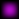
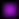
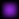
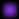
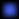
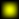
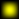
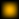
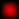
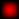

# System: Test  
<details><summary>System data</summary>  

#### System Infocard data  
```  
Temperature zone data by main star:
* Mineral melting line: < 180.626 AU
* Hot zone   :   180.626 ... 464.657 AU
* Warm zone  :   464.657 ... 1619.173 AU
* Temp. zone :   1619.173 ... 2289.857 AU
* Cold zone  :   2289.857 ... 6571.249 AU
* Frost line : > 6571.249 AU
```  
```  
Дані температурного зонування відносно основної зірки:
* Межа плавлення мінералів: < 180.626 а.о.
* Гаряча зона  :   180.626 ... 464.657 а.о.
* Тепла зона   :   464.657 ... 1619.173 а.о.
* Помірна зона :   1619.173 ... 2289.857 а.о.
* Холодна зона :   2289.857 ... 3497.814 а.о.
* Межа кригоутворення : > 6571.249 а.о.
```  
#### GODOT data  
```  
* System ID: 0
* Star cluster: Moirai
* System zone codename: STAR_0_SYSTEM_ZONE
* System codename: STAR_0_SYSTEM
* System translation name codename: NAME_STAR_0_SYSTEM
* System translation description codename: DESC_STAR_0_SYSTEM
* System name: Test
* System description: see above. Optionally add lore.
* System zone size: 2.27e+16
* System autopilot range: 2.27e+16
```

 </details>  

---  
<details><summary>Primary star : Test A, type: O0</summary>  

#### Star pseudo-color  
  
#### Star Infocard data  
```  
Absolute units:
* Size: 1.10e+10 m
* Mass: 1.65e+32 kg
* Temperature: 98836 K
* Luminosity: 2.06e+33 W

Sun-relative units:
* Size: 7.926 D
* Mass: 83.124 M
* Temperature: 17.12 T
* Luminosity: 5391713 L

Spectral data:
* Type: O0
* Peak wavelength: 29.0 nm
* Peak wavelength type: extreme UV

```  
```  
Абсолютні величини:
* Розмір: 1.10e+10 м
* Маса: 1.65e+32 кг
* Температура: 98836 К
* Світність: 2.06e+33 Вт

Величини відносно Сонця:
* Розмір: 7.926 D
* Маса: 83.124 M
* Температура: 17.12 T
* Світність: 5391713 L

Спектральні дані:
* Тип: O0
* Пікова довжина хвилі: 29.0 нм
* Тип пікового випромінювання: extreme UV

```  
#### GODOT data  
```  
* Star zone codename: STAR_0_ZONE
* Star codename: STAR_0
* Star translation name codename: NAME_STAR_0
* Star translation description codename: DESC_STAR_0
* Star name: Test A
* Star description: see above.
* Star zone size: 1.49e+14
* Star death zone size: 1.49e+13
* Star size: 1.10e+10
* Star flare distance: 1.49e+14
* Star autopilot range: 2.97e+13

* Omni range: 2.27e+16
* Omni attenuation: 10.0
* Omni energy: 2.0
* Surface color (Peak w.l. color code):
 - rgb: (181, 13, 205)
 - hex: #b50dcd
```  

 </details>  

---  
<details><summary>Planet Test a (icy dwarf planet)</summary>  

#### Planet albedo  
WIP  
#### Planet Infocard data  
```  
Planet type: icy dwarf planet

Absolute units:
* Size: 1.00e+06 m
* Mass: 6.72e+20 kg
* Temperature: 176.62 K
* Orbit semi-major axis: 1.73e+15 m

Earth-relative units:
* Size: 0.078 D
* Mass: 0.00011 M
* Temperature: -96.53 C
* Orbit semi-major axis: 11534.781 AU

```  
```  
Тип планети: льодяна карликова планета

Абсолютні величини:
* Розмір: 1.00e+06 м
* Маса: 6.72e+20 кг
* Температура: 176.62 К
* Велика піввісь орбіти: 1.73e+15 м

Величини відносно Землі:
* Розмір: 0.078 D
* Маса: 0.00011 M
* Температура: -96.53 C
* Велика піввісь орбіти: 11534.781 а.о.

```  
#### GODOT data  
```  
* Planet zone codename: STAR_0_PLANET_0_ZONE
* Planet codename: STAR_0_PLANET_0
* Planet translation name codename: NAME_STAR_0_PLANET_0
* Planet translation description codename: DESC_STAR_0_PLANET_0
* Planet name: Test a
* Planet description: see above.
* Planet zone size: 2.00e+07
* Planet death zone size: 1.05e+06
* Planet size: 1.00e+06
* Planet autopilot range: 2.10e+06
* Planet semi-major axis: 1.73e+15

* Surface color (albedo):
 - rgb: WIP
 - hex: #WIP
```  

 </details>  

---  
<details><summary>Planet Test b (icy giant planet)</summary>  

#### Planet albedo  
WIP  
#### Planet Infocard data  
```  
Planet type: icy giant planet

Absolute units:
* Size: 2.41e+08 m
* Mass: 8.40e+26 kg
* Temperature: 144.21 K
* Orbit semi-major axis: 2.59e+15 m

Earth-relative units:
* Size: 18.882 D
* Mass: 140.67736 M
* Temperature: -128.94 C
* Orbit semi-major axis: 17302.171 AU

```  
```  
Тип планети: льодяна планета гігант

Абсолютні величини:
* Розмір: 2.41e+08 м
* Маса: 8.40e+26 кг
* Температура: 144.21 К
* Велика піввісь орбіти: 2.59e+15 м

Величини відносно Землі:
* Розмір: 18.882 D
* Маса: 140.67736 M
* Температура: -128.94 C
* Велика піввісь орбіти: 17302.171 а.о.

```  
#### GODOT data  
```  
* Planet zone codename: STAR_0_PLANET_1_ZONE
* Planet codename: STAR_0_PLANET_1
* Planet translation name codename: NAME_STAR_0_PLANET_1
* Planet translation description codename: DESC_STAR_0_PLANET_1
* Planet name: Test b
* Planet description: see above.
* Planet zone size: 4.82e+09
* Planet death zone size: 2.53e+08
* Planet size: 2.41e+08
* Planet autopilot range: 5.06e+08
* Planet semi-major axis: 2.59e+15

* Surface color (albedo):
 - rgb: WIP
 - hex: #WIP
```  

 </details>  

---  
    

---  
# System: Test  
<details><summary>System data</summary>  

#### System Infocard data  
```  
Temperature zone data by main star:
* Mineral melting line: < 131.351 AU
* Hot zone   :   131.351 ... 337.898 AU
* Warm zone  :   337.898 ... 1177.461 AU
* Temp. zone :   1177.461 ... 1665.182 AU
* Cold zone  :   1665.182 ... 4778.606 AU
* Frost line : > 4778.606 AU
```  
```  
Дані температурного зонування відносно основної зірки:
* Межа плавлення мінералів: < 131.351 а.о.
* Гаряча зона  :   131.351 ... 337.898 а.о.
* Тепла зона   :   337.898 ... 1177.461 а.о.
* Помірна зона :   1177.461 ... 1665.182 а.о.
* Холодна зона :   1665.182 ... 2543.607 а.о.
* Межа кригоутворення : > 4778.606 а.о.
```  
#### GODOT data  
```  
* System ID: 1
* Star cluster: Moirai
* System zone codename: STAR_1_SYSTEM_ZONE
* System codename: STAR_1_SYSTEM
* System translation name codename: NAME_STAR_1_SYSTEM
* System translation description codename: DESC_STAR_1_SYSTEM
* System name: Test
* System description: see above. Optionally add lore.
* System zone size: 1.65e+16
* System autopilot range: 1.65e+16
```

 </details>  

---  
<details><summary>Primary star : Test A, type: O1</summary>  

#### Star pseudo-color  
  
#### Star Infocard data  
```  
Absolute units:
* Size: 9.24e+09 m
* Mass: 1.54e+32 kg
* Temperature: 92031 K
* Luminosity: 1.09e+33 W

Sun-relative units:
* Size: 6.648 D
* Mass: 77.346 M
* Temperature: 15.94 T
* Luminosity: 2851237 L

Spectral data:
* Type: O1
* Peak wavelength: 31.0 nm
* Peak wavelength type: extreme UV

```  
```  
Абсолютні величини:
* Розмір: 9.24e+09 м
* Маса: 1.54e+32 кг
* Температура: 92031 К
* Світність: 1.09e+33 Вт

Величини відносно Сонця:
* Розмір: 6.648 D
* Маса: 77.346 M
* Температура: 15.94 T
* Світність: 2851237 L

Спектральні дані:
* Тип: O1
* Пікова довжина хвилі: 31.0 нм
* Тип пікового випромінювання: extreme UV

```  
#### GODOT data  
```  
* Star zone codename: STAR_1_ZONE
* Star codename: STAR_1
* Star translation name codename: NAME_STAR_1
* Star translation description codename: DESC_STAR_1
* Star name: Test A
* Star description: see above.
* Star zone size: 1.08e+14
* Star death zone size: 1.08e+13
* Star size: 9.24e+09
* Star flare distance: 1.08e+14
* Star autopilot range: 2.16e+13

* Omni range: 1.65e+16
* Omni attenuation: 10.0
* Omni energy: 2.0
* Surface color (Peak w.l. color code):
 - rgb: (181, 13, 205)
 - hex: #b50dcd
```  

 </details>  

---  
<details><summary>Planet Test a (cold giant planet)</summary>  

#### Planet albedo  
WIP  
#### Planet Infocard data  
```  
Planet type: cold giant planet

Absolute units:
* Size: 2.51e+08 m
* Mass: 1.54e+27 kg
* Temperature: 277.82 K
* Orbit semi-major axis: 5.07e+14 m

Earth-relative units:
* Size: 19.668 D
* Mass: 258.48906 M
* Temperature: 4.67 C
* Orbit semi-major axis: 3390.01 AU

```  
```  
Тип планети: холодна планета гігант

Абсолютні величини:
* Розмір: 2.51e+08 м
* Маса: 1.54e+27 кг
* Температура: 277.82 К
* Велика піввісь орбіти: 5.07e+14 м

Величини відносно Землі:
* Розмір: 19.668 D
* Маса: 258.48906 M
* Температура: 4.67 C
* Велика піввісь орбіти: 3390.01 а.о.

```  
#### GODOT data  
```  
* Planet zone codename: STAR_1_PLANET_0_ZONE
* Planet codename: STAR_1_PLANET_0
* Planet translation name codename: NAME_STAR_1_PLANET_0
* Planet translation description codename: DESC_STAR_1_PLANET_0
* Planet name: Test a
* Planet description: see above.
* Planet zone size: 5.02e+09
* Planet death zone size: 2.63e+08
* Planet size: 2.51e+08
* Planet autopilot range: 5.27e+08
* Planet semi-major axis: 5.07e+14

* Surface color (albedo):
 - rgb: WIP
 - hex: #WIP
```  

 </details>  

---  
<details><summary>Planet Test b (icy large giant planet)</summary>  

#### Planet albedo  
WIP  
#### Planet Infocard data  
```  
Planet type: icy large giant planet

Absolute units:
* Size: 2.03e+08 m
* Mass: 4.16e+27 kg
* Temperature: 226.84 K
* Orbit semi-major axis: 7.61e+14 m

Earth-relative units:
* Size: 15.938 D
* Mass: 697.27762 M
* Temperature: -46.31 C
* Orbit semi-major axis: 5085.015 AU

```  
```  
Тип планети: льодяна планета великий гігант

Абсолютні величини:
* Розмір: 2.03e+08 м
* Маса: 4.16e+27 кг
* Температура: 226.84 К
* Велика піввісь орбіти: 7.61e+14 м

Величини відносно Землі:
* Розмір: 15.938 D
* Маса: 697.27762 M
* Температура: -46.31 C
* Велика піввісь орбіти: 5085.015 а.о.

```  
#### GODOT data  
```  
* Planet zone codename: STAR_1_PLANET_1_ZONE
* Planet codename: STAR_1_PLANET_1
* Planet translation name codename: NAME_STAR_1_PLANET_1
* Planet translation description codename: DESC_STAR_1_PLANET_1
* Planet name: Test b
* Planet description: see above.
* Planet zone size: 4.07e+09
* Planet death zone size: 2.13e+08
* Planet size: 2.03e+08
* Planet autopilot range: 4.27e+08
* Planet semi-major axis: 7.61e+14

* Surface color (albedo):
 - rgb: WIP
 - hex: #WIP
```  

 </details>  

---  
<details><summary>Planet Test c (icy large dwarf planet)</summary>  

#### Planet albedo  
WIP  
#### Planet Infocard data  
```  
Planet type: icy large dwarf planet

Absolute units:
* Size: 1.42e+06 m
* Mass: 2.36e+21 kg
* Temperature: 185.21 K
* Orbit semi-major axis: 1.14e+15 m

Earth-relative units:
* Size: 0.111 D
* Mass: 0.00039 M
* Temperature: -87.94 C
* Orbit semi-major axis: 7627.522 AU

```  
```  
Тип планети: льодяна велика карликова планета

Абсолютні величини:
* Розмір: 1.42e+06 м
* Маса: 2.36e+21 кг
* Температура: 185.21 К
* Велика піввісь орбіти: 1.14e+15 м

Величини відносно Землі:
* Розмір: 0.111 D
* Маса: 0.00039 M
* Температура: -87.94 C
* Велика піввісь орбіти: 7627.522 а.о.

```  
#### GODOT data  
```  
* Planet zone codename: STAR_1_PLANET_2_ZONE
* Planet codename: STAR_1_PLANET_2
* Planet translation name codename: NAME_STAR_1_PLANET_2
* Planet translation description codename: DESC_STAR_1_PLANET_2
* Planet name: Test c
* Planet description: see above.
* Planet zone size: 2.84e+07
* Planet death zone size: 1.49e+06
* Planet size: 1.42e+06
* Planet autopilot range: 2.98e+06
* Planet semi-major axis: 1.14e+15

* Surface color (albedo):
 - rgb: WIP
 - hex: #WIP
```  

 </details>  

---  
    

---  
# System: Test  
<details><summary>System data</summary>  

#### System Infocard data  
```  
Temperature zone data by main star:
* Mineral melting line: < 112.512 AU
* Hot zone   :   112.512 ... 289.435 AU
* Warm zone  :   289.435 ... 1008.583 AU
* Temp. zone :   1008.583 ... 1426.352 AU
* Cold zone  :   1426.352 ... 4093.231 AU
* Frost line : > 4093.231 AU
```  
```  
Дані температурного зонування відносно основної зірки:
* Межа плавлення мінералів: < 112.512 а.о.
* Гаряча зона  :   112.512 ... 289.435 а.о.
* Тепла зона   :   289.435 ... 1008.583 а.о.
* Помірна зона :   1008.583 ... 1426.352 а.о.
* Холодна зона :   1426.352 ... 2178.788 а.о.
* Межа кригоутворення : > 4093.231 а.о.
```  
#### GODOT data  
```  
* System ID: 2
* Star cluster: Moirai
* System zone codename: STAR_2_SYSTEM_ZONE
* System codename: STAR_2_SYSTEM
* System translation name codename: NAME_STAR_2_SYSTEM
* System translation description codename: DESC_STAR_2_SYSTEM
* System name: Test
* System description: see above. Optionally add lore.
* System zone size: 1.41e+16
* System autopilot range: 1.41e+16
```

 </details>  

---  
<details><summary>Primary star : Test A, type: O2</summary>  

#### Star pseudo-color  
  
#### Star Infocard data  
```  
Absolute units:
* Size: 1.03e+10 m
* Mass: 1.45e+32 kg
* Temperature: 80584 K
* Luminosity: 8.01e+32 W

Sun-relative units:
* Size: 7.427 D
* Mass: 72.895 M
* Temperature: 13.96 T
* Luminosity: 2092008 L

Spectral data:
* Type: O2
* Peak wavelength: 36.0 nm
* Peak wavelength type: extreme UV

```  
```  
Абсолютні величини:
* Розмір: 1.03e+10 м
* Маса: 1.45e+32 кг
* Температура: 80584 К
* Світність: 8.01e+32 Вт

Величини відносно Сонця:
* Розмір: 7.427 D
* Маса: 72.895 M
* Температура: 13.96 T
* Світність: 2092008 L

Спектральні дані:
* Тип: O2
* Пікова довжина хвилі: 36.0 нм
* Тип пікового випромінювання: extreme UV

```  
#### GODOT data  
```  
* Star zone codename: STAR_2_ZONE
* Star codename: STAR_2
* Star translation name codename: NAME_STAR_2
* Star translation description codename: DESC_STAR_2
* Star name: Test A
* Star description: see above.
* Star zone size: 9.26e+13
* Star death zone size: 9.26e+12
* Star size: 1.03e+10
* Star flare distance: 9.26e+13
* Star autopilot range: 1.85e+13

* Omni range: 1.41e+16
* Omni attenuation: 10.0
* Omni energy: 2.0
* Surface color (Peak w.l. color code):
 - rgb: (181, 13, 205)
 - hex: #b50dcd
```  

 </details>  

---  
<details><summary>Planet Test a (cold large terrestrial planet)</summary>  

#### Planet albedo  
WIP  
#### Planet Infocard data  
```  
Planet type: cold large terrestrial planet

Absolute units:
* Size: 1.40e+07 m
* Mass: 8.41e+24 kg
* Temperature: 234.06 K
* Orbit semi-major axis: 6.12e+14 m

Earth-relative units:
* Size: 1.101 D
* Mass: 1.40802 M
* Temperature: -39.09 C
* Orbit semi-major axis: 4091.059 AU

```  
```  
Тип планети: холодна велика землеподібна планета

Абсолютні величини:
* Розмір: 1.40e+07 м
* Маса: 8.41e+24 кг
* Температура: 234.06 К
* Велика піввісь орбіти: 6.12e+14 м

Величини відносно Землі:
* Розмір: 1.101 D
* Маса: 1.40802 M
* Температура: -39.09 C
* Велика піввісь орбіти: 4091.059 а.о.

```  
#### GODOT data  
```  
* Planet zone codename: STAR_2_PLANET_0_ZONE
* Planet codename: STAR_2_PLANET_0
* Planet translation name codename: NAME_STAR_2_PLANET_0
* Planet translation description codename: DESC_STAR_2_PLANET_0
* Planet name: Test a
* Planet description: see above.
* Planet zone size: 2.81e+08
* Planet death zone size: 1.47e+07
* Planet size: 1.40e+07
* Planet autopilot range: 2.95e+07
* Planet semi-major axis: 6.12e+14

* Surface color (albedo):
 - rgb: WIP
 - hex: #WIP
```  

 </details>  

---  
    

---  
# System: Test  
<details><summary>System data</summary>  

#### System Infocard data  
```  
Temperature zone data by main star:
* Mineral melting line: < 122.008 AU
* Hot zone   :   122.008 ... 313.863 AU
* Warm zone  :   313.863 ... 1093.707 AU
* Temp. zone :   1093.707 ... 1546.735 AU
* Cold zone  :   1546.735 ... 4438.697 AU
* Frost line : > 4438.697 AU
```  
```  
Дані температурного зонування відносно основної зірки:
* Межа плавлення мінералів: < 122.008 а.о.
* Гаряча зона  :   122.008 ... 313.863 а.о.
* Тепла зона   :   313.863 ... 1093.707 а.о.
* Помірна зона :   1093.707 ... 1546.735 а.о.
* Холодна зона :   1546.735 ... 2362.677 а.о.
* Межа кригоутворення : > 4438.697 а.о.
```  
#### GODOT data  
```  
* System ID: 3
* Star cluster: Moirai
* System zone codename: STAR_3_SYSTEM_ZONE
* System codename: STAR_3_SYSTEM
* System translation name codename: NAME_STAR_3_SYSTEM
* System translation description codename: DESC_STAR_3_SYSTEM
* System name: Test
* System description: see above. Optionally add lore.
* System zone size: 1.53e+16
* System autopilot range: 1.53e+16
```

 </details>  

---  
<details><summary>Primary star : Test A, type: O3</summary>  

#### Star pseudo-color  
  
#### Star Infocard data  
```  
Absolute units:
* Size: 1.24e+10 m
* Mass: 1.22e+32 kg
* Temperature: 76689 K
* Luminosity: 9.41e+32 W

Sun-relative units:
* Size: 8.893 D
* Mass: 61.485 M
* Temperature: 13.29 T
* Luminosity: 2460038 L

Spectral data:
* Type: O3
* Peak wavelength: 38.0 nm
* Peak wavelength type: extreme UV

```  
```  
Абсолютні величини:
* Розмір: 1.24e+10 м
* Маса: 1.22e+32 кг
* Температура: 76689 К
* Світність: 9.41e+32 Вт

Величини відносно Сонця:
* Розмір: 8.893 D
* Маса: 61.485 M
* Температура: 13.29 T
* Світність: 2460038 L

Спектральні дані:
* Тип: O3
* Пікова довжина хвилі: 38.0 нм
* Тип пікового випромінювання: extreme UV

```  
#### GODOT data  
```  
* Star zone codename: STAR_3_ZONE
* Star codename: STAR_3
* Star translation name codename: NAME_STAR_3
* Star translation description codename: DESC_STAR_3
* Star name: Test A
* Star description: see above.
* Star zone size: 1.00e+14
* Star death zone size: 1.00e+13
* Star size: 1.24e+10
* Star flare distance: 1.00e+14
* Star autopilot range: 2.01e+13

* Omni range: 1.53e+16
* Omni attenuation: 10.0
* Omni energy: 2.0
* Surface color (Peak w.l. color code):
 - rgb: (163, 27, 210)
 - hex: #a31bd2
```  

 </details>  

---  
<details><summary>Planet Test a (icy large terrestrial planet)</summary>  

#### Planet albedo  
WIP  
#### Planet Infocard data  
```  
Planet type: icy large terrestrial planet

Absolute units:
* Size: 1.00e+07 m
* Mass: 2.51e+24 kg
* Temperature: 136.01 K
* Orbit semi-major axis: 1.97e+15 m

Earth-relative units:
* Size: 0.785 D
* Mass: 0.42111 M
* Temperature: -137.14 C
* Orbit semi-major axis: 13138.405 AU

```  
```  
Тип планети: льодяна велика землеподібна планета

Абсолютні величини:
* Розмір: 1.00e+07 м
* Маса: 2.51e+24 кг
* Температура: 136.01 К
* Велика піввісь орбіти: 1.97e+15 м

Величини відносно Землі:
* Розмір: 0.785 D
* Маса: 0.42111 M
* Температура: -137.14 C
* Велика піввісь орбіти: 13138.405 а.о.

```  
#### GODOT data  
```  
* Planet zone codename: STAR_3_PLANET_0_ZONE
* Planet codename: STAR_3_PLANET_0
* Planet translation name codename: NAME_STAR_3_PLANET_0
* Planet translation description codename: DESC_STAR_3_PLANET_0
* Planet name: Test a
* Planet description: see above.
* Planet zone size: 2.00e+08
* Planet death zone size: 1.05e+07
* Planet size: 1.00e+07
* Planet autopilot range: 2.10e+07
* Planet semi-major axis: 1.97e+15

* Surface color (albedo):
 - rgb: WIP
 - hex: #WIP
```  

 </details>  

---  
<details><summary>Planet Test b (icy small giant planet)</summary>  

#### Planet albedo  
WIP  
#### Planet Infocard data  
```  
Planet type: icy small giant planet

Absolute units:
* Size: 1.99e+08 m
* Mass: 6.31e+26 kg
* Temperature: 117.93 K
* Orbit semi-major axis: 2.61e+15 m

Earth-relative units:
* Size: 15.634 D
* Mass: 105.6494 M
* Temperature: -155.22 C
* Orbit semi-major axis: 17474.079 AU

```  
```  
Тип планети: льодяна планета малий гігант

Абсолютні величини:
* Розмір: 1.99e+08 м
* Маса: 6.31e+26 кг
* Температура: 117.93 К
* Велика піввісь орбіти: 2.61e+15 м

Величини відносно Землі:
* Розмір: 15.634 D
* Маса: 105.6494 M
* Температура: -155.22 C
* Велика піввісь орбіти: 17474.079 а.о.

```  
#### GODOT data  
```  
* Planet zone codename: STAR_3_PLANET_1_ZONE
* Planet codename: STAR_3_PLANET_1
* Planet translation name codename: NAME_STAR_3_PLANET_1
* Planet translation description codename: DESC_STAR_3_PLANET_1
* Planet name: Test b
* Planet description: see above.
* Planet zone size: 3.99e+09
* Planet death zone size: 2.09e+08
* Planet size: 1.99e+08
* Planet autopilot range: 4.19e+08
* Planet semi-major axis: 2.61e+15

* Surface color (albedo):
 - rgb: WIP
 - hex: #WIP
```  

 </details>  

---  
    

---  
# System: Test  
<details><summary>System data</summary>  

#### System Infocard data  
```  
Temperature zone data by main star:
* Mineral melting line: < 104.343 AU
* Hot zone   :   104.343 ... 268.42 AU
* Warm zone  :   268.42 ... 935.353 AU
* Temp. zone :   935.353 ... 1322.789 AU
* Cold zone  :   1322.789 ... 3796.035 AU
* Frost line : > 3796.035 AU
```  
```  
Дані температурного зонування відносно основної зірки:
* Межа плавлення мінералів: < 104.343 а.о.
* Гаряча зона  :   104.343 ... 268.42 а.о.
* Тепла зона   :   268.42 ... 935.353 а.о.
* Помірна зона :   935.353 ... 1322.789 а.о.
* Холодна зона :   1322.789 ... 2020.594 а.о.
* Межа кригоутворення : > 3796.035 а.о.
```  
#### GODOT data  
```  
* System ID: 4
* Star cluster: Moirai
* System zone codename: STAR_4_SYSTEM_ZONE
* System codename: STAR_4_SYSTEM
* System translation name codename: NAME_STAR_4_SYSTEM
* System translation description codename: DESC_STAR_4_SYSTEM
* System name: Test
* System description: see above. Optionally add lore.
* System zone size: 1.31e+16
* System autopilot range: 1.31e+16
```

 </details>  

---  
<details><summary>Primary star : Test A, type: O4</summary>  

#### Star pseudo-color  
  
#### Star Infocard data  
```  
Absolute units:
* Size: 1.33e+10 m
* Mass: 1.16e+32 kg
* Temperature: 68270 K
* Luminosity: 6.89e+32 W

Sun-relative units:
* Size: 9.597 D
* Mass: 58.046 M
* Temperature: 11.83 T
* Luminosity: 1799249 L

Spectral data:
* Type: O4
* Peak wavelength: 42.0 nm
* Peak wavelength type: extreme UV

```  
```  
Абсолютні величини:
* Розмір: 1.33e+10 м
* Маса: 1.16e+32 кг
* Температура: 68270 К
* Світність: 6.89e+32 Вт

Величини відносно Сонця:
* Розмір: 9.597 D
* Маса: 58.046 M
* Температура: 11.83 T
* Світність: 1799249 L

Спектральні дані:
* Тип: O4
* Пікова довжина хвилі: 42.0 нм
* Тип пікового випромінювання: extreme UV

```  
#### GODOT data  
```  
* Star zone codename: STAR_4_ZONE
* Star codename: STAR_4
* Star translation name codename: NAME_STAR_4
* Star translation description codename: DESC_STAR_4
* Star name: Test A
* Star description: see above.
* Star zone size: 8.58e+13
* Star death zone size: 8.58e+12
* Star size: 1.33e+10
* Star flare distance: 8.58e+13
* Star autopilot range: 1.72e+13

* Omni range: 1.31e+16
* Omni attenuation: 10.0
* Omni energy: 2.0
* Surface color (Peak w.l. color code):
 - rgb: (163, 27, 210)
 - hex: #a31bd2
```  

 </details>  

---  
<details><summary>Planet Test a (temperate dwarf planet)</summary>  

#### Planet albedo  
WIP  
#### Planet Infocard data  
```  
Planet type: temperate dwarf planet

Absolute units:
* Size: 6.91e+05 m
* Mass: 1.79e+20 kg
* Temperature: 345.51 K
* Orbit semi-major axis: 2.60e+14 m

Earth-relative units:
* Size: 0.054 D
* Mass: 3e-05 M
* Temperature: 72.36 C
* Orbit semi-major axis: 1741.09 AU

```  
```  
Тип планети: помірна карликова планета

Абсолютні величини:
* Розмір: 6.91e+05 м
* Маса: 1.79e+20 кг
* Температура: 345.51 К
* Велика піввісь орбіти: 2.60e+14 м

Величини відносно Землі:
* Розмір: 0.054 D
* Маса: 3e-05 M
* Температура: 72.36 C
* Велика піввісь орбіти: 1741.09 а.о.

```  
#### GODOT data  
```  
* Planet zone codename: STAR_4_PLANET_0_ZONE
* Planet codename: STAR_4_PLANET_0
* Planet translation name codename: NAME_STAR_4_PLANET_0
* Planet translation description codename: DESC_STAR_4_PLANET_0
* Planet name: Test a
* Planet description: see above.
* Planet zone size: 1.38e+07
* Planet death zone size: 7.25e+05
* Planet size: 6.91e+05
* Planet autopilot range: 1.45e+06
* Planet semi-major axis: 2.60e+14

* Surface color (albedo):
 - rgb: WIP
 - hex: #WIP
```  

 </details>  

---  
<details><summary>Planet Test b (cold small giant planet)</summary>  

#### Planet albedo  
WIP  
#### Planet Infocard data  
```  
Planet type: cold small giant planet

Absolute units:
* Size: 6.85e+07 m
* Mass: 1.03e+26 kg
* Temperature: 282.11 K
* Orbit semi-major axis: 3.91e+14 m

Earth-relative units:
* Size: 5.368 D
* Mass: 17.2585 M
* Temperature: 8.96 C
* Orbit semi-major axis: 2611.635 AU

```  
```  
Тип планети: холодна планета малий гігант

Абсолютні величини:
* Розмір: 6.85e+07 м
* Маса: 1.03e+26 кг
* Температура: 282.11 К
* Велика піввісь орбіти: 3.91e+14 м

Величини відносно Землі:
* Розмір: 5.368 D
* Маса: 17.2585 M
* Температура: 8.96 C
* Велика піввісь орбіти: 2611.635 а.о.

```  
#### GODOT data  
```  
* Planet zone codename: STAR_4_PLANET_1_ZONE
* Planet codename: STAR_4_PLANET_1
* Planet translation name codename: NAME_STAR_4_PLANET_1
* Planet translation description codename: DESC_STAR_4_PLANET_1
* Planet name: Test b
* Planet description: see above.
* Planet zone size: 1.37e+09
* Planet death zone size: 7.19e+07
* Planet size: 6.85e+07
* Planet autopilot range: 1.44e+08
* Planet semi-major axis: 3.91e+14

* Surface color (albedo):
 - rgb: WIP
 - hex: #WIP
```  

 </details>  

---  
<details><summary>Planet Test c (icy large dwarf planet)</summary>  

#### Planet albedo  
WIP  
#### Planet Infocard data  
```  
Planet type: icy large dwarf planet

Absolute units:
* Size: 1.81e+06 m
* Mass: 5.61e+21 kg
* Temperature: 230.34 K
* Orbit semi-major axis: 5.86e+14 m

Earth-relative units:
* Size: 0.142 D
* Mass: 0.00094 M
* Temperature: -42.81 C
* Orbit semi-major axis: 3917.452 AU

```  
```  
Тип планети: льодяна велика карликова планета

Абсолютні величини:
* Розмір: 1.81e+06 м
* Маса: 5.61e+21 кг
* Температура: 230.34 К
* Велика піввісь орбіти: 5.86e+14 м

Величини відносно Землі:
* Розмір: 0.142 D
* Маса: 0.00094 M
* Температура: -42.81 C
* Велика піввісь орбіти: 3917.452 а.о.

```  
#### GODOT data  
```  
* Planet zone codename: STAR_4_PLANET_2_ZONE
* Planet codename: STAR_4_PLANET_2
* Planet translation name codename: NAME_STAR_4_PLANET_2
* Planet translation description codename: DESC_STAR_4_PLANET_2
* Planet name: Test c
* Planet description: see above.
* Planet zone size: 3.62e+07
* Planet death zone size: 1.90e+06
* Planet size: 1.81e+06
* Planet autopilot range: 3.80e+06
* Planet semi-major axis: 5.86e+14

* Surface color (albedo):
 - rgb: WIP
 - hex: #WIP
```  

 </details>  

---  
<details><summary>Planet Test d (icy dwarf planet)</summary>  

#### Planet albedo  
WIP  
#### Planet Infocard data  
```  
Planet type: icy dwarf planet

Absolute units:
* Size: 6.51e+05 m
* Mass: 1.45e+20 kg
* Temperature: 188.07 K
* Orbit semi-major axis: 8.79e+14 m

Earth-relative units:
* Size: 0.051 D
* Mass: 2e-05 M
* Temperature: -85.08 C
* Orbit semi-major axis: 5876.179 AU

```  
```  
Тип планети: льодяна карликова планета

Абсолютні величини:
* Розмір: 6.51e+05 м
* Маса: 1.45e+20 кг
* Температура: 188.07 К
* Велика піввісь орбіти: 8.79e+14 м

Величини відносно Землі:
* Розмір: 0.051 D
* Маса: 2e-05 M
* Температура: -85.08 C
* Велика піввісь орбіти: 5876.179 а.о.

```  
#### GODOT data  
```  
* Planet zone codename: STAR_4_PLANET_3_ZONE
* Planet codename: STAR_4_PLANET_3
* Planet translation name codename: NAME_STAR_4_PLANET_3
* Planet translation description codename: DESC_STAR_4_PLANET_3
* Planet name: Test d
* Planet description: see above.
* Planet zone size: 1.30e+07
* Planet death zone size: 6.83e+05
* Planet size: 6.51e+05
* Planet autopilot range: 1.37e+06
* Planet semi-major axis: 8.79e+14

* Surface color (albedo):
 - rgb: WIP
 - hex: #WIP
```  

 </details>  

---  
    

---  
# System: Test  
<details><summary>System data</summary>  

#### System Infocard data  
```  
Temperature zone data by main star:
* Mineral melting line: < 76.258 AU
* Hot zone   :   76.258 ... 196.173 AU
* Warm zone  :   196.173 ... 683.596 AU
* Temp. zone :   683.596 ... 966.751 AU
* Cold zone  :   966.751 ... 2774.305 AU
* Frost line : > 2774.305 AU
```  
```  
Дані температурного зонування відносно основної зірки:
* Межа плавлення мінералів: < 76.258 а.о.
* Гаряча зона  :   76.258 ... 196.173 а.о.
* Тепла зона   :   196.173 ... 683.596 а.о.
* Помірна зона :   683.596 ... 966.751 а.о.
* Холодна зона :   966.751 ... 1476.736 а.о.
* Межа кригоутворення : > 2774.305 а.о.
```  
#### GODOT data  
```  
* System ID: 5
* Star cluster: Moirai
* System zone codename: STAR_5_SYSTEM_ZONE
* System codename: STAR_5_SYSTEM
* System translation name codename: NAME_STAR_5_SYSTEM
* System translation description codename: DESC_STAR_5_SYSTEM
* System name: Test
* System description: see above. Optionally add lore.
* System zone size: 9.59e+15
* System autopilot range: 9.59e+15
```

 </details>  

---  
<details><summary>Primary star : Test A, type: O5</summary>  

#### Star pseudo-color  
  
#### Star Infocard data  
```  
Absolute units:
* Size: 1.22e+10 m
* Mass: 1.02e+32 kg
* Temperature: 61029 K
* Luminosity: 3.68e+32 W

Sun-relative units:
* Size: 8.777 D
* Mass: 51.364 M
* Temperature: 10.57 T
* Luminosity: 961035 L

Spectral data:
* Type: O5
* Peak wavelength: 47.0 nm
* Peak wavelength type: extreme UV

```  
```  
Абсолютні величини:
* Розмір: 1.22e+10 м
* Маса: 1.02e+32 кг
* Температура: 61029 К
* Світність: 3.68e+32 Вт

Величини відносно Сонця:
* Розмір: 8.777 D
* Маса: 51.364 M
* Температура: 10.57 T
* Світність: 961035 L

Спектральні дані:
* Тип: O5
* Пікова довжина хвилі: 47.0 нм
* Тип пікового випромінювання: extreme UV

```  
#### GODOT data  
```  
* Star zone codename: STAR_5_ZONE
* Star codename: STAR_5
* Star translation name codename: NAME_STAR_5
* Star translation description codename: DESC_STAR_5
* Star name: Test A
* Star description: see above.
* Star zone size: 6.27e+13
* Star death zone size: 6.27e+12
* Star size: 1.22e+10
* Star flare distance: 6.27e+13
* Star autopilot range: 1.25e+13

* Omni range: 9.59e+15
* Omni attenuation: 10.0
* Omni energy: 2.0
* Surface color (Peak w.l. color code):
 - rgb: (145, 40, 215)
 - hex: #9128d7
```  

 </details>  

---  
<details><summary>Planet Test a (hot small dwarf planet)</summary>  

#### Planet albedo  
WIP  
#### Planet Infocard data  
```  
Planet type: hot small dwarf planet

Absolute units:
* Size: 3.65e+05 m
* Mass: 1.84e+19 kg
* Temperature: 585.04 K
* Orbit semi-major axis: 6.64e+13 m

Earth-relative units:
* Size: 0.029 D
* Mass: 0.0 M
* Temperature: 311.89 C
* Orbit semi-major axis: 443.822 AU

```  
```  
Тип планети: гаряча мала карликова планета

Абсолютні величини:
* Розмір: 3.65e+05 м
* Маса: 1.84e+19 кг
* Температура: 585.04 К
* Велика піввісь орбіти: 6.64e+13 м

Величини відносно Землі:
* Розмір: 0.029 D
* Маса: 0.0 M
* Температура: 311.89 C
* Велика піввісь орбіти: 443.822 а.о.

```  
#### GODOT data  
```  
* Planet zone codename: STAR_5_PLANET_0_ZONE
* Planet codename: STAR_5_PLANET_0
* Planet translation name codename: NAME_STAR_5_PLANET_0
* Planet translation description codename: DESC_STAR_5_PLANET_0
* Planet name: Test a
* Planet description: see above.
* Planet zone size: 7.31e+06
* Planet death zone size: 3.84e+05
* Planet size: 3.65e+05
* Planet autopilot range: 7.67e+05
* Planet semi-major axis: 6.64e+13

* Surface color (albedo):
 - rgb: WIP
 - hex: #WIP
```  

 </details>  

---  
<details><summary>Planet Test b (warm terrestrial planet)</summary>  

#### Planet albedo  
WIP  
#### Planet Infocard data  
```  
Planet type: warm terrestrial planet

Absolute units:
* Size: 7.41e+06 m
* Mass: 8.58e+23 kg
* Temperature: 413.68 K
* Orbit semi-major axis: 1.33e+14 m

Earth-relative units:
* Size: 0.581 D
* Mass: 0.14361 M
* Temperature: 140.53 C
* Orbit semi-major axis: 887.644 AU

```  
```  
Тип планети: тепла землеподібна планета

Абсолютні величини:
* Розмір: 7.41e+06 м
* Маса: 8.58e+23 кг
* Температура: 413.68 К
* Велика піввісь орбіти: 1.33e+14 м

Величини відносно Землі:
* Розмір: 0.581 D
* Маса: 0.14361 M
* Температура: 140.53 C
* Велика піввісь орбіти: 887.644 а.о.

```  
#### GODOT data  
```  
* Planet zone codename: STAR_5_PLANET_1_ZONE
* Planet codename: STAR_5_PLANET_1
* Planet translation name codename: NAME_STAR_5_PLANET_1
* Planet translation description codename: DESC_STAR_5_PLANET_1
* Planet name: Test b
* Planet description: see above.
* Planet zone size: 1.48e+08
* Planet death zone size: 7.78e+06
* Planet size: 7.41e+06
* Planet autopilot range: 1.56e+07
* Planet semi-major axis: 1.33e+14

* Surface color (albedo):
 - rgb: WIP
 - hex: #WIP
```  

 </details>  

---  
<details><summary>Planet Test c (cold small giant planet)</summary>  

#### Planet albedo  
WIP  
#### Planet Infocard data  
```  
Planet type: cold small giant planet

Absolute units:
* Size: 1.78e+08 m
* Mass: 5.21e+26 kg
* Temperature: 292.52 K
* Orbit semi-major axis: 2.66e+14 m

Earth-relative units:
* Size: 13.962 D
* Mass: 87.21937 M
* Temperature: 19.37 C
* Orbit semi-major axis: 1775.288 AU

```  
```  
Тип планети: холодна планета малий гігант

Абсолютні величини:
* Розмір: 1.78e+08 м
* Маса: 5.21e+26 кг
* Температура: 292.52 К
* Велика піввісь орбіти: 2.66e+14 м

Величини відносно Землі:
* Розмір: 13.962 D
* Маса: 87.21937 M
* Температура: 19.37 C
* Велика піввісь орбіти: 1775.288 а.о.

```  
#### GODOT data  
```  
* Planet zone codename: STAR_5_PLANET_2_ZONE
* Planet codename: STAR_5_PLANET_2
* Planet translation name codename: NAME_STAR_5_PLANET_2
* Planet translation description codename: DESC_STAR_5_PLANET_2
* Planet name: Test c
* Planet description: see above.
* Planet zone size: 3.56e+09
* Planet death zone size: 1.87e+08
* Planet size: 1.78e+08
* Planet autopilot range: 3.74e+08
* Planet semi-major axis: 2.66e+14

* Surface color (albedo):
 - rgb: WIP
 - hex: #WIP
```  

 </details>  

---  
<details><summary>Planet Test d (icy large terrestrial planet)</summary>  

#### Planet albedo  
WIP  
#### Planet Infocard data  
```  
Planet type: icy large terrestrial planet

Absolute units:
* Size: 8.71e+06 m
* Mass: 1.53e+24 kg
* Temperature: 206.84 K
* Orbit semi-major axis: 5.31e+14 m

Earth-relative units:
* Size: 0.683 D
* Mass: 0.25625 M
* Temperature: -66.31 C
* Orbit semi-major axis: 3550.577 AU

```  
```  
Тип планети: льодяна велика землеподібна планета

Абсолютні величини:
* Розмір: 8.71e+06 м
* Маса: 1.53e+24 кг
* Температура: 206.84 К
* Велика піввісь орбіти: 5.31e+14 м

Величини відносно Землі:
* Розмір: 0.683 D
* Маса: 0.25625 M
* Температура: -66.31 C
* Велика піввісь орбіти: 3550.577 а.о.

```  
#### GODOT data  
```  
* Planet zone codename: STAR_5_PLANET_3_ZONE
* Planet codename: STAR_5_PLANET_3
* Planet translation name codename: NAME_STAR_5_PLANET_3
* Planet translation description codename: DESC_STAR_5_PLANET_3
* Planet name: Test d
* Planet description: see above.
* Planet zone size: 1.74e+08
* Planet death zone size: 9.15e+06
* Planet size: 8.71e+06
* Planet autopilot range: 1.83e+07
* Planet semi-major axis: 5.31e+14

* Surface color (albedo):
 - rgb: WIP
 - hex: #WIP
```  

 </details>  

---  
    

---  
# System: Test  
<details><summary>System data</summary>  

#### System Infocard data  
```  
Temperature zone data by main star:
* Mineral melting line: < 41.99 AU
* Hot zone   :   41.99 ... 108.018 AU
* Warm zone  :   108.018 ... 376.408 AU
* Temp. zone :   376.408 ... 532.321 AU
* Cold zone  :   532.321 ... 1527.612 AU
* Frost line : > 1527.612 AU
```  
```  
Дані температурного зонування відносно основної зірки:
* Межа плавлення мінералів: < 41.99 а.о.
* Гаряча зона  :   41.99 ... 108.018 а.о.
* Тепла зона   :   108.018 ... 376.408 а.о.
* Помірна зона :   376.408 ... 532.321 а.о.
* Холодна зона :   532.321 ... 813.134 а.о.
* Межа кригоутворення : > 1527.612 а.о.
```  
#### GODOT data  
```  
* System ID: 6
* Star cluster: Moirai
* System zone codename: STAR_6_SYSTEM_ZONE
* System codename: STAR_6_SYSTEM
* System translation name codename: NAME_STAR_6_SYSTEM
* System translation description codename: DESC_STAR_6_SYSTEM
* System name: Test
* System description: see above. Optionally add lore.
* System zone size: 5.28e+15
* System autopilot range: 5.28e+15
```

 </details>  

---  
<details><summary>Primary star : Test A, type: O6</summary>  

#### Star pseudo-color  
  
#### Star Infocard data  
```  
Absolute units:
* Size: 9.53e+09 m
* Mass: 8.68e+31 kg
* Temperature: 51231 K
* Luminosity: 1.12e+32 W

Sun-relative units:
* Size: 6.858 D
* Mass: 43.611 M
* Temperature: 8.88 T
* Luminosity: 291378 L

Spectral data:
* Type: O6
* Peak wavelength: 57.0 nm
* Peak wavelength type: extreme UV

```  
```  
Абсолютні величини:
* Розмір: 9.53e+09 м
* Маса: 8.68e+31 кг
* Температура: 51231 К
* Світність: 1.12e+32 Вт

Величини відносно Сонця:
* Розмір: 6.858 D
* Маса: 43.611 M
* Температура: 8.88 T
* Світність: 291378 L

Спектральні дані:
* Тип: O6
* Пікова довжина хвилі: 57.0 нм
* Тип пікового випромінювання: extreme UV

```  
#### GODOT data  
```  
* Star zone codename: STAR_6_ZONE
* Star codename: STAR_6
* Star translation name codename: NAME_STAR_6
* Star translation description codename: DESC_STAR_6
* Star name: Test A
* Star description: see above.
* Star zone size: 3.45e+13
* Star death zone size: 3.45e+12
* Star size: 9.53e+09
* Star flare distance: 3.45e+13
* Star autopilot range: 6.91e+12

* Omni range: 5.28e+15
* Omni attenuation: 10.0
* Omni energy: 2.0
* Surface color (Peak w.l. color code):
 - rgb: (127, 54, 220)
 - hex: #7f36dc
```  

 </details>  

---  
<details><summary>Planet Test a (cold large giant planet)</summary>  

#### Planet albedo  
WIP  
#### Planet Infocard data  
```  
Planet type: cold large giant planet

Absolute units:
* Size: 1.34e+08 m
* Mass: 8.55e+27 kg
* Temperature: 259.71 K
* Orbit semi-major axis: 1.86e+14 m

Earth-relative units:
* Size: 10.497 D
* Mass: 1432.27206 M
* Temperature: -13.44 C
* Orbit semi-major axis: 1240.055 AU

```  
```  
Тип планети: холодна планета великий гігант

Абсолютні величини:
* Розмір: 1.34e+08 м
* Маса: 8.55e+27 кг
* Температура: 259.71 К
* Велика піввісь орбіти: 1.86e+14 м

Величини відносно Землі:
* Розмір: 10.497 D
* Маса: 1432.27206 M
* Температура: -13.44 C
* Велика піввісь орбіти: 1240.055 а.о.

```  
#### GODOT data  
```  
* Planet zone codename: STAR_6_PLANET_0_ZONE
* Planet codename: STAR_6_PLANET_0
* Planet translation name codename: NAME_STAR_6_PLANET_0
* Planet translation description codename: DESC_STAR_6_PLANET_0
* Planet name: Test a
* Planet description: see above.
* Planet zone size: 2.68e+09
* Planet death zone size: 1.41e+08
* Planet size: 1.34e+08
* Planet autopilot range: 2.81e+08
* Planet semi-major axis: 1.86e+14

* Surface color (albedo):
 - rgb: WIP
 - hex: #WIP
```  

 </details>  

---  
    

---  
# System: Test  
<details><summary>System data</summary>  

#### System Infocard data  
```  
Temperature zone data by main star:
* Mineral melting line: < 42.969 AU
* Hot zone   :   42.969 ... 110.536 AU
* Warm zone  :   110.536 ... 385.179 AU
* Temp. zone :   385.179 ... 544.726 AU
* Cold zone  :   544.726 ... 1563.211 AU
* Frost line : > 1563.211 AU
```  
```  
Дані температурного зонування відносно основної зірки:
* Межа плавлення мінералів: < 42.969 а.о.
* Гаряча зона  :   42.969 ... 110.536 а.о.
* Тепла зона   :   110.536 ... 385.179 а.о.
* Помірна зона :   385.179 ... 544.726 а.о.
* Холодна зона :   544.726 ... 832.083 а.о.
* Межа кригоутворення : > 1563.211 а.о.
```  
#### GODOT data  
```  
* System ID: 7
* Star cluster: Moirai
* System zone codename: STAR_7_SYSTEM_ZONE
* System codename: STAR_7_SYSTEM
* System translation name codename: NAME_STAR_7_SYSTEM
* System translation description codename: DESC_STAR_7_SYSTEM
* System name: Test
* System description: see above. Optionally add lore.
* System zone size: 5.40e+15
* System autopilot range: 5.40e+15
```

 </details>  

---  
<details><summary>Primary star : Test A, type: O7</summary>  

#### Star pseudo-color  
  
#### Star Infocard data  
```  
Absolute units:
* Size: 1.27e+10 m
* Mass: 7.55e+31 kg
* Temperature: 44837 K
* Luminosity: 1.17e+32 W

Sun-relative units:
* Size: 9.162 D
* Mass: 37.922 M
* Temperature: 7.77 T
* Luminosity: 305117 L

Spectral data:
* Type: O7
* Peak wavelength: 65.0 nm
* Peak wavelength type: extreme UV

```  
```  
Абсолютні величини:
* Розмір: 1.27e+10 м
* Маса: 7.55e+31 кг
* Температура: 44837 К
* Світність: 1.17e+32 Вт

Величини відносно Сонця:
* Розмір: 9.162 D
* Маса: 37.922 M
* Температура: 7.77 T
* Світність: 305117 L

Спектральні дані:
* Тип: O7
* Пікова довжина хвилі: 65.0 нм
* Тип пікового випромінювання: extreme UV

```  
#### GODOT data  
```  
* Star zone codename: STAR_7_ZONE
* Star codename: STAR_7
* Star translation name codename: NAME_STAR_7
* Star translation description codename: DESC_STAR_7
* Star name: Test A
* Star description: see above.
* Star zone size: 3.53e+13
* Star death zone size: 3.53e+12
* Star size: 1.27e+10
* Star flare distance: 3.53e+13
* Star autopilot range: 7.07e+12

* Omni range: 5.40e+15
* Omni attenuation: 10.0
* Omni energy: 2.0
* Surface color (Peak w.l. color code):
 - rgb: (109, 68, 225)
 - hex: #6d44e1
```  

 </details>  

---  
<details><summary>Planet Test a (temperate large dwarf planet)</summary>  

#### Planet albedo  
WIP  
#### Planet Infocard data  
```  
Planet type: temperate large dwarf planet

Absolute units:
* Size: 1.65e+06 m
* Mass: 4.00e+21 kg
* Temperature: 388.48 K
* Orbit semi-major axis: 8.48e+13 m

Earth-relative units:
* Size: 0.129 D
* Mass: 0.00067 M
* Temperature: 115.33 C
* Orbit semi-major axis: 567.151 AU

```  
```  
Тип планети: помірна велика карликова планета

Абсолютні величини:
* Розмір: 1.65e+06 м
* Маса: 4.00e+21 кг
* Температура: 388.48 К
* Велика піввісь орбіти: 8.48e+13 м

Величини відносно Землі:
* Розмір: 0.129 D
* Маса: 0.00067 M
* Температура: 115.33 C
* Велика піввісь орбіти: 567.151 а.о.

```  
#### GODOT data  
```  
* Planet zone codename: STAR_7_PLANET_0_ZONE
* Planet codename: STAR_7_PLANET_0
* Planet translation name codename: NAME_STAR_7_PLANET_0
* Planet translation description codename: DESC_STAR_7_PLANET_0
* Planet name: Test a
* Planet description: see above.
* Planet zone size: 3.30e+07
* Planet death zone size: 1.73e+06
* Planet size: 1.65e+06
* Planet autopilot range: 3.46e+06
* Planet semi-major axis: 8.48e+13

* Surface color (albedo):
 - rgb: WIP
 - hex: #WIP
```  

 </details>  

---  
<details><summary>Planet Test b (cold terrestrial planet)</summary>  

#### Planet albedo  
WIP  
#### Planet Infocard data  
```  
Planet type: cold terrestrial planet

Absolute units:
* Size: 5.16e+06 m
* Mass: 2.35e+23 kg
* Temperature: 317.19 K
* Orbit semi-major axis: 1.27e+14 m

Earth-relative units:
* Size: 0.404 D
* Mass: 0.03942 M
* Temperature: 44.04 C
* Orbit semi-major axis: 850.726 AU

```  
```  
Тип планети: холодна землеподібна планета

Абсолютні величини:
* Розмір: 5.16e+06 м
* Маса: 2.35e+23 кг
* Температура: 317.19 К
* Велика піввісь орбіти: 1.27e+14 м

Величини відносно Землі:
* Розмір: 0.404 D
* Маса: 0.03942 M
* Температура: 44.04 C
* Велика піввісь орбіти: 850.726 а.о.

```  
#### GODOT data  
```  
* Planet zone codename: STAR_7_PLANET_1_ZONE
* Planet codename: STAR_7_PLANET_1
* Planet translation name codename: NAME_STAR_7_PLANET_1
* Planet translation description codename: DESC_STAR_7_PLANET_1
* Planet name: Test b
* Planet description: see above.
* Planet zone size: 1.03e+08
* Planet death zone size: 5.42e+06
* Planet size: 5.16e+06
* Planet autopilot range: 1.08e+07
* Planet semi-major axis: 1.27e+14

* Surface color (albedo):
 - rgb: WIP
 - hex: #WIP
```  

 </details>  

---  
<details><summary>Planet Test c (cold terrestrial planet)</summary>  

#### Planet albedo  
WIP  
#### Planet Infocard data  
```  
Planet type: cold terrestrial planet

Absolute units:
* Size: 7.50e+06 m
* Mass: 8.96e+23 kg
* Temperature: 258.99 K
* Orbit semi-major axis: 1.91e+14 m

Earth-relative units:
* Size: 0.588 D
* Mass: 0.15 M
* Temperature: -14.16 C
* Orbit semi-major axis: 1276.089 AU

```  
```  
Тип планети: холодна землеподібна планета

Абсолютні величини:
* Розмір: 7.50e+06 м
* Маса: 8.96e+23 кг
* Температура: 258.99 К
* Велика піввісь орбіти: 1.91e+14 м

Величини відносно Землі:
* Розмір: 0.588 D
* Маса: 0.15 M
* Температура: -14.16 C
* Велика піввісь орбіти: 1276.089 а.о.

```  
#### GODOT data  
```  
* Planet zone codename: STAR_7_PLANET_2_ZONE
* Planet codename: STAR_7_PLANET_2
* Planet translation name codename: NAME_STAR_7_PLANET_2
* Planet translation description codename: DESC_STAR_7_PLANET_2
* Planet name: Test c
* Planet description: see above.
* Planet zone size: 1.50e+08
* Planet death zone size: 7.87e+06
* Planet size: 7.50e+06
* Planet autopilot range: 1.57e+07
* Planet semi-major axis: 1.91e+14

* Surface color (albedo):
 - rgb: WIP
 - hex: #WIP
```  

 </details>  

---  
<details><summary>Planet Test d (icy terrestrial planet)</summary>  

#### Planet albedo  
WIP  
#### Planet Infocard data  
```  
Planet type: icy terrestrial planet

Absolute units:
* Size: 7.48e+06 m
* Mass: 8.90e+23 kg
* Temperature: 211.46 K
* Orbit semi-major axis: 2.86e+14 m

Earth-relative units:
* Size: 0.587 D
* Mass: 0.14896 M
* Temperature: -61.69 C
* Orbit semi-major axis: 1914.134 AU

```  
```  
Тип планети: льодяна землеподібна планета

Абсолютні величини:
* Розмір: 7.48e+06 м
* Маса: 8.90e+23 кг
* Температура: 211.46 К
* Велика піввісь орбіти: 2.86e+14 м

Величини відносно Землі:
* Розмір: 0.587 D
* Маса: 0.14896 M
* Температура: -61.69 C
* Велика піввісь орбіти: 1914.134 а.о.

```  
#### GODOT data  
```  
* Planet zone codename: STAR_7_PLANET_3_ZONE
* Planet codename: STAR_7_PLANET_3
* Planet translation name codename: NAME_STAR_7_PLANET_3
* Planet translation description codename: DESC_STAR_7_PLANET_3
* Planet name: Test d
* Planet description: see above.
* Planet zone size: 1.50e+08
* Planet death zone size: 7.86e+06
* Planet size: 7.48e+06
* Planet autopilot range: 1.57e+07
* Planet semi-major axis: 2.86e+14

* Surface color (albedo):
 - rgb: WIP
 - hex: #WIP
```  

 </details>  

---  
    

---  
# System: Test  
<details><summary>System data</summary>  

#### System Infocard data  
```  
Temperature zone data by main star:
* Mineral melting line: < 28.387 AU
* Hot zone   :   28.387 ... 73.026 AU
* Warm zone  :   73.026 ... 254.469 AU
* Temp. zone :   254.469 ... 359.874 AU
* Cold zone  :   359.874 ... 1032.738 AU
* Frost line : > 1032.738 AU
```  
```  
Дані температурного зонування відносно основної зірки:
* Межа плавлення мінералів: < 28.387 а.о.
* Гаряча зона  :   28.387 ... 73.026 а.о.
* Тепла зона   :   73.026 ... 254.469 а.о.
* Помірна зона :   254.469 ... 359.874 а.о.
* Холодна зона :   359.874 ... 549.717 а.о.
* Межа кригоутворення : > 1032.738 а.о.
```  
#### GODOT data  
```  
* System ID: 8
* Star cluster: Moirai
* System zone codename: STAR_8_SYSTEM_ZONE
* System codename: STAR_8_SYSTEM
* System translation name codename: NAME_STAR_8_SYSTEM
* System translation description codename: DESC_STAR_8_SYSTEM
* System name: Test
* System description: see above. Optionally add lore.
* System zone size: 3.57e+15
* System autopilot range: 3.57e+15
```

 </details>  

---  
<details><summary>Primary star : Test A, type: O8</summary>  

#### Star pseudo-color  
  
#### Star Infocard data  
```  
Absolute units:
* Size: 1.21e+10 m
* Mass: 4.78e+31 kg
* Temperature: 37392 K
* Luminosity: 5.10e+31 W

Sun-relative units:
* Size: 8.703 D
* Mass: 24.02 M
* Temperature: 6.48 T
* Luminosity: 133171 L

Spectral data:
* Type: O8
* Peak wavelength: 77.0 nm
* Peak wavelength type: extreme UV

```  
```  
Абсолютні величини:
* Розмір: 1.21e+10 м
* Маса: 4.78e+31 кг
* Температура: 37392 К
* Світність: 5.10e+31 Вт

Величини відносно Сонця:
* Розмір: 8.703 D
* Маса: 24.02 M
* Температура: 6.48 T
* Світність: 133171 L

Спектральні дані:
* Тип: O8
* Пікова довжина хвилі: 77.0 нм
* Тип пікового випромінювання: extreme UV

```  
#### GODOT data  
```  
* Star zone codename: STAR_8_ZONE
* Star codename: STAR_8
* Star translation name codename: NAME_STAR_8
* Star translation description codename: DESC_STAR_8
* Star name: Test A
* Star description: see above.
* Star zone size: 2.34e+13
* Star death zone size: 2.34e+12
* Star size: 1.21e+10
* Star flare distance: 2.34e+13
* Star autopilot range: 4.67e+12

* Omni range: 3.57e+15
* Omni attenuation: 10.0
* Omni energy: 2.0
* Surface color (Peak w.l. color code):
 - rgb: (72, 95, 235)
 - hex: #485feb
```  

 </details>  

---  
<details><summary>Planet Test a (icy small dwarf planet)</summary>  

#### Planet albedo  
WIP  
#### Planet Infocard data  
```  
Planet type: icy small dwarf planet

Absolute units:
* Size: 5.46e+05 m
* Mass: 7.71e+19 kg
* Temperature: 176.07 K
* Orbit semi-major axis: 2.73e+14 m

Earth-relative units:
* Size: 0.043 D
* Mass: 1e-05 M
* Temperature: -97.08 C
* Orbit semi-major axis: 1823.988 AU

```  
```  
Тип планети: льодяна мала карликова планета

Абсолютні величини:
* Розмір: 5.46e+05 м
* Маса: 7.71e+19 кг
* Температура: 176.07 К
* Велика піввісь орбіти: 2.73e+14 м

Величини відносно Землі:
* Розмір: 0.043 D
* Маса: 1e-05 M
* Температура: -97.08 C
* Велика піввісь орбіти: 1823.988 а.о.

```  
#### GODOT data  
```  
* Planet zone codename: STAR_8_PLANET_0_ZONE
* Planet codename: STAR_8_PLANET_0
* Planet translation name codename: NAME_STAR_8_PLANET_0
* Planet translation description codename: DESC_STAR_8_PLANET_0
* Planet name: Test a
* Planet description: see above.
* Planet zone size: 1.09e+07
* Planet death zone size: 5.73e+05
* Planet size: 5.46e+05
* Planet autopilot range: 1.15e+06
* Planet semi-major axis: 2.73e+14

* Surface color (albedo):
 - rgb: WIP
 - hex: #WIP
```  

 </details>  

---  
<details><summary>Planet Test b (icy large dwarf planet)</summary>  

#### Planet albedo  
WIP  
#### Planet Infocard data  
```  
Planet type: icy large dwarf planet

Absolute units:
* Size: 2.20e+06 m
* Mass: 1.12e+22 kg
* Temperature: 143.76 K
* Orbit semi-major axis: 4.09e+14 m

Earth-relative units:
* Size: 0.172 D
* Mass: 0.00188 M
* Temperature: -129.39 C
* Orbit semi-major axis: 2735.981 AU

```  
```  
Тип планети: льодяна велика карликова планета

Абсолютні величини:
* Розмір: 2.20e+06 м
* Маса: 1.12e+22 кг
* Температура: 143.76 К
* Велика піввісь орбіти: 4.09e+14 м

Величини відносно Землі:
* Розмір: 0.172 D
* Маса: 0.00188 M
* Температура: -129.39 C
* Велика піввісь орбіти: 2735.981 а.о.

```  
#### GODOT data  
```  
* Planet zone codename: STAR_8_PLANET_1_ZONE
* Planet codename: STAR_8_PLANET_1
* Planet translation name codename: NAME_STAR_8_PLANET_1
* Planet translation description codename: DESC_STAR_8_PLANET_1
* Planet name: Test b
* Planet description: see above.
* Planet zone size: 4.40e+07
* Planet death zone size: 2.31e+06
* Planet size: 2.20e+06
* Planet autopilot range: 4.62e+06
* Planet semi-major axis: 4.09e+14

* Surface color (albedo):
 - rgb: WIP
 - hex: #WIP
```  

 </details>  

---  
    

---  
# System: Test  
<details><summary>System data</summary>  

#### System Infocard data  
```  
Temperature zone data by main star:
* Mineral melting line: < 25.275 AU
* Hot zone   :   25.275 ... 65.02 AU
* Warm zone  :   65.02 ... 226.573 AU
* Temp. zone :   226.573 ... 320.422 AU
* Cold zone  :   320.422 ... 919.521 AU
* Frost line : > 919.521 AU
```  
```  
Дані температурного зонування відносно основної зірки:
* Межа плавлення мінералів: < 25.275 а.о.
* Гаряча зона  :   25.275 ... 65.02 а.о.
* Тепла зона   :   65.02 ... 226.573 а.о.
* Помірна зона :   226.573 ... 320.422 а.о.
* Холодна зона :   320.422 ... 489.453 а.о.
* Межа кригоутворення : > 919.521 а.о.
```  
#### GODOT data  
```  
* System ID: 9
* Star cluster: Moirai
* System zone codename: STAR_9_SYSTEM_ZONE
* System codename: STAR_9_SYSTEM
* System translation name codename: NAME_STAR_9_SYSTEM
* System translation description codename: DESC_STAR_9_SYSTEM
* System name: Test
* System description: see above. Optionally add lore.
* System zone size: 3.18e+15
* System autopilot range: 3.18e+15
```

 </details>  

---  
<details><summary>Primary star : Test A, type: O9</summary>  

#### Star pseudo-color  
  
#### Star Infocard data  
```  
Absolute units:
* Size: 1.11e+10 m
* Mass: 3.49e+31 kg
* Temperature: 36836 K
* Luminosity: 4.04e+31 W

Sun-relative units:
* Size: 7.985 D
* Mass: 17.551 M
* Temperature: 6.38 T
* Luminosity: 105573 L

Spectral data:
* Type: O9
* Peak wavelength: 79.0 nm
* Peak wavelength type: extreme UV

```  
```  
Абсолютні величини:
* Розмір: 1.11e+10 м
* Маса: 3.49e+31 кг
* Температура: 36836 К
* Світність: 4.04e+31 Вт

Величини відносно Сонця:
* Розмір: 7.985 D
* Маса: 17.551 M
* Температура: 6.38 T
* Світність: 105573 L

Спектральні дані:
* Тип: O9
* Пікова довжина хвилі: 79.0 нм
* Тип пікового випромінювання: extreme UV

```  
#### GODOT data  
```  
* Star zone codename: STAR_9_ZONE
* Star codename: STAR_9
* Star translation name codename: NAME_STAR_9
* Star translation description codename: DESC_STAR_9
* Star name: Test A
* Star description: see above.
* Star zone size: 2.08e+13
* Star death zone size: 2.08e+12
* Star size: 1.11e+10
* Star flare distance: 2.08e+13
* Star autopilot range: 4.16e+12

* Omni range: 3.18e+15
* Omni attenuation: 10.0
* Omni energy: 2.0
* Surface color (Peak w.l. color code):
 - rgb: (72, 95, 235)
 - hex: #485feb
```  

 </details>  

---  
<details><summary>Planet Test a (icy small giant planet)</summary>  

#### Planet albedo  
WIP  
#### Planet Infocard data  
```  
Planet type: icy small giant planet

Absolute units:
* Size: 4.91e+07 m
* Mass: 5.87e+25 kg
* Temperature: 148.41 K
* Orbit semi-major axis: 3.42e+14 m

Earth-relative units:
* Size: 3.849 D
* Mass: 9.82186 M
* Temperature: -124.74 C
* Orbit semi-major axis: 2285.839 AU

```  
```  
Тип планети: льодяна планета малий гігант

Абсолютні величини:
* Розмір: 4.91e+07 м
* Маса: 5.87e+25 кг
* Температура: 148.41 К
* Велика піввісь орбіти: 3.42e+14 м

Величини відносно Землі:
* Розмір: 3.849 D
* Маса: 9.82186 M
* Температура: -124.74 C
* Велика піввісь орбіти: 2285.839 а.о.

```  
#### GODOT data  
```  
* Planet zone codename: STAR_9_PLANET_0_ZONE
* Planet codename: STAR_9_PLANET_0
* Planet translation name codename: NAME_STAR_9_PLANET_0
* Planet translation description codename: DESC_STAR_9_PLANET_0
* Planet name: Test a
* Planet description: see above.
* Planet zone size: 9.82e+08
* Planet death zone size: 5.16e+07
* Planet size: 4.91e+07
* Planet autopilot range: 1.03e+08
* Planet semi-major axis: 3.42e+14

* Surface color (albedo):
 - rgb: WIP
 - hex: #WIP
```  

 </details>  

---  
<details><summary>Planet Test b (icy large dwarf planet)</summary>  

#### Planet albedo  
WIP  
#### Planet Infocard data  
```  
Planet type: icy large dwarf planet

Absolute units:
* Size: 2.19e+06 m
* Mass: 1.10e+22 kg
* Temperature: 128.69 K
* Orbit semi-major axis: 4.55e+14 m

Earth-relative units:
* Size: 0.172 D
* Mass: 0.00185 M
* Temperature: -144.46 C
* Orbit semi-major axis: 3040.165 AU

```  
```  
Тип планети: льодяна велика карликова планета

Абсолютні величини:
* Розмір: 2.19e+06 м
* Маса: 1.10e+22 кг
* Температура: 128.69 К
* Велика піввісь орбіти: 4.55e+14 м

Величини відносно Землі:
* Розмір: 0.172 D
* Маса: 0.00185 M
* Температура: -144.46 C
* Велика піввісь орбіти: 3040.165 а.о.

```  
#### GODOT data  
```  
* Planet zone codename: STAR_9_PLANET_1_ZONE
* Planet codename: STAR_9_PLANET_1
* Planet translation name codename: NAME_STAR_9_PLANET_1
* Planet translation description codename: DESC_STAR_9_PLANET_1
* Planet name: Test b
* Planet description: see above.
* Planet zone size: 4.38e+07
* Planet death zone size: 2.30e+06
* Planet size: 2.19e+06
* Planet autopilot range: 4.60e+06
* Planet semi-major axis: 4.55e+14

* Surface color (albedo):
 - rgb: WIP
 - hex: #WIP
```  

 </details>  

---  
    

---  
# System: Test  
<details><summary>System data</summary>  

#### System Infocard data  
```  
Temperature zone data by main star:
* Mineral melting line: < 8.613 AU
* Hot zone   :   8.613 ... 22.156 AU
* Warm zone  :   22.156 ... 77.206 AU
* Temp. zone :   77.206 ... 109.186 AU
* Cold zone  :   109.186 ... 313.333 AU
* Frost line : > 313.333 AU
```  
```  
Дані температурного зонування відносно основної зірки:
* Межа плавлення мінералів: < 8.613 а.о.
* Гаряча зона  :   8.613 ... 22.156 а.о.
* Тепла зона   :   22.156 ... 77.206 а.о.
* Помірна зона :   77.206 ... 109.186 а.о.
* Холодна зона :   109.186 ... 166.784 а.о.
* Межа кригоутворення : > 313.333 а.о.
```  
#### GODOT data  
```  
* System ID: 10
* Star cluster: Moirai
* System zone codename: STAR_10_SYSTEM_ZONE
* System codename: STAR_10_SYSTEM
* System translation name codename: NAME_STAR_10_SYSTEM
* System translation description codename: DESC_STAR_10_SYSTEM
* System name: Test
* System description: see above. Optionally add lore.
* System zone size: 1.08e+15
* System autopilot range: 1.08e+15
```

 </details>  

---  
<details><summary>Primary star : Test A, type: B0</summary>  

#### Star pseudo-color  
  
#### Star Infocard data  
```  
Absolute units:
* Size: 6.28e+09 m
* Mass: 3.16e+31 kg
* Temperature: 28579 K
* Luminosity: 4.69e+30 W

Sun-relative units:
* Size: 4.52 D
* Mass: 15.873 M
* Temperature: 4.95 T
* Luminosity: 12259 L

Spectral data:
* Type: B0
* Peak wavelength: 101.0 nm
* Peak wavelength type: extreme UV

```  
```  
Абсолютні величини:
* Розмір: 6.28e+09 м
* Маса: 3.16e+31 кг
* Температура: 28579 К
* Світність: 4.69e+30 Вт

Величини відносно Сонця:
* Розмір: 4.52 D
* Маса: 15.873 M
* Температура: 4.95 T
* Світність: 12259 L

Спектральні дані:
* Тип: B0
* Пікова довжина хвилі: 101.0 нм
* Тип пікового випромінювання: extreme UV

```  
#### GODOT data  
```  
* Star zone codename: STAR_10_ZONE
* Star codename: STAR_10
* Star translation name codename: NAME_STAR_10
* Star translation description codename: DESC_STAR_10
* Star name: Test A
* Star description: see above.
* Star zone size: 7.09e+12
* Star death zone size: 7.09e+11
* Star size: 6.28e+09
* Star flare distance: 7.09e+12
* Star autopilot range: 1.42e+12

* Omni range: 1.08e+15
* Omni attenuation: 10.0
* Omni energy: 2.0
* Surface color (Peak w.l. color code):
 - rgb: (36, 122, 245)
 - hex: #247af5
```  

 </details>  

---  
<details><summary>Planet Test a (icy small dwarf planet)</summary>  

#### Planet albedo  
WIP  
#### Planet Infocard data  
```  
Planet type: icy small dwarf planet

Absolute units:
* Size: 5.02e+05 m
* Mass: 5.72e+19 kg
* Temperature: 221.12 K
* Orbit semi-major axis: 5.25e+13 m

Earth-relative units:
* Size: 0.039 D
* Mass: 1e-05 M
* Temperature: -52.03 C
* Orbit semi-major axis: 350.891 AU

```  
```  
Тип планети: льодяна мала карликова планета

Абсолютні величини:
* Розмір: 5.02e+05 м
* Маса: 5.72e+19 кг
* Температура: 221.12 К
* Велика піввісь орбіти: 5.25e+13 м

Величини відносно Землі:
* Розмір: 0.039 D
* Маса: 1e-05 M
* Температура: -52.03 C
* Велика піввісь орбіти: 350.891 а.о.

```  
#### GODOT data  
```  
* Planet zone codename: STAR_10_PLANET_0_ZONE
* Planet codename: STAR_10_PLANET_0
* Planet translation name codename: NAME_STAR_10_PLANET_0
* Planet translation description codename: DESC_STAR_10_PLANET_0
* Planet name: Test a
* Planet description: see above.
* Planet zone size: 1.00e+07
* Planet death zone size: 5.27e+05
* Planet size: 5.02e+05
* Planet autopilot range: 1.05e+06
* Planet semi-major axis: 5.25e+13

* Surface color (albedo):
 - rgb: WIP
 - hex: #WIP
```  

 </details>  

---  
<details><summary>Planet Test b (icy terrestrial planet)</summary>  

#### Planet albedo  
WIP  
#### Planet Infocard data  
```  
Planet type: icy terrestrial planet

Absolute units:
* Size: 7.39e+06 m
* Mass: 8.50e+23 kg
* Temperature: 191.73 K
* Orbit semi-major axis: 6.98e+13 m

Earth-relative units:
* Size: 0.579 D
* Mass: 0.14229 M
* Temperature: -81.42 C
* Orbit semi-major axis: 466.685 AU

```  
```  
Тип планети: льодяна землеподібна планета

Абсолютні величини:
* Розмір: 7.39e+06 м
* Маса: 8.50e+23 кг
* Температура: 191.73 К
* Велика піввісь орбіти: 6.98e+13 м

Величини відносно Землі:
* Розмір: 0.579 D
* Маса: 0.14229 M
* Температура: -81.42 C
* Велика піввісь орбіти: 466.685 а.о.

```  
#### GODOT data  
```  
* Planet zone codename: STAR_10_PLANET_1_ZONE
* Planet codename: STAR_10_PLANET_1
* Planet translation name codename: NAME_STAR_10_PLANET_1
* Planet translation description codename: DESC_STAR_10_PLANET_1
* Planet name: Test b
* Planet description: see above.
* Planet zone size: 1.48e+08
* Planet death zone size: 7.76e+06
* Planet size: 7.39e+06
* Planet autopilot range: 1.55e+07
* Planet semi-major axis: 6.98e+13

* Surface color (albedo):
 - rgb: WIP
 - hex: #WIP
```  

 </details>  

---  
<details><summary>Planet Test c (icy giant planet)</summary>  

#### Planet albedo  
WIP  
#### Planet Infocard data  
```  
Planet type: icy giant planet

Absolute units:
* Size: 1.20e+08 m
* Mass: 9.77e+26 kg
* Temperature: 166.25 K
* Orbit semi-major axis: 9.29e+13 m

Earth-relative units:
* Size: 9.414 D
* Mass: 163.51583 M
* Temperature: -106.9 C
* Orbit semi-major axis: 620.691 AU

```  
```  
Тип планети: льодяна планета гігант

Абсолютні величини:
* Розмір: 1.20e+08 м
* Маса: 9.77e+26 кг
* Температура: 166.25 К
* Велика піввісь орбіти: 9.29e+13 м

Величини відносно Землі:
* Розмір: 9.414 D
* Маса: 163.51583 M
* Температура: -106.9 C
* Велика піввісь орбіти: 620.691 а.о.

```  
#### GODOT data  
```  
* Planet zone codename: STAR_10_PLANET_2_ZONE
* Planet codename: STAR_10_PLANET_2
* Planet translation name codename: NAME_STAR_10_PLANET_2
* Planet translation description codename: DESC_STAR_10_PLANET_2
* Planet name: Test c
* Planet description: see above.
* Planet zone size: 2.40e+09
* Planet death zone size: 1.26e+08
* Planet size: 1.20e+08
* Planet autopilot range: 2.52e+08
* Planet semi-major axis: 9.29e+13

* Surface color (albedo):
 - rgb: WIP
 - hex: #WIP
```  

 </details>  

---  
    

---  
# System: Test  
<details><summary>System data</summary>  

#### System Infocard data  
```  
Temperature zone data by main star:
* Mineral melting line: < 7.746 AU
* Hot zone   :   7.746 ... 19.926 AU
* Warm zone  :   19.926 ... 69.435 AU
* Temp. zone :   69.435 ... 98.196 AU
* Cold zone  :   98.196 ... 281.794 AU
* Frost line : > 281.794 AU
```  
```  
Дані температурного зонування відносно основної зірки:
* Межа плавлення мінералів: < 7.746 а.о.
* Гаряча зона  :   7.746 ... 19.926 а.о.
* Тепла зона   :   19.926 ... 69.435 а.о.
* Помірна зона :   69.435 ... 98.196 а.о.
* Холодна зона :   98.196 ... 149.996 а.о.
* Межа кригоутворення : > 281.794 а.о.
```  
#### GODOT data  
```  
* System ID: 11
* Star cluster: Moirai
* System zone codename: STAR_11_SYSTEM_ZONE
* System codename: STAR_11_SYSTEM
* System translation name codename: NAME_STAR_11_SYSTEM
* System translation description codename: DESC_STAR_11_SYSTEM
* System name: Test
* System description: see above. Optionally add lore.
* System zone size: 9.74e+14
* System autopilot range: 9.74e+14
```

 </details>  

---  
<details><summary>Primary star : Test A, type: B1</summary>  

#### Star pseudo-color  
  
#### Star Infocard data  
```  
Absolute units:
* Size: 6.59e+09 m
* Mass: 2.84e+31 kg
* Temperature: 26456 K
* Luminosity: 3.79e+30 W

Sun-relative units:
* Size: 4.744 D
* Mass: 14.263 M
* Temperature: 4.58 T
* Luminosity: 9915 L

Spectral data:
* Type: B1
* Peak wavelength: 110.0 nm
* Peak wavelength type: extreme UV

```  
```  
Абсолютні величини:
* Розмір: 6.59e+09 м
* Маса: 2.84e+31 кг
* Температура: 26456 К
* Світність: 3.79e+30 Вт

Величини відносно Сонця:
* Розмір: 4.744 D
* Маса: 14.263 M
* Температура: 4.58 T
* Світність: 9915 L

Спектральні дані:
* Тип: B1
* Пікова довжина хвилі: 110.0 нм
* Тип пікового випромінювання: extreme UV

```  
#### GODOT data  
```  
* Star zone codename: STAR_11_ZONE
* Star codename: STAR_11
* Star translation name codename: NAME_STAR_11
* Star translation description codename: DESC_STAR_11
* Star name: Test A
* Star description: see above.
* Star zone size: 6.37e+12
* Star death zone size: 6.37e+11
* Star size: 6.59e+09
* Star flare distance: 6.37e+12
* Star autopilot range: 1.27e+12

* Omni range: 9.74e+14
* Omni attenuation: 10.0
* Omni energy: 2.0
* Surface color (Peak w.l. color code):
 - rgb: (18, 136, 250)
 - hex: #1288fa
```  

 </details>  

---  
<details><summary>Planet Test a (hot small dwarf planet)</summary>  

#### Planet albedo  
WIP  
#### Planet Infocard data  
```  
Planet type: hot small dwarf planet

Absolute units:
* Size: 4.85e+05 m
* Mass: 5.07e+19 kg
* Temperature: 657.87 K
* Orbit semi-major axis: 5.33e+12 m

Earth-relative units:
* Size: 0.038 D
* Mass: 1e-05 M
* Temperature: 384.72 C
* Orbit semi-major axis: 35.651 AU

```  
```  
Тип планети: гаряча мала карликова планета

Абсолютні величини:
* Розмір: 4.85e+05 м
* Маса: 5.07e+19 кг
* Температура: 657.87 К
* Велика піввісь орбіти: 5.33e+12 м

Величини відносно Землі:
* Розмір: 0.038 D
* Маса: 1e-05 M
* Температура: 384.72 C
* Велика піввісь орбіти: 35.651 а.о.

```  
#### GODOT data  
```  
* Planet zone codename: STAR_11_PLANET_0_ZONE
* Planet codename: STAR_11_PLANET_0
* Planet translation name codename: NAME_STAR_11_PLANET_0
* Planet translation description codename: DESC_STAR_11_PLANET_0
* Planet name: Test a
* Planet description: see above.
* Planet zone size: 9.70e+06
* Planet death zone size: 5.09e+05
* Planet size: 4.85e+05
* Planet autopilot range: 1.02e+06
* Planet semi-major axis: 5.33e+12

* Surface color (albedo):
 - rgb: WIP
 - hex: #WIP
```  

 </details>  

---  
<details><summary>Planet Test b (hot small dwarf planet)</summary>  

#### Planet albedo  
WIP  
#### Planet Infocard data  
```  
Planet type: hot small dwarf planet

Absolute units:
* Size: 5.95e+05 m
* Mass: 1.05e+20 kg
* Temperature: 570.44 K
* Orbit semi-major axis: 7.09e+12 m

Earth-relative units:
* Size: 0.047 D
* Mass: 2e-05 M
* Temperature: 297.29 C
* Orbit semi-major axis: 47.416 AU

```  
```  
Тип планети: гаряча мала карликова планета

Абсолютні величини:
* Розмір: 5.95e+05 м
* Маса: 1.05e+20 кг
* Температура: 570.44 К
* Велика піввісь орбіти: 7.09e+12 м

Величини відносно Землі:
* Розмір: 0.047 D
* Маса: 2e-05 M
* Температура: 297.29 C
* Велика піввісь орбіти: 47.416 а.о.

```  
#### GODOT data  
```  
* Planet zone codename: STAR_11_PLANET_1_ZONE
* Planet codename: STAR_11_PLANET_1
* Planet translation name codename: NAME_STAR_11_PLANET_1
* Planet translation description codename: DESC_STAR_11_PLANET_1
* Planet name: Test b
* Planet description: see above.
* Planet zone size: 1.19e+07
* Planet death zone size: 6.24e+05
* Planet size: 5.95e+05
* Planet autopilot range: 1.25e+06
* Planet semi-major axis: 7.09e+12

* Surface color (albedo):
 - rgb: WIP
 - hex: #WIP
```  

 </details>  

---  
<details><summary>Planet Test c (hot terrestrial planet)</summary>  

#### Planet albedo  
WIP  
#### Planet Infocard data  
```  
Planet type: hot terrestrial planet

Absolute units:
* Size: 7.29e+06 m
* Mass: 8.11e+23 kg
* Temperature: 494.64 K
* Orbit semi-major axis: 9.43e+12 m

Earth-relative units:
* Size: 0.572 D
* Mass: 0.13588 M
* Temperature: 221.49 C
* Orbit semi-major axis: 63.064 AU

```  
```  
Тип планети: гаряча землеподібна планета

Абсолютні величини:
* Розмір: 7.29e+06 м
* Маса: 8.11e+23 кг
* Температура: 494.64 К
* Велика піввісь орбіти: 9.43e+12 м

Величини відносно Землі:
* Розмір: 0.572 D
* Маса: 0.13588 M
* Температура: 221.49 C
* Велика піввісь орбіти: 63.064 а.о.

```  
#### GODOT data  
```  
* Planet zone codename: STAR_11_PLANET_2_ZONE
* Planet codename: STAR_11_PLANET_2
* Planet translation name codename: NAME_STAR_11_PLANET_2
* Planet translation description codename: DESC_STAR_11_PLANET_2
* Planet name: Test c
* Planet description: see above.
* Planet zone size: 1.46e+08
* Planet death zone size: 7.66e+06
* Planet size: 7.29e+06
* Planet autopilot range: 1.53e+07
* Planet semi-major axis: 9.43e+12

* Surface color (albedo):
 - rgb: WIP
 - hex: #WIP
```  

 </details>  

---  
<details><summary>Planet Test d (warm small terrestrial planet)</summary>  

#### Planet albedo  
WIP  
#### Planet Infocard data  
```  
Planet type: warm small terrestrial planet

Absolute units:
* Size: 3.93e+06 m
* Mass: 8.90e+22 kg
* Temperature: 428.9 K
* Orbit semi-major axis: 1.25e+13 m

Earth-relative units:
* Size: 0.308 D
* Mass: 0.0149 M
* Temperature: 155.75 C
* Orbit semi-major axis: 83.875 AU

```  
```  
Тип планети: тепла мала землеподібна планета

Абсолютні величини:
* Розмір: 3.93e+06 м
* Маса: 8.90e+22 кг
* Температура: 428.9 К
* Велика піввісь орбіти: 1.25e+13 м

Величини відносно Землі:
* Розмір: 0.308 D
* Маса: 0.0149 M
* Температура: 155.75 C
* Велика піввісь орбіти: 83.875 а.о.

```  
#### GODOT data  
```  
* Planet zone codename: STAR_11_PLANET_3_ZONE
* Planet codename: STAR_11_PLANET_3
* Planet translation name codename: NAME_STAR_11_PLANET_3
* Planet translation description codename: DESC_STAR_11_PLANET_3
* Planet name: Test d
* Planet description: see above.
* Planet zone size: 7.86e+07
* Planet death zone size: 4.12e+06
* Planet size: 3.93e+06
* Planet autopilot range: 8.25e+06
* Planet semi-major axis: 1.25e+13

* Surface color (albedo):
 - rgb: WIP
 - hex: #WIP
```  

 </details>  

---  
<details><summary>Planet Test e (temperate dwarf planet)</summary>  

#### Planet albedo  
WIP  
#### Planet Infocard data  
```  
Planet type: temperate dwarf planet

Absolute units:
* Size: 1.05e+06 m
* Mass: 8.03e+20 kg
* Temperature: 371.91 K
* Orbit semi-major axis: 1.67e+13 m

Earth-relative units:
* Size: 0.082 D
* Mass: 0.00013 M
* Temperature: 98.76 C
* Orbit semi-major axis: 111.553 AU

```  
```  
Тип планети: помірна карликова планета

Абсолютні величини:
* Розмір: 1.05e+06 м
* Маса: 8.03e+20 кг
* Температура: 371.91 К
* Велика піввісь орбіти: 1.67e+13 м

Величини відносно Землі:
* Розмір: 0.082 D
* Маса: 0.00013 M
* Температура: 98.76 C
* Велика піввісь орбіти: 111.553 а.о.

```  
#### GODOT data  
```  
* Planet zone codename: STAR_11_PLANET_4_ZONE
* Planet codename: STAR_11_PLANET_4
* Planet translation name codename: NAME_STAR_11_PLANET_4
* Planet translation description codename: DESC_STAR_11_PLANET_4
* Planet name: Test e
* Planet description: see above.
* Planet zone size: 2.10e+07
* Planet death zone size: 1.10e+06
* Planet size: 1.05e+06
* Planet autopilot range: 2.21e+06
* Planet semi-major axis: 1.67e+13

* Surface color (albedo):
 - rgb: WIP
 - hex: #WIP
```  

 </details>  

---  
<details><summary>Planet Test f (temperate small terrestrial planet)</summary>  

#### Planet albedo  
WIP  
#### Planet Infocard data  
```  
Planet type: temperate small terrestrial planet

Absolute units:
* Size: 3.03e+06 m
* Mass: 3.50e+22 kg
* Temperature: 322.48 K
* Orbit semi-major axis: 2.22e+13 m

Earth-relative units:
* Size: 0.237 D
* Mass: 0.00586 M
* Temperature: 49.33 C
* Orbit semi-major axis: 148.366 AU

```  
```  
Тип планети: помірна мала землеподібна планета

Абсолютні величини:
* Розмір: 3.03e+06 м
* Маса: 3.50e+22 кг
* Температура: 322.48 К
* Велика піввісь орбіти: 2.22e+13 м

Величини відносно Землі:
* Розмір: 0.237 D
* Маса: 0.00586 M
* Температура: 49.33 C
* Велика піввісь орбіти: 148.366 а.о.

```  
#### GODOT data  
```  
* Planet zone codename: STAR_11_PLANET_5_ZONE
* Planet codename: STAR_11_PLANET_5
* Planet translation name codename: NAME_STAR_11_PLANET_5
* Planet translation description codename: DESC_STAR_11_PLANET_5
* Planet name: Test f
* Planet description: see above.
* Planet zone size: 6.05e+07
* Planet death zone size: 3.18e+06
* Planet size: 3.03e+06
* Planet autopilot range: 6.35e+06
* Planet semi-major axis: 2.22e+13

* Surface color (albedo):
 - rgb: WIP
 - hex: #WIP
```  

 </details>  

---  
<details><summary>Planet Test g (cold large dwarf planet)</summary>  

#### Planet albedo  
WIP  
#### Planet Infocard data  
```  
Planet type: cold large dwarf planet

Absolute units:
* Size: 2.07e+06 m
* Mass: 9.06e+21 kg
* Temperature: 279.63 K
* Orbit semi-major axis: 2.95e+13 m

Earth-relative units:
* Size: 0.162 D
* Mass: 0.00152 M
* Temperature: 6.48 C
* Orbit semi-major axis: 197.327 AU

```  
```  
Тип планети: холодна велика карликова планета

Абсолютні величини:
* Розмір: 2.07e+06 м
* Маса: 9.06e+21 кг
* Температура: 279.63 К
* Велика піввісь орбіти: 2.95e+13 м

Величини відносно Землі:
* Розмір: 0.162 D
* Маса: 0.00152 M
* Температура: 6.48 C
* Велика піввісь орбіти: 197.327 а.о.

```  
#### GODOT data  
```  
* Planet zone codename: STAR_11_PLANET_6_ZONE
* Planet codename: STAR_11_PLANET_6
* Planet translation name codename: NAME_STAR_11_PLANET_6
* Planet translation description codename: DESC_STAR_11_PLANET_6
* Planet name: Test g
* Planet description: see above.
* Planet zone size: 4.14e+07
* Planet death zone size: 2.18e+06
* Planet size: 2.07e+06
* Planet autopilot range: 4.35e+06
* Planet semi-major axis: 2.95e+13

* Surface color (albedo):
 - rgb: WIP
 - hex: #WIP
```  

 </details>  

---  
<details><summary>Planet Test h (cold large giant planet)</summary>  

#### Planet albedo  
WIP  
#### Planet Infocard data  
```  
Planet type: cold large giant planet

Absolute units:
* Size: 2.44e+08 m
* Mass: 1.06e+28 kg
* Temperature: 242.47 K
* Orbit semi-major axis: 3.93e+13 m

Earth-relative units:
* Size: 19.105 D
* Mass: 1781.17196 M
* Temperature: -30.68 C
* Orbit semi-major axis: 262.444 AU

```  
```  
Тип планети: холодна планета великий гігант

Абсолютні величини:
* Розмір: 2.44e+08 м
* Маса: 1.06e+28 кг
* Температура: 242.47 К
* Велика піввісь орбіти: 3.93e+13 м

Величини відносно Землі:
* Розмір: 19.105 D
* Маса: 1781.17196 M
* Температура: -30.68 C
* Велика піввісь орбіти: 262.444 а.о.

```  
#### GODOT data  
```  
* Planet zone codename: STAR_11_PLANET_7_ZONE
* Planet codename: STAR_11_PLANET_7
* Planet translation name codename: NAME_STAR_11_PLANET_7
* Planet translation description codename: DESC_STAR_11_PLANET_7
* Planet name: Test h
* Planet description: see above.
* Planet zone size: 4.87e+09
* Planet death zone size: 2.56e+08
* Planet size: 2.44e+08
* Planet autopilot range: 5.12e+08
* Planet semi-major axis: 3.93e+13

* Surface color (albedo):
 - rgb: WIP
 - hex: #WIP
```  

 </details>  

---  
<details><summary>Planet Test i (icy large giant planet)</summary>  

#### Planet albedo  
WIP  
#### Planet Infocard data  
```  
Planet type: icy large giant planet

Absolute units:
* Size: 2.07e+08 m
* Mass: 4.42e+27 kg
* Temperature: 210.25 K
* Orbit semi-major axis: 5.22e+13 m

Earth-relative units:
* Size: 16.217 D
* Mass: 740.15408 M
* Temperature: -62.9 C
* Orbit semi-major axis: 349.051 AU

```  
```  
Тип планети: льодяна планета великий гігант

Абсолютні величини:
* Розмір: 2.07e+08 м
* Маса: 4.42e+27 кг
* Температура: 210.25 К
* Велика піввісь орбіти: 5.22e+13 м

Величини відносно Землі:
* Розмір: 16.217 D
* Маса: 740.15408 M
* Температура: -62.9 C
* Велика піввісь орбіти: 349.051 а.о.

```  
#### GODOT data  
```  
* Planet zone codename: STAR_11_PLANET_8_ZONE
* Planet codename: STAR_11_PLANET_8
* Planet translation name codename: NAME_STAR_11_PLANET_8
* Planet translation description codename: DESC_STAR_11_PLANET_8
* Planet name: Test i
* Planet description: see above.
* Planet zone size: 4.14e+09
* Planet death zone size: 2.17e+08
* Planet size: 2.07e+08
* Planet autopilot range: 4.34e+08
* Planet semi-major axis: 5.22e+13

* Surface color (albedo):
 - rgb: WIP
 - hex: #WIP
```  

 </details>  

---  
<details><summary>Planet Test j (icy small dwarf planet)</summary>  

#### Planet albedo  
WIP  
#### Planet Infocard data  
```  
Planet type: icy small dwarf planet

Absolute units:
* Size: 6.12e+05 m
* Mass: 1.16e+20 kg
* Temperature: 182.31 K
* Orbit semi-major axis: 6.94e+13 m

Earth-relative units:
* Size: 0.048 D
* Mass: 2e-05 M
* Temperature: -90.84 C
* Orbit semi-major axis: 464.238 AU

```  
```  
Тип планети: льодяна мала карликова планета

Абсолютні величини:
* Розмір: 6.12e+05 м
* Маса: 1.16e+20 кг
* Температура: 182.31 К
* Велика піввісь орбіти: 6.94e+13 м

Величини відносно Землі:
* Розмір: 0.048 D
* Маса: 2e-05 M
* Температура: -90.84 C
* Велика піввісь орбіти: 464.238 а.о.

```  
#### GODOT data  
```  
* Planet zone codename: STAR_11_PLANET_9_ZONE
* Planet codename: STAR_11_PLANET_9
* Planet translation name codename: NAME_STAR_11_PLANET_9
* Planet translation description codename: DESC_STAR_11_PLANET_9
* Planet name: Test j
* Planet description: see above.
* Planet zone size: 1.22e+07
* Planet death zone size: 6.43e+05
* Planet size: 6.12e+05
* Planet autopilot range: 1.29e+06
* Planet semi-major axis: 6.94e+13

* Surface color (albedo):
 - rgb: WIP
 - hex: #WIP
```  

 </details>  

---  
<details><summary>Planet Test k (icy large terrestrial planet)</summary>  

#### Planet albedo  
WIP  
#### Planet Infocard data  
```  
Planet type: icy large terrestrial planet

Absolute units:
* Size: 1.33e+07 m
* Mass: 6.89e+24 kg
* Temperature: 158.08 K
* Orbit semi-major axis: 9.24e+13 m

Earth-relative units:
* Size: 1.041 D
* Mass: 1.1531 M
* Temperature: -115.07 C
* Orbit semi-major axis: 617.437 AU

```  
```  
Тип планети: льодяна велика землеподібна планета

Абсолютні величини:
* Розмір: 1.33e+07 м
* Маса: 6.89e+24 кг
* Температура: 158.08 К
* Велика піввісь орбіти: 9.24e+13 м

Величини відносно Землі:
* Розмір: 1.041 D
* Маса: 1.1531 M
* Температура: -115.07 C
* Велика піввісь орбіти: 617.437 а.о.

```  
#### GODOT data  
```  
* Planet zone codename: STAR_11_PLANET_10_ZONE
* Planet codename: STAR_11_PLANET_10
* Planet translation name codename: NAME_STAR_11_PLANET_10
* Planet translation description codename: DESC_STAR_11_PLANET_10
* Planet name: Test k
* Planet description: see above.
* Planet zone size: 2.66e+08
* Planet death zone size: 1.39e+07
* Planet size: 1.33e+07
* Planet autopilot range: 2.79e+07
* Planet semi-major axis: 9.24e+13

* Surface color (albedo):
 - rgb: WIP
 - hex: #WIP
```  

 </details>  

---  
<details><summary>Planet Test l (icy small dwarf planet)</summary>  

#### Planet albedo  
WIP  
#### Planet Infocard data  
```  
Planet type: icy small dwarf planet

Absolute units:
* Size: 4.73e+05 m
* Mass: 4.65e+19 kg
* Temperature: 137.07 K
* Orbit semi-major axis: 1.23e+14 m

Earth-relative units:
* Size: 0.037 D
* Mass: 1e-05 M
* Temperature: -136.08 C
* Orbit semi-major axis: 821.191 AU

```  
```  
Тип планети: льодяна мала карликова планета

Абсолютні величини:
* Розмір: 4.73e+05 м
* Маса: 4.65e+19 кг
* Температура: 137.07 К
* Велика піввісь орбіти: 1.23e+14 м

Величини відносно Землі:
* Розмір: 0.037 D
* Маса: 1e-05 M
* Температура: -136.08 C
* Велика піввісь орбіти: 821.191 а.о.

```  
#### GODOT data  
```  
* Planet zone codename: STAR_11_PLANET_11_ZONE
* Planet codename: STAR_11_PLANET_11
* Planet translation name codename: NAME_STAR_11_PLANET_11
* Planet translation description codename: DESC_STAR_11_PLANET_11
* Planet name: Test l
* Planet description: see above.
* Planet zone size: 9.47e+06
* Planet death zone size: 4.97e+05
* Planet size: 4.73e+05
* Planet autopilot range: 9.94e+05
* Planet semi-major axis: 1.23e+14

* Surface color (albedo):
 - rgb: WIP
 - hex: #WIP
```  

 </details>  

---  
    

---  
# System: Test  
<details><summary>System data</summary>  

#### System Infocard data  
```  
Temperature zone data by main star:
* Mineral melting line: < 8.188 AU
* Hot zone   :   8.188 ... 21.064 AU
* Warm zone  :   21.064 ... 73.402 AU
* Temp. zone :   73.402 ... 103.806 AU
* Cold zone  :   103.806 ... 297.893 AU
* Frost line : > 297.893 AU
```  
```  
Дані температурного зонування відносно основної зірки:
* Межа плавлення мінералів: < 8.188 а.о.
* Гаряча зона  :   8.188 ... 21.064 а.о.
* Тепла зона   :   21.064 ... 73.402 а.о.
* Помірна зона :   73.402 ... 103.806 а.о.
* Холодна зона :   103.806 ... 158.566 а.о.
* Межа кригоутворення : > 297.893 а.о.
```  
#### GODOT data  
```  
* System ID: 12
* Star cluster: Moirai
* System zone codename: STAR_12_SYSTEM_ZONE
* System codename: STAR_12_SYSTEM
* System translation name codename: NAME_STAR_12_SYSTEM
* System translation description codename: DESC_STAR_12_SYSTEM
* System name: Test
* System description: see above. Optionally add lore.
* System zone size: 1.03e+15
* System autopilot range: 1.03e+15
```

 </details>  

---  
<details><summary>Primary star : Test A, type: B2</summary>  

#### Star pseudo-color  
  
#### Star Infocard data  
```  
Absolute units:
* Size: 7.36e+09 m
* Mass: 2.40e+31 kg
* Temperature: 25745 K
* Luminosity: 4.24e+30 W

Sun-relative units:
* Size: 5.296 D
* Mass: 12.044 M
* Temperature: 4.46 T
* Luminosity: 11080 L

Spectral data:
* Type: B2
* Peak wavelength: 113.0 nm
* Peak wavelength type: extreme UV

```  
```  
Абсолютні величини:
* Розмір: 7.36e+09 м
* Маса: 2.40e+31 кг
* Температура: 25745 К
* Світність: 4.24e+30 Вт

Величини відносно Сонця:
* Розмір: 5.296 D
* Маса: 12.044 M
* Температура: 4.46 T
* Світність: 11080 L

Спектральні дані:
* Тип: B2
* Пікова довжина хвилі: 113.0 нм
* Тип пікового випромінювання: extreme UV

```  
#### GODOT data  
```  
* Star zone codename: STAR_12_ZONE
* Star codename: STAR_12
* Star translation name codename: NAME_STAR_12
* Star translation description codename: DESC_STAR_12
* Star name: Test A
* Star description: see above.
* Star zone size: 6.74e+12
* Star death zone size: 6.74e+11
* Star size: 7.36e+09
* Star flare distance: 6.74e+12
* Star autopilot range: 1.35e+12

* Omni range: 1.03e+15
* Omni attenuation: 10.0
* Omni energy: 2.0
* Surface color (Peak w.l. color code):
 - rgb: (0, 150, 255)
 - hex: #0096ff
```  

 </details>  

---  
<details><summary>Planet Test a (warm large terrestrial planet)</summary>  

#### Planet albedo  
WIP  
#### Planet Infocard data  
```  
Planet type: warm large terrestrial planet

Absolute units:
* Size: 1.50e+07 m
* Mass: 1.07e+25 kg
* Temperature: 452.23 K
* Orbit semi-major axis: 1.19e+13 m

Earth-relative units:
* Size: 1.178 D
* Mass: 1.79352 M
* Temperature: 179.08 C
* Orbit semi-major axis: 79.757 AU

```  
```  
Тип планети: тепла велика землеподібна планета

Абсолютні величини:
* Розмір: 1.50e+07 м
* Маса: 1.07e+25 кг
* Температура: 452.23 К
* Велика піввісь орбіти: 1.19e+13 м

Величини відносно Землі:
* Розмір: 1.178 D
* Маса: 1.79352 M
* Температура: 179.08 C
* Велика піввісь орбіти: 79.757 а.о.

```  
#### GODOT data  
```  
* Planet zone codename: STAR_12_PLANET_0_ZONE
* Planet codename: STAR_12_PLANET_0
* Planet translation name codename: NAME_STAR_12_PLANET_0
* Planet translation description codename: DESC_STAR_12_PLANET_0
* Planet name: Test a
* Planet description: see above.
* Planet zone size: 3.00e+08
* Planet death zone size: 1.58e+07
* Planet size: 1.50e+07
* Planet autopilot range: 3.15e+07
* Planet semi-major axis: 1.19e+13

* Surface color (albedo):
 - rgb: WIP
 - hex: #WIP
```  

 </details>  

---  
<details><summary>Planet Test b (cold dwarf planet)</summary>  

#### Planet albedo  
WIP  
#### Planet Infocard data  
```  
Planet type: cold dwarf planet

Absolute units:
* Size: 1.15e+06 m
* Mass: 1.10e+21 kg
* Temperature: 319.77 K
* Orbit semi-major axis: 2.39e+13 m

Earth-relative units:
* Size: 0.09 D
* Mass: 0.00018 M
* Temperature: 46.62 C
* Orbit semi-major axis: 159.514 AU

```  
```  
Тип планети: холодна карликова планета

Абсолютні величини:
* Розмір: 1.15e+06 м
* Маса: 1.10e+21 кг
* Температура: 319.77 К
* Велика піввісь орбіти: 2.39e+13 м

Величини відносно Землі:
* Розмір: 0.09 D
* Маса: 0.00018 M
* Температура: 46.62 C
* Велика піввісь орбіти: 159.514 а.о.

```  
#### GODOT data  
```  
* Planet zone codename: STAR_12_PLANET_1_ZONE
* Planet codename: STAR_12_PLANET_1
* Planet translation name codename: NAME_STAR_12_PLANET_1
* Planet translation description codename: DESC_STAR_12_PLANET_1
* Planet name: Test b
* Planet description: see above.
* Planet zone size: 2.30e+07
* Planet death zone size: 1.21e+06
* Planet size: 1.15e+06
* Planet autopilot range: 2.41e+06
* Planet semi-major axis: 2.39e+13

* Surface color (albedo):
 - rgb: WIP
 - hex: #WIP
```  

 </details>  

---  
<details><summary>Planet Test c (icy small terrestrial planet)</summary>  

#### Planet albedo  
WIP  
#### Planet Infocard data  
```  
Planet type: icy small terrestrial planet

Absolute units:
* Size: 4.12e+06 m
* Mass: 1.05e+23 kg
* Temperature: 226.11 K
* Orbit semi-major axis: 4.77e+13 m

Earth-relative units:
* Size: 0.323 D
* Mass: 0.01762 M
* Temperature: -47.04 C
* Orbit semi-major axis: 319.028 AU

```  
```  
Тип планети: льодяна мала землеподібна планета

Абсолютні величини:
* Розмір: 4.12e+06 м
* Маса: 1.05e+23 кг
* Температура: 226.11 К
* Велика піввісь орбіти: 4.77e+13 м

Величини відносно Землі:
* Розмір: 0.323 D
* Маса: 0.01762 M
* Температура: -47.04 C
* Велика піввісь орбіти: 319.028 а.о.

```  
#### GODOT data  
```  
* Planet zone codename: STAR_12_PLANET_2_ZONE
* Planet codename: STAR_12_PLANET_2
* Planet translation name codename: NAME_STAR_12_PLANET_2
* Planet translation description codename: DESC_STAR_12_PLANET_2
* Planet name: Test c
* Planet description: see above.
* Planet zone size: 8.23e+07
* Planet death zone size: 4.32e+06
* Planet size: 4.12e+06
* Planet autopilot range: 8.65e+06
* Planet semi-major axis: 4.77e+13

* Surface color (albedo):
 - rgb: WIP
 - hex: #WIP
```  

 </details>  

---  
<details><summary>Planet Test d (icy large giant planet)</summary>  

#### Planet albedo  
WIP  
#### Planet Infocard data  
```  
Planet type: icy large giant planet

Absolute units:
* Size: 1.25e+08 m
* Mass: 6.68e+27 kg
* Temperature: 159.89 K
* Orbit semi-major axis: 9.55e+13 m

Earth-relative units:
* Size: 9.777 D
* Mass: 1118.7871 M
* Temperature: -113.26 C
* Orbit semi-major axis: 638.055 AU

```  
```  
Тип планети: льодяна планета великий гігант

Абсолютні величини:
* Розмір: 1.25e+08 м
* Маса: 6.68e+27 кг
* Температура: 159.89 К
* Велика піввісь орбіти: 9.55e+13 м

Величини відносно Землі:
* Розмір: 9.777 D
* Маса: 1118.7871 M
* Температура: -113.26 C
* Велика піввісь орбіти: 638.055 а.о.

```  
#### GODOT data  
```  
* Planet zone codename: STAR_12_PLANET_3_ZONE
* Planet codename: STAR_12_PLANET_3
* Planet translation name codename: NAME_STAR_12_PLANET_3
* Planet translation description codename: DESC_STAR_12_PLANET_3
* Planet name: Test d
* Planet description: see above.
* Planet zone size: 2.49e+09
* Planet death zone size: 1.31e+08
* Planet size: 1.25e+08
* Planet autopilot range: 2.62e+08
* Planet semi-major axis: 9.55e+13

* Surface color (albedo):
 - rgb: WIP
 - hex: #WIP
```  

 </details>  

---  
<details><summary>Planet Test e (icy large terrestrial planet)</summary>  

#### Planet albedo  
WIP  
#### Planet Infocard data  
```  
Planet type: icy large terrestrial planet

Absolute units:
* Size: 1.41e+07 m
* Mass: 8.56e+24 kg
* Temperature: 113.06 K
* Orbit semi-major axis: 1.91e+14 m

Earth-relative units:
* Size: 1.106 D
* Mass: 1.43405 M
* Temperature: -160.09 C
* Orbit semi-major axis: 1276.111 AU

```  
```  
Тип планети: льодяна велика землеподібна планета

Абсолютні величини:
* Розмір: 1.41e+07 м
* Маса: 8.56e+24 кг
* Температура: 113.06 К
* Велика піввісь орбіти: 1.91e+14 м

Величини відносно Землі:
* Розмір: 1.106 D
* Маса: 1.43405 M
* Температура: -160.09 C
* Велика піввісь орбіти: 1276.111 а.о.

```  
#### GODOT data  
```  
* Planet zone codename: STAR_12_PLANET_4_ZONE
* Planet codename: STAR_12_PLANET_4
* Planet translation name codename: NAME_STAR_12_PLANET_4
* Planet translation description codename: DESC_STAR_12_PLANET_4
* Planet name: Test e
* Planet description: see above.
* Planet zone size: 2.82e+08
* Planet death zone size: 1.48e+07
* Planet size: 1.41e+07
* Planet autopilot range: 2.96e+07
* Planet semi-major axis: 1.91e+14

* Surface color (albedo):
 - rgb: WIP
 - hex: #WIP
```  

 </details>  

---  
<details><summary>Planet Test f (icy large dwarf planet)</summary>  

#### Planet albedo  
WIP  
#### Planet Infocard data  
```  
Planet type: icy large dwarf planet

Absolute units:
* Size: 2.16e+06 m
* Mass: 1.05e+22 kg
* Temperature: 79.94 K
* Orbit semi-major axis: 3.82e+14 m

Earth-relative units:
* Size: 0.169 D
* Mass: 0.00175 M
* Temperature: -193.21 C
* Orbit semi-major axis: 2552.222 AU

```  
```  
Тип планети: льодяна велика карликова планета

Абсолютні величини:
* Розмір: 2.16e+06 м
* Маса: 1.05e+22 кг
* Температура: 79.94 К
* Велика піввісь орбіти: 3.82e+14 м

Величини відносно Землі:
* Розмір: 0.169 D
* Маса: 0.00175 M
* Температура: -193.21 C
* Велика піввісь орбіти: 2552.222 а.о.

```  
#### GODOT data  
```  
* Planet zone codename: STAR_12_PLANET_5_ZONE
* Planet codename: STAR_12_PLANET_5
* Planet translation name codename: NAME_STAR_12_PLANET_5
* Planet translation description codename: DESC_STAR_12_PLANET_5
* Planet name: Test f
* Planet description: see above.
* Planet zone size: 4.31e+07
* Planet death zone size: 2.27e+06
* Planet size: 2.16e+06
* Planet autopilot range: 4.53e+06
* Planet semi-major axis: 3.82e+14

* Surface color (albedo):
 - rgb: WIP
 - hex: #WIP
```  

 </details>  

---  
<details><summary>Planet Test g (icy large terrestrial planet)</summary>  

#### Planet albedo  
WIP  
#### Planet Infocard data  
```  
Planet type: icy large terrestrial planet

Absolute units:
* Size: 8.53e+06 m
* Mass: 1.42e+24 kg
* Temperature: 56.53 K
* Orbit semi-major axis: 7.64e+14 m

Earth-relative units:
* Size: 0.669 D
* Mass: 0.23788 M
* Temperature: -216.62 C
* Orbit semi-major axis: 5104.443 AU

```  
```  
Тип планети: льодяна велика землеподібна планета

Абсолютні величини:
* Розмір: 8.53e+06 м
* Маса: 1.42e+24 кг
* Температура: 56.53 К
* Велика піввісь орбіти: 7.64e+14 м

Величини відносно Землі:
* Розмір: 0.669 D
* Маса: 0.23788 M
* Температура: -216.62 C
* Велика піввісь орбіти: 5104.443 а.о.

```  
#### GODOT data  
```  
* Planet zone codename: STAR_12_PLANET_6_ZONE
* Planet codename: STAR_12_PLANET_6
* Planet translation name codename: NAME_STAR_12_PLANET_6
* Planet translation description codename: DESC_STAR_12_PLANET_6
* Planet name: Test g
* Planet description: see above.
* Planet zone size: 1.71e+08
* Planet death zone size: 8.96e+06
* Planet size: 8.53e+06
* Planet autopilot range: 1.79e+07
* Planet semi-major axis: 7.64e+14

* Surface color (albedo):
 - rgb: WIP
 - hex: #WIP
```  

 </details>  

---  
<details><summary>Planet Test h (icy small dwarf planet)</summary>  

#### Planet albedo  
WIP  
#### Planet Infocard data  
```  
Planet type: icy small dwarf planet

Absolute units:
* Size: 4.83e+05 m
* Mass: 5.00e+19 kg
* Temperature: 39.97 K
* Orbit semi-major axis: 1.53e+15 m

Earth-relative units:
* Size: 0.038 D
* Mass: 1e-05 M
* Temperature: -233.18 C
* Orbit semi-major axis: 10208.887 AU

```  
```  
Тип планети: льодяна мала карликова планета

Абсолютні величини:
* Розмір: 4.83e+05 м
* Маса: 5.00e+19 кг
* Температура: 39.97 К
* Велика піввісь орбіти: 1.53e+15 м

Величини відносно Землі:
* Розмір: 0.038 D
* Маса: 1e-05 M
* Температура: -233.18 C
* Велика піввісь орбіти: 10208.887 а.о.

```  
#### GODOT data  
```  
* Planet zone codename: STAR_12_PLANET_7_ZONE
* Planet codename: STAR_12_PLANET_7
* Planet translation name codename: NAME_STAR_12_PLANET_7
* Planet translation description codename: DESC_STAR_12_PLANET_7
* Planet name: Test h
* Planet description: see above.
* Planet zone size: 9.66e+06
* Planet death zone size: 5.07e+05
* Planet size: 4.83e+05
* Planet autopilot range: 1.01e+06
* Planet semi-major axis: 1.53e+15

* Surface color (albedo):
 - rgb: WIP
 - hex: #WIP
```  

 </details>  

---  
<details><summary>Planet Test i (icy terrestrial planet)</summary>  

#### Planet albedo  
WIP  
#### Planet Infocard data  
```  
Planet type: icy terrestrial planet

Absolute units:
* Size: 7.53e+06 m
* Mass: 9.07e+23 kg
* Temperature: 28.26 K
* Orbit semi-major axis: 3.05e+15 m

Earth-relative units:
* Size: 0.59 D
* Mass: 0.15195 M
* Temperature: -244.89 C
* Orbit semi-major axis: 20417.773 AU

```  
```  
Тип планети: льодяна землеподібна планета

Абсолютні величини:
* Розмір: 7.53e+06 м
* Маса: 9.07e+23 кг
* Температура: 28.26 К
* Велика піввісь орбіти: 3.05e+15 м

Величини відносно Землі:
* Розмір: 0.59 D
* Маса: 0.15195 M
* Температура: -244.89 C
* Велика піввісь орбіти: 20417.773 а.о.

```  
#### GODOT data  
```  
* Planet zone codename: STAR_12_PLANET_8_ZONE
* Planet codename: STAR_12_PLANET_8
* Planet translation name codename: NAME_STAR_12_PLANET_8
* Planet translation description codename: DESC_STAR_12_PLANET_8
* Planet name: Test i
* Planet description: see above.
* Planet zone size: 1.51e+08
* Planet death zone size: 7.90e+06
* Planet size: 7.53e+06
* Planet autopilot range: 1.58e+07
* Planet semi-major axis: 3.05e+15

* Surface color (albedo):
 - rgb: WIP
 - hex: #WIP
```  

 </details>  

---  
<details><summary>Planet Test j (icy large terrestrial planet)</summary>  

#### Planet albedo  
WIP  
#### Planet Infocard data  
```  
Planet type: icy large terrestrial planet

Absolute units:
* Size: 1.34e+07 m
* Mass: 7.07e+24 kg
* Temperature: 19.99 K
* Orbit semi-major axis: 6.11e+15 m

Earth-relative units:
* Size: 1.048 D
* Mass: 1.18421 M
* Temperature: -253.16 C
* Orbit semi-major axis: 40835.546 AU

```  
```  
Тип планети: льодяна велика землеподібна планета

Абсолютні величини:
* Розмір: 1.34e+07 м
* Маса: 7.07e+24 кг
* Температура: 19.99 К
* Велика піввісь орбіти: 6.11e+15 м

Величини відносно Землі:
* Розмір: 1.048 D
* Маса: 1.18421 M
* Температура: -253.16 C
* Велика піввісь орбіти: 40835.546 а.о.

```  
#### GODOT data  
```  
* Planet zone codename: STAR_12_PLANET_9_ZONE
* Planet codename: STAR_12_PLANET_9
* Planet translation name codename: NAME_STAR_12_PLANET_9
* Planet translation description codename: DESC_STAR_12_PLANET_9
* Planet name: Test j
* Planet description: see above.
* Planet zone size: 2.67e+08
* Planet death zone size: 1.40e+07
* Planet size: 1.34e+07
* Planet autopilot range: 2.81e+07
* Planet semi-major axis: 6.11e+15

* Surface color (albedo):
 - rgb: WIP
 - hex: #WIP
```  

 </details>  

---  
<details><summary>Planet Test k (icy small dwarf planet)</summary>  

#### Planet albedo  
WIP  
#### Planet Infocard data  
```  
Planet type: icy small dwarf planet

Absolute units:
* Size: 3.85e+05 m
* Mass: 2.22e+19 kg
* Temperature: 14.13 K
* Orbit semi-major axis: 1.22e+16 m

Earth-relative units:
* Size: 0.03 D
* Mass: 0.0 M
* Temperature: -259.02 C
* Orbit semi-major axis: 81671.093 AU

```  
```  
Тип планети: льодяна мала карликова планета

Абсолютні величини:
* Розмір: 3.85e+05 м
* Маса: 2.22e+19 кг
* Температура: 14.13 К
* Велика піввісь орбіти: 1.22e+16 м

Величини відносно Землі:
* Розмір: 0.03 D
* Маса: 0.0 M
* Температура: -259.02 C
* Велика піввісь орбіти: 81671.093 а.о.

```  
#### GODOT data  
```  
* Planet zone codename: STAR_12_PLANET_10_ZONE
* Planet codename: STAR_12_PLANET_10
* Planet translation name codename: NAME_STAR_12_PLANET_10
* Planet translation description codename: DESC_STAR_12_PLANET_10
* Planet name: Test k
* Planet description: see above.
* Planet zone size: 7.70e+06
* Planet death zone size: 4.04e+05
* Planet size: 3.85e+05
* Planet autopilot range: 8.08e+05
* Planet semi-major axis: 1.22e+16

* Surface color (albedo):
 - rgb: WIP
 - hex: #WIP
```  

 </details>  

---  
<details><summary>Planet Test l (icy small terrestrial planet)</summary>  

#### Planet albedo  
WIP  
#### Planet Infocard data  
```  
Planet type: icy small terrestrial planet

Absolute units:
* Size: 3.15e+06 m
* Mass: 4.03e+22 kg
* Temperature: 9.99 K
* Orbit semi-major axis: 2.44e+16 m

Earth-relative units:
* Size: 0.247 D
* Mass: 0.00676 M
* Temperature: -263.16 C
* Orbit semi-major axis: 163342.186 AU

```  
```  
Тип планети: льодяна мала землеподібна планета

Абсолютні величини:
* Розмір: 3.15e+06 м
* Маса: 4.03e+22 кг
* Температура: 9.99 К
* Велика піввісь орбіти: 2.44e+16 м

Величини відносно Землі:
* Розмір: 0.247 D
* Маса: 0.00676 M
* Температура: -263.16 C
* Велика піввісь орбіти: 163342.186 а.о.

```  
#### GODOT data  
```  
* Planet zone codename: STAR_12_PLANET_11_ZONE
* Planet codename: STAR_12_PLANET_11
* Planet translation name codename: NAME_STAR_12_PLANET_11
* Planet translation description codename: DESC_STAR_12_PLANET_11
* Planet name: Test l
* Planet description: see above.
* Planet zone size: 6.30e+07
* Planet death zone size: 3.31e+06
* Planet size: 3.15e+06
* Planet autopilot range: 6.61e+06
* Planet semi-major axis: 2.44e+16

* Surface color (albedo):
 - rgb: WIP
 - hex: #WIP
```  

 </details>  

---  
<details><summary>Planet Test m (icy terrestrial planet)</summary>  

#### Planet albedo  
WIP  
#### Planet Infocard data  
```  
Planet type: icy terrestrial planet

Absolute units:
* Size: 7.40e+06 m
* Mass: 8.56e+23 kg
* Temperature: 7.07 K
* Orbit semi-major axis: 4.89e+16 m

Earth-relative units:
* Size: 0.58 D
* Mass: 0.14335 M
* Temperature: -266.08 C
* Orbit semi-major axis: 326684.371 AU

```  
```  
Тип планети: льодяна землеподібна планета

Абсолютні величини:
* Розмір: 7.40e+06 м
* Маса: 8.56e+23 кг
* Температура: 7.07 К
* Велика піввісь орбіти: 4.89e+16 м

Величини відносно Землі:
* Розмір: 0.58 D
* Маса: 0.14335 M
* Температура: -266.08 C
* Велика піввісь орбіти: 326684.371 а.о.

```  
#### GODOT data  
```  
* Planet zone codename: STAR_12_PLANET_12_ZONE
* Planet codename: STAR_12_PLANET_12
* Planet translation name codename: NAME_STAR_12_PLANET_12
* Planet translation description codename: DESC_STAR_12_PLANET_12
* Planet name: Test m
* Planet description: see above.
* Planet zone size: 1.48e+08
* Planet death zone size: 7.78e+06
* Planet size: 7.40e+06
* Planet autopilot range: 1.56e+07
* Planet semi-major axis: 4.89e+16

* Surface color (albedo):
 - rgb: WIP
 - hex: #WIP
```  

 </details>  

---  
    

---  
# System: Test  
<details><summary>System data</summary>  

#### System Infocard data  
```  
Temperature zone data by main star:
* Mineral melting line: < 4.535 AU
* Hot zone   :   4.535 ... 11.665 AU
* Warm zone  :   11.665 ... 40.65 AU
* Temp. zone :   40.65 ... 57.488 AU
* Cold zone  :   57.488 ... 164.974 AU
* Frost line : > 164.974 AU
```  
```  
Дані температурного зонування відносно основної зірки:
* Межа плавлення мінералів: < 4.535 а.о.
* Гаряча зона  :   4.535 ... 11.665 а.о.
* Тепла зона   :   11.665 ... 40.65 а.о.
* Помірна зона :   40.65 ... 57.488 а.о.
* Холодна зона :   57.488 ... 87.814 а.о.
* Межа кригоутворення : > 164.974 а.о.
```  
#### GODOT data  
```  
* System ID: 13
* Star cluster: Moirai
* System zone codename: STAR_13_SYSTEM_ZONE
* System codename: STAR_13_SYSTEM
* System translation name codename: NAME_STAR_13_SYSTEM
* System translation description codename: DESC_STAR_13_SYSTEM
* System name: Test
* System description: see above. Optionally add lore.
* System zone size: 5.70e+14
* System autopilot range: 5.70e+14
```

 </details>  

---  
<details><summary>Primary star : Test A, type: B3</summary>  

#### Star pseudo-color  
  
#### Star Infocard data  
```  
Absolute units:
* Size: 4.93e+09 m
* Mass: 2.12e+31 kg
* Temperature: 23409 K
* Luminosity: 1.30e+30 W

Sun-relative units:
* Size: 3.547 D
* Mass: 10.655 M
* Temperature: 4.06 T
* Luminosity: 3398 L

Spectral data:
* Type: B3
* Peak wavelength: 124.0 nm
* Peak wavelength type: far UV

```  
```  
Абсолютні величини:
* Розмір: 4.93e+09 м
* Маса: 2.12e+31 кг
* Температура: 23409 К
* Світність: 1.30e+30 Вт

Величини відносно Сонця:
* Розмір: 3.547 D
* Маса: 10.655 M
* Температура: 4.06 T
* Світність: 3398 L

Спектральні дані:
* Тип: B3
* Пікова довжина хвилі: 124.0 нм
* Тип пікового випромінювання: far UV

```  
#### GODOT data  
```  
* Star zone codename: STAR_13_ZONE
* Star codename: STAR_13
* Star translation name codename: NAME_STAR_13
* Star translation description codename: DESC_STAR_13
* Star name: Test A
* Star description: see above.
* Star zone size: 3.73e+12
* Star death zone size: 3.73e+11
* Star size: 4.93e+09
* Star flare distance: 3.73e+12
* Star autopilot range: 7.46e+11

* Omni range: 5.70e+14
* Omni attenuation: 10.0
* Omni energy: 2.0
* Surface color (Peak w.l. color code):
 - rgb: (0, 155, 255)
 - hex: #009bff
```  

 </details>  

---  
<details><summary>Planet Test a (hot dwarf planet)</summary>  

#### Planet albedo  
WIP  
#### Planet Infocard data  
```  
Planet type: hot dwarf planet

Absolute units:
* Size: 8.02e+05 m
* Mass: 3.06e+20 kg
* Temperature: 761.56 K
* Orbit semi-major axis: 2.33e+12 m

Earth-relative units:
* Size: 0.063 D
* Mass: 5e-05 M
* Temperature: 488.41 C
* Orbit semi-major axis: 15.575 AU

```  
```  
Тип планети: гаряча карликова планета

Абсолютні величини:
* Розмір: 8.02e+05 м
* Маса: 3.06e+20 кг
* Температура: 761.56 К
* Велика піввісь орбіти: 2.33e+12 м

Величини відносно Землі:
* Розмір: 0.063 D
* Маса: 5e-05 M
* Температура: 488.41 C
* Велика піввісь орбіти: 15.575 а.о.

```  
#### GODOT data  
```  
* Planet zone codename: STAR_13_PLANET_0_ZONE
* Planet codename: STAR_13_PLANET_0
* Planet translation name codename: NAME_STAR_13_PLANET_0
* Planet translation description codename: DESC_STAR_13_PLANET_0
* Planet name: Test a
* Planet description: see above.
* Planet zone size: 1.60e+07
* Planet death zone size: 8.42e+05
* Planet size: 8.02e+05
* Planet autopilot range: 1.68e+06
* Planet semi-major axis: 2.33e+12

* Surface color (albedo):
 - rgb: WIP
 - hex: #WIP
```  

 </details>  

---  
<details><summary>Planet Test b (hot giant planet)</summary>  

#### Planet albedo  
WIP  
#### Planet Infocard data  
```  
Planet type: hot giant planet

Absolute units:
* Size: 1.55e+08 m
* Mass: 1.02e+27 kg
* Temperature: 660.36 K
* Orbit semi-major axis: 3.10e+12 m

Earth-relative units:
* Size: 12.149 D
* Mass: 171.56372 M
* Temperature: 387.21 C
* Orbit semi-major axis: 20.714 AU

```  
```  
Тип планети: гаряча планета гігант

Абсолютні величини:
* Розмір: 1.55e+08 м
* Маса: 1.02e+27 кг
* Температура: 660.36 К
* Велика піввісь орбіти: 3.10e+12 м

Величини відносно Землі:
* Розмір: 12.149 D
* Маса: 171.56372 M
* Температура: 387.21 C
* Велика піввісь орбіти: 20.714 а.о.

```  
#### GODOT data  
```  
* Planet zone codename: STAR_13_PLANET_1_ZONE
* Planet codename: STAR_13_PLANET_1
* Planet translation name codename: NAME_STAR_13_PLANET_1
* Planet translation description codename: DESC_STAR_13_PLANET_1
* Planet name: Test b
* Planet description: see above.
* Planet zone size: 3.10e+09
* Planet death zone size: 1.63e+08
* Planet size: 1.55e+08
* Planet autopilot range: 3.25e+08
* Planet semi-major axis: 3.10e+12

* Surface color (albedo):
 - rgb: WIP
 - hex: #WIP
```  

 </details>  

---  
<details><summary>Planet Test c (hot )</summary>  

#### Planet albedo  
WIP  
#### Planet Infocard data  
```  
Planet type: hot 

Absolute units:
* Size: 0.00e+00 m
* Mass: 0.00e+00 kg
* Temperature: 572.61 K
* Orbit semi-major axis: 4.12e+12 m

Earth-relative units:
* Size: 0.0 D
* Mass: 0.0 M
* Temperature: 299.46 C
* Orbit semi-major axis: 27.55 AU

```  
```  
Тип планети: гаряча 

Абсолютні величини:
* Розмір: 0.00e+00 м
* Маса: 0.00e+00 кг
* Температура: 572.61 К
* Велика піввісь орбіти: 4.12e+12 м

Величини відносно Землі:
* Розмір: 0.0 D
* Маса: 0.0 M
* Температура: 299.46 C
* Велика піввісь орбіти: 27.55 а.о.

```  
#### GODOT data  
```  
* Planet zone codename: STAR_13_PLANET_2_ZONE
* Planet codename: STAR_13_PLANET_2
* Planet translation name codename: NAME_STAR_13_PLANET_2
* Planet translation description codename: DESC_STAR_13_PLANET_2
* Planet name: Test c
* Planet description: see above.
* Planet zone size: 2.24e+08
* Planet death zone size: 1.18e+07
* Planet size: 0.00e+00
* Planet autopilot range: 2.35e+07
* Planet semi-major axis: 4.12e+12

* Surface color (albedo):
 - rgb: WIP
 - hex: #WIP
```  

 </details>  

---  
<details><summary>Planet Test d (hot )</summary>  

#### Planet albedo  
WIP  
#### Planet Infocard data  
```  
Planet type: hot 

Absolute units:
* Size: 0.00e+00 m
* Mass: 0.00e+00 kg
* Temperature: 496.51 K
* Orbit semi-major axis: 5.48e+12 m

Earth-relative units:
* Size: 0.0 D
* Mass: 0.0 M
* Temperature: 223.36 C
* Orbit semi-major axis: 36.642 AU

```  
```  
Тип планети: гаряча 

Абсолютні величини:
* Розмір: 0.00e+00 м
* Маса: 0.00e+00 кг
* Температура: 496.51 К
* Велика піввісь орбіти: 5.48e+12 м

Величини відносно Землі:
* Розмір: 0.0 D
* Маса: 0.0 M
* Температура: 223.36 C
* Велика піввісь орбіти: 36.642 а.о.

```  
#### GODOT data  
```  
* Planet zone codename: STAR_13_PLANET_3_ZONE
* Planet codename: STAR_13_PLANET_3
* Planet translation name codename: NAME_STAR_13_PLANET_3
* Planet translation description codename: DESC_STAR_13_PLANET_3
* Planet name: Test d
* Planet description: see above.
* Planet zone size: 4.29e+07
* Planet death zone size: 2.25e+06
* Planet size: 0.00e+00
* Planet autopilot range: 4.51e+06
* Planet semi-major axis: 5.48e+12

* Surface color (albedo):
 - rgb: WIP
 - hex: #WIP
```  

 </details>  

---  
<details><summary>Planet Test e (warm large giant planet)</summary>  

#### Planet albedo  
WIP  
#### Planet Infocard data  
```  
Planet type: warm large giant planet

Absolute units:
* Size: 1.92e+08 m
* Mass: 1.03e+28 kg
* Temperature: 430.53 K
* Orbit semi-major axis: 7.29e+12 m

Earth-relative units:
* Size: 15.043 D
* Mass: 1728.50883 M
* Temperature: 157.38 C
* Orbit semi-major axis: 48.733 AU

```  
```  
Тип планети: тепла планета великий гігант

Абсолютні величини:
* Розмір: 1.92e+08 м
* Маса: 1.03e+28 кг
* Температура: 430.53 К
* Велика піввісь орбіти: 7.29e+12 м

Величини відносно Землі:
* Розмір: 15.043 D
* Маса: 1728.50883 M
* Температура: 157.38 C
* Велика піввісь орбіти: 48.733 а.о.

```  
#### GODOT data  
```  
* Planet zone codename: STAR_13_PLANET_4_ZONE
* Planet codename: STAR_13_PLANET_4
* Planet translation name codename: NAME_STAR_13_PLANET_4
* Planet translation description codename: DESC_STAR_13_PLANET_4
* Planet name: Test e
* Planet description: see above.
* Planet zone size: 3.84e+09
* Planet death zone size: 2.01e+08
* Planet size: 1.92e+08
* Planet autopilot range: 4.03e+08
* Planet semi-major axis: 7.29e+12

* Surface color (albedo):
 - rgb: WIP
 - hex: #WIP
```  

 </details>  

---  
<details><summary>Planet Test f (temperate )</summary>  

#### Planet albedo  
WIP  
#### Planet Infocard data  
```  
Planet type: temperate 

Absolute units:
* Size: 0.00e+00 m
* Mass: 0.00e+00 kg
* Temperature: 373.32 K
* Orbit semi-major axis: 9.70e+12 m

Earth-relative units:
* Size: 0.0 D
* Mass: 0.0 M
* Temperature: 100.17 C
* Orbit semi-major axis: 64.816 AU

```  
```  
Тип планети: помірна 

Абсолютні величини:
* Розмір: 0.00e+00 м
* Маса: 0.00e+00 кг
* Температура: 373.32 К
* Велика піввісь орбіти: 9.70e+12 м

Величини відносно Землі:
* Розмір: 0.0 D
* Маса: 0.0 M
* Температура: 100.17 C
* Велика піввісь орбіти: 64.816 а.о.

```  
#### GODOT data  
```  
* Planet zone codename: STAR_13_PLANET_5_ZONE
* Planet codename: STAR_13_PLANET_5
* Planet translation name codename: NAME_STAR_13_PLANET_5
* Planet translation description codename: DESC_STAR_13_PLANET_5
* Planet name: Test f
* Planet description: see above.
* Planet zone size: 5.93e+07
* Planet death zone size: 3.11e+06
* Planet size: 0.00e+00
* Planet autopilot range: 6.23e+06
* Planet semi-major axis: 9.70e+12

* Surface color (albedo):
 - rgb: WIP
 - hex: #WIP
```  

 </details>  

---  
<details><summary>Planet Test g (temperate )</summary>  

#### Planet albedo  
WIP  
#### Planet Infocard data  
```  
Planet type: temperate 

Absolute units:
* Size: 0.00e+00 m
* Mass: 0.00e+00 kg
* Temperature: 323.71 K
* Orbit semi-major axis: 1.29e+13 m

Earth-relative units:
* Size: 0.0 D
* Mass: 0.0 M
* Temperature: 50.56 C
* Orbit semi-major axis: 86.205 AU

```  
```  
Тип планети: помірна 

Абсолютні величини:
* Розмір: 0.00e+00 м
* Маса: 0.00e+00 кг
* Температура: 323.71 К
* Велика піввісь орбіти: 1.29e+13 м

Величини відносно Землі:
* Розмір: 0.0 D
* Маса: 0.0 M
* Температура: 50.56 C
* Велика піввісь орбіти: 86.205 а.о.

```  
#### GODOT data  
```  
* Planet zone codename: STAR_13_PLANET_6_ZONE
* Planet codename: STAR_13_PLANET_6
* Planet translation name codename: NAME_STAR_13_PLANET_6
* Planet translation description codename: DESC_STAR_13_PLANET_6
* Planet name: Test g
* Planet description: see above.
* Planet zone size: 5.24e+07
* Planet death zone size: 2.75e+06
* Planet size: 0.00e+00
* Planet autopilot range: 5.50e+06
* Planet semi-major axis: 1.29e+13

* Surface color (albedo):
 - rgb: WIP
 - hex: #WIP
```  

 </details>  

---  
<details><summary>Planet Test h (cold )</summary>  

#### Planet albedo  
WIP  
#### Planet Infocard data  
```  
Planet type: cold 

Absolute units:
* Size: 0.00e+00 m
* Mass: 0.00e+00 kg
* Temperature: 280.69 K
* Orbit semi-major axis: 1.72e+13 m

Earth-relative units:
* Size: 0.0 D
* Mass: 0.0 M
* Temperature: 7.54 C
* Orbit semi-major axis: 114.652 AU

```  
```  
Тип планети: холодна 

Абсолютні величини:
* Розмір: 0.00e+00 м
* Маса: 0.00e+00 кг
* Температура: 280.69 К
* Велика піввісь орбіти: 1.72e+13 м

Величини відносно Землі:
* Розмір: 0.0 D
* Маса: 0.0 M
* Температура: 7.54 C
* Велика піввісь орбіти: 114.652 а.о.

```  
#### GODOT data  
```  
* Planet zone codename: STAR_13_PLANET_7_ZONE
* Planet codename: STAR_13_PLANET_7
* Planet translation name codename: NAME_STAR_13_PLANET_7
* Planet translation description codename: DESC_STAR_13_PLANET_7
* Planet name: Test h
* Planet description: see above.
* Planet zone size: 3.06e+08
* Planet death zone size: 1.61e+07
* Planet size: 0.00e+00
* Planet autopilot range: 3.21e+07
* Planet semi-major axis: 1.72e+13

* Surface color (albedo):
 - rgb: WIP
 - hex: #WIP
```  

 </details>  

---  
<details><summary>Planet Test i (cold )</summary>  

#### Planet albedo  
WIP  
#### Planet Infocard data  
```  
Planet type: cold 

Absolute units:
* Size: 0.00e+00 m
* Mass: 0.00e+00 kg
* Temperature: 243.39 K
* Orbit semi-major axis: 2.28e+13 m

Earth-relative units:
* Size: 0.0 D
* Mass: 0.0 M
* Temperature: -29.76 C
* Orbit semi-major axis: 152.487 AU

```  
```  
Тип планети: холодна 

Абсолютні величини:
* Розмір: 0.00e+00 м
* Маса: 0.00e+00 кг
* Температура: 243.39 К
* Велика піввісь орбіти: 2.28e+13 м

Величини відносно Землі:
* Розмір: 0.0 D
* Маса: 0.0 M
* Температура: -29.76 C
* Велика піввісь орбіти: 152.487 а.о.

```  
#### GODOT data  
```  
* Planet zone codename: STAR_13_PLANET_8_ZONE
* Planet codename: STAR_13_PLANET_8
* Planet translation name codename: NAME_STAR_13_PLANET_8
* Planet translation description codename: DESC_STAR_13_PLANET_8
* Planet name: Test i
* Planet description: see above.
* Planet zone size: 8.27e+07
* Planet death zone size: 4.34e+06
* Planet size: 0.00e+00
* Planet autopilot range: 8.68e+06
* Planet semi-major axis: 2.28e+13

* Surface color (albedo):
 - rgb: WIP
 - hex: #WIP
```  

 </details>  

---  
<details><summary>Planet Test j (icy large dwarf planet)</summary>  

#### Planet albedo  
WIP  
#### Planet Infocard data  
```  
Planet type: icy large dwarf planet

Absolute units:
* Size: 1.85e+06 m
* Mass: 6.00e+21 kg
* Temperature: 211.04 K
* Orbit semi-major axis: 3.03e+13 m

Earth-relative units:
* Size: 0.145 D
* Mass: 0.00101 M
* Temperature: -62.11 C
* Orbit semi-major axis: 202.808 AU

```  
```  
Тип планети: льодяна велика карликова планета

Абсолютні величини:
* Розмір: 1.85e+06 м
* Маса: 6.00e+21 кг
* Температура: 211.04 К
* Велика піввісь орбіти: 3.03e+13 м

Величини відносно Землі:
* Розмір: 0.145 D
* Маса: 0.00101 M
* Температура: -62.11 C
* Велика піввісь орбіти: 202.808 а.о.

```  
#### GODOT data  
```  
* Planet zone codename: STAR_13_PLANET_9_ZONE
* Planet codename: STAR_13_PLANET_9
* Planet translation name codename: NAME_STAR_13_PLANET_9
* Planet translation description codename: DESC_STAR_13_PLANET_9
* Planet name: Test j
* Planet description: see above.
* Planet zone size: 3.69e+07
* Planet death zone size: 1.94e+06
* Planet size: 1.85e+06
* Planet autopilot range: 3.88e+06
* Planet semi-major axis: 3.03e+13

* Surface color (albedo):
 - rgb: WIP
 - hex: #WIP
```  

 </details>  

---  
    

---  
# System: Test  
<details><summary>System data</summary>  

#### System Infocard data  
```  
Temperature zone data by main star:
* Mineral melting line: < 3.235 AU
* Hot zone   :   3.235 ... 8.322 AU
* Warm zone  :   8.322 ... 28.999 AU
* Temp. zone :   28.999 ... 41.01 AU
* Cold zone  :   41.01 ... 117.689 AU
* Frost line : > 117.689 AU
```  
```  
Дані температурного зонування відносно основної зірки:
* Межа плавлення мінералів: < 3.235 а.о.
* Гаряча зона  :   3.235 ... 8.322 а.о.
* Тепла зона   :   8.322 ... 28.999 а.о.
* Помірна зона :   28.999 ... 41.01 а.о.
* Холодна зона :   41.01 ... 62.644 а.о.
* Межа кригоутворення : > 117.689 а.о.
```  
#### GODOT data  
```  
* System ID: 14
* Star cluster: Moirai
* System zone codename: STAR_14_SYSTEM_ZONE
* System codename: STAR_14_SYSTEM
* System translation name codename: NAME_STAR_14_SYSTEM
* System translation description codename: DESC_STAR_14_SYSTEM
* System name: Test
* System description: see above. Optionally add lore.
* System zone size: 4.07e+14
* System autopilot range: 4.07e+14
```

 </details>  

---  
<details><summary>Primary star : Test A, type: B4</summary>  

#### Star pseudo-color  
  
#### Star Infocard data  
```  
Absolute units:
* Size: 4.72e+09 m
* Mass: 1.94e+31 kg
* Temperature: 20217 K
* Luminosity: 6.62e+29 W

Sun-relative units:
* Size: 3.393 D
* Mass: 9.741 M
* Temperature: 3.5 T
* Luminosity: 1729 L

Spectral data:
* Type: B4
* Peak wavelength: 143.0 nm
* Peak wavelength type: far UV

```  
```  
Абсолютні величини:
* Розмір: 4.72e+09 м
* Маса: 1.94e+31 кг
* Температура: 20217 К
* Світність: 6.62e+29 Вт

Величини відносно Сонця:
* Розмір: 3.393 D
* Маса: 9.741 M
* Температура: 3.5 T
* Світність: 1729 L

Спектральні дані:
* Тип: B4
* Пікова довжина хвилі: 143.0 нм
* Тип пікового випромінювання: far UV

```  
#### GODOT data  
```  
* Star zone codename: STAR_14_ZONE
* Star codename: STAR_14
* Star translation name codename: NAME_STAR_14
* Star translation description codename: DESC_STAR_14
* Star name: Test A
* Star description: see above.
* Star zone size: 2.66e+12
* Star death zone size: 2.66e+11
* Star size: 4.72e+09
* Star flare distance: 2.66e+12
* Star autopilot range: 5.32e+11

* Omni range: 4.07e+14
* Omni attenuation: 10.0
* Omni energy: 2.0
* Surface color (Peak w.l. color code):
 - rgb: (0, 170, 255)
 - hex: #00aaff
```  

 </details>  

---  
<details><summary>Planet Test a (hot small dwarf planet)</summary>  

#### Planet albedo  
WIP  
#### Planet Infocard data  
```  
Planet type: hot small dwarf planet

Absolute units:
* Size: 5.61e+05 m
* Mass: 8.55e+19 kg
* Temperature: 553.91 K
* Orbit semi-major axis: 3.14e+12 m

Earth-relative units:
* Size: 0.044 D
* Mass: 1e-05 M
* Temperature: 280.76 C
* Orbit semi-major axis: 21.003 AU

```  
```  
Тип планети: гаряча мала карликова планета

Абсолютні величини:
* Розмір: 5.61e+05 м
* Маса: 8.55e+19 кг
* Температура: 553.91 К
* Велика піввісь орбіти: 3.14e+12 м

Величини відносно Землі:
* Розмір: 0.044 D
* Маса: 1e-05 M
* Температура: 280.76 C
* Велика піввісь орбіти: 21.003 а.о.

```  
#### GODOT data  
```  
* Planet zone codename: STAR_14_PLANET_0_ZONE
* Planet codename: STAR_14_PLANET_0
* Planet translation name codename: NAME_STAR_14_PLANET_0
* Planet translation description codename: DESC_STAR_14_PLANET_0
* Planet name: Test a
* Planet description: see above.
* Planet zone size: 1.12e+07
* Planet death zone size: 5.89e+05
* Planet size: 5.61e+05
* Planet autopilot range: 1.18e+06
* Planet semi-major axis: 3.14e+12

* Surface color (albedo):
 - rgb: WIP
 - hex: #WIP
```  

 </details>  

---  
<details><summary>Planet Test b (warm giant planet)</summary>  

#### Planet albedo  
WIP  
#### Planet Infocard data  
```  
Planet type: warm giant planet

Absolute units:
* Size: 2.21e+08 m
* Mass: 1.09e+27 kg
* Temperature: 452.27 K
* Orbit semi-major axis: 4.71e+12 m

Earth-relative units:
* Size: 17.304 D
* Mass: 182.2256 M
* Temperature: 179.12 C
* Orbit semi-major axis: 31.504 AU

```  
```  
Тип планети: тепла планета гігант

Абсолютні величини:
* Розмір: 2.21e+08 м
* Маса: 1.09e+27 кг
* Температура: 452.27 К
* Велика піввісь орбіти: 4.71e+12 м

Величини відносно Землі:
* Розмір: 17.304 D
* Маса: 182.2256 M
* Температура: 179.12 C
* Велика піввісь орбіти: 31.504 а.о.

```  
#### GODOT data  
```  
* Planet zone codename: STAR_14_PLANET_1_ZONE
* Planet codename: STAR_14_PLANET_1
* Planet translation name codename: NAME_STAR_14_PLANET_1
* Planet translation description codename: DESC_STAR_14_PLANET_1
* Planet name: Test b
* Planet description: see above.
* Planet zone size: 4.41e+09
* Planet death zone size: 2.32e+08
* Planet size: 2.21e+08
* Planet autopilot range: 4.64e+08
* Planet semi-major axis: 4.71e+12

* Surface color (albedo):
 - rgb: WIP
 - hex: #WIP
```  

 </details>  

---  
<details><summary>Planet Test c (temperate small giant planet)</summary>  

#### Planet albedo  
WIP  
#### Planet Infocard data  
```  
Planet type: temperate small giant planet

Absolute units:
* Size: 7.29e+07 m
* Mass: 1.14e+26 kg
* Temperature: 369.27 K
* Orbit semi-major axis: 7.07e+12 m

Earth-relative units:
* Size: 5.711 D
* Mass: 19.17005 M
* Temperature: 96.12 C
* Orbit semi-major axis: 47.256 AU

```  
```  
Тип планети: помірна планета малий гігант

Абсолютні величини:
* Розмір: 7.29e+07 м
* Маса: 1.14e+26 кг
* Температура: 369.27 К
* Велика піввісь орбіти: 7.07e+12 м

Величини відносно Землі:
* Розмір: 5.711 D
* Маса: 19.17005 M
* Температура: 96.12 C
* Велика піввісь орбіти: 47.256 а.о.

```  
#### GODOT data  
```  
* Planet zone codename: STAR_14_PLANET_2_ZONE
* Planet codename: STAR_14_PLANET_2
* Planet translation name codename: NAME_STAR_14_PLANET_2
* Planet translation description codename: DESC_STAR_14_PLANET_2
* Planet name: Test c
* Planet description: see above.
* Planet zone size: 1.46e+09
* Planet death zone size: 7.65e+07
* Planet size: 7.29e+07
* Planet autopilot range: 1.53e+08
* Planet semi-major axis: 7.07e+12

* Surface color (albedo):
 - rgb: WIP
 - hex: #WIP
```  

 </details>  

---  
<details><summary>Planet Test d (cold small giant planet)</summary>  

#### Planet albedo  
WIP  
#### Planet Infocard data  
```  
Planet type: cold small giant planet

Absolute units:
* Size: 7.47e+07 m
* Mass: 1.20e+26 kg
* Temperature: 301.51 K
* Orbit semi-major axis: 1.06e+13 m

Earth-relative units:
* Size: 5.858 D
* Mass: 20.0117 M
* Temperature: 28.36 C
* Orbit semi-major axis: 70.883 AU

```  
```  
Тип планети: холодна планета малий гігант

Абсолютні величини:
* Розмір: 7.47e+07 м
* Маса: 1.20e+26 кг
* Температура: 301.51 К
* Велика піввісь орбіти: 1.06e+13 м

Величини відносно Землі:
* Розмір: 5.858 D
* Маса: 20.0117 M
* Температура: 28.36 C
* Велика піввісь орбіти: 70.883 а.о.

```  
#### GODOT data  
```  
* Planet zone codename: STAR_14_PLANET_3_ZONE
* Planet codename: STAR_14_PLANET_3
* Planet translation name codename: NAME_STAR_14_PLANET_3
* Planet translation description codename: DESC_STAR_14_PLANET_3
* Planet name: Test d
* Planet description: see above.
* Planet zone size: 1.49e+09
* Planet death zone size: 7.85e+07
* Planet size: 7.47e+07
* Planet autopilot range: 1.57e+08
* Planet semi-major axis: 1.06e+13

* Surface color (albedo):
 - rgb: WIP
 - hex: #WIP
```  

 </details>  

---  
<details><summary>Planet Test e (cold giant planet)</summary>  

#### Planet albedo  
WIP  
#### Planet Infocard data  
```  
Planet type: cold giant planet

Absolute units:
* Size: 2.12e+08 m
* Mass: 1.16e+27 kg
* Temperature: 246.18 K
* Orbit semi-major axis: 1.59e+13 m

Earth-relative units:
* Size: 16.589 D
* Mass: 194.02365 M
* Temperature: -26.97 C
* Orbit semi-major axis: 106.325 AU

```  
```  
Тип планети: холодна планета гігант

Абсолютні величини:
* Розмір: 2.12e+08 м
* Маса: 1.16e+27 кг
* Температура: 246.18 К
* Велика піввісь орбіти: 1.59e+13 м

Величини відносно Землі:
* Розмір: 16.589 D
* Маса: 194.02365 M
* Температура: -26.97 C
* Велика піввісь орбіти: 106.325 а.о.

```  
#### GODOT data  
```  
* Planet zone codename: STAR_14_PLANET_4_ZONE
* Planet codename: STAR_14_PLANET_4
* Planet translation name codename: NAME_STAR_14_PLANET_4
* Planet translation description codename: DESC_STAR_14_PLANET_4
* Planet name: Test e
* Planet description: see above.
* Planet zone size: 4.23e+09
* Planet death zone size: 2.22e+08
* Planet size: 2.12e+08
* Planet autopilot range: 4.44e+08
* Planet semi-major axis: 1.59e+13

* Surface color (albedo):
 - rgb: WIP
 - hex: #WIP
```  

 </details>  

---  
<details><summary>Planet Test f (icy large dwarf planet)</summary>  

#### Planet albedo  
WIP  
#### Planet Infocard data  
```  
Planet type: icy large dwarf planet

Absolute units:
* Size: 2.24e+06 m
* Mass: 1.19e+22 kg
* Temperature: 201.01 K
* Orbit semi-major axis: 2.39e+13 m

Earth-relative units:
* Size: 0.175 D
* Mass: 0.002 M
* Temperature: -72.14 C
* Orbit semi-major axis: 159.488 AU

```  
```  
Тип планети: льодяна велика карликова планета

Абсолютні величини:
* Розмір: 2.24e+06 м
* Маса: 1.19e+22 кг
* Температура: 201.01 К
* Велика піввісь орбіти: 2.39e+13 м

Величини відносно Землі:
* Розмір: 0.175 D
* Маса: 0.002 M
* Температура: -72.14 C
* Велика піввісь орбіти: 159.488 а.о.

```  
#### GODOT data  
```  
* Planet zone codename: STAR_14_PLANET_5_ZONE
* Planet codename: STAR_14_PLANET_5
* Planet translation name codename: NAME_STAR_14_PLANET_5
* Planet translation description codename: DESC_STAR_14_PLANET_5
* Planet name: Test f
* Planet description: see above.
* Planet zone size: 4.47e+07
* Planet death zone size: 2.35e+06
* Planet size: 2.24e+06
* Planet autopilot range: 4.70e+06
* Planet semi-major axis: 2.39e+13

* Surface color (albedo):
 - rgb: WIP
 - hex: #WIP
```  

 </details>  

---  
<details><summary>Planet Test g (icy terrestrial planet)</summary>  

#### Planet albedo  
WIP  
#### Planet Infocard data  
```  
Planet type: icy terrestrial planet

Absolute units:
* Size: 7.82e+06 m
* Mass: 1.04e+24 kg
* Temperature: 164.12 K
* Orbit semi-major axis: 3.58e+13 m

Earth-relative units:
* Size: 0.613 D
* Mass: 0.17406 M
* Temperature: -109.03 C
* Orbit semi-major axis: 239.232 AU

```  
```  
Тип планети: льодяна землеподібна планета

Абсолютні величини:
* Розмір: 7.82e+06 м
* Маса: 1.04e+24 кг
* Температура: 164.12 К
* Велика піввісь орбіти: 3.58e+13 м

Величини відносно Землі:
* Розмір: 0.613 D
* Маса: 0.17406 M
* Температура: -109.03 C
* Велика піввісь орбіти: 239.232 а.о.

```  
#### GODOT data  
```  
* Planet zone codename: STAR_14_PLANET_6_ZONE
* Planet codename: STAR_14_PLANET_6
* Planet translation name codename: NAME_STAR_14_PLANET_6
* Planet translation description codename: DESC_STAR_14_PLANET_6
* Planet name: Test g
* Planet description: see above.
* Planet zone size: 1.56e+08
* Planet death zone size: 8.21e+06
* Planet size: 7.82e+06
* Planet autopilot range: 1.64e+07
* Planet semi-major axis: 3.58e+13

* Surface color (albedo):
 - rgb: WIP
 - hex: #WIP
```  

 </details>  

---  
    

---  
# System: Test  
<details><summary>System data</summary>  

#### System Infocard data  
```  
Temperature zone data by main star:
* Mineral melting line: < 1.678 AU
* Hot zone   :   1.678 ... 4.316 AU
* Warm zone  :   4.316 ... 15.04 AU
* Temp. zone :   15.04 ... 21.27 AU
* Cold zone  :   21.27 ... 61.039 AU
* Frost line : > 61.039 AU
```  
```  
Дані температурного зонування відносно основної зірки:
* Межа плавлення мінералів: < 1.678 а.о.
* Гаряча зона  :   1.678 ... 4.316 а.о.
* Тепла зона   :   4.316 ... 15.04 а.о.
* Помірна зона :   15.04 ... 21.27 а.о.
* Холодна зона :   21.27 ... 32.49 а.о.
* Межа кригоутворення : > 61.039 а.о.
```  
#### GODOT data  
```  
* System ID: 15
* Star cluster: Moirai
* System zone codename: STAR_15_SYSTEM_ZONE
* System codename: STAR_15_SYSTEM
* System translation name codename: NAME_STAR_15_SYSTEM
* System translation description codename: DESC_STAR_15_SYSTEM
* System name: Test
* System description: see above. Optionally add lore.
* System zone size: 2.11e+14
* System autopilot range: 2.11e+14
```

 </details>  

---  
<details><summary>Primary star : Test A, type: B5</summary>  

#### Star pseudo-color  
  
#### Star Infocard data  
```  
Absolute units:
* Size: 2.63e+09 m
* Mass: 1.66e+31 kg
* Temperature: 19497 K
* Luminosity: 1.78e+29 W

Sun-relative units:
* Size: 1.892 D
* Mass: 8.336 M
* Temperature: 3.38 T
* Luminosity: 465 L

Spectral data:
* Type: B5
* Peak wavelength: 149.0 nm
* Peak wavelength type: far UV

```  
```  
Абсолютні величини:
* Розмір: 2.63e+09 м
* Маса: 1.66e+31 кг
* Температура: 19497 К
* Світність: 1.78e+29 Вт

Величини відносно Сонця:
* Розмір: 1.892 D
* Маса: 8.336 M
* Температура: 3.38 T
* Світність: 465 L

Спектральні дані:
* Тип: B5
* Пікова довжина хвилі: 149.0 нм
* Тип пікового випромінювання: far UV

```  
#### GODOT data  
```  
* Star zone codename: STAR_15_ZONE
* Star codename: STAR_15
* Star translation name codename: NAME_STAR_15
* Star translation description codename: DESC_STAR_15
* Star name: Test A
* Star description: see above.
* Star zone size: 1.38e+12
* Star death zone size: 1.38e+11
* Star size: 2.63e+09
* Star flare distance: 1.38e+12
* Star autopilot range: 2.76e+11

* Omni range: 2.11e+14
* Omni attenuation: 10.0
* Omni energy: 2.0
* Surface color (Peak w.l. color code):
 - rgb: (0, 170, 255)
 - hex: #00aaff
```  

 </details>  

---  
<details><summary>Planet Test a (hot dwarf planet)</summary>  

#### Planet albedo  
WIP  
#### Planet Infocard data  
```  
Planet type: hot dwarf planet

Absolute units:
* Size: 7.29e+05 m
* Mass: 2.17e+20 kg
* Temperature: 472.64 K
* Orbit semi-major axis: 2.24e+12 m

Earth-relative units:
* Size: 0.057 D
* Mass: 4e-05 M
* Temperature: 199.49 C
* Orbit semi-major axis: 14.961 AU

```  
```  
Тип планети: гаряча карликова планета

Абсолютні величини:
* Розмір: 7.29e+05 м
* Маса: 2.17e+20 кг
* Температура: 472.64 К
* Велика піввісь орбіти: 2.24e+12 м

Величини відносно Землі:
* Розмір: 0.057 D
* Маса: 4e-05 M
* Температура: 199.49 C
* Велика піввісь орбіти: 14.961 а.о.

```  
#### GODOT data  
```  
* Planet zone codename: STAR_15_PLANET_0_ZONE
* Planet codename: STAR_15_PLANET_0
* Planet translation name codename: NAME_STAR_15_PLANET_0
* Planet translation description codename: DESC_STAR_15_PLANET_0
* Planet name: Test a
* Planet description: see above.
* Planet zone size: 1.46e+07
* Planet death zone size: 7.65e+05
* Planet size: 7.29e+05
* Planet autopilot range: 1.53e+06
* Planet semi-major axis: 2.24e+12

* Surface color (albedo):
 - rgb: WIP
 - hex: #WIP
```  

 </details>  

---  
<details><summary>Planet Test b (temperate large terrestrial planet)</summary>  

#### Planet albedo  
WIP  
#### Planet Infocard data  
```  
Planet type: temperate large terrestrial planet

Absolute units:
* Size: 1.32e+07 m
* Mass: 6.78e+24 kg
* Temperature: 385.91 K
* Orbit semi-major axis: 3.36e+12 m

Earth-relative units:
* Size: 1.036 D
* Mass: 1.13521 M
* Temperature: 112.76 C
* Orbit semi-major axis: 22.442 AU

```  
```  
Тип планети: помірна велика землеподібна планета

Абсолютні величини:
* Розмір: 1.32e+07 м
* Маса: 6.78e+24 кг
* Температура: 385.91 К
* Велика піввісь орбіти: 3.36e+12 м

Величини відносно Землі:
* Розмір: 1.036 D
* Маса: 1.13521 M
* Температура: 112.76 C
* Велика піввісь орбіти: 22.442 а.о.

```  
#### GODOT data  
```  
* Planet zone codename: STAR_15_PLANET_1_ZONE
* Planet codename: STAR_15_PLANET_1
* Planet translation name codename: NAME_STAR_15_PLANET_1
* Planet translation description codename: DESC_STAR_15_PLANET_1
* Planet name: Test b
* Planet description: see above.
* Planet zone size: 2.64e+08
* Planet death zone size: 1.39e+07
* Planet size: 1.32e+07
* Planet autopilot range: 2.78e+07
* Planet semi-major axis: 3.36e+12

* Surface color (albedo):
 - rgb: WIP
 - hex: #WIP
```  

 </details>  

---  
<details><summary>Planet Test c (cold dwarf planet)</summary>  

#### Planet albedo  
WIP  
#### Planet Infocard data  
```  
Planet type: cold dwarf planet

Absolute units:
* Size: 6.67e+05 m
* Mass: 1.58e+20 kg
* Temperature: 315.09 K
* Orbit semi-major axis: 5.04e+12 m

Earth-relative units:
* Size: 0.052 D
* Mass: 3e-05 M
* Temperature: 41.94 C
* Orbit semi-major axis: 33.662 AU

```  
```  
Тип планети: холодна карликова планета

Абсолютні величини:
* Розмір: 6.67e+05 м
* Маса: 1.58e+20 кг
* Температура: 315.09 К
* Велика піввісь орбіти: 5.04e+12 м

Величини відносно Землі:
* Розмір: 0.052 D
* Маса: 3e-05 M
* Температура: 41.94 C
* Велика піввісь орбіти: 33.662 а.о.

```  
#### GODOT data  
```  
* Planet zone codename: STAR_15_PLANET_2_ZONE
* Planet codename: STAR_15_PLANET_2
* Planet translation name codename: NAME_STAR_15_PLANET_2
* Planet translation description codename: DESC_STAR_15_PLANET_2
* Planet name: Test c
* Planet description: see above.
* Planet zone size: 1.33e+07
* Planet death zone size: 7.00e+05
* Planet size: 6.67e+05
* Planet autopilot range: 1.40e+06
* Planet semi-major axis: 5.04e+12

* Surface color (albedo):
 - rgb: WIP
 - hex: #WIP
```  

 </details>  

---  
<details><summary>Planet Test d (cold dwarf planet)</summary>  

#### Planet albedo  
WIP  
#### Planet Infocard data  
```  
Planet type: cold dwarf planet

Absolute units:
* Size: 8.54e+05 m
* Mass: 3.83e+20 kg
* Temperature: 257.27 K
* Orbit semi-major axis: 7.55e+12 m

Earth-relative units:
* Size: 0.067 D
* Mass: 6e-05 M
* Temperature: -15.88 C
* Orbit semi-major axis: 50.494 AU

```  
```  
Тип планети: холодна карликова планета

Абсолютні величини:
* Розмір: 8.54e+05 м
* Маса: 3.83e+20 кг
* Температура: 257.27 К
* Велика піввісь орбіти: 7.55e+12 м

Величини відносно Землі:
* Розмір: 0.067 D
* Маса: 6e-05 M
* Температура: -15.88 C
* Велика піввісь орбіти: 50.494 а.о.

```  
#### GODOT data  
```  
* Planet zone codename: STAR_15_PLANET_3_ZONE
* Planet codename: STAR_15_PLANET_3
* Planet translation name codename: NAME_STAR_15_PLANET_3
* Planet translation description codename: DESC_STAR_15_PLANET_3
* Planet name: Test d
* Planet description: see above.
* Planet zone size: 1.71e+07
* Planet death zone size: 8.97e+05
* Planet size: 8.54e+05
* Planet autopilot range: 1.79e+06
* Planet semi-major axis: 7.55e+12

* Surface color (albedo):
 - rgb: WIP
 - hex: #WIP
```  

 </details>  

---  
<details><summary>Planet Test e (icy dwarf planet)</summary>  

#### Planet albedo  
WIP  
#### Planet Infocard data  
```  
Planet type: icy dwarf planet

Absolute units:
* Size: 1.05e+06 m
* Mass: 7.92e+20 kg
* Temperature: 210.06 K
* Orbit semi-major axis: 1.13e+13 m

Earth-relative units:
* Size: 0.082 D
* Mass: 0.00013 M
* Temperature: -63.09 C
* Orbit semi-major axis: 75.74 AU

```  
```  
Тип планети: льодяна карликова планета

Абсолютні величини:
* Розмір: 1.05e+06 м
* Маса: 7.92e+20 кг
* Температура: 210.06 К
* Велика піввісь орбіти: 1.13e+13 м

Величини відносно Землі:
* Розмір: 0.082 D
* Маса: 0.00013 M
* Температура: -63.09 C
* Велика піввісь орбіти: 75.74 а.о.

```  
#### GODOT data  
```  
* Planet zone codename: STAR_15_PLANET_4_ZONE
* Planet codename: STAR_15_PLANET_4
* Planet translation name codename: NAME_STAR_15_PLANET_4
* Planet translation description codename: DESC_STAR_15_PLANET_4
* Planet name: Test e
* Planet description: see above.
* Planet zone size: 2.09e+07
* Planet death zone size: 1.10e+06
* Planet size: 1.05e+06
* Planet autopilot range: 2.20e+06
* Planet semi-major axis: 1.13e+13

* Surface color (albedo):
 - rgb: WIP
 - hex: #WIP
```  

 </details>  

---  
    

---  
# System: Test  
<details><summary>System data</summary>  

#### System Infocard data  
```  
Temperature zone data by main star:
* Mineral melting line: < 3.216 AU
* Hot zone   :   3.216 ... 8.273 AU
* Warm zone  :   8.273 ... 28.83 AU
* Temp. zone :   28.83 ... 40.772 AU
* Cold zone  :   40.772 ... 117.003 AU
* Frost line : > 117.003 AU
```  
```  
Дані температурного зонування відносно основної зірки:
* Межа плавлення мінералів: < 3.216 а.о.
* Гаряча зона  :   3.216 ... 8.273 а.о.
* Тепла зона   :   8.273 ... 28.83 а.о.
* Помірна зона :   28.83 ... 40.772 а.о.
* Холодна зона :   40.772 ... 62.28 а.о.
* Межа кригоутворення : > 117.003 а.о.
```  
#### GODOT data  
```  
* System ID: 16
* Star cluster: Moirai
* System zone codename: STAR_16_SYSTEM_ZONE
* System codename: STAR_16_SYSTEM
* System translation name codename: NAME_STAR_16_SYSTEM
* System translation description codename: DESC_STAR_16_SYSTEM
* System name: Test
* System description: see above. Optionally add lore.
* System zone size: 4.04e+14
* System autopilot range: 4.04e+14
```

 </details>  

---  
<details><summary>Primary star : Test A, type: B6</summary>  

#### Star pseudo-color  
  
#### Star Infocard data  
```  
Absolute units:
* Size: 6.49e+09 m
* Mass: 1.43e+31 kg
* Temperature: 17188 K
* Luminosity: 6.54e+29 W

Sun-relative units:
* Size: 4.667 D
* Mass: 7.169 M
* Temperature: 2.98 T
* Luminosity: 1709 L

Spectral data:
* Type: B6
* Peak wavelength: 169.0 nm
* Peak wavelength type: far UV

```  
```  
Абсолютні величини:
* Розмір: 6.49e+09 м
* Маса: 1.43e+31 кг
* Температура: 17188 К
* Світність: 6.54e+29 Вт

Величини відносно Сонця:
* Розмір: 4.667 D
* Маса: 7.169 M
* Температура: 2.98 T
* Світність: 1709 L

Спектральні дані:
* Тип: B6
* Пікова довжина хвилі: 169.0 нм
* Тип пікового випромінювання: far UV

```  
#### GODOT data  
```  
* Star zone codename: STAR_16_ZONE
* Star codename: STAR_16
* Star translation name codename: NAME_STAR_16
* Star translation description codename: DESC_STAR_16
* Star name: Test A
* Star description: see above.
* Star zone size: 3.24e+11
* Star death zone size: 2.65e+11
* Star size: 6.49e+09
* Star flare distance: 3.24e+11
* Star autopilot range: 5.29e+11

* Omni range: 4.04e+14
* Omni attenuation: 10.0
* Omni energy: 2.0
* Surface color (Peak w.l. color code):
 - rgb: (0, 185, 255)
 - hex: #00b9ff
```  

 </details>  

---  
<details><summary>Planet Test a (hot dwarf planet)</summary>  

#### Planet albedo  
WIP  
#### Planet Infocard data  
```  
Planet type: hot dwarf planet

Absolute units:
* Size: 1.15e+06 m
* Mass: 1.09e+21 kg
* Temperature: 554.08 K
* Orbit semi-major axis: 3.12e+12 m

Earth-relative units:
* Size: 0.09 D
* Mass: 0.00018 M
* Temperature: 280.93 C
* Orbit semi-major axis: 20.868 AU

```  
```  
Тип планети: гаряча карликова планета

Абсолютні величини:
* Розмір: 1.15e+06 м
* Маса: 1.09e+21 кг
* Температура: 554.08 К
* Велика піввісь орбіти: 3.12e+12 м

Величини відносно Землі:
* Розмір: 0.09 D
* Маса: 0.00018 M
* Температура: 280.93 C
* Велика піввісь орбіти: 20.868 а.о.

```  
#### GODOT data  
```  
* Planet zone codename: STAR_16_PLANET_0_ZONE
* Planet codename: STAR_16_PLANET_0
* Planet translation name codename: NAME_STAR_16_PLANET_0
* Planet translation description codename: DESC_STAR_16_PLANET_0
* Planet name: Test a
* Planet description: see above.
* Planet zone size: 2.29e+07
* Planet death zone size: 1.20e+06
* Planet size: 1.15e+06
* Planet autopilot range: 2.40e+06
* Planet semi-major axis: 3.12e+12

* Surface color (albedo):
 - rgb: WIP
 - hex: #WIP
```  

 </details>  

---  
<details><summary>Planet Test b (temperate small giant planet)</summary>  

#### Planet albedo  
WIP  
#### Planet Infocard data  
```  
Planet type: temperate small giant planet

Absolute units:
* Size: 1.38e+08 m
* Mass: 3.40e+26 kg
* Temperature: 391.79 K
* Orbit semi-major axis: 6.24e+12 m

Earth-relative units:
* Size: 10.852 D
* Mass: 56.8977 M
* Temperature: 118.64 C
* Orbit semi-major axis: 41.736 AU

```  
```  
Тип планети: помірна планета малий гігант

Абсолютні величини:
* Розмір: 1.38e+08 м
* Маса: 3.40e+26 кг
* Температура: 391.79 К
* Велика піввісь орбіти: 6.24e+12 м

Величини відносно Землі:
* Розмір: 10.852 D
* Маса: 56.8977 M
* Температура: 118.64 C
* Велика піввісь орбіти: 41.736 а.о.

```  
#### GODOT data  
```  
* Planet zone codename: STAR_16_PLANET_1_ZONE
* Planet codename: STAR_16_PLANET_1
* Planet translation name codename: NAME_STAR_16_PLANET_1
* Planet translation description codename: DESC_STAR_16_PLANET_1
* Planet name: Test b
* Planet description: see above.
* Planet zone size: 2.77e+09
* Planet death zone size: 1.45e+08
* Planet size: 1.38e+08
* Planet autopilot range: 2.91e+08
* Planet semi-major axis: 6.24e+12

* Surface color (albedo):
 - rgb: WIP
 - hex: #WIP
```  

 </details>  

---  
<details><summary>Planet Test c (cold giant planet)</summary>  

#### Planet albedo  
WIP  
#### Planet Infocard data  
```  
Planet type: cold giant planet

Absolute units:
* Size: 1.60e+08 m
* Mass: 1.44e+27 kg
* Temperature: 277.04 K
* Orbit semi-major axis: 1.25e+13 m

Earth-relative units:
* Size: 12.569 D
* Mass: 241.44556 M
* Temperature: 3.89 C
* Orbit semi-major axis: 83.472 AU

```  
```  
Тип планети: холодна планета гігант

Абсолютні величини:
* Розмір: 1.60e+08 м
* Маса: 1.44e+27 кг
* Температура: 277.04 К
* Велика піввісь орбіти: 1.25e+13 м

Величини відносно Землі:
* Розмір: 12.569 D
* Маса: 241.44556 M
* Температура: 3.89 C
* Велика піввісь орбіти: 83.472 а.о.

```  
#### GODOT data  
```  
* Planet zone codename: STAR_16_PLANET_2_ZONE
* Planet codename: STAR_16_PLANET_2
* Planet translation name codename: NAME_STAR_16_PLANET_2
* Planet translation description codename: DESC_STAR_16_PLANET_2
* Planet name: Test c
* Planet description: see above.
* Planet zone size: 3.21e+09
* Planet death zone size: 1.68e+08
* Planet size: 1.60e+08
* Planet autopilot range: 3.37e+08
* Planet semi-major axis: 1.25e+13

* Surface color (albedo):
 - rgb: WIP
 - hex: #WIP
```  

 </details>  

---  
<details><summary>Planet Test d (icy giant planet)</summary>  

#### Planet albedo  
WIP  
#### Planet Infocard data  
```  
Planet type: icy giant planet

Absolute units:
* Size: 1.51e+08 m
* Mass: 8.97e+26 kg
* Temperature: 195.9 K
* Orbit semi-major axis: 2.50e+13 m

Earth-relative units:
* Size: 11.848 D
* Mass: 150.24158 M
* Temperature: -77.25 C
* Orbit semi-major axis: 166.943 AU

```  
```  
Тип планети: льодяна планета гігант

Абсолютні величини:
* Розмір: 1.51e+08 м
* Маса: 8.97e+26 кг
* Температура: 195.9 К
* Велика піввісь орбіти: 2.50e+13 м

Величини відносно Землі:
* Розмір: 11.848 D
* Маса: 150.24158 M
* Температура: -77.25 C
* Велика піввісь орбіти: 166.943 а.о.

```  
#### GODOT data  
```  
* Planet zone codename: STAR_16_PLANET_3_ZONE
* Planet codename: STAR_16_PLANET_3
* Planet translation name codename: NAME_STAR_16_PLANET_3
* Planet translation description codename: DESC_STAR_16_PLANET_3
* Planet name: Test d
* Planet description: see above.
* Planet zone size: 3.02e+09
* Planet death zone size: 1.59e+08
* Planet size: 1.51e+08
* Planet autopilot range: 3.17e+08
* Planet semi-major axis: 2.50e+13

* Surface color (albedo):
 - rgb: WIP
 - hex: #WIP
```  

 </details>  

---  
    

---  
# System: Test  
<details><summary>System data</summary>  

#### System Infocard data  
```  
Temperature zone data by main star:
* Mineral melting line: < 1.011 AU
* Hot zone   :   1.011 ... 2.601 AU
* Warm zone  :   2.601 ... 9.065 AU
* Temp. zone :   9.065 ... 12.819 AU
* Cold zone  :   12.819 ... 36.788 AU
* Frost line : > 36.788 AU
```  
```  
Дані температурного зонування відносно основної зірки:
* Межа плавлення мінералів: < 1.011 а.о.
* Гаряча зона  :   1.011 ... 2.601 а.о.
* Тепла зона   :   2.601 ... 9.065 а.о.
* Помірна зона :   9.065 ... 12.819 а.о.
* Холодна зона :   12.819 ... 19.582 а.о.
* Межа кригоутворення : > 36.788 а.о.
```  
#### GODOT data  
```  
* System ID: 17
* Star cluster: Moirai
* System zone codename: STAR_17_SYSTEM_ZONE
* System codename: STAR_17_SYSTEM
* System translation name codename: NAME_STAR_17_SYSTEM
* System translation description codename: DESC_STAR_17_SYSTEM
* System name: Test
* System description: see above. Optionally add lore.
* System zone size: 1.27e+14
* System autopilot range: 1.27e+14
```

 </details>  

---  
<details><summary>Primary star : Test A, type: B7</summary>  

#### Star pseudo-color  
  
#### Star Infocard data  
```  
Absolute units:
* Size: 2.93e+09 m
* Mass: 9.99e+30 kg
* Temperature: 14345 K
* Luminosity: 6.47e+28 W

Sun-relative units:
* Size: 2.106 D
* Mass: 5.018 M
* Temperature: 2.49 T
* Luminosity: 169 L

Spectral data:
* Type: B7
* Peak wavelength: 202.0 nm
* Peak wavelength type: medium UV

```  
```  
Абсолютні величини:
* Розмір: 2.93e+09 м
* Маса: 9.99e+30 кг
* Температура: 14345 К
* Світність: 6.47e+28 Вт

Величини відносно Сонця:
* Розмір: 2.106 D
* Маса: 5.018 M
* Температура: 2.49 T
* Світність: 169 L

Спектральні дані:
* Тип: B7
* Пікова довжина хвилі: 202.0 нм
* Тип пікового випромінювання: medium UV

```  
#### GODOT data  
```  
* Star zone codename: STAR_17_ZONE
* Star codename: STAR_17
* Star translation name codename: NAME_STAR_17
* Star translation description codename: DESC_STAR_17
* Star name: Test A
* Star description: see above.
* Star zone size: 1.46e+11
* Star death zone size: 8.32e+10
* Star size: 2.93e+09
* Star flare distance: 1.46e+11
* Star autopilot range: 1.66e+11

* Omni range: 1.27e+14
* Omni attenuation: 10.0
* Omni energy: 2.0
* Surface color (Peak w.l. color code):
 - rgb: (0, 205, 255)
 - hex: #00cdff
```  

 </details>  

---  
<details><summary>Planet Test a (very hot small giant planet)</summary>  

#### Planet albedo  
WIP  
#### Planet Infocard data  
```  
Planet type: very hot small giant planet

Absolute units:
* Size: 2.23e+08 m
* Mass: 7.64e+26 kg
* Temperature: 1190.11 K
* Orbit semi-major axis: 2.13e+11 m

Earth-relative units:
* Size: 17.507 D
* Mass: 127.97727 M
* Temperature: 916.96 C
* Orbit semi-major axis: 1.422 AU

```  
```  
Тип планети: дуже гаряча планета малий гігант

Абсолютні величини:
* Розмір: 2.23e+08 м
* Маса: 7.64e+26 кг
* Температура: 1190.11 К
* Велика піввісь орбіти: 2.13e+11 м

Величини відносно Землі:
* Розмір: 17.507 D
* Маса: 127.97727 M
* Температура: 916.96 C
* Велика піввісь орбіти: 1.422 а.о.

```  
#### GODOT data  
```  
* Planet zone codename: STAR_17_PLANET_0_ZONE
* Planet codename: STAR_17_PLANET_0
* Planet translation name codename: NAME_STAR_17_PLANET_0
* Planet translation description codename: DESC_STAR_17_PLANET_0
* Planet name: Test a
* Planet description: see above.
* Planet zone size: 4.47e+09
* Planet death zone size: 2.34e+08
* Planet size: 2.23e+08
* Planet autopilot range: 4.69e+08
* Planet semi-major axis: 2.13e+11

* Surface color (albedo):
 - rgb: WIP
 - hex: #WIP
```  

 </details>  

---  
<details><summary>Planet Test b (very hot large giant planet)</summary>  

#### Planet albedo  
WIP  
#### Planet Infocard data  
```  
Planet type: very hot large giant planet

Absolute units:
* Size: 1.95e+08 m
* Mass: 1.26e+28 kg
* Temperature: 971.72 K
* Orbit semi-major axis: 3.19e+11 m

Earth-relative units:
* Size: 15.259 D
* Mass: 2101.78248 M
* Temperature: 698.57 C
* Orbit semi-major axis: 2.133 AU

```  
```  
Тип планети: дуже гаряча планета великий гігант

Абсолютні величини:
* Розмір: 1.95e+08 м
* Маса: 1.26e+28 кг
* Температура: 971.72 К
* Велика піввісь орбіти: 3.19e+11 м

Величини відносно Землі:
* Розмір: 15.259 D
* Маса: 2101.78248 M
* Температура: 698.57 C
* Велика піввісь орбіти: 2.133 а.о.

```  
#### GODOT data  
```  
* Planet zone codename: STAR_17_PLANET_1_ZONE
* Planet codename: STAR_17_PLANET_1
* Planet translation name codename: NAME_STAR_17_PLANET_1
* Planet translation description codename: DESC_STAR_17_PLANET_1
* Planet name: Test b
* Planet description: see above.
* Planet zone size: 3.89e+09
* Planet death zone size: 2.04e+08
* Planet size: 1.95e+08
* Planet autopilot range: 4.09e+08
* Planet semi-major axis: 3.19e+11

* Surface color (albedo):
 - rgb: WIP
 - hex: #WIP
```  

 </details>  

---  
<details><summary>Planet Test c (hot )</summary>  

#### Planet albedo  
WIP  
#### Planet Infocard data  
```  
Planet type: hot 

Absolute units:
* Size: 0.00e+00 m
* Mass: 0.00e+00 kg
* Temperature: 793.41 K
* Orbit semi-major axis: 4.79e+11 m

Earth-relative units:
* Size: 0.0 D
* Mass: 0.0 M
* Temperature: 520.26 C
* Orbit semi-major axis: 3.2 AU

```  
```  
Тип планети: гаряча 

Абсолютні величини:
* Розмір: 0.00e+00 м
* Маса: 0.00e+00 кг
* Температура: 793.41 К
* Велика піввісь орбіти: 4.79e+11 м

Величини відносно Землі:
* Розмір: 0.0 D
* Маса: 0.0 M
* Температура: 520.26 C
* Велика піввісь орбіти: 3.2 а.о.

```  
#### GODOT data  
```  
* Planet zone codename: STAR_17_PLANET_2_ZONE
* Planet codename: STAR_17_PLANET_2
* Planet translation name codename: NAME_STAR_17_PLANET_2
* Planet translation description codename: DESC_STAR_17_PLANET_2
* Planet name: Test c
* Planet description: see above.
* Planet zone size: 2.35e+08
* Planet death zone size: 1.23e+07
* Planet size: 0.00e+00
* Planet autopilot range: 2.46e+07
* Planet semi-major axis: 4.79e+11

* Surface color (albedo):
 - rgb: WIP
 - hex: #WIP
```  

 </details>  

---  
<details><summary>Planet Test d (hot )</summary>  

#### Planet albedo  
WIP  
#### Planet Infocard data  
```  
Planet type: hot 

Absolute units:
* Size: 0.00e+00 m
* Mass: 0.00e+00 kg
* Temperature: 647.81 K
* Orbit semi-major axis: 7.18e+11 m

Earth-relative units:
* Size: 0.0 D
* Mass: 0.0 M
* Temperature: 374.66 C
* Orbit semi-major axis: 4.8 AU

```  
```  
Тип планети: гаряча 

Абсолютні величини:
* Розмір: 0.00e+00 м
* Маса: 0.00e+00 кг
* Температура: 647.81 К
* Велика піввісь орбіти: 7.18e+11 м

Величини відносно Землі:
* Розмір: 0.0 D
* Маса: 0.0 M
* Температура: 374.66 C
* Велика піввісь орбіти: 4.8 а.о.

```  
#### GODOT data  
```  
* Planet zone codename: STAR_17_PLANET_3_ZONE
* Planet codename: STAR_17_PLANET_3
* Planet translation name codename: NAME_STAR_17_PLANET_3
* Planet translation description codename: DESC_STAR_17_PLANET_3
* Planet name: Test d
* Planet description: see above.
* Planet zone size: 2.17e+07
* Planet death zone size: 1.14e+06
* Planet size: 0.00e+00
* Planet autopilot range: 2.28e+06
* Planet semi-major axis: 7.18e+11

* Surface color (albedo):
 - rgb: WIP
 - hex: #WIP
```  

 </details>  

---  
<details><summary>Planet Test e (hot small giant planet)</summary>  

#### Planet albedo  
WIP  
#### Planet Infocard data  
```  
Planet type: hot small giant planet

Absolute units:
* Size: 2.06e+08 m
* Mass: 6.67e+26 kg
* Temperature: 528.94 K
* Orbit semi-major axis: 1.08e+12 m

Earth-relative units:
* Size: 16.158 D
* Mass: 111.71342 M
* Temperature: 255.79 C
* Orbit semi-major axis: 7.2 AU

```  
```  
Тип планети: гаряча планета малий гігант

Абсолютні величини:
* Розмір: 2.06e+08 м
* Маса: 6.67e+26 кг
* Температура: 528.94 К
* Велика піввісь орбіти: 1.08e+12 м

Величини відносно Землі:
* Розмір: 16.158 D
* Маса: 111.71342 M
* Температура: 255.79 C
* Велика піввісь орбіти: 7.2 а.о.

```  
#### GODOT data  
```  
* Planet zone codename: STAR_17_PLANET_4_ZONE
* Planet codename: STAR_17_PLANET_4
* Planet translation name codename: NAME_STAR_17_PLANET_4
* Planet translation description codename: DESC_STAR_17_PLANET_4
* Planet name: Test e
* Planet description: see above.
* Planet zone size: 4.12e+09
* Planet death zone size: 2.16e+08
* Planet size: 2.06e+08
* Planet autopilot range: 4.33e+08
* Planet semi-major axis: 1.08e+12

* Surface color (albedo):
 - rgb: WIP
 - hex: #WIP
```  

 </details>  

---  
<details><summary>Planet Test f (warm large giant planet)</summary>  

#### Planet albedo  
WIP  
#### Planet Infocard data  
```  
Planet type: warm large giant planet

Absolute units:
* Size: 1.91e+08 m
* Mass: 1.07e+28 kg
* Temperature: 431.88 K
* Orbit semi-major axis: 1.62e+12 m

Earth-relative units:
* Size: 14.963 D
* Mass: 1791.31176 M
* Temperature: 158.73 C
* Orbit semi-major axis: 10.8 AU

```  
```  
Тип планети: тепла планета великий гігант

Абсолютні величини:
* Розмір: 1.91e+08 м
* Маса: 1.07e+28 кг
* Температура: 431.88 К
* Велика піввісь орбіти: 1.62e+12 м

Величини відносно Землі:
* Розмір: 14.963 D
* Маса: 1791.31176 M
* Температура: 158.73 C
* Велика піввісь орбіти: 10.8 а.о.

```  
#### GODOT data  
```  
* Planet zone codename: STAR_17_PLANET_5_ZONE
* Planet codename: STAR_17_PLANET_5
* Planet translation name codename: NAME_STAR_17_PLANET_5
* Planet translation description codename: DESC_STAR_17_PLANET_5
* Planet name: Test f
* Planet description: see above.
* Planet zone size: 3.82e+09
* Planet death zone size: 2.00e+08
* Planet size: 1.91e+08
* Planet autopilot range: 4.01e+08
* Planet semi-major axis: 1.62e+12

* Surface color (albedo):
 - rgb: WIP
 - hex: #WIP
```  

 </details>  

---  
<details><summary>Planet Test g (temperate giant planet)</summary>  

#### Planet albedo  
WIP  
#### Planet Infocard data  
```  
Planet type: temperate giant planet

Absolute units:
* Size: 1.30e+08 m
* Mass: 1.62e+27 kg
* Temperature: 352.63 K
* Orbit semi-major axis: 2.42e+12 m

Earth-relative units:
* Size: 10.223 D
* Mass: 271.3368 M
* Temperature: 79.48 C
* Orbit semi-major axis: 16.199 AU

```  
```  
Тип планети: помірна планета гігант

Абсолютні величини:
* Розмір: 1.30e+08 м
* Маса: 1.62e+27 кг
* Температура: 352.63 К
* Велика піввісь орбіти: 2.42e+12 м

Величини відносно Землі:
* Розмір: 10.223 D
* Маса: 271.3368 M
* Температура: 79.48 C
* Велика піввісь орбіти: 16.199 а.о.

```  
#### GODOT data  
```  
* Planet zone codename: STAR_17_PLANET_6_ZONE
* Planet codename: STAR_17_PLANET_6
* Planet translation name codename: NAME_STAR_17_PLANET_6
* Planet translation description codename: DESC_STAR_17_PLANET_6
* Planet name: Test g
* Planet description: see above.
* Planet zone size: 2.61e+09
* Planet death zone size: 1.37e+08
* Planet size: 1.30e+08
* Planet autopilot range: 2.74e+08
* Planet semi-major axis: 2.42e+12

* Surface color (albedo):
 - rgb: WIP
 - hex: #WIP
```  

 </details>  

---  
<details><summary>Planet Test h (cold )</summary>  

#### Planet albedo  
WIP  
#### Planet Infocard data  
```  
Planet type: cold 

Absolute units:
* Size: 0.00e+00 m
* Mass: 0.00e+00 kg
* Temperature: 287.92 K
* Orbit semi-major axis: 3.64e+12 m

Earth-relative units:
* Size: 0.0 D
* Mass: 0.0 M
* Temperature: 14.77 C
* Orbit semi-major axis: 24.299 AU

```  
```  
Тип планети: холодна 

Абсолютні величини:
* Розмір: 0.00e+00 м
* Маса: 0.00e+00 кг
* Температура: 287.92 К
* Велика піввісь орбіти: 3.64e+12 м

Величини відносно Землі:
* Розмір: 0.0 D
* Маса: 0.0 M
* Температура: 14.77 C
* Велика піввісь орбіти: 24.299 а.о.

```  
#### GODOT data  
```  
* Planet zone codename: STAR_17_PLANET_7_ZONE
* Planet codename: STAR_17_PLANET_7
* Planet translation name codename: NAME_STAR_17_PLANET_7
* Planet translation description codename: DESC_STAR_17_PLANET_7
* Planet name: Test h
* Planet description: see above.
* Planet zone size: 8.49e+07
* Planet death zone size: 4.46e+06
* Planet size: 0.00e+00
* Planet autopilot range: 8.91e+06
* Planet semi-major axis: 3.64e+12

* Surface color (albedo):
 - rgb: WIP
 - hex: #WIP
```  

 </details>  

---  
<details><summary>Planet Test i (cold large giant planet)</summary>  

#### Planet albedo  
WIP  
#### Planet Infocard data  
```  
Planet type: cold large giant planet

Absolute units:
* Size: 2.38e+08 m
* Mass: 4.29e+27 kg
* Temperature: 235.08 K
* Orbit semi-major axis: 5.45e+12 m

Earth-relative units:
* Size: 18.681 D
* Mass: 719.00681 M
* Temperature: -38.07 C
* Orbit semi-major axis: 36.449 AU

```  
```  
Тип планети: холодна планета великий гігант

Абсолютні величини:
* Розмір: 2.38e+08 м
* Маса: 4.29e+27 кг
* Температура: 235.08 К
* Велика піввісь орбіти: 5.45e+12 м

Величини відносно Землі:
* Розмір: 18.681 D
* Маса: 719.00681 M
* Температура: -38.07 C
* Велика піввісь орбіти: 36.449 а.о.

```  
#### GODOT data  
```  
* Planet zone codename: STAR_17_PLANET_8_ZONE
* Planet codename: STAR_17_PLANET_8
* Planet translation name codename: NAME_STAR_17_PLANET_8
* Planet translation description codename: DESC_STAR_17_PLANET_8
* Planet name: Test i
* Planet description: see above.
* Planet zone size: 4.77e+09
* Planet death zone size: 2.50e+08
* Planet size: 2.38e+08
* Planet autopilot range: 5.00e+08
* Planet semi-major axis: 5.45e+12

* Surface color (albedo):
 - rgb: WIP
 - hex: #WIP
```  

 </details>  

---  
<details><summary>Planet Test j (icy large giant planet)</summary>  

#### Planet albedo  
WIP  
#### Planet Infocard data  
```  
Planet type: icy large giant planet

Absolute units:
* Size: 2.09e+08 m
* Mass: 1.43e+28 kg
* Temperature: 191.94 K
* Orbit semi-major axis: 8.18e+12 m

Earth-relative units:
* Size: 16.407 D
* Mass: 2393.42168 M
* Temperature: -81.21 C
* Orbit semi-major axis: 54.673 AU

```  
```  
Тип планети: льодяна планета великий гігант

Абсолютні величини:
* Розмір: 2.09e+08 м
* Маса: 1.43e+28 кг
* Температура: 191.94 К
* Велика піввісь орбіти: 8.18e+12 м

Величини відносно Землі:
* Розмір: 16.407 D
* Маса: 2393.42168 M
* Температура: -81.21 C
* Велика піввісь орбіти: 54.673 а.о.

```  
#### GODOT data  
```  
* Planet zone codename: STAR_17_PLANET_9_ZONE
* Planet codename: STAR_17_PLANET_9
* Planet translation name codename: NAME_STAR_17_PLANET_9
* Planet translation description codename: DESC_STAR_17_PLANET_9
* Planet name: Test j
* Planet description: see above.
* Planet zone size: 4.19e+09
* Planet death zone size: 2.20e+08
* Planet size: 2.09e+08
* Planet autopilot range: 4.40e+08
* Planet semi-major axis: 8.18e+12

* Surface color (albedo):
 - rgb: WIP
 - hex: #WIP
```  

 </details>  

---  
<details><summary>Planet Test k (icy large dwarf planet)</summary>  

#### Planet albedo  
WIP  
#### Planet Infocard data  
```  
Planet type: icy large dwarf planet

Absolute units:
* Size: 1.42e+06 m
* Mass: 2.33e+21 kg
* Temperature: 156.72 K
* Orbit semi-major axis: 1.23e+13 m

Earth-relative units:
* Size: 0.111 D
* Mass: 0.00039 M
* Temperature: -116.43 C
* Orbit semi-major axis: 82.01 AU

```  
```  
Тип планети: льодяна велика карликова планета

Абсолютні величини:
* Розмір: 1.42e+06 м
* Маса: 2.33e+21 кг
* Температура: 156.72 К
* Велика піввісь орбіти: 1.23e+13 м

Величини відносно Землі:
* Розмір: 0.111 D
* Маса: 0.00039 M
* Температура: -116.43 C
* Велика піввісь орбіти: 82.01 а.о.

```  
#### GODOT data  
```  
* Planet zone codename: STAR_17_PLANET_10_ZONE
* Planet codename: STAR_17_PLANET_10
* Planet translation name codename: NAME_STAR_17_PLANET_10
* Planet translation description codename: DESC_STAR_17_PLANET_10
* Planet name: Test k
* Planet description: see above.
* Planet zone size: 2.83e+07
* Planet death zone size: 1.49e+06
* Planet size: 1.42e+06
* Planet autopilot range: 2.97e+06
* Planet semi-major axis: 1.23e+13

* Surface color (albedo):
 - rgb: WIP
 - hex: #WIP
```  

 </details>  

---  
    

---  
# System: Test  
<details><summary>System data</summary>  

#### System Infocard data  
```  
Temperature zone data by main star:
* Mineral melting line: < 2.2 AU
* Hot zone   :   2.2 ... 5.66 AU
* Warm zone  :   5.66 ... 19.723 AU
* Temp. zone :   19.723 ... 27.892 AU
* Cold zone  :   27.892 ... 80.043 AU
* Frost line : > 80.043 AU
```  
```  
Дані температурного зонування відносно основної зірки:
* Межа плавлення мінералів: < 2.2 а.о.
* Гаряча зона  :   2.2 ... 5.66 а.о.
* Тепла зона   :   5.66 ... 19.723 а.о.
* Помірна зона :   19.723 ... 27.892 а.о.
* Холодна зона :   27.892 ... 42.606 а.о.
* Межа кригоутворення : > 80.043 а.о.
```  
#### GODOT data  
```  
* System ID: 18
* Star cluster: Moirai
* System zone codename: STAR_18_SYSTEM_ZONE
* System codename: STAR_18_SYSTEM
* System translation name codename: NAME_STAR_18_SYSTEM
* System translation description codename: DESC_STAR_18_SYSTEM
* System name: Test
* System description: see above. Optionally add lore.
* System zone size: 2.77e+14
* System autopilot range: 2.77e+14
```

 </details>  

---  
<details><summary>Primary star : Test A, type: B8</summary>  

#### Star pseudo-color  
  
#### Star Infocard data  
```  
Absolute units:
* Size: 7.69e+09 m
* Mass: 7.29e+30 kg
* Temperature: 13056 K
* Luminosity: 3.06e+29 W

Sun-relative units:
* Size: 5.533 D
* Mass: 3.663 M
* Temperature: 2.26 T
* Luminosity: 800 L

Spectral data:
* Type: B8
* Peak wavelength: 222.0 nm
* Peak wavelength type: medium UV

```  
```  
Абсолютні величини:
* Розмір: 7.69e+09 м
* Маса: 7.29e+30 кг
* Температура: 13056 К
* Світність: 3.06e+29 Вт

Величини відносно Сонця:
* Розмір: 5.533 D
* Маса: 3.663 M
* Температура: 2.26 T
* Світність: 800 L

Спектральні дані:
* Тип: B8
* Пікова довжина хвилі: 222.0 нм
* Тип пікового випромінювання: medium UV

```  
#### GODOT data  
```  
* Star zone codename: STAR_18_ZONE
* Star codename: STAR_18
* Star translation name codename: NAME_STAR_18
* Star translation description codename: DESC_STAR_18
* Star name: Test A
* Star description: see above.
* Star zone size: 3.84e+11
* Star death zone size: 1.81e+11
* Star size: 7.69e+09
* Star flare distance: 3.84e+11
* Star autopilot range: 3.62e+11

* Omni range: 2.77e+14
* Omni attenuation: 10.0
* Omni energy: 2.0
* Surface color (Peak w.l. color code):
 - rgb: (0, 215, 255)
 - hex: #00d7ff
```  

 </details>  

---  
<details><summary>Planet Test a (hot terrestrial planet)</summary>  

#### Planet albedo  
WIP  
#### Planet Infocard data  
```  
Planet type: hot terrestrial planet

Absolute units:
* Size: 7.44e+06 m
* Mass: 8.70e+23 kg
* Temperature: 487.38 K
* Orbit semi-major axis: 2.76e+12 m

Earth-relative units:
* Size: 0.583 D
* Mass: 0.14563 M
* Temperature: 214.23 C
* Orbit semi-major axis: 18.45 AU

```  
```  
Тип планети: гаряча землеподібна планета

Абсолютні величини:
* Розмір: 7.44e+06 м
* Маса: 8.70e+23 кг
* Температура: 487.38 К
* Велика піввісь орбіти: 2.76e+12 м

Величини відносно Землі:
* Розмір: 0.583 D
* Маса: 0.14563 M
* Температура: 214.23 C
* Велика піввісь орбіти: 18.45 а.о.

```  
#### GODOT data  
```  
* Planet zone codename: STAR_18_PLANET_0_ZONE
* Planet codename: STAR_18_PLANET_0
* Planet translation name codename: NAME_STAR_18_PLANET_0
* Planet translation description codename: DESC_STAR_18_PLANET_0
* Planet name: Test a
* Planet description: see above.
* Planet zone size: 1.49e+08
* Planet death zone size: 7.81e+06
* Planet size: 7.44e+06
* Planet autopilot range: 1.56e+07
* Planet semi-major axis: 2.76e+12

* Surface color (albedo):
 - rgb: WIP
 - hex: #WIP
```  

 </details>  

---  
<details><summary>Planet Test b (warm giant planet)</summary>  

#### Planet albedo  
WIP  
#### Planet Infocard data  
```  
Planet type: warm giant planet

Absolute units:
* Size: 1.81e+08 m
* Mass: 1.44e+27 kg
* Temperature: 397.95 K
* Orbit semi-major axis: 4.14e+12 m

Earth-relative units:
* Size: 14.194 D
* Mass: 241.25632 M
* Temperature: 124.8 C
* Orbit semi-major axis: 27.675 AU

```  
```  
Тип планети: тепла планета гігант

Абсолютні величини:
* Розмір: 1.81e+08 м
* Маса: 1.44e+27 кг
* Температура: 397.95 К
* Велика піввісь орбіти: 4.14e+12 м

Величини відносно Землі:
* Розмір: 14.194 D
* Маса: 241.25632 M
* Температура: 124.8 C
* Велика піввісь орбіти: 27.675 а.о.

```  
#### GODOT data  
```  
* Planet zone codename: STAR_18_PLANET_1_ZONE
* Planet codename: STAR_18_PLANET_1
* Planet translation name codename: NAME_STAR_18_PLANET_1
* Planet translation description codename: DESC_STAR_18_PLANET_1
* Planet name: Test b
* Planet description: see above.
* Planet zone size: 3.62e+09
* Planet death zone size: 1.90e+08
* Planet size: 1.81e+08
* Planet autopilot range: 3.80e+08
* Planet semi-major axis: 4.14e+12

* Surface color (albedo):
 - rgb: WIP
 - hex: #WIP
```  

 </details>  

---  
<details><summary>Planet Test c (temperate )</summary>  

#### Planet albedo  
WIP  
#### Planet Infocard data  
```  
Planet type: temperate 

Absolute units:
* Size: 0.00e+00 m
* Mass: 0.00e+00 kg
* Temperature: 324.92 K
* Orbit semi-major axis: 6.21e+12 m

Earth-relative units:
* Size: 0.0 D
* Mass: 0.0 M
* Temperature: 51.77 C
* Orbit semi-major axis: 41.513 AU

```  
```  
Тип планети: помірна 

Абсолютні величини:
* Розмір: 0.00e+00 м
* Маса: 0.00e+00 кг
* Температура: 324.92 К
* Велика піввісь орбіти: 6.21e+12 м

Величини відносно Землі:
* Розмір: 0.0 D
* Маса: 0.0 M
* Температура: 51.77 C
* Велика піввісь орбіти: 41.513 а.о.

```  
#### GODOT data  
```  
* Planet zone codename: STAR_18_PLANET_2_ZONE
* Planet codename: STAR_18_PLANET_2
* Planet translation name codename: NAME_STAR_18_PLANET_2
* Planet translation description codename: DESC_STAR_18_PLANET_2
* Planet name: Test c
* Planet description: see above.
* Planet zone size: 1.14e+07
* Planet death zone size: 5.97e+05
* Planet size: 0.00e+00
* Planet autopilot range: 1.19e+06
* Planet semi-major axis: 6.21e+12

* Surface color (albedo):
 - rgb: WIP
 - hex: #WIP
```  

 </details>  

---  
<details><summary>Planet Test d (cold )</summary>  

#### Planet albedo  
WIP  
#### Planet Infocard data  
```  
Planet type: cold 

Absolute units:
* Size: 0.00e+00 m
* Mass: 0.00e+00 kg
* Temperature: 265.3 K
* Orbit semi-major axis: 9.32e+12 m

Earth-relative units:
* Size: 0.0 D
* Mass: 0.0 M
* Temperature: -7.85 C
* Orbit semi-major axis: 62.269 AU

```  
```  
Тип планети: холодна 

Абсолютні величини:
* Розмір: 0.00e+00 м
* Маса: 0.00e+00 кг
* Температура: 265.3 К
* Велика піввісь орбіти: 9.32e+12 м

Величини відносно Землі:
* Розмір: 0.0 D
* Маса: 0.0 M
* Температура: -7.85 C
* Велика піввісь орбіти: 62.269 а.о.

```  
#### GODOT data  
```  
* Planet zone codename: STAR_18_PLANET_3_ZONE
* Planet codename: STAR_18_PLANET_3
* Planet translation name codename: NAME_STAR_18_PLANET_3
* Planet translation description codename: DESC_STAR_18_PLANET_3
* Planet name: Test d
* Planet description: see above.
* Planet zone size: 7.47e+07
* Planet death zone size: 3.92e+06
* Planet size: 0.00e+00
* Planet autopilot range: 7.84e+06
* Planet semi-major axis: 9.32e+12

* Surface color (albedo):
 - rgb: WIP
 - hex: #WIP
```  

 </details>  

---  
<details><summary>Planet Test e (icy dwarf planet)</summary>  

#### Planet albedo  
WIP  
#### Planet Infocard data  
```  
Planet type: icy dwarf planet

Absolute units:
* Size: 1.06e+06 m
* Mass: 8.26e+20 kg
* Temperature: 216.61 K
* Orbit semi-major axis: 1.40e+13 m

Earth-relative units:
* Size: 0.083 D
* Mass: 0.00014 M
* Temperature: -56.54 C
* Orbit semi-major axis: 93.404 AU

```  
```  
Тип планети: льодяна карликова планета

Абсолютні величини:
* Розмір: 1.06e+06 м
* Маса: 8.26e+20 кг
* Температура: 216.61 К
* Велика піввісь орбіти: 1.40e+13 м

Величини відносно Землі:
* Розмір: 0.083 D
* Маса: 0.00014 M
* Температура: -56.54 C
* Велика піввісь орбіти: 93.404 а.о.

```  
#### GODOT data  
```  
* Planet zone codename: STAR_18_PLANET_4_ZONE
* Planet codename: STAR_18_PLANET_4
* Planet translation name codename: NAME_STAR_18_PLANET_4
* Planet translation description codename: DESC_STAR_18_PLANET_4
* Planet name: Test e
* Planet description: see above.
* Planet zone size: 2.12e+07
* Planet death zone size: 1.11e+06
* Planet size: 1.06e+06
* Planet autopilot range: 2.23e+06
* Planet semi-major axis: 1.40e+13

* Surface color (albedo):
 - rgb: WIP
 - hex: #WIP
```  

 </details>  

---  
<details><summary>Planet Test f (icy small terrestrial planet)</summary>  

#### Planet albedo  
WIP  
#### Planet Infocard data  
```  
Planet type: icy small terrestrial planet

Absolute units:
* Size: 3.80e+06 m
* Mass: 7.93e+22 kg
* Temperature: 176.86 K
* Orbit semi-major axis: 2.10e+13 m

Earth-relative units:
* Size: 0.298 D
* Mass: 0.01328 M
* Temperature: -96.29 C
* Orbit semi-major axis: 140.106 AU

```  
```  
Тип планети: льодяна мала землеподібна планета

Абсолютні величини:
* Розмір: 3.80e+06 м
* Маса: 7.93e+22 кг
* Температура: 176.86 К
* Велика піввісь орбіти: 2.10e+13 м

Величини відносно Землі:
* Розмір: 0.298 D
* Маса: 0.01328 M
* Температура: -96.29 C
* Велика піввісь орбіти: 140.106 а.о.

```  
#### GODOT data  
```  
* Planet zone codename: STAR_18_PLANET_5_ZONE
* Planet codename: STAR_18_PLANET_5
* Planet translation name codename: NAME_STAR_18_PLANET_5
* Planet translation description codename: DESC_STAR_18_PLANET_5
* Planet name: Test f
* Planet description: see above.
* Planet zone size: 7.61e+07
* Planet death zone size: 3.99e+06
* Planet size: 3.80e+06
* Planet autopilot range: 7.99e+06
* Planet semi-major axis: 2.10e+13

* Surface color (albedo):
 - rgb: WIP
 - hex: #WIP
```  

 </details>  

---  
<details><summary>Planet Test g (icy dwarf planet)</summary>  

#### Planet albedo  
WIP  
#### Planet Infocard data  
```  
Planet type: icy dwarf planet

Absolute units:
* Size: 1.03e+06 m
* Mass: 7.59e+20 kg
* Temperature: 144.41 K
* Orbit semi-major axis: 3.14e+13 m

Earth-relative units:
* Size: 0.081 D
* Mass: 0.00013 M
* Temperature: -128.74 C
* Orbit semi-major axis: 210.159 AU

```  
```  
Тип планети: льодяна карликова планета

Абсолютні величини:
* Розмір: 1.03e+06 м
* Маса: 7.59e+20 кг
* Температура: 144.41 К
* Велика піввісь орбіти: 3.14e+13 м

Величини відносно Землі:
* Розмір: 0.081 D
* Маса: 0.00013 M
* Температура: -128.74 C
* Велика піввісь орбіти: 210.159 а.о.

```  
#### GODOT data  
```  
* Planet zone codename: STAR_18_PLANET_6_ZONE
* Planet codename: STAR_18_PLANET_6
* Planet translation name codename: NAME_STAR_18_PLANET_6
* Planet translation description codename: DESC_STAR_18_PLANET_6
* Planet name: Test g
* Planet description: see above.
* Planet zone size: 2.07e+07
* Planet death zone size: 1.09e+06
* Planet size: 1.03e+06
* Planet autopilot range: 2.17e+06
* Planet semi-major axis: 3.14e+13

* Surface color (albedo):
 - rgb: WIP
 - hex: #WIP
```  

 </details>  

---  
<details><summary>Planet Test h (icy small terrestrial planet)</summary>  

#### Planet albedo  
WIP  
#### Planet Infocard data  
```  
Planet type: icy small terrestrial planet

Absolute units:
* Size: 3.98e+06 m
* Mass: 9.35e+22 kg
* Temperature: 117.91 K
* Orbit semi-major axis: 4.72e+13 m

Earth-relative units:
* Size: 0.312 D
* Mass: 0.01565 M
* Temperature: -155.24 C
* Orbit semi-major axis: 315.239 AU

```  
```  
Тип планети: льодяна мала землеподібна планета

Абсолютні величини:
* Розмір: 3.98e+06 м
* Маса: 9.35e+22 кг
* Температура: 117.91 К
* Велика піввісь орбіти: 4.72e+13 м

Величини відносно Землі:
* Розмір: 0.312 D
* Маса: 0.01565 M
* Температура: -155.24 C
* Велика піввісь орбіти: 315.239 а.о.

```  
#### GODOT data  
```  
* Planet zone codename: STAR_18_PLANET_7_ZONE
* Planet codename: STAR_18_PLANET_7
* Planet translation name codename: NAME_STAR_18_PLANET_7
* Planet translation description codename: DESC_STAR_18_PLANET_7
* Planet name: Test h
* Planet description: see above.
* Planet zone size: 7.97e+07
* Planet death zone size: 4.18e+06
* Planet size: 3.98e+06
* Planet autopilot range: 8.36e+06
* Planet semi-major axis: 4.72e+13

* Surface color (albedo):
 - rgb: WIP
 - hex: #WIP
```  

 </details>  

---  
<details><summary>Planet Test i (icy dwarf planet)</summary>  

#### Planet albedo  
WIP  
#### Planet Infocard data  
```  
Planet type: icy dwarf planet

Absolute units:
* Size: 1.14e+06 m
* Mass: 1.07e+21 kg
* Temperature: 96.27 K
* Orbit semi-major axis: 7.07e+13 m

Earth-relative units:
* Size: 0.089 D
* Mass: 0.00018 M
* Temperature: -176.88 C
* Orbit semi-major axis: 472.858 AU

```  
```  
Тип планети: льодяна карликова планета

Абсолютні величини:
* Розмір: 1.14e+06 м
* Маса: 1.07e+21 кг
* Температура: 96.27 К
* Велика піввісь орбіти: 7.07e+13 м

Величини відносно Землі:
* Розмір: 0.089 D
* Маса: 0.00018 M
* Температура: -176.88 C
* Велика піввісь орбіти: 472.858 а.о.

```  
#### GODOT data  
```  
* Planet zone codename: STAR_18_PLANET_8_ZONE
* Planet codename: STAR_18_PLANET_8
* Planet translation name codename: NAME_STAR_18_PLANET_8
* Planet translation description codename: DESC_STAR_18_PLANET_8
* Planet name: Test i
* Planet description: see above.
* Planet zone size: 2.28e+07
* Planet death zone size: 1.20e+06
* Planet size: 1.14e+06
* Planet autopilot range: 2.39e+06
* Planet semi-major axis: 7.07e+13

* Surface color (albedo):
 - rgb: WIP
 - hex: #WIP
```  

 </details>  

---  
    

---  
# System: Test  
<details><summary>System data</summary>  

#### System Infocard data  
```  
Temperature zone data by main star:
* Mineral melting line: < 1.18 AU
* Hot zone   :   1.18 ... 3.035 AU
* Warm zone  :   3.035 ... 10.577 AU
* Temp. zone :   10.577 ... 14.959 AU
* Cold zone  :   14.959 ... 42.927 AU
* Frost line : > 42.927 AU
```  
```  
Дані температурного зонування відносно основної зірки:
* Межа плавлення мінералів: < 1.18 а.о.
* Гаряча зона  :   1.18 ... 3.035 а.о.
* Тепла зона   :   3.035 ... 10.577 а.о.
* Помірна зона :   10.577 ... 14.959 а.о.
* Холодна зона :   14.959 ... 22.85 а.о.
* Межа кригоутворення : > 42.927 а.о.
```  
#### GODOT data  
```  
* System ID: 19
* Star cluster: Moirai
* System zone codename: STAR_19_SYSTEM_ZONE
* System codename: STAR_19_SYSTEM
* System translation name codename: NAME_STAR_19_SYSTEM
* System translation description codename: DESC_STAR_19_SYSTEM
* System name: Test
* System description: see above. Optionally add lore.
* System zone size: 1.48e+14
* System autopilot range: 1.48e+14
```

 </details>  

---  
<details><summary>Primary star : Test A, type: B9</summary>  

#### Star pseudo-color  
  
#### Star Infocard data  
```  
Absolute units:
* Size: 6.23e+09 m
* Mass: 6.52e+30 kg
* Temperature: 10627 K
* Luminosity: 8.81e+28 W

Sun-relative units:
* Size: 4.479 D
* Mass: 3.276 M
* Temperature: 1.84 T
* Luminosity: 230 L

Spectral data:
* Type: B9
* Peak wavelength: 273.0 nm
* Peak wavelength type: medium UV

```  
```  
Абсолютні величини:
* Розмір: 6.23e+09 м
* Маса: 6.52e+30 кг
* Температура: 10627 К
* Світність: 8.81e+28 Вт

Величини відносно Сонця:
* Розмір: 4.479 D
* Маса: 3.276 M
* Температура: 1.84 T
* Світність: 230 L

Спектральні дані:
* Тип: B9
* Пікова довжина хвилі: 273.0 нм
* Тип пікового випромінювання: medium UV

```  
#### GODOT data  
```  
* Star zone codename: STAR_19_ZONE
* Star codename: STAR_19
* Star translation name codename: NAME_STAR_19
* Star translation description codename: DESC_STAR_19
* Star name: Test A
* Star description: see above.
* Star zone size: 3.12e+11
* Star death zone size: 9.71e+10
* Star size: 6.23e+09
* Star flare distance: 3.12e+11
* Star autopilot range: 1.94e+11

* Omni range: 1.48e+14
* Omni attenuation: 10.0
* Omni energy: 2.0
* Surface color (Peak w.l. color code):
 - rgb: (0, 250, 255)
 - hex: #00faff
```  

 </details>  

---  
<details><summary>Planet Test a (hot giant planet)</summary>  

#### Planet albedo  
WIP  
#### Planet Infocard data  
```  
Planet type: hot giant planet

Absolute units:
* Size: 1.42e+08 m
* Mass: 8.36e+26 kg
* Temperature: 493.89 K
* Orbit semi-major axis: 1.44e+12 m

Earth-relative units:
* Size: 11.14 D
* Mass: 140.05388 M
* Temperature: 220.74 C
* Orbit semi-major axis: 9.636 AU

```  
```  
Тип планети: гаряча планета гігант

Абсолютні величини:
* Розмір: 1.42e+08 м
* Маса: 8.36e+26 кг
* Температура: 493.89 К
* Велика піввісь орбіти: 1.44e+12 м

Величини відносно Землі:
* Розмір: 11.14 D
* Маса: 140.05388 M
* Температура: 220.74 C
* Велика піввісь орбіти: 9.636 а.о.

```  
#### GODOT data  
```  
* Planet zone codename: STAR_19_PLANET_0_ZONE
* Planet codename: STAR_19_PLANET_0
* Planet translation name codename: NAME_STAR_19_PLANET_0
* Planet translation description codename: DESC_STAR_19_PLANET_0
* Planet name: Test a
* Planet description: see above.
* Planet zone size: 2.84e+09
* Planet death zone size: 1.49e+08
* Planet size: 1.42e+08
* Planet autopilot range: 2.98e+08
* Planet semi-major axis: 1.44e+12

* Surface color (albedo):
 - rgb: WIP
 - hex: #WIP
```  

 </details>  

---  
<details><summary>Planet Test b (warm )</summary>  

#### Planet albedo  
WIP  
#### Planet Infocard data  
```  
Planet type: warm 

Absolute units:
* Size: 0.00e+00 m
* Mass: 0.00e+00 kg
* Temperature: 403.26 K
* Orbit semi-major axis: 2.16e+12 m

Earth-relative units:
* Size: 0.0 D
* Mass: 0.0 M
* Temperature: 130.11 C
* Orbit semi-major axis: 14.454 AU

```  
```  
Тип планети: тепла 

Абсолютні величини:
* Розмір: 0.00e+00 м
* Маса: 0.00e+00 кг
* Температура: 403.26 К
* Велика піввісь орбіти: 2.16e+12 м

Величини відносно Землі:
* Розмір: 0.0 D
* Маса: 0.0 M
* Температура: 130.11 C
* Велика піввісь орбіти: 14.454 а.о.

```  
#### GODOT data  
```  
* Planet zone codename: STAR_19_PLANET_1_ZONE
* Planet codename: STAR_19_PLANET_1
* Planet translation name codename: NAME_STAR_19_PLANET_1
* Planet translation description codename: DESC_STAR_19_PLANET_1
* Planet name: Test b
* Planet description: see above.
* Planet zone size: 1.32e+07
* Planet death zone size: 6.92e+05
* Planet size: 0.00e+00
* Planet autopilot range: 1.38e+06
* Planet semi-major axis: 2.16e+12

* Surface color (albedo):
 - rgb: WIP
 - hex: #WIP
```  

 </details>  

---  
<details><summary>Planet Test c (temperate )</summary>  

#### Planet albedo  
WIP  
#### Planet Infocard data  
```  
Planet type: temperate 

Absolute units:
* Size: 0.00e+00 m
* Mass: 0.00e+00 kg
* Temperature: 329.26 K
* Orbit semi-major axis: 3.24e+12 m

Earth-relative units:
* Size: 0.0 D
* Mass: 0.0 M
* Temperature: 56.11 C
* Orbit semi-major axis: 21.68 AU

```  
```  
Тип планети: помірна 

Абсолютні величини:
* Розмір: 0.00e+00 м
* Маса: 0.00e+00 кг
* Температура: 329.26 К
* Велика піввісь орбіти: 3.24e+12 м

Величини відносно Землі:
* Розмір: 0.0 D
* Маса: 0.0 M
* Температура: 56.11 C
* Велика піввісь орбіти: 21.68 а.о.

```  
#### GODOT data  
```  
* Planet zone codename: STAR_19_PLANET_2_ZONE
* Planet codename: STAR_19_PLANET_2
* Planet translation name codename: NAME_STAR_19_PLANET_2
* Planet translation description codename: DESC_STAR_19_PLANET_2
* Planet name: Test c
* Planet description: see above.
* Planet zone size: 2.80e+08
* Planet death zone size: 1.47e+07
* Planet size: 0.00e+00
* Planet autopilot range: 2.94e+07
* Planet semi-major axis: 3.24e+12

* Surface color (albedo):
 - rgb: WIP
 - hex: #WIP
```  

 </details>  

---  
<details><summary>Planet Test d (cold giant planet)</summary>  

#### Planet albedo  
WIP  
#### Planet Infocard data  
```  
Planet type: cold giant planet

Absolute units:
* Size: 2.03e+08 m
* Mass: 8.57e+26 kg
* Temperature: 268.84 K
* Orbit semi-major axis: 4.87e+12 m

Earth-relative units:
* Size: 15.935 D
* Mass: 143.488 M
* Temperature: -4.31 C
* Orbit semi-major axis: 32.521 AU

```  
```  
Тип планети: холодна планета гігант

Абсолютні величини:
* Розмір: 2.03e+08 м
* Маса: 8.57e+26 кг
* Температура: 268.84 К
* Велика піввісь орбіти: 4.87e+12 м

Величини відносно Землі:
* Розмір: 15.935 D
* Маса: 143.488 M
* Температура: -4.31 C
* Велика піввісь орбіти: 32.521 а.о.

```  
#### GODOT data  
```  
* Planet zone codename: STAR_19_PLANET_3_ZONE
* Planet codename: STAR_19_PLANET_3
* Planet translation name codename: NAME_STAR_19_PLANET_3
* Planet translation description codename: DESC_STAR_19_PLANET_3
* Planet name: Test d
* Planet description: see above.
* Planet zone size: 4.07e+09
* Planet death zone size: 2.13e+08
* Planet size: 2.03e+08
* Planet autopilot range: 4.27e+08
* Planet semi-major axis: 4.87e+12

* Surface color (albedo):
 - rgb: WIP
 - hex: #WIP
```  

 </details>  

---  
<details><summary>Planet Test e (icy small giant planet)</summary>  

#### Planet albedo  
WIP  
#### Planet Infocard data  
```  
Planet type: icy small giant planet

Absolute units:
* Size: 1.90e+08 m
* Mass: 5.80e+26 kg
* Temperature: 219.51 K
* Orbit semi-major axis: 7.30e+12 m

Earth-relative units:
* Size: 14.881 D
* Mass: 97.16742 M
* Temperature: -53.64 C
* Orbit semi-major axis: 48.781 AU

```  
```  
Тип планети: льодяна планета малий гігант

Абсолютні величини:
* Розмір: 1.90e+08 м
* Маса: 5.80e+26 кг
* Температура: 219.51 К
* Велика піввісь орбіти: 7.30e+12 м

Величини відносно Землі:
* Розмір: 14.881 D
* Маса: 97.16742 M
* Температура: -53.64 C
* Велика піввісь орбіти: 48.781 а.о.

```  
#### GODOT data  
```  
* Planet zone codename: STAR_19_PLANET_4_ZONE
* Planet codename: STAR_19_PLANET_4
* Planet translation name codename: NAME_STAR_19_PLANET_4
* Planet translation description codename: DESC_STAR_19_PLANET_4
* Planet name: Test e
* Planet description: see above.
* Planet zone size: 3.80e+09
* Planet death zone size: 1.99e+08
* Planet size: 1.90e+08
* Planet autopilot range: 3.99e+08
* Planet semi-major axis: 7.30e+12

* Surface color (albedo):
 - rgb: WIP
 - hex: #WIP
```  

 </details>  

---  
<details><summary>Planet Test f (icy large terrestrial planet)</summary>  

#### Planet albedo  
WIP  
#### Planet Infocard data  
```  
Planet type: icy large terrestrial planet

Absolute units:
* Size: 1.18e+07 m
* Mass: 4.58e+24 kg
* Temperature: 179.23 K
* Orbit semi-major axis: 1.09e+13 m

Earth-relative units:
* Size: 0.929 D
* Mass: 0.76739 M
* Temperature: -93.92 C
* Orbit semi-major axis: 73.171 AU

```  
```  
Тип планети: льодяна велика землеподібна планета

Абсолютні величини:
* Розмір: 1.18e+07 м
* Маса: 4.58e+24 кг
* Температура: 179.23 К
* Велика піввісь орбіти: 1.09e+13 м

Величини відносно Землі:
* Розмір: 0.929 D
* Маса: 0.76739 M
* Температура: -93.92 C
* Велика піввісь орбіти: 73.171 а.о.

```  
#### GODOT data  
```  
* Planet zone codename: STAR_19_PLANET_5_ZONE
* Planet codename: STAR_19_PLANET_5
* Planet translation name codename: NAME_STAR_19_PLANET_5
* Planet translation description codename: DESC_STAR_19_PLANET_5
* Planet name: Test f
* Planet description: see above.
* Planet zone size: 2.37e+08
* Planet death zone size: 1.24e+07
* Planet size: 1.18e+07
* Planet autopilot range: 2.49e+07
* Planet semi-major axis: 1.09e+13

* Surface color (albedo):
 - rgb: WIP
 - hex: #WIP
```  

 </details>  

---  
<details><summary>Planet Test g (icy terrestrial planet)</summary>  

#### Planet albedo  
WIP  
#### Planet Infocard data  
```  
Planet type: icy terrestrial planet

Absolute units:
* Size: 7.98e+06 m
* Mass: 1.12e+24 kg
* Temperature: 146.34 K
* Orbit semi-major axis: 1.64e+13 m

Earth-relative units:
* Size: 0.625 D
* Mass: 0.18699 M
* Temperature: -126.81 C
* Orbit semi-major axis: 109.757 AU

```  
```  
Тип планети: льодяна землеподібна планета

Абсолютні величини:
* Розмір: 7.98e+06 м
* Маса: 1.12e+24 кг
* Температура: 146.34 К
* Велика піввісь орбіти: 1.64e+13 м

Величини відносно Землі:
* Розмір: 0.625 D
* Маса: 0.18699 M
* Температура: -126.81 C
* Велика піввісь орбіти: 109.757 а.о.

```  
#### GODOT data  
```  
* Planet zone codename: STAR_19_PLANET_6_ZONE
* Planet codename: STAR_19_PLANET_6
* Planet translation name codename: NAME_STAR_19_PLANET_6
* Planet translation description codename: DESC_STAR_19_PLANET_6
* Planet name: Test g
* Planet description: see above.
* Planet zone size: 1.60e+08
* Planet death zone size: 8.38e+06
* Planet size: 7.98e+06
* Planet autopilot range: 1.68e+07
* Planet semi-major axis: 1.64e+13

* Surface color (albedo):
 - rgb: WIP
 - hex: #WIP
```  

 </details>  

---  
<details><summary>Planet Test h (icy dwarf planet)</summary>  

#### Planet albedo  
WIP  
#### Planet Infocard data  
```  
Planet type: icy dwarf planet

Absolute units:
* Size: 7.71e+05 m
* Mass: 2.65e+20 kg
* Temperature: 119.48 K
* Orbit semi-major axis: 2.46e+13 m

Earth-relative units:
* Size: 0.06 D
* Mass: 4e-05 M
* Temperature: -153.67 C
* Orbit semi-major axis: 164.635 AU

```  
```  
Тип планети: льодяна карликова планета

Абсолютні величини:
* Розмір: 7.71e+05 м
* Маса: 2.65e+20 кг
* Температура: 119.48 К
* Велика піввісь орбіти: 2.46e+13 м

Величини відносно Землі:
* Розмір: 0.06 D
* Маса: 4e-05 M
* Температура: -153.67 C
* Велика піввісь орбіти: 164.635 а.о.

```  
#### GODOT data  
```  
* Planet zone codename: STAR_19_PLANET_7_ZONE
* Planet codename: STAR_19_PLANET_7
* Planet translation name codename: NAME_STAR_19_PLANET_7
* Planet translation description codename: DESC_STAR_19_PLANET_7
* Planet name: Test h
* Planet description: see above.
* Planet zone size: 1.54e+07
* Planet death zone size: 8.09e+05
* Planet size: 7.71e+05
* Planet autopilot range: 1.62e+06
* Planet semi-major axis: 2.46e+13

* Surface color (albedo):
 - rgb: WIP
 - hex: #WIP
```  

 </details>  

---  
    

---  
# System: Test  
<details><summary>System data</summary>  

#### System Infocard data  
```  
Temperature zone data by main star:
* Mineral melting line: < 0.339 AU
* Hot zone   :   0.339 ... 0.871 AU
* Warm zone  :   0.871 ... 3.036 AU
* Temp. zone :   3.036 ... 4.293 AU
* Cold zone  :   4.293 ... 12.32 AU
* Frost line : > 12.32 AU
```  
```  
Дані температурного зонування відносно основної зірки:
* Межа плавлення мінералів: < 0.339 а.о.
* Гаряча зона  :   0.339 ... 0.871 а.о.
* Тепла зона   :   0.871 ... 3.036 а.о.
* Помірна зона :   3.036 ... 4.293 а.о.
* Холодна зона :   4.293 ... 6.558 а.о.
* Межа кригоутворення : > 12.32 а.о.
```  
#### GODOT data  
```  
* System ID: 20
* Star cluster: Moirai
* System zone codename: STAR_20_SYSTEM_ZONE
* System codename: STAR_20_SYSTEM
* System translation name codename: NAME_STAR_20_SYSTEM
* System translation description codename: DESC_STAR_20_SYSTEM
* System name: Test
* System description: see above. Optionally add lore.
* System zone size: 4.26e+13
* System autopilot range: 4.26e+13
```

 </details>  

---  
<details><summary>Primary star : Test A, type: A0</summary>  

#### Star pseudo-color  
  
#### Star Infocard data  
```  
Absolute units:
* Size: 2.12e+09 m
* Mass: 4.10e+30 kg
* Temperature: 9760 K
* Luminosity: 7.25e+27 W

Sun-relative units:
* Size: 1.524 D
* Mass: 2.06 M
* Temperature: 1.69 T
* Luminosity: 19.0 L

Spectral data:
* Type: A0
* Peak wavelength: 297.0 nm
* Peak wavelength type: medium UV

```  
```  
Абсолютні величини:
* Розмір: 2.12e+09 м
* Маса: 4.10e+30 кг
* Температура: 9760 К
* Світність: 7.25e+27 Вт

Величини відносно Сонця:
* Розмір: 1.524 D
* Маса: 2.06 M
* Температура: 1.69 T
* Світність: 19.0 L

Спектральні дані:
* Тип: A0
* Пікова довжина хвилі: 297.0 нм
* Тип пікового випромінювання: medium UV

```  
#### GODOT data  
```  
* Star zone codename: STAR_20_ZONE
* Star codename: STAR_20
* Star translation name codename: NAME_STAR_20
* Star translation description codename: DESC_STAR_20
* Star name: Test A
* Star description: see above.
* Star zone size: 1.06e+11
* Star death zone size: 2.79e+10
* Star size: 2.12e+09
* Star flare distance: 1.06e+11
* Star autopilot range: 5.57e+10

* Omni range: 4.26e+13
* Omni attenuation: 10.0
* Omni energy: 2.0
* Surface color (Peak w.l. color code):
 - rgb: (27, 255, 208)
 - hex: #1bffd0
```  

 </details>  

---  
<details><summary>Planet Test a (hot large dwarf planet)</summary>  

#### Planet albedo  
WIP  
#### Planet Infocard data  
```  
Planet type: hot large dwarf planet

Absolute units:
* Size: 1.46e+06 m
* Mass: 2.59e+21 kg
* Temperature: 579.58 K
* Orbit semi-major axis: 3.00e+11 m

Earth-relative units:
* Size: 0.114 D
* Mass: 0.00043 M
* Temperature: 306.43 C
* Orbit semi-major axis: 2.008 AU

```  
```  
Тип планети: гаряча велика карликова планета

Абсолютні величини:
* Розмір: 1.46e+06 м
* Маса: 2.59e+21 кг
* Температура: 579.58 К
* Велика піввісь орбіти: 3.00e+11 м

Величини відносно Землі:
* Розмір: 0.114 D
* Маса: 0.00043 M
* Температура: 306.43 C
* Велика піввісь орбіти: 2.008 а.о.

```  
#### GODOT data  
```  
* Planet zone codename: STAR_20_PLANET_0_ZONE
* Planet codename: STAR_20_PLANET_0
* Planet translation name codename: NAME_STAR_20_PLANET_0
* Planet translation description codename: DESC_STAR_20_PLANET_0
* Planet name: Test a
* Planet description: see above.
* Planet zone size: 2.92e+07
* Planet death zone size: 1.53e+06
* Planet size: 1.46e+06
* Planet autopilot range: 3.06e+06
* Planet semi-major axis: 3.00e+11

* Surface color (albedo):
 - rgb: WIP
 - hex: #WIP
```  

 </details>  

---  
<details><summary>Planet Test b (warm large terrestrial planet)</summary>  

#### Planet albedo  
WIP  
#### Planet Infocard data  
```  
Planet type: warm large terrestrial planet

Absolute units:
* Size: 1.47e+07 m
* Mass: 1.00e+25 kg
* Temperature: 409.83 K
* Orbit semi-major axis: 6.01e+11 m

Earth-relative units:
* Size: 1.156 D
* Mass: 1.67888 M
* Temperature: 136.68 C
* Orbit semi-major axis: 4.016 AU

```  
```  
Тип планети: тепла велика землеподібна планета

Абсолютні величини:
* Розмір: 1.47e+07 м
* Маса: 1.00e+25 кг
* Температура: 409.83 К
* Велика піввісь орбіти: 6.01e+11 м

Величини відносно Землі:
* Розмір: 1.156 D
* Маса: 1.67888 M
* Температура: 136.68 C
* Велика піввісь орбіти: 4.016 а.о.

```  
#### GODOT data  
```  
* Planet zone codename: STAR_20_PLANET_1_ZONE
* Planet codename: STAR_20_PLANET_1
* Planet translation name codename: NAME_STAR_20_PLANET_1
* Planet translation description codename: DESC_STAR_20_PLANET_1
* Planet name: Test b
* Planet description: see above.
* Planet zone size: 2.95e+08
* Planet death zone size: 1.55e+07
* Planet size: 1.47e+07
* Planet autopilot range: 3.10e+07
* Planet semi-major axis: 6.01e+11

* Surface color (albedo):
 - rgb: WIP
 - hex: #WIP
```  

 </details>  

---  
<details><summary>Planet Test c (cold large giant planet)</summary>  

#### Planet albedo  
WIP  
#### Planet Infocard data  
```  
Planet type: cold large giant planet

Absolute units:
* Size: 1.83e+08 m
* Mass: 6.62e+27 kg
* Temperature: 289.79 K
* Orbit semi-major axis: 1.20e+12 m

Earth-relative units:
* Size: 14.323 D
* Mass: 1108.00703 M
* Temperature: 16.64 C
* Orbit semi-major axis: 8.033 AU

```  
```  
Тип планети: холодна планета великий гігант

Абсолютні величини:
* Розмір: 1.83e+08 м
* Маса: 6.62e+27 кг
* Температура: 289.79 К
* Велика піввісь орбіти: 1.20e+12 м

Величини відносно Землі:
* Розмір: 14.323 D
* Маса: 1108.00703 M
* Температура: 16.64 C
* Велика піввісь орбіти: 8.033 а.о.

```  
#### GODOT data  
```  
* Planet zone codename: STAR_20_PLANET_2_ZONE
* Planet codename: STAR_20_PLANET_2
* Planet translation name codename: NAME_STAR_20_PLANET_2
* Planet translation description codename: DESC_STAR_20_PLANET_2
* Planet name: Test c
* Planet description: see above.
* Planet zone size: 3.65e+09
* Planet death zone size: 1.92e+08
* Planet size: 1.83e+08
* Planet autopilot range: 3.84e+08
* Planet semi-major axis: 1.20e+12

* Surface color (albedo):
 - rgb: WIP
 - hex: #WIP
```  

 </details>  

---  
<details><summary>Planet Test d (icy small dwarf planet)</summary>  

#### Planet albedo  
WIP  
#### Planet Infocard data  
```  
Planet type: icy small dwarf planet

Absolute units:
* Size: 6.02e+05 m
* Mass: 1.09e+20 kg
* Temperature: 204.91 K
* Orbit semi-major axis: 2.40e+12 m

Earth-relative units:
* Size: 0.047 D
* Mass: 2e-05 M
* Temperature: -68.24 C
* Orbit semi-major axis: 16.065 AU

```  
```  
Тип планети: льодяна мала карликова планета

Абсолютні величини:
* Розмір: 6.02e+05 м
* Маса: 1.09e+20 кг
* Температура: 204.91 К
* Велика піввісь орбіти: 2.40e+12 м

Величини відносно Землі:
* Розмір: 0.047 D
* Маса: 2e-05 M
* Температура: -68.24 C
* Велика піввісь орбіти: 16.065 а.о.

```  
#### GODOT data  
```  
* Planet zone codename: STAR_20_PLANET_3_ZONE
* Planet codename: STAR_20_PLANET_3
* Planet translation name codename: NAME_STAR_20_PLANET_3
* Planet translation description codename: DESC_STAR_20_PLANET_3
* Planet name: Test d
* Planet description: see above.
* Planet zone size: 1.20e+07
* Planet death zone size: 6.32e+05
* Planet size: 6.02e+05
* Planet autopilot range: 1.26e+06
* Planet semi-major axis: 2.40e+12

* Surface color (albedo):
 - rgb: WIP
 - hex: #WIP
```  

 </details>  

---  
<details><summary>Planet Test e (icy large terrestrial planet)</summary>  

#### Planet albedo  
WIP  
#### Planet Infocard data  
```  
Planet type: icy large terrestrial planet

Absolute units:
* Size: 1.15e+07 m
* Mass: 4.15e+24 kg
* Temperature: 144.9 K
* Orbit semi-major axis: 4.81e+12 m

Earth-relative units:
* Size: 0.903 D
* Mass: 0.69481 M
* Temperature: -128.25 C
* Orbit semi-major axis: 32.13 AU

```  
```  
Тип планети: льодяна велика землеподібна планета

Абсолютні величини:
* Розмір: 1.15e+07 м
* Маса: 4.15e+24 кг
* Температура: 144.9 К
* Велика піввісь орбіти: 4.81e+12 м

Величини відносно Землі:
* Розмір: 0.903 D
* Маса: 0.69481 M
* Температура: -128.25 C
* Велика піввісь орбіти: 32.13 а.о.

```  
#### GODOT data  
```  
* Planet zone codename: STAR_20_PLANET_4_ZONE
* Planet codename: STAR_20_PLANET_4
* Planet translation name codename: NAME_STAR_20_PLANET_4
* Planet translation description codename: DESC_STAR_20_PLANET_4
* Planet name: Test e
* Planet description: see above.
* Planet zone size: 2.30e+08
* Planet death zone size: 1.21e+07
* Planet size: 1.15e+07
* Planet autopilot range: 2.42e+07
* Planet semi-major axis: 4.81e+12

* Surface color (albedo):
 - rgb: WIP
 - hex: #WIP
```  

 </details>  

---  
<details><summary>Planet Test f (icy small dwarf planet)</summary>  

#### Planet albedo  
WIP  
#### Planet Infocard data  
```  
Planet type: icy small dwarf planet

Absolute units:
* Size: 5.83e+05 m
* Mass: 9.78e+19 kg
* Temperature: 102.46 K
* Orbit semi-major axis: 9.61e+12 m

Earth-relative units:
* Size: 0.046 D
* Mass: 2e-05 M
* Temperature: -170.69 C
* Orbit semi-major axis: 64.26 AU

```  
```  
Тип планети: льодяна мала карликова планета

Абсолютні величини:
* Розмір: 5.83e+05 м
* Маса: 9.78e+19 кг
* Температура: 102.46 К
* Велика піввісь орбіти: 9.61e+12 м

Величини відносно Землі:
* Розмір: 0.046 D
* Маса: 2e-05 M
* Температура: -170.69 C
* Велика піввісь орбіти: 64.26 а.о.

```  
#### GODOT data  
```  
* Planet zone codename: STAR_20_PLANET_5_ZONE
* Planet codename: STAR_20_PLANET_5
* Planet translation name codename: NAME_STAR_20_PLANET_5
* Planet translation description codename: DESC_STAR_20_PLANET_5
* Planet name: Test f
* Planet description: see above.
* Planet zone size: 1.17e+07
* Planet death zone size: 6.12e+05
* Planet size: 5.83e+05
* Planet autopilot range: 1.22e+06
* Planet semi-major axis: 9.61e+12

* Surface color (albedo):
 - rgb: WIP
 - hex: #WIP
```  

 </details>  

---  
<details><summary>Planet Test g (icy large terrestrial planet)</summary>  

#### Planet albedo  
WIP  
#### Planet Infocard data  
```  
Planet type: icy large terrestrial planet

Absolute units:
* Size: 1.29e+07 m
* Mass: 6.16e+24 kg
* Temperature: 72.45 K
* Orbit semi-major axis: 1.92e+13 m

Earth-relative units:
* Size: 1.009 D
* Mass: 1.03215 M
* Temperature: -200.7 C
* Orbit semi-major axis: 128.521 AU

```  
```  
Тип планети: льодяна велика землеподібна планета

Абсолютні величини:
* Розмір: 1.29e+07 м
* Маса: 6.16e+24 кг
* Температура: 72.45 К
* Велика піввісь орбіти: 1.92e+13 м

Величини відносно Землі:
* Розмір: 1.009 D
* Маса: 1.03215 M
* Температура: -200.7 C
* Велика піввісь орбіти: 128.521 а.о.

```  
#### GODOT data  
```  
* Planet zone codename: STAR_20_PLANET_6_ZONE
* Planet codename: STAR_20_PLANET_6
* Planet translation name codename: NAME_STAR_20_PLANET_6
* Planet translation description codename: DESC_STAR_20_PLANET_6
* Planet name: Test g
* Planet description: see above.
* Planet zone size: 2.57e+08
* Planet death zone size: 1.35e+07
* Planet size: 1.29e+07
* Planet autopilot range: 2.70e+07
* Planet semi-major axis: 1.92e+13

* Surface color (albedo):
 - rgb: WIP
 - hex: #WIP
```  

 </details>  

---  
<details><summary>Planet Test h (icy large terrestrial planet)</summary>  

#### Planet albedo  
WIP  
#### Planet Infocard data  
```  
Planet type: icy large terrestrial planet

Absolute units:
* Size: 1.17e+07 m
* Mass: 4.42e+24 kg
* Temperature: 51.23 K
* Orbit semi-major axis: 3.85e+13 m

Earth-relative units:
* Size: 0.919 D
* Mass: 0.74027 M
* Temperature: -221.92 C
* Orbit semi-major axis: 257.041 AU

```  
```  
Тип планети: льодяна велика землеподібна планета

Абсолютні величини:
* Розмір: 1.17e+07 м
* Маса: 4.42e+24 кг
* Температура: 51.23 К
* Велика піввісь орбіти: 3.85e+13 м

Величини відносно Землі:
* Розмір: 0.919 D
* Маса: 0.74027 M
* Температура: -221.92 C
* Велика піввісь орбіти: 257.041 а.о.

```  
#### GODOT data  
```  
* Planet zone codename: STAR_20_PLANET_7_ZONE
* Planet codename: STAR_20_PLANET_7
* Planet translation name codename: NAME_STAR_20_PLANET_7
* Planet translation description codename: DESC_STAR_20_PLANET_7
* Planet name: Test h
* Planet description: see above.
* Planet zone size: 2.35e+08
* Planet death zone size: 1.23e+07
* Planet size: 1.17e+07
* Planet autopilot range: 2.46e+07
* Planet semi-major axis: 3.85e+13

* Surface color (albedo):
 - rgb: WIP
 - hex: #WIP
```  

 </details>  

---  
<details><summary>Planet Test i (icy large dwarf planet)</summary>  

#### Planet albedo  
WIP  
#### Planet Infocard data  
```  
Planet type: icy large dwarf planet

Absolute units:
* Size: 1.90e+06 m
* Mass: 6.60e+21 kg
* Temperature: 36.22 K
* Orbit semi-major axis: 7.69e+13 m

Earth-relative units:
* Size: 0.149 D
* Mass: 0.00111 M
* Temperature: -236.93 C
* Orbit semi-major axis: 514.082 AU

```  
```  
Тип планети: льодяна велика карликова планета

Абсолютні величини:
* Розмір: 1.90e+06 м
* Маса: 6.60e+21 кг
* Температура: 36.22 К
* Велика піввісь орбіти: 7.69e+13 м

Величини відносно Землі:
* Розмір: 0.149 D
* Маса: 0.00111 M
* Температура: -236.93 C
* Велика піввісь орбіти: 514.082 а.о.

```  
#### GODOT data  
```  
* Planet zone codename: STAR_20_PLANET_8_ZONE
* Planet codename: STAR_20_PLANET_8
* Planet translation name codename: NAME_STAR_20_PLANET_8
* Planet translation description codename: DESC_STAR_20_PLANET_8
* Planet name: Test i
* Planet description: see above.
* Planet zone size: 4.93e+09
* Planet death zone size: 2.59e+08
* Planet size: 1.90e+06
* Planet autopilot range: 5.17e+08
* Planet semi-major axis: 7.69e+13

* Surface color (albedo):
 - rgb: WIP
 - hex: #WIP
```  

 </details>  

---  
<details><summary>Planet Test j (icy small terrestrial planet)</summary>  

#### Planet albedo  
WIP  
#### Planet Infocard data  
```  
Planet type: icy small terrestrial planet

Absolute units:
* Size: 3.97e+06 m
* Mass: 9.27e+22 kg
* Temperature: 25.61 K
* Orbit semi-major axis: 1.54e+14 m

Earth-relative units:
* Size: 0.311 D
* Mass: 0.01552 M
* Temperature: -247.54 C
* Orbit semi-major axis: 1028.164 AU

```  
```  
Тип планети: льодяна мала землеподібна планета

Абсолютні величини:
* Розмір: 3.97e+06 м
* Маса: 9.27e+22 кг
* Температура: 25.61 К
* Велика піввісь орбіти: 1.54e+14 м

Величини відносно Землі:
* Розмір: 0.311 D
* Маса: 0.01552 M
* Температура: -247.54 C
* Велика піввісь орбіти: 1028.164 а.о.

```  
#### GODOT data  
```  
* Planet zone codename: STAR_20_PLANET_9_ZONE
* Planet codename: STAR_20_PLANET_9
* Planet translation name codename: NAME_STAR_20_PLANET_9
* Planet translation description codename: DESC_STAR_20_PLANET_9
* Planet name: Test j
* Planet description: see above.
* Planet zone size: 7.95e+07
* Planet death zone size: 4.17e+06
* Planet size: 3.97e+06
* Planet autopilot range: 8.34e+06
* Planet semi-major axis: 1.54e+14

* Surface color (albedo):
 - rgb: WIP
 - hex: #WIP
```  

 </details>  

---  
<details><summary>Planet Test k (icy small dwarf planet)</summary>  

#### Planet albedo  
WIP  
#### Planet Infocard data  
```  
Planet type: icy small dwarf planet

Absolute units:
* Size: 5.10e+05 m
* Mass: 6.08e+19 kg
* Temperature: 18.11 K
* Orbit semi-major axis: 3.08e+14 m

Earth-relative units:
* Size: 0.04 D
* Mass: 1e-05 M
* Temperature: -255.04 C
* Orbit semi-major axis: 2056.329 AU

```  
```  
Тип планети: льодяна мала карликова планета

Абсолютні величини:
* Розмір: 5.10e+05 м
* Маса: 6.08e+19 кг
* Температура: 18.11 К
* Велика піввісь орбіти: 3.08e+14 м

Величини відносно Землі:
* Розмір: 0.04 D
* Маса: 1e-05 M
* Температура: -255.04 C
* Велика піввісь орбіти: 2056.329 а.о.

```  
#### GODOT data  
```  
* Planet zone codename: STAR_20_PLANET_10_ZONE
* Planet codename: STAR_20_PLANET_10
* Planet translation name codename: NAME_STAR_20_PLANET_10
* Planet translation description codename: DESC_STAR_20_PLANET_10
* Planet name: Test k
* Planet description: see above.
* Planet zone size: 3.63e+09
* Planet death zone size: 1.90e+08
* Planet size: 5.10e+05
* Planet autopilot range: 3.81e+08
* Planet semi-major axis: 3.08e+14

* Surface color (albedo):
 - rgb: WIP
 - hex: #WIP
```  

 </details>  

---  
<details><summary>Planet Test l (icy terrestrial planet)</summary>  

#### Planet albedo  
WIP  
#### Planet Infocard data  
```  
Planet type: icy terrestrial planet

Absolute units:
* Size: 8.12e+06 m
* Mass: 1.19e+24 kg
* Temperature: 12.81 K
* Orbit semi-major axis: 6.15e+14 m

Earth-relative units:
* Size: 0.637 D
* Mass: 0.19922 M
* Temperature: -260.34 C
* Orbit semi-major axis: 4112.657 AU

```  
```  
Тип планети: льодяна землеподібна планета

Абсолютні величини:
* Розмір: 8.12e+06 м
* Маса: 1.19e+24 кг
* Температура: 12.81 К
* Велика піввісь орбіти: 6.15e+14 м

Величини відносно Землі:
* Розмір: 0.637 D
* Маса: 0.19922 M
* Температура: -260.34 C
* Велика піввісь орбіти: 4112.657 а.о.

```  
#### GODOT data  
```  
* Planet zone codename: STAR_20_PLANET_11_ZONE
* Planet codename: STAR_20_PLANET_11
* Planet translation name codename: NAME_STAR_20_PLANET_11
* Planet translation description codename: DESC_STAR_20_PLANET_11
* Planet name: Test l
* Planet description: see above.
* Planet zone size: 1.62e+08
* Planet death zone size: 8.53e+06
* Planet size: 8.12e+06
* Planet autopilot range: 1.71e+07
* Planet semi-major axis: 6.15e+14

* Surface color (albedo):
 - rgb: WIP
 - hex: #WIP
```  

 </details>  

---  
<details><summary>Planet Test m (icy large dwarf planet)</summary>  

#### Planet albedo  
WIP  
#### Planet Infocard data  
```  
Planet type: icy large dwarf planet

Absolute units:
* Size: 1.72e+06 m
* Mass: 4.64e+21 kg
* Temperature: 9.06 K
* Orbit semi-major axis: 1.23e+15 m

Earth-relative units:
* Size: 0.135 D
* Mass: 0.00078 M
* Temperature: -264.09 C
* Orbit semi-major axis: 8225.314 AU

```  
```  
Тип планети: льодяна велика карликова планета

Абсолютні величини:
* Розмір: 1.72e+06 м
* Маса: 4.64e+21 кг
* Температура: 9.06 К
* Велика піввісь орбіти: 1.23e+15 м

Величини відносно Землі:
* Розмір: 0.135 D
* Маса: 0.00078 M
* Температура: -264.09 C
* Велика піввісь орбіти: 8225.314 а.о.

```  
#### GODOT data  
```  
* Planet zone codename: STAR_20_PLANET_12_ZONE
* Planet codename: STAR_20_PLANET_12
* Planet translation name codename: NAME_STAR_20_PLANET_12
* Planet translation description codename: DESC_STAR_20_PLANET_12
* Planet name: Test m
* Planet description: see above.
* Planet zone size: 3.44e+07
* Planet death zone size: 1.80e+06
* Planet size: 1.72e+06
* Planet autopilot range: 3.61e+06
* Planet semi-major axis: 1.23e+15

* Surface color (albedo):
 - rgb: WIP
 - hex: #WIP
```  

 </details>  

---  
<details><summary>Planet Test n (icy large dwarf planet)</summary>  

#### Planet albedo  
WIP  
#### Planet Infocard data  
```  
Planet type: icy large dwarf planet

Absolute units:
* Size: 1.53e+06 m
* Mass: 3.09e+21 kg
* Temperature: 6.4 K
* Orbit semi-major axis: 2.46e+15 m

Earth-relative units:
* Size: 0.12 D
* Mass: 0.00052 M
* Temperature: -266.75 C
* Orbit semi-major axis: 16450.628 AU

```  
```  
Тип планети: льодяна велика карликова планета

Абсолютні величини:
* Розмір: 1.53e+06 м
* Маса: 3.09e+21 кг
* Температура: 6.4 К
* Велика піввісь орбіти: 2.46e+15 м

Величини відносно Землі:
* Розмір: 0.12 D
* Маса: 0.00052 M
* Температура: -266.75 C
* Велика піввісь орбіти: 16450.628 а.о.

```  
#### GODOT data  
```  
* Planet zone codename: STAR_20_PLANET_13_ZONE
* Planet codename: STAR_20_PLANET_13
* Planet translation name codename: NAME_STAR_20_PLANET_13
* Planet translation description codename: DESC_STAR_20_PLANET_13
* Planet name: Test n
* Planet description: see above.
* Planet zone size: 3.07e+07
* Planet death zone size: 1.61e+06
* Planet size: 1.53e+06
* Planet autopilot range: 3.22e+06
* Planet semi-major axis: 2.46e+15

* Surface color (albedo):
 - rgb: WIP
 - hex: #WIP
```  

 </details>  

---  
<details><summary>Planet Test o (icy large dwarf planet)</summary>  

#### Planet albedo  
WIP  
#### Planet Infocard data  
```  
Planet type: icy large dwarf planet

Absolute units:
* Size: 1.46e+06 m
* Mass: 2.59e+21 kg
* Temperature: 4.53 K
* Orbit semi-major axis: 4.92e+15 m

Earth-relative units:
* Size: 0.114 D
* Mass: 0.00043 M
* Temperature: -268.62 C
* Orbit semi-major axis: 32901.257 AU

```  
```  
Тип планети: льодяна велика карликова планета

Абсолютні величини:
* Розмір: 1.46e+06 м
* Маса: 2.59e+21 кг
* Температура: 4.53 К
* Велика піввісь орбіти: 4.92e+15 м

Величини відносно Землі:
* Розмір: 0.114 D
* Маса: 0.00043 M
* Температура: -268.62 C
* Велика піввісь орбіти: 32901.257 а.о.

```  
#### GODOT data  
```  
* Planet zone codename: STAR_20_PLANET_14_ZONE
* Planet codename: STAR_20_PLANET_14
* Planet translation name codename: NAME_STAR_20_PLANET_14
* Planet translation description codename: DESC_STAR_20_PLANET_14
* Planet name: Test o
* Planet description: see above.
* Planet zone size: 3.54e+09
* Planet death zone size: 1.86e+08
* Planet size: 1.46e+06
* Planet autopilot range: 3.72e+08
* Planet semi-major axis: 4.92e+15

* Surface color (albedo):
 - rgb: WIP
 - hex: #WIP
```  

 </details>  

---  
<details><summary>Planet Test p (icy large dwarf planet)</summary>  

#### Planet albedo  
WIP  
#### Planet Infocard data  
```  
Planet type: icy large dwarf planet

Absolute units:
* Size: 2.06e+06 m
* Mass: 8.95e+21 kg
* Temperature: 3.2 K
* Orbit semi-major axis: 9.84e+15 m

Earth-relative units:
* Size: 0.162 D
* Mass: 0.0015 M
* Temperature: -269.95 C
* Orbit semi-major axis: 65802.514 AU

```  
```  
Тип планети: льодяна велика карликова планета

Абсолютні величини:
* Розмір: 2.06e+06 м
* Маса: 8.95e+21 кг
* Температура: 3.2 К
* Велика піввісь орбіти: 9.84e+15 м

Величини відносно Землі:
* Розмір: 0.162 D
* Маса: 0.0015 M
* Температура: -269.95 C
* Велика піввісь орбіти: 65802.514 а.о.

```  
#### GODOT data  
```  
* Planet zone codename: STAR_20_PLANET_15_ZONE
* Planet codename: STAR_20_PLANET_15
* Planet translation name codename: NAME_STAR_20_PLANET_15
* Planet translation description codename: DESC_STAR_20_PLANET_15
* Planet name: Test p
* Planet description: see above.
* Planet zone size: 4.13e+07
* Planet death zone size: 2.17e+06
* Planet size: 2.06e+06
* Planet autopilot range: 4.34e+06
* Planet semi-major axis: 9.84e+15

* Surface color (albedo):
 - rgb: WIP
 - hex: #WIP
```  

 </details>  

---  
<details><summary>Planet Test q (icy large dwarf planet)</summary>  

#### Planet albedo  
WIP  
#### Planet Infocard data  
```  
Planet type: icy large dwarf planet

Absolute units:
* Size: 1.67e+06 m
* Mass: 4.17e+21 kg
* Temperature: 2.26 K
* Orbit semi-major axis: 1.97e+16 m

Earth-relative units:
* Size: 0.131 D
* Mass: 0.0007 M
* Temperature: -270.89 C
* Orbit semi-major axis: 131605.028 AU

```  
```  
Тип планети: льодяна велика карликова планета

Абсолютні величини:
* Розмір: 1.67e+06 м
* Маса: 4.17e+21 кг
* Температура: 2.26 К
* Велика піввісь орбіти: 1.97e+16 м

Величини відносно Землі:
* Розмір: 0.131 D
* Маса: 0.0007 M
* Температура: -270.89 C
* Велика піввісь орбіти: 131605.028 а.о.

```  
#### GODOT data  
```  
* Planet zone codename: STAR_20_PLANET_16_ZONE
* Planet codename: STAR_20_PLANET_16
* Planet translation name codename: NAME_STAR_20_PLANET_16
* Planet translation description codename: DESC_STAR_20_PLANET_16
* Planet name: Test q
* Planet description: see above.
* Planet zone size: 3.33e+07
* Planet death zone size: 1.75e+06
* Planet size: 1.67e+06
* Planet autopilot range: 3.50e+06
* Planet semi-major axis: 1.97e+16

* Surface color (albedo):
 - rgb: WIP
 - hex: #WIP
```  

 </details>  

---  
<details><summary>Planet Test r (icy small terrestrial planet)</summary>  

#### Planet albedo  
WIP  
#### Planet Infocard data  
```  
Planet type: icy small terrestrial planet

Absolute units:
* Size: 3.11e+06 m
* Mass: 3.86e+22 kg
* Temperature: 1.6 K
* Orbit semi-major axis: 3.94e+16 m

Earth-relative units:
* Size: 0.244 D
* Mass: 0.00646 M
* Temperature: -271.55 C
* Orbit semi-major axis: 263210.055 AU

```  
```  
Тип планети: льодяна мала землеподібна планета

Абсолютні величини:
* Розмір: 3.11e+06 м
* Маса: 3.86e+22 кг
* Температура: 1.6 К
* Велика піввісь орбіти: 3.94e+16 м

Величини відносно Землі:
* Розмір: 0.244 D
* Маса: 0.00646 M
* Температура: -271.55 C
* Велика піввісь орбіти: 263210.055 а.о.

```  
#### GODOT data  
```  
* Planet zone codename: STAR_20_PLANET_17_ZONE
* Planet codename: STAR_20_PLANET_17
* Planet translation name codename: NAME_STAR_20_PLANET_17
* Planet translation description codename: DESC_STAR_20_PLANET_17
* Planet name: Test r
* Planet description: see above.
* Planet zone size: 6.22e+07
* Planet death zone size: 3.26e+06
* Planet size: 3.11e+06
* Planet autopilot range: 6.53e+06
* Planet semi-major axis: 3.94e+16

* Surface color (albedo):
 - rgb: WIP
 - hex: #WIP
```  

 </details>  

---  
    

---  
# System: Test  
<details><summary>System data</summary>  

#### System Infocard data  
```  
Temperature zone data by main star:
* Mineral melting line: < 0.392 AU
* Hot zone   :   0.392 ... 1.009 AU
* Warm zone  :   1.009 ... 3.515 AU
* Temp. zone :   3.515 ... 4.972 AU
* Cold zone  :   4.972 ... 14.267 AU
* Frost line : > 14.267 AU
```  
```  
Дані температурного зонування відносно основної зірки:
* Межа плавлення мінералів: < 0.392 а.о.
* Гаряча зона  :   0.392 ... 1.009 а.о.
* Тепла зона   :   1.009 ... 3.515 а.о.
* Помірна зона :   3.515 ... 4.972 а.о.
* Холодна зона :   4.972 ... 7.594 а.о.
* Межа кригоутворення : > 14.267 а.о.
```  
#### GODOT data  
```  
* System ID: 21
* Star cluster: Moirai
* System zone codename: STAR_21_SYSTEM_ZONE
* System codename: STAR_21_SYSTEM
* System translation name codename: NAME_STAR_21_SYSTEM
* System translation description codename: DESC_STAR_21_SYSTEM
* System name: Test
* System description: see above. Optionally add lore.
* System zone size: 4.93e+13
* System autopilot range: 4.93e+13
```

 </details>  

---  
<details><summary>Primary star : Test A, type: A1</summary>  

#### Star pseudo-color  
  
#### Star Infocard data  
```  
Absolute units:
* Size: 2.50e+09 m
* Mass: 4.03e+30 kg
* Temperature: 9664 K
* Luminosity: 9.73e+27 W

Sun-relative units:
* Size: 1.8 D
* Mass: 2.026 M
* Temperature: 1.67 T
* Luminosity: 25.4 L

Spectral data:
* Type: A1
* Peak wavelength: 300.0 nm
* Peak wavelength type: medium UV

```  
```  
Абсолютні величини:
* Розмір: 2.50e+09 м
* Маса: 4.03e+30 кг
* Температура: 9664 К
* Світність: 9.73e+27 Вт

Величини відносно Сонця:
* Розмір: 1.8 D
* Маса: 2.026 M
* Температура: 1.67 T
* Світність: 25.4 L

Спектральні дані:
* Тип: A1
* Пікова довжина хвилі: 300.0 нм
* Тип пікового випромінювання: medium UV

```  
#### GODOT data  
```  
* Star zone codename: STAR_21_ZONE
* Star codename: STAR_21
* Star translation name codename: NAME_STAR_21
* Star translation description codename: DESC_STAR_21
* Star name: Test A
* Star description: see above.
* Star zone size: 1.25e+11
* Star death zone size: 3.23e+10
* Star size: 2.50e+09
* Star flare distance: 1.25e+11
* Star autopilot range: 6.45e+10

* Omni range: 4.93e+13
* Omni attenuation: 10.0
* Omni energy: 2.0
* Surface color (Peak w.l. color code):
 - rgb: (27, 255, 208)
 - hex: #1bffd0
```  

 </details>  

---  
<details><summary>Planet Test a (temperate dwarf planet)</summary>  

#### Planet albedo  
WIP  
#### Planet Infocard data  
```  
Planet type: temperate dwarf planet

Absolute units:
* Size: 1.14e+06 m
* Mass: 1.06e+21 kg
* Temperature: 332.58 K
* Orbit semi-major axis: 1.06e+12 m

Earth-relative units:
* Size: 0.089 D
* Mass: 0.00018 M
* Temperature: 59.43 C
* Orbit semi-major axis: 7.063 AU

```  
```  
Тип планети: помірна карликова планета

Абсолютні величини:
* Розмір: 1.14e+06 м
* Маса: 1.06e+21 кг
* Температура: 332.58 К
* Велика піввісь орбіти: 1.06e+12 м

Величини відносно Землі:
* Розмір: 0.089 D
* Маса: 0.00018 M
* Температура: 59.43 C
* Велика піввісь орбіти: 7.063 а.о.

```  
#### GODOT data  
```  
* Planet zone codename: STAR_21_PLANET_0_ZONE
* Planet codename: STAR_21_PLANET_0
* Planet translation name codename: NAME_STAR_21_PLANET_0
* Planet translation description codename: DESC_STAR_21_PLANET_0
* Planet name: Test a
* Planet description: see above.
* Planet zone size: 2.27e+07
* Planet death zone size: 1.19e+06
* Planet size: 1.14e+06
* Planet autopilot range: 2.38e+06
* Planet semi-major axis: 1.06e+12

* Surface color (albedo):
 - rgb: WIP
 - hex: #WIP
```  

 </details>  

---  
<details><summary>Planet Test b (cold large giant planet)</summary>  

#### Planet albedo  
WIP  
#### Planet Infocard data  
```  
Planet type: cold large giant planet

Absolute units:
* Size: 2.53e+08 m
* Mass: 6.01e+27 kg
* Temperature: 288.38 K
* Orbit semi-major axis: 1.41e+12 m

Earth-relative units:
* Size: 19.827 D
* Mass: 1005.73716 M
* Temperature: 15.23 C
* Orbit semi-major axis: 9.393 AU

```  
```  
Тип планети: холодна планета великий гігант

Абсолютні величини:
* Розмір: 2.53e+08 м
* Маса: 6.01e+27 кг
* Температура: 288.38 К
* Велика піввісь орбіти: 1.41e+12 м

Величини відносно Землі:
* Розмір: 19.827 D
* Маса: 1005.73716 M
* Температура: 15.23 C
* Велика піввісь орбіти: 9.393 а.о.

```  
#### GODOT data  
```  
* Planet zone codename: STAR_21_PLANET_1_ZONE
* Planet codename: STAR_21_PLANET_1
* Planet translation name codename: NAME_STAR_21_PLANET_1
* Planet translation description codename: DESC_STAR_21_PLANET_1
* Planet name: Test b
* Planet description: see above.
* Planet zone size: 5.06e+09
* Planet death zone size: 2.66e+08
* Planet size: 2.53e+08
* Planet autopilot range: 5.31e+08
* Planet semi-major axis: 1.41e+12

* Surface color (albedo):
 - rgb: WIP
 - hex: #WIP
```  

 </details>  

---  
<details><summary>Planet Test c (cold dwarf planet)</summary>  

#### Planet albedo  
WIP  
#### Planet Infocard data  
```  
Planet type: cold dwarf planet

Absolute units:
* Size: 1.12e+06 m
* Mass: 9.91e+20 kg
* Temperature: 250.06 K
* Orbit semi-major axis: 1.87e+12 m

Earth-relative units:
* Size: 0.087 D
* Mass: 0.00017 M
* Temperature: -23.09 C
* Orbit semi-major axis: 12.493 AU

```  
```  
Тип планети: холодна карликова планета

Абсолютні величини:
* Розмір: 1.12e+06 м
* Маса: 9.91e+20 кг
* Температура: 250.06 К
* Велика піввісь орбіти: 1.87e+12 м

Величини відносно Землі:
* Розмір: 0.087 D
* Маса: 0.00017 M
* Температура: -23.09 C
* Велика піввісь орбіти: 12.493 а.о.

```  
#### GODOT data  
```  
* Planet zone codename: STAR_21_PLANET_2_ZONE
* Planet codename: STAR_21_PLANET_2
* Planet translation name codename: NAME_STAR_21_PLANET_2
* Planet translation description codename: DESC_STAR_21_PLANET_2
* Planet name: Test c
* Planet description: see above.
* Planet zone size: 2.23e+07
* Planet death zone size: 1.17e+06
* Planet size: 1.12e+06
* Planet autopilot range: 2.34e+06
* Planet semi-major axis: 1.87e+12

* Surface color (albedo):
 - rgb: WIP
 - hex: #WIP
```  

 </details>  

---  
<details><summary>Planet Test d (icy large dwarf planet)</summary>  

#### Planet albedo  
WIP  
#### Planet Infocard data  
```  
Planet type: icy large dwarf planet

Absolute units:
* Size: 1.54e+06 m
* Mass: 3.11e+21 kg
* Temperature: 216.83 K
* Orbit semi-major axis: 2.49e+12 m

Earth-relative units:
* Size: 0.12 D
* Mass: 0.00052 M
* Temperature: -56.32 C
* Orbit semi-major axis: 16.616 AU

```  
```  
Тип планети: льодяна велика карликова планета

Абсолютні величини:
* Розмір: 1.54e+06 м
* Маса: 3.11e+21 кг
* Температура: 216.83 К
* Велика піввісь орбіти: 2.49e+12 м

Величини відносно Землі:
* Розмір: 0.12 D
* Маса: 0.00052 M
* Температура: -56.32 C
* Велика піввісь орбіти: 16.616 а.о.

```  
#### GODOT data  
```  
* Planet zone codename: STAR_21_PLANET_3_ZONE
* Planet codename: STAR_21_PLANET_3
* Planet translation name codename: NAME_STAR_21_PLANET_3
* Planet translation description codename: DESC_STAR_21_PLANET_3
* Planet name: Test d
* Planet description: see above.
* Planet zone size: 3.07e+07
* Planet death zone size: 1.61e+06
* Planet size: 1.54e+06
* Planet autopilot range: 3.22e+06
* Planet semi-major axis: 2.49e+12

* Surface color (albedo):
 - rgb: WIP
 - hex: #WIP
```  

 </details>  

---  
<details><summary>Planet Test e (icy large dwarf planet)</summary>  

#### Planet albedo  
WIP  
#### Planet Infocard data  
```  
Planet type: icy large dwarf planet

Absolute units:
* Size: 1.92e+06 m
* Mass: 6.86e+21 kg
* Temperature: 188.02 K
* Orbit semi-major axis: 3.31e+12 m

Earth-relative units:
* Size: 0.15 D
* Mass: 0.00115 M
* Temperature: -85.13 C
* Orbit semi-major axis: 22.099 AU

```  
```  
Тип планети: льодяна велика карликова планета

Абсолютні величини:
* Розмір: 1.92e+06 м
* Маса: 6.86e+21 кг
* Температура: 188.02 К
* Велика піввісь орбіти: 3.31e+12 м

Величини відносно Землі:
* Розмір: 0.15 D
* Маса: 0.00115 M
* Температура: -85.13 C
* Велика піввісь орбіти: 22.099 а.о.

```  
#### GODOT data  
```  
* Planet zone codename: STAR_21_PLANET_4_ZONE
* Planet codename: STAR_21_PLANET_4
* Planet translation name codename: NAME_STAR_21_PLANET_4
* Planet translation description codename: DESC_STAR_21_PLANET_4
* Planet name: Test e
* Planet description: see above.
* Planet zone size: 3.83e+07
* Planet death zone size: 2.01e+06
* Planet size: 1.92e+06
* Planet autopilot range: 4.02e+06
* Planet semi-major axis: 3.31e+12

* Surface color (albedo):
 - rgb: WIP
 - hex: #WIP
```  

 </details>  

---  
    

---  
# System: Test  
<details><summary>System data</summary>  

#### System Infocard data  
```  
Temperature zone data by main star:
* Mineral melting line: < 0.367 AU
* Hot zone   :   0.367 ... 0.944 AU
* Warm zone  :   0.944 ... 3.29 AU
* Temp. zone :   3.29 ... 4.653 AU
* Cold zone  :   4.653 ... 13.352 AU
* Frost line : > 13.352 AU
```  
```  
Дані температурного зонування відносно основної зірки:
* Межа плавлення мінералів: < 0.367 а.о.
* Гаряча зона  :   0.367 ... 0.944 а.о.
* Тепла зона   :   0.944 ... 3.29 а.о.
* Помірна зона :   3.29 ... 4.653 а.о.
* Холодна зона :   4.653 ... 7.107 а.о.
* Межа кригоутворення : > 13.352 а.о.
```  
#### GODOT data  
```  
* System ID: 22
* Star cluster: Moirai
* System zone codename: STAR_22_SYSTEM_ZONE
* System codename: STAR_22_SYSTEM
* System translation name codename: NAME_STAR_22_SYSTEM
* System translation description codename: DESC_STAR_22_SYSTEM
* System name: Test
* System description: see above. Optionally add lore.
* System zone size: 4.62e+13
* System autopilot range: 4.62e+13
```

 </details>  

---  
<details><summary>Primary star : Test A, type: A2</summary>  

#### Star pseudo-color  
  
#### Star Infocard data  
```  
Absolute units:
* Size: 2.48e+09 m
* Mass: 3.90e+30 kg
* Temperature: 9399 K
* Luminosity: 8.52e+27 W

Sun-relative units:
* Size: 1.781 D
* Mass: 1.958 M
* Temperature: 1.63 T
* Luminosity: 22.3 L

Spectral data:
* Type: A2
* Peak wavelength: 308.0 nm
* Peak wavelength type: near UV

```  
```  
Абсолютні величини:
* Розмір: 2.48e+09 м
* Маса: 3.90e+30 кг
* Температура: 9399 К
* Світність: 8.52e+27 Вт

Величини відносно Сонця:
* Розмір: 1.781 D
* Маса: 1.958 M
* Температура: 1.63 T
* Світність: 22.3 L

Спектральні дані:
* Тип: A2
* Пікова довжина хвилі: 308.0 нм
* Тип пікового випромінювання: near UV

```  
#### GODOT data  
```  
* Star zone codename: STAR_22_ZONE
* Star codename: STAR_22
* Star translation name codename: NAME_STAR_22
* Star translation description codename: DESC_STAR_22
* Star name: Test A
* Star description: see above.
* Star zone size: 1.24e+11
* Star death zone size: 3.02e+10
* Star size: 2.48e+09
* Star flare distance: 1.24e+11
* Star autopilot range: 6.04e+10

* Omni range: 4.62e+13
* Omni attenuation: 10.0
* Omni energy: 2.0
* Surface color (Peak w.l. color code):
 - rgb: (40, 255, 185)
 - hex: #28ffb9
```  

 </details>  

---  
<details><summary>Planet Test a (hot large giant planet)</summary>  

#### Planet albedo  
WIP  
#### Planet Infocard data  
```  
Planet type: hot large giant planet

Absolute units:
* Size: 1.95e+08 m
* Mass: 9.73e+27 kg
* Temperature: 504.56 K
* Orbit semi-major axis: 4.30e+11 m

Earth-relative units:
* Size: 15.262 D
* Mass: 1629.26009 M
* Temperature: 231.41 C
* Orbit semi-major axis: 2.872 AU

```  
```  
Тип планети: гаряча планета великий гігант

Абсолютні величини:
* Розмір: 1.95e+08 м
* Маса: 9.73e+27 кг
* Температура: 504.56 К
* Велика піввісь орбіти: 4.30e+11 м

Величини відносно Землі:
* Розмір: 15.262 D
* Маса: 1629.26009 M
* Температура: 231.41 C
* Велика піввісь орбіти: 2.872 а.о.

```  
#### GODOT data  
```  
* Planet zone codename: STAR_22_PLANET_0_ZONE
* Planet codename: STAR_22_PLANET_0
* Planet translation name codename: NAME_STAR_22_PLANET_0
* Planet translation description codename: DESC_STAR_22_PLANET_0
* Planet name: Test a
* Planet description: see above.
* Planet zone size: 3.89e+09
* Planet death zone size: 2.04e+08
* Planet size: 1.95e+08
* Planet autopilot range: 4.09e+08
* Planet semi-major axis: 4.30e+11

* Surface color (albedo):
 - rgb: WIP
 - hex: #WIP
```  

 </details>  

---  
<details><summary>Planet Test b (warm small giant planet)</summary>  

#### Planet albedo  
WIP  
#### Planet Infocard data  
```  
Planet type: warm small giant planet

Absolute units:
* Size: 1.02e+08 m
* Mass: 2.01e+26 kg
* Temperature: 411.97 K
* Orbit semi-major axis: 6.44e+11 m

Earth-relative units:
* Size: 7.962 D
* Mass: 33.66259 M
* Temperature: 138.82 C
* Orbit semi-major axis: 4.308 AU

```  
```  
Тип планети: тепла планета малий гігант

Абсолютні величини:
* Розмір: 1.02e+08 м
* Маса: 2.01e+26 кг
* Температура: 411.97 К
* Велика піввісь орбіти: 6.44e+11 м

Величини відносно Землі:
* Розмір: 7.962 D
* Маса: 33.66259 M
* Температура: 138.82 C
* Велика піввісь орбіти: 4.308 а.о.

```  
#### GODOT data  
```  
* Planet zone codename: STAR_22_PLANET_1_ZONE
* Planet codename: STAR_22_PLANET_1
* Planet translation name codename: NAME_STAR_22_PLANET_1
* Planet translation description codename: DESC_STAR_22_PLANET_1
* Planet name: Test b
* Planet description: see above.
* Planet zone size: 2.03e+09
* Planet death zone size: 1.07e+08
* Planet size: 1.02e+08
* Planet autopilot range: 2.13e+08
* Planet semi-major axis: 6.44e+11

* Surface color (albedo):
 - rgb: WIP
 - hex: #WIP
```  

 </details>  

---  
<details><summary>Planet Test c (temperate giant planet)</summary>  

#### Planet albedo  
WIP  
#### Planet Infocard data  
```  
Planet type: temperate giant planet

Absolute units:
* Size: 1.86e+08 m
* Mass: 1.71e+27 kg
* Temperature: 336.37 K
* Orbit semi-major axis: 9.67e+11 m

Earth-relative units:
* Size: 14.604 D
* Mass: 286.94394 M
* Temperature: 63.22 C
* Orbit semi-major axis: 6.462 AU

```  
```  
Тип планети: помірна планета гігант

Абсолютні величини:
* Розмір: 1.86e+08 м
* Маса: 1.71e+27 кг
* Температура: 336.37 К
* Велика піввісь орбіти: 9.67e+11 м

Величини відносно Землі:
* Розмір: 14.604 D
* Маса: 286.94394 M
* Температура: 63.22 C
* Велика піввісь орбіти: 6.462 а.о.

```  
#### GODOT data  
```  
* Planet zone codename: STAR_22_PLANET_2_ZONE
* Planet codename: STAR_22_PLANET_2
* Planet translation name codename: NAME_STAR_22_PLANET_2
* Planet translation description codename: DESC_STAR_22_PLANET_2
* Planet name: Test c
* Planet description: see above.
* Planet zone size: 3.73e+09
* Planet death zone size: 1.96e+08
* Planet size: 1.86e+08
* Planet autopilot range: 3.91e+08
* Planet semi-major axis: 9.67e+11

* Surface color (albedo):
 - rgb: WIP
 - hex: #WIP
```  

 </details>  

---  
<details><summary>Planet Test d (cold large giant planet)</summary>  

#### Planet albedo  
WIP  
#### Planet Infocard data  
```  
Planet type: cold large giant planet

Absolute units:
* Size: 1.17e+08 m
* Mass: 8.86e+27 kg
* Temperature: 274.65 K
* Orbit semi-major axis: 1.45e+12 m

Earth-relative units:
* Size: 9.171 D
* Mass: 1484.33394 M
* Temperature: 1.5 C
* Orbit semi-major axis: 9.692 AU

```  
```  
Тип планети: холодна планета великий гігант

Абсолютні величини:
* Розмір: 1.17e+08 м
* Маса: 8.86e+27 кг
* Температура: 274.65 К
* Велика піввісь орбіти: 1.45e+12 м

Величини відносно Землі:
* Розмір: 9.171 D
* Маса: 1484.33394 M
* Температура: 1.5 C
* Велика піввісь орбіти: 9.692 а.о.

```  
#### GODOT data  
```  
* Planet zone codename: STAR_22_PLANET_3_ZONE
* Planet codename: STAR_22_PLANET_3
* Planet translation name codename: NAME_STAR_22_PLANET_3
* Planet translation description codename: DESC_STAR_22_PLANET_3
* Planet name: Test d
* Planet description: see above.
* Planet zone size: 2.34e+09
* Planet death zone size: 1.23e+08
* Planet size: 1.17e+08
* Planet autopilot range: 2.46e+08
* Planet semi-major axis: 1.45e+12

* Surface color (albedo):
 - rgb: WIP
 - hex: #WIP
```  

 </details>  

---  
<details><summary>Planet Test e (icy small terrestrial planet)</summary>  

#### Planet albedo  
WIP  
#### Planet Infocard data  
```  
Planet type: icy small terrestrial planet

Absolute units:
* Size: 2.46e+06 m
* Mass: 1.68e+22 kg
* Temperature: 224.25 K
* Orbit semi-major axis: 2.17e+12 m

Earth-relative units:
* Size: 0.193 D
* Mass: 0.00281 M
* Temperature: -48.9 C
* Orbit semi-major axis: 14.539 AU

```  
```  
Тип планети: льодяна мала землеподібна планета

Абсолютні величини:
* Розмір: 2.46e+06 м
* Маса: 1.68e+22 кг
* Температура: 224.25 К
* Велика піввісь орбіти: 2.17e+12 м

Величини відносно Землі:
* Розмір: 0.193 D
* Маса: 0.00281 M
* Температура: -48.9 C
* Велика піввісь орбіти: 14.539 а.о.

```  
#### GODOT data  
```  
* Planet zone codename: STAR_22_PLANET_4_ZONE
* Planet codename: STAR_22_PLANET_4
* Planet translation name codename: NAME_STAR_22_PLANET_4
* Planet translation description codename: DESC_STAR_22_PLANET_4
* Planet name: Test e
* Planet description: see above.
* Planet zone size: 4.92e+07
* Planet death zone size: 2.58e+06
* Planet size: 2.46e+06
* Planet autopilot range: 5.17e+06
* Planet semi-major axis: 2.17e+12

* Surface color (albedo):
 - rgb: WIP
 - hex: #WIP
```  

 </details>  

---  
<details><summary>Planet Test f (icy terrestrial planet)</summary>  

#### Planet albedo  
WIP  
#### Planet Infocard data  
```  
Planet type: icy terrestrial planet

Absolute units:
* Size: 7.04e+06 m
* Mass: 7.16e+23 kg
* Temperature: 183.1 K
* Orbit semi-major axis: 3.26e+12 m

Earth-relative units:
* Size: 0.552 D
* Mass: 0.11993 M
* Temperature: -90.05 C
* Orbit semi-major axis: 21.808 AU

```  
```  
Тип планети: льодяна землеподібна планета

Абсолютні величини:
* Розмір: 7.04e+06 м
* Маса: 7.16e+23 кг
* Температура: 183.1 К
* Велика піввісь орбіти: 3.26e+12 м

Величини відносно Землі:
* Розмір: 0.552 D
* Маса: 0.11993 M
* Температура: -90.05 C
* Велика піввісь орбіти: 21.808 а.о.

```  
#### GODOT data  
```  
* Planet zone codename: STAR_22_PLANET_5_ZONE
* Planet codename: STAR_22_PLANET_5
* Planet translation name codename: NAME_STAR_22_PLANET_5
* Planet translation description codename: DESC_STAR_22_PLANET_5
* Planet name: Test f
* Planet description: see above.
* Planet zone size: 1.41e+08
* Planet death zone size: 7.40e+06
* Planet size: 7.04e+06
* Planet autopilot range: 1.48e+07
* Planet semi-major axis: 3.26e+12

* Surface color (albedo):
 - rgb: WIP
 - hex: #WIP
```  

 </details>  

---  
<details><summary>Planet Test g (icy giant planet)</summary>  

#### Planet albedo  
WIP  
#### Planet Infocard data  
```  
Planet type: icy giant planet

Absolute units:
* Size: 1.73e+08 m
* Mass: 1.17e+27 kg
* Temperature: 149.5 K
* Orbit semi-major axis: 4.89e+12 m

Earth-relative units:
* Size: 13.597 D
* Mass: 196.38104 M
* Temperature: -123.65 C
* Orbit semi-major axis: 32.712 AU

```  
```  
Тип планети: льодяна планета гігант

Абсолютні величини:
* Розмір: 1.73e+08 м
* Маса: 1.17e+27 кг
* Температура: 149.5 К
* Велика піввісь орбіти: 4.89e+12 м

Величини відносно Землі:
* Розмір: 13.597 D
* Маса: 196.38104 M
* Температура: -123.65 C
* Велика піввісь орбіти: 32.712 а.о.

```  
#### GODOT data  
```  
* Planet zone codename: STAR_22_PLANET_6_ZONE
* Planet codename: STAR_22_PLANET_6
* Planet translation name codename: NAME_STAR_22_PLANET_6
* Planet translation description codename: DESC_STAR_22_PLANET_6
* Planet name: Test g
* Planet description: see above.
* Planet zone size: 3.47e+09
* Planet death zone size: 1.82e+08
* Planet size: 1.73e+08
* Planet autopilot range: 3.64e+08
* Planet semi-major axis: 4.89e+12

* Surface color (albedo):
 - rgb: WIP
 - hex: #WIP
```  

 </details>  

---  
<details><summary>Planet Test h (icy small giant planet)</summary>  

#### Planet albedo  
WIP  
#### Planet Infocard data  
```  
Planet type: icy small giant planet

Absolute units:
* Size: 2.17e+08 m
* Mass: 7.30e+26 kg
* Temperature: 122.06 K
* Orbit semi-major axis: 7.34e+12 m

Earth-relative units:
* Size: 17.045 D
* Mass: 122.30253 M
* Temperature: -151.09 C
* Orbit semi-major axis: 49.068 AU

```  
```  
Тип планети: льодяна планета малий гігант

Абсолютні величини:
* Розмір: 2.17e+08 м
* Маса: 7.30e+26 кг
* Температура: 122.06 К
* Велика піввісь орбіти: 7.34e+12 м

Величини відносно Землі:
* Розмір: 17.045 D
* Маса: 122.30253 M
* Температура: -151.09 C
* Велика піввісь орбіти: 49.068 а.о.

```  
#### GODOT data  
```  
* Planet zone codename: STAR_22_PLANET_7_ZONE
* Planet codename: STAR_22_PLANET_7
* Planet translation name codename: NAME_STAR_22_PLANET_7
* Planet translation description codename: DESC_STAR_22_PLANET_7
* Planet name: Test h
* Planet description: see above.
* Planet zone size: 4.35e+09
* Planet death zone size: 2.28e+08
* Planet size: 2.17e+08
* Planet autopilot range: 4.57e+08
* Planet semi-major axis: 7.34e+12

* Surface color (albedo):
 - rgb: WIP
 - hex: #WIP
```  

 </details>  

---  
<details><summary>Planet Test i (icy large giant planet)</summary>  

#### Planet albedo  
WIP  
#### Planet Infocard data  
```  
Planet type: icy large giant planet

Absolute units:
* Size: 2.47e+08 m
* Mass: 4.85e+27 kg
* Temperature: 99.67 K
* Orbit semi-major axis: 1.10e+13 m

Earth-relative units:
* Size: 19.341 D
* Mass: 811.43852 M
* Temperature: -173.48 C
* Orbit semi-major axis: 73.601 AU

```  
```  
Тип планети: льодяна планета великий гігант

Абсолютні величини:
* Розмір: 2.47e+08 м
* Маса: 4.85e+27 кг
* Температура: 99.67 К
* Велика піввісь орбіти: 1.10e+13 м

Величини відносно Землі:
* Розмір: 19.341 D
* Маса: 811.43852 M
* Температура: -173.48 C
* Велика піввісь орбіти: 73.601 а.о.

```  
#### GODOT data  
```  
* Planet zone codename: STAR_22_PLANET_8_ZONE
* Planet codename: STAR_22_PLANET_8
* Planet translation name codename: NAME_STAR_22_PLANET_8
* Planet translation description codename: DESC_STAR_22_PLANET_8
* Planet name: Test i
* Planet description: see above.
* Planet zone size: 4.93e+09
* Planet death zone size: 2.59e+08
* Planet size: 2.47e+08
* Planet autopilot range: 5.18e+08
* Planet semi-major axis: 1.10e+13

* Surface color (albedo):
 - rgb: WIP
 - hex: #WIP
```  

 </details>  

---  
<details><summary>Planet Test j (icy large giant planet)</summary>  

#### Planet albedo  
WIP  
#### Planet Infocard data  
```  
Planet type: icy large giant planet

Absolute units:
* Size: 2.06e+08 m
* Mass: 1.34e+28 kg
* Temperature: 81.38 K
* Orbit semi-major axis: 1.65e+13 m

Earth-relative units:
* Size: 16.121 D
* Mass: 2249.31475 M
* Temperature: -191.77 C
* Orbit semi-major axis: 110.402 AU

```  
```  
Тип планети: льодяна планета великий гігант

Абсолютні величини:
* Розмір: 2.06e+08 м
* Маса: 1.34e+28 кг
* Температура: 81.38 К
* Велика піввісь орбіти: 1.65e+13 м

Величини відносно Землі:
* Розмір: 16.121 D
* Маса: 2249.31475 M
* Температура: -191.77 C
* Велика піввісь орбіти: 110.402 а.о.

```  
#### GODOT data  
```  
* Planet zone codename: STAR_22_PLANET_9_ZONE
* Planet codename: STAR_22_PLANET_9
* Planet translation name codename: NAME_STAR_22_PLANET_9
* Planet translation description codename: DESC_STAR_22_PLANET_9
* Planet name: Test j
* Planet description: see above.
* Planet zone size: 4.11e+09
* Planet death zone size: 2.16e+08
* Planet size: 2.06e+08
* Planet autopilot range: 4.32e+08
* Planet semi-major axis: 1.65e+13

* Surface color (albedo):
 - rgb: WIP
 - hex: #WIP
```  

 </details>  

---  
<details><summary>Planet Test k (icy terrestrial planet)</summary>  

#### Planet albedo  
WIP  
#### Planet Infocard data  
```  
Planet type: icy terrestrial planet

Absolute units:
* Size: 6.35e+06 m
* Mass: 4.95e+23 kg
* Temperature: 66.44 K
* Orbit semi-major axis: 2.48e+13 m

Earth-relative units:
* Size: 0.498 D
* Mass: 0.0829 M
* Temperature: -206.71 C
* Orbit semi-major axis: 165.603 AU

```  
```  
Тип планети: льодяна землеподібна планета

Абсолютні величини:
* Розмір: 6.35e+06 м
* Маса: 4.95e+23 кг
* Температура: 66.44 К
* Велика піввісь орбіти: 2.48e+13 м

Величини відносно Землі:
* Розмір: 0.498 D
* Маса: 0.0829 M
* Температура: -206.71 C
* Велика піввісь орбіти: 165.603 а.о.

```  
#### GODOT data  
```  
* Planet zone codename: STAR_22_PLANET_10_ZONE
* Planet codename: STAR_22_PLANET_10
* Planet translation name codename: NAME_STAR_22_PLANET_10
* Planet translation description codename: DESC_STAR_22_PLANET_10
* Planet name: Test k
* Planet description: see above.
* Planet zone size: 1.27e+08
* Planet death zone size: 6.67e+06
* Planet size: 6.35e+06
* Planet autopilot range: 1.33e+07
* Planet semi-major axis: 2.48e+13

* Surface color (albedo):
 - rgb: WIP
 - hex: #WIP
```  

 </details>  

---  
<details><summary>Planet Test l (icy dwarf planet)</summary>  

#### Planet albedo  
WIP  
#### Planet Infocard data  
```  
Planet type: icy dwarf planet

Absolute units:
* Size: 9.81e+05 m
* Mass: 6.28e+20 kg
* Temperature: 54.25 K
* Orbit semi-major axis: 3.72e+13 m

Earth-relative units:
* Size: 0.077 D
* Mass: 0.00011 M
* Temperature: -218.9 C
* Orbit semi-major axis: 248.405 AU

```  
```  
Тип планети: льодяна карликова планета

Абсолютні величини:
* Розмір: 9.81e+05 м
* Маса: 6.28e+20 кг
* Температура: 54.25 К
* Велика піввісь орбіти: 3.72e+13 м

Величини відносно Землі:
* Розмір: 0.077 D
* Маса: 0.00011 M
* Температура: -218.9 C
* Велика піввісь орбіти: 248.405 а.о.

```  
#### GODOT data  
```  
* Planet zone codename: STAR_22_PLANET_11_ZONE
* Planet codename: STAR_22_PLANET_11
* Planet translation name codename: NAME_STAR_22_PLANET_11
* Planet translation description codename: DESC_STAR_22_PLANET_11
* Planet name: Test l
* Planet description: see above.
* Planet zone size: 4.99e+09
* Planet death zone size: 2.62e+08
* Planet size: 9.81e+05
* Planet autopilot range: 5.24e+08
* Planet semi-major axis: 3.72e+13

* Surface color (albedo):
 - rgb: WIP
 - hex: #WIP
```  

 </details>  

---  
<details><summary>Planet Test m (icy small dwarf planet)</summary>  

#### Planet albedo  
WIP  
#### Planet Infocard data  
```  
Planet type: icy small dwarf planet

Absolute units:
* Size: 5.85e+05 m
* Mass: 9.91e+19 kg
* Temperature: 44.3 K
* Orbit semi-major axis: 5.57e+13 m

Earth-relative units:
* Size: 0.046 D
* Mass: 2e-05 M
* Temperature: -228.85 C
* Orbit semi-major axis: 372.607 AU

```  
```  
Тип планети: льодяна мала карликова планета

Абсолютні величини:
* Розмір: 5.85e+05 м
* Маса: 9.91e+19 кг
* Температура: 44.3 К
* Велика піввісь орбіти: 5.57e+13 м

Величини відносно Землі:
* Розмір: 0.046 D
* Маса: 2e-05 M
* Температура: -228.85 C
* Велика піввісь орбіти: 372.607 а.о.

```  
#### GODOT data  
```  
* Planet zone codename: STAR_22_PLANET_12_ZONE
* Planet codename: STAR_22_PLANET_12
* Planet translation name codename: NAME_STAR_22_PLANET_12
* Planet translation description codename: DESC_STAR_22_PLANET_12
* Planet name: Test m
* Planet description: see above.
* Planet zone size: 1.17e+07
* Planet death zone size: 6.14e+05
* Planet size: 5.85e+05
* Planet autopilot range: 1.23e+06
* Planet semi-major axis: 5.57e+13

* Surface color (albedo):
 - rgb: WIP
 - hex: #WIP
```  

 </details>  

---  
<details><summary>Planet Test n (icy small terrestrial planet)</summary>  

#### Planet albedo  
WIP  
#### Planet Infocard data  
```  
Planet type: icy small terrestrial planet

Absolute units:
* Size: 2.70e+06 m
* Mass: 2.33e+22 kg
* Temperature: 36.17 K
* Orbit semi-major axis: 8.36e+13 m

Earth-relative units:
* Size: 0.212 D
* Mass: 0.0039 M
* Temperature: -236.98 C
* Orbit semi-major axis: 558.911 AU

```  
```  
Тип планети: льодяна мала землеподібна планета

Абсолютні величини:
* Розмір: 2.70e+06 м
* Маса: 2.33e+22 кг
* Температура: 36.17 К
* Велика піввісь орбіти: 8.36e+13 м

Величини відносно Землі:
* Розмір: 0.212 D
* Маса: 0.0039 M
* Температура: -236.98 C
* Велика піввісь орбіти: 558.911 а.о.

```  
#### GODOT data  
```  
* Planet zone codename: STAR_22_PLANET_13_ZONE
* Planet codename: STAR_22_PLANET_13
* Planet translation name codename: NAME_STAR_22_PLANET_13
* Planet translation description codename: DESC_STAR_22_PLANET_13
* Planet name: Test n
* Planet description: see above.
* Planet zone size: 5.40e+07
* Planet death zone size: 2.83e+06
* Planet size: 2.70e+06
* Planet autopilot range: 5.67e+06
* Planet semi-major axis: 8.36e+13

* Surface color (albedo):
 - rgb: WIP
 - hex: #WIP
```  

 </details>  

---  
    

---  
# System: Test  
<details><summary>System data</summary>  

#### System Infocard data  
```  
Temperature zone data by main star:
* Mineral melting line: < 0.332 AU
* Hot zone   :   0.332 ... 0.853 AU
* Warm zone  :   0.853 ... 2.972 AU
* Temp. zone :   2.972 ... 4.203 AU
* Cold zone  :   4.203 ... 12.061 AU
* Frost line : > 12.061 AU
```  
```  
Дані температурного зонування відносно основної зірки:
* Межа плавлення мінералів: < 0.332 а.о.
* Гаряча зона  :   0.332 ... 0.853 а.о.
* Тепла зона   :   0.853 ... 2.972 а.о.
* Помірна зона :   2.972 ... 4.203 а.о.
* Холодна зона :   4.203 ... 6.42 а.о.
* Межа кригоутворення : > 12.061 а.о.
```  
#### GODOT data  
```  
* System ID: 23
* Star cluster: Moirai
* System zone codename: STAR_23_SYSTEM_ZONE
* System codename: STAR_23_SYSTEM
* System translation name codename: NAME_STAR_23_SYSTEM
* System translation description codename: DESC_STAR_23_SYSTEM
* System name: Test
* System description: see above. Optionally add lore.
* System zone size: 4.17e+13
* System autopilot range: 4.17e+13
```

 </details>  

---  
<details><summary>Primary star : Test A, type: A3</summary>  

#### Star pseudo-color  
  
#### Star Infocard data  
```  
Absolute units:
* Size: 2.38e+09 m
* Mass: 3.75e+30 kg
* Temperature: 9115 K
* Luminosity: 6.95e+27 W

Sun-relative units:
* Size: 1.711 D
* Mass: 1.882 M
* Temperature: 1.58 T
* Luminosity: 18.2 L

Spectral data:
* Type: A3
* Peak wavelength: 318.0 nm
* Peak wavelength type: near UV

```  
```  
Абсолютні величини:
* Розмір: 2.38e+09 м
* Маса: 3.75e+30 кг
* Температура: 9115 К
* Світність: 6.95e+27 Вт

Величини відносно Сонця:
* Розмір: 1.711 D
* Маса: 1.882 M
* Температура: 1.58 T
* Світність: 18.2 L

Спектральні дані:
* Тип: A3
* Пікова довжина хвилі: 318.0 нм
* Тип пікового випромінювання: near UV

```  
#### GODOT data  
```  
* Star zone codename: STAR_23_ZONE
* Star codename: STAR_23
* Star translation name codename: NAME_STAR_23
* Star translation description codename: DESC_STAR_23
* Star name: Test A
* Star description: see above.
* Star zone size: 1.19e+11
* Star death zone size: 2.73e+10
* Star size: 2.38e+09
* Star flare distance: 1.19e+11
* Star autopilot range: 5.45e+10

* Omni range: 4.17e+13
* Omni attenuation: 10.0
* Omni energy: 2.0
* Surface color (Peak w.l. color code):
 - rgb: (54, 255, 162)
 - hex: #36ffa2
```  

 </details>  

---  
<details><summary>Planet Test a (hot small dwarf planet)</summary>  

#### Planet albedo  
WIP  
#### Planet Infocard data  
```  
Planet type: hot small dwarf planet

Absolute units:
* Size: 5.58e+05 m
* Mass: 8.34e+19 kg
* Temperature: 546.72 K
* Orbit semi-major axis: 3.31e+11 m

Earth-relative units:
* Size: 0.044 D
* Mass: 1e-05 M
* Temperature: 273.57 C
* Orbit semi-major axis: 2.209 AU

```  
```  
Тип планети: гаряча мала карликова планета

Абсолютні величини:
* Розмір: 5.58e+05 м
* Маса: 8.34e+19 кг
* Температура: 546.72 К
* Велика піввісь орбіти: 3.31e+11 м

Величини відносно Землі:
* Розмір: 0.044 D
* Маса: 1e-05 M
* Температура: 273.57 C
* Велика піввісь орбіти: 2.209 а.о.

```  
#### GODOT data  
```  
* Planet zone codename: STAR_23_PLANET_0_ZONE
* Planet codename: STAR_23_PLANET_0
* Planet translation name codename: NAME_STAR_23_PLANET_0
* Planet translation description codename: DESC_STAR_23_PLANET_0
* Planet name: Test a
* Planet description: see above.
* Planet zone size: 1.12e+07
* Planet death zone size: 5.85e+05
* Planet size: 5.58e+05
* Planet autopilot range: 1.17e+06
* Planet semi-major axis: 3.31e+11

* Surface color (albedo):
 - rgb: WIP
 - hex: #WIP
```  

 </details>  

---  
<details><summary>Planet Test b (warm large dwarf planet)</summary>  

#### Planet albedo  
WIP  
#### Planet Infocard data  
```  
Planet type: warm large dwarf planet

Absolute units:
* Size: 1.57e+06 m
* Mass: 3.37e+21 kg
* Temperature: 446.4 K
* Orbit semi-major axis: 4.96e+11 m

Earth-relative units:
* Size: 0.123 D
* Mass: 0.00056 M
* Temperature: 173.25 C
* Orbit semi-major axis: 3.314 AU

```  
```  
Тип планети: тепла велика карликова планета

Абсолютні величини:
* Розмір: 1.57e+06 м
* Маса: 3.37e+21 кг
* Температура: 446.4 К
* Велика піввісь орбіти: 4.96e+11 м

Величини відносно Землі:
* Розмір: 0.123 D
* Маса: 0.00056 M
* Температура: 173.25 C
* Велика піввісь орбіти: 3.314 а.о.

```  
#### GODOT data  
```  
* Planet zone codename: STAR_23_PLANET_1_ZONE
* Planet codename: STAR_23_PLANET_1
* Planet translation name codename: NAME_STAR_23_PLANET_1
* Planet translation description codename: DESC_STAR_23_PLANET_1
* Planet name: Test b
* Planet description: see above.
* Planet zone size: 3.14e+07
* Planet death zone size: 1.65e+06
* Planet size: 1.57e+06
* Planet autopilot range: 3.30e+06
* Planet semi-major axis: 4.96e+11

* Surface color (albedo):
 - rgb: WIP
 - hex: #WIP
```  

 </details>  

---  
<details><summary>Planet Test c (temperate large terrestrial planet)</summary>  

#### Planet albedo  
WIP  
#### Planet Infocard data  
```  
Planet type: temperate large terrestrial planet

Absolute units:
* Size: 1.36e+07 m
* Mass: 7.45e+24 kg
* Temperature: 364.48 K
* Orbit semi-major axis: 7.44e+11 m

Earth-relative units:
* Size: 1.064 D
* Mass: 1.24672 M
* Temperature: 91.33 C
* Orbit semi-major axis: 4.971 AU

```  
```  
Тип планети: помірна велика землеподібна планета

Абсолютні величини:
* Розмір: 1.36e+07 м
* Маса: 7.45e+24 кг
* Температура: 364.48 К
* Велика піввісь орбіти: 7.44e+11 м

Величини відносно Землі:
* Розмір: 1.064 D
* Маса: 1.24672 M
* Температура: 91.33 C
* Велика піввісь орбіти: 4.971 а.о.

```  
#### GODOT data  
```  
* Planet zone codename: STAR_23_PLANET_2_ZONE
* Planet codename: STAR_23_PLANET_2
* Planet translation name codename: NAME_STAR_23_PLANET_2
* Planet translation description codename: DESC_STAR_23_PLANET_2
* Planet name: Test c
* Planet description: see above.
* Planet zone size: 2.71e+08
* Planet death zone size: 1.42e+07
* Planet size: 1.36e+07
* Planet autopilot range: 2.85e+07
* Planet semi-major axis: 7.44e+11

* Surface color (albedo):
 - rgb: WIP
 - hex: #WIP
```  

 </details>  

---  
<details><summary>Planet Test d (cold large terrestrial planet)</summary>  

#### Planet albedo  
WIP  
#### Planet Infocard data  
```  
Planet type: cold large terrestrial planet

Absolute units:
* Size: 1.18e+07 m
* Mass: 4.46e+24 kg
* Temperature: 297.6 K
* Orbit semi-major axis: 1.12e+12 m

Earth-relative units:
* Size: 0.922 D
* Mass: 0.74732 M
* Temperature: 24.45 C
* Orbit semi-major axis: 7.457 AU

```  
```  
Тип планети: холодна велика землеподібна планета

Абсолютні величини:
* Розмір: 1.18e+07 м
* Маса: 4.46e+24 кг
* Температура: 297.6 К
* Велика піввісь орбіти: 1.12e+12 м

Величини відносно Землі:
* Розмір: 0.922 D
* Маса: 0.74732 M
* Температура: 24.45 C
* Велика піввісь орбіти: 7.457 а.о.

```  
#### GODOT data  
```  
* Planet zone codename: STAR_23_PLANET_3_ZONE
* Planet codename: STAR_23_PLANET_3
* Planet translation name codename: NAME_STAR_23_PLANET_3
* Planet translation description codename: DESC_STAR_23_PLANET_3
* Planet name: Test d
* Planet description: see above.
* Planet zone size: 2.35e+08
* Planet death zone size: 1.23e+07
* Planet size: 1.18e+07
* Planet autopilot range: 2.47e+07
* Planet semi-major axis: 1.12e+12

* Surface color (albedo):
 - rgb: WIP
 - hex: #WIP
```  

 </details>  

---  
<details><summary>Planet Test e (cold small terrestrial planet)</summary>  

#### Planet albedo  
WIP  
#### Planet Infocard data  
```  
Planet type: cold small terrestrial planet

Absolute units:
* Size: 3.57e+06 m
* Mass: 6.31e+22 kg
* Temperature: 242.99 K
* Orbit semi-major axis: 1.67e+12 m

Earth-relative units:
* Size: 0.28 D
* Mass: 0.01057 M
* Temperature: -30.16 C
* Orbit semi-major axis: 11.185 AU

```  
```  
Тип планети: холодна мала землеподібна планета

Абсолютні величини:
* Розмір: 3.57e+06 м
* Маса: 6.31e+22 кг
* Температура: 242.99 К
* Велика піввісь орбіти: 1.67e+12 м

Величини відносно Землі:
* Розмір: 0.28 D
* Маса: 0.01057 M
* Температура: -30.16 C
* Велика піввісь орбіти: 11.185 а.о.

```  
#### GODOT data  
```  
* Planet zone codename: STAR_23_PLANET_4_ZONE
* Planet codename: STAR_23_PLANET_4
* Planet translation name codename: NAME_STAR_23_PLANET_4
* Planet translation description codename: DESC_STAR_23_PLANET_4
* Planet name: Test e
* Planet description: see above.
* Planet zone size: 7.14e+07
* Planet death zone size: 3.75e+06
* Planet size: 3.57e+06
* Planet autopilot range: 7.49e+06
* Planet semi-major axis: 1.67e+12

* Surface color (albedo):
 - rgb: WIP
 - hex: #WIP
```  

 </details>  

---  
<details><summary>Planet Test f (icy large dwarf planet)</summary>  

#### Planet albedo  
WIP  
#### Planet Infocard data  
```  
Planet type: icy large dwarf planet

Absolute units:
* Size: 1.76e+06 m
* Mass: 5.08e+21 kg
* Temperature: 198.4 K
* Orbit semi-major axis: 2.51e+12 m

Earth-relative units:
* Size: 0.138 D
* Mass: 0.00085 M
* Temperature: -74.75 C
* Orbit semi-major axis: 16.778 AU

```  
```  
Тип планети: льодяна велика карликова планета

Абсолютні величини:
* Розмір: 1.76e+06 м
* Маса: 5.08e+21 кг
* Температура: 198.4 К
* Велика піввісь орбіти: 2.51e+12 м

Величини відносно Землі:
* Розмір: 0.138 D
* Маса: 0.00085 M
* Температура: -74.75 C
* Велика піввісь орбіти: 16.778 а.о.

```  
#### GODOT data  
```  
* Planet zone codename: STAR_23_PLANET_5_ZONE
* Planet codename: STAR_23_PLANET_5
* Planet translation name codename: NAME_STAR_23_PLANET_5
* Planet translation description codename: DESC_STAR_23_PLANET_5
* Planet name: Test f
* Planet description: see above.
* Planet zone size: 3.52e+07
* Planet death zone size: 1.85e+06
* Planet size: 1.76e+06
* Planet autopilot range: 3.70e+06
* Planet semi-major axis: 2.51e+12

* Surface color (albedo):
 - rgb: WIP
 - hex: #WIP
```  

 </details>  

---  
<details><summary>Planet Test g (icy small dwarf planet)</summary>  

#### Planet albedo  
WIP  
#### Planet Infocard data  
```  
Planet type: icy small dwarf planet

Absolute units:
* Size: 5.66e+05 m
* Mass: 8.79e+19 kg
* Temperature: 161.99 K
* Orbit semi-major axis: 3.76e+12 m

Earth-relative units:
* Size: 0.044 D
* Mass: 1e-05 M
* Temperature: -111.16 C
* Orbit semi-major axis: 25.166 AU

```  
```  
Тип планети: льодяна мала карликова планета

Абсолютні величини:
* Розмір: 5.66e+05 м
* Маса: 8.79e+19 кг
* Температура: 161.99 К
* Велика піввісь орбіти: 3.76e+12 м

Величини відносно Землі:
* Розмір: 0.044 D
* Маса: 1e-05 M
* Температура: -111.16 C
* Велика піввісь орбіти: 25.166 а.о.

```  
#### GODOT data  
```  
* Planet zone codename: STAR_23_PLANET_6_ZONE
* Planet codename: STAR_23_PLANET_6
* Planet translation name codename: NAME_STAR_23_PLANET_6
* Planet translation description codename: DESC_STAR_23_PLANET_6
* Planet name: Test g
* Planet description: see above.
* Planet zone size: 1.13e+07
* Planet death zone size: 5.94e+05
* Planet size: 5.66e+05
* Planet autopilot range: 1.19e+06
* Planet semi-major axis: 3.76e+12

* Surface color (albedo):
 - rgb: WIP
 - hex: #WIP
```  

 </details>  

---  
<details><summary>Planet Test h (icy small giant planet)</summary>  

#### Planet albedo  
WIP  
#### Planet Infocard data  
```  
Planet type: icy small giant planet

Absolute units:
* Size: 1.22e+08 m
* Mass: 2.72e+26 kg
* Temperature: 132.27 K
* Orbit semi-major axis: 5.65e+12 m

Earth-relative units:
* Size: 9.526 D
* Mass: 45.62305 M
* Temperature: -140.88 C
* Orbit semi-major axis: 37.75 AU

```  
```  
Тип планети: льодяна планета малий гігант

Абсолютні величини:
* Розмір: 1.22e+08 м
* Маса: 2.72e+26 кг
* Температура: 132.27 К
* Велика піввісь орбіти: 5.65e+12 м

Величини відносно Землі:
* Розмір: 9.526 D
* Маса: 45.62305 M
* Температура: -140.88 C
* Велика піввісь орбіти: 37.75 а.о.

```  
#### GODOT data  
```  
* Planet zone codename: STAR_23_PLANET_7_ZONE
* Planet codename: STAR_23_PLANET_7
* Planet translation name codename: NAME_STAR_23_PLANET_7
* Planet translation description codename: DESC_STAR_23_PLANET_7
* Planet name: Test h
* Planet description: see above.
* Planet zone size: 2.43e+09
* Planet death zone size: 1.28e+08
* Planet size: 1.22e+08
* Planet autopilot range: 2.55e+08
* Planet semi-major axis: 5.65e+12

* Surface color (albedo):
 - rgb: WIP
 - hex: #WIP
```  

 </details>  

---  
<details><summary>Planet Test i (icy dwarf planet)</summary>  

#### Planet albedo  
WIP  
#### Planet Infocard data  
```  
Planet type: icy dwarf planet

Absolute units:
* Size: 8.44e+05 m
* Mass: 3.66e+20 kg
* Temperature: 107.99 K
* Orbit semi-major axis: 8.47e+12 m

Earth-relative units:
* Size: 0.066 D
* Mass: 6e-05 M
* Temperature: -165.16 C
* Orbit semi-major axis: 56.624 AU

```  
```  
Тип планети: льодяна карликова планета

Абсолютні величини:
* Розмір: 8.44e+05 м
* Маса: 3.66e+20 кг
* Температура: 107.99 К
* Велика піввісь орбіти: 8.47e+12 м

Величини відносно Землі:
* Розмір: 0.066 D
* Маса: 6e-05 M
* Температура: -165.16 C
* Велика піввісь орбіти: 56.624 а.о.

```  
#### GODOT data  
```  
* Planet zone codename: STAR_23_PLANET_8_ZONE
* Planet codename: STAR_23_PLANET_8
* Planet translation name codename: NAME_STAR_23_PLANET_8
* Planet translation description codename: DESC_STAR_23_PLANET_8
* Planet name: Test i
* Planet description: see above.
* Planet zone size: 1.69e+07
* Planet death zone size: 8.86e+05
* Planet size: 8.44e+05
* Planet autopilot range: 1.77e+06
* Planet semi-major axis: 8.47e+12

* Surface color (albedo):
 - rgb: WIP
 - hex: #WIP
```  

 </details>  

---  
<details><summary>Planet Test j (icy large terrestrial planet)</summary>  

#### Planet albedo  
WIP  
#### Planet Infocard data  
```  
Planet type: icy large terrestrial planet

Absolute units:
* Size: 1.53e+07 m
* Mass: 1.15e+25 kg
* Temperature: 88.18 K
* Orbit semi-major axis: 1.27e+13 m

Earth-relative units:
* Size: 1.201 D
* Mass: 1.9237 M
* Temperature: -184.97 C
* Orbit semi-major axis: 84.937 AU

```  
```  
Тип планети: льодяна велика землеподібна планета

Абсолютні величини:
* Розмір: 1.53e+07 м
* Маса: 1.15e+25 кг
* Температура: 88.18 К
* Велика піввісь орбіти: 1.27e+13 м

Величини відносно Землі:
* Розмір: 1.201 D
* Маса: 1.9237 M
* Температура: -184.97 C
* Велика піввісь орбіти: 84.937 а.о.

```  
#### GODOT data  
```  
* Planet zone codename: STAR_23_PLANET_9_ZONE
* Planet codename: STAR_23_PLANET_9
* Planet translation name codename: NAME_STAR_23_PLANET_9
* Planet translation description codename: DESC_STAR_23_PLANET_9
* Planet name: Test j
* Planet description: see above.
* Planet zone size: 3.06e+08
* Planet death zone size: 1.61e+07
* Planet size: 1.53e+07
* Planet autopilot range: 3.22e+07
* Planet semi-major axis: 1.27e+13

* Surface color (albedo):
 - rgb: WIP
 - hex: #WIP
```  

 </details>  

---  
<details><summary>Planet Test k (icy terrestrial planet)</summary>  

#### Planet albedo  
WIP  
#### Planet Infocard data  
```  
Planet type: icy terrestrial planet

Absolute units:
* Size: 7.82e+06 m
* Mass: 1.04e+24 kg
* Temperature: 72.0 K
* Orbit semi-major axis: 1.91e+13 m

Earth-relative units:
* Size: 0.613 D
* Mass: 0.17434 M
* Temperature: -201.15 C
* Orbit semi-major axis: 127.405 AU

```  
```  
Тип планети: льодяна землеподібна планета

Абсолютні величини:
* Розмір: 7.82e+06 м
* Маса: 1.04e+24 кг
* Температура: 72.0 К
* Велика піввісь орбіти: 1.91e+13 м

Величини відносно Землі:
* Розмір: 0.613 D
* Маса: 0.17434 M
* Температура: -201.15 C
* Велика піввісь орбіти: 127.405 а.о.

```  
#### GODOT data  
```  
* Planet zone codename: STAR_23_PLANET_10_ZONE
* Planet codename: STAR_23_PLANET_10
* Planet translation name codename: NAME_STAR_23_PLANET_10
* Planet translation description codename: DESC_STAR_23_PLANET_10
* Planet name: Test k
* Planet description: see above.
* Planet zone size: 1.56e+08
* Planet death zone size: 8.21e+06
* Planet size: 7.82e+06
* Planet autopilot range: 1.64e+07
* Planet semi-major axis: 1.91e+13

* Surface color (albedo):
 - rgb: WIP
 - hex: #WIP
```  

 </details>  

---  
<details><summary>Planet Test l (icy small terrestrial planet)</summary>  

#### Planet albedo  
WIP  
#### Planet Infocard data  
```  
Planet type: icy small terrestrial planet

Absolute units:
* Size: 4.25e+06 m
* Mass: 1.18e+23 kg
* Temperature: 58.78 K
* Orbit semi-major axis: 2.86e+13 m

Earth-relative units:
* Size: 0.333 D
* Mass: 0.01976 M
* Temperature: -214.37 C
* Orbit semi-major axis: 191.107 AU

```  
```  
Тип планети: льодяна мала землеподібна планета

Абсолютні величини:
* Розмір: 4.25e+06 м
* Маса: 1.18e+23 кг
* Температура: 58.78 К
* Велика піввісь орбіти: 2.86e+13 м

Величини відносно Землі:
* Розмір: 0.333 D
* Маса: 0.01976 M
* Температура: -214.37 C
* Велика піввісь орбіти: 191.107 а.о.

```  
#### GODOT data  
```  
* Planet zone codename: STAR_23_PLANET_11_ZONE
* Planet codename: STAR_23_PLANET_11
* Planet translation name codename: NAME_STAR_23_PLANET_11
* Planet translation description codename: DESC_STAR_23_PLANET_11
* Planet name: Test l
* Planet description: see above.
* Planet zone size: 8.50e+07
* Planet death zone size: 4.46e+06
* Planet size: 4.25e+06
* Planet autopilot range: 8.93e+06
* Planet semi-major axis: 2.86e+13

* Surface color (albedo):
 - rgb: WIP
 - hex: #WIP
```  

 </details>  

---  
    

---  
# System: Test  
<details><summary>System data</summary>  

#### System Infocard data  
```  
Temperature zone data by main star:
* Mineral melting line: < 0.316 AU
* Hot zone   :   0.316 ... 0.812 AU
* Warm zone  :   0.812 ... 2.83 AU
* Temp. zone :   2.83 ... 4.002 AU
* Cold zone  :   4.002 ... 11.485 AU
* Frost line : > 11.485 AU
```  
```  
Дані температурного зонування відносно основної зірки:
* Межа плавлення мінералів: < 0.316 а.о.
* Гаряча зона  :   0.316 ... 0.812 а.о.
* Тепла зона   :   0.812 ... 2.83 а.о.
* Помірна зона :   2.83 ... 4.002 а.о.
* Холодна зона :   4.002 ... 6.113 а.о.
* Межа кригоутворення : > 11.485 а.о.
```  
#### GODOT data  
```  
* System ID: 24
* Star cluster: Moirai
* System zone codename: STAR_24_SYSTEM_ZONE
* System codename: STAR_24_SYSTEM
* System translation name codename: NAME_STAR_24_SYSTEM
* System translation description codename: DESC_STAR_24_SYSTEM
* System name: Test
* System description: see above. Optionally add lore.
* System zone size: 3.97e+13
* System autopilot range: 3.97e+13
```

 </details>  

---  
<details><summary>Primary star : Test A, type: A4</summary>  

#### Star pseudo-color  
  
#### Star Infocard data  
```  
Absolute units:
* Size: 2.33e+09 m
* Mass: 3.53e+30 kg
* Temperature: 8983 K
* Luminosity: 6.30e+27 W

Sun-relative units:
* Size: 1.677 D
* Mass: 1.772 M
* Temperature: 1.56 T
* Luminosity: 16.5 L

Spectral data:
* Type: A4
* Peak wavelength: 323.0 nm
* Peak wavelength type: near UV

```  
```  
Абсолютні величини:
* Розмір: 2.33e+09 м
* Маса: 3.53e+30 кг
* Температура: 8983 К
* Світність: 6.30e+27 Вт

Величини відносно Сонця:
* Розмір: 1.677 D
* Маса: 1.772 M
* Температура: 1.56 T
* Світність: 16.5 L

Спектральні дані:
* Тип: A4
* Пікова довжина хвилі: 323.0 нм
* Тип пікового випромінювання: near UV

```  
#### GODOT data  
```  
* Star zone codename: STAR_24_ZONE
* Star codename: STAR_24
* Star translation name codename: NAME_STAR_24
* Star translation description codename: DESC_STAR_24
* Star name: Test A
* Star description: see above.
* Star zone size: 1.16e+11
* Star death zone size: 2.60e+10
* Star size: 2.33e+09
* Star flare distance: 1.16e+11
* Star autopilot range: 5.19e+10

* Omni range: 3.97e+13
* Omni attenuation: 10.0
* Omni energy: 2.0
* Surface color (Peak w.l. color code):
 - rgb: (68, 255, 139)
 - hex: #44ff8b
```  

 </details>  

---  
<details><summary>Planet Test a (hot large terrestrial planet)</summary>  

#### Planet albedo  
WIP  
#### Planet Infocard data  
```  
Planet type: hot large terrestrial planet

Absolute units:
* Size: 1.38e+07 m
* Mass: 7.81e+24 kg
* Temperature: 754.76 K
* Orbit semi-major axis: 1.65e+11 m

Earth-relative units:
* Size: 1.078 D
* Mass: 1.30788 M
* Temperature: 481.61 C
* Orbit semi-major axis: 1.104 AU

```  
```  
Тип планети: гаряча велика землеподібна планета

Абсолютні величини:
* Розмір: 1.38e+07 м
* Маса: 7.81e+24 кг
* Температура: 754.76 К
* Велика піввісь орбіти: 1.65e+11 м

Величини відносно Землі:
* Розмір: 1.078 D
* Маса: 1.30788 M
* Температура: 481.61 C
* Велика піввісь орбіти: 1.104 а.о.

```  
#### GODOT data  
```  
* Planet zone codename: STAR_24_PLANET_0_ZONE
* Planet codename: STAR_24_PLANET_0
* Planet translation name codename: NAME_STAR_24_PLANET_0
* Planet translation description codename: DESC_STAR_24_PLANET_0
* Planet name: Test a
* Planet description: see above.
* Planet zone size: 2.75e+08
* Planet death zone size: 1.44e+07
* Planet size: 1.38e+07
* Planet autopilot range: 2.89e+07
* Planet semi-major axis: 1.65e+11

* Surface color (albedo):
 - rgb: WIP
 - hex: #WIP
```  

 </details>  

---  
<details><summary>Planet Test b (hot small giant planet)</summary>  

#### Planet albedo  
WIP  
#### Planet Infocard data  
```  
Planet type: hot small giant planet

Absolute units:
* Size: 1.28e+08 m
* Mass: 2.98e+26 kg
* Temperature: 654.46 K
* Orbit semi-major axis: 2.20e+11 m

Earth-relative units:
* Size: 10.042 D
* Mass: 49.88462 M
* Temperature: 381.31 C
* Orbit semi-major axis: 1.468 AU

```  
```  
Тип планети: гаряча планета малий гігант

Абсолютні величини:
* Розмір: 1.28e+08 м
* Маса: 2.98e+26 кг
* Температура: 654.46 К
* Велика піввісь орбіти: 2.20e+11 м

Величини відносно Землі:
* Розмір: 10.042 D
* Маса: 49.88462 M
* Температура: 381.31 C
* Велика піввісь орбіти: 1.468 а.о.

```  
#### GODOT data  
```  
* Planet zone codename: STAR_24_PLANET_1_ZONE
* Planet codename: STAR_24_PLANET_1
* Planet translation name codename: NAME_STAR_24_PLANET_1
* Planet translation description codename: DESC_STAR_24_PLANET_1
* Planet name: Test b
* Planet description: see above.
* Planet zone size: 2.56e+09
* Planet death zone size: 1.34e+08
* Planet size: 1.28e+08
* Planet autopilot range: 2.69e+08
* Planet semi-major axis: 2.20e+11

* Surface color (albedo):
 - rgb: WIP
 - hex: #WIP
```  

 </details>  

---  
<details><summary>Planet Test c (hot large giant planet)</summary>  

#### Planet albedo  
WIP  
#### Planet Infocard data  
```  
Planet type: hot large giant planet

Absolute units:
* Size: 2.49e+08 m
* Mass: 1.06e+28 kg
* Temperature: 567.49 K
* Orbit semi-major axis: 2.92e+11 m

Earth-relative units:
* Size: 19.535 D
* Mass: 1775.42065 M
* Temperature: 294.34 C
* Orbit semi-major axis: 1.953 AU

```  
```  
Тип планети: гаряча планета великий гігант

Абсолютні величини:
* Розмір: 2.49e+08 м
* Маса: 1.06e+28 кг
* Температура: 567.49 К
* Велика піввісь орбіти: 2.92e+11 м

Величини відносно Землі:
* Розмір: 19.535 D
* Маса: 1775.42065 M
* Температура: 294.34 C
* Велика піввісь орбіти: 1.953 а.о.

```  
#### GODOT data  
```  
* Planet zone codename: STAR_24_PLANET_2_ZONE
* Planet codename: STAR_24_PLANET_2
* Planet translation name codename: NAME_STAR_24_PLANET_2
* Planet translation description codename: DESC_STAR_24_PLANET_2
* Planet name: Test c
* Planet description: see above.
* Planet zone size: 4.98e+09
* Planet death zone size: 2.62e+08
* Planet size: 2.49e+08
* Planet autopilot range: 5.23e+08
* Planet semi-major axis: 2.92e+11

* Surface color (albedo):
 - rgb: WIP
 - hex: #WIP
```  

 </details>  

---  
<details><summary>Planet Test d (hot )</summary>  

#### Planet albedo  
WIP  
#### Planet Infocard data  
```  
Planet type: hot 

Absolute units:
* Size: 0.00e+00 m
* Mass: 0.00e+00 kg
* Temperature: 492.08 K
* Orbit semi-major axis: 3.89e+11 m

Earth-relative units:
* Size: 0.0 D
* Mass: 0.0 M
* Temperature: 218.93 C
* Orbit semi-major axis: 2.597 AU

```  
```  
Тип планети: гаряча 

Абсолютні величини:
* Розмір: 0.00e+00 м
* Маса: 0.00e+00 кг
* Температура: 492.08 К
* Велика піввісь орбіти: 3.89e+11 м

Величини відносно Землі:
* Розмір: 0.0 D
* Маса: 0.0 M
* Температура: 218.93 C
* Велика піввісь орбіти: 2.597 а.о.

```  
#### GODOT data  
```  
* Planet zone codename: STAR_24_PLANET_3_ZONE
* Planet codename: STAR_24_PLANET_3
* Planet translation name codename: NAME_STAR_24_PLANET_3
* Planet translation description codename: DESC_STAR_24_PLANET_3
* Planet name: Test d
* Planet description: see above.
* Planet zone size: 6.73e+07
* Planet death zone size: 3.53e+06
* Planet size: 0.00e+00
* Planet autopilot range: 7.07e+06
* Planet semi-major axis: 3.89e+11

* Surface color (albedo):
 - rgb: WIP
 - hex: #WIP
```  

 </details>  

---  
<details><summary>Planet Test e (warm )</summary>  

#### Planet albedo  
WIP  
#### Planet Infocard data  
```  
Planet type: warm 

Absolute units:
* Size: 0.00e+00 m
* Mass: 0.00e+00 kg
* Temperature: 426.68 K
* Orbit semi-major axis: 5.17e+11 m

Earth-relative units:
* Size: 0.0 D
* Mass: 0.0 M
* Temperature: 153.53 C
* Orbit semi-major axis: 3.454 AU

```  
```  
Тип планети: тепла 

Абсолютні величини:
* Розмір: 0.00e+00 м
* Маса: 0.00e+00 кг
* Температура: 426.68 К
* Велика піввісь орбіти: 5.17e+11 м

Величини відносно Землі:
* Розмір: 0.0 D
* Маса: 0.0 M
* Температура: 153.53 C
* Велика піввісь орбіти: 3.454 а.о.

```  
#### GODOT data  
```  
* Planet zone codename: STAR_24_PLANET_4_ZONE
* Planet codename: STAR_24_PLANET_4
* Planet translation name codename: NAME_STAR_24_PLANET_4
* Planet translation description codename: DESC_STAR_24_PLANET_4
* Planet name: Test e
* Planet description: see above.
* Planet zone size: 3.47e+07
* Planet death zone size: 1.82e+06
* Planet size: 0.00e+00
* Planet autopilot range: 3.64e+06
* Planet semi-major axis: 5.17e+11

* Surface color (albedo):
 - rgb: WIP
 - hex: #WIP
```  

 </details>  

---  
<details><summary>Planet Test f (temperate )</summary>  

#### Planet albedo  
WIP  
#### Planet Infocard data  
```  
Planet type: temperate 

Absolute units:
* Size: 0.00e+00 m
* Mass: 0.00e+00 kg
* Temperature: 369.98 K
* Orbit semi-major axis: 6.87e+11 m

Earth-relative units:
* Size: 0.0 D
* Mass: 0.0 M
* Temperature: 96.83 C
* Orbit semi-major axis: 4.594 AU

```  
```  
Тип планети: помірна 

Абсолютні величини:
* Розмір: 0.00e+00 м
* Маса: 0.00e+00 кг
* Температура: 369.98 К
* Велика піввісь орбіти: 6.87e+11 м

Величини відносно Землі:
* Розмір: 0.0 D
* Маса: 0.0 M
* Температура: 96.83 C
* Велика піввісь орбіти: 4.594 а.о.

```  
#### GODOT data  
```  
* Planet zone codename: STAR_24_PLANET_5_ZONE
* Planet codename: STAR_24_PLANET_5
* Planet translation name codename: NAME_STAR_24_PLANET_5
* Planet translation description codename: DESC_STAR_24_PLANET_5
* Planet name: Test f
* Planet description: see above.
* Planet zone size: 9.98e+06
* Planet death zone size: 5.24e+05
* Planet size: 0.00e+00
* Planet autopilot range: 1.05e+06
* Planet semi-major axis: 6.87e+11

* Surface color (albedo):
 - rgb: WIP
 - hex: #WIP
```  

 </details>  

---  
<details><summary>Planet Test g (temperate )</summary>  

#### Planet albedo  
WIP  
#### Planet Infocard data  
```  
Planet type: temperate 

Absolute units:
* Size: 0.00e+00 m
* Mass: 0.00e+00 kg
* Temperature: 320.82 K
* Orbit semi-major axis: 9.14e+11 m

Earth-relative units:
* Size: 0.0 D
* Mass: 0.0 M
* Temperature: 47.67 C
* Orbit semi-major axis: 6.11 AU

```  
```  
Тип планети: помірна 

Абсолютні величини:
* Розмір: 0.00e+00 м
* Маса: 0.00e+00 кг
* Температура: 320.82 К
* Велика піввісь орбіти: 9.14e+11 м

Величини відносно Землі:
* Розмір: 0.0 D
* Маса: 0.0 M
* Температура: 47.67 C
* Велика піввісь орбіти: 6.11 а.о.

```  
#### GODOT data  
```  
* Planet zone codename: STAR_24_PLANET_6_ZONE
* Planet codename: STAR_24_PLANET_6
* Planet translation name codename: NAME_STAR_24_PLANET_6
* Planet translation description codename: DESC_STAR_24_PLANET_6
* Planet name: Test g
* Planet description: see above.
* Planet zone size: 1.21e+07
* Planet death zone size: 6.37e+05
* Planet size: 0.00e+00
* Planet autopilot range: 1.27e+06
* Planet semi-major axis: 9.14e+11

* Surface color (albedo):
 - rgb: WIP
 - hex: #WIP
```  

 </details>  

---  
<details><summary>Planet Test h (cold giant planet)</summary>  

#### Planet albedo  
WIP  
#### Planet Infocard data  
```  
Planet type: cold giant planet

Absolute units:
* Size: 1.52e+08 m
* Mass: 1.65e+27 kg
* Temperature: 278.18 K
* Orbit semi-major axis: 1.22e+12 m

Earth-relative units:
* Size: 11.892 D
* Mass: 276.00673 M
* Temperature: 5.03 C
* Orbit semi-major axis: 8.126 AU

```  
```  
Тип планети: холодна планета гігант

Абсолютні величини:
* Розмір: 1.52e+08 м
* Маса: 1.65e+27 кг
* Температура: 278.18 К
* Велика піввісь орбіти: 1.22e+12 м

Величини відносно Землі:
* Розмір: 11.892 D
* Маса: 276.00673 M
* Температура: 5.03 C
* Велика піввісь орбіти: 8.126 а.о.

```  
#### GODOT data  
```  
* Planet zone codename: STAR_24_PLANET_7_ZONE
* Planet codename: STAR_24_PLANET_7
* Planet translation name codename: NAME_STAR_24_PLANET_7
* Planet translation description codename: DESC_STAR_24_PLANET_7
* Planet name: Test h
* Planet description: see above.
* Planet zone size: 3.03e+09
* Planet death zone size: 1.59e+08
* Planet size: 1.52e+08
* Planet autopilot range: 3.19e+08
* Planet semi-major axis: 1.22e+12

* Surface color (albedo):
 - rgb: WIP
 - hex: #WIP
```  

 </details>  

---  
<details><summary>Planet Test i (cold )</summary>  

#### Planet albedo  
WIP  
#### Planet Infocard data  
```  
Planet type: cold 

Absolute units:
* Size: 0.00e+00 m
* Mass: 0.00e+00 kg
* Temperature: 241.21 K
* Orbit semi-major axis: 1.62e+12 m

Earth-relative units:
* Size: 0.0 D
* Mass: 0.0 M
* Temperature: -31.94 C
* Orbit semi-major axis: 10.808 AU

```  
```  
Тип планети: холодна 

Абсолютні величини:
* Розмір: 0.00e+00 м
* Маса: 0.00e+00 кг
* Температура: 241.21 К
* Велика піввісь орбіти: 1.62e+12 м

Величини відносно Землі:
* Розмір: 0.0 D
* Маса: 0.0 M
* Температура: -31.94 C
* Велика піввісь орбіти: 10.808 а.о.

```  
#### GODOT data  
```  
* Planet zone codename: STAR_24_PLANET_8_ZONE
* Planet codename: STAR_24_PLANET_8
* Planet translation name codename: NAME_STAR_24_PLANET_8
* Planet translation description codename: DESC_STAR_24_PLANET_8
* Planet name: Test i
* Planet description: see above.
* Planet zone size: 7.44e+06
* Planet death zone size: 3.91e+05
* Planet size: 0.00e+00
* Planet autopilot range: 7.81e+05
* Planet semi-major axis: 1.62e+12

* Surface color (albedo):
 - rgb: WIP
 - hex: #WIP
```  

 </details>  

---  
<details><summary>Planet Test j (icy large dwarf planet)</summary>  

#### Planet albedo  
WIP  
#### Planet Infocard data  
```  
Planet type: icy large dwarf planet

Absolute units:
* Size: 1.22e+06 m
* Mass: 1.38e+21 kg
* Temperature: 209.16 K
* Orbit semi-major axis: 2.15e+12 m

Earth-relative units:
* Size: 0.096 D
* Mass: 0.00023 M
* Temperature: -63.99 C
* Orbit semi-major axis: 14.374 AU

```  
```  
Тип планети: льодяна велика карликова планета

Абсолютні величини:
* Розмір: 1.22e+06 м
* Маса: 1.38e+21 кг
* Температура: 209.16 К
* Велика піввісь орбіти: 2.15e+12 м

Величини відносно Землі:
* Розмір: 0.096 D
* Маса: 0.00023 M
* Температура: -63.99 C
* Велика піввісь орбіти: 14.374 а.о.

```  
#### GODOT data  
```  
* Planet zone codename: STAR_24_PLANET_9_ZONE
* Planet codename: STAR_24_PLANET_9
* Planet translation name codename: NAME_STAR_24_PLANET_9
* Planet translation description codename: DESC_STAR_24_PLANET_9
* Planet name: Test j
* Planet description: see above.
* Planet zone size: 2.45e+07
* Planet death zone size: 1.29e+06
* Planet size: 1.22e+06
* Planet autopilot range: 2.57e+06
* Planet semi-major axis: 2.15e+12

* Surface color (albedo):
 - rgb: WIP
 - hex: #WIP
```  

 </details>  

---  
    

---  
# System: Test  
<details><summary>System data</summary>  

#### System Infocard data  
```  
Temperature zone data by main star:
* Mineral melting line: < 0.272 AU
* Hot zone   :   0.272 ... 0.701 AU
* Warm zone  :   0.701 ... 2.441 AU
* Temp. zone :   2.441 ... 3.453 AU
* Cold zone  :   3.453 ... 9.908 AU
* Frost line : > 9.908 AU
```  
```  
Дані температурного зонування відносно основної зірки:
* Межа плавлення мінералів: < 0.272 а.о.
* Гаряча зона  :   0.272 ... 0.701 а.о.
* Тепла зона   :   0.701 ... 2.441 а.о.
* Помірна зона :   2.441 ... 3.453 а.о.
* Холодна зона :   3.453 ... 5.274 а.о.
* Межа кригоутворення : > 9.908 а.о.
```  
#### GODOT data  
```  
* System ID: 25
* Star cluster: Moirai
* System zone codename: STAR_25_SYSTEM_ZONE
* System codename: STAR_25_SYSTEM
* System translation name codename: NAME_STAR_25_SYSTEM
* System translation description codename: DESC_STAR_25_SYSTEM
* System name: Test
* System description: see above. Optionally add lore.
* System zone size: 3.42e+13
* System autopilot range: 3.42e+13
```

 </details>  

---  
<details><summary>Primary star : Test A, type: A5</summary>  

#### Star pseudo-color  
  
#### Star Infocard data  
```  
Absolute units:
* Size: 2.20e+09 m
* Mass: 3.36e+30 kg
* Temperature: 8586 K
* Luminosity: 4.69e+27 W

Sun-relative units:
* Size: 1.584 D
* Mass: 1.689 M
* Temperature: 1.49 T
* Luminosity: 12.3 L

Spectral data:
* Type: A5
* Peak wavelength: 337.0 nm
* Peak wavelength type: near UV

```  
```  
Абсолютні величини:
* Розмір: 2.20e+09 м
* Маса: 3.36e+30 кг
* Температура: 8586 К
* Світність: 4.69e+27 Вт

Величини відносно Сонця:
* Розмір: 1.584 D
* Маса: 1.689 M
* Температура: 1.49 T
* Світність: 12.3 L

Спектральні дані:
* Тип: A5
* Пікова довжина хвилі: 337.0 нм
* Тип пікового випромінювання: near UV

```  
#### GODOT data  
```  
* Star zone codename: STAR_25_ZONE
* Star codename: STAR_25
* Star translation name codename: NAME_STAR_25
* Star translation description codename: DESC_STAR_25
* Star name: Test A
* Star description: see above.
* Star zone size: 1.10e+11
* Star death zone size: 2.24e+10
* Star size: 2.20e+09
* Star flare distance: 1.10e+11
* Star autopilot range: 4.48e+10

* Omni range: 3.42e+13
* Omni attenuation: 10.0
* Omni energy: 2.0
* Surface color (Peak w.l. color code):
 - rgb: (95, 255, 92)
 - hex: #5fff5c
```  

 </details>  

---  
<details><summary>Planet Test a (hot terrestrial planet)</summary>  

#### Planet albedo  
WIP  
#### Planet Infocard data  
```  
Planet type: hot terrestrial planet

Absolute units:
* Size: 6.02e+06 m
* Mass: 4.10e+23 kg
* Temperature: 646.15 K
* Orbit semi-major axis: 1.94e+11 m

Earth-relative units:
* Size: 0.472 D
* Mass: 0.06857 M
* Temperature: 373.0 C
* Orbit semi-major axis: 1.299 AU

```  
```  
Тип планети: гаряча землеподібна планета

Абсолютні величини:
* Розмір: 6.02e+06 м
* Маса: 4.10e+23 кг
* Температура: 646.15 К
* Велика піввісь орбіти: 1.94e+11 м

Величини відносно Землі:
* Розмір: 0.472 D
* Маса: 0.06857 M
* Температура: 373.0 C
* Велика піввісь орбіти: 1.299 а.о.

```  
#### GODOT data  
```  
* Planet zone codename: STAR_25_PLANET_0_ZONE
* Planet codename: STAR_25_PLANET_0
* Planet translation name codename: NAME_STAR_25_PLANET_0
* Planet translation description codename: DESC_STAR_25_PLANET_0
* Planet name: Test a
* Planet description: see above.
* Planet zone size: 1.20e+08
* Planet death zone size: 6.32e+06
* Planet size: 6.02e+06
* Planet autopilot range: 1.26e+07
* Planet semi-major axis: 1.94e+11

* Surface color (albedo):
 - rgb: WIP
 - hex: #WIP
```  

 </details>  

---  
<details><summary>Planet Test b (hot large giant planet)</summary>  

#### Planet albedo  
WIP  
#### Planet Infocard data  
```  
Planet type: hot large giant planet

Absolute units:
* Size: 2.06e+08 m
* Mass: 1.43e+28 kg
* Temperature: 560.29 K
* Orbit semi-major axis: 2.59e+11 m

Earth-relative units:
* Size: 16.116 D
* Mass: 2397.91912 M
* Temperature: 287.14 C
* Orbit semi-major axis: 1.728 AU

```  
```  
Тип планети: гаряча планета великий гігант

Абсолютні величини:
* Розмір: 2.06e+08 м
* Маса: 1.43e+28 кг
* Температура: 560.29 К
* Велика піввісь орбіти: 2.59e+11 м

Величини відносно Землі:
* Розмір: 16.116 D
* Маса: 2397.91912 M
* Температура: 287.14 C
* Велика піввісь орбіти: 1.728 а.о.

```  
#### GODOT data  
```  
* Planet zone codename: STAR_25_PLANET_1_ZONE
* Planet codename: STAR_25_PLANET_1
* Planet translation name codename: NAME_STAR_25_PLANET_1
* Planet translation description codename: DESC_STAR_25_PLANET_1
* Planet name: Test b
* Planet description: see above.
* Planet zone size: 4.11e+09
* Planet death zone size: 2.16e+08
* Planet size: 2.06e+08
* Planet autopilot range: 4.32e+08
* Planet semi-major axis: 2.59e+11

* Surface color (albedo):
 - rgb: WIP
 - hex: #WIP
```  

 </details>  

---  
<details><summary>Planet Test c (hot )</summary>  

#### Planet albedo  
WIP  
#### Planet Infocard data  
```  
Planet type: hot 

Absolute units:
* Size: 0.00e+00 m
* Mass: 0.00e+00 kg
* Temperature: 485.83 K
* Orbit semi-major axis: 3.44e+11 m

Earth-relative units:
* Size: 0.0 D
* Mass: 0.0 M
* Temperature: 212.68 C
* Orbit semi-major axis: 2.298 AU

```  
```  
Тип планети: гаряча 

Абсолютні величини:
* Розмір: 0.00e+00 м
* Маса: 0.00e+00 кг
* Температура: 485.83 К
* Велика піввісь орбіти: 3.44e+11 м

Величини відносно Землі:
* Розмір: 0.0 D
* Маса: 0.0 M
* Температура: 212.68 C
* Велика піввісь орбіти: 2.298 а.о.

```  
#### GODOT data  
```  
* Planet zone codename: STAR_25_PLANET_2_ZONE
* Planet codename: STAR_25_PLANET_2
* Planet translation name codename: NAME_STAR_25_PLANET_2
* Planet translation description codename: DESC_STAR_25_PLANET_2
* Planet name: Test c
* Planet description: see above.
* Planet zone size: 1.09e+07
* Planet death zone size: 5.71e+05
* Planet size: 0.00e+00
* Planet autopilot range: 1.14e+06
* Planet semi-major axis: 3.44e+11

* Surface color (albedo):
 - rgb: WIP
 - hex: #WIP
```  

 </details>  

---  
<details><summary>Planet Test d (warm )</summary>  

#### Planet albedo  
WIP  
#### Planet Infocard data  
```  
Planet type: warm 

Absolute units:
* Size: 0.00e+00 m
* Mass: 0.00e+00 kg
* Temperature: 421.27 K
* Orbit semi-major axis: 4.57e+11 m

Earth-relative units:
* Size: 0.0 D
* Mass: 0.0 M
* Temperature: 148.12 C
* Orbit semi-major axis: 3.057 AU

```  
```  
Тип планети: тепла 

Абсолютні величини:
* Розмір: 0.00e+00 м
* Маса: 0.00e+00 кг
* Температура: 421.27 К
* Велика піввісь орбіти: 4.57e+11 м

Величини відносно Землі:
* Розмір: 0.0 D
* Маса: 0.0 M
* Температура: 148.12 C
* Велика піввісь орбіти: 3.057 а.о.

```  
#### GODOT data  
```  
* Planet zone codename: STAR_25_PLANET_3_ZONE
* Planet codename: STAR_25_PLANET_3
* Planet translation name codename: NAME_STAR_25_PLANET_3
* Planet translation description codename: DESC_STAR_25_PLANET_3
* Planet name: Test d
* Planet description: see above.
* Planet zone size: 1.31e+08
* Planet death zone size: 6.85e+06
* Planet size: 0.00e+00
* Planet autopilot range: 1.37e+07
* Planet semi-major axis: 4.57e+11

* Surface color (albedo):
 - rgb: WIP
 - hex: #WIP
```  

 </details>  

---  
<details><summary>Planet Test e (temperate )</summary>  

#### Planet albedo  
WIP  
#### Planet Infocard data  
```  
Planet type: temperate 

Absolute units:
* Size: 0.00e+00 m
* Mass: 0.00e+00 kg
* Temperature: 365.29 K
* Orbit semi-major axis: 6.08e+11 m

Earth-relative units:
* Size: 0.0 D
* Mass: 0.0 M
* Temperature: 92.14 C
* Orbit semi-major axis: 4.066 AU

```  
```  
Тип планети: помірна 

Абсолютні величини:
* Розмір: 0.00e+00 м
* Маса: 0.00e+00 кг
* Температура: 365.29 К
* Велика піввісь орбіти: 6.08e+11 м

Величини відносно Землі:
* Розмір: 0.0 D
* Маса: 0.0 M
* Температура: 92.14 C
* Велика піввісь орбіти: 4.066 а.о.

```  
#### GODOT data  
```  
* Planet zone codename: STAR_25_PLANET_4_ZONE
* Planet codename: STAR_25_PLANET_4
* Planet translation name codename: NAME_STAR_25_PLANET_4
* Planet translation description codename: DESC_STAR_25_PLANET_4
* Planet name: Test e
* Planet description: see above.
* Planet zone size: 1.49e+08
* Planet death zone size: 7.83e+06
* Planet size: 0.00e+00
* Planet autopilot range: 1.57e+07
* Planet semi-major axis: 6.08e+11

* Surface color (albedo):
 - rgb: WIP
 - hex: #WIP
```  

 </details>  

---  
<details><summary>Planet Test f (cold giant planet)</summary>  

#### Planet albedo  
WIP  
#### Planet Infocard data  
```  
Planet type: cold giant planet

Absolute units:
* Size: 2.52e+08 m
* Mass: 1.73e+27 kg
* Temperature: 316.74 K
* Orbit semi-major axis: 8.09e+11 m

Earth-relative units:
* Size: 19.777 D
* Mass: 289.54897 M
* Temperature: 43.59 C
* Orbit semi-major axis: 5.408 AU

```  
```  
Тип планети: холодна планета гігант

Абсолютні величини:
* Розмір: 2.52e+08 м
* Маса: 1.73e+27 кг
* Температура: 316.74 К
* Велика піввісь орбіти: 8.09e+11 м

Величини відносно Землі:
* Розмір: 19.777 D
* Маса: 289.54897 M
* Температура: 43.59 C
* Велика піввісь орбіти: 5.408 а.о.

```  
#### GODOT data  
```  
* Planet zone codename: STAR_25_PLANET_5_ZONE
* Planet codename: STAR_25_PLANET_5
* Planet translation name codename: NAME_STAR_25_PLANET_5
* Planet translation description codename: DESC_STAR_25_PLANET_5
* Planet name: Test f
* Planet description: see above.
* Planet zone size: 5.05e+09
* Planet death zone size: 2.65e+08
* Planet size: 2.52e+08
* Planet autopilot range: 5.30e+08
* Planet semi-major axis: 8.09e+11

* Surface color (albedo):
 - rgb: WIP
 - hex: #WIP
```  

 </details>  

---  
<details><summary>Planet Test g (cold )</summary>  

#### Planet albedo  
WIP  
#### Planet Infocard data  
```  
Planet type: cold 

Absolute units:
* Size: 0.00e+00 m
* Mass: 0.00e+00 kg
* Temperature: 274.65 K
* Orbit semi-major axis: 1.08e+12 m

Earth-relative units:
* Size: 0.0 D
* Mass: 0.0 M
* Temperature: 1.5 C
* Orbit semi-major axis: 7.192 AU

```  
```  
Тип планети: холодна 

Абсолютні величини:
* Розмір: 0.00e+00 м
* Маса: 0.00e+00 кг
* Температура: 274.65 К
* Велика піввісь орбіти: 1.08e+12 м

Величини відносно Землі:
* Розмір: 0.0 D
* Маса: 0.0 M
* Температура: 1.5 C
* Велика піввісь орбіти: 7.192 а.о.

```  
#### GODOT data  
```  
* Planet zone codename: STAR_25_PLANET_6_ZONE
* Planet codename: STAR_25_PLANET_6
* Planet translation name codename: NAME_STAR_25_PLANET_6
* Planet translation description codename: DESC_STAR_25_PLANET_6
* Planet name: Test g
* Planet description: see above.
* Planet zone size: 4.11e+07
* Planet death zone size: 2.16e+06
* Planet size: 0.00e+00
* Planet autopilot range: 4.32e+06
* Planet semi-major axis: 1.08e+12

* Surface color (albedo):
 - rgb: WIP
 - hex: #WIP
```  

 </details>  

---  
<details><summary>Planet Test h (cold giant planet)</summary>  

#### Planet albedo  
WIP  
#### Planet Infocard data  
```  
Planet type: cold giant planet

Absolute units:
* Size: 1.81e+08 m
* Mass: 1.46e+27 kg
* Temperature: 238.15 K
* Orbit semi-major axis: 1.43e+12 m

Earth-relative units:
* Size: 14.181 D
* Mass: 244.65036 M
* Temperature: -35.0 C
* Orbit semi-major axis: 9.565 AU

```  
```  
Тип планети: холодна планета гігант

Абсолютні величини:
* Розмір: 1.81e+08 м
* Маса: 1.46e+27 кг
* Температура: 238.15 К
* Велика піввісь орбіти: 1.43e+12 м

Величини відносно Землі:
* Розмір: 14.181 D
* Маса: 244.65036 M
* Температура: -35.0 C
* Велика піввісь орбіти: 9.565 а.о.

```  
#### GODOT data  
```  
* Planet zone codename: STAR_25_PLANET_7_ZONE
* Planet codename: STAR_25_PLANET_7
* Planet translation name codename: NAME_STAR_25_PLANET_7
* Planet translation description codename: DESC_STAR_25_PLANET_7
* Planet name: Test h
* Planet description: see above.
* Planet zone size: 3.62e+09
* Planet death zone size: 1.90e+08
* Planet size: 1.81e+08
* Planet autopilot range: 3.80e+08
* Planet semi-major axis: 1.43e+12

* Surface color (albedo):
 - rgb: WIP
 - hex: #WIP
```  

 </details>  

---  
<details><summary>Planet Test i (icy small giant planet)</summary>  

#### Planet albedo  
WIP  
#### Planet Infocard data  
```  
Planet type: icy small giant planet

Absolute units:
* Size: 1.93e+08 m
* Mass: 5.99e+26 kg
* Temperature: 206.5 K
* Orbit semi-major axis: 1.90e+12 m

Earth-relative units:
* Size: 15.166 D
* Mass: 100.34436 M
* Temperature: -66.65 C
* Orbit semi-major axis: 12.722 AU

```  
```  
Тип планети: льодяна планета малий гігант

Абсолютні величини:
* Розмір: 1.93e+08 м
* Маса: 5.99e+26 кг
* Температура: 206.5 К
* Велика піввісь орбіти: 1.90e+12 м

Величини відносно Землі:
* Розмір: 15.166 D
* Маса: 100.34436 M
* Температура: -66.65 C
* Велика піввісь орбіти: 12.722 а.о.

```  
#### GODOT data  
```  
* Planet zone codename: STAR_25_PLANET_8_ZONE
* Planet codename: STAR_25_PLANET_8
* Planet translation name codename: NAME_STAR_25_PLANET_8
* Planet translation description codename: DESC_STAR_25_PLANET_8
* Planet name: Test i
* Planet description: see above.
* Planet zone size: 3.87e+09
* Planet death zone size: 2.03e+08
* Planet size: 1.93e+08
* Planet autopilot range: 4.06e+08
* Planet semi-major axis: 1.90e+12

* Surface color (albedo):
 - rgb: WIP
 - hex: #WIP
```  

 </details>  

---  
    

---  
# System: Test  
<details><summary>System data</summary>  

#### System Infocard data  
```  
Temperature zone data by main star:
* Mineral melting line: < 0.234 AU
* Hot zone   :   0.234 ... 0.603 AU
* Warm zone  :   0.603 ... 2.1 AU
* Temp. zone :   2.1 ... 2.97 AU
* Cold zone  :   2.97 ... 8.524 AU
* Frost line : > 8.524 AU
```  
```  
Дані температурного зонування відносно основної зірки:
* Межа плавлення мінералів: < 0.234 а.о.
* Гаряча зона  :   0.234 ... 0.603 а.о.
* Тепла зона   :   0.603 ... 2.1 а.о.
* Помірна зона :   2.1 ... 2.97 а.о.
* Холодна зона :   2.97 ... 4.537 а.о.
* Межа кригоутворення : > 8.524 а.о.
```  
#### GODOT data  
```  
* System ID: 26
* Star cluster: Moirai
* System zone codename: STAR_26_SYSTEM_ZONE
* System codename: STAR_26_SYSTEM
* System translation name codename: NAME_STAR_26_SYSTEM
* System translation description codename: DESC_STAR_26_SYSTEM
* System name: Test
* System description: see above. Optionally add lore.
* System zone size: 2.95e+13
* System autopilot range: 2.95e+13
```

 </details>  

---  
<details><summary>Primary star : Test A, type: A6</summary>  

#### Star pseudo-color  
  
#### Star Infocard data  
```  
Absolute units:
* Size: 1.99e+09 m
* Mass: 3.34e+30 kg
* Temperature: 8371 K
* Luminosity: 3.47e+27 W

Sun-relative units:
* Size: 1.433 D
* Mass: 1.676 M
* Temperature: 1.45 T
* Luminosity: 9.07 L

Spectral data:
* Type: A6
* Peak wavelength: 346.0 nm
* Peak wavelength type: near UV

```  
```  
Абсолютні величини:
* Розмір: 1.99e+09 м
* Маса: 3.34e+30 кг
* Температура: 8371 К
* Світність: 3.47e+27 Вт

Величини відносно Сонця:
* Розмір: 1.433 D
* Маса: 1.676 M
* Температура: 1.45 T
* Світність: 9.07 L

Спектральні дані:
* Тип: A6
* Пікова довжина хвилі: 346.0 нм
* Тип пікового випромінювання: near UV

```  
#### GODOT data  
```  
* Star zone codename: STAR_26_ZONE
* Star codename: STAR_26
* Star translation name codename: NAME_STAR_26
* Star translation description codename: DESC_STAR_26
* Star name: Test A
* Star description: see above.
* Star zone size: 9.95e+10
* Star death zone size: 1.93e+10
* Star size: 1.99e+09
* Star flare distance: 9.95e+10
* Star autopilot range: 3.85e+10

* Omni range: 2.95e+13
* Omni attenuation: 10.0
* Omni energy: 2.0
* Surface color (Peak w.l. color code):
 - rgb: (109, 255, 69)
 - hex: #6dff45
```  

 </details>  

---  
<details><summary>Planet Test a (cold small terrestrial planet)</summary>  

#### Planet albedo  
WIP  
#### Planet Infocard data  
```  
Planet type: cold small terrestrial planet

Absolute units:
* Size: 3.37e+06 m
* Mass: 5.13e+22 kg
* Temperature: 285.42 K
* Orbit semi-major axis: 8.57e+11 m

Earth-relative units:
* Size: 0.264 D
* Mass: 0.00859 M
* Temperature: 12.27 C
* Orbit semi-major axis: 5.729 AU

```  
```  
Тип планети: холодна мала землеподібна планета

Абсолютні величини:
* Розмір: 3.37e+06 м
* Маса: 5.13e+22 кг
* Температура: 285.42 К
* Велика піввісь орбіти: 8.57e+11 м

Величини відносно Землі:
* Розмір: 0.264 D
* Маса: 0.00859 M
* Температура: 12.27 C
* Велика піввісь орбіти: 5.729 а.о.

```  
#### GODOT data  
```  
* Planet zone codename: STAR_26_PLANET_0_ZONE
* Planet codename: STAR_26_PLANET_0
* Planet translation name codename: NAME_STAR_26_PLANET_0
* Planet translation description codename: DESC_STAR_26_PLANET_0
* Planet name: Test a
* Planet description: see above.
* Planet zone size: 6.73e+07
* Planet death zone size: 3.53e+06
* Planet size: 3.37e+06
* Planet autopilot range: 7.07e+06
* Planet semi-major axis: 8.57e+11

* Surface color (albedo):
 - rgb: WIP
 - hex: #WIP
```  

 </details>  

---  
<details><summary>Planet Test b (cold large dwarf planet)</summary>  

#### Planet albedo  
WIP  
#### Planet Infocard data  
```  
Planet type: cold large dwarf planet

Absolute units:
* Size: 1.97e+06 m
* Mass: 7.52e+21 kg
* Temperature: 247.49 K
* Orbit semi-major axis: 1.14e+12 m

Earth-relative units:
* Size: 0.154 D
* Mass: 0.00126 M
* Temperature: -25.66 C
* Orbit semi-major axis: 7.62 AU

```  
```  
Тип планети: холодна велика карликова планета

Абсолютні величини:
* Розмір: 1.97e+06 м
* Маса: 7.52e+21 кг
* Температура: 247.49 К
* Велика піввісь орбіти: 1.14e+12 м

Величини відносно Землі:
* Розмір: 0.154 D
* Маса: 0.00126 M
* Температура: -25.66 C
* Велика піввісь орбіти: 7.62 а.о.

```  
#### GODOT data  
```  
* Planet zone codename: STAR_26_PLANET_1_ZONE
* Planet codename: STAR_26_PLANET_1
* Planet translation name codename: NAME_STAR_26_PLANET_1
* Planet translation description codename: DESC_STAR_26_PLANET_1
* Planet name: Test b
* Planet description: see above.
* Planet zone size: 3.93e+07
* Planet death zone size: 2.07e+06
* Planet size: 1.97e+06
* Planet autopilot range: 4.13e+06
* Planet semi-major axis: 1.14e+12

* Surface color (albedo):
 - rgb: WIP
 - hex: #WIP
```  

 </details>  

---  
<details><summary>Planet Test c (icy small dwarf planet)</summary>  

#### Planet albedo  
WIP  
#### Planet Infocard data  
```  
Planet type: icy small dwarf planet

Absolute units:
* Size: 6.13e+05 m
* Mass: 1.17e+20 kg
* Temperature: 214.6 K
* Orbit semi-major axis: 1.52e+12 m

Earth-relative units:
* Size: 0.048 D
* Mass: 2e-05 M
* Temperature: -58.55 C
* Orbit semi-major axis: 10.135 AU

```  
```  
Тип планети: льодяна мала карликова планета

Абсолютні величини:
* Розмір: 6.13e+05 м
* Маса: 1.17e+20 кг
* Температура: 214.6 К
* Велика піввісь орбіти: 1.52e+12 м

Величини відносно Землі:
* Розмір: 0.048 D
* Маса: 2e-05 M
* Температура: -58.55 C
* Велика піввісь орбіти: 10.135 а.о.

```  
#### GODOT data  
```  
* Planet zone codename: STAR_26_PLANET_2_ZONE
* Planet codename: STAR_26_PLANET_2
* Planet translation name codename: NAME_STAR_26_PLANET_2
* Planet translation description codename: DESC_STAR_26_PLANET_2
* Planet name: Test c
* Planet description: see above.
* Planet zone size: 1.23e+07
* Planet death zone size: 6.43e+05
* Planet size: 6.13e+05
* Planet autopilot range: 1.29e+06
* Planet semi-major axis: 1.52e+12

* Surface color (albedo):
 - rgb: WIP
 - hex: #WIP
```  

 </details>  

---  
<details><summary>Planet Test d (icy dwarf planet)</summary>  

#### Planet albedo  
WIP  
#### Planet Infocard data  
```  
Planet type: icy dwarf planet

Absolute units:
* Size: 1.02e+06 m
* Mass: 7.30e+20 kg
* Temperature: 186.08 K
* Orbit semi-major axis: 2.02e+12 m

Earth-relative units:
* Size: 0.08 D
* Mass: 0.00012 M
* Temperature: -87.07 C
* Orbit semi-major axis: 13.479 AU

```  
```  
Тип планети: льодяна карликова планета

Абсолютні величини:
* Розмір: 1.02e+06 м
* Маса: 7.30e+20 кг
* Температура: 186.08 К
* Велика піввісь орбіти: 2.02e+12 м

Величини відносно Землі:
* Розмір: 0.08 D
* Маса: 0.00012 M
* Температура: -87.07 C
* Велика піввісь орбіти: 13.479 а.о.

```  
#### GODOT data  
```  
* Planet zone codename: STAR_26_PLANET_3_ZONE
* Planet codename: STAR_26_PLANET_3
* Planet translation name codename: NAME_STAR_26_PLANET_3
* Planet translation description codename: DESC_STAR_26_PLANET_3
* Planet name: Test d
* Planet description: see above.
* Planet zone size: 2.05e+07
* Planet death zone size: 1.07e+06
* Planet size: 1.02e+06
* Planet autopilot range: 2.15e+06
* Planet semi-major axis: 2.02e+12

* Surface color (albedo):
 - rgb: WIP
 - hex: #WIP
```  

 </details>  

---  
    

---  
# System: Test  
<details><summary>System data</summary>  

#### System Infocard data  
```  
Temperature zone data by main star:
* Mineral melting line: < 0.246 AU
* Hot zone   :   0.246 ... 0.632 AU
* Warm zone  :   0.632 ... 2.203 AU
* Temp. zone :   2.203 ... 3.116 AU
* Cold zone  :   3.116 ... 8.942 AU
* Frost line : > 8.942 AU
```  
```  
Дані температурного зонування відносно основної зірки:
* Межа плавлення мінералів: < 0.246 а.о.
* Гаряча зона  :   0.246 ... 0.632 а.о.
* Тепла зона   :   0.632 ... 2.203 а.о.
* Помірна зона :   2.203 ... 3.116 а.о.
* Холодна зона :   3.116 ... 4.76 а.о.
* Межа кригоутворення : > 8.942 а.о.
```  
#### GODOT data  
```  
* System ID: 27
* Star cluster: Moirai
* System zone codename: STAR_27_SYSTEM_ZONE
* System codename: STAR_27_SYSTEM
* System translation name codename: NAME_STAR_27_SYSTEM
* System translation description codename: DESC_STAR_27_SYSTEM
* System name: Test
* System description: see above. Optionally add lore.
* System zone size: 3.09e+13
* System autopilot range: 3.09e+13
```

 </details>  

---  
<details><summary>Primary star : Test A, type: A7</summary>  

#### Star pseudo-color  
  
#### Star Infocard data  
```  
Absolute units:
* Size: 2.19e+09 m
* Mass: 3.08e+30 kg
* Temperature: 8185 K
* Luminosity: 3.82e+27 W

Sun-relative units:
* Size: 1.573 D
* Mass: 1.548 M
* Temperature: 1.42 T
* Luminosity: 9.98 L

Spectral data:
* Type: A7
* Peak wavelength: 354.0 nm
* Peak wavelength type: near UV

```  
```  
Абсолютні величини:
* Розмір: 2.19e+09 м
* Маса: 3.08e+30 кг
* Температура: 8185 К
* Світність: 3.82e+27 Вт

Величини відносно Сонця:
* Розмір: 1.573 D
* Маса: 1.548 M
* Температура: 1.42 T
* Світність: 9.98 L

Спектральні дані:
* Тип: A7
* Пікова довжина хвилі: 354.0 нм
* Тип пікового випромінювання: near UV

```  
#### GODOT data  
```  
* Star zone codename: STAR_27_ZONE
* Star codename: STAR_27
* Star translation name codename: NAME_STAR_27
* Star translation description codename: DESC_STAR_27
* Star name: Test A
* Star description: see above.
* Star zone size: 1.10e+11
* Star death zone size: 2.02e+10
* Star size: 2.19e+09
* Star flare distance: 1.10e+11
* Star autopilot range: 4.04e+10

* Omni range: 3.09e+13
* Omni attenuation: 10.0
* Omni energy: 2.0
* Surface color (Peak w.l. color code):
 - rgb: (122, 255, 46)
 - hex: #7aff2e
```  

 </details>  

---  
<details><summary>Planet Test a (hot small terrestrial planet)</summary>  

#### Planet albedo  
WIP  
#### Planet Infocard data  
```  
Planet type: hot small terrestrial planet

Absolute units:
* Size: 3.58e+06 m
* Mass: 6.38e+22 kg
* Temperature: 488.35 K
* Orbit semi-major axis: 3.07e+11 m

Earth-relative units:
* Size: 0.281 D
* Mass: 0.01068 M
* Temperature: 215.2 C
* Orbit semi-major axis: 2.053 AU

```  
```  
Тип планети: гаряча мала землеподібна планета

Абсолютні величини:
* Розмір: 3.58e+06 м
* Маса: 6.38e+22 кг
* Температура: 488.35 К
* Велика піввісь орбіти: 3.07e+11 м

Величини відносно Землі:
* Розмір: 0.281 D
* Маса: 0.01068 M
* Температура: 215.2 C
* Велика піввісь орбіти: 2.053 а.о.

```  
#### GODOT data  
```  
* Planet zone codename: STAR_27_PLANET_0_ZONE
* Planet codename: STAR_27_PLANET_0
* Planet translation name codename: NAME_STAR_27_PLANET_0
* Planet translation description codename: DESC_STAR_27_PLANET_0
* Planet name: Test a
* Planet description: see above.
* Planet zone size: 7.16e+07
* Planet death zone size: 3.76e+06
* Planet size: 3.58e+06
* Planet autopilot range: 7.52e+06
* Planet semi-major axis: 3.07e+11

* Surface color (albedo):
 - rgb: WIP
 - hex: #WIP
```  

 </details>  

---  
<details><summary>Planet Test b (warm large dwarf planet)</summary>  

#### Planet albedo  
WIP  
#### Planet Infocard data  
```  
Planet type: warm large dwarf planet

Absolute units:
* Size: 1.94e+06 m
* Mass: 7.16e+21 kg
* Temperature: 398.73 K
* Orbit semi-major axis: 4.61e+11 m

Earth-relative units:
* Size: 0.152 D
* Mass: 0.0012 M
* Temperature: 125.58 C
* Orbit semi-major axis: 3.08 AU

```  
```  
Тип планети: тепла велика карликова планета

Абсолютні величини:
* Розмір: 1.94e+06 м
* Маса: 7.16e+21 кг
* Температура: 398.73 К
* Велика піввісь орбіти: 4.61e+11 м

Величини відносно Землі:
* Розмір: 0.152 D
* Маса: 0.0012 M
* Температура: 125.58 C
* Велика піввісь орбіти: 3.08 а.о.

```  
#### GODOT data  
```  
* Planet zone codename: STAR_27_PLANET_1_ZONE
* Planet codename: STAR_27_PLANET_1
* Planet translation name codename: NAME_STAR_27_PLANET_1
* Planet translation description codename: DESC_STAR_27_PLANET_1
* Planet name: Test b
* Planet description: see above.
* Planet zone size: 3.88e+07
* Planet death zone size: 2.04e+06
* Planet size: 1.94e+06
* Planet autopilot range: 4.07e+06
* Planet semi-major axis: 4.61e+11

* Surface color (albedo):
 - rgb: WIP
 - hex: #WIP
```  

 </details>  

---  
<details><summary>Planet Test c (temperate terrestrial planet)</summary>  

#### Planet albedo  
WIP  
#### Planet Infocard data  
```  
Planet type: temperate terrestrial planet

Absolute units:
* Size: 7.75e+06 m
* Mass: 1.01e+24 kg
* Temperature: 325.56 K
* Orbit semi-major axis: 6.91e+11 m

Earth-relative units:
* Size: 0.607 D
* Mass: 0.16836 M
* Temperature: 52.41 C
* Orbit semi-major axis: 4.619 AU

```  
```  
Тип планети: помірна землеподібна планета

Абсолютні величини:
* Розмір: 7.75e+06 м
* Маса: 1.01e+24 кг
* Температура: 325.56 К
* Велика піввісь орбіти: 6.91e+11 м

Величини відносно Землі:
* Розмір: 0.607 D
* Маса: 0.16836 M
* Температура: 52.41 C
* Велика піввісь орбіти: 4.619 а.о.

```  
#### GODOT data  
```  
* Planet zone codename: STAR_27_PLANET_2_ZONE
* Planet codename: STAR_27_PLANET_2
* Planet translation name codename: NAME_STAR_27_PLANET_2
* Planet translation description codename: DESC_STAR_27_PLANET_2
* Planet name: Test c
* Planet description: see above.
* Planet zone size: 1.55e+08
* Planet death zone size: 8.13e+06
* Planet size: 7.75e+06
* Planet autopilot range: 1.63e+07
* Planet semi-major axis: 6.91e+11

* Surface color (albedo):
 - rgb: WIP
 - hex: #WIP
```  

 </details>  

---  
<details><summary>Planet Test d (cold large terrestrial planet)</summary>  

#### Planet albedo  
WIP  
#### Planet Infocard data  
```  
Planet type: cold large terrestrial planet

Absolute units:
* Size: 9.58e+06 m
* Mass: 2.15e+24 kg
* Temperature: 265.82 K
* Orbit semi-major axis: 1.04e+12 m

Earth-relative units:
* Size: 0.751 D
* Mass: 0.35986 M
* Temperature: -7.33 C
* Orbit semi-major axis: 6.929 AU

```  
```  
Тип планети: холодна велика землеподібна планета

Абсолютні величини:
* Розмір: 9.58e+06 м
* Маса: 2.15e+24 кг
* Температура: 265.82 К
* Велика піввісь орбіти: 1.04e+12 м

Величини відносно Землі:
* Розмір: 0.751 D
* Маса: 0.35986 M
* Температура: -7.33 C
* Велика піввісь орбіти: 6.929 а.о.

```  
#### GODOT data  
```  
* Planet zone codename: STAR_27_PLANET_3_ZONE
* Planet codename: STAR_27_PLANET_3
* Planet translation name codename: NAME_STAR_27_PLANET_3
* Planet translation description codename: DESC_STAR_27_PLANET_3
* Planet name: Test d
* Planet description: see above.
* Planet zone size: 1.92e+08
* Planet death zone size: 1.01e+07
* Planet size: 9.58e+06
* Planet autopilot range: 2.01e+07
* Planet semi-major axis: 1.04e+12

* Surface color (albedo):
 - rgb: WIP
 - hex: #WIP
```  

 </details>  

---  
<details><summary>Planet Test e (icy small giant planet)</summary>  

#### Planet albedo  
WIP  
#### Planet Infocard data  
```  
Planet type: icy small giant planet

Absolute units:
* Size: 1.64e+08 m
* Mass: 4.54e+26 kg
* Temperature: 217.04 K
* Orbit semi-major axis: 1.55e+12 m

Earth-relative units:
* Size: 12.881 D
* Mass: 76.07861 M
* Temperature: -56.11 C
* Orbit semi-major axis: 10.394 AU

```  
```  
Тип планети: льодяна планета малий гігант

Абсолютні величини:
* Розмір: 1.64e+08 м
* Маса: 4.54e+26 кг
* Температура: 217.04 К
* Велика піввісь орбіти: 1.55e+12 м

Величини відносно Землі:
* Розмір: 12.881 D
* Маса: 76.07861 M
* Температура: -56.11 C
* Велика піввісь орбіти: 10.394 а.о.

```  
#### GODOT data  
```  
* Planet zone codename: STAR_27_PLANET_4_ZONE
* Planet codename: STAR_27_PLANET_4
* Planet translation name codename: NAME_STAR_27_PLANET_4
* Planet translation description codename: DESC_STAR_27_PLANET_4
* Planet name: Test e
* Planet description: see above.
* Planet zone size: 3.29e+09
* Planet death zone size: 1.73e+08
* Planet size: 1.64e+08
* Planet autopilot range: 3.45e+08
* Planet semi-major axis: 1.55e+12

* Surface color (albedo):
 - rgb: WIP
 - hex: #WIP
```  

 </details>  

---  
<details><summary>Planet Test f (icy giant planet)</summary>  

#### Planet albedo  
WIP  
#### Planet Infocard data  
```  
Planet type: icy giant planet

Absolute units:
* Size: 2.44e+08 m
* Mass: 7.79e+26 kg
* Temperature: 177.21 K
* Orbit semi-major axis: 2.33e+12 m

Earth-relative units:
* Size: 19.111 D
* Mass: 130.40933 M
* Temperature: -95.94 C
* Orbit semi-major axis: 15.59 AU

```  
```  
Тип планети: льодяна планета гігант

Абсолютні величини:
* Розмір: 2.44e+08 м
* Маса: 7.79e+26 кг
* Температура: 177.21 К
* Велика піввісь орбіти: 2.33e+12 м

Величини відносно Землі:
* Розмір: 19.111 D
* Маса: 130.40933 M
* Температура: -95.94 C
* Велика піввісь орбіти: 15.59 а.о.

```  
#### GODOT data  
```  
* Planet zone codename: STAR_27_PLANET_5_ZONE
* Planet codename: STAR_27_PLANET_5
* Planet translation name codename: NAME_STAR_27_PLANET_5
* Planet translation description codename: DESC_STAR_27_PLANET_5
* Planet name: Test f
* Planet description: see above.
* Planet zone size: 4.88e+09
* Planet death zone size: 2.56e+08
* Planet size: 2.44e+08
* Planet autopilot range: 5.12e+08
* Planet semi-major axis: 2.33e+12

* Surface color (albedo):
 - rgb: WIP
 - hex: #WIP
```  

 </details>  

---  
    

---  
# System: Test  
<details><summary>System data</summary>  

#### System Infocard data  
```  
Temperature zone data by main star:
* Mineral melting line: < 0.26 AU
* Hot zone   :   0.26 ... 0.669 AU
* Warm zone  :   0.669 ... 2.33 AU
* Temp. zone :   2.33 ... 3.295 AU
* Cold zone  :   3.295 ... 9.455 AU
* Frost line : > 9.455 AU
```  
```  
Дані температурного зонування відносно основної зірки:
* Межа плавлення мінералів: < 0.26 а.о.
* Гаряча зона  :   0.26 ... 0.669 а.о.
* Тепла зона   :   0.669 ... 2.33 а.о.
* Помірна зона :   2.33 ... 3.295 а.о.
* Холодна зона :   3.295 ... 5.033 а.о.
* Межа кригоутворення : > 9.455 а.о.
```  
#### GODOT data  
```  
* System ID: 28
* Star cluster: Moirai
* System zone codename: STAR_28_SYSTEM_ZONE
* System codename: STAR_28_SYSTEM
* System translation name codename: NAME_STAR_28_SYSTEM
* System translation description codename: DESC_STAR_28_SYSTEM
* System name: Test
* System description: see above. Optionally add lore.
* System zone size: 3.27e+13
* System autopilot range: 3.27e+13
```

 </details>  

---  
<details><summary>Primary star : Test A, type: A8</summary>  

#### Star pseudo-color  
  
#### Star Infocard data  
```  
Absolute units:
* Size: 2.42e+09 m
* Mass: 3.04e+30 kg
* Temperature: 7993 K
* Luminosity: 4.27e+27 W

Sun-relative units:
* Size: 1.744 D
* Mass: 1.526 M
* Temperature: 1.38 T
* Luminosity: 11.2 L

Spectral data:
* Type: A8
* Peak wavelength: 363.0 nm
* Peak wavelength type: near UV

```  
```  
Абсолютні величини:
* Розмір: 2.42e+09 м
* Маса: 3.04e+30 кг
* Температура: 7993 К
* Світність: 4.27e+27 Вт

Величини відносно Сонця:
* Розмір: 1.744 D
* Маса: 1.526 M
* Температура: 1.38 T
* Світність: 11.2 L

Спектральні дані:
* Тип: A8
* Пікова довжина хвилі: 363.0 нм
* Тип пікового випромінювання: near UV

```  
#### GODOT data  
```  
* Star zone codename: STAR_28_ZONE
* Star codename: STAR_28
* Star translation name codename: NAME_STAR_28
* Star translation description codename: DESC_STAR_28
* Star name: Test A
* Star description: see above.
* Star zone size: 1.21e+11
* Star death zone size: 2.14e+10
* Star size: 2.42e+09
* Star flare distance: 1.21e+11
* Star autopilot range: 4.28e+10

* Omni range: 3.27e+13
* Omni attenuation: 10.0
* Omni energy: 2.0
* Surface color (Peak w.l. color code):
 - rgb: (136, 255, 23)
 - hex: #88ff17
```  

 </details>  

---  
<details><summary>Planet Test a (hot giant planet)</summary>  

#### Planet albedo  
WIP  
#### Planet Infocard data  
```  
Planet type: hot giant planet

Absolute units:
* Size: 1.91e+08 m
* Mass: 1.32e+27 kg
* Temperature: 624.65 K
* Orbit semi-major axis: 1.98e+11 m

Earth-relative units:
* Size: 14.992 D
* Mass: 220.35353 M
* Temperature: 351.5 C
* Orbit semi-major axis: 1.327 AU

```  
```  
Тип планети: гаряча планета гігант

Абсолютні величини:
* Розмір: 1.91e+08 м
* Маса: 1.32e+27 кг
* Температура: 624.65 К
* Велика піввісь орбіти: 1.98e+11 м

Величини відносно Землі:
* Розмір: 14.992 D
* Маса: 220.35353 M
* Температура: 351.5 C
* Велика піввісь орбіти: 1.327 а.о.

```  
#### GODOT data  
```  
* Planet zone codename: STAR_28_PLANET_0_ZONE
* Planet codename: STAR_28_PLANET_0
* Planet translation name codename: NAME_STAR_28_PLANET_0
* Planet translation description codename: DESC_STAR_28_PLANET_0
* Planet name: Test a
* Planet description: see above.
* Planet zone size: 3.82e+09
* Planet death zone size: 2.01e+08
* Planet size: 1.91e+08
* Planet autopilot range: 4.02e+08
* Planet semi-major axis: 1.98e+11

* Surface color (albedo):
 - rgb: WIP
 - hex: #WIP
```  

 </details>  

---  
<details><summary>Planet Test b (warm )</summary>  

#### Planet albedo  
WIP  
#### Planet Infocard data  
```  
Planet type: warm 

Absolute units:
* Size: 0.00e+00 m
* Mass: 0.00e+00 kg
* Temperature: 441.69 K
* Orbit semi-major axis: 3.97e+11 m

Earth-relative units:
* Size: 0.0 D
* Mass: 0.0 M
* Temperature: 168.54 C
* Orbit semi-major axis: 2.654 AU

```  
```  
Тип планети: тепла 

Абсолютні величини:
* Розмір: 0.00e+00 м
* Маса: 0.00e+00 кг
* Температура: 441.69 К
* Велика піввісь орбіти: 3.97e+11 м

Величини відносно Землі:
* Розмір: 0.0 D
* Маса: 0.0 M
* Температура: 168.54 C
* Велика піввісь орбіти: 2.654 а.о.

```  
#### GODOT data  
```  
* Planet zone codename: STAR_28_PLANET_1_ZONE
* Planet codename: STAR_28_PLANET_1
* Planet translation name codename: NAME_STAR_28_PLANET_1
* Planet translation description codename: DESC_STAR_28_PLANET_1
* Planet name: Test b
* Planet description: see above.
* Planet zone size: 2.10e+07
* Planet death zone size: 1.10e+06
* Planet size: 0.00e+00
* Planet autopilot range: 2.20e+06
* Planet semi-major axis: 3.97e+11

* Surface color (albedo):
 - rgb: WIP
 - hex: #WIP
```  

 </details>  

---  
<details><summary>Planet Test c (cold )</summary>  

#### Planet albedo  
WIP  
#### Planet Infocard data  
```  
Planet type: cold 

Absolute units:
* Size: 0.00e+00 m
* Mass: 0.00e+00 kg
* Temperature: 312.32 K
* Orbit semi-major axis: 7.94e+11 m

Earth-relative units:
* Size: 0.0 D
* Mass: 0.0 M
* Temperature: 39.17 C
* Orbit semi-major axis: 5.307 AU

```  
```  
Тип планети: холодна 

Абсолютні величини:
* Розмір: 0.00e+00 м
* Маса: 0.00e+00 кг
* Температура: 312.32 К
* Велика піввісь орбіти: 7.94e+11 м

Величини відносно Землі:
* Розмір: 0.0 D
* Маса: 0.0 M
* Температура: 39.17 C
* Велика піввісь орбіти: 5.307 а.о.

```  
#### GODOT data  
```  
* Planet zone codename: STAR_28_PLANET_2_ZONE
* Planet codename: STAR_28_PLANET_2
* Planet translation name codename: NAME_STAR_28_PLANET_2
* Planet translation description codename: DESC_STAR_28_PLANET_2
* Planet name: Test c
* Planet description: see above.
* Planet zone size: 1.54e+08
* Planet death zone size: 8.11e+06
* Planet size: 0.00e+00
* Planet autopilot range: 1.62e+07
* Planet semi-major axis: 7.94e+11

* Surface color (albedo):
 - rgb: WIP
 - hex: #WIP
```  

 </details>  

---  
<details><summary>Planet Test d (icy large dwarf planet)</summary>  

#### Planet albedo  
WIP  
#### Planet Infocard data  
```  
Planet type: icy large dwarf planet

Absolute units:
* Size: 2.12e+06 m
* Mass: 9.90e+21 kg
* Temperature: 220.85 K
* Orbit semi-major axis: 1.59e+12 m

Earth-relative units:
* Size: 0.167 D
* Mass: 0.00166 M
* Temperature: -52.3 C
* Orbit semi-major axis: 10.615 AU

```  
```  
Тип планети: льодяна велика карликова планета

Абсолютні величини:
* Розмір: 2.12e+06 м
* Маса: 9.90e+21 кг
* Температура: 220.85 К
* Велика піввісь орбіти: 1.59e+12 м

Величини відносно Землі:
* Розмір: 0.167 D
* Маса: 0.00166 M
* Температура: -52.3 C
* Велика піввісь орбіти: 10.615 а.о.

```  
#### GODOT data  
```  
* Planet zone codename: STAR_28_PLANET_3_ZONE
* Planet codename: STAR_28_PLANET_3
* Planet translation name codename: NAME_STAR_28_PLANET_3
* Planet translation description codename: DESC_STAR_28_PLANET_3
* Planet name: Test d
* Planet description: see above.
* Planet zone size: 4.25e+07
* Planet death zone size: 2.23e+06
* Planet size: 2.12e+06
* Planet autopilot range: 4.46e+06
* Planet semi-major axis: 1.59e+12

* Surface color (albedo):
 - rgb: WIP
 - hex: #WIP
```  

 </details>  

---  
<details><summary>Planet Test e (icy large dwarf planet)</summary>  

#### Planet albedo  
WIP  
#### Planet Infocard data  
```  
Planet type: icy large dwarf planet

Absolute units:
* Size: 1.77e+06 m
* Mass: 5.21e+21 kg
* Temperature: 156.16 K
* Orbit semi-major axis: 3.18e+12 m

Earth-relative units:
* Size: 0.139 D
* Mass: 0.00087 M
* Temperature: -116.99 C
* Orbit semi-major axis: 21.229 AU

```  
```  
Тип планети: льодяна велика карликова планета

Абсолютні величини:
* Розмір: 1.77e+06 м
* Маса: 5.21e+21 кг
* Температура: 156.16 К
* Велика піввісь орбіти: 3.18e+12 м

Величини відносно Землі:
* Розмір: 0.139 D
* Маса: 0.00087 M
* Температура: -116.99 C
* Велика піввісь орбіти: 21.229 а.о.

```  
#### GODOT data  
```  
* Planet zone codename: STAR_28_PLANET_4_ZONE
* Planet codename: STAR_28_PLANET_4
* Planet translation name codename: NAME_STAR_28_PLANET_4
* Planet translation description codename: DESC_STAR_28_PLANET_4
* Planet name: Test e
* Planet description: see above.
* Planet zone size: 3.55e+07
* Planet death zone size: 1.86e+06
* Planet size: 1.77e+06
* Planet autopilot range: 3.73e+06
* Planet semi-major axis: 3.18e+12

* Surface color (albedo):
 - rgb: WIP
 - hex: #WIP
```  

 </details>  

---  
<details><summary>Planet Test f (icy large dwarf planet)</summary>  

#### Planet albedo  
WIP  
#### Planet Infocard data  
```  
Planet type: icy large dwarf planet

Absolute units:
* Size: 2.20e+06 m
* Mass: 1.11e+22 kg
* Temperature: 110.42 K
* Orbit semi-major axis: 6.35e+12 m

Earth-relative units:
* Size: 0.172 D
* Mass: 0.00187 M
* Temperature: -162.73 C
* Orbit semi-major axis: 42.459 AU

```  
```  
Тип планети: льодяна велика карликова планета

Абсолютні величини:
* Розмір: 2.20e+06 м
* Маса: 1.11e+22 кг
* Температура: 110.42 К
* Велика піввісь орбіти: 6.35e+12 м

Величини відносно Землі:
* Розмір: 0.172 D
* Маса: 0.00187 M
* Температура: -162.73 C
* Велика піввісь орбіти: 42.459 а.о.

```  
#### GODOT data  
```  
* Planet zone codename: STAR_28_PLANET_5_ZONE
* Planet codename: STAR_28_PLANET_5
* Planet translation name codename: NAME_STAR_28_PLANET_5
* Planet translation description codename: DESC_STAR_28_PLANET_5
* Planet name: Test f
* Planet description: see above.
* Planet zone size: 4.39e+07
* Planet death zone size: 2.31e+06
* Planet size: 2.20e+06
* Planet autopilot range: 4.61e+06
* Planet semi-major axis: 6.35e+12

* Surface color (albedo):
 - rgb: WIP
 - hex: #WIP
```  

 </details>  

---  
<details><summary>Planet Test g (icy large giant planet)</summary>  

#### Planet albedo  
WIP  
#### Planet Infocard data  
```  
Planet type: icy large giant planet

Absolute units:
* Size: 2.30e+08 m
* Mass: 4.34e+27 kg
* Temperature: 78.08 K
* Orbit semi-major axis: 1.27e+13 m

Earth-relative units:
* Size: 17.997 D
* Mass: 726.62409 M
* Temperature: -195.07 C
* Orbit semi-major axis: 84.918 AU

```  
```  
Тип планети: льодяна планета великий гігант

Абсолютні величини:
* Розмір: 2.30e+08 м
* Маса: 4.34e+27 кг
* Температура: 78.08 К
* Велика піввісь орбіти: 1.27e+13 м

Величини відносно Землі:
* Розмір: 17.997 D
* Маса: 726.62409 M
* Температура: -195.07 C
* Велика піввісь орбіти: 84.918 а.о.

```  
#### GODOT data  
```  
* Planet zone codename: STAR_28_PLANET_6_ZONE
* Planet codename: STAR_28_PLANET_6
* Planet translation name codename: NAME_STAR_28_PLANET_6
* Planet translation description codename: DESC_STAR_28_PLANET_6
* Planet name: Test g
* Planet description: see above.
* Planet zone size: 4.59e+09
* Planet death zone size: 2.41e+08
* Planet size: 2.30e+08
* Planet autopilot range: 4.82e+08
* Planet semi-major axis: 1.27e+13

* Surface color (albedo):
 - rgb: WIP
 - hex: #WIP
```  

 </details>  

---  
    

---  
# System: Test  
<details><summary>System data</summary>  

#### System Infocard data  
```  
Temperature zone data by main star:
* Mineral melting line: < 0.234 AU
* Hot zone   :   0.234 ... 0.602 AU
* Warm zone  :   0.602 ... 2.098 AU
* Temp. zone :   2.098 ... 2.968 AU
* Cold zone  :   2.968 ... 8.516 AU
* Frost line : > 8.516 AU
```  
```  
Дані температурного зонування відносно основної зірки:
* Межа плавлення мінералів: < 0.234 а.о.
* Гаряча зона  :   0.234 ... 0.602 а.о.
* Тепла зона   :   0.602 ... 2.098 а.о.
* Помірна зона :   2.098 ... 2.968 а.о.
* Холодна зона :   2.968 ... 4.533 а.о.
* Межа кригоутворення : > 8.516 а.о.
```  
#### GODOT data  
```  
* System ID: 29
* Star cluster: Moirai
* System zone codename: STAR_29_SYSTEM_ZONE
* System codename: STAR_29_SYSTEM
* System translation name codename: NAME_STAR_29_SYSTEM
* System translation description codename: DESC_STAR_29_SYSTEM
* System name: Test
* System description: see above. Optionally add lore.
* System zone size: 2.94e+13
* System autopilot range: 2.94e+13
```

 </details>  

---  
<details><summary>Primary star : Test A, type: A9</summary>  

#### Star pseudo-color  
  
#### Star Infocard data  
```  
Absolute units:
* Size: 2.41e+09 m
* Mass: 2.82e+30 kg
* Temperature: 7602 K
* Luminosity: 3.47e+27 W

Sun-relative units:
* Size: 1.736 D
* Mass: 1.416 M
* Temperature: 1.32 T
* Luminosity: 9.06 L

Spectral data:
* Type: A9
* Peak wavelength: 381.0 nm
* Peak wavelength type: near UV

```  
```  
Абсолютні величини:
* Розмір: 2.41e+09 м
* Маса: 2.82e+30 кг
* Температура: 7602 К
* Світність: 3.47e+27 Вт

Величини відносно Сонця:
* Розмір: 1.736 D
* Маса: 1.416 M
* Температура: 1.32 T
* Світність: 9.06 L

Спектральні дані:
* Тип: A9
* Пікова довжина хвилі: 381.0 нм
* Тип пікового випромінювання: near UV

```  
#### GODOT data  
```  
* Star zone codename: STAR_29_ZONE
* Star codename: STAR_29
* Star translation name codename: NAME_STAR_29
* Star translation description codename: DESC_STAR_29
* Star name: Test A
* Star description: see above.
* Star zone size: 1.20e+11
* Star death zone size: 1.93e+10
* Star size: 2.41e+09
* Star flare distance: 1.20e+11
* Star autopilot range: 3.85e+10

* Omni range: 2.94e+13
* Omni attenuation: 10.0
* Omni energy: 2.0
* Surface color (Peak w.l. color code):
 - rgb: (155, 255, 0)
 - hex: #9bff00
```  

 </details>  

---  
<details><summary>Planet Test a (very hot small dwarf planet)</summary>  

#### Planet albedo  
WIP  
#### Planet Infocard data  
```  
Planet type: very hot small dwarf planet

Absolute units:
* Size: 4.45e+05 m
* Mass: 3.73e+19 kg
* Temperature: 1021.29 K
* Orbit semi-major axis: 6.69e+10 m

Earth-relative units:
* Size: 0.035 D
* Mass: 1e-05 M
* Temperature: 748.14 C
* Orbit semi-major axis: 0.447 AU

```  
```  
Тип планети: дуже гаряча мала карликова планета

Абсолютні величини:
* Розмір: 4.45e+05 м
* Маса: 3.73e+19 кг
* Температура: 1021.29 К
* Велика піввісь орбіти: 6.69e+10 м

Величини відносно Землі:
* Розмір: 0.035 D
* Маса: 1e-05 M
* Температура: 748.14 C
* Велика піввісь орбіти: 0.447 а.о.

```  
#### GODOT data  
```  
* Planet zone codename: STAR_29_PLANET_0_ZONE
* Planet codename: STAR_29_PLANET_0
* Planet translation name codename: NAME_STAR_29_PLANET_0
* Planet translation description codename: DESC_STAR_29_PLANET_0
* Planet name: Test a
* Planet description: see above.
* Planet zone size: 8.90e+06
* Planet death zone size: 4.67e+05
* Planet size: 4.45e+05
* Planet autopilot range: 9.35e+05
* Planet semi-major axis: 6.69e+10

* Surface color (albedo):
 - rgb: WIP
 - hex: #WIP
```  

 </details>  

---  
<details><summary>Planet Test b (very hot large giant planet)</summary>  

#### Planet albedo  
WIP  
#### Planet Infocard data  
```  
Planet type: very hot large giant planet

Absolute units:
* Size: 1.46e+08 m
* Mass: 6.12e+27 kg
* Temperature: 885.57 K
* Orbit semi-major axis: 8.89e+10 m

Earth-relative units:
* Size: 11.417 D
* Mass: 1024.50638 M
* Temperature: 612.42 C
* Orbit semi-major axis: 0.595 AU

```  
```  
Тип планети: дуже гаряча планета великий гігант

Абсолютні величини:
* Розмір: 1.46e+08 м
* Маса: 6.12e+27 кг
* Температура: 885.57 К
* Велика піввісь орбіти: 8.89e+10 м

Величини відносно Землі:
* Розмір: 11.417 D
* Маса: 1024.50638 M
* Температура: 612.42 C
* Велика піввісь орбіти: 0.595 а.о.

```  
#### GODOT data  
```  
* Planet zone codename: STAR_29_PLANET_1_ZONE
* Planet codename: STAR_29_PLANET_1
* Planet translation name codename: NAME_STAR_29_PLANET_1
* Planet translation description codename: DESC_STAR_29_PLANET_1
* Planet name: Test b
* Planet description: see above.
* Planet zone size: 2.91e+09
* Planet death zone size: 1.53e+08
* Planet size: 1.46e+08
* Planet autopilot range: 3.06e+08
* Planet semi-major axis: 8.89e+10

* Surface color (albedo):
 - rgb: WIP
 - hex: #WIP
```  

 </details>  

---  
<details><summary>Planet Test c (hot )</summary>  

#### Planet albedo  
WIP  
#### Planet Infocard data  
```  
Planet type: hot 

Absolute units:
* Size: 0.00e+00 m
* Mass: 0.00e+00 kg
* Temperature: 767.89 K
* Orbit semi-major axis: 1.18e+11 m

Earth-relative units:
* Size: 0.0 D
* Mass: 0.0 M
* Temperature: 494.74 C
* Orbit semi-major axis: 0.791 AU

```  
```  
Тип планети: гаряча 

Абсолютні величини:
* Розмір: 0.00e+00 м
* Маса: 0.00e+00 кг
* Температура: 767.89 К
* Велика піввісь орбіти: 1.18e+11 м

Величини відносно Землі:
* Розмір: 0.0 D
* Маса: 0.0 M
* Температура: 494.74 C
* Велика піввісь орбіти: 0.791 а.о.

```  
#### GODOT data  
```  
* Planet zone codename: STAR_29_PLANET_2_ZONE
* Planet codename: STAR_29_PLANET_2
* Planet translation name codename: NAME_STAR_29_PLANET_2
* Planet translation description codename: DESC_STAR_29_PLANET_2
* Planet name: Test c
* Planet description: see above.
* Planet zone size: 2.76e+07
* Planet death zone size: 1.45e+06
* Planet size: 0.00e+00
* Planet autopilot range: 2.89e+06
* Planet semi-major axis: 1.18e+11

* Surface color (albedo):
 - rgb: WIP
 - hex: #WIP
```  

 </details>  

---  
<details><summary>Planet Test d (hot small giant planet)</summary>  

#### Planet albedo  
WIP  
#### Planet Infocard data  
```  
Planet type: hot small giant planet

Absolute units:
* Size: 1.05e+08 m
* Mass: 2.14e+26 kg
* Temperature: 665.84 K
* Orbit semi-major axis: 1.57e+11 m

Earth-relative units:
* Size: 8.265 D
* Mass: 35.8623 M
* Temperature: 392.69 C
* Orbit semi-major axis: 1.052 AU

```  
```  
Тип планети: гаряча планета малий гігант

Абсолютні величини:
* Розмір: 1.05e+08 м
* Маса: 2.14e+26 кг
* Температура: 665.84 К
* Велика піввісь орбіти: 1.57e+11 м

Величини відносно Землі:
* Розмір: 8.265 D
* Маса: 35.8623 M
* Температура: 392.69 C
* Велика піввісь орбіти: 1.052 а.о.

```  
#### GODOT data  
```  
* Planet zone codename: STAR_29_PLANET_3_ZONE
* Planet codename: STAR_29_PLANET_3
* Planet translation name codename: NAME_STAR_29_PLANET_3
* Planet translation description codename: DESC_STAR_29_PLANET_3
* Planet name: Test d
* Planet description: see above.
* Planet zone size: 2.11e+09
* Planet death zone size: 1.11e+08
* Planet size: 1.05e+08
* Planet autopilot range: 2.21e+08
* Planet semi-major axis: 1.57e+11

* Surface color (albedo):
 - rgb: WIP
 - hex: #WIP
```  

 </details>  

---  
<details><summary>Planet Test e (hot )</summary>  

#### Planet albedo  
WIP  
#### Planet Infocard data  
```  
Planet type: hot 

Absolute units:
* Size: 0.00e+00 m
* Mass: 0.00e+00 kg
* Temperature: 577.36 K
* Orbit semi-major axis: 2.09e+11 m

Earth-relative units:
* Size: 0.0 D
* Mass: 0.0 M
* Temperature: 304.21 C
* Orbit semi-major axis: 1.399 AU

```  
```  
Тип планети: гаряча 

Абсолютні величини:
* Розмір: 0.00e+00 м
* Маса: 0.00e+00 кг
* Температура: 577.36 К
* Велика піввісь орбіти: 2.09e+11 м

Величини відносно Землі:
* Розмір: 0.0 D
* Маса: 0.0 M
* Температура: 304.21 C
* Велика піввісь орбіти: 1.399 а.о.

```  
#### GODOT data  
```  
* Planet zone codename: STAR_29_PLANET_4_ZONE
* Planet codename: STAR_29_PLANET_4
* Planet translation name codename: NAME_STAR_29_PLANET_4
* Planet translation description codename: DESC_STAR_29_PLANET_4
* Planet name: Test e
* Planet description: see above.
* Planet zone size: 3.23e+07
* Planet death zone size: 1.70e+06
* Planet size: 0.00e+00
* Planet autopilot range: 3.40e+06
* Planet semi-major axis: 2.09e+11

* Surface color (albedo):
 - rgb: WIP
 - hex: #WIP
```  

 </details>  

---  
<details><summary>Planet Test f (hot large giant planet)</summary>  

#### Planet albedo  
WIP  
#### Planet Infocard data  
```  
Planet type: hot large giant planet

Absolute units:
* Size: 1.68e+08 m
* Mass: 1.07e+28 kg
* Temperature: 500.63 K
* Orbit semi-major axis: 2.78e+11 m

Earth-relative units:
* Size: 13.199 D
* Mass: 1791.1296 M
* Temperature: 227.48 C
* Orbit semi-major axis: 1.86 AU

```  
```  
Тип планети: гаряча планета великий гігант

Абсолютні величини:
* Розмір: 1.68e+08 м
* Маса: 1.07e+28 кг
* Температура: 500.63 К
* Велика піввісь орбіти: 2.78e+11 м

Величини відносно Землі:
* Розмір: 13.199 D
* Маса: 1791.1296 M
* Температура: 227.48 C
* Велика піввісь орбіти: 1.86 а.о.

```  
#### GODOT data  
```  
* Planet zone codename: STAR_29_PLANET_5_ZONE
* Planet codename: STAR_29_PLANET_5
* Planet translation name codename: NAME_STAR_29_PLANET_5
* Planet translation description codename: DESC_STAR_29_PLANET_5
* Planet name: Test f
* Planet description: see above.
* Planet zone size: 3.37e+09
* Planet death zone size: 1.77e+08
* Planet size: 1.68e+08
* Planet autopilot range: 3.54e+08
* Planet semi-major axis: 2.78e+11

* Surface color (albedo):
 - rgb: WIP
 - hex: #WIP
```  

 </details>  

---  
<details><summary>Planet Test g (warm )</summary>  

#### Planet albedo  
WIP  
#### Planet Infocard data  
```  
Planet type: warm 

Absolute units:
* Size: 0.00e+00 m
* Mass: 0.00e+00 kg
* Temperature: 434.1 K
* Orbit semi-major axis: 3.70e+11 m

Earth-relative units:
* Size: 0.0 D
* Mass: 0.0 M
* Temperature: 160.95 C
* Orbit semi-major axis: 2.474 AU

```  
```  
Тип планети: тепла 

Абсолютні величини:
* Розмір: 0.00e+00 м
* Маса: 0.00e+00 кг
* Температура: 434.1 К
* Велика піввісь орбіти: 3.70e+11 м

Величини відносно Землі:
* Розмір: 0.0 D
* Маса: 0.0 M
* Температура: 160.95 C
* Велика піввісь орбіти: 2.474 а.о.

```  
#### GODOT data  
```  
* Planet zone codename: STAR_29_PLANET_6_ZONE
* Planet codename: STAR_29_PLANET_6
* Planet translation name codename: NAME_STAR_29_PLANET_6
* Planet translation description codename: DESC_STAR_29_PLANET_6
* Planet name: Test g
* Planet description: see above.
* Planet zone size: 1.04e+07
* Planet death zone size: 5.46e+05
* Planet size: 0.00e+00
* Planet autopilot range: 1.09e+06
* Planet semi-major axis: 3.70e+11

* Surface color (albedo):
 - rgb: WIP
 - hex: #WIP
```  

 </details>  

---  
<details><summary>Planet Test h (temperate large giant planet)</summary>  

#### Planet albedo  
WIP  
#### Planet Infocard data  
```  
Planet type: temperate large giant planet

Absolute units:
* Size: 2.11e+08 m
* Mass: 1.53e+28 kg
* Temperature: 376.42 K
* Orbit semi-major axis: 4.92e+11 m

Earth-relative units:
* Size: 16.52 D
* Mass: 2565.77551 M
* Temperature: 103.27 C
* Orbit semi-major axis: 3.291 AU

```  
```  
Тип планети: помірна планета великий гігант

Абсолютні величини:
* Розмір: 2.11e+08 м
* Маса: 1.53e+28 кг
* Температура: 376.42 К
* Велика піввісь орбіти: 4.92e+11 м

Величини відносно Землі:
* Розмір: 16.52 D
* Маса: 2565.77551 M
* Температура: 103.27 C
* Велика піввісь орбіти: 3.291 а.о.

```  
#### GODOT data  
```  
* Planet zone codename: STAR_29_PLANET_7_ZONE
* Planet codename: STAR_29_PLANET_7
* Planet translation name codename: NAME_STAR_29_PLANET_7
* Planet translation description codename: DESC_STAR_29_PLANET_7
* Planet name: Test h
* Planet description: see above.
* Planet zone size: 4.21e+09
* Planet death zone size: 2.21e+08
* Planet size: 2.11e+08
* Planet autopilot range: 4.43e+08
* Planet semi-major axis: 4.92e+11

* Surface color (albedo):
 - rgb: WIP
 - hex: #WIP
```  

 </details>  

---  
<details><summary>Planet Test i (temperate )</summary>  

#### Planet albedo  
WIP  
#### Planet Infocard data  
```  
Planet type: temperate 

Absolute units:
* Size: 0.00e+00 m
* Mass: 0.00e+00 kg
* Temperature: 326.39 K
* Orbit semi-major axis: 6.55e+11 m

Earth-relative units:
* Size: 0.0 D
* Mass: 0.0 M
* Temperature: 53.24 C
* Orbit semi-major axis: 4.377 AU

```  
```  
Тип планети: помірна 

Абсолютні величини:
* Розмір: 0.00e+00 м
* Маса: 0.00e+00 кг
* Температура: 326.39 К
* Велика піввісь орбіти: 6.55e+11 м

Величини відносно Землі:
* Розмір: 0.0 D
* Маса: 0.0 M
* Температура: 53.24 C
* Велика піввісь орбіти: 4.377 а.о.

```  
#### GODOT data  
```  
* Planet zone codename: STAR_29_PLANET_8_ZONE
* Planet codename: STAR_29_PLANET_8
* Planet translation name codename: NAME_STAR_29_PLANET_8
* Planet translation description codename: DESC_STAR_29_PLANET_8
* Planet name: Test i
* Planet description: see above.
* Planet zone size: 8.16e+07
* Planet death zone size: 4.28e+06
* Planet size: 0.00e+00
* Planet autopilot range: 8.57e+06
* Planet semi-major axis: 6.55e+11

* Surface color (albedo):
 - rgb: WIP
 - hex: #WIP
```  

 </details>  

---  
<details><summary>Planet Test j (cold giant planet)</summary>  

#### Planet albedo  
WIP  
#### Planet Infocard data  
```  
Planet type: cold giant planet

Absolute units:
* Size: 2.30e+08 m
* Mass: 8.77e+26 kg
* Temperature: 283.02 K
* Orbit semi-major axis: 8.71e+11 m

Earth-relative units:
* Size: 18.049 D
* Mass: 146.87223 M
* Temperature: 9.87 C
* Orbit semi-major axis: 5.821 AU

```  
```  
Тип планети: холодна планета гігант

Абсолютні величини:
* Розмір: 2.30e+08 м
* Маса: 8.77e+26 кг
* Температура: 283.02 К
* Велика піввісь орбіти: 8.71e+11 м

Величини відносно Землі:
* Розмір: 18.049 D
* Маса: 146.87223 M
* Температура: 9.87 C
* Велика піввісь орбіти: 5.821 а.о.

```  
#### GODOT data  
```  
* Planet zone codename: STAR_29_PLANET_9_ZONE
* Planet codename: STAR_29_PLANET_9
* Planet translation name codename: NAME_STAR_29_PLANET_9
* Planet translation description codename: DESC_STAR_29_PLANET_9
* Planet name: Test j
* Planet description: see above.
* Planet zone size: 4.60e+09
* Planet death zone size: 2.42e+08
* Planet size: 2.30e+08
* Planet autopilot range: 4.84e+08
* Planet semi-major axis: 8.71e+11

* Surface color (albedo):
 - rgb: WIP
 - hex: #WIP
```  

 </details>  

---  
<details><summary>Planet Test k (cold )</summary>  

#### Planet albedo  
WIP  
#### Planet Infocard data  
```  
Planet type: cold 

Absolute units:
* Size: 0.00e+00 m
* Mass: 0.00e+00 kg
* Temperature: 245.41 K
* Orbit semi-major axis: 1.16e+12 m

Earth-relative units:
* Size: 0.0 D
* Mass: 0.0 M
* Temperature: -27.74 C
* Orbit semi-major axis: 7.742 AU

```  
```  
Тип планети: холодна 

Абсолютні величини:
* Розмір: 0.00e+00 м
* Маса: 0.00e+00 кг
* Температура: 245.41 К
* Велика піввісь орбіти: 1.16e+12 м

Величини відносно Землі:
* Розмір: 0.0 D
* Маса: 0.0 M
* Температура: -27.74 C
* Велика піввісь орбіти: 7.742 а.о.

```  
#### GODOT data  
```  
* Planet zone codename: STAR_29_PLANET_10_ZONE
* Planet codename: STAR_29_PLANET_10
* Planet translation name codename: NAME_STAR_29_PLANET_10
* Planet translation description codename: DESC_STAR_29_PLANET_10
* Planet name: Test k
* Planet description: see above.
* Planet zone size: 1.28e+08
* Planet death zone size: 6.70e+06
* Planet size: 0.00e+00
* Planet autopilot range: 1.34e+07
* Planet semi-major axis: 1.16e+12

* Surface color (albedo):
 - rgb: WIP
 - hex: #WIP
```  

 </details>  

---  
<details><summary>Planet Test l (icy giant planet)</summary>  

#### Planet albedo  
WIP  
#### Planet Infocard data  
```  
Planet type: icy giant planet

Absolute units:
* Size: 2.07e+08 m
* Mass: 1.58e+27 kg
* Temperature: 212.8 K
* Orbit semi-major axis: 1.54e+12 m

Earth-relative units:
* Size: 16.254 D
* Mass: 264.4671 M
* Temperature: -60.35 C
* Orbit semi-major axis: 10.297 AU

```  
```  
Тип планети: льодяна планета гігант

Абсолютні величини:
* Розмір: 2.07e+08 м
* Маса: 1.58e+27 кг
* Температура: 212.8 К
* Велика піввісь орбіти: 1.54e+12 м

Величини відносно Землі:
* Розмір: 16.254 D
* Маса: 264.4671 M
* Температура: -60.35 C
* Велика піввісь орбіти: 10.297 а.о.

```  
#### GODOT data  
```  
* Planet zone codename: STAR_29_PLANET_11_ZONE
* Planet codename: STAR_29_PLANET_11
* Planet translation name codename: NAME_STAR_29_PLANET_11
* Planet translation description codename: DESC_STAR_29_PLANET_11
* Planet name: Test l
* Planet description: see above.
* Planet zone size: 4.15e+09
* Planet death zone size: 2.18e+08
* Planet size: 2.07e+08
* Planet autopilot range: 4.35e+08
* Planet semi-major axis: 1.54e+12

* Surface color (albedo):
 - rgb: WIP
 - hex: #WIP
```  

 </details>  

---  
<details><summary>Planet Test m (icy )</summary>  

#### Planet albedo  
WIP  
#### Planet Infocard data  
```  
Planet type: icy 

Absolute units:
* Size: 0.00e+00 m
* Mass: 0.00e+00 kg
* Temperature: 184.52 K
* Orbit semi-major axis: 2.05e+12 m

Earth-relative units:
* Size: 0.0 D
* Mass: 0.0 M
* Temperature: -88.63 C
* Orbit semi-major axis: 13.696 AU

```  
```  
Тип планети: льодяна 

Абсолютні величини:
* Розмір: 0.00e+00 м
* Маса: 0.00e+00 кг
* Температура: 184.52 К
* Велика піввісь орбіти: 2.05e+12 м

Величини відносно Землі:
* Розмір: 0.0 D
* Маса: 0.0 M
* Температура: -88.63 C
* Велика піввісь орбіти: 13.696 а.о.

```  
#### GODOT data  
```  
* Planet zone codename: STAR_29_PLANET_12_ZONE
* Planet codename: STAR_29_PLANET_12
* Planet translation name codename: NAME_STAR_29_PLANET_12
* Planet translation description codename: DESC_STAR_29_PLANET_12
* Planet name: Test m
* Planet description: see above.
* Planet zone size: 9.83e+06
* Planet death zone size: 5.16e+05
* Planet size: 0.00e+00
* Planet autopilot range: 1.03e+06
* Planet semi-major axis: 2.05e+12

* Surface color (albedo):
 - rgb: WIP
 - hex: #WIP
```  

 </details>  

---  
<details><summary>Planet Test n (icy small giant planet)</summary>  

#### Planet albedo  
WIP  
#### Planet Infocard data  
```  
Planet type: icy small giant planet

Absolute units:
* Size: 1.96e+08 m
* Mass: 6.15e+26 kg
* Temperature: 160.0 K
* Orbit semi-major axis: 2.72e+12 m

Earth-relative units:
* Size: 15.401 D
* Mass: 102.98747 M
* Temperature: -113.15 C
* Orbit semi-major axis: 18.215 AU

```  
```  
Тип планети: льодяна планета малий гігант

Абсолютні величини:
* Розмір: 1.96e+08 м
* Маса: 6.15e+26 кг
* Температура: 160.0 К
* Велика піввісь орбіти: 2.72e+12 м

Величини відносно Землі:
* Розмір: 15.401 D
* Маса: 102.98747 M
* Температура: -113.15 C
* Велика піввісь орбіти: 18.215 а.о.

```  
#### GODOT data  
```  
* Planet zone codename: STAR_29_PLANET_13_ZONE
* Planet codename: STAR_29_PLANET_13
* Planet translation name codename: NAME_STAR_29_PLANET_13
* Planet translation description codename: DESC_STAR_29_PLANET_13
* Planet name: Test n
* Planet description: see above.
* Planet zone size: 3.93e+09
* Planet death zone size: 2.06e+08
* Planet size: 1.96e+08
* Planet autopilot range: 4.13e+08
* Planet semi-major axis: 2.72e+12

* Surface color (albedo):
 - rgb: WIP
 - hex: #WIP
```  

 </details>  

---  
<details><summary>Planet Test o (icy small dwarf planet)</summary>  

#### Planet albedo  
WIP  
#### Planet Infocard data  
```  
Planet type: icy small dwarf planet

Absolute units:
* Size: 6.06e+05 m
* Mass: 1.13e+20 kg
* Temperature: 138.74 K
* Orbit semi-major axis: 3.62e+12 m

Earth-relative units:
* Size: 0.048 D
* Mass: 2e-05 M
* Temperature: -134.41 C
* Orbit semi-major axis: 24.226 AU

```  
```  
Тип планети: льодяна мала карликова планета

Абсолютні величини:
* Розмір: 6.06e+05 м
* Маса: 1.13e+20 кг
* Температура: 138.74 К
* Велика піввісь орбіти: 3.62e+12 м

Величини відносно Землі:
* Розмір: 0.048 D
* Маса: 2e-05 M
* Температура: -134.41 C
* Велика піввісь орбіти: 24.226 а.о.

```  
#### GODOT data  
```  
* Planet zone codename: STAR_29_PLANET_14_ZONE
* Planet codename: STAR_29_PLANET_14
* Planet translation name codename: NAME_STAR_29_PLANET_14
* Planet translation description codename: DESC_STAR_29_PLANET_14
* Planet name: Test o
* Planet description: see above.
* Planet zone size: 1.21e+07
* Planet death zone size: 6.37e+05
* Planet size: 6.06e+05
* Planet autopilot range: 1.27e+06
* Planet semi-major axis: 3.62e+12

* Surface color (albedo):
 - rgb: WIP
 - hex: #WIP
```  

 </details>  

---  
<details><summary>Planet Test p (icy dwarf planet)</summary>  

#### Planet albedo  
WIP  
#### Planet Infocard data  
```  
Planet type: icy dwarf planet

Absolute units:
* Size: 9.94e+05 m
* Mass: 6.57e+20 kg
* Temperature: 120.3 K
* Orbit semi-major axis: 4.82e+12 m

Earth-relative units:
* Size: 0.078 D
* Mass: 0.00011 M
* Temperature: -152.85 C
* Orbit semi-major axis: 32.221 AU

```  
```  
Тип планети: льодяна карликова планета

Абсолютні величини:
* Розмір: 9.94e+05 м
* Маса: 6.57e+20 кг
* Температура: 120.3 К
* Велика піввісь орбіти: 4.82e+12 м

Величини відносно Землі:
* Розмір: 0.078 D
* Маса: 0.00011 M
* Температура: -152.85 C
* Велика піввісь орбіти: 32.221 а.о.

```  
#### GODOT data  
```  
* Planet zone codename: STAR_29_PLANET_15_ZONE
* Planet codename: STAR_29_PLANET_15
* Planet translation name codename: NAME_STAR_29_PLANET_15
* Planet translation description codename: DESC_STAR_29_PLANET_15
* Planet name: Test p
* Planet description: see above.
* Planet zone size: 1.99e+07
* Planet death zone size: 1.04e+06
* Planet size: 9.94e+05
* Planet autopilot range: 2.09e+06
* Planet semi-major axis: 4.82e+12

* Surface color (albedo):
 - rgb: WIP
 - hex: #WIP
```  

 </details>  

---  
<details><summary>Planet Test q (icy large giant planet)</summary>  

#### Planet albedo  
WIP  
#### Planet Infocard data  
```  
Planet type: icy large giant planet

Absolute units:
* Size: 1.23e+08 m
* Mass: 1.29e+28 kg
* Temperature: 104.31 K
* Orbit semi-major axis: 6.41e+12 m

Earth-relative units:
* Size: 9.626 D
* Mass: 2158.10487 M
* Temperature: -168.84 C
* Orbit semi-major axis: 42.854 AU

```  
```  
Тип планети: льодяна планета великий гігант

Абсолютні величини:
* Розмір: 1.23e+08 м
* Маса: 1.29e+28 кг
* Температура: 104.31 К
* Велика піввісь орбіти: 6.41e+12 м

Величини відносно Землі:
* Розмір: 9.626 D
* Маса: 2158.10487 M
* Температура: -168.84 C
* Велика піввісь орбіти: 42.854 а.о.

```  
#### GODOT data  
```  
* Planet zone codename: STAR_29_PLANET_16_ZONE
* Planet codename: STAR_29_PLANET_16
* Planet translation name codename: NAME_STAR_29_PLANET_16
* Planet translation description codename: DESC_STAR_29_PLANET_16
* Planet name: Test q
* Planet description: see above.
* Planet zone size: 2.46e+09
* Planet death zone size: 1.29e+08
* Planet size: 1.23e+08
* Planet autopilot range: 2.58e+08
* Planet semi-major axis: 6.41e+12

* Surface color (albedo):
 - rgb: WIP
 - hex: #WIP
```  

 </details>  

---  
<details><summary>Planet Test r (icy large terrestrial planet)</summary>  

#### Planet albedo  
WIP  
#### Planet Infocard data  
```  
Planet type: icy large terrestrial planet

Absolute units:
* Size: 1.47e+07 m
* Mass: 1.00e+25 kg
* Temperature: 90.45 K
* Orbit semi-major axis: 8.53e+12 m

Earth-relative units:
* Size: 1.156 D
* Mass: 1.67936 M
* Temperature: -182.7 C
* Orbit semi-major axis: 56.996 AU

```  
```  
Тип планети: льодяна велика землеподібна планета

Абсолютні величини:
* Розмір: 1.47e+07 м
* Маса: 1.00e+25 кг
* Температура: 90.45 К
* Велика піввісь орбіти: 8.53e+12 м

Величини відносно Землі:
* Розмір: 1.156 D
* Маса: 1.67936 M
* Температура: -182.7 C
* Велика піввісь орбіти: 56.996 а.о.

```  
#### GODOT data  
```  
* Planet zone codename: STAR_29_PLANET_17_ZONE
* Planet codename: STAR_29_PLANET_17
* Planet translation name codename: NAME_STAR_29_PLANET_17
* Planet translation description codename: DESC_STAR_29_PLANET_17
* Planet name: Test r
* Planet description: see above.
* Planet zone size: 2.95e+08
* Planet death zone size: 1.55e+07
* Planet size: 1.47e+07
* Planet autopilot range: 3.10e+07
* Planet semi-major axis: 8.53e+12

* Surface color (albedo):
 - rgb: WIP
 - hex: #WIP
```  

 </details>  

---  
<details><summary>Planet Test s (icy dwarf planet)</summary>  

#### Planet albedo  
WIP  
#### Planet Infocard data  
```  
Planet type: icy dwarf planet

Absolute units:
* Size: 1.02e+06 m
* Mass: 7.29e+20 kg
* Temperature: 78.43 K
* Orbit semi-major axis: 1.13e+13 m

Earth-relative units:
* Size: 0.08 D
* Mass: 0.00012 M
* Temperature: -194.72 C
* Orbit semi-major axis: 75.804 AU

```  
```  
Тип планети: льодяна карликова планета

Абсолютні величини:
* Розмір: 1.02e+06 м
* Маса: 7.29e+20 кг
* Температура: 78.43 К
* Велика піввісь орбіти: 1.13e+13 м

Величини відносно Землі:
* Розмір: 0.08 D
* Маса: 0.00012 M
* Температура: -194.72 C
* Велика піввісь орбіти: 75.804 а.о.

```  
#### GODOT data  
```  
* Planet zone codename: STAR_29_PLANET_18_ZONE
* Planet codename: STAR_29_PLANET_18
* Planet translation name codename: NAME_STAR_29_PLANET_18
* Planet translation description codename: DESC_STAR_29_PLANET_18
* Planet name: Test s
* Planet description: see above.
* Planet zone size: 2.05e+07
* Planet death zone size: 1.07e+06
* Planet size: 1.02e+06
* Planet autopilot range: 2.15e+06
* Planet semi-major axis: 1.13e+13

* Surface color (albedo):
 - rgb: WIP
 - hex: #WIP
```  

 </details>  

---  
    

---  
# System: Test  
<details><summary>System data</summary>  

#### System Infocard data  
```  
Temperature zone data by main star:
* Mineral melting line: < 0.177 AU
* Hot zone   :   0.177 ... 0.456 AU
* Warm zone  :   0.456 ... 1.589 AU
* Temp. zone :   1.589 ... 2.248 AU
* Cold zone  :   2.248 ... 6.45 AU
* Frost line : > 6.45 AU
```  
```  
Дані температурного зонування відносно основної зірки:
* Межа плавлення мінералів: < 0.177 а.о.
* Гаряча зона  :   0.177 ... 0.456 а.о.
* Тепла зона   :   0.456 ... 1.589 а.о.
* Помірна зона :   1.589 ... 2.248 а.о.
* Холодна зона :   2.248 ... 3.433 а.о.
* Межа кригоутворення : > 6.45 а.о.
```  
#### GODOT data  
```  
* System ID: 30
* Star cluster: Moirai
* System zone codename: STAR_30_SYSTEM_ZONE
* System codename: STAR_30_SYSTEM
* System translation name codename: NAME_STAR_30_SYSTEM
* System translation description codename: DESC_STAR_30_SYSTEM
* System name: Test
* System description: see above. Optionally add lore.
* System zone size: 2.23e+13
* System autopilot range: 2.23e+13
```

 </details>  

---  
<details><summary>Primary star : Test A, type: F0</summary>  

#### Star pseudo-color  
  
#### Star Infocard data  
```  
Absolute units:
* Size: 1.90e+09 m
* Mass: 2.74e+30 kg
* Temperature: 7463 K
* Luminosity: 1.99e+27 W

Sun-relative units:
* Size: 1.365 D
* Mass: 1.377 M
* Temperature: 1.29 T
* Luminosity: 5.19 L

Spectral data:
* Type: F0
* Peak wavelength: 388.0 nm
* Peak wavelength type: near UV

```  
```  
Абсолютні величини:
* Розмір: 1.90e+09 м
* Маса: 2.74e+30 кг
* Температура: 7463 К
* Світність: 1.99e+27 Вт

Величини відносно Сонця:
* Розмір: 1.365 D
* Маса: 1.377 M
* Температура: 1.29 T
* Світність: 5.19 L

Спектральні дані:
* Тип: F0
* Пікова довжина хвилі: 388.0 нм
* Тип пікового випромінювання: near UV

```  
#### GODOT data  
```  
* Star zone codename: STAR_30_ZONE
* Star codename: STAR_30
* Star translation name codename: NAME_STAR_30
* Star translation description codename: DESC_STAR_30
* Star name: Test A
* Star description: see above.
* Star zone size: 9.50e+10
* Star death zone size: 1.46e+10
* Star size: 1.90e+09
* Star flare distance: 9.50e+10
* Star autopilot range: 2.92e+10

* Omni range: 2.23e+13
* Omni attenuation: 10.0
* Omni energy: 2.0
* Surface color (Peak w.l. color code):
 - rgb: (160, 255, 0)
 - hex: #a0ff00
```  

 </details>  

---  
<details><summary>Planet Test a (hot terrestrial planet)</summary>  

#### Planet albedo  
WIP  
#### Planet Infocard data  
```  
Planet type: hot terrestrial planet

Absolute units:
* Size: 7.59e+06 m
* Mass: 9.37e+23 kg
* Temperature: 552.56 K
* Orbit semi-major axis: 1.73e+11 m

Earth-relative units:
* Size: 0.595 D
* Mass: 0.15682 M
* Temperature: 279.41 C
* Orbit semi-major axis: 1.157 AU

```  
```  
Тип планети: гаряча землеподібна планета

Абсолютні величини:
* Розмір: 7.59e+06 м
* Маса: 9.37e+23 кг
* Температура: 552.56 К
* Велика піввісь орбіти: 1.73e+11 м

Величини відносно Землі:
* Розмір: 0.595 D
* Маса: 0.15682 M
* Температура: 279.41 C
* Велика піввісь орбіти: 1.157 а.о.

```  
#### GODOT data  
```  
* Planet zone codename: STAR_30_PLANET_0_ZONE
* Planet codename: STAR_30_PLANET_0
* Planet translation name codename: NAME_STAR_30_PLANET_0
* Planet translation description codename: DESC_STAR_30_PLANET_0
* Planet name: Test a
* Planet description: see above.
* Planet zone size: 1.52e+08
* Planet death zone size: 7.97e+06
* Planet size: 7.59e+06
* Planet autopilot range: 1.59e+07
* Planet semi-major axis: 1.73e+11

* Surface color (albedo):
 - rgb: WIP
 - hex: #WIP
```  

 </details>  

---  
<details><summary>Planet Test b (hot large giant planet)</summary>  

#### Planet albedo  
WIP  
#### Planet Infocard data  
```  
Planet type: hot large giant planet

Absolute units:
* Size: 2.01e+08 m
* Mass: 4.23e+27 kg
* Temperature: 479.13 K
* Orbit semi-major axis: 2.30e+11 m

Earth-relative units:
* Size: 15.737 D
* Mass: 708.00869 M
* Temperature: 205.98 C
* Orbit semi-major axis: 1.538 AU

```  
```  
Тип планети: гаряча планета великий гігант

Абсолютні величини:
* Розмір: 2.01e+08 м
* Маса: 4.23e+27 кг
* Температура: 479.13 К
* Велика піввісь орбіти: 2.30e+11 м

Величини відносно Землі:
* Розмір: 15.737 D
* Маса: 708.00869 M
* Температура: 205.98 C
* Велика піввісь орбіти: 1.538 а.о.

```  
#### GODOT data  
```  
* Planet zone codename: STAR_30_PLANET_1_ZONE
* Planet codename: STAR_30_PLANET_1
* Planet translation name codename: NAME_STAR_30_PLANET_1
* Planet translation description codename: DESC_STAR_30_PLANET_1
* Planet name: Test b
* Planet description: see above.
* Planet zone size: 4.01e+09
* Planet death zone size: 2.11e+08
* Planet size: 2.01e+08
* Planet autopilot range: 4.22e+08
* Planet semi-major axis: 2.30e+11

* Surface color (albedo):
 - rgb: WIP
 - hex: #WIP
```  

 </details>  

---  
<details><summary>Planet Test c (warm giant planet)</summary>  

#### Planet albedo  
WIP  
#### Planet Infocard data  
```  
Planet type: warm giant planet

Absolute units:
* Size: 1.48e+08 m
* Mass: 1.30e+27 kg
* Temperature: 415.46 K
* Orbit semi-major axis: 3.06e+11 m

Earth-relative units:
* Size: 11.577 D
* Mass: 217.37431 M
* Temperature: 142.31 C
* Orbit semi-major axis: 2.046 AU

```  
```  
Тип планети: тепла планета гігант

Абсолютні величини:
* Розмір: 1.48e+08 м
* Маса: 1.30e+27 кг
* Температура: 415.46 К
* Велика піввісь орбіти: 3.06e+11 м

Величини відносно Землі:
* Розмір: 11.577 D
* Маса: 217.37431 M
* Температура: 142.31 C
* Велика піввісь орбіти: 2.046 а.о.

```  
#### GODOT data  
```  
* Planet zone codename: STAR_30_PLANET_2_ZONE
* Planet codename: STAR_30_PLANET_2
* Planet translation name codename: NAME_STAR_30_PLANET_2
* Planet translation description codename: DESC_STAR_30_PLANET_2
* Planet name: Test c
* Planet description: see above.
* Planet zone size: 2.95e+09
* Planet death zone size: 1.55e+08
* Planet size: 1.48e+08
* Planet autopilot range: 3.10e+08
* Planet semi-major axis: 3.06e+11

* Surface color (albedo):
 - rgb: WIP
 - hex: #WIP
```  

 </details>  

---  
<details><summary>Planet Test d (temperate )</summary>  

#### Planet albedo  
WIP  
#### Planet Infocard data  
```  
Planet type: temperate 

Absolute units:
* Size: 0.00e+00 m
* Mass: 0.00e+00 kg
* Temperature: 360.25 K
* Orbit semi-major axis: 4.07e+11 m

Earth-relative units:
* Size: 0.0 D
* Mass: 0.0 M
* Temperature: 87.1 C
* Orbit semi-major axis: 2.721 AU

```  
```  
Тип планети: помірна 

Абсолютні величини:
* Розмір: 0.00e+00 м
* Маса: 0.00e+00 кг
* Температура: 360.25 К
* Велика піввісь орбіти: 4.07e+11 м

Величини відносно Землі:
* Розмір: 0.0 D
* Маса: 0.0 M
* Температура: 87.1 C
* Велика піввісь орбіти: 2.721 а.о.

```  
#### GODOT data  
```  
* Planet zone codename: STAR_30_PLANET_3_ZONE
* Planet codename: STAR_30_PLANET_3
* Planet translation name codename: NAME_STAR_30_PLANET_3
* Planet translation description codename: DESC_STAR_30_PLANET_3
* Planet name: Test d
* Planet description: see above.
* Planet zone size: 1.49e+08
* Planet death zone size: 7.80e+06
* Planet size: 0.00e+00
* Planet autopilot range: 1.56e+07
* Planet semi-major axis: 4.07e+11

* Surface color (albedo):
 - rgb: WIP
 - hex: #WIP
```  

 </details>  

---  
<details><summary>Planet Test e (cold )</summary>  

#### Planet albedo  
WIP  
#### Planet Infocard data  
```  
Planet type: cold 

Absolute units:
* Size: 0.00e+00 m
* Mass: 0.00e+00 kg
* Temperature: 312.37 K
* Orbit semi-major axis: 5.41e+11 m

Earth-relative units:
* Size: 0.0 D
* Mass: 0.0 M
* Temperature: 39.22 C
* Orbit semi-major axis: 3.619 AU

```  
```  
Тип планети: холодна 

Абсолютні величини:
* Розмір: 0.00e+00 м
* Маса: 0.00e+00 кг
* Температура: 312.37 К
* Велика піввісь орбіти: 5.41e+11 м

Величини відносно Землі:
* Розмір: 0.0 D
* Маса: 0.0 M
* Температура: 39.22 C
* Велика піввісь орбіти: 3.619 а.о.

```  
#### GODOT data  
```  
* Planet zone codename: STAR_30_PLANET_4_ZONE
* Planet codename: STAR_30_PLANET_4
* Planet translation name codename: NAME_STAR_30_PLANET_4
* Planet translation description codename: DESC_STAR_30_PLANET_4
* Planet name: Test e
* Planet description: see above.
* Planet zone size: 1.49e+08
* Planet death zone size: 7.81e+06
* Planet size: 0.00e+00
* Planet autopilot range: 1.56e+07
* Planet semi-major axis: 5.41e+11

* Surface color (albedo):
 - rgb: WIP
 - hex: #WIP
```  

 </details>  

---  
<details><summary>Planet Test f (cold )</summary>  

#### Planet albedo  
WIP  
#### Planet Infocard data  
```  
Planet type: cold 

Absolute units:
* Size: 0.00e+00 m
* Mass: 0.00e+00 kg
* Temperature: 270.86 K
* Orbit semi-major axis: 7.20e+11 m

Earth-relative units:
* Size: 0.0 D
* Mass: 0.0 M
* Temperature: -2.29 C
* Orbit semi-major axis: 4.814 AU

```  
```  
Тип планети: холодна 

Абсолютні величини:
* Розмір: 0.00e+00 м
* Маса: 0.00e+00 кг
* Температура: 270.86 К
* Велика піввісь орбіти: 7.20e+11 м

Величини відносно Землі:
* Розмір: 0.0 D
* Маса: 0.0 M
* Температура: -2.29 C
* Велика піввісь орбіти: 4.814 а.о.

```  
#### GODOT data  
```  
* Planet zone codename: STAR_30_PLANET_5_ZONE
* Planet codename: STAR_30_PLANET_5
* Planet translation name codename: NAME_STAR_30_PLANET_5
* Planet translation description codename: DESC_STAR_30_PLANET_5
* Planet name: Test f
* Planet description: see above.
* Planet zone size: 1.20e+07
* Planet death zone size: 6.32e+05
* Planet size: 0.00e+00
* Planet autopilot range: 1.26e+06
* Planet semi-major axis: 7.20e+11

* Surface color (albedo):
 - rgb: WIP
 - hex: #WIP
```  

 </details>  

---  
<details><summary>Planet Test g (cold )</summary>  

#### Planet albedo  
WIP  
#### Planet Infocard data  
```  
Planet type: cold 

Absolute units:
* Size: 0.00e+00 m
* Mass: 0.00e+00 kg
* Temperature: 234.87 K
* Orbit semi-major axis: 9.58e+11 m

Earth-relative units:
* Size: 0.0 D
* Mass: 0.0 M
* Temperature: -38.28 C
* Orbit semi-major axis: 6.402 AU

```  
```  
Тип планети: холодна 

Абсолютні величини:
* Розмір: 0.00e+00 м
* Маса: 0.00e+00 кг
* Температура: 234.87 К
* Велика піввісь орбіти: 9.58e+11 м

Величини відносно Землі:
* Розмір: 0.0 D
* Маса: 0.0 M
* Температура: -38.28 C
* Велика піввісь орбіти: 6.402 а.о.

```  
#### GODOT data  
```  
* Planet zone codename: STAR_30_PLANET_6_ZONE
* Planet codename: STAR_30_PLANET_6
* Planet translation name codename: NAME_STAR_30_PLANET_6
* Planet translation description codename: DESC_STAR_30_PLANET_6
* Planet name: Test g
* Planet description: see above.
* Planet zone size: 6.67e+07
* Planet death zone size: 3.50e+06
* Planet size: 0.00e+00
* Planet autopilot range: 7.00e+06
* Planet semi-major axis: 9.58e+11

* Surface color (albedo):
 - rgb: WIP
 - hex: #WIP
```  

 </details>  

---  
<details><summary>Planet Test h (icy large giant planet)</summary>  

#### Planet albedo  
WIP  
#### Planet Infocard data  
```  
Planet type: icy large giant planet

Absolute units:
* Size: 2.01e+08 m
* Mass: 1.72e+28 kg
* Temperature: 203.66 K
* Orbit semi-major axis: 1.27e+12 m

Earth-relative units:
* Size: 15.764 D
* Mass: 2878.36258 M
* Temperature: -69.49 C
* Orbit semi-major axis: 8.515 AU

```  
```  
Тип планети: льодяна планета великий гігант

Абсолютні величини:
* Розмір: 2.01e+08 м
* Маса: 1.72e+28 кг
* Температура: 203.66 К
* Велика піввісь орбіти: 1.27e+12 м

Величини відносно Землі:
* Розмір: 15.764 D
* Маса: 2878.36258 M
* Температура: -69.49 C
* Велика піввісь орбіти: 8.515 а.о.

```  
#### GODOT data  
```  
* Planet zone codename: STAR_30_PLANET_7_ZONE
* Planet codename: STAR_30_PLANET_7
* Planet translation name codename: NAME_STAR_30_PLANET_7
* Planet translation description codename: DESC_STAR_30_PLANET_7
* Planet name: Test h
* Planet description: see above.
* Planet zone size: 4.02e+09
* Planet death zone size: 2.11e+08
* Planet size: 2.01e+08
* Planet autopilot range: 4.22e+08
* Planet semi-major axis: 1.27e+12

* Surface color (albedo):
 - rgb: WIP
 - hex: #WIP
```  

 </details>  

---  
<details><summary>Planet Test i (icy )</summary>  

#### Planet albedo  
WIP  
#### Planet Infocard data  
```  
Planet type: icy 

Absolute units:
* Size: 0.00e+00 m
* Mass: 0.00e+00 kg
* Temperature: 176.59 K
* Orbit semi-major axis: 1.69e+12 m

Earth-relative units:
* Size: 0.0 D
* Mass: 0.0 M
* Temperature: -96.56 C
* Orbit semi-major axis: 11.325 AU

```  
```  
Тип планети: льодяна 

Абсолютні величини:
* Розмір: 0.00e+00 м
* Маса: 0.00e+00 кг
* Температура: 176.59 К
* Велика піввісь орбіти: 1.69e+12 м

Величини відносно Землі:
* Розмір: 0.0 D
* Маса: 0.0 M
* Температура: -96.56 C
* Велика піввісь орбіти: 11.325 а.о.

```  
#### GODOT data  
```  
* Planet zone codename: STAR_30_PLANET_8_ZONE
* Planet codename: STAR_30_PLANET_8
* Planet translation name codename: NAME_STAR_30_PLANET_8
* Planet translation description codename: DESC_STAR_30_PLANET_8
* Planet name: Test i
* Planet description: see above.
* Planet zone size: 7.93e+07
* Planet death zone size: 4.16e+06
* Planet size: 0.00e+00
* Planet autopilot range: 8.33e+06
* Planet semi-major axis: 1.69e+12

* Surface color (albedo):
 - rgb: WIP
 - hex: #WIP
```  

 </details>  

---  
<details><summary>Planet Test j (icy small giant planet)</summary>  

#### Planet albedo  
WIP  
#### Planet Infocard data  
```  
Planet type: icy small giant planet

Absolute units:
* Size: 9.93e+07 m
* Mass: 1.93e+26 kg
* Temperature: 153.12 K
* Orbit semi-major axis: 2.25e+12 m

Earth-relative units:
* Size: 7.781 D
* Mass: 32.37949 M
* Temperature: -120.03 C
* Orbit semi-major axis: 15.062 AU

```  
```  
Тип планети: льодяна планета малий гігант

Абсолютні величини:
* Розмір: 9.93e+07 м
* Маса: 1.93e+26 кг
* Температура: 153.12 К
* Велика піввісь орбіти: 2.25e+12 м

Величини відносно Землі:
* Розмір: 7.781 D
* Маса: 32.37949 M
* Температура: -120.03 C
* Велика піввісь орбіти: 15.062 а.о.

```  
#### GODOT data  
```  
* Planet zone codename: STAR_30_PLANET_9_ZONE
* Planet codename: STAR_30_PLANET_9
* Planet translation name codename: NAME_STAR_30_PLANET_9
* Planet translation description codename: DESC_STAR_30_PLANET_9
* Planet name: Test j
* Planet description: see above.
* Planet zone size: 1.99e+09
* Planet death zone size: 1.04e+08
* Planet size: 9.93e+07
* Planet autopilot range: 2.08e+08
* Planet semi-major axis: 2.25e+12

* Surface color (albedo):
 - rgb: WIP
 - hex: #WIP
```  

 </details>  

---  
<details><summary>Planet Test k (icy small terrestrial planet)</summary>  

#### Planet albedo  
WIP  
#### Planet Infocard data  
```  
Planet type: icy small terrestrial planet

Absolute units:
* Size: 3.84e+06 m
* Mass: 8.22e+22 kg
* Temperature: 132.78 K
* Orbit semi-major axis: 3.00e+12 m

Earth-relative units:
* Size: 0.301 D
* Mass: 0.01377 M
* Temperature: -140.37 C
* Orbit semi-major axis: 20.033 AU

```  
```  
Тип планети: льодяна мала землеподібна планета

Абсолютні величини:
* Розмір: 3.84e+06 м
* Маса: 8.22e+22 кг
* Температура: 132.78 К
* Велика піввісь орбіти: 3.00e+12 м

Величини відносно Землі:
* Розмір: 0.301 D
* Маса: 0.01377 M
* Температура: -140.37 C
* Велика піввісь орбіти: 20.033 а.о.

```  
#### GODOT data  
```  
* Planet zone codename: STAR_30_PLANET_10_ZONE
* Planet codename: STAR_30_PLANET_10
* Planet translation name codename: NAME_STAR_30_PLANET_10
* Planet translation description codename: DESC_STAR_30_PLANET_10
* Planet name: Test k
* Planet description: see above.
* Planet zone size: 7.68e+07
* Planet death zone size: 4.03e+06
* Planet size: 3.84e+06
* Planet autopilot range: 8.07e+06
* Planet semi-major axis: 3.00e+12

* Surface color (albedo):
 - rgb: WIP
 - hex: #WIP
```  

 </details>  

---  
<details><summary>Planet Test l (icy large terrestrial planet)</summary>  

#### Planet albedo  
WIP  
#### Planet Infocard data  
```  
Planet type: icy large terrestrial planet

Absolute units:
* Size: 1.33e+07 m
* Mass: 6.89e+24 kg
* Temperature: 115.13 K
* Orbit semi-major axis: 3.99e+12 m

Earth-relative units:
* Size: 1.041 D
* Mass: 1.15429 M
* Temperature: -158.02 C
* Orbit semi-major axis: 26.644 AU

```  
```  
Тип планети: льодяна велика землеподібна планета

Абсолютні величини:
* Розмір: 1.33e+07 м
* Маса: 6.89e+24 кг
* Температура: 115.13 К
* Велика піввісь орбіти: 3.99e+12 м

Величини відносно Землі:
* Розмір: 1.041 D
* Маса: 1.15429 M
* Температура: -158.02 C
* Велика піввісь орбіти: 26.644 а.о.

```  
#### GODOT data  
```  
* Planet zone codename: STAR_30_PLANET_11_ZONE
* Planet codename: STAR_30_PLANET_11
* Planet translation name codename: NAME_STAR_30_PLANET_11
* Planet translation description codename: DESC_STAR_30_PLANET_11
* Planet name: Test l
* Planet description: see above.
* Planet zone size: 2.66e+08
* Planet death zone size: 1.39e+07
* Planet size: 1.33e+07
* Planet autopilot range: 2.79e+07
* Planet semi-major axis: 3.99e+12

* Surface color (albedo):
 - rgb: WIP
 - hex: #WIP
```  

 </details>  

---  
<details><summary>Planet Test m (icy )</summary>  

#### Planet albedo  
WIP  
#### Planet Infocard data  
```  
Planet type: icy 

Absolute units:
* Size: 0.00e+00 m
* Mass: 0.00e+00 kg
* Temperature: 99.83 K
* Orbit semi-major axis: 5.30e+12 m

Earth-relative units:
* Size: 0.0 D
* Mass: 0.0 M
* Temperature: -173.32 C
* Orbit semi-major axis: 35.436 AU

```  
```  
Тип планети: льодяна 

Абсолютні величини:
* Розмір: 0.00e+00 м
* Маса: 0.00e+00 кг
* Температура: 99.83 К
* Велика піввісь орбіти: 5.30e+12 м

Величини відносно Землі:
* Розмір: 0.0 D
* Маса: 0.0 M
* Температура: -173.32 C
* Велика піввісь орбіти: 35.436 а.о.

```  
#### GODOT data  
```  
* Planet zone codename: STAR_30_PLANET_12_ZONE
* Planet codename: STAR_30_PLANET_12
* Planet translation name codename: NAME_STAR_30_PLANET_12
* Planet translation description codename: DESC_STAR_30_PLANET_12
* Planet name: Test m
* Planet description: see above.
* Planet zone size: 8.02e+07
* Planet death zone size: 4.21e+06
* Planet size: 0.00e+00
* Planet autopilot range: 8.42e+06
* Planet semi-major axis: 5.30e+12

* Surface color (albedo):
 - rgb: WIP
 - hex: #WIP
```  

 </details>  

---  
<details><summary>Planet Test n (icy large giant planet)</summary>  

#### Planet albedo  
WIP  
#### Planet Infocard data  
```  
Planet type: icy large giant planet

Absolute units:
* Size: 2.38e+08 m
* Mass: 1.61e+28 kg
* Temperature: 86.56 K
* Orbit semi-major axis: 7.05e+12 m

Earth-relative units:
* Size: 18.656 D
* Mass: 2699.92778 M
* Temperature: -186.59 C
* Orbit semi-major axis: 47.13 AU

```  
```  
Тип планети: льодяна планета великий гігант

Абсолютні величини:
* Розмір: 2.38e+08 м
* Маса: 1.61e+28 кг
* Температура: 86.56 К
* Велика піввісь орбіти: 7.05e+12 м

Величини відносно Землі:
* Розмір: 18.656 D
* Маса: 2699.92778 M
* Температура: -186.59 C
* Велика піввісь орбіти: 47.13 а.о.

```  
#### GODOT data  
```  
* Planet zone codename: STAR_30_PLANET_13_ZONE
* Planet codename: STAR_30_PLANET_13
* Planet translation name codename: NAME_STAR_30_PLANET_13
* Planet translation description codename: DESC_STAR_30_PLANET_13
* Planet name: Test n
* Planet description: see above.
* Planet zone size: 4.76e+09
* Planet death zone size: 2.50e+08
* Planet size: 2.38e+08
* Planet autopilot range: 5.00e+08
* Planet semi-major axis: 7.05e+12

* Surface color (albedo):
 - rgb: WIP
 - hex: #WIP
```  

 </details>  

---  
    

---  
# System: Test  
<details><summary>System data</summary>  

#### System Infocard data  
```  
Temperature zone data by main star:
* Mineral melting line: < 0.162 AU
* Hot zone   :   0.162 ... 0.416 AU
* Warm zone  :   0.416 ... 1.451 AU
* Temp. zone :   1.451 ... 2.052 AU
* Cold zone  :   2.052 ... 5.888 AU
* Frost line : > 5.888 AU
```  
```  
Дані температурного зонування відносно основної зірки:
* Межа плавлення мінералів: < 0.162 а.о.
* Гаряча зона  :   0.162 ... 0.416 а.о.
* Тепла зона   :   0.416 ... 1.451 а.о.
* Помірна зона :   1.451 ... 2.052 а.о.
* Холодна зона :   2.052 ... 3.134 а.о.
* Межа кригоутворення : > 5.888 а.о.
```  
#### GODOT data  
```  
* System ID: 31
* Star cluster: Moirai
* System zone codename: STAR_31_SYSTEM_ZONE
* System codename: STAR_31_SYSTEM
* System translation name codename: NAME_STAR_31_SYSTEM
* System translation description codename: DESC_STAR_31_SYSTEM
* System name: Test
* System description: see above. Optionally add lore.
* System zone size: 2.04e+13
* System autopilot range: 2.04e+13
```

 </details>  

---  
<details><summary>Primary star : Test A, type: F1</summary>  

#### Star pseudo-color  
  
#### Star Infocard data  
```  
Absolute units:
* Size: 1.82e+09 m
* Mass: 2.69e+30 kg
* Temperature: 7287 K
* Luminosity: 1.66e+27 W

Sun-relative units:
* Size: 1.307 D
* Mass: 1.351 M
* Temperature: 1.26 T
* Luminosity: 4.33 L

Spectral data:
* Type: F1
* Peak wavelength: 398.0 nm
* Peak wavelength type: near UV

```  
```  
Абсолютні величини:
* Розмір: 1.82e+09 м
* Маса: 2.69e+30 кг
* Температура: 7287 К
* Світність: 1.66e+27 Вт

Величини відносно Сонця:
* Розмір: 1.307 D
* Маса: 1.351 M
* Температура: 1.26 T
* Світність: 4.33 L

Спектральні дані:
* Тип: F1
* Пікова довжина хвилі: 398.0 нм
* Тип пікового випромінювання: near UV

```  
#### GODOT data  
```  
* Star zone codename: STAR_31_ZONE
* Star codename: STAR_31
* Star translation name codename: NAME_STAR_31
* Star translation description codename: DESC_STAR_31
* Star name: Test A
* Star description: see above.
* Star zone size: 9.10e+10
* Star death zone size: 1.33e+10
* Star size: 1.82e+09
* Star flare distance: 9.10e+10
* Star autopilot range: 2.66e+10

* Omni range: 2.04e+13
* Omni attenuation: 10.0
* Omni energy: 2.0
* Surface color (Peak w.l. color code):
 - rgb: (165, 255, 0)
 - hex: #a5ff00
```  

 </details>  

---  
<details><summary>Planet Test a (temperate terrestrial planet)</summary>  

#### Planet albedo  
WIP  
#### Planet Infocard data  
```  
Planet type: temperate terrestrial planet

Absolute units:
* Size: 7.48e+06 m
* Mass: 8.90e+23 kg
* Temperature: 356.67 K
* Orbit semi-major axis: 3.79e+11 m

Earth-relative units:
* Size: 0.587 D
* Mass: 0.14895 M
* Temperature: 83.52 C
* Orbit semi-major axis: 2.534 AU

```  
```  
Тип планети: помірна землеподібна планета

Абсолютні величини:
* Розмір: 7.48e+06 м
* Маса: 8.90e+23 кг
* Температура: 356.67 К
* Велика піввісь орбіти: 3.79e+11 м

Величини відносно Землі:
* Розмір: 0.587 D
* Маса: 0.14895 M
* Температура: 83.52 C
* Велика піввісь орбіти: 2.534 а.о.

```  
#### GODOT data  
```  
* Planet zone codename: STAR_31_PLANET_0_ZONE
* Planet codename: STAR_31_PLANET_0
* Planet translation name codename: NAME_STAR_31_PLANET_0
* Planet translation description codename: DESC_STAR_31_PLANET_0
* Planet name: Test a
* Planet description: see above.
* Planet zone size: 1.50e+08
* Planet death zone size: 7.86e+06
* Planet size: 7.48e+06
* Planet autopilot range: 1.57e+07
* Planet semi-major axis: 3.79e+11

* Surface color (albedo):
 - rgb: WIP
 - hex: #WIP
```  

 </details>  

---  
<details><summary>Planet Test b (cold small terrestrial planet)</summary>  

#### Planet albedo  
WIP  
#### Planet Infocard data  
```  
Planet type: cold small terrestrial planet

Absolute units:
* Size: 2.77e+06 m
* Mass: 2.54e+22 kg
* Temperature: 309.27 K
* Orbit semi-major axis: 5.04e+11 m

Earth-relative units:
* Size: 0.217 D
* Mass: 0.00425 M
* Temperature: 36.12 C
* Orbit semi-major axis: 3.371 AU

```  
```  
Тип планети: холодна мала землеподібна планета

Абсолютні величини:
* Розмір: 2.77e+06 м
* Маса: 2.54e+22 кг
* Температура: 309.27 К
* Велика піввісь орбіти: 5.04e+11 м

Величини відносно Землі:
* Розмір: 0.217 D
* Маса: 0.00425 M
* Температура: 36.12 C
* Велика піввісь орбіти: 3.371 а.о.

```  
#### GODOT data  
```  
* Planet zone codename: STAR_31_PLANET_1_ZONE
* Planet codename: STAR_31_PLANET_1
* Planet translation name codename: NAME_STAR_31_PLANET_1
* Planet translation description codename: DESC_STAR_31_PLANET_1
* Planet name: Test b
* Planet description: see above.
* Planet zone size: 5.53e+07
* Planet death zone size: 2.90e+06
* Planet size: 2.77e+06
* Planet autopilot range: 5.81e+06
* Planet semi-major axis: 5.04e+11

* Surface color (albedo):
 - rgb: WIP
 - hex: #WIP
```  

 </details>  

---  
<details><summary>Planet Test c (cold terrestrial planet)</summary>  

#### Planet albedo  
WIP  
#### Planet Infocard data  
```  
Planet type: cold terrestrial planet

Absolute units:
* Size: 7.82e+06 m
* Mass: 1.04e+24 kg
* Temperature: 268.17 K
* Orbit semi-major axis: 6.71e+11 m

Earth-relative units:
* Size: 0.613 D
* Mass: 0.17397 M
* Temperature: -4.98 C
* Orbit semi-major axis: 4.483 AU

```  
```  
Тип планети: холодна землеподібна планета

Абсолютні величини:
* Розмір: 7.82e+06 м
* Маса: 1.04e+24 кг
* Температура: 268.17 К
* Велика піввісь орбіти: 6.71e+11 м

Величини відносно Землі:
* Розмір: 0.613 D
* Маса: 0.17397 M
* Температура: -4.98 C
* Велика піввісь орбіти: 4.483 а.о.

```  
#### GODOT data  
```  
* Planet zone codename: STAR_31_PLANET_2_ZONE
* Planet codename: STAR_31_PLANET_2
* Planet translation name codename: NAME_STAR_31_PLANET_2
* Planet translation description codename: DESC_STAR_31_PLANET_2
* Planet name: Test c
* Planet description: see above.
* Planet zone size: 1.56e+08
* Planet death zone size: 8.21e+06
* Planet size: 7.82e+06
* Planet autopilot range: 1.64e+07
* Planet semi-major axis: 6.71e+11

* Surface color (albedo):
 - rgb: WIP
 - hex: #WIP
```  

 </details>  

---  
<details><summary>Planet Test d (icy dwarf planet)</summary>  

#### Planet albedo  
WIP  
#### Planet Infocard data  
```  
Planet type: icy dwarf planet

Absolute units:
* Size: 7.74e+05 m
* Mass: 2.69e+20 kg
* Temperature: 232.54 K
* Orbit semi-major axis: 8.92e+11 m

Earth-relative units:
* Size: 0.061 D
* Mass: 4e-05 M
* Temperature: -40.61 C
* Orbit semi-major axis: 5.962 AU

```  
```  
Тип планети: льодяна карликова планета

Абсолютні величини:
* Розмір: 7.74e+05 м
* Маса: 2.69e+20 кг
* Температура: 232.54 К
* Велика піввісь орбіти: 8.92e+11 м

Величини відносно Землі:
* Розмір: 0.061 D
* Маса: 4e-05 M
* Температура: -40.61 C
* Велика піввісь орбіти: 5.962 а.о.

```  
#### GODOT data  
```  
* Planet zone codename: STAR_31_PLANET_3_ZONE
* Planet codename: STAR_31_PLANET_3
* Planet translation name codename: NAME_STAR_31_PLANET_3
* Planet translation description codename: DESC_STAR_31_PLANET_3
* Planet name: Test d
* Planet description: see above.
* Planet zone size: 1.55e+07
* Planet death zone size: 8.12e+05
* Planet size: 7.74e+05
* Planet autopilot range: 1.62e+06
* Planet semi-major axis: 8.92e+11

* Surface color (albedo):
 - rgb: WIP
 - hex: #WIP
```  

 </details>  

---  
<details><summary>Planet Test e (icy terrestrial planet)</summary>  

#### Planet albedo  
WIP  
#### Planet Infocard data  
```  
Planet type: icy terrestrial planet

Absolute units:
* Size: 5.34e+06 m
* Mass: 2.66e+23 kg
* Temperature: 201.63 K
* Orbit semi-major axis: 1.19e+12 m

Earth-relative units:
* Size: 0.419 D
* Mass: 0.04462 M
* Temperature: -71.52 C
* Orbit semi-major axis: 7.93 AU

```  
```  
Тип планети: льодяна землеподібна планета

Абсолютні величини:
* Розмір: 5.34e+06 м
* Маса: 2.66e+23 кг
* Температура: 201.63 К
* Велика піввісь орбіти: 1.19e+12 м

Величини відносно Землі:
* Розмір: 0.419 D
* Маса: 0.04462 M
* Температура: -71.52 C
* Велика піввісь орбіти: 7.93 а.о.

```  
#### GODOT data  
```  
* Planet zone codename: STAR_31_PLANET_4_ZONE
* Planet codename: STAR_31_PLANET_4
* Planet translation name codename: NAME_STAR_31_PLANET_4
* Planet translation description codename: DESC_STAR_31_PLANET_4
* Planet name: Test e
* Planet description: see above.
* Planet zone size: 1.07e+08
* Planet death zone size: 5.61e+06
* Planet size: 5.34e+06
* Planet autopilot range: 1.12e+07
* Planet semi-major axis: 1.19e+12

* Surface color (albedo):
 - rgb: WIP
 - hex: #WIP
```  

 </details>  

---  
    

---  
# System: Test  
<details><summary>System data</summary>  

#### System Infocard data  
```  
Temperature zone data by main star:
* Mineral melting line: < 0.159 AU
* Hot zone   :   0.159 ... 0.409 AU
* Warm zone  :   0.409 ... 1.425 AU
* Temp. zone :   1.425 ... 2.015 AU
* Cold zone  :   2.015 ... 5.781 AU
* Frost line : > 5.781 AU
```  
```  
Дані температурного зонування відносно основної зірки:
* Межа плавлення мінералів: < 0.159 а.о.
* Гаряча зона  :   0.159 ... 0.409 а.о.
* Тепла зона   :   0.409 ... 1.425 а.о.
* Помірна зона :   1.425 ... 2.015 а.о.
* Холодна зона :   2.015 ... 3.077 а.о.
* Межа кригоутворення : > 5.781 а.о.
```  
#### GODOT data  
```  
* System ID: 32
* Star cluster: Moirai
* System zone codename: STAR_32_SYSTEM_ZONE
* System codename: STAR_32_SYSTEM
* System translation name codename: NAME_STAR_32_SYSTEM
* System translation description codename: DESC_STAR_32_SYSTEM
* System name: Test
* System description: see above. Optionally add lore.
* System zone size: 2.00e+13
* System autopilot range: 2.00e+13
```

 </details>  

---  
<details><summary>Primary star : Test A, type: F2</summary>  

#### Star pseudo-color  
  
#### Star Infocard data  
```  
Absolute units:
* Size: 1.85e+09 m
* Mass: 2.61e+30 kg
* Temperature: 7160 K
* Luminosity: 1.60e+27 W

Sun-relative units:
* Size: 1.329 D
* Mass: 1.309 M
* Temperature: 1.24 T
* Luminosity: 4.17 L

Spectral data:
* Type: F2
* Peak wavelength: 405.0 nm
* Peak wavelength type: visible

```  
```  
Абсолютні величини:
* Розмір: 1.85e+09 м
* Маса: 2.61e+30 кг
* Температура: 7160 К
* Світність: 1.60e+27 Вт

Величини відносно Сонця:
* Розмір: 1.329 D
* Маса: 1.309 M
* Температура: 1.24 T
* Світність: 4.17 L

Спектральні дані:
* Тип: F2
* Пікова довжина хвилі: 405.0 нм
* Тип пікового випромінювання: visible

```  
#### GODOT data  
```  
* Star zone codename: STAR_32_ZONE
* Star codename: STAR_32
* Star translation name codename: NAME_STAR_32
* Star translation description codename: DESC_STAR_32
* Star name: Test A
* Star description: see above.
* Star zone size: 9.25e+10
* Star death zone size: 1.31e+10
* Star size: 1.85e+09
* Star flare distance: 9.25e+10
* Star autopilot range: 2.61e+10

* Omni range: 2.00e+13
* Omni attenuation: 10.0
* Omni energy: 2.0
* Surface color (Peak w.l. color code):
 - rgb: (170, 255, 0)
 - hex: #aaff00
```  

 </details>  

---  
<details><summary>Planet Test a (cold small terrestrial planet)</summary>  

#### Planet albedo  
WIP  
#### Planet Infocard data  
```  
Planet type: cold small terrestrial planet

Absolute units:
* Size: 4.07e+06 m
* Mass: 1.01e+23 kg
* Temperature: 245.7 K
* Orbit semi-major axis: 7.84e+11 m

Earth-relative units:
* Size: 0.319 D
* Mass: 0.01689 M
* Temperature: -27.45 C
* Orbit semi-major axis: 5.244 AU

```  
```  
Тип планети: холодна мала землеподібна планета

Абсолютні величини:
* Розмір: 4.07e+06 м
* Маса: 1.01e+23 кг
* Температура: 245.7 К
* Велика піввісь орбіти: 7.84e+11 м

Величини відносно Землі:
* Розмір: 0.319 D
* Маса: 0.01689 M
* Температура: -27.45 C
* Велика піввісь орбіти: 5.244 а.о.

```  
#### GODOT data  
```  
* Planet zone codename: STAR_32_PLANET_0_ZONE
* Planet codename: STAR_32_PLANET_0
* Planet translation name codename: NAME_STAR_32_PLANET_0
* Planet translation description codename: DESC_STAR_32_PLANET_0
* Planet name: Test a
* Planet description: see above.
* Planet zone size: 8.14e+07
* Planet death zone size: 4.27e+06
* Planet size: 4.07e+06
* Planet autopilot range: 8.54e+06
* Planet semi-major axis: 7.84e+11

* Surface color (albedo):
 - rgb: WIP
 - hex: #WIP
```  

 </details>  

---  
<details><summary>Planet Test b (icy small terrestrial planet)</summary>  

#### Planet albedo  
WIP  
#### Planet Infocard data  
```  
Planet type: icy small terrestrial planet

Absolute units:
* Size: 2.42e+06 m
* Mass: 1.58e+22 kg
* Temperature: 173.73 K
* Orbit semi-major axis: 1.57e+12 m

Earth-relative units:
* Size: 0.19 D
* Mass: 0.00265 M
* Temperature: -99.42 C
* Orbit semi-major axis: 10.488 AU

```  
```  
Тип планети: льодяна мала землеподібна планета

Абсолютні величини:
* Розмір: 2.42e+06 м
* Маса: 1.58e+22 кг
* Температура: 173.73 К
* Велика піввісь орбіти: 1.57e+12 м

Величини відносно Землі:
* Розмір: 0.19 D
* Маса: 0.00265 M
* Температура: -99.42 C
* Велика піввісь орбіти: 10.488 а.о.

```  
#### GODOT data  
```  
* Planet zone codename: STAR_32_PLANET_1_ZONE
* Planet codename: STAR_32_PLANET_1
* Planet translation name codename: NAME_STAR_32_PLANET_1
* Planet translation description codename: DESC_STAR_32_PLANET_1
* Planet name: Test b
* Planet description: see above.
* Planet zone size: 4.84e+07
* Planet death zone size: 2.54e+06
* Planet size: 2.42e+06
* Planet autopilot range: 5.09e+06
* Planet semi-major axis: 1.57e+12

* Surface color (albedo):
 - rgb: WIP
 - hex: #WIP
```  

 </details>  

---  
    

---  
# System: Test  
<details><summary>System data</summary>  

#### System Infocard data  
```  
Temperature zone data by main star:
* Mineral melting line: < 0.148 AU
* Hot zone   :   0.148 ... 0.38 AU
* Warm zone  :   0.38 ... 1.325 AU
* Temp. zone :   1.325 ... 1.874 AU
* Cold zone  :   1.874 ... 5.377 AU
* Frost line : > 5.377 AU
```  
```  
Дані температурного зонування відносно основної зірки:
* Межа плавлення мінералів: < 0.148 а.о.
* Гаряча зона  :   0.148 ... 0.38 а.о.
* Тепла зона   :   0.38 ... 1.325 а.о.
* Помірна зона :   1.325 ... 1.874 а.о.
* Холодна зона :   1.874 ... 2.862 а.о.
* Межа кригоутворення : > 5.377 а.о.
```  
#### GODOT data  
```  
* System ID: 33
* Star cluster: Moirai
* System zone codename: STAR_33_SYSTEM_ZONE
* System codename: STAR_33_SYSTEM
* System translation name codename: NAME_STAR_33_SYSTEM
* System translation description codename: DESC_STAR_33_SYSTEM
* System name: Test
* System description: see above. Optionally add lore.
* System zone size: 1.86e+13
* System autopilot range: 1.86e+13
```

 </details>  

---  
<details><summary>Primary star : Test A, type: F3</summary>  

#### Star pseudo-color  
  
#### Star Infocard data  
```  
Absolute units:
* Size: 1.84e+09 m
* Mass: 2.54e+30 kg
* Temperature: 6919 K
* Luminosity: 1.38e+27 W

Sun-relative units:
* Size: 1.323 D
* Mass: 1.276 M
* Temperature: 1.2 T
* Luminosity: 3.61 L

Spectral data:
* Type: F3
* Peak wavelength: 419.0 nm
* Peak wavelength type: visible

```  
```  
Абсолютні величини:
* Розмір: 1.84e+09 м
* Маса: 2.54e+30 кг
* Температура: 6919 К
* Світність: 1.38e+27 Вт

Величини відносно Сонця:
* Розмір: 1.323 D
* Маса: 1.276 M
* Температура: 1.2 T
* Світність: 3.61 L

Спектральні дані:
* Тип: F3
* Пікова довжина хвилі: 419.0 нм
* Тип пікового випромінювання: visible

```  
#### GODOT data  
```  
* Star zone codename: STAR_33_ZONE
* Star codename: STAR_33
* Star translation name codename: NAME_STAR_33
* Star translation description codename: DESC_STAR_33
* Star name: Test A
* Star description: see above.
* Star zone size: 9.20e+10
* Star death zone size: 1.22e+10
* Star size: 1.84e+09
* Star flare distance: 9.20e+10
* Star autopilot range: 2.43e+10

* Omni range: 1.86e+13
* Omni attenuation: 10.0
* Omni energy: 2.0
* Surface color (Peak w.l. color code):
 - rgb: (180, 255, 0)
 - hex: #b4ff00
```  

 </details>  

---  
<details><summary>Planet Test a (hot dwarf planet)</summary>  

#### Planet albedo  
WIP  
#### Planet Infocard data  
```  
Planet type: hot dwarf planet

Absolute units:
* Size: 1.00e+06 m
* Mass: 6.83e+20 kg
* Temperature: 746.63 K
* Orbit semi-major axis: 7.90e+10 m

Earth-relative units:
* Size: 0.079 D
* Mass: 0.00011 M
* Temperature: 473.48 C
* Orbit semi-major axis: 0.528 AU

```  
```  
Тип планети: гаряча карликова планета

Абсолютні величини:
* Розмір: 1.00e+06 м
* Маса: 6.83e+20 кг
* Температура: 746.63 К
* Велика піввісь орбіти: 7.90e+10 м

Величини відносно Землі:
* Розмір: 0.079 D
* Маса: 0.00011 M
* Температура: 473.48 C
* Велика піввісь орбіти: 0.528 а.о.

```  
#### GODOT data  
```  
* Planet zone codename: STAR_33_PLANET_0_ZONE
* Planet codename: STAR_33_PLANET_0
* Planet translation name codename: NAME_STAR_33_PLANET_0
* Planet translation description codename: DESC_STAR_33_PLANET_0
* Planet name: Test a
* Planet description: see above.
* Planet zone size: 2.01e+07
* Planet death zone size: 1.05e+06
* Planet size: 1.00e+06
* Planet autopilot range: 2.11e+06
* Planet semi-major axis: 7.90e+10

* Surface color (albedo):
 - rgb: WIP
 - hex: #WIP
```  

 </details>  

---  
<details><summary>Planet Test b (hot small giant planet)</summary>  

#### Planet albedo  
WIP  
#### Planet Infocard data  
```  
Planet type: hot small giant planet

Absolute units:
* Size: 1.83e+08 m
* Mass: 5.44e+26 kg
* Temperature: 527.95 K
* Orbit semi-major axis: 1.58e+11 m

Earth-relative units:
* Size: 14.323 D
* Mass: 91.07304 M
* Temperature: 254.8 C
* Orbit semi-major axis: 1.056 AU

```  
```  
Тип планети: гаряча планета малий гігант

Абсолютні величини:
* Розмір: 1.83e+08 м
* Маса: 5.44e+26 кг
* Температура: 527.95 К
* Велика піввісь орбіти: 1.58e+11 м

Величини відносно Землі:
* Розмір: 14.323 D
* Маса: 91.07304 M
* Температура: 254.8 C
* Велика піввісь орбіти: 1.056 а.о.

```  
#### GODOT data  
```  
* Planet zone codename: STAR_33_PLANET_1_ZONE
* Planet codename: STAR_33_PLANET_1
* Planet translation name codename: NAME_STAR_33_PLANET_1
* Planet translation description codename: DESC_STAR_33_PLANET_1
* Planet name: Test b
* Planet description: see above.
* Planet zone size: 3.65e+09
* Planet death zone size: 1.92e+08
* Planet size: 1.83e+08
* Planet autopilot range: 3.84e+08
* Planet semi-major axis: 1.58e+11

* Surface color (albedo):
 - rgb: WIP
 - hex: #WIP
```  

 </details>  

---  
<details><summary>Planet Test c (temperate )</summary>  

#### Planet albedo  
WIP  
#### Planet Infocard data  
```  
Planet type: temperate 

Absolute units:
* Size: 0.00e+00 m
* Mass: 0.00e+00 kg
* Temperature: 373.31 K
* Orbit semi-major axis: 3.16e+11 m

Earth-relative units:
* Size: 0.0 D
* Mass: 0.0 M
* Temperature: 100.16 C
* Orbit semi-major axis: 2.112 AU

```  
```  
Тип планети: помірна 

Абсолютні величини:
* Розмір: 0.00e+00 м
* Маса: 0.00e+00 кг
* Температура: 373.31 К
* Велика піввісь орбіти: 3.16e+11 м

Величини відносно Землі:
* Розмір: 0.0 D
* Маса: 0.0 M
* Температура: 100.16 C
* Велика піввісь орбіти: 2.112 а.о.

```  
#### GODOT data  
```  
* Planet zone codename: STAR_33_PLANET_2_ZONE
* Planet codename: STAR_33_PLANET_2
* Planet translation name codename: NAME_STAR_33_PLANET_2
* Planet translation description codename: DESC_STAR_33_PLANET_2
* Planet name: Test c
* Planet description: see above.
* Planet zone size: 1.31e+07
* Planet death zone size: 6.88e+05
* Planet size: 0.00e+00
* Planet autopilot range: 1.38e+06
* Planet semi-major axis: 3.16e+11

* Surface color (albedo):
 - rgb: WIP
 - hex: #WIP
```  

 </details>  

---  
<details><summary>Planet Test d (cold )</summary>  

#### Planet albedo  
WIP  
#### Planet Infocard data  
```  
Planet type: cold 

Absolute units:
* Size: 0.00e+00 m
* Mass: 0.00e+00 kg
* Temperature: 263.97 K
* Orbit semi-major axis: 6.32e+11 m

Earth-relative units:
* Size: 0.0 D
* Mass: 0.0 M
* Temperature: -9.18 C
* Orbit semi-major axis: 4.225 AU

```  
```  
Тип планети: холодна 

Абсолютні величини:
* Розмір: 0.00e+00 м
* Маса: 0.00e+00 кг
* Температура: 263.97 К
* Велика піввісь орбіти: 6.32e+11 м

Величини відносно Землі:
* Розмір: 0.0 D
* Маса: 0.0 M
* Температура: -9.18 C
* Велика піввісь орбіти: 4.225 а.о.

```  
#### GODOT data  
```  
* Planet zone codename: STAR_33_PLANET_3_ZONE
* Planet codename: STAR_33_PLANET_3
* Planet translation name codename: NAME_STAR_33_PLANET_3
* Planet translation description codename: DESC_STAR_33_PLANET_3
* Planet name: Test d
* Planet description: see above.
* Planet zone size: 7.27e+07
* Planet death zone size: 3.82e+06
* Planet size: 0.00e+00
* Planet autopilot range: 7.63e+06
* Planet semi-major axis: 6.32e+11

* Surface color (albedo):
 - rgb: WIP
 - hex: #WIP
```  

 </details>  

---  
<details><summary>Planet Test e (icy giant planet)</summary>  

#### Planet albedo  
WIP  
#### Planet Infocard data  
```  
Planet type: icy giant planet

Absolute units:
* Size: 2.29e+08 m
* Mass: 7.93e+26 kg
* Temperature: 186.66 K
* Orbit semi-major axis: 1.26e+12 m

Earth-relative units:
* Size: 17.977 D
* Mass: 132.77855 M
* Temperature: -86.49 C
* Orbit semi-major axis: 8.45 AU

```  
```  
Тип планети: льодяна планета гігант

Абсолютні величини:
* Розмір: 2.29e+08 м
* Маса: 7.93e+26 кг
* Температура: 186.66 К
* Велика піввісь орбіти: 1.26e+12 м

Величини відносно Землі:
* Розмір: 17.977 D
* Маса: 132.77855 M
* Температура: -86.49 C
* Велика піввісь орбіти: 8.45 а.о.

```  
#### GODOT data  
```  
* Planet zone codename: STAR_33_PLANET_4_ZONE
* Planet codename: STAR_33_PLANET_4
* Planet translation name codename: NAME_STAR_33_PLANET_4
* Planet translation description codename: DESC_STAR_33_PLANET_4
* Planet name: Test e
* Planet description: see above.
* Planet zone size: 4.59e+09
* Planet death zone size: 2.41e+08
* Planet size: 2.29e+08
* Planet autopilot range: 4.82e+08
* Planet semi-major axis: 1.26e+12

* Surface color (albedo):
 - rgb: WIP
 - hex: #WIP
```  

 </details>  

---  
<details><summary>Planet Test f (icy large giant planet)</summary>  

#### Planet albedo  
WIP  
#### Planet Infocard data  
```  
Planet type: icy large giant planet

Absolute units:
* Size: 2.21e+08 m
* Mass: 2.84e+27 kg
* Temperature: 131.99 K
* Orbit semi-major axis: 2.53e+12 m

Earth-relative units:
* Size: 17.294 D
* Mass: 474.84768 M
* Temperature: -141.16 C
* Orbit semi-major axis: 16.9 AU

```  
```  
Тип планети: льодяна планета великий гігант

Абсолютні величини:
* Розмір: 2.21e+08 м
* Маса: 2.84e+27 кг
* Температура: 131.99 К
* Велика піввісь орбіти: 2.53e+12 м

Величини відносно Землі:
* Розмір: 17.294 D
* Маса: 474.84768 M
* Температура: -141.16 C
* Велика піввісь орбіти: 16.9 а.о.

```  
#### GODOT data  
```  
* Planet zone codename: STAR_33_PLANET_5_ZONE
* Planet codename: STAR_33_PLANET_5
* Planet translation name codename: NAME_STAR_33_PLANET_5
* Planet translation description codename: DESC_STAR_33_PLANET_5
* Planet name: Test f
* Planet description: see above.
* Planet zone size: 4.41e+09
* Planet death zone size: 2.32e+08
* Planet size: 2.21e+08
* Planet autopilot range: 4.63e+08
* Planet semi-major axis: 2.53e+12

* Surface color (albedo):
 - rgb: WIP
 - hex: #WIP
```  

 </details>  

---  
<details><summary>Planet Test g (icy large dwarf planet)</summary>  

#### Planet albedo  
WIP  
#### Planet Infocard data  
```  
Planet type: icy large dwarf planet

Absolute units:
* Size: 1.78e+06 m
* Mass: 5.27e+21 kg
* Temperature: 93.33 K
* Orbit semi-major axis: 5.06e+12 m

Earth-relative units:
* Size: 0.14 D
* Mass: 0.00088 M
* Temperature: -179.82 C
* Orbit semi-major axis: 33.8 AU

```  
```  
Тип планети: льодяна велика карликова планета

Абсолютні величини:
* Розмір: 1.78e+06 м
* Маса: 5.27e+21 кг
* Температура: 93.33 К
* Велика піввісь орбіти: 5.06e+12 м

Величини відносно Землі:
* Розмір: 0.14 D
* Маса: 0.00088 M
* Температура: -179.82 C
* Велика піввісь орбіти: 33.8 а.о.

```  
#### GODOT data  
```  
* Planet zone codename: STAR_33_PLANET_6_ZONE
* Planet codename: STAR_33_PLANET_6
* Planet translation name codename: NAME_STAR_33_PLANET_6
* Planet translation description codename: DESC_STAR_33_PLANET_6
* Planet name: Test g
* Planet description: see above.
* Planet zone size: 3.56e+07
* Planet death zone size: 1.87e+06
* Planet size: 1.78e+06
* Planet autopilot range: 3.74e+06
* Planet semi-major axis: 5.06e+12

* Surface color (albedo):
 - rgb: WIP
 - hex: #WIP
```  

 </details>  

---  
<details><summary>Planet Test h (icy small terrestrial planet)</summary>  

#### Planet albedo  
WIP  
#### Planet Infocard data  
```  
Planet type: icy small terrestrial planet

Absolute units:
* Size: 3.07e+06 m
* Mass: 3.69e+22 kg
* Temperature: 65.99 K
* Orbit semi-major axis: 1.01e+13 m

Earth-relative units:
* Size: 0.241 D
* Mass: 0.00618 M
* Temperature: -207.16 C
* Orbit semi-major axis: 67.599 AU

```  
```  
Тип планети: льодяна мала землеподібна планета

Абсолютні величини:
* Розмір: 3.07e+06 м
* Маса: 3.69e+22 кг
* Температура: 65.99 К
* Велика піввісь орбіти: 1.01e+13 м

Величини відносно Землі:
* Розмір: 0.241 D
* Маса: 0.00618 M
* Температура: -207.16 C
* Велика піввісь орбіти: 67.599 а.о.

```  
#### GODOT data  
```  
* Planet zone codename: STAR_33_PLANET_7_ZONE
* Planet codename: STAR_33_PLANET_7
* Planet translation name codename: NAME_STAR_33_PLANET_7
* Planet translation description codename: DESC_STAR_33_PLANET_7
* Planet name: Test h
* Planet description: see above.
* Planet zone size: 6.14e+07
* Planet death zone size: 3.22e+06
* Planet size: 3.07e+06
* Planet autopilot range: 6.45e+06
* Planet semi-major axis: 1.01e+13

* Surface color (albedo):
 - rgb: WIP
 - hex: #WIP
```  

 </details>  

---  
<details><summary>Planet Test i (icy small terrestrial planet)</summary>  

#### Planet albedo  
WIP  
#### Planet Infocard data  
```  
Planet type: icy small terrestrial planet

Absolute units:
* Size: 2.64e+06 m
* Mass: 2.14e+22 kg
* Temperature: 46.66 K
* Orbit semi-major axis: 2.02e+13 m

Earth-relative units:
* Size: 0.207 D
* Mass: 0.00358 M
* Temperature: -226.49 C
* Orbit semi-major axis: 135.198 AU

```  
```  
Тип планети: льодяна мала землеподібна планета

Абсолютні величини:
* Розмір: 2.64e+06 м
* Маса: 2.14e+22 кг
* Температура: 46.66 К
* Велика піввісь орбіти: 2.02e+13 м

Величини відносно Землі:
* Розмір: 0.207 D
* Маса: 0.00358 M
* Температура: -226.49 C
* Велика піввісь орбіти: 135.198 а.о.

```  
#### GODOT data  
```  
* Planet zone codename: STAR_33_PLANET_8_ZONE
* Planet codename: STAR_33_PLANET_8
* Planet translation name codename: NAME_STAR_33_PLANET_8
* Planet translation description codename: DESC_STAR_33_PLANET_8
* Planet name: Test i
* Planet description: see above.
* Planet zone size: 5.27e+07
* Planet death zone size: 2.77e+06
* Planet size: 2.64e+06
* Planet autopilot range: 5.54e+06
* Planet semi-major axis: 2.02e+13

* Surface color (albedo):
 - rgb: WIP
 - hex: #WIP
```  

 </details>  

---  
<details><summary>Planet Test j (icy terrestrial planet)</summary>  

#### Planet albedo  
WIP  
#### Planet Infocard data  
```  
Planet type: icy terrestrial planet

Absolute units:
* Size: 6.69e+06 m
* Mass: 5.94e+23 kg
* Temperature: 33.0 K
* Orbit semi-major axis: 4.05e+13 m

Earth-relative units:
* Size: 0.524 D
* Mass: 0.0995 M
* Temperature: -240.15 C
* Orbit semi-major axis: 270.397 AU

```  
```  
Тип планети: льодяна землеподібна планета

Абсолютні величини:
* Розмір: 6.69e+06 м
* Маса: 5.94e+23 кг
* Температура: 33.0 К
* Велика піввісь орбіти: 4.05e+13 м

Величини відносно Землі:
* Розмір: 0.524 D
* Маса: 0.0995 M
* Температура: -240.15 C
* Велика піввісь орбіти: 270.397 а.о.

```  
#### GODOT data  
```  
* Planet zone codename: STAR_33_PLANET_9_ZONE
* Planet codename: STAR_33_PLANET_9
* Planet translation name codename: NAME_STAR_33_PLANET_9
* Planet translation description codename: DESC_STAR_33_PLANET_9
* Planet name: Test j
* Planet description: see above.
* Planet zone size: 1.34e+08
* Planet death zone size: 7.02e+06
* Planet size: 6.69e+06
* Planet autopilot range: 1.40e+07
* Planet semi-major axis: 4.05e+13

* Surface color (albedo):
 - rgb: WIP
 - hex: #WIP
```  

 </details>  

---  
    

---  
# System: Test  
<details><summary>System data</summary>  

#### System Infocard data  
```  
Temperature zone data by main star:
* Mineral melting line: < 0.132 AU
* Hot zone   :   0.132 ... 0.341 AU
* Warm zone  :   0.341 ... 1.187 AU
* Temp. zone :   1.187 ... 1.679 AU
* Cold zone  :   1.679 ... 4.819 AU
* Frost line : > 4.819 AU
```  
```  
Дані температурного зонування відносно основної зірки:
* Межа плавлення мінералів: < 0.132 а.о.
* Гаряча зона  :   0.132 ... 0.341 а.о.
* Тепла зона   :   0.341 ... 1.187 а.о.
* Помірна зона :   1.187 ... 1.679 а.о.
* Холодна зона :   1.679 ... 2.565 а.о.
* Межа кригоутворення : > 4.819 а.о.
```  
#### GODOT data  
```  
* System ID: 34
* Star cluster: Moirai
* System zone codename: STAR_34_SYSTEM_ZONE
* System codename: STAR_34_SYSTEM
* System translation name codename: NAME_STAR_34_SYSTEM
* System translation description codename: DESC_STAR_34_SYSTEM
* System name: Test
* System description: see above. Optionally add lore.
* System zone size: 1.67e+13
* System autopilot range: 1.67e+13
```

 </details>  

---  
<details><summary>Primary star : Test A, type: F4</summary>  

#### Star pseudo-color  
  
#### Star Infocard data  
```  
Absolute units:
* Size: 1.68e+09 m
* Mass: 2.45e+30 kg
* Temperature: 6852 K
* Luminosity: 1.11e+27 W

Sun-relative units:
* Size: 1.209 D
* Mass: 1.229 M
* Temperature: 1.19 T
* Luminosity: 2.9 L

Spectral data:
* Type: F4
* Peak wavelength: 423.0 nm
* Peak wavelength type: visible

```  
```  
Абсолютні величини:
* Розмір: 1.68e+09 м
* Маса: 2.45e+30 кг
* Температура: 6852 К
* Світність: 1.11e+27 Вт

Величини відносно Сонця:
* Розмір: 1.209 D
* Маса: 1.229 M
* Температура: 1.19 T
* Світність: 2.9 L

Спектральні дані:
* Тип: F4
* Пікова довжина хвилі: 423.0 нм
* Тип пікового випромінювання: visible

```  
#### GODOT data  
```  
* Star zone codename: STAR_34_ZONE
* Star codename: STAR_34
* Star translation name codename: NAME_STAR_34
* Star translation description codename: DESC_STAR_34
* Star name: Test A
* Star description: see above.
* Star zone size: 8.40e+10
* Star death zone size: 1.09e+10
* Star size: 1.68e+09
* Star flare distance: 8.40e+10
* Star autopilot range: 2.18e+10

* Omni range: 1.67e+13
* Omni attenuation: 10.0
* Omni energy: 2.0
* Surface color (Peak w.l. color code):
 - rgb: (180, 255, 0)
 - hex: #b4ff00
```  

 </details>  

---  
<details><summary>Planet Test a (hot small giant planet)</summary>  

#### Planet albedo  
WIP  
#### Planet Infocard data  
```  
Planet type: hot small giant planet

Absolute units:
* Size: 1.02e+08 m
* Mass: 2.04e+26 kg
* Temperature: 486.37 K
* Orbit semi-major axis: 1.67e+11 m

Earth-relative units:
* Size: 8.021 D
* Mass: 34.09058 M
* Temperature: 213.22 C
* Orbit semi-major axis: 1.115 AU

```  
```  
Тип планети: гаряча планета малий гігант

Абсолютні величини:
* Розмір: 1.02e+08 м
* Маса: 2.04e+26 кг
* Температура: 486.37 К
* Велика піввісь орбіти: 1.67e+11 м

Величини відносно Землі:
* Розмір: 8.021 D
* Маса: 34.09058 M
* Температура: 213.22 C
* Велика піввісь орбіти: 1.115 а.о.

```  
#### GODOT data  
```  
* Planet zone codename: STAR_34_PLANET_0_ZONE
* Planet codename: STAR_34_PLANET_0
* Planet translation name codename: NAME_STAR_34_PLANET_0
* Planet translation description codename: DESC_STAR_34_PLANET_0
* Planet name: Test a
* Planet description: see above.
* Planet zone size: 2.05e+09
* Planet death zone size: 1.07e+08
* Planet size: 1.02e+08
* Planet autopilot range: 2.15e+08
* Planet semi-major axis: 1.67e+11

* Surface color (albedo):
 - rgb: WIP
 - hex: #WIP
```  

 </details>  

---  
<details><summary>Planet Test b (warm )</summary>  

#### Planet albedo  
WIP  
#### Planet Infocard data  
```  
Planet type: warm 

Absolute units:
* Size: 0.00e+00 m
* Mass: 0.00e+00 kg
* Temperature: 421.73 K
* Orbit semi-major axis: 2.22e+11 m

Earth-relative units:
* Size: 0.0 D
* Mass: 0.0 M
* Temperature: 148.58 C
* Orbit semi-major axis: 1.483 AU

```  
```  
Тип планети: тепла 

Абсолютні величини:
* Розмір: 0.00e+00 м
* Маса: 0.00e+00 кг
* Температура: 421.73 К
* Велика піввісь орбіти: 2.22e+11 м

Величини відносно Землі:
* Розмір: 0.0 D
* Маса: 0.0 M
* Температура: 148.58 C
* Велика піввісь орбіти: 1.483 а.о.

```  
#### GODOT data  
```  
* Planet zone codename: STAR_34_PLANET_1_ZONE
* Planet codename: STAR_34_PLANET_1
* Planet translation name codename: NAME_STAR_34_PLANET_1
* Planet translation description codename: DESC_STAR_34_PLANET_1
* Planet name: Test b
* Planet description: see above.
* Planet zone size: 6.28e+07
* Planet death zone size: 3.30e+06
* Planet size: 0.00e+00
* Planet autopilot range: 6.60e+06
* Planet semi-major axis: 2.22e+11

* Surface color (albedo):
 - rgb: WIP
 - hex: #WIP
```  

 </details>  

---  
<details><summary>Planet Test c (temperate )</summary>  

#### Planet albedo  
WIP  
#### Planet Infocard data  
```  
Planet type: temperate 

Absolute units:
* Size: 0.00e+00 m
* Mass: 0.00e+00 kg
* Temperature: 365.69 K
* Orbit semi-major axis: 2.95e+11 m

Earth-relative units:
* Size: 0.0 D
* Mass: 0.0 M
* Temperature: 92.54 C
* Orbit semi-major axis: 1.973 AU

```  
```  
Тип планети: помірна 

Абсолютні величини:
* Розмір: 0.00e+00 м
* Маса: 0.00e+00 кг
* Температура: 365.69 К
* Велика піввісь орбіти: 2.95e+11 м

Величини відносно Землі:
* Розмір: 0.0 D
* Маса: 0.0 M
* Температура: 92.54 C
* Велика піввісь орбіти: 1.973 а.о.

```  
#### GODOT data  
```  
* Planet zone codename: STAR_34_PLANET_2_ZONE
* Planet codename: STAR_34_PLANET_2
* Planet translation name codename: NAME_STAR_34_PLANET_2
* Planet translation description codename: DESC_STAR_34_PLANET_2
* Planet name: Test c
* Planet description: see above.
* Planet zone size: 1.60e+08
* Planet death zone size: 8.38e+06
* Planet size: 0.00e+00
* Planet autopilot range: 1.68e+07
* Planet semi-major axis: 2.95e+11

* Surface color (albedo):
 - rgb: WIP
 - hex: #WIP
```  

 </details>  

---  
<details><summary>Planet Test d (cold )</summary>  

#### Planet albedo  
WIP  
#### Planet Infocard data  
```  
Planet type: cold 

Absolute units:
* Size: 0.00e+00 m
* Mass: 0.00e+00 kg
* Temperature: 317.09 K
* Orbit semi-major axis: 3.93e+11 m

Earth-relative units:
* Size: 0.0 D
* Mass: 0.0 M
* Temperature: 43.94 C
* Orbit semi-major axis: 2.624 AU

```  
```  
Тип планети: холодна 

Абсолютні величини:
* Розмір: 0.00e+00 м
* Маса: 0.00e+00 кг
* Температура: 317.09 К
* Велика піввісь орбіти: 3.93e+11 м

Величини відносно Землі:
* Розмір: 0.0 D
* Маса: 0.0 M
* Температура: 43.94 C
* Велика піввісь орбіти: 2.624 а.о.

```  
#### GODOT data  
```  
* Planet zone codename: STAR_34_PLANET_3_ZONE
* Planet codename: STAR_34_PLANET_3
* Planet translation name codename: NAME_STAR_34_PLANET_3
* Planet translation description codename: DESC_STAR_34_PLANET_3
* Planet name: Test d
* Planet description: see above.
* Planet zone size: 2.97e+07
* Planet death zone size: 1.56e+06
* Planet size: 0.00e+00
* Planet autopilot range: 3.12e+06
* Planet semi-major axis: 3.93e+11

* Surface color (albedo):
 - rgb: WIP
 - hex: #WIP
```  

 </details>  

---  
<details><summary>Planet Test e (cold )</summary>  

#### Planet albedo  
WIP  
#### Planet Infocard data  
```  
Planet type: cold 

Absolute units:
* Size: 0.00e+00 m
* Mass: 0.00e+00 kg
* Temperature: 274.95 K
* Orbit semi-major axis: 5.22e+11 m

Earth-relative units:
* Size: 0.0 D
* Mass: 0.0 M
* Temperature: 1.8 C
* Orbit semi-major axis: 3.49 AU

```  
```  
Тип планети: холодна 

Абсолютні величини:
* Розмір: 0.00e+00 м
* Маса: 0.00e+00 кг
* Температура: 274.95 К
* Велика піввісь орбіти: 5.22e+11 м

Величини відносно Землі:
* Розмір: 0.0 D
* Маса: 0.0 M
* Температура: 1.8 C
* Велика піввісь орбіти: 3.49 а.о.

```  
#### GODOT data  
```  
* Planet zone codename: STAR_34_PLANET_4_ZONE
* Planet codename: STAR_34_PLANET_4
* Planet translation name codename: NAME_STAR_34_PLANET_4
* Planet translation description codename: DESC_STAR_34_PLANET_4
* Planet name: Test e
* Planet description: see above.
* Planet zone size: 1.49e+08
* Planet death zone size: 7.83e+06
* Planet size: 0.00e+00
* Planet autopilot range: 1.57e+07
* Planet semi-major axis: 5.22e+11

* Surface color (albedo):
 - rgb: WIP
 - hex: #WIP
```  

 </details>  

---  
<details><summary>Planet Test f (cold )</summary>  

#### Planet albedo  
WIP  
#### Planet Infocard data  
```  
Planet type: cold 

Absolute units:
* Size: 0.00e+00 m
* Mass: 0.00e+00 kg
* Temperature: 238.42 K
* Orbit semi-major axis: 6.94e+11 m

Earth-relative units:
* Size: 0.0 D
* Mass: 0.0 M
* Temperature: -34.73 C
* Orbit semi-major axis: 4.642 AU

```  
```  
Тип планети: холодна 

Абсолютні величини:
* Розмір: 0.00e+00 м
* Маса: 0.00e+00 кг
* Температура: 238.42 К
* Велика піввісь орбіти: 6.94e+11 м

Величини відносно Землі:
* Розмір: 0.0 D
* Маса: 0.0 M
* Температура: -34.73 C
* Велика піввісь орбіти: 4.642 а.о.

```  
#### GODOT data  
```  
* Planet zone codename: STAR_34_PLANET_5_ZONE
* Planet codename: STAR_34_PLANET_5
* Planet translation name codename: NAME_STAR_34_PLANET_5
* Planet translation description codename: DESC_STAR_34_PLANET_5
* Planet name: Test f
* Planet description: see above.
* Planet zone size: 1.56e+07
* Planet death zone size: 8.18e+05
* Planet size: 0.00e+00
* Planet autopilot range: 1.64e+06
* Planet semi-major axis: 6.94e+11

* Surface color (albedo):
 - rgb: WIP
 - hex: #WIP
```  

 </details>  

---  
<details><summary>Planet Test g (icy large dwarf planet)</summary>  

#### Planet albedo  
WIP  
#### Planet Infocard data  
```  
Planet type: icy large dwarf planet

Absolute units:
* Size: 1.96e+06 m
* Mass: 7.42e+21 kg
* Temperature: 206.73 K
* Orbit semi-major axis: 9.24e+11 m

Earth-relative units:
* Size: 0.154 D
* Mass: 0.00124 M
* Temperature: -66.42 C
* Orbit semi-major axis: 6.174 AU

```  
```  
Тип планети: льодяна велика карликова планета

Абсолютні величини:
* Розмір: 1.96e+06 м
* Маса: 7.42e+21 кг
* Температура: 206.73 К
* Велика піввісь орбіти: 9.24e+11 м

Величини відносно Землі:
* Розмір: 0.154 D
* Маса: 0.00124 M
* Температура: -66.42 C
* Велика піввісь орбіти: 6.174 а.о.

```  
#### GODOT data  
```  
* Planet zone codename: STAR_34_PLANET_6_ZONE
* Planet codename: STAR_34_PLANET_6
* Planet translation name codename: NAME_STAR_34_PLANET_6
* Planet translation description codename: DESC_STAR_34_PLANET_6
* Planet name: Test g
* Planet description: see above.
* Planet zone size: 3.92e+07
* Planet death zone size: 2.06e+06
* Planet size: 1.96e+06
* Planet autopilot range: 4.11e+06
* Planet semi-major axis: 9.24e+11

* Surface color (albedo):
 - rgb: WIP
 - hex: #WIP
```  

 </details>  

---  
    

---  
# System: Test  
<details><summary>System data</summary>  

#### System Infocard data  
```  
Temperature zone data by main star:
* Mineral melting line: < 0.121 AU
* Hot zone   :   0.121 ... 0.31 AU
* Warm zone  :   0.31 ... 1.081 AU
* Temp. zone :   1.081 ... 1.529 AU
* Cold zone  :   1.529 ... 4.389 AU
* Frost line : > 4.389 AU
```  
```  
Дані температурного зонування відносно основної зірки:
* Межа плавлення мінералів: < 0.121 а.о.
* Гаряча зона  :   0.121 ... 0.31 а.о.
* Тепла зона   :   0.31 ... 1.081 а.о.
* Помірна зона :   1.081 ... 1.529 а.о.
* Холодна зона :   1.529 ... 2.336 а.о.
* Межа кригоутворення : > 4.389 а.о.
```  
#### GODOT data  
```  
* System ID: 35
* Star cluster: Moirai
* System zone codename: STAR_35_SYSTEM_ZONE
* System codename: STAR_35_SYSTEM
* System translation name codename: NAME_STAR_35_SYSTEM
* System translation description codename: DESC_STAR_35_SYSTEM
* System name: Test
* System description: see above. Optionally add lore.
* System zone size: 1.52e+13
* System autopilot range: 1.52e+13
```

 </details>  

---  
<details><summary>Primary star : Test A, type: F5</summary>  

#### Star pseudo-color  
  
#### Star Infocard data  
```  
Absolute units:
* Size: 1.63e+09 m
* Mass: 2.42e+30 kg
* Temperature: 6631 K
* Luminosity: 9.20e+26 W

Sun-relative units:
* Size: 1.176 D
* Mass: 1.217 M
* Temperature: 1.15 T
* Luminosity: 2.41 L

Spectral data:
* Type: F5
* Peak wavelength: 437.0 nm
* Peak wavelength type: visible

```  
```  
Абсолютні величини:
* Розмір: 1.63e+09 м
* Маса: 2.42e+30 кг
* Температура: 6631 К
* Світність: 9.20e+26 Вт

Величини відносно Сонця:
* Розмір: 1.176 D
* Маса: 1.217 M
* Температура: 1.15 T
* Світність: 2.41 L

Спектральні дані:
* Тип: F5
* Пікова довжина хвилі: 437.0 нм
* Тип пікового випромінювання: visible

```  
#### GODOT data  
```  
* Star zone codename: STAR_35_ZONE
* Star codename: STAR_35
* Star translation name codename: NAME_STAR_35
* Star translation description codename: DESC_STAR_35
* Star name: Test A
* Star description: see above.
* Star zone size: 8.15e+10
* Star death zone size: 9.92e+09
* Star size: 1.63e+09
* Star flare distance: 8.15e+10
* Star autopilot range: 1.98e+10

* Omni range: 1.52e+13
* Omni attenuation: 10.0
* Omni energy: 2.0
* Surface color (Peak w.l. color code):
 - rgb: (190, 255, 0)
 - hex: #beff00
```  

 </details>  

---  
<details><summary>Planet Test a (cold terrestrial planet)</summary>  

#### Planet albedo  
WIP  
#### Planet Infocard data  
```  
Planet type: cold terrestrial planet

Absolute units:
* Size: 5.67e+06 m
* Mass: 3.30e+23 kg
* Temperature: 278.48 K
* Orbit semi-major axis: 4.64e+11 m

Earth-relative units:
* Size: 0.445 D
* Mass: 0.05534 M
* Temperature: 5.33 C
* Orbit semi-major axis: 3.099 AU

```  
```  
Тип планети: холодна землеподібна планета

Абсолютні величини:
* Розмір: 5.67e+06 м
* Маса: 3.30e+23 кг
* Температура: 278.48 К
* Велика піввісь орбіти: 4.64e+11 м

Величини відносно Землі:
* Розмір: 0.445 D
* Маса: 0.05534 M
* Температура: 5.33 C
* Велика піввісь орбіти: 3.099 а.о.

```  
#### GODOT data  
```  
* Planet zone codename: STAR_35_PLANET_0_ZONE
* Planet codename: STAR_35_PLANET_0
* Planet translation name codename: NAME_STAR_35_PLANET_0
* Planet translation description codename: DESC_STAR_35_PLANET_0
* Planet name: Test a
* Planet description: see above.
* Planet zone size: 1.13e+08
* Planet death zone size: 5.96e+06
* Planet size: 5.67e+06
* Planet autopilot range: 1.19e+07
* Planet semi-major axis: 4.64e+11

* Surface color (albedo):
 - rgb: WIP
 - hex: #WIP
```  

 </details>  

---  
<details><summary>Planet Test b (icy small terrestrial planet)</summary>  

#### Planet albedo  
WIP  
#### Planet Infocard data  
```  
Planet type: icy small terrestrial planet

Absolute units:
* Size: 3.80e+06 m
* Mass: 7.94e+22 kg
* Temperature: 227.38 K
* Orbit semi-major axis: 6.95e+11 m

Earth-relative units:
* Size: 0.298 D
* Mass: 0.01329 M
* Temperature: -45.77 C
* Orbit semi-major axis: 4.648 AU

```  
```  
Тип планети: льодяна мала землеподібна планета

Абсолютні величини:
* Розмір: 3.80e+06 м
* Маса: 7.94e+22 кг
* Температура: 227.38 К
* Велика піввісь орбіти: 6.95e+11 м

Величини відносно Землі:
* Розмір: 0.298 D
* Маса: 0.01329 M
* Температура: -45.77 C
* Велика піввісь орбіти: 4.648 а.о.

```  
#### GODOT data  
```  
* Planet zone codename: STAR_35_PLANET_1_ZONE
* Planet codename: STAR_35_PLANET_1
* Planet translation name codename: NAME_STAR_35_PLANET_1
* Planet translation description codename: DESC_STAR_35_PLANET_1
* Planet name: Test b
* Planet description: see above.
* Planet zone size: 7.61e+07
* Planet death zone size: 3.99e+06
* Planet size: 3.80e+06
* Planet autopilot range: 7.99e+06
* Planet semi-major axis: 6.95e+11

* Surface color (albedo):
 - rgb: WIP
 - hex: #WIP
```  

 </details>  

---  
<details><summary>Planet Test c (icy small giant planet)</summary>  

#### Planet albedo  
WIP  
#### Planet Infocard data  
```  
Planet type: icy small giant planet

Absolute units:
* Size: 8.26e+07 m
* Mass: 1.41e+26 kg
* Temperature: 185.65 K
* Orbit semi-major axis: 1.04e+12 m

Earth-relative units:
* Size: 6.472 D
* Mass: 23.69274 M
* Temperature: -87.5 C
* Orbit semi-major axis: 6.972 AU

```  
```  
Тип планети: льодяна планета малий гігант

Абсолютні величини:
* Розмір: 8.26e+07 м
* Маса: 1.41e+26 кг
* Температура: 185.65 К
* Велика піввісь орбіти: 1.04e+12 м

Величини відносно Землі:
* Розмір: 6.472 D
* Маса: 23.69274 M
* Температура: -87.5 C
* Велика піввісь орбіти: 6.972 а.о.

```  
#### GODOT data  
```  
* Planet zone codename: STAR_35_PLANET_2_ZONE
* Planet codename: STAR_35_PLANET_2
* Planet translation name codename: NAME_STAR_35_PLANET_2
* Planet translation description codename: DESC_STAR_35_PLANET_2
* Planet name: Test c
* Planet description: see above.
* Planet zone size: 1.65e+09
* Planet death zone size: 8.67e+07
* Planet size: 8.26e+07
* Planet autopilot range: 1.73e+08
* Planet semi-major axis: 1.04e+12

* Surface color (albedo):
 - rgb: WIP
 - hex: #WIP
```  

 </details>  

---  
    

---  
# System: Test  
<details><summary>System data</summary>  

#### System Infocard data  
```  
Temperature zone data by main star:
* Mineral melting line: < 0.131 AU
* Hot zone   :   0.131 ... 0.336 AU
* Warm zone  :   0.336 ... 1.17 AU
* Temp. zone :   1.17 ... 1.655 AU
* Cold zone  :   1.655 ... 4.75 AU
* Frost line : > 4.75 AU
```  
```  
Дані температурного зонування відносно основної зірки:
* Межа плавлення мінералів: < 0.131 а.о.
* Гаряча зона  :   0.131 ... 0.336 а.о.
* Тепла зона   :   0.336 ... 1.17 а.о.
* Помірна зона :   1.17 ... 1.655 а.о.
* Холодна зона :   1.655 ... 2.528 а.о.
* Межа кригоутворення : > 4.75 а.о.
```  
#### GODOT data  
```  
* System ID: 36
* Star cluster: Moirai
* System zone codename: STAR_36_SYSTEM_ZONE
* System codename: STAR_36_SYSTEM
* System translation name codename: NAME_STAR_36_SYSTEM
* System translation description codename: DESC_STAR_36_SYSTEM
* System name: Test
* System description: see above. Optionally add lore.
* System zone size: 1.64e+13
* System autopilot range: 1.64e+13
```

 </details>  

---  
<details><summary>Primary star : Test A, type: F6</summary>  

#### Star pseudo-color  
  
#### Star Infocard data  
```  
Absolute units:
* Size: 1.85e+09 m
* Mass: 2.33e+30 kg
* Temperature: 6479 K
* Luminosity: 1.08e+27 W

Sun-relative units:
* Size: 1.333 D
* Mass: 1.172 M
* Temperature: 1.12 T
* Luminosity: 2.82 L

Spectral data:
* Type: F6
* Peak wavelength: 447.0 nm
* Peak wavelength type: visible

```  
```  
Абсолютні величини:
* Розмір: 1.85e+09 м
* Маса: 2.33e+30 кг
* Температура: 6479 К
* Світність: 1.08e+27 Вт

Величини відносно Сонця:
* Розмір: 1.333 D
* Маса: 1.172 M
* Температура: 1.12 T
* Світність: 2.82 L

Спектральні дані:
* Тип: F6
* Пікова довжина хвилі: 447.0 нм
* Тип пікового випромінювання: visible

```  
#### GODOT data  
```  
* Star zone codename: STAR_36_ZONE
* Star codename: STAR_36
* Star translation name codename: NAME_STAR_36
* Star translation description codename: DESC_STAR_36
* Star name: Test A
* Star description: see above.
* Star zone size: 9.25e+10
* Star death zone size: 1.07e+10
* Star size: 1.85e+09
* Star flare distance: 9.25e+10
* Star autopilot range: 2.15e+10

* Omni range: 1.64e+13
* Omni attenuation: 10.0
* Omni energy: 2.0
* Surface color (Peak w.l. color code):
 - rgb: (195, 255, 0)
 - hex: #c3ff00
```  

 </details>  

---  
<details><summary>Planet Test a (hot terrestrial planet)</summary>  

#### Planet albedo  
WIP  
#### Planet Infocard data  
```  
Planet type: hot terrestrial planet

Absolute units:
* Size: 6.81e+06 m
* Mass: 6.34e+23 kg
* Temperature: 588.28 K
* Orbit semi-major axis: 1.12e+11 m

Earth-relative units:
* Size: 0.534 D
* Mass: 0.10623 M
* Temperature: 315.13 C
* Orbit semi-major axis: 0.751 AU

```  
```  
Тип планети: гаряча землеподібна планета

Абсолютні величини:
* Розмір: 6.81e+06 м
* Маса: 6.34e+23 кг
* Температура: 588.28 К
* Велика піввісь орбіти: 1.12e+11 м

Величини відносно Землі:
* Розмір: 0.534 D
* Маса: 0.10623 M
* Температура: 315.13 C
* Велика піввісь орбіти: 0.751 а.о.

```  
#### GODOT data  
```  
* Planet zone codename: STAR_36_PLANET_0_ZONE
* Planet codename: STAR_36_PLANET_0
* Planet translation name codename: NAME_STAR_36_PLANET_0
* Planet translation description codename: DESC_STAR_36_PLANET_0
* Planet name: Test a
* Planet description: see above.
* Planet zone size: 1.36e+08
* Planet death zone size: 7.15e+06
* Planet size: 6.81e+06
* Planet autopilot range: 1.43e+07
* Planet semi-major axis: 1.12e+11

* Surface color (albedo):
 - rgb: WIP
 - hex: #WIP
```  

 </details>  

---  
<details><summary>Planet Test b (hot dwarf planet)</summary>  

#### Planet albedo  
WIP  
#### Planet Infocard data  
```  
Planet type: hot dwarf planet

Absolute units:
* Size: 1.15e+06 m
* Mass: 1.10e+21 kg
* Temperature: 510.1 K
* Orbit semi-major axis: 1.50e+11 m

Earth-relative units:
* Size: 0.09 D
* Mass: 0.00018 M
* Temperature: 236.95 C
* Orbit semi-major axis: 0.999 AU

```  
```  
Тип планети: гаряча карликова планета

Абсолютні величини:
* Розмір: 1.15e+06 м
* Маса: 1.10e+21 кг
* Температура: 510.1 К
* Велика піввісь орбіти: 1.50e+11 м

Величини відносно Землі:
* Розмір: 0.09 D
* Маса: 0.00018 M
* Температура: 236.95 C
* Велика піввісь орбіти: 0.999 а.о.

```  
#### GODOT data  
```  
* Planet zone codename: STAR_36_PLANET_1_ZONE
* Planet codename: STAR_36_PLANET_1
* Planet translation name codename: NAME_STAR_36_PLANET_1
* Planet translation description codename: DESC_STAR_36_PLANET_1
* Planet name: Test b
* Planet description: see above.
* Planet zone size: 2.30e+07
* Planet death zone size: 1.21e+06
* Planet size: 1.15e+06
* Planet autopilot range: 2.41e+06
* Planet semi-major axis: 1.50e+11

* Surface color (albedo):
 - rgb: WIP
 - hex: #WIP
```  

 </details>  

---  
<details><summary>Planet Test c (warm large giant planet)</summary>  

#### Planet albedo  
WIP  
#### Planet Infocard data  
```  
Planet type: warm large giant planet

Absolute units:
* Size: 1.24e+08 m
* Mass: 7.53e+27 kg
* Temperature: 442.32 K
* Orbit semi-major axis: 1.99e+11 m

Earth-relative units:
* Size: 9.746 D
* Mass: 1260.8867 M
* Temperature: 169.17 C
* Orbit semi-major axis: 1.329 AU

```  
```  
Тип планети: тепла планета великий гігант

Абсолютні величини:
* Розмір: 1.24e+08 м
* Маса: 7.53e+27 кг
* Температура: 442.32 К
* Велика піввісь орбіти: 1.99e+11 м

Величини відносно Землі:
* Розмір: 9.746 D
* Маса: 1260.8867 M
* Температура: 169.17 C
* Велика піввісь орбіти: 1.329 а.о.

```  
#### GODOT data  
```  
* Planet zone codename: STAR_36_PLANET_2_ZONE
* Planet codename: STAR_36_PLANET_2
* Planet translation name codename: NAME_STAR_36_PLANET_2
* Planet translation description codename: DESC_STAR_36_PLANET_2
* Planet name: Test c
* Planet description: see above.
* Planet zone size: 2.49e+09
* Planet death zone size: 1.31e+08
* Planet size: 1.24e+08
* Planet autopilot range: 2.61e+08
* Planet semi-major axis: 1.99e+11

* Surface color (albedo):
 - rgb: WIP
 - hex: #WIP
```  

 </details>  

---  
<details><summary>Planet Test d (temperate )</summary>  

#### Planet albedo  
WIP  
#### Planet Infocard data  
```  
Planet type: temperate 

Absolute units:
* Size: 0.00e+00 m
* Mass: 0.00e+00 kg
* Temperature: 383.54 K
* Orbit semi-major axis: 2.64e+11 m

Earth-relative units:
* Size: 0.0 D
* Mass: 0.0 M
* Temperature: 110.39 C
* Orbit semi-major axis: 1.768 AU

```  
```  
Тип планети: помірна 

Абсолютні величини:
* Розмір: 0.00e+00 м
* Маса: 0.00e+00 кг
* Температура: 383.54 К
* Велика піввісь орбіти: 2.64e+11 м

Величини відносно Землі:
* Розмір: 0.0 D
* Маса: 0.0 M
* Температура: 110.39 C
* Велика піввісь орбіти: 1.768 а.о.

```  
#### GODOT data  
```  
* Planet zone codename: STAR_36_PLANET_3_ZONE
* Planet codename: STAR_36_PLANET_3
* Planet translation name codename: NAME_STAR_36_PLANET_3
* Planet translation description codename: DESC_STAR_36_PLANET_3
* Planet name: Test d
* Planet description: see above.
* Planet zone size: 4.23e+07
* Planet death zone size: 2.22e+06
* Planet size: 0.00e+00
* Planet autopilot range: 4.44e+06
* Planet semi-major axis: 2.64e+11

* Surface color (albedo):
 - rgb: WIP
 - hex: #WIP
```  

 </details>  

---  
<details><summary>Planet Test e (temperate large giant planet)</summary>  

#### Planet albedo  
WIP  
#### Planet Infocard data  
```  
Planet type: temperate large giant planet

Absolute units:
* Size: 1.18e+08 m
* Mass: 1.48e+28 kg
* Temperature: 332.57 K
* Orbit semi-major axis: 3.52e+11 m

Earth-relative units:
* Size: 9.239 D
* Mass: 2485.02433 M
* Temperature: 59.42 C
* Orbit semi-major axis: 2.351 AU

```  
```  
Тип планети: помірна планета великий гігант

Абсолютні величини:
* Розмір: 1.18e+08 м
* Маса: 1.48e+28 кг
* Температура: 332.57 К
* Велика піввісь орбіти: 3.52e+11 м

Величини відносно Землі:
* Розмір: 9.239 D
* Маса: 2485.02433 M
* Температура: 59.42 C
* Велика піввісь орбіти: 2.351 а.о.

```  
#### GODOT data  
```  
* Planet zone codename: STAR_36_PLANET_4_ZONE
* Planet codename: STAR_36_PLANET_4
* Planet translation name codename: NAME_STAR_36_PLANET_4
* Planet translation description codename: DESC_STAR_36_PLANET_4
* Planet name: Test e
* Planet description: see above.
* Planet zone size: 2.36e+09
* Planet death zone size: 1.24e+08
* Planet size: 1.18e+08
* Planet autopilot range: 2.47e+08
* Planet semi-major axis: 3.52e+11

* Surface color (albedo):
 - rgb: WIP
 - hex: #WIP
```  

 </details>  

---  
<details><summary>Planet Test f (cold )</summary>  

#### Planet albedo  
WIP  
#### Planet Infocard data  
```  
Planet type: cold 

Absolute units:
* Size: 0.00e+00 m
* Mass: 0.00e+00 kg
* Temperature: 288.37 K
* Orbit semi-major axis: 4.68e+11 m

Earth-relative units:
* Size: 0.0 D
* Mass: 0.0 M
* Temperature: 15.22 C
* Orbit semi-major axis: 3.127 AU

```  
```  
Тип планети: холодна 

Абсолютні величини:
* Розмір: 0.00e+00 м
* Маса: 0.00e+00 кг
* Температура: 288.37 К
* Велика піввісь орбіти: 4.68e+11 м

Величини відносно Землі:
* Розмір: 0.0 D
* Маса: 0.0 M
* Температура: 15.22 C
* Велика піввісь орбіти: 3.127 а.о.

```  
#### GODOT data  
```  
* Planet zone codename: STAR_36_PLANET_5_ZONE
* Planet codename: STAR_36_PLANET_5
* Planet translation name codename: NAME_STAR_36_PLANET_5
* Planet translation description codename: DESC_STAR_36_PLANET_5
* Planet name: Test f
* Planet description: see above.
* Planet zone size: 3.69e+09
* Planet death zone size: 1.94e+08
* Planet size: 0.00e+00
* Planet autopilot range: 3.87e+08
* Planet semi-major axis: 4.68e+11

* Surface color (albedo):
 - rgb: WIP
 - hex: #WIP
```  

 </details>  

---  
<details><summary>Planet Test g (cold giant planet)</summary>  

#### Planet albedo  
WIP  
#### Planet Infocard data  
```  
Planet type: cold giant planet

Absolute units:
* Size: 1.69e+08 m
* Mass: 1.64e+27 kg
* Temperature: 250.05 K
* Orbit semi-major axis: 6.22e+11 m

Earth-relative units:
* Size: 13.252 D
* Mass: 274.87604 M
* Temperature: -23.1 C
* Orbit semi-major axis: 4.159 AU

```  
```  
Тип планети: холодна планета гігант

Абсолютні величини:
* Розмір: 1.69e+08 м
* Маса: 1.64e+27 кг
* Температура: 250.05 К
* Велика піввісь орбіти: 6.22e+11 м

Величини відносно Землі:
* Розмір: 13.252 D
* Маса: 274.87604 M
* Температура: -23.1 C
* Велика піввісь орбіти: 4.159 а.о.

```  
#### GODOT data  
```  
* Planet zone codename: STAR_36_PLANET_6_ZONE
* Planet codename: STAR_36_PLANET_6
* Planet translation name codename: NAME_STAR_36_PLANET_6
* Planet translation description codename: DESC_STAR_36_PLANET_6
* Planet name: Test g
* Planet description: see above.
* Planet zone size: 3.38e+09
* Planet death zone size: 1.77e+08
* Planet size: 1.69e+08
* Planet autopilot range: 3.55e+08
* Planet semi-major axis: 6.22e+11

* Surface color (albedo):
 - rgb: WIP
 - hex: #WIP
```  

 </details>  

---  
<details><summary>Planet Test h (icy terrestrial planet)</summary>  

#### Planet albedo  
WIP  
#### Planet Infocard data  
```  
Planet type: icy terrestrial planet

Absolute units:
* Size: 6.97e+06 m
* Mass: 6.89e+23 kg
* Temperature: 216.82 K
* Orbit semi-major axis: 8.28e+11 m

Earth-relative units:
* Size: 0.546 D
* Mass: 0.11536 M
* Temperature: -56.33 C
* Orbit semi-major axis: 5.532 AU

```  
```  
Тип планети: льодяна землеподібна планета

Абсолютні величини:
* Розмір: 6.97e+06 м
* Маса: 6.89e+23 кг
* Температура: 216.82 К
* Велика піввісь орбіти: 8.28e+11 м

Величини відносно Землі:
* Розмір: 0.546 D
* Маса: 0.11536 M
* Температура: -56.33 C
* Велика піввісь орбіти: 5.532 а.о.

```  
#### GODOT data  
```  
* Planet zone codename: STAR_36_PLANET_7_ZONE
* Planet codename: STAR_36_PLANET_7
* Planet translation name codename: NAME_STAR_36_PLANET_7
* Planet translation description codename: DESC_STAR_36_PLANET_7
* Planet name: Test h
* Planet description: see above.
* Planet zone size: 1.39e+08
* Planet death zone size: 7.32e+06
* Planet size: 6.97e+06
* Planet autopilot range: 1.46e+07
* Planet semi-major axis: 8.28e+11

* Surface color (albedo):
 - rgb: WIP
 - hex: #WIP
```  

 </details>  

---  
    

---  
# System: Test  
<details><summary>System data</summary>  

#### System Infocard data  
```  
Temperature zone data by main star:
* Mineral melting line: < 0.112 AU
* Hot zone   :   0.112 ... 0.289 AU
* Warm zone  :   0.289 ... 1.008 AU
* Temp. zone :   1.008 ... 1.425 AU
* Cold zone  :   1.425 ... 4.09 AU
* Frost line : > 4.09 AU
```  
```  
Дані температурного зонування відносно основної зірки:
* Межа плавлення мінералів: < 0.112 а.о.
* Гаряча зона  :   0.112 ... 0.289 а.о.
* Тепла зона   :   0.289 ... 1.008 а.о.
* Помірна зона :   1.008 ... 1.425 а.о.
* Холодна зона :   1.425 ... 2.177 а.о.
* Межа кригоутворення : > 4.09 а.о.
```  
#### GODOT data  
```  
* System ID: 37
* Star cluster: Moirai
* System zone codename: STAR_37_SYSTEM_ZONE
* System codename: STAR_37_SYSTEM
* System translation name codename: NAME_STAR_37_SYSTEM
* System translation description codename: DESC_STAR_37_SYSTEM
* System name: Test
* System description: see above. Optionally add lore.
* System zone size: 1.41e+13
* System autopilot range: 1.41e+13
```

 </details>  

---  
<details><summary>Primary star : Test A, type: F7</summary>  

#### Star pseudo-color  
  
#### Star Infocard data  
```  
Absolute units:
* Size: 1.66e+09 m
* Mass: 2.27e+30 kg
* Temperature: 6359 K
* Luminosity: 7.99e+26 W

Sun-relative units:
* Size: 1.192 D
* Mass: 1.14 M
* Temperature: 1.1 T
* Luminosity: 2.09 L

Spectral data:
* Type: F7
* Peak wavelength: 456.0 nm
* Peak wavelength type: visible

```  
```  
Абсолютні величини:
* Розмір: 1.66e+09 м
* Маса: 2.27e+30 кг
* Температура: 6359 К
* Світність: 7.99e+26 Вт

Величини відносно Сонця:
* Розмір: 1.192 D
* Маса: 1.14 M
* Температура: 1.1 T
* Світність: 2.09 L

Спектральні дані:
* Тип: F7
* Пікова довжина хвилі: 456.0 нм
* Тип пікового випромінювання: visible

```  
#### GODOT data  
```  
* Star zone codename: STAR_37_ZONE
* Star codename: STAR_37
* Star translation name codename: NAME_STAR_37
* Star translation description codename: DESC_STAR_37
* Star name: Test A
* Star description: see above.
* Star zone size: 8.30e+10
* Star death zone size: 9.25e+09
* Star size: 1.66e+09
* Star flare distance: 8.30e+10
* Star autopilot range: 1.85e+10

* Omni range: 1.41e+13
* Omni attenuation: 10.0
* Omni energy: 2.0
* Surface color (Peak w.l. color code):
 - rgb: (200, 255, 0)
 - hex: #c8ff00
```  

 </details>  

---  
<details><summary>Planet Test a (icy large dwarf planet)</summary>  

#### Planet albedo  
WIP  
#### Planet Infocard data  
```  
Planet type: icy large dwarf planet

Absolute units:
* Size: 2.02e+06 m
* Mass: 8.22e+21 kg
* Temperature: 208.88 K
* Orbit semi-major axis: 7.68e+11 m

Earth-relative units:
* Size: 0.158 D
* Mass: 0.00138 M
* Temperature: -64.27 C
* Orbit semi-major axis: 5.133 AU

```  
```  
Тип планети: льодяна велика карликова планета

Абсолютні величини:
* Розмір: 2.02e+06 м
* Маса: 8.22e+21 кг
* Температура: 208.88 К
* Велика піввісь орбіти: 7.68e+11 м

Величини відносно Землі:
* Розмір: 0.158 D
* Маса: 0.00138 M
* Температура: -64.27 C
* Велика піввісь орбіти: 5.133 а.о.

```  
#### GODOT data  
```  
* Planet zone codename: STAR_37_PLANET_0_ZONE
* Planet codename: STAR_37_PLANET_0
* Planet translation name codename: NAME_STAR_37_PLANET_0
* Planet translation description codename: DESC_STAR_37_PLANET_0
* Planet name: Test a
* Planet description: see above.
* Planet zone size: 4.03e+07
* Planet death zone size: 2.12e+06
* Planet size: 2.02e+06
* Planet autopilot range: 4.23e+06
* Planet semi-major axis: 7.68e+11

* Surface color (albedo):
 - rgb: WIP
 - hex: #WIP
```  

 </details>  

---  
<details><summary>Planet Test b (icy terrestrial planet)</summary>  

#### Planet albedo  
WIP  
#### Planet Infocard data  
```  
Planet type: icy terrestrial planet

Absolute units:
* Size: 7.35e+06 m
* Mass: 8.34e+23 kg
* Temperature: 181.12 K
* Orbit semi-major axis: 1.02e+12 m

Earth-relative units:
* Size: 0.576 D
* Mass: 0.13965 M
* Temperature: -92.03 C
* Orbit semi-major axis: 6.827 AU

```  
```  
Тип планети: льодяна землеподібна планета

Абсолютні величини:
* Розмір: 7.35e+06 м
* Маса: 8.34e+23 кг
* Температура: 181.12 К
* Велика піввісь орбіти: 1.02e+12 м

Величини відносно Землі:
* Розмір: 0.576 D
* Маса: 0.13965 M
* Температура: -92.03 C
* Велика піввісь орбіти: 6.827 а.о.

```  
#### GODOT data  
```  
* Planet zone codename: STAR_37_PLANET_1_ZONE
* Planet codename: STAR_37_PLANET_1
* Planet translation name codename: NAME_STAR_37_PLANET_1
* Planet translation description codename: DESC_STAR_37_PLANET_1
* Planet name: Test b
* Planet description: see above.
* Planet zone size: 1.47e+08
* Planet death zone size: 7.72e+06
* Planet size: 7.35e+06
* Planet autopilot range: 1.54e+07
* Planet semi-major axis: 1.02e+12

* Surface color (albedo):
 - rgb: WIP
 - hex: #WIP
```  

 </details>  

---  
<details><summary>Planet Test c (icy large giant planet)</summary>  

#### Planet albedo  
WIP  
#### Planet Infocard data  
```  
Planet type: icy large giant planet

Absolute units:
* Size: 1.85e+08 m
* Mass: 1.14e+28 kg
* Temperature: 157.05 K
* Orbit semi-major axis: 1.36e+12 m

Earth-relative units:
* Size: 14.503 D
* Mass: 1913.2989 M
* Temperature: -116.1 C
* Orbit semi-major axis: 9.079 AU

```  
```  
Тип планети: льодяна планета великий гігант

Абсолютні величини:
* Розмір: 1.85e+08 м
* Маса: 1.14e+28 кг
* Температура: 157.05 К
* Велика піввісь орбіти: 1.36e+12 м

Величини відносно Землі:
* Розмір: 14.503 D
* Маса: 1913.2989 M
* Температура: -116.1 C
* Велика піввісь орбіти: 9.079 а.о.

```  
#### GODOT data  
```  
* Planet zone codename: STAR_37_PLANET_2_ZONE
* Planet codename: STAR_37_PLANET_2
* Planet translation name codename: NAME_STAR_37_PLANET_2
* Planet translation description codename: DESC_STAR_37_PLANET_2
* Planet name: Test c
* Planet description: see above.
* Planet zone size: 3.70e+09
* Planet death zone size: 1.94e+08
* Planet size: 1.85e+08
* Planet autopilot range: 3.89e+08
* Planet semi-major axis: 1.36e+12

* Surface color (albedo):
 - rgb: WIP
 - hex: #WIP
```  

 </details>  

---  
    

---  
# System: Test  
<details><summary>System data</summary>  

#### System Infocard data  
```  
Temperature zone data by main star:
* Mineral melting line: < 0.109 AU
* Hot zone   :   0.109 ... 0.281 AU
* Warm zone  :   0.281 ... 0.979 AU
* Temp. zone :   0.979 ... 1.384 AU
* Cold zone  :   1.384 ... 3.972 AU
* Frost line : > 3.972 AU
```  
```  
Дані температурного зонування відносно основної зірки:
* Межа плавлення мінералів: < 0.109 а.о.
* Гаряча зона  :   0.109 ... 0.281 а.о.
* Тепла зона   :   0.281 ... 0.979 а.о.
* Помірна зона :   0.979 ... 1.384 а.о.
* Холодна зона :   1.384 ... 2.114 а.о.
* Межа кригоутворення : > 3.972 а.о.
```  
#### GODOT data  
```  
* System ID: 38
* Star cluster: Moirai
* System zone codename: STAR_38_SYSTEM_ZONE
* System codename: STAR_38_SYSTEM
* System translation name codename: NAME_STAR_38_SYSTEM
* System translation description codename: DESC_STAR_38_SYSTEM
* System name: Test
* System description: see above. Optionally add lore.
* System zone size: 1.37e+13
* System autopilot range: 1.37e+13
```

 </details>  

---  
<details><summary>Primary star : Test A, type: F8</summary>  

#### Star pseudo-color  
  
#### Star Infocard data  
```  
Absolute units:
* Size: 1.66e+09 m
* Mass: 2.16e+30 kg
* Temperature: 6264 K
* Luminosity: 7.54e+26 W

Sun-relative units:
* Size: 1.193 D
* Mass: 1.088 M
* Temperature: 1.09 T
* Luminosity: 1.97 L

Spectral data:
* Type: F8
* Peak wavelength: 463.0 nm
* Peak wavelength type: visible

```  
```  
Абсолютні величини:
* Розмір: 1.66e+09 м
* Маса: 2.16e+30 кг
* Температура: 6264 К
* Світність: 7.54e+26 Вт

Величини відносно Сонця:
* Розмір: 1.193 D
* Маса: 1.088 M
* Температура: 1.09 T
* Світність: 1.97 L

Спектральні дані:
* Тип: F8
* Пікова довжина хвилі: 463.0 нм
* Тип пікового випромінювання: visible

```  
#### GODOT data  
```  
* Star zone codename: STAR_38_ZONE
* Star codename: STAR_38
* Star translation name codename: NAME_STAR_38
* Star translation description codename: DESC_STAR_38
* Star name: Test A
* Star description: see above.
* Star zone size: 8.30e+10
* Star death zone size: 8.98e+09
* Star size: 1.66e+09
* Star flare distance: 8.30e+10
* Star autopilot range: 1.80e+10

* Omni range: 1.37e+13
* Omni attenuation: 10.0
* Omni energy: 2.0
* Surface color (Peak w.l. color code):
 - rgb: (205, 255, 0)
 - hex: #cdff00
```  

 </details>  

---  
<details><summary>Planet Test a (temperate large giant planet)</summary>  

#### Planet albedo  
WIP  
#### Planet Infocard data  
```  
Planet type: temperate large giant planet

Absolute units:
* Size: 2.39e+08 m
* Mass: 3.78e+27 kg
* Temperature: 327.39 K
* Orbit semi-major axis: 3.04e+11 m

Earth-relative units:
* Size: 18.702 D
* Mass: 632.49844 M
* Temperature: 54.24 C
* Orbit semi-major axis: 2.029 AU

```  
```  
Тип планети: помірна планета великий гігант

Абсолютні величини:
* Розмір: 2.39e+08 м
* Маса: 3.78e+27 кг
* Температура: 327.39 К
* Велика піввісь орбіти: 3.04e+11 м

Величини відносно Землі:
* Розмір: 18.702 D
* Маса: 632.49844 M
* Температура: 54.24 C
* Велика піввісь орбіти: 2.029 а.о.

```  
#### GODOT data  
```  
* Planet zone codename: STAR_38_PLANET_0_ZONE
* Planet codename: STAR_38_PLANET_0
* Planet translation name codename: NAME_STAR_38_PLANET_0
* Planet translation description codename: DESC_STAR_38_PLANET_0
* Planet name: Test a
* Planet description: see above.
* Planet zone size: 4.77e+09
* Planet death zone size: 2.51e+08
* Planet size: 2.39e+08
* Planet autopilot range: 5.01e+08
* Planet semi-major axis: 3.04e+11

* Surface color (albedo):
 - rgb: WIP
 - hex: #WIP
```  

 </details>  

---  
<details><summary>Planet Test b (cold )</summary>  

#### Planet albedo  
WIP  
#### Planet Infocard data  
```  
Planet type: cold 

Absolute units:
* Size: 0.00e+00 m
* Mass: 0.00e+00 kg
* Temperature: 283.88 K
* Orbit semi-major axis: 4.04e+11 m

Earth-relative units:
* Size: 0.0 D
* Mass: 0.0 M
* Temperature: 10.73 C
* Orbit semi-major axis: 2.699 AU

```  
```  
Тип планети: холодна 

Абсолютні величини:
* Розмір: 0.00e+00 м
* Маса: 0.00e+00 кг
* Температура: 283.88 К
* Велика піввісь орбіти: 4.04e+11 м

Величини відносно Землі:
* Розмір: 0.0 D
* Маса: 0.0 M
* Температура: 10.73 C
* Велика піввісь орбіти: 2.699 а.о.

```  
#### GODOT data  
```  
* Planet zone codename: STAR_38_PLANET_1_ZONE
* Planet codename: STAR_38_PLANET_1
* Planet translation name codename: NAME_STAR_38_PLANET_1
* Planet translation description codename: DESC_STAR_38_PLANET_1
* Planet name: Test b
* Planet description: see above.
* Planet zone size: 2.27e+07
* Planet death zone size: 1.19e+06
* Planet size: 0.00e+00
* Planet autopilot range: 2.38e+06
* Planet semi-major axis: 4.04e+11

* Surface color (albedo):
 - rgb: WIP
 - hex: #WIP
```  

 </details>  

---  
<details><summary>Planet Test c (cold )</summary>  

#### Planet albedo  
WIP  
#### Planet Infocard data  
```  
Planet type: cold 

Absolute units:
* Size: 0.00e+00 m
* Mass: 0.00e+00 kg
* Temperature: 246.16 K
* Orbit semi-major axis: 5.37e+11 m

Earth-relative units:
* Size: 0.0 D
* Mass: 0.0 M
* Temperature: -26.99 C
* Orbit semi-major axis: 3.589 AU

```  
```  
Тип планети: холодна 

Абсолютні величини:
* Розмір: 0.00e+00 м
* Маса: 0.00e+00 кг
* Температура: 246.16 К
* Велика піввісь орбіти: 5.37e+11 м

Величини відносно Землі:
* Розмір: 0.0 D
* Маса: 0.0 M
* Температура: -26.99 C
* Велика піввісь орбіти: 3.589 а.о.

```  
#### GODOT data  
```  
* Planet zone codename: STAR_38_PLANET_2_ZONE
* Planet codename: STAR_38_PLANET_2
* Planet translation name codename: NAME_STAR_38_PLANET_2
* Planet translation description codename: DESC_STAR_38_PLANET_2
* Planet name: Test c
* Planet description: see above.
* Planet zone size: 3.75e+07
* Planet death zone size: 1.97e+06
* Planet size: 0.00e+00
* Planet autopilot range: 3.94e+06
* Planet semi-major axis: 5.37e+11

* Surface color (albedo):
 - rgb: WIP
 - hex: #WIP
```  

 </details>  

---  
<details><summary>Planet Test d (icy small dwarf planet)</summary>  

#### Planet albedo  
WIP  
#### Planet Infocard data  
```  
Planet type: icy small dwarf planet

Absolute units:
* Size: 4.59e+05 m
* Mass: 4.18e+19 kg
* Temperature: 213.44 K
* Orbit semi-major axis: 7.14e+11 m

Earth-relative units:
* Size: 0.036 D
* Mass: 1e-05 M
* Temperature: -59.71 C
* Orbit semi-major axis: 4.774 AU

```  
```  
Тип планети: льодяна мала карликова планета

Абсолютні величини:
* Розмір: 4.59e+05 м
* Маса: 4.18e+19 кг
* Температура: 213.44 К
* Велика піввісь орбіти: 7.14e+11 м

Величини відносно Землі:
* Розмір: 0.036 D
* Маса: 1e-05 M
* Температура: -59.71 C
* Велика піввісь орбіти: 4.774 а.о.

```  
#### GODOT data  
```  
* Planet zone codename: STAR_38_PLANET_3_ZONE
* Planet codename: STAR_38_PLANET_3
* Planet translation name codename: NAME_STAR_38_PLANET_3
* Planet translation description codename: DESC_STAR_38_PLANET_3
* Planet name: Test d
* Planet description: see above.
* Planet zone size: 9.19e+06
* Planet death zone size: 4.82e+05
* Planet size: 4.59e+05
* Planet autopilot range: 9.65e+05
* Planet semi-major axis: 7.14e+11

* Surface color (albedo):
 - rgb: WIP
 - hex: #WIP
```  

 </details>  

---  
<details><summary>Planet Test e (icy terrestrial planet)</summary>  

#### Planet albedo  
WIP  
#### Planet Infocard data  
```  
Planet type: icy terrestrial planet

Absolute units:
* Size: 6.31e+06 m
* Mass: 4.84e+23 kg
* Temperature: 185.08 K
* Orbit semi-major axis: 9.50e+11 m

Earth-relative units:
* Size: 0.495 D
* Mass: 0.08104 M
* Temperature: -88.07 C
* Orbit semi-major axis: 6.349 AU

```  
```  
Тип планети: льодяна землеподібна планета

Абсолютні величини:
* Розмір: 6.31e+06 м
* Маса: 4.84e+23 кг
* Температура: 185.08 К
* Велика піввісь орбіти: 9.50e+11 м

Величини відносно Землі:
* Розмір: 0.495 D
* Маса: 0.08104 M
* Температура: -88.07 C
* Велика піввісь орбіти: 6.349 а.о.

```  
#### GODOT data  
```  
* Planet zone codename: STAR_38_PLANET_4_ZONE
* Planet codename: STAR_38_PLANET_4
* Planet translation name codename: NAME_STAR_38_PLANET_4
* Planet translation description codename: DESC_STAR_38_PLANET_4
* Planet name: Test e
* Planet description: see above.
* Planet zone size: 1.26e+08
* Planet death zone size: 6.63e+06
* Planet size: 6.31e+06
* Planet autopilot range: 1.33e+07
* Planet semi-major axis: 9.50e+11

* Surface color (albedo):
 - rgb: WIP
 - hex: #WIP
```  

 </details>  

---  
    

---  
# System: Test  
<details><summary>System data</summary>  

#### System Infocard data  
```  
Temperature zone data by main star:
* Mineral melting line: < 0.119 AU
* Hot zone   :   0.119 ... 0.307 AU
* Warm zone  :   0.307 ... 1.069 AU
* Temp. zone :   1.069 ... 1.512 AU
* Cold zone  :   1.512 ... 4.34 AU
* Frost line : > 4.34 AU
```  
```  
Дані температурного зонування відносно основної зірки:
* Межа плавлення мінералів: < 0.119 а.о.
* Гаряча зона  :   0.119 ... 0.307 а.о.
* Тепла зона   :   0.307 ... 1.069 а.о.
* Помірна зона :   1.069 ... 1.512 а.о.
* Холодна зона :   1.512 ... 2.31 а.о.
* Межа кригоутворення : > 4.34 а.о.
```  
#### GODOT data  
```  
* System ID: 39
* Star cluster: Moirai
* System zone codename: STAR_39_SYSTEM_ZONE
* System codename: STAR_39_SYSTEM
* System translation name codename: NAME_STAR_39_SYSTEM
* System translation description codename: DESC_STAR_39_SYSTEM
* System name: Test
* System description: see above. Optionally add lore.
* System zone size: 1.50e+13
* System autopilot range: 1.50e+13
```

 </details>  

---  
<details><summary>Primary star : Test A, type: F9</summary>  

#### Star pseudo-color  
  
#### Star Infocard data  
```  
Absolute units:
* Size: 1.94e+09 m
* Mass: 2.08e+30 kg
* Temperature: 6046 K
* Luminosity: 9.00e+26 W

Sun-relative units:
* Size: 1.399 D
* Mass: 1.043 M
* Temperature: 1.05 T
* Luminosity: 2.35 L

Spectral data:
* Type: F9
* Peak wavelength: 479.0 nm
* Peak wavelength type: visible

```  
```  
Абсолютні величини:
* Розмір: 1.94e+09 м
* Маса: 2.08e+30 кг
* Температура: 6046 К
* Світність: 9.00e+26 Вт

Величини відносно Сонця:
* Розмір: 1.399 D
* Маса: 1.043 M
* Температура: 1.05 T
* Світність: 2.35 L

Спектральні дані:
* Тип: F9
* Пікова довжина хвилі: 479.0 нм
* Тип пікового випромінювання: visible

```  
#### GODOT data  
```  
* Star zone codename: STAR_39_ZONE
* Star codename: STAR_39
* Star translation name codename: NAME_STAR_39
* Star translation description codename: DESC_STAR_39
* Star name: Test A
* Star description: see above.
* Star zone size: 9.70e+10
* Star death zone size: 9.81e+09
* Star size: 1.94e+09
* Star flare distance: 9.70e+10
* Star autopilot range: 1.96e+10

* Omni range: 1.50e+13
* Omni attenuation: 10.0
* Omni energy: 2.0
* Surface color (Peak w.l. color code):
 - rgb: (215, 255, 0)
 - hex: #d7ff00
```  

 </details>  

---  
<details><summary>Planet Test a (hot small giant planet)</summary>  

#### Planet albedo  
WIP  
#### Planet Infocard data  
```  
Planet type: hot small giant planet

Absolute units:
* Size: 2.00e+08 m
* Mass: 6.36e+26 kg
* Temperature: 633.38 K
* Orbit semi-major axis: 8.86e+10 m

Earth-relative units:
* Size: 15.705 D
* Mass: 106.4569 M
* Temperature: 360.23 C
* Orbit semi-major axis: 0.592 AU

```  
```  
Тип планети: гаряча планета малий гігант

Абсолютні величини:
* Розмір: 2.00e+08 м
* Маса: 6.36e+26 кг
* Температура: 633.38 К
* Велика піввісь орбіти: 8.86e+10 м

Величини відносно Землі:
* Розмір: 15.705 D
* Маса: 106.4569 M
* Температура: 360.23 C
* Велика піввісь орбіти: 0.592 а.о.

```  
#### GODOT data  
```  
* Planet zone codename: STAR_39_PLANET_0_ZONE
* Planet codename: STAR_39_PLANET_0
* Planet translation name codename: NAME_STAR_39_PLANET_0
* Planet translation description codename: DESC_STAR_39_PLANET_0
* Planet name: Test a
* Planet description: see above.
* Planet zone size: 4.01e+09
* Planet death zone size: 2.10e+08
* Planet size: 2.00e+08
* Planet autopilot range: 4.21e+08
* Planet semi-major axis: 8.86e+10

* Surface color (albedo):
 - rgb: WIP
 - hex: #WIP
```  

 </details>  

---  
<details><summary>Planet Test b (hot )</summary>  

#### Planet albedo  
WIP  
#### Planet Infocard data  
```  
Planet type: hot 

Absolute units:
* Size: 0.00e+00 m
* Mass: 0.00e+00 kg
* Temperature: 549.21 K
* Orbit semi-major axis: 1.18e+11 m

Earth-relative units:
* Size: 0.0 D
* Mass: 0.0 M
* Temperature: 276.06 C
* Orbit semi-major axis: 0.788 AU

```  
```  
Тип планети: гаряча 

Абсолютні величини:
* Розмір: 0.00e+00 м
* Маса: 0.00e+00 кг
* Температура: 549.21 К
* Велика піввісь орбіти: 1.18e+11 м

Величини відносно Землі:
* Розмір: 0.0 D
* Маса: 0.0 M
* Температура: 276.06 C
* Велика піввісь орбіти: 0.788 а.о.

```  
#### GODOT data  
```  
* Planet zone codename: STAR_39_PLANET_1_ZONE
* Planet codename: STAR_39_PLANET_1
* Planet translation name codename: NAME_STAR_39_PLANET_1
* Planet translation description codename: DESC_STAR_39_PLANET_1
* Planet name: Test b
* Planet description: see above.
* Planet zone size: 1.23e+07
* Planet death zone size: 6.44e+05
* Planet size: 0.00e+00
* Planet autopilot range: 1.29e+06
* Planet semi-major axis: 1.18e+11

* Surface color (albedo):
 - rgb: WIP
 - hex: #WIP
```  

 </details>  

---  
<details><summary>Planet Test c (hot )</summary>  

#### Planet albedo  
WIP  
#### Planet Infocard data  
```  
Planet type: hot 

Absolute units:
* Size: 0.00e+00 m
* Mass: 0.00e+00 kg
* Temperature: 476.23 K
* Orbit semi-major axis: 1.57e+11 m

Earth-relative units:
* Size: 0.0 D
* Mass: 0.0 M
* Temperature: 203.08 C
* Orbit semi-major axis: 1.048 AU

```  
```  
Тип планети: гаряча 

Абсолютні величини:
* Розмір: 0.00e+00 м
* Маса: 0.00e+00 кг
* Температура: 476.23 К
* Велика піввісь орбіти: 1.57e+11 м

Величини відносно Землі:
* Розмір: 0.0 D
* Маса: 0.0 M
* Температура: 203.08 C
* Велика піввісь орбіти: 1.048 а.о.

```  
#### GODOT data  
```  
* Planet zone codename: STAR_39_PLANET_2_ZONE
* Planet codename: STAR_39_PLANET_2
* Planet translation name codename: NAME_STAR_39_PLANET_2
* Planet translation description codename: DESC_STAR_39_PLANET_2
* Planet name: Test c
* Planet description: see above.
* Planet zone size: 1.59e+08
* Planet death zone size: 8.36e+06
* Planet size: 0.00e+00
* Planet autopilot range: 1.67e+07
* Planet semi-major axis: 1.57e+11

* Surface color (albedo):
 - rgb: WIP
 - hex: #WIP
```  

 </details>  

---  
<details><summary>Planet Test d (warm )</summary>  

#### Planet albedo  
WIP  
#### Planet Infocard data  
```  
Planet type: warm 

Absolute units:
* Size: 0.00e+00 m
* Mass: 0.00e+00 kg
* Temperature: 412.94 K
* Orbit semi-major axis: 2.08e+11 m

Earth-relative units:
* Size: 0.0 D
* Mass: 0.0 M
* Temperature: 139.79 C
* Orbit semi-major axis: 1.393 AU

```  
```  
Тип планети: тепла 

Абсолютні величини:
* Розмір: 0.00e+00 м
* Маса: 0.00e+00 кг
* Температура: 412.94 К
* Велика піввісь орбіти: 2.08e+11 м

Величини відносно Землі:
* Розмір: 0.0 D
* Маса: 0.0 M
* Температура: 139.79 C
* Велика піввісь орбіти: 1.393 а.о.

```  
#### GODOT data  
```  
* Planet zone codename: STAR_39_PLANET_3_ZONE
* Planet codename: STAR_39_PLANET_3
* Planet translation name codename: NAME_STAR_39_PLANET_3
* Planet translation description codename: DESC_STAR_39_PLANET_3
* Planet name: Test d
* Planet description: see above.
* Planet zone size: 4.33e+07
* Planet death zone size: 2.27e+06
* Planet size: 0.00e+00
* Planet autopilot range: 4.54e+06
* Planet semi-major axis: 2.08e+11

* Surface color (albedo):
 - rgb: WIP
 - hex: #WIP
```  

 </details>  

---  
<details><summary>Planet Test e (temperate )</summary>  

#### Planet albedo  
WIP  
#### Planet Infocard data  
```  
Planet type: temperate 

Absolute units:
* Size: 0.00e+00 m
* Mass: 0.00e+00 kg
* Temperature: 358.07 K
* Orbit semi-major axis: 2.77e+11 m

Earth-relative units:
* Size: 0.0 D
* Mass: 0.0 M
* Temperature: 84.92 C
* Orbit semi-major axis: 1.853 AU

```  
```  
Тип планети: помірна 

Абсолютні величини:
* Розмір: 0.00e+00 м
* Маса: 0.00e+00 кг
* Температура: 358.07 К
* Велика піввісь орбіти: 2.77e+11 м

Величини відносно Землі:
* Розмір: 0.0 D
* Маса: 0.0 M
* Температура: 84.92 C
* Велика піввісь орбіти: 1.853 а.о.

```  
#### GODOT data  
```  
* Planet zone codename: STAR_39_PLANET_4_ZONE
* Planet codename: STAR_39_PLANET_4
* Planet translation name codename: NAME_STAR_39_PLANET_4
* Planet translation description codename: DESC_STAR_39_PLANET_4
* Planet name: Test e
* Planet description: see above.
* Planet zone size: 3.85e+07
* Planet death zone size: 2.02e+06
* Planet size: 0.00e+00
* Planet autopilot range: 4.05e+06
* Planet semi-major axis: 2.77e+11

* Surface color (albedo):
 - rgb: WIP
 - hex: #WIP
```  

 </details>  

---  
<details><summary>Planet Test f (cold )</summary>  

#### Planet albedo  
WIP  
#### Planet Infocard data  
```  
Planet type: cold 

Absolute units:
* Size: 0.00e+00 m
* Mass: 0.00e+00 kg
* Temperature: 310.48 K
* Orbit semi-major axis: 3.69e+11 m

Earth-relative units:
* Size: 0.0 D
* Mass: 0.0 M
* Temperature: 37.33 C
* Orbit semi-major axis: 2.465 AU

```  
```  
Тип планети: холодна 

Абсолютні величини:
* Розмір: 0.00e+00 м
* Маса: 0.00e+00 кг
* Температура: 310.48 К
* Велика піввісь орбіти: 3.69e+11 м

Величини відносно Землі:
* Розмір: 0.0 D
* Маса: 0.0 M
* Температура: 37.33 C
* Велика піввісь орбіти: 2.465 а.о.

```  
#### GODOT data  
```  
* Planet zone codename: STAR_39_PLANET_5_ZONE
* Planet codename: STAR_39_PLANET_5
* Planet translation name codename: NAME_STAR_39_PLANET_5
* Planet translation description codename: DESC_STAR_39_PLANET_5
* Planet name: Test f
* Planet description: see above.
* Planet zone size: 8.21e+07
* Planet death zone size: 4.31e+06
* Planet size: 0.00e+00
* Planet autopilot range: 8.62e+06
* Planet semi-major axis: 3.69e+11

* Surface color (albedo):
 - rgb: WIP
 - hex: #WIP
```  

 </details>  

---  
<details><summary>Planet Test g (cold large giant planet)</summary>  

#### Planet albedo  
WIP  
#### Planet Infocard data  
```  
Planet type: cold large giant planet

Absolute units:
* Size: 1.86e+08 m
* Mass: 9.59e+27 kg
* Temperature: 269.22 K
* Orbit semi-major axis: 4.90e+11 m

Earth-relative units:
* Size: 14.542 D
* Mass: 1605.7584 M
* Temperature: -3.93 C
* Orbit semi-major axis: 3.278 AU

```  
```  
Тип планети: холодна планета великий гігант

Абсолютні величини:
* Розмір: 1.86e+08 м
* Маса: 9.59e+27 кг
* Температура: 269.22 К
* Велика піввісь орбіти: 4.90e+11 м

Величини відносно Землі:
* Розмір: 14.542 D
* Маса: 1605.7584 M
* Температура: -3.93 C
* Велика піввісь орбіти: 3.278 а.о.

```  
#### GODOT data  
```  
* Planet zone codename: STAR_39_PLANET_6_ZONE
* Planet codename: STAR_39_PLANET_6
* Planet translation name codename: NAME_STAR_39_PLANET_6
* Planet translation description codename: DESC_STAR_39_PLANET_6
* Planet name: Test g
* Planet description: see above.
* Planet zone size: 3.71e+09
* Planet death zone size: 1.95e+08
* Planet size: 1.86e+08
* Planet autopilot range: 3.90e+08
* Planet semi-major axis: 4.90e+11

* Surface color (albedo):
 - rgb: WIP
 - hex: #WIP
```  

 </details>  

---  
<details><summary>Planet Test h (icy dwarf planet)</summary>  

#### Planet albedo  
WIP  
#### Planet Infocard data  
```  
Planet type: icy dwarf planet

Absolute units:
* Size: 1.06e+06 m
* Mass: 8.28e+20 kg
* Temperature: 233.45 K
* Orbit semi-major axis: 6.52e+11 m

Earth-relative units:
* Size: 0.083 D
* Mass: 0.00014 M
* Temperature: -39.7 C
* Orbit semi-major axis: 4.36 AU

```  
```  
Тип планети: льодяна карликова планета

Абсолютні величини:
* Розмір: 1.06e+06 м
* Маса: 8.28e+20 кг
* Температура: 233.45 К
* Велика піввісь орбіти: 6.52e+11 м

Величини відносно Землі:
* Розмір: 0.083 D
* Маса: 0.00014 M
* Температура: -39.7 C
* Велика піввісь орбіти: 4.36 а.о.

```  
#### GODOT data  
```  
* Planet zone codename: STAR_39_PLANET_7_ZONE
* Planet codename: STAR_39_PLANET_7
* Planet translation name codename: NAME_STAR_39_PLANET_7
* Planet translation description codename: DESC_STAR_39_PLANET_7
* Planet name: Test h
* Planet description: see above.
* Planet zone size: 2.12e+07
* Planet death zone size: 1.11e+06
* Planet size: 1.06e+06
* Planet autopilot range: 2.23e+06
* Planet semi-major axis: 6.52e+11

* Surface color (albedo):
 - rgb: WIP
 - hex: #WIP
```  

 </details>  

---  
    

---  
# System: Test  
<details><summary>System data</summary>  

#### System Infocard data  
```  
Temperature zone data by main star:
* Mineral melting line: < 0.079 AU
* Hot zone   :   0.079 ... 0.203 AU
* Warm zone  :   0.203 ... 0.707 AU
* Temp. zone :   0.707 ... 0.999 AU
* Cold zone  :   0.999 ... 2.868 AU
* Frost line : > 2.868 AU
```  
```  
Дані температурного зонування відносно основної зірки:
* Межа плавлення мінералів: < 0.079 а.о.
* Гаряча зона  :   0.079 ... 0.203 а.о.
* Тепла зона   :   0.203 ... 0.707 а.о.
* Помірна зона :   0.707 ... 0.999 а.о.
* Холодна зона :   0.999 ... 1.527 а.о.
* Межа кригоутворення : > 2.868 а.о.
```  
#### GODOT data  
```  
* System ID: 40
* Star cluster: Moirai
* System zone codename: STAR_40_SYSTEM_ZONE
* System codename: STAR_40_SYSTEM
* System translation name codename: NAME_STAR_40_SYSTEM
* System translation description codename: DESC_STAR_40_SYSTEM
* System name: Test
* System description: see above. Optionally add lore.
* System zone size: 1.00e+13
* System autopilot range: 1.00e+13
```

 </details>  

---  
<details><summary>Primary star : Test A, type: G0</summary>  

#### Star pseudo-color  
  
#### Star Infocard data  
```  
Absolute units:
* Size: 1.34e+09 m
* Mass: 2.06e+30 kg
* Temperature: 5931 K
* Luminosity: 3.93e+26 W

Sun-relative units:
* Size: 0.961 D
* Mass: 1.033 M
* Temperature: 1.03 T
* Luminosity: 1.03 L

Spectral data:
* Type: G0
* Peak wavelength: 489.0 nm
* Peak wavelength type: visible

```  
```  
Абсолютні величини:
* Розмір: 1.34e+09 м
* Маса: 2.06e+30 кг
* Температура: 5931 К
* Світність: 3.93e+26 Вт

Величини відносно Сонця:
* Розмір: 0.961 D
* Маса: 1.033 M
* Температура: 1.03 T
* Світність: 1.03 L

Спектральні дані:
* Тип: G0
* Пікова довжина хвилі: 489.0 нм
* Тип пікового випромінювання: visible

```  
#### GODOT data  
```  
* Star zone codename: STAR_40_ZONE
* Star codename: STAR_40
* Star translation name codename: NAME_STAR_40
* Star translation description codename: DESC_STAR_40
* Star name: Test A
* Star description: see above.
* Star zone size: 6.70e+10
* Star death zone size: 6.49e+09
* Star size: 1.34e+09
* Star flare distance: 6.70e+10
* Star autopilot range: 1.30e+10

* Omni range: 9.91e+12
* Omni attenuation: 10.0
* Omni energy: 2.0
* Surface color (Peak w.l. color code):
 - rgb: (220, 255, 0)
 - hex: #dcff00
```  

 </details>  

---  
<details><summary>Planet Test a (warm large giant planet)</summary>  

#### Planet albedo  
WIP  
#### Planet Infocard data  
```  
Planet type: warm large giant planet

Absolute units:
* Size: 1.96e+08 m
* Mass: 1.57e+28 kg
* Temperature: 405.64 K
* Orbit semi-major axis: 1.43e+11 m

Earth-relative units:
* Size: 15.354 D
* Mass: 2635.59286 M
* Temperature: 132.49 C
* Orbit semi-major axis: 0.954 AU

```  
```  
Тип планети: тепла планета великий гігант

Абсолютні величини:
* Розмір: 1.96e+08 м
* Маса: 1.57e+28 кг
* Температура: 405.64 К
* Велика піввісь орбіти: 1.43e+11 м

Величини відносно Землі:
* Розмір: 15.354 D
* Маса: 2635.59286 M
* Температура: 132.49 C
* Велика піввісь орбіти: 0.954 а.о.

```  
#### GODOT data  
```  
* Planet zone codename: STAR_40_PLANET_0_ZONE
* Planet codename: STAR_40_PLANET_0
* Planet translation name codename: NAME_STAR_40_PLANET_0
* Planet translation description codename: DESC_STAR_40_PLANET_0
* Planet name: Test a
* Planet description: see above.
* Planet zone size: 3.92e+09
* Planet death zone size: 2.06e+08
* Planet size: 1.96e+08
* Planet autopilot range: 4.11e+08
* Planet semi-major axis: 1.43e+11

* Surface color (albedo):
 - rgb: WIP
 - hex: #WIP
```  

 </details>  

---  
<details><summary>Planet Test b (temperate )</summary>  

#### Planet albedo  
WIP  
#### Planet Infocard data  
```  
Planet type: temperate 

Absolute units:
* Size: 0.00e+00 m
* Mass: 0.00e+00 kg
* Temperature: 351.73 K
* Orbit semi-major axis: 1.90e+11 m

Earth-relative units:
* Size: 0.0 D
* Mass: 0.0 M
* Temperature: 78.58 C
* Orbit semi-major axis: 1.269 AU

```  
```  
Тип планети: помірна 

Абсолютні величини:
* Розмір: 0.00e+00 м
* Маса: 0.00e+00 кг
* Температура: 351.73 К
* Велика піввісь орбіти: 1.90e+11 м

Величини відносно Землі:
* Розмір: 0.0 D
* Маса: 0.0 M
* Температура: 78.58 C
* Велика піввісь орбіти: 1.269 а.о.

```  
#### GODOT data  
```  
* Planet zone codename: STAR_40_PLANET_1_ZONE
* Planet codename: STAR_40_PLANET_1
* Planet translation name codename: NAME_STAR_40_PLANET_1
* Planet translation description codename: DESC_STAR_40_PLANET_1
* Planet name: Test b
* Planet description: see above.
* Planet zone size: 4.70e+09
* Planet death zone size: 2.47e+08
* Planet size: 0.00e+00
* Planet autopilot range: 4.93e+08
* Planet semi-major axis: 1.90e+11

* Surface color (albedo):
 - rgb: WIP
 - hex: #WIP
```  

 </details>  

---  
<details><summary>Planet Test c (cold )</summary>  

#### Planet albedo  
WIP  
#### Planet Infocard data  
```  
Planet type: cold 

Absolute units:
* Size: 0.00e+00 m
* Mass: 0.00e+00 kg
* Temperature: 304.99 K
* Orbit semi-major axis: 2.53e+11 m

Earth-relative units:
* Size: 0.0 D
* Mass: 0.0 M
* Temperature: 31.84 C
* Orbit semi-major axis: 1.688 AU

```  
```  
Тип планети: холодна 

Абсолютні величини:
* Розмір: 0.00e+00 м
* Маса: 0.00e+00 кг
* Температура: 304.99 К
* Велика піввісь орбіти: 2.53e+11 м

Величини відносно Землі:
* Розмір: 0.0 D
* Маса: 0.0 M
* Температура: 31.84 C
* Велика піввісь орбіти: 1.688 а.о.

```  
#### GODOT data  
```  
* Planet zone codename: STAR_40_PLANET_2_ZONE
* Planet codename: STAR_40_PLANET_2
* Planet translation name codename: NAME_STAR_40_PLANET_2
* Planet translation description codename: DESC_STAR_40_PLANET_2
* Planet name: Test c
* Planet description: see above.
* Planet zone size: 3.70e+07
* Planet death zone size: 1.94e+06
* Planet size: 0.00e+00
* Planet autopilot range: 3.88e+06
* Planet semi-major axis: 2.53e+11

* Surface color (albedo):
 - rgb: WIP
 - hex: #WIP
```  

 </details>  

---  
<details><summary>Planet Test d (cold )</summary>  

#### Planet albedo  
WIP  
#### Planet Infocard data  
```  
Planet type: cold 

Absolute units:
* Size: 0.00e+00 m
* Mass: 0.00e+00 kg
* Temperature: 264.46 K
* Orbit semi-major axis: 3.36e+11 m

Earth-relative units:
* Size: 0.0 D
* Mass: 0.0 M
* Temperature: -8.69 C
* Orbit semi-major axis: 2.245 AU

```  
```  
Тип планети: холодна 

Абсолютні величини:
* Розмір: 0.00e+00 м
* Маса: 0.00e+00 кг
* Температура: 264.46 К
* Велика піввісь орбіти: 3.36e+11 м

Величини відносно Землі:
* Розмір: 0.0 D
* Маса: 0.0 M
* Температура: -8.69 C
* Велика піввісь орбіти: 2.245 а.о.

```  
#### GODOT data  
```  
* Planet zone codename: STAR_40_PLANET_3_ZONE
* Planet codename: STAR_40_PLANET_3
* Planet translation name codename: NAME_STAR_40_PLANET_3
* Planet translation description codename: DESC_STAR_40_PLANET_3
* Planet name: Test d
* Planet description: see above.
* Planet zone size: 2.23e+07
* Planet death zone size: 1.17e+06
* Planet size: 0.00e+00
* Planet autopilot range: 2.34e+06
* Planet semi-major axis: 3.36e+11

* Surface color (albedo):
 - rgb: WIP
 - hex: #WIP
```  

 </details>  

---  
<details><summary>Planet Test e (icy giant planet)</summary>  

#### Planet albedo  
WIP  
#### Planet Infocard data  
```  
Planet type: icy giant planet

Absolute units:
* Size: 1.87e+08 m
* Mass: 1.62e+27 kg
* Temperature: 229.32 K
* Orbit semi-major axis: 4.47e+11 m

Earth-relative units:
* Size: 14.657 D
* Mass: 271.28693 M
* Temperature: -43.83 C
* Orbit semi-major axis: 2.986 AU

```  
```  
Тип планети: льодяна планета гігант

Абсолютні величини:
* Розмір: 1.87e+08 м
* Маса: 1.62e+27 кг
* Температура: 229.32 К
* Велика піввісь орбіти: 4.47e+11 м

Величини відносно Землі:
* Розмір: 14.657 D
* Маса: 271.28693 M
* Температура: -43.83 C
* Велика піввісь орбіти: 2.986 а.о.

```  
#### GODOT data  
```  
* Planet zone codename: STAR_40_PLANET_4_ZONE
* Planet codename: STAR_40_PLANET_4
* Planet translation name codename: NAME_STAR_40_PLANET_4
* Planet translation description codename: DESC_STAR_40_PLANET_4
* Planet name: Test e
* Planet description: see above.
* Planet zone size: 3.74e+09
* Planet death zone size: 1.96e+08
* Planet size: 1.87e+08
* Planet autopilot range: 3.93e+08
* Planet semi-major axis: 4.47e+11

* Surface color (albedo):
 - rgb: WIP
 - hex: #WIP
```  

 </details>  

---  
<details><summary>Planet Test f (icy terrestrial planet)</summary>  

#### Planet albedo  
WIP  
#### Planet Infocard data  
```  
Planet type: icy terrestrial planet

Absolute units:
* Size: 4.50e+06 m
* Mass: 1.45e+23 kg
* Temperature: 198.84 K
* Orbit semi-major axis: 5.94e+11 m

Earth-relative units:
* Size: 0.353 D
* Mass: 0.02422 M
* Temperature: -74.31 C
* Orbit semi-major axis: 3.972 AU

```  
```  
Тип планети: льодяна землеподібна планета

Абсолютні величини:
* Розмір: 4.50e+06 м
* Маса: 1.45e+23 кг
* Температура: 198.84 К
* Велика піввісь орбіти: 5.94e+11 м

Величини відносно Землі:
* Розмір: 0.353 D
* Маса: 0.02422 M
* Температура: -74.31 C
* Велика піввісь орбіти: 3.972 а.о.

```  
#### GODOT data  
```  
* Planet zone codename: STAR_40_PLANET_5_ZONE
* Planet codename: STAR_40_PLANET_5
* Planet translation name codename: NAME_STAR_40_PLANET_5
* Planet translation description codename: DESC_STAR_40_PLANET_5
* Planet name: Test f
* Planet description: see above.
* Planet zone size: 9.00e+07
* Planet death zone size: 4.73e+06
* Planet size: 4.50e+06
* Planet autopilot range: 9.45e+06
* Planet semi-major axis: 5.94e+11

* Surface color (albedo):
 - rgb: WIP
 - hex: #WIP
```  

 </details>  

---  
    

---  
# System: Test  
<details><summary>System data</summary>  

#### System Infocard data  
```  
Temperature zone data by main star:
* Mineral melting line: < 0.08 AU
* Hot zone   :   0.08 ... 0.206 AU
* Warm zone  :   0.206 ... 0.717 AU
* Temp. zone :   0.717 ... 1.014 AU
* Cold zone  :   1.014 ... 2.91 AU
* Frost line : > 2.91 AU
```  
```  
Дані температурного зонування відносно основної зірки:
* Межа плавлення мінералів: < 0.08 а.о.
* Гаряча зона  :   0.08 ... 0.206 а.о.
* Тепла зона   :   0.206 ... 0.717 а.о.
* Помірна зона :   0.717 ... 1.014 а.о.
* Холодна зона :   1.014 ... 1.549 а.о.
* Межа кригоутворення : > 2.91 а.о.
```  
#### GODOT data  
```  
* System ID: 41
* Star cluster: Moirai
* System zone codename: STAR_41_SYSTEM_ZONE
* System codename: STAR_41_SYSTEM
* System translation name codename: NAME_STAR_41_SYSTEM
* System translation description codename: DESC_STAR_41_SYSTEM
* System name: Test
* System description: see above. Optionally add lore.
* System zone size: 1.01e+13
* System autopilot range: 1.01e+13
```

 </details>  

---  
<details><summary>Primary star : Test A, type: G1</summary>  

#### Star pseudo-color  
  
#### Star Infocard data  
```  
Absolute units:
* Size: 1.37e+09 m
* Mass: 2.02e+30 kg
* Temperature: 5896 K
* Luminosity: 4.05e+26 W

Sun-relative units:
* Size: 0.986 D
* Mass: 1.015 M
* Temperature: 1.02 T
* Luminosity: 1.06 L

Spectral data:
* Type: G1
* Peak wavelength: 491.0 nm
* Peak wavelength type: visible

```  
```  
Абсолютні величини:
* Розмір: 1.37e+09 м
* Маса: 2.02e+30 кг
* Температура: 5896 К
* Світність: 4.05e+26 Вт

Величини відносно Сонця:
* Розмір: 0.986 D
* Маса: 1.015 M
* Температура: 1.02 T
* Світність: 1.06 L

Спектральні дані:
* Тип: G1
* Пікова довжина хвилі: 491.0 нм
* Тип пікового випромінювання: visible

```  
#### GODOT data  
```  
* Star zone codename: STAR_41_ZONE
* Star codename: STAR_41
* Star translation name codename: NAME_STAR_41
* Star translation description codename: DESC_STAR_41
* Star name: Test A
* Star description: see above.
* Star zone size: 6.85e+10
* Star death zone size: 6.58e+09
* Star size: 1.37e+09
* Star flare distance: 6.85e+10
* Star autopilot range: 1.32e+10

* Omni range: 1.01e+13
* Omni attenuation: 10.0
* Omni energy: 2.0
* Surface color (Peak w.l. color code):
 - rgb: (225, 255, 0)
 - hex: #e1ff00
```  

 </details>  

---  
<details><summary>Planet Test a (cold small terrestrial planet)</summary>  

#### Planet albedo  
WIP  
#### Planet Infocard data  
```  
Planet type: cold small terrestrial planet

Absolute units:
* Size: 4.24e+06 m
* Mass: 1.17e+23 kg
* Temperature: 284.91 K
* Orbit semi-major axis: 2.94e+11 m

Earth-relative units:
* Size: 0.332 D
* Mass: 0.01956 M
* Temperature: 11.76 C
* Orbit semi-major axis: 1.963 AU

```  
```  
Тип планети: холодна мала землеподібна планета

Абсолютні величини:
* Розмір: 4.24e+06 м
* Маса: 1.17e+23 кг
* Температура: 284.91 К
* Велика піввісь орбіти: 2.94e+11 м

Величини відносно Землі:
* Розмір: 0.332 D
* Маса: 0.01956 M
* Температура: 11.76 C
* Велика піввісь орбіти: 1.963 а.о.

```  
#### GODOT data  
```  
* Planet zone codename: STAR_41_PLANET_0_ZONE
* Planet codename: STAR_41_PLANET_0
* Planet translation name codename: NAME_STAR_41_PLANET_0
* Planet translation description codename: DESC_STAR_41_PLANET_0
* Planet name: Test a
* Planet description: see above.
* Planet zone size: 8.48e+07
* Planet death zone size: 4.45e+06
* Planet size: 4.24e+06
* Planet autopilot range: 8.90e+06
* Planet semi-major axis: 2.94e+11

* Surface color (albedo):
 - rgb: WIP
 - hex: #WIP
```  

 </details>  

---  
<details><summary>Planet Test b (cold dwarf planet)</summary>  

#### Planet albedo  
WIP  
#### Planet Infocard data  
```  
Planet type: cold dwarf planet

Absolute units:
* Size: 1.11e+06 m
* Mass: 9.66e+20 kg
* Temperature: 247.05 K
* Orbit semi-major axis: 3.91e+11 m

Earth-relative units:
* Size: 0.087 D
* Mass: 0.00016 M
* Temperature: -26.1 C
* Orbit semi-major axis: 2.611 AU

```  
```  
Тип планети: холодна карликова планета

Абсолютні величини:
* Розмір: 1.11e+06 м
* Маса: 9.66e+20 кг
* Температура: 247.05 К
* Велика піввісь орбіти: 3.91e+11 м

Величини відносно Землі:
* Розмір: 0.087 D
* Маса: 0.00016 M
* Температура: -26.1 C
* Велика піввісь орбіти: 2.611 а.о.

```  
#### GODOT data  
```  
* Planet zone codename: STAR_41_PLANET_1_ZONE
* Planet codename: STAR_41_PLANET_1
* Planet translation name codename: NAME_STAR_41_PLANET_1
* Planet translation description codename: DESC_STAR_41_PLANET_1
* Planet name: Test b
* Planet description: see above.
* Planet zone size: 2.21e+07
* Planet death zone size: 1.16e+06
* Planet size: 1.11e+06
* Planet autopilot range: 2.32e+06
* Planet semi-major axis: 3.91e+11

* Surface color (albedo):
 - rgb: WIP
 - hex: #WIP
```  

 </details>  

---  
<details><summary>Planet Test c (icy small dwarf planet)</summary>  

#### Planet albedo  
WIP  
#### Planet Infocard data  
```  
Planet type: icy small dwarf planet

Absolute units:
* Size: 5.73e+05 m
* Mass: 9.18e+19 kg
* Temperature: 214.22 K
* Orbit semi-major axis: 5.19e+11 m

Earth-relative units:
* Size: 0.045 D
* Mass: 2e-05 M
* Temperature: -58.93 C
* Orbit semi-major axis: 3.472 AU

```  
```  
Тип планети: льодяна мала карликова планета

Абсолютні величини:
* Розмір: 5.73e+05 м
* Маса: 9.18e+19 кг
* Температура: 214.22 К
* Велика піввісь орбіти: 5.19e+11 м

Величини відносно Землі:
* Розмір: 0.045 D
* Маса: 2e-05 M
* Температура: -58.93 C
* Велика піввісь орбіти: 3.472 а.о.

```  
#### GODOT data  
```  
* Planet zone codename: STAR_41_PLANET_2_ZONE
* Planet codename: STAR_41_PLANET_2
* Planet translation name codename: NAME_STAR_41_PLANET_2
* Planet translation description codename: DESC_STAR_41_PLANET_2
* Planet name: Test c
* Planet description: see above.
* Planet zone size: 1.15e+07
* Planet death zone size: 6.01e+05
* Planet size: 5.73e+05
* Planet autopilot range: 1.20e+06
* Planet semi-major axis: 5.19e+11

* Surface color (albedo):
 - rgb: WIP
 - hex: #WIP
```  

 </details>  

---  
<details><summary>Planet Test d (icy large giant planet)</summary>  

#### Planet albedo  
WIP  
#### Planet Infocard data  
```  
Planet type: icy large giant planet

Absolute units:
* Size: 1.16e+08 m
* Mass: 6.99e+27 kg
* Temperature: 185.75 K
* Orbit semi-major axis: 6.91e+11 m

Earth-relative units:
* Size: 9.084 D
* Mass: 1170.10566 M
* Temperature: -87.4 C
* Orbit semi-major axis: 4.618 AU

```  
```  
Тип планети: льодяна планета великий гігант

Абсолютні величини:
* Розмір: 1.16e+08 м
* Маса: 6.99e+27 кг
* Температура: 185.75 К
* Велика піввісь орбіти: 6.91e+11 м

Величини відносно Землі:
* Розмір: 9.084 D
* Маса: 1170.10566 M
* Температура: -87.4 C
* Велика піввісь орбіти: 4.618 а.о.

```  
#### GODOT data  
```  
* Planet zone codename: STAR_41_PLANET_3_ZONE
* Planet codename: STAR_41_PLANET_3
* Planet translation name codename: NAME_STAR_41_PLANET_3
* Planet translation description codename: DESC_STAR_41_PLANET_3
* Planet name: Test d
* Planet description: see above.
* Planet zone size: 2.32e+09
* Planet death zone size: 1.22e+08
* Planet size: 1.16e+08
* Planet autopilot range: 2.43e+08
* Planet semi-major axis: 6.91e+11

* Surface color (albedo):
 - rgb: WIP
 - hex: #WIP
```  

 </details>  

---  
    

---  
# System: Test  
<details><summary>System data</summary>  

#### System Infocard data  
```  
Temperature zone data by main star:
* Mineral melting line: < 0.086 AU
* Hot zone   :   0.086 ... 0.22 AU
* Warm zone  :   0.22 ... 0.767 AU
* Temp. zone :   0.767 ... 1.084 AU
* Cold zone  :   1.084 ... 3.112 AU
* Frost line : > 3.112 AU
```  
```  
Дані температурного зонування відносно основної зірки:
* Межа плавлення мінералів: < 0.086 а.о.
* Гаряча зона  :   0.086 ... 0.22 а.о.
* Тепла зона   :   0.22 ... 0.767 а.о.
* Помірна зона :   0.767 ... 1.084 а.о.
* Холодна зона :   1.084 ... 1.656 а.о.
* Межа кригоутворення : > 3.112 а.о.
```  
#### GODOT data  
```  
* System ID: 42
* Star cluster: Moirai
* System zone codename: STAR_42_SYSTEM_ZONE
* System codename: STAR_42_SYSTEM
* System translation name codename: NAME_STAR_42_SYSTEM
* System translation description codename: DESC_STAR_42_SYSTEM
* System name: Test
* System description: see above. Optionally add lore.
* System zone size: 1.08e+13
* System autopilot range: 1.08e+13
```

 </details>  

---  
<details><summary>Primary star : Test A, type: G2</summary>  

#### Star pseudo-color  
  
#### Star Infocard data  
```  
Absolute units:
* Size: 1.52e+09 m
* Mass: 1.95e+30 kg
* Temperature: 5792 K
* Luminosity: 4.63e+26 W

Sun-relative units:
* Size: 1.093 D
* Mass: 0.982 M
* Temperature: 1.0 T
* Luminosity: 1.21 L

Spectral data:
* Type: G2
* Peak wavelength: 500.0 nm
* Peak wavelength type: visible

```  
```  
Абсолютні величини:
* Розмір: 1.52e+09 м
* Маса: 1.95e+30 кг
* Температура: 5792 К
* Світність: 4.63e+26 Вт

Величини відносно Сонця:
* Розмір: 1.093 D
* Маса: 0.982 M
* Температура: 1.0 T
* Світність: 1.21 L

Спектральні дані:
* Тип: G2
* Пікова довжина хвилі: 500.0 нм
* Тип пікового випромінювання: visible

```  
#### GODOT data  
```  
* Star zone codename: STAR_42_ZONE
* Star codename: STAR_42
* Star translation name codename: NAME_STAR_42
* Star translation description codename: DESC_STAR_42
* Star name: Test A
* Star description: see above.
* Star zone size: 7.60e+10
* Star death zone size: 7.04e+09
* Star size: 1.52e+09
* Star flare distance: 7.60e+10
* Star autopilot range: 1.41e+10

* Omni range: 1.08e+13
* Omni attenuation: 10.0
* Omni energy: 2.0
* Surface color (Peak w.l. color code):
 - rgb: (230, 255, 0)
 - hex: #e6ff00
```  

 </details>  

---  
<details><summary>Planet Test a (hot terrestrial planet)</summary>  

#### Planet albedo  
WIP  
#### Planet Infocard data  
```  
Planet type: hot terrestrial planet

Absolute units:
* Size: 7.22e+06 m
* Mass: 7.82e+23 kg
* Temperature: 478.11 K
* Orbit semi-major axis: 1.12e+11 m

Earth-relative units:
* Size: 0.566 D
* Mass: 0.13092 M
* Temperature: 204.96 C
* Orbit semi-major axis: 0.745 AU

```  
```  
Тип планети: гаряча землеподібна планета

Абсолютні величини:
* Розмір: 7.22e+06 м
* Маса: 7.82e+23 кг
* Температура: 478.11 К
* Велика піввісь орбіти: 1.12e+11 м

Величини відносно Землі:
* Розмір: 0.566 D
* Маса: 0.13092 M
* Температура: 204.96 C
* Велика піввісь орбіти: 0.745 а.о.

```  
#### GODOT data  
```  
* Planet zone codename: STAR_42_PLANET_0_ZONE
* Planet codename: STAR_42_PLANET_0
* Planet translation name codename: NAME_STAR_42_PLANET_0
* Planet translation description codename: DESC_STAR_42_PLANET_0
* Planet name: Test a
* Planet description: see above.
* Planet zone size: 1.44e+08
* Planet death zone size: 7.58e+06
* Planet size: 7.22e+06
* Planet autopilot range: 1.52e+07
* Planet semi-major axis: 1.12e+11

* Surface color (albedo):
 - rgb: WIP
 - hex: #WIP
```  

 </details>  

---  
<details><summary>Planet Test b (temperate small dwarf planet)</summary>  

#### Planet albedo  
WIP  
#### Planet Infocard data  
```  
Planet type: temperate small dwarf planet

Absolute units:
* Size: 4.66e+05 m
* Mass: 4.38e+19 kg
* Temperature: 390.37 K
* Orbit semi-major axis: 1.67e+11 m

Earth-relative units:
* Size: 0.037 D
* Mass: 1e-05 M
* Temperature: 117.22 C
* Orbit semi-major axis: 1.118 AU

```  
```  
Тип планети: помірна мала карликова планета

Абсолютні величини:
* Розмір: 4.66e+05 м
* Маса: 4.38e+19 кг
* Температура: 390.37 К
* Велика піввісь орбіти: 1.67e+11 м

Величини відносно Землі:
* Розмір: 0.037 D
* Маса: 1e-05 M
* Температура: 117.22 C
* Велика піввісь орбіти: 1.118 а.о.

```  
#### GODOT data  
```  
* Planet zone codename: STAR_42_PLANET_1_ZONE
* Planet codename: STAR_42_PLANET_1
* Planet translation name codename: NAME_STAR_42_PLANET_1
* Planet translation description codename: DESC_STAR_42_PLANET_1
* Planet name: Test b
* Planet description: see above.
* Planet zone size: 9.31e+06
* Planet death zone size: 4.89e+05
* Planet size: 4.66e+05
* Planet autopilot range: 9.78e+05
* Planet semi-major axis: 1.67e+11

* Surface color (albedo):
 - rgb: WIP
 - hex: #WIP
```  

 </details>  

---  
<details><summary>Planet Test c (cold large terrestrial planet)</summary>  

#### Planet albedo  
WIP  
#### Planet Infocard data  
```  
Planet type: cold large terrestrial planet

Absolute units:
* Size: 1.45e+07 m
* Mass: 9.46e+24 kg
* Temperature: 318.74 K
* Orbit semi-major axis: 2.51e+11 m

Earth-relative units:
* Size: 1.138 D
* Mass: 1.58434 M
* Temperature: 45.59 C
* Orbit semi-major axis: 1.677 AU

```  
```  
Тип планети: холодна велика землеподібна планета

Абсолютні величини:
* Розмір: 1.45e+07 м
* Маса: 9.46e+24 кг
* Температура: 318.74 К
* Велика піввісь орбіти: 2.51e+11 м

Величини відносно Землі:
* Розмір: 1.138 D
* Маса: 1.58434 M
* Температура: 45.59 C
* Велика піввісь орбіти: 1.677 а.о.

```  
#### GODOT data  
```  
* Planet zone codename: STAR_42_PLANET_2_ZONE
* Planet codename: STAR_42_PLANET_2
* Planet translation name codename: NAME_STAR_42_PLANET_2
* Planet translation description codename: DESC_STAR_42_PLANET_2
* Planet name: Test c
* Planet description: see above.
* Planet zone size: 2.90e+08
* Planet death zone size: 1.52e+07
* Planet size: 1.45e+07
* Planet autopilot range: 3.05e+07
* Planet semi-major axis: 2.51e+11

* Surface color (albedo):
 - rgb: WIP
 - hex: #WIP
```  

 </details>  

---  
<details><summary>Planet Test d (cold large terrestrial planet)</summary>  

#### Planet albedo  
WIP  
#### Planet Infocard data  
```  
Planet type: cold large terrestrial planet

Absolute units:
* Size: 1.35e+07 m
* Mass: 7.26e+24 kg
* Temperature: 260.25 K
* Orbit semi-major axis: 3.76e+11 m

Earth-relative units:
* Size: 1.056 D
* Mass: 1.21505 M
* Temperature: -12.9 C
* Orbit semi-major axis: 2.516 AU

```  
```  
Тип планети: холодна велика землеподібна планета

Абсолютні величини:
* Розмір: 1.35e+07 м
* Маса: 7.26e+24 кг
* Температура: 260.25 К
* Велика піввісь орбіти: 3.76e+11 м

Величини відносно Землі:
* Розмір: 1.056 D
* Маса: 1.21505 M
* Температура: -12.9 C
* Велика піввісь орбіти: 2.516 а.о.

```  
#### GODOT data  
```  
* Planet zone codename: STAR_42_PLANET_3_ZONE
* Planet codename: STAR_42_PLANET_3
* Planet translation name codename: NAME_STAR_42_PLANET_3
* Planet translation description codename: DESC_STAR_42_PLANET_3
* Planet name: Test d
* Planet description: see above.
* Planet zone size: 2.69e+08
* Planet death zone size: 1.41e+07
* Planet size: 1.35e+07
* Planet autopilot range: 2.83e+07
* Planet semi-major axis: 3.76e+11

* Surface color (albedo):
 - rgb: WIP
 - hex: #WIP
```  

 </details>  

---  
<details><summary>Planet Test e (icy small giant planet)</summary>  

#### Planet albedo  
WIP  
#### Planet Infocard data  
```  
Planet type: icy small giant planet

Absolute units:
* Size: 8.58e+07 m
* Mass: 1.51e+26 kg
* Temperature: 212.49 K
* Orbit semi-major axis: 5.64e+11 m

Earth-relative units:
* Size: 6.73 D
* Mass: 25.31432 M
* Temperature: -60.66 C
* Orbit semi-major axis: 3.773 AU

```  
```  
Тип планети: льодяна планета малий гігант

Абсолютні величини:
* Розмір: 8.58e+07 м
* Маса: 1.51e+26 кг
* Температура: 212.49 К
* Велика піввісь орбіти: 5.64e+11 м

Величини відносно Землі:
* Розмір: 6.73 D
* Маса: 25.31432 M
* Температура: -60.66 C
* Велика піввісь орбіти: 3.773 а.о.

```  
#### GODOT data  
```  
* Planet zone codename: STAR_42_PLANET_4_ZONE
* Planet codename: STAR_42_PLANET_4
* Planet translation name codename: NAME_STAR_42_PLANET_4
* Planet translation description codename: DESC_STAR_42_PLANET_4
* Planet name: Test e
* Planet description: see above.
* Planet zone size: 1.72e+09
* Planet death zone size: 9.01e+07
* Planet size: 8.58e+07
* Planet autopilot range: 1.80e+08
* Planet semi-major axis: 5.64e+11

* Surface color (albedo):
 - rgb: WIP
 - hex: #WIP
```  

 </details>  

---  
    

---  
# System: Test  
<details><summary>System data</summary>  

#### System Infocard data  
```  
Temperature zone data by main star:
* Mineral melting line: < 0.081 AU
* Hot zone   :   0.081 ... 0.209 AU
* Warm zone  :   0.209 ... 0.729 AU
* Temp. zone :   0.729 ... 1.031 AU
* Cold zone  :   1.031 ... 2.96 AU
* Frost line : > 2.96 AU
```  
```  
Дані температурного зонування відносно основної зірки:
* Межа плавлення мінералів: < 0.081 а.о.
* Гаряча зона  :   0.081 ... 0.209 а.о.
* Тепла зона   :   0.209 ... 0.729 а.о.
* Помірна зона :   0.729 ... 1.031 а.о.
* Холодна зона :   1.031 ... 1.576 а.о.
* Межа кригоутворення : > 2.96 а.о.
```  
#### GODOT data  
```  
* System ID: 43
* Star cluster: Moirai
* System zone codename: STAR_43_SYSTEM_ZONE
* System codename: STAR_43_SYSTEM
* System translation name codename: NAME_STAR_43_SYSTEM
* System translation description codename: DESC_STAR_43_SYSTEM
* System name: Test
* System description: see above. Optionally add lore.
* System zone size: 1.02e+13
* System autopilot range: 1.02e+13
```

 </details>  

---  
<details><summary>Primary star : Test A, type: G3</summary>  

#### Star pseudo-color  
  
#### Star Infocard data  
```  
Absolute units:
* Size: 1.46e+09 m
* Mass: 1.92e+30 kg
* Temperature: 5759 K
* Luminosity: 4.19e+26 W

Sun-relative units:
* Size: 1.052 D
* Mass: 0.967 M
* Temperature: 1.0 T
* Luminosity: 1.09 L

Spectral data:
* Type: G3
* Peak wavelength: 503.0 nm
* Peak wavelength type: visible

```  
```  
Абсолютні величини:
* Розмір: 1.46e+09 м
* Маса: 1.92e+30 кг
* Температура: 5759 К
* Світність: 4.19e+26 Вт

Величини відносно Сонця:
* Розмір: 1.052 D
* Маса: 0.967 M
* Температура: 1.0 T
* Світність: 1.09 L

Спектральні дані:
* Тип: G3
* Пікова довжина хвилі: 503.0 нм
* Тип пікового випромінювання: visible

```  
#### GODOT data  
```  
* Star zone codename: STAR_43_ZONE
* Star codename: STAR_43
* Star translation name codename: NAME_STAR_43
* Star translation description codename: DESC_STAR_43
* Star name: Test A
* Star description: see above.
* Star zone size: 7.30e+10
* Star death zone size: 6.69e+09
* Star size: 1.46e+09
* Star flare distance: 7.30e+10
* Star autopilot range: 1.34e+10

* Omni range: 1.02e+13
* Omni attenuation: 10.0
* Omni energy: 2.0
* Surface color (Peak w.l. color code):
 - rgb: (230, 255, 0)
 - hex: #e6ff00
```  

 </details>  

---  
<details><summary>Planet Test a (icy large dwarf planet)</summary>  

#### Planet albedo  
WIP  
#### Planet Infocard data  
```  
Planet type: icy large dwarf planet

Absolute units:
* Size: 1.92e+06 m
* Mass: 6.84e+21 kg
* Temperature: 176.17 K
* Orbit semi-major axis: 7.81e+11 m

Earth-relative units:
* Size: 0.15 D
* Mass: 0.00114 M
* Temperature: -96.98 C
* Orbit semi-major axis: 5.222 AU

```  
```  
Тип планети: льодяна велика карликова планета

Абсолютні величини:
* Розмір: 1.92e+06 м
* Маса: 6.84e+21 кг
* Температура: 176.17 К
* Велика піввісь орбіти: 7.81e+11 м

Величини відносно Землі:
* Розмір: 0.15 D
* Маса: 0.00114 M
* Температура: -96.98 C
* Велика піввісь орбіти: 5.222 а.о.

```  
#### GODOT data  
```  
* Planet zone codename: STAR_43_PLANET_0_ZONE
* Planet codename: STAR_43_PLANET_0
* Planet translation name codename: NAME_STAR_43_PLANET_0
* Planet translation description codename: DESC_STAR_43_PLANET_0
* Planet name: Test a
* Planet description: see above.
* Planet zone size: 3.83e+07
* Planet death zone size: 2.01e+06
* Planet size: 1.92e+06
* Planet autopilot range: 4.02e+06
* Planet semi-major axis: 7.81e+11

* Surface color (albedo):
 - rgb: WIP
 - hex: #WIP
```  

 </details>  

---  
<details><summary>Planet Test b (icy giant planet)</summary>  

#### Planet albedo  
WIP  
#### Planet Infocard data  
```  
Planet type: icy giant planet

Absolute units:
* Size: 1.47e+08 m
* Mass: 1.35e+27 kg
* Temperature: 143.84 K
* Orbit semi-major axis: 1.17e+12 m

Earth-relative units:
* Size: 11.52 D
* Mass: 226.39847 M
* Temperature: -129.31 C
* Orbit semi-major axis: 7.833 AU

```  
```  
Тип планети: льодяна планета гігант

Абсолютні величини:
* Розмір: 1.47e+08 м
* Маса: 1.35e+27 кг
* Температура: 143.84 К
* Велика піввісь орбіти: 1.17e+12 м

Величини відносно Землі:
* Розмір: 11.52 D
* Маса: 226.39847 M
* Температура: -129.31 C
* Велика піввісь орбіти: 7.833 а.о.

```  
#### GODOT data  
```  
* Planet zone codename: STAR_43_PLANET_1_ZONE
* Planet codename: STAR_43_PLANET_1
* Planet translation name codename: NAME_STAR_43_PLANET_1
* Planet translation description codename: DESC_STAR_43_PLANET_1
* Planet name: Test b
* Planet description: see above.
* Planet zone size: 2.94e+09
* Planet death zone size: 1.54e+08
* Planet size: 1.47e+08
* Planet autopilot range: 3.09e+08
* Planet semi-major axis: 1.17e+12

* Surface color (albedo):
 - rgb: WIP
 - hex: #WIP
```  

 </details>  

---  
    

---  
# System: Test  
<details><summary>System data</summary>  

#### System Infocard data  
```  
Temperature zone data by main star:
* Mineral melting line: < 0.081 AU
* Hot zone   :   0.081 ... 0.208 AU
* Warm zone  :   0.208 ... 0.726 AU
* Temp. zone :   0.726 ... 1.027 AU
* Cold zone  :   1.027 ... 2.947 AU
* Frost line : > 2.947 AU
```  
```  
Дані температурного зонування відносно основної зірки:
* Межа плавлення мінералів: < 0.081 а.о.
* Гаряча зона  :   0.081 ... 0.208 а.о.
* Тепла зона   :   0.208 ... 0.726 а.о.
* Помірна зона :   0.726 ... 1.027 а.о.
* Холодна зона :   1.027 ... 1.569 а.о.
* Межа кригоутворення : > 2.947 а.о.
```  
#### GODOT data  
```  
* System ID: 44
* Star cluster: Moirai
* System zone codename: STAR_44_SYSTEM_ZONE
* System codename: STAR_44_SYSTEM
* System translation name codename: NAME_STAR_44_SYSTEM
* System translation description codename: DESC_STAR_44_SYSTEM
* System name: Test
* System description: see above. Optionally add lore.
* System zone size: 1.02e+13
* System autopilot range: 1.02e+13
```

 </details>  

---  
<details><summary>Primary star : Test A, type: G4</summary>  

#### Star pseudo-color  
  
#### Star Infocard data  
```  
Absolute units:
* Size: 1.50e+09 m
* Mass: 1.83e+30 kg
* Temperature: 5668 K
* Luminosity: 4.15e+26 W

Sun-relative units:
* Size: 1.081 D
* Mass: 0.92 M
* Temperature: 0.98 T
* Luminosity: 1.08 L

Spectral data:
* Type: G4
* Peak wavelength: 511.0 nm
* Peak wavelength type: visible

```  
```  
Абсолютні величини:
* Розмір: 1.50e+09 м
* Маса: 1.83e+30 кг
* Температура: 5668 К
* Світність: 4.15e+26 Вт

Величини відносно Сонця:
* Розмір: 1.081 D
* Маса: 0.92 M
* Температура: 0.98 T
* Світність: 1.08 L

Спектральні дані:
* Тип: G4
* Пікова довжина хвилі: 511.0 нм
* Тип пікового випромінювання: visible

```  
#### GODOT data  
```  
* Star zone codename: STAR_44_ZONE
* Star codename: STAR_44
* Star translation name codename: NAME_STAR_44
* Star translation description codename: DESC_STAR_44
* Star name: Test A
* Star description: see above.
* Star zone size: 7.50e+10
* Star death zone size: 6.66e+09
* Star size: 1.50e+09
* Star flare distance: 7.50e+10
* Star autopilot range: 1.33e+10

* Omni range: 1.02e+13
* Omni attenuation: 10.0
* Omni energy: 2.0
* Surface color (Peak w.l. color code):
 - rgb: (235, 255, 0)
 - hex: #ebff00
```  

 </details>  

---  
<details><summary>Planet Test a (icy dwarf planet)</summary>  

#### Planet albedo  
WIP  
#### Planet Infocard data  
```  
Planet type: icy dwarf planet

Absolute units:
* Size: 8.84e+05 m
* Mass: 4.32e+20 kg
* Temperature: 219.18 K
* Orbit semi-major axis: 5.03e+11 m

Earth-relative units:
* Size: 0.069 D
* Mass: 7e-05 M
* Temperature: -53.97 C
* Orbit semi-major axis: 3.359 AU

```  
```  
Тип планети: льодяна карликова планета

Абсолютні величини:
* Розмір: 8.84e+05 м
* Маса: 4.32e+20 кг
* Температура: 219.18 К
* Велика піввісь орбіти: 5.03e+11 м

Величини відносно Землі:
* Розмір: 0.069 D
* Маса: 7e-05 M
* Температура: -53.97 C
* Велика піввісь орбіти: 3.359 а.о.

```  
#### GODOT data  
```  
* Planet zone codename: STAR_44_PLANET_0_ZONE
* Planet codename: STAR_44_PLANET_0
* Planet translation name codename: NAME_STAR_44_PLANET_0
* Planet translation description codename: DESC_STAR_44_PLANET_0
* Planet name: Test a
* Planet description: see above.
* Planet zone size: 1.77e+07
* Planet death zone size: 9.28e+05
* Planet size: 8.84e+05
* Planet autopilot range: 1.86e+06
* Planet semi-major axis: 5.03e+11

* Surface color (albedo):
 - rgb: WIP
 - hex: #WIP
```  

 </details>  

---  
<details><summary>Planet Test b (icy giant planet)</summary>  

#### Planet albedo  
WIP  
#### Planet Infocard data  
```  
Planet type: icy giant planet

Absolute units:
* Size: 1.37e+08 m
* Mass: 1.28e+27 kg
* Temperature: 190.05 K
* Orbit semi-major axis: 6.68e+11 m

Earth-relative units:
* Size: 10.709 D
* Mass: 214.30651 M
* Temperature: -83.1 C
* Orbit semi-major axis: 4.468 AU

```  
```  
Тип планети: льодяна планета гігант

Абсолютні величини:
* Розмір: 1.37e+08 м
* Маса: 1.28e+27 кг
* Температура: 190.05 К
* Велика піввісь орбіти: 6.68e+11 м

Величини відносно Землі:
* Розмір: 10.709 D
* Маса: 214.30651 M
* Температура: -83.1 C
* Велика піввісь орбіти: 4.468 а.о.

```  
#### GODOT data  
```  
* Planet zone codename: STAR_44_PLANET_1_ZONE
* Planet codename: STAR_44_PLANET_1
* Planet translation name codename: NAME_STAR_44_PLANET_1
* Planet translation description codename: DESC_STAR_44_PLANET_1
* Planet name: Test b
* Planet description: see above.
* Planet zone size: 2.73e+09
* Planet death zone size: 1.43e+08
* Planet size: 1.37e+08
* Planet autopilot range: 2.87e+08
* Planet semi-major axis: 6.68e+11

* Surface color (albedo):
 - rgb: WIP
 - hex: #WIP
```  

 </details>  

---  
<details><summary>Planet Test c (icy terrestrial planet)</summary>  

#### Planet albedo  
WIP  
#### Planet Infocard data  
```  
Planet type: icy terrestrial planet

Absolute units:
* Size: 7.81e+06 m
* Mass: 1.03e+24 kg
* Temperature: 164.8 K
* Orbit semi-major axis: 8.89e+11 m

Earth-relative units:
* Size: 0.612 D
* Mass: 0.17329 M
* Temperature: -108.35 C
* Orbit semi-major axis: 5.942 AU

```  
```  
Тип планети: льодяна землеподібна планета

Абсолютні величини:
* Розмір: 7.81e+06 м
* Маса: 1.03e+24 кг
* Температура: 164.8 К
* Велика піввісь орбіти: 8.89e+11 м

Величини відносно Землі:
* Розмір: 0.612 D
* Маса: 0.17329 M
* Температура: -108.35 C
* Велика піввісь орбіти: 5.942 а.о.

```  
#### GODOT data  
```  
* Planet zone codename: STAR_44_PLANET_2_ZONE
* Planet codename: STAR_44_PLANET_2
* Planet translation name codename: NAME_STAR_44_PLANET_2
* Planet translation description codename: DESC_STAR_44_PLANET_2
* Planet name: Test c
* Planet description: see above.
* Planet zone size: 1.56e+08
* Planet death zone size: 8.20e+06
* Planet size: 7.81e+06
* Planet autopilot range: 1.64e+07
* Planet semi-major axis: 8.89e+11

* Surface color (albedo):
 - rgb: WIP
 - hex: #WIP
```  

 </details>  

---  
    

---  
# System: Test  
<details><summary>System data</summary>  

#### System Infocard data  
```  
Temperature zone data by main star:
* Mineral melting line: < 0.071 AU
* Hot zone   :   0.071 ... 0.182 AU
* Warm zone  :   0.182 ... 0.635 AU
* Temp. zone :   0.635 ... 0.898 AU
* Cold zone  :   0.898 ... 2.578 AU
* Frost line : > 2.578 AU
```  
```  
Дані температурного зонування відносно основної зірки:
* Межа плавлення мінералів: < 0.071 а.о.
* Гаряча зона  :   0.071 ... 0.182 а.о.
* Тепла зона   :   0.182 ... 0.635 а.о.
* Помірна зона :   0.635 ... 0.898 а.о.
* Холодна зона :   0.898 ... 1.372 а.о.
* Межа кригоутворення : > 2.578 а.о.
```  
#### GODOT data  
```  
* System ID: 45
* Star cluster: Moirai
* System zone codename: STAR_45_SYSTEM_ZONE
* System codename: STAR_45_SYSTEM
* System translation name codename: NAME_STAR_45_SYSTEM
* System translation description codename: DESC_STAR_45_SYSTEM
* System name: Test
* System description: see above. Optionally add lore.
* System zone size: 1.00e+13
* System autopilot range: 1.00e+13
```

 </details>  

---  
<details><summary>Primary star : Test A, type: G5</summary>  

#### Star pseudo-color  
  
#### Star Infocard data  
```  
Absolute units:
* Size: 1.37e+09 m
* Mass: 1.81e+30 kg
* Temperature: 5559 K
* Luminosity: 3.18e+26 W

Sun-relative units:
* Size: 0.983 D
* Mass: 0.909 M
* Temperature: 0.96 T
* Luminosity: 0.83 L

Spectral data:
* Type: G5
* Peak wavelength: 521.0 nm
* Peak wavelength type: visible

```  
```  
Абсолютні величини:
* Розмір: 1.37e+09 м
* Маса: 1.81e+30 кг
* Температура: 5559 К
* Світність: 3.18e+26 Вт

Величини відносно Сонця:
* Розмір: 0.983 D
* Маса: 0.909 M
* Температура: 0.96 T
* Світність: 0.83 L

Спектральні дані:
* Тип: G5
* Пікова довжина хвилі: 521.0 нм
* Тип пікового випромінювання: visible

```  
#### GODOT data  
```  
* Star zone codename: STAR_45_ZONE
* Star codename: STAR_45
* Star translation name codename: NAME_STAR_45
* Star translation description codename: DESC_STAR_45
* Star name: Test A
* Star description: see above.
* Star zone size: 6.85e+10
* Star death zone size: 5.83e+09
* Star size: 1.37e+09
* Star flare distance: 6.85e+10
* Star autopilot range: 1.17e+10

* Omni range: 8.91e+12
* Omni attenuation: 10.0
* Omni energy: 2.0
* Surface color (Peak w.l. color code):
 - rgb: (240, 255, 0)
 - hex: #f0ff00
```  

 </details>  

---  
<details><summary>Planet Test a (very hot small dwarf planet)</summary>  

#### Planet albedo  
WIP  
#### Planet Infocard data  
```  
Planet type: very hot small dwarf planet

Absolute units:
* Size: 3.90e+05 m
* Mass: 2.33e+19 kg
* Temperature: 1073.12 K
* Orbit semi-major axis: 1.83e+10 m

Earth-relative units:
* Size: 0.031 D
* Mass: 0.0 M
* Temperature: 799.97 C
* Orbit semi-major axis: 0.123 AU

```  
```  
Тип планети: дуже гаряча мала карликова планета

Абсолютні величини:
* Розмір: 3.90e+05 м
* Маса: 2.33e+19 кг
* Температура: 1073.12 К
* Велика піввісь орбіти: 1.83e+10 м

Величини відносно Землі:
* Розмір: 0.031 D
* Маса: 0.0 M
* Температура: 799.97 C
* Велика піввісь орбіти: 0.123 а.о.

```  
#### GODOT data  
```  
* Planet zone codename: STAR_45_PLANET_0_ZONE
* Planet codename: STAR_45_PLANET_0
* Planet translation name codename: NAME_STAR_45_PLANET_0
* Planet translation description codename: DESC_STAR_45_PLANET_0
* Planet name: Test a
* Planet description: see above.
* Planet zone size: 7.81e+06
* Planet death zone size: 4.10e+05
* Planet size: 3.90e+05
* Planet autopilot range: 8.20e+05
* Planet semi-major axis: 1.83e+10

* Surface color (albedo):
 - rgb: WIP
 - hex: #WIP
```  

 </details>  

---  
<details><summary>Planet Test b (hot dwarf planet)</summary>  

#### Planet albedo  
WIP  
#### Planet Infocard data  
```  
Planet type: hot dwarf planet

Absolute units:
* Size: 9.32e+05 m
* Mass: 5.21e+20 kg
* Temperature: 758.81 K
* Orbit semi-major axis: 3.67e+10 m

Earth-relative units:
* Size: 0.073 D
* Mass: 9e-05 M
* Temperature: 485.66 C
* Orbit semi-major axis: 0.245 AU

```  
```  
Тип планети: гаряча карликова планета

Абсолютні величини:
* Розмір: 9.32e+05 м
* Маса: 5.21e+20 кг
* Температура: 758.81 К
* Велика піввісь орбіти: 3.67e+10 м

Величини відносно Землі:
* Розмір: 0.073 D
* Маса: 9e-05 M
* Температура: 485.66 C
* Велика піввісь орбіти: 0.245 а.о.

```  
#### GODOT data  
```  
* Planet zone codename: STAR_45_PLANET_1_ZONE
* Planet codename: STAR_45_PLANET_1
* Planet translation name codename: NAME_STAR_45_PLANET_1
* Planet translation description codename: DESC_STAR_45_PLANET_1
* Planet name: Test b
* Planet description: see above.
* Planet zone size: 1.86e+07
* Planet death zone size: 9.78e+05
* Planet size: 9.32e+05
* Planet autopilot range: 1.96e+06
* Planet semi-major axis: 3.67e+10

* Surface color (albedo):
 - rgb: WIP
 - hex: #WIP
```  

 </details>  

---  
<details><summary>Planet Test c (hot giant planet)</summary>  

#### Planet albedo  
WIP  
#### Planet Infocard data  
```  
Planet type: hot giant planet

Absolute units:
* Size: 1.70e+08 m
* Mass: 1.62e+27 kg
* Temperature: 536.56 K
* Orbit semi-major axis: 7.34e+10 m

Earth-relative units:
* Size: 13.297 D
* Mass: 270.66102 M
* Temperature: 263.41 C
* Orbit semi-major axis: 0.49 AU

```  
```  
Тип планети: гаряча планета гігант

Абсолютні величини:
* Розмір: 1.70e+08 м
* Маса: 1.62e+27 кг
* Температура: 536.56 К
* Велика піввісь орбіти: 7.34e+10 м

Величини відносно Землі:
* Розмір: 13.297 D
* Маса: 270.66102 M
* Температура: 263.41 C
* Велика піввісь орбіти: 0.49 а.о.

```  
#### GODOT data  
```  
* Planet zone codename: STAR_45_PLANET_2_ZONE
* Planet codename: STAR_45_PLANET_2
* Planet translation name codename: NAME_STAR_45_PLANET_2
* Planet translation description codename: DESC_STAR_45_PLANET_2
* Planet name: Test c
* Planet description: see above.
* Planet zone size: 3.39e+09
* Planet death zone size: 1.78e+08
* Planet size: 1.70e+08
* Planet autopilot range: 3.56e+08
* Planet semi-major axis: 7.34e+10

* Surface color (albedo):
 - rgb: WIP
 - hex: #WIP
```  

 </details>  

---  
<details><summary>Planet Test d (temperate )</summary>  

#### Planet albedo  
WIP  
#### Planet Infocard data  
```  
Planet type: temperate 

Absolute units:
* Size: 0.00e+00 m
* Mass: 0.00e+00 kg
* Temperature: 379.41 K
* Orbit semi-major axis: 1.47e+11 m

Earth-relative units:
* Size: 0.0 D
* Mass: 0.0 M
* Temperature: 106.26 C
* Orbit semi-major axis: 0.981 AU

```  
```  
Тип планети: помірна 

Абсолютні величини:
* Розмір: 0.00e+00 м
* Маса: 0.00e+00 кг
* Температура: 379.41 К
* Велика піввісь орбіти: 1.47e+11 м

Величини відносно Землі:
* Розмір: 0.0 D
* Маса: 0.0 M
* Температура: 106.26 C
* Велика піввісь орбіти: 0.981 а.о.

```  
#### GODOT data  
```  
* Planet zone codename: STAR_45_PLANET_3_ZONE
* Planet codename: STAR_45_PLANET_3
* Planet translation name codename: NAME_STAR_45_PLANET_3
* Planet translation description codename: DESC_STAR_45_PLANET_3
* Planet name: Test d
* Planet description: see above.
* Planet zone size: 2.09e+08
* Planet death zone size: 1.10e+07
* Planet size: 0.00e+00
* Planet autopilot range: 2.19e+07
* Planet semi-major axis: 1.47e+11

* Surface color (albedo):
 - rgb: WIP
 - hex: #WIP
```  

 </details>  

---  
<details><summary>Planet Test e (cold large giant planet)</summary>  

#### Planet albedo  
WIP  
#### Planet Infocard data  
```  
Planet type: cold large giant planet

Absolute units:
* Size: 2.44e+08 m
* Mass: 4.70e+27 kg
* Temperature: 268.28 K
* Orbit semi-major axis: 2.93e+11 m

Earth-relative units:
* Size: 19.093 D
* Mass: 787.41848 M
* Temperature: -4.87 C
* Orbit semi-major axis: 1.961 AU

```  
```  
Тип планети: холодна планета великий гігант

Абсолютні величини:
* Розмір: 2.44e+08 м
* Маса: 4.70e+27 кг
* Температура: 268.28 К
* Велика піввісь орбіти: 2.93e+11 м

Величини відносно Землі:
* Розмір: 19.093 D
* Маса: 787.41848 M
* Температура: -4.87 C
* Велика піввісь орбіти: 1.961 а.о.

```  
#### GODOT data  
```  
* Planet zone codename: STAR_45_PLANET_4_ZONE
* Planet codename: STAR_45_PLANET_4
* Planet translation name codename: NAME_STAR_45_PLANET_4
* Planet translation description codename: DESC_STAR_45_PLANET_4
* Planet name: Test e
* Planet description: see above.
* Planet zone size: 4.87e+09
* Planet death zone size: 2.56e+08
* Planet size: 2.44e+08
* Planet autopilot range: 5.11e+08
* Planet semi-major axis: 2.93e+11

* Surface color (albedo):
 - rgb: WIP
 - hex: #WIP
```  

 </details>  

---  
<details><summary>Planet Test f (icy )</summary>  

#### Planet albedo  
WIP  
#### Planet Infocard data  
```  
Planet type: icy 

Absolute units:
* Size: 0.00e+00 m
* Mass: 0.00e+00 kg
* Temperature: 189.7 K
* Orbit semi-major axis: 5.87e+11 m

Earth-relative units:
* Size: 0.0 D
* Mass: 0.0 M
* Temperature: -83.45 C
* Orbit semi-major axis: 3.923 AU

```  
```  
Тип планети: льодяна 

Абсолютні величини:
* Розмір: 0.00e+00 м
* Маса: 0.00e+00 кг
* Температура: 189.7 К
* Велика піввісь орбіти: 5.87e+11 м

Величини відносно Землі:
* Розмір: 0.0 D
* Маса: 0.0 M
* Температура: -83.45 C
* Велика піввісь орбіти: 3.923 а.о.

```  
#### GODOT data  
```  
* Planet zone codename: STAR_45_PLANET_5_ZONE
* Planet codename: STAR_45_PLANET_5
* Planet translation name codename: NAME_STAR_45_PLANET_5
* Planet translation description codename: DESC_STAR_45_PLANET_5
* Planet name: Test f
* Planet description: see above.
* Planet zone size: 1.90e+07
* Planet death zone size: 1.00e+06
* Planet size: 0.00e+00
* Planet autopilot range: 2.00e+06
* Planet semi-major axis: 5.87e+11

* Surface color (albedo):
 - rgb: WIP
 - hex: #WIP
```  

 </details>  

---  
<details><summary>Planet Test g (icy giant planet)</summary>  

#### Planet albedo  
WIP  
#### Planet Infocard data  
```  
Planet type: icy giant planet

Absolute units:
* Size: 1.30e+08 m
* Mass: 8.16e+26 kg
* Temperature: 134.14 K
* Orbit semi-major axis: 1.17e+12 m

Earth-relative units:
* Size: 10.161 D
* Mass: 136.63344 M
* Temperature: -139.01 C
* Orbit semi-major axis: 7.846 AU

```  
```  
Тип планети: льодяна планета гігант

Абсолютні величини:
* Розмір: 1.30e+08 м
* Маса: 8.16e+26 кг
* Температура: 134.14 К
* Велика піввісь орбіти: 1.17e+12 м

Величини відносно Землі:
* Розмір: 10.161 D
* Маса: 136.63344 M
* Температура: -139.01 C
* Велика піввісь орбіти: 7.846 а.о.

```  
#### GODOT data  
```  
* Planet zone codename: STAR_45_PLANET_6_ZONE
* Planet codename: STAR_45_PLANET_6
* Planet translation name codename: NAME_STAR_45_PLANET_6
* Planet translation description codename: DESC_STAR_45_PLANET_6
* Planet name: Test g
* Planet description: see above.
* Planet zone size: 2.59e+09
* Planet death zone size: 1.36e+08
* Planet size: 1.30e+08
* Planet autopilot range: 2.72e+08
* Planet semi-major axis: 1.17e+12

* Surface color (albedo):
 - rgb: WIP
 - hex: #WIP
```  

 </details>  

---  
    

---  
# System: Test  
<details><summary>System data</summary>  

#### System Infocard data  
```  
Temperature zone data by main star:
* Mineral melting line: < 0.079 AU
* Hot zone   :   0.079 ... 0.204 AU
* Warm zone  :   0.204 ... 0.712 AU
* Temp. zone :   0.712 ... 1.006 AU
* Cold zone  :   1.006 ... 2.888 AU
* Frost line : > 2.888 AU
```  
```  
Дані температурного зонування відносно основної зірки:
* Межа плавлення мінералів: < 0.079 а.о.
* Гаряча зона  :   0.079 ... 0.204 а.о.
* Тепла зона   :   0.204 ... 0.712 а.о.
* Помірна зона :   0.712 ... 1.006 а.о.
* Холодна зона :   1.006 ... 1.537 а.о.
* Межа кригоутворення : > 2.888 а.о.
```  
#### GODOT data  
```  
* System ID: 46
* Star cluster: Moirai
* System zone codename: STAR_46_SYSTEM_ZONE
* System codename: STAR_46_SYSTEM
* System translation name codename: NAME_STAR_46_SYSTEM
* System translation description codename: DESC_STAR_46_SYSTEM
* System name: Test
* System description: see above. Optionally add lore.
* System zone size: 1.00e+13
* System autopilot range: 1.00e+13
```

 </details>  

---  
<details><summary>Primary star : Test A, type: G6</summary>  

#### Star pseudo-color  
  
#### Star Infocard data  
```  
Absolute units:
* Size: 1.57e+09 m
* Mass: 1.76e+30 kg
* Temperature: 5493 K
* Luminosity: 3.99e+26 W

Sun-relative units:
* Size: 1.128 D
* Mass: 0.886 M
* Temperature: 0.95 T
* Luminosity: 1.04 L

Spectral data:
* Type: G6
* Peak wavelength: 528.0 nm
* Peak wavelength type: visible

```  
```  
Абсолютні величини:
* Розмір: 1.57e+09 м
* Маса: 1.76e+30 кг
* Температура: 5493 К
* Світність: 3.99e+26 Вт

Величини відносно Сонця:
* Розмір: 1.128 D
* Маса: 0.886 M
* Температура: 0.95 T
* Світність: 1.04 L

Спектральні дані:
* Тип: G6
* Пікова довжина хвилі: 528.0 нм
* Тип пікового випромінювання: visible

```  
#### GODOT data  
```  
* Star zone codename: STAR_46_ZONE
* Star codename: STAR_46
* Star translation name codename: NAME_STAR_46
* Star translation description codename: DESC_STAR_46
* Star name: Test A
* Star description: see above.
* Star zone size: 7.85e+10
* Star death zone size: 6.53e+09
* Star size: 1.57e+09
* Star flare distance: 7.85e+10
* Star autopilot range: 1.31e+10

* Omni range: 9.98e+12
* Omni attenuation: 10.0
* Omni energy: 2.0
* Surface color (Peak w.l. color code):
 - rgb: (245, 255, 0)
 - hex: #f5ff00
```  

 </details>  

---  
    

---  
# System: Test  
<details><summary>System data</summary>  

#### System Infocard data  
```  
Temperature zone data by main star:
* Mineral melting line: < 0.075 AU
* Hot zone   :   0.075 ... 0.194 AU
* Warm zone  :   0.194 ... 0.674 AU
* Temp. zone :   0.674 ... 0.954 AU
* Cold zone  :   0.954 ... 2.737 AU
* Frost line : > 2.737 AU
```  
```  
Дані температурного зонування відносно основної зірки:
* Межа плавлення мінералів: < 0.075 а.о.
* Гаряча зона  :   0.075 ... 0.194 а.о.
* Тепла зона   :   0.194 ... 0.674 а.о.
* Помірна зона :   0.674 ... 0.954 а.о.
* Холодна зона :   0.954 ... 1.457 а.о.
* Межа кригоутворення : > 2.737 а.о.
```  
#### GODOT data  
```  
* System ID: 47
* Star cluster: Moirai
* System zone codename: STAR_47_SYSTEM_ZONE
* System codename: STAR_47_SYSTEM
* System translation name codename: NAME_STAR_47_SYSTEM
* System translation description codename: DESC_STAR_47_SYSTEM
* System name: Test
* System description: see above. Optionally add lore.
* System zone size: 1.00e+13
* System autopilot range: 1.00e+13
```

 </details>  

---  
<details><summary>Primary star : Test A, type: G7</summary>  

#### Star pseudo-color  
  
#### Star Infocard data  
```  
Absolute units:
* Size: 1.56e+09 m
* Mass: 1.72e+30 kg
* Temperature: 5365 K
* Luminosity: 3.58e+26 W

Sun-relative units:
* Size: 1.12 D
* Mass: 0.863 M
* Temperature: 0.93 T
* Luminosity: 0.935 L

Spectral data:
* Type: G7
* Peak wavelength: 540.0 nm
* Peak wavelength type: visible

```  
```  
Абсолютні величини:
* Розмір: 1.56e+09 м
* Маса: 1.72e+30 кг
* Температура: 5365 К
* Світність: 3.58e+26 Вт

Величини відносно Сонця:
* Розмір: 1.12 D
* Маса: 0.863 M
* Температура: 0.93 T
* Світність: 0.935 L

Спектральні дані:
* Тип: G7
* Пікова довжина хвилі: 540.0 нм
* Тип пікового випромінювання: visible

```  
#### GODOT data  
```  
* Star zone codename: STAR_47_ZONE
* Star codename: STAR_47
* Star translation name codename: NAME_STAR_47
* Star translation description codename: DESC_STAR_47
* Star name: Test A
* Star description: see above.
* Star zone size: 7.80e+10
* Star death zone size: 6.19e+09
* Star size: 1.56e+09
* Star flare distance: 7.80e+10
* Star autopilot range: 1.24e+10

* Omni range: 9.46e+12
* Omni attenuation: 10.0
* Omni energy: 2.0
* Surface color (Peak w.l. color code):
 - rgb: (255, 255, 0)
 - hex: #ffff00
```  

 </details>  

---  
<details><summary>Planet Test a (hot large dwarf planet)</summary>  

#### Planet albedo  
WIP  
#### Planet Infocard data  
```  
Planet type: hot large dwarf planet

Absolute units:
* Size: 1.54e+06 m
* Mass: 3.12e+21 kg
* Temperature: 476.57 K
* Orbit semi-major axis: 9.87e+10 m

Earth-relative units:
* Size: 0.12 D
* Mass: 0.00052 M
* Temperature: 203.42 C
* Orbit semi-major axis: 0.66 AU

```  
```  
Тип планети: гаряча велика карликова планета

Абсолютні величини:
* Розмір: 1.54e+06 м
* Маса: 3.12e+21 кг
* Температура: 476.57 К
* Велика піввісь орбіти: 9.87e+10 м

Величини відносно Землі:
* Розмір: 0.12 D
* Маса: 0.00052 M
* Температура: 203.42 C
* Велика піввісь орбіти: 0.66 а.о.

```  
#### GODOT data  
```  
* Planet zone codename: STAR_47_PLANET_0_ZONE
* Planet codename: STAR_47_PLANET_0
* Planet translation name codename: NAME_STAR_47_PLANET_0
* Planet translation description codename: DESC_STAR_47_PLANET_0
* Planet name: Test a
* Planet description: see above.
* Planet zone size: 3.07e+07
* Planet death zone size: 1.61e+06
* Planet size: 1.54e+06
* Planet autopilot range: 3.23e+06
* Planet semi-major axis: 9.87e+10

* Surface color (albedo):
 - rgb: WIP
 - hex: #WIP
```  

 </details>  

---  
<details><summary>Planet Test b (temperate terrestrial planet)</summary>  

#### Planet albedo  
WIP  
#### Planet Infocard data  
```  
Planet type: temperate terrestrial planet

Absolute units:
* Size: 7.01e+06 m
* Mass: 7.05e+23 kg
* Temperature: 336.99 K
* Orbit semi-major axis: 1.97e+11 m

Earth-relative units:
* Size: 0.55 D
* Mass: 0.11811 M
* Temperature: 63.84 C
* Orbit semi-major axis: 1.32 AU

```  
```  
Тип планети: помірна землеподібна планета

Абсолютні величини:
* Розмір: 7.01e+06 м
* Маса: 7.05e+23 кг
* Температура: 336.99 К
* Велика піввісь орбіти: 1.97e+11 м

Величини відносно Землі:
* Розмір: 0.55 D
* Маса: 0.11811 M
* Температура: 63.84 C
* Велика піввісь орбіти: 1.32 а.о.

```  
#### GODOT data  
```  
* Planet zone codename: STAR_47_PLANET_1_ZONE
* Planet codename: STAR_47_PLANET_1
* Planet translation name codename: NAME_STAR_47_PLANET_1
* Planet translation description codename: DESC_STAR_47_PLANET_1
* Planet name: Test b
* Planet description: see above.
* Planet zone size: 1.40e+08
* Planet death zone size: 7.36e+06
* Planet size: 7.01e+06
* Planet autopilot range: 1.47e+07
* Planet semi-major axis: 1.97e+11

* Surface color (albedo):
 - rgb: WIP
 - hex: #WIP
```  

 </details>  

---  
<details><summary>Planet Test c (cold terrestrial planet)</summary>  

#### Planet albedo  
WIP  
#### Planet Infocard data  
```  
Planet type: cold terrestrial planet

Absolute units:
* Size: 5.52e+06 m
* Mass: 3.00e+23 kg
* Temperature: 238.29 K
* Orbit semi-major axis: 3.95e+11 m

Earth-relative units:
* Size: 0.433 D
* Mass: 0.05019 M
* Temperature: -34.86 C
* Orbit semi-major axis: 2.639 AU

```  
```  
Тип планети: холодна землеподібна планета

Абсолютні величини:
* Розмір: 5.52e+06 м
* Маса: 3.00e+23 кг
* Температура: 238.29 К
* Велика піввісь орбіти: 3.95e+11 м

Величини відносно Землі:
* Розмір: 0.433 D
* Маса: 0.05019 M
* Температура: -34.86 C
* Велика піввісь орбіти: 2.639 а.о.

```  
#### GODOT data  
```  
* Planet zone codename: STAR_47_PLANET_2_ZONE
* Planet codename: STAR_47_PLANET_2
* Planet translation name codename: NAME_STAR_47_PLANET_2
* Planet translation description codename: DESC_STAR_47_PLANET_2
* Planet name: Test c
* Planet description: see above.
* Planet zone size: 1.10e+08
* Planet death zone size: 5.80e+06
* Planet size: 5.52e+06
* Planet autopilot range: 1.16e+07
* Planet semi-major axis: 3.95e+11

* Surface color (albedo):
 - rgb: WIP
 - hex: #WIP
```  

 </details>  

---  
<details><summary>Planet Test d (icy small giant planet)</summary>  

#### Planet albedo  
WIP  
#### Planet Infocard data  
```  
Planet type: icy small giant planet

Absolute units:
* Size: 3.41e+07 m
* Mass: 3.16e+25 kg
* Temperature: 168.49 K
* Orbit semi-major axis: 7.90e+11 m

Earth-relative units:
* Size: 2.674 D
* Mass: 5.29799 M
* Temperature: -104.66 C
* Orbit semi-major axis: 5.278 AU

```  
```  
Тип планети: льодяна планета малий гігант

Абсолютні величини:
* Розмір: 3.41e+07 м
* Маса: 3.16e+25 кг
* Температура: 168.49 К
* Велика піввісь орбіти: 7.90e+11 м

Величини відносно Землі:
* Розмір: 2.674 D
* Маса: 5.29799 M
* Температура: -104.66 C
* Велика піввісь орбіти: 5.278 а.о.

```  
#### GODOT data  
```  
* Planet zone codename: STAR_47_PLANET_3_ZONE
* Planet codename: STAR_47_PLANET_3
* Planet translation name codename: NAME_STAR_47_PLANET_3
* Planet translation description codename: DESC_STAR_47_PLANET_3
* Planet name: Test d
* Planet description: see above.
* Planet zone size: 6.82e+08
* Planet death zone size: 3.58e+07
* Planet size: 3.41e+07
* Planet autopilot range: 7.16e+07
* Planet semi-major axis: 7.90e+11

* Surface color (albedo):
 - rgb: WIP
 - hex: #WIP
```  

 </details>  

---  
<details><summary>Planet Test e (icy terrestrial planet)</summary>  

#### Planet albedo  
WIP  
#### Planet Infocard data  
```  
Planet type: icy terrestrial planet

Absolute units:
* Size: 7.87e+06 m
* Mass: 1.07e+24 kg
* Temperature: 119.14 K
* Orbit semi-major axis: 1.58e+12 m

Earth-relative units:
* Size: 0.617 D
* Mass: 0.17848 M
* Temperature: -154.01 C
* Orbit semi-major axis: 10.556 AU

```  
```  
Тип планети: льодяна землеподібна планета

Абсолютні величини:
* Розмір: 7.87e+06 м
* Маса: 1.07e+24 кг
* Температура: 119.14 К
* Велика піввісь орбіти: 1.58e+12 м

Величини відносно Землі:
* Розмір: 0.617 D
* Маса: 0.17848 M
* Температура: -154.01 C
* Велика піввісь орбіти: 10.556 а.о.

```  
#### GODOT data  
```  
* Planet zone codename: STAR_47_PLANET_4_ZONE
* Planet codename: STAR_47_PLANET_4
* Planet translation name codename: NAME_STAR_47_PLANET_4
* Planet translation description codename: DESC_STAR_47_PLANET_4
* Planet name: Test e
* Planet description: see above.
* Planet zone size: 1.57e+08
* Planet death zone size: 8.27e+06
* Planet size: 7.87e+06
* Planet autopilot range: 1.65e+07
* Planet semi-major axis: 1.58e+12

* Surface color (albedo):
 - rgb: WIP
 - hex: #WIP
```  

 </details>  

---  
<details><summary>Planet Test f (icy small terrestrial planet)</summary>  

#### Planet albedo  
WIP  
#### Planet Infocard data  
```  
Planet type: icy small terrestrial planet

Absolute units:
* Size: 3.30e+06 m
* Mass: 4.79e+22 kg
* Temperature: 84.25 K
* Orbit semi-major axis: 3.16e+12 m

Earth-relative units:
* Size: 0.259 D
* Mass: 0.00803 M
* Temperature: -188.9 C
* Orbit semi-major axis: 21.112 AU

```  
```  
Тип планети: льодяна мала землеподібна планета

Абсолютні величини:
* Розмір: 3.30e+06 м
* Маса: 4.79e+22 кг
* Температура: 84.25 К
* Велика піввісь орбіти: 3.16e+12 м

Величини відносно Землі:
* Розмір: 0.259 D
* Маса: 0.00803 M
* Температура: -188.9 C
* Велика піввісь орбіти: 21.112 а.о.

```  
#### GODOT data  
```  
* Planet zone codename: STAR_47_PLANET_5_ZONE
* Planet codename: STAR_47_PLANET_5
* Planet translation name codename: NAME_STAR_47_PLANET_5
* Planet translation description codename: DESC_STAR_47_PLANET_5
* Planet name: Test f
* Planet description: see above.
* Planet zone size: 6.61e+07
* Planet death zone size: 3.47e+06
* Planet size: 3.30e+06
* Planet autopilot range: 6.94e+06
* Planet semi-major axis: 3.16e+12

* Surface color (albedo):
 - rgb: WIP
 - hex: #WIP
```  

 </details>  

---  
    

---  
# System: Test  
<details><summary>System data</summary>  

#### System Infocard data  
```  
Temperature zone data by main star:
* Mineral melting line: < 0.067 AU
* Hot zone   :   0.067 ... 0.173 AU
* Warm zone  :   0.173 ... 0.602 AU
* Temp. zone :   0.602 ... 0.852 AU
* Cold zone  :   0.852 ... 2.444 AU
* Frost line : > 2.444 AU
```  
```  
Дані температурного зонування відносно основної зірки:
* Межа плавлення мінералів: < 0.067 а.о.
* Гаряча зона  :   0.067 ... 0.173 а.о.
* Тепла зона   :   0.173 ... 0.602 а.о.
* Помірна зона :   0.602 ... 0.852 а.о.
* Холодна зона :   0.852 ... 1.301 а.о.
* Межа кригоутворення : > 2.444 а.о.
```  
#### GODOT data  
```  
* System ID: 48
* Star cluster: Moirai
* System zone codename: STAR_48_SYSTEM_ZONE
* System codename: STAR_48_SYSTEM
* System translation name codename: NAME_STAR_48_SYSTEM
* System translation description codename: DESC_STAR_48_SYSTEM
* System name: Test
* System description: see above. Optionally add lore.
* System zone size: 1.00e+13
* System autopilot range: 1.00e+13
```

 </details>  

---  
<details><summary>Primary star : Test A, type: G8</summary>  

#### Star pseudo-color  
  
#### Star Infocard data  
```  
Absolute units:
* Size: 1.42e+09 m
* Mass: 1.67e+30 kg
* Temperature: 5317 K
* Luminosity: 2.85e+26 W

Sun-relative units:
* Size: 1.019 D
* Mass: 0.841 M
* Temperature: 0.92 T
* Luminosity: 0.746 L

Spectral data:
* Type: G8
* Peak wavelength: 545.0 nm
* Peak wavelength type: visible

```  
```  
Абсолютні величини:
* Розмір: 1.42e+09 м
* Маса: 1.67e+30 кг
* Температура: 5317 К
* Світність: 2.85e+26 Вт

Величини відносно Сонця:
* Розмір: 1.019 D
* Маса: 0.841 M
* Температура: 0.92 T
* Світність: 0.746 L

Спектральні дані:
* Тип: G8
* Пікова довжина хвилі: 545.0 нм
* Тип пікового випромінювання: visible

```  
#### GODOT data  
```  
* Star zone codename: STAR_48_ZONE
* Star codename: STAR_48
* Star translation name codename: NAME_STAR_48
* Star translation description codename: DESC_STAR_48
* Star name: Test A
* Star description: see above.
* Star zone size: 7.10e+10
* Star death zone size: 5.53e+09
* Star size: 1.42e+09
* Star flare distance: 7.10e+10
* Star autopilot range: 1.11e+10

* Omni range: 8.45e+12
* Omni attenuation: 10.0
* Omni energy: 2.0
* Surface color (Peak w.l. color code):
 - rgb: (255, 255, 0)
 - hex: #ffff00
```  

 </details>  

---  
<details><summary>Planet Test a (icy small dwarf planet)</summary>  

#### Planet albedo  
WIP  
#### Planet Infocard data  
```  
Planet type: icy small dwarf planet

Absolute units:
* Size: 5.67e+05 m
* Mass: 8.88e+19 kg
* Temperature: 205.52 K
* Orbit semi-major axis: 4.74e+11 m

Earth-relative units:
* Size: 0.044 D
* Mass: 1e-05 M
* Temperature: -67.63 C
* Orbit semi-major axis: 3.168 AU

```  
```  
Тип планети: льодяна мала карликова планета

Абсолютні величини:
* Розмір: 5.67e+05 м
* Маса: 8.88e+19 кг
* Температура: 205.52 К
* Велика піввісь орбіти: 4.74e+11 м

Величини відносно Землі:
* Розмір: 0.044 D
* Маса: 1e-05 M
* Температура: -67.63 C
* Велика піввісь орбіти: 3.168 а.о.

```  
#### GODOT data  
```  
* Planet zone codename: STAR_48_PLANET_0_ZONE
* Planet codename: STAR_48_PLANET_0
* Planet translation name codename: NAME_STAR_48_PLANET_0
* Planet translation description codename: DESC_STAR_48_PLANET_0
* Planet name: Test a
* Planet description: see above.
* Planet zone size: 1.13e+07
* Planet death zone size: 5.96e+05
* Planet size: 5.67e+05
* Planet autopilot range: 1.19e+06
* Planet semi-major axis: 4.74e+11

* Surface color (albedo):
 - rgb: WIP
 - hex: #WIP
```  

 </details>  

---  
<details><summary>Planet Test b (icy small terrestrial planet)</summary>  

#### Planet albedo  
WIP  
#### Planet Infocard data  
```  
Planet type: icy small terrestrial planet

Absolute units:
* Size: 4.10e+06 m
* Mass: 1.04e+23 kg
* Temperature: 178.21 K
* Orbit semi-major axis: 6.30e+11 m

Earth-relative units:
* Size: 0.321 D
* Mass: 0.01734 M
* Temperature: -94.94 C
* Orbit semi-major axis: 4.214 AU

```  
```  
Тип планети: льодяна мала землеподібна планета

Абсолютні величини:
* Розмір: 4.10e+06 м
* Маса: 1.04e+23 кг
* Температура: 178.21 К
* Велика піввісь орбіти: 6.30e+11 м

Величини відносно Землі:
* Розмір: 0.321 D
* Маса: 0.01734 M
* Температура: -94.94 C
* Велика піввісь орбіти: 4.214 а.о.

```  
#### GODOT data  
```  
* Planet zone codename: STAR_48_PLANET_1_ZONE
* Planet codename: STAR_48_PLANET_1
* Planet translation name codename: NAME_STAR_48_PLANET_1
* Planet translation description codename: DESC_STAR_48_PLANET_1
* Planet name: Test b
* Planet description: see above.
* Planet zone size: 8.20e+07
* Planet death zone size: 4.30e+06
* Planet size: 4.10e+06
* Planet autopilot range: 8.61e+06
* Planet semi-major axis: 6.30e+11

* Surface color (albedo):
 - rgb: WIP
 - hex: #WIP
```  

 </details>  

---  
<details><summary>Planet Test c (icy small terrestrial planet)</summary>  

#### Planet albedo  
WIP  
#### Planet Infocard data  
```  
Planet type: icy small terrestrial planet

Absolute units:
* Size: 3.43e+06 m
* Mass: 5.50e+22 kg
* Temperature: 154.52 K
* Orbit semi-major axis: 8.38e+11 m

Earth-relative units:
* Size: 0.269 D
* Mass: 0.00922 M
* Temperature: -118.63 C
* Orbit semi-major axis: 5.604 AU

```  
```  
Тип планети: льодяна мала землеподібна планета

Абсолютні величини:
* Розмір: 3.43e+06 м
* Маса: 5.50e+22 кг
* Температура: 154.52 К
* Велика піввісь орбіти: 8.38e+11 м

Величини відносно Землі:
* Розмір: 0.269 D
* Маса: 0.00922 M
* Температура: -118.63 C
* Велика піввісь орбіти: 5.604 а.о.

```  
#### GODOT data  
```  
* Planet zone codename: STAR_48_PLANET_2_ZONE
* Planet codename: STAR_48_PLANET_2
* Planet translation name codename: NAME_STAR_48_PLANET_2
* Planet translation description codename: DESC_STAR_48_PLANET_2
* Planet name: Test c
* Planet description: see above.
* Planet zone size: 6.87e+07
* Planet death zone size: 3.61e+06
* Planet size: 3.43e+06
* Planet autopilot range: 7.21e+06
* Planet semi-major axis: 8.38e+11

* Surface color (albedo):
 - rgb: WIP
 - hex: #WIP
```  

 </details>  

---  
    

---  
# System: Test  
<details><summary>System data</summary>  

#### System Infocard data  
```  
Temperature zone data by main star:
* Mineral melting line: < 0.069 AU
* Hot zone   :   0.069 ... 0.177 AU
* Warm zone  :   0.177 ... 0.616 AU
* Temp. zone :   0.616 ... 0.871 AU
* Cold zone  :   0.871 ... 2.5 AU
* Frost line : > 2.5 AU
```  
```  
Дані температурного зонування відносно основної зірки:
* Межа плавлення мінералів: < 0.069 а.о.
* Гаряча зона  :   0.069 ... 0.177 а.о.
* Тепла зона   :   0.177 ... 0.616 а.о.
* Помірна зона :   0.616 ... 0.871 а.о.
* Холодна зона :   0.871 ... 1.33 а.о.
* Межа кригоутворення : > 2.5 а.о.
```  
#### GODOT data  
```  
* System ID: 49
* Star cluster: Moirai
* System zone codename: STAR_49_SYSTEM_ZONE
* System codename: STAR_49_SYSTEM
* System translation name codename: NAME_STAR_49_SYSTEM
* System translation description codename: DESC_STAR_49_SYSTEM
* System name: Test
* System description: see above. Optionally add lore.
* System zone size: 1.00e+13
* System autopilot range: 1.00e+13
```

 </details>  

---  
<details><summary>Primary star : Test A, type: G9</summary>  

#### Star pseudo-color  
  
#### Star Infocard data  
```  
Absolute units:
* Size: 1.49e+09 m
* Mass: 1.60e+30 kg
* Temperature: 5249 K
* Luminosity: 2.99e+26 W

Sun-relative units:
* Size: 1.069 D
* Mass: 0.806 M
* Temperature: 0.91 T
* Luminosity: 0.78 L

Spectral data:
* Type: G9
* Peak wavelength: 552.0 nm
* Peak wavelength type: visible

```  
```  
Абсолютні величини:
* Розмір: 1.49e+09 м
* Маса: 1.60e+30 кг
* Температура: 5249 К
* Світність: 2.99e+26 Вт

Величини відносно Сонця:
* Розмір: 1.069 D
* Маса: 0.806 M
* Температура: 0.91 T
* Світність: 0.78 L

Спектральні дані:
* Тип: G9
* Пікова довжина хвилі: 552.0 нм
* Тип пікового випромінювання: visible

```  
#### GODOT data  
```  
* Star zone codename: STAR_49_ZONE
* Star codename: STAR_49
* Star translation name codename: NAME_STAR_49
* Star translation description codename: DESC_STAR_49
* Star name: Test A
* Star description: see above.
* Star zone size: 7.45e+10
* Star death zone size: 5.65e+09
* Star size: 1.49e+09
* Star flare distance: 7.45e+10
* Star autopilot range: 1.13e+10

* Omni range: 8.64e+12
* Omni attenuation: 10.0
* Omni energy: 2.0
* Surface color (Peak w.l. color code):
 - rgb: (255, 248, 0)
 - hex: #fff800
```  

 </details>  

---  
<details><summary>Planet Test a (cold small dwarf planet)</summary>  

#### Planet albedo  
WIP  
#### Planet Infocard data  
```  
Planet type: cold small dwarf planet

Absolute units:
* Size: 5.62e+05 m
* Mass: 8.60e+19 kg
* Temperature: 278.27 K
* Orbit semi-major axis: 2.64e+11 m

Earth-relative units:
* Size: 0.044 D
* Mass: 1e-05 M
* Temperature: 5.12 C
* Orbit semi-major axis: 1.767 AU

```  
```  
Тип планети: холодна мала карликова планета

Абсолютні величини:
* Розмір: 5.62e+05 м
* Маса: 8.60e+19 кг
* Температура: 278.27 К
* Велика піввісь орбіти: 2.64e+11 м

Величини відносно Землі:
* Розмір: 0.044 D
* Маса: 1e-05 M
* Температура: 5.12 C
* Велика піввісь орбіти: 1.767 а.о.

```  
#### GODOT data  
```  
* Planet zone codename: STAR_49_PLANET_0_ZONE
* Planet codename: STAR_49_PLANET_0
* Planet translation name codename: NAME_STAR_49_PLANET_0
* Planet translation description codename: DESC_STAR_49_PLANET_0
* Planet name: Test a
* Planet description: see above.
* Planet zone size: 1.12e+07
* Planet death zone size: 5.91e+05
* Planet size: 5.62e+05
* Planet autopilot range: 1.18e+06
* Planet semi-major axis: 2.64e+11

* Surface color (albedo):
 - rgb: WIP
 - hex: #WIP
```  

 </details>  

---  
<details><summary>Planet Test b (icy small giant planet)</summary>  

#### Planet albedo  
WIP  
#### Planet Infocard data  
```  
Planet type: icy small giant planet

Absolute units:
* Size: 1.65e+08 m
* Mass: 4.58e+26 kg
* Temperature: 227.21 K
* Orbit semi-major axis: 3.97e+11 m

Earth-relative units:
* Size: 12.94 D
* Mass: 76.67306 M
* Temperature: -45.94 C
* Orbit semi-major axis: 2.651 AU

```  
```  
Тип планети: льодяна планета малий гігант

Абсолютні величини:
* Розмір: 1.65e+08 м
* Маса: 4.58e+26 кг
* Температура: 227.21 К
* Велика піввісь орбіти: 3.97e+11 м

Величини відносно Землі:
* Розмір: 12.94 D
* Маса: 76.67306 M
* Температура: -45.94 C
* Велика піввісь орбіти: 2.651 а.о.

```  
#### GODOT data  
```  
* Planet zone codename: STAR_49_PLANET_1_ZONE
* Planet codename: STAR_49_PLANET_1
* Planet translation name codename: NAME_STAR_49_PLANET_1
* Planet translation description codename: DESC_STAR_49_PLANET_1
* Planet name: Test b
* Planet description: see above.
* Planet zone size: 3.30e+09
* Planet death zone size: 1.73e+08
* Planet size: 1.65e+08
* Planet autopilot range: 3.47e+08
* Planet semi-major axis: 3.97e+11

* Surface color (albedo):
 - rgb: WIP
 - hex: #WIP
```  

 </details>  

---  
<details><summary>Planet Test c (icy small terrestrial planet)</summary>  

#### Planet albedo  
WIP  
#### Planet Infocard data  
```  
Planet type: icy small terrestrial planet

Absolute units:
* Size: 4.09e+06 m
* Mass: 1.02e+23 kg
* Temperature: 185.51 K
* Orbit semi-major axis: 5.95e+11 m

Earth-relative units:
* Size: 0.32 D
* Mass: 0.01714 M
* Temperature: -87.64 C
* Orbit semi-major axis: 3.977 AU

```  
```  
Тип планети: льодяна мала землеподібна планета

Абсолютні величини:
* Розмір: 4.09e+06 м
* Маса: 1.02e+23 кг
* Температура: 185.51 К
* Велика піввісь орбіти: 5.95e+11 м

Величини відносно Землі:
* Розмір: 0.32 D
* Маса: 0.01714 M
* Температура: -87.64 C
* Велика піввісь орбіти: 3.977 а.о.

```  
#### GODOT data  
```  
* Planet zone codename: STAR_49_PLANET_2_ZONE
* Planet codename: STAR_49_PLANET_2
* Planet translation name codename: NAME_STAR_49_PLANET_2
* Planet translation description codename: DESC_STAR_49_PLANET_2
* Planet name: Test c
* Planet description: see above.
* Planet zone size: 8.17e+07
* Planet death zone size: 4.29e+06
* Planet size: 4.09e+06
* Planet autopilot range: 8.58e+06
* Planet semi-major axis: 5.95e+11

* Surface color (albedo):
 - rgb: WIP
 - hex: #WIP
```  

 </details>  

---  
    

---  
# System: Test  
<details><summary>System data</summary>  

#### System Infocard data  
```  
Temperature zone data by main star:
* Mineral melting line: < 0.05 AU
* Hot zone   :   0.05 ... 0.129 AU
* Warm zone  :   0.129 ... 0.45 AU
* Temp. zone :   0.45 ... 0.636 AU
* Cold zone  :   0.636 ... 1.825 AU
* Frost line : > 1.825 AU
```  
```  
Дані температурного зонування відносно основної зірки:
* Межа плавлення мінералів: < 0.05 а.о.
* Гаряча зона  :   0.05 ... 0.129 а.о.
* Тепла зона   :   0.129 ... 0.45 а.о.
* Помірна зона :   0.45 ... 0.636 а.о.
* Холодна зона :   0.636 ... 0.971 а.о.
* Межа кригоутворення : > 1.825 а.о.
```  
#### GODOT data  
```  
* System ID: 50
* Star cluster: Moirai
* System zone codename: STAR_50_SYSTEM_ZONE
* System codename: STAR_50_SYSTEM
* System translation name codename: NAME_STAR_50_SYSTEM
* System translation description codename: DESC_STAR_50_SYSTEM
* System name: Test
* System description: see above. Optionally add lore.
* System zone size: 1.00e+13
* System autopilot range: 1.00e+13
```

 </details>  

---  
<details><summary>Primary star : Test A, type: K0</summary>  

#### Star pseudo-color  
  
#### Star Infocard data  
```  
Absolute units:
* Size: 1.12e+09 m
* Mass: 1.59e+30 kg
* Temperature: 5169 K
* Luminosity: 1.59e+26 W

Sun-relative units:
* Size: 0.805 D
* Mass: 0.798 M
* Temperature: 0.9 T
* Luminosity: 0.416 L

Spectral data:
* Type: K0
* Peak wavelength: 561.0 nm
* Peak wavelength type: visible

```  
```  
Абсолютні величини:
* Розмір: 1.12e+09 м
* Маса: 1.59e+30 кг
* Температура: 5169 К
* Світність: 1.59e+26 Вт

Величини відносно Сонця:
* Розмір: 0.805 D
* Маса: 0.798 M
* Температура: 0.9 T
* Світність: 0.416 L

Спектральні дані:
* Тип: K0
* Пікова довжина хвилі: 561.0 нм
* Тип пікового випромінювання: visible

```  
#### GODOT data  
```  
* Star zone codename: STAR_50_ZONE
* Star codename: STAR_50
* Star translation name codename: NAME_STAR_50
* Star translation description codename: DESC_STAR_50
* Star name: Test A
* Star description: see above.
* Star zone size: 5.60e+10
* Star death zone size: 4.13e+09
* Star size: 1.12e+09
* Star flare distance: 5.60e+10
* Star autopilot range: 8.25e+09

* Omni range: 6.31e+12
* Omni attenuation: 10.0
* Omni energy: 2.0
* Surface color (Peak w.l. color code):
 - rgb: (255, 242, 0)
 - hex: #fff200
```  

 </details>  

---  
<details><summary>Planet Test a (hot giant planet)</summary>  

#### Planet albedo  
WIP  
#### Planet Infocard data  
```  
Planet type: hot giant planet

Absolute units:
* Size: 1.99e+08 m
* Mass: 1.62e+27 kg
* Temperature: 699.91 K
* Orbit semi-major axis: 3.05e+10 m

Earth-relative units:
* Size: 15.583 D
* Mass: 271.07167 M
* Temperature: 426.76 C
* Orbit semi-major axis: 0.204 AU

```  
```  
Тип планети: гаряча планета гігант

Абсолютні величини:
* Розмір: 1.99e+08 м
* Маса: 1.62e+27 кг
* Температура: 699.91 К
* Велика піввісь орбіти: 3.05e+10 м

Величини відносно Землі:
* Розмір: 15.583 D
* Маса: 271.07167 M
* Температура: 426.76 C
* Велика піввісь орбіти: 0.204 а.о.

```  
#### GODOT data  
```  
* Planet zone codename: STAR_50_PLANET_0_ZONE
* Planet codename: STAR_50_PLANET_0
* Planet translation name codename: NAME_STAR_50_PLANET_0
* Planet translation description codename: DESC_STAR_50_PLANET_0
* Planet name: Test a
* Planet description: see above.
* Planet zone size: 3.98e+09
* Planet death zone size: 2.09e+08
* Planet size: 1.99e+08
* Planet autopilot range: 4.17e+08
* Planet semi-major axis: 3.05e+10

* Surface color (albedo):
 - rgb: WIP
 - hex: #WIP
```  

 </details>  

---  
<details><summary>Planet Test b (hot )</summary>  

#### Planet albedo  
WIP  
#### Planet Infocard data  
```  
Planet type: hot 

Absolute units:
* Size: 0.00e+00 m
* Mass: 0.00e+00 kg
* Temperature: 494.91 K
* Orbit semi-major axis: 6.10e+10 m

Earth-relative units:
* Size: 0.0 D
* Mass: 0.0 M
* Temperature: 221.76 C
* Orbit semi-major axis: 0.408 AU

```  
```  
Тип планети: гаряча 

Абсолютні величини:
* Розмір: 0.00e+00 м
* Маса: 0.00e+00 кг
* Температура: 494.91 К
* Велика піввісь орбіти: 6.10e+10 м

Величини відносно Землі:
* Розмір: 0.0 D
* Маса: 0.0 M
* Температура: 221.76 C
* Велика піввісь орбіти: 0.408 а.о.

```  
#### GODOT data  
```  
* Planet zone codename: STAR_50_PLANET_1_ZONE
* Planet codename: STAR_50_PLANET_1
* Planet translation name codename: NAME_STAR_50_PLANET_1
* Planet translation description codename: DESC_STAR_50_PLANET_1
* Planet name: Test b
* Planet description: see above.
* Planet zone size: 2.94e+08
* Planet death zone size: 1.54e+07
* Planet size: 0.00e+00
* Planet autopilot range: 3.09e+07
* Planet semi-major axis: 6.10e+10

* Surface color (albedo):
 - rgb: WIP
 - hex: #WIP
```  

 </details>  

---  
<details><summary>Planet Test c (temperate )</summary>  

#### Planet albedo  
WIP  
#### Planet Infocard data  
```  
Planet type: temperate 

Absolute units:
* Size: 0.00e+00 m
* Mass: 0.00e+00 kg
* Temperature: 349.95 K
* Orbit semi-major axis: 1.22e+11 m

Earth-relative units:
* Size: 0.0 D
* Mass: 0.0 M
* Temperature: 76.8 C
* Orbit semi-major axis: 0.816 AU

```  
```  
Тип планети: помірна 

Абсолютні величини:
* Розмір: 0.00e+00 м
* Маса: 0.00e+00 кг
* Температура: 349.95 К
* Велика піввісь орбіти: 1.22e+11 м

Величини відносно Землі:
* Розмір: 0.0 D
* Маса: 0.0 M
* Температура: 76.8 C
* Велика піввісь орбіти: 0.816 а.о.

```  
#### GODOT data  
```  
* Planet zone codename: STAR_50_PLANET_2_ZONE
* Planet codename: STAR_50_PLANET_2
* Planet translation name codename: NAME_STAR_50_PLANET_2
* Planet translation description codename: DESC_STAR_50_PLANET_2
* Planet name: Test c
* Planet description: see above.
* Planet zone size: 1.56e+08
* Planet death zone size: 8.19e+06
* Planet size: 0.00e+00
* Planet autopilot range: 1.64e+07
* Planet semi-major axis: 1.22e+11

* Surface color (albedo):
 - rgb: WIP
 - hex: #WIP
```  

 </details>  

---  
<details><summary>Planet Test d (cold )</summary>  

#### Planet albedo  
WIP  
#### Planet Infocard data  
```  
Planet type: cold 

Absolute units:
* Size: 0.00e+00 m
* Mass: 0.00e+00 kg
* Temperature: 247.46 K
* Orbit semi-major axis: 2.44e+11 m

Earth-relative units:
* Size: 0.0 D
* Mass: 0.0 M
* Temperature: -25.69 C
* Orbit semi-major axis: 1.631 AU

```  
```  
Тип планети: холодна 

Абсолютні величини:
* Розмір: 0.00e+00 м
* Маса: 0.00e+00 кг
* Температура: 247.46 К
* Велика піввісь орбіти: 2.44e+11 м

Величини відносно Землі:
* Розмір: 0.0 D
* Маса: 0.0 M
* Температура: -25.69 C
* Велика піввісь орбіти: 1.631 а.о.

```  
#### GODOT data  
```  
* Planet zone codename: STAR_50_PLANET_3_ZONE
* Planet codename: STAR_50_PLANET_3
* Planet translation name codename: NAME_STAR_50_PLANET_3
* Planet translation description codename: DESC_STAR_50_PLANET_3
* Planet name: Test d
* Planet description: see above.
* Planet zone size: 1.56e+08
* Planet death zone size: 8.17e+06
* Planet size: 0.00e+00
* Planet autopilot range: 1.63e+07
* Planet semi-major axis: 2.44e+11

* Surface color (albedo):
 - rgb: WIP
 - hex: #WIP
```  

 </details>  

---  
<details><summary>Planet Test e (icy giant planet)</summary>  

#### Planet albedo  
WIP  
#### Planet Infocard data  
```  
Planet type: icy giant planet

Absolute units:
* Size: 1.16e+08 m
* Mass: 9.10e+26 kg
* Temperature: 174.98 K
* Orbit semi-major axis: 4.88e+11 m

Earth-relative units:
* Size: 9.126 D
* Mass: 152.43752 M
* Temperature: -98.17 C
* Orbit semi-major axis: 3.263 AU

```  
```  
Тип планети: льодяна планета гігант

Абсолютні величини:
* Розмір: 1.16e+08 м
* Маса: 9.10e+26 кг
* Температура: 174.98 К
* Велика піввісь орбіти: 4.88e+11 м

Величини відносно Землі:
* Розмір: 9.126 D
* Маса: 152.43752 M
* Температура: -98.17 C
* Велика піввісь орбіти: 3.263 а.о.

```  
#### GODOT data  
```  
* Planet zone codename: STAR_50_PLANET_4_ZONE
* Planet codename: STAR_50_PLANET_4
* Planet translation name codename: NAME_STAR_50_PLANET_4
* Planet translation description codename: DESC_STAR_50_PLANET_4
* Planet name: Test e
* Planet description: see above.
* Planet zone size: 2.33e+09
* Planet death zone size: 1.22e+08
* Planet size: 1.16e+08
* Planet autopilot range: 2.44e+08
* Planet semi-major axis: 4.88e+11

* Surface color (albedo):
 - rgb: WIP
 - hex: #WIP
```  

 </details>  

---  
    

---  
# System: Test  
<details><summary>System data</summary>  

#### System Infocard data  
```  
Temperature zone data by main star:
* Mineral melting line: < 0.042 AU
* Hot zone   :   0.042 ... 0.108 AU
* Warm zone  :   0.108 ... 0.375 AU
* Temp. zone :   0.375 ... 0.53 AU
* Cold zone  :   0.53 ... 1.521 AU
* Frost line : > 1.521 AU
```  
```  
Дані температурного зонування відносно основної зірки:
* Межа плавлення мінералів: < 0.042 а.о.
* Гаряча зона  :   0.042 ... 0.108 а.о.
* Тепла зона   :   0.108 ... 0.375 а.о.
* Помірна зона :   0.375 ... 0.53 а.о.
* Холодна зона :   0.53 ... 0.81 а.о.
* Межа кригоутворення : > 1.521 а.о.
```  
#### GODOT data  
```  
* System ID: 51
* Star cluster: Moirai
* System zone codename: STAR_51_SYSTEM_ZONE
* System codename: STAR_51_SYSTEM
* System translation name codename: NAME_STAR_51_SYSTEM
* System translation description codename: DESC_STAR_51_SYSTEM
* System name: Test
* System description: see above. Optionally add lore.
* System zone size: 1.00e+13
* System autopilot range: 1.00e+13
```

 </details>  

---  
<details><summary>Primary star : Test A, type: K1</summary>  

#### Star pseudo-color  
  
#### Star Infocard data  
```  
Absolute units:
* Size: 9.97e+08 m
* Mass: 1.47e+30 kg
* Temperature: 4999 K
* Luminosity: 1.11e+26 W

Sun-relative units:
* Size: 0.717 D
* Mass: 0.739 M
* Temperature: 0.87 T
* Luminosity: 0.289 L

Spectral data:
* Type: K1
* Peak wavelength: 580.0 nm
* Peak wavelength type: visible

```  
```  
Абсолютні величини:
* Розмір: 9.97e+08 м
* Маса: 1.47e+30 кг
* Температура: 4999 К
* Світність: 1.11e+26 Вт

Величини відносно Сонця:
* Розмір: 0.717 D
* Маса: 0.739 M
* Температура: 0.87 T
* Світність: 0.289 L

Спектральні дані:
* Тип: K1
* Пікова довжина хвилі: 580.0 нм
* Тип пікового випромінювання: visible

```  
#### GODOT data  
```  
* Star zone codename: STAR_51_ZONE
* Star codename: STAR_51
* Star translation name codename: NAME_STAR_51
* Star translation description codename: DESC_STAR_51
* Star name: Test A
* Star description: see above.
* Star zone size: 4.98e+10
* Star death zone size: 3.44e+09
* Star size: 9.97e+08
* Star flare distance: 4.98e+10
* Star autopilot range: 6.88e+09

* Omni range: 5.26e+12
* Omni attenuation: 10.0
* Omni energy: 2.0
* Surface color (Peak w.l. color code):
 - rgb: (255, 223, 0)
 - hex: #ffdf00
```  

 </details>  

---  
<details><summary>Planet Test a (cold large giant planet)</summary>  

#### Planet albedo  
WIP  
#### Planet Infocard data  
```  
Planet type: cold large giant planet

Absolute units:
* Size: 1.39e+08 m
* Mass: 8.09e+27 kg
* Temperature: 319.78 K
* Orbit semi-major axis: 1.22e+11 m

Earth-relative units:
* Size: 10.884 D
* Mass: 1355.41672 M
* Temperature: 46.63 C
* Orbit semi-major axis: 0.814 AU

```  
```  
Тип планети: холодна планета великий гігант

Абсолютні величини:
* Розмір: 1.39e+08 м
* Маса: 8.09e+27 кг
* Температура: 319.78 К
* Велика піввісь орбіти: 1.22e+11 м

Величини відносно Землі:
* Розмір: 10.884 D
* Маса: 1355.41672 M
* Температура: 46.63 C
* Велика піввісь орбіти: 0.814 а.о.

```  
#### GODOT data  
```  
* Planet zone codename: STAR_51_PLANET_0_ZONE
* Planet codename: STAR_51_PLANET_0
* Planet translation name codename: NAME_STAR_51_PLANET_0
* Planet translation description codename: DESC_STAR_51_PLANET_0
* Planet name: Test a
* Planet description: see above.
* Planet zone size: 2.78e+09
* Planet death zone size: 1.46e+08
* Planet size: 1.39e+08
* Planet autopilot range: 2.92e+08
* Planet semi-major axis: 1.22e+11

* Surface color (albedo):
 - rgb: WIP
 - hex: #WIP
```  

 </details>  

---  
<details><summary>Planet Test b (cold )</summary>  

#### Planet albedo  
WIP  
#### Planet Infocard data  
```  
Planet type: cold 

Absolute units:
* Size: 0.00e+00 m
* Mass: 0.00e+00 kg
* Temperature: 277.29 K
* Orbit semi-major axis: 1.62e+11 m

Earth-relative units:
* Size: 0.0 D
* Mass: 0.0 M
* Temperature: 4.14 C
* Orbit semi-major axis: 1.083 AU

```  
```  
Тип планети: холодна 

Абсолютні величини:
* Розмір: 0.00e+00 м
* Маса: 0.00e+00 кг
* Температура: 277.29 К
* Велика піввісь орбіти: 1.62e+11 м

Величини відносно Землі:
* Розмір: 0.0 D
* Маса: 0.0 M
* Температура: 4.14 C
* Велика піввісь орбіти: 1.083 а.о.

```  
#### GODOT data  
```  
* Planet zone codename: STAR_51_PLANET_1_ZONE
* Planet codename: STAR_51_PLANET_1
* Planet translation name codename: NAME_STAR_51_PLANET_1
* Planet translation description codename: DESC_STAR_51_PLANET_1
* Planet name: Test b
* Planet description: see above.
* Planet zone size: 3.72e+09
* Planet death zone size: 1.96e+08
* Planet size: 0.00e+00
* Planet autopilot range: 3.91e+08
* Planet semi-major axis: 1.62e+11

* Surface color (albedo):
 - rgb: WIP
 - hex: #WIP
```  

 </details>  

---  
<details><summary>Planet Test c (cold )</summary>  

#### Planet albedo  
WIP  
#### Planet Infocard data  
```  
Planet type: cold 

Absolute units:
* Size: 0.00e+00 m
* Mass: 0.00e+00 kg
* Temperature: 240.44 K
* Orbit semi-major axis: 2.16e+11 m

Earth-relative units:
* Size: 0.0 D
* Mass: 0.0 M
* Temperature: -32.71 C
* Orbit semi-major axis: 1.441 AU

```  
```  
Тип планети: холодна 

Абсолютні величини:
* Розмір: 0.00e+00 м
* Маса: 0.00e+00 кг
* Температура: 240.44 К
* Велика піввісь орбіти: 2.16e+11 м

Величини відносно Землі:
* Розмір: 0.0 D
* Маса: 0.0 M
* Температура: -32.71 C
* Велика піввісь орбіти: 1.441 а.о.

```  
#### GODOT data  
```  
* Planet zone codename: STAR_51_PLANET_2_ZONE
* Planet codename: STAR_51_PLANET_2
* Planet translation name codename: NAME_STAR_51_PLANET_2
* Planet translation description codename: DESC_STAR_51_PLANET_2
* Planet name: Test c
* Planet description: see above.
* Planet zone size: 7.96e+07
* Planet death zone size: 4.18e+06
* Planet size: 0.00e+00
* Planet autopilot range: 8.36e+06
* Planet semi-major axis: 2.16e+11

* Surface color (albedo):
 - rgb: WIP
 - hex: #WIP
```  

 </details>  

---  
<details><summary>Planet Test d (icy large dwarf planet)</summary>  

#### Planet albedo  
WIP  
#### Planet Infocard data  
```  
Planet type: icy large dwarf planet

Absolute units:
* Size: 2.11e+06 m
* Mass: 9.60e+21 kg
* Temperature: 208.49 K
* Orbit semi-major axis: 2.87e+11 m

Earth-relative units:
* Size: 0.165 D
* Mass: 0.00161 M
* Temperature: -64.66 C
* Orbit semi-major axis: 1.916 AU

```  
```  
Тип планети: льодяна велика карликова планета

Абсолютні величини:
* Розмір: 2.11e+06 м
* Маса: 9.60e+21 кг
* Температура: 208.49 К
* Велика піввісь орбіти: 2.87e+11 м

Величини відносно Землі:
* Розмір: 0.165 D
* Маса: 0.00161 M
* Температура: -64.66 C
* Велика піввісь орбіти: 1.916 а.о.

```  
#### GODOT data  
```  
* Planet zone codename: STAR_51_PLANET_3_ZONE
* Planet codename: STAR_51_PLANET_3
* Planet translation name codename: NAME_STAR_51_PLANET_3
* Planet translation description codename: DESC_STAR_51_PLANET_3
* Planet name: Test d
* Planet description: see above.
* Planet zone size: 4.21e+07
* Planet death zone size: 2.21e+06
* Planet size: 2.11e+06
* Planet autopilot range: 4.42e+06
* Planet semi-major axis: 2.87e+11

* Surface color (albedo):
 - rgb: WIP
 - hex: #WIP
```  

 </details>  

---  
    

---  
# System: Test  
<details><summary>System data</summary>  

#### System Infocard data  
```  
Temperature zone data by main star:
* Mineral melting line: < 0.041 AU
* Hot zone   :   0.041 ... 0.105 AU
* Warm zone  :   0.105 ... 0.364 AU
* Temp. zone :   0.364 ... 0.515 AU
* Cold zone  :   0.515 ... 1.479 AU
* Frost line : > 1.479 AU
```  
```  
Дані температурного зонування відносно основної зірки:
* Межа плавлення мінералів: < 0.041 а.о.
* Гаряча зона  :   0.041 ... 0.105 а.о.
* Тепла зона   :   0.105 ... 0.364 а.о.
* Помірна зона :   0.364 ... 0.515 а.о.
* Холодна зона :   0.515 ... 0.787 а.о.
* Межа кригоутворення : > 1.479 а.о.
```  
#### GODOT data  
```  
* System ID: 52
* Star cluster: Moirai
* System zone codename: STAR_52_SYSTEM_ZONE
* System codename: STAR_52_SYSTEM
* System translation name codename: NAME_STAR_52_SYSTEM
* System translation description codename: DESC_STAR_52_SYSTEM
* System name: Test
* System description: see above. Optionally add lore.
* System zone size: 1.00e+13
* System autopilot range: 1.00e+13
```

 </details>  

---  
<details><summary>Primary star : Test A, type: K2</summary>  

#### Star pseudo-color  
  
#### Star Infocard data  
```  
Absolute units:
* Size: 1.05e+09 m
* Mass: 1.42e+30 kg
* Temperature: 4802 K
* Luminosity: 1.05e+26 W

Sun-relative units:
* Size: 0.756 D
* Mass: 0.716 M
* Temperature: 0.83 T
* Luminosity: 0.273 L

Spectral data:
* Type: K2
* Peak wavelength: 603.0 nm
* Peak wavelength type: visible

```  
```  
Абсолютні величини:
* Розмір: 1.05e+09 м
* Маса: 1.42e+30 кг
* Температура: 4802 К
* Світність: 1.05e+26 Вт

Величини відносно Сонця:
* Розмір: 0.756 D
* Маса: 0.716 M
* Температура: 0.83 T
* Світність: 0.273 L

Спектральні дані:
* Тип: K2
* Пікова довжина хвилі: 603.0 нм
* Тип пікового випромінювання: visible

```  
#### GODOT data  
```  
* Star zone codename: STAR_52_ZONE
* Star codename: STAR_52
* Star translation name codename: NAME_STAR_52
* Star translation description codename: DESC_STAR_52
* Star name: Test A
* Star description: see above.
* Star zone size: 5.25e+10
* Star death zone size: 3.34e+09
* Star size: 1.05e+09
* Star flare distance: 5.25e+10
* Star autopilot range: 6.69e+09

* Omni range: 5.11e+12
* Omni attenuation: 10.0
* Omni energy: 2.0
* Surface color (Peak w.l. color code):
 - rgb: (255, 205, 0)
 - hex: #ffcd00
```  

 </details>  

---  
<details><summary>Planet Test a (very hot giant planet)</summary>  

#### Planet albedo  
WIP  
#### Planet Infocard data  
```  
Planet type: very hot giant planet

Absolute units:
* Size: 2.43e+08 m
* Mass: 1.42e+27 kg
* Temperature: 922.07 K
* Orbit semi-major axis: 1.42e+10 m

Earth-relative units:
* Size: 19.05 D
* Mass: 236.95004 M
* Temperature: 648.92 C
* Orbit semi-major axis: 0.095 AU

```  
```  
Тип планети: дуже гаряча планета гігант

Абсолютні величини:
* Розмір: 2.43e+08 м
* Маса: 1.42e+27 кг
* Температура: 922.07 К
* Велика піввісь орбіти: 1.42e+10 м

Величини відносно Землі:
* Розмір: 19.05 D
* Маса: 236.95004 M
* Температура: 648.92 C
* Велика піввісь орбіти: 0.095 а.о.

```  
#### GODOT data  
```  
* Planet zone codename: STAR_52_PLANET_0_ZONE
* Planet codename: STAR_52_PLANET_0
* Planet translation name codename: NAME_STAR_52_PLANET_0
* Planet translation description codename: DESC_STAR_52_PLANET_0
* Planet name: Test a
* Planet description: see above.
* Planet zone size: 4.86e+09
* Planet death zone size: 2.55e+08
* Planet size: 2.43e+08
* Planet autopilot range: 5.10e+08
* Planet semi-major axis: 1.42e+10

* Surface color (albedo):
 - rgb: WIP
 - hex: #WIP
```  

 </details>  

---  
<details><summary>Planet Test b (hot )</summary>  

#### Planet albedo  
WIP  
#### Planet Infocard data  
```  
Planet type: hot 

Absolute units:
* Size: 0.00e+00 m
* Mass: 0.00e+00 kg
* Temperature: 652.0 K
* Orbit semi-major axis: 2.85e+10 m

Earth-relative units:
* Size: 0.0 D
* Mass: 0.0 M
* Temperature: 378.85 C
* Orbit semi-major axis: 0.19 AU

```  
```  
Тип планети: гаряча 

Абсолютні величини:
* Розмір: 0.00e+00 м
* Маса: 0.00e+00 кг
* Температура: 652.0 К
* Велика піввісь орбіти: 2.85e+10 м

Величини відносно Землі:
* Розмір: 0.0 D
* Маса: 0.0 M
* Температура: 378.85 C
* Велика піввісь орбіти: 0.19 а.о.

```  
#### GODOT data  
```  
* Planet zone codename: STAR_52_PLANET_1_ZONE
* Planet codename: STAR_52_PLANET_1
* Planet translation name codename: NAME_STAR_52_PLANET_1
* Planet translation description codename: DESC_STAR_52_PLANET_1
* Planet name: Test b
* Planet description: see above.
* Planet zone size: 1.46e+08
* Planet death zone size: 7.69e+06
* Planet size: 0.00e+00
* Planet autopilot range: 1.54e+07
* Planet semi-major axis: 2.85e+10

* Surface color (albedo):
 - rgb: WIP
 - hex: #WIP
```  

 </details>  

---  
<details><summary>Planet Test c (warm )</summary>  

#### Planet albedo  
WIP  
#### Planet Infocard data  
```  
Planet type: warm 

Absolute units:
* Size: 0.00e+00 m
* Mass: 0.00e+00 kg
* Temperature: 461.04 K
* Orbit semi-major axis: 5.70e+10 m

Earth-relative units:
* Size: 0.0 D
* Mass: 0.0 M
* Temperature: 187.89 C
* Orbit semi-major axis: 0.381 AU

```  
```  
Тип планети: тепла 

Абсолютні величини:
* Розмір: 0.00e+00 м
* Маса: 0.00e+00 кг
* Температура: 461.04 К
* Велика піввісь орбіти: 5.70e+10 м

Величини відносно Землі:
* Розмір: 0.0 D
* Маса: 0.0 M
* Температура: 187.89 C
* Велика піввісь орбіти: 0.381 а.о.

```  
#### GODOT data  
```  
* Planet zone codename: STAR_52_PLANET_2_ZONE
* Planet codename: STAR_52_PLANET_2
* Planet translation name codename: NAME_STAR_52_PLANET_2
* Planet translation description codename: DESC_STAR_52_PLANET_2
* Planet name: Test c
* Planet description: see above.
* Planet zone size: 3.02e+08
* Planet death zone size: 1.58e+07
* Planet size: 0.00e+00
* Planet autopilot range: 3.17e+07
* Planet semi-major axis: 5.70e+10

* Surface color (albedo):
 - rgb: WIP
 - hex: #WIP
```  

 </details>  

---  
<details><summary>Planet Test d (temperate )</summary>  

#### Planet albedo  
WIP  
#### Planet Infocard data  
```  
Planet type: temperate 

Absolute units:
* Size: 0.00e+00 m
* Mass: 0.00e+00 kg
* Temperature: 326.0 K
* Orbit semi-major axis: 1.14e+11 m

Earth-relative units:
* Size: 0.0 D
* Mass: 0.0 M
* Temperature: 52.85 C
* Orbit semi-major axis: 0.762 AU

```  
```  
Тип планети: помірна 

Абсолютні величини:
* Розмір: 0.00e+00 м
* Маса: 0.00e+00 кг
* Температура: 326.0 К
* Велика піввісь орбіти: 1.14e+11 м

Величини відносно Землі:
* Розмір: 0.0 D
* Маса: 0.0 M
* Температура: 52.85 C
* Велика піввісь орбіти: 0.762 а.о.

```  
#### GODOT data  
```  
* Planet zone codename: STAR_52_PLANET_3_ZONE
* Planet codename: STAR_52_PLANET_3
* Planet translation name codename: NAME_STAR_52_PLANET_3
* Planet translation description codename: DESC_STAR_52_PLANET_3
* Planet name: Test d
* Planet description: see above.
* Planet zone size: 1.49e+08
* Planet death zone size: 7.82e+06
* Planet size: 0.00e+00
* Planet autopilot range: 1.56e+07
* Planet semi-major axis: 1.14e+11

* Surface color (albedo):
 - rgb: WIP
 - hex: #WIP
```  

 </details>  

---  
<details><summary>Planet Test e (icy small terrestrial planet)</summary>  

#### Planet albedo  
WIP  
#### Planet Infocard data  
```  
Planet type: icy small terrestrial planet

Absolute units:
* Size: 3.57e+06 m
* Mass: 6.33e+22 kg
* Temperature: 230.52 K
* Orbit semi-major axis: 2.28e+11 m

Earth-relative units:
* Size: 0.28 D
* Mass: 0.0106 M
* Temperature: -42.63 C
* Orbit semi-major axis: 1.524 AU

```  
```  
Тип планети: льодяна мала землеподібна планета

Абсолютні величини:
* Розмір: 3.57e+06 м
* Маса: 6.33e+22 кг
* Температура: 230.52 К
* Велика піввісь орбіти: 2.28e+11 м

Величини відносно Землі:
* Розмір: 0.28 D
* Маса: 0.0106 M
* Температура: -42.63 C
* Велика піввісь орбіти: 1.524 а.о.

```  
#### GODOT data  
```  
* Planet zone codename: STAR_52_PLANET_4_ZONE
* Planet codename: STAR_52_PLANET_4
* Planet translation name codename: NAME_STAR_52_PLANET_4
* Planet translation description codename: DESC_STAR_52_PLANET_4
* Planet name: Test e
* Planet description: see above.
* Planet zone size: 7.14e+07
* Planet death zone size: 3.75e+06
* Planet size: 3.57e+06
* Planet autopilot range: 7.50e+06
* Planet semi-major axis: 2.28e+11

* Surface color (albedo):
 - rgb: WIP
 - hex: #WIP
```  

 </details>  

---  
<details><summary>Planet Test f (icy dwarf planet)</summary>  

#### Planet albedo  
WIP  
#### Planet Infocard data  
```  
Planet type: icy dwarf planet

Absolute units:
* Size: 1.10e+06 m
* Mass: 9.55e+20 kg
* Temperature: 163.0 K
* Orbit semi-major axis: 4.56e+11 m

Earth-relative units:
* Size: 0.087 D
* Mass: 0.00016 M
* Temperature: -110.15 C
* Orbit semi-major axis: 3.048 AU

```  
```  
Тип планети: льодяна карликова планета

Абсолютні величини:
* Розмір: 1.10e+06 м
* Маса: 9.55e+20 кг
* Температура: 163.0 К
* Велика піввісь орбіти: 4.56e+11 м

Величини відносно Землі:
* Розмір: 0.087 D
* Маса: 0.00016 M
* Температура: -110.15 C
* Велика піввісь орбіти: 3.048 а.о.

```  
#### GODOT data  
```  
* Planet zone codename: STAR_52_PLANET_5_ZONE
* Planet codename: STAR_52_PLANET_5
* Planet translation name codename: NAME_STAR_52_PLANET_5
* Planet translation description codename: DESC_STAR_52_PLANET_5
* Planet name: Test f
* Planet description: see above.
* Planet zone size: 2.21e+07
* Planet death zone size: 1.16e+06
* Planet size: 1.10e+06
* Planet autopilot range: 2.32e+06
* Planet semi-major axis: 4.56e+11

* Surface color (albedo):
 - rgb: WIP
 - hex: #WIP
```  

 </details>  

---  
    

---  
# System: Test  
<details><summary>System data</summary>  

#### System Infocard data  
```  
Temperature zone data by main star:
* Mineral melting line: < 0.046 AU
* Hot zone   :   0.046 ... 0.117 AU
* Warm zone  :   0.117 ... 0.409 AU
* Temp. zone :   0.409 ... 0.578 AU
* Cold zone  :   0.578 ... 1.658 AU
* Frost line : > 1.658 AU
```  
```  
Дані температурного зонування відносно основної зірки:
* Межа плавлення мінералів: < 0.046 а.о.
* Гаряча зона  :   0.046 ... 0.117 а.о.
* Тепла зона   :   0.117 ... 0.409 а.о.
* Помірна зона :   0.409 ... 0.578 а.о.
* Холодна зона :   0.578 ... 0.883 а.о.
* Межа кригоутворення : > 1.658 а.о.
```  
#### GODOT data  
```  
* System ID: 53
* Star cluster: Moirai
* System zone codename: STAR_53_SYSTEM_ZONE
* System codename: STAR_53_SYSTEM
* System translation name codename: NAME_STAR_53_SYSTEM
* System translation description codename: DESC_STAR_53_SYSTEM
* System name: Test
* System description: see above. Optionally add lore.
* System zone size: 1.00e+13
* System autopilot range: 1.00e+13
```

 </details>  

---  
<details><summary>Primary star : Test A, type: K3</summary>  

#### Star pseudo-color  
  
#### Star Infocard data  
```  
Absolute units:
* Size: 1.21e+09 m
* Mass: 1.35e+30 kg
* Temperature: 4741 K
* Luminosity: 1.31e+26 W

Sun-relative units:
* Size: 0.869 D
* Mass: 0.678 M
* Temperature: 0.82 T
* Luminosity: 0.343 L

Spectral data:
* Type: K3
* Peak wavelength: 611.0 nm
* Peak wavelength type: visible

```  
```  
Абсолютні величини:
* Розмір: 1.21e+09 м
* Маса: 1.35e+30 кг
* Температура: 4741 К
* Світність: 1.31e+26 Вт

Величини відносно Сонця:
* Розмір: 0.869 D
* Маса: 0.678 M
* Температура: 0.82 T
* Світність: 0.343 L

Спектральні дані:
* Тип: K3
* Пікова довжина хвилі: 611.0 нм
* Тип пікового випромінювання: visible

```  
#### GODOT data  
```  
* Star zone codename: STAR_53_ZONE
* Star codename: STAR_53
* Star translation name codename: NAME_STAR_53
* Star translation description codename: DESC_STAR_53
* Star name: Test A
* Star description: see above.
* Star zone size: 6.05e+10
* Star death zone size: 3.75e+09
* Star size: 1.21e+09
* Star flare distance: 6.05e+10
* Star autopilot range: 7.50e+09

* Omni range: 5.73e+12
* Omni attenuation: 10.0
* Omni energy: 2.0
* Surface color (Peak w.l. color code):
 - rgb: (255, 199, 0)
 - hex: #ffc700
```  

 </details>  

---  
<details><summary>Planet Test a (hot terrestrial planet)</summary>  

#### Planet albedo  
WIP  
#### Planet Infocard data  
```  
Planet type: hot terrestrial planet

Absolute units:
* Size: 7.17e+06 m
* Mass: 7.65e+23 kg
* Temperature: 545.28 K
* Orbit semi-major axis: 4.57e+10 m

Earth-relative units:
* Size: 0.562 D
* Mass: 0.12803 M
* Temperature: 272.13 C
* Orbit semi-major axis: 0.305 AU

```  
```  
Тип планети: гаряча землеподібна планета

Абсолютні величини:
* Розмір: 7.17e+06 м
* Маса: 7.65e+23 кг
* Температура: 545.28 К
* Велика піввісь орбіти: 4.57e+10 м

Величини відносно Землі:
* Розмір: 0.562 D
* Маса: 0.12803 M
* Температура: 272.13 C
* Велика піввісь орбіти: 0.305 а.о.

```  
#### GODOT data  
```  
* Planet zone codename: STAR_53_PLANET_0_ZONE
* Planet codename: STAR_53_PLANET_0
* Planet translation name codename: NAME_STAR_53_PLANET_0
* Planet translation description codename: DESC_STAR_53_PLANET_0
* Planet name: Test a
* Planet description: see above.
* Planet zone size: 1.43e+08
* Planet death zone size: 7.53e+06
* Planet size: 7.17e+06
* Planet autopilot range: 1.51e+07
* Planet semi-major axis: 4.57e+10

* Surface color (albedo):
 - rgb: WIP
 - hex: #WIP
```  

 </details>  

---  
<details><summary>Planet Test b (temperate terrestrial planet)</summary>  

#### Planet albedo  
WIP  
#### Planet Infocard data  
```  
Planet type: temperate terrestrial planet

Absolute units:
* Size: 7.35e+06 m
* Mass: 8.35e+23 kg
* Temperature: 385.57 K
* Orbit semi-major axis: 9.14e+10 m

Earth-relative units:
* Size: 0.576 D
* Mass: 0.13977 M
* Temperature: 112.42 C
* Orbit semi-major axis: 0.611 AU

```  
```  
Тип планети: помірна землеподібна планета

Абсолютні величини:
* Розмір: 7.35e+06 м
* Маса: 8.35e+23 кг
* Температура: 385.57 К
* Велика піввісь орбіти: 9.14e+10 м

Величини відносно Землі:
* Розмір: 0.576 D
* Маса: 0.13977 M
* Температура: 112.42 C
* Велика піввісь орбіти: 0.611 а.о.

```  
#### GODOT data  
```  
* Planet zone codename: STAR_53_PLANET_1_ZONE
* Planet codename: STAR_53_PLANET_1
* Planet translation name codename: NAME_STAR_53_PLANET_1
* Planet translation description codename: DESC_STAR_53_PLANET_1
* Planet name: Test b
* Planet description: see above.
* Planet zone size: 1.47e+08
* Planet death zone size: 7.72e+06
* Planet size: 7.35e+06
* Planet autopilot range: 1.54e+07
* Planet semi-major axis: 9.14e+10

* Surface color (albedo):
 - rgb: WIP
 - hex: #WIP
```  

 </details>  

---  
<details><summary>Planet Test c (cold large dwarf planet)</summary>  

#### Planet albedo  
WIP  
#### Planet Infocard data  
```  
Planet type: cold large dwarf planet

Absolute units:
* Size: 2.16e+06 m
* Mass: 1.05e+22 kg
* Temperature: 272.64 K
* Orbit semi-major axis: 1.83e+11 m

Earth-relative units:
* Size: 0.169 D
* Mass: 0.00176 M
* Temperature: -0.51 C
* Orbit semi-major axis: 1.222 AU

```  
```  
Тип планети: холодна велика карликова планета

Абсолютні величини:
* Розмір: 2.16e+06 м
* Маса: 1.05e+22 кг
* Температура: 272.64 К
* Велика піввісь орбіти: 1.83e+11 м

Величини відносно Землі:
* Розмір: 0.169 D
* Маса: 0.00176 M
* Температура: -0.51 C
* Велика піввісь орбіти: 1.222 а.о.

```  
#### GODOT data  
```  
* Planet zone codename: STAR_53_PLANET_2_ZONE
* Planet codename: STAR_53_PLANET_2
* Planet translation name codename: NAME_STAR_53_PLANET_2
* Planet translation description codename: DESC_STAR_53_PLANET_2
* Planet name: Test c
* Planet description: see above.
* Planet zone size: 4.32e+07
* Planet death zone size: 2.27e+06
* Planet size: 2.16e+06
* Planet autopilot range: 4.54e+06
* Planet semi-major axis: 1.83e+11

* Surface color (albedo):
 - rgb: WIP
 - hex: #WIP
```  

 </details>  

---  
<details><summary>Planet Test d (icy small giant planet)</summary>  

#### Planet albedo  
WIP  
#### Planet Infocard data  
```  
Planet type: icy small giant planet

Absolute units:
* Size: 1.44e+08 m
* Mass: 3.62e+26 kg
* Temperature: 192.79 K
* Orbit semi-major axis: 3.66e+11 m

Earth-relative units:
* Size: 11.268 D
* Mass: 60.6453 M
* Temperature: -80.36 C
* Orbit semi-major axis: 2.443 AU

```  
```  
Тип планети: льодяна планета малий гігант

Абсолютні величини:
* Розмір: 1.44e+08 м
* Маса: 3.62e+26 кг
* Температура: 192.79 К
* Велика піввісь орбіти: 3.66e+11 м

Величини відносно Землі:
* Розмір: 11.268 D
* Маса: 60.6453 M
* Температура: -80.36 C
* Велика піввісь орбіти: 2.443 а.о.

```  
#### GODOT data  
```  
* Planet zone codename: STAR_53_PLANET_3_ZONE
* Planet codename: STAR_53_PLANET_3
* Planet translation name codename: NAME_STAR_53_PLANET_3
* Planet translation description codename: DESC_STAR_53_PLANET_3
* Planet name: Test d
* Planet description: see above.
* Planet zone size: 2.87e+09
* Planet death zone size: 1.51e+08
* Planet size: 1.44e+08
* Planet autopilot range: 3.02e+08
* Planet semi-major axis: 3.66e+11

* Surface color (albedo):
 - rgb: WIP
 - hex: #WIP
```  

 </details>  

---  
<details><summary>Planet Test e (icy large giant planet)</summary>  

#### Planet albedo  
WIP  
#### Planet Infocard data  
```  
Planet type: icy large giant planet

Absolute units:
* Size: 1.98e+08 m
* Mass: 1.56e+28 kg
* Temperature: 136.32 K
* Orbit semi-major axis: 7.31e+11 m

Earth-relative units:
* Size: 15.54 D
* Mass: 2606.75187 M
* Temperature: -136.83 C
* Orbit semi-major axis: 4.886 AU

```  
```  
Тип планети: льодяна планета великий гігант

Абсолютні величини:
* Розмір: 1.98e+08 м
* Маса: 1.56e+28 кг
* Температура: 136.32 К
* Велика піввісь орбіти: 7.31e+11 м

Величини відносно Землі:
* Розмір: 15.54 D
* Маса: 2606.75187 M
* Температура: -136.83 C
* Велика піввісь орбіти: 4.886 а.о.

```  
#### GODOT data  
```  
* Planet zone codename: STAR_53_PLANET_4_ZONE
* Planet codename: STAR_53_PLANET_4
* Planet translation name codename: NAME_STAR_53_PLANET_4
* Planet translation description codename: DESC_STAR_53_PLANET_4
* Planet name: Test e
* Planet description: see above.
* Planet zone size: 3.96e+09
* Planet death zone size: 2.08e+08
* Planet size: 1.98e+08
* Planet autopilot range: 4.16e+08
* Planet semi-major axis: 7.31e+11

* Surface color (albedo):
 - rgb: WIP
 - hex: #WIP
```  

 </details>  

---  
    

---  
# System: Test  
<details><summary>System data</summary>  

#### System Infocard data  
```  
Temperature zone data by main star:
* Mineral melting line: < 0.04 AU
* Hot zone   :   0.04 ... 0.102 AU
* Warm zone  :   0.102 ... 0.356 AU
* Temp. zone :   0.356 ... 0.503 AU
* Cold zone  :   0.503 ... 1.444 AU
* Frost line : > 1.444 AU
```  
```  
Дані температурного зонування відносно основної зірки:
* Межа плавлення мінералів: < 0.04 а.о.
* Гаряча зона  :   0.04 ... 0.102 а.о.
* Тепла зона   :   0.102 ... 0.356 а.о.
* Помірна зона :   0.356 ... 0.503 а.о.
* Холодна зона :   0.503 ... 0.769 а.о.
* Межа кригоутворення : > 1.444 а.о.
```  
#### GODOT data  
```  
* System ID: 54
* Star cluster: Moirai
* System zone codename: STAR_54_SYSTEM_ZONE
* System codename: STAR_54_SYSTEM
* System translation name codename: NAME_STAR_54_SYSTEM
* System translation description codename: DESC_STAR_54_SYSTEM
* System name: Test
* System description: see above. Optionally add lore.
* System zone size: 1.00e+13
* System autopilot range: 1.00e+13
```

 </details>  

---  
<details><summary>Primary star : Test A, type: K4</summary>  

#### Star pseudo-color  
  
#### Star Infocard data  
```  
Absolute units:
* Size: 1.14e+09 m
* Mass: 1.28e+30 kg
* Temperature: 4546 K
* Luminosity: 9.97e+25 W

Sun-relative units:
* Size: 0.824 D
* Mass: 0.643 M
* Temperature: 0.79 T
* Luminosity: 0.261 L

Spectral data:
* Type: K4
* Peak wavelength: 637.0 nm
* Peak wavelength type: visible

```  
```  
Абсолютні величини:
* Розмір: 1.14e+09 м
* Маса: 1.28e+30 кг
* Температура: 4546 К
* Світність: 9.97e+25 Вт

Величини відносно Сонця:
* Розмір: 0.824 D
* Маса: 0.643 M
* Температура: 0.79 T
* Світність: 0.261 L

Спектральні дані:
* Тип: K4
* Пікова довжина хвилі: 637.0 нм
* Тип пікового випромінювання: visible

```  
#### GODOT data  
```  
* Star zone codename: STAR_54_ZONE
* Star codename: STAR_54
* Star translation name codename: NAME_STAR_54
* Star translation description codename: DESC_STAR_54
* Star name: Test A
* Star description: see above.
* Star zone size: 5.70e+10
* Star death zone size: 3.27e+09
* Star size: 1.14e+09
* Star flare distance: 5.70e+10
* Star autopilot range: 6.53e+09

* Omni range: 4.99e+12
* Omni attenuation: 10.0
* Omni energy: 2.0
* Surface color (Peak w.l. color code):
 - rgb: (255, 180, 0)
 - hex: #ffb400
```  

 </details>  

---  
<details><summary>Planet Test a (hot terrestrial planet)</summary>  

#### Planet albedo  
WIP  
#### Planet Infocard data  
```  
Planet type: hot terrestrial planet

Absolute units:
* Size: 7.28e+06 m
* Mass: 8.06e+23 kg
* Temperature: 570.49 K
* Orbit semi-major axis: 3.64e+10 m

Earth-relative units:
* Size: 0.571 D
* Mass: 0.13495 M
* Temperature: 297.34 C
* Orbit semi-major axis: 0.243 AU

```  
```  
Тип планети: гаряча землеподібна планета

Абсолютні величини:
* Розмір: 7.28e+06 м
* Маса: 8.06e+23 кг
* Температура: 570.49 К
* Велика піввісь орбіти: 3.64e+10 м

Величини відносно Землі:
* Розмір: 0.571 D
* Маса: 0.13495 M
* Температура: 297.34 C
* Велика піввісь орбіти: 0.243 а.о.

```  
#### GODOT data  
```  
* Planet zone codename: STAR_54_PLANET_0_ZONE
* Planet codename: STAR_54_PLANET_0
* Planet translation name codename: NAME_STAR_54_PLANET_0
* Planet translation description codename: DESC_STAR_54_PLANET_0
* Planet name: Test a
* Planet description: see above.
* Planet zone size: 1.46e+08
* Planet death zone size: 7.64e+06
* Planet size: 7.28e+06
* Planet autopilot range: 1.53e+07
* Planet semi-major axis: 3.64e+10

* Surface color (albedo):
 - rgb: WIP
 - hex: #WIP
```  

 </details>  

---  
<details><summary>Planet Test b (warm dwarf planet)</summary>  

#### Planet albedo  
WIP  
#### Planet Infocard data  
```  
Planet type: warm dwarf planet

Absolute units:
* Size: 1.17e+06 m
* Mass: 1.18e+21 kg
* Temperature: 403.4 K
* Orbit semi-major axis: 7.27e+10 m

Earth-relative units:
* Size: 0.092 D
* Mass: 0.0002 M
* Temperature: 130.25 C
* Orbit semi-major axis: 0.486 AU

```  
```  
Тип планети: тепла карликова планета

Абсолютні величини:
* Розмір: 1.17e+06 м
* Маса: 1.18e+21 кг
* Температура: 403.4 К
* Велика піввісь орбіти: 7.27e+10 м

Величини відносно Землі:
* Розмір: 0.092 D
* Маса: 0.0002 M
* Температура: 130.25 C
* Велика піввісь орбіти: 0.486 а.о.

```  
#### GODOT data  
```  
* Planet zone codename: STAR_54_PLANET_1_ZONE
* Planet codename: STAR_54_PLANET_1
* Planet translation name codename: NAME_STAR_54_PLANET_1
* Planet translation description codename: DESC_STAR_54_PLANET_1
* Planet name: Test b
* Planet description: see above.
* Planet zone size: 2.34e+07
* Planet death zone size: 1.23e+06
* Planet size: 1.17e+06
* Planet autopilot range: 2.46e+06
* Planet semi-major axis: 7.27e+10

* Surface color (albedo):
 - rgb: WIP
 - hex: #WIP
```  

 </details>  

---  
<details><summary>Planet Test c (cold small dwarf planet)</summary>  

#### Planet albedo  
WIP  
#### Planet Infocard data  
```  
Planet type: cold small dwarf planet

Absolute units:
* Size: 3.89e+05 m
* Mass: 2.30e+19 kg
* Temperature: 285.25 K
* Orbit semi-major axis: 1.45e+11 m

Earth-relative units:
* Size: 0.03 D
* Mass: 0.0 M
* Temperature: 12.1 C
* Orbit semi-major axis: 0.972 AU

```  
```  
Тип планети: холодна мала карликова планета

Абсолютні величини:
* Розмір: 3.89e+05 м
* Маса: 2.30e+19 кг
* Температура: 285.25 К
* Велика піввісь орбіти: 1.45e+11 м

Величини відносно Землі:
* Розмір: 0.03 D
* Маса: 0.0 M
* Температура: 12.1 C
* Велика піввісь орбіти: 0.972 а.о.

```  
#### GODOT data  
```  
* Planet zone codename: STAR_54_PLANET_2_ZONE
* Planet codename: STAR_54_PLANET_2
* Planet translation name codename: NAME_STAR_54_PLANET_2
* Planet translation description codename: DESC_STAR_54_PLANET_2
* Planet name: Test c
* Planet description: see above.
* Planet zone size: 7.78e+06
* Planet death zone size: 4.08e+05
* Planet size: 3.89e+05
* Planet autopilot range: 8.17e+05
* Planet semi-major axis: 1.45e+11

* Surface color (albedo):
 - rgb: WIP
 - hex: #WIP
```  

 </details>  

---  
<details><summary>Planet Test d (icy small giant planet)</summary>  

#### Planet albedo  
WIP  
#### Planet Infocard data  
```  
Planet type: icy small giant planet

Absolute units:
* Size: 7.69e+07 m
* Mass: 1.26e+26 kg
* Temperature: 201.7 K
* Orbit semi-major axis: 2.91e+11 m

Earth-relative units:
* Size: 6.032 D
* Mass: 21.02711 M
* Temperature: -71.45 C
* Orbit semi-major axis: 1.944 AU

```  
```  
Тип планети: льодяна планета малий гігант

Абсолютні величини:
* Розмір: 7.69e+07 м
* Маса: 1.26e+26 кг
* Температура: 201.7 К
* Велика піввісь орбіти: 2.91e+11 м

Величини відносно Землі:
* Розмір: 6.032 D
* Маса: 21.02711 M
* Температура: -71.45 C
* Велика піввісь орбіти: 1.944 а.о.

```  
#### GODOT data  
```  
* Planet zone codename: STAR_54_PLANET_3_ZONE
* Planet codename: STAR_54_PLANET_3
* Planet translation name codename: NAME_STAR_54_PLANET_3
* Planet translation description codename: DESC_STAR_54_PLANET_3
* Planet name: Test d
* Planet description: see above.
* Planet zone size: 1.54e+09
* Planet death zone size: 8.08e+07
* Planet size: 7.69e+07
* Planet autopilot range: 1.62e+08
* Planet semi-major axis: 2.91e+11

* Surface color (albedo):
 - rgb: WIP
 - hex: #WIP
```  

 </details>  

---  
<details><summary>Planet Test e (icy dwarf planet)</summary>  

#### Planet albedo  
WIP  
#### Planet Infocard data  
```  
Planet type: icy dwarf planet

Absolute units:
* Size: 6.22e+05 m
* Mass: 1.23e+20 kg
* Temperature: 142.62 K
* Orbit semi-major axis: 5.82e+11 m

Earth-relative units:
* Size: 0.049 D
* Mass: 2e-05 M
* Temperature: -130.53 C
* Orbit semi-major axis: 3.888 AU

```  
```  
Тип планети: льодяна карликова планета

Абсолютні величини:
* Розмір: 6.22e+05 м
* Маса: 1.23e+20 кг
* Температура: 142.62 К
* Велика піввісь орбіти: 5.82e+11 м

Величини відносно Землі:
* Розмір: 0.049 D
* Маса: 2e-05 M
* Температура: -130.53 C
* Велика піввісь орбіти: 3.888 а.о.

```  
#### GODOT data  
```  
* Planet zone codename: STAR_54_PLANET_4_ZONE
* Planet codename: STAR_54_PLANET_4
* Planet translation name codename: NAME_STAR_54_PLANET_4
* Planet translation description codename: DESC_STAR_54_PLANET_4
* Planet name: Test e
* Planet description: see above.
* Planet zone size: 1.24e+07
* Planet death zone size: 6.53e+05
* Planet size: 6.22e+05
* Planet autopilot range: 1.31e+06
* Planet semi-major axis: 5.82e+11

* Surface color (albedo):
 - rgb: WIP
 - hex: #WIP
```  

 </details>  

---  
    

---  
# System: Test  
<details><summary>System data</summary>  

#### System Infocard data  
```  
Temperature zone data by main star:
* Mineral melting line: < 0.039 AU
* Hot zone   :   0.039 ... 0.1 AU
* Warm zone  :   0.1 ... 0.347 AU
* Temp. zone :   0.347 ... 0.491 AU
* Cold zone  :   0.491 ... 1.409 AU
* Frost line : > 1.409 AU
```  
```  
Дані температурного зонування відносно основної зірки:
* Межа плавлення мінералів: < 0.039 а.о.
* Гаряча зона  :   0.039 ... 0.1 а.о.
* Тепла зона   :   0.1 ... 0.347 а.о.
* Помірна зона :   0.347 ... 0.491 а.о.
* Холодна зона :   0.491 ... 0.75 а.о.
* Межа кригоутворення : > 1.409 а.о.
```  
#### GODOT data  
```  
* System ID: 55
* Star cluster: Moirai
* System zone codename: STAR_55_SYSTEM_ZONE
* System codename: STAR_55_SYSTEM
* System translation name codename: NAME_STAR_55_SYSTEM
* System translation description codename: DESC_STAR_55_SYSTEM
* System name: Test
* System description: see above. Optionally add lore.
* System zone size: 1.00e+13
* System autopilot range: 1.00e+13
```

 </details>  

---  
<details><summary>Primary star : Test A, type: K5</summary>  

#### Star pseudo-color  
  
#### Star Infocard data  
```  
Absolute units:
* Size: 1.22e+09 m
* Mass: 1.19e+30 kg
* Temperature: 4349 K
* Luminosity: 9.49e+25 W

Sun-relative units:
* Size: 0.878 D
* Mass: 0.598 M
* Temperature: 0.75 T
* Luminosity: 0.248 L

Spectral data:
* Type: K5
* Peak wavelength: 666.0 nm
* Peak wavelength type: visible

```  
```  
Абсолютні величини:
* Розмір: 1.22e+09 м
* Маса: 1.19e+30 кг
* Температура: 4349 К
* Світність: 9.49e+25 Вт

Величини відносно Сонця:
* Розмір: 0.878 D
* Маса: 0.598 M
* Температура: 0.75 T
* Світність: 0.248 L

Спектральні дані:
* Тип: K5
* Пікова довжина хвилі: 666.0 нм
* Тип пікового випромінювання: visible

```  
#### GODOT data  
```  
* Star zone codename: STAR_55_ZONE
* Star codename: STAR_55
* Star translation name codename: NAME_STAR_55
* Star translation description codename: DESC_STAR_55
* Star name: Test A
* Star description: see above.
* Star zone size: 6.10e+10
* Star death zone size: 3.19e+09
* Star size: 1.22e+09
* Star flare distance: 6.10e+10
* Star autopilot range: 6.37e+09

* Omni range: 4.87e+12
* Omni attenuation: 10.0
* Omni energy: 2.0
* Surface color (Peak w.l. color code):
 - rgb: (255, 161, 0)
 - hex: #ffa100
```  

 </details>  

---  
<details><summary>Planet Test a (warm large dwarf planet)</summary>  

#### Planet albedo  
WIP  
#### Planet Infocard data  
```  
Planet type: warm large dwarf planet

Absolute units:
* Size: 2.20e+06 m
* Mass: 1.12e+22 kg
* Temperature: 457.71 K
* Orbit semi-major axis: 5.51e+10 m

Earth-relative units:
* Size: 0.172 D
* Mass: 0.00188 M
* Temperature: 184.56 C
* Orbit semi-major axis: 0.368 AU

```  
```  
Тип планети: тепла велика карликова планета

Абсолютні величини:
* Розмір: 2.20e+06 м
* Маса: 1.12e+22 кг
* Температура: 457.71 К
* Велика піввісь орбіти: 5.51e+10 м

Величини відносно Землі:
* Розмір: 0.172 D
* Маса: 0.00188 M
* Температура: 184.56 C
* Велика піввісь орбіти: 0.368 а.о.

```  
#### GODOT data  
```  
* Planet zone codename: STAR_55_PLANET_0_ZONE
* Planet codename: STAR_55_PLANET_0
* Planet translation name codename: NAME_STAR_55_PLANET_0
* Planet translation description codename: DESC_STAR_55_PLANET_0
* Planet name: Test a
* Planet description: see above.
* Planet zone size: 4.40e+07
* Planet death zone size: 2.31e+06
* Planet size: 2.20e+06
* Planet autopilot range: 4.62e+06
* Planet semi-major axis: 5.51e+10

* Surface color (albedo):
 - rgb: WIP
 - hex: #WIP
```  

 </details>  

---  
<details><summary>Planet Test b (temperate large terrestrial planet)</summary>  

#### Planet albedo  
WIP  
#### Planet Infocard data  
```  
Planet type: temperate large terrestrial planet

Absolute units:
* Size: 1.53e+07 m
* Mass: 1.16e+25 kg
* Temperature: 323.65 K
* Orbit semi-major axis: 1.10e+11 m

Earth-relative units:
* Size: 1.203 D
* Mass: 1.93685 M
* Temperature: 50.5 C
* Orbit semi-major axis: 0.737 AU

```  
```  
Тип планети: помірна велика землеподібна планета

Абсолютні величини:
* Розмір: 1.53e+07 м
* Маса: 1.16e+25 кг
* Температура: 323.65 К
* Велика піввісь орбіти: 1.10e+11 м

Величини відносно Землі:
* Розмір: 1.203 D
* Маса: 1.93685 M
* Температура: 50.5 C
* Велика піввісь орбіти: 0.737 а.о.

```  
#### GODOT data  
```  
* Planet zone codename: STAR_55_PLANET_1_ZONE
* Planet codename: STAR_55_PLANET_1
* Planet translation name codename: NAME_STAR_55_PLANET_1
* Planet translation description codename: DESC_STAR_55_PLANET_1
* Planet name: Test b
* Planet description: see above.
* Planet zone size: 3.07e+08
* Planet death zone size: 1.61e+07
* Planet size: 1.53e+07
* Planet autopilot range: 3.22e+07
* Planet semi-major axis: 1.10e+11

* Surface color (albedo):
 - rgb: WIP
 - hex: #WIP
```  

 </details>  

---  
<details><summary>Planet Test c (icy large terrestrial planet)</summary>  

#### Planet albedo  
WIP  
#### Planet Infocard data  
```  
Planet type: icy large terrestrial planet

Absolute units:
* Size: 1.32e+07 m
* Mass: 6.70e+24 kg
* Temperature: 228.85 K
* Orbit semi-major axis: 2.20e+11 m

Earth-relative units:
* Size: 1.033 D
* Mass: 1.12161 M
* Temperature: -44.3 C
* Orbit semi-major axis: 1.473 AU

```  
```  
Тип планети: льодяна велика землеподібна планета

Абсолютні величини:
* Розмір: 1.32e+07 м
* Маса: 6.70e+24 кг
* Температура: 228.85 К
* Велика піввісь орбіти: 2.20e+11 м

Величини відносно Землі:
* Розмір: 1.033 D
* Маса: 1.12161 M
* Температура: -44.3 C
* Велика піввісь орбіти: 1.473 а.о.

```  
#### GODOT data  
```  
* Planet zone codename: STAR_55_PLANET_2_ZONE
* Planet codename: STAR_55_PLANET_2
* Planet translation name codename: NAME_STAR_55_PLANET_2
* Planet translation description codename: DESC_STAR_55_PLANET_2
* Planet name: Test c
* Planet description: see above.
* Planet zone size: 2.63e+08
* Planet death zone size: 1.38e+07
* Planet size: 1.32e+07
* Planet autopilot range: 2.77e+07
* Planet semi-major axis: 2.20e+11

* Surface color (albedo):
 - rgb: WIP
 - hex: #WIP
```  

 </details>  

---  
    

---  
# System: Test  
<details><summary>System data</summary>  

#### System Infocard data  
```  
Temperature zone data by main star:
* Mineral melting line: < 0.037 AU
* Hot zone   :   0.037 ... 0.095 AU
* Warm zone  :   0.095 ... 0.329 AU
* Temp. zone :   0.329 ... 0.466 AU
* Cold zone  :   0.466 ... 1.337 AU
* Frost line : > 1.337 AU
```  
```  
Дані температурного зонування відносно основної зірки:
* Межа плавлення мінералів: < 0.037 а.о.
* Гаряча зона  :   0.037 ... 0.095 а.о.
* Тепла зона   :   0.095 ... 0.329 а.о.
* Помірна зона :   0.329 ... 0.466 а.о.
* Холодна зона :   0.466 ... 0.712 а.о.
* Межа кригоутворення : > 1.337 а.о.
```  
#### GODOT data  
```  
* System ID: 56
* Star cluster: Moirai
* System zone codename: STAR_56_SYSTEM_ZONE
* System codename: STAR_56_SYSTEM
* System translation name codename: NAME_STAR_56_SYSTEM
* System translation description codename: DESC_STAR_56_SYSTEM
* System name: Test
* System description: see above. Optionally add lore.
* System zone size: 1.00e+13
* System autopilot range: 1.00e+13
```

 </details>  

---  
<details><summary>Primary star : Test A, type: K6</summary>  

#### Star pseudo-color  
  
#### Star Infocard data  
```  
Absolute units:
* Size: 1.19e+09 m
* Mass: 1.14e+30 kg
* Temperature: 4281 K
* Luminosity: 8.54e+25 W

Sun-relative units:
* Size: 0.859 D
* Mass: 0.573 M
* Temperature: 0.74 T
* Luminosity: 0.223 L

Spectral data:
* Type: K6
* Peak wavelength: 677.0 nm
* Peak wavelength type: visible

```  
```  
Абсолютні величини:
* Розмір: 1.19e+09 м
* Маса: 1.14e+30 кг
* Температура: 4281 К
* Світність: 8.54e+25 Вт

Величини відносно Сонця:
* Розмір: 0.859 D
* Маса: 0.573 M
* Температура: 0.74 T
* Світність: 0.223 L

Спектральні дані:
* Тип: K6
* Пікова довжина хвилі: 677.0 нм
* Тип пікового випромінювання: visible

```  
#### GODOT data  
```  
* Star zone codename: STAR_56_ZONE
* Star codename: STAR_56
* Star translation name codename: NAME_STAR_56
* Star translation description codename: DESC_STAR_56
* Star name: Test A
* Star description: see above.
* Star zone size: 5.95e+10
* Star death zone size: 3.02e+09
* Star size: 1.19e+09
* Star flare distance: 5.95e+10
* Star autopilot range: 6.05e+09

* Omni range: 4.62e+12
* Omni attenuation: 10.0
* Omni energy: 2.0
* Surface color (Peak w.l. color code):
 - rgb: (255, 149, 0)
 - hex: #ff9500
```  

 </details>  

---  
<details><summary>Planet Test a (cold dwarf planet)</summary>  

#### Planet albedo  
WIP  
#### Planet Infocard data  
```  
Planet type: cold dwarf planet

Absolute units:
* Size: 7.68e+05 m
* Mass: 2.62e+20 kg
* Temperature: 262.96 K
* Orbit semi-major axis: 1.58e+11 m

Earth-relative units:
* Size: 0.06 D
* Mass: 4e-05 M
* Temperature: -10.19 C
* Orbit semi-major axis: 1.059 AU

```  
```  
Тип планети: холодна карликова планета

Абсолютні величини:
* Розмір: 7.68e+05 м
* Маса: 2.62e+20 кг
* Температура: 262.96 К
* Велика піввісь орбіти: 1.58e+11 м

Величини відносно Землі:
* Розмір: 0.06 D
* Маса: 4e-05 M
* Температура: -10.19 C
* Велика піввісь орбіти: 1.059 а.о.

```  
#### GODOT data  
```  
* Planet zone codename: STAR_56_PLANET_0_ZONE
* Planet codename: STAR_56_PLANET_0
* Planet translation name codename: NAME_STAR_56_PLANET_0
* Planet translation description codename: DESC_STAR_56_PLANET_0
* Planet name: Test a
* Planet description: see above.
* Planet zone size: 1.54e+07
* Planet death zone size: 8.06e+05
* Planet size: 7.68e+05
* Planet autopilot range: 1.61e+06
* Planet semi-major axis: 1.58e+11

* Surface color (albedo):
 - rgb: WIP
 - hex: #WIP
```  

 </details>  

---  
    

---  
# System: Test  
<details><summary>System data</summary>  

#### System Infocard data  
```  
Temperature zone data by main star:
* Mineral melting line: < 0.035 AU
* Hot zone   :   0.035 ... 0.09 AU
* Warm zone  :   0.09 ... 0.313 AU
* Temp. zone :   0.313 ... 0.442 AU
* Cold zone  :   0.442 ... 1.27 AU
* Frost line : > 1.27 AU
```  
```  
Дані температурного зонування відносно основної зірки:
* Межа плавлення мінералів: < 0.035 а.о.
* Гаряча зона  :   0.035 ... 0.09 а.о.
* Тепла зона   :   0.09 ... 0.313 а.о.
* Помірна зона :   0.313 ... 0.442 а.о.
* Холодна зона :   0.442 ... 0.676 а.о.
* Межа кригоутворення : > 1.27 а.о.
```  
#### GODOT data  
```  
* System ID: 57
* Star cluster: Moirai
* System zone codename: STAR_57_SYSTEM_ZONE
* System codename: STAR_57_SYSTEM
* System translation name codename: NAME_STAR_57_SYSTEM
* System translation description codename: DESC_STAR_57_SYSTEM
* System name: Test
* System description: see above. Optionally add lore.
* System zone size: 1.00e+13
* System autopilot range: 1.00e+13
```

 </details>  

---  
<details><summary>Primary star : Test A, type: K7</summary>  

#### Star pseudo-color  
  
#### Star Infocard data  
```  
Absolute units:
* Size: 1.24e+09 m
* Mass: 1.06e+30 kg
* Temperature: 4102 K
* Luminosity: 7.71e+25 W

Sun-relative units:
* Size: 0.889 D
* Mass: 0.534 M
* Temperature: 0.71 T
* Luminosity: 0.201 L

Spectral data:
* Type: K7
* Peak wavelength: 706.0 nm
* Peak wavelength type: near IR

```  
```  
Абсолютні величини:
* Розмір: 1.24e+09 м
* Маса: 1.06e+30 кг
* Температура: 4102 К
* Світність: 7.71e+25 Вт

Величини відносно Сонця:
* Розмір: 0.889 D
* Маса: 0.534 M
* Температура: 0.71 T
* Світність: 0.201 L

Спектральні дані:
* Тип: K7
* Пікова довжина хвилі: 706.0 нм
* Тип пікового випромінювання: near IR

```  
#### GODOT data  
```  
* Star zone codename: STAR_57_ZONE
* Star codename: STAR_57
* Star translation name codename: NAME_STAR_57
* Star translation description codename: DESC_STAR_57
* Star name: Test A
* Star description: see above.
* Star zone size: 6.20e+10
* Star death zone size: 2.87e+09
* Star size: 1.24e+09
* Star flare distance: 6.20e+10
* Star autopilot range: 5.74e+09

* Omni range: 4.39e+12
* Omni attenuation: 10.0
* Omni energy: 2.0
* Surface color (Peak w.l. color code):
 - rgb: (255, 130, 0)
 - hex: #ff8200
```  

 </details>  

---  
<details><summary>Planet Test a (cold giant planet)</summary>  

#### Planet albedo  
WIP  
#### Planet Infocard data  
```  
Planet type: cold giant planet

Absolute units:
* Size: 2.26e+08 m
* Mass: 1.07e+27 kg
* Temperature: 304.39 K
* Orbit semi-major axis: 1.12e+11 m

Earth-relative units:
* Size: 17.753 D
* Mass: 179.51701 M
* Temperature: 31.24 C
* Orbit semi-major axis: 0.75 AU

```  
```  
Тип планети: холодна планета гігант

Абсолютні величини:
* Розмір: 2.26e+08 м
* Маса: 1.07e+27 кг
* Температура: 304.39 К
* Велика піввісь орбіти: 1.12e+11 м

Величини відносно Землі:
* Розмір: 17.753 D
* Маса: 179.51701 M
* Температура: 31.24 C
* Велика піввісь орбіти: 0.75 а.о.

```  
#### GODOT data  
```  
* Planet zone codename: STAR_57_PLANET_0_ZONE
* Planet codename: STAR_57_PLANET_0
* Planet translation name codename: NAME_STAR_57_PLANET_0
* Planet translation description codename: DESC_STAR_57_PLANET_0
* Planet name: Test a
* Planet description: see above.
* Planet zone size: 4.53e+09
* Planet death zone size: 2.38e+08
* Planet size: 2.26e+08
* Planet autopilot range: 4.76e+08
* Planet semi-major axis: 1.12e+11

* Surface color (albedo):
 - rgb: WIP
 - hex: #WIP
```  

 </details>  

---  
    

---  
# System: Test  
<details><summary>System data</summary>  

#### System Infocard data  
```  
Temperature zone data by main star:
* Mineral melting line: < 0.033 AU
* Hot zone   :   0.033 ... 0.084 AU
* Warm zone  :   0.084 ... 0.294 AU
* Temp. zone :   0.294 ... 0.416 AU
* Cold zone  :   0.416 ... 1.193 AU
* Frost line : > 1.193 AU
```  
```  
Дані температурного зонування відносно основної зірки:
* Межа плавлення мінералів: < 0.033 а.о.
* Гаряча зона  :   0.033 ... 0.084 а.о.
* Тепла зона   :   0.084 ... 0.294 а.о.
* Помірна зона :   0.294 ... 0.416 а.о.
* Холодна зона :   0.416 ... 0.635 а.о.
* Межа кригоутворення : > 1.193 а.о.
```  
#### GODOT data  
```  
* System ID: 58
* Star cluster: Moirai
* System zone codename: STAR_58_SYSTEM_ZONE
* System codename: STAR_58_SYSTEM
* System translation name codename: NAME_STAR_58_SYSTEM
* System translation description codename: DESC_STAR_58_SYSTEM
* System name: Test
* System description: see above. Optionally add lore.
* System zone size: 1.00e+13
* System autopilot range: 1.00e+13
```

 </details>  

---  
<details><summary>Primary star : Test A, type: K8</summary>  

#### Star pseudo-color  
  
#### Star Infocard data  
```  
Absolute units:
* Size: 1.26e+09 m
* Mass: 1.00e+30 kg
* Temperature: 3942 K
* Luminosity: 6.80e+25 W

Sun-relative units:
* Size: 0.904 D
* Mass: 0.505 M
* Temperature: 0.68 T
* Luminosity: 0.178 L

Spectral data:
* Type: K8
* Peak wavelength: 735.0 nm
* Peak wavelength type: near IR

```  
```  
Абсолютні величини:
* Розмір: 1.26e+09 м
* Маса: 1.00e+30 кг
* Температура: 3942 К
* Світність: 6.80e+25 Вт

Величини відносно Сонця:
* Розмір: 0.904 D
* Маса: 0.505 M
* Температура: 0.68 T
* Світність: 0.178 L

Спектральні дані:
* Тип: K8
* Пікова довжина хвилі: 735.0 нм
* Тип пікового випромінювання: near IR

```  
#### GODOT data  
```  
* Star zone codename: STAR_58_ZONE
* Star codename: STAR_58
* Star translation name codename: NAME_STAR_58
* Star translation description codename: DESC_STAR_58
* Star name: Test A
* Star description: see above.
* Star zone size: 6.30e+10
* Star death zone size: 2.70e+09
* Star size: 1.26e+09
* Star flare distance: 6.30e+10
* Star autopilot range: 5.39e+09

* Omni range: 4.12e+12
* Omni attenuation: 10.0
* Omni energy: 2.0
* Surface color (Peak w.l. color code):
 - rgb: (255, 105, 0)
 - hex: #ff6900
```  

 </details>  

---  
<details><summary>Planet Test a (temperate small giant planet)</summary>  

#### Planet albedo  
WIP  
#### Planet Infocard data  
```  
Planet type: temperate small giant planet

Absolute units:
* Size: 1.63e+08 m
* Mass: 4.47e+26 kg
* Temperature: 337.88 K
* Orbit semi-major axis: 8.56e+10 m

Earth-relative units:
* Size: 12.76 D
* Mass: 74.87153 M
* Temperature: 64.73 C
* Orbit semi-major axis: 0.572 AU

```  
```  
Тип планети: помірна планета малий гігант

Абсолютні величини:
* Розмір: 1.63e+08 м
* Маса: 4.47e+26 кг
* Температура: 337.88 К
* Велика піввісь орбіти: 8.56e+10 м

Величини відносно Землі:
* Розмір: 12.76 D
* Маса: 74.87153 M
* Температура: 64.73 C
* Велика піввісь орбіти: 0.572 а.о.

```  
#### GODOT data  
```  
* Planet zone codename: STAR_58_PLANET_0_ZONE
* Planet codename: STAR_58_PLANET_0
* Planet translation name codename: NAME_STAR_58_PLANET_0
* Planet translation description codename: DESC_STAR_58_PLANET_0
* Planet name: Test a
* Planet description: see above.
* Planet zone size: 3.26e+09
* Planet death zone size: 1.71e+08
* Planet size: 1.63e+08
* Planet autopilot range: 3.42e+08
* Planet semi-major axis: 8.56e+10

* Surface color (albedo):
 - rgb: WIP
 - hex: #WIP
```  

 </details>  

---  
<details><summary>Planet Test b (cold )</summary>  

#### Planet albedo  
WIP  
#### Planet Infocard data  
```  
Planet type: cold 

Absolute units:
* Size: 0.00e+00 m
* Mass: 0.00e+00 kg
* Temperature: 275.88 K
* Orbit semi-major axis: 1.28e+11 m

Earth-relative units:
* Size: 0.0 D
* Mass: 0.0 M
* Temperature: 2.73 C
* Orbit semi-major axis: 0.858 AU

```  
```  
Тип планети: холодна 

Абсолютні величини:
* Розмір: 0.00e+00 м
* Маса: 0.00e+00 кг
* Температура: 275.88 К
* Велика піввісь орбіти: 1.28e+11 м

Величини відносно Землі:
* Розмір: 0.0 D
* Маса: 0.0 M
* Температура: 2.73 C
* Велика піввісь орбіти: 0.858 а.о.

```  
#### GODOT data  
```  
* Planet zone codename: STAR_58_PLANET_1_ZONE
* Planet codename: STAR_58_PLANET_1
* Planet translation name codename: NAME_STAR_58_PLANET_1
* Planet translation description codename: DESC_STAR_58_PLANET_1
* Planet name: Test b
* Planet description: see above.
* Planet zone size: 1.23e+07
* Planet death zone size: 6.43e+05
* Planet size: 0.00e+00
* Planet autopilot range: 1.29e+06
* Planet semi-major axis: 1.28e+11

* Surface color (albedo):
 - rgb: WIP
 - hex: #WIP
```  

 </details>  

---  
<details><summary>Planet Test c (icy small dwarf planet)</summary>  

#### Planet albedo  
WIP  
#### Planet Infocard data  
```  
Planet type: icy small dwarf planet

Absolute units:
* Size: 5.89e+05 m
* Mass: 1.01e+20 kg
* Temperature: 225.25 K
* Orbit semi-major axis: 1.93e+11 m

Earth-relative units:
* Size: 0.046 D
* Mass: 2e-05 M
* Temperature: -47.9 C
* Orbit semi-major axis: 1.287 AU

```  
```  
Тип планети: льодяна мала карликова планета

Абсолютні величини:
* Розмір: 5.89e+05 м
* Маса: 1.01e+20 кг
* Температура: 225.25 К
* Велика піввісь орбіти: 1.93e+11 м

Величини відносно Землі:
* Розмір: 0.046 D
* Маса: 2e-05 M
* Температура: -47.9 C
* Велика піввісь орбіти: 1.287 а.о.

```  
#### GODOT data  
```  
* Planet zone codename: STAR_58_PLANET_2_ZONE
* Planet codename: STAR_58_PLANET_2
* Planet translation name codename: NAME_STAR_58_PLANET_2
* Planet translation description codename: DESC_STAR_58_PLANET_2
* Planet name: Test c
* Planet description: see above.
* Planet zone size: 1.18e+07
* Planet death zone size: 6.18e+05
* Planet size: 5.89e+05
* Planet autopilot range: 1.24e+06
* Planet semi-major axis: 1.93e+11

* Surface color (albedo):
 - rgb: WIP
 - hex: #WIP
```  

 </details>  

---  
<details><summary>Planet Test d (icy giant planet)</summary>  

#### Planet albedo  
WIP  
#### Planet Infocard data  
```  
Planet type: icy giant planet

Absolute units:
* Size: 1.56e+08 m
* Mass: 1.12e+27 kg
* Temperature: 183.92 K
* Orbit semi-major axis: 2.89e+11 m

Earth-relative units:
* Size: 12.223 D
* Mass: 187.93028 M
* Temperature: -89.23 C
* Orbit semi-major axis: 1.931 AU

```  
```  
Тип планети: льодяна планета гігант

Абсолютні величини:
* Розмір: 1.56e+08 м
* Маса: 1.12e+27 кг
* Температура: 183.92 К
* Велика піввісь орбіти: 2.89e+11 м

Величини відносно Землі:
* Розмір: 12.223 D
* Маса: 187.93028 M
* Температура: -89.23 C
* Велика піввісь орбіти: 1.931 а.о.

```  
#### GODOT data  
```  
* Planet zone codename: STAR_58_PLANET_3_ZONE
* Planet codename: STAR_58_PLANET_3
* Planet translation name codename: NAME_STAR_58_PLANET_3
* Planet translation description codename: DESC_STAR_58_PLANET_3
* Planet name: Test d
* Planet description: see above.
* Planet zone size: 3.12e+09
* Planet death zone size: 1.64e+08
* Planet size: 1.56e+08
* Planet autopilot range: 3.27e+08
* Planet semi-major axis: 2.89e+11

* Surface color (albedo):
 - rgb: WIP
 - hex: #WIP
```  

 </details>  

---  
    

---  
# System: Test  
<details><summary>System data</summary>  

#### System Infocard data  
```  
Temperature zone data by main star:
* Mineral melting line: < 0.029 AU
* Hot zone   :   0.029 ... 0.074 AU
* Warm zone  :   0.074 ... 0.256 AU
* Temp. zone :   0.256 ... 0.363 AU
* Cold zone  :   0.363 ... 1.04 AU
* Frost line : > 1.04 AU
```  
```  
Дані температурного зонування відносно основної зірки:
* Межа плавлення мінералів: < 0.029 а.о.
* Гаряча зона  :   0.029 ... 0.074 а.о.
* Тепла зона   :   0.074 ... 0.256 а.о.
* Помірна зона :   0.256 ... 0.363 а.о.
* Холодна зона :   0.363 ... 0.554 а.о.
* Межа кригоутворення : > 1.04 а.о.
```  
#### GODOT data  
```  
* System ID: 59
* Star cluster: Moirai
* System zone codename: STAR_59_SYSTEM_ZONE
* System codename: STAR_59_SYSTEM
* System translation name codename: NAME_STAR_59_SYSTEM
* System translation description codename: DESC_STAR_59_SYSTEM
* System name: Test
* System description: see above. Optionally add lore.
* System zone size: 1.00e+13
* System autopilot range: 1.00e+13
```

 </details>  

---  
<details><summary>Primary star : Test A, type: K9</summary>  

#### Star pseudo-color  
  
#### Star Infocard data  
```  
Absolute units:
* Size: 1.17e+09 m
* Mass: 9.04e+29 kg
* Temperature: 3811 K
* Luminosity: 5.17e+25 W

Sun-relative units:
* Size: 0.844 D
* Mass: 0.454 M
* Temperature: 0.66 T
* Luminosity: 0.135 L

Spectral data:
* Type: K9
* Peak wavelength: 760.0 nm
* Peak wavelength type: near IR

```  
```  
Абсолютні величини:
* Розмір: 1.17e+09 м
* Маса: 9.04e+29 кг
* Температура: 3811 К
* Світність: 5.17e+25 Вт

Величини відносно Сонця:
* Розмір: 0.844 D
* Маса: 0.454 M
* Температура: 0.66 T
* Світність: 0.135 L

Спектральні дані:
* Тип: K9
* Пікова довжина хвилі: 760.0 нм
* Тип пікового випромінювання: near IR

```  
#### GODOT data  
```  
* Star zone codename: STAR_59_ZONE
* Star codename: STAR_59
* Star translation name codename: NAME_STAR_59
* Star translation description codename: DESC_STAR_59
* Star name: Test A
* Star description: see above.
* Star zone size: 5.85e+10
* Star death zone size: 2.35e+09
* Star size: 1.17e+09
* Star flare distance: 5.85e+10
* Star autopilot range: 4.71e+09

* Omni range: 3.60e+12
* Omni attenuation: 10.0
* Omni energy: 2.0
* Surface color (Peak w.l. color code):
 - rgb: (255, 87, 0)
 - hex: #ff5700
```  

 </details>  

---  
<details><summary>Planet Test a (warm large giant planet)</summary>  

#### Planet albedo  
WIP  
#### Planet Infocard data  
```  
Planet type: warm large giant planet

Absolute units:
* Size: 1.22e+08 m
* Mass: 2.68e+27 kg
* Temperature: 466.9 K
* Orbit semi-major axis: 3.91e+10 m

Earth-relative units:
* Size: 9.526 D
* Mass: 449.11598 M
* Temperature: 193.75 C
* Orbit semi-major axis: 0.261 AU

```  
```  
Тип планети: тепла планета великий гігант

Абсолютні величини:
* Розмір: 1.22e+08 м
* Маса: 2.68e+27 кг
* Температура: 466.9 К
* Велика піввісь орбіти: 3.91e+10 м

Величини відносно Землі:
* Розмір: 9.526 D
* Маса: 449.11598 M
* Температура: 193.75 C
* Велика піввісь орбіти: 0.261 а.о.

```  
#### GODOT data  
```  
* Planet zone codename: STAR_59_PLANET_0_ZONE
* Planet codename: STAR_59_PLANET_0
* Planet translation name codename: NAME_STAR_59_PLANET_0
* Planet translation description codename: DESC_STAR_59_PLANET_0
* Planet name: Test a
* Planet description: see above.
* Planet zone size: 2.43e+09
* Planet death zone size: 1.28e+08
* Planet size: 1.22e+08
* Planet autopilot range: 2.55e+08
* Planet semi-major axis: 3.91e+10

* Surface color (albedo):
 - rgb: WIP
 - hex: #WIP
```  

 </details>  

---  
<details><summary>Planet Test b (temperate )</summary>  

#### Planet albedo  
WIP  
#### Planet Infocard data  
```  
Planet type: temperate 

Absolute units:
* Size: 0.00e+00 m
* Mass: 0.00e+00 kg
* Temperature: 381.23 K
* Orbit semi-major axis: 5.86e+10 m

Earth-relative units:
* Size: 0.0 D
* Mass: 0.0 M
* Temperature: 108.08 C
* Orbit semi-major axis: 0.392 AU

```  
```  
Тип планети: помірна 

Абсолютні величини:
* Розмір: 0.00e+00 м
* Маса: 0.00e+00 кг
* Температура: 381.23 К
* Велика піввісь орбіти: 5.86e+10 м

Величини відносно Землі:
* Розмір: 0.0 D
* Маса: 0.0 M
* Температура: 108.08 C
* Велика піввісь орбіти: 0.392 а.о.

```  
#### GODOT data  
```  
* Planet zone codename: STAR_59_PLANET_1_ZONE
* Planet codename: STAR_59_PLANET_1
* Planet translation name codename: NAME_STAR_59_PLANET_1
* Planet translation description codename: DESC_STAR_59_PLANET_1
* Planet name: Test b
* Planet description: see above.
* Planet zone size: 1.44e+08
* Planet death zone size: 7.55e+06
* Planet size: 0.00e+00
* Planet autopilot range: 1.51e+07
* Planet semi-major axis: 5.86e+10

* Surface color (albedo):
 - rgb: WIP
 - hex: #WIP
```  

 </details>  

---  
<details><summary>Planet Test c (cold )</summary>  

#### Planet albedo  
WIP  
#### Planet Infocard data  
```  
Planet type: cold 

Absolute units:
* Size: 0.00e+00 m
* Mass: 0.00e+00 kg
* Temperature: 311.27 K
* Orbit semi-major axis: 8.80e+10 m

Earth-relative units:
* Size: 0.0 D
* Mass: 0.0 M
* Temperature: 38.12 C
* Orbit semi-major axis: 0.588 AU

```  
```  
Тип планети: холодна 

Абсолютні величини:
* Розмір: 0.00e+00 м
* Маса: 0.00e+00 кг
* Температура: 311.27 К
* Велика піввісь орбіти: 8.80e+10 м

Величини відносно Землі:
* Розмір: 0.0 D
* Маса: 0.0 M
* Температура: 38.12 C
* Велика піввісь орбіти: 0.588 а.о.

```  
#### GODOT data  
```  
* Planet zone codename: STAR_59_PLANET_2_ZONE
* Planet codename: STAR_59_PLANET_2
* Planet translation name codename: NAME_STAR_59_PLANET_2
* Planet translation description codename: DESC_STAR_59_PLANET_2
* Planet name: Test c
* Planet description: see above.
* Planet zone size: 1.33e+08
* Planet death zone size: 6.96e+06
* Planet size: 0.00e+00
* Planet autopilot range: 1.39e+07
* Planet semi-major axis: 8.80e+10

* Surface color (albedo):
 - rgb: WIP
 - hex: #WIP
```  

 </details>  

---  
<details><summary>Planet Test d (cold )</summary>  

#### Planet albedo  
WIP  
#### Planet Infocard data  
```  
Planet type: cold 

Absolute units:
* Size: 0.00e+00 m
* Mass: 0.00e+00 kg
* Temperature: 254.15 K
* Orbit semi-major axis: 1.32e+11 m

Earth-relative units:
* Size: 0.0 D
* Mass: 0.0 M
* Temperature: -19.0 C
* Orbit semi-major axis: 0.882 AU

```  
```  
Тип планети: холодна 

Абсолютні величини:
* Розмір: 0.00e+00 м
* Маса: 0.00e+00 кг
* Температура: 254.15 К
* Велика піввісь орбіти: 1.32e+11 м

Величини відносно Землі:
* Розмір: 0.0 D
* Маса: 0.0 M
* Температура: -19.0 C
* Велика піввісь орбіти: 0.882 а.о.

```  
#### GODOT data  
```  
* Planet zone codename: STAR_59_PLANET_3_ZONE
* Planet codename: STAR_59_PLANET_3
* Planet translation name codename: NAME_STAR_59_PLANET_3
* Planet translation description codename: DESC_STAR_59_PLANET_3
* Planet name: Test d
* Planet description: see above.
* Planet zone size: 2.35e+08
* Planet death zone size: 1.23e+07
* Planet size: 0.00e+00
* Planet autopilot range: 2.46e+07
* Planet semi-major axis: 1.32e+11

* Surface color (albedo):
 - rgb: WIP
 - hex: #WIP
```  

 </details>  

---  
<details><summary>Planet Test e (icy large dwarf planet)</summary>  

#### Planet albedo  
WIP  
#### Planet Infocard data  
```  
Planet type: icy large dwarf planet

Absolute units:
* Size: 2.00e+06 m
* Mass: 7.92e+21 kg
* Temperature: 207.51 K
* Orbit semi-major axis: 1.98e+11 m

Earth-relative units:
* Size: 0.156 D
* Mass: 0.00133 M
* Temperature: -65.64 C
* Orbit semi-major axis: 1.323 AU

```  
```  
Тип планети: льодяна велика карликова планета

Абсолютні величини:
* Розмір: 2.00e+06 м
* Маса: 7.92e+21 кг
* Температура: 207.51 К
* Велика піввісь орбіти: 1.98e+11 м

Величини відносно Землі:
* Розмір: 0.156 D
* Маса: 0.00133 M
* Температура: -65.64 C
* Велика піввісь орбіти: 1.323 а.о.

```  
#### GODOT data  
```  
* Planet zone codename: STAR_59_PLANET_4_ZONE
* Planet codename: STAR_59_PLANET_4
* Planet translation name codename: NAME_STAR_59_PLANET_4
* Planet translation description codename: DESC_STAR_59_PLANET_4
* Planet name: Test e
* Planet description: see above.
* Planet zone size: 3.99e+07
* Planet death zone size: 2.10e+06
* Planet size: 2.00e+06
* Planet autopilot range: 4.19e+06
* Planet semi-major axis: 1.98e+11

* Surface color (albedo):
 - rgb: WIP
 - hex: #WIP
```  

 </details>  

---  
    

---  
# System: Test  
<details><summary>System data</summary>  

#### System Infocard data  
```  
Temperature zone data by main star:
* Mineral melting line: < 0.019 AU
* Hot zone   :   0.019 ... 0.05 AU
* Warm zone  :   0.05 ... 0.175 AU
* Temp. zone :   0.175 ... 0.247 AU
* Cold zone  :   0.247 ... 0.708 AU
* Frost line : > 0.708 AU
```  
```  
Дані температурного зонування відносно основної зірки:
* Межа плавлення мінералів: < 0.019 а.о.
* Гаряча зона  :   0.019 ... 0.05 а.о.
* Тепла зона   :   0.05 ... 0.175 а.о.
* Помірна зона :   0.175 ... 0.247 а.о.
* Холодна зона :   0.247 ... 0.377 а.о.
* Межа кригоутворення : > 0.708 а.о.
```  
#### GODOT data  
```  
* System ID: 60
* Star cluster: Moirai
* System zone codename: STAR_60_SYSTEM_ZONE
* System codename: STAR_60_SYSTEM
* System translation name codename: NAME_STAR_60_SYSTEM
* System translation description codename: DESC_STAR_60_SYSTEM
* System name: Test
* System description: see above. Optionally add lore.
* System zone size: 1.00e+13
* System autopilot range: 1.00e+13
```

 </details>  

---  
<details><summary>Primary star : Test A, type: M0</summary>  

#### Star pseudo-color  
  
#### Star Infocard data  
```  
Absolute units:
* Size: 9.10e+08 m
* Mass: 8.82e+29 kg
* Temperature: 3570 K
* Luminosity: 2.40e+25 W

Sun-relative units:
* Size: 0.655 D
* Mass: 0.443 M
* Temperature: 0.62 T
* Luminosity: 0.063 L

Spectral data:
* Type: M0
* Peak wavelength: 812.0 nm
* Peak wavelength type: near IR

```  
```  
Абсолютні величини:
* Розмір: 9.10e+08 м
* Маса: 8.82e+29 кг
* Температура: 3570 К
* Світність: 2.40e+25 Вт

Величини відносно Сонця:
* Розмір: 0.655 D
* Маса: 0.443 M
* Температура: 0.62 T
* Світність: 0.063 L

Спектральні дані:
* Тип: M0
* Пікова довжина хвилі: 812.0 нм
* Тип пікового випромінювання: near IR

```  
#### GODOT data  
```  
* Star zone codename: STAR_60_ZONE
* Star codename: STAR_60
* Star translation name codename: NAME_STAR_60
* Star translation description codename: DESC_STAR_60
* Star name: Test A
* Star description: see above.
* Star zone size: 4.55e+10
* Star death zone size: 1.60e+09
* Star size: 9.10e+08
* Star flare distance: 4.55e+10
* Star autopilot range: 3.20e+09

* Omni range: 2.45e+12
* Omni attenuation: 10.0
* Omni energy: 2.0
* Surface color (Peak w.l. color code):
 - rgb: (255, 49, 0)
 - hex: #ff3100
```  

 </details>  

---  
<details><summary>Planet Test a (warm dwarf planet)</summary>  

#### Planet albedo  
WIP  
#### Planet Infocard data  
```  
Planet type: warm dwarf planet

Absolute units:
* Size: 1.01e+06 m
* Mass: 6.91e+20 kg
* Temperature: 460.02 K
* Orbit semi-major axis: 2.74e+10 m

Earth-relative units:
* Size: 0.079 D
* Mass: 0.00012 M
* Temperature: 186.87 C
* Orbit semi-major axis: 0.183 AU

```  
```  
Тип планети: тепла карликова планета

Абсолютні величини:
* Розмір: 1.01e+06 м
* Маса: 6.91e+20 кг
* Температура: 460.02 К
* Велика піввісь орбіти: 2.74e+10 м

Величини відносно Землі:
* Розмір: 0.079 D
* Маса: 0.00012 M
* Температура: 186.87 C
* Велика піввісь орбіти: 0.183 а.о.

```  
#### GODOT data  
```  
* Planet zone codename: STAR_60_PLANET_0_ZONE
* Planet codename: STAR_60_PLANET_0
* Planet translation name codename: NAME_STAR_60_PLANET_0
* Planet translation description codename: DESC_STAR_60_PLANET_0
* Planet name: Test a
* Planet description: see above.
* Planet zone size: 2.02e+07
* Planet death zone size: 1.06e+06
* Planet size: 1.01e+06
* Planet autopilot range: 2.12e+06
* Planet semi-major axis: 2.74e+10

* Surface color (albedo):
 - rgb: WIP
 - hex: #WIP
```  

 </details>  

---  
<details><summary>Planet Test b (temperate large terrestrial planet)</summary>  

#### Planet albedo  
WIP  
#### Planet Infocard data  
```  
Planet type: temperate large terrestrial planet

Absolute units:
* Size: 1.53e+07 m
* Mass: 1.13e+25 kg
* Temperature: 325.28 K
* Orbit semi-major axis: 5.48e+10 m

Earth-relative units:
* Size: 1.196 D
* Mass: 1.89716 M
* Temperature: 52.13 C
* Orbit semi-major axis: 0.366 AU

```  
```  
Тип планети: помірна велика землеподібна планета

Абсолютні величини:
* Розмір: 1.53e+07 м
* Маса: 1.13e+25 кг
* Температура: 325.28 К
* Велика піввісь орбіти: 5.48e+10 м

Величини відносно Землі:
* Розмір: 1.196 D
* Маса: 1.89716 M
* Температура: 52.13 C
* Велика піввісь орбіти: 0.366 а.о.

```  
#### GODOT data  
```  
* Planet zone codename: STAR_60_PLANET_1_ZONE
* Planet codename: STAR_60_PLANET_1
* Planet translation name codename: NAME_STAR_60_PLANET_1
* Planet translation description codename: DESC_STAR_60_PLANET_1
* Planet name: Test b
* Planet description: see above.
* Planet zone size: 3.05e+08
* Planet death zone size: 1.60e+07
* Planet size: 1.53e+07
* Planet autopilot range: 3.20e+07
* Planet semi-major axis: 5.48e+10

* Surface color (albedo):
 - rgb: WIP
 - hex: #WIP
```  

 </details>  

---  
<details><summary>Planet Test c (icy small giant planet)</summary>  

#### Planet albedo  
WIP  
#### Planet Infocard data  
```  
Planet type: icy small giant planet

Absolute units:
* Size: 1.66e+08 m
* Mass: 4.62e+26 kg
* Temperature: 230.01 K
* Orbit semi-major axis: 1.10e+11 m

Earth-relative units:
* Size: 13.009 D
* Mass: 77.36901 M
* Temperature: -43.14 C
* Orbit semi-major axis: 0.733 AU

```  
```  
Тип планети: льодяна планета малий гігант

Абсолютні величини:
* Розмір: 1.66e+08 м
* Маса: 4.62e+26 кг
* Температура: 230.01 К
* Велика піввісь орбіти: 1.10e+11 м

Величини відносно Землі:
* Розмір: 13.009 D
* Маса: 77.36901 M
* Температура: -43.14 C
* Велика піввісь орбіти: 0.733 а.о.

```  
#### GODOT data  
```  
* Planet zone codename: STAR_60_PLANET_2_ZONE
* Planet codename: STAR_60_PLANET_2
* Planet translation name codename: NAME_STAR_60_PLANET_2
* Planet translation description codename: DESC_STAR_60_PLANET_2
* Planet name: Test c
* Planet description: see above.
* Planet zone size: 3.32e+09
* Planet death zone size: 1.74e+08
* Planet size: 1.66e+08
* Planet autopilot range: 3.48e+08
* Planet semi-major axis: 1.10e+11

* Surface color (albedo):
 - rgb: WIP
 - hex: #WIP
```  

 </details>  

---  
<details><summary>Planet Test d (icy large dwarf planet)</summary>  

#### Planet albedo  
WIP  
#### Planet Infocard data  
```  
Planet type: icy large dwarf planet

Absolute units:
* Size: 1.56e+06 m
* Mass: 3.30e+21 kg
* Temperature: 162.64 K
* Orbit semi-major axis: 2.19e+11 m

Earth-relative units:
* Size: 0.122 D
* Mass: 0.00055 M
* Temperature: -110.51 C
* Orbit semi-major axis: 1.466 AU

```  
```  
Тип планети: льодяна велика карликова планета

Абсолютні величини:
* Розмір: 1.56e+06 м
* Маса: 3.30e+21 кг
* Температура: 162.64 К
* Велика піввісь орбіти: 2.19e+11 м

Величини відносно Землі:
* Розмір: 0.122 D
* Маса: 0.00055 M
* Температура: -110.51 C
* Велика піввісь орбіти: 1.466 а.о.

```  
#### GODOT data  
```  
* Planet zone codename: STAR_60_PLANET_3_ZONE
* Planet codename: STAR_60_PLANET_3
* Planet translation name codename: NAME_STAR_60_PLANET_3
* Planet translation description codename: DESC_STAR_60_PLANET_3
* Planet name: Test d
* Planet description: see above.
* Planet zone size: 3.12e+07
* Planet death zone size: 1.64e+06
* Planet size: 1.56e+06
* Planet autopilot range: 3.28e+06
* Planet semi-major axis: 2.19e+11

* Surface color (albedo):
 - rgb: WIP
 - hex: #WIP
```  

 </details>  

---  
    

---  
# System: Test  
<details><summary>System data</summary>  

#### System Infocard data  
```  
Temperature zone data by main star:
* Mineral melting line: < 0.019 AU
* Hot zone   :   0.019 ... 0.05 AU
* Warm zone  :   0.05 ... 0.174 AU
* Temp. zone :   0.174 ... 0.245 AU
* Cold zone  :   0.245 ... 0.704 AU
* Frost line : > 0.704 AU
```  
```  
Дані температурного зонування відносно основної зірки:
* Межа плавлення мінералів: < 0.019 а.о.
* Гаряча зона  :   0.019 ... 0.05 а.о.
* Тепла зона   :   0.05 ... 0.174 а.о.
* Помірна зона :   0.174 ... 0.245 а.о.
* Холодна зона :   0.245 ... 0.375 а.о.
* Межа кригоутворення : > 0.704 а.о.
```  
#### GODOT data  
```  
* System ID: 61
* Star cluster: Moirai
* System zone codename: STAR_61_SYSTEM_ZONE
* System codename: STAR_61_SYSTEM
* System translation name codename: NAME_STAR_61_SYSTEM
* System translation description codename: DESC_STAR_61_SYSTEM
* System name: Test
* System description: see above. Optionally add lore.
* System zone size: 1.00e+13
* System autopilot range: 1.00e+13
```

 </details>  

---  
<details><summary>Primary star : Test A, type: M1</summary>  

#### Star pseudo-color  
  
#### Star Infocard data  
```  
Absolute units:
* Size: 9.19e+08 m
* Mass: 7.82e+29 kg
* Temperature: 3543 K
* Luminosity: 2.37e+25 W

Sun-relative units:
* Size: 0.661 D
* Mass: 0.393 M
* Temperature: 0.61 T
* Luminosity: 0.062 L

Spectral data:
* Type: M1
* Peak wavelength: 818.0 nm
* Peak wavelength type: near IR

```  
```  
Абсолютні величини:
* Розмір: 9.19e+08 м
* Маса: 7.82e+29 кг
* Температура: 3543 К
* Світність: 2.37e+25 Вт

Величини відносно Сонця:
* Розмір: 0.661 D
* Маса: 0.393 M
* Температура: 0.61 T
* Світність: 0.062 L

Спектральні дані:
* Тип: M1
* Пікова довжина хвилі: 818.0 нм
* Тип пікового випромінювання: near IR

```  
#### GODOT data  
```  
* Star zone codename: STAR_61_ZONE
* Star codename: STAR_61
* Star translation name codename: NAME_STAR_61
* Star translation description codename: DESC_STAR_61
* Star name: Test A
* Star description: see above.
* Star zone size: 4.60e+10
* Star death zone size: 1.59e+09
* Star size: 9.19e+08
* Star flare distance: 4.60e+10
* Star autopilot range: 3.18e+09

* Omni range: 2.43e+12
* Omni attenuation: 10.0
* Omni energy: 2.0
* Surface color (Peak w.l. color code):
 - rgb: (255, 43, 0)
 - hex: #ff2b00
```  

 </details>  

---  
<details><summary>Planet Test a (icy large terrestrial planet)</summary>  

#### Planet albedo  
WIP  
#### Planet Infocard data  
```  
Planet type: icy large terrestrial planet

Absolute units:
* Size: 1.29e+07 m
* Mass: 6.26e+24 kg
* Temperature: 215.72 K
* Orbit semi-major axis: 1.24e+11 m

Earth-relative units:
* Size: 1.013 D
* Mass: 1.0485 M
* Temperature: -57.43 C
* Orbit semi-major axis: 0.829 AU

```  
```  
Тип планети: льодяна велика землеподібна планета

Абсолютні величини:
* Розмір: 1.29e+07 м
* Маса: 6.26e+24 кг
* Температура: 215.72 К
* Велика піввісь орбіти: 1.24e+11 м

Величини відносно Землі:
* Розмір: 1.013 D
* Маса: 1.0485 M
* Температура: -57.43 C
* Велика піввісь орбіти: 0.829 а.о.

```  
#### GODOT data  
```  
* Planet zone codename: STAR_61_PLANET_0_ZONE
* Planet codename: STAR_61_PLANET_0
* Planet translation name codename: NAME_STAR_61_PLANET_0
* Planet translation description codename: DESC_STAR_61_PLANET_0
* Planet name: Test a
* Planet description: see above.
* Planet zone size: 2.59e+08
* Planet death zone size: 1.36e+07
* Planet size: 1.29e+07
* Planet autopilot range: 2.71e+07
* Planet semi-major axis: 1.24e+11

* Surface color (albedo):
 - rgb: WIP
 - hex: #WIP
```  

 </details>  

---  
    

---  
# System: Test  
<details><summary>System data</summary>  

#### System Infocard data  
```  
Temperature zone data by main star:
* Mineral melting line: < 0.007 AU
* Hot zone   :   0.007 ... 0.019 AU
* Warm zone  :   0.019 ... 0.065 AU
* Temp. zone :   0.065 ... 0.092 AU
* Cold zone  :   0.092 ... 0.265 AU
* Frost line : > 0.265 AU
```  
```  
Дані температурного зонування відносно основної зірки:
* Межа плавлення мінералів: < 0.007 а.о.
* Гаряча зона  :   0.007 ... 0.019 а.о.
* Тепла зона   :   0.019 ... 0.065 а.о.
* Помірна зона :   0.065 ... 0.092 а.о.
* Холодна зона :   0.092 ... 0.141 а.о.
* Межа кригоутворення : > 0.265 а.о.
```  
#### GODOT data  
```  
* System ID: 62
* Star cluster: Moirai
* System zone codename: STAR_62_SYSTEM_ZONE
* System codename: STAR_62_SYSTEM
* System translation name codename: NAME_STAR_62_SYSTEM
* System translation description codename: DESC_STAR_62_SYSTEM
* System name: Test
* System description: see above. Optionally add lore.
* System zone size: 1.00e+13
* System autopilot range: 1.00e+13
```

 </details>  

---  
<details><summary>Primary star : Test A, type: M2</summary>  

#### Star pseudo-color  
  
#### Star Infocard data  
```  
Absolute units:
* Size: 3.76e+08 m
* Mass: 6.83e+29 kg
* Temperature: 3396 K
* Luminosity: 3.36e+24 W

Sun-relative units:
* Size: 0.271 D
* Mass: 0.343 M
* Temperature: 0.59 T
* Luminosity: 0.009 L

Spectral data:
* Type: M2
* Peak wavelength: 853.0 nm
* Peak wavelength type: near IR

```  
```  
Абсолютні величини:
* Розмір: 3.76e+08 м
* Маса: 6.83e+29 кг
* Температура: 3396 К
* Світність: 3.36e+24 Вт

Величини відносно Сонця:
* Розмір: 0.271 D
* Маса: 0.343 M
* Температура: 0.59 T
* Світність: 0.009 L

Спектральні дані:
* Тип: M2
* Пікова довжина хвилі: 853.0 нм
* Тип пікового випромінювання: near IR

```  
#### GODOT data  
```  
* Star zone codename: STAR_62_ZONE
* Star codename: STAR_62
* Star translation name codename: NAME_STAR_62
* Star translation description codename: DESC_STAR_62
* Star name: Test A
* Star description: see above.
* Star zone size: 1.88e+10
* Star death zone size: 5.99e+08
* Star size: 3.76e+08
* Star flare distance: 1.88e+10
* Star autopilot range: 1.20e+09

* Omni range: 9.16e+11
* Omni attenuation: 10.0
* Omni energy: 2.0
* Surface color (Peak w.l. color code):
 - rgb: (255, 12, 0)
 - hex: #ff0c00
```  

 </details>  

---  
    

---  
# System: Test  
<details><summary>System data</summary>  

#### System Infocard data  
```  
Temperature zone data by main star:
* Mineral melting line: < 0.008 AU
* Hot zone   :   0.008 ... 0.021 AU
* Warm zone  :   0.021 ... 0.072 AU
* Temp. zone :   0.072 ... 0.102 AU
* Cold zone  :   0.102 ... 0.294 AU
* Frost line : > 0.294 AU
```  
```  
Дані температурного зонування відносно основної зірки:
* Межа плавлення мінералів: < 0.008 а.о.
* Гаряча зона  :   0.008 ... 0.021 а.о.
* Тепла зона   :   0.021 ... 0.072 а.о.
* Помірна зона :   0.072 ... 0.102 а.о.
* Холодна зона :   0.102 ... 0.156 а.о.
* Межа кригоутворення : > 0.294 а.о.
```  
#### GODOT data  
```  
* System ID: 63
* Star cluster: Moirai
* System zone codename: STAR_63_SYSTEM_ZONE
* System codename: STAR_63_SYSTEM
* System translation name codename: NAME_STAR_63_SYSTEM
* System translation description codename: DESC_STAR_63_SYSTEM
* System name: Test
* System description: see above. Optionally add lore.
* System zone size: 1.00e+13
* System autopilot range: 1.00e+13
```

 </details>  

---  
<details><summary>Primary star : Test A, type: M3</summary>  

#### Star pseudo-color  
  
#### Star Infocard data  
```  
Absolute units:
* Size: 4.69e+08 m
* Mass: 6.29e+29 kg
* Temperature: 3204 K
* Luminosity: 4.12e+24 W

Sun-relative units:
* Size: 0.337 D
* Mass: 0.316 M
* Temperature: 0.56 T
* Luminosity: 0.011 L

Spectral data:
* Type: M3
* Peak wavelength: 904.0 nm
* Peak wavelength type: near IR

```  
```  
Абсолютні величини:
* Розмір: 4.69e+08 м
* Маса: 6.29e+29 кг
* Температура: 3204 К
* Світність: 4.12e+24 Вт

Величини відносно Сонця:
* Розмір: 0.337 D
* Маса: 0.316 M
* Температура: 0.56 T
* Світність: 0.011 L

Спектральні дані:
* Тип: M3
* Пікова довжина хвилі: 904.0 нм
* Тип пікового випромінювання: near IR

```  
#### GODOT data  
```  
* Star zone codename: STAR_63_ZONE
* Star codename: STAR_63
* Star translation name codename: NAME_STAR_63
* Star translation description codename: DESC_STAR_63
* Star name: Test A
* Star description: see above.
* Star zone size: 2.34e+10
* Star death zone size: 7.04e+08
* Star size: 4.69e+08
* Star flare distance: 2.34e+10
* Star autopilot range: 1.41e+09

* Omni range: 1.02e+12
* Omni attenuation: 10.0
* Omni energy: 2.0
* Surface color (Peak w.l. color code):
 - rgb: (244, 0, 0)
 - hex: #f40000
```  

 </details>  

---  
<details><summary>Planet Test a (temperate small terrestrial planet)</summary>  

#### Planet albedo  
WIP  
#### Planet Infocard data  
```  
Planet type: temperate small terrestrial planet

Absolute units:
* Size: 3.40e+06 m
* Mass: 5.30e+22 kg
* Temperature: 382.59 K
* Orbit semi-major axis: 1.64e+10 m

Earth-relative units:
* Size: 0.266 D
* Mass: 0.00887 M
* Temperature: 109.44 C
* Orbit semi-major axis: 0.11 AU

```  
```  
Тип планети: помірна мала землеподібна планета

Абсолютні величини:
* Розмір: 3.40e+06 м
* Маса: 5.30e+22 кг
* Температура: 382.59 К
* Велика піввісь орбіти: 1.64e+10 м

Величини відносно Землі:
* Розмір: 0.266 D
* Маса: 0.00887 M
* Температура: 109.44 C
* Велика піввісь орбіти: 0.11 а.о.

```  
#### GODOT data  
```  
* Planet zone codename: STAR_63_PLANET_0_ZONE
* Planet codename: STAR_63_PLANET_0
* Planet translation name codename: NAME_STAR_63_PLANET_0
* Planet translation description codename: DESC_STAR_63_PLANET_0
* Planet name: Test a
* Planet description: see above.
* Planet zone size: 6.79e+07
* Planet death zone size: 3.57e+06
* Planet size: 3.40e+06
* Planet autopilot range: 7.13e+06
* Planet semi-major axis: 1.64e+10

* Surface color (albedo):
 - rgb: WIP
 - hex: #WIP
```  

 </details>  

---  
<details><summary>Planet Test b (cold small terrestrial planet)</summary>  

#### Planet albedo  
WIP  
#### Planet Infocard data  
```  
Planet type: cold small terrestrial planet

Absolute units:
* Size: 3.98e+06 m
* Mass: 9.31e+22 kg
* Temperature: 270.53 K
* Orbit semi-major axis: 3.29e+10 m

Earth-relative units:
* Size: 0.312 D
* Mass: 0.01559 M
* Temperature: -2.62 C
* Orbit semi-major axis: 0.22 AU

```  
```  
Тип планети: холодна мала землеподібна планета

Абсолютні величини:
* Розмір: 3.98e+06 м
* Маса: 9.31e+22 кг
* Температура: 270.53 К
* Велика піввісь орбіти: 3.29e+10 м

Величини відносно Землі:
* Розмір: 0.312 D
* Маса: 0.01559 M
* Температура: -2.62 C
* Велика піввісь орбіти: 0.22 а.о.

```  
#### GODOT data  
```  
* Planet zone codename: STAR_63_PLANET_1_ZONE
* Planet codename: STAR_63_PLANET_1
* Planet translation name codename: NAME_STAR_63_PLANET_1
* Planet translation description codename: DESC_STAR_63_PLANET_1
* Planet name: Test b
* Planet description: see above.
* Planet zone size: 7.96e+07
* Planet death zone size: 4.18e+06
* Planet size: 3.98e+06
* Planet autopilot range: 8.35e+06
* Planet semi-major axis: 3.29e+10

* Surface color (albedo):
 - rgb: WIP
 - hex: #WIP
```  

 </details>  

---  
<details><summary>Planet Test c (icy small terrestrial planet)</summary>  

#### Planet albedo  
WIP  
#### Planet Infocard data  
```  
Planet type: icy small terrestrial planet

Absolute units:
* Size: 3.76e+06 m
* Mass: 7.58e+22 kg
* Temperature: 191.3 K
* Orbit semi-major axis: 6.57e+10 m

Earth-relative units:
* Size: 0.294 D
* Mass: 0.0127 M
* Temperature: -81.85 C
* Orbit semi-major axis: 0.439 AU

```  
```  
Тип планети: льодяна мала землеподібна планета

Абсолютні величини:
* Розмір: 3.76e+06 м
* Маса: 7.58e+22 кг
* Температура: 191.3 К
* Велика піввісь орбіти: 6.57e+10 м

Величини відносно Землі:
* Розмір: 0.294 D
* Маса: 0.0127 M
* Температура: -81.85 C
* Велика піввісь орбіти: 0.439 а.о.

```  
#### GODOT data  
```  
* Planet zone codename: STAR_63_PLANET_2_ZONE
* Planet codename: STAR_63_PLANET_2
* Planet translation name codename: NAME_STAR_63_PLANET_2
* Planet translation description codename: DESC_STAR_63_PLANET_2
* Planet name: Test c
* Planet description: see above.
* Planet zone size: 7.51e+07
* Planet death zone size: 3.94e+06
* Planet size: 3.76e+06
* Planet autopilot range: 7.89e+06
* Planet semi-major axis: 6.57e+10

* Surface color (albedo):
 - rgb: WIP
 - hex: #WIP
```  

 </details>  

---  
    

---  
# System: Test  
<details><summary>System data</summary>  

#### System Infocard data  
```  
Temperature zone data by main star:
* Mineral melting line: < 0.009 AU
* Hot zone   :   0.009 ... 0.024 AU
* Warm zone  :   0.024 ... 0.083 AU
* Temp. zone :   0.083 ... 0.118 AU
* Cold zone  :   0.118 ... 0.339 AU
* Frost line : > 0.339 AU
```  
```  
Дані температурного зонування відносно основної зірки:
* Межа плавлення мінералів: < 0.009 а.о.
* Гаряча зона  :   0.009 ... 0.024 а.о.
* Тепла зона   :   0.024 ... 0.083 а.о.
* Помірна зона :   0.083 ... 0.118 а.о.
* Холодна зона :   0.118 ... 0.18 а.о.
* Межа кригоутворення : > 0.339 а.о.
```  
#### GODOT data  
```  
* System ID: 64
* Star cluster: Moirai
* System zone codename: STAR_64_SYSTEM_ZONE
* System codename: STAR_64_SYSTEM
* System translation name codename: NAME_STAR_64_SYSTEM
* System translation description codename: DESC_STAR_64_SYSTEM
* System name: Test
* System description: see above. Optionally add lore.
* System zone size: 1.00e+13
* System autopilot range: 1.00e+13
```

 </details>  

---  
<details><summary>Primary star : Test A, type: M4</summary>  

#### Star pseudo-color  
  
#### Star Infocard data  
```  
Absolute units:
* Size: 5.55e+08 m
* Mass: 5.68e+29 kg
* Temperature: 3162 K
* Luminosity: 5.49e+24 W

Sun-relative units:
* Size: 0.399 D
* Mass: 0.285 M
* Temperature: 0.55 T
* Luminosity: 0.014 L

Spectral data:
* Type: M4
* Peak wavelength: 916.0 nm
* Peak wavelength type: near IR

```  
```  
Абсолютні величини:
* Розмір: 5.55e+08 м
* Маса: 5.68e+29 кг
* Температура: 3162 К
* Світність: 5.49e+24 Вт

Величини відносно Сонця:
* Розмір: 0.399 D
* Маса: 0.285 M
* Температура: 0.55 T
* Світність: 0.014 L

Спектральні дані:
* Тип: M4
* Пікова довжина хвилі: 916.0 нм
* Тип пікового випромінювання: near IR

```  
#### GODOT data  
```  
* Star zone codename: STAR_64_ZONE
* Star codename: STAR_64
* Star translation name codename: NAME_STAR_64
* Star translation description codename: DESC_STAR_64
* Star name: Test A
* Star description: see above.
* Star zone size: 2.78e+10
* Star death zone size: 8.32e+08
* Star size: 5.55e+08
* Star flare distance: 2.78e+10
* Star autopilot range: 1.66e+09

* Omni range: 1.17e+12
* Omni attenuation: 10.0
* Omni energy: 2.0
* Surface color (Peak w.l. color code):
 - rgb: (242, 0, 0)
 - hex: #f20000
```  

 </details>  

---  
<details><summary>Planet Test a (temperate small dwarf planet)</summary>  

#### Planet albedo  
WIP  
#### Planet Infocard data  
```  
Planet type: temperate small dwarf planet

Absolute units:
* Size: 5.24e+05 m
* Mass: 6.66e+19 kg
* Temperature: 346.58 K
* Orbit semi-major axis: 2.31e+10 m

Earth-relative units:
* Size: 0.041 D
* Mass: 1e-05 M
* Temperature: 73.43 C
* Orbit semi-major axis: 0.154 AU

```  
```  
Тип планети: помірна мала карликова планета

Абсолютні величини:
* Розмір: 5.24e+05 м
* Маса: 6.66e+19 кг
* Температура: 346.58 К
* Велика піввісь орбіти: 2.31e+10 м

Величини відносно Землі:
* Розмір: 0.041 D
* Маса: 1e-05 M
* Температура: 73.43 C
* Велика піввісь орбіти: 0.154 а.о.

```  
#### GODOT data  
```  
* Planet zone codename: STAR_64_PLANET_0_ZONE
* Planet codename: STAR_64_PLANET_0
* Planet translation name codename: NAME_STAR_64_PLANET_0
* Planet translation description codename: DESC_STAR_64_PLANET_0
* Planet name: Test a
* Planet description: see above.
* Planet zone size: 1.05e+07
* Planet death zone size: 5.50e+05
* Planet size: 5.24e+05
* Planet autopilot range: 1.10e+06
* Planet semi-major axis: 2.31e+10

* Surface color (albedo):
 - rgb: WIP
 - hex: #WIP
```  

 </details>  

---  
    

---  
# System: Test  
<details><summary>System data</summary>  

#### System Infocard data  
```  
Temperature zone data by main star:
* Mineral melting line: < 0.006 AU
* Hot zone   :   0.006 ... 0.014 AU
* Warm zone  :   0.014 ... 0.049 AU
* Temp. zone :   0.049 ... 0.07 AU
* Cold zone  :   0.07 ... 0.2 AU
* Frost line : > 0.2 AU
```  
```  
Дані температурного зонування відносно основної зірки:
* Межа плавлення мінералів: < 0.006 а.о.
* Гаряча зона  :   0.006 ... 0.014 а.о.
* Тепла зона   :   0.014 ... 0.049 а.о.
* Помірна зона :   0.049 ... 0.07 а.о.
* Холодна зона :   0.07 ... 0.107 а.о.
* Межа кригоутворення : > 0.2 а.о.
```  
#### GODOT data  
```  
* System ID: 65
* Star cluster: Moirai
* System zone codename: STAR_65_SYSTEM_ZONE
* System codename: STAR_65_SYSTEM
* System translation name codename: NAME_STAR_65_SYSTEM
* System translation description codename: DESC_STAR_65_SYSTEM
* System name: Test
* System description: see above. Optionally add lore.
* System zone size: 1.00e+13
* System autopilot range: 1.00e+13
```

 </details>  

---  
<details><summary>Primary star : Test A, type: M5</summary>  

#### Star pseudo-color  
  
#### Star Infocard data  
```  
Absolute units:
* Size: 3.83e+08 m
* Mass: 4.95e+29 kg
* Temperature: 2926 K
* Luminosity: 1.92e+24 W

Sun-relative units:
* Size: 0.276 D
* Mass: 0.249 M
* Temperature: 0.51 T
* Luminosity: 0.005 L

Spectral data:
* Type: M5
* Peak wavelength: 990.0 nm
* Peak wavelength type: near IR

```  
```  
Абсолютні величини:
* Розмір: 3.83e+08 м
* Маса: 4.95e+29 кг
* Температура: 2926 К
* Світність: 1.92e+24 Вт

Величини відносно Сонця:
* Розмір: 0.276 D
* Маса: 0.249 M
* Температура: 0.51 T
* Світність: 0.005 L

Спектральні дані:
* Тип: M5
* Пікова довжина хвилі: 990.0 нм
* Тип пікового випромінювання: near IR

```  
#### GODOT data  
```  
* Star zone codename: STAR_65_ZONE
* Star codename: STAR_65
* Star translation name codename: NAME_STAR_65
* Star translation description codename: DESC_STAR_65
* Star name: Test A
* Star description: see above.
* Star zone size: 1.92e+10
* Star death zone size: 5.74e+08
* Star size: 3.83e+08
* Star flare distance: 1.92e+10
* Star autopilot range: 1.15e+09

* Omni range: 6.93e+11
* Omni attenuation: 10.0
* Omni energy: 2.0
* Surface color (Peak w.l. color code):
 - rgb: (216, 0, 0)
 - hex: #d80000
```  

 </details>  

---  
<details><summary>Planet Test a (warm terrestrial planet)</summary>  

#### Planet albedo  
WIP  
#### Planet Infocard data  
```  
Planet type: warm terrestrial planet

Absolute units:
* Size: 8.07e+06 m
* Mass: 1.17e+24 kg
* Temperature: 399.56 K
* Orbit semi-major axis: 1.03e+10 m

Earth-relative units:
* Size: 0.633 D
* Mass: 0.19522 M
* Temperature: 126.41 C
* Orbit semi-major axis: 0.069 AU

```  
```  
Тип планети: тепла землеподібна планета

Абсолютні величини:
* Розмір: 8.07e+06 м
* Маса: 1.17e+24 кг
* Температура: 399.56 К
* Велика піввісь орбіти: 1.03e+10 м

Величини відносно Землі:
* Розмір: 0.633 D
* Маса: 0.19522 M
* Температура: 126.41 C
* Велика піввісь орбіти: 0.069 а.о.

```  
#### GODOT data  
```  
* Planet zone codename: STAR_65_PLANET_0_ZONE
* Planet codename: STAR_65_PLANET_0
* Planet translation name codename: NAME_STAR_65_PLANET_0
* Planet translation description codename: DESC_STAR_65_PLANET_0
* Planet name: Test a
* Planet description: see above.
* Planet zone size: 1.61e+08
* Planet death zone size: 8.48e+06
* Planet size: 8.07e+06
* Planet autopilot range: 1.70e+07
* Planet semi-major axis: 1.03e+10

* Surface color (albedo):
 - rgb: WIP
 - hex: #WIP
```  

 </details>  

---  
<details><summary>Planet Test b (temperate small terrestrial planet)</summary>  

#### Planet albedo  
WIP  
#### Planet Infocard data  
```  
Planet type: temperate small terrestrial planet

Absolute units:
* Size: 3.63e+06 m
* Mass: 6.73e+22 kg
* Temperature: 326.24 K
* Orbit semi-major axis: 1.54e+10 m

Earth-relative units:
* Size: 0.285 D
* Mass: 0.01126 M
* Temperature: 53.09 C
* Orbit semi-major axis: 0.103 AU

```  
```  
Тип планети: помірна мала землеподібна планета

Абсолютні величини:
* Розмір: 3.63e+06 м
* Маса: 6.73e+22 кг
* Температура: 326.24 К
* Велика піввісь орбіти: 1.54e+10 м

Величини відносно Землі:
* Розмір: 0.285 D
* Маса: 0.01126 M
* Температура: 53.09 C
* Велика піввісь орбіти: 0.103 а.о.

```  
#### GODOT data  
```  
* Planet zone codename: STAR_65_PLANET_1_ZONE
* Planet codename: STAR_65_PLANET_1
* Planet translation name codename: NAME_STAR_65_PLANET_1
* Planet translation description codename: DESC_STAR_65_PLANET_1
* Planet name: Test b
* Planet description: see above.
* Planet zone size: 7.26e+07
* Planet death zone size: 3.81e+06
* Planet size: 3.63e+06
* Planet autopilot range: 7.63e+06
* Planet semi-major axis: 1.54e+10

* Surface color (albedo):
 - rgb: WIP
 - hex: #WIP
```  

 </details>  

---  
<details><summary>Planet Test c (cold large terrestrial planet)</summary>  

#### Planet albedo  
WIP  
#### Planet Infocard data  
```  
Planet type: cold large terrestrial planet

Absolute units:
* Size: 1.54e+07 m
* Mass: 1.18e+25 kg
* Temperature: 266.37 K
* Orbit semi-major axis: 2.31e+10 m

Earth-relative units:
* Size: 1.211 D
* Mass: 1.98197 M
* Temperature: -6.78 C
* Orbit semi-major axis: 0.155 AU

```  
```  
Тип планети: холодна велика землеподібна планета

Абсолютні величини:
* Розмір: 1.54e+07 м
* Маса: 1.18e+25 кг
* Температура: 266.37 К
* Велика піввісь орбіти: 2.31e+10 м

Величини відносно Землі:
* Розмір: 1.211 D
* Маса: 1.98197 M
* Температура: -6.78 C
* Велика піввісь орбіти: 0.155 а.о.

```  
#### GODOT data  
```  
* Planet zone codename: STAR_65_PLANET_2_ZONE
* Planet codename: STAR_65_PLANET_2
* Planet translation name codename: NAME_STAR_65_PLANET_2
* Planet translation description codename: DESC_STAR_65_PLANET_2
* Planet name: Test c
* Planet description: see above.
* Planet zone size: 3.09e+08
* Planet death zone size: 1.62e+07
* Planet size: 1.54e+07
* Planet autopilot range: 3.24e+07
* Planet semi-major axis: 2.31e+10

* Surface color (albedo):
 - rgb: WIP
 - hex: #WIP
```  

 </details>  

---  
<details><summary>Planet Test d (icy large terrestrial planet)</summary>  

#### Planet albedo  
WIP  
#### Planet Infocard data  
```  
Planet type: icy large terrestrial planet

Absolute units:
* Size: 1.52e+07 m
* Mass: 1.13e+25 kg
* Temperature: 217.49 K
* Orbit semi-major axis: 3.47e+10 m

Earth-relative units:
* Size: 1.194 D
* Mass: 1.88448 M
* Temperature: -55.66 C
* Orbit semi-major axis: 0.232 AU

```  
```  
Тип планети: льодяна велика землеподібна планета

Абсолютні величини:
* Розмір: 1.52e+07 м
* Маса: 1.13e+25 кг
* Температура: 217.49 К
* Велика піввісь орбіти: 3.47e+10 м

Величини відносно Землі:
* Розмір: 1.194 D
* Маса: 1.88448 M
* Температура: -55.66 C
* Велика піввісь орбіти: 0.232 а.о.

```  
#### GODOT data  
```  
* Planet zone codename: STAR_65_PLANET_3_ZONE
* Planet codename: STAR_65_PLANET_3
* Planet translation name codename: NAME_STAR_65_PLANET_3
* Planet translation description codename: DESC_STAR_65_PLANET_3
* Planet name: Test d
* Planet description: see above.
* Planet zone size: 3.05e+08
* Planet death zone size: 1.60e+07
* Planet size: 1.52e+07
* Planet autopilot range: 3.20e+07
* Planet semi-major axis: 3.47e+10

* Surface color (albedo):
 - rgb: WIP
 - hex: #WIP
```  

 </details>  

---  
    

---  
# System: Test  
<details><summary>System data</summary>  

#### System Infocard data  
```  
Temperature zone data by main star:
* Mineral melting line: < 0.011 AU
* Hot zone   :   0.011 ... 0.029 AU
* Warm zone  :   0.029 ... 0.1 AU
* Temp. zone :   0.1 ... 0.141 AU
* Cold zone  :   0.141 ... 0.405 AU
* Frost line : > 0.405 AU
```  
```  
Дані температурного зонування відносно основної зірки:
* Межа плавлення мінералів: < 0.011 а.о.
* Гаряча зона  :   0.011 ... 0.029 а.о.
* Тепла зона   :   0.029 ... 0.1 а.о.
* Помірна зона :   0.1 ... 0.141 а.о.
* Холодна зона :   0.141 ... 0.215 а.о.
* Межа кригоутворення : > 0.405 а.о.
```  
#### GODOT data  
```  
* System ID: 66
* Star cluster: Moirai
* System zone codename: STAR_66_SYSTEM_ZONE
* System codename: STAR_66_SYSTEM
* System translation name codename: NAME_STAR_66_SYSTEM
* System translation description codename: DESC_STAR_66_SYSTEM
* System name: Test
* System description: see above. Optionally add lore.
* System zone size: 1.00e+13
* System autopilot range: 1.00e+13
```

 </details>  

---  
<details><summary>Primary star : Test A, type: M6</summary>  

#### Star pseudo-color  
  
#### Star Infocard data  
```  
Absolute units:
* Size: 7.79e+08 m
* Mass: 4.16e+29 kg
* Temperature: 2917 K
* Luminosity: 7.83e+24 W

Sun-relative units:
* Size: 0.561 D
* Mass: 0.209 M
* Temperature: 0.51 T
* Luminosity: 0.02 L

Spectral data:
* Type: M6
* Peak wavelength: 993.0 nm
* Peak wavelength type: near IR

```  
```  
Абсолютні величини:
* Розмір: 7.79e+08 м
* Маса: 4.16e+29 кг
* Температура: 2917 К
* Світність: 7.83e+24 Вт

Величини відносно Сонця:
* Розмір: 0.561 D
* Маса: 0.209 M
* Температура: 0.51 T
* Світність: 0.02 L

Спектральні дані:
* Тип: M6
* Пікова довжина хвилі: 993.0 нм
* Тип пікового випромінювання: near IR

```  
#### GODOT data  
```  
* Star zone codename: STAR_66_ZONE
* Star codename: STAR_66
* Star translation name codename: NAME_STAR_66
* Star translation description codename: DESC_STAR_66
* Star name: Test A
* Star description: see above.
* Star zone size: 3.90e+10
* Star death zone size: 1.17e+09
* Star size: 7.79e+08
* Star flare distance: 3.90e+10
* Star autopilot range: 2.34e+09

* Omni range: 1.40e+12
* Omni attenuation: 10.0
* Omni energy: 2.0
* Surface color (Peak w.l. color code):
 - rgb: (216, 0, 0)
 - hex: #d80000
```  

 </details>  

---  
<details><summary>Planet Test a (icy dwarf planet)</summary>  

#### Planet albedo  
WIP  
#### Planet Infocard data  
```  
Planet type: icy dwarf planet

Absolute units:
* Size: 1.09e+06 m
* Mass: 9.07e+20 kg
* Temperature: 181.66 K
* Orbit semi-major axis: 1.00e+11 m

Earth-relative units:
* Size: 0.085 D
* Mass: 0.00015 M
* Temperature: -91.49 C
* Orbit semi-major axis: 0.672 AU

```  
```  
Тип планети: льодяна карликова планета

Абсолютні величини:
* Розмір: 1.09e+06 м
* Маса: 9.07e+20 кг
* Температура: 181.66 К
* Велика піввісь орбіти: 1.00e+11 м

Величини відносно Землі:
* Розмір: 0.085 D
* Маса: 0.00015 M
* Температура: -91.49 C
* Велика піввісь орбіти: 0.672 а.о.

```  
#### GODOT data  
```  
* Planet zone codename: STAR_66_PLANET_0_ZONE
* Planet codename: STAR_66_PLANET_0
* Planet translation name codename: NAME_STAR_66_PLANET_0
* Planet translation description codename: DESC_STAR_66_PLANET_0
* Planet name: Test a
* Planet description: see above.
* Planet zone size: 2.18e+07
* Planet death zone size: 1.14e+06
* Planet size: 1.09e+06
* Planet autopilot range: 2.28e+06
* Planet semi-major axis: 1.00e+11

* Surface color (albedo):
 - rgb: WIP
 - hex: #WIP
```  

 </details>  

---  
<details><summary>Planet Test b (icy giant planet)</summary>  

#### Planet albedo  
WIP  
#### Planet Infocard data  
```  
Planet type: icy giant planet

Absolute units:
* Size: 2.38e+08 m
* Mass: 1.06e+27 kg
* Temperature: 148.33 K
* Orbit semi-major axis: 1.51e+11 m

Earth-relative units:
* Size: 18.63 D
* Mass: 177.65134 M
* Temperature: -124.82 C
* Orbit semi-major axis: 1.007 AU

```  
```  
Тип планети: льодяна планета гігант

Абсолютні величини:
* Розмір: 2.38e+08 м
* Маса: 1.06e+27 кг
* Температура: 148.33 К
* Велика піввісь орбіти: 1.51e+11 м

Величини відносно Землі:
* Розмір: 18.63 D
* Маса: 177.65134 M
* Температура: -124.82 C
* Велика піввісь орбіти: 1.007 а.о.

```  
#### GODOT data  
```  
* Planet zone codename: STAR_66_PLANET_1_ZONE
* Planet codename: STAR_66_PLANET_1
* Planet translation name codename: NAME_STAR_66_PLANET_1
* Planet translation description codename: DESC_STAR_66_PLANET_1
* Planet name: Test b
* Planet description: see above.
* Planet zone size: 4.75e+09
* Planet death zone size: 2.50e+08
* Planet size: 2.38e+08
* Planet autopilot range: 4.99e+08
* Planet semi-major axis: 1.51e+11

* Surface color (albedo):
 - rgb: WIP
 - hex: #WIP
```  

 </details>  

---  
    

---  
# System: Test  
<details><summary>System data</summary>  

#### System Infocard data  
```  
Temperature zone data by main star:
* Mineral melting line: < 0.011 AU
* Hot zone   :   0.011 ... 0.029 AU
* Warm zone  :   0.029 ... 0.1 AU
* Temp. zone :   0.1 ... 0.142 AU
* Cold zone  :   0.142 ... 0.407 AU
* Frost line : > 0.407 AU
```  
```  
Дані температурного зонування відносно основної зірки:
* Межа плавлення мінералів: < 0.011 а.о.
* Гаряча зона  :   0.011 ... 0.029 а.о.
* Тепла зона   :   0.029 ... 0.1 а.о.
* Помірна зона :   0.1 ... 0.142 а.о.
* Холодна зона :   0.142 ... 0.217 а.о.
* Межа кригоутворення : > 0.407 а.о.
```  
#### GODOT data  
```  
* System ID: 67
* Star cluster: Moirai
* System zone codename: STAR_67_SYSTEM_ZONE
* System codename: STAR_67_SYSTEM
* System translation name codename: NAME_STAR_67_SYSTEM
* System translation description codename: DESC_STAR_67_SYSTEM
* System name: Test
* System description: see above. Optionally add lore.
* System zone size: 1.00e+13
* System autopilot range: 1.00e+13
```

 </details>  

---  
<details><summary>Primary star : Test A, type: M7</summary>  

#### Star pseudo-color  
  
#### Star Infocard data  
```  
Absolute units:
* Size: 9.01e+08 m
* Mass: 3.25e+29 kg
* Temperature: 2720 K
* Luminosity: 7.91e+24 W

Sun-relative units:
* Size: 0.648 D
* Mass: 0.163 M
* Temperature: 0.47 T
* Luminosity: 0.021 L

Spectral data:
* Type: M7
* Peak wavelength: 1065.0 nm
* Peak wavelength type: near IR

```  
```  
Абсолютні величини:
* Розмір: 9.01e+08 м
* Маса: 3.25e+29 кг
* Температура: 2720 К
* Світність: 7.91e+24 Вт

Величини відносно Сонця:
* Розмір: 0.648 D
* Маса: 0.163 M
* Температура: 0.47 T
* Світність: 0.021 L

Спектральні дані:
* Тип: M7
* Пікова довжина хвилі: 1065.0 нм
* Тип пікового випромінювання: near IR

```  
#### GODOT data  
```  
* Star zone codename: STAR_67_ZONE
* Star codename: STAR_67
* Star translation name codename: NAME_STAR_67
* Star translation description codename: DESC_STAR_67
* Star name: Test A
* Star description: see above.
* Star zone size: 4.50e+10
* Star death zone size: 1.35e+09
* Star size: 9.01e+08
* Star flare distance: 4.50e+10
* Star autopilot range: 2.70e+09

* Omni range: 1.41e+12
* Omni attenuation: 10.0
* Omni energy: 2.0
* Surface color (Peak w.l. color code):
 - rgb: (193, 0, 0)
 - hex: #c10000
```  

 </details>  

---  
<details><summary>Planet Test a (cold large terrestrial planet)</summary>  

#### Planet albedo  
WIP  
#### Planet Infocard data  
```  
Planet type: cold large terrestrial planet

Absolute units:
* Size: 1.37e+07 m
* Mass: 7.78e+24 kg
* Temperature: 235.63 K
* Orbit semi-major axis: 6.00e+10 m

Earth-relative units:
* Size: 1.077 D
* Mass: 1.30236 M
* Temperature: -37.52 C
* Orbit semi-major axis: 0.401 AU

```  
```  
Тип планети: холодна велика землеподібна планета

Абсолютні величини:
* Розмір: 1.37e+07 м
* Маса: 7.78e+24 кг
* Температура: 235.63 К
* Велика піввісь орбіти: 6.00e+10 м

Величини відносно Землі:
* Розмір: 1.077 D
* Маса: 1.30236 M
* Температура: -37.52 C
* Велика піввісь орбіти: 0.401 а.о.

```  
#### GODOT data  
```  
* Planet zone codename: STAR_67_PLANET_0_ZONE
* Planet codename: STAR_67_PLANET_0
* Planet translation name codename: NAME_STAR_67_PLANET_0
* Planet translation description codename: DESC_STAR_67_PLANET_0
* Planet name: Test a
* Planet description: see above.
* Planet zone size: 2.75e+08
* Planet death zone size: 1.44e+07
* Planet size: 1.37e+07
* Planet autopilot range: 2.88e+07
* Planet semi-major axis: 6.00e+10

* Surface color (albedo):
 - rgb: WIP
 - hex: #WIP
```  

 </details>  

---  
<details><summary>Planet Test b (icy small giant planet)</summary>  

#### Planet albedo  
WIP  
#### Planet Infocard data  
```  
Planet type: icy small giant planet

Absolute units:
* Size: 1.52e+08 m
* Mass: 3.98e+26 kg
* Temperature: 166.61 K
* Orbit semi-major axis: 1.20e+11 m

Earth-relative units:
* Size: 11.917 D
* Mass: 66.68362 M
* Temperature: -106.54 C
* Orbit semi-major axis: 0.803 AU

```  
```  
Тип планети: льодяна планета малий гігант

Абсолютні величини:
* Розмір: 1.52e+08 м
* Маса: 3.98e+26 кг
* Температура: 166.61 К
* Велика піввісь орбіти: 1.20e+11 м

Величини відносно Землі:
* Розмір: 11.917 D
* Маса: 66.68362 M
* Температура: -106.54 C
* Велика піввісь орбіти: 0.803 а.о.

```  
#### GODOT data  
```  
* Planet zone codename: STAR_67_PLANET_1_ZONE
* Planet codename: STAR_67_PLANET_1
* Planet translation name codename: NAME_STAR_67_PLANET_1
* Planet translation description codename: DESC_STAR_67_PLANET_1
* Planet name: Test b
* Planet description: see above.
* Planet zone size: 3.04e+09
* Planet death zone size: 1.60e+08
* Planet size: 1.52e+08
* Planet autopilot range: 3.19e+08
* Planet semi-major axis: 1.20e+11

* Surface color (albedo):
 - rgb: WIP
 - hex: #WIP
```  

 </details>  

---  
    

---  
# System: Test  
<details><summary>System data</summary>  

#### System Infocard data  
```  
Temperature zone data by main star:
* Mineral melting line: < 0.006 AU
* Hot zone   :   0.006 ... 0.016 AU
* Warm zone  :   0.016 ... 0.056 AU
* Temp. zone :   0.056 ... 0.079 AU
* Cold zone  :   0.079 ... 0.227 AU
* Frost line : > 0.227 AU
```  
```  
Дані температурного зонування відносно основної зірки:
* Межа плавлення мінералів: < 0.006 а.о.
* Гаряча зона  :   0.006 ... 0.016 а.о.
* Тепла зона   :   0.016 ... 0.056 а.о.
* Помірна зона :   0.056 ... 0.079 а.о.
* Холодна зона :   0.079 ... 0.121 а.о.
* Межа кригоутворення : > 0.227 а.о.
```  
#### GODOT data  
```  
* System ID: 68
* Star cluster: Moirai
* System zone codename: STAR_68_SYSTEM_ZONE
* System codename: STAR_68_SYSTEM
* System translation name codename: NAME_STAR_68_SYSTEM
* System translation description codename: DESC_STAR_68_SYSTEM
* System name: Test
* System description: see above. Optionally add lore.
* System zone size: 1.00e+13
* System autopilot range: 1.00e+13
```

 </details>  

---  
<details><summary>Primary star : Test A, type: M8</summary>  

#### Star pseudo-color  
  
#### Star Infocard data  
```  
Absolute units:
* Size: 5.74e+08 m
* Mass: 2.43e+29 kg
* Temperature: 2546 K
* Luminosity: 2.46e+24 W

Sun-relative units:
* Size: 0.413 D
* Mass: 0.122 M
* Temperature: 0.44 T
* Luminosity: 0.006 L

Spectral data:
* Type: M8
* Peak wavelength: 1138.0 nm
* Peak wavelength type: near IR

```  
```  
Абсолютні величини:
* Розмір: 5.74e+08 м
* Маса: 2.43e+29 кг
* Температура: 2546 К
* Світність: 2.46e+24 Вт

Величини відносно Сонця:
* Розмір: 0.413 D
* Маса: 0.122 M
* Температура: 0.44 T
* Світність: 0.006 L

Спектральні дані:
* Тип: M8
* Пікова довжина хвилі: 1138.0 нм
* Тип пікового випромінювання: near IR

```  
#### GODOT data  
```  
* Star zone codename: STAR_68_ZONE
* Star codename: STAR_68
* Star translation name codename: NAME_STAR_68
* Star translation description codename: DESC_STAR_68
* Star name: Test A
* Star description: see above.
* Star zone size: 2.87e+10
* Star death zone size: 8.61e+08
* Star size: 5.74e+08
* Star flare distance: 2.87e+10
* Star autopilot range: 1.72e+09

* Omni range: 7.85e+11
* Omni attenuation: 10.0
* Omni energy: 2.0
* Surface color (Peak w.l. color code):
 - rgb: (170, 0, 0)
 - hex: #aa0000
```  

 </details>  

---  
<details><summary>Planet Test a (cold small giant planet)</summary>  

#### Planet albedo  
WIP  
#### Planet Infocard data  
```  
Planet type: cold small giant planet

Absolute units:
* Size: 1.81e+08 m
* Mass: 5.37e+26 kg
* Temperature: 237.15 K
* Orbit semi-major axis: 3.31e+10 m

Earth-relative units:
* Size: 14.216 D
* Mass: 89.92158 M
* Temperature: -36.0 C
* Orbit semi-major axis: 0.221 AU

```  
```  
Тип планети: холодна планета малий гігант

Абсолютні величини:
* Розмір: 1.81e+08 м
* Маса: 5.37e+26 кг
* Температура: 237.15 К
* Велика піввісь орбіти: 3.31e+10 м

Величини відносно Землі:
* Розмір: 14.216 D
* Маса: 89.92158 M
* Температура: -36.0 C
* Велика піввісь орбіти: 0.221 а.о.

```  
#### GODOT data  
```  
* Planet zone codename: STAR_68_PLANET_0_ZONE
* Planet codename: STAR_68_PLANET_0
* Planet translation name codename: NAME_STAR_68_PLANET_0
* Planet translation description codename: DESC_STAR_68_PLANET_0
* Planet name: Test a
* Planet description: see above.
* Planet zone size: 3.63e+09
* Planet death zone size: 1.90e+08
* Planet size: 1.81e+08
* Planet autopilot range: 3.81e+08
* Planet semi-major axis: 3.31e+10

* Surface color (albedo):
 - rgb: WIP
 - hex: #WIP
```  

 </details>  

---  
<details><summary>Planet Test b (icy large dwarf planet)</summary>  

#### Planet albedo  
WIP  
#### Planet Infocard data  
```  
Planet type: icy large dwarf planet

Absolute units:
* Size: 2.04e+06 m
* Mass: 8.64e+21 kg
* Temperature: 167.69 K
* Orbit semi-major axis: 6.61e+10 m

Earth-relative units:
* Size: 0.16 D
* Mass: 0.00145 M
* Temperature: -105.46 C
* Orbit semi-major axis: 0.442 AU

```  
```  
Тип планети: льодяна велика карликова планета

Абсолютні величини:
* Розмір: 2.04e+06 м
* Маса: 8.64e+21 кг
* Температура: 167.69 К
* Велика піввісь орбіти: 6.61e+10 м

Величини відносно Землі:
* Розмір: 0.16 D
* Маса: 0.00145 M
* Температура: -105.46 C
* Велика піввісь орбіти: 0.442 а.о.

```  
#### GODOT data  
```  
* Planet zone codename: STAR_68_PLANET_1_ZONE
* Planet codename: STAR_68_PLANET_1
* Planet translation name codename: NAME_STAR_68_PLANET_1
* Planet translation description codename: DESC_STAR_68_PLANET_1
* Planet name: Test b
* Planet description: see above.
* Planet zone size: 4.09e+07
* Planet death zone size: 2.15e+06
* Planet size: 2.04e+06
* Planet autopilot range: 4.29e+06
* Planet semi-major axis: 6.61e+10

* Surface color (albedo):
 - rgb: WIP
 - hex: #WIP
```  

 </details>  

---  
    

---  
# System: Test  
<details><summary>System data</summary>  

#### System Infocard data  
```  
Temperature zone data by main star:
* Mineral melting line: < 0.005 AU
* Hot zone   :   0.005 ... 0.012 AU
* Warm zone  :   0.012 ... 0.041 AU
* Temp. zone :   0.041 ... 0.058 AU
* Cold zone  :   0.058 ... 0.165 AU
* Frost line : > 0.165 AU
```  
```  
Дані температурного зонування відносно основної зірки:
* Межа плавлення мінералів: < 0.005 а.о.
* Гаряча зона  :   0.005 ... 0.012 а.о.
* Тепла зона   :   0.012 ... 0.041 а.о.
* Помірна зона :   0.041 ... 0.058 а.о.
* Холодна зона :   0.058 ... 0.088 а.о.
* Межа кригоутворення : > 0.165 а.о.
```  
#### GODOT data  
```  
* System ID: 69
* Star cluster: Moirai
* System zone codename: STAR_69_SYSTEM_ZONE
* System codename: STAR_69_SYSTEM
* System translation name codename: NAME_STAR_69_SYSTEM
* System translation description codename: DESC_STAR_69_SYSTEM
* System name: Test
* System description: see above. Optionally add lore.
* System zone size: 1.00e+13
* System autopilot range: 1.00e+13
```

 </details>  

---  
<details><summary>Primary star : Test A, type: M9</summary>  

#### Star pseudo-color  
  
#### Star Infocard data  
```  
Absolute units:
* Size: 4.47e+08 m
* Mass: 2.07e+29 kg
* Temperature: 2459 K
* Luminosity: 1.30e+24 W

Sun-relative units:
* Size: 0.322 D
* Mass: 0.104 M
* Temperature: 0.43 T
* Luminosity: 0.003 L

Spectral data:
* Type: M9
* Peak wavelength: 1178.0 nm
* Peak wavelength type: near IR

```  
```  
Абсолютні величини:
* Розмір: 4.47e+08 м
* Маса: 2.07e+29 кг
* Температура: 2459 К
* Світність: 1.30e+24 Вт

Величини відносно Сонця:
* Розмір: 0.322 D
* Маса: 0.104 M
* Температура: 0.43 T
* Світність: 0.003 L

Спектральні дані:
* Тип: M9
* Пікова довжина хвилі: 1178.0 нм
* Тип пікового випромінювання: near IR

```  
#### GODOT data  
```  
* Star zone codename: STAR_69_ZONE
* Star codename: STAR_69
* Star translation name codename: NAME_STAR_69
* Star translation description codename: DESC_STAR_69
* Star name: Test A
* Star description: see above.
* Star zone size: 2.24e+10
* Star death zone size: 6.70e+08
* Star size: 4.47e+08
* Star flare distance: 2.24e+10
* Star autopilot range: 1.34e+09

* Omni range: 5.71e+11
* Omni attenuation: 10.0
* Omni energy: 2.0
* Surface color (Peak w.l. color code):
 - rgb: (157, 0, 0)
 - hex: #9d0000
```  

 </details>  

---  
<details><summary>Planet Test a (cold )</summary>  

#### Planet albedo  
WIP  
#### Planet Infocard data  
```  
Planet type: cold 

Absolute units:
* Size: 0.00e+00 m
* Mass: 0.00e+00 kg
* Temperature: 318.26 K
* Orbit semi-major axis: 1.34e+10 m

Earth-relative units:
* Size: 0.0 D
* Mass: 0.0 M
* Temperature: 45.11 C
* Orbit semi-major axis: 0.089 AU

```  
```  
Тип планети: холодна 

Абсолютні величини:
* Розмір: 0.00e+00 м
* Маса: 0.00e+00 кг
* Температура: 318.26 К
* Велика піввісь орбіти: 1.34e+10 м

Величини відносно Землі:
* Розмір: 0.0 D
* Маса: 0.0 M
* Температура: 45.11 C
* Велика піввісь орбіти: 0.089 а.о.

```  
#### GODOT data  
```  
* Planet zone codename: STAR_69_PLANET_0_ZONE
* Planet codename: STAR_69_PLANET_0
* Planet translation name codename: NAME_STAR_69_PLANET_0
* Planet translation description codename: DESC_STAR_69_PLANET_0
* Planet name: Test a
* Planet description: see above.
* Planet zone size: 7.01e+07
* Planet death zone size: 3.68e+06
* Planet size: 0.00e+00
* Planet autopilot range: 7.36e+06
* Planet semi-major axis: 1.34e+10

* Surface color (albedo):
 - rgb: WIP
 - hex: #WIP
```  

 </details>  

---  
<details><summary>Planet Test b (cold giant planet)</summary>  

#### Planet albedo  
WIP  
#### Planet Infocard data  
```  
Planet type: cold giant planet

Absolute units:
* Size: 1.73e+08 m
* Mass: 1.19e+27 kg
* Temperature: 275.97 K
* Orbit semi-major axis: 1.78e+10 m

Earth-relative units:
* Size: 13.559 D
* Mass: 199.256 M
* Temperature: 2.82 C
* Orbit semi-major axis: 0.119 AU

```  
```  
Тип планети: холодна планета гігант

Абсолютні величини:
* Розмір: 1.73e+08 м
* Маса: 1.19e+27 кг
* Температура: 275.97 К
* Велика піввісь орбіти: 1.78e+10 м

Величини відносно Землі:
* Розмір: 13.559 D
* Маса: 199.256 M
* Температура: 2.82 C
* Велика піввісь орбіти: 0.119 а.о.

```  
#### GODOT data  
```  
* Planet zone codename: STAR_69_PLANET_1_ZONE
* Planet codename: STAR_69_PLANET_1
* Planet translation name codename: NAME_STAR_69_PLANET_1
* Planet translation description codename: DESC_STAR_69_PLANET_1
* Planet name: Test b
* Planet description: see above.
* Planet zone size: 3.46e+09
* Planet death zone size: 1.82e+08
* Planet size: 1.73e+08
* Planet autopilot range: 3.63e+08
* Planet semi-major axis: 1.78e+10

* Surface color (albedo):
 - rgb: WIP
 - hex: #WIP
```  

 </details>  

---  
<details><summary>Planet Test c (cold )</summary>  

#### Planet albedo  
WIP  
#### Planet Infocard data  
```  
Planet type: cold 

Absolute units:
* Size: 0.00e+00 m
* Mass: 0.00e+00 kg
* Temperature: 239.3 K
* Orbit semi-major axis: 2.36e+10 m

Earth-relative units:
* Size: 0.0 D
* Mass: 0.0 M
* Temperature: -33.85 C
* Orbit semi-major axis: 0.158 AU

```  
```  
Тип планети: холодна 

Абсолютні величини:
* Розмір: 0.00e+00 м
* Маса: 0.00e+00 кг
* Температура: 239.3 К
* Велика піввісь орбіти: 2.36e+10 м

Величини відносно Землі:
* Розмір: 0.0 D
* Маса: 0.0 M
* Температура: -33.85 C
* Велика піввісь орбіти: 0.158 а.о.

```  
#### GODOT data  
```  
* Planet zone codename: STAR_69_PLANET_2_ZONE
* Planet codename: STAR_69_PLANET_2
* Planet translation name codename: NAME_STAR_69_PLANET_2
* Planet translation description codename: DESC_STAR_69_PLANET_2
* Planet name: Test c
* Planet description: see above.
* Planet zone size: 1.00e+07
* Planet death zone size: 5.26e+05
* Planet size: 0.00e+00
* Planet autopilot range: 1.05e+06
* Planet semi-major axis: 2.36e+10

* Surface color (albedo):
 - rgb: WIP
 - hex: #WIP
```  

 </details>  

---  
<details><summary>Planet Test d (icy large giant planet)</summary>  

#### Planet albedo  
WIP  
#### Planet Infocard data  
```  
Planet type: icy large giant planet

Absolute units:
* Size: 1.23e+08 m
* Mass: 1.05e+28 kg
* Temperature: 207.5 K
* Orbit semi-major axis: 3.14e+10 m

Earth-relative units:
* Size: 9.618 D
* Mass: 1751.33256 M
* Temperature: -65.65 C
* Orbit semi-major axis: 0.21 AU

```  
```  
Тип планети: льодяна планета великий гігант

Абсолютні величини:
* Розмір: 1.23e+08 м
* Маса: 1.05e+28 кг
* Температура: 207.5 К
* Велика піввісь орбіти: 3.14e+10 м

Величини відносно Землі:
* Розмір: 9.618 D
* Маса: 1751.33256 M
* Температура: -65.65 C
* Велика піввісь орбіти: 0.21 а.о.

```  
#### GODOT data  
```  
* Planet zone codename: STAR_69_PLANET_3_ZONE
* Planet codename: STAR_69_PLANET_3
* Planet translation name codename: NAME_STAR_69_PLANET_3
* Planet translation description codename: DESC_STAR_69_PLANET_3
* Planet name: Test d
* Planet description: see above.
* Planet zone size: 2.45e+09
* Planet death zone size: 1.29e+08
* Planet size: 1.23e+08
* Planet autopilot range: 2.58e+08
* Planet semi-major axis: 3.14e+10

* Surface color (albedo):
 - rgb: WIP
 - hex: #WIP
```  

 </details>  

---  
    

---  
